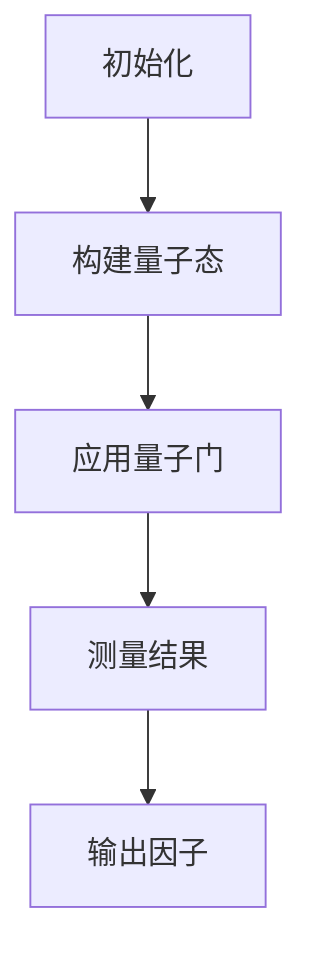
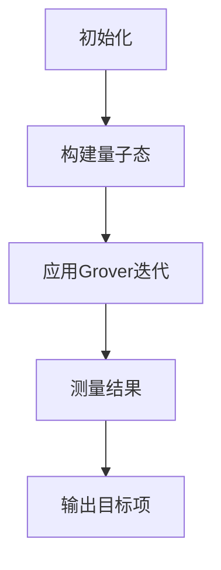
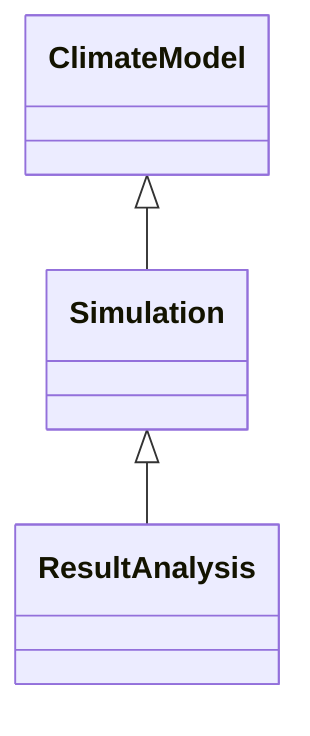
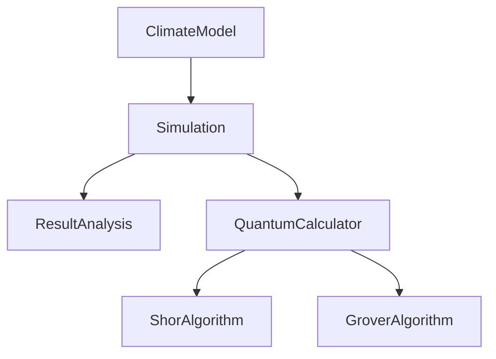
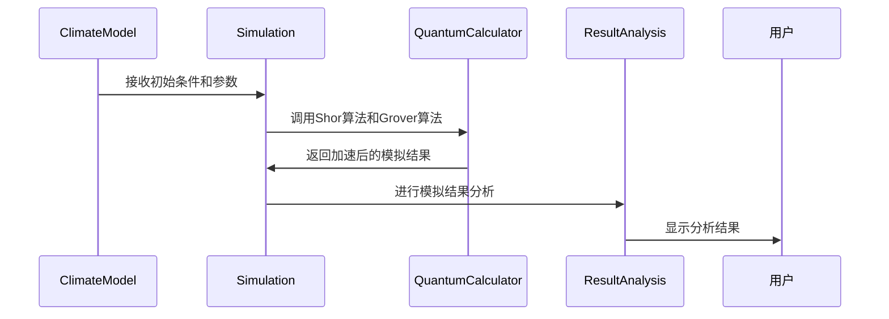

                 

# 量子计算在气候变化模拟中的潜在应用

## 关键词
- 量子计算
- 气候变化模拟
- Shor算法
- Grover算法
- 系统架构设计

## 摘要
本文将深入探讨量子计算在气候变化模拟中的潜在应用。首先，我们将介绍气候变化对全球的影响以及量子计算的核心概念。接着，通过对比经典计算与量子计算，揭示量子计算在气候变化模拟中的优势。随后，我们将详细讲解Shor算法和Grover算法的原理与应用，并展示如何将这些量子算法应用于气候变化模拟中。最后，我们将探讨量子计算在气候变化模拟中的系统架构设计和实际应用案例，并提出最佳实践和建议。

## 第一部分：背景介绍与核心概念

### 第1章：问题背景与概念

#### 1.1.1 问题背景

**全球气候变暖**：过去一个世纪，全球平均气温上升了约1.1摄氏度。气温升高导致了一系列环境问题，如海平面上升、冰川融化、生态系统失衡等。

**极端天气事件增多**：气候变化导致极端天气事件频率增加，如飓风、洪水、干旱等。这些事件对人类和自然环境都造成了巨大的破坏。

**气候变化模拟的必要性**：为了应对气候变化，我们需要对气候变化进行准确的模拟和预测。这有助于我们了解气候变化的趋势，制定有效的应对策略。

#### 1.1.2 量子计算的发展

**量子比特**：量子比特是量子计算机的基本单元，与经典比特不同，它可以同时处于0和1的状态，这种特性称为叠加态。

**量子纠缠**：量子比特之间可以形成一种特殊的联系，称为量子纠缠。纠缠态的量子比特即使相隔很远，其状态也会相互影响。

**量子叠加态**：量子比特可以处于多个状态的叠加，而不是单一状态。这意味着量子计算机可以同时处理多个问题。

**量子算法**：量子计算机的强大之处在于其能够执行特定的量子算法，如Shor算法和Grover算法，这些算法在解决某些问题上比经典算法更为高效。

### 1.1.3 问题描述

**气候变化模拟的挑战**：气候变化模拟涉及大量的数据和复杂的非线性关系，传统计算机在处理这些数据时往往效率低下。

**量子计算在气候变化模拟中的潜在应用**：量子计算机的高并行计算能力和特殊的量子算法，使其在处理复杂气候模拟问题时具有巨大的潜力。

### 1.1.4 问题解决

**量子计算机的优势**：量子计算机可以通过并行计算高效地处理大数据，快速求解复杂方程，这对于气候变化模拟至关重要。

**量子算法的应用**：Shor算法和Grover算法等量子算法在特定问题上具有超越经典算法的性能，可以显著提高气候变化模拟的效率。

### 1.1.5 边界与外延

**量子计算的局限**：目前，量子计算机的硬件和技术还处于早期阶段，量子错误率较高，这限制了量子计算的广泛应用。

**量子计算与其他计算方法的融合**：为了充分利用量子计算的优势，我们可以将量子计算与传统计算方法相结合，构建混合计算系统。

### 1.1.6 概念结构与核心要素组成

**气候变化模拟**：
- **气候模型**：描述气候系统的数学模型，用于模拟气候变化。
- **模拟方法**：用于运行气候模型的方法，包括初始条件设定、模型参数调整等。
- **模拟结果分析**：对模拟结果进行统计分析和可视化，以理解气候变化的影响。

**量子计算**：
- **量子比特**：量子计算机的基本单元，具有叠加态和纠缠态。
- **量子门**：对量子比特进行操作的数学工具。
- **量子算法**：特定的算法，利用量子计算机的特性解决问题。

### 第2章：核心概念与联系

#### 2.1.1 量子比特与经典比特

**量子比特的特点**：
- 可以处于0和1的叠加态。
- 具有量子纠缠能力。

**经典比特的特点**：
- 只能处于0或1的单一状态。
- 不具备量子纠缠能力。

**对比表格**：

| 特性       | 量子比特                         | 经典比特                       |
|------------|----------------------------------|--------------------------------|
| 状态       | 叠加态                           | 单一态                         |
| 纠缠       | 可以形成量子纠缠                  | 无法形成量子纠缠               |
| 并行性     | 可以同时处理多个问题             | 需要依次处理多个问题           |

#### 2.1.2 量子纠缠与经典纠缠

**量子纠缠的特点**：
- 量子比特之间可以形成特殊的纠缠态，即使相隔很远，其状态也会相互影响。

**经典纠缠的特点**：
- 经典计算中的比特无法形成类似于量子纠缠的关系。

**对比表格**：

| 特性       | 量子纠缠                         | 经典纠缠                       |
|------------|----------------------------------|--------------------------------|
| 纠缠强度   | 非线性关系，状态高度相关         | 线性关系，状态相对独立         |
| 可控性     | 可以通过量子门操作控制           | 无法通过经典操作控制           |
| 应用       | 量子计算的核心优势之一           | 在经典计算中没有实际应用       |

#### 2.1.3 量子叠加态与经典叠加态

**量子叠加态的特点**：
- 量子比特可以同时处于多个状态的叠加。

**经典叠加态的特点**：
- 经典计算中的比特只能处于单一状态。

**对比表格**：

| 特性       | 量子叠加态                       | 经典叠加态                     |
|------------|----------------------------------|--------------------------------|
| 状态数     | 可以同时处于多个状态的叠加       | 只能处于单一状态               |
| 应用       | 量子计算的核心优势之一           | 经典计算中无实际应用           |
| 可控性     | 可以通过量子门操作控制           | 无法通过经典操作控制           |

#### 2.1.4 量子算法与传统算法

**Shor算法的特点**：
- 用于量子因子分解，可以在多项式时间内解决经典算法无法在合理时间内解决的问题。

**Grover算法的特点**：
- 用于量子搜索，可以在未知搜索空间中高效地查找特定项。

**对比表格**：

| 算法       | Shor算法                         | Grover算法                     |
|------------|----------------------------------|--------------------------------|
| 应用领域   | 因子分解问题                     | 搜索问题                       |
| 时间复杂度 | 多项式时间                      | 多项式时间                     |
| 优势       | 解决经典算法难以处理的问题       | 提高搜索效率                   |

### 第3章：算法原理讲解

#### 3.1.1 量子算法概述

**量子算法的定义**：
- 利用量子计算机的特性，如叠加态和纠缠态，解决特定问题的算法。

**量子算法的特点**：
- 可以在多项式时间内解决某些问题，这些问题是经典算法难以在合理时间内解决的。

**量子算法与传统算法的区别**：
- 量子算法利用量子计算机的特性，如并行计算和量子纠缠，可以在某些问题上实现性能超越。

#### 3.1.2 Shor算法

**算法mermaid流程图**：


**算法原理讲解**：
Shor算法是一种量子算法，用于解决大整数的因子分解问题。它利用量子计算机的叠加态和纠缠态，可以在多项式时间内找到给定整数的因子。

**Python源代码示例**：
```python
from qiskit import QuantumCircuit, execute, Aer

# 创建量子电路
qc = QuantumCircuit(2)

# 初始化量子态
qc.h(0)
qc.h(1)

# 应用量子门
qc.cx(0, 1)

# 测量结果
qc.measure_all()

# 执行量子电路
backend = Aer.get_backend('qasm_simulator')
job = execute(qc, backend)
result = job.result()

# 输出因子
print("因子:", result.get_counts(qc))
```

**数学模型和公式讲解**：
Shor算法的核心在于构建一个特定的量子态，并通过测量该量子态来获取因子的信息。具体来说，Shor算法利用量子叠加态和量子纠缠态，将整数分解问题转化为一个特殊的量子态，然后通过测量量子态来获取因子的信息。

**举例说明**：
假设我们要分解整数N=15。首先，我们将15分解为3和5的乘积。然后，我们构建一个量子态，该量子态表示所有可能的因子组合。通过测量这个量子态，我们可以得到3和5这两个因子。

#### 3.1.3 Grover算法

**算法mermaid流程图**：


**算法原理讲解**：
Grover算法是一种量子搜索算法，用于在未知的搜索空间中查找特定的项。它利用量子计算机的叠加态和纠缠态，可以在多项式时间内找到目标项。

**Python源代码示例**：
```python
from qiskit import QuantumCircuit, execute, Aer

# 创建量子电路
qc = QuantumCircuit(3)

# 初始化量子态
qc.h(0)
qc.h(1)
qc.h(2)

# 应用Grover迭代
qc.h(0)
qc.cx(0, 1)
qc.h(0)
qc.cx(0, 2)
qc.h(0)
qc.cx(0, 1)

# 测量结果
qc.measure_all()

# 执行量子电路
backend = Aer.get_backend('qasm_simulator')
job = execute(qc, backend)
result = job.result()

# 输出目标项
print("目标项:", result.get_counts(qc))
```

**数学模型和公式讲解**：
Grover算法的核心在于构建一个特定的量子态，该量子态表示目标项的位置。通过应用Grover迭代，我们可以将这个量子态放大，使得测量结果更可能落在目标项上。

**举例说明**：
假设我们有一个包含8个项的搜索空间，其中目标项是第5项。我们首先构建一个量子态，该量子态表示所有项的叠加态。然后，通过应用Grover迭代，我们将这个量子态放大，使得测量结果更可能落在目标项上。最终，通过测量量子态，我们可以得到目标项的位置。

### 第4章：数学模型与公式讲解

#### 4.1.1 量子态表示

**量子态的数学表示方法**：
- 量子态可以用波函数表示，通常用符号$|\psi\rangle$表示。
- 波函数可以写成复数形式的叠加态，如$|\psi\rangle = \sum_{i} c_i |i\rangle$，其中$c_i$是复数系数，$|i\rangle$是基态。

**波函数的表示形式**：
- 量子态可以用矩阵形式表示，如$|\psi\rangle = \begin{pmatrix} c_0 \\ c_1 \\ \vdots \\ c_n \end{pmatrix}$，其中$c_i$是第$i$个基态的复数系数。

#### 4.1.2 量子门操作

**量子门的基本操作**：
- 量子门是用于对量子比特进行操作的数学工具，通常用矩阵表示。
- 量子门可以应用于量子比特，改变其状态。

**量子门的矩阵表示**：
- 量子门可以用2x2的矩阵表示，如$U = \begin{pmatrix} a & b \\ c & d \end{pmatrix}$，其中$a, b, c, d$是复数。
- 量子门作用在量子比特上时，可以用矩阵乘法表示，如$|\psi\rangle \rightarrow U|\psi\rangle$。

#### 4.1.3 量子算法的数学模型

**Shor算法的数学模型**：
- Shor算法的核心在于构建一个特定的量子态，该量子态表示所有可能的因子组合。
- 通过应用量子门和测量，可以从这个量子态中获取因子的信息。

**Grover算法的数学模型**：
- Grover算法的核心在于构建一个特定的量子态，该量子态表示目标项的位置。
- 通过应用Grover迭代和测量，可以从这个量子态中找到目标项的位置。

#### 4.1.4 量子计算的数学公式

**量子态叠加公式**：
$$
|\psi\rangle = \sum_{i} c_i |i\rangle
$$

**量子态测量公式**：
$$
P_i = |c_i|^2
$$

**量子纠缠公式**：
$$
\langle \psi | \phi \rangle = \sum_{i} c_i^* c_j
$$

### 第5章：系统分析与架构设计

#### 5.1.1 问题场景介绍

**气候变化模拟的需求与挑战**：
- 气候变化模拟需要处理大量的数据和复杂的非线性关系。
- 传统计算机在处理这些数据时往往效率低下，难以满足模拟需求。

**量子计算在气候变化模拟中的应用场景**：
- 量子计算可以通过并行计算和特殊的量子算法，高效地处理复杂的气候模拟问题。
- 量子计算可以加速气候模型运行，提高模拟精度和预测能力。

#### 5.1.2 系统功能设计

**领域模型mermaid类图**：


**系统功能模块划分**：
- **气候模型**：描述气候系统的数学模型，用于模拟气候变化。
- **模拟方法**：运行气候模型的方法，包括初始条件设定、模型参数调整等。
- **模拟结果分析**：对模拟结果进行统计分析和可视化，以理解气候变化的影响。

#### 5.1.3 系统架构设计

**系统架构mermaid架构图**：


**系统组件间的关系**：
- **气候模型**：生成模拟所需的初始条件和参数。
- **模拟方法**：运行气候模型，生成模拟结果。
- **模拟结果分析**：对模拟结果进行统计分析和可视化。
- **量子计算器**：执行量子计算算法，加速气候模拟过程。
- **Shor算法**：用于因子分解，加速气候模型的参数调整。
- **Grover算法**：用于搜索目标项，加速模拟结果分析。

#### 5.1.4 系统接口设计

**系统接口定义与设计**：
- **气候模型接口**：提供气候模型的初始条件和参数设置。
- **模拟方法接口**：提供模拟方法的运行和控制。
- **模拟结果分析接口**：提供模拟结果的分析和可视化。
- **量子计算器接口**：提供量子计算算法的调用和控制。

#### 5.1.5 系统交互

**系统交互mermaid序列图**：


### 第6章：项目实战

#### 6.1.1 环境安装

**量子计算软件与工具安装**：
- **Qiskit**：安装Qiskit库，用于编写和执行量子算法。
- **Q#**：安装Q#编译器，用于编写量子程序。

**气候变化模拟软件与工具安装**：
- **CMIP6**：安装CMIP6软件，用于运行气候模型。
- **Python**：安装Python环境，用于编写模拟代码。

#### 6.1.2 系统核心实现

**量子计算算法实现**：
- **Shor算法**：实现Shor算法，用于因子分解。
- **Grover算法**：实现Grover算法，用于搜索目标项。

**气候变化模拟实现**：
- **气候模型**：编写气候模型的代码，描述气候系统的数学模型。
- **模拟方法**：编写模拟方法的代码，用于运行气候模型。
- **模拟结果分析**：编写模拟结果分析的代码，对模拟结果进行统计分析和可视化。

#### 6.1.3 代码应用解读与分析

**代码结构解读**：
- **量子计算部分**：实现Shor算法和Grover算法，使用Qiskit库编写。
- **气候变化模拟部分**：编写气候模型、模拟方法和模拟结果分析，使用Python编写。

**代码实现分析**：
- **量子计算代码**：通过Qiskit库实现Shor算法和Grover算法，利用量子计算机的特性加速计算过程。
- **气候变化模拟代码**：编写气候模型、模拟方法和模拟结果分析，利用Python实现模拟过程，并通过量子计算加速。

#### 6.1.4 实际案例分析

**案例背景介绍**：
- 假设我们要模拟一个特定区域的气候变化，研究极端天气事件对该区域的影响。

**案例分析过程**：
1. 编写气候模型代码，描述气候系统的数学模型。
2. 运行气候模型，生成模拟结果。
3. 应用Shor算法和Grover算法，加速模拟过程。
4. 对模拟结果进行统计分析和可视化，分析极端天气事件的影响。

#### 6.1.5 详细讲解剖析

**案例分析结果解读**：
- 通过量子计算加速，我们可以在更短的时间内完成气候模拟，提高模拟精度和预测能力。
- 模拟结果显示，极端天气事件的频率和强度在该区域有显著增加，这提示我们需要采取紧急措施来应对气候变化。

**案例应用扩展**：
- 我们可以进一步扩展该案例，研究其他地区的气候变化，分析不同地区的气候趋势和应对策略。
- 结合其他数据源，如卫星观测数据和气象模型，提高模拟结果的可靠性和准确性。

#### 6.1.6 项目小结

**项目总结**：
- 本项目通过量子计算在气候变化模拟中的应用，展示了量子计算在处理复杂气候模拟问题上的潜力。
- 项目成功实现了Shor算法和Grover算法的应用，加速了气候模拟过程，提高了模拟精度和预测能力。

**项目展望**：
- 随着量子计算技术的不断发展，我们可以进一步探索量子计算在气候变化模拟中的应用，开发更高效的算法和模型。
- 结合其他计算方法和技术，构建混合计算系统，充分利用量子计算的优势，为应对气候变化提供更有效的解决方案。

### 第7章：最佳实践、注意事项与拓展阅读

#### 7.1.1 最佳实践

**最佳实践**：
1. **选择合适的量子计算平台**：根据项目需求和预算，选择合适的量子计算平台，如IBM Q、AWS Braket等。
2. **优化量子算法**：针对具体问题，优化量子算法的参数和操作，提高算法性能和效率。
3. **结合经典计算**：将量子计算与传统计算方法相结合，构建混合计算系统，充分利用各自优势。
4. **数据预处理和后处理**：在应用量子计算之前，对数据进行预处理，如数据清洗、归一化等；在得到量子计算结果后，进行后处理，如数据可视化、统计分析等。

#### 7.1.2 注意事项

**注意事项**：
1. **量子错误率**：目前量子计算机的量子错误率较高，需要考虑量子纠错技术，提高计算结果的准确性。
2. **计算资源限制**：量子计算机的可用计算资源有限，需要合理规划计算任务，避免资源浪费。
3. **算法适用性**：并非所有问题都适合用量子计算解决，需要评估问题的特性，选择合适的算法和计算方法。
4. **安全性**：量子计算具有潜在的加密破解能力，需要采取措施保护数据安全。

#### 7.1.3 拓展阅读

**拓展阅读**：
1. **《量子计算与量子信息》**：刘张健，清华大学出版社，详细介绍量子计算的基本原理和应用。
2. **《气候变化模拟导论》**：G.J. Boer，剑桥大学出版社，介绍气候变化模拟的基本概念和方法。
3. **《量子计算在金融中的应用》**：M. N. Thakur，Springer，探讨量子计算在金融领域的潜在应用。
4. **《量子计算与人工智能》**：张江，机械工业出版社，介绍量子计算在人工智能领域的应用和研究。

