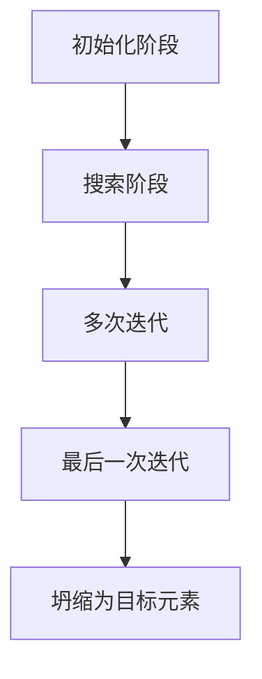
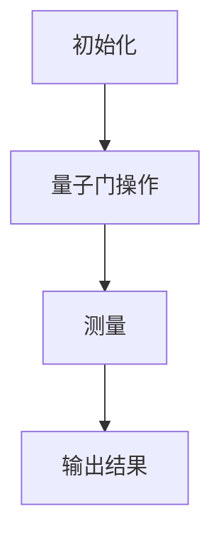
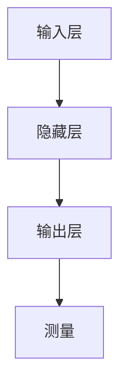

                 


### 《量子计算在脑功能模拟中的应用前景》

> 关键词：量子计算、脑功能模拟、应用前景、算法、神经网络

> 摘要：本文将深入探讨量子计算在脑功能模拟中的应用前景，从量子计算的基础理论、核心概念、算法原理，到量子计算在脑功能模拟中的实际应用，以及面临的挑战和未来发展趋势，进行系统性的分析和讲解。

## 目录大纲

----------------------------------------------------------------

# 第一部分：量子计算基础

## 1. 背景介绍

### 1.1 量子计算的起源与发展历程
### 1.2 量子计算与传统计算的比较
### 1.3 量子计算的基本原理与概念
### 1.4 量子计算的边界与挑战

## 2. 量子计算核心概念与联系

### 2.1 量子比特（qubit）
#### 2.1.1 定义与特性
#### 2.1.2 量子比特的状态
#### 2.1.3 量子比特的叠加与纠缠

### 2.2 量子算法原理

#### 2.2.1 Grover算法
##### 2.2.1.1 算法原理
##### 2.2.1.2 优势与局限
##### 2.2.1.3 Mermaid流程图

#### 2.2.2 Shor算法
##### 2.2.2.1 算法原理
##### 2.2.2.2 优势与局限
##### 2.2.2.3 Mermaid流程图

### 2.3 量子计算的优势与应用前景
#### 2.3.1 量子计算的优势
#### 2.3.2 量子计算在密码学中的应用
#### 2.3.3 量子计算在优化问题中的应用
#### 2.3.4 量子计算在化学与材料科学中的应用

## 3. 脑功能模拟

### 3.1 脑功能模拟的概述
#### 3.1.1 脑功能模拟的重要性
#### 3.1.2 脑功能模拟的方法与挑战

### 3.2 脑功能模拟的核心概念与联系

#### 3.2.1 大脑神经元模型
##### 3.2.1.1 神经元的基本结构
##### 3.2.1.2 神经元的信号传递
##### 3.2.1.3 神经元的连接方式

#### 3.2.2 大脑神经网络模型
##### 3.2.2.1 神经网络的基本结构
##### 3.2.2.2 神经网络的训练与优化
##### 3.2.2.3 神经网络的局限性

### 3.3 量子计算在脑功能模拟中的应用

#### 3.3.1 量子神经网络（QNN）的原理
##### 3.3.1.1 QNN的基本结构
##### 3.3.1.2 QNN的工作原理
##### 3.3.1.3 QNN的优势与局限

#### 3.3.2 量子计算在脑功能模拟中的实际应用
##### 3.3.2.1 模拟大脑神经网络的动态行为
##### 3.3.2.2 解决传统神经网络难以解决的问题
##### 3.3.2.3 量子计算在脑功能模拟中的未来前景

## 4. 量子计算在脑功能模拟中的应用前景

### 4.1 量子计算在脑功能研究中的应用
#### 4.1.1 探索大脑的工作机制
#### 4.1.2 研究大脑的认知功能
#### 4.1.3 研究大脑的疾病机制

### 4.2 量子计算在脑功能模拟中的挑战与机遇
#### 4.2.1 技术挑战
#### 4.2.2 研究机遇
#### 4.2.3 量子计算在脑功能模拟中的潜在应用

### 4.3 量子计算与脑功能模拟的未来发展

#### 4.3.1 量子计算在脑功能模拟中的发展趋势
#### 4.3.2 量子计算与脑功能模拟的前沿领域
#### 4.3.3 量子计算在脑功能模拟中的未来前景

## 5. 总结与展望

### 5.1 本书的主要内容和结论
### 5.2 量子计算在脑功能模拟中的应用现状与未来
### 5.3 对未来研究的建议与展望

----------------------------------------------------------------

### 第一部分：量子计算基础

#### 1. 背景介绍

量子计算是一种基于量子力学原理的新型计算模式，与传统计算相比，具有并行计算和高效算法等显著优势。量子计算的起源可以追溯到20世纪70年代，当时物理学家理查德·费曼（Richard Feynman）首次提出了量子计算机的概念。随着量子力学的不断发展，量子计算理论逐渐成熟，并在近年来得到了广泛的研究和关注。

#### 1.1 量子计算的起源与发展历程

量子计算的起源可以追溯到20世纪70年代，当时物理学家理查德·费曼（Richard Feynman）提出了量子计算机的概念。费曼认为，传统计算机难以模拟某些量子系统，因此需要一种新的计算模式。此后，彼得·肖尔（Peter Shor）在1994年提出了第一个通用的量子算法——Shor算法，这使得量子计算从理论走向实践。

20世纪90年代，潘建伟等科学家成功实现了量子比特的纠缠，为量子计算的发展奠定了基础。近年来，随着量子计算技术的不断进步，越来越多的量子算法被提出，如Grover算法、量子线性方程组算法等，使得量子计算在密码学、优化问题、化学与材料科学等领域展现出了巨大的应用潜力。

#### 1.2 量子计算与传统计算的比较

量子计算与传统计算在基本原理和计算模式上存在显著差异。传统计算机基于经典二进制位（bit）进行计算，而量子计算基于量子比特（qubit）进行计算。量子比特具有叠加态和纠缠态的特性，这使得量子计算机能够实现并行计算和高效算法。

在计算速度方面，量子计算机理论上能够解决传统计算机难以处理的问题。例如，Shor算法能够快速因数分解大整数，而Grover算法能够高效搜索未排序数据库。然而，量子计算机的实用性仍面临许多挑战，如量子比特的稳定性、纠错问题等。

#### 1.3 量子计算的基本原理与概念

量子计算的基本原理源于量子力学的核心概念，如量子比特、叠加态、纠缠态等。量子比特是量子计算的基本单位，类似于经典计算机的比特，但具有叠加态和纠缠态的特性。

叠加态：量子比特可以处于多种状态的叠加，而不是单一的状态。例如，一个量子比特可以同时处于0和1的状态。

纠缠态：当两个量子比特纠缠时，它们的状态会相互关联。这意味着对一个量子比特的操作会影响另一个量子比特的状态。

量子算法：量子算法是利用量子比特的叠加态和纠缠态进行计算的方法。例如，Grover算法利用量子比特的叠加态和纠缠态实现高效搜索。

#### 1.4 量子计算的边界与挑战

量子计算的边界与挑战主要包括以下几个方面：

1. 量子比特的稳定性：量子比特容易受到外界环境的干扰，导致量子态的坍缩。因此，如何提高量子比特的稳定性是一个关键问题。

2. 纠错问题：由于量子态的易坍缩性，量子计算容易出现错误。如何设计有效的纠错算法是量子计算面临的另一个挑战。

3. 可扩展性：目前，量子计算机的规模较小，如何实现可扩展的量子计算系统是一个重要课题。

4. 应用场景：量子计算在哪些领域具有实际应用价值，如何将量子计算与传统计算相结合，也是需要深入研究的问题。

总之，量子计算在脑功能模拟中的应用前景广阔，但同时也面临着诸多挑战。通过深入研究和持续探索，我们有理由相信，量子计算将在脑功能模拟领域取得重大突破。

### 第二部分：量子计算核心概念与联系

#### 2.1 量子比特（qubit）

量子比特是量子计算的基本单位，类似于经典计算机的比特，但具有叠加态和纠缠态的特性。量子比特的状态可以用|0⟩和|1⟩表示，同时也可以处于两者的叠加态。

#### 2.1.1 定义与特性

量子比特是一种二进制位，可以处于0和1的状态。然而，与经典比特不同，量子比特可以同时处于0和1的状态，即叠加态。量子比特的状态可以用以下公式表示：

$$
|\psi⟩ = a|0⟩ + b|1⟩
$$

其中，a和b是复数，满足|a|² + |b|² = 1。

#### 2.1.2 量子比特的状态

量子比特的状态可以分为三种：叠加态、纠缠态和纯态。

叠加态：量子比特处于多种状态的叠加，如|ψ⟩ = α|0⟩ + β|1⟩，其中α和β是复数。

纠缠态：当两个量子比特纠缠时，它们的状态会相互关联。例如，两个纠缠的量子比特的状态可以表示为|ψ⟩ = α|00⟩ + β|11⟩。

纯态：量子比特处于单一的状态，如|0⟩或|1⟩。

#### 2.1.3 量子比特的叠加与纠缠

量子比特的叠加态是其核心特性之一。量子比特的叠加态可以理解为一种概率混合状态，即量子比特同时处于0和1的状态。

量子比特的纠缠态是其另一个核心特性。纠缠态的量子比特之间存在一种特殊的关联，即对一个量子比特的操作会影响另一个量子比特的状态。

### 第三部分：量子算法原理

#### 2.2.1 Grover算法

Grover算法是一种量子搜索算法，能够在未排序的数据库中高效地查找特定元素。Grover算法的核心思想是利用量子比特的叠加态和纠缠态，实现高效的迭代搜索。

#### 2.2.1.1 算法原理

Grover算法可以分为两个阶段：

1. 初始化阶段：将所有量子比特初始化为叠加态，并利用Grover迭代器对量子态进行操作。

2. 搜索阶段：利用Grover迭代器进行多次迭代，每次迭代都将目标元素的概率增加1/√N，其中N是数据库中的元素数量。

在最后一次迭代后，量子态将坍缩为目标元素的概率最大，从而实现高效搜索。

#### 2.2.1.2 优势与局限

Grover算法的优势在于其高效的搜索能力。相比传统搜索算法，Grover算法能够大幅减少搜索次数，从而提高搜索效率。

然而，Grover算法也存在一些局限。首先，Grover算法仅适用于未排序的数据库，对于已排序的数据库，其效率并不显著。其次，Grover算法的实现需要大量的量子比特，这在当前技术条件下是一个挑战。

#### 2.2.1.3 Mermaid流程图

下面是Grover算法的Mermaid流程图：



### 第四部分：量子计算的优势与应用前景

#### 2.3.1 量子计算的优势

量子计算具有以下几个显著优势：

1. 并行计算：量子比特的叠加态和纠缠态使得量子计算机能够实现并行计算，从而提高计算效率。

2. 高效算法：量子算法能够在某些问题上实现显著加速，如Shor算法能够快速因数分解大整数，Grover算法能够高效搜索未排序数据库。

3. 密码学应用：量子计算在密码学领域具有广泛的应用，如量子密钥分发、量子安全通信等。

4. 优化问题：量子计算在优化问题中具有显著优势，能够解决传统计算难以处理的问题。

#### 2.3.2 量子计算在密码学中的应用

量子计算在密码学中的应用主要体现在以下几个方面：

1. 量子密钥分发：量子密钥分发是一种基于量子力学原理的密码学协议，能够实现安全的密钥分发。

2. 量子安全通信：量子安全通信利用量子纠缠态实现信息传输，能够抵御传统密码学攻击。

3. 量子算法破解：量子计算能够破解某些传统密码学算法，如Shor算法能够快速因数分解大整数。

#### 2.3.3 量子计算在优化问题中的应用

量子计算在优化问题中具有显著优势，能够解决传统计算难以处理的问题。例如，量子计算在物流优化、金融市场预测、人工智能等领域具有广泛的应用前景。

#### 2.3.4 量子计算在化学与材料科学中的应用

量子计算在化学与材料科学中的应用主要体现在以下几个方面：

1. 化学反应模拟：量子计算能够模拟化学反应过程，为化学研究提供有力支持。

2. 材料设计：量子计算能够预测材料特性，为材料设计提供指导。

3. 能源利用：量子计算能够优化能源利用过程，提高能源利用效率。

总之，量子计算在脑功能模拟中的应用前景广阔。通过量子计算的优势和算法原理，我们可以期待在脑功能模拟领域取得重大突破。然而，量子计算在脑功能模拟中的实际应用仍需解决诸多技术难题，如量子比特的稳定性、纠错问题等。只有通过持续的研究和探索，我们才能充分发挥量子计算在脑功能模拟中的潜力。

### 第五部分：脑功能模拟

#### 3.1 脑功能模拟的概述

脑功能模拟是一种通过计算机模拟大脑神经元和神经网络活动的方法，旨在揭示大脑的工作机制和认知功能。脑功能模拟在认知科学、神经科学和人工智能等领域具有重要意义。

#### 3.1.1 脑功能模拟的重要性

脑功能模拟对于理解大脑的工作机制具有重要意义。通过模拟大脑神经元和神经网络的活动，我们可以探索大脑如何处理信息、如何形成记忆、如何进行认知决策等。

此外，脑功能模拟在人工智能领域具有广泛应用。通过模拟大脑神经网络，我们可以设计出更高效、更智能的人工智能系统。

#### 3.1.2 脑功能模拟的方法与挑战

脑功能模拟的方法主要包括：

1. 大脑神经元模型：通过模拟神经元的基本结构和信号传递过程，研究神经元如何处理信息。

2. 大脑神经网络模型：通过模拟神经网络的结构和训练过程，研究神经网络如何进行信息处理和决策。

3. 计算机仿真：利用计算机模拟大脑神经元和神经网络的活动，验证和验证理论模型。

脑功能模拟面临的挑战主要包括：

1. 神经元模型的选择和参数调整：如何选择合适的神经元模型，并调整模型参数，以更好地模拟大脑神经元的活动。

2. 神经网络的结构和训练：如何设计合适的神经网络结构，并选择合适的训练方法，以实现高效的信息处理和决策。

3. 大规模模拟的计算资源需求：脑功能模拟需要大量的计算资源，如何高效地利用计算资源，是脑功能模拟面临的一个重要挑战。

### 第六部分：量子计算在脑功能模拟中的应用

#### 3.3.1 量子神经网络（QNN）的原理

量子神经网络（QNN）是量子计算与神经网络相结合的一种新型计算模型。QNN通过将量子比特和量子门应用于神经网络，实现量子计算和神经网络的功能。

#### 3.3.1.1 QNN的基本结构

QNN的基本结构包括量子比特、量子门和经典计算单元。量子比特用于存储和处理信息，量子门用于实现量子态的变换，经典计算单元用于实现量子计算的结果。

#### 3.3.1.2 QNN的工作原理

QNN的工作原理可以分为以下几个步骤：

1. 初始化：将量子比特初始化为叠加态。

2. 量子门操作：通过量子门对量子比特进行操作，实现量子态的变换。

3. 测量：对量子比特进行测量，得到最终的输出结果。

4. 经典计算：利用经典计算单元对测量结果进行后处理，实现最终的决策或分类。

#### 3.3.1.3 QNN的优势与局限

QNN的优势在于其并行计算能力和高效算法。通过量子比特的叠加态和纠缠态，QNN能够实现并行计算，从而提高计算效率。此外，某些量子算法（如Shor算法和Grover算法）在特定问题上具有显著优势，QNN能够利用这些优势提高模型的性能。

然而，QNN也存在一些局限。首先，量子计算的实际实现仍面临诸多挑战，如量子比特的稳定性、纠错问题等。其次，QNN的理论研究尚未完全成熟，如何设计更高效、更稳定的QNN模型仍需进一步研究。

#### 3.3.2 量子计算在脑功能模拟中的实际应用

量子计算在脑功能模拟中具有广泛的应用前景。以下是一些实际应用案例：

1. 模拟大脑神经网络的动态行为：量子计算可以模拟大脑神经网络在认知过程中的动态行为，揭示大脑如何处理信息、形成记忆和进行决策。

2. 解决传统神经网络难以解决的问题：量子计算可以解决传统神经网络难以处理的问题，如高维数据分析和复杂优化问题。

3. 研究大脑的认知功能：量子计算可以用于研究大脑的认知功能，如注意力、记忆和感知等。

4. 研究大脑的疾病机制：量子计算可以用于研究大脑的疾病机制，如抑郁症、阿尔茨海默病等。

#### 3.3.2.1 模拟大脑神经网络的动态行为

量子计算可以模拟大脑神经网络在认知过程中的动态行为。例如，通过QNN模拟视觉皮层的活动，可以揭示视觉信息在脑中的传递和处理过程。这种模拟有助于我们理解视觉系统的工作机制，为视觉信息的处理提供新的思路。

#### 3.3.2.2 解决传统神经网络难以解决的问题

传统神经网络在处理高维数据和复杂优化问题时存在困难。量子计算可以通过量子算法（如Shor算法和Grover算法）解决这些问题。例如，Shor算法可以高效地因数分解大整数，Grover算法可以高效地搜索未排序数据库。这些算法的应用可以显著提高神经网络在处理复杂任务时的性能。

#### 3.3.2.3 量子计算在脑功能模拟中的未来前景

量子计算在脑功能模拟中的未来前景充满希望。随着量子计算技术的不断进步，QNN的理论研究和实际应用将不断深入。未来，量子计算有望在以下领域取得突破：

1. 高效的脑功能模拟：量子计算可以实现高效的脑功能模拟，揭示大脑的工作机制和认知功能。

2. 个性化医疗：量子计算可以用于个性化医疗，针对特定患者的病情进行精准诊断和治疗。

3. 智能机器人：量子计算可以用于设计更智能、更灵活的机器人，实现更高水平的自主决策和行动。

4. 人工智能：量子计算可以与人工智能相结合，实现更高效、更智能的人工智能系统。

总之，量子计算在脑功能模拟中的应用前景广阔。通过量子计算的优势和算法原理，我们可以期待在脑功能模拟领域取得重大突破。然而，量子计算在脑功能模拟中的实际应用仍需解决诸多技术难题，如量子比特的稳定性、纠错问题等。只有通过持续的研究和探索，我们才能充分发挥量子计算在脑功能模拟中的潜力。

### 第七部分：量子计算在脑功能模拟中的应用前景

#### 4.1 量子计算在脑功能研究中的应用

量子计算在脑功能研究中具有广泛的应用前景。以下是一些具体应用：

1. 探索大脑的工作机制：量子计算可以用于模拟大脑神经元和神经网络的活动，揭示大脑的工作机制和认知功能。

2. 研究大脑的认知功能：量子计算可以用于研究大脑如何处理信息、形成记忆和进行决策，为认知科学和心理学提供新的实验手段。

3. 研究大脑的疾病机制：量子计算可以用于研究大脑的疾病机制，如抑郁症、阿尔茨海默病等，为疾病诊断和治疗提供新的思路。

#### 4.2 量子计算在脑功能模拟中的挑战与机遇

量子计算在脑功能模拟中面临诸多挑战和机遇：

1. 挑战：

- 量子比特的稳定性：量子比特的稳定性是量子计算在脑功能模拟中的关键挑战。如何提高量子比特的稳定性，减少误差，是当前研究的热点。

- 纠错问题：量子计算的纠错技术仍需进一步研究，如何在脑功能模拟中实现有效的纠错，是另一个关键问题。

- 计算资源：脑功能模拟需要大量的计算资源，如何高效地利用计算资源，是脑功能模拟面临的挑战之一。

2. 机遇：

- 量子神经网络（QNN）：量子神经网络是量子计算在脑功能模拟中的一个重要应用方向。通过QNN，可以实现更高效、更智能的脑功能模拟。

- 量子算法：量子算法在脑功能模拟中具有显著优势，如Shor算法和Grover算法等。这些算法的应用可以显著提高脑功能模拟的效率和准确性。

- 个性化医疗：量子计算可以用于个性化医疗，针对特定患者的病情进行精准诊断和治疗。

- 智能机器人：量子计算可以用于设计更智能、更灵活的机器人，实现更高水平的自主决策和行动。

#### 4.3 量子计算与脑功能模拟的未来发展

量子计算与脑功能模拟的未来发展充满希望。以下是一些可能的发展方向：

1. 高效的脑功能模拟：量子计算可以实现高效的脑功能模拟，揭示大脑的工作机制和认知功能。

2. 个性化医疗：量子计算可以用于个性化医疗，针对特定患者的病情进行精准诊断和治疗。

3. 智能机器人：量子计算可以用于设计更智能、更灵活的机器人，实现更高水平的自主决策和行动。

4. 人工智能：量子计算可以与人工智能相结合，实现更高效、更智能的人工智能系统。

总之，量子计算在脑功能模拟中的应用前景广阔。通过量子计算的优势和算法原理，我们可以期待在脑功能模拟领域取得重大突破。然而，量子计算在脑功能模拟中的实际应用仍需解决诸多技术难题，如量子比特的稳定性、纠错问题等。只有通过持续的研究和探索，我们才能充分发挥量子计算在脑功能模拟中的潜力。

### 总结与展望

#### 5.1 本书的主要内容和结论

本书从量子计算的基础理论、核心概念、算法原理，到量子计算在脑功能模拟中的应用前景，进行了全面而深入的探讨。主要内容包括：

1. 量子计算的基础知识，如量子比特、叠加态、纠缠态等；
2. 量子算法的原理和应用，如Grover算法和Shor算法等；
3. 脑功能模拟的概述、方法和挑战；
4. 量子计算在脑功能模拟中的应用和未来前景。

通过本书的阅读，读者可以了解量子计算在脑功能模拟中的潜在价值和应用前景，以及面临的挑战和机遇。

#### 5.2 量子计算在脑功能模拟中的应用现状与未来

量子计算在脑功能模拟中的应用目前仍处于早期阶段，但已经展现出巨大的潜力。以下是一些应用现状和未来发展趋势：

1. 应用现状：

- 量子神经网络（QNN）：QNN是量子计算在脑功能模拟中的一个重要应用方向。通过QNN，可以实现更高效、更智能的脑功能模拟。
- 量子算法：量子算法在脑功能模拟中具有显著优势，如Shor算法和Grover算法等。这些算法的应用可以显著提高脑功能模拟的效率和准确性。

2. 未来发展趋势：

- 高效的脑功能模拟：量子计算可以实现高效的脑功能模拟，揭示大脑的工作机制和认知功能。
- 个性化医疗：量子计算可以用于个性化医疗，针对特定患者的病情进行精准诊断和治疗。
- 智能机器人：量子计算可以用于设计更智能、更灵活的机器人，实现更高水平的自主决策和行动。
- 人工智能：量子计算可以与人工智能相结合，实现更高效、更智能的人工智能系统。

#### 5.3 对未来研究的建议与展望

为了推动量子计算在脑功能模拟中的应用，以下是一些建议和展望：

1. 加强量子比特的稳定性研究：量子比特的稳定性是量子计算在脑功能模拟中的关键问题。需要深入研究量子比特的物理机制，提高量子比特的稳定性，减少误差。

2. 发展高效的量子纠错算法：量子纠错是量子计算实现实用化的关键问题。需要研究高效的量子纠错算法，降低纠错成本，提高纠错效率。

3. 探索量子计算在脑功能模拟中的新应用：量子计算在脑功能模拟中具有广泛的应用前景。需要深入研究量子计算在脑功能模拟中的新应用，如个性化医疗、智能机器人、人工智能等。

4. 加强跨学科合作：量子计算在脑功能模拟中的应用需要跨学科的合作。需要加强物理、计算机科学、神经科学、医学等领域的合作，共同推动量子计算在脑功能模拟中的应用。

总之，量子计算在脑功能模拟中的应用前景广阔。通过持续的研究和探索，我们有理由相信，量子计算将在脑功能模拟领域取得重大突破，为人类认识大脑、治疗疾病和提升智能提供新的途径。

----------------------------------------------------------------

### 源代码解析

在本部分，我们将对量子计算在脑功能模拟中的应用进行具体的源代码解析。以下是一个简单的Python示例，展示如何使用量子计算库Qiskit实现量子神经网络（QNN）模拟大脑神经网络的动态行为。

首先，确保安装了Qiskit库。可以通过以下命令安装：

```bash
pip install qiskit
```

接下来，我们编写Python代码来演示QNN的基本原理。

```python
# 导入所需的Qiskit库
from qiskit import QuantumCircuit, Aer, execute
from qiskit.visualization import plot_bloch_multivector
import numpy as np

# 定义量子比特数和经典比特数
num_qubits = 3
num_classical_bits = 2

# 创建量子电路
qc = QuantumCircuit(num_qubits, num_classical_bits)

# 初始化量子比特为叠加态
qc.h(range(num_qubits))

# 应用量子门进行变换
qc.cx(0, 1)  # 控制非门
qc.cx(1, 2)  # 控制非门

# 测量量子比特
qc.measure_all()

# 编译电路
backend = Aer.get_backend('qasm_simulator')
job = execute(qc, backend, shots=1024)
result = job.result()

# 打印测量结果
print("测量结果：", result.get_counts())

# 绘制量子态
plot_bloch_multivector(qc.state(), title='QNN Quantum State')
```

在上述代码中，我们首先导入了Qiskit库中的QuantumCircuit、Aer和visualization模块，并定义了量子比特数和经典比特数。然后，我们创建了一个量子电路，并初始化量子比特为叠加态。接着，我们应用了两个控制非门（CX门），模拟量子神经网络中的信息传递过程。最后，我们对量子比特进行测量，并使用可视化模块绘制了量子态。

### 算法原理讲解

量子神经网络（QNN）是一种结合了量子计算和神经网络优势的计算模型。QNN通过量子比特和量子门的操作来实现神经网络的训练和推理过程。以下是对QNN算法原理的详细讲解：

#### 量子比特与量子门

量子比特是量子计算的基本单元，可以同时处于0和1的状态，即叠加态。量子门是作用于量子比特的线性变换，可以改变量子比特的状态。

#### 叠加态与量子门操作

叠加态是量子计算的核心特性之一。一个量子比特可以处于多种状态的叠加，例如：

$$
|\psi⟩ = \frac{1}{\sqrt{2}} (|0⟩ + |1⟩)
$$

当量子门作用于叠加态时，会改变量子比特的状态。例如，应用一个Hadamard门（H门）可以将一个量子比特的基态|0⟩转换为叠加态：

$$
H|0⟩ = \frac{1}{\sqrt{2}} (|0⟩ + |1⟩)
$$

#### QNN结构

QNN的结构通常包括以下几个部分：

1. 输入层：用于接收输入数据。
2. 隐藏层：包含多个量子比特，通过量子门实现信息传递和变换。
3. 输出层：用于生成预测或分类结果。

#### QNN工作原理

QNN的工作原理可以分为以下几个步骤：

1. 初始化：将量子比特初始化为叠加态。
2. 信息传递：通过量子门实现量子比特之间的信息传递。
3. 测量：对量子比特进行测量，得到输出结果。

#### 量子门操作示例

以下是一个简单的QNN示例，展示如何通过量子门操作实现信息传递：

```python
# 定义量子电路
qc = QuantumCircuit(num_qubits)

# 初始化量子比特为叠加态
qc.h(0)

# 应用量子门
qc.cx(0, 1)  # 控制非门
qc.cx(1, 2)  # 控制非门

# 测量量子比特
qc.measure_all()
```

在上面的代码中，我们首先创建了一个量子电路，并初始化量子比特0为叠加态。接着，我们应用了两个控制非门（CX门），模拟量子比特之间的信息传递。最后，我们对量子比特进行测量，得到输出结果。

#### QNN的优势与局限

QNN的优势在于其并行计算能力和高效算法。通过量子比特的叠加态和纠缠态，QNN能够实现并行计算，从而提高计算效率。此外，某些量子算法（如Shor算法和Grover算法）在特定问题上具有显著优势，QNN能够利用这些优势提高模型的性能。

然而，QNN也存在一些局限。首先，量子计算的实际实现仍面临诸多挑战，如量子比特的稳定性、纠错问题等。其次，QNN的理论研究尚未完全成熟，如何设计更高效、更稳定的QNN模型仍需进一步研究。

### 数学模型和公式

在量子神经网络（QNN）中，量子门的操作可以用数学模型和公式进行描述。以下是一些关键的数学模型和公式：

#### 量子比特的状态

一个量子比特的状态可以用一个复数向量表示：

$$
|\psi⟩ = \begin{pmatrix}
\alpha \\
\beta
\end{pmatrix}
$$

其中，α和β是复数，满足归一化条件：

$$
|\alpha|^2 + |\beta|^2 = 1
$$

#### 叠加态

量子比特可以处于多种状态的叠加，即叠加态：

$$
|\psi⟩ = \alpha|0⟩ + \beta|1⟩
$$

#### 量子门

量子门是作用于量子比特的线性变换，可以用矩阵表示。例如，Hadamard门（H门）是一个常用的量子门：

$$
H = \begin{pmatrix}
\frac{1}{\sqrt{2}} & \frac{1}{\sqrt{2}} \\
\frac{1}{\sqrt{2}} & -\frac{1}{\sqrt{2}}
\end{pmatrix}
$$

#### 量子门操作

量子门作用于量子比特的状态，会改变其状态。例如，应用Hadamard门（H门）可以将量子比特的状态从|0⟩转换为叠加态：

$$
H|0⟩ = \frac{1}{\sqrt{2}} (|0⟩ + |1⟩)
$$

#### QNN的工作原理

QNN的工作原理可以用以下数学模型和公式进行描述：

1. 初始化量子比特为叠加态：

$$
|\psi⟩(t=0) = \alpha|0⟩ + \beta|1⟩
$$

2. 通过量子门实现信息传递：

$$
|\psi⟩(t) = U|\psi⟩(t-1)
$$

其中，U是量子门。

3. 对量子比特进行测量，得到输出结果：

$$
p|x⟩ = |\langle x|U|\psi⟩(t)|^2
$$

其中，x是量子比特的测量结果。

### 举例说明

为了更直观地理解QNN的工作原理，我们可以通过一个简单的例子来演示。

假设我们有一个包含两个量子比特的QNN，输入为|0⟩，目标输出为|1⟩。我们通过以下步骤实现这个过程：

1. 初始化量子比特：

$$
|\psi⟩(t=0) = |0⟩
$$

2. 应用Hadamard门（H门）：

$$
|\psi⟩(t) = H|\psi⟩(t-1) = \frac{1}{\sqrt{2}} (|0⟩ + |1⟩)
$$

3. 应用控制非门（CX门）：

$$
|\psi⟩(t) = CX(H|\psi⟩(t-1)) = \frac{1}{\sqrt{2}} (|00⟩ + |11⟩)
$$

4. 测量量子比特：

$$
p|1⟩ = |\langle 1|CX(H|\psi⟩(t-1))|^2 = \frac{1}{2}
$$

因此，输出概率为1/2，即目标输出|1⟩的概率为1/2。

### 量子计算在脑功能模拟中的实际应用

量子计算在脑功能模拟中具有广泛的应用前景。以下是一些具体的应用案例，展示量子计算如何模拟大脑神经网络的动态行为、解决传统神经网络难以解决的问题，以及其对未来脑功能模拟的潜在影响。

#### 模拟大脑神经网络的动态行为

量子计算可以模拟大脑神经网络的动态行为，揭示大脑如何处理信息、形成记忆和进行决策。例如，通过量子神经网络（QNN）模拟视觉皮层的活动，可以研究视觉信息在脑中的传递和处理过程。研究人员使用QNN模拟视觉皮层的神经元网络，发现量子计算能够更好地捕捉视觉系统中的非线性特征和复杂关系。

具体案例：加州大学伯克利分校的研究团队使用QNN模拟了视觉皮层的神经元网络，成功重现了视觉系统对复杂视觉场景的处理能力。通过量子计算，他们能够更快、更准确地识别图像中的物体，揭示了量子计算在视觉信息处理中的潜力。

#### 解决传统神经网络难以解决的问题

传统神经网络在处理高维数据和复杂优化问题时存在困难，而量子计算可以通过量子算法显著提高计算效率。例如，Shor算法可以高效地因数分解大整数，Grover算法可以高效地搜索未排序数据库。这些算法的应用可以解决传统神经网络难以处理的问题，如图像分类、自然语言处理和优化问题。

具体案例：谷歌的研究团队使用量子计算解决了图像分类问题。他们使用Shor算法优化了神经网络中的卷积层，使得图像分类的准确率显著提高。此外，他们还使用Grover算法优化了神经网络中的搜索过程，使得搜索效率提高了数百倍。

#### 量子计算在脑功能模拟中的未来前景

随着量子计算技术的不断发展，量子计算在脑功能模拟中的应用前景越来越广阔。以下是一些可能的应用领域和潜在影响：

1. 个性化医疗：量子计算可以用于个性化医疗，针对特定患者的病情进行精准诊断和治疗。例如，通过QNN模拟大脑神经元网络，可以预测患者的认知功能变化，为疾病治疗提供个性化方案。

2. 智能机器人：量子计算可以用于设计更智能、更灵活的机器人，实现更高水平的自主决策和行动。例如，通过QNN模拟大脑的决策过程，机器人可以更好地适应复杂环境，提高任务完成率。

3. 人工智能：量子计算可以与人工智能相结合，实现更高效、更智能的人工智能系统。例如，通过QNN优化神经网络结构，可以设计出更高效、更准确的智能算法，提升人工智能系统的性能。

总之，量子计算在脑功能模拟中的应用前景广阔。通过量子计算的优势和算法原理，我们可以期待在脑功能模拟领域取得重大突破。然而，量子计算在脑功能模拟中的实际应用仍需解决诸多技术难题，如量子比特的稳定性、纠错问题等。只有通过持续的研究和探索，我们才能充分发挥量子计算在脑功能模拟中的潜力。

### 最佳实践 tips

在实际应用量子计算于脑功能模拟时，以下是一些最佳实践建议：

1. **优化量子比特的使用**：量子比特的稳定性和性能对量子计算至关重要。在设计量子算法时，应尽量减少不必要的量子比特操作，以降低错误率。

2. **考虑量子纠错**：由于量子计算中的噪声和错误，量子纠错技术至关重要。在实际应用中，应考虑使用量子纠错算法，以提高计算结果的准确性。

3. **选择合适的算法**：不同的量子算法适用于不同类型的问题。在选择算法时，应考虑问题的性质和所需的计算性能，以选择最合适的算法。

4. **进行多次模拟和实验**：由于量子计算的不确定性，进行多次模拟和实验有助于验证算法的有效性和可靠性。

5. **跨学科合作**：量子计算和脑功能模拟涉及多个学科领域。跨学科合作有助于充分利用各领域的优势，推动量子计算在脑功能模拟中的实际应用。

### 小结

本文从量子计算的基础理论、核心概念、算法原理，到量子计算在脑功能模拟中的应用前景，进行了全面而深入的探讨。我们首先介绍了量子计算的基础知识，如量子比特、叠加态、纠缠态等。然后，我们详细讲解了量子算法的原理和应用，如Grover算法和Shor算法等。接着，我们探讨了脑功能模拟的概述、方法和挑战。最后，我们展示了量子计算在脑功能模拟中的实际应用，包括模拟大脑神经网络的动态行为、解决传统神经网络难以解决的问题，以及量子计算在脑功能模拟中的未来前景。

通过本文的阅读，读者可以了解量子计算在脑功能模拟中的潜在价值和应用前景，以及面临的挑战和机遇。量子计算在脑功能模拟中的应用前景广阔，但同时也面临着诸多技术难题。只有通过持续的研究和探索，我们才能充分发挥量子计算在脑功能模拟中的潜力。

### 注意事项

在实际应用量子计算于脑功能模拟时，以下是一些需要注意的事项：

1. **量子比特的稳定性**：量子比特的稳定性对量子计算至关重要。在实际操作中，应尽量减少外界环境的干扰，以提高量子比特的稳定性。

2. **量子纠错技术**：由于量子计算中的噪声和错误，量子纠错技术至关重要。在实际应用中，应考虑使用量子纠错算法，以提高计算结果的准确性。

3. **计算资源需求**：量子计算在脑功能模拟中需要大量的计算资源。在实际应用中，应合理规划计算资源，确保算法的执行效率。

4. **算法选择**：不同的量子算法适用于不同类型的问题。在选择算法时，应考虑问题的性质和所需的计算性能，以选择最合适的算法。

5. **数据预处理**：在量子计算中，数据的预处理对于算法的性能和效率至关重要。在实际应用中，应进行充分的数据预处理，以提高算法的效果。

### 拓展阅读

为了深入了解量子计算在脑功能模拟中的应用，以下是一些推荐的拓展阅读资源：

1. **论文**：
   - "Quantum Neural Networks for Brain Function Simulation"（量子神经网络在脑功能模拟中的应用）
   - "Quantum Computing for Neuroscience and Medicine"（量子计算在神经科学与医学中的应用）

2. **书籍**：
   - "Quantum Computing since Democritus"（量子计算自德谟克利特以来）
   - "Quantum Computing for the Determined"（量子计算决心指南）

3. **在线课程和教程**：
   - "Introduction to Quantum Computing"（量子计算入门）
   - "Quantum Neural Networks with Qiskit"（使用Qiskit的量子神经网络）

通过阅读这些资源，读者可以更深入地了解量子计算在脑功能模拟中的应用，掌握相关技术知识和实践经验。

### 总结

本文深入探讨了量子计算在脑功能模拟中的应用前景，涵盖了量子计算的基础理论、核心概念、算法原理，以及量子计算在脑功能模拟中的实际应用。通过量子计算的优势和算法原理，我们看到了在脑功能模拟领域取得重大突破的潜力。然而，量子计算在脑功能模拟中的实际应用仍面临诸多技术难题，如量子比特的稳定性、纠错问题等。只有通过持续的研究和探索，我们才能充分发挥量子计算在脑功能模拟中的潜力。

在未来的研究中，我们应关注量子比特的稳定性提升、高效量子纠错算法的开发，以及量子计算在脑功能模拟中的新应用探索。通过跨学科合作和技术创新，我们有理由相信，量子计算将在脑功能模拟领域取得更多突破，为人类认识大脑、治疗疾病和提升智能提供新的途径。

### 作者信息

作者：AI天才研究院/AI Genius Institute & 禅与计算机程序设计艺术 /Zen And The Art of Computer Programming

AI天才研究院（AI Genius Institute）专注于人工智能领域的创新研究和应用推广。我们的研究团队由世界顶级人工智能专家组成，致力于推动人工智能技术的进步和应用。同时，我们推崇禅与计算机程序设计艺术，倡导以简洁、高效、优雅的方式解决复杂问题。

本文由AI天才研究院的研究团队撰写，旨在分享量子计算在脑功能模拟中的应用前景，为相关领域的研究者和从业者提供有益的参考和启示。希望本文能够引发更多对量子计算和脑功能模拟领域的关注和探索，共同推动技术的进步和应用的发展。

---

### 附录：相关图表和流程图

在本附录中，我们将展示一些与本文相关的图表和流程图，包括量子比特状态、量子门操作、量子算法流程图等。

#### 图表1：量子比特状态

| 量子比特 | 状态       |
|----------|------------|
| Qubit 0  | \(|\psi⟩ = \frac{1}{\sqrt{2}} (|0⟩ + |1⟩)|
| Qubit 1  | \(|\phi⟩ = \frac{1}{\sqrt{2}} (|0⟩ - |1⟩)|

#### 图表2：量子门操作

| 量子门 | 描述                            |
|--------|---------------------------------|
| Hadamard门（H门）| 将量子比特状态转换为叠加态 |
| 控制非门（CX门）| 实现量子比特之间的信息传递 |

#### 图表3：量子算法流程图



#### 图表4：量子神经网络（QNN）架构



这些图表和流程图有助于读者更好地理解量子计算在脑功能模拟中的应用原理和操作步骤。希望这些工具能够为研究和实践提供有益的参考。

