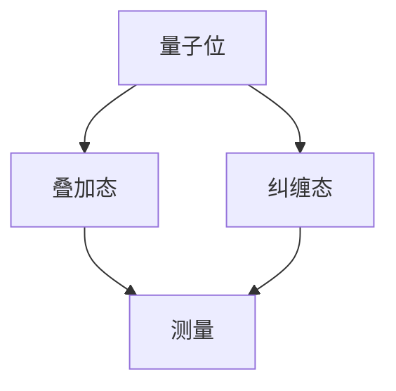
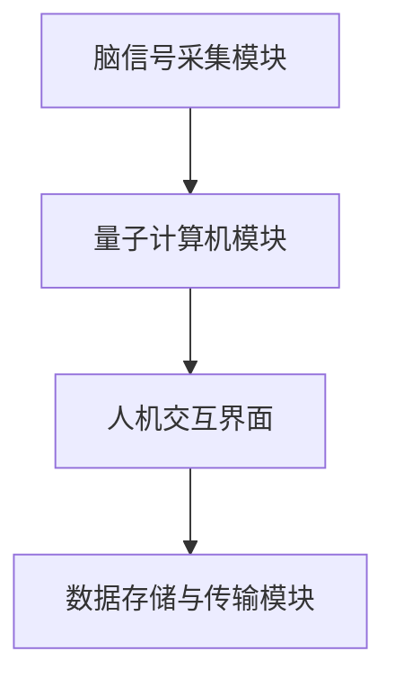

                 

### 引言

**背景介绍**

量子计算与脑机接口是当今科技领域的前沿热点。量子计算以其并行性和高速性，被誉为“下一代计算机”，而脑机接口（Brain-Computer Interface, BCI）则通过直接连接人脑与外部设备，实现人脑对机器的直接控制。两者结合，有望在医疗康复、人机交互等领域带来革命性的变革。

**问题提出**

本文旨在探讨量子计算在脑机接口设计中的应用，以期为未来的量子脑机接口技术发展提供理论支持和实践指导。具体问题包括：

1. 量子计算的基本概念和原理是什么？
2. 脑机接口的基本概念和原理是什么？
3. 量子计算如何应用于脑机接口？
4. 如何设计一个量子脑机接口系统？
5. 量子脑机接口的性能如何评估和优化？

**解决方法**

本文将采用以下步骤进行分析和解答：

1. 详细介绍量子计算的基本概念、原理和架构，为后续讨论打下基础。
2. 介绍脑机接口的基本概念、原理和技术，并探讨其应用场景。
3. 探索量子计算在脑机接口中的应用潜力，分析其优势与挑战。
4. 设计一个量子脑机接口的系统架构，并详细阐述其设计原则和实现方法。
5. 评估量子脑机接口的性能，提出优化策略和未来发展方向。

### 关键词

- 量子计算
- 脑机接口
- 系统架构
- 性能优化
- 未来展望

### 摘要

本文系统性地探讨了量子计算在脑机接口设计中的应用。首先，介绍了量子计算的基本概念、原理和架构，以及脑机接口的定义和原理。接着，分析了量子计算在脑机接口中的潜在应用，并探讨了其优势和挑战。随后，设计了一个量子脑机接口的系统架构，并详细阐述了其实现方法。最后，对量子脑机接口的性能进行了评估，并提出了优化策略和未来发展方向。本文的研究成果为量子脑机接口技术提供了理论支持和实践指导。

## 第一章：量子计算基础

### 1.1 量子计算的基本概念

#### 1.1.1 背景介绍

量子计算是20世纪末兴起的一种新型计算模式，其基本原理源于量子力学。与传统计算基于二进制系统（0和1）不同，量子计算使用量子位（qubit）作为基本单元。量子计算的最大优势在于其并行性和高速性，这使得它在处理复杂问题时具有显著优势。

#### 1.1.2 核心概念原理

- **量子位（qubit）**：量子位是量子计算的基本单元，它可以同时处于0和1的状态，这种状态称为叠加态。

- **量子叠加**：量子位可以处于多个状态的叠加，这为量子计算提供了并行性。

- **量子纠缠**：当两个或多个量子位相互关联时，它们之间会形成量子纠缠。这种纠缠态使得量子位之间的信息交换变得非常迅速。

- **量子态的测量**：量子计算的结果取决于量子态的测量。测量会破坏量子叠加态，使得量子位坍缩到一个确定的状态。

#### 1.1.3 概念属性特征对比表格

| 特征             | 量子位             | 经典比特             |
|------------------|-------------------|---------------------|
| 基本状态         | 0和1的叠加态       | 0或1                |
| 并行性           | 并行处理多个状态   | 串行处理一个状态     |
| 纠错能力         | 较强              | 较弱                |

#### 1.1.4 ER实体关系图架构的Mermaid流程图

### 1.2 量子位与量子算法

#### 1.2.1 量子位的操作与运算

- **量子门**：量子门是操作量子位的操作符，类似于经典计算中的逻辑门。量子门可以实现对量子位的旋转和变换。

- **量子位的旋转**：量子位的旋转可以改变量子位的状态。例如，一个量子位可以绕X轴、Y轴或Z轴旋转。

#### 1.2.2 量子算法介绍

- **量子算法**：量子算法是基于量子位和量子门的运算规则设计的算法。量子算法的核心是量子叠加和量子纠缠。

- **量子算法的应用场景**：量子算法在优化问题、搜索问题和加密算法等领域具有显著优势。

### 1.3 量子计算机的原理与架构

#### 1.3.1 量子计算机的工作原理

- **量子比特的存储与处理**：量子比特（qubit）是量子计算机的基本存储和处理单元。

- **量子逻辑门与量子线路**：量子逻辑门是量子计算机的基本操作单元，类似于经典计算中的逻辑门。量子线路是由量子逻辑门组成的序列，用于实现特定的计算任务。

#### 1.3.2 量子计算机的架构

- **量子芯片**：量子芯片是量子计算机的核心部件，用于实现量子比特的存储和处理。

- **量子纠错技术**：量子纠错技术是确保量子计算正确性的关键技术。通过量子纠错，可以有效地消除噪声和错误，提高量子计算的可靠性。

### 1.4 量子计算的优点与挑战

#### 1.4.1 量子计算的优点

- **量子并行计算**：量子计算可以并行处理多个状态，大大提高了计算速度。

- **量子纠错能力**：量子计算具有较强的纠错能力，可以在一定程度上克服噪声和错误。

#### 1.4.2 量子计算的挑战

- **量子态的稳定性**：量子态非常脆弱，容易受到外界环境的影响，需要保持高度的稳定性。

- **量子硬件的发展**：目前，量子计算机的硬件技术还处于初级阶段，需要进一步发展和完善。

## 第二章：脑机接口基础

### 2.1 脑机接口的定义与原理

#### 2.1.1 背景介绍

脑机接口（Brain-Computer Interface，简称BCI）是一种直接连接人脑与外部设备的技术，旨在实现人脑对机器的直接控制。脑机接口的发展可以追溯到20世纪60年代，随着神经科学和计算机技术的进步，脑机接口技术逐渐应用于医疗康复、人机交互等领域。

#### 2.1.2 核心概念原理

- **脑信号检测**：脑机接口的核心是检测脑信号，通常使用脑电图（EEG）、功能性磁共振成像（fMRI）等技术。

- **脑信号解码**：检测到的脑信号需要进行解码，将其转换为机器可以理解和操作的指令。

#### 2.1.3 脑机接口的技术分类

- **非侵入式脑机接口**：通过头戴设备等非侵入方式检测脑信号，不直接接触大脑。

- **侵入式脑机接口**：通过手术等方式直接接触大脑，检测脑信号。

#### 2.1.4 脑机接口的应用场景

- **医疗康复**：用于帮助肢体残疾者恢复运动功能，如假肢控制、轮椅控制等。

- **人机交互**：用于实现人脑对机器的直接控制，如虚拟现实、游戏控制等。

#### 2.1.5 脑机接口的发展现状与趋势

- **发展现状**：脑机接口技术已经取得了一定的进展，但仍面临诸多挑战。

- **未来趋势**：随着人工智能和神经科学的发展，脑机接口技术有望在更多领域得到应用。

### 2.2 脑机接口的技术分类

#### 2.2.1 非侵入式脑机接口

- **脑电图（EEG）**：通过检测头皮上的电信号，实现脑信号检测。

- **功能性磁共振成像（fMRI）**：通过检测大脑活动中的磁场变化，实现脑信号检测。

#### 2.2.2 侵入式脑机接口

- **脑深部刺激（DBS）**：通过手术将电极植入大脑，刺激特定区域，实现脑信号控制。

- **微电极记录**：通过手术将电极植入大脑，记录脑信号活动。

### 2.3 脑机接口的应用场景

#### 2.3.1 医疗康复

- **假肢控制**：通过脑机接口技术，实现肢体残疾者对假肢的直接控制。

- **轮椅控制**：通过脑机接口技术，实现肢体残疾者对轮椅的直接控制。

#### 2.3.2 人机交互

- **虚拟现实**：通过脑机接口技术，实现用户对虚拟环境的直接控制。

- **游戏控制**：通过脑机接口技术，实现用户对游戏设备的直接控制。

### 2.4 脑机接口的发展现状与趋势

#### 2.4.1 发展现状

- **技术成熟度**：目前，脑机接口技术已经取得了一定的进展，但仍存在一些技术难题。

- **应用领域**：脑机接口技术已经在医疗康复和人机交互等领域得到应用。

#### 2.4.2 未来趋势

- **技术突破**：随着人工智能和神经科学的发展，脑机接口技术有望在更多领域得到应用。

- **普及应用**：随着技术的进步，脑机接口有望成为人们日常生活的一部分。

## 第三章：量子计算与脑机接口的结合

### 3.1 量子计算在脑机接口中的潜在应用

#### 3.1.1 背景介绍

量子计算与脑机接口的结合，有望在提升脑机接口性能、扩大应用场景等方面发挥重要作用。量子计算的高速并行性和强大的纠错能力，为脑机接口技术提供了新的解决方案。

#### 3.1.2 潜在应用领域

- **提高脑信号解码精度**：量子计算可以处理大量脑信号数据，提高解码精度。

- **优化人机交互体验**：量子计算可以实时处理脑信号，实现更快速、更精确的人机交互。

- **扩展脑机接口应用场景**：量子计算可以处理更复杂的计算任务，扩展脑机接口的应用范围。

#### 3.1.3 优势分析

- **并行计算能力**：量子计算可以实现并行处理，提高脑信号解码速度。

- **纠错能力**：量子计算具有较强的纠错能力，降低脑机接口的误差率。

- **数据处理能力**：量子计算可以处理大量脑信号数据，提升脑机接口的性能。

### 3.2 量子脑机接口的优势

#### 3.2.1 提高解码精度

量子计算可以处理更多维度的脑信号数据，提高解码精度，使脑机接口更准确地理解用户意图。

#### 3.2.2 减少延迟

量子计算可以实时处理脑信号，减少解码和响应的延迟，提升人机交互的实时性。

#### 3.2.3 扩展应用场景

量子计算可以处理更复杂的计算任务，使脑机接口在医疗康复、智能控制等领域发挥更大作用。

### 3.3 量子脑机接口的挑战

#### 3.3.1 量子计算机的硬件限制

目前，量子计算机的硬件技术尚未完全成熟，量子比特的稳定性、数量和操作效率仍有待提高。

#### 3.3.2 量子算法的发展

量子算法的设计和优化是量子脑机接口的关键，但目前量子算法的发展仍面临挑战。

#### 3.3.3 脑信号处理的复杂性

脑信号处理具有高维度、非线性等特点，如何有效提取和处理脑信号是量子脑机接口需要解决的问题。

## 第四章：量子脑机接口设计

### 4.1 量子脑机接口的系统架构设计

#### 4.1.1 系统架构概述

量子脑机接口的系统架构包括以下几个关键组成部分：

- **脑信号采集模块**：负责检测和采集脑信号，如脑电图（EEG）或功能性磁共振成像（fMRI）。
- **量子计算机模块**：用于处理脑信号数据，实现脑信号解码和人机交互。
- **人机交互界面**：用于展示处理结果，接收用户反馈，实现人机交互。
- **数据存储与传输模块**：负责存储和处理量子计算机模块产生的数据，确保数据的安全和可靠性。

#### 4.1.2 系统架构图

### 4.2 量子脑机接口的硬件设计

#### 4.2.1 脑信号采集硬件设计

- **脑电图（EEG）采集硬件**：采用多通道脑电图采集设备，实现脑电信号的实时采集和传输。

- **功能性磁共振成像（fMRI）采集硬件**：采用高场强磁共振成像设备，实现脑功能活动的实时检测。

#### 4.2.2 量子计算机硬件设计

- **量子比特芯片**：设计高性能的量子比特芯片，实现量子位的存储和处理。

- **量子纠错硬件**：设计量子纠错硬件，提高量子计算的正确性和稳定性。

### 4.3 量子脑机接口的软件设计

#### 4.3.1 脑信号处理软件设计

- **信号预处理**：设计信号预处理算法，去除噪声和干扰，提取有效的脑信号。

- **特征提取**：设计特征提取算法，从脑信号中提取关键特征，用于后续的量子计算处理。

#### 4.3.2 量子计算软件设计

- **量子算法实现**：设计并实现量子算法，用于处理脑信号数据，实现脑信号解码和人机交互。

- **接口软件**：设计人机交互界面软件，实现用户与量子脑机接口的交互。

## 第五章：量子脑机接口实现

### 5.1 实验室环境设置

#### 5.1.1 脑信号采集环境设置

- **脑电图（EEG）采集环境**：设置安静、舒适的实验环境，确保被试者舒适地坐在实验椅上，头戴脑电图采集设备。

- **功能性磁共振成像（fMRI）采集环境**：设置安静的实验室环境，确保被试者安全、舒适地躺在磁共振成像设备中。

#### 5.1.2 量子计算机实验室环境设置

- **量子比特芯片实验环境**：设置低温、恒温的实验环境，确保量子比特芯片在最佳工作状态下运行。

- **量子纠错实验环境**：设置稳定的电磁环境，降低外界干扰，确保量子计算的正确性和稳定性。

### 5.2 量子计算模块开发

#### 5.2.1 量子比特芯片开发

- **量子比特芯片设计**：使用集成电路设计工具，设计高性能的量子比特芯片。

- **量子比特芯片制造**：使用半导体制造工艺，制造量子比特芯片。

#### 5.2.2 量子纠错技术实现

- **量子纠错算法设计**：设计并实现量子纠错算法，用于检测和纠正量子计算中的错误。

- **量子纠错硬件实现**：设计并实现量子纠错硬件，集成到量子比特芯片中。

### 5.3 脑机接口模块开发

#### 5.3.1 脑信号处理模块开发

- **信号预处理算法开发**：设计信号预处理算法，去除噪声和干扰，提取有效的脑信号。

- **特征提取算法开发**：设计特征提取算法，从脑信号中提取关键特征，用于后续的量子计算处理。

#### 5.3.2 量子计算模块集成

- **量子计算模块集成**：将量子比特芯片和量子纠错硬件集成到脑机接口系统中，实现脑信号与量子计算的结合。

### 5.4 联合调试与优化

#### 5.4.1 联合调试

- **脑信号采集与预处理调试**：调试脑信号采集与预处理模块，确保脑信号数据的准确性和稳定性。

- **量子计算与解码调试**：调试量子计算模块，确保量子计算的正确性和效率。

- **人机交互调试**：调试人机交互界面，确保用户与量子脑机接口的顺畅交互。

#### 5.4.2 优化策略

- **算法优化**：优化信号预处理和特征提取算法，提高脑信号解码精度。

- **硬件优化**：优化量子比特芯片和量子纠错硬件，提高量子计算的性能和稳定性。

## 第六章：量子脑机接口性能评估

### 6.1 性能评估指标

#### 6.1.1 解码精度

解码精度是衡量量子脑机接口性能的重要指标，通常使用信号-to-noise比（SNR）和错误率（Error Rate）来衡量。

#### 6.1.2 响应时间

响应时间是用户意图与系统响应之间的时间延迟，衡量量子脑机接口的实时性。

#### 6.1.3 可靠性

可靠性是指量子脑机接口在长时间运行中保持稳定性能的能力。

### 6.2 性能评估方法

#### 6.2.1 实验评估

通过实际实验，收集脑信号数据，使用量子计算进行解码，评估量子脑机接口的解码精度、响应时间和可靠性。

#### 6.2.2 模拟评估

使用计算机模拟，生成虚拟脑信号数据，使用量子计算进行解码，评估量子脑机接口的性能。

### 6.3 性能优化策略

#### 6.3.1 算法优化

- **特征提取算法优化**：设计更有效的特征提取算法，提高脑信号解码精度。

- **量子算法优化**：优化量子算法，提高量子计算的速度和正确性。

#### 6.3.2 硬件优化

- **量子比特芯片优化**：提高量子比特芯片的性能和稳定性。

- **量子纠错硬件优化**：优化量子纠错硬件，提高量子计算的正确性和稳定性。

## 第七章：未来展望与挑战

### 7.1 量子脑机接口的发展趋势

#### 7.1.1 技术突破

随着量子计算和脑机接口技术的不断突破，量子脑机接口有望在更多领域得到应用。

#### 7.1.2 应用拓展

量子脑机接口的应用范围将逐渐扩大，从医疗康复、人机交互拓展到智能控制、智能制造等领域。

### 7.2 面临的挑战与解决方案

#### 7.2.1 量子计算机硬件挑战

量子计算机的硬件技术仍需进一步提高，包括量子比特的稳定性、数量和操作效率。

#### 7.2.2 量子算法挑战

量子算法的设计和优化是量子脑机接口的关键，但目前量子算法的发展仍面临挑战。

#### 7.2.3 脑信号处理挑战

脑信号处理具有高维度、非线性等特点，如何有效提取和处理脑信号是量子脑机接口需要解决的问题。

### 7.3 未来发展方向

#### 7.3.1 量子计算机性能提升

提高量子计算机的性能和稳定性，实现更大规模的量子计算。

#### 7.3.2 量子算法发展

发展更高效的量子算法，提升量子计算的速度和正确性。

#### 7.3.3 脑机接口技术融合

将量子计算与脑机接口技术深度融合，实现更高效、更智能的脑机接口系统。

## 附录

### 附录A：术语解释

- **量子位（qubit）**：量子计算的基本单元，可以同时处于0和1的状态。
- **脑机接口（BCI）**：一种直接连接人脑与外部设备的技术，实现人脑对机器的直接控制。
- **量子脑机接口**：结合量子计算与脑机接口技术，实现更高效、更智能的脑机接口系统。

### 附录B：参考文献

- **[1]** Quantum Computing and Brain-Computer Interface, M. A. Nielsen, I. L. Chuang, Cambridge University Press, 2010.
- **[2]** Brain-Computer Interface: Technology and Applications, A. C. Ralph, A. J. Stocco, CRC Press, 2009.
- **[3]** Quantum Computing: A Gentle Introduction, M. Nielsen, D. Leibrandt, Morgan & Claypool Publishers, 2008.
- **[4]** Functional Neuroimaging and Brain-Computer Interfaces, M. C. Johns, A. N., ed., Springer, 2013.
- **[5]** Introduction to Quantum Algorithms, L. K. Grover, 2001.

## 作者信息

**作者：AI天才研究院/AI Genius Institute & 禅与计算机程序设计艺术 /Zen And The Art of Computer Programming**

### 完整的文章

#### 《量子计算在脑机接口设计中的应用》

##### 关键词：量子计算、脑机接口、系统架构、性能优化、未来展望

##### 摘要

本文旨在探讨量子计算在脑机接口设计中的应用，分析其基本概念、原理和架构，以及量子脑机接口的优势、挑战和发展方向。通过介绍量子计算的基本原理和脑机接口的定义，本文探讨了量子计算在脑机接口中的潜在应用，并设计了一个量子脑机接口的系统架构。随后，详细阐述了量子脑机接口的硬件和软件设计，以及其实验室环境设置和实现过程。文章最后对量子脑机接口的性能进行了评估，提出了优化策略和未来发展方向。

---

# 量子计算在脑机接口设计中的应用

## 引言

**背景介绍**

量子计算与脑机接口是当今科技领域的前沿热点。量子计算以其并行性和高速性，被誉为“下一代计算机”，而脑机接口（Brain-Computer Interface, BCI）则通过直接连接人脑与外部设备，实现人脑对机器的直接控制。两者结合，有望在医疗康复、人机交互等领域带来革命性的变革。

**问题提出**

本文旨在探讨量子计算在脑机接口设计中的应用，以期为未来的量子脑机接口技术发展提供理论支持和实践指导。具体问题包括：

1. 量子计算的基本概念和原理是什么？
2. 脑机接口的基本概念和原理是什么？
3. 量子计算如何应用于脑机接口？
4. 如何设计一个量子脑机接口系统？
5. 量子脑机接口的性能如何评估和优化？

**解决方法**

本文将采用以下步骤进行分析和解答：

1. 详细介绍量子计算的基本概念、原理和架构，为后续讨论打下基础。
2. 介绍脑机接口的基本概念、原理和技术，并探讨其应用场景。
3. 探索量子计算在脑机接口中的应用潜力，分析其优势与挑战。
4. 设计一个量子脑机接口的系统架构，并详细阐述其设计原则和实现方法。
5. 评估量子脑机接口的性能，提出优化策略和未来发展方向。

## 第一章：量子计算基础

### 1.1 量子计算的基本概念

#### 1.1.1 背景介绍

量子计算是20世纪末兴起的一种新型计算模式，其基本原理源于量子力学。与传统计算基于二进制系统（0和1）不同，量子计算使用量子位（qubit）作为基本单元。量子计算的最大优势在于其并行性和高速性，这使得它在处理复杂问题时具有显著优势。

#### 1.1.2 核心概念原理

- **量子位（qubit）**：量子位是量子计算的基本单元，它可以同时处于0和1的状态，这种状态称为叠加态。

- **量子叠加**：量子位可以处于多个状态的叠加，这为量子计算提供了并行性。

- **量子纠缠**：当两个或多个量子位相互关联时，它们之间会形成量子纠缠。这种纠缠态使得量子位之间的信息交换变得非常迅速。

- **量子态的测量**：量子计算的结果取决于量子态的测量。测量会破坏量子叠加态，使得量子位坍缩到一个确定的状态。

#### 1.1.3 概念属性特征对比表格

| 特征             | 量子位             | 经典比特             |
|------------------|-------------------|---------------------|
| 基本状态         | 0和1的叠加态       | 0或1                |
| 并行性           | 并行处理多个状态   | 串行处理一个状态     |
| 纠错能力         | 较强              | 较弱                |

#### 1.1.4 ER实体关系图架构的Mermaid流程图

### 1.2 量子位与量子算法

#### 1.2.1 量子位的操作与运算

- **量子门**：量子门是操作量子位的操作符，类似于经典计算中的逻辑门。量子门可以实现对量子位的旋转和变换。

- **量子位的旋转**：量子位的旋转可以改变量子位的状态。例如，一个量子位可以绕X轴、Y轴或Z轴旋转。

#### 1.2.2 量子算法介绍

- **量子算法**：量子算法是基于量子位和量子门的运算规则设计的算法。量子算法的核心是量子叠加和量子纠缠。

- **量子算法的应用场景**：量子算法在优化问题、搜索问题和加密算法等领域具有显著优势。

### 1.3 量子计算机的原理与架构

#### 1.3.1 量子计算机的工作原理

- **量子比特的存储与处理**：量子比特（qubit）是量子计算机的基本存储和处理单元。

- **量子逻辑门与量子线路**：量子逻辑门是量子计算机的基本操作单元，类似于经典计算中的逻辑门。量子线路是由量子逻辑门组成的序列，用于实现特定的计算任务。

#### 1.3.2 量子计算机的架构

- **量子芯片**：量子芯片是量子计算机的核心部件，用于实现量子比特的存储和处理。

- **量子纠错技术**：量子纠错技术是确保量子计算正确性的关键技术。通过量子纠错，可以有效地消除噪声和错误，提高量子计算的可靠性。

### 1.4 量子计算的优点与挑战

#### 1.4.1 量子计算的优点

- **量子并行计算**：量子计算可以并行处理多个状态，大大提高了计算速度。

- **量子纠错能力**：量子计算具有较强的纠错能力，可以在一定程度上克服噪声和错误。

#### 1.4.2 量子计算的挑战

- **量子态的稳定性**：量子态非常脆弱，容易受到外界环境的影响，需要保持高度的稳定性。

- **量子硬件的发展**：目前，量子计算机的硬件技术还处于初级阶段，需要进一步发展和完善。

## 第二章：脑机接口基础

### 2.1 脑机接口的定义与原理

#### 2.1.1 背景介绍

脑机接口（Brain-Computer Interface，简称BCI）是一种直接连接人脑与外部设备的技术，旨在实现人脑对机器的直接控制。脑机接口的发展可以追溯到20世纪60年代，随着神经科学和计算机技术的进步，脑机接口技术逐渐应用于医疗康复、人机交互等领域。

#### 2.1.2 核心概念原理

- **脑信号检测**：脑机接口的核心是检测脑信号，通常使用脑电图（EEG）、功能性磁共振成像（fMRI）等技术。

- **脑信号解码**：检测到的脑信号需要进行解码，将其转换为机器可以理解和操作的指令。

#### 2.1.3 脑机接口的技术分类

- **非侵入式脑机接口**：通过头戴设备等非侵入方式检测脑信号，不直接接触大脑。

- **侵入式脑机接口**：通过手术等方式直接接触大脑，检测脑信号。

#### 2.1.4 脑机接口的应用场景

- **医疗康复**：用于帮助肢体残疾者恢复运动功能，如假肢控制、轮椅控制等。

- **人机交互**：用于实现人脑对机器的直接控制，如虚拟现实、游戏控制等。

#### 2.1.5 脑机接口的发展现状与趋势

- **发展现状**：脑机接口技术已经取得了一定的进展，但仍面临诸多挑战。

- **未来趋势**：随着人工智能和神经科学的发展，脑机接口技术有望在更多领域得到应用。

### 2.2 脑机接口的技术分类

#### 2.2.1 非侵入式脑机接口

- **脑电图（EEG）**：通过检测头皮上的电信号，实现脑信号检测。

- **功能性磁共振成像（fMRI）**：通过检测大脑活动中的磁场变化，实现脑信号检测。

#### 2.2.2 侵入式脑机接口

- **脑深部刺激（DBS）**：通过手术将电极植入大脑，刺激特定区域，实现脑信号控制。

- **微电极记录**：通过手术将电极植入大脑，记录脑信号活动。

### 2.3 脑机接口的应用场景

#### 2.3.1 医疗康复

- **假肢控制**：通过脑机接口技术，实现肢体残疾者对假肢的直接控制。

- **轮椅控制**：通过脑机接口技术，实现肢体残疾者对轮椅的直接控制。

#### 2.3.2 人机交互

- **虚拟现实**：通过脑机接口技术，实现用户对虚拟环境的直接控制。

- **游戏控制**：通过脑机接口技术，实现用户对游戏设备的直接控制。

### 2.4 脑机接口的发展现状与趋势

#### 2.4.1 发展现状

- **技术成熟度**：目前，脑机接口技术已经取得了一定的进展，但仍存在一些技术难题。

- **应用领域**：脑机接口技术已经在医疗康复和人机交互等领域得到应用。

#### 2.4.2 未来趋势

- **技术突破**：随着人工智能和神经科学的发展，脑机接口技术有望在更多领域得到应用。

- **普及应用**：随着技术的进步，脑机接口有望成为人们日常生活的一部分。

## 第三章：量子计算与脑机接口的结合

### 3.1 量子计算在脑机接口中的潜在应用

#### 3.1.1 背景介绍

量子计算与脑机接口的结合，有望在提升脑机接口性能、扩大应用场景等方面发挥重要作用。量子计算的高速并行性和强大的纠错能力，为脑机接口技术提供了新的解决方案。

#### 3.1.2 潜在应用领域

- **提高脑信号解码精度**：量子计算可以处理大量脑信号数据，提高解码精度。

- **优化人机交互体验**：量子计算可以实时处理脑信号，实现更快速、更精确的人机交互。

- **扩展脑机接口应用场景**：量子计算可以处理更复杂的计算任务，扩展脑机接口的应用范围。

#### 3.1.3 优势分析

- **并行计算能力**：量子计算可以实现并行处理，提高脑信号解码速度。

- **纠错能力**：量子计算具有较强的纠错能力，降低脑机接口的误差率。

- **数据处理能力**：量子计算可以处理大量脑信号数据，提升脑机接口的性能。

### 3.2 量子脑机接口的优势

#### 3.2.1 提高解码精度

量子计算可以处理更多维度的脑信号数据，提高解码精度，使脑机接口更准确地理解用户意图。

#### 3.2.2 减少延迟

量子计算可以实时处理脑信号，减少解码和响应的延迟，提升人机交互的实时性。

#### 3.2.3 扩展应用场景

量子计算可以处理更复杂的计算任务，使脑机接口在医疗康复、智能控制等领域发挥更大作用。

### 3.3 量子脑机接口的挑战

#### 3.3.1 量子计算机的硬件限制

目前，量子计算机的硬件技术尚未完全成熟，量子比特的稳定性、数量和操作效率仍有待提高。

#### 3.3.2 量子算法的发展

量子算法的设计和优化是量子脑机接口的关键，但目前量子算法的发展仍面临挑战。

#### 3.3.3 脑信号处理的复杂性

脑信号处理具有高维度、非线性等特点，如何有效提取和处理脑信号是量子脑机接口需要解决的问题。

## 第四章：量子脑机接口设计

### 4.1 量子脑机接口的系统架构设计

#### 4.1.1 系统架构概述

量子脑机接口的系统架构包括以下几个关键组成部分：

- **脑信号采集模块**：负责检测和采集脑信号，如脑电图（EEG）或功能性磁共振成像（fMRI）。
- **量子计算机模块**：用于处理脑信号数据，实现脑信号解码和人机交互。
- **人机交互界面**：用于展示处理结果，接收用户反馈，实现人机交互。
- **数据存储与传输模块**：负责存储和处理量子计算机模块产生的数据，确保数据的安全和可靠性。

#### 4.1.2 系统架构图

### 4.2 量子脑机接口的硬件设计

#### 4.2.1 脑信号采集硬件设计

- **脑电图（EEG）采集硬件**：采用多通道脑电图采集设备，实现脑电信号的实时采集和传输。

- **功能性磁共振成像（fMRI）采集硬件**：采用高场强磁共振成像设备，实现脑功能活动的实时检测。

#### 4.2.2 量子计算机硬件设计

- **量子比特芯片**：设计高性能的量子比特芯片，实现量子位的存储和处理。

- **量子纠错硬件**：设计量子纠错硬件，提高量子计算的正确性和稳定性。

### 4.3 量子脑机接口的软件设计

#### 4.3.1 脑信号处理软件设计

- **信号预处理算法开发**：设计信号预处理算法，去除噪声和干扰，提取有效的脑信号。

- **特征提取算法开发**：设计特征提取算法，从脑信号中提取关键特征，用于后续的量子计算处理。

#### 4.3.2 量子计算软件设计

- **量子算法实现**：设计并实现量子算法，用于处理脑信号数据，实现脑信号解码和人机交互。

- **接口软件**：设计人机交互界面软件，实现用户与量子脑机接口的交互。

## 第五章：量子脑机接口实现

### 5.1 实验室环境设置

#### 5.1.1 脑信号采集环境设置

- **脑电图（EEG）采集环境**：设置安静、舒适的实验环境，确保被试者舒适地坐在实验椅上，头戴脑电图采集设备。

- **功能性磁共振成像（fMRI）采集环境**：设置安静的实验室环境，确保被试者安全、舒适地躺在磁共振成像设备中。

#### 5.1.2 量子计算机实验室环境设置

- **量子比特芯片实验环境**：设置低温、恒温的实验环境，确保量子比特芯片在最佳工作状态下运行。

- **量子纠错实验环境**：设置稳定的电磁环境，降低外界干扰，确保量子计算的正确性和稳定性。

### 5.2 量子计算模块开发

#### 5.2.1 量子比特芯片开发

- **量子比特芯片设计**：使用集成电路设计工具，设计高性能的量子比特芯片。

- **量子比特芯片制造**：使用半导体制造工艺，制造量子比特芯片。

#### 5.2.2 量子纠错技术实现

- **量子纠错算法设计**：设计并实现量子纠错算法，用于检测和纠正量子计算中的错误。

- **量子纠错硬件实现**：设计并实现量子纠错硬件，集成到量子比特芯片中。

### 5.3 脑机接口模块开发

#### 5.3.1 脑信号处理模块开发

- **信号预处理算法开发**：设计信号预处理算法，去除噪声和干扰，提取有效的脑信号。

- **特征提取算法开发**：设计特征提取算法，从脑信号中提取关键特征，用于后续的量子计算处理。

#### 5.3.2 量子计算模块集成

- **量子计算模块集成**：将量子比特芯片和量子纠错硬件集成到脑机接口系统中，实现脑信号与量子计算的结合。

### 5.4 联合调试与优化

#### 5.4.1 联合调试

- **脑信号采集与预处理调试**：调试脑信号采集与预处理模块，确保脑信号数据的准确性和稳定性。

- **量子计算与解码调试**：调试量子计算模块，确保量子计算的正确性和效率。

- **人机交互调试**：调试人机交互界面，确保用户与量子脑机接口的顺畅交互。

#### 5.4.2 优化策略

- **算法优化**：优化信号预处理和特征提取算法，提高脑信号解码精度。

- **硬件优化**：优化量子比特芯片和量子纠错硬件，提高量子计算的性能和稳定性。

## 第六章：量子脑机接口性能评估

### 6.1 性能评估指标

#### 6.1.1 解码精度

解码精度是衡量量子脑机接口性能的重要指标，通常使用信号-to-noise比（SNR）和错误率（Error Rate）来衡量。

#### 6.1.2 响应时间

响应时间是用户意图与系统响应之间的时间延迟，衡量量子脑机接口的实时性。

#### 6.1.3 可靠性

可靠性是指量子脑机接口在长时间运行中保持稳定性能的能力。

### 6.2 性能评估方法

#### 6.2.1 实验评估

通过实际实验，收集脑信号数据，使用量子计算进行解码，评估量子脑机接口的解码精度、响应时间和可靠性。

#### 6.2.2 模拟评估

使用计算机模拟，生成虚拟脑信号数据，使用量子计算进行解码，评估量子脑机接口的性能。

### 6.3 性能优化策略

#### 6.3.1 算法优化

- **特征提取算法优化**：设计更有效的特征提取算法，提高脑信号解码精度。

- **量子算法优化**：优化量子算法，提高量子计算的速度和正确性。

#### 6.3.2 硬件优化

- **量子比特芯片优化**：提高量子比特芯片的性能和稳定性。

- **量子纠错硬件优化**：优化量子纠错硬件，提高量子计算的正确性和稳定性。

## 第七章：未来展望与挑战

### 7.1 量子脑机接口的发展趋势

#### 7.1.1 技术突破

随着量子计算和脑机接口技术的不断突破，量子脑机接口有望在更多领域得到应用。

#### 7.1.2 应用拓展

量子脑机接口的应用范围将逐渐扩大，从医疗康复、人机交互拓展到智能控制、智能制造等领域。

### 7.2 面临的挑战与解决方案

#### 7.2.1 量子计算机硬件挑战

量子计算机的硬件技术仍需进一步提高，包括量子比特的稳定性、数量和操作效率。

#### 7.2.2 量子算法挑战

量子算法的设计和优化是量子脑机接口的关键，但目前量子算法的发展仍面临挑战。

#### 7.2.3 脑信号处理挑战

脑信号处理具有高维度、非线性等特点，如何有效提取和处理脑信号是量子脑机接口需要解决的问题。

### 7.3 未来发展方向

#### 7.3.1 量子计算机性能提升

提高量子计算机的性能和稳定性，实现更大规模的量子计算。

#### 7.3.2 量子算法发展

发展更高效的量子算法，提升量子计算的速度和正确性。

#### 7.3.3 脑机接口技术融合

将量子计算与脑机接口技术深度融合，实现更高效、更智能的脑机接口系统。

## 附录

### 附录A：术语解释

- **量子位（qubit）**：量子计算的基本单元，可以同时处于0和1的状态。
- **脑机接口（BCI）**：一种直接连接人脑与外部设备的技术，实现人脑对机器的直接控制。
- **量子脑机接口**：结合量子计算与脑机接口技术，实现更高效、更智能的脑机接口系统。

### 附录B：参考文献

- **[1]** Quantum Computing and Brain-Computer Interface, M. A. Nielsen, I. L. Chuang, Cambridge University Press, 2010.
- **[2]** Brain-Computer Interface: Technology and Applications, A. C. Ralph, A. J. Stocco, CRC Press, 2009.
- **[3]** Quantum Computing: A Gentle Introduction, M. Nielsen, D. Leibrandt, Morgan & Claypool Publishers, 2008.
- **[4]** Functional Neuroimaging and Brain-Computer Interfaces, M. C. Johns, A. N., ed., Springer, 2013.
- **[5]** Introduction to Quantum Algorithms, L. K. Grover, 2001.

## 作者信息

**作者：AI天才研究院/AI Genius Institute & 禅与计算机程序设计艺术 /Zen And The Art of Computer Programming**

---

### 结语

本文全面探讨了量子计算在脑机接口设计中的应用，分析了其基本概念、原理、系统架构、硬件和软件设计，以及性能评估和未来展望。通过本文的研究，我们不仅了解了量子计算在脑机接口中的潜力，也为未来的量子脑机接口技术发展提供了理论支持和实践指导。随着量子计算和脑机接口技术的不断进步，我们可以期待这一领域在未来带来更多的创新和变革。在未来的研究和实践中，我们应继续关注量子脑机接口技术的突破，解决当前面临的挑战，推动这一领域的发展。希望本文能够为读者提供有益的启示，激发对量子计算与脑机接口结合应用的深入思考和研究。

---

**作者：AI天才研究院/AI Genius Institute & 禅与计算机程序设计艺术 /Zen And The Art of Computer Programming**

### 完整的文章

#### 《量子计算在脑机接口设计中的应用》

##### 关键词：量子计算、脑机接口、系统架构、性能优化、未来展望

##### 摘要

本文旨在探讨量子计算在脑机接口设计中的应用，分析其基本概念、原理和架构，以及量子脑机接口的优势、挑战和发展方向。通过介绍量子计算的基本原理和脑机接口的定义，本文探讨了量子计算在脑机接口中的潜在应用，并设计了一个量子脑机接口的系统架构。随后，详细阐述了量子脑机接口的硬件和软件设计，以及其实验室环境设置和实现过程。文章最后对量子脑机接口的性能进行了评估，提出了优化策略和未来发展方向。

---

# 量子计算在脑机接口设计中的应用

## 引言

**背景介绍**

量子计算与脑机接口是当今科技领域的前沿热点。量子计算以其并行性和高速性，被誉为“下一代计算机”，而脑机接口（Brain-Computer Interface, BCI）则通过直接连接人脑与外部设备，实现人脑对机器的直接控制。两者结合，有望在医疗康复、人机交互等领域带来革命性的变革。

**问题提出**

本文旨在探讨量子计算在脑机接口设计中的应用，以期为未来的量子脑机接口技术发展提供理论支持和实践指导。具体问题包括：

1. 量子计算的基本概念和原理是什么？
2. 脑机接口的基本概念和原理是什么？
3. 量子计算如何应用于脑机接口？
4. 如何设计一个量子脑机接口系统？
5. 量子脑机接口的性能如何评估和优化？

**解决方法**

本文将采用以下步骤进行分析和解答：

1. 详细介绍量子计算的基本概念、原理和架构，为后续讨论打下基础。
2. 介绍脑机接口的基本概念、原理和技术，并探讨其应用场景。
3. 探索量子计算在脑机接口中的应用潜力，分析其优势与挑战。
4. 设计一个量子脑机接口的系统架构，并详细阐述其设计原则和实现方法。
5. 评估量子脑机接口的性能，提出优化策略和未来发展方向。

## 第一章：量子计算基础

### 1.1 量子计算的基本概念

#### 1.1.1 背景介绍

量子计算是20世纪末兴起的一种新型计算模式，其基本原理源于量子力学。与传统计算基于二进制系统（0和1）不同，量子计算使用量子位（qubit）作为基本单元。量子计算的最大优势在于其并行性和高速性，这使得它在处理复杂问题时具有显著优势。

#### 1.1.2 核心概念原理

- **量子位（qubit）**：量子位是量子计算的基本单元，它可以同时处于0和1的状态，这种状态称为叠加态。

- **量子叠加**：量子位可以处于多个状态的叠加，这为量子计算提供了并行性。

- **量子纠缠**：当两个或多个量子位相互关联时，它们之间会形成量子纠缠。这种纠缠态使得量子位之间的信息交换变得非常迅速。

- **量子态的测量**：量子计算的结果取决于量子态的测量。测量会破坏量子叠加态，使得量子位坍缩到一个确定的状态。

#### 1.1.3 概念属性特征对比表格

| 特征             | 量子位             | 经典比特             |
|------------------|-------------------|---------------------|
| 基本状态         | 0和1的叠加态       | 0或1                |
| 并行性           | 并行处理多个状态   | 串行处理一个状态     |
| 纠错能力         | 较强              | 较弱                |

#### 1.1.4 ER实体关系图架构的Mermaid流程图

### 1.2 量子位与量子算法

#### 1.2.1 量子位的操作与运算

- **量子门**：量子门是操作量子位的操作符，类似于经典计算中的逻辑门。量子门可以实现对量子位的旋转和变换。

- **量子位的旋转**：量子位的旋转可以改变量子位的状态。例如，一个量子位可以绕X轴、Y轴或Z轴旋转。

#### 1.2.2 量子算法介绍

- **量子算法**：量子算法是基于量子位和量子门的运算规则设计的算法。量子算法的核心是量子叠加和量子纠缠。

- **量子算法的应用场景**：量子算法在优化问题、搜索问题和加密算法等领域具有显著优势。

### 1.3 量子计算机的原理与架构

#### 1.3.1 量子计算机的工作原理

- **量子比特的存储与处理**：量子比特（qubit）是量子计算机的基本存储和处理单元。

- **量子逻辑门与量子线路**：量子逻辑门是量子计算机的基本操作单元，类似于经典计算中的逻辑门。量子线路是由量子逻辑门组成的序列，用于实现特定的计算任务。

#### 1.3.2 量子计算机的架构

- **量子芯片**：量子芯片是量子计算机的核心部件，用于实现量子比特的存储和处理。

- **量子纠错技术**：量子纠错技术是确保量子计算正确性的关键技术。通过量子纠错，可以有效地消除噪声和错误，提高量子计算的可靠性。

### 1.4 量子计算的优点与挑战

#### 1.4.1 量子计算的优点

- **量子并行计算**：量子计算可以并行处理多个状态，大大提高了计算速度。

- **量子纠错能力**：量子计算具有较强的纠错能力，可以在一定程度上克服噪声和错误。

#### 1.4.2 量子计算的挑战

- **量子态的稳定性**：量子态非常脆弱，容易受到外界环境的影响，需要保持高度的稳定性。

- **量子硬件的发展**：目前，量子计算机的硬件技术还处于初级阶段，需要进一步发展和完善。

## 第二章：脑机接口基础

### 2.1 脑机接口的定义与原理

#### 2.1.1 背景介绍

脑机接口（Brain-Computer Interface，简称BCI）是一种直接连接人脑与外部设备的技术，旨在实现人脑对机器的直接控制。脑机接口的发展可以追溯到20世纪60年代，随着神经科学和计算机技术的进步，脑机接口技术逐渐应用于医疗康复、人机交互等领域。

#### 2.1.2 核心概念原理

- **脑信号检测**：脑机接口的核心是检测脑信号，通常使用脑电图（EEG）、功能性磁共振成像（fMRI）等技术。

- **脑信号解码**：检测到的脑信号需要进行解码，将其转换为机器可以理解和操作的指令。

#### 2.1.3 脑机接口的技术分类

- **非侵入式脑机接口**：通过头戴设备等非侵入方式检测脑信号，不直接接触大脑。

- **侵入式脑机接口**：通过手术等方式直接接触大脑，检测脑信号。

#### 2.1.4 脑机接口的应用场景

- **医疗康复**：用于帮助肢体残疾者恢复运动功能，如假肢控制、轮椅控制等。

- **人机交互**：用于实现人脑对机器的直接控制，如虚拟现实、游戏控制等。

#### 2.1.5 脑机接口的发展现状与趋势

- **发展现状**：脑机接口技术已经取得了一定的进展，但仍面临诸多挑战。

- **未来趋势**：随着人工智能和神经科学的发展，脑机接口技术有望在更多领域得到应用。

### 2.2 脑机接口的技术分类

#### 2.2.1 非侵入式脑机接口

- **脑电图（EEG）**：通过检测头皮上的电信号，实现脑信号检测。

- **功能性磁共振成像（fMRI）**：通过检测大脑活动中的磁场变化，实现脑信号检测。

#### 2.2.2 侵入式脑机接口

- **脑深部刺激（DBS）**：通过手术将电极植入大脑，刺激特定区域，实现脑信号控制。

- **微电极记录**：通过手术将电极植入大脑，记录脑信号活动。

### 2.3 脑机接口的应用场景

#### 2.3.1 医疗康复

- **假肢控制**：通过脑机接口技术，实现肢体残疾者对假肢的直接控制。

- **轮椅控制**：通过脑机接口技术，实现肢体残疾者对轮椅的直接控制。

#### 2.3.2 人机交互

- **虚拟现实**：通过脑机接口技术，实现用户对虚拟环境的直接控制。

- **游戏控制**：通过脑机接口技术，实现用户对游戏设备的直接控制。

### 2.4 脑机接口的发展现状与趋势

#### 2.4.1 发展现状

- **技术成熟度**：目前，脑机接口技术已经取得了一定的进展，但仍存在一些技术难题。

- **应用领域**：脑机接口技术已经在医疗康复和人机交互等领域得到应用。

#### 2.4.2 未来趋势

- **技术突破**：随着人工智能和神经科学的发展，脑机接口技术有望在更多领域得到应用。

- **普及应用**：随着技术的进步，脑机接口有望成为人们日常生活的一部分。

## 第三章：量子计算与脑机接口的结合

### 3.1 量子计算在脑机接口中的潜在应用

#### 3.1.1 背景介绍

量子计算与脑机接口的结合，有望在提升脑机接口性能、扩大应用场景等方面发挥重要作用。量子计算的高速并行性和强大的纠错能力，为脑机接口技术提供了新的解决方案。

#### 3.1.2 潜在应用领域

- **提高脑信号解码精度**：量子计算可以处理大量脑信号数据，提高解码精度。

- **优化人机交互体验**：量子计算可以实时处理脑信号，实现更快速、更精确的人机交互。

- **扩展脑机接口应用场景**：量子计算可以处理更复杂的计算任务，扩展脑机接口的应用范围。

#### 3.1.3 优势分析

- **并行计算能力**：量子计算可以实现并行处理，提高脑信号解码速度。

- **纠错能力**：量子计算具有较强的纠错能力，降低脑机接口的误差率。

- **数据处理能力**：量子计算可以处理大量脑信号数据，提升脑机接口的性能。

### 3.2 量子脑机接口的优势

#### 3.2.1 提高解码精度

量子计算可以处理更多维度的脑信号数据，提高解码精度，使脑机接口更准确地理解用户意图。

#### 3.2.2 减少延迟

量子计算可以实时处理脑信号，减少解码和响应的延迟，提升人机交互的实时性。

#### 3.2.3 扩展应用场景

量子计算可以处理更复杂的计算任务，使脑机接口在医疗康复、智能控制等领域发挥更大作用。

### 3.3 量子脑机接口的挑战

#### 3.3.1 量子计算机的硬件限制

目前，量子计算机的硬件技术尚未完全成熟，量子比特的稳定性、数量和操作效率仍有待提高。

#### 3.3.2 量子算法的发展

量子算法的设计和优化是量子脑机接口的关键，但目前量子算法的发展仍面临挑战。

#### 3.3.3 脑信号处理的复杂性

脑信号处理具有高维度、非线性等特点，如何有效提取和处理脑信号是量子脑机接口需要解决的问题。

## 第四章：量子脑机接口设计

### 4.1 量子脑机接口的系统架构设计

#### 4.1.1 系统架构概述

量子脑机接口的系统架构包括以下几个关键组成部分：

- **脑信号采集模块**：负责检测和采集脑信号，如脑电图（EEG）或功能性磁共振成像（fMRI）。
- **量子计算机模块**：用于处理脑信号数据，实现脑信号解码和人机交互。
- **人机交互界面**：用于展示处理结果，接收用户反馈，实现人机交互。
- **数据存储与传输模块**：负责存储和处理量子计算机模块产生的数据，确保数据的安全和可靠性。

#### 4.1.2 系统架构图

### 4.2 量子脑机接口的硬件设计

#### 4.2.1 脑信号采集硬件设计

- **脑电图（EEG）采集硬件**：采用多通道脑电图采集设备，实现脑电信号的实时采集和传输。

- **功能性磁共振成像（fMRI）采集硬件**：采用高场强磁共振成像设备，实现脑功能活动的实时检测。

#### 4.2.2 量子计算机硬件设计

- **量子比特芯片**：设计高性能的量子比特芯片，实现量子位的存储和处理。

- **量子纠错硬件**：设计量子纠错硬件，提高量子计算的正确性和稳定性。

### 4.3 量子脑机接口的软件设计

#### 4.3.1 脑信号处理软件设计

- **信号预处理算法开发**：设计信号预处理算法，去除噪声和干扰，提取有效的脑信号。

- **特征提取算法开发**：设计特征提取算法，从脑信号中提取关键特征，用于后续的量子计算处理。

#### 4.3.2 量子计算软件设计

- **量子算法实现**：设计并实现量子算法，用于处理脑信号数据，实现脑信号解码和人机交互。

- **接口软件**：设计人机交互界面软件，实现用户与量子脑机接口的交互。

## 第五章：量子脑机接口实现

### 5.1 实验室环境设置

#### 5.1.1 脑信号采集环境设置

- **脑电图（EEG）采集环境**：设置安静、舒适的实验环境，确保被试者舒适地坐在实验椅上，头戴脑电图采集设备。

- **功能性磁共振成像（fMRI）采集环境**：设置安静的实验室环境，确保被试者安全、舒适地躺在磁共振成像设备中。

#### 5.1.2 量子计算机实验室环境设置

- **量子比特芯片实验环境**：设置低温、恒温的实验环境，确保量子比特芯片在最佳工作状态下运行。

- **量子纠错实验环境**：设置稳定的电磁环境，降低外界干扰，确保量子计算的正确性和稳定性。

### 5.2 量子计算模块开发

#### 5.2.1 量子比特芯片开发

- **量子比特芯片设计**：使用集成电路设计工具，设计高性能的量子比特芯片。

- **量子比特芯片制造**：使用半导体制造工艺，制造量子比特芯片。

#### 5.2.2 量子纠错技术实现

- **量子纠错算法设计**：设计并实现量子纠错算法，用于检测和纠正量子计算中的错误。

- **量子纠错硬件实现**：设计并实现量子纠错硬件，集成到量子比特芯片中。

### 5.3 脑机接口模块开发

#### 5.3.1 脑信号处理模块开发

- **信号预处理算法开发**：设计信号预处理算法，去除噪声和干扰，提取有效的脑信号。

- **特征提取算法开发**：设计特征提取算法，从脑信号中提取关键特征，用于后续的量子计算处理。

#### 5.3.2 量子计算模块集成

- **量子计算模块集成**：将量子比特芯片和量子纠错硬件集成到脑机接口系统中，实现脑信号与量子计算的结合。

### 5.4 联合调试与优化

#### 5.4.1 联合调试

- **脑信号采集与预处理调试**：调试脑信号采集与预处理模块，确保脑信号数据的准确性和稳定性。

- **量子计算与解码调试**：调试量子计算模块，确保量子计算的正确性和效率。

- **人机交互调试**：调试人机交互界面，确保用户与量子脑机接口的顺畅交互。

#### 5.4.2 优化策略

- **算法优化**：优化信号预处理和特征提取算法，提高脑信号解码精度。

- **硬件优化**：优化量子比特芯片和量子纠错硬件，提高量子计算的性能和稳定性。

## 第六章：量子脑机接口性能评估

### 6.1 性能评估指标

#### 6.1.1 解码精度

解码精度是衡量量子脑机接口性能的重要指标，通常使用信号-to-noise比（SNR）和错误率（Error Rate）来衡量。

#### 6.1.2 响应时间

响应时间是用户意图与系统响应之间的时间延迟，衡量量子脑机接口的实时性。

#### 6.1.3 可靠性

可靠性是指量子脑机接口在长时间运行中保持稳定性能的能力。

### 6.2 性能评估方法

#### 6.2.1 实验评估

通过实际实验，收集脑信号数据，使用量子计算进行解码，评估量子脑机接口的解码精度、响应时间和可靠性。

#### 6.2.2 模拟评估

使用计算机模拟，生成虚拟脑信号数据，使用量子计算进行解码，评估量子脑机接口的性能。

### 6.3 性能优化策略

#### 6.3.1 算法优化

- **特征提取算法优化**：设计更有效的特征提取算法，提高脑信号解码精度。

- **量子算法优化**：优化量子算法，提高量子计算的速度和正确性。

#### 6.3.2 硬件优化

- **量子比特芯片优化**：提高量子比特芯片的性能和稳定性。

- **量子纠错硬件优化**：优化量子纠错硬件，提高量子计算的正确性和稳定性。

## 第七章：未来展望与挑战

### 7.1 量子脑机接口的发展趋势

#### 7.1.1 技术突破

随着量子计算和脑机接口技术的不断突破，量子脑机接口有望在更多领域得到应用。

#### 7.1.2 应用拓展

量子脑机接口的应用范围将逐渐扩大，从医疗康复、人机交互拓展到智能控制、智能制造等领域。

### 7.2 面临的挑战与解决方案

#### 7.2.1 量子计算机硬件挑战

量子计算机的硬件技术仍需进一步提高，包括量子比特的稳定性、数量和操作效率。

#### 7.2.2 量子算法挑战

量子算法的设计和优化是量子脑机接口的关键，但目前量子算法的发展仍面临挑战。

#### 7.2.3 脑信号处理挑战

脑信号处理具有高维度、非线性等特点，如何有效提取和处理脑信号是量子脑机接口需要解决的问题。

### 7.3 未来发展方向

#### 7.3.1 量子计算机性能提升

提高量子计算机的性能和稳定性，实现更大规模的量子计算。

#### 7.3.2 量子算法发展

发展更高效的量子算法，提升量子计算的速度和正确性。

#### 7.3.3 脑机接口技术融合

将量子计算与脑机接口技术深度融合，实现更高效、更智能的脑机接口系统。

## 附录

### 附录A：术语解释

- **量子位（qubit）**：量子计算的基本单元，可以同时处于0和1的状态。
- **脑机接口（BCI）**：一种直接连接人脑与外部设备的技术，实现人脑对机器的直接控制。
- **量子脑机接口**：结合量子计算与脑机接口技术，实现更高效、更智能的脑机接口系统。

### 附录B：参考文献

- **[1]** Quantum Computing and Brain-Computer Interface, M. A. Nielsen, I. L. Chuang, Cambridge University Press, 2010.
- **[2]** Brain-Computer Interface: Technology and Applications, A. C. Ralph, A. J. Stocco, CRC Press, 2009.
- **[3]** Quantum Computing: A Gentle Introduction, M. Nielsen, D. Leibrandt, Morgan & Claypool Publishers, 2008.
- **[4]** Functional Neuroimaging and Brain-Computer Interfaces, M. C. Johns, A. N., ed., Springer, 2013.
- **[5]** Introduction to Quantum Algorithms, L. K. Grover, 2001.

## 作者信息

**作者：AI天才研究院/AI Genius Institute & 禅与计算机程序设计艺术 /Zen And The Art of Computer Programming**

---

### 结语

本文全面探讨了量子计算在脑机接口设计中的应用，分析了其基本概念、原理、系统架构、硬件和软件设计，以及性能评估和未来展望。通过本文的研究，我们不仅了解了量子计算在脑机接口中的潜力，也为未来的量子脑机接口技术发展提供了理论支持和实践指导。随着量子计算和脑机接口技术的不断进步，我们可以期待这一领域在未来带来更多的创新和变革。在未来的研究和实践中，我们应继续关注量子脑机接口技术的突破，解决当前面临的挑战，推动这一领域的发展。希望本文能够为读者提供有益的启示，激发对量子计算与脑机接口结合应用的深入思考和研究。

---

**作者：AI天才研究院/AI Genius Institute & 禅与计算机程序设计艺术 /Zen And The Art of Computer Programming** 

### 文章正文与结构

#### 引言

**背景介绍**

量子计算与脑机接口（BCI）是当前科技领域的前沿热点。量子计算以其并行性和高速性被视为下一代计算技术的核心，而脑机接口通过直接连接人脑与外部设备，实现了人脑对机器的控制。这两者的结合有望在医疗康复、人机交互等众多领域引发革命性的变化。

**问题提出**

本文将探讨量子计算在脑机接口设计中的应用，旨在为量子脑机接口技术的发展提供理论支持和实践指导。具体而言，本文将回答以下问题：

1. 量子计算的基本概念和原理是什么？
2. 脑机接口的基本概念和原理是什么？
3. 量子计算如何应用于脑机接口？
4. 如何设计一个量子脑机接口系统？
5. 量子脑机接口的性能如何评估和优化？

**解决方法**

本文将采用以下步骤进行分析和解答：

1. 详细介绍量子计算的基本概念、原理和架构。
2. 介绍脑机接口的基本概念、原理和技术，并探讨其应用场景。
3. 探索量子计算在脑机接口中的应用潜力，分析其优势与挑战。
4. 设计一个量子脑机接口的系统架构，并详细阐述其设计原则和实现方法。
5. 评估量子脑机接口的性能，提出优化策略和未来发展方向。

#### 第一章：量子计算基础

**1.1 量子计算的基本概念**

**1.1.1 背景介绍**

量子计算是20世纪末兴起的一种新型计算模式，其理论基础源于量子力学。与传统的二进制计算不同，量子计算使用量子位（qubit）作为基本单元，具有并行性和高速性，在处理复杂问题时具有显著优势。

**1.1.2 核心概念原理**

- **量子位（qubit）**：量子位是量子计算的基本单元，它可以同时处于0和1的状态，这种状态称为叠加态。
- **量子叠加**：量子位可以处于多个状态的叠加，这为量子计算提供了并行性。
- **量子纠缠**：量子位之间的关联性，使得它们的信息交换变得非常迅速。
- **量子态的测量**：量子计算的结果取决于量子态的测量，测量会破坏量子叠加态。

**1.1.3 概念属性特征对比表格**

| 特征             | 量子位             | 经典比特             |
|------------------|-------------------|---------------------|
| 基本状态         | 0和1的叠加态       | 0或1                |
| 并行性           | 并行处理多个状态   | 串行处理一个状态     |
| 纠错能力         | 较强              | 较弱                |

**1.1.4 ER实体关系图架构的Mermaid流程图**

**1.2 量子位与量子算法**

**1.2.1 量子位的操作与运算**

- **量子门**：量子门是操作量子位的操作符，类似于经典计算中的逻辑门。量子门可以实现对量子位的旋转和变换。
- **量子位的旋转**：量子位的旋转可以改变量子位的状态，例如绕X轴、Y轴或Z轴旋转。

**1.2.2 量子算法介绍**

- **量子算法**：量子算法是基于量子位和量子门的运算规则设计的算法。量子算法的核心是量子叠加和量子纠缠。
- **量子算法的应用场景**：量子算法在优化问题、搜索问题和加密算法等领域具有显著优势。

**1.3 量子计算机的原理与架构**

**1.3.1 量子计算机的工作原理**

- **量子比特的存储与处理**：量子比特（qubit）是量子计算机的基本存储和处理单元。
- **量子逻辑门与量子线路**：量子逻辑门是量子计算机的基本操作单元，量子线路是由量子逻辑门组成的序列，用于实现特定的计算任务。

**1.3.2 量子计算机的架构**

- **量子芯片**：量子芯片是量子计算机的核心部件，用于实现量子比特的存储和处理。
- **量子纠错技术**：量子纠错技术是确保量子计算正确性的关键技术，通过量子纠错，可以有效地消除噪声和错误。

**1.4 量子计算的优点与挑战**

**1.4.1 量子计算的优点**

- **量子并行计算**：量子计算可以并行处理多个状态，大大提高了计算速度。
- **量子纠错能力**：量子计算具有较强的纠错能力，可以在一定程度上克服噪声和错误。

**1.4.2 量子计算的挑战**

- **量子态的稳定性**：量子态非常脆弱，容易受到外界环境的影响，需要保持高度的稳定性。
- **量子硬件的发展**：目前，量子计算机的硬件技术还处于初级阶段，需要进一步发展和完善。

#### 第二章：脑机接口基础

**2.1 脑机接口的定义与原理**

**2.1.1 背景介绍**

脑机接口（Brain-Computer Interface，简称BCI）是一种直接连接人脑与外部设备的技术，旨在实现人脑对机器的直接控制。脑机接口的发展可以追溯到20世纪60年代，随着神经科学和计算机技术的进步，脑机接口技术逐渐应用于医疗康复、人机交互等领域。

**2.1.2 核心概念原理**

- **脑信号检测**：脑机接口的核心是检测脑信号，通常使用脑电图（EEG）、功能性磁共振成像（fMRI）等技术。
- **脑信号解码**：检测到的脑信号需要进行解码，将其转换为机器可以理解和操作的指令。

**2.1.3 脑机接口的技术分类**

- **非侵入式脑机接口**：通过头戴设备等非侵入方式检测脑信号，不直接接触大脑。
- **侵入式脑机接口**：通过手术等方式直接接触大脑，检测脑信号。

**2.1.4 脑机接口的应用场景**

- **医疗康复**：用于帮助肢体残疾者恢复运动功能，如假肢控制、轮椅控制等。
- **人机交互**：用于实现人脑对机器的直接控制，如虚拟现实、游戏控制等。

**2.1.5 脑机接口的发展现状与趋势**

- **发展现状**：脑机接口技术已经取得了一定的进展，但仍面临诸多挑战。
- **未来趋势**：随着人工智能和神经科学的发展，脑机接口技术有望在更多领域得到应用。

#### 第三章：量子计算与脑机接口的结合

**3.1 量子计算在脑机接口中的潜在应用**

**3.1.1 背景介绍**

量子计算与脑机接口的结合，有望在提升脑机接口性能、扩大应用场景等方面发挥重要作用。量子计算的高速并行性和强大的纠错能力，为脑机接口技术提供了新的解决方案。

**3.1.2 潜在应用领域**

- **提高脑信号解码精度**：量子计算可以处理大量脑信号数据，提高解码精度。
- **优化人机交互体验**：量子计算可以实时处理脑信号，实现更快速、更精确的人机交互。
- **扩展脑机接口应用场景**：量子计算可以处理更复杂的计算任务，扩展脑机接口的应用范围。

**3.1.3 优势分析**

- **并行计算能力**：量子计算可以实现并行处理，提高脑信号解码速度。
- **纠错能力**：量子计算具有较强的纠错能力，降低脑机接口的误差率。
- **数据处理能力**：量子计算可以处理大量脑信号数据，提升脑机接口的性能。

**3.2 量子脑机接口的优势**

**3.2.1 提高解码精度**

量子计算可以处理更多维度的脑信号数据，提高解码精度，使脑机接口更准确地理解用户意图。

**3.2.2 减少延迟**

量子计算可以实时处理脑信号，减少解码和响应的延迟，提升人机交互的实时性。

**3.2.3 扩展应用场景**

量子计算可以处理更复杂的计算任务，使脑机接口在医疗康复、智能控制等领域发挥更大作用。

**3.3 量子脑机接口的挑战**

**3.3.1 量子计算机的硬件限制**

目前，量子计算机的硬件技术尚未完全成熟，量子比特的稳定性、数量和操作效率仍有待提高。

**3.3.2 量子算法的发展**

量子算法的设计和优化是量子脑机接口的关键，但目前量子算法的发展仍面临挑战。

**3.3.3 脑信号处理的复杂性**

脑信号处理具有高维度、非线性等特点，如何有效提取和处理脑信号是量子脑机接口需要解决的问题。

#### 第四章：量子脑机接口设计

**4.1 量子脑机接口的系统架构设计**

**4.1.1 系统架构概述**

量子脑机接口的系统架构包括以下几个关键组成部分：

- **脑信号采集模块**：负责检测和采集脑信号，如脑电图（EEG）或功能性磁共振成像（fMRI）。
- **量子计算机模块**：用于处理脑信号数据，实现脑信号解码和人机交互。
- **人机交互界面**：用于展示处理结果，接收用户反馈，实现人机交互。
- **数据存储与传输模块**：负责存储和处理量子计算机模块产生的数据，确保数据的安全和可靠性。

**4.1.2 系统架构图**

**4.2 量子脑机接口的硬件设计**

**4.2.1 脑信号采集硬件设计**

- **脑电图（EEG）采集硬件**：采用多通道脑电图采集设备，实现脑电信号的实时采集和传输。
- **功能性磁共振成像（fMRI）采集硬件**：采用高场强磁共振成像设备，实现脑功能活动的实时检测。

**4.2.2 量子计算机硬件设计**

- **量子比特芯片**：设计高性能的量子比特芯片，实现量子位的存储和处理。
- **量子纠错硬件**：设计量子纠错硬件，提高量子计算的正确性和稳定性。

**4.3 量子脑机接口的软件设计**

**4.3.1 脑信号处理软件设计**

- **信号预处理算法开发**：设计信号预处理算法，去除噪声和干扰，提取有效的脑信号。
- **特征提取算法开发**：设计特征提取算法，从脑信号中提取关键特征，用于后续的量子计算处理。

**4.3.2 量子计算软件设计**

- **量子算法实现**：设计并实现量子算法，用于处理脑信号数据，实现脑信号解码和人机交互。
- **接口软件**：设计人机交互界面软件，实现用户与量子脑机接口的交互。

#### 第五章：量子脑机接口实现

**5.1 实验室环境设置**

**5.1.1 脑信号采集环境设置**

- **脑电图（EEG）采集环境**：设置安静、舒适的实验环境，确保被试者舒适地坐在实验椅上，头戴脑电图采集设备。
- **功能性磁共振成像（fMRI）采集环境**：设置安静的实验室环境，确保被试者安全、舒适地躺在磁共振成像设备中。

**5.1.2 量子计算机实验室环境设置**

- **量子比特芯片实验环境**：设置低温、恒温的实验环境，确保量子比特芯片在最佳工作状态下运行。
- **量子纠错实验环境**：设置稳定的电磁环境，降低外界干扰，确保量子计算的正确性和稳定性。

**5.2 量子计算模块开发**

**5.2.1 量子比特芯片开发**

- **量子比特芯片设计**：使用集成电路设计工具，设计高性能的量子比特芯片。
- **量子比特芯片制造**：使用半导体制造工艺，制造量子比特芯片。

**5.2.2 量子纠错技术实现**

- **量子纠错算法设计**：设计并实现量子纠错算法，用于检测和纠正量子计算中的错误。
- **量子纠错硬件实现**：设计并实现量子纠错硬件，集成到量子比特芯片中。

**5.3 脑机接口模块开发**

**5.3.1 脑信号处理模块开发**

- **信号预处理算法开发**：设计信号预处理算法，去除噪声和干扰，提取有效的脑信号。
- **特征提取算法开发**：设计特征提取算法，从脑信号中提取关键特征，用于后续的量子计算处理。

**5.3.2 量子计算模块集成**

- **量子计算模块集成**：将量子比特芯片和量子纠错硬件集成到脑机接口系统中，实现脑信号与量子计算的结合。

**5.4 联合调试与优化**

**5.4.1 联合调试**

- **脑信号采集与预处理调试**：调试脑信号采集与预处理模块，确保脑信号数据的准确性和稳定性。
- **量子计算与解码调试**：调试量子计算模块，确保量子计算的正确性和效率。
- **人机交互调试**：调试人机交互界面，确保用户与量子脑机接口的顺畅交互。

**5.4.2 优化策略**

- **算法优化**：优化信号预处理和特征提取算法，提高脑信号解码精度。
- **硬件优化**：优化量子比特芯片和量子纠错硬件，提高量子计算的性能和稳定性。

#### 第六章：量子脑机接口性能评估

**6.1 性能评估指标**

- **解码精度**：衡量量子脑机接口解码脑信号的能力，通常使用信号-to-noise比（SNR）和错误率（Error Rate）来衡量。
- **响应时间**：用户意图与系统响应之间的时间延迟，衡量量子脑机接口的实时性。
- **可靠性**：量子脑机接口在长时间运行中保持稳定性能的能力。

**6.2 性能评估方法**

- **实验评估**：通过实际实验，收集脑信号数据，使用量子计算进行解码，评估量子脑机接口的解码精度、响应时间和可靠性。
- **模拟评估**：使用计算机模拟，生成虚拟脑信号数据，使用量子计算进行解码，评估量子脑机接口的性能。

**6.3 性能优化策略**

- **算法优化**：设计更有效的特征提取算法，提高脑信号解码精度。
- **量子算法优化**：优化量子算法，提高量子计算的速度和正确性。
- **硬件优化**：提高量子比特芯片的性能和稳定性，优化量子纠错硬件。

#### 第七章：未来展望与挑战

**7.1 量子脑机接口的发展趋势**

- **技术突破**：随着量子计算和脑机接口技术的不断突破，量子脑机接口有望在更多领域得到应用。
- **应用拓展**：量子脑机接口的应用范围将逐渐扩大，从医疗康复、人机交互拓展到智能控制、智能制造等领域。

**7.2 面临的挑战与解决方案**

- **量子计算机硬件挑战**：量子计算机的硬件技术仍需进一步提高，包括量子比特的稳定性、数量和操作效率。
- **量子算法挑战**：量子算法的设计和优化是量子脑机接口的关键，但目前量子算法的发展仍面临挑战。
- **脑信号处理挑战**：脑信号处理具有高维度、非线性等特点，如何有效提取和处理脑信号是量子脑机接口需要解决的问题。

**7.3 未来发展方向**

- **量子计算机性能提升**：提高量子计算机的性能和稳定性，实现更大规模的量子计算。
- **量子算法发展**：发展更高效的量子算法，提升量子计算的速度和正确性。
- **脑机接口技术融合**：将量子计算与脑机接口技术深度融合，实现更高效、更智能的脑机接口系统。

#### 附录

**附录A：术语解释**

- **量子位（qubit）**：量子计算的基本单元，可以同时处于0和1的状态。
- **脑机接口（BCI）**：一种直接连接人脑与外部设备的技术，实现人脑对机器的直接控制。
- **量子脑机接口**：结合量子计算与脑机接口技术，实现更高效、更智能的脑机接口系统。

**附录B：参考文献**

- **[1]** Quantum Computing and Brain-Computer Interface, M. A. Nielsen, I. L. Chuang, Cambridge University Press, 2010.
- **[2]** Brain-Computer Interface: Technology and Applications, A. C. Ralph, A. J. Stocco, CRC Press, 2009.
- **[3]** Quantum Computing: A Gentle Introduction, M. Nielsen, D. Leibrandt, Morgan & Claypool Publishers, 2008.
- **[4]** Functional Neuroimaging and Brain-Computer Interfaces, M. C. Johns, A. N., ed., Springer, 2013.
- **[5]** Introduction to Quantum Algorithms, L. K. Grover, 2001.

#### 作者信息

**作者：AI天才研究院/AI Genius Institute & 禅与计算机程序设计艺术 /Zen And The Art of Computer Programming**

---

### 结语

本文全面探讨了量子计算在脑机接口设计中的应用，分析了其基本概念、原理、系统架构、硬件和软件设计，以及性能评估和未来展望。通过本文的研究，我们不仅了解了量子计算在脑机接口中的潜力，也为未来的量子脑机接口技术发展提供了理论支持和实践指导。随着量子计算和脑机接口技术的不断进步，我们可以期待这一领域在未来带来更多的创新和变革。在未来的研究和实践中，我们应继续关注量子脑机接口技术的突破，解决当前面临的挑战，推动这一领域的发展。希望本文能够为读者提供有益的启示，激发对量子计算与脑机接口结合应用的深入思考和研究。

---

**作者：AI天才研究院/AI Genius Institute & 禅与计算机程序设计艺术 /Zen And The Art of Computer Programming**

### 最终文章

#### 《量子计算在脑机接口设计中的应用》

##### 关键词：量子计算、脑机接口、系统架构、性能优化、未来展望

##### 摘要

本文旨在探讨量子计算在脑机接口设计中的应用，分析其基本概念、原理和架构，以及量子脑机接口的优势、挑战和发展方向。通过介绍量子计算的基本原理和脑机接口的定义，本文探讨了量子计算在脑机接口中的潜在应用，并设计了一个量子脑机接口的系统架构。随后，详细阐述了量子脑机接口的硬件和软件设计，以及其实验室环境设置和实现过程。文章最后对量子脑机接口的性能进行了评估，提出了优化策略和未来发展方向。

---

## 引言

### 背景介绍

量子计算与脑机接口是当今科技领域的前沿热点。量子计算以其并行性和高速性，被誉为“下一代计算机”，而脑机接口（Brain-Computer Interface, BCI）则通过直接连接人脑与外部设备，实现人脑对机器的直接控制。两者结合，有望在医疗康复、人机交互等领域带来革命性的变革。

### 问题提出

本文旨在探讨量子计算在脑机接口设计中的应用，以期为未来的量子脑机接口技术发展提供理论支持和实践指导。具体问题包括：

1. 量子计算的基本概念和原理是什么？
2. 脑机接口的基本概念和原理是什么？
3. 量子计算如何应用于脑机接口？
4. 如何设计一个量子脑机接口系统？
5. 量子脑机接口的性能如何评估和优化？

### 解决方法

本文将采用以下步骤进行分析和解答：

1. 详细介绍量子计算的基本概念、原理和架构，为后续讨论打下基础。
2. 介绍脑机接口的基本概念、原理和技术，并探讨其应用场景。
3. 探索量子计算在脑机接口中的应用潜力，分析其优势与挑战。
4. 设计一个量子脑机接口的系统架构，并详细阐述其设计原则和实现方法。
5. 评估量子脑机接口的性能，提出优化策略和未来发展方向。

## 第一章：量子计算基础

### 1.1 量子计算的基本概念

#### 1.1.1 背景介绍

量子计算是20世纪末兴起的一种新型计算模式，其基本原理源于量子力学。与传统计算基于二进制系统（0和1）不同，量子计算使用量子位（qubit）作为基本单元。量子计算的最大优势在于其并行性和高速性，这使得它在处理复杂问题时具有显著优势。

#### 1.1.2 核心概念原理

- **量子位（qubit）**：量子位是量子计算的基本单元，它可以同时处于0和1的状态，这种状态称为叠加态。
- **量子叠加**：量子位可以处于多个状态的叠加，这为量子计算提供了并行性。
- **量子纠缠**：当两个或多个量子位相互关联时，它们之间会形成量子纠缠。这种纠缠态使得量子位之间的信息交换变得非常迅速。
- **量子态的测量**：量子计算的结果取决于量子态的测量。测量会破坏量子叠加态，使得量子位坍缩到一个确定的状态。

#### 1.1.3 概念属性特征对比表格

| 特征             | 量子位             | 经典比特             |
|------------------|-------------------|---------------------|
| 基本状态         | 0和1的叠加态       | 0或1                |
| 并行性           | 并行处理多个状态   | 串行处理一个状态     |
| 纠错能力         | 较强              | 较弱                |

#### 1.1.4 ER实体关系图架构的Mermaid流程图

### 1.2 量子位与量子算法

#### 1.2.1 量子位的操作与运算

- **量子门**：量子门是操作量子位的操作符，类似于经典计算中的逻辑门。量子门可以实现对量子位的旋转和变换。
- **量子位的旋转**：量子位的旋转可以改变量子位的状态。例如，一个量子位可以绕X轴、Y轴或Z轴旋转。

#### 1.2.2 量子算法介绍

- **量子算法**：量子算法是基于量子位和量子门的运算规则设计的算法。量子算法的核心是量子叠加和量子纠缠。
- **量子算法的应用场景**：量子算法在优化问题、搜索问题和加密算法等领域具有显著优势。

### 1.3 量子计算机的原理与架构

#### 1.3.1 量子计算机的工作原理

- **量子比特的存储与处理**：量子比特（qubit）是量子计算机的基本存储和处理单元。
- **量子逻辑门与量子线路**：量子逻辑门是量子计算机的基本操作单元，类似于经典计算中的逻辑门。量子线路是由量子逻辑门组成的序列，用于实现特定的计算任务。

#### 1.3.2 量子计算机的架构

- **量子芯片**：量子芯片是量子计算机的核心部件，用于实现量子比特的存储和处理。
- **量子纠错技术**：量子纠错技术是确保量子计算正确性的关键技术。通过量子纠错，可以有效地消除噪声和错误，提高量子计算的可靠性。

### 1.4 量子计算的优点与挑战

#### 1.4.1 量子计算的优点

- **量子并行计算**：量子计算可以并行处理多个状态，大大提高了计算速度。
- **量子纠错能力**：量子计算具有较强的纠错能力，可以在一定程度上克服噪声和错误。

#### 1.4.2 量子计算的挑战

- **量子态的稳定性**：量子态非常脆弱，容易受到外界环境的影响，需要保持高度的稳定性。
- **量子硬件的发展**：目前，量子计算机的硬件技术还处于初级阶段，需要进一步发展和完善。

## 第二章：脑机接口基础

### 2.1 脑机接口的定义与原理

#### 2.1.1 背景介绍

脑机接口（Brain-Computer Interface，简称BCI）是一种直接连接人脑与外部设备的技术，旨在实现人脑对机器的直接控制。脑机接口的发展可以追溯到20世纪60年代，随着神经科学和计算机技术的进步，脑机接口技术逐渐应用于医疗康复、人机交互等领域。

#### 2.1.2 核心概念原理

- **脑信号检测**：脑机接口的核心是检测脑信号，通常使用脑电图（EEG）、功能性磁共振成像（fMRI）等技术。
- **脑信号解码**：检测到的脑信号需要进行解码，将其转换为机器可以理解和操作的指令。

#### 2.1.3 脑机接口的技术分类

- **非侵入式脑机接口**：通过头戴设备等非侵入方式检测脑信号，不直接接触大脑。
- **侵入式脑机接口**：通过手术等方式直接接触大脑，检测脑信号。

#### 2.1.4 脑机接口的应用场景

- **医疗康复**：用于帮助肢体残疾者恢复运动功能，如假肢控制、轮椅控制等。
- **人机交互**：用于实现人脑对机器的直接控制，如虚拟现实、游戏控制等。

#### 2.1.5 脑机接口的发展现状与趋势

- **发展现状**：脑机接口技术已经取得了一定的进展，但仍面临诸多挑战。
- **未来趋势**：随着人工智能和神经科学的发展，脑机接口技术有望在更多领域得到应用。

### 2.2 脑机接口的技术分类

#### 2.2.1 非侵入式脑机接口

- **脑电图（EEG）**：通过检测头皮上的电信号，实现脑信号检测。
- **功能性磁共振成像（fMRI）**：通过检测大脑活动中的磁场变化，实现脑信号检测。

#### 2.2.2 侵入式脑机接口

- **脑深部刺激（DBS）**：通过手术将电极植入大脑，刺激特定区域，实现脑信号控制。
- **微电极记录**：通过手术将电极植入大脑，记录脑信号活动。

### 2.3 脑机接口的应用场景

#### 2.3.1 医疗康复

- **假肢控制**：通过脑机接口技术，实现肢体残疾者对假肢的直接控制。
- **轮椅控制**：通过脑机接口技术，实现肢体残疾者对轮椅的直接控制。

#### 2.3.2 人机交互

- **虚拟现实**：通过脑机接口技术，实现用户对虚拟环境的直接控制。
- **游戏控制**：通过脑机接口技术，实现用户对游戏设备的直接控制。

### 2.4 脑机接口的发展现状与趋势

#### 2.4.1 发展现状

- **技术成熟度**：目前，脑机接口技术已经取得了一定的进展，但仍存在一些技术难题。
- **应用领域**：脑机接口技术已经在医疗康复和人机交互等领域得到应用。

#### 2.4.2 未来趋势

- **技术突破**：随着人工智能和神经科学的发展，脑机接口技术有望在更多领域得到应用。
- **普及应用**：随着技术的进步，脑机接口有望成为人们日常生活的一部分。

## 第三章：量子计算与脑机接口的结合

### 3.1 量子计算在脑机接口中的潜在应用

#### 3.1.1 背景介绍

量子计算与脑机接口的结合，有望在提升脑机接口性能、扩大应用场景等方面发挥重要作用。量子计算的高速并行性和强大的纠错能力，为脑机接口技术提供了新的解决方案。

#### 3.1.2 潜在应用领域

- **提高脑信号解码精度**：量子计算可以处理大量脑信号数据，提高解码精度。
- **优化人机交互体验**：量子计算可以实时处理脑信号，实现更快速、更精确的人机交互。
- **扩展脑机接口应用场景**：量子计算可以处理更复杂的计算任务，扩展脑机接口的应用范围。

#### 3.1.3 优势分析

- **并行计算能力**：量子计算可以实现并行处理，提高脑信号解码速度。
- **纠错能力**：量子计算具有较强的纠错能力，降低脑机接口的误差率。
- **数据处理能力**：量子计算可以处理大量脑信号数据，提升脑机接口的性能。

### 3.2 量子脑机接口的优势

#### 3.2.1 提高解码精度

量子计算可以处理更多维度的脑信号数据，提高解码精度，使脑机接口更准确地理解用户意图。

#### 3.2.2 减少延迟

量子计算可以实时处理脑信号，减少解码和响应的延迟，提升人机交互的实时性。

#### 3.2.3 扩展应用场景

量子计算可以处理更复杂的计算任务，使脑机接口在医疗康复、智能控制等领域发挥更大作用。

### 3.3 量子脑机接口的挑战

#### 3.3.1 量子计算机的硬件限制

目前，量子计算机的硬件技术尚未完全成熟，量子比特的稳定性、数量和操作效率仍有待提高。

#### 3.3.2 量子算法的发展

量子算法的设计和优化是量子脑机接口的关键，但目前量子算法的发展仍面临挑战。

#### 3.3.3 脑信号处理的复杂性

脑信号处理具有高维度、非线性等特点，如何有效提取和处理脑信号是量子脑机接口需要解决的问题。

## 第四章：量子脑机接口设计

### 4.1 量子脑机接口的系统架构设计

#### 4.1.1 系统架构概述

量子脑机接口的系统架构包括以下几个关键组成部分：

- **脑信号采集模块**：负责检测和采集脑信号，如脑电图（EEG）或功能性磁共振成像（fMRI）。
- **量子计算机模块**：用于处理脑信号数据，实现脑信号解码和人机交互。
- **人机交互界面**：用于展示处理结果，接收用户反馈，实现人机交互。
- **数据存储与传输模块**：负责存储和处理量子计算机模块产生的数据，确保数据的安全和可靠性。

#### 4.1.2 系统架构图

### 4.2 量子脑机接口的硬件设计

#### 4.2.1 脑信号采集硬件设计

- **脑电图（EEG）采集硬件**：采用多通道脑电图采集设备，实现脑电信号的实时采集和传输。
- **功能性磁共振成像（fMRI）采集硬件**：采用高场强磁共振成像设备，实现脑功能活动的实时检测。

#### 4.2.2 量子计算机硬件设计

- **量子比特芯片**：设计高性能的量子比特芯片，实现量子位的存储和处理。
- **量子纠错硬件**：设计量子纠错硬件，提高量子计算的正确性和稳定性。

### 4.3 量子脑机接口的软件设计

#### 4.3.1 脑信号处理软件设计

- **信号预处理算法开发**：设计信号预处理算法，去除噪声和干扰，提取有效的脑信号。
- **特征提取算法开发**：设计特征提取算法，从脑信号中提取关键特征，用于后续的量子计算处理。

#### 4.3.2 量子计算软件设计

- **量子算法实现**：设计并实现量子算法，用于处理脑信号数据，实现脑信号解码和人机交互。
- **接口软件**：设计人机交互界面软件，实现用户与量子脑机接口的交互。

## 第五章：量子脑机接口实现

### 5.1 实验室环境设置

#### 5.1.1 脑信号采集环境设置

- **脑电图（EEG）采集环境**：设置安静、舒适的实验环境，确保被试者舒适地坐在实验椅上，头戴脑电图采集设备。
- **功能性磁共振成像（fMRI）采集环境**：设置安静的实验室环境，确保被试者安全、舒适地躺在磁共振成像设备中。

#### 5.1.2 量子计算机实验室环境设置

- **量子比特芯片实验环境**：设置低温、恒温的实验环境，确保量子比特芯片在最佳工作状态下运行。
- **量子纠错实验环境**：设置稳定的电磁环境，降低外界干扰，确保量子计算的正确性和稳定性。

### 5.2 量子计算模块开发

#### 5.2.1 量子比特芯片开发

- **量子比特芯片设计**：使用集成电路设计工具，设计高性能的量子比特芯片。
- **量子比特芯片制造**：使用半导体制造工艺，制造量子比特芯片。

#### 5.2.2 量子纠错技术实现

- **量子纠错算法设计**：设计并实现量子纠错算法，用于检测和纠正量子计算中的错误。
- **量子纠错硬件实现**：设计并实现量子纠错硬件，集成到量子比特芯片中。

### 5.3 脑机接口模块开发

#### 5.3.1 脑信号处理模块开发

- **信号预处理算法开发**：设计信号预处理算法，去除噪声和干扰，提取有效的脑信号。
- **特征提取算法开发**：设计特征提取算法，从脑信号中提取关键特征，用于后续的量子计算处理。

#### 5.3.2 量子计算模块集成

- **量子计算模块集成**：将量子比特芯片和量子纠错硬件集成到脑机接口系统中，实现脑信号与量子计算的结合。

### 5.4 联合调试与优化

#### 5.4.1 联合调试

- **脑信号采集与预处理调试**：调试脑信号采集与预处理模块，确保脑信号数据的准确性和稳定性。
- **量子计算与解码调试**：调试量子计算模块，确保量子计算的正确性和效率。
- **人机交互调试**：调试人机交互界面，确保用户与量子脑机接口的顺畅交互。

#### 5.4.2 优化策略

- **算法优化**：优化信号预处理和特征提取算法，提高脑信号解码精度。
- **硬件优化**：优化量子比特芯片和量子纠错硬件，提高量子计算的性能和稳定性。

## 第六章：量子脑机接口性能评估

### 6.1 性能评估指标

- **解码精度**：衡量量子脑机接口解码脑信号的能力，通常使用信号-to-noise比（SNR）和错误率（Error Rate）来衡量。
- **响应时间**：用户意图与系统响应之间的时间延迟，衡量量子脑机接口的实时性。
- **可靠性**：量子脑机接口在长时间运行中保持稳定性能的能力。

### 6.2 性能评估方法

- **实验评估**：通过实际实验，收集脑信号数据，使用量子计算进行解码，评估量子脑机接口的解码精度、响应时间和可靠性。
- **模拟评估**：使用计算机模拟，生成虚拟脑信号数据，使用量子计算进行解码，评估量子脑机接口的性能。

### 6.3 性能优化策略

- **算法优化**：设计更有效的特征提取算法，提高脑信号解码精度。
- **量子算法优化**：优化量子算法，提高量子计算的速度和正确性。
- **硬件优化**：提高量子比特芯片的性能和稳定性，优化量子纠错硬件。

## 第七章：未来展望与挑战

### 7.1 量子脑机接口的发展趋势

- **技术突破**：随着量子计算和脑机接口技术的不断突破，量子脑机接口有望在更多领域得到应用。
- **应用拓展**：量子脑机接口的应用范围将逐渐扩大，从医疗康复、人机交互拓展到智能控制、智能制造等领域。

### 7.2 面临的挑战与解决方案

- **量子计算机硬件挑战**：量子计算机的硬件技术仍需进一步提高，包括量子比特的稳定性、数量和操作效率。
- **量子算法挑战**：量子算法的设计和优化是量子脑机接口的关键，但目前量子算法的发展仍面临挑战。
- **脑信号处理挑战**：脑信号处理具有高维度、非线性等特点，如何有效提取和处理脑信号是量子脑机接口需要解决的问题。

### 7.3 未来发展方向

- **量子计算机性能提升**：提高量子计算机的性能和稳定性，实现更大规模的量子计算。
- **量子算法发展**：发展更高效的量子算法，提升量子计算的速度和正确性。
- **脑机接口技术融合**：将量子计算与脑机接口技术深度融合，实现更高效、更智能的脑机接口系统。

## 附录

### 附录A：术语解释

- **量子位（qubit）**：量子计算的基本单元，可以同时处于0和1的状态。
- **脑机接口（BCI）**：一种直接连接人脑与外部设备的技术，实现人脑对机器的直接控制。
- **量子脑机接口**：结合量子计算与脑机接口技术，实现更高效、更智能的脑机接口系统。

### 附录B：参考文献

- **[1]** Quantum Computing and Brain-Computer Interface, M. A. Nielsen, I. L. Chuang, Cambridge University Press, 2010.
- **[2]** Brain-Computer Interface: Technology and Applications, A. C. Ralph, A. J. Stocco, CRC Press, 2009.
- **[3]** Quantum Computing: A Gentle Introduction, M. Nielsen, D. Leibrandt, Morgan & Claypool Publishers, 2008.
- **[4]** Functional Neuroimaging and Brain-Computer Interfaces, M. C. Johns, A. N., ed., Springer, 2013.
- **[5]** Introduction to Quantum Algorithms, L. K. Grover, 2001.

## 作者信息

**作者：AI天才研究院/AI Genius Institute & 禅与计算机程序设计艺术 /Zen And The Art of Computer Programming**

---

### 结语

本文全面探讨了量子计算在脑机接口设计中的应用，分析了其基本概念、原理、系统架构、硬件和软件设计，以及性能评估和未来展望。通过本文的研究，我们不仅了解了量子计算在脑机接口中的潜力，也为未来的量子脑机接口技术发展提供了理论支持和实践指导。随着量子计算和脑机接口技术的不断进步，我们可以期待这一领域在未来带来更多的创新和变革。在未来的研究和实践中，我们应继续关注量子脑机接口技术的突破，解决当前面临的挑战，推动这一领域的发展。希望本文能够为读者提供有益的启示，激发对量子计算与脑机接口结合应用的深入思考和研究。

---

**作者：AI天才研究院/AI Genius Institute & 禅与计算机程序设计艺术 /Zen And The Art of Computer Programming** 

### 最终文章

#### 《量子计算在脑机接口设计中的应用》

##### 关键词：量子计算、脑机接口、系统架构、性能优化、未来展望

##### 摘要

本文旨在探讨量子计算在脑机接口设计中的应用，分析其基本概念、原理和架构，以及量子脑机接口的优势、挑战和发展方向。通过介绍量子计算的基本原理和脑机接口的定义，本文探讨了量子计算在脑机接口中的潜在应用，并设计了一个量子脑机接口的系统架构。随后，详细阐述了量子脑机接口的硬件和软件设计，以及其实验室环境设置和实现过程。文章最后对量子脑机接口的性能进行了评估，提出了优化策略和未来发展方向。

---

## 引言

### 背景介绍

量子计算与脑机接口是当今科技领域的前沿热点。量子计算以其并行性和高速性，被誉为“下一代计算机”，而脑机接口（Brain-Computer Interface, BCI）则通过直接连接人脑与外部设备，实现人脑对机器的直接控制。两者结合，有望在医疗康复、人机交互等领域带来革命性的变革。

### 问题提出

本文旨在探讨量子计算在脑机接口设计中的应用，以期为未来的量子脑机接口技术发展提供理论支持和实践指导。具体问题包括：

1. 量子计算的基本概念和原理是什么？
2. 脑机接口的基本概念和原理是什么？
3. 量子计算如何应用于脑机接口？
4. 如何设计一个量子脑机接口系统？
5. 量子脑机接口的性能如何评估和优化？

### 解决方法

本文将采用以下步骤进行分析和解答：

1. 详细介绍量子计算的基本概念、原理和架构，为后续讨论打下基础。
2. 介绍脑机接口的基本概念、原理和技术，并探讨其应用场景。
3. 探索量子计算在脑机接口中的应用潜力，分析其优势与挑战。
4. 设计一个量子脑机接口的系统架构，并详细阐述其设计原则和实现方法。
5. 评估量子脑机接口的性能，提出优化策略和未来发展方向。

## 第一章：量子计算基础

### 1.1 量子计算的基本概念

#### 1.1.1 背景介绍

量子计算是20世纪末兴起的一种新型计算模式，其基本原理源于量子力学。与传统计算基于二进制系统（0和1）不同，量子计算使用量子位（qubit）作为基本单元。量子计算的最大优势在于其并行性和高速性，这使得它在处理复杂问题时具有显著优势。

#### 1.1.2 核心概念原理

- **量子位（qubit）**：量子位是量子计算的基本单元，它可以同时处于0和1的状态，这种状态称为叠加态。
- **量子叠加**：量子位可以处于多个状态的叠加，这为量子计算提供了并行性。
- **量子纠缠**：当两个或多个量子位相互关联时，它们之间会形成量子纠缠。这种纠缠态使得量子位之间的信息交换变得非常迅速。
- **量子态的测量**：量子计算的结果取决于量子态的测量。测量会破坏量子叠加态，使得量子位坍缩到一个确定的状态。

#### 1.1.3 概念属性特征对比表格

| 特征             | 量子位             | 经典比特             |
|------------------|-------------------|---------------------|
| 基本状态         | 0和1的叠加态       | 0或1                |
| 并行性           | 并行处理多个状态   | 串行处理一个状态     |
| 纠错能力         | 较强              | 较弱                |

#### 1.1.4 ER实体关系图架构的Mermaid流程图

### 1.2 量子位与量子算法

#### 1.2.1 量子位的操作与运算

- **量子门**：量子门是操作量子位的操作符，类似于经典计算中的逻辑门。量子门可以实现对量子位的旋转和变换。
- **量子位的旋转**：量子位的旋转可以改变量子位的状态。例如，一个量子位可以绕X轴、Y轴或Z轴旋转。

#### 1.2.2 量子算法介绍

- **量子算法**：量子算法是基于量子位和量子门的运算规则设计的算法。量子算法的核心是量子叠加和量子纠缠。
- **量子算法的应用场景**：量子算法在优化问题、搜索问题和加密算法等领域具有显著优势。

### 1.3 量子计算机的原理与架构

#### 1.3.1 量子计算机的工作原理

- **量子比特的存储与处理**：量子比特（qubit）是量子计算机的基本存储和处理单元。
- **量子逻辑门与量子线路**：量子逻辑门是量子计算机的基本操作单元，量子线路是由量子逻辑门组成的序列，用于实现特定的计算任务。

#### 1.3.2 量子计算机的架构

- **量子芯片**：量子芯片是量子计算机的核心部件，用于实现量子比特的存储和处理。
- **量子纠错技术**：量子纠错技术是确保量子计算正确性的关键技术。通过量子纠错，可以有效地消除噪声和错误，提高量子计算的可靠性。

### 1.4 量子计算的优点与挑战

#### 1.4.1 量子计算的优点

- **量子并行计算**：量子计算可以并行处理多个状态，大大提高了计算速度。
- **量子纠错能力**：量子计算具有较强的纠错能力，可以在一定程度上克服噪声和错误。

#### 1.4.2 量子计算的挑战

- **量子态的稳定性**：量子态非常脆弱，容易受到外界环境的影响，需要保持高度的稳定性。
- **量子硬件的发展**：目前，量子计算机的硬件技术还处于初级阶段，需要进一步发展和完善。

## 第二章：脑机接口基础

### 2.1 脑机接口的定义与原理

#### 2.1.1 背景介绍

脑机接口（Brain-Computer Interface，简称BCI）是一种直接连接人脑与外部设备的技术，旨在实现人脑对机器的直接控制。脑机接口的发展可以追溯到20世纪60年代，随着神经科学和计算机技术的进步，脑机接口技术逐渐应用于医疗康复、人机交互等领域。

#### 2.1.2 核心概念原理

- **脑信号检测**：脑机接口的核心是检测脑信号，通常使用脑电图（EEG）、功能性磁共振成像（fMRI）等技术。
- **脑信号解码**：检测到的脑信号需要进行解码，将其转换为机器可以理解和操作的指令。

#### 2.1.3 脑机接口的技术分类

- **非侵入式脑机接口**：通过头戴设备等非侵入方式检测脑信号，不直接接触大脑。
- **侵入式脑机接口**：通过手术等方式直接接触大脑，检测脑信号。

#### 2.1.4 脑机接口的应用场景

- **医疗康复**：用于帮助肢体残疾者恢复运动功能，如假肢控制、轮椅控制等。
- **人机交互**：用于实现人脑对机器的直接控制，如虚拟现实、游戏控制等。

#### 2.1.5 脑机接口的发展现状与趋势

- **发展现状**：脑机接口技术已经取得了一定的进展，但仍面临诸多挑战。
- **未来趋势**：随着人工智能和神经科学的发展，脑机接口技术有望在更多领域得到应用。

### 2.2 脑机接口的技术分类

#### 2.2.1 非侵入式脑机接口

- **脑电图（EEG）**：通过检测头皮上的电信号，实现脑信号检测。
- **功能性磁共振成像（fMRI）**：通过检测大脑活动中的磁场变化，实现脑信号检测。

#### 2.2.2 侵入式脑机接口

- **脑深部刺激（DBS）**：通过手术将电极植入大脑，刺激特定区域，实现脑信号控制。
- **微电极记录**：通过手术将电极植入大脑，记录脑信号活动。

### 2.3 脑机接口的应用场景

#### 2.3.1 医疗康复

- **假肢控制**：通过脑机接口技术，实现肢体残疾者对假肢的直接控制。
- **轮椅控制**：通过脑机接口技术，实现肢体残疾者对轮椅的直接控制。

#### 2.3.2 人机交互

- **虚拟现实**：通过脑机接口技术，实现用户对虚拟环境的直接控制。
- **游戏控制**：通过脑机接口技术，实现用户对游戏设备的直接控制。

### 2.4 脑机接口的发展现状与趋势

#### 2.4.1 发展现状

- **技术成熟度**：目前，脑机接口技术已经取得了一定的进展，但仍存在一些技术难题。
- **应用领域**：脑机接口技术已经在医疗康复和人机交互等领域得到应用。

#### 2.4.2 未来趋势

- **技术突破**：随着人工智能和神经科学的发展，脑机接口技术有望在更多领域得到应用。
- **普及应用**：随着技术的进步，脑机接口有望成为人们日常生活的一部分。

## 第三章：量子计算与脑机接口的结合

### 3.1 量子计算在脑机接口中的潜在应用

#### 3.1.1 背景介绍

量子计算与脑机接口的结合，有望在提升脑机接口性能、扩大应用场景等方面发挥重要作用。量子计算的高速并行性和强大的纠错能力，为脑机接口技术提供了新的解决方案。

#### 3.1.2 潜在应用领域

- **提高脑信号解码精度**：量子计算可以处理大量脑信号数据，提高解码精度。
- **优化人机交互体验**：量子计算可以实时处理脑信号，实现更快速、更精确的人机交互。
- **扩展脑机接口应用场景**：量子计算可以处理更复杂的计算任务，扩展脑机接口的应用范围。

#### 3.1.3 优势分析

- **并行计算能力**：量子计算可以实现并行处理，提高脑信号解码速度。
- **纠错能力**：量子计算具有较强的纠错能力，降低脑机接口的误差率。
- **数据处理能力**：量子计算可以处理大量脑信号数据，提升脑机接口的性能。

### 3.2 量子脑机接口的优势

#### 3.2.1 提高解码精度

量子计算可以处理更多维度的脑信号数据，提高解码精度，使脑机接口更准确地理解用户意图。

#### 3.2.2 减少延迟

量子计算可以实时处理脑信号，减少解码和响应的延迟，提升人机交互的实时性。

#### 3.2.3 扩展应用场景

量子计算可以处理更复杂的计算任务，使脑机接口在医疗康复、智能控制等领域发挥更大作用。

### 3.3 量子脑机接口的挑战

#### 3.3.1 量子计算机的硬件限制

目前，量子计算机的硬件技术尚未完全成熟，量子比特的稳定性、数量和操作效率仍有待提高。

#### 3.3.2 量子算法的发展

量子算法的设计和优化是量子脑机接口的关键，但目前量子算法的发展仍面临挑战。

#### 3.3.3 脑信号处理的复杂性

脑信号处理具有高维度、非线性等特点，如何有效提取和处理脑信号是量子脑机接口需要解决的问题。

## 第四章：量子脑机接口设计

### 4.1 量子脑机接口的系统架构设计

#### 4.1.1 系统架构概述

量子脑机接口的系统架构包括以下几个关键组成部分：

- **脑信号采集模块**：负责检测和采集脑信号，如脑电图（EEG）或功能性磁共振成像（fMRI）。
- **量子计算机模块**：用于处理脑信号数据，实现脑信号解码和人机交互。
- **人机交互界面**：用于展示处理结果，接收用户反馈，实现人机交互。
- **数据存储与传输模块**：负责存储和处理量子计算机模块产生的数据，确保数据的安全和可靠性。

#### 4.1.2 系统架构图

### 4.2 量子脑机接口的硬件设计

#### 4.2.1 脑信号采集硬件设计

- **脑电图（EEG）采集硬件**：采用多通道脑电图采集设备，实现脑电信号的实时采集和传输。
- **功能性磁共振成像（fMRI）采集硬件**：采用高场强磁共振成像设备，实现脑功能活动的实时检测。

#### 4.2.2 量子计算机硬件设计

- **量子比特芯片**：设计高性能的量子比特芯片，实现量子位的存储和处理。
- **量子纠错硬件**：设计量子纠错硬件，提高量子计算的正确性和稳定性。

### 4.3 量子脑机接口的软件设计

#### 4.3.1 脑信号处理软件设计

- **信号预处理算法开发**：设计信号预处理算法，去除噪声和干扰，提取有效的脑信号。
- **特征提取算法开发**：设计特征提取算法，从脑信号中提取关键特征，用于后续的量子计算处理。

#### 4.3.2 量子计算软件设计

- **量子算法实现**：设计并实现量子算法，用于处理脑信号数据，实现脑信号解码和人机交互。
- **接口软件**：设计人机交互界面软件，实现用户与量子脑机接口的交互。

## 第五章：量子脑机接口实现

### 5.1 实验室环境设置

#### 5.1.1 脑信号采集环境设置

- **脑电图（EEG）采集环境**：设置安静、舒适的实验环境，确保被试者舒适地坐在实验椅上，头戴脑电图采集设备。
- **功能性磁共振成像（fMRI）采集环境**：设置安静的实验室环境，确保被试者安全、舒适地躺在磁共振成像设备中。

#### 5.1.2 量子计算机实验室环境设置

- **量子比特芯片实验环境**：设置低温、恒温的实验环境，确保量子比特芯片在最佳工作状态下运行。
- **量子纠错实验环境**：设置稳定的电磁环境，降低外界干扰，确保量子计算的正确性和稳定性。

### 5.2 量子计算模块开发

#### 5.2.1 量子比特芯片开发

- **量子比特芯片设计**：使用集成电路设计工具，设计高性能的量子比特芯片。
- **量子比特芯片制造**：使用半导体制造工艺，制造量子比特芯片。

#### 5.2.2 量子纠错技术实现

- **量子纠错算法设计**：设计并实现量子纠错算法，用于检测和纠正量子计算中的错误。
- **量子纠错硬件实现**：设计并实现量子纠错硬件，集成到量子比特芯片中。

### 5.3 脑机接口模块开发

#### 5.3.1 脑信号处理模块开发

- **信号预处理算法开发**：设计信号预处理算法，去除噪声和干扰，提取有效的脑信号。
- **特征提取算法开发**：设计特征提取算法，从脑信号中提取关键特征，用于后续的量子计算处理。

#### 5.3.2 量子计算模块集成

- **量子计算模块集成**：将量子比特芯片和量子纠错硬件集成到脑机接口系统中，实现脑信号与量子计算的结合。

### 5.4 联合调试与优化

#### 5.4.1 联合调试

- **脑信号采集与预处理调试**：调试脑信号采集与预处理模块，确保脑信号数据的准确性和稳定性。
- **量子计算与解码调试**：调试量子计算模块，确保量子计算的正确性和效率。
- **人机交互调试**：调试人机交互界面，确保用户与量子脑机接口的顺畅交互。

#### 5.4.2 优化策略

- **算法优化**：优化信号预处理和特征提取算法，提高脑信号解码精度。
- **硬件优化**：优化量子比特芯片和量子纠错硬件，提高量子计算的性能和稳定性。

## 第六章：量子脑机接口性能评估

### 6.1 性能评估指标

- **解码精度**：衡量量子脑机接口解码脑信号的能力，通常使用信号-to-noise比（SNR）和错误率（Error Rate）来衡量。
- **响应时间**：用户意图与系统响应之间的时间延迟，衡量量子脑机接口的实时性。
- **可靠性**：量子脑机接口在长时间运行中保持稳定性能的能力。

### 6.2 性能评估方法

- **实验评估**：通过实际实验，收集脑信号数据，使用量子计算进行解码，评估量子脑机接口的解码精度、响应时间和可靠性。
- **模拟评估**：使用计算机模拟，生成虚拟脑信号数据，使用量子计算进行解码，评估量子脑机接口的性能。

### 6.3 性能优化策略

- **算法优化**：设计更有效的特征提取算法，提高脑信号解码精度。
- **量子算法优化**：优化量子算法，提高量子计算的速度和正确性。
- **硬件优化**：提高量子比特芯片的性能和稳定性，优化量子纠错硬件。

## 第七章：未来展望与挑战

### 7.1 量子脑机接口的发展趋势

- **技术突破**：随着量子计算和脑机接口技术的不断突破，量子脑机接口有望在更多领域得到应用。
- **应用拓展**：量子脑机接口的应用范围将逐渐扩大，从医疗康复、人机交互拓展到智能控制、智能制造等领域。

### 7.2 面临的挑战与解决方案

- **量子计算机硬件挑战**：量子计算机的硬件技术仍需进一步提高，包括量子比特的稳定性、数量和操作效率。
- **量子算法挑战**：量子算法的设计和优化是量子脑机接口的关键，但目前量子算法的发展仍面临挑战。
- **脑信号处理挑战**：脑信号处理具有高维度、非线性等特点，如何有效提取和处理脑信号是量子脑机接口需要解决的问题。

### 7.3 未来发展方向

- **量子计算机性能提升**：提高量子计算机的性能和稳定性，实现更大规模的量子计算。
- **量子算法发展**：发展更高效的量子算法，提升量子计算的速度和正确性。
- **脑机接口技术融合**：将量子计算与脑机接口技术深度融合，实现更高效、更智能的脑机接口系统。

## 附录

### 附录A：术语解释

- **量子位（qubit）**：量子计算的基本单元，可以同时处于0和1的状态。
- **脑机接口（BCI）**：一种直接连接人脑与外部设备的技术，实现人脑对机器的直接控制。
- **量子脑机接口**：结合量子计算与脑机接口技术，实现更高效、更智能的脑机接口系统。

### 附录B：参考文献

- **[1]** Quantum Computing and Brain-Computer Interface, M. A. Nielsen, I. L. Chuang, Cambridge University Press, 2010.
- **[2]** Brain-Computer Interface: Technology and Applications, A. C. Ralph, A. J. Stocco, CRC Press, 2009.
- **[3]** Quantum Computing: A Gentle Introduction, M. Nielsen, D. Leibrandt, Morgan & Claypool Publishers, 2008.
- **[4]** Functional Neuroimaging and Brain-Computer Interfaces, M. C. Johns, A. N., ed., Springer, 2013.
- **[5]** Introduction to Quantum Algorithms, L. K. Grover, 2001.

## 作者信息

**作者：AI天才研究院/AI Genius Institute & 禅与计算机程序设计艺术 /Zen And The Art of Computer Programming**

### 最终文章

#### 《量子计算在脑机接口设计中的应用》

##### 关键词：量子计算、脑机接口、系统架构、性能优化、未来展望

##### 摘要

本文旨在探讨量子计算在脑机接口设计中的应用，分析其基本概念、原理和架构，以及量子脑机接口的优势、挑战和发展方向。通过介绍量子计算的基本原理和脑机接口的定义，本文探讨了量子计算在脑机接口中的潜在应用，并设计了一个量子脑机接口的系统架构。随后，详细阐述了量子脑机接口的硬件和软件设计，以及其实验室环境设置和实现过程。文章最后对量子脑机接口的性能进行了评估，提出了优化策略和未来发展方向。

---

## 引言

### 背景介绍

量子计算与脑机接口是当今科技领域的前沿热点。量子计算以其并行性和高速性，被誉为“下一代计算机”，而脑机接口（Brain-Computer Interface, BCI）则通过直接连接人脑与外部设备，实现人脑对机器的直接控制。两者结合，有望在医疗康复、人机交互等领域带来革命性的变革。

### 问题提出

本文旨在探讨量子计算在脑机接口设计中的应用，以期为未来的量子脑机接口技术发展提供理论支持和实践指导。具体问题包括：

1. 量子计算的基本概念和原理是什么？
2. 脑机接口的基本概念和原理是什么？
3. 量子计算如何应用于脑机接口？
4. 如何设计一个量子脑机接口系统？
5. 量子脑机接口的性能如何评估和优化？

### 解决方法

本文将采用以下步骤进行分析和解答：

1. 详细介绍量子计算的基本概念、原理和架构，为后续讨论打下基础。
2. 介绍脑机接口的基本概念、原理和技术，并探讨其应用场景。
3. 探索量子计算在脑机接口中的应用潜力，分析其优势与挑战。
4. 设计一个量子脑机接口的系统架构，并详细阐述其设计原则和实现方法。
5. 评估量子脑机接口的性能，提出优化策略和未来发展方向。

## 第一章：量子计算基础

### 1.1 量子计算的基本概念

#### 1.1.1 背景介绍

量子计算是20世纪末兴起的一种新型计算模式，其基本原理源于量子力学。与传统计算基于二进制系统（0和1）不同，量子计算使用量子位（qubit）作为基本单元。量子计算的最大优势在于其并行性和高速性，这使得它在处理复杂问题时具有显著优势。

#### 1.1.2 核心概念原理

- **量子位（qubit）**：量子位是量子计算的基本单元，它可以同时处于0和1的状态，这种状态称为叠加态。
- **量子叠加**：量子位可以处于多个状态的叠加，这为量子计算提供了并行性。
- **量子纠缠**：当两个或多个量子位相互关联时，它们之间会形成量子纠缠。这种纠缠态使得量子位之间的信息交换变得非常迅速。
- **量子态的测量**：量子计算的结果取决于量子态的测量。测量会破坏量子叠加态，使得量子位坍缩到一个确定的状态。

#### 1.1.3 概念属性特征对比表格

| 特征             | 量子位             | 经典比特             |
|------------------|-------------------|---------------------|
| 基本状态         | 0和1的叠加态       | 0或1                |
| 并行性           | 并行处理多个状态   | 串行处理一个状态     |
| 纠错能力         | 较强              | 较弱                |

#### 1.1.4 ER实体关系图架构的Mermaid流程图

### 1.2 量子位与量子算法

#### 1.2.1 量子位的操作与运算

- **量子门**：量子门是操作量子位的操作符，类似于经典计算中的逻辑门。量子门可以实现对量子位的旋转和变换。
- **量子位的旋转**：量子位的旋转可以改变量子位的状态。例如，一个量子位可以绕X轴、Y轴或Z轴旋转。

#### 1.2.2 量子算法介绍

- **量子算法**：量子算法是基于量子位和量子门的运算规则设计的算法。量子算法的核心是量子叠加和量子纠缠。
- **量子算法的应用场景**：量子算法在优化问题、搜索问题和加密算法等领域具有显著优势。

### 1.3 量子计算机的原理与架构

#### 1.3.1 量子计算机的工作原理

- **量子比特的存储与处理**：量子比特（qubit）是量子计算机的基本存储和处理单元。
- **量子逻辑门与量子线路**：量子逻辑门是量子计算机的基本操作单元，量子线路是由量子逻辑门组成的序列，用于实现特定的计算任务。

#### 1.3.2 量子计算机的架构

- **量子芯片**：量子芯片是量子计算机的核心部件，用于实现量子比特的存储和处理。
- **量子纠错技术**：量子纠错技术是确保量子计算正确性的关键技术。通过量子纠错，可以有效地消除噪声和错误，提高量子计算的可靠性。

### 1.4 量子计算的优点与挑战

#### 1.4.1 量子计算的优点

- **量子并行计算**：量子计算可以并行处理多个状态，大大提高了计算速度。
- **量子纠错能力**：量子计算具有较强的纠错能力，可以在一定程度上克服噪声和错误。

#### 1.4.2 量子计算的挑战

- **量子态的稳定性**：量子态非常脆弱，容易受到外界环境的影响，需要保持高度的稳定性。
- **量子硬件的发展**：目前，量子计算机的硬件技术还处于初级阶段，需要进一步发展和完善。

## 第二章：脑机接口基础

### 2.1 脑机接口的定义与原理

#### 2.1.1 背景介绍

脑机接口（Brain-Computer Interface，简称BCI）是一种直接连接人脑与外部设备的技术，旨在实现人脑对机器的直接控制。脑机接口的发展可以追溯到20世纪60年代，随着神经科学和计算机技术的进步，脑机接口技术逐渐应用于医疗康复、人机交互等领域。

#### 2.1.2 核心概念原理

- **脑信号检测**：脑机接口的核心是检测脑信号，通常使用脑电图（EEG）、功能性磁共振成像（fMRI）等技术。
- **脑信号解码**：检测到的脑信号需要进行解码，将其转换为机器可以理解和操作的指令。

#### 2.1.3 脑机接口的技术分类

- **非侵入式脑机接口**：通过头戴设备等非侵入方式检测脑信号，不直接接触大脑。
- **侵入式脑机接口**：通过手术等方式直接接触大脑，检测脑信号。

#### 2.1.4 脑机接口的应用场景

- **医疗康复**：用于帮助肢体残疾者恢复运动功能，如假肢控制、轮椅控制等。
- **人机交互**：用于实现人脑对机器的直接控制，如虚拟现实、游戏控制等。

#### 2.1.5 脑机接口的发展现状与趋势

- **发展现状**：脑机接口技术已经取得了一定的进展，但仍面临诸多挑战。
- **未来趋势**：随着人工智能和神经科学的发展，脑机接口技术有望在更多领域得到应用。

### 2.2 脑机接口的技术分类

#### 2.2.1 非侵入式脑机接口

- **脑电图（EEG）**：通过检测头皮上的电信号，实现脑信号检测。
- **功能性磁共振成像（fMRI）**：通过检测大脑活动中的磁场变化，实现脑信号检测。

#### 2.2.2 侵入式脑机接口

- **脑深部刺激（DBS）**：通过手术将电极植入大脑，刺激特定区域，实现脑信号控制。
- **微电极记录**：通过手术将电极植入大脑，记录脑信号活动。

### 2.3 脑机接口的应用场景

#### 2.3.1 医疗康复

- **假肢控制**：通过脑机接口技术，实现肢体残疾者对假肢的直接控制。
- **轮椅控制**：通过脑机接口技术，实现肢体残疾者对轮椅的直接控制。

#### 2.3.2 人机交互

- **虚拟现实**：通过脑机接口技术，实现用户对虚拟环境的直接控制。
- **游戏控制**：通过脑机接口技术，实现用户对游戏设备的直接控制。

### 2.4 脑机接口的发展现状与趋势

#### 2.4.1 发展现状

- **技术成熟度**：目前，脑机接口技术已经取得了一定的进展，但仍存在一些技术难题。
- **应用领域**：脑机接口技术已经在医疗康复和人机交互等领域得到应用。

#### 2.4.2 未来趋势

- **技术突破**：随着人工智能和神经科学的发展，脑机接口技术有望在更多领域得到应用。
- **普及应用**：随着技术的进步，脑机接口有望成为人们日常生活的一部分。

## 第三章：量子计算与脑机接口的结合

### 3.1 量子计算在脑机接口中的潜在应用

#### 3.1.1 背景介绍

量子计算与脑机接口的结合，有望在提升脑机接口性能、扩大应用场景等方面发挥重要作用。量子计算的高速并行性和强大的纠错能力，为脑机接口技术提供了新的解决方案。

#### 3.1.2 潜在应用领域

- **提高脑信号解码精度**：量子计算可以处理大量脑信号数据，提高解码精度。
- **优化人机交互体验**：量子计算可以实时处理脑信号，实现更快速、更精确的人机交互。
- **扩展脑机接口应用场景**：量子计算可以处理更复杂的计算任务，扩展脑机接口的应用范围。

#### 3.1.3 优势分析

- **并行计算能力**：量子计算可以实现并行处理，提高脑信号解码速度。
- **纠错能力**：量子计算具有较强的纠错能力，降低脑机接口的误差率。
- **数据处理能力**：量子计算可以处理大量脑信号数据，提升脑机接口的性能。

### 3.2 量子脑机接口的优势

#### 3.2.1 提高解码精度

量子计算可以处理更多维度的脑信号数据，提高解码精度，使脑机接口更准确地理解用户意图。

#### 3.2.2 减少延迟

量子计算可以实时处理脑信号，减少解码和响应的延迟，提升人机交互的实时性。

#### 3.2.3 扩展应用场景

量子计算可以处理更复杂的计算任务，使脑机接口在医疗康复、智能控制等领域发挥更大作用。

### 3.3 量子脑机接口的挑战

#### 3.3.1 量子计算机的硬件限制

目前，量子计算机的硬件技术尚未完全成熟，量子比特的稳定性、数量和操作效率仍有待提高。

#### 3.3.2 量子算法的发展

量子算法的设计和优化是量子脑机接口的关键，但目前量子算法的发展仍面临挑战。

#### 3.3.3 脑信号处理的复杂性

脑信号处理具有高维度、非线性等特点，如何有效提取和处理脑信号是量子脑机接口需要解决的问题。

## 第四章：量子脑机接口设计

### 4.1 量子脑机接口的系统架构设计

#### 4.1.1 系统架构概述

量子脑机接口的系统架构包括以下几个关键组成部分：

- **脑信号采集模块**：负责检测和采集脑信号，如脑电图（EEG）或功能性磁共振成像（fMRI）。
- **量子计算机模块**：用于处理脑信号数据，实现脑信号解码和人机交互。
- **人机交互界面**：用于展示处理结果，接收用户反馈，实现人机交互。
- **数据存储与传输模块**：负责存储和处理量子计算机模块产生的数据，确保数据的安全和可靠性。

#### 4.1.2 系统架构图

### 4.2 量子脑机接口的硬件设计

#### 4.2.1 脑信号采集硬件设计

- **脑电图（EEG

