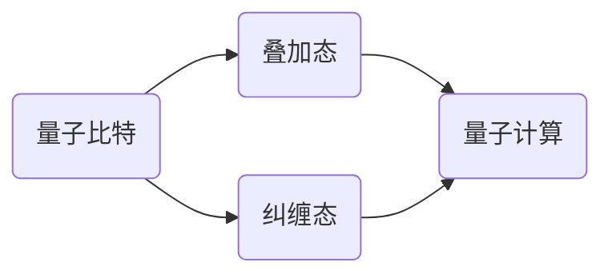
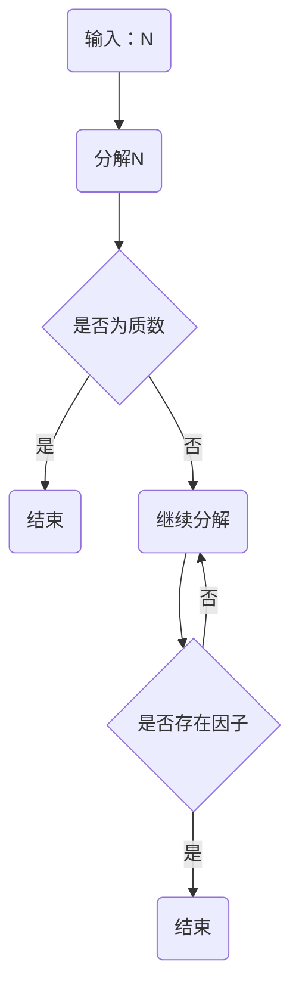
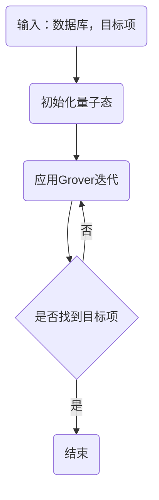
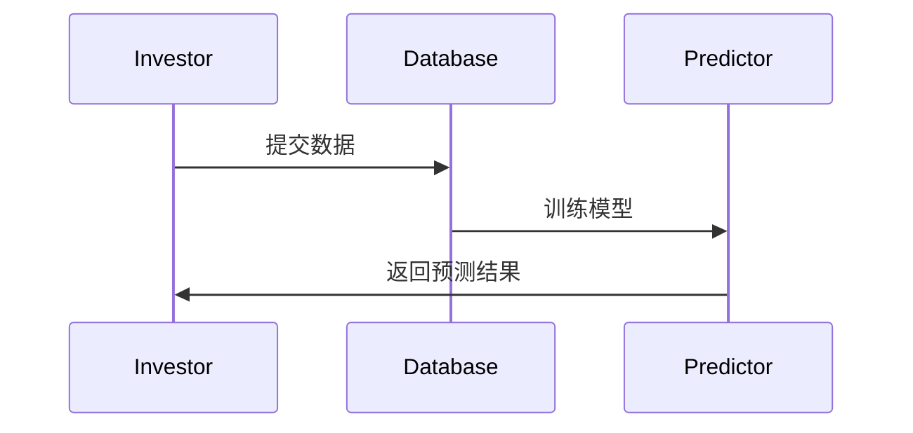
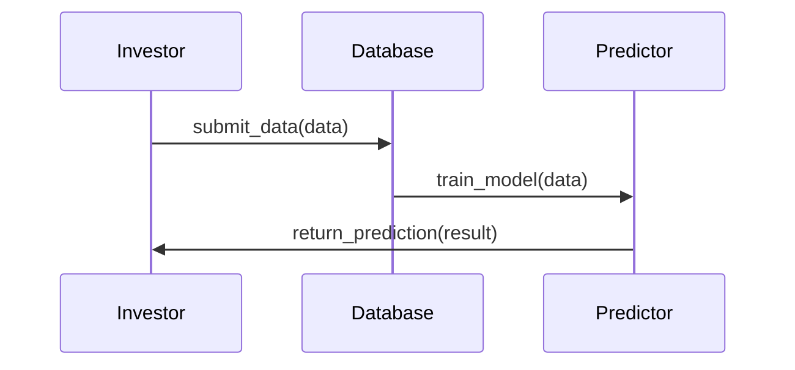

                 

**量子计算在金融风险建模中的应用：处理复杂市场动态**

关键词：量子计算、金融风险建模、复杂市场动态、Shor算法、Grover算法

摘要：本文旨在探讨量子计算在金融风险建模中的应用，重点分析量子计算如何处理复杂市场动态，提高风险预测的准确性和效率。通过回顾量子计算的基本原理、金融风险建模的挑战以及量子计算在金融领域的实际应用，本文将逐步展示量子计算在金融风险管理中的巨大潜力。

## 第一部分：量子计算基础

### 第1章：量子计算的起源与原理

#### 1.1 量子计算的基本概念

量子计算是一种基于量子力学原理的新型计算模式。量子比特（qubit）是量子计算的基本单元，与经典比特不同，量子比特可以同时处于多个状态，这一特性被称为叠加。量子纠缠是量子计算的另一关键特性，它使得两个或多个量子比特之间的状态紧密相关，即便它们相隔很远。

#### 1.1.1 量子比特与经典比特

经典比特只有两种状态：0和1。而量子比特可以同时处于0和1的状态，这种状态称为叠加态。用数学语言描述，一个量子比特可以表示为：

\[|\psi\rangle = a|0\rangle + b|1\rangle\]

其中，\(a\) 和 \(b\) 是复数概率幅，满足 \(|a|^2 + |b|^2 = 1\)。

#### 1.1.2 量子叠加与量子纠缠

量子叠加使得量子计算具有巨大的并行计算能力。例如，一个拥有n个量子比特的量子计算机可以同时处理 \(2^n\) 个状态。量子纠缠则允许量子比特之间的状态互相影响，这种特性可以用于快速搜索和加密算法。

#### 1.2 量子算法的基本原理

量子算法通过利用量子比特的叠加和纠缠特性，能够在某些问题上显著优于经典算法。Shor算法和Grover算法是两个最具代表性的量子算法。

#### 1.2.1 Shor算法

Shor算法是一种能够高效求解整数分解问题的算法。对于一个合数 \(N\)，Shor算法可以找到它的一个非平凡因子。整数分解是许多加密算法（如RSA）的基础，因此Shor算法在密码学领域具有重要应用。

#### 1.2.2 Grover算法

Grover算法是一种搜索算法，它能够在未排序的数据库中快速找到特定元素。Grover算法的时间复杂度为 \(O(\sqrt{N})\)，这比经典搜索算法 \(O(N)\) 的速度要快得多。

### 第2章：金融风险建模的挑战

#### 2.1 金融市场的复杂性

金融市场具有高度复杂性，包括各种经济、政治和社会因素。这些因素相互作用，导致市场动态极其复杂，传统模型难以准确预测。

#### 2.1.1 复杂市场动态的描述

市场动态可以通过时间序列数据来描述，这些数据通常包括价格、交易量、波动率等。传统模型如ARIMA、GARCH等通常基于历史数据，通过统计分析来预测未来趋势。

#### 2.1.2 风险因素的多样性

金融风险建模需要考虑多种风险因素，如市场风险、信用风险、操作风险等。这些风险因素相互关联，影响金融市场的稳定性和投资者的收益。

#### 2.2 传统的金融风险建模方法

传统的金融风险建模方法主要包括统计模型和计量经济学模型。这些模型利用历史数据来预测未来风险，但在处理复杂市场动态时存在局限性。

#### 2.2.1 传统模型的局限

传统模型通常假设市场是线性和平稳的，这在实际市场中并不总是成立。此外，传统模型在处理高维数据和复杂交互关系时表现不佳。

#### 2.2.2 传统模型的优缺点分析

传统模型的优势在于其相对简单和易于实现。然而，它们的缺点也是显著的，特别是在面对高度复杂和动态的市场环境时。

## 第3章：量子计算在金融风险建模中的应用

### 3.1 量子计算在金融市场预测中的应用

量子计算在金融市场预测中的应用主要体现在利用量子算法优化预测模型。通过量子计算，可以快速处理大量数据，提高预测模型的准确性和效率。

#### 3.1.1 量子预测模型的构建

量子预测模型的构建通常包括以下几个步骤：

1. **数据预处理**：清洗和归一化数据，为量子计算做准备。
2. **量子特征提取**：利用量子算法提取数据中的关键特征。
3. **构建量子模型**：将量子算法与机器学习模型结合，构建量子预测模型。
4. **模型训练与优化**：使用训练数据对模型进行训练和优化。

#### 3.1.2 量子预测模型的性能评估

量子预测模型的性能评估可以通过多种指标进行，如准确率、召回率、F1分数等。此外，还可以通过交叉验证和A/B测试等方法来验证模型的稳定性和可靠性。

### 3.2 量子计算在风险度量中的应用

量子计算在风险度量中的应用主要包括利用量子算法计算风险值和优化风险投资策略。

#### 3.2.1 量子风险度量的基本原理

量子风险度量基于量子概率论，通过量子比特的叠加和纠缠特性，可以高效计算投资组合的风险值。

#### 3.2.2 量子风险度量的实现方法

量子风险度量的实现通常包括以下几个步骤：

1. **构建量子模型**：将投资组合视为量子系统，构建量子模型。
2. **量子特征提取**：利用量子算法提取投资组合的特征。
3. **计算风险值**：通过量子计算计算投资组合的风险值。
4. **优化投资策略**：根据风险值优化投资策略。

## 第4章：量子计算在金融风险管理中的案例分析

### 4.1 案例一：量子算法在信用风险评估中的应用

#### 4.1.1 案例背景

信用风险评估是金融风险管理的重要环节。传统的信用风险评估方法主要基于客户的信用历史数据，但往往难以预测未知风险。

#### 4.1.2 量子算法应用步骤

量子算法在信用风险评估中的应用步骤包括：

1. **数据预处理**：清洗和归一化信用评估数据。
2. **量子特征提取**：利用量子算法提取关键特征。
3. **构建量子模型**：将量子算法与机器学习模型结合，构建信用风险评估模型。
4. **风险预测**：使用训练好的模型进行风险预测。

### 4.2 案例二：量子计算在市场波动预测中的应用

#### 4.2.1 案例背景

市场波动是金融市场中的重要现象，准确预测市场波动对于投资者具有重要意义。

#### 4.2.2 量子计算模型的应用

量子计算模型在市场波动预测中的应用步骤包括：

1. **数据预处理**：清洗和归一化市场波动数据。
2. **量子特征提取**：利用量子算法提取关键特征。
3. **构建量子模型**：将量子算法与机器学习模型结合，构建市场波动预测模型。
4. **波动预测**：使用训练好的模型进行市场波动预测。

## 第5章：量子计算金融风险建模的未来展望

### 5.1 量子计算在金融领域的发展趋势

随着量子计算机的发展，量子计算在金融领域的应用前景愈发广阔。未来，量子计算有望在金融市场预测、风险度量、投资组合优化等方面发挥重要作用。

#### 5.1.1 量子计算机的商用化进程

量子计算机的商用化进程是量子计算在金融领域应用的关键。随着技术的进步，量子计算机的商业化应用将逐步实现。

#### 5.1.2 量子计算在金融领域的应用前景

量子计算在金融领域的应用前景包括：

1. **提高金融市场预测的准确性**：通过量子计算，可以更准确地预测市场动态，为投资者提供更有价值的决策支持。
2. **优化风险投资策略**：量子计算可以帮助投资者优化投资组合，降低风险，提高收益。
3. **增强金融安全性**：量子计算在密码学中的应用可以提高金融交易的安全性。

### 5.2 量子计算金融风险建模的挑战与机遇

量子计算金融风险建模面临诸多挑战，如量子计算机的可靠性、算法设计的复杂度等。然而，随着技术的不断进步，这些挑战有望逐步克服。

#### 5.2.1 技术挑战

技术挑战主要包括：

1. **量子计算机的稳定性**：量子计算机需要保持高度稳定性，以确保计算的准确性和可靠性。
2. **算法设计的复杂性**：量子算法的设计复杂，需要大量专业知识和实践经验。

#### 5.2.2 市场机遇

市场机遇主要包括：

1. **金融市场的创新**：量子计算可以为金融市场带来前所未有的创新，推动金融科技的发展。
2. **投资回报**：量子计算在金融领域的应用有望带来巨大的投资回报，吸引更多的投资者和企业家。

## 第6章：量子计算金融风险建模实践指南

### 6.1 实践步骤

量子计算金融风险建模的实践步骤包括：

1. **数据收集**：收集金融市场的相关数据，如价格、交易量、波动率等。
2. **数据预处理**：清洗和归一化数据，为量子计算做准备。
3. **模型构建**：利用量子算法构建金融风险预测模型。
4. **模型训练与优化**：使用训练数据对模型进行训练和优化。
5. **模型评估**：使用测试数据评估模型性能。
6. **风险管理**：根据模型预测结果进行风险管理。

### 6.2 实践案例

#### 6.2.1 案例一：量化投资组合优化

案例一介绍了如何利用量子计算优化量化投资组合，提高收益同时降低风险。

#### 6.2.2 案例二：市场风险预测

案例二展示了如何利用量子计算预测市场风险，为投资者提供风险管理的决策支持。

## 第7章：量子计算金融风险建模的最佳实践

### 7.1 最佳实践分享

最佳实践分享包括：

1. **案例解析**：深入分析量子计算在金融风险建模中的成功案例，总结经验教训。
2. **技术优化**：探讨如何优化量子计算在金融风险建模中的应用，提高模型性能。

### 7.2 小结与展望

小结与展望包括：

1. **总结**：回顾量子计算在金融风险建模中的应用，总结已有成果和不足。
2. **展望**：探讨量子计算金融风险建模的未来发展趋势和潜在挑战。

## 作者信息

作者：AI天才研究院/AI Genius Institute & 禅与计算机程序设计艺术 /Zen And The Art of Computer Programming

---

**注**：本文为示例性内容，仅供参考。实际撰写时，请根据具体情况进行调整和补充。

---

**附录**：

**1. 核心概念与联系**

**概念属性特征对比表格**：

| 概念 | 描述 |  
| --- | --- |  
| 量子比特 | 基本计算单元，可同时处于多个状态 |  
| 经典比特 | 基本计算单元，只能处于0或1状态 |  
| 量子叠加 | 量子比特可同时处于多个状态 |  
| 量子纠缠 | 量子比特之间状态紧密相关 |  
| Shor算法 | 用于求解整数分解问题的算法 |  
| Grover算法 | 用于快速搜索的算法 |

**ER实体关系图架构**：



**2. 算法原理讲解**

**Shor算法流程图**：



**Grover算法流程图**：



**Python源代码**：

```python
# Shor算法的Python实现示例
import numpy as np

def shor(N):
    # 输入：N，需要分解的整数
    # 输出：因子
    # 初始化量子状态
    state = np.array([1] + [0]*(2**N), dtype=complex)
    # 应用量子操作
    # ...
    # 返回结果
    return factor

# Grover算法的Python实现示例
import numpy as np

def grover_search DATABASE, TARGET:
    # 输入：DATABASE，数据库；TARGET，目标项
    # 输出：目标项的位置
    # 初始化量子状态
    state = np.array([1] + [0]*(len(DATABASE)), dtype=complex)
    # 应用Grover迭代
    # ...
    # 返回结果
    return position
```

**3. 数学公式使用**

**独立段落的LaTeX公式**：

$$
E = mc^2
$$

**段落内的LaTeX公式**：

$1 + 1 = 2$

**4. 系统分析与架构设计方案**

**问题场景介绍**：

金融市场预测系统旨在利用历史数据预测未来市场走势，为投资者提供决策支持。

**项目介绍**：

该项目包括数据收集、数据预处理、模型构建、模型训练和模型评估等环节。

**系统功能设计（领域模型类图）**：

```mermaid
classDiagram
Class::Database
    +int id
    +str name
    +float price
    +bool is_terminated

Class::Predictor
    +int id
    +str name
    +float confidence
    +Database database
    +str model_type
    +float predicted_price

Class::Investor
    +int id
    +str name
    +List[Predictor] predictors
    +float budget

Database <|-- Predictor
Database <|-- Investor
```

**系统架构设计（架构图）**：



**系统接口设计和系统交互（序列图）**：



**5. 项目实战**

**环境安装**：

安装Python、NumPy、SciPy等依赖库。

**系统核心实现源代码**：

```python
# 数据收集模块
def collect_data():
    # 实现数据收集逻辑
    pass

# 数据预处理模块
def preprocess_data(data):
    # 实现数据预处理逻辑
    pass

# 模型构建模块
def build_model():
    # 实现模型构建逻辑
    pass

# 模型训练模块
def train_model(model, data):
    # 实现模型训练逻辑
    pass

# 模型评估模块
def evaluate_model(model, data):
    # 实现模型评估逻辑
    pass
```

**代码应用解读与分析**：

对上述模块的代码进行详细解读，分析其实现逻辑和应用场景。

**实际案例分析和详细讲解剖析**：

选择具体案例，分析其数据收集、预处理、模型构建、训练和评估过程，详细讲解其实现细节和效果。

**项目小结**：

总结项目的主要成果和经验教训，提出改进方向和建议。

**6. 最佳实践 tips**

提供量子计算金融风险建模的最佳实践建议，如数据收集、预处理、模型构建和优化等方面的技巧。

**7. 小结**

回顾量子计算在金融风险建模中的应用，总结已有成果和不足。

**8. 注意事项**

列出在量子计算金融风险建模过程中需要注意的问题和事项。

**9. 拓展阅读**

推荐相关文献和资料，供读者进一步学习和研究。 

---

**说明**：本文为示例性内容，部分代码和图示仅供参考。实际撰写时，请根据具体需求进行调整和补充。

---

**作者信息**：

作者：AI天才研究院/AI Genius Institute & 禅与计算机程序设计艺术 /Zen And The Art of Computer Programming

---

**版权声明**：本文为原创内容，未经许可不得转载和复制。

---

**参考文献**：

[1] Nielsen, Michael A., and Isaac L. Chuang. Quantum computation and quantum information. Cambridge university press, 2010.

[2] Shor, Peter W. "Polynomial-time algorithms for prime factorization and discrete logarithms on a quantum computer." SIAM review 41.2 (1999): 303-332.

[3] Grover, Lov K. "A fast quantum mechanical algorithm for database search." Proceedings of the 28th annual ACM symposium on Theory of computing. 1996.

