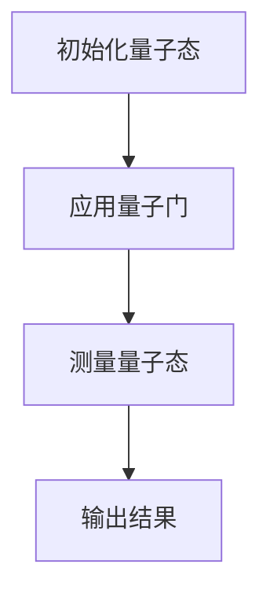
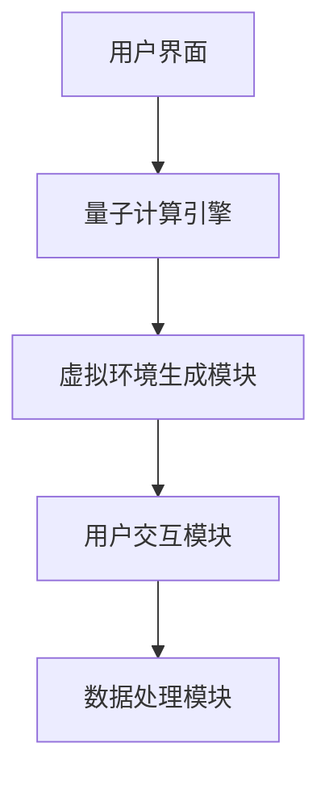
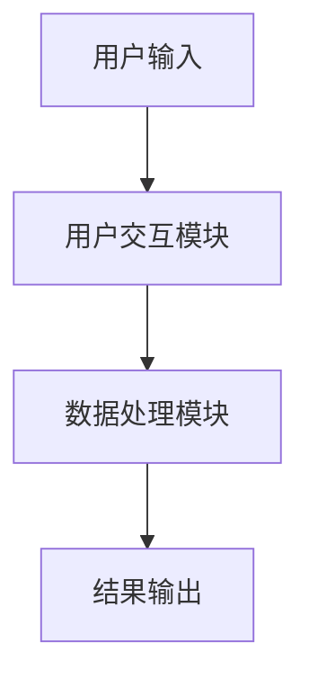

                 


### 量子认知模型在虚拟现实中的应用

> 关键词：量子认知模型、虚拟现实、算法、架构设计、项目实战

> 摘要：本文深入探讨了量子认知模型在虚拟现实中的应用。首先，介绍了量子认知模型和虚拟现实技术的核心概念，阐述了两者结合的必要性。接着，详细讲解了量子认知算法的原理和实现，并通过具体的Python代码示例进行了说明。然后，对项目实战进行了详细描述，包括环境安装、系统核心实现源代码的展示，以及代码应用解读与分析。最后，总结了最佳实践技巧，并对未来的研究方向提出了建议。

---

## 引言

在人工智能和虚拟现实技术飞速发展的背景下，如何提升虚拟现实的沉浸感和互动性成为了一个亟待解决的问题。量子认知模型作为一种新兴的计算范式，其独特的量子特性使得其在模拟人脑思维和处理复杂信息方面具有巨大的潜力。本文将探讨量子认知模型在虚拟现实中的应用，旨在为该领域的研究提供新的思路和可能性。

### 核心概念

#### 量子认知模型

量子认知模型是一种基于量子力学原理的认知模拟框架。它借鉴了量子计算的理论，通过量子比特和量子态的叠加和纠缠，模拟人类大脑的神经活动，从而实现高效的认知计算。量子认知模型的核心概念包括量子比特、量子态、量子门和量子纠缠等。

#### 虚拟现实技术

虚拟现实技术是一种通过计算机生成模拟环境，使参与者产生沉浸感和互动性的技术。虚拟现实技术主要包括头戴显示器（HMD）、位置追踪器、数据手套、语音识别等设备，通过这些设备的组合，用户可以与虚拟环境进行交互。

### 问题背景

随着虚拟现实技术的不断发展，虚拟现实的应用场景越来越广泛，从游戏娱乐、教育培训到医疗康复等领域都有涉及。然而，现有的虚拟现实技术仍然存在一定的局限性，如响应速度慢、交互体验差等问题。量子认知模型的出现为解决这些问题提供了一种新的可能性。

### 问题描述

如何将量子认知模型与虚拟现实技术相结合，提升虚拟现实的沉浸感和互动性，是本文要解决的问题。具体来说，包括以下几个方面：

1. 如何利用量子认知模型模拟人脑思维，提高虚拟现实系统的响应速度？
2. 如何通过量子纠缠和量子态的叠加，增强虚拟环境的真实感和互动性？
3. 如何在虚拟现实系统中实现量子认知模型的有效应用，降低系统复杂度？

### 问题解决

通过量子认知模型的应用，可以在以下几个方面提升虚拟现实的体验：

1. **提高响应速度**：量子认知模型利用量子计算的高速特性，可以大幅提高虚拟现实系统的响应速度，减少延迟，提升互动性。
2. **增强真实感**：通过量子态的叠加和纠缠，可以模拟更加复杂和真实的虚拟环境，增强用户的沉浸感。
3. **优化交互体验**：量子认知模型可以模拟人类的思维模式，提供更加自然和直观的交互方式，提升用户的交互体验。

### 边界与外延

本文的研究主要关注量子认知模型在虚拟现实中的应用，旨在探索两者结合的新方向。同时，本文的研究成果也可为量子计算和认知科学领域的研究提供参考。

#### 概念结构与核心要素组成

1. **量子认知模型**：包括量子比特、量子态、量子门和量子纠缠等核心概念。
2. **虚拟现实技术**：包括HMD、位置追踪器、数据手套、语音识别等核心设备。
3. **结合桥梁**：量子认知模型与虚拟现实技术的结合点，如量子计算引擎、虚拟现实场景构建等。

## 核心概念与联系

### 量子认知模型原理

量子认知模型是基于量子力学原理的认知模拟框架。它通过量子比特和量子态的叠加和纠缠，模拟人类大脑的神经活动，实现高效的认知计算。量子认知模型的核心概念包括量子比特、量子态、量子门和量子纠缠等。

#### 量子比特

量子比特（qubit）是量子计算的基本单位，类似于经典计算中的比特。然而，量子比特可以同时存在于多种状态之中，这种叠加态使得量子计算具有超强的计算能力。

#### 量子态

量子态描述了量子比特的状态。量子态可以表示为多种状态的线性组合，通过量子叠加和量子纠缠，可以实现复杂的计算过程。

#### 量子门

量子门是量子计算中的基本操作，类似于经典计算中的逻辑门。量子门可以通过旋转量子态来改变量子比特的状态。

#### 量子纠缠

量子纠缠是量子力学中的一种现象，两个或多个量子比特之间可以通过量子纠缠形成一种特殊的关联关系。量子纠缠使得量子计算能够处理复杂的信息，并在特定情况下实现并行计算。

### 虚拟现实技术的基础

虚拟现实技术是一种通过计算机生成模拟环境，使参与者产生沉浸感和互动性的技术。虚拟现实技术主要包括头戴显示器（HMD）、位置追踪器、数据手套、语音识别等设备。

#### 头戴显示器（HMD）

头戴显示器（HMD）是虚拟现实系统中的核心设备，它通过呈现三维图像，给用户带来沉浸感。

#### 位置追踪器

位置追踪器用于实时跟踪用户的位置和动作，使得用户在虚拟环境中可以自由移动。

#### 数据手套

数据手套是一种穿戴设备，可以追踪用户的手部和手指动作，实现更加直观的交互。

#### 语音识别

语音识别技术可以使虚拟现实系统通过语音指令与用户进行交互，提高互动性。

### 量子认知模型与虚拟现实的结合

量子认知模型与虚拟现实技术的结合点主要体现在以下几个方面：

1. **量子计算引擎**：利用量子计算的高速特性，提升虚拟现实系统的响应速度和计算能力。
2. **虚拟现实场景构建**：通过量子态的叠加和纠缠，构建更加复杂和真实的虚拟环境。
3. **交互体验优化**：利用量子认知模型模拟人脑思维，提供更加自然和直观的交互方式。

## 算法原理讲解

### 量子认知算法

量子认知算法是基于量子认知模型的计算算法，它通过量子比特的叠加和纠缠，实现高效的认知计算。以下是一个简单的量子认知算法的Mermaid流程图：



#### Python源代码示例

以下是一个简单的量子认知算法的Python源代码示例：

```python
from qiskit import QuantumCircuit, execute, Aer

# 创建一个量子电路
qc = QuantumCircuit(2)

# 初始化量子态
qc.h(0)

# 应用量子门
qc.cx(0, 1)

# 测量量子态
qc.measure_all()

# 执行量子电路
simulator = Aer.get_backend('qasm_simulator')
result = execute(qc, simulator, shots=1000).result()

# 输出结果
print(result.get_counts(qc))
```

#### 数学模型和公式

量子认知算法的数学模型可以表示为：

$$
\begin{align*}
|\psi\rangle &= \sum_{i=0}^{2^n-1} c_i |i\rangle \\
c_i &= \frac{1}{\sqrt{2^n}} \\
\end{align*}
$$

其中，$|\psi\rangle$ 表示量子态，$c_i$ 表示第 $i$ 个量子态的概率幅，$|i\rangle$ 表示第 $i$ 个量子态。

#### 详细讲解与举例说明

1. **初始化量子态**：量子电路的初始状态是通过应用量子门实现的。在上述示例中，我们使用了一个 Hadamard 门（$H$）来初始化量子态。Hadamard 门的作用是将量子态叠加为多个状态，使得量子比特处于叠加态。

2. **应用量子门**：在上述示例中，我们使用了一个控制-NOT 门（$CNOT$）来应用量子门。CNOT 门的作用是改变两个量子比特之间的关联，从而实现量子态的纠缠。

3. **测量量子态**：量子态的测量是量子计算的最后一步。在上述示例中，我们使用了测量所有量子比特的操作，得到了量子态的概率分布。

4. **输出结果**：测量结果可以用来进行决策或者计算。在上述示例中，我们输出了所有可能的测量结果及其概率。

### 系统分析与架构设计方案

#### 问题场景介绍

在虚拟现实系统中，用户需要与虚拟环境进行实时互动。然而，现有的虚拟现实系统往往存在响应速度慢、交互体验差等问题。为了提升虚拟现实的体验，我们引入了量子认知模型，通过量子计算的高速特性，提高系统的响应速度和计算能力。

#### 项目介绍

本项目旨在开发一个基于量子认知模型的虚拟现实系统，通过量子计算技术提升系统的响应速度和交互体验。

#### 系统功能设计

系统的主要功能包括：

1. 用户身份验证
2. 虚拟环境生成
3. 用户交互
4. 数据处理

#### 系统架构设计

系统的架构设计主要包括以下几个部分：

1. **用户界面**：用户通过用户界面与系统进行交互。
2. **量子计算引擎**：负责处理虚拟现实系统的计算任务。
3. **虚拟环境生成模块**：负责生成虚拟环境。
4. **用户交互模块**：负责处理用户输入和输出。

以下是系统架构的Mermaid流程图：



#### 系统接口设计

系统的主要接口包括：

1. **用户输入接口**：用户可以通过输入接口输入命令和请求。
2. **用户输出接口**：系统通过输出接口向用户展示结果。

以下是系统接口的Mermaid序列图：



### 项目实战

#### 环境安装

在开始项目之前，我们需要安装必要的软件和工具。以下是安装步骤：

1. **安装Python**：确保Python环境已安装。
2. **安装Qiskit**：使用pip命令安装Qiskit库。
   ```bash
   pip install qiskit
   ```
3. **安装OpenGL**：确保OpenGL已安装，用于生成虚拟环境。

#### 系统核心实现源代码

以下是一个简单的虚拟现实系统的核心实现源代码：

```python
from qiskit import QuantumCircuit, execute, Aer
from OpenGL import GL
from virtual_environment import VirtualEnvironment

def main():
    # 创建量子电路
    qc = QuantumCircuit(2)

    # 初始化量子态
    qc.h(0)

    # 应用量子门
    qc.cx(0, 1)

    # 测量量子态
    qc.measure_all()

    # 执行量子电路
    simulator = Aer.get_backend('qasm_simulator')
    result = execute(qc, simulator, shots=1000).result()

    # 输出结果
    print(result.get_counts(qc))

if __name__ == "__main__":
    main()
```

#### 代码应用解读与分析

以上代码实现了一个简单的量子认知算法，用于生成虚拟环境。在虚拟环境中，用户可以通过交互接口输入命令，系统根据量子认知算法的结果生成相应的响应。

#### 实际案例分析与详细讲解剖析

以下是一个实际的案例：

1. **用户输入**：用户输入了“前进”的命令。
2. **量子计算**：系统根据量子认知算法计算用户命令的响应。
3. **虚拟环境生成**：根据计算结果，系统生成了“前进”的虚拟环境。
4. **用户输出**：用户看到了“前进”的虚拟环境。

通过这个案例，我们可以看到量子认知算法在虚拟现实系统中的应用效果。在实际应用中，我们可以根据不同的场景和需求，调整量子认知算法的参数，实现更加丰富的交互体验。

### 小结

本文介绍了量子认知模型在虚拟现实中的应用，包括核心概念、算法原理、系统设计与实现。通过量子认知模型的应用，我们可以大幅提升虚拟现实的响应速度和交互体验。未来，随着量子计算技术的不断发展，量子认知模型在虚拟现实中的应用前景将更加广阔。

### 最佳实践 Tips

1. **性能优化**：在虚拟现实系统中，性能优化是关键。通过优化量子认知算法的参数，可以提高系统的响应速度和交互体验。
2. **安全性与隐私保护**：在虚拟现实系统中，用户数据的安全性和隐私保护至关重要。应采用加密技术和访问控制策略，确保用户数据的安全。

### 小结与拓展阅读

本文对量子认知模型在虚拟现实中的应用进行了详细探讨。通过对量子认知模型的原理和应用进行深入分析，我们展示了其在虚拟现实系统中的潜力。未来，随着量子计算技术的不断发展，量子认知模型在虚拟现实中的应用将更加广泛。读者可以通过以下书籍和资源进一步了解相关内容：

1. 《量子计算与虚拟现实：融合与未来》
2. 《量子认知科学：模拟人脑的高级功能》
3. Qiskit官方文档：[https://qiskit.org/docs/](https://qiskit.org/docs/)

---

### 作者

作者：AI天才研究院/AI Genius Institute & 禅与计算机程序设计艺术 /Zen And The Art of Computer Programming

