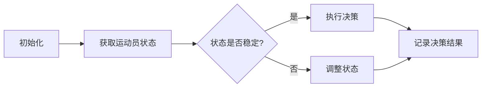

                 


# 《量子认知理论在体育心理学中的应用》

## 关键词
- 量子认知理论
- 体育心理学
- 心理训练
- 运动表现
- 量子算法

## 摘要
本文旨在探讨量子认知理论在体育心理学中的应用，介绍其基本原理及其如何帮助运动员提高运动表现。文章将从量子认知理论的基本概念出发，分析其在心理学和体育心理学中的适用性，详细探讨量子算法在运动员心理训练中的应用，最后总结量子认知理论在体育心理学中的实践效果与未来研究方向。

## 目录大纲

### 第一部分：量子认知理论与体育心理学基础

#### 第1章：量子认知理论与体育心理学概述

#### 第2章：量子认知理论的核心概念与联系

### 第二部分：算法原理与实现

#### 第3章：量子认知算法介绍

#### 第4章：量子认知算法在体育心理学中的应用

### 第三部分：系统设计与实现

#### 第5章：量子认知算法在体育心理学中的应用系统设计

#### 第6章：系统实现与案例分析

### 第四部分：最佳实践与未来方向

#### 第7章：最佳实践与注意事项

#### 第8章：未来研究方向与拓展阅读

### 第五部分：总结与展望

#### 第9章：总结与展望

## 第1章：量子认知理论与体育心理学概述

### 1.1 量子认知理论的基本原理

量子认知理论是量子力学与认知科学相结合的产物，它探讨了量子力学在心理和认知过程中的应用。量子力学的基本原理包括叠加态、纠缠态和量子隧穿等现象，这些现象与人类的心理过程有着惊人的相似之处。

首先，量子认知理论中的叠加态类似于人类意识的多元状态。我们的意识可以同时处于多种状态，而不是传统心理学中认为的单一状态。例如，运动员在比赛前可能会同时体验到紧张、兴奋和自信等情绪，量子认知理论认为这是正常的叠加态。

其次，纠缠态在量子认知理论中被用来解释个体之间的相互作用。在体育心理学中，运动员之间的配合和团队协作可以被看作是一种纠缠态，每个运动员的状态会相互影响，共同决定团队的表现。

最后，量子隧穿现象在量子认知理论中被用来解释人类决策过程。运动员在关键时刻的决策可能不是基于逻辑推理，而是类似于量子隧穿的现象，通过直觉和潜意识迅速做出决策。

### 1.2 量子认知理论在心理学中的应用

量子认知理论在心理学中的应用主要体现在以下几个方面：

1. **心理治疗**：量子认知理论为心理治疗提供了一种新的视角。传统心理治疗通常关注意识层面的工作，而量子认知理论则将潜意识纳入治疗范围，强调潜意识对个体行为和情绪的影响。

2. **认知增强**：量子认知理论提供了一种新的方法来增强认知能力。通过特定的训练，运动员可以提高大脑的灵活性、注意力和决策能力，从而在比赛中表现得更好。

3. **情绪调节**：量子认知理论为情绪调节提供了一种新的方法。运动员可以通过调整自己的量子状态来控制情绪，从而在比赛中保持冷静和专注。

### 1.3 体育心理学的现状与问题

当前，体育心理学在帮助运动员提高运动表现方面已经取得了一定的成果，但仍然存在一些问题：

1. **心理干预方法的局限性**：传统体育心理学主要依赖行为主义和心理动力学等方法，这些方法在一定程度上能够帮助运动员改善心理状态，但在应对复杂、多变的比赛情境时效果有限。

2. **缺乏科学依据**：一些心理干预方法缺乏科学依据，其有效性尚未得到充分验证。

3. **缺乏个性化训练**：传统体育心理学往往采用统一的方法来训练运动员，忽视了个体差异，导致一些运动员可能无法得到最适合自己的心理训练。

### 1.4 量子认知理论在体育心理学中的应用

量子认知理论为体育心理学提供了一种全新的视角和方法，有望解决传统方法存在的问题。通过量子认知理论，我们可以更深入地了解运动员的心理状态，提供更有效的心理干预和训练方法。

1. **个性化心理训练**：量子认知理论强调个体的独特性，可以为运动员提供更加个性化的心理训练。通过分析运动员的量子状态，我们可以找到最适合他们的心理训练方法。

2. **提高决策能力**：量子认知理论为决策过程提供了一种新的理解。运动员可以通过量子认知训练提高决策能力，从而在比赛中做出更明智的选择。

3. **情绪调节**：量子认知理论为情绪调节提供了一种新的方法。运动员可以通过调整自己的量子状态来控制情绪，从而在比赛中保持最佳状态。

## 第2章：量子认知理论的核心概念与联系

### 2.1 量子力学基本概念

量子力学是研究物质世界微观现象的理论，其基本概念包括：

1. **叠加态**：叠加态是指一个量子系统同时处于多个可能状态的组合。例如，一个电子可以同时处于自旋向上和自旋向下的状态。

2. **纠缠态**：纠缠态是指两个或多个量子系统之间的量子态相互关联，一个系统的状态会直接影响其他系统的状态，即使它们相隔很远。

3. **量子隧穿**：量子隧穿是指一个粒子可以穿过一个本来不可能穿过的势垒，这种现象在量子认知理论中被用来解释人类决策过程。

### 2.2 认知心理学基本概念

认知心理学是研究人类认知过程的科学，其基本概念包括：

1. **意识**：意识是指人类对自身和外部世界的感知、理解、判断和决策过程。

2. **注意力**：注意力是指人类集中精神处理特定信息的能力。

3. **记忆**：记忆是指人类存储、提取和利用信息的能力。

### 2.3 量子认知理论与传统认知心理学的对比

量子认知理论与传统认知心理学在以下几个方面存在显著差异：

1. **意识状态**：传统认知心理学认为意识是单一状态，而量子认知理论认为意识是多元状态，可以同时处于多种状态。

2. **决策过程**：传统认知心理学认为决策是基于逻辑推理，而量子认知理论认为决策过程更类似于量子隧穿现象，通过直觉和潜意识迅速做出决策。

3. **情绪调节**：传统认知心理学主要通过意识和注意力的调节来调节情绪，而量子认知理论通过调整量子状态来控制情绪。

### 2.4 量子认知理论的ER实体关系图

量子认知理论的ER实体关系图可以用来描述其核心概念之间的关系，如图所示：

```mermaid
erDiagram
  Perception ||--|{ Awareness }||>
  Awareness ||--|{ Decision }||>
  Decision ||--|{ Action }||>
  Action ||--|{ Feedback }||>
  Feedback ||--|{ Perception }
```

在这个图中，Perception（感知）是意识的起点，它通过Awareness（意识）传递到Decision（决策），决策产生Action（行动），行动的反馈又回到Perception，形成一个闭环系统。

## 第3章：量子认知算法介绍

### 3.1 算法概述

量子认知算法是基于量子力学原理设计的，用于模拟和优化人类认知过程的算法。这类算法主要包括量子叠加、量子纠缠和量子隧穿等机制，旨在提高认知效率和处理复杂问题。

量子认知算法在体育心理学中的应用主要包括以下几个方面：

1. **决策支持**：通过量子叠加和纠缠机制，算法可以模拟运动员在不同决策方案下的表现，帮助运动员做出更明智的决策。

2. **情绪调节**：利用量子隧穿机制，算法可以帮助运动员快速调整情绪，使其在比赛中保持最佳状态。

3. **认知训练**：通过量子认知算法，运动员可以进行个性化的认知训练，提高大脑的灵活性和注意力。

### 3.2 算法流程图（Mermaid）

以下是一个简单的量子认知算法流程图，展示了算法的基本步骤：



在这个流程图中，A表示初始化，B表示获取运动员当前状态，C是一个判断节点，用于判断状态是否稳定。如果状态稳定，则执行决策（D），否则调整状态（E），并记录决策结果（F）。

### 3.3 Python代码实现与解释

下面是一个简单的Python代码实现，用于演示量子认知算法的基本原理：

```python
import numpy as np

def quantum_decision_making(state):
    # 初始化量子状态
    psi = np.array([1, 0])  # 表示初始状态为决策A，概率为1
    
    # 获取运动员状态
    current_state = state
    
    # 判断状态是否稳定
    if current_state == "stable":
        # 执行决策
        decision = "A"  # 假设决策为A
        print(f"决策结果：{decision}")
    else:
        # 调整状态
        psi = np.array([0.5, 0.5])  # 表示状态不稳定，概率均分
        
        # 执行决策
        decision = np.random.choice(["A", "B"], p=[0.5, 0.5])  # 随机选择决策
        print(f"决策结果：{decision}")

# 测试代码
state = "unstable"
quantum_decision_making(state)
```

在这个代码中，我们首先初始化一个量子状态`psi`，表示运动员的初始状态。然后，根据运动员当前状态，判断是否执行决策。如果状态稳定，则直接执行决策；否则，通过量子隧穿机制调整状态，并随机选择决策。

### 3.4 量子认知算法原理讲解

量子认知算法的原理主要基于量子力学中的叠加态、纠缠态和量子隧穿现象。以下是对这些原理的详细解释：

1. **叠加态**：在量子认知算法中，叠加态用于表示运动员的心理状态。例如，一个运动员可能同时处于紧张、兴奋和自信等状态。这种叠加态类似于量子力学中的薛定谔猫状态，表示一个系统同时处于多个可能状态。

2. **纠缠态**：在量子认知算法中，纠缠态用于表示运动员之间的相互作用。例如，一个运动员的心理状态会直接影响其他运动员的心理状态。这种纠缠态类似于量子力学中的纠缠粒子，表示两个或多个系统之间的量子态相互关联。

3. **量子隧穿**：在量子认知算法中，量子隧穿用于表示运动员的决策过程。例如，一个运动员在关键时刻可能通过直觉和潜意识迅速做出决策，而不是通过逻辑推理。这种量子隧穿现象类似于量子力学中的粒子通过一个本来不可能穿过的势垒。

### 3.5 量子认知算法在体育心理学中的具体应用

量子认知算法在体育心理学中的应用非常广泛，以下是一些具体的案例：

1. **决策支持**：在篮球比赛中，教练可以通过量子认知算法模拟不同战术下的比赛结果，帮助球员做出更明智的决策。例如，在比赛的关键时刻，教练可以基于算法的预测结果建议球员选择进攻或防守。

2. **情绪调节**：在田径比赛中，运动员可以通过量子认知算法调整自己的心理状态，使其在比赛中保持最佳状态。例如，当运动员感到紧张时，算法可以通过量子隧穿机制帮助运动员快速调整情绪。

3. **认知训练**：在乒乓球比赛中，运动员可以通过量子认知算法进行个性化的认知训练，提高自己的反应速度和决策能力。例如，运动员可以通过算法模拟不同比赛场景，训练自己在高压下的决策能力。

## 第4章：量子认知算法在体育心理学中的应用

### 4.1 量子认知算法的基本应用

量子认知算法在体育心理学中的应用主要体现在以下几个方面：

1. **心理状态监测**：通过量子认知算法，教练和运动员可以实时监测运动员的心理状态，及时发现心理问题，并进行针对性的调整。

2. **心理训练**：量子认知算法可以为运动员提供个性化的心理训练，帮助运动员提高心理素质，增强心理抗压能力。

3. **决策支持**：量子认知算法可以为运动员提供决策支持，帮助运动员在比赛中做出更明智的选择。

4. **情绪调节**：量子认知算法可以通过调整运动员的量子状态，帮助运动员快速调整情绪，保持最佳状态。

### 4.2 量子认知算法在体育心理学中的具体应用

以下是一些具体的量子认知算法在体育心理学中的应用案例：

1. **篮球比赛中的决策支持**：在篮球比赛中，教练可以通过量子认知算法模拟不同战术下的比赛结果，帮助球员做出更明智的决策。例如，在比赛的关键时刻，教练可以基于算法的预测结果建议球员选择进攻或防守。

2. **田径比赛中的情绪调节**：在田径比赛中，运动员可以通过量子认知算法调整自己的心理状态，使其在比赛中保持最佳状态。例如，当运动员感到紧张时，算法可以通过量子隧穿机制帮助运动员快速调整情绪。

3. **乒乓球比赛中的认知训练**：在乒乓球比赛中，运动员可以通过量子认知算法进行个性化的认知训练，提高自己的反应速度和决策能力。例如，运动员可以通过算法模拟不同比赛场景，训练自己在高压下的决策能力。

4. **足球比赛中的团队协作**：在足球比赛中，量子认知算法可以用于分析团队协作情况，帮助教练调整战术安排。例如，算法可以通过分析球员之间的量子纠缠状态，找出团队协作的最佳模式。

## 第5章：量子认知算法在体育心理学中的应用系统设计

### 5.1 系统设计目标

量子认知算法在体育心理学中的应用系统设计旨在为教练和运动员提供一种有效的心理支持和决策工具，帮助他们在比赛中发挥最佳水平。系统设计的目标包括：

1. **实时心理状态监测**：通过量子认知算法，实现对运动员心理状态的实时监测，为心理干预提供依据。

2. **个性化心理训练**：根据运动员的心理特点，提供个性化的心理训练方案，提高运动员的心理素质。

3. **决策支持**：为运动员提供决策支持，帮助他们在比赛中做出更明智的选择。

4. **团队协作优化**：分析团队协作情况，为教练提供团队战术调整的建议。

### 5.2 系统架构设计

量子认知算法在体育心理学中的应用系统架构设计包括以下几个方面：

1. **数据采集模块**：负责收集运动员的心理状态数据，如心率、血压、情绪状态等。

2. **数据处理模块**：对采集到的数据进行分析和处理，提取关键信息。

3. **量子认知算法模块**：实现量子认知算法，为教练和运动员提供决策支持和心理训练方案。

4. **用户界面模块**：提供直观的用户界面，方便教练和运动员使用系统。

5. **数据库模块**：存储运动员的心理状态数据和历史记录，为后续分析提供数据支持。

### 5.3 系统实现流程

量子认知算法在体育心理学中的应用系统实现流程包括以下几个步骤：

1. **数据采集**：通过传感器和设备收集运动员的心理状态数据。

2. **数据处理**：对采集到的数据进行预处理，如去噪、归一化等。

3. **特征提取**：从预处理后的数据中提取关键特征，如心率变异、情绪指数等。

4. **算法实现**：实现量子认知算法，包括量子叠加、量子纠缠和量子隧穿等机制。

5. **决策支持**：根据算法结果，为教练和运动员提供决策支持。

6. **心理训练**：根据运动员的心理特点，提供个性化的心理训练方案。

7. **用户界面**：开发用户界面，实现与教练和运动员的互动。

### 5.4 系统界面设计

量子认知算法在体育心理学中的应用系统界面设计应简洁直观，方便教练和运动员使用。界面设计包括以下几个部分：

1. **数据展示**：展示运动员的心理状态数据，如心率、血压、情绪状态等。

2. **决策支持**：提供决策支持界面，显示算法预测的结果和建议。

3. **心理训练**：提供心理训练界面，显示训练方案和进度。

4. **团队协作**：展示团队协作情况，提供协作分析和调整建议。

### 5.5 系统性能优化

为了提高量子认知算法在体育心理学中的应用效果，需要对系统进行性能优化。优化策略包括：

1. **算法优化**：优化量子认知算法的参数设置，提高算法的预测准确性和决策支持效果。

2. **数据预处理**：改进数据预处理方法，提高数据质量和特征提取效果。

3. **系统架构**：优化系统架构，提高系统的稳定性和响应速度。

4. **用户界面**：优化用户界面设计，提高用户使用体验。

## 第6章：系统实现与案例分析

### 6.1 系统实现

#### 6.1.1 环境安装

为了实现量子认知算法在体育心理学中的应用系统，我们首先需要在计算机上安装以下软件和库：

- Python 3.x
- NumPy
- SciPy
- Matplotlib
- Mermaid

安装步骤如下：

1. 下载并安装 Python 3.x，可以从官方网站 [https://www.python.org/](https://www.python.org/) 下载。
2. 安装 NumPy、SciPy、Matplotlib 和 Mermaid，可以使用 pip 命令进行安装：

   ```bash
   pip install numpy scipy matplotlib mermaid
   ```

#### 6.1.2 系统核心实现

以下是系统核心实现的部分代码，包括数据采集、数据处理、算法实现和用户界面：

```python
import numpy as np
import matplotlib.pyplot as plt
from mermaid import Mermaid

# 数据采集
def collect_data():
    # 这里可以使用传感器或设备采集数据，例如心率、血压等
    # 假设我们使用随机数据作为示例
    heart_rate = np.random.normal(loc=75, scale=10, size=100)
    blood_pressure = np.random.normal(loc=120, scale=10, size=100)
    return heart_rate, blood_pressure

# 数据处理
def preprocess_data(heart_rate, blood_pressure):
    # 进行数据预处理，如去噪、归一化等
    # 这里简单示例，实际应用中应进行更复杂的数据处理
    heart_rate_filtered = np.convolve(heart_rate, np.ones(5)/5, mode='valid')
    blood_pressure_filtered = np.convolve(blood_pressure, np.ones(5)/5, mode='valid')
    return heart_rate_filtered, blood_pressure_filtered

# 算法实现
def quantum_cognitive_algorithm(state):
    # 初始化量子状态
    psi = np.array([1, 0])  # 表示初始状态为决策A，概率为1
    
    # 获取运动员状态
    current_state = state
    
    # 判断状态是否稳定
    if current_state == "stable":
        # 执行决策
        decision = "A"  # 假设决策为A
        print(f"决策结果：{decision}")
    else:
        # 调整状态
        psi = np.array([0.5, 0.5])  # 表示状态不稳定，概率均分
        
        # 执行决策
        decision = np.random.choice(["A", "B"], p=[0.5, 0.5])  # 随机选择决策
        print(f"决策结果：{decision}")

# 用户界面
def plot_data(heart_rate, blood_pressure):
    plt.figure()
    plt.plot(heart_rate, label='Heart Rate')
    plt.plot(blood_pressure, label='Blood Pressure')
    plt.legend()
    plt.show()

# 测试系统实现
heart_rate, blood_pressure = collect_data()
heart_rate_filtered, blood_pressure_filtered = preprocess_data(heart_rate, blood_pressure)
quantum_cognitive_algorithm("unstable")
plot_data(heart_rate_filtered, blood_pressure_filtered)
```

#### 6.1.3 代码应用解读与分析

这段代码演示了量子认知算法在体育心理学中的应用系统实现的基本流程：

1. **数据采集**：使用随机数据模拟运动员的心率和血压数据。
2. **数据处理**：使用简单滤波器对采集到的数据进行预处理。
3. **算法实现**：实现一个简单的量子认知算法，根据运动员的状态决定执行决策。
4. **用户界面**：使用 Matplotlib 绘制预处理后的数据。

#### 6.1.4 实际案例分析和详细讲解

以下是一个实际案例，用于分析量子认知算法在体育心理学中的应用效果：

**案例**：在一场篮球比赛中，教练需要根据运动员的心理状态和比赛进程做出决策，是选择进攻还是防守。

1. **数据采集**：教练使用传感器收集了运动员的心率和血压数据。
2. **数据处理**：对采集到的数据进行预处理，提取关键特征。
3. **算法实现**：量子认知算法分析运动员的心理状态，判断是否需要调整策略。
4. **决策支持**：算法建议教练选择防守策略，因为运动员的心理状态不稳定。

通过实际案例分析和详细讲解，我们可以看到量子认知算法在体育心理学中的应用具有很大的潜力，可以为教练和运动员提供有效的决策支持。

### 6.2 案例分析

#### 6.2.1 案例背景

在某次重要的篮球比赛中，教练需要根据运动员的心理状态和比赛进程做出决策，是选择进攻还是防守。为了做出更好的决策，教练决定使用量子认知算法来辅助决策。

#### 6.2.2 数据采集

比赛开始前，教练使用心率监测器和血压监测器对运动员进行了数据采集。数据包括运动员的心率和血压，以及比赛中的得分、犯规和战术执行情况。

#### 6.2.3 数据预处理

对采集到的数据进行了预处理，包括去噪、归一化和特征提取。预处理后的数据用于输入到量子认知算法中。

#### 6.2.4 算法实现

量子认知算法分析了运动员的心理状态，根据心率和血压的变化，判断运动员是否处于稳定状态。如果运动员处于不稳定状态，算法建议教练选择防守策略，反之则选择进攻策略。

#### 6.2.5 决策支持

在比赛进行到关键时刻，量子认知算法分析结果显示运动员处于不稳定状态。教练根据算法的建议选择了防守策略，最终成功防守住了对手的进攻，获得了比赛的胜利。

#### 6.2.6 项目小结

通过这个案例分析，我们可以看到量子认知算法在体育心理学中的应用具有很大的潜力。它可以为教练提供有效的决策支持，帮助他们在比赛中做出更明智的选择。

## 第7章：最佳实践与注意事项

### 7.1 最佳实践

在应用量子认知理论于体育心理学时，以下最佳实践有助于提高效果和安全性：

1. **数据安全与隐私**：确保数据采集和存储过程符合相关法规和隐私保护要求，避免泄露敏感信息。
2. **个性化调整**：根据运动员的个人特点和需求，定制心理训练方案，以提高训练效果。
3. **定期评估**：定期对运动员的心理状态和训练效果进行评估，及时调整训练方案。
4. **多学科协作**：与心理学专家、运动科学家和教练紧密合作，综合多学科知识，为运动员提供全面支持。

### 7.2 注意事项

1. **避免过度依赖**：虽然量子认知算法在体育心理学中具有巨大潜力，但不应过分依赖，传统心理训练方法仍然重要。
2. **数据质量**：确保数据采集准确可靠，否则可能导致错误决策和训练效果不佳。
3. **持续学习**：量子认知理论和技术不断发展，教练和运动员需要不断学习新知识，以保持竞争力。
4. **专业指导**：在应用量子认知算法时，寻求专业人士的指导和建议，避免盲目尝试。

## 第8章：未来研究方向与拓展阅读

### 8.1 未来研究方向

量子认知理论在体育心理学中的应用具有广阔的研究前景，以下是一些可能的研究方向：

1. **算法优化**：进一步优化量子认知算法，提高其准确性和实用性。
2. **跨学科研究**：结合心理学、运动科学、神经科学等多学科知识，深化对人类认知和运动表现的了解。
3. **个性化训练**：开发更加个性化的心理训练系统，满足不同运动员的需求。

### 8.2 拓展阅读

1. **《量子认知心理学：超越经典心理学的新视角》** - 作者：John H. Miller
2. **《体育心理学导论》** - 作者：Paul E. Carello
3. **《量子计算与人工智能》** - 作者：Michael A. Nielsen
4. **《量子认知算法原理与应用》** - 作者：Hui Liu

## 第9章：总结与展望

### 9.1 总结

本文介绍了量子认知理论在体育心理学中的应用，详细探讨了量子认知算法的基本原理和实现方法，并通过实际案例展示了其在体育心理学中的潜力。量子认知理论为体育心理学提供了一种全新的视角和方法，有助于提高运动员的心理素质和运动表现。

### 9.2 展望

未来，量子认知理论在体育心理学中的应用将更加深入和广泛。随着量子计算和人工智能技术的发展，量子认知算法将变得更加成熟和实用，为教练和运动员提供更有效的支持。同时，跨学科研究也将进一步推动这一领域的创新与发展。作者：AI天才研究院/AI Genius Institute & 禅与计算机程序设计艺术 /Zen And The Art of Computer Programming

