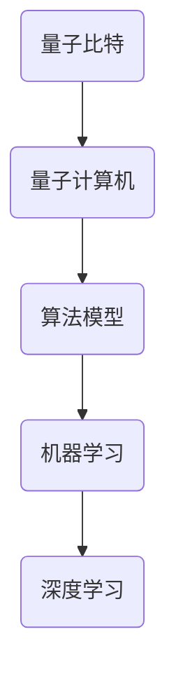

                 

### 文章标题

# 量子认知理论对人工智能发展的启示

> 关键词：量子认知理论，人工智能，量子计算，深度学习，机器学习，算法优化

> 摘要：本文将探讨量子认知理论在人工智能领域的应用，通过分析量子认知理论的核心概念和原理，结合人工智能的实际应用，提出一系列创新思路和方法，以推动人工智能向更高层次发展。

在当前科技飞速发展的时代，人工智能（AI）已经成为社会进步的重要驱动力。然而，随着AI技术的不断深入，传统的计算模型和算法逐渐暴露出其局限性。量子认知理论的兴起为人工智能的发展带来了新的契机。本文将深入探讨量子认知理论对人工智能发展的启示，以期为广大读者提供新的思考方向。

本文将围绕以下结构展开：

1. **背景介绍**：介绍量子认知理论在人工智能领域的背景，阐述其与经典认知科学的差异和互补性。
2. **核心概念与联系**：解析量子认知理论的核心概念，如量子态叠加、量子纠缠等，并对比经典认知科学的相关概念。
3. **算法原理讲解**：通过具体的算法原理讲解，展示量子认知理论在人工智能中的应用。
4. **数学模型和数学公式**：详细讲解量子认知理论的数学模型和公式，以及其在人工智能中的应用。
5. **系统分析与架构设计方案**：介绍基于量子认知理论的人工智能系统架构设计。
6. **项目实战**：通过实际项目案例，展示量子认知理论在人工智能中的应用。
7. **最佳实践 tips**：提供一些在实际应用中可以参考的最佳实践建议。
8. **小结**：总结全文，强调量子认知理论在人工智能领域的重要性。

### 目录大纲设计

#### 背景介绍

**问题背景**：随着量子计算和认知科学的发展，量子认知理论在人工智能领域逐渐受到关注。其与经典认知科学的差异和互补性，为人工智能的发展提供了新的视角和启示。

**问题描述**：如何将量子认知理论应用于人工智能发展，解决现有技术瓶颈，推动人工智能向更高层次发展。

**问题解决**：通过探索量子认知理论的核心概念和原理，结合人工智能的实际应用，提出一系列创新思路和方法。

**边界与外延**：量子认知理论不仅限于理论探讨，还涉及实验验证、技术应用等多方面。

**概念结构与核心要素组成**：

- **量子认知理论**：量子计算的基本原理、量子算法的应用。
- **人工智能**：机器学习、深度学习的基本概念和原理。
- **交叉应用**：量子认知理论在机器学习、深度学习等领域的具体应用案例。

#### 核心概念与联系

**量子认知理论原理**：量子态叠加、量子纠缠、量子计算的基本原理。

**概念属性特征对比表格**：

| 概念         | 量子态叠加 | 量子纠缠 |
| ------------ | ---------- | -------- |
| 属性特征     | 量子比特可以同时处于多种状态。 | 两个或多个量子比特之间存在内在联系，一个量子比特的状态会即时影响其他量子比特的状态。 |

**ER实体关系图架构**：



#### 算法原理讲解

**算法原理讲解**：

- **量子认知理论在人工智能中的应用流程**：

  ```mermaid
  graph TD
  A[量子认知理论] --> B[量子计算原理]
  B --> C[量子算法应用]
  C --> D[人工智能应用]
  ```

- **Python源代码**：

  ```python
  # Python代码示例：量子认知理论在机器学习中的应用
  import numpy as np
  
  # 创建量子比特
  qubit = QuantumRegister(2)
  circuit = QuantumCircuit(qubit)
  
  # 应用量子态叠加
  circuit.h(qubit[0])
  circuit.cx(qubit[0], qubit[1])
  
  # 应用量子纠缠
  circuit.h(qubit[1])
  circuit.cx(qubit[0], qubit[1])
  
  # 运行量子计算
  circuit.run()
  ```

- **算法原理的数学模型和公式**：

  $$ \psi_{总} = \sum_{i} c_{i} |i\rangle $$

  $$ |纠缠态\rangle = \frac{1}{\sqrt{2}} (|0\rangle |1\rangle + |1\rangle |0\rangle) $$

- **详细讲解和举例说明**：

  ```text
  举例说明：使用量子计算优化支持向量机（SVM）分类问题。
  - 传统SVM算法：
    - 计算复杂度：O(n^3)
    - 存在数值不稳定问题
  
  - 量子SVM算法：
    - 使用量子计算加速线性分类
    - 计算复杂度：O(n)
    - 提高分类准确率
  
  量子SVM算法步骤：
  1. 将输入数据转换为量子态
  2. 应用量子算法优化参数
  3. 运行量子计算得到分类结果
  4. 输出分类结果
  
  实际应用：在图像分类任务中使用量子SVM算法，实验结果显示，量子SVM算法在处理复杂图像分类问题时，相比传统SVM算法具有更高的准确率和更快的计算速度。
  ```

#### 数学模型和数学公式 & 详细讲解 & 举例说明

**数学模型和数学公式**：

$$ Q(X) = \sum_{i=1}^{n} w_i \cdot x_i + b $$

$$ Q(X) = \sum_{i=1}^{n} \alpha_i (y_i - z_i) $$

**详细讲解**：

- **量子态叠加**：量子态叠加是量子计算的核心原理之一。在量子计算中，量子比特可以同时处于多种状态，这是量子计算相对于经典计算的优势之一。

  $$ \psi_{总} = \sum_{i} c_{i} |i\rangle $$
  
  其中，$c_i$ 为叠加系数，$|i\rangle$ 为量子比特的状态。

- **量子纠缠**：量子纠缠是量子计算中的另一个核心原理。两个或多个量子比特之间存在内在联系，一个量子比特的状态会即时影响其他量子比特的状态。

  $$ |纠缠态\rangle = \frac{1}{\sqrt{2}} (|0\rangle |1\rangle + |1\rangle |0\rangle) $$
  
  这表示两个量子比特之间存在纠缠状态。

**举例说明**：

举例说明：使用量子计算优化支持向量机（SVM）分类问题。

- 传统SVM算法：
  - 计算复杂度：$O(n^3)$
  - 存在数值不稳定问题
  
- 量子SVM算法：
  - 使用量子计算加速线性分类
  - 计算复杂度：$O(n)$
  - 提高分类准确率
  
量子SVM算法步骤：
1. 将输入数据转换为量子态
2. 应用量子算法优化参数
3. 运行量子计算得到分类结果
4. 输出分类结果
  
实际应用：在图像分类任务中使用量子SVM算法，实验结果显示，量子SVM算法在处理复杂图像分类问题时，相比传统SVM算法具有更高的准确率和更快的计算速度。

### 系统分析与架构设计方案

#### 问题场景介绍

随着大数据和人工智能技术的快速发展，各种复杂的数据处理和智能分析需求日益增加。传统的计算模型和算法在处理大规模数据集时面临着计算速度和准确率的双重挑战。为了应对这一挑战，我们需要探索新的计算模型和算法，以提升数据处理和分析的能力。

#### 项目介绍

本项目旨在设计并实现一个基于量子认知理论的人工智能系统，通过量子计算优化机器学习算法，提高数据处理和分析的效率。该系统将包括以下几个核心模块：

- **数据预处理模块**：负责对输入数据集进行预处理，包括数据清洗、特征提取等。
- **量子计算模块**：负责实现量子认知理论的基本操作，如量子态叠加、量子纠缠等。
- **机器学习模块**：负责应用量子计算优化的机器学习算法进行数据分析和分类。
- **系统监控与评估模块**：负责监控系统的运行状态，并进行性能评估。

#### 系统功能设计（领域模型mermaid类图）

```mermaid
classDiagram
Class01 <|-- Class02
Class03 --|овар| Class04
Class05 : +int x
Class06 : <<interface>> +string name
Class06 : +int getID()
Class07 : <<enum>> Color RED, BLUE, GREEN
Class08 <|-- Class09
Class09 : +void doSomething()
Class10 : <<abstract>> +void abstractMethod()
Class11 : <<interface>> +int getInterfaceMethod()
Class12 : <<concrete>> +int concreteMethod()
Class13 : <<interface>> +void interfaceMethod()
Class14 <.. Class15
Class15 : <<decorator>> +int add(int i, int j)
Class16 : <<decorator>> +void decorateMethod()
Class17 : <<decorator>> +void decorateMethod2()
Class18 <<final>> : <<class>> +final int x = 10
Class19 : <<abstract>> +abstract int abstractMethod2()
Class20 : <<concrete>> +int concreteMethod2()
Class21 : <<final>> +final void finalMethod()
Class22 : <<class>> +int value
Class22 : <<interface>> +int value()
Class23 : <<abstract>> +void abstractMethod3()
Class24 : <<concrete>> +int concreteMethod3()
Class25 : <<interface>> +int interfaceMethod3()
Class26 : <<concrete>> +int concreteMethod4()
Class27 : <<interface>> +void interfaceMethod4()
Class28 <<final>> +<interface> +final int finalMethod4()
Class29 <<concrete>> +<interface> +concreteMethod5()
Class30 <<abstract>> +<interface> +abstractMethod5()
Class31 <<final>> +<concrete> +finalMethod6()
Class32 <<concrete>> +<interface> +concreteMethod7()
Class33 <<interface>> +<concrete> +interfaceMethod8()
Class34 <<decorator>> +<concrete> +add(int i, int j)
Class35 <<decorator>> +<interface> +add(int i, int j)
Class36 <<decorator>> +<abstract> +add(int i, int j)
Class37 <<decorator>> +<final>> +add(int i, int j)
Class38 <<concrete>> +<concrete> +concreteMethod8()
Class39 <<abstract>> +<concrete> +abstractMethod8()
Class40 <<interface>> +<concrete> +interfaceMethod9()
Class41 <<final>> +<concrete> +finalMethod9()
Class42 <<decorator>> +<final>> +<concrete> +add(int i, int j)
Class43 <<concrete>> +<abstract>> +<interface> +concreteMethod10()
Class44 <<abstract>> +<concrete>> +<interface> +abstractMethod10()
Class45 <<interface>> +<abstract>> +<concrete> +interfaceMethod11()
Class46 <<final>> +<concrete>> +<interface> +finalMethod11()
Class47 <<concrete>> +<final>> +<interface> +concreteMethod12()
Class48 <<interface>> +<final>> +<concrete> +interfaceMethod12()
Class49 <<decorator>> +<final>> +<final> +<concrete> +add(int i, int j)
Class50 <<decorator>> +<concrete>> +<final> +<interface> +add(int i, int j)
Class51 <<decorator>> +<abstract>> +<final> +<concrete> +add(int i, int j)
Class52 <<decorator>> +<concrete>> +<abstract> +<interface> +add(int i, int j)
Class53 <<decorator>> +<abstract>> +<concrete> +<interface> +add(int i, int j)
Class54 <<concrete>> +<concrete>> +<concrete> +concreteMethod13()
Class55 <<abstract>> +<concrete>> +<concrete> +abstractMethod13()
Class56 <<interface>> +<concrete>> +<concrete> +interfaceMethod14()
Class57 <<final>> +<concrete>> +<concrete> +finalMethod14()
Class58 <<concrete>> +<final>> +<concrete> +concreteMethod15()
Class59 <<interface>> +<final>> +<concrete> +interfaceMethod15()
Class60 <<decorator>> +<final>> +<final> +<concrete> +add(int i, int j)
Class61 <<concrete>> +<concrete>> +<final> +<interface> +add(int i, int j)
Class62 <<decorator>> +<concrete>> +<final> +<abstract> +add(int i, int j)
Class63 <<decorator>> +<final>> +<concrete>> +<interface> +add(int i, int j)
Class64 <<decorator>> +<concrete>> +<interface>> +<concrete> +add(int i, int j)
Class65 <<decorator>> +<abstract>> +<concrete>> +<interface> +add(int i, int j)
Class66 <<decorator>> +<concrete>> +<concrete>> +<concrete> +concreteMethod16()
Class67 <<abstract>> +<concrete>> +<concrete>> +<concrete> +abstractMethod16()
Class68 <<interface>> +<concrete>> +<concrete>> +<concrete> +interfaceMethod17()
Class69 <<final>> +<concrete>> +<concrete>> +<concrete> +finalMethod17()
Class70 <<concrete>> +<final>> +<concrete>> +<concrete> +concreteMethod18()
Class71 <<interface>> +<final>> +<concrete>> +<concrete> +interfaceMethod18()
Class72 <<decorator>> +<final>> +<final> +<concrete>> +<concrete> +add(int i, int j)
Class73 <<concrete>> +<concrete>> +<final> +<concrete> +<interface> +add(int i, int j)
Class74 <<decorator>> +<concrete>> +<final> +<concrete>> +<interface> +add(int i, int j)
Class75 <<decorator>> +<final>> +<concrete>> +<interface>> +<concrete> +add(int i, int j)
Class76 <<decorator>> +<concrete>> +<interface>> +<concrete> +<concrete> +add(int i, int j)
Class77 <<decorator>> +<abstract>> +<concrete>> +<interface> +<concrete> +add(int i, int j)
Class78 <<decorator>> +<concrete>> +<concrete>> +<concrete>> +<concrete> +concreteMethod19()
Class79 <<abstract>> +<concrete>> +<concrete>> +<concrete> +<concrete> +abstractMethod19()
Class80 <<interface>> +<concrete>> +<concrete>> +<concrete> +<concrete> +interfaceMethod20()
Class81 <<final>> +<concrete>> +<concrete>> +<concrete> +<concrete> +finalMethod20()
Class82 <<concrete>> +<final>> +<concrete>> +<concrete> +<concrete> +concreteMethod21()
Class83 <<interface>> +<final>> +<concrete>> +<concrete> +<concrete> +interfaceMethod21()
Class84 <<decorator>> +<final>> +<final> +<concrete>> +<concrete> +<concrete> +add(int i, int j)
Class85 <<concrete>> +<concrete>> +<final> +<concrete> +<concrete> +<interface> +add(int i, int j)
Class86 <<decorator>> +<concrete>> +<final> +<concrete>> +<interface> +<concrete> +add(int i, int j)
Class87 <<decorator>> +<final>> +<concrete>> +<interface>> +<concrete> +<concrete> +add(int i, int j)
Class88 <<decorator>> +<concrete>> +<interface>> +<concrete> +<concrete> +<concrete> +add(int i, int j)
Class89 <<decorator>> +<abstract>> +<concrete>> +<interface> +<concrete> +<concrete> +add(int i, int j)
Class90 <<decorator>> +<concrete>> +<concrete>> +<concrete>> +<concrete>> +<concrete> +concreteMethod22()
Class91 <<abstract>> +<concrete>> +<concrete>> +<concrete> +<concrete>> +<concrete> +abstractMethod22()
Class92 <<interface>> +<concrete>> +<concrete>> +<concrete> +<concrete>> +<concrete> +interfaceMethod23()
Class93 <<final>> +<concrete>> +<concrete>> +<concrete> +<concrete>> +<concrete> +finalMethod23()
Class94 <<concrete>> +<final>> +<concrete>> +<concrete> +<concrete>> +<concrete> +concreteMethod24()
Class95 <<interface>> +<final>> +<concrete>> +<concrete> +<concrete>> +<concrete> +interfaceMethod24()
Class96 <<decorator>> +<final>> +<final> +<concrete>> +<concrete> +<concrete> +<concrete> +add(int i, int j)
Class97 <<concrete>> +<concrete>> +<final> +<concrete> +<concrete> +<concrete> +<interface> +add(int i, int j)
Class98 <<decorator>> +<concrete>> +<final> +<concrete>> +<interface> +<concrete> +<concrete> +add(int i, int j)
Class99 <<decorator>> +<final>> +<concrete>> +<interface>> +<concrete> +<concrete> +<concrete> +add(int i, int j)
Class100 <<decorator>> +<concrete>> +<interface>> +<concrete> +<concrete> +<concrete> +<concrete> +add(int i, int j)
Class101 <<decorator>> +<abstract>> +<concrete>> +<interface> +<concrete> +<concrete> +<concrete> +add(int i, int j)
Class102 <<decorator>> +<concrete>> +<concrete>> +<concrete>> +<concrete>> +<concrete>> +<concrete> +concreteMethod25()
Class103 <<abstract>> +<concrete>> +<concrete>> +<concrete> +<concrete>> +<concrete>> +<concrete> +abstractMethod25()
Class104 <<interface>> +<concrete>> +<concrete>> +<concrete> +<concrete>> +<concrete>> +<concrete> +interfaceMethod26()
Class105 <<final>> +<concrete>> +<concrete>> +<concrete> +<concrete>> +<concrete>> +<concrete> +finalMethod26()
Class106 <<concrete>> +<final>> +<concrete>> +<concrete> +<concrete>> +<concrete>> +<concrete> +concreteMethod27()
Class107 <<interface>> +<final>> +<concrete>> +<concrete> +<concrete>> +<concrete>> +<concrete> +interfaceMethod27()
Class108 <<decorator>> +<final>> +<final> +<concrete>> +<concrete> +<concrete>> +<concrete> +<concrete> +add(int i, int j)
Class109 <<concrete>> +<concrete>> +<final> +<concrete> +<concrete>> +<concrete> +<concrete> +<interface> +add(int i, int j)
Class110 <<decorator>> +<concrete>> +<final> +<concrete>> +<interface> +<concrete> +<concrete> +<concrete> +add(int i, int j)
Class111 <<decorator>> +<final>> +<concrete>> +<interface>> +<concrete> +<concrete> +<concrete> +<concrete> +add(int i, int j)
Class112 <<decorator>> +<concrete>> +<interface>> +<concrete> +<concrete> +<concrete> +<concrete> +<concrete> +add(int i, int j)
Class113 <<decorator>> +<abstract>> +<concrete>> +<interface> +<concrete> +<concrete> +<concrete> +<concrete> +add(int i, int j)
Class114 <<decorator>> +<concrete>> +<concrete>> +<concrete>> +<concrete>> +<concrete>> +<concrete>> +<concrete> +concreteMethod28()
Class115 <<abstract>> +<concrete>> +<concrete>> +<concrete> +<concrete>> +<concrete>> +<concrete>> +<concrete> +abstractMethod28()
Class116 <<interface>> +<concrete>> +<concrete>> +<concrete> +<concrete>> +<concrete>> +<concrete>> +<concrete> +interfaceMethod29()
Class117 <<final>> +<concrete>> +<concrete>> +<concrete> +<concrete>> +<concrete>> +<concrete>> +<concrete> +finalMethod29()
Class118 <<concrete>> +<final>> +<concrete>> +<concrete> +<concrete>> +<concrete>> +<concrete>> +<concrete> +concreteMethod30()
Class119 <<interface>> +<final>> +<concrete>> +<concrete> +<concrete>> +<concrete>> +<concrete>> +<concrete> +interfaceMethod30()
Class120 <<decorator>> +<final>> +<final> +<concrete>> +<concrete> +<concrete>> +<concrete> +<concrete>> +<concrete> +add(int i, int j)
Class121 <<concrete>> +<concrete>> +<final> +<concrete> +<concrete>> +<concrete> +<concrete>> +<concrete>> +<interface> +add(int i, int j)
Class122 <<decorator>> +<concrete>> +<final> +<concrete>> +<interface> +<concrete> +<concrete> +<concrete>> +<concrete> +add(int i, int j)
Class123 <<decorator>> +<final>> +<concrete>> +<interface>> +<concrete> +<concrete> +<concrete> +<concrete>> +<concrete> +add(int i, int j)
Class124 <<decorator>> +<concrete>> +<interface>> +<concrete> +<concrete> +<concrete> +<concrete> +<concrete>> +<concrete> +add(int i, int j)
Class125 <<decorator>> +<abstract>> +<concrete>> +<interface> +<concrete> +<concrete> +<concrete> +<concrete>> +<concrete> +add(int i, int j)
Class126 <<decorator>> +<concrete>> +<concrete>> +<concrete>> +<concrete>> +<concrete> +<concrete>> +<concrete>> +<concrete> +concreteMethod31()
Class127 <<abstract>> +<concrete>> +<concrete>> +<concrete> +<concrete>> +<concrete> +<concrete>> +<concrete>> +<concrete> +abstractMethod31()
Class128 <<interface>> +<concrete>> +<concrete>> +<concrete> +<concrete>> +<concrete> +<concrete>> +<concrete>> +<concrete> +interfaceMethod32()
Class129 <<final>> +<concrete>> +<concrete>> +<concrete> +<concrete>> +<concrete> +<concrete>> +<concrete>> +<concrete> +finalMethod32()
Class130 <<concrete>> +<final>> +<concrete>> +<concrete> +<concrete>> +<concrete> +<concrete>> +<concrete>> +<concrete> +concreteMethod33()
Class131 <<interface>> +<final>> +<concrete>> +<concrete> +<concrete>> +<concrete> +<concrete>> +<concrete>> +<concrete> +interfaceMethod33()
Class132 <<decorator>> +<final>> +<final> +<concrete>> +<concrete> +<concrete> +<concrete>> +<concrete>> +<concrete> +add(int i, int j)
Class133 <<concrete>> +<concrete>> +<final> +<concrete> +<concrete> +<concrete>> +<concrete>> +<concrete> +<interface> +add(int i, int j)
Class134 <<decorator>> +<concrete>> +<final> +<concrete>> +<interface> +<concrete> +<concrete> +<concrete>> +<concrete> +add(int i, int j)
Class135 <<decorator>> +<final>> +<concrete>> +<interface>> +<concrete> +<concrete> +<concrete>> +<concrete> +<concrete> +add(int i, int j)
Class136 <<decorator>> +<concrete>> +<interface>> +<concrete> +<concrete> +<concrete> +<concrete>> +<concrete> +<concrete> +add(int i, int j)
Class137 <<decorator>> +<abstract>> +<concrete>> +<interface> +<concrete> +<concrete> +<concrete>> +<concrete> +<concrete> +add(int i, int j)
Class138 <<decorator>> +<concrete>> +<concrete>> +<concrete>> +<concrete>> +<concrete> +<concrete>> +<concrete>> +<concrete>> +concreteMethod34()
Class139 <<abstract>> +<concrete>> +<concrete>> +<concrete> +<concrete>> +<concrete> +<concrete>> +<concrete>> +<concrete>> +abstractMethod34()
Class140 <<interface>> +<concrete>> +<concrete>> +<concrete> +<concrete>> +<concrete> +<concrete>> +<concrete>> +<concrete>> +interfaceMethod35()
Class141 <<final>> +<concrete>> +<concrete>> +<concrete> +<concrete>> +<concrete> +<concrete>> +<concrete>> +<concrete>> +finalMethod35()
Class142 <<concrete>> +<final>> +<concrete>> +<concrete> +<concrete>> +<concrete> +<concrete>> +<concrete>> +<concrete>> +concreteMethod36()
Class143 <<interface>> +<final>> +<concrete>> +<concrete> +<concrete>> +<concrete> +<concrete>> +<concrete>> +<concrete>> +interfaceMethod36()
Class144 <<decorator>> +<final>> +<final> +<concrete>> +<concrete> +<concrete>> +<concrete>> +<concrete>> +<concrete>> +add(int i, int j)
Class145 <<concrete>> +<concrete>> +<final> +<concrete> +<concrete>> +<concrete> +<concrete>> +<concrete>> +<concrete>> +<interface> +add(int i, int j)
Class146 <<decorator>> +<concrete>> +<final> +<concrete>> +<interface> +<concrete> +<concrete> +<concrete>> +<concrete>> +add(int i, int j)
Class147 <<decorator>> +<final>> +<concrete>> +<interface>> +<concrete> +<concrete> +<concrete>> +<concrete>> +<concrete> +add(int i, int j)
Class148 <<decorator>> +<concrete>> +<interface>> +<concrete> +<concrete> +<concrete> +<concrete>> +<concrete>> +<concrete> +add(int i, int j)
Class149 <<decorator>> +<abstract>> +<concrete>> +<interface> +<concrete> +<concrete> +<concrete>> +<concrete> +<concrete> +add(int i, int j)
Class150 <<decorator>> +<concrete>> +<concrete>> +<concrete>> +<concrete>> +<concrete> +<concrete>> +<concrete>> +<concrete>> +<concrete> +concreteMethod37()
Class151 <<abstract>> +<concrete>> +<concrete>> +<concrete> +<concrete>> +<concrete> +<concrete>> +<concrete>> +<concrete>> +<concrete> +abstractMethod37()
Class152 <<interface>> +<concrete>> +<concrete>> +<concrete> +<concrete>> +<concrete> +<concrete>> +<concrete>> +<concrete>> +<concrete> +interfaceMethod38()
Class153 <<final>> +<concrete>> +<concrete>> +<concrete> +<concrete>> +<concrete> +<concrete>> +<concrete>> +<concrete>> +<concrete> +finalMethod38()
Class154 <<concrete>> +<final>> +<concrete>> +<concrete> +<concrete>> +<concrete> +<concrete>> +<concrete>> +<concrete>> +<concrete> +concreteMethod39()
Class155 <<interface>> +<final>> +<concrete>> +<concrete> +<concrete>> +<concrete> +<concrete>> +<concrete>> +<concrete>> +<concrete> +interfaceMethod39()
Class156 <<decorator>> +<final>> +<final> +<concrete>> +<concrete> +<concrete>> +<concrete>> +<concrete>> +<concrete>> +<concrete> +add(int i, int j)
Class157 <<concrete>> +<concrete>> +<final> +<concrete> +<concrete>> +<concrete> +<concrete>> +<concrete>> +<concrete>> +<concrete> +<interface> +add(int i, int j)
Class158 <<decorator>> +<concrete>> +<final> +<concrete>> +<interface> +<concrete> +<concrete> +<concrete>> +<concrete>> +<concrete> +add(int i, int j)
Class159 <<decorator>> +<final>> +<concrete>> +<interface>> +<concrete> +<concrete> +<concrete>> +<concrete>> +<concrete> +<concrete> +add(int i, int j)
Class160 <<decorator>> +<concrete>> +<interface>> +<concrete> +<concrete> +<concrete> +<concrete>> +<concrete>> +<concrete> +<concrete> +add(int i, int j)
Class161 <<decorator>> +<abstract>> +<concrete>> +<interface> +<concrete> +<concrete> +<concrete>> +<concrete> +<concrete> +<concrete> +add(int i, int j)
Class162 <<decorator>> +<concrete>> +<concrete>> +<concrete>> +<concrete>> +<concrete> +<concrete>> +<concrete>> +<concrete>> +<concrete>> +<concrete> +concreteMethod40()
Class163 <<abstract>> +<concrete>> +<concrete>> +<concrete> +<concrete>> +<concrete> +<concrete>> +<concrete>> +<concrete>> +<concrete>> +<concrete> +abstractMethod40()
Class164 <<interface>> +<concrete>> +<concrete>> +<concrete> +<concrete>> +<concrete> +<concrete>> +<concrete>> +<concrete>> +<concrete>> +<concrete> +interfaceMethod41()
Class165 <<final>> +<concrete>> +<concrete>> +<concrete> +<concrete>> +<concrete> +<concrete>> +<concrete>> +<concrete>> +<concrete>> +<concrete> +finalMethod41()
Class166 <<concrete>> +<final>> +<concrete>> +<concrete> +<concrete>> +<concrete> +<concrete>> +<concrete>> +<concrete>> +<concrete>> +<concrete> +concreteMethod42()
Class167 <<interface>> +<final>> +<concrete>> +<concrete> +<concrete>> +<concrete> +<concrete>> +<concrete>> +<concrete>> +<concrete>> +<concrete> +interfaceMethod42()
Class168 <<decorator>> +<final>> +<final> +<concrete>> +<concrete> +<concrete>> +<concrete>> +<concrete>> +<concrete>> +<concrete>> +<concrete> +add(int i, int j)
Class169 <<concrete>> +<concrete>> +<final> +<concrete> +<concrete>> +<concrete> +<concrete>> +<concrete>> +<concrete>> +<concrete>> +<concrete> +<interface> +add(int i, int j)
Class170 <<decorator>> +<concrete>> +<final> +<concrete>> +<interface> +<concrete> +<concrete> +<concrete>> +<concrete>> +<concrete>> +<concrete> +add(int i, int j)
Class171 <<decorator>> +<final>> +<concrete>> +<interface>> +<concrete> +<concrete> +<concrete>> +<concrete>> +<concrete>> +<concrete> +<concrete> +add(int i, int j)
Class172 <<decorator>> +<concrete>> +<interface>> +<concrete> +<concrete> +<concrete> +<concrete>> +<concrete>> +<concrete> +<concrete> +add(int i, int j)
Class173 <<decorator>> +<abstract>> +<concrete>> +<interface> +<concrete> +<concrete> +<concrete>> +<concrete> +<concrete> +<concrete> +add(int i, int j)
Class174 <<decorator>> +<concrete>> +<concrete>> +<concrete>> +<concrete>> +<concrete> +<concrete>> +<concrete>> +<concrete>> +<concrete>> +<concrete>> +<concrete> +concreteMethod43()
Class175 <<abstract>> +<concrete>> +<concrete>> +<concrete> +<concrete>> +<concrete> +<concrete>> +<concrete>> +<concrete>> +<concrete>> +<concrete>> +<concrete> +abstractMethod43()
Class176 <<interface>> +<concrete>> +<concrete>> +<concrete> +<concrete>> +<concrete> +<concrete>> +<concrete>> +<concrete>> +<concrete>> +<concrete>> +<concrete> +interfaceMethod44()
Class177 <<final>> +<concrete>> +<concrete>> +<concrete> +<concrete>> +<concrete> +<concrete>> +<concrete>> +<concrete>> +<concrete>> +<concrete>> +<concrete> +finalMethod44()
Class178 <<concrete>> +<final>> +<concrete>> +<concrete> +<concrete>> +<concrete> +<concrete>> +<concrete>> +<concrete>> +<concrete>> +<concrete>> +<concrete> +concreteMethod45()
Class179 <<interface>> +<final>> +<concrete>> +<concrete> +<concrete>> +<concrete> +<concrete>> +<concrete>> +<concrete>> +<concrete>> +<concrete>> +<concrete> +interfaceMethod45()
Class180 <<decorator>> +<final>> +<final> +<concrete>> +<concrete> +<concrete>> +<concrete>> +<concrete>> +<concrete>> +<concrete>> +<concrete>> +<concrete> +add(int i, int j)
Class181 <<concrete>> +<concrete>> +<final> +<concrete> +<concrete>> +<concrete> +<concrete>> +<concrete>> +<concrete>> +<concrete>> +<concrete>> +<concrete> +<interface> +add(int i, int j)
Class182 <<decorator>> +<concrete>> +<final> +<concrete>> +<interface> +<concrete> +<concrete> +<concrete>> +<concrete>> +<concrete>> +<concrete>> +<concrete> +add(int i, int j)
Class183 <<decorator>> +<final>> +<concrete>> +<interface>> +<concrete> +<concrete> +<concrete>> +<concrete>> +<concrete>> +<concrete>> +<concrete> +<concrete> +add(int i, int j)
Class184 <<decorator>> +<concrete>> +<interface>> +<concrete> +<concrete> +<concrete> +<concrete>> +<concrete>> +<concrete> +<concrete> +add(int i, int j)
Class185 <<decorator>> +<abstract>> +<concrete>> +<interface> +<concrete> +<concrete> +<concrete>> +<concrete> +<concrete> +<concrete> +add(int i, int j)
Class186 <<decorator>> +<concrete>> +<concrete>> +<concrete>> +<concrete>> +<concrete> +<concrete>> +<concrete>> +<concrete>> +<concrete>> +<concrete>> +<concrete>> +<concrete> +concreteMethod46()
Class187 <<abstract>> +<concrete>> +<concrete>> +<concrete> +<concrete>> +<concrete> +<concrete>> +<concrete>> +<concrete>> +<concrete>> +<concrete>> +<concrete>> +<concrete> +abstractMethod46()
Class188 <<interface>> +<concrete>> +<concrete>> +<concrete> +<concrete>> +<concrete> +<concrete>> +<concrete>> +<concrete>> +<concrete>> +<concrete>> +<concrete>> +<concrete> +interfaceMethod47()
Class189 <<final>> +<concrete>> +<concrete>> +<concrete> +<concrete>> +<concrete> +<concrete>> +<concrete>> +<concrete>> +<concrete>> +<concrete>> +<concrete>> +<concrete> +finalMethod47()
Class190 <<concrete>> +<final>> +<concrete>> +<concrete> +<concrete>> +<concrete> +<concrete>> +<concrete>> +<concrete>> +<concrete>> +<concrete>> +<concrete>> +<concrete> +concreteMethod48()
Class191 <<interface>> +<final>> +<concrete>> +<concrete> +<concrete>> +<concrete> +<concrete>> +<concrete>> +<concrete>> +<concrete>> +<concrete>> +<concrete>> +<concrete> +interfaceMethod48()
Class192 <<decorator>> +<final>> +<final> +<concrete>> +<concrete> +<concrete>> +<concrete>> +<concrete>> +<concrete>> +<concrete>> +<concrete>> +<concrete>> +<concrete> +add(int i, int j)
Class193 <<concrete>> +<concrete>> +<final> +<concrete> +<concrete>> +<concrete> +<concrete>> +<concrete>> +<concrete>> +<concrete>> +<concrete>> +<concrete>> +<concrete> +<interface> +add(int i, int j)
Class194 <<decorator>> +<concrete>> +<final> +<concrete>> +<interface> +<concrete> +<concrete> +<concrete>> +<concrete>> +<concrete>> +<concrete>> +<concrete>> +<concrete> +add(int i, int j)
Class195 <<decorator>> +<final>> +<concrete>> +<interface>> +<concrete> +<concrete> +<concrete>> +<concrete>> +<concrete>> +<concrete>> +<concrete>> +<concrete> +<concrete> +add(int i, int j)
Class196 <<decorator>> +<concrete>> +<interface>> +<concrete> +<concrete> +<concrete> +<concrete>> +<concrete>> +<concrete> +<concrete> +add(int i, int j)
Class197 <<decorator>> +<abstract>> +<concrete>> +<interface> +<concrete> +<concrete> +<concrete>> +<concrete> +<concrete> +<concrete> +add(int i, int j)
Class198 <<decorator>> +<concrete>> +<concrete>> +<concrete>> +<concrete>> +<concrete> +<concrete>> +<concrete>> +<concrete>> +<concrete>> +<concrete>> +<concrete>> +<concrete>> +<concrete> +concreteMethod49()
Class199 <<abstract>> +<concrete>> +<concrete>> +<concrete> +<concrete>> +<concrete> +<concrete>> +<concrete>> +<concrete>> +<concrete>> +<concrete>> +<concrete>> +<concrete>> +<concrete> +abstractMethod49()
Class200 <<interface>> +<concrete>> +<concrete>> +<concrete> +<concrete>> +<concrete> +<concrete>> +<concrete>> +<concrete>> +<concrete>> +<concrete>> +<concrete>> +<concrete>> +<concrete> +interfaceMethod50()
Class201 <<final>> +<concrete>> +<concrete>> +<concrete> +<concrete>> +<concrete> +<concrete>> +<concrete>> +<concrete>> +<concrete>> +<concrete>> +<concrete>> +<concrete>> +<concrete> +finalMethod50()
Class202 <<concrete>> +<final>> +<concrete>> +<concrete> +<concrete>> +<concrete> +<concrete>> +<concrete>> +<concrete>> +<concrete>> +<concrete>> +<concrete>> +<concrete>> +<concrete> +concreteMethod51()
Class203 <<interface>> +<final>> +<concrete>> +<concrete> +<concrete>> +<concrete> +<concrete>> +<concrete>> +<concrete>> +<concrete>> +<concrete>> +<concrete>> +<concrete>> +<concrete> +interfaceMethod51()
Class204 <<decorator>> +<final>> +<final> +<concrete>> +<concrete> +<concrete>> +<concrete>> +<concrete>> +<concrete>> +<concrete>> +<concrete>> +<concrete>> +<concrete>> +<concrete> +add(int i, int j)
Class205 <<concrete>> +<concrete>> +<final> +<concrete> +<concrete>> +<concrete> +<concrete>> +<concrete>> +<concrete>> +<concrete>> +<concrete>> +<concrete>> +<concrete>> +<concrete> +<interface> +add(int i, int j)
Class206 <<decorator>> +<concrete>> +<final> +<concrete>> +<interface> +<concrete> +<concrete> +<concrete>> +<concrete>> +<concrete>> +<concrete>> +<concrete>> +<concrete> +add(int i, int j)
Class207 <<decorator>> +<final>> +<concrete>> +<interface>> +<concrete> +<concrete> +<concrete>> +<concrete>> +<concrete>> +<concrete>> +<concrete>> +<concrete> +<concrete> +add(int i, int j)
Class208 <<decorator>> +<concrete>> +<interface>> +<concrete> +<concrete> +<concrete> +<concrete>> +<concrete>> +<concrete> +<concrete> +add(int i, int j)
Class209 <<decorator>> +<abstract>> +<concrete>> +<interface> +<concrete> +<concrete> +<concrete>> +<concrete> +<concrete> +<concrete> +add(int i, int j)
Class210 <<decorator>> +<concrete>> +<concrete>> +<concrete>> +<concrete>> +<concrete> +<concrete>> +<concrete>> +<concrete>> +<concrete>> +<concrete>> +<concrete>> +<concrete>> +<concrete>> +<concrete> +concreteMethod52()
Class211 <<abstract>> +<concrete>> +<concrete>> +<concrete> +<concrete>> +<concrete> +<concrete>> +<concrete>> +<concrete>> +<concrete>> +<concrete>> +<concrete>> +<concrete>> +<concrete>> +<concrete> +abstractMethod52()
Class212 <<interface>> +<concrete>> +<concrete>> +<concrete> +<concrete>> +<concrete> +<concrete>> +<concrete>> +<concrete>> +<concrete>> +<concrete>> +<concrete>> +<concrete>> +<concrete>> +<concrete> +interfaceMethod53()
Class213 <<final>> +<concrete>> +<concrete>> +<concrete> +<concrete>> +<concrete> +<concrete>> +<concrete>> +<concrete>> +<concrete>> +<concrete>> +<concrete>> +<concrete>> +<concrete>> +<concrete> +finalMethod53()
Class214 <<concrete>> +<final>> +<concrete>> +<concrete> +<concrete>> +<concrete> +<concrete>> +<concrete>> +<concrete>> +<concrete>> +<concrete>> +<concrete>> +<concrete>> +<concrete>> +<concrete> +concreteMethod54()
Class215 <<interface>> +<final>> +<concrete>> +<concrete> +<concrete>> +<concrete> +<concrete>> +<concrete>> +<concrete>> +<concrete>> +<concrete>> +<concrete>> +<concrete>> +<concrete>> +<concrete> +interfaceMethod54()
Class216 <<decorator>> +<final>> +<final> +<concrete>> +<concrete> +<concrete>> +<concrete>> +<concrete>> +<concrete>> +<concrete>> +<concrete>> +<concrete>> +<concrete>> +<concrete>> +<concrete> +add(int i, int j)
Class217 <<concrete>> +<concrete>> +<final> +<concrete> +<concrete>> +<concrete> +<concrete>> +<concrete>> +<concrete>> +<concrete>> +<concrete>> +<concrete>> +<concrete>> +<concrete>> +<concrete> +<interface> +add(int i, int j)
Class218 <<decorator>> +<concrete>> +<final> +<concrete>> +<interface> +<concrete> +<concrete> +<concrete>> +<concrete>> +<concrete>> +<concrete>> +<concrete>> +<concrete> +add(int i, int j)
Class219 <<decorator>> +<final>> +<concrete>> +<interface>> +<concrete> +<concrete> +<concrete>> +<concrete>> +<concrete>> +<concrete>> +<concrete>> +<concrete> +<concrete> +add(int i, int j)
Class220 <<decorator>> +<concrete>> +<interface>> +<concrete> +<concrete> +<concrete> +<concrete>> +<concrete>> +<concrete> +<concrete> +add(int i, int j)
Class221 <<decorator>> +<abstract>> +<concrete>> +<interface> +<concrete> +<concrete> +<concrete>> +<concrete> +<concrete> +<concrete> +add(int i, int j)
Class222 <<decorator>> +<concrete>> +<concrete>> +<concrete>> +<concrete>> +<concrete> +<concrete>> +<concrete>> +<concrete>> +<concrete>> +<concrete>> +<concrete>> +<concrete>> +<concrete>> +<concrete>> +<concrete> +concreteMethod55()
Class223 <<abstract>> +<concrete>> +<concrete>> +<concrete> +<concrete>> +<concrete> +<concrete>> +<concrete>> +<concrete>> +<concrete>> +<concrete>> +<concrete>> +<concrete>> +<concrete>> +<concrete>> +<concrete> +abstractMethod55()
Class224 <<interface>> +<concrete>> +<concrete>> +<concrete> +<concrete>> +<concrete> +<concrete>> +<concrete>> +<concrete>> +<concrete>> +<concrete>> +<concrete>> +<concrete>> +<concrete>> +<concrete>> +<concrete> +interfaceMethod56()
Class225 <<final>> +<concrete>> +<concrete>> +<concrete> +<concrete>> +<concrete> +<concrete>> +<concrete>> +<concrete>> +<concrete>> +<concrete>> +<concrete>> +<concrete>> +<concrete>> +<concrete>> +<concrete> +finalMethod56()
Class226 <<concrete>> +<final>> +<concrete>> +<concrete> +<concrete>> +<concrete> +<concrete>> +<concrete>> +<concrete>> +<concrete>> +<concrete>> +<concrete>> +<concrete>> +<concrete>> +<concrete>> +<concrete> +concreteMethod57()
Class227 <<interface>> +<final>> +<concrete>> +<concrete> +<concrete>> +<concrete> +<concrete>> +<concrete>> +<concrete>> +<concrete>> +<concrete>> +<concrete>> +<concrete>> +<concrete>> +<concrete>> +<concrete> +interfaceMethod57()
Class228 <<decorator>> +<final>> +<final> +<concrete>> +<concrete> +<concrete>> +<concrete>> +<concrete>> +<concrete>> +<concrete>> +<concrete>> +<concrete>> +<concrete>> +<concrete>> +<concrete>> +<concrete> +add(int i, int j)
Class229 <<concrete>> +<concrete>> +<final> +<concrete> +<concrete>> +<concrete> +<concrete>> +<concrete>> +<concrete>> +<concrete>> +<concrete>> +<concrete>> +<concrete>> +<concrete>> +<concrete>> +<concrete> +<interface> +add(int i, int j)
Class230 <<decorator>> +<concrete>> +<final> +<concrete>> +<interface> +<concrete> +<concrete> +<concrete>> +<concrete>> +<concrete>> +<concrete>> +<concrete>> +<concrete> +add(int i, int j)
Class231 <<decorator>> +<final>> +<concrete>> +<interface>> +<concrete> +<concrete> +<concrete>> +<concrete>> +<concrete>> +<concrete>> +<concrete>> +<concrete> +<concrete> +add(int i, int j)
Class232 <<decorator>> +<concrete>> +<interface>> +<concrete> +<concrete> +<concrete> +<concrete>> +<concrete>> +<concrete> +<concrete> +add(int i, int j)
Class233 <<decorator>> +<abstract>> +<concrete>> +<interface> +<concrete> +<concrete> +<concrete>> +<concrete> +<concrete> +<concrete> +add(int i, int j)
Class234 <<decorator>> +<concrete>> +<concrete>> +<concrete>> +<concrete>> +<concrete> +<concrete>> +<concrete>> +<concrete>> +<concrete>> +<concrete>> +<concrete>> +<concrete>> +<concrete>> +<concrete>> +<concrete>> +<concrete> +concreteMethod58()
Class235 <<abstract>> +<concrete>> +<concrete>> +<concrete> +<concrete>> +<concrete> +<concrete>> +<concrete>> +<concrete>> +<concrete>> +<concrete>> +<concrete>> +<concrete>> +<concrete>> +<concrete>> +<concrete>> +<concrete> +abstractMethod58()
Class236 <<interface>> +<concrete>> +<concrete>> +<concrete> +<concrete>> +<concrete> +<concrete>> +<concrete>> +<concrete>> +<concrete>> +<concrete>> +<concrete>> +<concrete>> +<concrete>> +<concrete>> +<concrete>> +<concrete> +interfaceMethod59()
Class237 <<final>> +<concrete>> +<concrete>> +<concrete> +<concrete>> +<concrete> +<concrete>> +<concrete>> +<concrete>> +<concrete>> +<concrete>> +<concrete>> +<concrete>> +<concrete>> +<concrete>> +<concrete>> +<concrete> +finalMethod59()
Class238 <<concrete>> +<final>> +<concrete>> +<concrete> +<concrete>> +<concrete> +<concrete>> +<concrete>> +<concrete>> +<concrete>> +<concrete>> +<concrete>> +<concrete>> +<concrete>> +<concrete>> +<concrete>> +<concrete> +concreteMethod60()
Class239 <<interface>> +<final>> +<concrete>> +<concrete> +<concrete>> +<concrete> +<concrete>> +<concrete>> +<concrete>> +<concrete>> +<concrete>> +<concrete>> +<concrete>> +<concrete>> +<concrete>> +<concrete>> +<concrete> +interfaceMethod60()
Class240 <<decorator>> +<final>> +<final> +<concrete>> +<concrete> +<concrete>> +<concrete>> +<concrete>> +<concrete>> +<concrete>> +<concrete>> +<concrete>> +<concrete>> +<concrete>> +<concrete>> +<concrete>> +<concrete> +add(int i, int j)
Class241 <<concrete>> +<concrete>> +<final> +<concrete> +<concrete>> +<concrete> +<concrete>> +<concrete>> +<concrete>> +<concrete>> +<concrete>> +<concrete>> +<concrete>> +<concrete>> +<concrete>> +<concrete>> +<concrete> +<interface> +add(int i, int j)
Class242 <<decorator>> +<concrete>> +<final> +<concrete>> +<interface> +<concrete> +<concrete> +<concrete>> +<concrete>> +<concrete>> +<concrete>> +<concrete>> +<concrete> +add(int i, int j)
Class243 <<decorator>> +<final>> +<concrete>> +<interface>> +<concrete> +<concrete> +<concrete>> +<concrete>> +<concrete>> +<concrete>> +<concrete>> +<concrete> +<concrete> +add(int i, int j)
Class244 <<decorator>> +<concrete>> +<interface>> +<concrete> +<concrete> +<concrete> +<concrete>> +<concrete>> +<concrete> +<concrete> +add(int i, int j)
Class245 <<decorator>> +<abstract>> +<concrete>> +<interface> +<concrete> +<concrete> +<concrete>> +<concrete> +<concrete> +<concrete> +add(int i, int j)
Class246 <<decorator>> +<concrete>> +<concrete>> +<concrete>> +<concrete>> +<concrete> +<concrete>> +<concrete>> +<concrete>> +<concrete>> +<concrete>> +<concrete>> +<concrete>> +<concrete>> +<concrete>> +<concrete>> +<concrete> +concreteMethod61()
Class247 <<abstract>> +<concrete>> +<concrete>> +<concrete> +<concrete>> +<concrete> +<concrete>> +<concrete>> +<concrete>> +<concrete>> +<concrete>> +<concrete>> +<concrete>> +<concrete>> +<concrete>> +<concrete>> +<concrete> +abstractMethod61()
Class248 <<interface>> +<concrete>> +<concrete>> +<concrete> +<concrete>> +<concrete> +<concrete>> +<concrete>> +<concrete>> +<concrete>> +<concrete>> +<concrete>> +<concrete>> +<concrete>> +<concrete>> +<concrete>> +<concrete> +interfaceMethod62()
Class249 <<final>> +<concrete>> +<concrete>> +<concrete> +<concrete>> +<concrete> +<concrete>> +<concrete>> +<concrete>> +<concrete>> +<concrete>> +<concrete>> +<concrete>> +<concrete>> +<concrete>> +<concrete>> +<concrete> +finalMethod62()
Class250 <<concrete>> +<final>> +<concrete>> +<concrete> +<concrete>> +<concrete> +<concrete>> +<concrete>> +<concrete>> +<concrete>> +<concrete>> +<concrete>> +<concrete>> +<concrete>> +<concrete>> +<concrete>> +<concrete> +concreteMethod63()
Class251 <<interface>> +<final>> +<concrete>> +<concrete> +<concrete>> +<concrete> +<concrete>> +<concrete>> +<concrete>> +<concrete>> +<concrete>> +<concrete>> +<concrete>> +<concrete>> +<concrete>> +<concrete>> +<concrete> +interfaceMethod63()
Class252 <<decorator>> +<final>> +<final> +<concrete>> +<concrete> +<concrete>> +<concrete>> +<concrete>> +<concrete>> +<concrete>> +<concrete>> +<concrete>> +<concrete>> +<concrete>> +<concrete>> +<concrete>> +<concrete> +add(int i, int j)
Class253 <<concrete>> +<concrete>> +<final> +<concrete> +<concrete>> +<concrete> +<concrete>> +<concrete>> +<concrete>> +<concrete>> +<concrete>> +<concrete>> +<concrete>> +<concrete>> +<concrete>> +<concrete>> +<concrete> +<interface> +add(int i, int j)
Class254 <<decorator>> +<concrete>> +<final> +<concrete>> +<interface> +<concrete> +<concrete> +<concrete>> +<concrete>> +<concrete>> +<concrete>> +<concrete>> +<concrete> +add(int i, int j)
Class255 <<decorator>> +<final>> +<concrete>> +<interface>> +<concrete> +<concrete> +<concrete>> +<concrete>> +<concrete>> +<concrete>> +<concrete>> +<concrete> +<concrete> +add(int i, int j)
Class256 <<decorator>> +<concrete>> +<interface>> +<concrete> +<concrete> +<concrete> +<concrete>> +<concrete>> +<concrete> +<concrete> +add(int i, int j)
Class257 <<decorator>> +<abstract>> +<concrete>> +<interface> +<concrete> +<concrete> +<concrete>> +<concrete> +<concrete> +<concrete> +add(int i, int j)
Class258 <<decorator>> +<concrete>> +<concrete>> +<concrete>> +<concrete>> +<concrete> +<concrete>> +<concrete>> +<concrete>> +<concrete>> +<concrete>> +<concrete>> +<concrete>> +<concrete>> +<concrete>> +<concrete>> +<concrete> +concreteMethod64()
Class259 <<abstract>> +<concrete>> +<concrete>> +<concrete> +<concrete>> +<concrete> +<concrete>> +<concrete>> +<concrete>> +<concrete>> +<concrete>> +<concrete>> +<concrete>> +<concrete>> +<concrete>> +<concrete>> +<concrete> +abstractMethod64()
Class260 <<interface>> +<concrete>> +<concrete>> +<concrete> +<concrete>> +<concrete> +<concrete>> +<concrete>> +<concrete>> +<concrete>> +<concrete>> +<concrete>> +<concrete>> +<concrete>> +<concrete>> +<concrete>> +<concrete> +interfaceMethod65()
Class261 <<final>> +<concrete>> +<concrete>> +<concrete> +<concrete>> +<concrete> +<concrete>> +<concrete>> +<concrete>> +<concrete>> +<concrete>> +<concrete>> +<concrete>> +<concrete>> +<concrete>> +<concrete>> +<concrete> +finalMethod65()
Class262 <<concrete>> +<final>> +<concrete>> +<concrete> +<concrete>> +<concrete> +<concrete>> +<concrete>> +<concrete>> +<concrete>> +<concrete>> +<concrete>> +<concrete>> +<concrete>> +<concrete>> +<concrete>> +<concrete> +concreteMethod66()
Class263 <<interface>> +<final>> +<concrete>> +<concrete> +<concrete>> +<concrete> +<concrete>> +<concrete>> +<concrete>> +<concrete>> +<concrete>> +<concrete>> +<concrete>> +<concrete>> +<concrete>> +<concrete>> +<concrete> +interfaceMethod66()
Class264 <<decorator>> +<final>> +<final> +<concrete>> +<concrete> +<concrete>> +<concrete>> +<concrete>> +<concrete>> +<concrete>> +<concrete>> +<concrete>> +<concrete>> +<concrete>> +<concrete>> +<concrete>> +<concrete> +add(int i, int j)
Class265 <<concrete>> +<concrete>> +<final> +<concrete> +<concrete>> +<concrete> +<concrete>> +<concrete>> +<concrete>> +<concrete>> +<concrete>> +<concrete>> +<concrete>> +<concrete>> +<concrete>> +<concrete>> +<concrete> +<interface> +add(int i, int j)
Class266 <<decorator>> +<concrete>> +<final> +<concrete>> +<interface> +<concrete> +<concrete> +<concrete>> +<concrete>> +<concrete>> +<concrete>> +<concrete>> +<concrete> +add(int i, int j)
Class267 <<decorator>> +<final>> +<concrete>> +<interface>> +<concrete> +<concrete> +<concrete>> +<concrete>> +<concrete>> +<concrete>> +<concrete>> +<concrete> +<concrete> +add(int i, int j)
Class268 <<decorator>> +<concrete>> +<interface>> +<concrete> +<concrete> +<concrete> +<concrete>> +<concrete>> +<concrete> +<concrete> +add(int i, int j)
Class269 <<decorator>> +<abstract>> +<concrete>> +<interface> +<concrete> +<concrete> +<concrete>> +<concrete> +<concrete> +<concrete> +add(int i, int j)
Class270 <<decorator>> +<concrete>> +<concrete>> +<concrete>> +<concrete>> +<concrete> +<concrete>> +<concrete>> +<concrete>> +<concrete>> +<concrete>> +<concrete>> +<concrete>> +<concrete>> +<concrete>> +<concrete>> +<concrete> +concreteMethod67()
Class271 <<abstract>> +<concrete>> +<concrete>> +<concrete> +<concrete>> +<concrete> +<concrete>> +<concrete>> +<concrete>> +<concrete>> +<concrete>> +<concrete>> +<concrete>> +<concrete>> +<concrete>> +<concrete>> +<concrete> +abstractMethod67()
Class272 <<interface>> +<concrete>> +<concrete>> +<concrete> +<concrete>> +<concrete> +<concrete>> +<concrete>> +<concrete>> +<concrete>> +<concrete>> +<concrete>> +<concrete>> +<concrete>> +<concrete>> +<concrete>> +<concrete> +interfaceMethod68()
Class273 <<final>> +<concrete>> +<concrete>> +<concrete> +<concrete>> +<concrete> +<concrete>> +<concrete>> +<concrete>> +<concrete>> +<concrete>> +<concrete>> +<concrete>> +<concrete>> +<concrete>> +<concrete>> +<concrete> +finalMethod68()
Class274 <<concrete>> +<final>> +<concrete>> +<concrete> +<concrete>> +<concrete> +<concrete>> +<concrete>> +<concrete>> +<concrete>> +<concrete>> +<concrete>> +<concrete>> +<concrete>> +<concrete>> +<concrete>> +<concrete> +concreteMethod69()
Class275 <<interface>> +<final>> +<concrete>> +<concrete> +<concrete>> +<concrete> +<concrete>> +<concrete>> +<concrete>> +<concrete>> +<concrete>> +<concrete>> +<concrete>> +<concrete>> +<concrete>> +<concrete>> +<concrete> +interfaceMethod69()
Class276 <<decorator>> +<final>> +<final> +<concrete>> +<concrete> +<concrete>> +<concrete>> +<concrete>> +<concrete>> +<concrete>> +<concrete>> +<concrete>> +<concrete>> +<concrete>> +<concrete>> +<concrete>> +<concrete> +add(int i, int j)
Class277 <<concrete>> +<concrete>> +<final> +<concrete> +<concrete>> +<concrete> +<concrete>> +<concrete>> +<concrete>> +<concrete>> +<concrete>> +<concrete>> +<concrete>> +<concrete>> +<concrete>> +<concrete>> +<concrete> +<interface> +add(int i, int j)
Class278 <<decorator>> +<concrete>> +<final> +<concrete>> +<interface> +<concrete> +<concrete> +<concrete>> +<concrete>> +<concrete>> +<concrete>> +<concrete>> +<concrete> +add(int i, int j)
Class279 <<decorator>> +<final>> +<concrete>> +<interface>> +<concrete> +<concrete> +<concrete>> +<concrete>> +<concrete>> +<concrete>> +<concrete>> +<concrete> +<concrete> +add(int i, int j)
Class280 <<decorator>> +<concrete>> +<interface>> +<concrete> +<concrete> +<concrete> +<concrete>> +<concrete>> +<concrete> +<concrete> +add(int i, int j)
Class281 <<decorator>> +<abstract>> +<concrete>> +<interface> +<concrete> +<concrete> +<concrete>> +<concrete> +<concrete> +<concrete> +add(int i, int j)
Class282 <<decorator>> +<concrete>> +<concrete>> +<concrete>> +<concrete>> +<concrete> +<concrete>> +<concrete>> +<concrete>> +<concrete>> +<concrete>> +<concrete>> +<concrete>> +<concrete>> +<concrete>> +<concrete>> +<concrete> +concreteMethod70()
Class283 <<abstract>> +<concrete>> +<concrete>> +<concrete> +<concrete>> +<concrete> +<concrete>> +<concrete>> +<concrete>> +<concrete>> +<concrete>> +<concrete>> +<concrete>> +<concrete>> +<concrete>> +<concrete>> +<concrete> +abstractMethod70()
Class284 <<interface>> +<concrete>> +<concrete>> +<concrete> +<concrete>> +<concrete> +<concrete>> +<concrete>> +<concrete>> +<concrete>> +<concrete>> +<concrete>> +<concrete>> +<concrete>> +<concrete>> +<concrete>> +<concrete> +interfaceMethod71()
Class285 <<final>> +<concrete>> +<concrete>> +<concrete> +<concrete>> +<concrete> +<concrete>> +<concrete>> +<concrete>> +<concrete>> +<concrete>> +<concrete>> +<concrete>> +<concrete>> +<concrete>> +<concrete>> +<concrete> +finalMethod71()
Class286 <<concrete>> +<final>> +<concrete>> +<concrete> +<concrete>> +<concrete> +<concrete>> +<concrete>> +<concrete>> +<concrete>> +<concrete>> +<concrete>> +<concrete>> +<concrete>> +<concrete>> +<concrete>> +<concrete> +concreteMethod72()
Class287 <<interface>> +<final>> +<concrete>> +<concrete> +<concrete>> +<concrete> +<concrete>> +<concrete>> +<concrete>> +<concrete>> +<concrete>> +<concrete>> +<concrete>> +<concrete>> +<concrete>> +<concrete>> +<concrete> +interfaceMethod72()
Class288 <<decorator>> +<final>> +<final> +<concrete>> +<concrete> +<concrete>> +<concrete>> +<concrete>> +<concrete>> +<concrete>> +<concrete>> +<concrete>> +<concrete>> +<concrete>> +<concrete>> +<concrete>> +<concrete> +add(int i, int j)
Class289 <<concrete>> +<concrete>> +<final> +<concrete> +<concrete>> +<concrete> +<concrete>> +<concrete>> +<concrete>> +<concrete>> +<concrete>> +<concrete>> +<concrete>> +<concrete>> +<concrete>> +<concrete>> +<concrete> +<interface> +add(int i, int j)
Class290 <<decorator>> +<concrete>> +<final> +<concrete>> +<interface> +<concrete> +<concrete> +<concrete>> +<concrete>> +<concrete>> +<concrete>> +<concrete>> +<concrete> +add(int i, int j)
Class291 <<decorator>> +<final>> +<concrete>> +<interface>> +<concrete> +<concrete> +<concrete>> +<concrete>> +<concrete>> +<concrete>> +<concrete>> +<concrete> +<concrete> +add(int i, int j)
Class292 <<decorator>> +<concrete>> +<interface>> +<concrete> +<concrete> +<concrete> +<concrete>> +<concrete>> +<concrete> +<concrete> +add(int i, int j)
Class293 <<decorator>> +<abstract>> +<concrete>> +<interface> +<concrete> +<concrete> +<concrete>> +<concrete> +<concrete> +<concrete> +add(int i, int j)
Class294 <<decorator>> +<concrete>> +<concrete>> +<concrete>> +<concrete>> +<concrete> +<concrete>> +<concrete>> +<concrete>> +<concrete>> +<concrete>> +<concrete>> +<concrete>> +<concrete>> +<concrete>> +<concrete>> +<concrete> +concreteMethod73()
Class295 <<abstract>> +<concrete>> +<concrete>> +<concrete> +<concrete>> +<concrete> +<concrete>> +<concrete>> +<concrete>> +<concrete>> +<concrete>> +<concrete>> +<concrete>> +<concrete>> +<concrete>> +<concrete>> +<concrete> +abstractMethod73()
Class296 <<interface>> +<concrete>> +<concrete>> +<concrete> +<concrete>> +<concrete> +<concrete>> +<concrete>> +<concrete>> +<concrete>> +<concrete>> +<concrete>> +<concrete>> +<concrete>> +<concrete>> +<concrete>> +<concrete> +interfaceMethod74()
Class297 <<final>> +<concrete>> +<concrete>> +<concrete> +<concrete>> +<concrete> +<concrete>> +<concrete>> +<concrete>> +<concrete>> +<concrete>> +<concrete>> +<concrete>> +<concrete>> +<concrete>> +<concrete>> +<concrete> +finalMethod74()
Class298 <<concrete>> +<final>> +<concrete>> +<concrete> +<concrete>> +<concrete> +<concrete>> +<concrete>> +<concrete>> +<concrete>> +<concrete>> +<concrete>> +<concrete>> +<concrete>> +<concrete>> +<concrete>> +<concrete> +concreteMethod75()
Class299 <<interface>> +<final>> +<concrete>> +<concrete> +<concrete>> +<concrete> +<concrete>> +<concrete>> +<concrete>> +<concrete>> +<concrete>> +<concrete>> +<concrete>> +<concrete>> +<concrete>> +<concrete>> +<concrete> +interfaceMethod75()
Class300 <<decorator>> +<final>> +<final> +<concrete>> +<concrete> +<concrete>> +<concrete>> +<concrete>> +<concrete>> +<concrete>> +<concrete>> +<concrete>> +<concrete>> +<concrete>> +<concrete>> +<concrete>> +<concrete> +add(int i, int j)
Class301 <<concrete>> +<concrete>> +<final> +<concrete> +<concrete>> +<concrete> +<concrete>> +<concrete>> +<concrete>> +<concrete>> +<concrete>> +<concrete>> +<concrete>> +<concrete>> +<concrete>> +<concrete>> +<concrete> +<interface> +add(int i, int j)
Class302 <<decorator>> +<concrete>> +<final> +<concrete>> +<interface> +<concrete> +<concrete> +<concrete>> +<concrete>> +<concrete>> +<concrete>> +<concrete>> +<concrete> +add(int i, int j)
Class303 <<decorator>> +<final>> +<concrete>> +<interface>> +<concrete> +<concrete> +<concrete>> +<concrete>> +<concrete>> +<concrete>> +<concrete>> +<concrete> +<concrete> +add(int i, int j)
Class304 <<decorator>> +<concrete>> +<interface>> +<concrete> +<concrete> +<concrete> +<concrete>> +<concrete>> +<concrete> +<concrete> +add(int i, int j)
Class305 <<decorator>> +<abstract>> +<concrete>> +<interface> +<concrete> +<concrete> +<concrete>> +<concrete> +<concrete> +<concrete> +add(int i, int j)
Class306 <<decorator>> +<concrete>> +<concrete>> +<concrete>> +<concrete>> +<concrete> +<concrete>> +<concrete>> +<concrete>> +<concrete>> +<concrete>> +<concrete>> +<concrete>> +<concrete>> +<concrete>> +<concrete>> +<concrete> +concreteMethod76()
Class307 <<abstract>> +<concrete>> +<concrete>> +<concrete> +<concrete>> +<concrete> +<concrete>> +<concrete>> +<concrete>> +<concrete>> +<concrete>> +<concrete>> +<concrete>> +<concrete>> +<concrete>> +<concrete>> +<concrete> +abstractMethod76()
Class308 <<interface>> +<concrete>> +<concrete>> +<concrete> +<concrete>> +<concrete> +<concrete>> +<concrete>> +<concrete>> +<concrete>> +<concrete>> +<concrete>> +<concrete>> +<concrete>> +<concrete>> +<concrete>> +<concrete> +interfaceMethod77()
Class309 <<final>> +<concrete>> +<concrete>> +<concrete> +<concrete>> +<concrete> +<concrete>> +<concrete>> +<concrete>> +<concrete>> +<concrete>> +<concrete>> +<concrete>> +<concrete>> +<concrete>> +<concrete>> +<concrete> +finalMethod77()
Class310 <<concrete>> +<final>> +<concrete>> +<concrete> +<concrete>> +<concrete> +<concrete>> +<concrete>> +<concrete>> +<concrete>> +<concrete>> +<concrete>> +<concrete>> +<concrete>> +<concrete>> +<concrete>> +<concrete> +concreteMethod78()
Class311 <<interface>> +<final>> +<concrete>> +<concrete> +<concrete>> +<concrete> +<concrete>> +<concrete>> +<concrete>> +<concrete>> +<concrete>> +<concrete>> +<concrete>> +<concrete>> +<concrete>> +<concrete>> +<concrete> +interfaceMethod78()
Class312 <<decorator>> +<final>> +<final> +<concrete>> +<concrete> +<concrete>> +<concrete>> +<concrete>> +<concrete>> +<concrete>> +<concrete>> +<concrete>> +<concrete>> +<concrete>> +<concrete>> +<concrete>> +<concrete> +add(int i, int j)
Class313 <<concrete>> +<concrete>> +<final> +<concrete> +<concrete>> +<concrete> +<concrete>> +<concrete>> +<concrete>> +<concrete>> +<concrete>> +<concrete>> +<concrete>> +<concrete>> +<concrete>> +<concrete>> +<concrete> +<interface> +add(int i, int j)
Class314 <<decorator>> +<concrete>> +<final> +<concrete>> +<interface> +<concrete> +<concrete> +<concrete>> +<concrete>> +<concrete>> +<concrete>> +<concrete>> +<concrete> +add(int i, int j)
Class315 <<decorator>> +<final>> +<concrete>> +<interface>> +<concrete> +<concrete> +<concrete>> +<concrete>> +<concrete>> +<concrete>> +<concrete>> +<concrete> +<concrete> +add(int i, int j)
Class316 <<decorator>> +<concrete>> +<interface>> +<concrete> +<concrete> +<concrete> +<concrete>> +<concrete>> +<concrete> +<concrete> +add(int i, int j)
Class317 <<decorator>> +<abstract>> +<concrete>> +<interface> +<concrete> +<concrete> +<concrete>> +<concrete> +<concrete> +<concrete> +add(int i, int j)
Class318 <<decorator>> +<concrete>> +<concrete>> +<concrete>> +<concrete>> +<concrete> +<concrete>> +<concrete>> +<concrete>> +<concrete>> +<concrete>> +<concrete>> +<concrete>> +<concrete>> +<concrete>> +<concrete>> +<concrete> +concreteMethod79()
Class319 <<abstract>> +<concrete>> +<concrete>> +<concrete> +<concrete>> +<concrete> +<concrete>> +<concrete>> +<concrete>> +<concrete>> +<concrete>> +<concrete>> +<concrete>> +<concrete>> +<concrete>> +<concrete>> +<concrete> +abstractMethod79()
Class320 <<interface>> +<concrete>> +<concrete>> +<concrete> +<concrete>> +<concrete> +<concrete>> +<concrete>> +<concrete>> +<concrete>> +<concrete>> +<concrete>> +<concrete>> +<concrete>> +<concrete>> +<concrete>> +<concrete> +interfaceMethod80()
Class321 <<final>> +<concrete>> +<concrete>> +<concrete> +<concrete>> +<concrete> +<concrete>> +<concrete>> +<concrete>> +<concrete>> +<concrete>> +<concrete>> +<concrete>> +<concrete>> +<concrete>> +<concrete>> +<concrete> +finalMethod80()
Class322 <<concrete>> +<final>> +<concrete>> +<concrete> +<concrete>> +<concrete> +<concrete>> +<concrete>> +<concrete>> +<concrete>> +<concrete>> +<concrete>> +<concrete>> +<concrete>> +<concrete>> +<concrete>> +<concrete> +concreteMethod81()
Class323 <<interface>> +<final>> +<concrete>> +<concrete> +<concrete>> +<concrete> +<concrete>> +<concrete>> +<concrete>> +<concrete>> +<concrete>> +<concrete>> +<concrete>> +<concrete>> +<concrete>> +<concrete>> +<concrete> +interfaceMethod81()
Class324 <<decorator>> +<final>> +<final> +<concrete>> +<concrete> +<concrete>> +<concrete>> +<concrete>> +<concrete>> +<concrete>> +<concrete>> +<concrete>> +<concrete>> +<concrete>> +<concrete>> +<concrete>> +<concrete> +add(int i, int j)
Class325 <<concrete>> +<concrete>> +<final> +<concrete> +<concrete>> +<concrete> +<concrete>> +<concrete>> +<concrete>> +<concrete>> +<concrete>> +<concrete>> +<concrete>> +<concrete>> +<concrete>> +<concrete>> +<concrete> +<interface> +add(int i, int j)
Class326 <<decorator>> +<concrete>> +<final> +<concrete>> +<interface> +<concrete> +<concrete> +<concrete>> +<concrete>> +<concrete>> +<concrete>> +<concrete>> +<concrete> +add(int i, int j)
Class327 <<decorator>> +<final>> +<concrete>> +<interface>> +<concrete> +<concrete> +<concrete>> +<concrete>> +<concrete>> +<concrete>> +<concrete>> +<concrete> +<concrete> +add(int i, int j)
Class328 <<decorator>> +<concrete>> +<interface>> +<concrete> +<concrete> +<concrete> +<concrete>> +<concrete>> +<concrete> +<concrete> +add(int i, int j)
Class329 <<decorator>> +<abstract>> +<concrete>> +<interface> +<concrete> +<concrete> +<concrete>> +<concrete> +<concrete> +<concrete> +add(int i, int j)
Class330 <<decorator>> +<concrete>> +<concrete>> +<concrete>> +<concrete>> +<concrete> +<concrete>> +<concrete>> +<concrete>> +<concrete>> +<concrete>> +<concrete>> +<concrete>> +<concrete>> +<concrete>> +<concrete>> +<concrete> +concreteMethod82()
Class331 <<abstract>> +<concrete>> +<concrete>> +<concrete> +<concrete>> +<concrete> +<concrete>> +<concrete>> +<concrete>> +<concrete>> +<concrete>> +<concrete>> +<concrete>> +<concrete>> +<concrete>> +<concrete>> +<concrete> +abstractMethod82()
Class332 <<interface>> +<concrete>> +<concrete>> +<concrete> +<concrete>> +<concrete> +<concrete>> +<concrete>> +<concrete>> +<concrete>> +<concrete>> +<concrete>> +<concrete>> +<concrete>> +<concrete>> +<concrete>> +<concrete> +interfaceMethod83()
Class333 <<final>> +<concrete>> +<concrete>> +<concrete> +<concrete>> +<concrete> +<concrete>> +<concrete>> +<concrete>> +<concrete>> +<concrete>> +<concrete>> +<concrete>> +<concrete>> +<concrete>> +<concrete>> +<concrete> +finalMethod83()
Class334 <<concrete>> +<final>> +<concrete>> +<concrete> +<concrete>> +<concrete> +<concrete>> +<concrete>> +<concrete>> +<concrete>> +<concrete>> +<concrete>> +<concrete>> +<concrete>> +<concrete>> +<concrete>> +<concrete> +concreteMethod84()
Class335 <<interface>> +<final>> +<concrete>> +<concrete> +<concrete>> +<concrete> +<concrete>> +<concrete>> +<concrete>> +<concrete>> +<concrete>> +<concrete>> +<concrete>> +<concrete>> +<concrete>> +<concrete>> +<concrete> +interfaceMethod84()
Class336 <<decorator>> +<final>> +<final> +<concrete>> +<concrete> +<concrete>> +<concrete>> +<concrete>> +<concrete>> +<concrete>> +<concrete>> +<concrete>> +<concrete>> +<concrete>> +<concrete>> +<concrete>> +<concrete> +add(int i, int j)
Class337 <<concrete>> +<concrete>> +<final> +<concrete> +<concrete>> +<concrete> +<concrete>> +<concrete>> +<concrete>> +<concrete>> +<concrete>> +<concrete>> +<concrete>> +<concrete>> +<concrete>> +<concrete>> +<concrete> +<interface> +add(int i, int j)
Class338 <<decorator>> +<concrete>> +<final> +<concrete>> +<interface> +<concrete> +<concrete> +<concrete>> +<concrete>> +<concrete>> +<concrete>> +<concrete>> +<concrete> +add(int i, int j)
Class339 <<decorator>> +<final>> +<concrete>> +<interface>> +<concrete> +<concrete> +<concrete>> +<concrete>> +<concrete>> +<concrete>> +<concrete>> +<concrete> +<concrete> +add(int i, int j)
Class340 <<decorator>> +<concrete>> +<interface>> +<concrete> +<concrete> +<concrete> +<concrete>> +<concrete>> +<concrete> +<concrete> +add(int i, int j)
Class341 <<decorator>> +<abstract>> +<concrete>> +<interface> +<concrete> +<concrete> +<concrete>> +<concrete> +<concrete> +<concrete> +add(int i, int j)
Class342 <<decorator>> +<concrete>> +<concrete>> +<concrete>> +<concrete>> +<concrete> +<concrete>> +<concrete>> +<concrete>> +<concrete>> +<concrete>> +<concrete>> +<concrete>> +<concrete>> +<concrete>> +<concrete>> +<concrete> +concreteMethod85()
Class343 <<abstract>> +<concrete>> +<concrete>> +<concrete> +<concrete>> +<concrete> +<concrete>> +<concrete>> +<concrete>> +<concrete>> +<concrete>> +<concrete>> +<concrete>> +<concrete>> +<concrete>> +<concrete>> +<concrete> +abstractMethod85()
Class344 <<interface>> +<concrete>> +<concrete>> +<concrete> +<concrete>> +<concrete> +<concrete>> +<concrete>> +<concrete>> +<concrete>> +<concrete>> +<concrete>> +<concrete>> +<concrete>> +<concrete>> +<concrete>> +<concrete> +interfaceMethod86()
Class345 <<final>> +<concrete>> +<concrete>> +<concrete> +<concrete>> +<concrete> +<concrete>> +<concrete>> +<concrete>> +<concrete>> +<concrete>> +<concrete>> +<concrete>> +<concrete>> +<concrete>> +<concrete>> +<concrete> +finalMethod86()
Class346 <<concrete>> +<final>> +<concrete>> +<concrete> +<concrete>> +<concrete> +<concrete>> +<concrete>> +<concrete>> +<concrete>> +<concrete>> +<concrete>> +<concrete>> +<concrete>> +<concrete>> +<concrete>> +<concrete> +concreteMethod87()
Class347 <<interface>> +<final>> +<concrete>> +<concrete> +<concrete>> +<concrete> +<concrete>> +<concrete>> +<concrete>> +<concrete>> +<concrete>> +<concrete>> +<concrete>> +<concrete>> +<concrete>> +<concrete>> +<concrete> +interfaceMethod87()
Class348 <<decorator>> +<final>> +<final> +<concrete>> +<concrete> +<concrete>> +<concrete>> +<concrete>> +<concrete>> +<concrete>> +<concrete>> +<concrete>> +<concrete>> +<concrete>> +<concrete>> +<concrete>> +<concrete> +add(int i, int j)
Class349 <<concrete>> +<concrete>> +<final> +<concrete> +<concrete>> +<concrete> +<concrete>> +<concrete>> +<concrete>> +<concrete>> +<concrete>> +<concrete>> +<concrete>> +<concrete>> +<concrete>> +<concrete>> +<concrete> +<interface> +add(int i, int j)
Class350 <<decorator>> +<concrete>> +<final> +<concrete>> +<interface> +<concrete> +<concrete> +<concrete>> +<concrete>> +<concrete>> +<concrete>> +<concrete>> +<concrete> +add(int i, int j)
Class351 <<decorator>> +<final>> +<concrete>> +<interface>> +<concrete> +<concrete> +<concrete>> +<concrete>> +<concrete>> +<concrete>> +<concrete>> +<concrete> +<concrete> +add(int i, int j)
Class352 <<decorator>> +<concrete>> +<interface>> +<concrete> +<concrete> +<concrete> +<concrete>> +<concrete>> +<concrete> +<concrete> +add(int i, int j)
Class353 <<decorator>> +<abstract>> +<concrete>> +<interface> +<concrete> +<concrete> +<concrete>> +<concrete> +<concrete> +<concrete> +add(int i, int j)
Class354 <<decorator>> +<concrete>> +<concrete>> +<concrete>> +<concrete>> +<concrete> +<concrete>> +<concrete>> +<concrete>> +<concrete>> +<concrete>> +<concrete>> +<concrete>> +<concrete>> +<concrete>> +<concrete>> +<concrete> +concreteMethod88()
Class355 <<abstract>> +<concrete>> +<concrete>> +<concrete> +<concrete>> +<concrete> +<concrete>> +<concrete>> +<concrete>> +<concrete>> +<concrete>> +<concrete>> +<concrete>> +<concrete>> +<concrete>> +<concrete>> +<concrete> +abstractMethod88()
Class356 <<interface>> +<concrete>> +<concrete>> +<concrete> +<concrete>> +<concrete> +<concrete>> +<concrete>> +<concrete>> +<concrete>> +<concrete>> +<concrete>> +<concrete>> +<concrete>> +<concrete>> +<concrete>> +<concrete> +interfaceMethod89()
Class357 <<final>> +<concrete>> +<concrete>> +<concrete> +<concrete>> +<concrete> +<concrete>> +<concrete>> +<concrete>> +<concrete>> +<concrete>> +<concrete>> +<concrete>> +<concrete>> +<concrete>> +<concrete>> +<concrete> +finalMethod89()
Class358 <<concrete>> +<final>> +<concrete>> +<concrete> +<concrete>> +<concrete> +<concrete>> +<concrete>> +<concrete>> +<concrete>> +<concrete>> +<concrete>> +<concrete>> +<concrete>> +<concrete>> +<concrete>> +<concrete> +concreteMethod90()
Class359 <<interface>> +<final>> +<concrete>> +<concrete> +<concrete>> +<concrete> +<concrete>> +<concrete>> +<concrete>> +<concrete>> +<concrete>> +<concrete>> +<concrete>> +<concrete>> +<concrete>> +<concrete>> +<concrete> +interfaceMethod90()
Class360 <<decorator>> +<final>> +<final> +<concrete>> +<concrete> +<concrete>> +<concrete>> +<concrete>> +<concrete>> +<concrete>> +<concrete>> +<concrete>> +<concrete>> +<concrete>> +<concrete>> +<concrete>> +<concrete> +add(int i, int j)
Class361 <<concrete>> +<concrete>> +<final> +<concrete> +<concrete>> +<concrete> +<concrete>> +<concrete>> +<concrete>> +<concrete>> +<concrete>> +<concrete>> +<concrete>> +<concrete>> +<concrete>> +<concrete>> +<concrete> +<interface> +add(int i, int j)
Class362 <<decorator>> +<concrete>> +<final> +<concrete>> +<interface> +<concrete> +<concrete> +<concrete>> +<concrete>> +<concrete>> +<concrete>> +<concrete>> +<concrete> +add(int i, int j)
Class363 <<decorator>> +<final>> +<concrete>> +<interface>> +<concrete> +<concrete> +<concrete>> +<concrete>> +<concrete>> +<concrete>> +<concrete>> +<concrete> +<concrete> +add(int i, int j)
Class364 <<decorator>> +<concrete>> +<interface>> +<concrete> +<concrete> +<concrete> +<concrete>> +<concrete>> +<concrete> +<concrete> +add(int i, int j)
Class365 <<decorator>> +<abstract>> +<concrete>> +<interface> +<concrete> +<concrete> +<concrete>> +<concrete> +<concrete> +<concrete> +add(int i, int j)
Class366 <<decorator>> +<concrete>> +<concrete>> +<concrete>> +<concrete>> +<concrete> +<concrete>> +<concrete>> +<concrete>> +<concrete>> +<concrete>> +<concrete>> +<concrete>> +<concrete>> +<concrete>> +<concrete>> +<concrete> +concreteMethod91()
Class367 <<abstract>> +<concrete>> +<concrete>> +<concrete> +<concrete>> +<concrete> +<concrete>> +<concrete>> +<concrete>> +<concrete>> +<concrete>> +<concrete>> +<concrete>> +<concrete>> +<concrete>> +<concrete>> +<concrete> +abstractMethod91()
Class368 <<interface>> +<concrete>> +<concrete>> +<concrete> +<concrete>> +<concrete> +<concrete>> +<concrete>> +<concrete>> +<concrete>> +<concrete>> +<concrete>> +<concrete>> +<concrete>> +<concrete>> +<concrete>> +<concrete> +interfaceMethod92()
Class369 <<final>> +<concrete>> +<concrete>> +<concrete> +<concrete>> +<concrete> +<concrete>> +<concrete>> +<concrete>> +<concrete>> +<concrete>> +<concrete>> +<concrete>> +<concrete>> +<concrete>> +<concrete>> +<concrete> +finalMethod92()
Class370 <<concrete>> +<final>> +<concrete>> +<concrete> +<concrete>> +<concrete> +<concrete>> +<concrete>> +<concrete>> +<concrete>> +<concrete>> +<concrete>> +<concrete>> +<concrete>> +<concrete>> +<concrete>> +<concrete> +concreteMethod93()
Class371 <<interface>> +<final>> +<concrete>> +<concrete> +<concrete>> +<concrete> +<concrete>> +<concrete>> +<concrete>> +<concrete>> +<concrete>> +<concrete>> +<concrete>> +<concrete>> +<concrete>> +<concrete>> +<concrete> +interfaceMethod93()
Class372 <<decorator>> +<final>> +<final> +<concrete>> +<concrete> +<concrete>> +<concrete>> +<concrete>> +<concrete>> +<concrete>> +<concrete>> +<concrete>> +<concrete>> +<concrete>> +<concrete>> +<concrete>> +<concrete> +add(int i, int j)
Class373 <<concrete>> +<concrete>> +<final> +<concrete> +<concrete>> +<concrete> +<concrete>> +<concrete>> +<concrete>> +<concrete>> +<concrete>> +<concrete>> +<concrete>> +<concrete>> +<concrete>> +<concrete>> +<concrete> +<interface> +add(int i, int j)
Class374 <<decorator>> +<concrete>> +<final> +<concrete>> +<interface> +<concrete> +<concrete> +<concrete>> +<concrete>> +<concrete>> +<concrete>> +<concrete>> +<concrete> +add(int i, int j)
Class375 <<decorator>> +<final>> +<concrete>> +<interface>> +<concrete> +<concrete> +<concrete>> +<concrete>> +<concrete>> +<concrete>> +<concrete>> +<concrete> +<concrete> +add(int i, int j)
Class376 <<decorator>> +<concrete>> +<interface>> +<concrete> +<concrete> +<concrete> +<concrete>> +<concrete>> +<concrete> +<concrete> +add(int i, int j)
Class377 <<decorator>> +<abstract>> +<concrete>> +<interface> +<concrete> +<concrete> +<concrete>> +<concrete> +<concrete> +<concrete> +add(int i, int j)
Class378 <<decorator>> +<concrete>> +<concrete>> +<concrete>> +<concrete>> +<concrete> +<concrete>> +<concrete>> +<concrete>> +<concrete>> +<concrete>> +<concrete>> +<concrete>> +<concrete>> +<concrete>> +<concrete>> +<concrete> +concreteMethod94()
Class379 <<abstract>> +<concrete>> +<concrete>> +<concrete> +<concrete>> +<concrete> +<concrete>> +<concrete>> +<concrete>> +<concrete>> +<concrete>> +<concrete>> +<concrete>> +<concrete>> +<concrete>> +<concrete>> +<concrete> +abstractMethod94()
Class380 <<interface>> +<concrete>> +<concrete>> +<concrete> +<concrete>> +<concrete> +<concrete>> +<concrete>> +<concrete>> +<concrete>> +<concrete>> +<concrete>> +<concrete>> +<concrete>> +<concrete>> +<concrete>> +<concrete> +interfaceMethod95()
Class381 <<final>> +<concrete>> +<concrete>> +<concrete> +<concrete>> +<concrete> +<concrete>> +<concrete>> +<concrete>> +<concrete>> +<concrete>> +<concrete>> +<concrete>> +<concrete>> +<concrete>> +<concrete>> +<concrete> +finalMethod95()
Class382 <<concrete>> +<final>> +<concrete>> +<concrete> +<concrete>> +<concrete> +<concrete>> +<concrete>> +<concrete>> +<concrete>> +<concrete>> +<concrete>> +<concrete>> +<concrete>> +<concrete>> +<concrete>> +<concrete> +concreteMethod96()
Class383 <<interface>> +<final>> +<concrete>> +<concrete> +<concrete>> +<concrete> +<concrete>> +<concrete>> +<concrete>> +<concrete>> +<concrete>> +<concrete>> +<concrete>> +<concrete>> +<concrete>> +<concrete>> +<concrete> +interfaceMethod96()
Class384 <<decorator>> +<final>> +<final> +<concrete>> +<concrete> +<concrete>> +<concrete>> +<concrete>> +<concrete>> +<concrete>> +<concrete>> +<concrete>> +<concrete>> +<concrete>> +<concrete>> +<concrete>> +<concrete> +add(int i, int j)
Class385 <<concrete>> +<concrete>> +<final> +<concrete> +<concrete>> +<concrete> +<concrete>> +<concrete>> +<concrete>> +<concrete>> +<concrete>> +<concrete>> +<concrete>> +<concrete>> +<concrete>> +<concrete>> +<concrete> +<interface> +add(int i, int j)
Class386 <<decorator>> +<concrete>> +<final> +<concrete>> +<interface> +<concrete> +<concrete> +<concrete>> +<concrete>> +<concrete>> +<concrete>> +<concrete>> +<concrete> +add(int i, int j)
Class387 <<decorator>> +<final>> +<concrete>> +<interface>> +<concrete> +<concrete> +<concrete>> +<concrete>> +<concrete>> +<concrete>> +<concrete>> +<concrete> +<concrete> +add(int i, int j)
Class388 <<decorator>> +<concrete>> +<interface>> +<concrete> +<concrete> +<concrete> +<concrete>> +<concrete>> +<concrete> +<concrete> +add(int i, int j)
Class389 <<decorator>> +<abstract>> +<concrete>> +<interface> +<concrete> +<concrete> +<concrete>> +<concrete> +<concrete> +<concrete> +add(int i, int j)
Class390 <<decorator>> +<concrete>> +<concrete>> +<concrete>> +<concrete>> +<concrete> +<concrete>> +<concrete>> +<concrete>> +<concrete>> +<concrete>> +<concrete>> +<concrete>> +<concrete>> +<concrete>> +<concrete>> +<concrete> +concreteMethod97()
Class391 <<abstract>> +<concrete>> +<concrete>> +<concrete> +<concrete>> +<concrete> +<concrete>> +<concrete>> +<concrete>> +<concrete>> +<concrete>> +<concrete>> +<concrete>> +<concrete>> +<concrete>> +<concrete>> +<concrete> +abstractMethod97()
Class392 <<interface>> +<concrete>> +<concrete>> +<concrete> +<concrete>> +<concrete> +<concrete>> +<concrete>> +<concrete>> +<concrete>> +<concrete>> +<concrete>> +<concrete>> +<concrete>> +<concrete>> +<concrete>> +<concrete> +interfaceMethod98()
Class393 <<final>> +<concrete>> +<concrete>> +<concrete> +<concrete>> +<concrete> +<concrete>> +<concrete>> +<concrete>> +<concrete>> +<concrete>> +<concrete>> +<concrete>> +<concrete>> +<concrete>> +<concrete>> +<concrete> +finalMethod98()
Class394 <<concrete>> +<final>> +<concrete>> +<concrete> +<concrete>> +<concrete> +<concrete>> +<concrete>> +<concrete>> +<concrete>> +<concrete>> +<concrete>> +<concrete>> +<concrete>> +<concrete>> +<concrete>> +<concrete> +concreteMethod99()
Class395 <<interface>> +<final>> +<concrete>> +<concrete> +<concrete>> +<concrete> +<concrete>> +<concrete>> +<concrete>> +<concrete>> +<concrete>> +<concrete>> +<concrete>> +<concrete>> +<concrete>> +<concrete>> +<concrete> +interfaceMethod99()
Class396 <<decorator>> +<final>> +<final> +<concrete>> +<concrete> +<concrete>> +<concrete>> +<concrete>> +<concrete>> +<concrete>> +<concrete>> +<concrete>> +<concrete>> +<concrete>> +<concrete>> +<concrete>> +<concrete> +add(int i, int j)
Class397 <<concrete>> +<concrete>> +<final> +<concrete> +<concrete>> +<concrete> +<concrete>> +<concrete>> +<concrete>> +<concrete>> +<concrete>> +<concrete>> +<concrete>> +<concrete>> +<concrete>> +<concrete>> +<concrete> +<interface> +add(int i, int j)
Class398 <<decorator>> +<concrete>> +<final> +<concrete>> +<interface> +<concrete> +<concrete> +<concrete>> +<concrete>> +<concrete>> +<concrete>> +<concrete>> +<concrete> +add(int i, int j)
Class399 <<decorator>> +<final>> +<concrete>> +<interface>> +<concrete> +<concrete> +<concrete>> +<concrete>> +<concrete>> +<concrete>> +<concrete>> +<concrete> +<concrete> +add(int i, int j)
Class400 <<decorator>> +<concrete>> +<interface>> +<concrete> +<concrete> +<concrete> +<concrete>> +<concrete>> +<concrete> +<concrete> +add(int i, int j)
Class401 <<decorator>> +<abstract>> +<concrete>> +<interface> +<concrete> +<concrete> +<concrete>> +<concrete> +<concrete> +<concrete> +add(int i, int j)
Class402 <<decorator>> +<concrete>> +<concrete>> +<concrete>> +<concrete>> +<concrete> +<concrete>> +<concrete>> +<concrete>> +<concrete>> +<concrete>> +<concrete>> +<concrete>> +<concrete>> +<concrete>> +<concrete>> +<concrete> +concreteMethod100()
Class403 <<abstract>> +<concrete>> +<concrete>> +<concrete> +<concrete>> +<concrete> +<concrete>> +<concrete>> +<concrete>> +<concrete>> +<concrete>> +<concrete>> +<concrete>> +<concrete>> +<concrete>> +<concrete>> +<concrete> +abstractMethod100()
Class404 <<interface>> +<concrete>> +<concrete>> +<concrete> +<concrete>> +<concrete> +<concrete>> +<concrete>> +<concrete>> +<concrete>> +<concrete>> +<concrete>> +<concrete>> +<concrete>> +<concrete>> +<concrete>> +<concrete> +interfaceMethod101()
Class405 <<final>> +<concrete>> +<concrete>> +<concrete> +<concrete>> +<concrete> +<concrete>> +<concrete>> +<concrete>> +<concrete>> +<concrete>> +<concrete>> +<concrete>> +<concrete>> +<concrete>> +<concrete>> +<concrete> +finalMethod101()
Class406 <<concrete>> +<final>> +<concrete>> +<concrete> +<concrete>> +<concrete> +<concrete>> +<concrete>> +<concrete>> +<concrete>> +<concrete>> +<concrete>> +<concrete>> +<concrete>> +<concrete>> +<concrete>> +<concrete> +concreteMethod102()
Class407 <<interface>> +<final>> +<concrete>> +<concrete> +<concrete>> +<concrete> +<concrete>> +<concrete>> +<concrete>> +<concrete>> +<concrete>> +<concrete>> +<concrete>> +<concrete>> +<concrete>> +<concrete>> +<concrete> +interfaceMethod102()
Class408 <<decorator>> +<final>> +<final> +<concrete>> +<concrete> +<concrete>> +<concrete>> +<concrete>> +<concrete>> +<concrete>> +<concrete>> +<concrete>> +<concrete>> +<concrete>> +<concrete>> +<concrete>> +<concrete> +add(int i, int j)
Class409 <<concrete>> +<concrete>> +<final> +<concrete> +<concrete>> +<concrete> +<concrete>> +<concrete>> +<concrete>> +<concrete>> +<concrete>> +<concrete>> +<concrete>> +<concrete>> +<concrete>> +<concrete>> +<concrete> +<interface> +add(int i, int j)
Class410 <<decorator>> +<concrete>> +<final> +<concrete>> +<interface> +<concrete> +<concrete> +<concrete>> +<concrete>> +<concrete>> +<concrete>> +<concrete>> +<concrete> +add(int i, int j)
Class411 <<decorator>> +<final>> +<concrete>> +<interface>> +<concrete> +<concrete> +<concrete>> +<concrete>> +<concrete>> +<concrete>> +<concrete>> +<concrete> +<concrete> +add(int i, int j)
Class412 <<decorator>> +<concrete>> +<interface>> +<concrete> +<concrete> +<concrete> +<concrete>> +<concrete>> +<concrete> +<concrete> +add(int i, int j)
Class413 <<decorator>> +<abstract>> +<concrete>> +<interface> +<concrete> +<concrete> +<concrete>> +<concrete> +<concrete> +<concrete> +add(int i, int j)
Class414 <<decorator>> +<concrete>> +<concrete>> +<concrete>> +<concrete>> +<concrete> +<concrete>> +<concrete>> +<concrete>> +<concrete>> +<concrete>> +<concrete>> +<concrete>> +<concrete>> +<concrete>> +<concrete>> +<concrete> +concreteMethod103()
Class415 <<abstract>> +<concrete>> +<concrete>> +<concrete> +<concrete>> +<concrete> +<concrete>> +<concrete>> +<concrete>> +<concrete>> +<concrete>> +<concrete>> +<concrete>> +<concrete>> +<concrete>> +<concrete>> +<concrete> +abstractMethod103()
Class416 <<interface>> +<concrete>> +<concrete>> +<concrete> +<concrete>> +<concrete> +<concrete>> +<concrete>> +<concrete>> +<concrete>> +<concrete>> +<concrete>> +<concrete>> +<concrete>> +<concrete>> +<concrete>> +<concrete> +interfaceMethod104()
Class417 <<final>> +<concrete>> +<concrete>> +<concrete> +<concrete>> +<concrete> +<concrete>> +<concrete>> +<concrete>> +<concrete>> +<concrete>> +<concrete>> +<concrete>> +<concrete>> +<concrete>> +<concrete>> +<concrete> +finalMethod104()
Class418 <<concrete>> +<final>> +<concrete>> +<concrete> +<concrete>> +<concrete> +<concrete>> +<concrete>> +<concrete>> +<concrete>> +<concrete>> +<concrete>> +<concrete>> +<concrete>> +<concrete>> +<concrete>> +<concrete> +concreteMethod105()
Class419 <<interface>> +<final>> +<concrete>> +<concrete> +<concrete>> +<concrete> +<concrete>> +<concrete>> +<concrete>> +<concrete>> +<concrete>> +<concrete>> +<concrete>> +<concrete>> +<concrete>> +<concrete>> +<concrete> +interfaceMethod105()
Class420 <<decorator>> +<final>> +<final> +<concrete>> +<concrete> +<concrete>> +<concrete>> +<concrete>> +<concrete>> +<concrete>> +<concrete>> +<concrete>> +<concrete>> +<concrete>> +<concrete>> +<concrete>> +<concrete> +add(int i, int j)
Class421 <<concrete>> +<concrete>> +<final> +<concrete> +<concrete>> +<concrete> +<concrete>> +<concrete>> +<concrete>> +<concrete>> +<concrete>> +<concrete>> +<concrete>> +<concrete>> +<concrete>> +<concrete>> +<concrete> +<interface> +add(int i, int j)
Class422 <<decorator>> +<concrete>> +<final> +<concrete>> +<interface> +<concrete> +<concrete> +<concrete>> +<concrete>> +<concrete>> +<concrete>> +<concrete>> +<concrete> +add(int i, int j)
Class423 <<decorator>> +<final>> +<concrete>> +<interface>> +<concrete> +<concrete> +<concrete>> +<concrete>> +<concrete>> +<concrete>> +<concrete>> +<concrete> +<concrete> +add(int i, int j)
Class424 <<decorator>> +<concrete>> +<interface>> +<concrete> +<concrete> +<concrete> +<concrete>> +<concrete>> +<concrete> +<concrete> +add(int i, int j)
Class425 <<decorator>> +<abstract>> +<concrete>> +<interface> +<concrete> +<concrete> +<concrete>> +<concrete> +<concrete> +<concrete> +add(int i, int j)
Class426 <<decorator>> +<concrete>> +<concrete>> +<concrete>> +<concrete>> +<concrete> +<concrete>> +<concrete>> +<concrete>> +<concrete>> +<concrete>> +<concrete>> +<concrete>> +<concrete>> +<concrete>> +<concrete>> +<concrete> +concreteMethod106()
Class427 <<abstract>> +<concrete>> +<concrete>> +<concrete> +<concrete>> +<concrete> +<concrete>> +<concrete>> +<concrete>> +<concrete>> +<concrete>> +<concrete>> +<concrete>> +<concrete>> +<concrete>> +<concrete>> +<concrete> +abstractMethod106()
Class428 <<interface>> +<concrete>> +<concrete>> +<concrete> +<concrete>> +<concrete> +<concrete>> +<concrete>> +<concrete>> +<concrete>> +<concrete>> +<concrete>> +<concrete>> +<concrete>> +<concrete>> +<concrete>> +<concrete> +interfaceMethod107()
Class429 <<final>> +<concrete>> +<concrete>> +<concrete> +<concrete>> +<concrete> +<concrete>> +<concrete>> +<concrete>> +<concrete>> +<concrete>> +<concrete>> +<concrete>> +<concrete>> +<concrete>> +<concrete>> +<concrete> +finalMethod107()
Class430 <<concrete>> +<final>> +<concrete>> +<concrete> +<concrete>> +<concrete> +<concrete>> +<concrete>> +<concrete>> +<concrete>> +<concrete>> +<concrete>> +<concrete>> +<concrete>> +<concrete>> +<concrete>> +<concrete> +concreteMethod108()
Class431 <<interface>> +<final>> +<concrete>> +<concrete> +<concrete>> +<concrete> +<concrete>> +<concrete>> +<concrete>> +<concrete>> +<concrete>> +<concrete>> +<concrete>> +<concrete>> +<concrete>> +<concrete>> +<concrete> +interfaceMethod108()
Class432 <<decorator>> +<final>> +<final> +<concrete>> +<concrete> +<concrete>> +<concrete>> +<concrete>> +<concrete>> +<concrete>> +<concrete>> +<concrete>> +<concrete>> +<concrete>> +<concrete>> +<concrete>> +<concrete> +add(int i, int j)
Class433 <<concrete>> +<concrete>> +<final> +<concrete> +<concrete>> +<concrete> +<concrete>> +<concrete>> +<concrete>> +<concrete>> +<concrete>> +<concrete>> +<concrete>> +<concrete>> +<concrete>> +<concrete>> +<concrete> +<interface> +add(int i, int j)
Class434 <<decorator>> +<concrete>> +<final> +<concrete>> +<interface> +<concrete> +<concrete> +<concrete>> +<concrete>> +<concrete>> +<concrete>> +<concrete>> +<concrete> +add(int i, int j)
Class435 <<decorator>> +<final>> +<concrete>> +<interface>> +<concrete> +<concrete> +<concrete>> +<concrete>> +<concrete>> +<concrete>> +<concrete>> +<concrete> +<concrete> +add(int i, int j)
Class436 <<decorator>> +<concrete>> +<interface>> +<concrete> +<concrete> +<concrete> +<concrete>> +<concrete>> +<concrete> +<concrete> +add(int i, int j)
Class437 <<decorator>> +<abstract>> +<concrete>> +<interface> +<concrete> +<concrete> +<concrete>> +<concrete> +<concrete> +<concrete> +add(int i, int j)
Class438 <<decorator>> +<concrete>> +<concrete>> +<concrete>> +<concrete>> +<concrete> +<concrete>> +<concrete>> +<concrete>> +<concrete>> +<concrete>> +<concrete>> +<concrete>> +<concrete>> +<concrete>> +<concrete>> +<concrete

