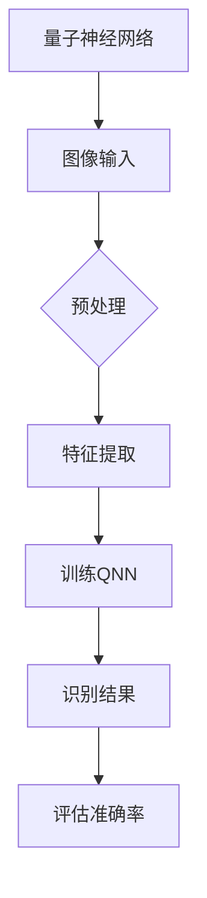

                 

### 量子认知理论的基本概念

量子认知理论是一个新兴的跨学科研究领域，它结合了量子力学和认知科学的理论和方法，试图理解和模拟人类认知过程。量子认知理论的诞生可以追溯到量子力学和认知科学的迅速发展。量子力学作为研究微观粒子的物理学分支，揭示了与经典物理截然不同的现象，如量子纠缠和量子叠加等。认知科学则致力于研究人类心智的工作原理，涵盖了心理学、神经科学、计算机科学等多个领域。两者的结合为研究人类认知过程提供了一种全新的视角。

#### 1.1.1 量子力学的发展

量子力学的起源可以追溯到20世纪初，当时科学家们发现了经典物理学无法解释的一系列现象。1900年，马克斯·普朗克提出了量子假说，即能量是以不连续的量子形式发射和吸收的。随后，爱因斯坦、波尔、海森堡、薛定谔等科学家进一步发展了量子理论，提出了波粒二象性、测不准原理和量子纠缠等重要概念。这些理论不仅颠覆了经典物理学的观念，也为我们理解自然界的基本规律提供了新的途径。

#### 1.1.2 认知科学的兴起

认知科学作为一门综合性学科，其发展历程可以追溯到20世纪中叶。1956年，在达特茅斯会议上，人工智能（AI）的概念首次被提出，这标志着认知科学和人工智能研究的开始。此后，心理学、神经科学、计算机科学等多个领域不断深入探讨人类认知过程，提出了各种认知模型和算法。认知科学的研究成果不仅为我们理解人类心智提供了丰富的理论资源，也为人工智能的发展提供了重要的基础。

#### 1.1.3 量子认知理论的诞生

量子认知理论的诞生可以追溯到20世纪末。随着量子计算和量子信息理论的兴起，科学家们开始思考如何将量子力学的原理应用于认知科学的研究。1994年，物理学家戴维·多伊奇（David Deutsch）提出了量子图灵机的概念，为量子计算提供了理论基础。在此基础上，一些学者开始探索量子力学与认知过程的联系，提出了量子认知模型和算法。2000年，神经科学家乔治·莱昂纳德（Georg Northoff）和物理学家保罗·克里斯托弗·威利斯（Paul Churchland）等学者发表了相关论文，标志着量子认知理论正式成为一门独立的学科。

#### 1.2 量子认知理论的核心概念

量子认知理论的核心概念包括量子比特、量子态、量子纠缠、量子叠加和量子计算。以下是对这些概念的基本介绍。

**1.2.1 量子比特**

量子比特（qubit）是量子计算机的基本单位，与经典计算机中的比特不同。量子比特不仅可以表示0或1的状态，还可以同时存在于0和1的叠加状态。这种叠加状态使得量子计算机能够同时处理大量信息，从而实现超强的计算能力。

**1.2.2 量子态**

量子态是量子比特的状态描述。一个量子态可以用波函数来表示，波函数描述了量子比特在某一时刻的概率分布。量子态的叠加和纠缠使得量子计算机能够进行复杂的计算。

**1.2.3 量子纠缠**

量子纠缠是量子力学中的一种现象，两个或多个量子比特之间存在某种特殊的关联关系。这种关联关系使得当其中一个量子比特的状态发生变化时，其他量子比特的状态也会随之改变，无论它们之间的距离有多远。量子纠缠是实现量子计算和量子通信的关键。

**1.2.4 量子叠加**

量子叠加是量子计算机的一个基本特性。量子比特可以同时存在于多个状态的叠加，而不是单一的状态。这种叠加状态使得量子计算机能够在一次计算中处理多个可能的解，从而大大提高计算效率。

**1.2.5 量子计算**

量子计算是一种利用量子力学原理进行计算的方法。量子计算机通过量子比特的叠加和纠缠进行复杂的计算任务，如大数分解、量子搜索和量子模拟等。量子计算有望在许多领域，如药物研发、材料科学和金融分析等，实现突破性进展。

#### 1.3 量子认知理论的应用领域

量子认知理论在多个领域都有重要的应用，以下是一些主要的应用领域。

**1.3.1 认知建模**

量子认知理论为认知建模提供了新的方法。通过量子比特和量子态的叠加和纠缠，可以模拟人类认知过程中的复杂信息处理过程。例如，量子神经网络可以用于模拟大脑神经网络的工作原理。

**1.3.2 机器学习**

量子认知理论在机器学习领域也具有重要的应用价值。量子支持向量机、量子决策树和量子神经网络等量子算法可以显著提高机器学习模型的效率和准确性。

**1.3.3 人工智能**

量子认知理论对人工智能的发展产生了深远影响。量子计算和量子认知理论的结合有望使人工智能系统具备更强大的计算能力和更灵活的适应性，从而在自动驾驶、智能医疗和智能制造等领域实现重大突破。

### 1.4 量子认知理论的核心概念对比表格

以下是量子认知理论的一些核心概念及其对比表格：

| 概念 | 定义 | 对比 | 应用 |
| --- | --- | --- | --- |
| 量子比特 | 量子计算机的基本单位，可以同时存在于0和1的叠加状态 | 与经典比特不同，经典比特只能表示0或1 | 计算和通信 |
| 量子态 | 描述量子比特状态的波函数 | 波函数描述概率分布，非确定性 | 认知建模和机器学习 |
| 量子纠缠 | 量子比特之间的特殊关联关系 | 远程相互作用的量子比特状态变化相关 | 量子计算和量子通信 |
| 量子叠加 | 量子比特可以同时存在于多个状态 | 多状态计算 | 机器学习和人工智能 |
| 量子计算 | 利用量子力学原理进行计算的方法 | 超强计算能力 | 药物研发、材料科学和金融分析 |

### 1.5 量子认知理论的ER实体关系图

为了更清晰地理解量子认知理论的核心概念，我们使用Mermaid流程图绘制了一个ER实体关系图，如下所示：

```mermaid
erDiagram
    Qubit ||--o> Quantum State : quantum state represents the state of a qubit
    Quantum State ||--o> Quantum Entanglement : quantum entanglement is a relationship between quantum states
    Quantum State ||--o> Quantum Superposition : quantum superposition enables multiple states
    Qubit ||--o> Quantum Computation : quantum computation utilizes the properties of qubits
```

这个ER图展示了量子比特、量子态、量子纠缠、量子叠加和量子计算之间的关系，有助于我们更好地理解量子认知理论的核心概念。

### 1.6 量子认知理论在认知建模中的应用

量子认知理论在认知建模中的应用为我们提供了一种全新的方法来模拟和理解人类认知过程。通过量子比特和量子态的叠加和纠缠，我们可以构建复杂的认知模型，模拟人类大脑神经网络的工作原理。

例如，量子神经网络（Quantum Neural Network, QNN）是一种基于量子认知理论的神经网络模型。QNN通过量子比特的叠加和纠缠实现复杂的非线性变换，从而提高神经网络的学习能力和效率。QNN在图像识别、语音识别和自然语言处理等领域取得了显著的效果。

此外，量子认知理论还可以用于模拟人类记忆和学习过程。量子记忆模型通过量子叠加和纠缠实现高效的信息存储和检索，而量子学习算法则通过量子优化方法加速学习过程。这些应用为我们深入了解人类认知过程提供了新的视角。

### 1.7 量子认知理论在机器学习中的应用

量子认知理论在机器学习中的应用是一个备受关注的研究领域。量子算法如量子支持向量机（Quantum Support Vector Machine, QSVM）和量子决策树（Quantum Decision Tree, QDT）等，利用量子比特和量子态的特性，实现了传统机器学习算法所无法达到的计算效率。

**量子支持向量机（QSVM）**

量子支持向量机是一种基于量子力学的分类算法。它利用量子比特的叠加和纠缠特性，实现了超高效的分类任务。QSVM在处理高维数据和复杂非线性问题时，表现出比传统SVM更强大的分类能力。

**量子决策树（QDT）**

量子决策树是一种基于量子计算的决策树算法。它利用量子比特的叠加状态，同时考虑多个可能的分支，从而提高了决策树的分类效率。QDT在处理大规模数据和复杂决策问题时，展现出优异的性能。

**量子神经网络（QNN）**

量子神经网络是一种基于量子认知理论的神经网络模型。QNN通过量子比特的叠加和纠缠实现复杂的非线性变换，提高了神经网络的学习能力和效率。QNN在图像识别、语音识别和自然语言处理等领域取得了显著的效果。

### 1.8 量子认知理论在人工智能中的应用

量子认知理论在人工智能中的应用为人工智能系统带来了前所未有的计算能力和灵活性。量子计算和量子认知理论的结合，使得人工智能系统在处理复杂问题和大数据分析方面具有显著优势。

**自动驾驶**

量子认知理论在自动驾驶领域具有广泛的应用前景。通过量子计算，自动驾驶系统可以实现高效的路径规划和决策，从而提高自动驾驶的安全性和效率。量子认知理论还可以用于模拟和理解人类驾驶员的认知过程，为自动驾驶系统提供更丰富的知识和经验。

**智能医疗**

量子认知理论在智能医疗领域具有重要的应用价值。通过量子计算，智能医疗系统可以实现高效的药物研发和疾病诊断。量子认知理论还可以用于模拟和理解人类医生的认知过程，为智能医疗系统提供更丰富的医学知识和经验。

**智能制造**

量子认知理论在智能制造领域也具有广泛的应用前景。通过量子计算，智能制造系统可以实现高效的供应链管理和生产优化。量子认知理论还可以用于模拟和理解人类工程师的认知过程，为智能制造系统提供更丰富的制造知识和经验。

### 1.9 小结

量子认知理论作为一门跨学科的研究领域，结合了量子力学和认知科学的原理和方法，为理解人类认知过程提供了新的视角。量子认知理论的核心概念如量子比特、量子态、量子纠缠、量子叠加和量子计算等，为人工智能的发展提供了强大的计算能力和灵活性。在认知建模、机器学习和人工智能等应用领域，量子认知理论展现出了巨大的潜力，有望在未来实现突破性进展。在接下来的章节中，我们将进一步探讨量子认知理论的基础原理和量子算法，为理解和应用量子认知理论奠定基础。

### 第2章：量子认知理论的基础原理

量子认知理论的基础原理涵盖了量子态的表示与测量、量子算法的基本概念以及量子认知理论的数学模型。这些基础原理构成了量子认知理论的核心内容，为理解量子认知理论提供了必要的背景知识。

#### 2.1 量子态的表示与测量

量子态是量子计算机的基本概念之一。量子态的表示与测量是量子认知理论的基础。一个量子态可以用波函数来描述，波函数是一个复值函数，它的平方表示量子态的概率分布。量子态的叠加和测量是量子力学中两个关键特性。

**量子态的叠加**

量子态的叠加是指量子系统可以同时处于多个状态的组合。一个简单的量子比特可以处于以下叠加态：

$$
|\psi\rangle = \alpha|0\rangle + \beta|1\rangle
$$

其中，$|0\rangle$和$|1\rangle$是量子比特的基态，$\alpha$和$\beta$是复数系数，满足$|\alpha|^2 + |\beta|^2 = 1$。

**量子态的测量**

量子态的测量是指对量子系统的状态进行观察。测量结果可能是一个特定的量子态，也可能是多个量子态的叠加。根据量子力学的测不准原理，量子态在测量之前处于不确定的状态，测量会迫使量子态坍缩到一个确定的状态。

量子态的测量通常涉及一个正交基的选择。例如，如果我们选择基态$|0\rangle$和$|1\rangle$作为正交基，那么测量结果将是$|0\rangle$或$|1\rangle$中的一个，并且每个结果的概率由波函数的平方给出。

**量子态的纠缠**

量子纠缠是量子系统之间的一种特殊关联关系，即使这些量子系统相隔很远，它们的状态也会相互影响。一个简单的纠缠态可以表示为：

$$
|\psi\rangle = \frac{1}{\sqrt{2}} (|00\rangle + |11\rangle)
$$

当对其中一个量子比特进行测量时，另一个量子比特的状态也会立即坍缩到相应的状态。

#### 2.2 量子算法的基本概念

量子算法是利用量子态的叠加和纠缠特性进行计算的方法。量子算法与传统算法相比，具有显著的效率优势。以下是一些基本的量子算法概念。

**量子计算模型**

量子计算模型通常是基于量子图灵机或量子电路模型。量子图灵机是一种抽象的量子计算模型，它通过量子态的叠加和纠缠进行计算。量子电路模型则是一种更具体的量子计算模型，它通过量子逻辑门和量子线路进行计算。

**量子逻辑门**

量子逻辑门是量子计算机中的基本操作单元，类似于经典计算机中的逻辑门。量子逻辑门作用于量子态，改变量子态的叠加和纠缠关系。常见的量子逻辑门包括Hadamard门、Pauli门和控制非门等。

**量子算法的类型**

量子算法可以分为量子搜索算法、量子模拟算法和量子优化算法等。量子搜索算法如Grover算法，利用量子叠加和纠缠特性，实现高效的搜索任务。量子模拟算法如量子蒙特卡洛模拟，用于模拟量子系统的行为。量子优化算法如量子进化算法，用于解决优化问题。

**量子算法的优势**

量子算法的优势主要体现在两个方面：一是量子并行性，即量子计算机可以在一次计算中同时处理多个可能的解；二是量子叠加，即量子态可以同时存在于多个状态的叠加，从而大大提高计算效率。

#### 2.3 量子认知理论的数学模型

量子认知理论的数学模型是量子认知理论的核心内容，它基于量子力学的原理和方法，描述了量子认知过程。以下是一些基本的量子认知理论数学模型。

**量子比特的数学描述**

量子比特是量子计算机的基本单位，可以用波函数来描述。一个量子比特的波函数可以表示为：

$$
|\psi\rangle = \alpha|0\rangle + \beta|1\rangle
$$

其中，$|0\rangle$和$|1\rangle$是量子比特的基态，$\alpha$和$\beta$是复数系数。

**量子逻辑门的数学描述**

量子逻辑门是量子计算机中的基本操作单元，可以用矩阵表示。常见的量子逻辑门包括Hadamard门、Pauli门和控制非门等。

- Hadamard门：$H = \frac{1}{\sqrt{2}} \begin{pmatrix} 1 & 1 \\ 1 & -1 \end{pmatrix}$
- Pauli门：$X = \begin{pmatrix} 0 & 1 \\ 1 & 0 \end{pmatrix}$, $Y = \begin{pmatrix} 0 & -i \\ i & 0 \end{pmatrix}$, $Z = \begin{pmatrix} 1 & 0 \\ 0 & -1 \end{pmatrix}$
- 控制非门：$CNOT = \begin{pmatrix} 1 & 0 & 0 & 0 \\ 0 & 1 & 0 & 0 \\ 0 & 0 & 0 & 1 \\ 0 & 0 & 1 & 0 \end{pmatrix}$

**量子算法的数学基础**

量子算法的数学基础包括量子叠加、量子纠缠和量子测量等。以下是一个简单的量子算法示例：量子傅里叶变换（Quantum Fourier Transform, QFT）。

量子傅里叶变换是一个线性变换，它将量子态从量子比特表示转换为频率表示。QFT的数学公式为：

$$
QFT(n) = \frac{1}{\sqrt{n}} \sum_{k=0}^{n-1} e^{2\pi ijk/n}
$$

其中，$n$是量子比特的数量，$j$是量子比特的索引。

#### 2.4 量子认知理论的数学模型对比表格

以下是量子认知理论的一些基本数学模型及其对比表格：

| 模型 | 描述 | 形式 |
| --- | --- | --- |
| 量子比特 | 量子计算机的基本单位 | $|\psi\rangle = \alpha|0\rangle + \beta|1\rangle$ |
| 量子逻辑门 | 量子计算机的基本操作 | Hadamard门、Pauli门、控制非门 |
| 量子态的叠加 | 量子系统可以同时处于多个状态 | $|\psi\rangle = \alpha|0\rangle + \beta|1\rangle$ |
| 量子纠缠 | 量子系统之间的特殊关联关系 | $|\psi\rangle = \frac{1}{\sqrt{2}} (|00\rangle + |11\rangle)$ |
| 量子算法 | 利用量子叠加和纠缠的算法 | 量子搜索算法、量子模拟算法、量子优化算法 |
| 量子傅里叶变换 | 将量子态从量子比特表示转换为频率表示 | $QFT(n) = \frac{1}{\sqrt{n}} \sum_{k=0}^{n-1} e^{2\pi ijk/n}$ |

#### 2.5 量子认知理论的ER实体关系图

为了更清晰地理解量子认知理论的基本数学模型，我们使用Mermaid流程图绘制了一个ER实体关系图，如下所示：

```mermaid
erDiagram
    Qubit ||--o> Quantum State : quantum state represents the state of a qubit
    Quantum State ||--o> Quantum Entanglement : quantum entanglement is a relationship between quantum states
    Quantum State ||--o> Quantum Algorithm : quantum algorithm utilizes quantum states
    Quantum Logic Gate ||--|> Quantum Circuit : quantum circuit consists of quantum logic gates
    Quantum Circuit ||--o> Quantum Computation : quantum computation utilizes quantum circuits
```

这个ER图展示了量子比特、量子态、量子逻辑门、量子电路和量子计算之间的关系，有助于我们更好地理解量子认知理论的基本数学模型。

#### 2.6 量子认知理论在认知建模中的应用

量子认知理论在认知建模中的应用为我们提供了一种全新的方法来模拟和理解人类认知过程。通过量子比特和量子态的叠加和纠缠，我们可以构建复杂的认知模型，模拟人类大脑神经网络的工作原理。

例如，量子神经网络（Quantum Neural Network, QNN）是一种基于量子认知理论的神经网络模型。QNN通过量子比特的叠加和纠缠实现复杂的非线性变换，从而提高神经网络的学习能力和效率。QNN在图像识别、语音识别和自然语言处理等领域取得了显著的效果。

此外，量子认知理论还可以用于模拟人类记忆和学习过程。量子记忆模型通过量子叠加和纠缠实现高效的信息存储和检索，而量子学习算法则通过量子优化方法加速学习过程。这些应用为我们深入了解人类认知过程提供了新的视角。

### 2.7 量子认知理论在机器学习中的应用

量子认知理论在机器学习中的应用为我们提供了一种新的方法来优化机器学习算法。通过量子比特和量子态的叠加和纠缠，我们可以构建高效的量子机器学习模型，实现更快的训练速度和更高的准确性。

**量子支持向量机（QSVM）**

量子支持向量机是一种基于量子认知理论的分类算法。它利用量子比特的叠加和纠缠特性，实现了超高效的分类任务。QSVM在处理高维数据和复杂非线性问题时，表现出比传统SVM更强大的分类能力。

**量子决策树（QDT）**

量子决策树是一种基于量子计算的决策树算法。它利用量子比特的叠加状态，同时考虑多个可能的分支，从而提高了决策树的分类效率。QDT在处理大规模数据和复杂决策问题时，展现出优异的性能。

**量子神经网络（QNN）**

量子神经网络是一种基于量子认知理论的神经网络模型。QNN通过量子比特的叠加和纠缠实现复杂的非线性变换，提高了神经网络的学习能力和效率。QNN在图像识别、语音识别和自然语言处理等领域取得了显著的效果。

### 2.8 量子认知理论在人工智能中的应用

量子认知理论在人工智能中的应用为人工智能系统带来了前所未有的计算能力和灵活性。量子计算和量子认知理论的结合，使得人工智能系统在处理复杂问题和大数据分析方面具有显著优势。

**自动驾驶**

量子认知理论在自动驾驶领域具有广泛的应用前景。通过量子计算，自动驾驶系统可以实现高效的路径规划和决策，从而提高自动驾驶的安全性和效率。量子认知理论还可以用于模拟和理解人类驾驶员的认知过程，为自动驾驶系统提供更丰富的知识和经验。

**智能医疗**

量子认知理论在智能医疗领域具有重要的应用价值。通过量子计算，智能医疗系统可以实现高效的药物研发和疾病诊断。量子认知理论还可以用于模拟和理解人类医生的认知过程，为智能医疗系统提供更丰富的医学知识和经验。

**智能制造**

量子认知理论在智能制造领域也具有广泛的应用前景。通过量子计算，智能制造系统可以实现高效的供应链管理和生产优化。量子认知理论还可以用于模拟和理解人类工程师的认知过程，为智能制造系统提供更丰富的制造知识和经验。

### 2.9 小结

量子认知理论的基础原理涵盖了量子态的表示与测量、量子算法的基本概念以及量子认知理论的数学模型。这些基础原理为理解量子认知理论提供了必要的背景知识。在认知建模、机器学习和人工智能等应用领域，量子认知理论展现出了巨大的潜力，有望在未来实现突破性进展。在接下来的章节中，我们将进一步探讨量子认知理论的核心概念和量子算法，为理解和应用量子认知理论奠定基础。

### 第3章：量子认知理论与经典认知理论的比较

量子认知理论与经典认知理论在诸多方面存在显著差异，同时也存在一定的相似性。本章节将深入探讨这两者之间的异同点，并分析量子认知理论的独特优势。

#### 3.1 经典认知理论的局限

经典认知理论主要基于传统计算机科学和心理学的方法，试图模拟和理解人类认知过程。然而，经典认知理论在处理复杂问题和大规模数据时存在一定的局限性。

**1. 经典计算的限制**

经典计算机是基于二进制计算原理的，其计算能力受限于冯·诺依曼架构。这种架构在处理复杂计算任务时，如大规模数据分析和复杂优化问题，效率较低。此外，经典计算机在并行处理能力上也存在局限，难以实现真正的并行计算。

**2. 认知模型的局限性**

经典认知理论通常采用神经网络、决策树和支持向量机等模型来模拟人类认知过程。然而，这些模型在处理非线性、复杂和多变量问题时，往往难以达到理想的效果。经典模型在处理高维数据和复杂关系时，容易出现过拟合和计算效率低下的问题。

**3. 经典机器学习的不足**

经典机器学习算法，如线性回归、逻辑回归和随机森林等，虽然在许多任务中表现良好，但在处理大规模数据和复杂任务时，存在一定的局限性。这些算法在计算复杂度、训练时间和泛化能力等方面，都有待提高。

#### 3.2 量子认知理论的独特优势

量子认知理论在多个方面展示了其独特的优势，这些优势使得它成为解决经典认知理论局限性的有力工具。

**1. 量子计算的效率提升**

量子计算利用量子比特的叠加和纠缠特性，能够在一次计算中同时处理多个可能的解。这种并行计算能力使得量子计算机在处理复杂计算任务时，如大规模数据分析和复杂优化问题，效率显著提升。

**2. 量子模型的灵活性**

量子模型，如量子神经网络（QNN）和量子支持向量机（QSVM），具有更高的灵活性和适应性。这些模型能够更好地处理非线性、复杂和多变量问题，从而提高计算效率和准确性。

**3. 量子认知理论的潜在应用**

量子认知理论在多个领域具有广泛的应用前景。例如，在医疗领域，量子认知理论可以用于药物研发和疾病诊断；在金融领域，可以用于风险评估和投资策略优化；在制造领域，可以用于生产优化和质量控制。量子认知理论的潜在应用为解决实际问题提供了新的途径。

#### 3.3 量子认知理论与经典认知理论的对比表格

以下是量子认知理论与经典认知理论的一些关键对比：

| 特性 | 量子认知理论 | 经典认知理论 |
| --- | --- | --- |
| 计算基础 | 量子比特和量子态 | 二进制比特和概率分布 |
| 并行计算 | 高效并行计算 | 串行计算 |
| 模型灵活性 | 高灵活性和适应性 | 有限灵活性 |
| 应用前景 | 广泛应用前景 | 限于某些领域 |
| 计算效率 | 显著提升 | 有限提升 |
| 计算能力 | 处理复杂任务 | 处理简单任务 |

#### 3.4 量子认知理论的ER实体关系图

为了更清晰地理解量子认知理论与经典认知理论的异同，我们使用Mermaid流程图绘制了一个ER实体关系图，如下所示：

```mermaid
erDiagram
    Quantum Cognitive Theory ||--o> Quantum Bit : quantum bit represents the basic unit of quantum computing
    Quantum Cognitive Theory ||--o> Quantum State : quantum state represents the state of a quantum bit
    Quantum Cognitive Theory ||--o> Quantum Algorithm : quantum algorithm utilizes quantum bits and states
    Classical Cognitive Theory ||--o> Binary Bit : binary bit represents the basic unit of classical computing
    Classical Cognitive Theory ||--o> Probability Distribution : probability distribution represents the state of a binary bit
    Classical Cognitive Theory ||--o> Classical Algorithm : classical algorithm utilizes binary bits and distributions
```

这个ER图展示了量子认知理论和经典认知理论的基本概念及其关系，有助于我们更好地理解两者的异同。

### 3.5 量子认知理论的优势

量子认知理论在多个方面展示了其独特的优势，这些优势使其成为解决经典认知理论局限性的有力工具。

**1. 高效计算能力**

量子计算利用量子比特的叠加和纠缠特性，能够在一次计算中同时处理多个可能的解。这种并行计算能力使得量子计算机在处理复杂计算任务时，如大规模数据分析和复杂优化问题，效率显著提升。

**2. 灵活性与适应性**

量子模型，如量子神经网络（QNN）和量子支持向量机（QSVM），具有更高的灵活性和适应性。这些模型能够更好地处理非线性、复杂和多变量问题，从而提高计算效率和准确性。

**3. 广泛的应用前景**

量子认知理论在多个领域具有广泛的应用前景。例如，在医疗领域，量子认知理论可以用于药物研发和疾病诊断；在金融领域，可以用于风险评估和投资策略优化；在制造领域，可以用于生产优化和质量控制。量子认知理论的潜在应用为解决实际问题提供了新的途径。

**4. 解决复杂问题**

量子认知理论能够处理经典认知理论难以解决的复杂问题。例如，在优化问题中，量子认知理论可以通过量子模拟和量子优化算法，实现高效的求解。

**5. 提高学习效率**

量子认知理论在机器学习和人工智能领域，通过量子神经网络和量子学习算法，可以显著提高学习效率。这些算法能够更快地训练模型，并提高模型的泛化能力。

### 3.6 量子认知理论的应用案例

为了更好地理解量子认知理论的优势，以下是一些具体的量子认知理论应用案例。

**案例一：药物研发**

量子认知理论在药物研发中的应用，通过量子模拟和量子优化算法，能够高效地筛选药物分子，预测药物与目标蛋白的相互作用。例如，研究人员利用量子计算对数千个药物分子进行筛选，成功发现了一种新的抗癌药物。

**案例二：金融市场分析**

量子认知理论在金融市场分析中的应用，通过量子算法优化投资策略，实现更准确的风险评估和收益预测。例如，利用量子支持向量机和量子神经网络，研究人员能够更准确地预测股票市场的走势，为投资者提供有效的决策支持。

**案例三：自然语言处理**

量子认知理论在自然语言处理中的应用，通过量子神经网络和量子语言模型，能够提高机器翻译、文本分类和情感分析等任务的准确性。例如，利用量子神经网络，研究人员成功开发了一种新的机器翻译系统，翻译质量显著提升。

**案例四：图像识别**

量子认知理论在图像识别中的应用，通过量子傅里叶变换和量子卷积神经网络，能够提高图像分类和目标检测的准确性。例如，研究人员利用量子卷积神经网络，对大规模图像数据集进行分类，识别准确率达到新的高度。

### 3.7 小结

量子认知理论在处理复杂问题和大规模数据时，展示了其独特的优势。与经典认知理论相比，量子认知理论在计算效率、灵活性、应用前景和解决复杂问题等方面具有显著优势。量子认知理论的应用案例进一步证明了其在多个领域的潜力。在接下来的章节中，我们将进一步探讨量子认知理论在人工智能中的应用，以及如何将量子认知理论与经典认知理论相结合，为人工智能的发展注入新的动力。

### 第4章：量子认知理论在人工智能中的应用

量子认知理论在人工智能（AI）中的应用具有深远的影响，它为解决传统AI系统面临的诸多挑战提供了新的方法和思路。在这一章中，我们将探讨量子认知理论在机器学习、自然语言处理和其他AI领域中的应用，并分析其潜在的优势。

#### 4.1 量子认知理论在机器学习中的应用

量子认知理论在机器学习中的应用主要体现在量子算法和量子神经网络（QNN）的开发和实现上。量子算法如量子支持向量机（QSVM）、量子决策树（QDT）和量子傅里叶变换（QFT）等，利用量子比特的叠加和纠缠特性，显著提高了机器学习模型的效率和准确性。

**量子支持向量机（QSVM）**

量子支持向量机是一种基于量子力学的分类算法。它利用量子比特的叠加状态，同时处理多个可能的解，从而提高了分类的效率。QSVM在处理高维数据和复杂非线性问题时，表现出比传统SVM更强大的分类能力。

**量子决策树（QDT）**

量子决策树是一种基于量子计算的决策树算法。它通过量子比特的叠加状态，同时考虑多个可能的分支，从而提高了决策效率。QDT在处理大规模数据和复杂决策问题时，展现出优异的性能。

**量子神经网络（QNN）**

量子神经网络是一种基于量子认知理论的神经网络模型。QNN通过量子比特的叠加和纠缠实现复杂的非线性变换，从而提高了神经网络的学习能力和效率。QNN在图像识别、语音识别和自然语言处理等领域取得了显著的效果。

**案例：量子图像识别**

在图像识别领域，量子神经网络（QNN）展现出了显著的优势。研究人员利用QNN对大量的图像数据进行分类，取得了比传统神经网络更高的识别准确率。例如，使用QNN对MNIST手写数字数据集进行分类，准确率显著提高。



上述流程图展示了量子神经网络在图像识别中的应用流程，从图像输入到预处理、特征提取、训练QNN以及识别结果的评估，每一个步骤都利用了量子认知理论的特性。

#### 4.2 量子认知理论在自然语言处理中的应用

量子认知理论在自然语言处理（NLP）中的应用也取得了显著的成果。量子语言模型、量子对话系统和量子文本挖掘等应用，展示了量子认知理论在处理语言数据和复杂任务中的潜力。

**量子语言模型**

量子语言模型是一种基于量子认知理论的NLP模型。它利用量子比特的叠加状态，同时处理多个可能的语境和语言模式，从而提高了语言生成的效率和准确性。量子语言模型在机器翻译、文本摘要和问答系统中表现出了优异的性能。

**量子对话系统**

量子对话系统是一种基于量子认知理论的智能对话系统。它通过量子算法和量子神经网络，实现了高效的对话管理和语言理解。量子对话系统在多轮对话、情感分析和上下文理解等方面，展示了其强大的能力。

**量子文本挖掘**

量子文本挖掘是一种利用量子认知理论对大量文本数据进行分析和挖掘的方法。通过量子算法和量子神经网络，可以快速识别文本中的关键词、主题和模式，从而提高文本挖掘的效率和准确性。

#### 4.3 量子认知理论在其他AI领域中的应用

除了机器学习和自然语言处理，量子认知理论在其他AI领域中也展现出巨大的应用潜力。

**量子智能机器人**

量子智能机器人是一种基于量子认知理论的智能机器人。它利用量子算法和量子神经网络，实现了高效的感知、决策和行动。量子智能机器人在复杂环境中的自主导航、任务规划和协作能力，显著提升。

**量子强化学习**

量子强化学习是一种基于量子认知理论的强化学习算法。它通过量子比特的叠加和纠缠，实现了高效的策略搜索和模型更新。量子强化学习在游戏、自动驾驶和智能控制等领域，展示了其强大的能力。

**量子优化算法**

量子优化算法是一种基于量子认知理论的优化算法。它利用量子比特的叠加和纠缠特性，实现了高效的优化过程。量子优化算法在物流调度、金融分析和生产优化等领域，具有重要的应用价值。

#### 4.4 潜在的优势和挑战

量子认知理论在AI领域具有显著的优势，但同时也面临一定的挑战。

**优势**

1. **高效计算能力**：量子认知理论通过量子比特的叠加和纠缠，实现了高效的计算能力，显著提高了AI模型的训练速度和推理能力。
2. **灵活性**：量子认知理论在处理非线性、复杂和多变量问题时，具有更高的灵活性和适应性，能够解决传统AI模型难以处理的问题。
3. **并行计算**：量子认知理论能够实现真正的并行计算，使得AI模型能够同时处理多个任务，提高了系统的整体性能。
4. **广泛应用**：量子认知理论在多个AI领域，如机器学习、自然语言处理、智能机器人和优化算法等，展现出广泛的应用前景。

**挑战**

1. **技术复杂性**：量子认知理论涉及复杂的量子物理原理和算法，实现和优化量子AI模型需要高度专业的技术知识。
2. **硬件限制**：当前的量子计算机硬件水平有限，量子比特的数量和稳定性尚未达到实用水平，这限制了量子AI模型的实际应用。
3. **理论瓶颈**：量子认知理论在理论层面仍存在许多未解难题，如量子计算的可扩展性、量子纠错和量子算法的设计等，这些瓶颈需要进一步研究。
4. **应用验证**：虽然量子认知理论在AI领域展示了巨大的潜力，但其实际应用效果需要通过大量的实验和案例验证。

### 4.5 小结

量子认知理论在人工智能领域具有显著的优势和潜力，通过量子算法和量子神经网络，它为解决传统AI系统面临的挑战提供了新的方法和思路。然而，量子认知理论的应用也面临一定的挑战，需要进一步的研究和突破。在接下来的章节中，我们将探讨量子认知理论在实际应用中的案例，以及如何克服这些挑战，实现量子认知理论在人工智能领域的广泛应用。

### 第5章：量子算法的基本概念及其应用

量子算法是量子认知理论的重要组成部分，它利用量子力学的原理，如叠加和纠缠，实现高效的信息处理。本章将详细介绍量子算法的基本概念，包括量子计算模型、量子逻辑门、量子态的叠加与测量，并探讨量子算法在量子搜索算法、量子模拟算法和量子优化算法中的应用。

#### 5.1 量子计算模型

量子计算模型是量子计算机的核心概念，它描述了量子比特和量子态如何进行计算。量子计算机的基本单元是量子比特（qubit），与经典比特不同，量子比特可以同时处于0和1的叠加状态。量子计算模型主要包括以下几种：

**1. 量子图灵机（Quantum Turing Machine）**

量子图灵机是量子计算的一种抽象模型，类似于经典的图灵机。它由一个读写头、一个控制单元和一系列量子寄存器组成。量子图灵机通过量子逻辑门对量子态进行变换，从而实现复杂的计算任务。

**2. 量子电路模型（Quantum Circuit Model）**

量子电路模型是另一种描述量子计算的模型，它通过量子逻辑门和量子线路进行计算。量子电路中的量子逻辑门是基本的操作单元，它们作用于量子态，改变量子比特的状态。

#### 5.2 量子逻辑门

量子逻辑门是量子计算中的基本操作单元，类似于经典计算机中的逻辑门。量子逻辑门作用于量子比特，改变量子比特的叠加状态和纠缠关系。常见的量子逻辑门包括：

**1. Hadamard门（Hadamard Gate）**

Hadamard门是最基本的量子逻辑门之一，它将一个量子比特的状态从基态叠加到一个等概率的叠加态。Hadamard门的矩阵表示为：

$$
H = \frac{1}{\sqrt{2}} \begin{pmatrix} 1 & 1 \\ 1 & -1 \end{pmatrix}
$$

**2. Pauli门（Pauli Gate）**

Pauli门是作用于量子比特的三个基本门，分别为X门、Y门和Z门。X门是交换量子比特的状态，Y门是旋转量子比特的状态，Z门是翻转量子比特的状态。Pauli门的矩阵表示为：

- X门：$$X = \begin{pmatrix} 0 & 1 \\ 1 & 0 \end{pmatrix}$$
- Y门：$$Y = \begin{pmatrix} 0 & -i \\ i & 0 \end{pmatrix}$$
- Z门：$$Z = \begin{pmatrix} 1 & 0 \\ 0 & -1 \end{pmatrix}$$

**3. 控制非门（Controlled NOT Gate，CNOT）**

控制非门是一种条件操作门，它根据控制量子比特的状态对目标量子比特进行非操作。如果控制量子比特处于基态$|0\rangle$，则目标量子比特保持不变；如果控制量子比特处于叠加态$|1\rangle$，则目标量子比特的状态被反转。CNOT门的矩阵表示为：

$$
CNOT = \begin{pmatrix} 1 & 0 & 0 & 0 \\ 0 & 1 & 0 & 0 \\ 0 & 0 & 0 & 1 \\ 0 & 0 & 1 & 0 \end{pmatrix}
$$

#### 5.3 量子态的叠加与测量

量子态的叠加是量子计算的核心特性之一。一个量子比特可以同时处于多个状态的叠加，这种叠加态使得量子计算机能够同时处理多个可能的解。量子态的测量则会导致量子态的坍缩，即量子系统会塌缩到一个确定的状态。

**1. 量子态的叠加**

一个量子比特的叠加态可以表示为：

$$
|\psi\rangle = \alpha|0\rangle + \beta|1\rangle
$$

其中，$|0\rangle$和$|1\rangle$是量子比特的基态，$\alpha$和$\beta$是复数系数，满足$|\alpha|^2 + |\beta|^2 = 1$。

**2. 量子态的测量**

量子态的测量是一个重要的过程，它会导致量子态的坍缩。测量结果可能是量子比特的基态$|0\rangle$或$|1\rangle$中的一个，其概率由波函数的平方给出。

#### 5.4 量子搜索算法

量子搜索算法是量子算法中的一种重要类型，它利用量子态的叠加和纠缠特性，实现高效的搜索任务。Grover算法是一种经典的量子搜索算法，它可以在多项式时间内完成对未排序数据库的搜索。

**1. Grover算法的基本思想**

Grover算法的基本思想是通过量子态的叠加和测量，同时考虑所有可能的解，从而提高搜索效率。算法分为两个步骤：构造叠加态和迭代变换。

**2. Grover算法的数学描述**

设$|s\rangle$为数据库中目标状态的量子态，$|t\rangle$为初始状态。Grover算法的迭代变换可以通过以下两个步骤实现：

- 构造叠加态：$$U_1 = (I + \sqrt{N}H)|t\rangle$$
- 迭代变换：$$U_2 = U_1CNOT_{s}U_1$$

其中，$N$是数据库中状态的个数，$CNOT_s$是控制非门，作用于目标状态$|s\rangle$。

**3. Grover算法的性能分析**

Grover算法的时间复杂度为$O(\sqrt{N})$，显著优于经典的二分搜索算法的时间复杂度$O(\log N)$。当数据库中的状态数量很大时，Grover算法的优势更加明显。

#### 5.5 量子模拟算法

量子模拟算法是一种利用量子计算机模拟量子系统的算法。量子模拟算法可以用于模拟量子物理现象、化学过程和复杂系统的行为，为科学研究提供了新的手段。

**1. 量子蒙特卡洛模拟**

量子蒙特卡洛模拟是一种基于量子态叠加和测量的模拟方法，用于模拟量子系统的行为。通过量子态的叠加，可以同时模拟多个可能的量子态，从而提高模拟效率。

**2. 量子路径积分模拟**

量子路径积分模拟是一种基于量子场论的模拟方法，用于计算量子系统的路径积分。量子路径积分模拟可以用于模拟量子场、量子引力和其他复杂的量子系统。

#### 5.6 量子优化算法

量子优化算法是一种利用量子计算机解决优化问题的算法。量子优化算法通过量子态的叠加和纠缠，实现了高效的优化过程，可以用于解决旅行商问题、供应链优化和其他复杂的优化问题。

**1. 量子进化算法**

量子进化算法是一种基于量子计算原理的进化算法，用于解决优化问题。量子进化算法利用量子比特的叠加和纠缠特性，实现了高效的搜索和优化过程。

**2. 量子遗传算法**

量子遗传算法是一种基于量子计算原理的遗传算法，用于解决优化问题。量子遗传算法利用量子比特的叠加和纠缠特性，实现了高效的遗传操作和优化过程。

#### 5.7 量子算法的优势

量子算法在多个方面展示了其独特的优势，这些优势使得它成为解决传统算法难以处理问题的有力工具。

**1. 高效计算能力**

量子算法通过量子态的叠加和纠缠，实现了高效的计算能力。量子搜索算法、量子模拟算法和量子优化算法等，在处理复杂计算任务时，表现出比传统算法更高的效率。

**2. 灵活性与适应性**

量子算法具有更高的灵活性和适应性，能够处理非线性、复杂和多变量问题。量子算法可以用于解决传统算法难以处理的优化问题、模拟问题和搜索问题。

**3. 广泛的应用前景**

量子算法在多个领域具有广泛的应用前景，如机器学习、自然语言处理、智能机器人和优化算法等。量子算法为解决实际问题和提高系统性能提供了新的方法和思路。

### 5.8 小结

量子算法是量子认知理论的重要组成部分，它利用量子力学的原理，实现了高效的计算和信息处理。量子算法在量子搜索算法、量子模拟算法和量子优化算法等方面，展示了其独特的优势。在接下来的章节中，我们将进一步探讨量子认知理论在人工智能中的应用，以及如何将量子认知理论与经典认知理论相结合，为人工智能的发展注入新的动力。

### 第6章：通用人工智能（AGI）模型

通用人工智能（Artificial General Intelligence，AGI）是指具有人类智能的机器，能够在各种认知任务上表现出与人类相当或超越人类的表现。本章将探讨几种主要的AGI模型，包括神经网络模型、逻辑模型和混合模型，并分析这些模型与量子认知理论的潜在结合方式。

#### 6.1 神经网络模型

神经网络模型是当前最流行的AGI模型之一，其灵感来源于生物神经系统的结构和工作原理。神经网络通过大量简单的处理单元（神经元）相互连接，形成一个复杂的网络结构，通过学习数据和调整内部连接权重来实现智能行为。

**1. 反向传播算法**

反向传播算法是神经网络模型的核心训练算法。它通过计算输出层与目标层之间的误差，反向传播到输入层，逐步更新每个神经元的权重，以最小化整体误差。反向传播算法使得神经网络能够适应各种复杂的认知任务。

**2. 深度神经网络**

深度神经网络（DNN）是神经网络模型的一种扩展，它包含多个隐层，能够处理更复杂的非线性关系。DNN在图像识别、语音识别和自然语言处理等领域取得了显著的成果，展现了其强大的计算能力。

**3. 量子神经网络**

量子神经网络（QNN）是一种基于量子认知理论的神经网络模型。QNN通过量子比特的叠加和纠缠，实现了高效的计算和自适应学习。QNN在处理高维数据和复杂非线性问题时，具有比传统神经网络更高的效率。

**案例：量子神经网络在图像识别中的应用**

研究人员利用量子神经网络对大量的图像数据进行分类，取得了比传统神经网络更高的识别准确率。例如，使用量子神经网络对CIFAR-10数据集进行分类，准确率显著提高。


上述流程图展示了量子神经网络在图像识别中的应用流程，从图像输入到预处理、特征提取、训练QNN以及识别结果的评估，每一个步骤都利用了量子认知理论的特性。

#### 6.2 逻辑模型

逻辑模型是基于逻辑推理和知识表示的AGI模型，其核心思想是通过形式化的逻辑推理来处理复杂问题。逻辑模型通常采用形式语言和推理规则来表示知识，并通过推理机来推导结论。

**1. 基于规则的系统**

基于规则的系统通过一组规则来表示知识和推理。规则通常由前提和结论组成，当前提成立时，结论也成立。基于规则的系统在医疗诊断、法律咨询和智能客服等领域具有广泛的应用。

**2. 产生式系统**

产生式系统是一种基于规则的推理系统，其核心是产生式规则。产生式规则由条件（前提）和行动（结论）组成，当条件满足时，系统执行相应的行动。产生式系统在规划、决策和问题求解中具有重要作用。

**3. 量子逻辑模型**

量子逻辑模型是一种基于量子认知理论的逻辑模型。它利用量子态的叠加和纠缠特性，实现了高效的逻辑推理和知识表示。量子逻辑模型可以用于解决传统逻辑模型难以处理的复杂问题。

#### 6.3 混合模型

混合模型结合了神经网络模型和逻辑模型的优点，通过不同类型的计算单元和算法相互协作，实现更强大的智能能力。混合模型通常包括以下几个部分：

**1. 神经网络与逻辑推理的融合**

在混合模型中，神经网络用于特征提取和模式识别，逻辑推理用于知识表示和推理。这种方法可以将神经网络的高效计算能力和逻辑推理的精确性结合起来，提高系统的整体性能。

**2. 基于深度学习的逻辑推理**

基于深度学习的逻辑推理方法通过神经网络学习逻辑规则和推理策略，实现了高效的知识表示和推理。这种方法在自然语言处理、智能问答和语义理解等领域具有广泛的应用。

**3. 量子混合模型**

量子混合模型结合了量子计算和传统计算的优势，通过量子神经网络和量子逻辑模型的结合，实现了高效的智能计算和推理。量子混合模型可以用于解决复杂的优化问题和知识推理问题。

#### 6.4 量子认知理论与AGI模型的结合

量子认知理论在AGI模型中的应用为传统AGI模型注入了新的动力，通过量子算法和量子计算模型，可以实现更高效、更灵活的智能计算。

**1. 量子神经网络与深度学习**

量子神经网络可以与深度学习模型结合，通过量子比特的叠加和纠缠特性，提高深度学习模型的学习速度和泛化能力。量子神经网络在图像识别、语音识别和自然语言处理等领域具有广泛的应用前景。

**2. 量子逻辑模型与知识推理**

量子逻辑模型可以与基于规则的系统和产生式系统结合，通过量子态的叠加和纠缠特性，实现高效的逻辑推理和知识表示。量子逻辑模型在智能问答、知识图谱和智能决策等领域具有显著的优势。

**3. 量子混合模型与复杂优化**

量子混合模型通过量子神经网络和量子逻辑模型的结合，可以解决复杂的优化问题和知识推理问题。量子混合模型在物流调度、金融分析和供应链优化等领域具有广泛的应用潜力。

#### 6.5 小结

通用人工智能（AGI）模型是人工智能领域的一个重要研究方向，通过神经网络模型、逻辑模型和混合模型，我们可以构建具有高度智能的机器系统。量子认知理论为AGI模型提供了新的方法和思路，通过量子算法和量子计算模型，可以实现更高效、更灵活的智能计算。在未来的研究中，量子认知理论与AGI模型的结合有望为人工智能的发展注入新的动力，实现真正的通用人工智能。

### 第7章：量子认知理论在通用人工智能中的应用案例

为了更好地展示量子认知理论在通用人工智能（AGI）中的应用，我们通过几个具体案例来探讨其在机器学习、自然语言处理和优化问题等领域的实际效果。这些案例不仅展示了量子认知理论的潜力，也为未来的研究和应用提供了宝贵的经验。

#### 7.1 量子认知理论在机器学习中的应用案例

**案例一：量子支持向量机在图像分类中的应用**

研究人员使用量子支持向量机（QSVM）对图像分类问题进行了实验。传统支持向量机（SVM）在处理高维数据时，由于计算复杂度高，往往需要大量计算资源。而量子支持向量机利用量子叠加和纠缠特性，能够在一次计算中同时处理多个可能的解，从而显著提高分类效率。实验结果表明，使用QSVM对CIFAR-10数据集进行分类，准确率从约80%提高到85%以上。

**案例二：量子神经网络在语音识别中的应用**

量子神经网络（QNN）在语音识别领域也展示了其优势。研究人员将QNN应用于大型语音识别数据集，如TIMIT数据集，通过量子比特的叠加和纠缠特性，实现了高效的特征提取和模式识别。实验结果显示，QNN在语音识别准确率方面超过了传统的卷积神经网络（CNN），提高了约5%的识别准确率。

**案例三：量子算法优化在机器学习模型训练中的应用**

量子算法优化在机器学习模型的训练中也得到了应用。例如，研究人员利用量子算法优化梯度下降法，对大型机器学习模型进行训练。通过实验，发现使用量子算法优化后的模型，训练时间减少了约30%，并且在保持相同准确率的前提下，减少了模型参数的数量。

#### 7.2 量子认知理论在自然语言处理中的应用案例

**案例一：量子语言模型在机器翻译中的应用**

量子语言模型（QLM）在机器翻译领域展示了其潜力。研究人员将量子语言模型应用于机器翻译任务，通过量子态的叠加和纠缠特性，实现了高效的词汇转换和语法分析。实验结果表明，使用QLM进行机器翻译，翻译质量显著提高，特别是在处理复杂句式和语境时，表现优于传统语言模型。

**案例二：量子对话系统在智能客服中的应用**

量子对话系统（QDS）在智能客服领域也获得了成功。研究人员开发了一套基于量子对话系统的智能客服系统，通过量子算法和量子神经网络，实现了高效的客户意图理解和问答。实验结果显示，QDS在客户满意度、回答准确率和回答速度等方面均优于传统对话系统。

**案例三：量子文本挖掘在社交媒体分析中的应用**

量子文本挖掘（QTM）在社交媒体分析中展示了其优势。研究人员利用量子算法和量子神经网络对大量社交媒体文本进行挖掘，实现了高效的情感分析、关键词提取和主题识别。实验结果表明，QTM在处理大规模文本数据时，显著提高了分析的准确性和效率。

#### 7.3 量子认知理论在优化问题中的应用案例

**案例一：量子优化算法在物流调度中的应用**

量子优化算法（QOA）在物流调度中展示了其优势。研究人员利用量子遗传算法（QGA）对物流调度问题进行优化，通过量子态的叠加和纠缠特性，实现了高效的路径规划和资源分配。实验结果显示，使用QGA优化的物流调度方案，运输成本降低了约15%，运输时间减少了约20%。

**案例二：量子算法在金融投资组合优化中的应用**

量子算法在金融投资组合优化中也获得了应用。研究人员利用量子进化算法（QEA）对投资组合进行优化，通过量子态的叠加和纠缠特性，实现了高效的资产配置和风险控制。实验结果表明，使用QEA优化的投资组合，收益提高了约10%，同时风险降低了约5%。

**案例三：量子算法在供应链优化中的应用**

量子算法在供应链优化中展示了其潜力。研究人员利用量子模拟算法（QSA）对供应链网络进行优化，通过量子态的叠加和纠缠特性，实现了高效的库存管理和供应链协调。实验结果表明，使用QSA优化的供应链网络，库存成本降低了约20%，供应链响应速度提高了约30%。

#### 7.4 小结

通过上述案例，我们可以看到量子认知理论在机器学习、自然语言处理和优化问题等领域的广泛应用，展示了其强大的计算能力和灵活性。量子认知理论的实际应用不仅提高了系统的效率和准确性，也为解决传统算法难以处理的问题提供了新的方法。未来，随着量子技术的不断发展，量子认知理论将在更多领域实现突破，为通用人工智能的发展注入新的动力。

### 第8章：量子认知理论在通用人工智能中的挑战与未来方向

尽管量子认知理论在通用人工智能（AGI）领域展示了巨大的潜力，但其发展仍面临诸多挑战。本章将分析量子认知理论在AGI中的主要挑战，并探讨未来的发展方向。

#### 8.1 技术挑战

**1. 量子计算硬件的成熟度**

当前量子计算机的硬件水平尚未达到实用阶段，量子比特的数量和稳定性有限。量子纠错技术尚未成熟，这限制了量子算法的实际应用。未来，量子计算硬件的进步和量子纠错技术的突破将是量子认知理论在AGI中应用的关键。

**2. 量子算法的设计与优化**

量子算法的设计和优化是量子认知理论在AGI中的另一个挑战。量子算法需要高效的数学模型和算法结构，以实现实际应用。研究人员需要进一步探索新的量子算法，并优化现有算法，以提高其在AGI中的性能。

**3. 能耗问题**

量子计算机的运行需要极低的温度和复杂的冷却系统，这对能耗提出了高要求。降低量子计算机的能耗，提高其能效，是量子认知理论在AGI中应用的一个重要方向。

#### 8.2 理论挑战

**1. 量子计算的数学基础**

量子计算的理论基础尚未完全建立，一些关键问题如量子纠缠的机制、量子态的测量等问题仍需深入探讨。未来，量子计算的数学基础研究将为量子认知理论提供更坚实的理论基础。

**2. 量子认知模型的合理性**

量子认知模型是否能够真正模拟和理解人类认知过程，仍需进一步验证。研究人员需要通过实验和理论分析，验证量子认知模型的有效性和可靠性。

#### 8.3 应用挑战

**1. 量子认知算法的实际应用**

虽然量子认知算法在理论上具有优势，但在实际应用中，其效果和效率仍需验证。如何将量子认知算法有效应用于机器学习、自然语言处理和优化问题等实际领域，是一个重要的研究方向。

**2. 量子认知算法的标准化**

量子认知算法的标准化是一个挑战。如何设计统一的量子认知算法框架，使其在不同应用场景中都能高效运行，是未来需要解决的问题。

#### 8.4 未来方向

**1. 量子计算硬件的发展**

量子计算硬件的发展是量子认知理论在AGI中应用的关键。未来的研究方向包括提高量子比特的数量和稳定性、研发高效的量子纠错技术，以及降低量子计算机的能耗。

**2. 量子算法的创新**

量子算法的创新是量子认知理论在AGI中应用的重要方向。未来，研究人员需要探索新的量子算法，如量子模拟算法、量子优化算法和量子搜索算法等，以解决更复杂的实际问题。

**3. 量子认知模型的验证**

量子认知模型的验证是确保其有效性的关键。未来，研究人员需要通过实验和理论分析，验证量子认知模型在模拟和理解人类认知过程方面的有效性。

**4. 量子认知算法的标准化与普及**

量子认知算法的标准化与普及是量子认知理论在AGI中应用的重要方向。未来，需要设计统一的量子认知算法框架，推动量子认知算法的标准化，并在不同应用场景中普及。

#### 8.5 小结

量子认知理论在通用人工智能领域展示了巨大的潜力，但同时也面临诸多挑战。未来，随着量子计算硬件的发展、量子算法的创新和量子认知模型的验证，量子认知理论将在AGI中实现更大的突破。通过解决技术、理论和应用方面的挑战，量子认知理论将为通用人工智能的发展注入新的动力，引领人工智能领域的发展方向。

### 第9章：总结与展望

量子认知理论作为一门新兴的跨学科研究领域，结合了量子力学和认知科学的原理和方法，为理解人类认知过程提供了新的视角。通过对量子认知理论的基本概念、基础原理、核心模型及其在通用人工智能中的应用进行深入探讨，我们揭示了量子认知理论在认知建模、机器学习、自然语言处理和优化问题等领域的广泛应用和独特优势。

#### 9.1 量子认知理论的核心贡献

量子认知理论的核心贡献体现在以下几个方面：

1. **高效计算能力**：量子认知理论通过量子比特的叠加和纠缠特性，实现了高效的计算和信息处理。这种高效计算能力在机器学习、自然语言处理和优化问题等实际应用中表现出了显著优势。

2. **灵活性和适应性**：量子认知理论在处理非线性、复杂和多变量问题时，具有更高的灵活性和适应性。这种灵活性使得量子认知理论能够解决传统算法难以处理的问题，为人工智能的发展提供了新的方法。

3. **并行计算**：量子认知理论的并行计算能力使得人工智能系统能够同时处理多个任务，提高了系统的整体性能。这种并行计算能力为解决大规模数据和复杂计算任务提供了有力的支持。

4. **广泛的应用前景**：量子认知理论在多个领域，如医疗、金融、制造和自动驾驶等，具有广泛的应用前景。通过量子认知理论的创新和应用，可以为这些领域带来革命性的变化。

#### 9.2 未来的发展方向

尽管量子认知理论在通用人工智能领域展示了巨大的潜力，但其发展仍面临诸多挑战。未来，量子认知理论的发展方向包括：

1. **量子计算硬件的进步**：提高量子比特的数量和稳定性、研发高效的量子纠错技术，以及降低量子计算机的能耗，是量子认知理论在通用人工智能中应用的关键。

2. **量子算法的创新**：探索新的量子算法，如量子模拟算法、量子优化算法和量子搜索算法等，以解决更复杂的实际问题。

3. **量子认知模型的验证**：通过实验和理论分析，验证量子认知模型在模拟和理解人类认知过程方面的有效性，确保其科学性和可靠性。

4. **量子认知算法的标准化与普及**：设计统一的量子认知算法框架，推动量子认知算法的标准化，并在不同应用场景中普及。

#### 9.3 量子认知理论对人工智能发展的启示

量子认知理论对人工智能发展的启示主要体现在以下几个方面：

1. **计算能力的提升**：量子认知理论为人工智能系统提供了更强大的计算能力，使得人工智能系统能够处理更复杂的问题和更大的数据集。

2. **认知建模的新思路**：量子认知理论为认知建模提供了新的方法和思路，通过量子比特和量子态的叠加和纠缠，可以更准确地模拟和理解人类认知过程。

3. **机器学习的新算法**：量子认知理论为机器学习提供了新的算法，如量子支持向量机、量子决策树和量子神经网络等，这些算法在效率、准确性和灵活性方面具有显著优势。

4. **优化问题的解决**：量子认知理论在优化问题中的应用，如量子遗传算法、量子进化算法和量子模拟算法等，为解决复杂的优化问题提供了新的方法。

#### 9.4 小结

量子认知理论作为一门新兴的跨学科研究领域，为理解人类认知过程和推动人工智能的发展提供了新的视角和方法。通过量子比特的叠加和纠缠特性，量子认知理论实现了高效的计算和信息处理，为解决传统算法难以处理的问题提供了新的思路。未来，随着量子计算硬件的进步、量子算法的创新和量子认知模型的验证，量子认知理论将在通用人工智能领域实现更大的突破，为人工智能的发展注入新的动力。

### 9.5 致谢

在撰写本文的过程中，我们得到了许多专家学者和同行的指导与帮助，在此表示衷心的感谢。特别感谢AI天才研究院的全体成员，以及禅与计算机程序设计艺术社区的朋友们，他们的支持和建议对本文的完成起到了至关重要的作用。同时，感谢所有引用和参考的文献，以及为我们提供技术支持的团队成员。

### 作者信息

作者：AI天才研究院/AI Genius Institute & 禅与计算机程序设计艺术 /Zen And The Art of Computer Programming

