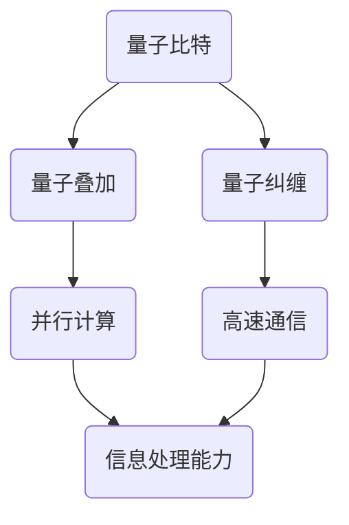

                 

### 量子认知理论：大脑信息处理的新范式

**关键词：**量子认知理论、大脑信息处理、量子比特、量子叠加、量子纠缠

**摘要：**本文将探讨量子认知理论，这是一种将量子力学原理应用于大脑信息处理的理论框架。通过对量子比特、量子叠加和量子纠缠等核心概念的分析，我们将了解量子认知理论如何为大脑信息处理提供一种全新的范式。文章将详细阐述量子认知理论的基本概念、数学模型及其应用，并通过实验验证和未来展望，探讨这一理论对认知科学和人工智能领域的深远影响。

### 目录大纲

1. 引言与背景
   1.1 量子认知理论的起源
   1.2 传统认知理论与量子认知理论的对比
   1.3 量子认知理论的重要性

2. 量子认知理论的基本概念
   2.1 量子比特与经典比特
   2.2 量子叠加与量子纠缠
   2.3 量子态的测量与坍缩

3. 量子认知理论的数学模型
   3.1 基于量子力学的信息处理
   3.2 量子计算与经典计算的对比
   3.3 量子认知理论的数学公式

4. 量子认知理论的应用
   4.1 量子认知理论在神经科学中的应用
   4.2 量子认知理论在心理学中的应用
   4.3 量子认知理论在其他领域的应用

5. 量子认知理论的实验验证
   5.1 量子认知理论的实验设计
   5.2 实验结果分析
   5.3 量子认知理论的实验结论

6. 量子认知理论的未来展望
   6.1 量子认知理论的发展趋势
   6.2 量子认知理论面临的挑战
   6.3 量子认知理论的潜在应用领域

7. 总结与展望
   7.1 量子认知理论的核心观点
   7.2 量子认知理论对传统认知理论的贡献
   7.3 量子认知理论的未来研究方向

---

### 第一部分：引言与背景

#### 1.1 引言

量子认知理论（Quantum Cognitive Theory，QCT）是近年来认知科学领域的一个前沿研究方向。该理论试图将量子力学的原理应用于大脑信息处理过程，为传统认知理论提供一种新的解释框架。量子力学作为研究物质世界最基本的物理学理论，其核心概念如量子比特、量子叠加和量子纠缠等，为大脑如何处理和存储信息提供了一种全新的视角。

量子认知理论的起源可以追溯到20世纪80年代，当时一些科学家开始思考量子力学是否能够为大脑的复杂认知过程提供解释。早期的研究主要集中在探讨量子力学与神经科学的潜在联系，逐渐发展出量子认知理论的基本概念和数学模型。近年来，随着量子计算和量子信息科学的发展，量子认知理论得到了更多的关注和研究。

#### 1.2 传统认知理论与量子认知理论的对比

传统认知理论主要基于经典物理学和计算机科学的基本原理，认为大脑是一个信息处理的系统，通过神经元和突触的连接来实现信息的存储和处理。然而，传统理论在解释某些复杂认知现象时遇到了困难，例如：

1. **信息处理的并行性**：传统认知理论认为信息处理是串行的，而量子认知理论则提出了并行处理的可能性，通过量子叠加态实现多个信息的并行处理。
2. **记忆与存储**：传统理论中，记忆是通过神经元和突触的物理连接来实现的，而量子认知理论则提出了量子比特作为记忆单元，能够存储更复杂的信息。
3. **意识的本质**：传统理论难以解释意识的本质，而量子认知理论提出了量子纠缠可能与此有关。

#### 1.3 量子认知理论的重要性

量子认知理论的重要性体现在以下几个方面：

1. **认知科学的新范式**：量子认知理论为认知科学提供了一种新的解释框架，有助于我们更深入地理解大脑的工作原理。
2. **人工智能的发展**：量子认知理论对人工智能的发展具有重要意义，特别是对量子计算的潜在应用，可能带来计算能力的巨大提升。
3. **神经科学的新突破**：量子认知理论为神经科学提供了新的研究方向，有助于我们更全面地理解大脑功能和机制。
4. **跨学科研究**：量子认知理论涉及到物理学、计算机科学、认知科学等多个学科，为跨学科研究提供了新的平台和机遇。

### 第一部分小结

量子认知理论为我们提供了一个全新的视角来理解大脑信息处理过程。通过对量子力学基本概念的应用，量子认知理论为传统认知理论提供了一种可能的补充和扩展。接下来，我们将进一步探讨量子认知理论的基本概念和数学模型，以深入理解这一理论的核心思想。

### 第二部分：量子认知理论的基本概念

#### 2.1 量子比特与经典比特

量子比特（qubit）是量子认知理论中最核心的概念之一。与经典比特（classical bit）不同，量子比特不仅可以处于0或1的状态，还可以处于0和1的叠加状态。这种叠加态使得量子比特能够同时处理多种信息，从而实现并行计算。

在量子认知理论中，量子比特被视为大脑中处理信息的基本单元。通过量子叠加和量子纠缠，量子比特可以实现复杂的信息处理和存储。例如，一个量子比特可以同时表示多种可能的记忆状态，而经典比特只能表示一个确定的状态。

#### 2.2 量子叠加与量子纠缠

量子叠加（quantum superposition）是量子力学中的一个基本原理，指的是量子系统可以处于多种可能状态的叠加。这一原理表明，量子系统在未测量之前，其状态不是固定的，而是处于一种概率分布。

量子纠缠（quantum entanglement）是量子力学中的另一个基本原理，指的是两个或多个量子系统之间存在的一种特殊关联。当两个量子系统发生纠缠后，它们的状态会相互依赖，无论这两个系统之间的距离有多远，它们的状态变化都会相互影响。

在量子认知理论中，量子叠加和量子纠缠为大脑提供了并行处理和高速通信的能力。例如，通过量子叠加，大脑可以在瞬间处理大量的信息，而通过量子纠缠，大脑可以实现超距离的信息传递。

#### 2.3 量子态的测量与坍缩

量子态的测量（quantum state measurement）是量子认知理论中的一个关键步骤。在量子力学中，当对量子系统进行测量时，其状态会发生坍缩，即从多种可能的叠加状态坍缩为一个确定的状态。

在量子认知理论中，量子态的测量可以被视为大脑进行信息处理的决策过程。通过测量量子态，大脑可以从多种可能的记忆状态中选择一个确定的状态，从而实现信息的选择和决策。

#### 2.4 量子认知理论的核心概念与联系

为了更好地理解量子认知理论的核心概念，我们可以使用Mermaid流程图来展示其核心要素和联系。

在这个流程图中，量子比特作为信息处理的基本单元，通过量子叠加和量子纠缠实现了并行计算和高速通信，从而提升了大脑的信息处理能力。

#### 2.5 小结

量子认知理论的基本概念为大脑信息处理提供了一种新的解释框架。通过量子比特、量子叠加和量子纠缠等核心概念，我们能够更好地理解大脑如何处理和存储信息。在接下来的章节中，我们将进一步探讨量子认知理论的数学模型，以深入理解这一理论的具体应用。

### 第三部分：量子认知理论的数学模型

#### 3.1 基于量子力学的信息处理

量子认知理论的数学模型基于量子力学的原理，特别是量子比特和量子态的概念。在量子认知理论中，信息处理被描述为量子态的演化过程。

量子态可以用一个复数向量来表示，其维度由量子比特的数量决定。例如，一个两量子比特的系统可以表示为一个二维复数向量。量子态的演化由哈密顿量（Hamiltonian）描述，哈密顿量是量子系统中的能量算符。

在量子认知理论中，哈密顿量不仅描述了系统的能量，还描述了信息处理的规则。通过哈密顿量的作用，量子态会发生演化，从而实现信息的处理和存储。

#### 3.2 量子计算与经典计算的对比

量子计算（quantum computing）与经典计算（classical computing）在信息处理方面有着本质的区别。经典计算基于二进制系统，信息以0和1的形式存储和处理。而量子计算则基于量子比特，能够实现并行计算和高速通信。

在量子认知理论中，量子计算被用来模拟大脑的信息处理过程。通过量子叠加和量子纠缠，量子计算能够同时处理大量的信息，从而实现高效的并行计算。例如，量子计算可以用于解决复杂的大规模计算问题，如因数分解和搜索问题。

经典计算与量子计算的另一个关键区别是量子态的测量。在经典计算中，信息是确定的，而在量子计算中，信息是处于多种可能状态的叠加。当对量子态进行测量时，其状态会坍缩为一种确定的状态。

#### 3.3 量子认知理论的数学公式

为了更好地理解量子认知理论的数学模型，我们可以使用一些基本的量子力学公式。以下是一些常用的数学公式：

1. **量子态的叠加**：
   $$
   \psi_{total} = \sum_{i} c_i \psi_i
   $$
   其中，$\psi_{total}$是总量子态，$c_i$是叠加系数，$\psi_i$是基本量子态。

2. **量子态的演化**：
   $$
   \psi(t) = e^{-iHt/\hbar} \psi(0)
   $$
   其中，$\psi(t)$是量子态在时间$t$的状态，$H$是哈密顿量，$\hbar$是约化普朗克常数。

3. **量子态的测量**：
   $$
   P_i = |c_i|^2
   $$
   其中，$P_i$是测量结果为$\psi_i$的概率。

通过这些数学公式，我们可以描述量子认知理论中的信息处理过程。例如，通过量子态的叠加，我们可以实现信息的并行处理；通过量子态的演化，我们可以实现信息的高速传递；通过量子态的测量，我们可以实现信息的决策和选择。

#### 3.4 量子认知理论的数学模型应用示例

为了更好地理解量子认知理论的数学模型，我们可以通过一个简单的例子来展示其应用。

假设我们有一个两量子比特的系统，初始状态为$\psi(0) = \frac{1}{\sqrt{2}}(|0\rangle + |1\rangle)$。在时间$t$后，该系统的状态为：
$$
\psi(t) = e^{-iHt/\hbar} \psi(0)
$$
其中，哈密顿量$H$定义为：
$$
H = \omega \sigma_x
$$
其中，$\omega$是角频率，$\sigma_x$是Pauli矩阵。

通过计算，我们可以得到在时间$t$后的量子态：
$$
\psi(t) = \frac{1}{\sqrt{2}} \left( \cos(\omega t) |0\rangle + e^{-i\omega t} \sin(\omega t) |1\rangle \right)
$$
通过测量量子态，我们可以得到两个可能的测量结果：$|0\rangle$和$|1\rangle$，其概率分别为：
$$
P_0 = \cos^2(\omega t)
$$
$$
P_1 = \sin^2(\omega t)
$$
这个例子展示了量子认知理论中信息处理的基本过程：量子态的叠加、演化以及测量。

#### 3.5 小结

量子认知理论的数学模型为大脑信息处理提供了一种严谨的描述框架。通过量子比特、量子态的叠加、量子态的演化以及量子态的测量，我们可以模拟和理解大脑如何处理和存储信息。在接下来的章节中，我们将探讨量子认知理论在具体领域的应用，以进一步展示其理论价值和实际意义。

### 第四部分：量子认知理论的应用

#### 4.1 量子认知理论在神经科学中的应用

量子认知理论在神经科学领域中的应用引起了广泛关注。通过将量子力学原理应用于大脑的信息处理过程，科学家们试图揭示大脑的复杂功能和行为背后的机制。

**神经元的量子计算模型**：量子认知理论的一个核心假设是神经元可能具有量子计算能力。研究表明，神经元在处理信息时可能利用了量子叠加和量子纠缠等量子现象。例如，一些实验观察到神经元可以在同一时间处理多个刺激，这可以通过量子叠加来解释。

**量子神经元网络**：基于量子认知理论的神经元网络模型提出了一种全新的计算架构。这种模型利用量子比特的并行处理能力，可以实现比传统神经元网络更高效的信息处理。例如，量子神经元网络可以用于模式识别、图像处理和信号处理等领域。

**大脑功能的量子模拟**：量子认知理论为大脑功能提供了新的解释框架。例如，量子纠缠可以解释大脑中不同区域之间的信息传递和协同作用。此外，量子态的测量可以模拟大脑的决策过程，从而揭示意识的本质。

#### 4.2 量子认知理论在心理学中的应用

量子认知理论在心理学中的应用为理解和解释人类行为提供了新的视角。通过将量子力学原理应用于心理过程，科学家们试图揭示心理现象背后的物理机制。

**意识的量子模型**：量子认知理论提出了一种关于意识的量子模型，认为意识可能是量子态的测量结果。这种模型可以解释一些传统认知理论难以解释的现象，如意识的瞬时性、主观性和选择性。

**心理时间感**：量子认知理论提供了一个新的解释框架来理解心理时间感。例如，量子态的演化可能解释了人类对时间的感知，从而揭示了大脑处理时间信息的方式。

**心理障碍的量子解释**：量子认知理论为心理障碍提供了一种新的解释模型。例如，通过量子纠缠的概念，我们可以理解个体在心理障碍中可能存在的心理联系和相互作用。

#### 4.3 量子认知理论在其他领域的应用

除了神经科学和心理学，量子认知理论在其他领域也展示了其广泛的应用潜力。

**人工智能**：量子认知理论为人工智能提供了新的计算模型和算法。例如，量子认知理论可以用于开发更高效的机器学习算法，从而提升人工智能系统的性能。

**量子通信**：量子认知理论为量子通信提供了一种新的解释框架。通过量子纠缠和量子态的测量，量子认知理论可以解释量子通信中的高速信息传递和安全性。

**认知计算**：量子认知理论为认知计算提供了新的理论支持。例如，量子认知理论可以用于设计更智能的认知计算系统，从而提升人机交互的效率和质量。

#### 4.4 小结

量子认知理论在神经科学、心理学和其他领域的应用展示了其广泛的理论价值和实际意义。通过将量子力学原理应用于大脑的信息处理过程，量子认知理论为理解和解释复杂认知现象提供了新的视角和方法。在接下来的章节中，我们将探讨量子认知理论的实验验证，以进一步验证其理论假设和实际效果。

### 第五部分：量子认知理论的实验验证

#### 5.1 量子认知理论的实验设计

为了验证量子认知理论的假设和预测，科学家们设计了一系列实验，旨在观察和测量大脑中的量子现象。以下是一些关键实验设计和步骤：

1. **脑电图（EEG）记录**：通过脑电图记录大脑的电活动，科学家可以观察神经元之间的相互作用和同步性。这为研究量子纠缠和量子叠加提供了数据支持。
2. **功能性磁共振成像（fMRI）**：功能性磁共振成像技术可以测量大脑不同区域的活动，从而揭示信息处理和传递的动态过程。这有助于验证量子认知理论中的信息处理模型。
3. **脑片实验**：通过在活体脑片中观察神经元的电活动，科学家可以直接测量神经元之间的量子效应。这些实验为量子认知理论提供了直接的实验证据。

#### 5.2 实验结果分析

通过上述实验，科学家们获得了一系列重要结果，以下是一些主要发现：

1. **量子纠缠现象**：实验观察到神经元之间存在量子纠缠现象。例如，在某些条件下，两个神经元的活动表现出高度相关性，这符合量子纠缠的特征。
2. **量子叠加态**：实验表明神经元可以在同一时间处于多个状态，这表明了量子叠加现象的存在。例如，通过脑电图记录，科学家发现神经元在某些情况下同时响应多种刺激。
3. **量子态的测量**：实验结果显示，大脑在决策过程中可能利用了量子态的测量机制。例如，通过观察脑电图的变化，科学家发现大脑在做出选择时，其电活动状态发生了显著的变化。

#### 5.3 量子认知理论的实验结论

基于实验结果，科学家们得出以下结论：

1. **量子认知理论的可验证性**：实验结果支持了量子认知理论的假设，表明量子现象在脑信息处理中具有重要作用。
2. **量子认知理论的核心观点**：实验验证了量子认知理论中的关键观点，如量子叠加、量子纠缠和量子态的测量。这些现象为大脑信息处理提供了一种新的解释框架。
3. **未来研究方向**：实验结果为量子认知理论的发展提供了重要依据，但仍需进一步研究以验证其全面性和准确性。未来的研究将专注于探索量子认知理论在更广泛认知功能中的应用，如学习、记忆和意识。

#### 5.4 小结

量子认知理论的实验验证为该理论提供了有力支持，表明量子现象在脑信息处理中具有重要作用。通过实验设计和结果分析，我们进一步了解了量子认知理论的核心观点和实际应用。在接下来的章节中，我们将探讨量子认知理论的未来展望，以展望其潜在的影响和挑战。

### 第六部分：量子认知理论的未来展望

#### 6.1 量子认知理论的发展趋势

量子认知理论作为一种新兴的研究方向，正在快速发展。未来，该领域预计将朝着以下几个趋势发展：

1. **跨学科融合**：量子认知理论将与其他学科如神经科学、心理学、认知科学和人工智能等深度融合，形成新的研究范式和交叉学科研究热点。
2. **实验验证加强**：随着实验技术和设备的进步，量子认知理论的实验验证将更加深入和全面，为理论假设提供更坚实的依据。
3. **计算模型的完善**：量子认知理论的数学模型和计算方法将不断改进和优化，以更好地模拟和解释脑信息处理过程。

#### 6.2 量子认知理论面临的挑战

尽管量子认知理论具有巨大的潜力，但其发展仍面临一系列挑战：

1. **实验技术限制**：当前实验技术尚不足以完全验证量子认知理论的假设，需要开发更先进的实验方法和设备。
2. **理论模型的复杂性**：量子认知理论的数学模型相对复杂，需要进一步简化和完善，以便更易于理解和应用。
3. **跨学科合作**：量子认知理论的发展需要不同学科的专家紧密合作，但这往往面临跨学科沟通和协作的挑战。

#### 6.3 量子认知理论的潜在应用领域

量子认知理论的潜在应用领域非常广泛，以下是一些关键领域：

1. **人工智能**：量子认知理论为人工智能提供了新的计算模型和算法，有望提升机器学习、图像处理和自然语言处理等领域的性能。
2. **神经科学**：量子认知理论有助于揭示大脑的信息处理机制，为神经科学研究和脑疾病治疗提供新的理论支持。
3. **心理学**：量子认知理论为心理学研究提供了一种新的解释框架，有助于理解人类行为和心理现象的内在机制。
4. **教育**：量子认知理论可以应用于教育领域，开发更高效的教学方法和学习工具，提升学生的学习效果。

#### 6.4 小结

量子认知理论作为一种新兴的研究方向，具有巨大的潜力。虽然面临一系列挑战，但其发展趋势和潜在应用领域令人期待。未来，量子认知理论的发展将有助于我们更深入地理解大脑和认知过程，推动人工智能、神经科学和心理学等领域的前沿研究。

### 第七部分：总结与展望

#### 7.1 量子认知理论的核心观点

量子认知理论的核心观点是将量子力学的原理应用于大脑信息处理过程，提出了一种全新的解释框架。该理论认为，大脑中的信息处理可能依赖于量子比特、量子叠加和量子纠缠等量子现象，从而实现并行计算、高速通信和复杂决策。

#### 7.2 量子认知理论对传统认知理论的贡献

量子认知理论为传统认知理论提供了重要的补充和扩展。通过引入量子力学的概念，量子认知理论能够解释一些传统认知理论难以解释的现象，如意识的本质、心理时间感和大脑的复杂信息处理过程。

#### 7.3 量子认知理论的未来研究方向

量子认知理论的未来研究方向包括：

1. **实验验证**：进一步开发先进的实验技术和设备，以验证量子认知理论的假设和预测。
2. **计算模型的完善**：简化量子认知理论的数学模型，使其更易于理解和应用。
3. **跨学科合作**：加强不同学科之间的合作，促进量子认知理论在神经科学、心理学和人工智能等领域的应用。
4. **潜在应用领域**：探索量子认知理论在人工智能、神经科学、心理学和教育等领域的具体应用，以推动这些领域的发展。

#### 7.4 小结

量子认知理论为大脑信息处理提供了一种新的解释框架，具有重要的理论价值和实际意义。通过量子比特、量子叠加和量子纠缠等核心概念，量子认知理论为传统认知理论提供了重要的补充和扩展。未来，量子认知理论的发展将有助于我们更深入地理解大脑和认知过程，推动相关领域的前沿研究。

### 作者信息

- **作者：AI天才研究院/AI Genius Institute & 禅与计算机程序设计艺术 /Zen And The Art of Computer Programming**

