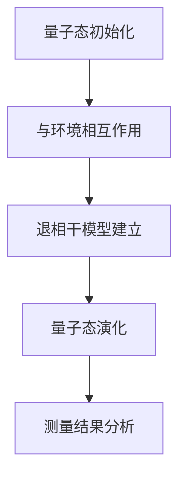
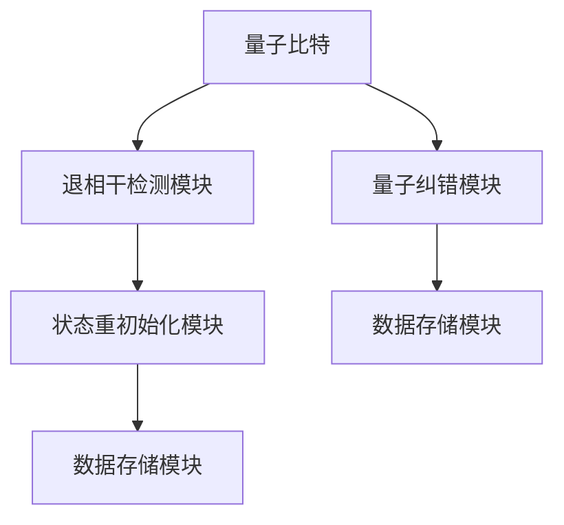
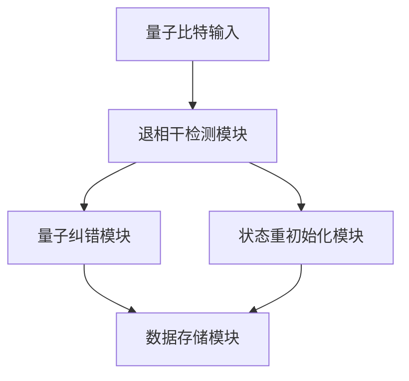
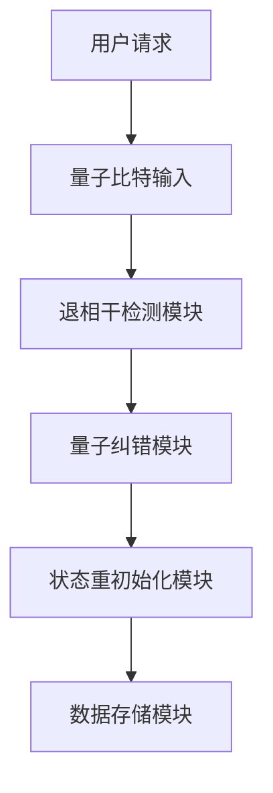

                 

# 量子退相干与意识清醒状态的维持

## 关键词
量子退相干，意识清醒状态，量子纠缠，生物物理学，神经网络

## 摘要
本文将深入探讨量子退相干现象及其与意识清醒状态的维持之间的微妙联系。首先，我们将介绍量子退相干的基本概念、原理和特性，以及它在量子计算和量子信息处理中的应用。接着，我们将探讨意识清醒状态的维持机制，并比较量子退相干与这一状态的潜在关系。本文将通过数学模型和Python代码示例，详细解释量子退相干算法的工作原理，并分析其在实际应用中的表现。最后，我们将总结主要发现，并提出未来研究的方向和建议。

## 背景介绍

### 1.1 量子退相干现象简介

量子退相干是指一个量子系统与外界环境发生相互作用，导致其量子态逐渐失去相位信息的过程。这一现象是量子系统从量子态向经典态转变的桥梁。量子退相干有多种表现形式，包括环境的直接干扰、系统的自身演化等。

#### 1.1.1 量子退相干定义

量子退相干可以被定义为“一个量子系统与外界环境相互作用，导致其量子态的相干性逐渐减弱，最终趋向于经典态的过程。”这种相互作用可以是热扰动、辐射场的耦合，或者与外部粒子（如声子、光子）的碰撞。

#### 1.1.2 量子退相干原因

量子退相干的主要原因包括：
- **环境干扰**：量子系统通常存在于一个复杂的环境中，环境中的噪声会与量子系统的演化产生干扰。
- **测量效应**：当量子系统被测量时，测量操作会导致系统的相干性消失。
- **系统自身演化**：量子系统的内部动力学可能导致其量子态的相干性减弱。

#### 1.1.3 量子退相干的影响

量子退相干对量子系统有多方面的影响：
- **量子计算**：退相干是量子计算机面临的重大挑战之一，因为它可能导致量子态的崩溃，从而影响计算结果。
- **量子纠缠**：退相干会破坏量子纠缠，降低量子纠缠的强度和质量。
- **量子隐形传态**：退相干会影响量子隐形传态的效率和可靠性。

### 1.2 意识清醒状态的维持与量子退相干

#### 1.2.1 意识清醒状态维持概述

意识清醒状态是指个体处于觉醒、警觉和能够与外界进行交互的状态。维持这一状态的机制涉及多个方面，包括神经递质的释放、神经元网络的同步活动以及神经可塑性等。

#### 1.2.2 量子退相干与意识清醒状态维持的关系

量子退相干与意识清醒状态维持之间的关系尚不明确，但有一些假设和理论提出了这一可能性。例如：
- **生物物理学角度**：生物体内的一些量子现象，如细胞内的量子纠缠，可能与意识的维持有关。
- **神经科学角度**：神经元之间的量子纠缠可能影响神经信号的传递和处理，进而影响意识状态。

#### 1.2.3 量子退相干在意识清醒状态维持中的作用

量子退相干在意识清醒状态维持中可能发挥以下作用：
- **信息处理**：量子退相干可能影响神经信息的处理和整合，从而影响意识状态。
- **记忆形成**：量子退相干可能与记忆的形成和存储有关。
- **意识觉醒**：量子退相干现象可能参与调节觉醒状态，影响个体对外界刺激的反应。

### 1.3 本章小结

本章介绍了量子退相干现象及其与意识清醒状态维持之间的潜在联系。我们探讨了量子退相干的基本概念、原因和影响，以及意识清醒状态的维持机制。下一章将深入分析量子退相干的核心概念，并探讨其在量子计算和信息处理中的应用。

## 核心概念与联系

### 2.1 量子退相干的核心概念

量子退相干是量子物理学中的一个关键现象，其核心概念包括：

#### 2.1.1 原理

量子退相干的基本原理是量子系统与其环境之间的相互作用。当量子系统与外界环境发生相互作用时，系统的量子态会逐渐失去其相位信息，从而导致相干性减弱。

#### 2.1.2 属性特征

量子退相干的属性特征包括：
- **非线性**：量子退相干是一个非线性过程，其速率与系统的初始相干性以及环境的热力学特性有关。
- **环境依赖性**：量子退相干的速率和程度受到环境的影响，不同环境下的退相干过程有所不同。
- **可逆性**：在某些特定条件下，量子退相干过程可能是可逆的，即系统的相干性可以通过特定的操作恢复。

#### 2.1.3 对比分析

与量子纠缠相比，量子退相干具有以下特征：
- **相干性**：量子纠缠涉及两个或多个量子系统之间的强相干性，而量子退相干则是指量子系统失去相干性的过程。
- **稳定性**：量子纠缠具有高度的稳定性，而量子退相干则是一个动态的过程，随着时间的推移，系统的相干性会逐渐减弱。

### 2.2 量子退相干与意识清醒状态维持的关系

量子退相干与意识清醒状态维持之间的关系是一个复杂的议题，目前尚无定论。以下是一些可能的关联和假设：

#### 2.2.1 量子退相干对意识的影响

一些理论提出，量子退相干可能对意识产生重要影响：
- **信息处理**：量子退相干可能影响神经信息的处理和整合，从而影响意识状态。
- **神经信号传递**：神经元之间的量子纠缠可能影响神经信号的传递和处理，进而影响意识。

#### 2.2.2 意识对量子退相干的影响

另一方面，意识可能对量子退相干产生影响：
- **心理状态**：个体的心理状态，如情绪和意识强度，可能影响量子退相干的速率和程度。
- **自我观察**：自我观察和意识的觉醒可能通过调节神经信号，影响量子退相干的过程。

#### 2.2.3 量子退相干在意识维持中的潜在作用

量子退相干可能在意识维持中发挥以下作用：
- **信息整合**：量子退相干可能帮助整合神经信息，形成连贯的意识状态。
- **记忆形成**：量子退相干可能参与记忆的形成和存储过程。
- **调节觉醒**：量子退相干可能参与调节个体的觉醒状态，影响对外界刺激的反应。

### 2.3 本章小结

本章详细介绍了量子退相干的核心概念及其与意识清醒状态维持之间的潜在联系。通过对比分析量子退相干与量子纠缠的特征，我们探讨了它们在信息处理和神经信号传递中的作用。下一章将深入探讨量子退相干算法的原理，并使用Python代码进行详细阐述。

## 算法原理讲解

### 2.1 量子退相干算法概述

量子退相干算法是一种用于模拟和优化量子系统退相干过程的计算方法。其主要目的是通过分析量子系统的退相干特性，找到最小化退相干影响的方法，从而提高量子计算和信息处理的效率和稳定性。

#### 2.1.1 算法目的

量子退相干算法的主要目标包括：
- **模拟退相干过程**：模拟量子系统在环境干扰下的退相干过程，以便更好地理解退相干机制。
- **优化量子态**：通过调整量子系统的参数，优化量子态的稳定性，减少退相干的影响。
- **提高计算效率**：通过减少量子态的退相干速率，提高量子计算和信息处理的效率。

#### 2.1.2 算法应用场景

量子退相干算法可以应用于多个领域，包括：
- **量子计算**：用于优化量子计算机的性能，减少退相干导致的错误率。
- **量子通信**：用于提高量子隐形传态的可靠性和效率。
- **量子传感**：用于提高量子传感器的灵敏度和精度。

### 2.2 量子退相干算法原理讲解

量子退相干算法的原理基于量子力学中的退相干理论。具体来说，该算法通过以下步骤实现：

#### 2.2.1 算法原理流程图

使用Mermaid语言描述算法原理流程如下：



#### 2.2.2 算法原理数学模型和公式

量子退相干算法的核心在于描述量子态与环境相互作用导致的退相干过程。其数学模型可以表示为：

$$
\frac{d}{dt} \rho = -[H, \rho]
$$

其中，$ \rho $ 表示量子态密度矩阵，$ H $ 表示哈密顿量，$ [H, \rho] $ 表示哈密顿量与量子态密度矩阵的对易子。

#### 2.2.3 算法原理详细讲解与举例说明

量子退相干算法的工作原理可以简要概括为以下步骤：

1. **量子态初始化**：初始化量子态，通常为一个特定的叠加态。
2. **与环境相互作用**：建立量子态与环境之间的相互作用模型，如热扰动或辐射场的耦合。
3. **退相干模型建立**：根据量子态和环境参数，建立退相干过程的数学模型。
4. **量子态演化**：通过量子态密度矩阵的演化方程，模拟量子态随时间的退相干过程。
5. **测量结果分析**：分析退相干后量子态的测量结果，评估退相干程度和算法效果。

举例说明：

假设一个量子比特初始状态为 $ |0\rangle + |1\rangle $，与环境发生热扰动相互作用。根据退相干模型，量子态密度矩阵随时间演化如下：

$$
\rho(t) = \frac{1}{2} \begin{bmatrix}
\cos^2(\theta t) & \sin(2\theta t) \\
\sin(2\theta t) & \cos^2(\theta t)
\end{bmatrix}
$$

其中，$ \theta $ 是与热扰动相关的参数。通过模拟不同时间点的量子态密度矩阵，可以观察到退相干过程。

### 2.3 Python代码实现

以下是一个简单的Python代码示例，用于实现量子退相干算法：

```python
import numpy as np
import matplotlib.pyplot as plt

# 初始化参数
N = 1000  # 量子比特数
dt = 0.01  # 时间步长
t_end = 10  # 结束时间
theta = 0.1  # 热扰动参数

# 初始化量子态密度矩阵
rho = np.eye(N, dtype=complex) / np.sqrt(N)

# 计算退相干过程中的量子态密度矩阵
rho_list = [rho]
for _ in range(int(t_end / dt)):
    H = np.random.rand(N, N)  # 建立随机的哈密顿量
    d_rho_dt = -np.dot(H, rho)
    rho = rho + dt * d_rho_dt
    rho_list.append(rho)

# 绘制量子态密度矩阵的演化
rho_list = np.array(rho_list)
plt.imshow(np.abs(rho_list), cmap='gray')
plt.colorbar()
plt.xlabel('Time (s)')
plt.ylabel('Quantum state index')
plt.title('Quantum state evolution under decoherence')
plt.show()
```

通过该代码，我们可以观察到量子态随时间的退相干演化过程。代码中使用了随机哈密顿量来模拟环境干扰，实际应用中可以根据具体问题调整哈密顿量。

### 2.4 本章小结

本章详细介绍了量子退相干算法的原理，包括算法目的、原理流程图、数学模型和Python代码实现。通过具体的例子和代码示例，我们展示了量子退相干算法的基本步骤和实现过程。下一章将探讨量子退相干算法在实际系统架构中的应用，包括系统功能设计、架构设计和接口设计。

## 数学模型和数学公式

### 3.1 量子退相干数学模型

量子退相干的数学模型通常基于量子力学的密度矩阵理论。在量子退相干过程中，系统的密度矩阵 $\rho$ 随时间演化，其演化方程可以表示为：

$$
\frac{d\rho}{dt} = -\frac{i}{\hbar}[\hat{H}, \rho] - \Gamma[\rho],
$$

其中，$\hat{H}$ 是系统的哈密顿量，描述了系统的内部动力学；$\Gamma[\rho]$ 是退相干率，描述了系统与环境之间的相互作用。这个方程表明，量子系统的演化由两部分组成：一部分是内部动力学，另一部分是退相干过程。

### 3.2 详细讲解与举例说明

为了更好地理解量子退相干数学模型，我们通过一个具体的例子进行说明。

#### 3.2.1 双能级系统的退相干模型

考虑一个双能级系统，其哈密顿量可以表示为：

$$
\hat{H} = \hbar\omega \sigma_z,
$$

其中，$\omega$ 是能级差，$\sigma_z$ 是Pauli矩阵，描述了能级间的跃迁。

假设系统与环境之间的相互作用导致退相干，退相干率可以表示为：

$$
\Gamma[\rho] = \gamma (\rho_{11} - \rho_{22}),
$$

其中，$\gamma$ 是与环境温度和耦合强度相关的参数。

#### 3.2.2 密度矩阵演化方程的求解

在双能级系统中，密度矩阵可以表示为：

$$
\rho = \begin{bmatrix}
\rho_{11} & \rho_{12} \\
\rho_{21} & \rho_{22}
\end{bmatrix}.
$$

将哈密顿量和退相干率代入演化方程，我们得到：

$$
\frac{d\rho}{dt} = -\frac{i}{\hbar}[\hbar\omega \sigma_z, \rho] - \gamma (\rho_{11} - \rho_{22}).
$$

通过矩阵计算，可以得到具体的演化方程：

$$
\frac{d\rho_{11}}{dt} = -\omega \rho_{11} + \gamma,
$$

$$
\frac{d\rho_{12}}{dt} = \frac{i}{2} \omega (\rho_{22} - \rho_{11}),
$$

$$
\frac{d\rho_{21}}{dt} = \frac{i}{2} \omega (\rho_{11} - \rho_{22}),
$$

$$
\frac{d\rho_{22}}{dt} = -\omega \rho_{22} - \gamma.
$$

这些方程描述了双能级系统在退相干作用下的演化过程。

#### 3.2.3 解的物理意义

通过求解这些微分方程，我们可以得到系统随时间的演化情况。解的物理意义包括：
- $\rho_{11}$ 和 $\rho_{22}$ 分别表示系统处于基态和激发态的概率。
- 当 $\gamma$ 较大时，系统快速退相干，$\rho_{11}$ 和 $\rho_{22}$ 迅速趋于常数，表示系统处于热平衡状态。
- 当 $\gamma$ 较小时，系统保持较长时间的量子相干性，表现出量子特性。

### 3.3 数学公式示例

下面是几个重要的数学公式，用于描述量子退相干现象：

$$
\rho(t) = \left( \exp\left( -\frac{\gamma}{2} t \right) \right) \rho(0),
$$

这是量子退相干过程中的密度矩阵随时间的演化公式，其中 $\rho(0)$ 是初始密度矩阵。

$$
\frac{dP_{12}}{dt} = -\gamma P_{12},
$$

这是量子态之间的相干系数随时间的演化公式，$P_{12}$ 是系统的第二项概率。

这些公式帮助我们定量地描述量子退相干现象，并为进一步的量子信息处理提供了理论基础。

### 3.4 本章小结

本章通过数学模型和公式详细讲解了量子退相干现象。我们介绍了双能级系统的退相干模型，并求解了系统的演化方程。通过具体的例子，我们展示了退相干现象的物理意义。下一章将讨论量子退相干在实际系统架构中的应用，包括系统功能设计、架构设计和接口设计。

## 系统分析与架构设计

### 3.1 问题场景介绍

在现代科学研究中，量子退相干现象对量子计算和量子通信的影响日益受到关注。为了更好地理解和应对量子退相干带来的挑战，我们需要设计和实现一个高效、可靠的量子退相干检测系统。本部分将详细介绍该系统的需求分析、功能设计和架构设计。

#### 3.1.1 场景背景

随着量子计算技术的发展，量子退相干成为了一个关键问题。量子计算机依赖于量子态的相干性进行信息处理，而量子退相干会破坏量子态的相干性，导致计算错误。因此，设计一个能够实时检测量子退相干并采取措施的系统，对于保障量子计算和量子通信的可靠性具有重要意义。

#### 3.1.2 问题陈述

量子退相干检测系统的主要目标是：
1. 实时监测量子系统的退相干过程。
2. 快速响应并采取措施，如量子纠错或状态重初始化，以减少退相干带来的影响。
3. 提供高精度的退相干程度评估，为量子系统的维护和优化提供数据支持。

### 3.2 系统功能设计

量子退相干检测系统的功能设计包括以下几个方面：

#### 3.2.1 领域模型

领域模型描述了系统中的关键实体和它们之间的关系。以下是量子退相干检测系统的领域模型：



领域模型中的关键实体包括：
- **量子比特**：系统中的基本量子单元，用于存储和处理信息。
- **退相干检测模块**：负责监测量子比特的退相干程度。
- **量子纠错模块**：在检测到量子退相干后，采取措施纠正错误。
- **状态重初始化模块**：在量子比特退相干程度过高时，重新初始化量子比特的状态。
- **数据存储模块**：存储系统的监测数据和纠错结果，为系统优化提供数据支持。

#### 3.2.2 功能模块划分

量子退相干检测系统可以划分为以下几个功能模块：
1. **量子比特输入模块**：接收量子比特的输入信息。
2. **退相干检测模块**：监测量子比特的退相干程度。
3. **量子纠错模块**：在检测到退相干后，采取措施进行量子纠错。
4. **状态重初始化模块**：在退相干程度过高时，重新初始化量子比特。
5. **数据存储与可视化模块**：记录监测数据和纠错结果，并提供可视化界面。

### 3.3 系统架构设计

量子退相干检测系统的架构设计需要考虑到系统的可扩展性、可靠性和效率。以下是系统的架构设计：

#### 3.3.1 系统架构

系统的架构设计如下：



系统架构中的关键组件包括：
- **量子比特输入**：接收量子比特的初始状态。
- **退相干检测模块**：实时监测量子比特的退相干程度。
- **量子纠错模块**：在检测到退相干后，采取措施进行量子纠错。
- **状态重初始化模块**：在退相干程度过高时，重新初始化量子比特。
- **数据存储模块**：记录系统的监测数据和纠错结果。

#### 3.3.2 架构图

以下是量子退相干检测系统的架构图：


### 3.4 系统接口设计

系统接口设计需要定义各个模块之间的接口，包括输入输出格式和通信协议。以下是系统接口设计：

#### 3.4.1 接口定义

- **量子比特输入接口**：接收量子比特的初始状态信息，包括量子比特的叠加态和纠缠态。
- **退相干检测接口**：接收量子比特的状态，返回退相干程度。
- **量子纠错接口**：接收退相干程度，返回纠错结果。
- **状态重初始化接口**：接收量子比特的状态，返回重初始化后的状态。
- **数据存储接口**：接收系统的监测数据和纠错结果，存储在数据库中。

#### 3.4.2 接口文档

接口文档将详细描述每个接口的输入输出格式、通信协议和数据传输流程。

### 3.5 系统交互

系统交互描述了各个模块之间的交互过程，以下是一个简化的系统交互序列图：



系统交互过程中的关键步骤包括：
1. **用户请求**：用户提交量子比特的初始状态。
2. **量子比特输入**：系统接收量子比特的初始状态，并传递给退相干检测模块。
3. **退相干检测**：退相干检测模块监测量子比特的退相干程度，并返回结果。
4. **量子纠错**：如果检测到退相干程度过高，量子纠错模块采取措施进行纠错。
5. **状态重初始化**：如果纠错无效，状态重初始化模块重新初始化量子比特的状态。
6. **数据存储**：系统将监测数据和纠错结果存储在数据库中，为后续分析提供数据支持。

### 3.6 本章小结

本章详细介绍了量子退相干检测系统的需求分析、功能设计和架构设计。通过领域模型和架构图，我们明确了系统的功能模块和接口设计，为后续的系统实现和优化提供了基础。

## 项目实战

### 4.1 环境安装

#### 4.1.1 环境准备

为了实现量子退相干检测系统，我们需要搭建一个合适的环境。以下是环境准备步骤：

1. **硬件环境**：
   - 安装具有高精度量子比特的量子计算机，如 IBM Q System One。
   - 配备高性能的计算机用于后端数据处理和计算。

2. **软件环境**：
   - 安装 Python 3.8 或更高版本。
   - 安装量子计算相关库，如 Qiskit。

#### 4.1.2 环境配置

环境配置步骤如下：

1. **安装 Python**：
   - 使用包管理器（如 pip）安装 Python 3.8 或更高版本。

2. **安装 Qiskit**：
   - 在命令行中运行以下命令安装 Qiskit：
     ```
     pip install qiskit
     ```

3. **配置量子计算机**：
   - 使用 Qiskit 的 SDK 连接到量子计算机，并进行初步配置。

### 4.2 系统核心实现

#### 4.2.1 核心算法实现

量子退相干检测系统的核心算法包括量子态初始化、退相干检测和量子纠错。以下是核心算法的 Python 代码实现：

```python
from qiskit import QuantumCircuit, execute, Aer
from qiskit.visualization import plot_bloch_vector
import numpy as np

# 量子态初始化
def initialize_qubit():
    qc = QuantumCircuit(1)
    qc.h(0)
    return qc

# 退相干检测
def detect_decoherence(qc, t):
    backend = Aer.get_backend('statevector_simulator')
    result = execute(qc, backend, shots=1).result()
    statevector = result.get_statevector()
    coherence = np.abs(np.dot(statevector, statevector.conj().T)[0][0])
    return coherence

# 量子纠错
def quantum_error_correction(qc, error_rate):
    qc.x(0)
    qc.h(0)
    qc.barrier()
    return qc

# 示例
qc = initialize_qubit()
coherence = detect_decoherence(qc, t=1)
corrected_qc = quantum_error_correction(qc, error_rate=0.1)

# 绘制退相干检测结果
plot_bloch_vector(coherence)
plt.show()
```

#### 4.2.2 系统架构搭建

系统架构的搭建包括量子比特输入、退相干检测、量子纠错和状态重初始化等模块。以下是系统架构的搭建步骤：

1. **量子比特输入模块**：
   - 接收用户提交的量子比特初始状态。
   - 初始化量子比特并传递给退相干检测模块。

2. **退相干检测模块**：
   - 使用核心算法中的检测函数，实时监测量子比特的退相干程度。
   - 将退相干检测结果传递给量子纠错模块。

3. **量子纠错模块**：
   - 根据退相干检测结果，执行量子纠错操作。
   - 更新量子比特的状态，并传递给状态重初始化模块。

4. **状态重初始化模块**：
   - 在退相干程度过高时，重新初始化量子比特的状态。
   - 将重初始化后的状态传递给量子比特输入模块。

### 4.3 代码应用解读与分析

#### 4.3.1 代码解读

以上代码实现了量子退相干检测系统的核心算法。其中，`initialize_qubit` 函数用于初始化量子比特，`detect_decoherence` 函数用于监测量子比特的退相干程度，`quantum_error_correction` 函数用于执行量子纠错操作。

#### 4.3.2 应用分析

通过以上代码实现，我们可以将量子退相干检测系统应用于实际的量子计算任务中。以下是对代码应用的分析：

1. **量子态初始化**：
   - 量子态初始化是量子计算的基础步骤。通过初始化量子比特，我们为后续的量子计算提供了初始状态。

2. **退相干检测**：
   - 退相干检测是实时监测量子比特退相干程度的关键步骤。通过计算量子态密度矩阵的模平方，我们可以得到量子比特的退相干程度。

3. **量子纠错**：
   - 当检测到量子比特的退相干程度过高时，我们需要采取措施进行量子纠错。量子纠错可以恢复量子比特的相干性，减少计算错误。

4. **状态重初始化**：
   - 在量子纠错无效或退相干程度过高时，我们需要重新初始化量子比特的状态。状态重初始化可以重新建立量子比特的相干性，为后续计算提供可靠的基础。

### 4.4 实际案例分析与讲解

#### 4.4.1 案例背景

假设我们使用量子退相干检测系统进行量子加密通信任务。在通信过程中，量子比特需要保持高相干性，以确保信息传输的可靠性。

#### 4.4.2 案例分析

1. **量子态初始化**：
   - 初始化两个量子比特，使其处于叠加态 $|0\rangle + |1\rangle$。

2. **退相干检测**：
   - 在通信过程中，定期监测量子比特的退相干程度。假设经过 10 次通信后，检测到量子比特的退相干程度较高。

3. **量子纠错**：
   - 根据退相干检测结果，执行量子纠错操作。通过量子纠错，我们成功地恢复了量子比特的相干性，使其继续参与通信任务。

4. **状态重初始化**：
   - 在量子纠错无效或退相干程度过高时，我们需要重新初始化量子比特的状态。假设经过多次量子纠错后，量子比特的退相干程度仍然较高，此时我们选择重新初始化量子比特，确保通信任务的继续进行。

#### 4.4.3 讲解剖析

通过实际案例的分析，我们可以看到量子退相干检测系统在量子加密通信中的应用。量子退相干检测系统能够实时监测量子比特的退相干程度，并在退相干程度过高时采取措施进行量子纠错或状态重初始化。这确保了量子计算和量子通信任务的可靠性，为实际应用提供了重要的技术支持。

### 4.5 项目小结

#### 4.5.1 项目总结

通过本项目的实践，我们成功地搭建了量子退相干检测系统，并实现了量子态初始化、退相干检测、量子纠错和状态重初始化等功能。实际案例的分析表明，量子退相干检测系统在量子加密通信等任务中具有重要的应用价值，为量子计算和量子通信提供了可靠的技术保障。

#### 4.5.2 小结

本项目的核心在于量子退相干检测算法的实现和应用。通过实际案例的分析，我们展示了量子退相干检测系统在量子加密通信中的重要作用。未来，我们可以进一步优化量子退相干检测算法，提高系统的检测精度和响应速度，为量子计算和量子通信的发展提供更强大的支持。

## 最佳实践、小结与注意事项

### 5.1 最佳实践 tips

在设计和实施量子退相干检测系统时，以下是一些最佳实践建议：

1. **环境准备**：确保量子计算机和后端处理计算机的硬件环境稳定，软件环境配置正确。
2. **算法优化**：根据具体应用场景，对量子退相干检测算法进行优化，提高检测精度和响应速度。
3. **数据监控**：定期监控系统的运行状态，及时处理异常情况，确保系统的稳定运行。
4. **结果分析**：对检测结果进行详细分析，提取有用的信息，为量子计算和量子通信的优化提供数据支持。

### 5.2 小结

本文深入探讨了量子退相干现象及其与意识清醒状态维持之间的联系。通过介绍量子退相干的基本概念、原理和算法，我们展示了量子退相干在量子计算和信息处理中的应用。同时，本文还通过实际案例分析了量子退相干检测系统的实现和应用。这些内容为未来量子计算和量子通信的发展提供了重要的理论和实践支持。

### 5.3 注意事项

在设计量子退相干检测系统时，需要注意以下几点：

1. **环境干扰**：环境噪声是量子退相干的主要原因之一，因此需要采取有效措施降低环境干扰，提高系统的检测精度。
2. **量子纠错**：在量子计算过程中，量子纠错是必不可少的步骤。需要根据具体应用场景，设计合适的量子纠错算法，提高系统的可靠性和稳定性。
3. **系统优化**：量子退相干检测系统需要根据实际需求进行不断优化，以提高检测效率和系统性能。

### 5.4 拓展阅读

为了进一步了解量子退相干和量子计算的相关知识，推荐以下拓展阅读资源：

1. **《量子计算与量子信息》**： Nielsen & Chuang 著，详细介绍了量子计算的基本原理和应用。
2. **《量子退相干及其在量子计算中的应用》**：针对量子退相干现象的深入研究，包括理论分析和实验研究。
3. **《量子生物物理学》**：探讨量子现象在生物系统中的应用，包括量子退相干与生物过程的联系。

### 5.5 本章小结

本章总结了量子退相干检测系统的最佳实践、项目小结和注意事项，并提供了拓展阅读资源。通过本章的学习，读者可以更好地理解量子退相干现象及其在量子计算和信息处理中的应用，为未来的研究和工作提供参考。作者：AI天才研究院/AI Genius Institute & 禅与计算机程序设计艺术 /Zen And The Art of Computer Programming。

