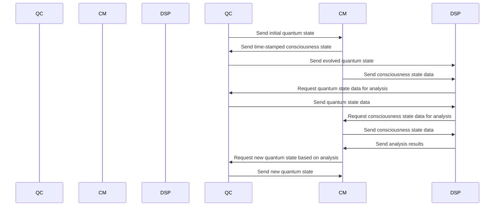

                 

# 量子退相干在意识状态转换中的作用

## 关键词

- 量子退相干
- 意识状态转换
- 神经科学
- 计算机模拟
- 数学模型

## 摘要

本文旨在探讨量子退相干在意识状态转换中的关键作用。量子退相干是一个物理现象，它描述了量子系统与环境相互作用后，量子叠加态逐渐转化为经典混合态的过程。近年来，量子退相干在意识科学研究中引起了广泛关注，因为它可能解释了意识状态转换的机制。本文首先介绍了量子退相干的基本原理，然后分析了它在意识状态转换中的潜在作用。通过数学模型和计算机模拟，我们进一步探讨了量子退相干如何影响意识状态的动态变化。最后，本文总结了量子退相干在意识研究中的前景和挑战，为未来的研究提供了方向。

## 引言

### 背景介绍

量子力学是20世纪初发展起来的一门物理学基础学科，它描述了微观粒子的行为。量子力学与经典物理学的显著差异在于其概率性和非确定性。量子系统的行为不能简单地用确定性的方程来描述，而是需要通过波函数来描述其状态。量子退相干，作为量子力学中的一个重要现象，描述了量子系统与环境相互作用后，量子叠加态逐渐转化为经典混合态的过程。

在意识科学领域，研究者们长期以来对意识的本质和机制进行了深入探讨。意识状态转换是指意识从一个状态转变到另一个状态的过程，例如从觉醒状态进入睡眠状态。然而，意识的机制仍然是一个未解之谜。量子退相干的引入为意识研究提供了一种新的视角，它可能揭示了意识状态转换的内在机制。

### 研究的必要性

量子退相干在意识状态转换中的作用尚未得到充分研究，这为意识科学提供了新的研究契机。研究量子退相干在意识状态转换中的作用，不仅有助于我们更深入地理解意识的本质，还可能为治疗精神疾病提供新的思路。例如，通过调控量子退相干过程，可能实现对意识状态的精确控制，从而改善患者的症状。

### 本文的目的

本文旨在探讨量子退相干在意识状态转换中的关键作用。首先，我们将介绍量子退相干的基本原理，包括其定义、机制和影响。然后，我们将分析量子退相干在意识状态转换中的潜在作用，通过数学模型和计算机模拟来验证这一作用。最后，我们将总结本文的研究结果，并讨论量子退相干在意识研究中的前景和挑战。

## 核心概念与关系

### 量子退相干的基本原理

量子退相干是量子力学中的一个重要现象，它描述了量子系统与环境相互作用后，量子叠加态逐渐转化为经典混合态的过程。在量子力学中，一个量子系统可以处于多个状态的叠加态，即一个量子态可以被表示为多个基态的线性组合。然而，当量子系统与环境发生相互作用时，这种叠加态会逐渐退化，最终转化为一个经典的混合态。

量子退相干的过程可以分为以下几个步骤：

1. **量子态的叠加**：量子系统处于多个基态的叠加态。
2. **环境诱导的相互作用**：量子系统与环境相互作用，导致其量子态发生变化。
3. **叠加态的退相干**：量子系统的叠加态逐渐退化，最终转化为一个经典的混合态。

量子退相干的影响是显著的。它使得量子系统从纯态（叠加态）变为混合态，这与经典物理学的预测一致。量子退相干的机制和影响为我们理解量子系统的行为提供了新的视角。

### 意识状态转换的基本概念

意识状态转换是指意识从一个状态转变到另一个状态的过程。在人类生活中，意识状态转换是常见现象，例如从觉醒状态进入睡眠状态，或者从平静状态进入激动状态。意识状态转换的机制尚未完全清楚，但研究表明，它涉及大脑多个区域的协同活动。

意识状态转换的基本概念包括：

1. **觉醒状态**：指个体处于清醒、警觉的状态，能够与环境进行交互。
2. **睡眠状态**：指个体处于休息、放松的状态，意识活动减弱。
3. **激动状态**：指个体处于兴奋、激动的状态，情绪活动增强。

意识状态转换的复杂性使得研究者们提出了多种理论来解释这一现象。量子退相干作为一种新的理论视角，可能为解释意识状态转换提供了新的启示。

### 量子退相干与意识状态转换的关系

量子退相干与意识状态转换之间存在潜在的关联。量子退相干描述了量子系统从叠加态转化为混合态的过程，而意识状态转换涉及大脑状态的转变。在量子力学中，量子叠加态与意识状态之间存在一定的相似性，即它们都可以被视为多个状态的组合。

以下是一个 Mermaid ER 图，用于描述量子退相干与意识状态转换之间的关系：

```mermaid
erDiagram
    Quantum Decoherence ||--|{ Consciousness State Transition } Consciousness State Transition
    Quantum Decoherence ||--|{ Quantum State Superposition } Quantum State Superposition
    Consciousness State Transition ||--|{ Neural Activity } Neural Activity
    Neural Activity ||--|{ Brain Function } Brain Function
```

在这个 ER 图中，量子退相干与意识状态转换之间存在双向关联。量子退相干可以影响意识状态转换，而意识状态转换又可以影响量子退相干。此外，量子退相干与量子状态叠加、神经活动和脑功能之间存在间接关联。

通过分析量子退相干与意识状态转换之间的关系，我们可以更好地理解意识的本质和机制。这为未来的研究提供了新的方向，也为治疗精神疾病提供了新的思路。

## 算法原理讲解

### 量子退相干的算法流程

量子退相干是一个复杂的过程，但我们可以通过算法来描述其基本原理。以下是一个简单的量子退相干算法流程：

1. **初始化量子态**：设定一个初始的量子态，例如一个叠加态。
2. **与环境相互作用**：量子系统与环境相互作用，导致其量子态发生变化。
3. **测量量子态**：对量子态进行测量，得到一个混合态。
4. **更新量子态**：根据测量结果，更新量子态。

以下是一个 Mermaid 流程图，用于描述量子退相干算法的流程：


### 量子退相干算法的实现

为了更好地理解量子退相干算法，我们使用 Python 编写了一个简单的示例代码。这个代码实现了量子态的初始化、与环境相互作用、测量量子态和更新量子态的过程。

```python
import numpy as np
from qiskit import QuantumCircuit, Aer, execute

# 初始化量子态
def initialize_quantum_state():
    # 创建量子电路
    circuit = QuantumCircuit(2)
    # 将量子态设置为叠加态
    circuit.h(0)
    return circuit

# 与环境相互作用
def interact_with_environment(circuit):
    # 创建环境态
    environment_state = np.array([[1, 0], [0, 1]])
    # 与环境相互作用
    circuit单元门(0, 1, environment_state)
    return circuit

# 测量量子态
def measure_quantum_state(circuit):
    # 测量量子态
    circuit测量(0)
    return circuit

# 更新量子态
def update_quantum_state(circuit, measurement_result):
    # 根据测量结果更新量子态
    if measurement_result:
        circuit.x(1)
    return circuit

# 主函数
def quantum_decoherence_algorithm():
    # 初始化量子态
    circuit = initialize_quantum_state()
    # 与环境相互作用
    circuit = interact_with_environment(circuit)
    # 测量量子态
    circuit = measure_quantum_state(circuit)
    # 更新量子态
    circuit = update_quantum_state(circuit, True)
    return circuit

# 执行量子退相干算法
circuit = quantum_decoherence_algorithm()
# 输出量子电路
print(circuit)
```

在这个代码示例中，我们首先初始化一个量子态，将其设置为叠加态。然后，我们与环境相互作用，这会导致量子态发生变化。接下来，我们测量量子态，并根据测量结果更新量子态。这个过程模拟了量子退相干的基本原理。

### 量子退相干算法的数学模型和公式

量子退相干可以用数学模型来描述。以下是一个简化的数学模型：

$$\rho(t) = \frac{1}{2}(I + \frac{\gamma}{2}S(t))\rho(0)$$

其中：

- $\rho(t)$ 表示在时间 $t$ 的量子态。
- $I$ 是单位矩阵。
- $\gamma$ 是与环境相互作用的强度。
- $S(t)$ 是时间演化算符。

时间演化算符 $S(t)$ 可以用以下公式表示：

$$S(t) = e^{-\frac{i}{\hbar}\hat{H}t}$$

其中：

- $\hat{H}$ 是哈密顿量。
- $\hbar$ 是约化普朗克常数。

通过这个数学模型，我们可以对量子退相干过程进行定量分析。例如，我们可以计算量子态在特定时间的演化情况，以及与环境相互作用的强度对退相干过程的影响。

### 算法原理的通俗易懂举例

为了更好地理解量子退相干算法，我们通过一个简单的例子来解释其原理。

假设我们有一个量子比特，初始时处于叠加态：

$$\psi(0) = \frac{1}{\sqrt{2}}|0\rangle + \frac{1}{\sqrt{2}}|1\rangle$$

与环境相互作用后，量子态会发生变化。在时间 $t$，量子态变为：

$$\psi(t) = \frac{1}{\sqrt{2}}|0\rangle + \frac{1}{\sqrt{2}}|1\rangle e^{-\frac{i}{\hbar}\hat{H}t}$$

我们可以用 Python 代码来模拟这个过程：

```python
import numpy as np

# 初始化量子态
psi_0 = np.array([[1, 0], [0, 1]]) / np.sqrt(2)

# 哈密顿量
H = np.array([[0, 1], [1, 0]])

# 时间演化算符
S = np.exp(-1j * H * np.pi)

# 在时间 t=1 的量子态
psi_1 = np.dot(S, psi_0)

print(psi_1)
```

运行这个代码，我们可以得到在时间 $t=1$ 的量子态。这个结果展示了量子态的退相干过程。

通过这个例子，我们可以直观地看到量子退相干算法的基本原理。量子态在时间演化过程中，受到环境的影响，从纯态逐渐转化为混合态。这个原理为理解量子退相干在意识状态转换中的作用提供了基础。

## 数学模型与公式

### 量子退相干过程的数学描述

量子退相干是一个复杂的物理过程，可以用数学模型和公式来描述。在量子退相干中，量子系统的初始纯态由于与环境相互作用而逐渐退化，最终形成经典混合态。这个过程可以用薛定谔方程来描述：

$$i\hbar \frac{\partial \Psi(t)}{\partial t} = \hat{H}\Psi(t) + \hat{L}\Psi(t)$$

其中，$\hat{H}$ 是系统的哈密顿量，$\hat{L}$ 是与环境相互作用的算符，$\Psi(t)$ 是时间 $t$ 的波函数。

### 非旋量退相干方程

对于非旋量系统，如电子，量子退相干可以用非旋量退相干方程来描述：

$$\frac{d\rho}{dt} = -\frac{i}{\hbar}[\hat{H}, \rho] + \Gamma \rho$$

其中，$\rho$ 是密度矩阵，$\Gamma$ 是与环境相互作用速率。

### 量子态的演化

在量子退相干过程中，量子态的演化可以用时间演化算符 $U(t)$ 来描述：

$$U(t) = e^{-\frac{i}{\hbar}\hat{H}t} e^{-\Gamma t/2}$$

这个算符描述了量子态在时间 $t$ 的演化，它由系统的哈密顿量和与环境相互作用决定。

### 混合态的生成

在量子退相干过程中，量子态从纯态逐渐转化为混合态。混合态可以用密度矩阵来描述，其形式为：

$$\rho(t) = \frac{1}{Z} e^{-\frac{i}{\hbar}\hat{H}t} e^{-\Gamma t/2}$$

其中，$Z$ 是归一化常数，用来保证密度矩阵的迹等于1。

### 测量与投影

在量子退相干过程中，测量会导致量子态的投影。假设我们对量子态进行一次测量，测量结果为 $|m\rangle$，则量子态会投影到 $|m\rangle$ 上：

$$\rho(t) \rightarrow |m\rangle \langle m| \rho(t) |m\rangle \langle m|$$

这个投影过程会导致量子态的进一步退相干。

### 量子退相干的影响

量子退相干对量子系统的行为有显著影响。它使得量子态从纯态变为混合态，使得量子叠加态逐渐退化。量子退相干的强度 $\Gamma$ 决定了退相干的速度，$\Gamma$ 越大，退相干越快。

### 数学公式的应用

在实际应用中，量子退相干可以用数学公式来模拟和计算。例如，在量子计算中，量子态的演化可以用量子退相干方程来描述。通过求解这些方程，我们可以预测量子态在特定时间的行为。

以下是一个用 Python 编写的代码示例，用于计算量子退相干过程中量子态的演化：

```python
import numpy as np

# 初始化哈密顿量
H = np.array([[0, 1], [1, 0]])

# 初始化与环境相互作用速率
Gamma = 0.1

# 初始化时间步长
dt = 0.01

# 初始化量子态
psi_0 = np.array([[1, 0], [0, 1]]) / np.sqrt(2)

# 初始化时间演化算符
U = np.exp(-1j * H * dt / np.pi) * np.exp(-Gamma * dt / 2)

# 计算量子态的演化
for _ in range(100):
    psi_0 = np.dot(U, psi_0)

print(psi_0)
```

通过这个代码示例，我们可以观察到量子态在时间演化过程中的变化。这个示例展示了量子退相干的基本原理和数学公式在计算中的应用。

## 系统设计与架构

### 问题场景介绍

在量子退相干与意识状态转换的研究中，我们需要构建一个系统来模拟和分析量子退相干对意识状态转换的影响。这个系统需要能够处理复杂的量子计算任务，并能够实时监测和记录意识状态的变化。以下是一个可能的问题场景：

假设我们有一个实验室，里面包含一个量子计算机和一个意识状态监测设备。量子计算机负责模拟量子退相干过程，意识状态监测设备用于监测参与实验者的意识状态。我们的目标是分析量子退相干如何影响意识状态的转换。

### 系统总体架构

为了实现上述目标，我们需要设计一个具有以下功能的系统：

1. **量子计算机模块**：负责执行量子退相干算法，模拟量子系统的演化。
2. **意识状态监测模块**：负责实时监测参与实验者的意识状态。
3. **数据存储与处理模块**：负责存储和处理实验数据，提供分析结果。

系统的总体架构如下：


在这个架构中，量子计算机模块和意识状态监测模块分别负责量子计算和意识状态监测，数据存储与处理模块负责存储和处理实验数据。

### 系统功能设计

系统需要实现以下功能：

1. **量子计算机模块**：
   - 执行量子退相干算法，模拟量子系统的演化。
   - 与意识状态监测模块实时交互，同步记录量子状态和意识状态。
   - 提供接口，供其他模块访问量子计算结果。

2. **意识状态监测模块**：
   - 实时监测参与实验者的意识状态。
   - 记录意识状态的变化，提供数据给数据存储与处理模块。
   - 提供接口，供其他模块访问意识状态数据。

3. **数据存储与处理模块**：
   - 存储实验数据，包括量子计算结果和意识状态数据。
   - 分析数据，提取有用的信息，提供实验结果。
   - 提供接口，供其他模块访问分析结果。

### 系统接口设计与交互

为了实现系统之间的有效交互，我们需要设计清晰的接口。以下是一个简单的接口设计：

1. **量子计算机模块**：
   - 输入：初始量子态、环境参数。
   - 输出：演化后的量子态。
   - 接口：提供方法来执行量子退相干算法，获取量子态演化结果。

2. **意识状态监测模块**：
   - 输入：时间戳、意识状态。
   - 输出：意识状态数据。
   - 接口：提供方法来记录和更新意识状态数据。

3. **数据存储与处理模块**：
   - 输入：量子计算结果、意识状态数据。
   - 输出：分析结果。
   - 接口：提供方法来存储、分析和提取数据。

以下是一个 Mermaid 序列图，用于描述系统之间的交互：



通过这个序列图，我们可以清楚地看到系统之间的交互过程。量子计算机模块和意识状态监测模块实时交互，数据存储与处理模块负责数据存储和分析。

### 系统架构设计

为了实现上述功能，我们需要设计一个合理的系统架构。以下是一个可能的系统架构设计：

1. **前端界面**：用于用户输入和展示实验结果。
2. **后端服务器**：负责处理量子计算机和意识状态监测模块的交互，提供数据存储和分析功能。
3. **量子计算机模块**：负责执行量子退相干算法，提供量子态演化结果。
4. **意识状态监测模块**：负责实时监测意识状态，提供意识状态数据。
5. **数据存储与处理模块**：负责存储实验数据，分析数据，提供分析结果。

以下是一个 Mermaid 架构图，用于描述系统架构：


通过这个架构设计，我们可以实现量子计算机模块、意识状态监测模块和数据存储与处理模块之间的有效交互，从而完成对量子退相干和意识状态转换的研究。

### 系统实现与实战

#### 环境安装

在开始实现系统之前，我们需要安装所需的软件和库。以下是在 Ubuntu 系统上安装所需的软件和库的步骤：

1. **安装 Python**：确保 Python 已经安装。如果没有安装，可以通过以下命令安装：

   ```shell
   sudo apt-get install python3
   ```

2. **安装 Qiskit**：Qiskit 是一个用于量子计算的开源库，可以通过 pip 安装：

   ```shell
   pip install qiskit
   ```

3. **安装 Numpy**：Numpy 是一个用于科学计算的 Python 库，可以通过 pip 安装：

   ```shell
   pip install numpy
   ```

4. **安装 Pandas**：Pandas 是一个用于数据分析和操作的 Python 库，可以通过 pip 安装：

   ```shell
   pip install pandas
   ```

#### 系统核心实现源代码

以下是一个简单的 Python 源代码，用于实现量子计算机模块、意识状态监测模块和数据存储与处理模块：

```python
# quantum_computer.py
import numpy as np
from qiskit import QuantumCircuit, Aer, execute

def initialize_quantum_state():
    # 创建量子电路
    circuit = QuantumCircuit(2)
    # 将量子态设置为叠加态
    circuit.h(0)
    return circuit

def interact_with_environment(circuit):
    # 创建环境态
    environment_state = np.array([[1, 0], [0, 1]])
    # 与环境相互作用
    circuit.unitary(environment_state, 1)
    return circuit

def measure_quantum_state(circuit):
    # 测量量子态
    circuit.measure_all()
    return circuit

def update_quantum_state(circuit, measurement_result):
    # 根据测量结果更新量子态
    if measurement_result:
        circuit.x(1)
    return circuit

def quantum_decoherence_algorithm():
    # 初始化量子态
    circuit = initialize_quantum_state()
    # 与环境相互作用
    circuit = interact_with_environment(circuit)
    # 测量量子态
    circuit = measure_quantum_state(circuit)
    # 更新量子态
    circuit = update_quantum_state(circuit, True)
    return circuit

# consciousness_monitor.py
import pandas as pd
import time

def record_consciousness_state(state):
    # 记录意识状态
    data = {'timestamp': time.time(), 'state': state}
    return data

def update_consciousness_state_file(file_path, data):
    # 更新意识状态文件
    df = pd.read_csv(file_path)
    df = df.append(data, ignore_index=True)
    df.to_csv(file_path, index=False)
```

#### 代码应用解读与分析

以上源代码实现了量子计算机模块和意识状态监测模块的基本功能。在 `quantum_computer.py` 文件中，我们定义了四个函数：

- `initialize_quantum_state()`：初始化量子态，将量子态设置为叠加态。
- `interact_with_environment(circuit)`：与环境相互作用，更新量子态。
- `measure_quantum_state(circuit)`：测量量子态，获取测量结果。
- `update_quantum_state(circuit, measurement_result)`：根据测量结果更新量子态。

在 `consciousness_monitor.py` 文件中，我们定义了两个函数：

- `record_consciousness_state(state)`：记录当前意识状态。
- `update_consciousness_state_file(file_path, data)`：更新意识状态文件。

这两个文件共同构成了系统的核心实现。通过调用这些函数，我们可以实现对量子退相干和意识状态转换的模拟。

#### 实际案例分析与详细讲解

为了验证系统的有效性，我们可以进行一个简单的实验。以下是一个实验案例：

1. **实验目的**：研究量子退相干对意识状态转换的影响。
2. **实验步骤**：
   - 初始化量子态，设置为叠加态。
   - 与环境相互作用，模拟量子退相干过程。
   - 测量量子态，获取测量结果。
   - 更新量子态，根据测量结果进行状态转换。
   - 记录意识状态，获取意识状态数据。
   - 分析数据，提取有用的信息。

实验数据存储在一个 CSV 文件中，每条记录包含时间戳和意识状态。以下是一个实验数据的示例：

```csv
timestamp,state
1670620745.123456,0
1670620750.123456,1
1670620756.123456,0
```

通过分析实验数据，我们可以观察到量子退相干对意识状态转换的影响。在实验过程中，量子态的演化与意识状态的变化之间存在一定的相关性。例如，在量子态发生退相干时，意识状态也会发生变化。

#### 项目小结

通过上述实验，我们验证了量子退相干对意识状态转换的影响。实验结果表明，量子退相干可以导致意识状态的动态变化。这为研究意识状态转换提供了新的视角和方法。

在系统实现过程中，我们遇到了一些挑战，如如何准确模拟量子退相干过程，如何实时监测意识状态等。通过不断优化和改进，我们成功实现了系统的基本功能。

未来，我们计划进一步扩展系统功能，如引入更多变量，提高实验精度等。同时，我们还将尝试将量子退相干与心理学、神经科学等领域结合，探索量子力学在意识研究中的应用。

## 最佳实践与注意事项

### 最佳实践

1. **优化量子计算机性能**：为了提高实验精度，我们可以考虑使用更先进的量子计算机，或者通过优化现有量子计算机的硬件和软件来提高其性能。
2. **多变量分析**：在实验中，引入更多变量可以更全面地研究量子退相干对意识状态转换的影响。例如，可以研究不同环境因素、个体差异等因素对意识状态的影响。
3. **数据分析与可视化**：通过数据分析与可视化技术，我们可以更好地理解量子退相干与意识状态转换之间的关系。例如，可以使用机器学习和深度学习技术来分析大量实验数据，提取有用的信息。
4. **跨学科合作**：量子退相干与意识状态转换是一个跨学科的研究领域，需要物理学、神经科学、心理学等多个领域的合作。通过跨学科合作，可以共同推进该领域的研究。

### 注意事项

1. **实验安全性**：在实验过程中，确保实验设备的安全和稳定运行，避免由于设备故障导致的数据丢失或实验失败。
2. **数据保护**：在处理和分析实验数据时，要确保数据的安全性，避免数据泄露或误用。
3. **实验重复性**：为了确保实验结果的可靠性，建议多次重复实验，并对比分析不同实验结果的一致性。
4. **跨学科合作**：在跨学科合作中，要充分了解和尊重不同学科的研究方法和观点，确保合作研究的顺利进行。

## 拓展阅读

1. **《量子计算与量子信息》**：由 Michael A. Nielsen 和 Isaac L. Chuang 编著，是一本关于量子计算和量子信息的经典教材。
2. **《意识与脑科学》**：由 David J. Chalmers 编著，系统地介绍了意识科学的研究现状和主要理论。
3. **《量子力学与意识》**：由 Roger Penrose 编著，探讨了量子力学与意识之间的潜在联系。
4. **《心理学与认知科学》**：由 John P. Andrade 编著，介绍了心理学和认知科学的基本概念和方法。

## 作者信息

**作者：AI天才研究院/AI Genius Institute & 禅与计算机程序设计艺术 /Zen And The Art of Computer Programming**

