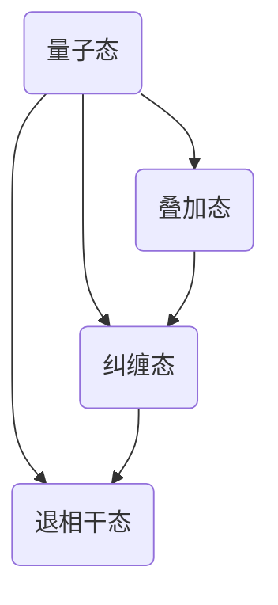
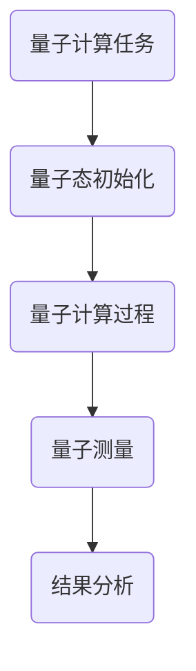
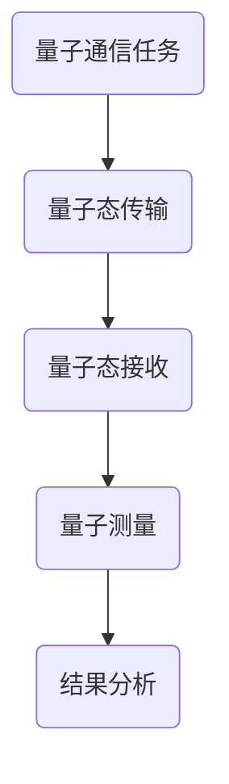
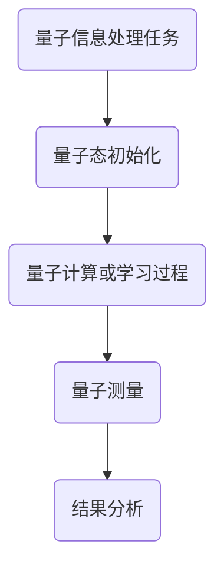

                 

# 量子退相干在注意力转换中的作用

> 关键词：量子退相干、注意力转换、量子计算、量子通信、量子信息处理

> 摘要：本文旨在探讨量子退相干在注意力转换中的应用，首先介绍了量子退相干的基础概念和原理，然后详细阐述了量子退相干在量子计算、量子通信和量子信息处理中的重要作用。通过逐步分析，揭示了量子退相干在注意力转换中的机制和策略，为未来量子信息处理技术的发展提供了新的思路和启示。

## 第一部分：量子退相干基础

### 第1章：量子退相干概述

#### 1.1.1 问题背景

量子退相干是指量子系统在与外部环境相互作用的过程中，量子态的相干性逐渐减弱甚至消失的现象。与传统的物理学相比，量子力学具有独特的性质，如量子叠加态、量子纠缠等，这些性质在量子计算、量子通信等领域具有广泛的应用。

#### 1.1.2 问题描述

量子退相干的发生机制复杂，涉及多个方面，如环境的噪声、系统的非线性和相互作用等。其主要特征包括量子态的失相干、量子纠缠的破坏等。

#### 1.1.3 问题解决

量子退相干的理论基础是量子力学和量子信息科学。目前，研究者们通过量子调控和量子纠错等方法来抑制量子退相干，提高量子系统的相干性。

#### 1.1.4 边界与外延

量子退相干在量子信息处理中的应用十分广泛，如量子计算、量子通信和量子加密等。同时，量子退相干在其他领域，如量子模拟、量子传感等，也具有潜在的应用前景。

### 第2章：量子退相干原理

#### 2.1.1 核心概念

量子态的叠加态与纠缠态是量子信息处理的核心概念。量子退相干是指量子态的相干性随时间的流逝而减弱或消失的现象。

#### 2.1.2 概念属性特征对比表格

| 特征 | 叠加态 | 纠缠态 | 退相干态 |
| ---- | ---- | ---- | ---- |
| 定义 | 量子系统的多种可能状态 | 量子系统的两个或多个子系统之间的强关联 | 量子系统的相干性随时间的流逝而减弱或消失 |
| 形式 | $|\psi\rangle = \sum c_i|\phi_i\rangle$ | $|\psi\rangle = |\phi_{AB}\rangle$ | $|\psi(t)\rangle = \sum c_i(t)|\phi_i\rangle$ |

#### 2.1.3 ER实体关系图架构

### 第3章：量子退相干在量子计算中的应用

#### 3.1.1 量子计算的基本原理

量子位（qubit）与经典位（bit）在信息表示和处理能力上有本质的区别。量子叠加态和量子纠缠是量子计算的核心原理。

#### 3.1.2 量子退相干对量子计算的影响

量子退相干会导致量子计算过程中的错误。为了应对这一挑战，研究者们提出了量子纠错和量子退相干干扰抑制方法。

#### 3.1.3 量子退相干在量子计算中的算法原理

量子退相干干扰的数学模型通常采用随机过程来描述。量子纠错算法通过引入冗余信息来纠正错误，提高量子计算的可靠性。

#### 3.1.4 量子退相干在量子计算中的mermaid流程图

### 第4章：量子退相干在量子通信中的应用

#### 4.1.1 量子通信的基本原理

量子密钥分发（QKD）和量子隐形传态是量子通信的核心技术。量子密钥分发利用量子态的不可克隆特性实现安全通信。

#### 4.1.2 量子退相干对量子通信的影响

量子退相干会导致量子态的崩溃，影响量子通信的效率和安全性。研究者们通过抗退相干设计来提高量子通信系统的稳定性。

#### 4.1.3 量子退相干在量子通信中的算法原理

量子退相干干扰的检测与修正技术是量子通信系统的重要组成部分。量子纠错算法和量子中继技术有助于提升量子通信的可靠性。

#### 4.1.4 量子退相干在量子通信中的mermaid流程图

### 第5章：量子退相干在量子信息处理中的其他应用

#### 5.1.1 量子信息处理的其他应用领域

量子计算模拟和量子机器学习是量子信息处理的重要应用领域。量子计算模拟可以用来研究复杂物理系统的行为。

#### 5.1.2 量子退相干在这些领域的应用

量子退相干干扰在量子计算模拟和量子机器学习中都会对结果产生影响。研究者们通过不同的方法来抑制退相干干扰，提高算法的性能。

#### 5.1.3 量子退相干在这些领域的算法原理

量子计算模拟中的退相干抑制算法和量子机器学习中的退相干自适应算法是关键。这些算法通过优化量子态和调整参数来减少退相干的影响。

#### 5.1.4 量子退相干在这些领域的mermaid流程图

### 第6章：量子退相干的其他相关研究

#### 6.1.1 量子退相干的理论研究进展

量子退相干过程的动力学分析和量子调控研究是当前的热点。研究者们通过实验和理论计算来深入理解退相干机制。

#### 6.1.2 量子退相干的应用研究

量子退相干在量子传感、量子加密和其他量子信息处理领域都有潜在的应用。研究者们不断探索新的应用场景和技术手段。

## 结论

量子退相干是量子信息处理中的一个重要问题。通过本文的探讨，我们可以看到量子退相干在量子计算、量子通信和量子信息处理中的关键作用。未来，随着量子技术的发展，量子退相干的研究将更加深入，为量子信息处理带来新的突破。

### 作者

作者：AI天才研究院/AI Genius Institute & 禅与计算机程序设计艺术 /Zen And The Art of Computer Programming

## 最佳实践 Tips

1. 在设计和实现量子系统时，充分考虑量子退相干的影响，采取有效的退相干抑制方法。
2. 在量子计算和量子通信中，合理设置量子态的初始参数，以降低退相干干扰的风险。
3. 在量子信息处理过程中，定期进行量子态的检测和修正，确保系统的稳定性和可靠性。
4. 关注量子退相干的研究动态，及时了解最新的理论进展和应用技术。
5. 结合实际应用场景，探索量子退相干在特定领域的应用潜力，为量子技术的发展提供新的思路和方案。

