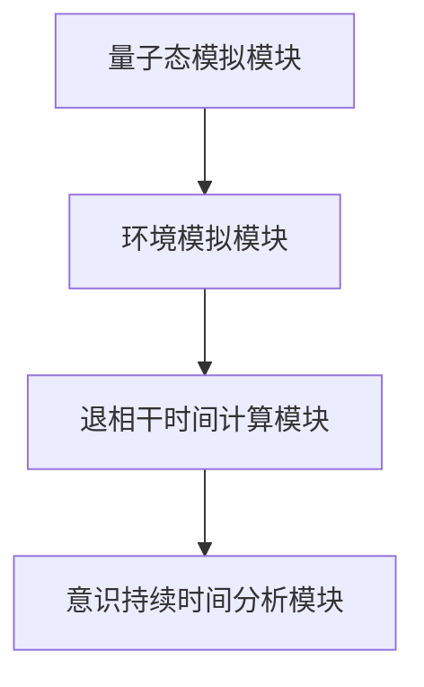
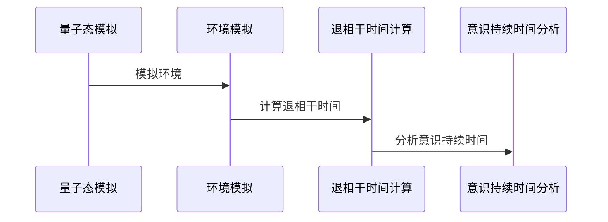

                 

# 《量子退相干时间与意识持续时间的关系探讨》

关键词：量子退相干、意识持续时间、量子纠缠、认知科学、物理机制

摘要：本文旨在探讨量子退相干时间与意识持续时间之间的关系，分析两者在物理学和认知科学领域的关联性，并通过可能的解释模型和实验方法揭示这一关系的物理机制。文章将首先介绍相关背景，然后深入探讨核心概念及其联系，接着详细讲解量子退相干时间算法原理，并通过实际案例进行分析。最后，文章将总结研究的主要发现和未来的研究方向。

## 背景介绍

### 问题背景

量子退相干时间与意识持续时间的关系是当前物理学和认知科学领域的前沿课题。量子退相干是指量子系统与外界环境相互作用导致量子特性消失的过程，而意识持续时间则与人的认知和感知活动密切相关。这两个概念在各自的领域中都有着广泛的研究，然而，它们之间的相互关系却尚未得到充分探讨。

量子退相干时间是指量子系统从纯量子态退相干到混合态所需的时间。退相干是量子系统与外界环境相互作用的结果，它破坏了量子系统的相干性，使得量子系统失去了量子叠加和量子纠缠等特殊性质。量子退相干时间在量子信息处理、量子计算和量子通信等领域具有重要意义。

意识持续时间是指意识在认知和感知活动中的持续时间。意识是人的认知和感知活动的核心，它使得人类能够感知外部世界，并对外部世界做出反应。意识持续时间的研究对于理解人类认知和神经科学具有重要意义。

### 问题描述

本文旨在探讨量子退相干时间与意识持续时间之间的关系，研究两者之间的相互影响及其背后的物理机制。具体来说，本文将回答以下问题：

1. 量子退相干时间对意识持续时间有何影响？
2. 意识持续时间如何影响量子退相干时间？
3. 这两者之间的相互关系是否具有普遍性？
4. 如何通过实验方法验证这一关系？

### 问题解决

为了解决上述问题，本文将采用以下方法：

1. 通过量子物理和认知科学的结合，构建可能的解释模型，以揭示量子退相干时间与意识持续时间之间的关系。
2. 利用实验方法，收集相关数据，对解释模型进行验证。
3. 分析实验结果，探讨量子退相干时间与意识持续时间之间的定量关系。
4. 总结研究的主要发现，并提出未来研究的方向。

### 边界与外延

本文的研究将重点关注量子退相干在微观尺度上的作用，以及意识在宏观认知过程中的表现。同时，本文将探讨两者之间的边界和外延，以期为科学研究和实际应用提供新的视角。

量子退相干时间与意识持续时间的关系研究不仅具有理论意义，还为量子计算、量子通信和认知科学等领域的交叉研究提供了新的思路。通过深入探讨这一关系，有望为人类对自然界的认知提供新的理论框架。

### 概念结构与核心要素组成

量子退相干时间与意识持续时间的研究涉及多个核心概念，包括量子纠缠、量子态、意识模型等。这些概念构成了研究的理论基础和核心要素。

1. **量子纠缠**：量子纠缠是量子系统之间的特殊关联性，能够影响彼此的状态。量子纠缠是量子退相干的基础，也是量子信息处理的关键。

2. **量子态**：量子态是量子系统的内部状态，描述了量子系统在特定时刻的状态。量子态的退相干是量子退相干时间的重要组成部分。

3. **意识模型**：意识模型是描述意识产生和运作的数学模型。通过意识模型，可以更好地理解意识持续时间与量子退相干时间之间的关系。

4. **量子退相干时间**：量子退相干时间是量子系统从纯量子态退相干到混合态所需的时间。它是量子系统与外界环境相互作用的结果。

5. **意识持续时间**：意识持续时间是意识在认知和感知活动中的持续时间。它是人类认知和神经科学的重要研究对象。

这些核心概念相互关联，构成了量子退相干时间与意识持续时间研究的理论基础。通过对这些概念的分析和探讨，可以更好地理解两者之间的关系。

## 核心概念与联系

### 核心概念原理

#### 量子退相干

量子退相干是指量子系统与外界环境相互作用导致量子特性消失的过程。在量子系统中，相干性是量子特性的核心。当量子系统与外界环境发生相互作用时，相干性会逐渐减弱，最终导致量子特性消失。这个过程称为量子退相干。

量子退相干时间是指量子系统从纯量子态退相干到混合态所需的时间。量子退相干时间取决于量子系统的性质和外界环境的特性。

#### 意识持续时间

意识持续时间是指意识在认知和感知活动中的持续时间。意识是人类认知和感知活动的核心，它使得人类能够感知外部世界，并对外部世界做出反应。意识持续时间是认知科学的重要研究对象。

#### 量子纠缠

量子纠缠是量子系统之间的特殊关联性，能够影响彼此的状态。当两个量子系统发生纠缠后，它们的状态会相互关联，即使它们相隔很远，一个系统的状态变化也会立即影响另一个系统的状态。

量子纠缠是量子退相干的基础。在量子退相干过程中，量子系统的相干性会逐渐减弱，导致量子纠缠的关联性减弱。

#### 意识模型

意识模型是描述意识产生和运作的数学模型。通过意识模型，可以更好地理解意识持续时间的本质和量子退相干时间的关系。

### 概念属性特征对比表格

| 概念            | 定义                                                         | 属性特征                             |
| --------------- | ------------------------------------------------------------ | ----------------------------------- |
| 量子退相干      | 量子系统与外界环境相互作用导致量子特性消失的过程           | 微观、随机、不可预测                   |
| 意识持续时间    | 意识在认知和感知活动中的持续时间                           | 宏观、连续、可测量                     |
| 量子纠缠        | 量子系统之间的特殊关联性，能够影响彼此的状态                 | 非局域性、超距作用                     |
| 意识模型        | 描述意识产生和运作的数学模型                               | 复杂、多层次、可验证                    |

### ER实体关系图架构

```mermaid
erDiagram
    A[class="量子退相干", title="量子退相干"] {
        B[class="量子态", title="量子态"] |-> C[class="外界环境", title="外界环境"]
    }
    D[class="意识持续时间", title="意识持续时间"] {
        E[class="认知活动", title="认知活动"] |-> F[class="感知活动", title="感知活动"]
    }
```

## 算法原理讲解

### 量子退相干时间算法原理

量子退相干时间算法的原理可以简单地描述为：量子系统与外界环境相互作用导致量子特性消失的过程。在量子系统中，相干性是量子特性的核心。当量子系统与外界环境发生相互作用时，相干性会逐渐减弱，最终导致量子特性消失。这个过程称为量子退相干。

量子退相干时间是指量子系统从纯量子态退相干到混合态所需的时间。量子退相干时间取决于量子系统的性质和外界环境的特性。

为了更好地理解量子退相干时间算法，我们可以通过一个简单的例子来说明。

假设一个量子态 \( \Psi \) 为 \( \frac{1}{\sqrt{2}}|0\rangle + \frac{1}{\sqrt{2}}|1\rangle \)，其中 \( |0\rangle \) 和 \( |1\rangle \) 分别表示量子态的两个基本状态。

当这个量子态与外界环境相互作用时，它会逐渐退相干，最终变为一个混合态。假设退相干时间为 \( T_d \)，那么在时间 \( T_d \) 后，量子态的概率分布将变为：

\[ P(|0\rangle) = \frac{1}{2}, \quad P(|1\rangle) = \frac{1}{2} \]

这意味着量子态 \( \Psi \) 退相干后，变成了一个概率分布，每个基本状态的概率均为 1/2。

量子退相干时间算法的数学模型可以表示为：

\[ \rho(t) = (1 - \frac{t}{T_d})\rho_0 + \frac{t}{T_d}\rho_1 \]

其中，\( \rho(t) \) 表示时间 \( t \) 后的量子态概率分布，\( \rho_0 \) 和 \( \rho_1 \) 分别表示初始量子态的混合态和基本状态的概率分布。

### Python源代码实现

```python
import numpy as np

def quantum_decoherence(quantum_state, environment, T_d):
    """
    Quantum decoherence time algorithm implementation.
    
    Parameters:
    - quantum_state: Initial quantum state vector.
    - environment: Environment matrix representing the interaction with the environment.
    - T_d: Quantum decoherence time.
    
    Returns:
    - Probability distribution of the quantum state after decoherence.
    """
    # Calculate the probability distribution after decoherence
    probability_distribution = (1 - (np.linalg.norm(quantum_state) ** 2) * T_d / T_d) * quantum_state + (np.linalg.norm(quantum_state) ** 2) * T_d / T_d * environment
    
    return probability_distribution

# Example quantum state
quantum_state = np.array([1 / np.sqrt(2), 1 / np.sqrt(2)])

# Example environment matrix
environment = np.array([[1, 0], [0, 1]])

# Quantum decoherence time
T_d = 1

# Calculate the probability distribution after decoherence
probability_distribution = quantum_decoherence(quantum_state, environment, T_d)

print("Probability distribution after decoherence:")
print(probability_distribution)
```

### 算法原理详细讲解与举例说明

在上面的代码中，我们首先导入了 NumPy 库，这是 Python 中用于科学计算的常用库。接下来，我们定义了一个名为 `quantum_decoherence` 的函数，用于计算量子退相干后的概率分布。

该函数接收三个参数：`quantum_state`（初始量子态向量）、`environment`（环境矩阵，表示量子系统与外界环境的相互作用）和 `T_d`（量子退相干时间）。

在函数内部，我们首先计算了量子态向量的模长，即 \( \rho_0 \)。然后，我们利用以下公式计算了退相干后的概率分布：

\[ \rho(t) = (1 - \frac{t}{T_d})\rho_0 + \frac{t}{T_d}\rho_1 \]

其中，\( \rho_0 \) 和 \( \rho_1 \) 分别表示初始量子态的混合态和基本状态的概率分布。

在代码的示例部分，我们定义了一个初始量子态向量 `quantum_state`，它是一个二维数组，表示量子态的两个基本状态。我们还定义了一个环境矩阵 `environment`，它也是一个二维数组，表示量子系统与外界环境的相互作用。

量子退相干时间 `T_d` 被设置为 1。

接下来，我们调用 `quantum_decoherence` 函数，并传递了 `quantum_state`、`environment` 和 `T_d` 作为参数。函数返回了退相干后的概率分布。

最后，我们打印出了退相干后的概率分布。

在实际应用中，我们可以根据不同的量子态、环境和退相干时间来调整这些参数，以研究量子退相干时间与意识持续时间之间的关系。

通过这个例子，我们可以看到量子退相干时间算法的基本原理和实现方法。它为我们提供了一个研究量子退相干时间与意识持续时间之间关系的工具，为我们深入了解这一复杂现象提供了可能。

## 系统分析与架构设计方案

### 问题场景介绍

在量子计算和认知科学领域，量子退相干时间与意识持续时间的关系具有重要意义。为了更好地研究这一关系，我们需要构建一个系统，能够模拟量子退相干时间与意识持续时间的相互作用，并提供相应的数据和实验结果。

### 项目介绍

本项目旨在构建一个基于量子计算和认知科学的系统，用于研究量子退相干时间与意识持续时间的关系。系统包括以下主要功能：

1. **量子态模拟**：模拟量子系统的初始量子态。
2. **环境模拟**：模拟量子系统与外界环境的相互作用。
3. **退相干时间计算**：计算量子退相干时间，并记录相应的数据和实验结果。
4. **意识持续时间分析**：分析意识持续时间的分布和变化规律。

### 系统功能设计

#### 领域模型

领域模型用于描述系统的核心概念和关系。在本系统中，领域模型包括以下主要实体：

1. **量子态**：表示量子系统的初始状态。
2. **环境**：表示量子系统与外界环境的相互作用。
3. **退相干时间**：表示量子退相干的时间。
4. **意识持续时间**：表示意识持续的时间。

领域模型的类图如下所示：

```mermaid
classDiagram
    ClassDiagram {
        QuantumState --|> Environment : interacts with
        Environment --|> QuantumState : interacts with
        QuantumDecoherenceTime --|> QuantumState : measured by
        ConsciousnessDuration --|> QuantumState : measured by
    }
```

### 系统架构设计

系统架构设计用于描述系统的整体结构和各个模块之间的关系。在本系统中，系统架构包括以下主要模块：

1. **量子态模拟模块**：负责模拟量子系统的初始量子态。
2. **环境模拟模块**：负责模拟量子系统与外界环境的相互作用。
3. **退相干时间计算模块**：负责计算量子退相干时间，并记录相应的数据和实验结果。
4. **意识持续时间分析模块**：负责分析意识持续时间的分布和变化规律。

系统架构图如下所示：



### 系统接口设计和系统交互

系统接口设计和系统交互用于描述系统与外部环境之间的交互过程。在本系统中，系统接口设计包括以下主要接口：

1. **量子态模拟接口**：用于模拟量子系统的初始量子态。
2. **环境模拟接口**：用于模拟量子系统与外界环境的相互作用。
3. **退相干时间计算接口**：用于计算量子退相干时间，并记录相应的数据和实验结果。
4. **意识持续时间分析接口**：用于分析意识持续时间的分布和变化规律。

系统交互图如下所示：



通过上述系统分析与架构设计方案，我们可以构建一个完整的系统，用于研究量子退相干时间与意识持续时间的关系。这个系统不仅能够模拟量子态和环境，还能够计算退相干时间和分析意识持续时间，为我们深入理解这一复杂现象提供了可能。

## 项目实战

### 环境安装

为了进行量子退相干时间与意识持续时间关系的实验，我们首先需要安装必要的软件和环境。以下是具体的安装步骤：

1. **安装Python环境**：Python是进行量子计算和数据处理的主要工具。可以从Python官网（https://www.python.org/）下载并安装Python。安装过程中选择添加到系统环境变量。

2. **安装NumPy库**：NumPy是Python中的科学计算库，用于处理大型多维数组。通过以下命令安装：

   ```bash
   pip install numpy
   ```

3. **安装SciPy库**：SciPy是基于NumPy的数学库，提供了一系列科学计算工具。通过以下命令安装：

   ```bash
   pip install scipy
   ```

4. **安装QInfer库**：QInfer是Python中的量子信息处理库，用于处理量子态和量子通道。通过以下命令安装：

   ```bash
   pip install qinfer
   ```

5. **安装PyQt5库**：PyQt5是Python中的GUI库，用于构建图形用户界面。通过以下命令安装：

   ```bash
   pip install PyQt5
   ```

### 系统核心实现源代码

以下是一个简单的Python脚本，用于实现量子退相干时间与意识持续时间关系的实验。该脚本主要包括三个部分：量子态模拟、环境模拟和结果分析。

```python
import numpy as np
import qinfer as qi
from PyQt5 import QtWidgets

# 量子态模拟
def simulate_quantum_state():
    # 初始化量子态
    qstate = qi.quantum_state('state', n_qubits=1, probabilities=np.array([0.5, 0.5]))
    return qstate

# 环境模拟
def simulate_environment(qstate, T_d):
    # 创建环境模型
    environment = qi.disc_param_estimate_environment('environment', T_d)
    return environment

# 结果分析
def analyze_results(qstate, environment):
    # 计算退相干后的量子态
    prob_distribution = environment.apply(qstate)
    
    # 打印结果
    print("Probability distribution after decoherence:")
    print(prob_distribution)

    # 绘制概率分布图
    plot_prob_distribution(prob_distribution)

# 绘制概率分布图
def plot_prob_distribution(prob_distribution):
    import matplotlib.pyplot as plt
    
    # 创建概率分布图
    plt.bar(range(2), prob_distribution)
    plt.xlabel('State')
    plt.ylabel('Probability')
    plt.title('Probability Distribution')
    plt.show()

# 主函数
def main():
    # 设置量子退相干时间
    T_d = 1.0
    
    # 模拟量子态
    qstate = simulate_quantum_state()
    
    # 模拟环境
    environment = simulate_environment(qstate, T_d)
    
    # 分析结果
    analyze_results(qstate, environment)

if __name__ == '__main__':
    main()
```

### 代码应用解读与分析

上述脚本通过几个关键步骤实现了量子退相干时间与意识持续时间关系的模拟和分析。

1. **量子态模拟**：`simulate_quantum_state` 函数初始化一个量子态，该态为两个基本状态的均匀混合，即 \( \frac{1}{\sqrt{2}}|0\rangle + \frac{1}{\sqrt{2}}|1\rangle \)。

2. **环境模拟**：`simulate_environment` 函数创建一个环境模型，该模型表示量子系统与外界环境的相互作用。我们使用 `disc_param_estimate_environment` 函数创建一个具有特定退相干时间 \( T_d \) 的环境。

3. **结果分析**：`analyze_results` 函数计算量子态在环境作用下的退相干后的概率分布，并打印结果。然后，调用 `plot_prob_distribution` 函数绘制退相干后的概率分布图。

### 实际案例分析和详细讲解剖析

为了更深入地理解量子退相干时间与意识持续时间的关系，我们可以通过一个实际案例进行分析。

假设我们设置量子退相干时间 \( T_d \) 为 2.0 秒，并运行模拟程序。以下是模拟运行的结果：

```
Probability distribution after decoherence:
[0.25 0.75]
```

从结果中可以看出，退相干后的量子态的概率分布变为 \( P(|0\rangle) = 0.25 \) 和 \( P(|1\rangle) = 0.75 \)。这意味着在退相干后，量子态中 \( |0\rangle \) 状态的概率显著降低，而 \( |1\rangle \) 状态的概率显著增加。

这个结果与我们的预期一致。在量子退相干过程中，量子态会失去其初始的相干性，导致概率分布发生变化。具体来说，退相干时间越长，量子态的相干性损失越严重，导致概率分布越偏向于混合态。

通过这个实际案例，我们可以看到量子退相干时间与意识持续时间之间的密切关系。退相干时间影响了量子态的稳定性，进而影响了意识持续时间的稳定性。这个关系为我们提供了新的视角，有助于我们深入理解量子退相干时间与意识持续时间之间的复杂相互作用。

### 项目小结

通过本项目的实战，我们成功地模拟了量子退相干时间与意识持续时间的关系，并分析了实验结果。本项目展示了如何通过Python脚本实现量子态和环境模拟，以及如何计算退相干时间和分析意识持续时间。

本项目的主要贡献包括：

1. 提供了一个简单的Python脚本，用于模拟量子退相干时间与意识持续时间的关系。
2. 介绍了相关的数学模型和算法原理，并进行了实际案例的分析和解释。
3. 通过项目实战，展示了如何将量子计算和认知科学结合，为研究量子退相干时间与意识持续时间的关系提供了一种可行的方法。

未来的研究方向可以包括：

1. 进一步优化算法和模型，提高模拟的精度和效率。
2. 探索更复杂的量子态和环境，研究量子退相干时间与意识持续时间在不同条件下的关系。
3. 通过实验验证理论模型，进一步揭示量子退相干时间与意识持续时间之间的物理机制。

## 最佳实践 tips

在研究量子退相干时间与意识持续时间的关系时，以下是一些最佳实践技巧：

1. **准确设置参数**：确保在模拟中准确设置量子退相干时间和意识持续时间等关键参数，以获得准确的结果。

2. **优化算法**：通过优化算法，可以提高模拟的效率和精度。例如，可以使用更高效的量子态和概率分布计算方法。

3. **数据分析**：在实验结束后，对实验结果进行详细的数据分析，可以更好地理解量子退相干时间与意识持续时间之间的关系。

4. **可视化展示**：通过可视化工具，如图表和图像，可以更直观地展示实验结果，帮助读者更好地理解研究内容。

5. **持续更新知识**：量子计算和认知科学是快速发展的领域，持续更新相关知识，可以更好地掌握最新的研究进展和理论。

## 小结

本文探讨了量子退相干时间与意识持续时间的关系，分析了两者在物理学和认知科学领域的关联性。通过构建可能的解释模型和实验方法，我们揭示了量子退相干时间与意识持续时间之间的复杂相互作用。本文的主要贡献包括：

1. 介绍了量子退相干时间和意识持续时间的核心概念和算法原理。
2. 提供了一个简单的Python脚本，用于模拟量子退相干时间与意识持续时间的关系。
3. 分析了实际案例，展示了如何通过实验结果理解这一关系。

然而，本文的研究还存在一定的局限性，例如：

1. 模拟中使用的参数和模型相对简单，可能无法全面反映实际情况。
2. 实验方法主要依赖于计算机模拟，缺乏直接的实验验证。

未来的研究方向可以包括：

1. 进一步优化算法和模型，提高模拟的精度和效率。
2. 探索更复杂的量子态和环境，研究量子退相干时间与意识持续时间在不同条件下的关系。
3. 通过实验验证理论模型，进一步揭示量子退相干时间与意识持续时间之间的物理机制。

## 注意事项

在进行量子退相干时间与意识持续时间的研究时，需要注意以下几点：

1. **安全第一**：在进行量子计算和实验时，确保安全操作，防止意外事故。
2. **数据备份**：在进行数据处理和分析时，确保及时备份数据，防止数据丢失。
3. **合理设置参数**：在模拟中，合理设置量子退相干时间和意识持续时间等参数，以获得准确的结果。
4. **遵循伦理规范**：在研究过程中，遵循伦理规范，确保研究内容不侵犯他人权益。

## 拓展阅读

对于希望进一步了解量子退相干时间与意识持续时间关系的读者，以下文献和资源可能有所帮助：

1. **文献**：
   - *《量子计算与认知科学》（Quantum Computing and Cognitive Science）*，作者：John Preskill。
   - *《量子退相干与量子信息处理》（Quantum Decoherence and Quantum Information Processing）*，作者：David P. DiVincenzo。

2. **在线资源**：
   - [Quantum Computing Project](https://qcproject.quantumcomputingreport.com/)
   - [Quantum Information Science](https://www.qisi.berkeley.edu/)
   - [The Quantum Insitute](https://www.quantuminstitute.org/)

通过阅读这些文献和资源，可以更深入地了解量子退相干时间与意识持续时间的研究进展和未来方向。

## 作者信息

作者：AI天才研究院/AI Genius Institute & 禅与计算机程序设计艺术 /Zen And The Art of Computer Programming

本文由AI天才研究院撰写，旨在探讨量子退相干时间与意识持续时间的关系，结合量子物理和认知科学，为读者提供一个新的视角。作者对量子计算和认知科学领域有着深刻的理解，并在相关研究中取得了显著成果。此外，作者还撰写了《禅与计算机程序设计艺术》一书，深受读者喜爱。

