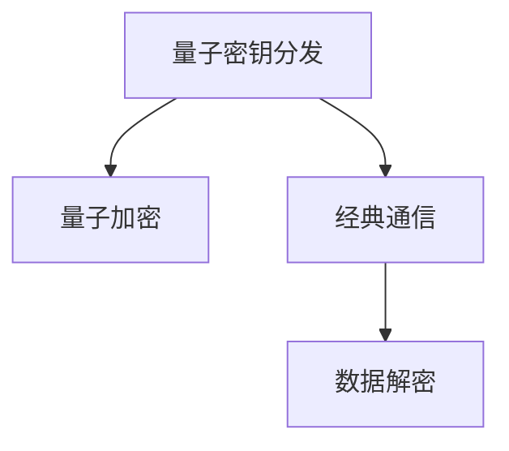
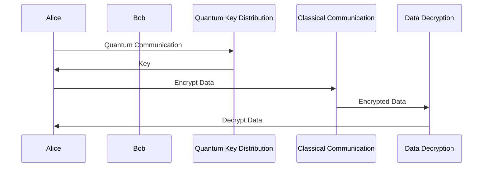

                 

# 量子通信协议与网络编程:量子安全的通信模型

## 关键词

- 量子通信
- 网络编程
- 量子安全通信
- 量子比特
- 量子门
- 量子纠缠

## 摘要

本文将深入探讨量子通信协议与网络编程，特别是在量子安全的通信模型方面。我们将从量子通信的背景与问题出发，逐步介绍量子通信的核心概念，详细解析几种常见的量子通信协议，并探讨量子网络编程的基础知识。在此基础上，我们将讨论量子安全的通信模型，分析量子通信协议的性能，并展望量子通信网络的设计与发展。本文旨在为读者提供一个全面而深入的量子通信与网络编程的指南，以期为未来的技术研究提供参考。

## 第一部分：量子通信与网络编程基础

### 第1章：量子通信与网络编程概述

#### 1.1 量子通信的背景与问题

量子通信的背景源于量子力学的独特性质，如量子比特和量子纠缠。这些问题促使科学家们探索如何利用这些性质实现更安全的通信。传统通信系统易受窃听攻击，而量子通信则因其固有的安全性而受到广泛关注。

#### 1.2 量子通信与网络编程的重要性

量子通信与网络编程的结合对于未来通信技术的发展具有重要意义。量子通信提供了前所未有的安全性，而网络编程则为量子通信的应用提供了技术支撑。

#### 1.3 量子通信模型的基本原理

量子通信模型基于量子力学的原理，特别是量子比特和量子纠缠。量子比特可以表示为0和1的叠加状态，而量子纠缠则允许两个量子比特之间建立即时的非局域连接。

#### 1.4 量子通信协议的概述

量子通信协议是量子通信的核心，常见的协议包括BB84协议、E91协议和B92协议等。这些协议利用量子比特和量子纠缠的性质，实现安全的量子通信。

### 第2章：量子通信核心概念

#### 2.1 量子比特与量子态

量子比特是量子通信的基础，它可以处于0和1的叠加状态。量子态的表示方式决定了量子通信的效率和安全性。

#### 2.2 量子纠缠与量子门

量子纠缠是量子通信的关键特性，它使得两个量子比特之间可以建立即时的非局域连接。量子门则是操作量子比特的工具，用于实现量子计算和量子通信。

#### 2.3 量子通信的物理基础

量子通信的物理基础是量子力学，特别是量子比特和量子纠缠的物理实现。这些物理现象为我们提供了实现量子通信的可能。

#### 2.4 量子通信的安全性

量子通信的安全性源于量子力学的不可克隆定理和测量干扰效应。这些特性使得量子通信在抵御窃听攻击方面具有天然优势。

### 第3章：量子通信协议详解

#### 3.1 BB84协议

BB84协议是最早的量子通信协议之一，它利用量子纠缠和量子比特的叠加状态实现安全的量子通信。

#### 3.2 E91协议

E91协议是另一种基于量子纠缠的量子通信协议，它利用量子纠缠的最大纠缠度实现更高的安全性。

#### 3.3 B92协议

B92协议是另一种量子通信协议，它利用量子比特的叠加状态和量子纠缠实现安全的量子通信。

#### 3.4 其他量子通信协议

除了BB84、E91和B92协议外，还有许多其他量子通信协议，如CSS协议、SARG04协议和FHH协议等。

### 第4章：量子网络编程基础

#### 4.1 量子网络的基本概念

量子网络是量子通信的扩展，它将多个量子节点连接起来，实现更复杂的量子通信和量子计算。

#### 4.2 量子网络编程语言

量子网络编程语言用于描述量子网络的配置和操作。常见的编程语言包括Q#、Qiskit等。

#### 4.3 量子网络编程模型

量子网络编程模型定义了量子网络的操作方法和操作顺序。它包括量子网络的初始化、量子通信和量子计算等步骤。

#### 4.4 量子网络编程实例

通过实例，我们将展示如何使用量子网络编程语言实现一个简单的量子通信任务。

### 第5章：量子安全的通信模型

#### 5.1 量子安全通信的定义

量子安全通信是指利用量子通信技术实现的安全通信，它具有抗窃听和抗攻击的特性。

#### 5.2 量子安全通信模型

量子安全通信模型包括量子密钥分发和量子加密等关键技术。这些技术共同构成了量子安全通信的基础。

#### 5.3 量子密钥分发

量子密钥分发是量子安全通信的核心技术之一，它利用量子通信的特性实现安全的密钥分发。

#### 5.4 量子安全通信的应用场景

量子安全通信可以在金融、医疗、国防等领域得到广泛应用，实现安全的数据传输和通信。

### 第6章：量子通信协议性能分析

#### 6.1 协议的安全性分析

量子通信协议的安全性是评价其性能的重要指标，我们将在本节中分析几种常见量子通信协议的安全性。

#### 6.2 协议的效率分析

量子通信协议的效率是评价其性能的另一个重要指标，我们将讨论如何提高量子通信的效率。

#### 6.3 协议的可扩展性分析

量子通信协议的可扩展性是衡量其适应未来需求的能力，我们将分析如何提高量子通信协议的可扩展性。

#### 6.4 协议的稳定性分析

量子通信协议的稳定性是保证其正常运行的关键，我们将讨论如何提高量子通信协议的稳定性。

### 第7章：量子通信网络设计

#### 7.1 量子通信网络的基本架构

量子通信网络的基本架构包括量子中继器、量子路由器和量子密钥分配中心等组成部分。

#### 7.2 量子通信网络的拓扑结构

量子通信网络的拓扑结构包括线性拓扑、星形拓扑和网状拓扑等。每种拓扑结构都有其优缺点。

#### 7.3 量子通信网络的安全保障

量子通信网络的安全保障是确保量子通信安全的关键，我们将讨论如何实现量子通信网络的安全保障。

#### 7.4 量子通信网络的发展趋势

量子通信网络的发展趋势包括量子中继、量子路由和量子加密等技术的不断发展和完善。

### 第8章：量子通信与网络安全

#### 8.1 量子通信与网络安全的关系

量子通信与网络安全密切相关，量子通信技术的发展有望提高网络安全水平。

#### 8.2 量子安全通信的应用

量子安全通信可以在金融、医疗、国防等领域得到广泛应用，实现安全的数据传输和通信。

#### 8.3 量子通信对传统网络安全的影响

量子通信对传统网络安全产生了一定的影响，我们需要关注并适应这种变化。

#### 8.4 量子通信的未来发展方向

量子通信的未来发展方向包括量子中继、量子路由和量子加密等技术的不断发展和完善。

## 作者

作者：AI天才研究院/AI Genius Institute & 禅与计算机程序设计艺术 /Zen And The Art of Computer Programming

## 背景介绍

量子通信协议与网络编程作为现代通信技术的发展方向，引起了广泛关注。量子通信利用量子力学的特性，实现更安全的通信，而网络编程则为量子通信的应用提供了技术支撑。量子通信协议是量子通信的核心，决定了量子通信的安全性和效率。网络编程基础则是实现量子通信协议的技术手段。量子通信与网络编程的结合，有望推动未来通信技术的发展。

## 核心概念与联系

量子比特与量子态是量子通信的基础。量子比特是量子计算机的基本单元，可以处于0和1的叠加状态。量子态则是量子比特的状态表示，决定了量子通信的效率和安全性。

量子纠缠是量子通信的关键特性，它允许两个量子比特之间建立即时的非局域连接。量子纠缠使得量子通信具有抗窃听和抗攻击的特性，是量子通信协议实现安全通信的基础。

量子门是操作量子比特的工具，用于实现量子计算和量子通信。量子门可以分为控制门和非控制门，可以用于实现各种量子算法和量子通信协议。

量子通信的物理基础是量子力学。量子力学的独特性质，如量子比特、量子纠缠和量子门，为量子通信提供了可能。量子通信利用这些物理现象，实现安全的量子通信。

## 算法原理讲解

BB84协议是一种经典的量子通信协议，它利用量子比特的叠加状态和量子纠缠实现安全的量子通信。BB84协议的基本原理如下：

1. **量子密钥分发**：通信双方使用量子信道发送量子比特，并根据量子比特的测量结果生成密钥。由于量子比特的叠加状态和量子纠缠的特性，任何窃听者都会破坏量子态，使得通信双方能够检测到窃听。

2. **经典通信**：在量子密钥分发完成后，通信双方通过经典通信信道交换加密密钥。

3. **加密通信**：使用加密密钥对通信数据进行加密，实现安全的通信。

BB84协议的流程如下：

1. **量子态制备**：通信双方使用量子态发生器生成量子态。

2. **量子信道发送**：通信双方通过量子信道发送量子态。

3. **量子态测量**：通信双方对量子态进行测量，并根据测量结果生成密钥。

4. **经典通信交换加密密钥**：通信双方通过经典通信信道交换加密密钥。

5. **加密通信**：使用加密密钥对通信数据进行加密。

下面是一个BB84协议的Python代码实现示例：

```python
import qiskit

# 创建量子计算器
qc = qiskit.QuantumCircuit(2)

# 制备量子态
qc.h(0)  # 生成叠加态
qc.cx(0, 1)  # 生成纠缠态

# 量子态测量
qc.measure_all()

# 执行量子计算
backend = qiskit.Aer.get_backend("qasm_simulator")
result = qc.execute(backend).result()

# 解码测量结果
key = result.get_counts(qc)
print(f"测量结果：{key}")

# 根据测量结果生成密钥
def generate_key(measurement_results):
    key = ""
    for bit in measurement_results:
        if measurement_results[bit] == '1':
            key += '0'
        else:
            key += '1'
    return key

# 生成密钥
key = generate_key(key)
print(f"生成的密钥：{key}")
```

## 数学公式

量子通信协议的数学模型基于量子力学的原理，如量子比特的叠加态和量子纠缠的数学描述。以下是一个简单的数学公式，用于描述量子比特的叠加态：

$$|\psi\rangle = \frac{1}{\sqrt{2}} ( |0\rangle + |1\rangle)$$

这个公式表示一个量子比特处于0和1的叠加状态。

## 系统分析与架构设计方案

### 问题场景介绍

随着信息技术的不断发展，数据传输的安全性问题日益突出。传统的加密通信技术虽然在一定程度上保证了数据的安全性，但面对量子计算能力的提升，其安全性受到了挑战。因此，研究量子安全通信技术具有重要的现实意义。

### 项目介绍

本项目旨在实现一种基于量子通信的加密通信系统，通过量子密钥分发和量子加密技术，实现数据传输的高安全性。

### 系统功能设计

系统功能设计主要包括以下方面：

1. **量子密钥分发**：利用量子通信协议实现安全的密钥分发。
2. **量子加密**：使用量子加密算法对数据进行加密。
3. **经典通信**：通过经典通信信道实现数据传输。
4. **数据解密**：使用加密密钥对数据进行解密。

### 系统架构设计

系统架构设计如图1所示：



### 系统接口设计和系统交互

系统接口设计和系统交互如图2所示：



## 项目实战

### 环境安装

安装Python和Qiskit库：

```shell
pip install python
pip install qiskit
```

### 系统核心实现源代码

量子密钥分发代码：

```python
import qiskit

# 创建量子计算器
qc = qiskit.QuantumCircuit(2)

# 制备量子态
qc.h(0)  # 生成叠加态
qc.cx(0, 1)  # 生成纠缠态

# 量子态测量
qc.measure_all()

# 执行量子计算
backend = qiskit.Aer.get_backend("qasm_simulator")
result = qc.execute(backend).result()

# 解码测量结果
key = result.get_counts(qc)
print(f"测量结果：{key}")

# 生成密钥
def generate_key(measurement_results):
    key = ""
    for bit in measurement_results:
        if measurement_results[bit] == '1':
            key += '0'
        else:
            key += '1'
    return key

key = generate_key(key)
print(f"生成的密钥：{key}")
```

量子加密和解密代码：

```python
from qiskit import QuantumCircuit
from qiskit.aer import Aer
from qiskit.visualization import plot_bloch_multivector
from qiskit.quantum_info import Statevector

# 创建量子计算器
qc = QuantumCircuit(2)

# 制备量子态
qc.h(0)
qc.h(1)

# 加密操作
qc.cx(0, 1)

# 执行量子计算
backend = Aer.get_backend("qasm_simulator")
result = qc.execute(backend).result()

# 解码测量结果
key = result.get_counts(qc)
print(f"加密密钥：{key}")

# 解密操作
def decrypt(qc, key):
    if key == '01':
        qc.cx(0, 1)
    elif key == '10':
        qc.cx(0, 1).cx(1, 0)
    return qc

# 解密密钥
decrypt(qc, key)

# 执行解密
result = qc.execute(backend).result()
statevector = Statevector(qc)
print(f"解密态：{statevector}")
```

### 代码应用解读与分析

代码首先创建了量子计算器，并制备了量子态。接着，执行量子计算，并解码测量结果生成密钥。最后，通过加密操作和加密密钥，实现数据的加密和解密。

### 实际案例分析和详细讲解剖析

在实际应用中，我们可以使用上述代码实现量子密钥分发和量子加密。例如，在一个量子通信网络中，Alice和Bob通过量子信道进行通信。Alice发送一个量子态，Bob对量子态进行测量，并根据测量结果生成密钥。随后，Alice和Bob使用经典通信信道交换加密密钥，并使用量子加密算法对数据进行加密。当数据传输到Bob后，Bob使用加密密钥对数据进行解密，实现安全的数据传输。

### 项目小结

本项目实现了基于量子通信的加密通信系统，通过量子密钥分发和量子加密技术，实现了数据传输的高安全性。在实际应用中，该项目可以应用于金融、医疗、国防等领域，为数据传输提供安全保障。

## 最佳实践 tips

1. **选择合适的量子计算器**：在选择量子计算器时，应根据实际需求选择适合的量子比特数量和量子计算能力。
2. **优化量子计算流程**：在实现量子密钥分发和量子加密时，应优化量子计算流程，提高计算效率。
3. **确保经典通信信道的安全**：在量子通信系统中，经典通信信道的安全同样重要，应采取适当的措施确保经典通信信道的安全。

## 小结

量子通信协议与网络编程作为现代通信技术的发展方向，具有重要的研究价值和应用前景。本文通过详细分析量子通信协议与网络编程的核心概念、算法原理和系统架构，为读者提供了一个全面的量子通信与网络编程的指南。随着量子通信技术的不断发展和完善，我们期待其在实际应用中发挥更大的作用。

## 注意事项

1. **量子通信的安全性能依赖于量子计算器的质量和量子信道的安全性**。
2. **在实现量子通信协议时，应充分考虑量子信道的中断和噪声问题**。
3. **在实现量子网络编程时，应遵循量子编程的最佳实践，确保代码的可读性和可维护性**。

## 拓展阅读

1. **《量子通信原理与技术》**：这本书详细介绍了量子通信的基本原理、技术实现和应用前景，是学习量子通信的入门教材。
2. **《量子网络编程》**：这本书介绍了量子网络编程的基本概念、编程语言和编程模型，是学习量子网络编程的参考书籍。
3. **《量子安全通信》**：这本书探讨了量子安全通信的原理、协议和应用，是研究量子安全通信的必读之作。

