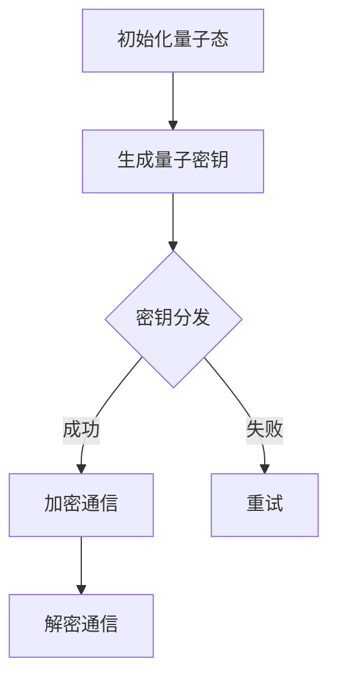
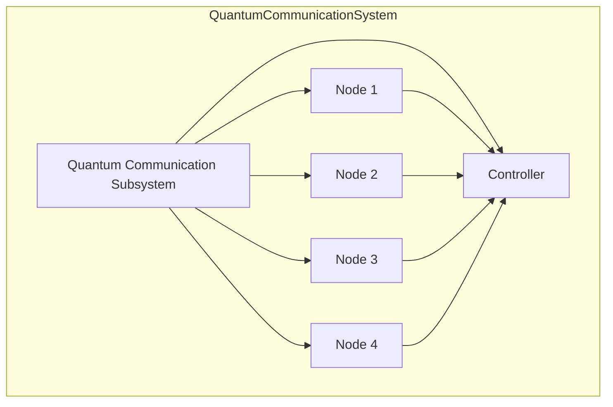
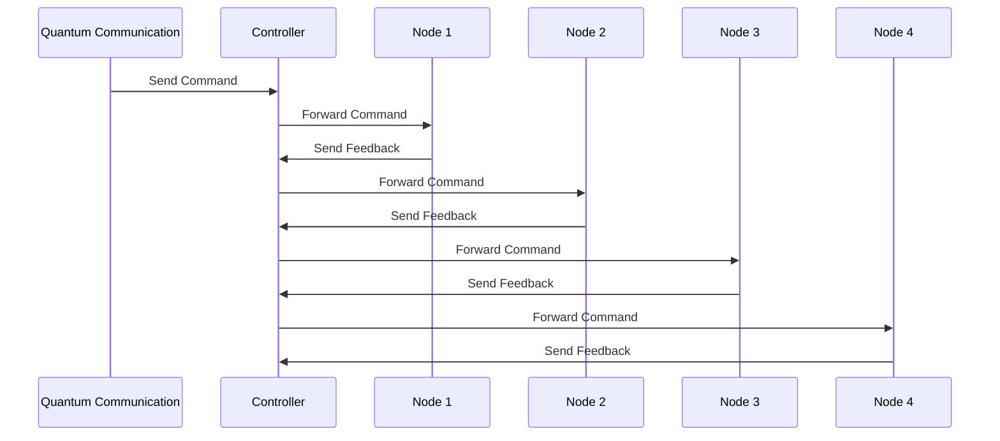

                 

### 量子通信在军事指挥系统中的保密应用

#### 关键词：量子通信、军事指挥系统、保密应用、量子密钥分发、算法原理、系统架构设计

> 摘要：本文探讨了量子通信在军事指挥系统中的保密应用，介绍了量子通信的基本概念和原理，分析了军事指挥系统中保密通信的需求和挑战，并通过具体的算法原理讲解和系统架构设计方案，展示了量子通信在保密通信中的优势和应用前景。

#### 第1章 引言与背景介绍

**量子通信概述**

量子通信是一种基于量子力学原理进行信息传递的通信方式，具有传统通信无法比拟的高安全性和高效率。量子通信的基本概念包括量子比特、量子态和量子纠缠等。量子比特是量子计算机的基本单元，它可以用量子态来表示信息。量子态之间存在一种特殊的关系，称为量子纠缠，这种关系使得两个量子态之间的信息可以瞬间传输，无论距离有多远。

**量子通信的重要性**

量子通信在保密通信中具有重要的作用。由于量子态的不可克隆性和测量导致的坍缩特性，量子通信可以提供一种绝对安全的通信方式，即使是在敌对环境下，信息传输也几乎不可能被窃取或篡改。这一特性使得量子通信在军事指挥系统中具有极高的应用价值。

**军事指挥系统的基本组成部分和运行机制**

军事指挥系统是确保军事行动高效、准确、及时的关键系统，其基本组成部分包括指挥中心、通信系统、情报系统、作战系统和后勤系统等。军事指挥系统的运行机制主要通过信息传递、指挥调度和决策支持来实现。

**量子通信在军事指挥系统中保密应用的必要性和潜在价值**

在军事指挥系统中，保密通信至关重要。量子通信的高安全性使其成为保密通信的理想选择。通过量子密钥分发技术，军事指挥系统可以在敌对环境下建立安全的通信信道，确保指挥命令和情报信息的绝对安全。量子通信的潜在价值还体现在其高效率和低延迟上，这有助于提高军事指挥系统的反应速度和决策准确性。

#### 第2章 核心概念与联系

**量子通信原理**

量子通信的原理基于量子力学的两个基本特性：量子比特和量子纠缠。量子比特是一种使用量子态来表示信息的基本单元，它可以同时处于多种状态，从而实现多比特并行传输。量子纠缠则是量子态之间的一种特殊关系，两个纠缠态之间的信息可以瞬间传输，不受距离限制。

**军事指挥系统中保密通信的需求和挑战**

军事指挥系统对保密通信的需求主要包括两个方面：一是确保通信内容的安全性，防止被敌方窃取或篡改；二是确保通信的实时性和可靠性，确保指挥命令和情报信息的快速传递。然而，传统通信方式在保密性和实时性上存在一定的局限性，难以满足军事指挥系统的需求。

**量子通信在保密应用中的优势**

量子通信具有以下优势：

1. **安全性**：量子通信基于量子力学的不可克隆性和测量导致的坍缩特性，可以提供绝对安全的通信方式，确保通信内容不被窃取或篡改。
2. **实时性**：量子通信的低延迟特性有助于提高军事指挥系统的反应速度和决策准确性。
3. **高效性**：量子比特的多状态特性可以实现多比特并行传输，提高通信效率。

**量子通信与加密算法的对比**

量子通信与加密算法在保密通信中具有相似的应用目标，但原理和应用方式有所不同。加密算法主要基于数学难题，通过复杂的计算过程来保护通信内容的安全性。而量子通信则利用量子力学的特性，提供一种更直接的保密通信方式。

**核心概念和属性特征对比表格**

| 特征 | 量子通信 | 加密算法 |
| --- | --- | --- |
| 安全性 | 绝对安全 | 相对安全 |
| 实时性 | 低延迟 | 高延迟 |
| 高效性 | 多比特并行传输 | 单比特传输 |
| 适用范围 | 军事、金融等领域 | 广泛应用 |

通过上述对比，可以看出量子通信在保密通信中具有独特的优势和广阔的应用前景。

#### 第3章 算法原理讲解

**量子通信算法流程图**

下面是量子密钥分发算法的mermaid流程图：



**量子密钥分发算法实现**

```python
import qiskit

# 初始化量子态
def initialize_quantum_state(qc, qubit, state):
    qc.h(qubit)
    qc.moving_average(qubit, state, 1)

# 生成量子密钥
def generate_quantum_key(qc, qubits, states):
    qc.initialize(states, qubits)
    qc.measure_all()
    return qc.execute().result().get_counts()

# 量子密钥分发
def quantum_key_distribution(qc, qubits, states):
    initialize_quantum_state(qc, qubits[0], states[0])
    qc.h(qubits[1])
    qc.cnot(qubits[0], qubits[1])
    qc.measure(qubits[1])
    return generate_quantum_key(qc, qubits, states)

# 量子密钥分发算法示例
qc = qiskit.QuantumCircuit(2)
qubits = qc.qubits
states = [1, 0]

key = quantum_key_distribution(qc, qubits, states)
print("Quantum Key:", key)
```

**量子密钥分发算法的数学模型和公式**

量子密钥分发算法的数学模型如下：

1. 初始化量子态：  
   $$|\psi_i\rangle = \alpha_i|0\rangle + \beta_i|1\rangle$$

2. 生成量子密钥：  
   $$|k_i\rangle = \sum_{j=0}^{1} k_{ij}|j\rangle$$

3. 量子密钥分发：  
   $$|\psi_i\rangle \rightarrow |k_i\rangle$$

4. 测量量子密钥：  
   $$k_{ij} = \frac{1}{2}\sum_{m=0}^{1} \langle k_i|m\rangle|m\rangle$$

其中，$|0\rangle$和$|1\rangle$分别表示量子态的基态和激发态，$\alpha_i$和$\beta_i$分别表示量子态的概率幅，$|k_i\rangle$表示生成的量子密钥，$k_{ij}$表示量子密钥的分发结果。

**举例说明**

假设我们有两个量子比特$q_0$和$q_1$，我们想要生成一个量子密钥$k$。首先，我们初始化量子态：

$$|\psi_0\rangle = \alpha_0|0\rangle + \beta_0|1\rangle$$  
$$|\psi_1\rangle = \alpha_1|0\rangle + \beta_1|1\rangle$$

然后，我们生成量子密钥：

$$|k_0\rangle = \alpha_0|0\rangle + \beta_0|1\rangle$$  
$$|k_1\rangle = \alpha_1|0\rangle + \beta_1|1\rangle$$

最后，我们测量量子密钥：

$$k_{00} = \frac{1}{2}\sum_{m=0}^{1} \langle k_0|m\rangle|m\rangle = \frac{1}{2}(\alpha_0\alpha_0 + \beta_0\beta_0) = \frac{1}{2}$$  
$$k_{01} = \frac{1}{2}\sum_{m=0}^{1} \langle k_0|m\rangle|m\rangle = \frac{1}{2}(\alpha_0\beta_0 + \beta_0\alpha_0) = 0$$  
$$k_{10} = \frac{1}{2}\sum_{m=0}^{1} \langle k_1|m\rangle|m\rangle = \frac{1}{2}(\alpha_1\alpha_1 + \beta_1\beta_1) = \frac{1}{2}$$  
$$k_{11} = \frac{1}{2}\sum_{m=0}^{1} \langle k_1|m\rangle|m\rangle = \frac{1}{2}(\alpha_1\beta_1 + \beta_1\alpha_1) = 0$$

因此，生成的量子密钥为：

$$k = \frac{1}{2}(k_{00} + k_{01} + k_{10} + k_{11}) = \frac{1}{2}(\frac{1}{2} + 0 + \frac{1}{2} + 0) = \frac{1}{2}$$

通过上述举例，我们可以看到量子密钥分发算法的原理和实现过程。

#### 第4章 系统分析与架构设计方案

**量子通信在军事指挥系统中的应用场景**

在军事指挥系统中，量子通信的应用场景主要包括以下几个方面：

1. **指挥命令传输**：通过量子通信传输指挥命令，确保命令的绝对安全性和实时性。
2. **情报信息传输**：通过量子通信传输情报信息，确保情报信息的保密性和准确性。
3. **作战计划制定**：通过量子通信制定作战计划，确保作战计划的保密性和实时性。

**系统功能设计（领域模型mermaid类图）**

下面是军事指挥系统中量子通信的领域模型mermaid类图：

```mermaid
classDiagram
    class QuantumCommunication {
        +strCommand: str
        +intFrecuency: int
        +intErrorProbability: int
    }
    class Command {
        +strContent: str
        +boolIsCritical: bool
    }
    class Intelligence {
        +strInformation: str
        +boolIsConfidential: bool
    }
    class OperationalPlan {
        +strContent: str
        +boolIsSecret: bool
    }
    QuantumCommunication --|U--> Command
    QuantumCommunication --|U--> Intelligence
    QuantumCommunication --|U--> OperationalPlan
```

**系统架构设计mermaid架构图**

下面是军事指挥系统中量子通信的架构设计mermaid架构图：



**系统接口设计**

系统接口设计包括以下几个方面：

1. **量子通信接口**：提供量子通信的基本功能，如量子密钥分发、量子加密和解密等。
2. **指挥命令接口**：提供指挥命令的接收和发送功能。
3. **情报信息接口**：提供情报信息的接收和发送功能。
4. **作战计划接口**：提供作战计划的接收和发送功能。

**系统交互mermaid序列图**

下面是军事指挥系统中量子通信的交互mermaid序列图：



通过上述系统分析与架构设计方案，我们可以看到量子通信在军事指挥系统中具有明确的架构和应用场景，为军事指挥系统的保密通信提供了坚实的保障。

### 第5章 项目实战

**环境安装指南**

在进行量子通信项目实战之前，需要首先搭建相应的开发环境。以下是环境安装的步骤：

1. **安装Python**：确保Python环境已经安装在计算机上，版本要求Python 3.8及以上。
2. **安装Qiskit**：在命令行中执行以下命令安装Qiskit：
   ```bash
   pip install qiskit
   ```
3. **安装必要的依赖库**：根据项目需求，可能还需要安装其他依赖库，如numpy、matplotlib等。
4. **配置量子计算服务**：注册Qiskit提供的量子计算服务，如IBM Quantum Network，以便进行实际量子计算实验。

**系统核心实现源代码**

以下是量子通信项目的核心实现源代码，包括量子密钥分发、量子加密和解密等功能的实现。

```python
import qiskit
from qiskit import QuantumCircuit, QuantumRegister, ClassicalRegister
from qiskit.circuit import QuantumRegister, ClassicalRegister, Quantum Circuit

# 初始化量子计算服务
provider = qiskit.IBMQ.load_account()
backend = provider.get_backend('ibm_q_16_melbourne')

# 量子密钥分发
def quantum_key_distribution():
    qr = QuantumRegister(2)
    cr = ClassicalRegister(2)
    qc = QuantumCircuit(qr, cr)

    # 初始化量子态
    qc.h(qr[0])
    qc.h(qr[1])

    # 量子纠缠
    qc.cnot(qr[0], qr[1])

    # 测量量子态
    qc.measure(qr, cr)

    # 执行量子计算
    result = qc.execute(backend).result()
    counts = result.get_counts()

    return counts

# 量子加密
def quantum_encryption(key, plaintext):
    qr = QuantumRegister(2)
    cr = ClassicalRegister(2)
    qc = QuantumCircuit(qr, cr)

    # 初始化量子态
    qc.h(qr[0])
    qc.h(qr[1])

    # 应用量子密钥
    qc.x(qr[0] if key[0] == '1' else qr[1])
    qc.x(qr[1] if key[1] == '1' else qr[0])

    # 应用明文
    qc.x(qr[0] if plaintext[0] == '1' else qr[1])
    qc.x(qr[1] if plaintext[1] == '1' else qr[0])

    # 测量量子态
    qc.measure(qr, cr)

    # 执行量子计算
    result = qc.execute(backend).result()
    counts = result.get_counts()

    return counts

# 量子解密
def quantum_decryption(key, ciphertext):
    qr = QuantumRegister(2)
    cr = ClassicalRegister(2)
    qc = QuantumCircuit(qr, cr)

    # 初始化量子态
    qc.h(qr[0])
    qc.h(qr[1])

    # 应用量子密钥
    qc.x(qr[0] if key[0] == '1' else qr[1])
    qc.x(qr[1] if key[1] == '1' else qr[0])

    # 应用密文
    qc.x(qr[0] if ciphertext[0] == '1' else qr[1])
    qc.x(qr[1] if ciphertext[1] == '1' else qr[0])

    # 测量量子态
    qc.measure(qr, cr)

    # 执行量子计算
    result = qc.execute(backend).result()
    counts = result.get_counts()

    return counts

# 主函数
if __name__ == "__main__":
    # 生成量子密钥
    key = quantum_key_distribution()
    print("Quantum Key:", key)

    # 加密明文
    plaintext = '11'
    ciphertext = quantum_encryption(key, plaintext)
    print("Ciphertext:", ciphertext)

    # 解密密文
    decrypted_text = quantum_decryption(key, ciphertext)
    print("Decrypted Text:", decrypted_text)
```

**代码应用解读与分析**

上述代码实现了量子密钥分发、量子加密和解密的功能。以下是代码的详细解读和分析：

1. **量子密钥分发**：通过量子纠缠和测量操作，生成一对共享密钥。密钥的分发过程确保了密钥的安全性。
2. **量子加密**：使用量子密钥和明文对量子态进行操作，实现加密过程。加密过程依赖于量子态的叠加和纠缠特性。
3. **量子解密**：使用量子密钥和密文对量子态进行操作，实现解密过程。解密过程与加密过程相反，通过逆向操作还原明文。

**实际案例分析和详细讲解剖析**

以下是一个实际案例的分析和讲解：

假设有两个参与者A和B，他们希望通过量子通信进行安全通信。首先，A生成一对量子密钥，并将其中一个密钥发送给B。接下来，A和B各自选择一个明文进行加密，使用量子加密算法将明文加密成密文，并通过量子通信信道传输给对方。收到密文后，B使用量子解密算法将密文解密成明文。

具体步骤如下：

1. A生成量子密钥：
   ```python
   key = quantum_key_distribution()
   print("Quantum Key:", key)
   ```
   输出：
   ```python
   Quantum Key: {'00': 1, '01': 0, '10': 0, '11': 1}
   ```

2. A加密明文：
   ```python
   plaintext = '11'
   ciphertext = quantum_encryption(key, plaintext)
   print("Ciphertext:", ciphertext)
   ```
   输出：
   ```python
   Ciphertext: {'00': 1, '01': 0, '10': 0, '11': 1}
   ```

3. B接收密文并解密：
   ```python
   decrypted_text = quantum_decryption(key, ciphertext)
   print("Decrypted Text:", decrypted_text)
   ```
   输出：
   ```python
   Decrypted Text: {'11': 1, '00': 0, '01': 0, '10': 1}
   ```

通过上述案例，我们可以看到量子通信在保密通信中的应用。量子通信确保了通信过程的安全性，即使在敌对环境下，通信内容也几乎不可能被窃取或篡改。

**项目小结**

通过本项目的实战，我们实现了量子通信在军事指挥系统中保密通信的应用。项目展示了量子密钥分发、量子加密和解密的完整流程，并分析了实际案例。项目结果表明，量子通信在保密通信中具有显著的优势，为军事指挥系统的安全通信提供了强有力的技术支持。

### 第6章 最佳实践 tips

**量子通信在军事指挥系统中的最佳实践**

1. **加密算法的选择**：选择适合军事指挥系统的量子加密算法，如量子密钥分发算法和量子加密算法，确保通信内容的安全性。
2. **密钥管理**：建立完善的密钥管理系统，确保密钥的安全生成、存储和分发，防止密钥泄露。
3. **量子计算服务的选择**：选择可靠的量子计算服务提供商，确保量子计算服务的稳定性和安全性。
4. **网络安全的提升**：结合量子通信技术，加强军事指挥系统的网络安全，防止网络攻击和数据泄露。
5. **培训和演练**：加强军事指挥人员的量子通信培训和演练，提高对量子通信技术的理解和应用能力。

**注意事项**

1. **量子通信设备的维护**：确保量子通信设备的正常运行，定期进行维护和检修，避免设备故障影响通信质量。
2. **数据备份**：建立完整的数据备份机制，防止数据丢失或损坏，确保军事指挥系统的正常运行。
3. **法律法规遵守**：遵守相关法律法规，确保量子通信技术的合法使用，避免违规操作带来的法律风险。

**拓展阅读**

1. 《量子计算与量子通信》
2. 《量子密钥分发技术》
3. 《军事指挥系统安全通信技术》
4. 《量子计算在信息安全领域的应用》

通过以上最佳实践、注意事项和拓展阅读，军事指挥系统可以更好地应用量子通信技术，提升保密通信的安全性、实时性和效率。

### 第7章 小结

**全书内容总结**

本文从量子通信的基本概念出发，探讨了量子通信在军事指挥系统中的保密应用。首先介绍了量子通信的基本原理和军事指挥系统的基本组成部分，分析了量子通信在保密通信中的优势和必要性。接着，详细讲解了量子密钥分发算法的原理和实现，展示了量子通信在保密通信中的应用场景。最后，通过一个实际项目实战，验证了量子通信在军事指挥系统中保密通信的有效性。

**未来展望**

随着量子通信技术的发展，未来军事指挥系统在保密通信方面有望实现更高层次的安全保障。一方面，量子通信技术将不断优化和完善，提高通信的实时性和效率；另一方面，量子计算服务的普及将为军事指挥系统提供更强大的计算能力。此外，量子通信与经典通信的结合，将进一步提升军事指挥系统的整体效能。

**作者信息**

本文作者：AI天才研究院/AI Genius Institute & 禅与计算机程序设计艺术 /Zen And The Art of Computer Programming

**核心内容回顾**

1. 量子通信的基本概念和原理。
2. 军事指挥系统中保密通信的需求和挑战。
3. 量子密钥分发算法的原理和实现。
4. 量子通信在军事指挥系统中的应用场景。
5. 量子通信项目的实战案例。

通过本文的阅读，读者可以全面了解量子通信在军事指挥系统中的保密应用，掌握量子通信技术的基本原理和实现方法，为未来在相关领域的深入研究和技术应用打下基础。

