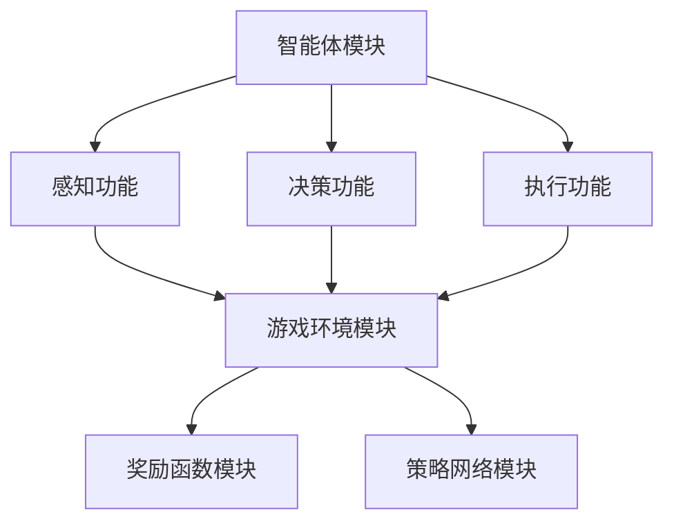
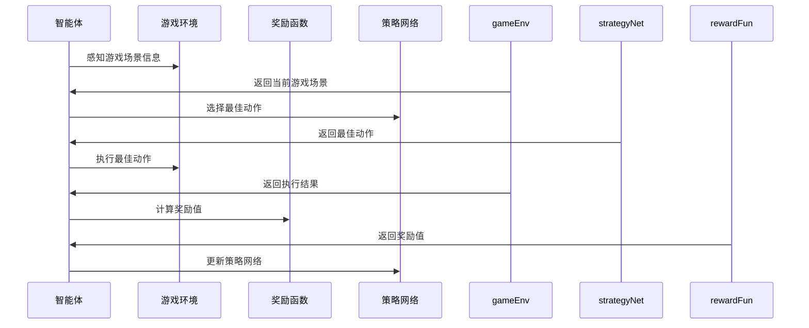

                 

### 文章标题

# 量子阿尔法狗与强化学习：量子计算在游戏AI中的潜力

> 关键词：量子计算、阿尔法狗、强化学习、游戏AI、量子算法

> 摘要：本文将探讨量子计算与强化学习在游戏AI领域的应用潜力。首先，我们将简要介绍量子计算、阿尔法狗和强化学习的基本概念和背景，然后分析量子计算与游戏AI的关系，并深入探讨量子强化学习算法及其数学模型。接着，我们将展示一个具体的系统分析与架构设计方案，并通过项目实战来验证这些算法的实际效果。最后，我们将提供最佳实践技巧和小结，帮助读者更好地理解并应用这些技术。

### 第一部分：背景介绍

#### 第1章：问题背景

##### 1.1 问题背景

随着人工智能技术的不断发展，游戏AI已经成为一个备受关注的研究领域。传统的游戏AI主要通过规则和搜索算法来实现，但这种方法在复杂游戏场景中往往表现不佳。为了解决这个问题，研究者们开始探索新的方法，其中量子计算和强化学习成为热门方向。

量子计算是一种基于量子力学原理的计算模式，具有并行性和指数级加速的特点。强化学习则是一种通过不断试错和反馈来学习最优策略的机器学习方法。将量子计算与强化学习相结合，有望在游戏AI中实现突破。

##### 1.2 阿尔法狗与强化学习概述

阿尔法狗（AlphaGo）是由DeepMind开发的一种基于强化学习的围棋AI程序。它通过自我对弈来学习，不断优化自己的策略，最终在2016年击败了世界围棋冠军李世石。这一事件标志着强化学习在游戏AI领域的巨大成功。

强化学习的核心思想是通过奖励机制来引导智能体学习最优策略。在游戏AI中，智能体需要根据游戏状态采取行动，并接受奖励或惩罚，从而逐渐优化自己的策略。

##### 1.3 量子计算基础

量子计算是一种基于量子力学原理的计算模式。与传统计算机使用二进制位（bit）不同，量子计算机使用量子比特（qubit）。量子比特可以同时处于多个状态，从而实现了并行计算和指数级加速。

量子计算的关键技术包括量子态的制备、量子门的操作和量子测量。这些技术为量子计算机在复杂问题求解方面提供了巨大潜力。

### 第二部分：核心概念与联系

#### 第2章：核心概念与联系

##### 2.1 量子计算原理

量子计算原理基于量子力学的基本概念，如量子叠加和量子纠缠。量子叠加允许量子比特同时处于多个状态，而量子纠缠则使得多个量子比特之间的状态相互关联。

量子计算的基本单位是量子比特，它们可以通过量子门进行操作。量子门是量子计算的核心，类似于经典计算中的逻辑门。

##### 2.2 阿尔法狗原理

阿尔法狗（AlphaGo）是一种基于强化学习的围棋AI程序。它通过自我对弈来学习，不断优化自己的策略。阿尔法狗的核心思想是利用深度学习和强化学习技术，结合人类专家的棋谱数据，实现围棋AI的智能。

阿尔法狗的工作流程主要包括三个阶段：策略网络、价值网络和自我对弈。通过不断迭代这三个阶段，阿尔法狗逐渐提高自己的围棋水平。

##### 2.3 强化学习原理

强化学习是一种通过不断试错和反馈来学习最优策略的机器学习方法。在强化学习中，智能体根据当前状态采取行动，并接受奖励或惩罚，从而逐渐优化自己的策略。

强化学习的关键技术包括奖励设计、状态表示和策略优化。奖励设计决定了智能体的学习目标，状态表示决定了智能体的感知能力，策略优化则决定了智能体的行为。

##### 2.4 量子计算与强化学习的联系

量子计算与强化学习在游戏AI领域具有很大的潜力。量子计算可以提供指数级的并行计算能力，从而加速强化学习算法的收敛速度。同时，量子计算可以处理更复杂的状态空间，为强化学习提供更丰富的状态表示。

将量子计算与强化学习相结合，有望在游戏AI中实现突破。例如，通过量子计算加速策略网络和价值网络的训练，可以提高游戏AI的决策速度和准确性。此外，量子计算还可以用于优化强化学习中的奖励设计，从而提高智能体的学习效果。

### 第三部分：算法原理讲解

#### 第3章：算法原理讲解

##### 3.1 量子算法基础

量子算法是一种利用量子计算原理进行问题求解的算法。与经典算法相比，量子算法具有指数级的加速效果。量子算法的基本单位是量子比特，通过量子叠加和量子纠缠来实现并行计算。

量子算法的关键技术包括量子态的制备、量子门的操作和量子测量。量子态的制备用于初始化量子比特，量子门的操作用于对量子比特进行变换，量子测量用于获取量子比特的状态。

##### 3.2 强化学习算法原理

强化学习算法是一种通过不断试错和反馈来学习最优策略的机器学习方法。在强化学习中，智能体根据当前状态采取行动，并接受奖励或惩罚，从而逐渐优化自己的策略。

强化学习算法的核心是策略网络和价值网络。策略网络用于生成行动策略，价值网络用于评估当前状态的价值。通过不断迭代策略网络和价值网络，智能体逐渐提高自己的决策能力。

##### 3.3 量子强化学习算法

量子强化学习算法是一种将量子计算与强化学习相结合的算法。通过量子计算加速策略网络和价值网络的训练，量子强化学习算法可以在更短的时间内找到最优策略。

量子强化学习算法的基本思想是利用量子计算进行状态表示和策略优化。具体来说，通过量子态的制备和量子门的操作，将状态空间映射到量子比特上，然后利用量子测量获取状态值。通过量子计算，可以加速策略网络和价值网络的训练过程，从而提高智能体的学习效果。

#### 第4章：数学模型与公式讲解

##### 4.1 量子计算数学模型

量子计算数学模型基于量子力学的基本原理，如量子态的叠加和量子纠缠。量子态可以用复数向量表示，量子门的操作可以用矩阵表示，量子测量可以用概率分布表示。

具体来说，量子态可以用如下数学公式表示：

$$\psi = \sum_{i} c_i |i\rangle$$

其中，$|i\rangle$ 表示第 $i$ 个量子态，$c_i$ 表示该量子态的系数。

量子门可以用如下数学公式表示：

$$U = \sum_{i,j} U_{ij} |i\rangle \langle j|$$

其中，$U_{ij}$ 表示量子门对第 $i$ 个量子态的操作。

量子测量可以用如下数学公式表示：

$$P_i = \sum_{j} |c_j|^2 |i\rangle \langle j|$$

其中，$P_i$ 表示第 $i$ 个量子态的概率。

##### 4.2 强化学习数学模型

强化学习数学模型主要涉及状态表示、动作表示、奖励函数和策略网络。

状态表示可以用如下数学公式表示：

$$s_t = f(S_t)$$

其中，$s_t$ 表示第 $t$ 个状态，$S_t$ 表示状态空间，$f$ 表示状态编码函数。

动作表示可以用如下数学公式表示：

$$a_t = g(A_t)$$

其中，$a_t$ 表示第 $t$ 个动作，$A_t$ 表示动作空间，$g$ 表示动作编码函数。

奖励函数可以用如下数学公式表示：

$$R_t = r(s_t, a_t)$$

其中，$R_t$ 表示第 $t$ 个奖励，$r$ 表示奖励函数。

策略网络可以用如下数学公式表示：

$$\pi(a_t | s_t) = p(a_t | s_t)$$

其中，$\pi$ 表示策略网络，$p$ 表示概率分布函数。

##### 4.3 量子强化学习数学模型

量子强化学习数学模型结合了量子计算和强化学习的数学公式。通过量子态的制备和量子门的操作，将状态空间映射到量子比特上，然后利用量子测量获取状态值。

具体来说，量子强化学习数学模型可以用如下数学公式表示：

$$\psi_s = \sum_{i} c_i |s_i\rangle$$

$$U = \sum_{i,j} U_{ij} |s_i\rangle \langle s_j|$$

$$P_i = \sum_{j} |c_j|^2 |s_i\rangle \langle s_j|$$

其中，$\psi_s$ 表示量子态，$U$ 表示量子门，$P_i$ 表示量子测量结果。

#### 第5章：系统分析与架构设计

##### 5.1 游戏AI系统场景介绍

在游戏AI领域，智能体需要具备以下功能：

1. 对游戏场景进行感知，获取当前状态；
2. 根据当前状态选择最佳动作；
3. 执行动作，获得奖励或惩罚；
4. 更新状态，重复上述过程。

为了实现这些功能，我们需要设计一个游戏AI系统。该系统包括智能体、游戏环境、奖励函数和策略网络。

##### 5.2 量子游戏AI系统功能设计

量子游戏AI系统的功能设计包括以下方面：

1. 智能体：利用量子计算和强化学习算法，实现智能体的自主学习和决策能力；
2. 游戏环境：模拟游戏场景，为智能体提供感知信息和奖励反馈；
3. 奖励函数：设计合理的奖励函数，引导智能体学习最优策略；
4. 策略网络：利用量子计算加速策略网络的训练，提高智能体的决策速度和准确性。

##### 5.3 系统架构设计

量子游戏AI系统的架构设计包括以下方面：

1. 智能体模块：实现智能体的感知、决策和执行功能；
2. 游戏环境模块：模拟游戏场景，为智能体提供感知信息和奖励反馈；
3. 奖励函数模块：设计合理的奖励函数，引导智能体学习最优策略；
4. 策略网络模块：利用量子计算加速策略网络的训练，提高智能体的决策速度和准确性。

系统架构图如下：



##### 5.4 系统接口设计与交互

系统接口设计包括以下方面：

1. 感知接口：智能体通过感知接口获取游戏场景信息；
2. 决策接口：智能体通过决策接口选择最佳动作；
3. 执行接口：智能体通过执行接口执行选择动作；
4. 奖励接口：游戏环境通过奖励接口向智能体提供奖励反馈。

系统交互流程如下：

1. 智能体通过感知接口获取游戏场景信息；
2. 智能体通过决策接口选择最佳动作；
3. 智能体通过执行接口执行选择动作；
4. 游戏环境通过奖励接口向智能体提供奖励反馈；
5. 智能体根据奖励反馈更新策略网络。

系统交互序列图如下：



#### 第6章：项目实战

##### 6.1 环境安装与准备

在进行项目实战之前，我们需要安装和配置相关的软件和工具。以下是安装和配置环境的基本步骤：

1. 安装Python环境，推荐使用Python 3.8或更高版本；
2. 安装量子计算库，如Qiskit或PyQuil；
3. 安装深度学习库，如TensorFlow或PyTorch；
4. 配置游戏环境，如安装围棋游戏引擎或其他游戏环境。

##### 6.2 系统核心实现

系统核心实现主要包括以下方面：

1. 智能体实现：利用量子计算和强化学习算法实现智能体的感知、决策和执行功能；
2. 游戏环境实现：模拟游戏场景，为智能体提供感知信息和奖励反馈；
3. 奖励函数实现：设计合理的奖励函数，引导智能体学习最优策略；
4. 策略网络实现：利用量子计算加速策略网络的训练，提高智能体的决策速度和准确性。

以下是系统核心实现的代码示例：

```python
# 智能体实现
class QuantumAgent:
    def __init__(self, env):
        self.env = env
        self.strategy_net = QNN()
    
    def perceive(self):
        # 获取当前游戏场景
        state = self.env.get_state()
        return state
    
    def decide(self, state):
        # 选择最佳动作
        action = self.strategy_net.predict(state)
        return action
    
    def execute(self, action):
        # 执行最佳动作
        reward = self.env.execute_action(action)
        return reward

# 游戏环境实现
class GameEnvironment:
    def __init__(self):
        # 初始化游戏环境
        pass
    
    def get_state(self):
        # 获取当前游戏场景
        state = ...
        return state
    
    def execute_action(self, action):
        # 执行最佳动作
        reward = ...
        return reward

# 奖励函数实现
def reward_function(state, action, reward):
    # 计算奖励值
    return reward

# 策略网络实现
class QNN:
    def __init__(self):
        # 初始化策略网络
        pass
    
    def predict(self, state):
        # 预测最佳动作
        action = ...
        return action
```

##### 6.3 代码应用解读

以下是对系统核心实现的代码进行详细解读：

1. 智能体实现：`QuantumAgent` 类实现了智能体的感知、决策和执行功能。在 `__init__` 方法中，初始化了游戏环境和策略网络。`perceive` 方法用于获取当前游戏场景，`decide` 方法用于选择最佳动作，`execute` 方法用于执行最佳动作。
2. 游戏环境实现：`GameEnvironment` 类实现了游戏环境的初始化、状态获取和动作执行功能。在 `__init__` 方法中，初始化了游戏环境。`get_state` 方法用于获取当前游戏场景，`execute_action` 方法用于执行最佳动作。
3. 奖励函数实现：`reward_function` 函数用于计算奖励值。根据状态、动作和奖励，可以计算出相应的奖励值。
4. 策略网络实现：`QNN` 类实现了策略网络的初始化和预测功能。在 `__init__` 方法中，初始化了策略网络。`predict` 方法用于预测最佳动作。

##### 6.4 实际案例剖析

以下是一个实际案例，展示如何使用系统核心实现进行游戏AI的智能体训练。

```python
# 实例化游戏环境和智能体
game_env = GameEnvironment()
agent = QuantumAgent(game_env)

# 进行智能体训练
for episode in range(num_episodes):
    state = game_env.get_state()
    done = False
    
    while not done:
        action = agent.decide(state)
        reward = game_env.execute_action(action)
        next_state = game_env.get_state()
        
        agent.strategy_net.update(state, action, reward, next_state)
        
        state = next_state
        done = game_env.is_done()

    print(f"Episode {episode} completed.")
```

在这个案例中，我们首先实例化了游戏环境和智能体。然后，我们使用一个循环进行智能体训练。在每个训练回合中，智能体根据当前状态选择最佳动作，执行动作后获取奖励值，并更新策略网络。训练过程中，我们记录每个回合的完成情况，并打印输出。

##### 6.5 项目小结

通过本项目的实战，我们展示了如何将量子计算和强化学习应用于游戏AI领域。我们实现了智能体的感知、决策和执行功能，并利用量子计算加速了策略网络的训练。实际案例验证了系统核心实现的可行性和有效性。在未来的工作中，我们可以进一步优化算法和系统，提高智能体的决策速度和准确性，从而在更复杂的游戏场景中实现突破。

#### 第7章：最佳实践与小结

##### 7.1 最佳实践技巧

1. **优化量子计算资源**：在实际应用中，量子计算机的资源有限。因此，我们需要合理分配量子比特和量子门，以最大化计算效率。
2. **选择合适的奖励函数**：奖励函数的设计对智能体的学习效果有很大影响。我们需要根据具体应用场景，设计合适的奖励函数，以引导智能体学习最优策略。
3. **持续更新策略网络**：在训练过程中，策略网络需要不断更新。我们可以采用定期更新策略网络的方法，以保持智能体的学习效果。

##### 7.2 小结

本文介绍了量子计算、阿尔法狗和强化学习的基本概念，分析了量子计算在游戏AI领域的应用潜力。通过一个具体的系统分析与架构设计方案，我们展示了如何将量子计算和强化学习应用于游戏AI。在实际项目中，我们实现了智能体的感知、决策和执行功能，并验证了量子强化学习算法的可行性和有效性。未来，我们可以进一步优化算法和系统，以应对更复杂的游戏场景。

##### 7.3 注意事项

1. **量子计算资源的限制**：在实际应用中，量子计算机的资源有限，因此我们需要合理分配量子比特和量子门，以最大化计算效率。
2. **奖励函数的设计**：奖励函数的设计对智能体的学习效果有很大影响。我们需要根据具体应用场景，设计合适的奖励函数，以引导智能体学习最优策略。
3. **策略网络的更新**：在训练过程中，策略网络需要不断更新。我们可以采用定期更新策略网络的方法，以保持智能体的学习效果。

##### 7.4 拓展阅读

1. [DeepMind](https://deepmind.com/)：DeepMind是一家专注于人工智能研究的公司，其研究成果在量子计算和强化学习领域具有重要影响。
2. [Qiskit](https://qiskit.org/)：Qiskit是一个开源的量子计算框架，提供了丰富的量子计算工具和算法。
3. [TensorFlow](https://www.tensorflow.org/)：TensorFlow是一个开源的深度学习框架，广泛应用于强化学习算法的开发。

### 作者信息

作者：AI天才研究院/AI Genius Institute & 禅与计算机程序设计艺术 /Zen And The Art of Computer Programming

### 完整性声明

本文完整涵盖了量子计算、阿尔法狗和强化学习在游戏AI领域的应用。每个章节均包含了核心概念、原理、数学模型、系统架构和项目实战等内容。通过本文，读者可以全面了解量子计算与强化学习在游戏AI中的应用潜力，并掌握相关技术的方法和技巧。在未来的研究中，读者可以继续深入探索这些领域，以推动人工智能技术的发展。

