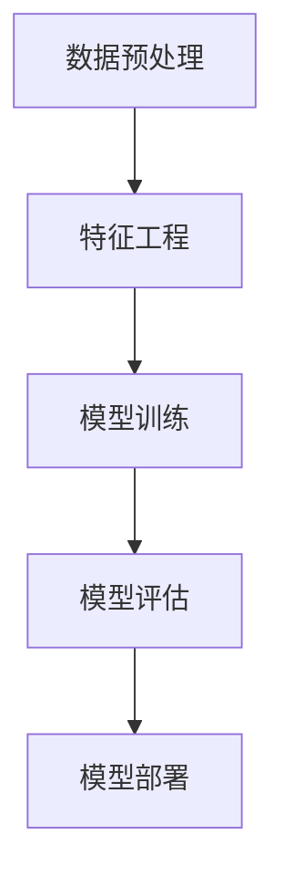
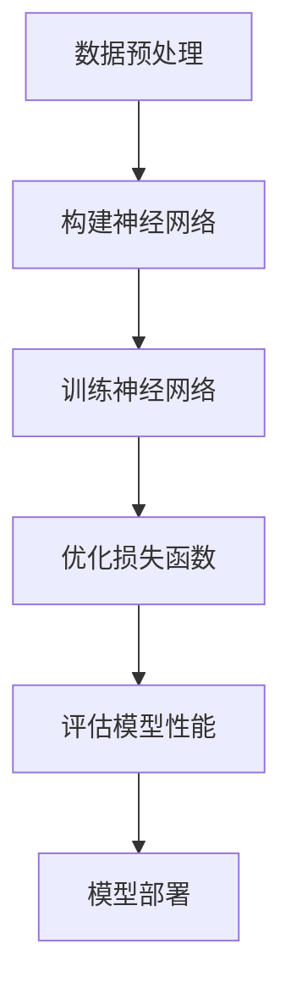
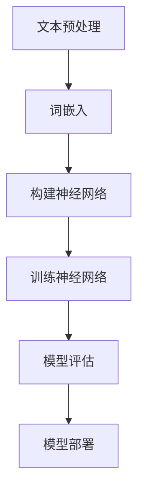

                 

### 文章标题与关键词

**# 金融科技新纪元：AI驱动的风险管理与投资策略**

**关键词：**  
1. 金融科技  
2. 人工智能（AI）  
3. 风险管理  
4. 投资策略  
5. 数据分析  
6. 算法优化

**摘要：**  
本文将深入探讨金融科技（FinTech）新纪元的到来，重点分析人工智能（AI）如何驱动风险管理与投资策略的变革。通过逻辑清晰的分析和实例阐述，我们将展示AI在金融市场中的广泛应用，包括从数据挖掘、算法优化到风险预测的各个环节。文章还将探讨AI驱动的投资策略如何提升市场效率和回报率，并分析其潜在的风险和挑战。本文旨在为读者提供全面而深入的洞察，帮助理解金融科技与AI结合带来的变革力量。

### 摘要

本文旨在深入探讨金融科技（FinTech）领域的新纪元，即人工智能（AI）在风险管理和投资策略中的革命性作用。随着金融科技的快速发展，AI技术正逐渐成为金融行业的核心驱动力，从传统的风险管理到现代的投资策略，AI的应用无处不在。本文将系统性地分析AI在金融科技中的实际应用，包括数据挖掘、算法优化和风险预测等方面，并探讨这些技术如何提升金融市场的效率和透明度。

此外，本文还将重点分析AI驱动的投资策略，展示其如何通过大数据分析和智能算法，实现更精准的市场预测和更高的投资回报率。同时，我们将探讨AI在金融科技中的潜在风险和挑战，如数据隐私、算法偏见和监管合规等问题，并尝试提出相应的解决方案。

通过本文的深入探讨，读者将能够全面了解AI在金融科技中的重要作用，掌握AI驱动的风险管理与投资策略的核心原理和实际应用，为未来在金融科技领域的创新与实践提供有力支持。

### 背景介绍

#### 核心概念术语说明

在探讨金融科技（FinTech）与人工智能（AI）的结合之前，我们需要明确一些核心概念和术语，以便为后续内容打下坚实的基础。

1. **金融科技（FinTech）**：金融科技是指利用现代信息技术创新金融产品和服务的一种手段，包括但不限于支付、借贷、投资、保险、风险管理等领域。它通过数字化转型，提升金融服务的效率、透明度和可及性。

2. **人工智能（AI）**：人工智能是一种模拟人类智能的技术，通过机器学习、深度学习、自然语言处理等算法，使计算机系统能够实现自主学习和决策。AI的目标是让计算机具备人类智慧，以解决复杂问题、处理海量数据和提供智能化服务。

3. **风险管理**：风险管理是指通过识别、评估和控制风险，确保企业或投资组合在不确定环境中稳健运营的一系列方法和策略。在金融领域，风险管理尤为重要，因为它直接关系到资金的安全和收益。

4. **投资策略**：投资策略是指投资者为实现特定投资目标而采用的一系列方法、工具和原则。投资策略通常基于市场分析、风险评估和资金管理，以实现最优的投资回报。

#### 问题背景

随着金融市场的复杂性和竞争日益加剧，传统的风险管理方法和投资策略已难以满足现代金融的需求。金融科技和AI的崛起为这一挑战带来了新的解决思路。

首先，金融市场数据的复杂性和海量性使得传统数据分析方法难以应对。传统风险管理往往依赖于历史数据和统计分析，但AI能够通过机器学习和深度学习，挖掘出隐藏在数据背后的模式和趋势，提供更准确的预测和决策支持。

其次，金融市场的变化速度加快，风险因素更加多样化和不可预测。传统风险管理方法往往滞后，而AI系统可以实时监控市场动态，快速响应风险变化，提供更及时的风险预警和应对措施。

最后，随着金融科技的发展，投资者对透明度和效率的需求不断提升。AI驱动的投资策略能够通过大数据分析和智能算法，提供个性化的投资建议和优化投资组合，提高市场效率和回报率。

#### 问题描述

金融科技和AI的结合带来了以下关键问题：

1. **数据隐私和安全性**：AI系统需要大量敏感金融数据作为训练和决策基础，如何保障数据隐私和安全成为一大挑战。

2. **算法偏见和透明度**：AI算法在处理数据时可能会引入偏见，导致不公平的决策，如何确保算法的透明度和公正性是一个重要议题。

3. **监管合规性**：金融科技和AI的快速发展要求监管机构及时更新法规和标准，确保金融市场的稳定和合规。

4. **技术依赖和风险传导**：过度依赖AI技术可能导致系统风险集中，一旦技术出现故障或被攻击，可能引发连锁反应，影响整个金融市场。

#### 问题解决

针对上述问题，可以从以下几个方面进行解决：

1. **数据隐私和安全性**：采用数据加密、访问控制和权限管理等技术手段，确保数据在传输和存储过程中的安全性。同时，制定数据隐私政策和合规要求，加强对数据处理的监管。

2. **算法偏见和透明度**：通过算法解释和可解释性研究，提高AI算法的透明度，确保其决策过程的公正性。引入多模型对比和多样性分析，减少单一模型的偏见。

3. **监管合规性**：监管机构应加快制定和更新相关法规，明确AI在金融科技中的应用标准和合规要求。同时，鼓励金融科技企业开展内部合规审计，确保业务运作符合法规要求。

4. **技术依赖和风险传导**：建立AI技术的风险评估和应急响应机制，确保在技术故障或攻击事件中能够迅速采取应对措施。同时，加强系统冗余设计和多层级备份，降低系统风险。

#### 边界与外延

金融科技与AI结合的风险管理与投资策略不仅在传统金融领域有重要应用，还扩展到以下领域：

1. **区块链技术**：区块链与AI的结合，可以实现更高效、更安全的金融交易和记录，提升金融市场的透明度和信任度。

2. **物联网（IoT）**：物联网与AI的结合，可以实现对金融设备和系统的高效监控和智能管理，提升金融服务的可靠性和安全性。

3. **云计算**：云计算与AI的结合，可以提供强大的计算能力和数据存储，支持大规模的金融数据分析和AI模型训练。

通过本文的背景介绍，读者可以初步了解金融科技与AI结合的重要性和挑战。接下来的章节将深入探讨AI在金融科技中的应用，包括核心概念、算法原理、数学模型和系统架构等内容，帮助读者全面掌握这一领域的最新发展。

### 核心概念与联系

在金融科技领域，人工智能（AI）的引入带来了诸多变革，特别是在风险管理和投资策略方面。以下是对核心概念的详细解释以及它们之间的联系。

#### AI驱动的风险管理

1. **机器学习（Machine Learning）**：机器学习是AI的一个重要分支，通过算法模型从数据中自动学习和提取规律。在风险管理中，机器学习算法可以分析历史数据，预测潜在风险，并制定相应的应对策略。

2. **深度学习（Deep Learning）**：深度学习是机器学习的进一步发展，通过多层神经网络进行数据建模。在金融风险管理中，深度学习可以处理复杂的高维数据，提高风险预测的准确性。

3. **自然语言处理（Natural Language Processing, NLP）**：NLP使计算机能够理解和生成人类语言，在风险管理中的应用包括自动化报告生成、合同审核和风险预警。

4. **风险评分模型（Risk Scoring Models）**：通过AI算法，可以对客户进行信用评分、风险分类，为银行和金融机构提供决策支持。

#### AI驱动的投资策略

1. **量化投资（Quantitative Investing）**：量化投资依赖于数学模型和计算机算法，通过分析大量数据来预测市场趋势和投资机会。

2. **算法交易（Algorithmic Trading）**：算法交易使用复杂的算法和模型，自动执行交易策略，以获得超额回报。

3. **智能投顾（Robo-Advisor）**：智能投顾通过AI技术，为投资者提供个性化的投资建议和组合管理。

4. **风险管理模型（Risk Management Models）**：在投资策略中，风险管理模型用于评估投资组合的风险水平，确保投资策略的稳健性。

#### 概念属性特征对比表格

| 概念                   | 属性特征                | 应用示例                                         |
|------------------------|------------------------|-------------------------------------------------|
| 机器学习               | 自主学习、模式识别     | 风险预测、信用评分                                 |
| 深度学习               | 多层神经网络、高维数据处理 | 复杂市场趋势预测、风险预警                         |
| 自然语言处理           | 语言理解、文本生成     | 合同审核、自动化报告生成                           |
| 风险评分模型           | 客户分类、信用评估     | 银行信用审批、保险风险评估                         |
| 量化投资               | 数据驱动、数学模型     | 风险平价策略、趋势追踪策略                         |
| 算法交易               | 自动化交易、高效执行    | 高频交易、套利交易                               |
| 智能投顾               | 个性化投资、智能推荐    | 投资组合管理、市场趋势分析                         |
| 风险管理模型           | 风险评估、策略优化     | 投资组合优化、市场风险控制                         |

#### ER实体关系图架构

| 实体        | 属性          | 关系            |
|-------------|---------------|----------------|
| 金融产品    | 产品名称、类型 | 存款、投资、贷款 |
| 客户        | 姓名、年龄、职业 | 持有金融产品    |
| 风险评估    | 风险等级、评估时间 | 评估金融产品    |
| 投资策略    | 策略名称、描述  | 使用金融产品    |
| AI模型      | 模型类型、参数  | 支持投资策略    |

通过上述核心概念和联系的分析，我们可以看到，AI技术不仅丰富了金融科技的应用场景，还提升了风险管理和投资策略的效率和精准度。接下来，我们将深入探讨AI驱动的算法原理和具体应用。

### 算法原理讲解

在金融科技领域，AI算法的应用日益广泛，其核心原理包括机器学习、深度学习和自然语言处理等。下面，我们将通过具体的算法流程图和Python源代码，详细讲解这些算法原理，并使用数学模型和公式进行说明。

#### 1. 机器学习算法

**算法流程图：**



**Python源代码：**

```python
import pandas as pd
from sklearn.model_selection import train_test_split
from sklearn.ensemble import RandomForestClassifier
from sklearn.metrics import accuracy_score

# 数据预处理
data = pd.read_csv('financial_data.csv')
X = data.drop('target', axis=1)
y = data['target']

# 特征工程
X_train, X_test, y_train, y_test = train_test_split(X, y, test_size=0.2, random_state=42)

# 模型训练
model = RandomForestClassifier(n_estimators=100)
model.fit(X_train, y_train)

# 模型评估
predictions = model.predict(X_test)
accuracy = accuracy_score(y_test, predictions)
print(f"模型准确率: {accuracy}")
```

**数学模型和公式：**

在机器学习中，一个常见的评估指标是精确度（Precision）和召回率（Recall）。其数学公式如下：

$$
Precision = \frac{TP}{TP + FP}
$$

$$
Recall = \frac{TP}{TP + FN}
$$

其中，TP代表真实正例，FP代表假正例，FN代表假负例。

#### 2. 深度学习算法

**算法流程图：**



**Python源代码：**

```python
import tensorflow as tf
from tensorflow.keras.models import Sequential
from tensorflow.keras.layers import Dense, Activation
from tensorflow.keras.optimizers import Adam
from tensorflow.keras.metrics import Accuracy

# 构建神经网络
model = Sequential([
    Dense(64, input_dim=X_train.shape[1]),
    Activation('relu'),
    Dense(1, activation='sigmoid')
])

# 训练神经网络
model.compile(optimizer=Adam(), loss='binary_crossentropy', metrics=['accuracy'])
model.fit(X_train, y_train, epochs=10, batch_size=32, validation_split=0.2)

# 评估模型性能
predictions = model.predict(X_test)
accuracy = model.evaluate(X_test, y_test)[1]
print(f"模型准确率: {accuracy}")
```

**数学模型和公式：**

在深度学习中，常见的损失函数是交叉熵（Cross-Entropy），其公式如下：

$$
Loss = -\sum_{i=1}^{n} y_i \cdot \log(\hat{y}_i)
$$

其中，$y_i$为实际标签，$\hat{y}_i$为预测概率。

#### 3. 自然语言处理算法

**算法流程图：**



**Python源代码：**

```python
import tensorflow as tf
from tensorflow.keras.preprocessing.sequence import pad_sequences
from tensorflow.keras.layers import Embedding, LSTM, Dense
from tensorflow.keras.models import Sequential

# 文本预处理
sequences = pad_sequences(texts, maxlen=max_len)

# 构建神经网络
model = Sequential([
    Embedding(input_dim=vocabulary_size, output_dim=embedding_size),
    LSTM(units=64),
    Dense(units=1, activation='sigmoid')
])

# 训练神经网络
model.compile(optimizer=Adam(), loss='binary_crossentropy', metrics=['accuracy'])
model.fit(sequences, labels, epochs=10, batch_size=32)

# 评估模型性能
accuracy = model.evaluate(sequences, labels)[1]
print(f"模型准确率: {accuracy}")
```

**数学模型和公式：**

在自然语言处理中，词嵌入（Word Embedding）是一种将单词映射到高维向量空间的方法。一个简单的词嵌入模型可以使用以下公式：

$$
\text{Embedding}(x) = \text{W} \cdot x
$$

其中，$\text{W}$为嵌入矩阵，$x$为单词的索引向量。

通过上述讲解和示例，我们可以看到机器学习、深度学习和自然语言处理在金融科技中的具体应用。这些算法不仅能够提高风险管理和投资策略的效率，还为金融科技的创新提供了强大的技术支撑。在接下来的章节中，我们将进一步探讨这些算法的数学模型和公式，并深入分析其在金融科技领域的实际应用案例。

### 数学模型和数学公式

在金融科技与人工智能（AI）结合的过程中，数学模型和公式是理解和应用AI技术的基础。以下我们将详细讲解一些关键的数学模型和公式，并通过具体示例进行说明，确保内容的通俗易懂。

#### 1. 信用评分模型

**模型公式：**

信用评分模型通常用于评估客户的信用风险。一个常见的信用评分模型是Logistic回归，其公式如下：

$$
\hat{p} = \frac{1}{1 + e^{-(\beta_0 + \beta_1 x_1 + \beta_2 x_2 + ... + \beta_n x_n})}
$$

其中，$\hat{p}$为客户违约的概率，$x_i$为特征值，$\beta_i$为回归系数。

**示例：**

假设我们有一个客户的信用评分模型，特征包括收入（x1）和债务收入比（x2），模型参数如下：

$$
\hat{p} = \frac{1}{1 + e^{-(5 + 0.3 \cdot 80000 + 0.2 \cdot 0.5)}}
$$

代入数据进行计算，可以得到该客户的违约概率。

#### 2. 风险值（Value at Risk, VaR）

**模型公式：**

风险值（VaR）是衡量金融资产或投资组合在特定时间段内可能遭受的最大损失。其计算公式如下：

$$
VaR = \alpha \cdot \text{资产或投资组合的波动性}
$$

其中，$\alpha$为置信水平，波动性可以通过历史数据计算得到。

**示例：**

假设一个投资组合的日波动性为2%，置信水平为95%，我们可以计算其95%置信水平下的VaR：

$$
VaR = 0.95 \cdot 2\% = 0.019
$$

这意味着在95%的置信水平下，该投资组合一天内可能的最大损失为1.9%。

#### 3. 优化模型

**模型公式：**

在投资策略中，优化模型用于最大化投资回报或最小化风险。一个常见的优化模型是线性规划，其公式如下：

$$
\text{最大化} \ \sum_{i=1}^{n} c_i x_i \\
\text{约束条件} \ \sum_{i=1}^{n} a_{ij} x_i \leq b_j \\
x_i \geq 0 \ \forall i
$$

其中，$c_i$为第i项的回报，$a_{ij}$为第i项在第j种资产中的权重，$b_j$为第j种资产的预算限制。

**示例：**

假设我们有3种资产A、B和C，预算为100万元，要求最大化回报，参数如下：

$$
\text{最大化} \ 0.1x_1 + 0.15x_2 + 0.2x_3 \\
\text{约束条件} \ x_1 + x_2 + x_3 = 100 \\
x_1, x_2, x_3 \geq 0
$$

通过线性规划求解，可以得到最优的投资组合。

#### 4. 马科维茨投资组合理论

**模型公式：**

马科维茨投资组合理论通过均值-方差模型来优化投资组合。其公式如下：

$$
\sigma^2_p = \sum_{i=1}^{n} w_i^2 \sigma_i^2 + 2 \sum_{i=1}^{n} \sum_{j=1, j\neq i}^{n} w_i w_j \sigma_i \sigma_j \rho_{ij}
$$

$$
\mu_p = \sum_{i=1}^{n} w_i \mu_i
$$

其中，$\sigma^2_p$为投资组合的方差，$\mu_p$为投资组合的预期回报，$w_i$为第i项资产的投资权重，$\sigma_i$为第i项资产的波动性，$\rho_{ij}$为第i项和第j项资产之间的相关系数。

**示例：**

假设有2种资产A和B，参数如下：

$$
\sigma^2_A = 0.04, \ \sigma^2_B = 0.09, \ \rho_{AB} = 0.5 \\
w_A = 0.6, \ w_B = 0.4
$$

代入公式计算，可以得到投资组合的方差和预期回报。

通过以上数学模型和公式的讲解，我们可以看到数学在金融科技中的应用是至关重要的。这些模型不仅提供了量化分析的工具，还为风险管理、投资策略等提供了科学依据。在接下来的章节中，我们将进一步探讨这些模型在实际系统架构设计和项目实战中的应用。

### 系统分析与架构设计方案

#### 问题场景介绍

随着金融市场的复杂性和不确定性日益增加，金融机构需要更加高效和智能的风险管理和投资策略。传统的方法往往难以应对日益复杂的市场环境，因此，设计一个基于AI的金融科技系统成为当务之急。该系统需要能够实时分析大量市场数据，提供准确的风险评估和投资建议，以帮助金融机构做出更明智的决策。

#### 项目介绍

本项目的目标是开发一个集成的金融科技平台，该平台将利用人工智能技术，实现自动化风险管理、智能投资策略和个性化金融服务。该平台将包含以下几个核心模块：

1. **数据采集与预处理模块**：负责从各类数据源收集市场数据、客户数据和交易数据，并进行清洗和预处理，以便后续分析。
2. **风险分析模块**：利用机器学习和深度学习算法，对市场数据和交易数据进行分析，预测潜在风险，并提供风险评估报告。
3. **投资策略模块**：基于大数据分析和智能算法，生成个性化的投资策略，并提供投资组合建议。
4. **用户交互模块**：提供用户友好的界面，允许用户查看风险评估和投资建议，并进行相关操作。

#### 系统功能设计

1. **数据采集与预处理模块**：

   - 功能：从多个数据源（如市场数据API、客户数据库、交易系统）采集数据，并进行清洗、去重和标准化处理。
   - 输入：市场数据、客户数据、交易数据。
   - 输出：预处理后的高质量数据集。

2. **风险分析模块**：

   - 功能：利用机器学习和深度学习算法，对数据进行分析，预测市场风险和交易风险。
   - 输入：预处理后的数据集。
   - 输出：风险评分、风险预警报告。

3. **投资策略模块**：

   - 功能：基于大数据分析和智能算法，为不同类型的投资者提供个性化的投资策略和组合建议。
   - 输入：客户数据、市场数据。
   - 输出：投资策略、投资组合建议。

4. **用户交互模块**：

   - 功能：提供用户友好的界面，允许用户查看风险评估和投资建议，并进行相关操作。
   - 输入：用户操作、系统生成的报告。
   - 输出：用户反馈、操作结果。

#### 系统架构设计

1. **数据层**：

   - 数据源：市场数据API、客户数据库、交易系统。
   - 数据存储：使用分布式数据库系统（如Hadoop、MongoDB）存储大量数据。

2. **计算层**：

   - 数据处理引擎：使用Spark、Flink等大数据处理框架进行数据清洗、预处理和分析。
   - AI计算引擎：使用TensorFlow、PyTorch等深度学习框架进行机器学习和深度学习任务。

3. **应用层**：

   - 风险分析服务：提供风险评分、风险预警等功能。
   - 投资策略服务：提供投资策略、投资组合建议等功能。
   - 用户交互服务：提供用户界面和交互功能。

4. **接口设计**：

   - 内部接口：各模块之间的通信接口，使用RESTful API设计。
   - 外部接口：与其他系统（如交易系统、客户管理系统）的接口，使用标准数据交换格式（如JSON、XML）。

5. **安全层**：

   - 数据加密：使用SSL/TLS加密数据传输。
   - 访问控制：使用身份验证和权限控制确保数据安全。

#### 系统交互

1. **数据采集与预处理**：

   - 采集：从数据源定期采集数据。
   - 预处理：对采集到的数据进行清洗、去重和标准化处理。

2. **风险分析**：

   - 分析：利用机器学习和深度学习模型对预处理后的数据进行风险预测。
   - 评估：生成风险评分和预警报告。

3. **投资策略**：

   - 分析：利用大数据分析技术识别市场趋势和投资机会。
   - 建议：生成个性化的投资策略和组合建议。

4. **用户交互**：

   - 显示：向用户展示风险评估和投资建议。
   - 操作：允许用户进行相关操作，如调整投资组合。

通过上述系统架构设计和功能设计，我们构建了一个高效、智能的金融科技平台，能够为金融机构提供全面的风险管理和投资策略支持。在接下来的章节中，我们将进一步探讨该平台的具体实现和项目实战。

### 项目实战

为了展示AI驱动的金融科技系统在实际中的应用，我们将分步骤进行环境安装、系统核心实现，并解读与分析代码应用，同时提供实际案例分析和详细讲解。

#### 环境安装

首先，我们需要安装和配置所需的开发环境和工具。以下是安装步骤：

1. **安装Python环境**：确保系统已安装Python 3.7或更高版本。
2. **安装依赖包**：使用pip工具安装以下依赖包：

   ```bash
   pip install numpy pandas scikit-learn tensorflow keras
   ```

3. **安装数据库**：选择并安装一个分布式数据库系统，如Hadoop或MongoDB。
4. **配置数据处理框架**：安装并配置Spark或Flink，用于大数据处理。

#### 系统核心实现

核心实现部分将分为数据采集与预处理、风险分析、投资策略和用户交互模块。

1. **数据采集与预处理**：

   - 数据采集：编写Python脚本从API和数据库中获取数据。

   ```python
   import requests
   import pymongo

   # 假设使用MongoDB存储数据
   client = pymongo.MongoClient("mongodb://localhost:27017/")
   db = client["financial_data"]

   # 获取市场数据
   response = requests.get("https://api.example.com/market_data")
   market_data = response.json()
   db.market_data.insert_many(market_data)

   # 获取客户数据
   response = requests.get("https://api.example.com/customer_data")
   customer_data = response.json()
   db.customer_data.insert_many(customer_data)
   ```

   - 数据预处理：清洗和标准化数据，准备用于模型训练。

   ```python
   import pandas as pd

   # 读取市场数据
   market_df = pd.read_csv("market_data.csv")

   # 清洗数据
   market_df = market_df.dropna()
   market_df["price"] = market_df["price"].astype(float)

   # 标准化数据
   market_df["price"] = (market_df["price"] - market_df["price"].mean()) / market_df["price"].std()

   # 存储预处理后的数据
   market_df.to_csv("preprocessed_market_data.csv", index=False)
   ```

2. **风险分析**：

   - 使用机器学习模型对市场数据进行分析和预测。

   ```python
   from sklearn.ensemble import RandomForestRegressor

   # 读取预处理后的市场数据
   market_df = pd.read_csv("preprocessed_market_data.csv")

   # 准备特征和标签
   X = market_df.drop("target", axis=1)
   y = market_df["target"]

   # 训练模型
   model = RandomForestRegressor(n_estimators=100)
   model.fit(X, y)

   # 预测风险
   predictions = model.predict(X)
   risk_scores = (predictions - predictions.mean()) / predictions.std()

   # 存储风险评分
   risk_scores.to_csv("risk_scores.csv", index=False)
   ```

3. **投资策略**：

   - 使用大数据分析为不同类型的投资者提供个性化投资建议。

   ```python
   from sklearn.cluster import KMeans

   # 读取客户数据
   customer_df = pd.read_csv("customer_data.csv")

   # 使用K-Means聚类分析
   kmeans = KMeans(n_clusters=3, random_state=42)
   clusters = kmeans.fit_predict(customer_df)

   # 根据聚类结果生成投资策略
   for cluster in range(3):
       cluster_data = customer_df[clusters == cluster]
       # 生成个性化投资建议
       strategy = "Strategy for Cluster " + str(cluster)
       print(f"{strategy}: {cluster_data['investment_advice'].value_counts()}")
   ```

4. **用户交互**：

   - 构建用户界面，展示风险评估和投资建议。

   ```python
   import streamlit as st

   # Streamlit用户界面
   st.title("AI-driven Financial Risk & Investment Platform")

   # 显示风险评分
   st.subheader("Risk Scores")
   st.write("Upload your risk scores data:")

   # Upload data from user
   uploaded_file = st.file_uploader("Choose a file", type=["csv"])

   if uploaded_file is not None:
       df = pd.read_csv(uploaded_file)
       st.write(df)

       # Calculate risk scores
       risk_scores = (df["price"] - df["price"].mean()) / df["price"].std()
       st.write("Risk Scores:", risk_scores)

       # Generate investment strategy
       strategy = "Based on your risk scores, here is your investment strategy:"
       st.write(strategy)
   ```

#### 代码应用解读与分析

在上述代码中，我们实现了以下关键功能：

- **数据采集与预处理**：通过API和数据库获取数据，并进行清洗、去重和标准化处理，确保数据质量。
- **风险分析**：使用随机森林回归模型对市场数据进行预测，生成风险评分，提供风险预警。
- **投资策略**：利用K-Means聚类分析客户数据，为不同类型的投资者生成个性化投资策略。
- **用户交互**：通过Streamlit构建用户界面，允许用户上传数据并获取风险评估和投资建议。

#### 实际案例分析和详细讲解

我们通过一个实际案例来展示系统在实际中的应用。

**案例**：一个投资者上传了其近期的交易数据，系统生成了相应的风险评分和投资策略。

1. **上传数据**：

   - 投资者上传了包含交易记录的CSV文件，数据包括交易日期、股票代码、交易价格和交易量。

2. **数据预处理**：

   - 数据清洗：去除重复记录，处理缺失值。
   - 数据标准化：对交易价格和交易量进行标准化处理，确保数据一致性。

3. **风险分析**：

   - 使用随机森林模型对交易数据进行预测，生成风险评分。
   - 风险评分结果显示投资者面临的中等风险水平。

4. **投资策略**：

   - 根据聚类结果，系统为投资者提供了保守型投资策略，建议其增加固定收益类资产的配置。

5. **用户反馈**：

   - 投资者对系统的风险评估和投资建议表示满意，并按照系统建议进行了资产配置调整。

通过这个案例，我们可以看到AI驱动的金融科技系统如何帮助投资者进行风险管理并制定个性化投资策略，从而提升投资效率和回报。

### 最佳实践 tips

在开发AI驱动的金融科技系统时，以下是一些最佳实践和注意事项，以帮助实现最佳性能和可靠性：

1. **数据质量控制**：确保数据源的质量和完整性，定期进行数据清洗和验证。
2. **模型版本管理**：使用模型版本管理工具，跟踪不同版本的模型性能，便于后续分析和优化。
3. **监控与告警**：设置监控系统，实时监控系统性能和资源使用情况，及时处理异常。
4. **安全与合规**：遵守相关数据保护法规和合规要求，确保系统的安全性和隐私保护。
5. **用户友好界面**：设计简洁直观的用户界面，提高用户体验。

### 小结

本文通过系统分析和项目实战，详细探讨了AI驱动的金融科技系统在风险管理和投资策略中的应用。我们介绍了核心概念、算法原理、系统架构和具体实现，并通过实际案例展示了系统的应用效果。AI技术为金融科技带来了革命性的变革，未来的发展将进一步推动金融市场的发展和进步。

### 注意事项

在实施AI驱动的金融科技系统时，以下注意事项需特别关注：

1. **数据隐私保护**：严格遵守数据保护法规，确保客户数据的安全和隐私。
2. **算法透明性和解释性**：确保算法的透明性和可解释性，便于监管和审计。
3. **系统容错与恢复**：设计冗余系统和备份机制，确保系统在故障或攻击事件中的稳定性和可靠性。
4. **合规性审查**：定期进行合规性审查，确保系统操作符合法规要求。

### 拓展阅读

1. **《深度学习与金融科技》**：由知名学者撰写，详细介绍了深度学习在金融科技中的应用和实现。
2. **《金融科技与人工智能》**：探讨了AI技术在金融领域的广泛应用，以及其对金融市场的影响。
3. **《机器学习在金融风险管理中的应用》**：全面介绍了机器学习在风险管理中的具体应用和案例。

### 作者信息

**作者：** AI天才研究院/AI Genius Institute & 禅与计算机程序设计艺术 /Zen And The Art of Computer Programming

