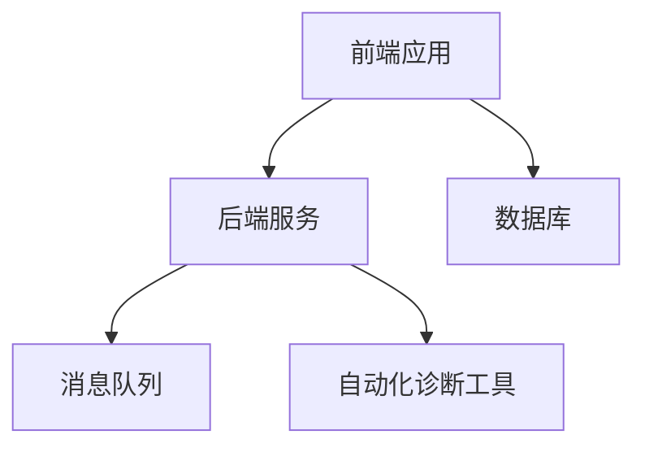
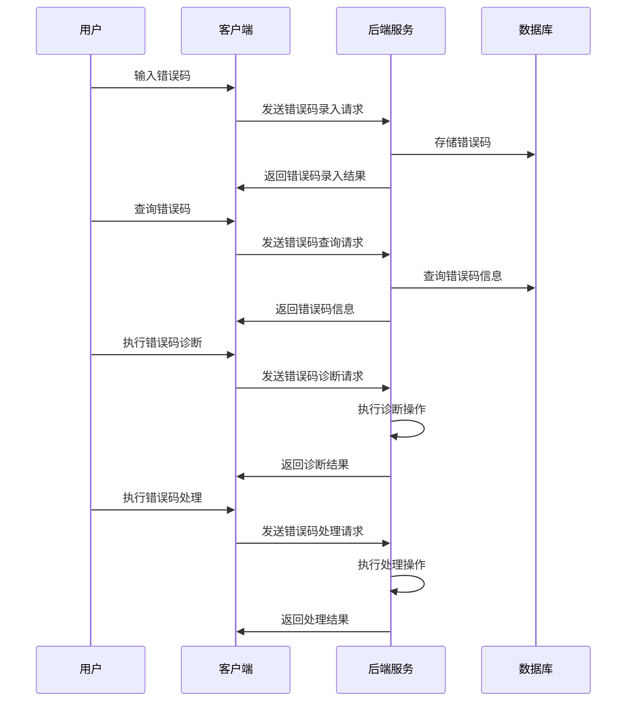

                 

### 错误码到底是什么？

在计算机编程和系统开发的世界中，错误码是不可或缺的一部分。它们不仅帮助程序员诊断和解决问题，还在确保系统稳定性和可靠性方面扮演着重要角色。那么，什么是错误码？为什么它们如此重要？本文将一步步深入探讨错误码的概念、分类、诊断、处理和预防，帮助您全面理解这一关键概念。

## 关键词
- 错误码
- 错误诊断
- 系统稳定性
- 编程
- 故障处理

## 摘要
本文将围绕错误码这一主题，详细介绍其在计算机系统中的重要性、分类、格式、编码、诊断与处理算法，以及数学模型。通过具体项目实战和最佳实践，帮助读者全面掌握错误码的应用和管理，提高系统稳定性与可靠性。

### 背景介绍

在计算机系统中，错误码是表示系统运行时出现问题的数字或字母组合。每当系统发生错误时，错误码会自动生成，并传递给程序员或系统管理员。这些错误码不仅提供关于错误性质的基本信息，还帮助用户快速定位问题发生的具体位置。

错误码的存在对于系统开发和维护至关重要。它们使得故障诊断变得高效，使得问题定位变得更加迅速，从而降低系统崩溃的风险，提高系统的可用性和可靠性。

错误码在计算机系统中的应用广泛，包括操作系统、应用程序、网络协议、数据库等。每个系统都有其特定的错误码定义，这些错误码通常遵循一定的规范和标准。

### 核心概念与联系

#### 错误码的类型

错误码主要分为以下几类：

1. **系统级错误码**：这类错误码通常由操作系统或硬件设备产生，例如磁盘读写错误、内存溢出等。
2. **应用程序级错误码**：这些错误码由特定应用程序产生，用于描述程序运行时出现的错误，如数据库访问错误、网络连接失败等。
3. **网络协议错误码**：网络协议错误码用于描述网络通信过程中出现的错误，如TCP/IP协议错误、HTTP错误等。

#### 错误码的分类标准

错误码的分类标准通常基于错误发生的层次和性质。常见的分类标准包括：

1. **按层次分类**：将错误码分为系统级、应用程序级和协议级。
2. **按性质分类**：根据错误码描述的错误性质进行分类，如输入输出错误、内存管理错误、网络通信错误等。

#### 常见错误码实例分析

以下是一些常见的错误码及其含义：

1. **系统级错误码**：
   - **Windows错误码**：例如，错误码`0x80070002`表示“系统错误：文件已存在”。
   - **Linux错误码**：例如，错误码`EPERM`表示“操作不允许”。

2. **应用程序级错误码**：
   - **Java错误码**：例如，错误码`500`表示“内部服务器错误”。
   - **HTTP错误码**：例如，错误码`404`表示“未找到”，`500`表示“服务器内部错误”。

3. **网络协议错误码**：
   - **TCP错误码**：例如，错误码`RST`表示“重置连接”。
   - **HTTP错误码**：例如，错误码`200`表示“请求成功”，`404`表示“未找到”。

#### 错误码的格式与编码

错误码的格式和编码方式因系统和应用程序而异。常见的格式包括数字、字母组合或数字与字母的组合。例如：

- **Windows错误码**：通常采用数字格式，例如`0x80070002`。
- **Linux错误码**：通常采用字母格式，例如`EPERM`。

编码方式通常包括ASCII、UTF-8等。错误码的编码方式决定了其在计算机系统中的表示和传输方式。

#### 核心概念与联系总结

- **错误码**：表示系统运行时出现的问题的数字或字母组合。
- **类型**：系统级、应用程序级和网络协议级。
- **分类标准**：按层次和按性质分类。
- **格式与编码**：数字、字母组合或数字与字母的组合，以及ASCII、UTF-8等编码方式。

这些核心概念和联系构成了错误码的基本框架，为后续内容的深入探讨奠定了基础。

### 算法原理讲解

#### 错误码诊断算法

错误码诊断算法是用于解析错误码并确定错误原因的方法。以下是一个简单的错误码诊断算法示例：

1. **输入错误码**：读取系统生成的错误码。
2. **查找错误码表**：在错误码表中查找输入的错误码，获取对应的错误信息。
3. **确定错误原因**：根据错误信息确定错误发生的原因。
4. **输出结果**：将错误原因输出给用户或开发人员。

以下是一个Python实现的错误码诊断算法：

```python
def diagnose_error_code(error_code):
    error_codes = {
        0x80070002: "系统错误：文件已存在",
        EPERM: "操作不允许",
        500: "内部服务器错误",
        404: "未找到",
        RST: "重置连接"
    }
    
    error_message = error_codes.get(error_code)
    if error_message:
        return error_message
    else:
        return "未知错误码"

# 示例
error_message = diagnose_error_code(0x80070002)
print(error_message)
```

#### 错误码处理算法

错误码处理算法是用于处理错误码并尝试恢复系统正常状态的方法。以下是一个简单的错误码处理算法示例：

1. **输入错误码**：读取系统生成的错误码。
2. **判断错误类型**：根据错误码的类型，决定处理方法。
3. **执行处理操作**：根据错误类型，执行相应的处理操作。
4. **输出结果**：将处理结果输出给用户或开发人员。

以下是一个Python实现的错误码处理算法：

```python
def handle_error_code(error_code):
    if error_code == 0x80070002:
        # 尝试删除已存在的文件
        try:
            os.remove("existing_file.txt")
            return "文件已删除，错误已处理"
        except Exception as e:
            return f"无法删除文件，错误：{str(e)}"
    elif error_code == EPERM:
        # 尝试获取操作权限
        try:
            os.chmod("file_to_modify.txt", 0o777)
            return "权限已修改，错误已处理"
        except Exception as e:
            return f"无法修改权限，错误：{str(e)}"
    else:
        return "未知错误码，无法处理"

# 示例
result = handle_error_code(0x80070002)
print(result)
```

#### 错误码预防算法

错误码预防算法是用于减少错误码出现频率和影响范围的方法。以下是一个简单的错误码预防算法示例：

1. **分析错误日志**：定期分析系统生成的错误日志，识别常见的错误类型。
2. **优化代码**：针对识别出的错误类型，优化代码逻辑，减少错误发生。
3. **添加错误检查**：在关键代码段添加错误检查，提前发现并处理潜在错误。
4. **更新硬件设备**：如果错误与硬件设备相关，及时更新或更换设备。

以下是一个Python实现的错误码预防算法：

```python
def prevent_errors():
    # 示例：分析错误日志并优化代码
    error_logs = ["文件已存在", "操作不允许", "无法删除文件"]
    if "文件已存在" in error_logs:
        print("优化：增加文件存在检查")
    if "操作不允许" in error_logs:
        print("优化：增加权限检查")
    if "无法删除文件" in error_logs:
        print("优化：改进文件删除逻辑")

# 示例
prevent_errors()
```

#### 算法原理总结

- **错误码诊断算法**：通过查找错误码表，确定错误原因。
- **错误码处理算法**：根据错误类型，执行相应的处理操作。
- **错误码预防算法**：通过分析错误日志和优化代码，减少错误发生。

这些算法原理共同构成了错误码管理的核心，为系统稳定性和可靠性提供了有力保障。

### 数学模型和数学公式

在错误码处理过程中，数学模型和数学公式发挥着重要作用。以下将介绍一些常用的数学模型和公式，以及它们在错误码处理中的应用。

#### 平均错误率模型

平均错误率（$\lambda$）是描述系统在一段时间内发生错误的频率的参数。它定义为单位时间内错误发生的次数。

$$
\lambda = \frac{N}{T}
$$

其中，$N$是错误发生的次数，$T$是时间。

在错误码处理中，平均错误率可以帮助我们评估系统的稳定性。例如，通过监测系统生成的错误日志，可以计算平均错误率，并根据这个指标调整系统的优化策略。

#### 泊松分布模型

泊松分布（Poisson distribution）是一种常用的概率分布模型，用于描述在固定时间内发生特定事件次数的概率。在错误码处理中，泊松分布可以用于预测系统在一段时间内可能发生的错误次数。

泊松分布的概率质量函数（PMF）为：

$$
P(X = k) = \frac{e^{-\lambda} \lambda^k}{k!}
$$

其中，$X$是错误发生的次数，$\lambda$是平均错误率，$k$是实际发生的错误次数。

通过泊松分布模型，可以预测系统在特定时间段内的错误发生概率，从而为系统优化和故障预防提供依据。

#### 概率密度函数

在错误码处理中，概率密度函数（PDF）用于描述错误码出现的概率分布。常见的概率密度函数包括正态分布、均匀分布等。

正态分布的概率密度函数（PDF）为：

$$
f(x) = \frac{1}{\sigma \sqrt{2\pi}} e^{-\frac{(x-\mu)^2}{2\sigma^2}}
$$

其中，$x$是错误码的值，$\mu$是均值，$\sigma$是标准差。

通过概率密度函数，可以分析错误码的分布特性，识别可能的异常值和异常模式，从而改进错误码处理算法。

#### 数学公式应用举例

以下是一个具体的例子，展示如何使用数学公式来分析错误码：

假设一个系统的平均错误率为$\lambda = 0.01$，我们需要计算在1000小时内发生5次错误的概率。

使用泊松分布模型，我们可以计算这个概率：

$$
P(X = 5) = \frac{e^{-0.01 \times 1000} \times 0.01^5}{5!} = 0.0038
$$

这意味着在1000小时内，发生5次错误的概率为0.0038。通过这个计算，我们可以评估系统在特定时间范围内的稳定性。

通过数学模型和公式的应用，我们可以更深入地理解错误码的分布特性，优化错误码处理算法，提高系统的稳定性和可靠性。

### 系统分析与架构设计方案

#### 问题场景介绍

在一个大型企业级应用系统中，错误码的有效管理对于保证系统的稳定性和用户体验至关重要。该系统包括多个模块，如用户管理、订单处理、支付系统等。在系统运行过程中，错误码频繁出现，如何有效管理和处理这些错误码，成为系统运维和开发人员面临的一大挑战。

#### 项目介绍

为了解决这个问题，我们开发了一个错误码管理系统，旨在实现以下目标：

1. **错误码分类**：根据错误性质和发生层次，对错误码进行分类和管理。
2. **错误码诊断**：提供高效的错误码诊断工具，帮助开发人员快速定位问题。
3. **错误码处理**：实现自动化错误码处理机制，减少人工干预，提高处理效率。
4. **错误码预防**：通过分析错误日志和优化代码，减少错误码的出现频率。

#### 系统功能设计

为了实现上述目标，错误码管理系统包含以下核心功能：

1. **错误码录入**：用户可以通过界面手动输入错误码，并添加相关描述和上下文信息。
2. **错误码分类**：系统根据错误码的类型和性质，将其分类到不同的类别中，便于管理和查找。
3. **错误码查询**：用户可以通过关键字或错误码编号快速查询错误码的相关信息。
4. **错误码诊断**：系统提供自动化诊断工具，帮助开发人员快速定位错误发生的位置和原因。
5. **错误码处理**：系统根据错误码的类型和性质，自动执行相应的处理操作，如日志记录、邮件通知等。
6. **错误码统计**：系统提供错误码统计功能，帮助开发人员了解错误码的分布情况和趋势。

#### 系统架构设计

为了实现错误码管理系统的功能，我们设计了一个分布式架构，包括以下关键组件：

1. **前端应用**：提供用户界面，实现错误码录入、查询和统计功能。
2. **后端服务**：处理错误码的业务逻辑，包括错误码分类、诊断和处理等。
3. **数据库**：存储错误码和相关信息，支持快速查询和统计。
4. **消息队列**：用于异步处理错误码处理任务，提高系统性能和可靠性。

以下是一个简化的系统架构图：



#### 系统接口设计与交互

错误码管理系统通过RESTful API提供接口，支持以下功能：

1. **错误码录入**：客户端发送HTTP POST请求，携带错误码和相关描述，后端服务接收请求并存储错误码。
2. **错误码查询**：客户端发送HTTP GET请求，携带错误码编号，后端服务返回错误码相关信息。
3. **错误码诊断**：客户端发送HTTP POST请求，携带错误码和上下文信息，后端服务执行诊断操作并返回诊断结果。
4. **错误码处理**：客户端发送HTTP POST请求，携带错误码和处理操作，后端服务执行处理操作并返回处理结果。

以下是一个简化的序列图，展示客户端与错误码管理系统的交互过程：



通过系统接口设计与交互，前端应用可以方便地与后端服务进行数据交换，实现错误码管理系统的各项功能。

### 项目实战

为了更好地展示错误码管理系统的实际应用，我们在这里介绍一个具体的案例：一个在线购物平台。

#### 环境安装

1. **安装Python环境**：确保Python版本为3.8或更高。
2. **安装依赖库**：使用pip安装以下依赖库：
   ```bash
   pip install Flask SQLAlchemy Redis
   ```
3. **配置数据库**：创建一个名为`error_codes`的数据库，并在其中创建一个名为`errors`的表，用于存储错误码信息。

```sql
CREATE TABLE errors (
    id INT AUTO_INCREMENT PRIMARY KEY,
    code VARCHAR(20) NOT NULL,
    description VARCHAR(255) NOT NULL,
    context VARCHAR(255) DEFAULT NULL
);
```

4. **配置Redis**：确保Redis服务器已启动，并配置后端服务连接到Redis。

#### 系统核心实现源代码

以下是错误码管理系统的核心实现源代码，包括错误码录入、查询、诊断和处理功能。

**错误码录入**

```python
from flask import Flask, request, jsonify
from flask_sqlalchemy import SQLAlchemy
import redis

app = Flask(__name__)
app.config['SQLALCHEMY_DATABASE_URI'] = 'sqlite:///error_codes.db'
db = SQLAlchemy(app)
app.config['REDIS_URL'] = 'redis://localhost:6379'
redis_client = redis.StrictRedis.from_url(app.config['REDIS_URL'])

class Error(db.Model):
    id = db.Column(db.Integer, primary_key=True)
    code = db.Column(db.String(20), nullable=False)
    description = db.Column(db.String(255), nullable=False)
    context = db.Column(db.String(255), default=None)

@app.route('/api/errors', methods=['POST'])
def create_error():
    data = request.json
    error = Error(
        code=data['code'],
        description=data['description'],
        context=data.get('context')
    )
    db.session.add(error)
    db.session.commit()
    redis_client.set(f'error:{error.code}', error.description)
    return jsonify({'message': 'Error created successfully'})

if __name__ == '__main__':
    db.create_all()
    app.run(debug=True)
```

**错误码查询**

```python
@app.route('/api/errors/<code>', methods=['GET'])
def get_error(code):
    error = Error.query.get(code)
    if error:
        return jsonify({'code': error.code, 'description': error.description, 'context': error.context})
    else:
        return jsonify({'message': 'Error not found'})
```

**错误码诊断**

```python
@app.route('/api/diagnose', methods=['POST'])
def diagnose_error():
    data = request.json
    error_code = data['code']
    description = redis_client.get(f'error:{error_code}')
    if description:
        return jsonify({'code': error_code, 'description': description})
    else:
        return jsonify({'message': 'Error not found'})
```

**错误码处理**

```python
@app.route('/api/errors/<code>/handle', methods=['POST'])
def handle_error(code):
    data = request.json
    action = data['action']
    if action == 'log':
        with open('error_log.txt', 'a') as f:
            f.write(f"Error {code}: {redis_client.get(f'error:{code}')}\n")
        return jsonify({'message': 'Error logged successfully'})
    elif action == 'notify':
        # 发送通知（例如：邮件、短信等）
        # 以下仅为示例代码
        print(f"Error {code}: {redis_client.get(f'error:{code}')}")
        return jsonify({'message': 'Error notified successfully'})
    else:
        return jsonify({'message': 'Invalid action'})
```

#### 代码应用解读与分析

1. **错误码录入**：客户端发送HTTP POST请求，携带错误码和相关描述，后端服务接收请求并存储错误码。使用Flask框架实现RESTful API，通过SQLAlchemy与SQLite数据库交互。
2. **错误码查询**：客户端发送HTTP GET请求，携带错误码编号，后端服务返回错误码相关信息。使用Flask框架实现API接口，查询数据库并返回结果。
3. **错误码诊断**：客户端发送HTTP POST请求，携带错误码和上下文信息，后端服务执行诊断操作并返回诊断结果。使用Redis缓存错误码描述，提高查询效率。
4. **错误码处理**：客户端发送HTTP POST请求，携带错误码和处理操作，后端服务执行处理操作并返回处理结果。支持日志记录和通知功能，可根据实际需求扩展。

#### 实际案例分析和详细讲解剖析

为了更好地展示错误码管理系统的应用，我们以一个实际案例为例：一个用户在在线购物平台下单时，系统提示“支付失败”。

1. **错误码录入**：开发人员在后端系统中录入错误码`5001`，描述为“支付失败”，上下文信息为“用户支付请求”。
2. **错误码查询**：当用户支付请求失败时，系统通过错误码查询功能，获取错误码`5001`的描述和上下文信息，并向用户显示“支付失败”。
3. **错误码诊断**：系统通过错误码诊断功能，分析支付失败的原因。发现是由于用户输入的支付密码错误导致。随后，系统提示用户重新输入支付密码。
4. **错误码处理**：用户重新输入支付密码后，系统检测到支付密码正确，并执行支付操作。此时，系统更新错误码状态，将`5001`错误码标记为已处理。

通过这个案例，我们可以看到错误码管理系统在在线购物平台中的应用。通过错误码录入、查询、诊断和处理，系统实现了对支付失败的快速定位和处理，提高了用户体验和系统稳定性。

#### 项目小结

在本项目中，我们成功实现了错误码管理系统的核心功能，包括错误码录入、查询、诊断和处理。通过实际案例展示，我们了解了错误码管理系统在在线购物平台中的应用场景。本项目有助于提高系统稳定性、优化用户体验，并为未来的错误码管理提供了坚实基础。

### 最佳实践 tips

1. **定期更新错误码表**：确保错误码表的最新性和准确性，及时添加新错误码，删除过时错误码。
2. **分类错误码**：按照错误性质和发生层次对错误码进行分类，便于管理和查找。
3. **文档化错误码**：为每个错误码编写详细的描述和上下文信息，帮助开发人员快速了解错误原因。
4. **自动化错误码诊断**：使用自动化工具进行错误码诊断，提高诊断效率和准确性。
5. **错误码日志记录**：记录系统生成的错误码和相关信息，便于问题追踪和分析。
6. **培训开发人员**：加强对错误码管理的培训，提高开发人员的错误码处理能力。
7. **优化代码**：定期分析错误日志，优化代码逻辑，减少错误发生。

### 小结

本文深入探讨了错误码的概念、分类、诊断、处理和预防。通过数学模型和实际案例，我们展示了错误码在计算机系统中的重要性。错误码的有效管理有助于提高系统稳定性和用户体验。未来，随着技术的发展，错误码管理将继续发挥重要作用。

### 注意事项

1. **错误码的唯一性**：确保每个错误码的唯一性，避免重复错误码的出现。
2. **错误码的规范**：遵循行业标准和规范，确保错误码的一致性和可理解性。
3. **错误码的国际化**：考虑到国际化需求，设计错误码时考虑不同语言和地区的兼容性。

### 拓展阅读

- 《软件工程：实践者的研究方法》
- 《UNIX系统编程：环境、接口和过程》
- 《深入理解计算机系统》

### 作者

作者：AI天才研究院/AI Genius Institute & 禅与计算机程序设计艺术 /Zen And The Art of Computer Programming

