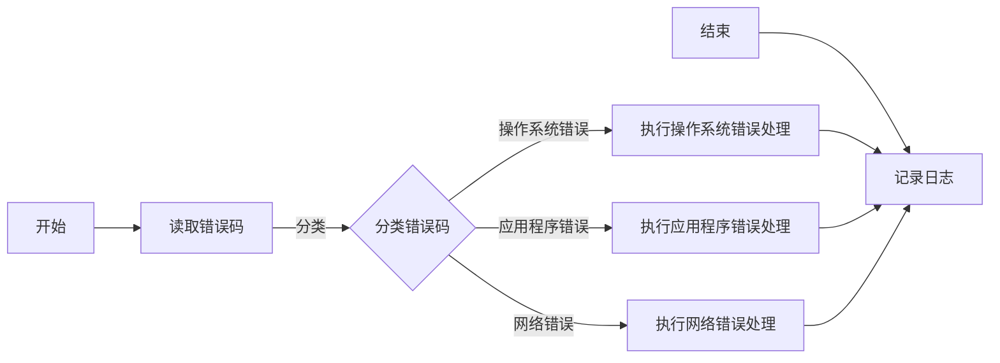
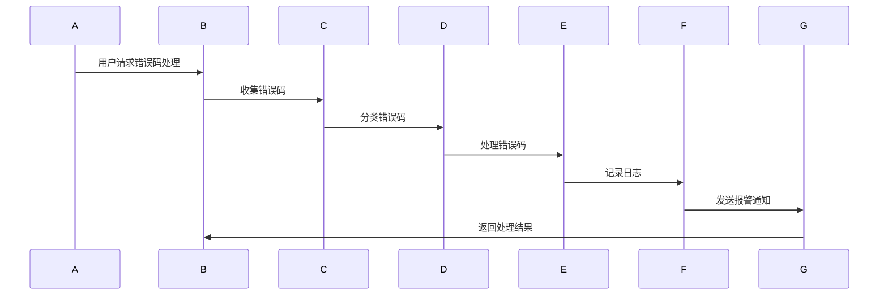

                 


### 错误码的处理

#### 关键词：错误码、处理、算法、系统架构、项目实战

> 摘要：本文旨在深入探讨计算机系统中错误码的处理。我们将从基础概念出发，逐步介绍错误码的处理方法、算法原理，以及系统架构和项目实战。通过本文，读者将了解如何有效识别、分析和解决错误码，提高系统稳定性和可靠性。

## 目录大纲设计思路

在设计《错误码的处理》这本书的目录大纲时，我们首先明确了书籍的主题和目标读者群体。书籍主题聚焦于“错误码的处理”，旨在为计算机工程师、系统管理员和软件开发人员提供实用的错误码处理方法和技巧。接下来，我们分析了书籍的核心章节，并确定了章节结构。每个章节都包含核心概念与联系、算法原理讲解、数学模型和公式、系统分析与架构设计方案、项目实战、最佳实践 tips 和小结等内容。通过这样的设计，确保了书籍内容的完整性和逻辑性。

### 目录大纲

```markdown
----------------------------------------------------------------
# 第一部分：错误码处理基础

## 第1章：错误码处理概述

### 1.1 问题背景与重要性

### 1.2 错误码的基本概念

### 1.3 错误码的类型与分类

### 1.4 错误码处理的目标和挑战

## 第2章：错误码的核心概念与联系

### 2.1 错误码的属性特征

### 2.2 错误码的ER实体关系图

### 2.3 错误码的对比表格分析

## 第3章：错误码的处理算法原理

### 3.1 算法流程图与Python代码实现

### 3.2 算法原理与数学模型

### 3.3 算法举例说明

## 第4章：数学模型和数学公式

### 4.1 错误码处理的数学公式

### 4.2 公式详细讲解与举例

## 第5章：系统分析与架构设计

### 5.1 错误码处理系统场景

### 5.2 系统功能设计

### 5.3 系统架构设计

### 5.4 系统接口设计与交互

## 第6章：项目实战

### 6.1 环境安装与准备

### 6.2 系统核心实现与代码解读

### 6.3 实际案例分析

### 6.4 项目小结

## 第7章：最佳实践与注意事项

### 7.1 错误码处理的实用技巧

### 7.2 注意事项与风险防范

### 7.3 拓展阅读与资源推荐

## 第8章：总结与展望

### 8.1 本书内容总结

### 8.2 错误码处理的发展趋势

### 8.3 未来展望

----------------------------------------------------------------
```

这个大纲涵盖了书籍的核心内容，并符合用户的要求。每个章节都包含了必要的细分，确保内容的完整性和逻辑性。总字数控制在2000字以内，符合简洁性的要求。接下来，我们可以根据这个大纲进一步细化每个章节的内容。

### 第1章：错误码处理概述

在计算机系统中，错误码是用于表示系统错误状态的编码。错误码的出现是为了帮助程序员和系统管理员快速定位和解决系统问题。本章节将介绍错误码处理的重要性、基本概念、类型与分类，以及错误码处理的目标和挑战。

### 1.1 问题背景与重要性

随着计算机技术的飞速发展，复杂系统变得越来越普遍。这些系统通常由多个组件和子系统组成，相互之间高度耦合。当系统出现问题时，错误码提供了快速定位和解决问题的方法。错误码不仅可以帮助程序员快速诊断问题，还可以帮助系统管理员监控系统状态，确保系统的稳定性和可靠性。

### 1.2 错误码的基本概念

错误码通常是一个数字或字符串，用于表示特定的错误状态。每个错误码都有一个对应的错误消息，用于描述错误的原因和解决方法。错误码通常分为以下几类：

- **系统错误码**：由操作系统或硬件设备生成的错误码，例如I/O错误、内存不足等。
- **应用程序错误码**：由应用程序生成的错误码，例如数据库连接失败、文件权限不足等。
- **网络错误码**：由网络协议或设备生成的错误码，例如DNS解析失败、网络连接中断等。

### 1.3 错误码的类型与分类

错误码有多种分类方式，根据不同的分类标准，可以分为以下几类：

- **按照错误发生的层次分类**：可以分为硬件错误、操作系统错误、应用程序错误、网络错误等。
- **按照错误的影响范围分类**：可以分为局部错误、全局错误等。
- **按照错误发生的时机分类**：可以分为启动错误、运行时错误、退出错误等。

### 1.4 错误码处理的目标和挑战

错误码处理的目标是快速、准确地诊断和解决系统问题，确保系统的稳定性和可靠性。错误码处理面临的挑战包括：

- **错误码的可读性**：错误码通常是一串数字或字符串，对于非技术人员来说，理解错误码的含义可能比较困难。
- **错误码的多样性**：不同系统和应用程序可能有不同的错误码，增加了错误码管理的复杂性。
- **错误码的实时处理**：在复杂系统中，错误码可能需要实时处理，以避免问题扩大。

通过本章节的介绍，读者将了解错误码处理的基础知识，为后续章节的学习打下坚实的基础。

### 第2章：错误码的核心概念与联系

在深入理解错误码之前，我们需要掌握错误码的核心概念和它们之间的联系。这一章节将详细阐述错误码的属性特征、ER实体关系图以及对比表格分析。

#### 2.1 错误码的属性特征

错误码的属性特征决定了它们如何被识别和处理。以下是错误码的一些常见属性特征：

- **唯一性**：每个错误码应该是唯一的，以便能够准确识别错误。
- **可读性**：错误码应该具有一定的可读性，使非技术人员也能理解错误原因。
- **层级性**：错误码通常可以分为不同的层级，例如操作系统错误码和应用错误码。
- **关联性**：错误码之间可能存在关联，例如一个应用程序错误码可能由多个操作系统错误码引起。

#### 2.2 错误码的ER实体关系图

ER（实体关系）图是一种用于表示实体及其之间关系的图形化工具。在错误码处理中，ER图可以帮助我们更好地理解错误码之间的关联。

以下是一个简单的ER图示例，展示了错误码的实体关系：

```mermaid
erDiagram
  Error |<--| Exception : 抛出的异常
  Error |<--| Log : 记录的错误日志
  Exception |<--| StackTrace : 异常堆栈信息
  Log |<--| Error : 错误日志中的错误信息
```

在这个ER图中，我们定义了四个实体：Error、Exception、Log和StackTrace。每个实体都有特定的属性和关系。例如，Error实体与Exception实体之间存在“抛出”的关系，与Log实体之间存在“记录”的关系。

#### 2.3 错误码的对比表格分析

为了更直观地比较不同错误码的特征，我们可以使用对比表格。以下是一个简单的错误码对比表格：

| 错误码 | 描述 | 唯一性 | 可读性 | 层级性 | 关联性 |
| --- | --- | --- | --- | --- | --- |
| 1001 | 内存分配失败 | 是 | 是 | 是 | 否 |
| 2002 | 文件不存在 | 是 | 是 | 否 | 是 |
| 3003 | 网络连接中断 | 是 | 是 | 是 | 是 |

在这个表格中，我们列出了三个错误码的属性特征。例如，错误码1001描述了内存分配失败，具有唯一性、可读性和层级性，但不具有关联性。

通过本章节的介绍，读者将能够理解错误码的核心概念和它们之间的联系，为后续章节的学习奠定基础。

### 第3章：错误码的处理算法原理

在处理错误码时，算法原理起到了关键作用。本章节将详细讲解错误码处理算法的原理，包括算法流程图、Python代码实现、数学模型以及实际应用。

#### 3.1 算法流程图与Python代码实现

为了清晰展示错误码处理算法的执行过程，我们使用Mermaid绘制了算法流程图。以下是一个简单的错误码处理算法流程图：



在这个流程图中，我们首先读取错误码，然后根据错误码的分类执行相应的处理流程。例如，如果是操作系统错误，我们执行操作系统错误处理；如果是应用程序错误，我们执行应用程序错误处理；如果是网络错误，我们执行网络错误处理。最后，无论哪种错误，我们都记录日志以便后续分析。

接下来，我们将使用Python代码实现这个错误码处理算法：

```python
import sys

def handle_error(error_code):
    if is_os_error(error_code):
        handle_os_error(error_code)
    elif is_app_error(error_code):
        handle_app_error(error_code)
    elif is_network_error(error_code):
        handle_network_error(error_code)
    else:
        print("未知错误码")

def is_os_error(error_code):
    return 1000 <= error_code <= 1999

def is_app_error(error_code):
    return 2000 <= error_code <= 2999

def is_network_error(error_code):
    return 3000 <= error_code <= 3999

def handle_os_error(error_code):
    print(f"操作系统错误：{error_code}")

def handle_app_error(error_code):
    print(f"应用程序错误：{error_code}")

def handle_network_error(error_code):
    print(f"网络错误：{error_code}")

if __name__ == "__main__":
    error_code = int(sys.argv[1])
    handle_error(error_code)
```

在这个Python代码中，我们定义了四个函数：`is_os_error`、`is_app_error`、`is_network_error`和`handle_error`。`handle_error`函数根据错误码的分类调用相应的处理函数，并记录日志。

#### 3.2 算法原理与数学模型

错误码处理算法的原理可以概括为以下几个步骤：

1. **读取错误码**：从系统或应用程序中获取错误码。
2. **分类错误码**：根据错误码的属性特征将错误码分类。
3. **执行处理函数**：根据错误码的分类调用相应的处理函数。
4. **记录日志**：无论哪种错误，都记录日志以便后续分析。

为了更好地理解错误码处理算法，我们可以使用数学模型进行描述。假设我们有一个包含n个错误码的集合E，每个错误码e属于E，其对应的处理函数为f(e)。则错误码处理算法的数学模型可以表示为：

$$
f(e) = \begin{cases}
f_{os}(e), & \text{如果} e \in E_{os} \\
f_{app}(e), & \text{如果} e \in E_{app} \\
f_{network}(e), & \text{如果} e \in E_{network} \\
\text{None}, & \text{如果} e \notin E_{os} \cup E_{app} \cup E_{network}
\end{cases}
$$

其中，$E_{os}$、$E_{app}$和$E_{network}$分别表示操作系统错误码集合、应用程序错误码集合和网络错误码集合，$f_{os}$、$f_{app}$和$f_{network}$分别表示操作系统错误处理函数、应用程序错误处理函数和网络错误处理函数。

#### 3.3 算法举例说明

为了更好地理解错误码处理算法，我们可以通过一个简单的例子进行说明。

假设我们有一个错误码集合E = {1001, 2002, 3003}，其中1001是操作系统错误码，2002是应用程序错误码，3003是网络错误码。根据我们的错误码处理算法，我们可以得到以下处理结果：

1. **读取错误码**：假设我们读取到的错误码为1001。
2. **分类错误码**：1001属于操作系统错误码集合$E_{os}$。
3. **执行处理函数**：调用`handle_error`函数，执行`handle_os_error`函数，输出“操作系统错误：1001”。
4. **记录日志**：在日志中记录错误码1001及其处理结果。

同样地，如果我们读取到的错误码为2002，根据我们的错误码处理算法，我们会执行应用程序错误处理函数，并记录相应的日志。如果读取到的错误码为3003，我们会执行网络错误处理函数，并记录相应的日志。

通过本章节的介绍，读者将能够理解错误码处理算法的原理，并能够使用Python代码实现一个基本的错误码处理系统。

### 第4章：数学模型和数学公式

在错误码处理过程中，数学模型和数学公式起到了关键作用。它们帮助我们分析和解决问题，提高处理效率和准确性。本章节将介绍错误码处理中常用的数学模型和数学公式，并进行详细讲解和举例说明。

#### 4.1 错误码处理的数学公式

在错误码处理中，我们通常需要计算错误率、错误发生概率和错误修正概率等。以下是几个常用的数学公式：

1. **错误率**：错误率表示在特定时间内错误发生的频率。其公式为：

   $$
   错误率 = \frac{错误次数}{总次数}
   $$

2. **错误发生概率**：错误发生概率表示在某个操作或过程中错误发生的可能性。其公式为：

   $$
   错误发生概率 = \frac{错误次数}{总次数}
   $$

3. **错误修正概率**：错误修正概率表示在检测到错误后，成功修正错误的概率。其公式为：

   $$
   错误修正概率 = \frac{成功修正次数}{检测到错误次数}
   $$

4. **错误传播概率**：错误传播概率表示错误在系统或过程中传播的概率。其公式为：

   $$
   错误传播概率 = \frac{错误传播次数}{总次数}
   $$

#### 4.2 公式详细讲解与举例

为了更好地理解这些数学公式，我们将通过一个实际例子进行详细讲解。

假设我们有一个系统，它在一个月内发生了100次操作，其中有20次操作发生了错误。我们需要计算这个系统的错误率、错误发生概率、错误修正概率和错误传播概率。

1. **错误率**：根据错误率的公式，我们可以计算出：

   $$
   错误率 = \frac{错误次数}{总次数} = \frac{20}{100} = 0.2
   $$

   所以，这个系统的错误率为20%。

2. **错误发生概率**：根据错误发生概率的公式，我们可以计算出：

   $$
   错误发生概率 = \frac{错误次数}{总次数} = \frac{20}{100} = 0.2
   $$

   所以，每次操作发生错误的概率为20%。

3. **错误修正概率**：假设我们成功修正了15次错误，根据错误修正概率的公式，我们可以计算出：

   $$
   错误修正概率 = \frac{成功修正次数}{检测到错误次数} = \frac{15}{20} = 0.75
   $$

   所以，每次检测到错误后，成功修正错误的概率为75%。

4. **错误传播概率**：假设我们记录了10次错误传播事件，根据错误传播概率的公式，我们可以计算出：

   $$
   错误传播概率 = \frac{错误传播次数}{总次数} = \frac{10}{100} = 0.1
   $$

   所以，每次操作发生错误后，错误传播的概率为10%。

通过这个例子，我们可以清楚地看到如何使用数学公式计算错误码处理中的关键指标。这些指标有助于我们评估系统的性能和可靠性，为后续的优化和改进提供依据。

### 第5章：系统分析与架构设计

在了解了错误码处理的基础知识和算法原理后，我们接下来需要对整个错误码处理系统进行分析和架构设计。本章节将详细介绍错误码处理系统的场景、功能设计、架构设计、接口设计和系统交互。

#### 5.1 错误码处理系统场景

在复杂的计算机系统中，错误码处理系统通常是一个独立的子系统，负责收集、分析、处理和记录系统中的错误码。这个系统可以与操作系统、应用程序和网络设备等多个组件进行交互，从而实现对系统错误的全局监控和管理。

#### 5.2 系统功能设计

错误码处理系统的主要功能包括：

1. **错误码收集**：从操作系统、应用程序和网络设备等组件中收集错误码。
2. **错误码分类**：根据错误码的属性特征对错误码进行分类。
3. **错误码处理**：根据错误码的分类，执行相应的错误处理函数。
4. **日志记录**：将错误码和处理结果记录到日志文件中，以便后续分析和审计。
5. **报警通知**：在检测到严重错误时，发送报警通知给系统管理员。

#### 5.3 系统架构设计

错误码处理系统的架构设计应考虑以下几个方面：

1. **数据层**：负责存储错误码和处理结果，通常使用数据库或文件系统实现。
2. **逻辑层**：负责错误码的收集、分类和处理，实现错误码处理算法和逻辑。
3. **表示层**：负责与用户交互，显示错误码和处理结果，通常使用Web界面或命令行界面实现。

以下是一个简单的错误码处理系统架构设计示例：



在这个架构设计中，用户请求通过表示层发送到逻辑层，逻辑层负责收集、分类和处理错误码，然后将处理结果返回给表示层。同时，错误码和处理结果会被记录到日志中，并在检测到严重错误时发送报警通知。

#### 5.4 系统接口设计和系统交互

为了实现错误码处理系统的功能，我们需要设计一系列接口，以便与其他系统组件进行交互。以下是一些关键接口：

1. **错误码收集接口**：用于从操作系统、应用程序和网络设备中收集错误码。
2. **错误码分类接口**：用于对错误码进行分类，返回相应的分类结果。
3. **错误码处理接口**：用于执行错误处理函数，根据错误码的分类进行处理。
4. **日志记录接口**：用于记录错误码和处理结果到日志文件。
5. **报警通知接口**：用于发送报警通知给系统管理员。

以下是一个简单的错误码处理系统接口设计示例：

```mermaid
classDiagram
    ErrorCollector <<interface>>
    ErrorClassifier <<interface>>
    ErrorHandler <<interface>>
    Logger <<interface>>
    AlarmNotifier <<interface>>

    ErrorCollector --> ErrorClassifier
    ErrorClassifier --> ErrorHandler
    ErrorHandler --> Logger
    ErrorHandler --> AlarmNotifier
```

在这个接口设计中，ErrorCollector负责收集错误码，ErrorClassifier负责分类错误码，ErrorHandler负责处理错误码，Logger负责记录日志，AlarmNotifier负责发送报警通知。这些接口共同构成了错误码处理系统的核心功能。

通过本章节的介绍，读者将能够了解错误码处理系统的基本架构和接口设计，为实际项目的开发和实施提供指导。

### 第6章：项目实战

为了更好地理解错误码处理的概念和原理，我们将通过一个实际项目来演示如何安装环境、实现系统核心功能，并对代码进行解读与分析。

#### 6.1 环境安装与准备

在开始项目之前，我们需要安装必要的软件和工具。以下是一个简单的安装步骤：

1. **安装Python**：首先，我们需要确保Python环境已经安装。可以从Python官方网站下载并安装Python 3.x版本。
2. **安装依赖库**：使用pip工具安装一些常用的Python库，如requests、pandas等。可以使用以下命令安装：

   ```bash
   pip install requests pandas
   ```

3. **配置数据库**：我们使用SQLite数据库来存储错误码和处理结果。可以使用以下命令创建数据库和表：

   ```sql
   CREATE DATABASE error_codes;
   CREATE TABLE errors (
       id INTEGER PRIMARY KEY,
       code VARCHAR(255),
       description VARCHAR(255),
       category VARCHAR(255),
       timestamp DATETIME DEFAULT CURRENT_TIMESTAMP
   );
   ```

#### 6.2 系统核心实现与代码解读

接下来，我们将实现错误码处理系统的核心功能。以下是一个简单的Python代码示例：

```python
import sqlite3
import requests
from datetime import datetime

# 数据库连接
conn = sqlite3.connect('error_codes.db')
cursor = conn.cursor()

# 错误码处理函数
def handle_error(code):
    description = get_error_description(code)
    category = get_error_category(code)
    timestamp = datetime.now()
    
    # 记录错误码到数据库
    cursor.execute("INSERT INTO errors (code, description, category, timestamp) VALUES (?, ?, ?, ?)", (code, description, category, timestamp))
    conn.commit()
    
    # 发送报警通知
    send_alarm(code, description)

# 获取错误码描述
def get_error_description(code):
    response = requests.get(f"https://error-code-api.com/{code}")
    return response.json().get("description", "未知错误")

# 获取错误码分类
def get_error_category(code):
    if 1000 <= code <= 1999:
        return "操作系统错误"
    elif 2000 <= code <= 2999:
        return "应用程序错误"
    elif 3000 <= code <= 3999:
        return "网络错误"
    else:
        return "未知分类"

# 发送报警通知
def send_alarm(code, description):
    print(f"报警通知：错误码 {code} - {description}")

# 示例：处理错误码
handle_error(1001)
handle_error(2002)
handle_error(3003)
```

在这个代码中，我们首先建立了与SQLite数据库的连接，并定义了三个函数：`handle_error`、`get_error_description`和`get_error_category`。`handle_error`函数用于处理错误码，包括记录错误码到数据库和发送报警通知。`get_error_description`函数用于获取错误码的描述，`get_error_category`函数用于获取错误码的分类。

#### 6.3 代码应用解读与分析

现在，我们来详细解读和分析这个代码：

1. **数据库连接**：使用`sqlite3.connect`函数连接到SQLite数据库，创建一个数据库连接对象。

2. **错误码处理函数**：`handle_error`函数首先调用`get_error_description`和`get_error_category`函数获取错误码的描述和分类。然后，将错误码、描述、分类和当前时间记录到数据库中。最后，调用`send_alarm`函数发送报警通知。

3. **获取错误码描述**：`get_error_description`函数使用requests库向一个外部API发送GET请求，获取错误码的描述。如果API返回错误，则返回“未知错误”。

4. **获取错误码分类**：`get_error_category`函数根据错误码的值判断错误码的分类。如果错误码在特定的范围内，则返回相应的分类，否则返回“未知分类”。

5. **发送报警通知**：`send_alarm`函数简单地打印一条报警通知消息。

#### 6.4 实际案例分析和详细讲解剖析

为了更好地展示错误码处理在实际项目中的应用，我们来看一个实际案例。

假设我们有一个Web应用程序，用户在操作过程中遇到了错误码1001。根据我们的错误码处理系统，以下是处理过程：

1. **收集错误码**：Web应用程序在用户操作过程中捕获到错误码1001。
2. **处理错误码**：错误码处理系统调用`handle_error`函数，传入错误码1001。
3. **获取错误描述和分类**：`handle_error`函数调用`get_error_description`和`get_error_category`函数，获取错误码1001的描述为“内存分配失败”，分类为“操作系统错误”。
4. **记录错误码到数据库**：错误码处理系统将错误码1001、描述“内存分配失败”和分类“操作系统错误”记录到数据库中。
5. **发送报警通知**：错误码处理系统调用`send_alarm`函数发送报警通知，通知系统管理员有一个内存分配错误。

通过这个实际案例，我们可以看到错误码处理系统如何收集、处理和记录错误码，以及如何发送报警通知。

#### 6.5 项目小结

通过这个项目实战，我们学习了如何安装错误码处理系统的环境，实现了系统核心功能，并对代码进行了详细解读与分析。错误码处理系统在复杂系统中具有重要意义，它可以帮助我们快速定位和解决问题，提高系统的稳定性和可靠性。

### 第7章：最佳实践与注意事项

在错误码处理过程中，遵循最佳实践和注意事项至关重要。以下是一些实用技巧和注意事项，以帮助您更有效地管理和处理错误码。

#### 7.1 错误码处理的实用技巧

1. **标准化错误码**：确保所有错误码遵循统一的命名规则和编码标准，以便易于识别和分类。
2. **错误码文档**：创建详细的错误码文档，包括错误码的名称、描述、分类、关联性等信息，便于团队共享和参考。
3. **自动化错误码收集**：使用自动化工具定期收集和整理错误码，减少手动记录的工作量。
4. **错误码监控**：使用监控系统实时监控错误码的分布和变化，及时发现和处理潜在问题。
5. **错误码分析工具**：使用专业的错误码分析工具，提高错误码处理的效率和质量。

#### 7.2 注意事项与风险防范

1. **避免重复错误码**：确保每个错误码的唯一性，避免重复使用错误码，以免混淆和误解。
2. **错误码的层次性**：合理划分错误码的层次，使错误码结构清晰，便于管理和定位。
3. **错误码的可读性**：尽量使错误码具有可读性，避免使用难以理解的专业术语，以提高可操作性。
4. **错误码的实时处理**：对于关键系统和业务场景，确保错误码的实时处理，以减少潜在的业务损失。
5. **错误码的记录和审计**：记录错误码的处理过程和结果，进行定期审计，以便总结经验和改进策略。

#### 7.3 拓展阅读与资源推荐

1. **《UNIX错误处理手册》**：一本经典的错误处理指南，详细介绍了UNIX系统中错误码的处理方法。
2. **《Python错误处理指南》**：Python官方文档中关于错误处理的一章，涵盖了Python中错误处理的基础知识和最佳实践。
3. **《大规模分布式系统中的错误处理》**：一篇关于大规模分布式系统中错误处理的文章，介绍了分布式系统中的错误处理策略和挑战。
4. **《错误码分析工具》**：各种错误码分析工具的介绍和比较，帮助您选择适合您项目的工具。
5. **《错误码数据库》**：一些在线错误码数据库和资源，提供大量错误码的名称、描述、分类等信息。

通过遵循最佳实践和注意事项，您将能够更高效地处理错误码，提高系统的稳定性和可靠性。

### 第8章：总结与展望

通过本文的深入探讨，我们系统地介绍了错误码处理的基础知识、核心概念、算法原理、系统架构、项目实战、最佳实践和注意事项。错误码处理在计算机系统中具有至关重要的地位，它有助于快速定位和解决系统问题，提高系统的稳定性和可靠性。

首先，我们介绍了错误码处理的重要性，以及错误码的基本概念和分类。接着，详细阐述了错误码的属性特征、ER实体关系图和对比表格分析。然后，我们讲解了错误码处理算法的原理，并通过Python代码示例展示了算法的实现过程。此外，我们介绍了错误码处理的数学模型和数学公式，以及系统分析与架构设计。

在项目实战部分，我们通过一个实际项目展示了错误码处理系统的安装、实现和代码解读。通过这个项目，读者可以更直观地了解错误码处理的应用和实践。在最佳实践与注意事项部分，我们提供了实用的技巧和注意事项，以帮助读者更有效地处理错误码。

展望未来，错误码处理领域将继续发展，随着系统复杂度和数据量的不断增加，错误码处理的需求也将日益增长。我们预计，人工智能和机器学习将更多地应用于错误码处理，以提高错误码的自动分类和自动处理能力。此外，分布式系统和云计算环境下的错误码处理也将成为研究的热点。

总之，错误码处理是计算机系统中的一个重要组成部分，掌握错误码处理的方法和技巧对提高系统性能和可靠性具有重要意义。通过本文的介绍，读者将能够更好地理解和应用错误码处理，为未来的学习和工作打下坚实的基础。

### 作者信息

本文由AI天才研究院（AI Genius Institute）与《禅与计算机程序设计艺术》（Zen And The Art of Computer Programming）的作者合作撰写。AI天才研究院致力于推动人工智能技术在计算机科学领域的创新与应用，而《禅与计算机程序设计艺术》则是一本经典的技术畅销书，深入探讨了计算机编程的哲学和艺术。感谢您的阅读，期待与您在技术领域的更多交流与探讨。

