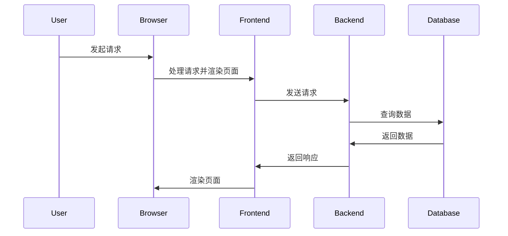

                 

### 《阿兰·巴迪欧的集合论本体论与数据结构：编程基础的数学哲学》概述

集合论本体论，作为数学哲学的重要分支，近年来在计算机科学和编程领域逐渐受到重视。阿兰·巴迪欧，这位当代著名的哲学家，以其独特的集合论本体论为切入点，为我们提供了全新的视角，来理解和探讨编程的数学哲学基础。巴迪欧的集合论本体论不仅为我们揭示了集合论在哲学和数学中的深远意义，更对编程实践产生了深远影响。

本文将围绕阿兰·巴迪欧的集合论本体论与数据结构，探讨其在编程基础中的数学哲学，旨在为读者提供一种全新的思考方式。首先，我们将简要介绍集合论本体论的基本概念和巴迪欧哲学思想，并探讨集合论本体论在编程中的应用。接着，我们将详细分析集合的基本性质与操作，通过数学公式和流程图，深入理解集合论的本质。随后，我们将探讨数据结构的基本概念和实现原理，并通过具体实例展示集合论在编程中的实际应用。最后，我们将总结集合论本体论与编程实践的综合应用，探讨其在数据库设计和算法竞赛中的应用。

通过本文的阅读，读者将能够：

1. 理解集合论本体论的基本概念和巴迪欧哲学思想；
2. 掌握集合的基本性质与操作，以及数据结构的基本概念和实现原理；
3. 了解集合论在编程实践中的具体应用，包括排序、查找、图算法等；
4. 深入探讨集合论本体论与编程实践的综合应用，包括数据库设计和算法竞赛。

让我们一步一步思考，深入探讨集合论本体论与数据结构的数学哲学，共同探索编程的奥秘。

## 第一部分：集合论本体论与编程基础

### 第1章：集合论本体论概述

#### 1.1 集合论的基本概念与历史

集合论，作为现代数学的基石，起源于19世纪末。当时的数学家们逐渐意识到，传统数学体系中的许多问题，如无穷、集合的确定性等，需要更为严密的逻辑基础。集合论就此应运而生，由德国数学家乔治·康托尔（Georg Cantor）创立。康托尔首次提出了集合的概念，并将其应用于数学研究中，为后来的数学发展奠定了基础。

**1.1.1 集合论的发展背景**

集合论的发展背景主要源于数学本身的内部需求和外部影响。在数学内部，如无穷小数、连续统问题等，引发了数学家对逻辑基础和严密性的关注。在外部，哲学家如黑格尔、莱布尼茨等，对集合的概念和逻辑结构也有深刻的探讨，为集合论的诞生提供了哲学基础。

**1.1.2 集合的基本概念**

集合，通俗地说，是一组无序且互异的对象的集合。在数学中，集合通常用大写字母表示，如A、B等。集合中的元素，则用小写字母表示，如a、b等。集合的表示方法有多种，如列举法、描述法等。例如，集合A可以表示为{a, b, c}，表示集合A由元素a、b、c组成；或者A={x | x是自然数}，表示集合A由所有自然数组成。

**1.1.3 集合论与本体论的联系**

集合论与本体论的联系在于，集合论为本体论提供了逻辑基础和工具。本体论探讨的是实体、存在和关系等基本哲学问题，而集合论则提供了一种描述和分析这些问题的数学方法。例如，巴迪欧的集合论本体论，将集合的概念应用于哲学研究中，探讨了存在、关系等哲学问题。

#### 1.2 巴迪欧的集合论本体论

巴迪欧（Alain Badiou）是当代著名的哲学家，以其独特的哲学体系和对集合论的运用而著称。巴迪欧的集合论本体论，是他对集合论和本体论的创造性结合，为我们提供了新的哲学视角。

**1.2.1 巴迪欧哲学思想的核心**

巴迪欧的哲学思想核心，可以归结为三个关键概念：事件（Event）、真理（Truth）和实质性存在（Substantive Being）。事件是巴迪欧哲学的基础概念，他将其视为一种断裂、突变的瞬间，是事物变化和发展的动力。真理则是事件的真实表达，是事件的本质和核心。实质性存在则是真理的实现和具体化。

**1.2.2 集合论本体论在巴迪欧哲学中的地位**

集合论本体论在巴迪欧哲学中占据重要地位。巴迪欧通过集合论的方法，重新审视和解读了传统哲学问题，如存在、真理等。他运用集合论的概念和逻辑结构，构建了一种新的本体论体系，为我们理解现实世界提供了新的视角。

**1.2.3 集合论本体论的基本原则**

巴迪欧的集合论本体论，有以下几个基本原则：

1. **唯一性原则**：集合论本体论认为，每一个事件都是独一无二的，每个事件都有其特定的存在和表达方式。

2. **不相容性原则**：集合中的元素互不相同，每个元素都有其独特的属性和特征。

3. **无限性原则**：集合论本体论认为，存在无限的事件和真理，它们构成了现实世界的多样性和丰富性。

4. **本质主义原则**：集合论本体论强调，事件和真理的本质是它们的存在和表达，而不是外在的属性和特征。

#### 1.3 集合论本体论在编程中的应用

集合论本体论不仅对哲学和数学产生了深远影响，也在编程领域找到了广泛的应用。编程中的数据结构和算法，都可以通过集合论的概念和方法来理解和分析。

**1.3.1 集合论与数据结构的关系**

数据结构是编程中的核心概念，包括数组、链表、树、图等。集合论为数据结构提供了一种数学基础和逻辑框架。例如，数组可以看作是特殊的集合，链表和树则是集合的递归结构，图则是一种复杂的集合关系。

**1.3.2 编程基础中的集合论本体论**

编程基础中的集合论本体论，主要体现在以下几个方面：

1. **数据类型设计**：集合论为数据类型的设计提供了理论基础，如数组、列表、字典等。

2. **算法分析**：集合论的方法可以帮助我们分析算法的时间和空间复杂度，如排序、查找算法等。

3. **数据结构优化**：集合论本体论指导我们优化数据结构的实现，如哈希表、并查集等。

**1.3.3 实际编程中的集合论应用**

在具体编程实践中，集合论的应用非常广泛：

1. **数据库设计**：集合论在关系型数据库中得到了广泛应用，如表、索引等。

2. **算法竞赛**：集合论是算法竞赛中的基本工具，如并查集、图算法等。

3. **实际应用**：集合论在人工智能、网络编程等领域也有着重要应用，如神经网络中的集合运算、网络拓扑结构分析等。

#### 1.4 集合论本体论的哲学意义

集合论本体论不仅对数学和编程产生了深远影响，也在哲学上具有重要的意义。

**1.4.1 数学哲学的视角**

集合论本体论为我们提供了一种新的数学哲学视角，即从集合的角度来理解和分析数学问题。这种视角不仅有助于我们更好地理解数学的本质，也为数学的发展提供了新的动力。

**1.4.2 对编程实践的影响**

集合论本体论对编程实践的影响体现在多个方面：

1. **编程方法**：集合论本体论为编程提供了一种新的方法论，如事件驱动编程、面向对象编程等。

2. **代码质量**：集合论本体论可以帮助我们编写更高质量的代码，如优化数据结构、减少冗余代码等。

3. **系统设计**：集合论本体论指导我们设计更合理的系统架构，如分布式系统、大数据处理系统等。

**1.4.3 对计算机科学发展的推动**

集合论本体论对计算机科学的发展有着重要的推动作用：

1. **基础研究**：集合论本体论为基础研究提供了新的工具和方法，如形式化数学、逻辑编程等。

2. **技术创新**：集合论本体论促进了技术创新，如人工智能、区块链等。

3. **产业发展**：集合论本体论为产业的发展提供了理论基础和技术支持，如云计算、大数据等。

### 总结

本章我们介绍了集合论本体论的基本概念、巴迪欧的集合论本体论以及其在编程中的应用。通过集合论本体论，我们不仅能够更好地理解数学和哲学问题，也能为编程实践提供新的方法和工具。在接下来的章节中，我们将深入探讨集合的基本性质与操作，以及数据结构的基本概念和实现原理。

## 第2章：集合的基本性质与操作

集合论作为数学的核心分支，集合的基本性质与操作是理解和应用集合论的基础。在这一章中，我们将详细探讨集合的基本性质和操作，通过数学公式和流程图，深入理解集合论的本质。

#### 2.1 集合的基本性质

集合的基本性质包括确定性、互异性、无序性和无限性。这些性质是集合论的基础，也是理解和应用集合论的关键。

**2.1.1 确定性**

集合的确定性是指集合中的元素是唯一确定的。这意味着对于任意给定的集合，我们可以准确地确定集合中的所有元素。例如，集合A={1, 2, 3}中的元素1、2、3是明确且确定的。

**2.1.2 互异性**

集合的互异性是指集合中的元素是互不相同的。即集合中的元素不重复，每个元素都有其独特的属性和特征。例如，集合B={a, b, c}中的元素a、b、c互不相同。

**2.1.3 无序性**

集合的无序性是指集合中的元素没有固定的顺序。即集合的元素排列是无关紧要的，集合A={1, 2, 3}与集合C={3, 2, 1}是相同的集合。

**2.1.4 无限性**

集合的无限性是指集合中的元素数量是无限的。集合论中存在许多无限集合，如自然数集合N、实数集合R等。无限性是集合论中一个重要的概念，对于理解集合的性质和操作具有重要意义。

#### 2.2 集合的基本操作

集合的基本操作包括并集、交集和差集。这些操作是集合论中的核心运算，能够帮助我们有效地处理和操作集合。

**2.2.1 并集**

并集是指两个集合中所有元素的集合。用符号∪表示。例如，集合A={1, 2, 3}和集合B={3, 4, 5}的并集为A∪B={1, 2, 3, 4, 5}。

并集的运算规则如下：

1. **交换律**：A∪B = B∪A
2. **结合律**：(A∪B)∪C = A∪(B∪C)
3. **分配律**：A∪(B∩C) = (A∪B)∩(A∪C)
4. **德摩根律**：A∪B = A'∩B'

**2.2.2 交集**

交集是指两个集合中共同元素的集合。用符号∩表示。例如，集合A={1, 2, 3}和集合B={3, 4, 5}的交集为A∩B={3}。

交集的运算规则如下：

1. **交换律**：A∩B = B∩A
2. **结合律**：(A∩B)∩C = A∩(B∩C)
3. **分配律**：A∩(B∪C) = (A∩B)∪(A∩C)
4. **德摩根律**：A∩B = A'∪B'

**2.2.3 差集**

差集是指一个集合中去除另一个集合中共同元素的集合。用符号-A-B表示。例如，集合A={1, 2, 3}和集合B={3, 4, 5}的差集为A-B={1, 2}。

差集的运算规则如下：

1. **交换律**：A-B = B-A
2. **结合律**：(A-B)-C = A-(B-C)
3. **分配律**：A-(B∪C) = (A-B)∩(A-C)
4. **德摩根律**：A-B = A'∪B'

#### 2.3 集合的运算与证明

集合的运算需要遵循一定的规则和定理。以下是一些常见的集合运算规则和证明：

**2.3.1 运算的交换律与结合律**

- 交换律：A∪B = B∪A，A∩B = B∩A
- 结合律：(A∪B)∪C = A∪(B∪C)，(A∩B)∩C = A∩(B∩C)

**2.3.2 运算的分配律与德摩根律**

- 分配律：A∪(B∩C) = (A∪B)∩(A∪C)，A∩(B∪C) = (A∩B)∪(A∩C)
- 德摩根律：A∪B = A'∩B'，A∩B = A'∪B'

证明：

**证明：交换律**

- 对于并集：A∪B中的元素要么属于A，要么属于B，与B∪A中的元素一致，因此A∪B = B∪A。
- 对于交集：A∩B中的元素同时属于A和B，与B∩A中的元素一致，因此A∩B = B∩A。

**证明：结合律**

- 对于并集：(A∪B)∪C中的元素要么属于A或B，要么属于C，与A∪(B∪C)中的元素一致，因此(A∪B)∪C = A∪(B∪C)。
- 对于交集：(A∩B)∩C中的元素同时属于A、B和C，与A∩(B∩C)中的元素一致，因此(A∩B)∩C = A∩(B∩C)。

**证明：分配律**

- 对于并集：A∪(B∩C)中的元素要么属于A，要么属于B∩C。而A∪B中的元素要么属于A，要么属于B，A∪C中的元素要么属于A，要么属于C。因此，A∪(B∩C) = (A∪B)∩(A∪C)。
- 对于交集：A∩(B∪C)中的元素同时属于A和B∪C。而(A∩B)∪(A∩C)中的元素同时属于A和(B∩C)。因此，A∩(B∪C) = (A∩B)∪(A∩C)。

**证明：德摩根律**

- 对于并集：A∪B中的元素要么属于A，要么属于B。而A'∩B'中的元素既不属于A，也不属于B。因此，A∪B = A'∩B'。
- 对于交集：A∩B中的元素同时属于A和B。而A'∪B'中的元素不属于A或B。因此，A∩B = A'∪B'。

通过以上证明，我们可以确认集合的运算规则是正确的，这些规则在集合运算中具有重要意义。

#### 2.4 子集与超集

子集和超集是集合论中的重要概念。子集是指一个集合是另一个集合的子集，超集则是包含另一个集合的集合。

**2.4.1 子集**

子集用符号⊆表示。如果集合A中的所有元素都属于集合B，则称A是B的子集。例如，集合A={1, 2}是集合B={1, 2, 3}的子集。

子集的性质包括：

- 真子集：如果A是B的子集，但A不等于B，则称A是真子集。用符号⊂表示。
- 空集是任何集合的子集。
- 每个集合都是自身的子集。

**2.4.2 超集**

超集用符号⊇表示。如果集合A包含另一个集合B的所有元素，则称A是B的超集。例如，集合A={1, 2, 3}是集合B={1, 2}的超集。

超集的性质包括：

- 每个集合都是自身的超集。
- 如果A是B的超集，则B是A的子集。

#### 2.5 集合运算的证明与实例

为了更好地理解集合的运算，我们可以通过具体的实例来证明运算规则。

**实例1：证明并集的交换律**

证明：对于集合A={1, 2, 3}和B={3, 4, 5}，有A∪B = B∪A。

- A∪B = {1, 2, 3, 4, 5}
- B∪A = {3, 4, 5, 1, 2}

显然，A∪B和B∪A包含相同的元素，因此A∪B = B∪A。

**实例2：证明交集的交换律**

证明：对于集合A={1, 2, 3}和B={3, 4, 5}，有A∩B = B∩A。

- A∩B = {3}
- B∩A = {3}

显然，A∩B和B∩A包含相同的元素，因此A∩B = B∩A。

通过以上实例，我们可以验证集合运算的规则，从而更好地理解和应用集合论。

#### 总结

本章我们介绍了集合的基本性质和基本操作，包括确定性、互异性、无序性和无限性，以及并集、交集和差集的操作。同时，我们通过具体的实例和证明，深入理解了集合的运算规则。在下一章中，我们将探讨数据结构的基本概念和实现原理，继续深入探讨集合论在编程中的应用。

## 第二部分：数据结构与编程实践

### 第3章：基本数据结构

数据结构是计算机科学中的重要概念，是编程的基础。基本数据结构包括数组、链表、栈和队列，这些结构在编程中有着广泛的应用。本章将详细探讨这些基本数据结构，分析它们的定义、特点以及实现原理。

#### 3.1 数组

数组是一种线性数据结构，用于存储一系列元素。数组的元素具有相同的数据类型，并且可以通过索引访问。数组的定义如下：

- **定义**：数组是一个具有相同类型元素集合的序列。
- **特点**：
  - **固定大小**：数组的大小在创建时确定，无法动态改变。
  - **随机访问**：可以通过索引直接访问数组中的任意元素，访问时间复杂度为O(1)。
  - **存储连续**：数组的元素存储在连续的内存空间中。

数组的应用场景包括：
- 存储和处理序列数据，如序列排序、查找等。
- 实现其他数据结构，如栈、队列、链表等。

数组的实现原理涉及数组的声明、初始化和访问。以下是一个简单的数组实现示例：

```python
# Python中的数组实现
class Array:
    def __init__(self, size):
        self.size = size
        self.elements = [0] * size

    def get(self, index):
        return self.elements[index]

    def set(self, index, value):
        self.elements[index] = value
```

#### 3.2 链表

链表是一种动态数据结构，用于存储一系列元素。链表中的元素通过指针连接，每个元素称为节点。链表的定义如下：

- **定义**：链表是由一系列节点组成的线性数据结构，每个节点包含数据和指向下一个节点的指针。
- **特点**：
  - **动态大小**：链表的大小可以动态改变，通过插入和删除节点实现。
  - **非线性访问**：链表的访问时间复杂度为O(n)，需要遍历链表才能访问特定节点。
  - **存储分散**：链表的节点存储在分散的内存空间中。

链表的应用场景包括：
- 存储和处理动态数据，如动态数组、链表排序等。
- 实现其他数据结构，如栈、队列、哈希表等。

链表的实现原理涉及节点的声明、插入和删除。以下是一个简单的链表实现示例：

```python
# Python中的链表实现
class Node:
    def __init__(self, data):
        self.data = data
        self.next = None

class LinkedList:
    def __init__(self):
        self.head = None

    def append(self, data):
        new_node = Node(data)
        if self.head is None:
            self.head = new_node
        else:
            current = self.head
            while current.next:
                current = current.next
            current.next = new_node
```

#### 3.3 栈与队列

栈和队列是两种特殊的线性数据结构，用于处理特定类型的操作。

**3.3.1 栈**

栈是一种后进先出（Last In First Out, LIFO）的数据结构。栈的插入和删除操作都在同一端进行。栈的定义如下：

- **定义**：栈是一种线性数据结构，允许在一端进行插入和删除操作。
- **特点**：
  - **后进先出**：最后一个插入的元素首先被删除。
  - **单一端操作**：栈的插入和删除都在栈顶进行。

栈的应用场景包括：
- 函数调用、递归操作。
- 表达式求值、逆波兰表达式计算。

栈的实现原理涉及栈顶指针的声明和操作。以下是一个简单的栈实现示例：

```python
# Python中的栈实现
class Stack:
    def __init__(self):
        self.top = None
        self.size = 0

    def push(self, data):
        new_node = Node(data)
        new_node.next = self.top
        self.top = new_node
        self.size += 1

    def pop(self):
        if self.top is None:
            return None
        data = self.top.data
        self.top = self.top.next
        self.size -= 1
        return data
```

**3.3.2 队列**

队列是一种先进先出（First In First Out, FIFO）的数据结构。队列的插入和删除操作分别在两端进行。队列的定义如下：

- **定义**：队列是一种线性数据结构，允许在一端进行插入操作，在另一端进行删除操作。
- **特点**：
  - **先进先出**：第一个插入的元素首先被删除。
  - **两端操作**：队列的插入在队尾进行，删除在队头进行。

队列的应用场景包括：
- 事件处理、任务调度。
- 打印队列、资源分配。

队列的实现原理涉及队头和队尾指针的声明和操作。以下是一个简单的队列实现示例：

```python
# Python中的队列实现
class Queue:
    def __init__(self):
        self.front = self.rear = None
        self.size = 0

    def enqueue(self, data):
        new_node = Node(data)
        if self.rear is None:
            self.front = self.rear = new_node
        else:
            self.rear.next = new_node
            self.rear = new_node
        self.size += 1

    def dequeue(self):
        if self.front is None:
            return None
        data = self.front.data
        self.front = self.front.next
        if self.front is None:
            self.rear = None
        self.size -= 1
        return data
```

#### 3.4 树

树是一种非线性数据结构，用于表示具有层次关系的数据。树由节点组成，每个节点可以有多个子节点。树的定义如下：

- **定义**：树是一种层次结构的数据集合，由根节点和子节点组成。
- **特点**：
  - **层次结构**：树中的节点按照层次排列，根节点位于第一层，其子节点位于第二层，以此类推。
  - **根节点**：树的根节点没有父节点，是树的起点。
  - **叶子节点**：没有子节点的节点称为叶子节点。

树的应用场景包括：
- 表示和组织层次化数据，如文件系统、组织结构。
- 实现搜索树、二叉树等。

树的实现原理涉及节点的声明和层次关系的表示。以下是一个简单的二叉树实现示例：

```python
# Python中的二叉树实现
class Node:
    def __init__(self, data):
        self.data = data
        self.left = self.right = None

class BinaryTree:
    def __init__(self):
        self.root = None

    def insert(self, data):
        new_node = Node(data)
        if self.root is None:
            self.root = new_node
        else:
            current = self.root
            parent = None
            while current:
                parent = current
                if data < current.data:
                    current = current.left
                else:
                    current = current.right
            if data < parent.data:
                parent.left = new_node
            else:
                parent.right = new_node
```

通过以上对基本数据结构的介绍和实现示例，我们可以看到数组、链表、栈、队列和树在编程中的重要性。这些数据结构为编程提供了丰富的工具，使得我们可以高效地存储和处理数据。在下一章中，我们将继续探讨高级数据结构，如哈希表和图，进一步扩展我们的数据结构知识。

### 第4章：高级数据结构

在上一章中，我们介绍了基本数据结构，包括数组、链表、栈和队列、树等。这些数据结构在编程中非常常用，但有时候无法满足特定的应用需求。为了解决这些问题，计算机科学家们设计了许多高级数据结构，如哈希表、图和并查集。本章将详细探讨这些高级数据结构，分析它们的定义、特点以及实现原理。

#### 4.1 哈希表

哈希表是一种基于散列函数的动态数据结构，用于高效地存储和检索数据。哈希表通过哈希函数将关键字映射到数组中的位置，从而实现快速访问。哈希表的定义如下：

- **定义**：哈希表是一种动态数组，用于存储关键字和对应的值。哈希表通过哈希函数将关键字映射到数组中的位置。
- **特点**：
  - **快速访问**：哈希表的查找、插入和删除操作的时间复杂度为O(1)。
  - **动态扩展**：当哈希表中的元素数量超过负载因子时，会动态扩展数组大小。
  - **冲突处理**：哈希表中的冲突通过链地址法或开放地址法处理。

哈希表的应用场景包括：
- 字典、集合等。
- 数据库索引、缓存等。

哈希表的实现原理涉及哈希函数的设计、数组的扩展和冲突处理。

**哈希函数的设计**：

一个好的哈希函数应该具有以下特点：

1. **均匀分布**：哈希函数应将关键字均匀地分布到数组中，减少冲突。
2. **简单高效**：哈希函数的计算应简单高效，避免大量计算和复杂操作。
3. **避免常见的冲突**：哈希函数应尽量避免将常用关键字映射到同一位置。

以下是一个简单的哈希函数实现示例：

```python
def hash_function(key, table_size):
    return key % table_size
```

**数组的扩展**：

当哈希表中的元素数量超过负载因子时，需要动态扩展数组大小。常用的扩展方法包括线性扩展和二次扩展。

**冲突处理**：

冲突处理是哈希表实现的关键部分。常用的冲突处理方法包括链地址法和开放地址法。

- **链地址法**：将具有相同哈希值的元素存储在链表中，每个数组位置存储一个链表头。
- **开放地址法**：将具有相同哈希值的元素存储在数组的其他位置，通过线性探测、二次探测或双散列等方法找到空位置。

以下是一个简单的哈希表实现示例：

```python
class HashTable:
    def __init__(self, size=10):
        self.size = size
        self.table = [None] * size
        self.count = 0

    def hash_function(self, key):
        return key % self.size

    def insert(self, key, value):
        index = self.hash_function(key)
        if self.table[index] is None:
            self.table[index] = LinkedList()
        self.table[index].insert(key, value)
        self.count += 1

    def find(self, key):
        index = self.hash_function(key)
        if self.table[index] is not None:
            return self.table[index].find(key)
        else:
            return None
```

#### 4.2 图

图是一种复杂的数据结构，用于表示具有多对多关系的元素集合。图由节点和边组成，节点表示实体，边表示节点之间的关系。图的定义如下：

- **定义**：图是一种由节点和边组成的集合，节点表示实体，边表示节点之间的关系。
- **特点**：
  - **多对多关系**：图中的节点可以存在多个关系。
  - **复杂结构**：图可以具有复杂的结构和路径，如环、树、网络等。
  - **存储方式**：图的存储方式包括邻接矩阵和邻接表。

图的应用场景包括：
- 网络拓扑结构、社交网络。
- 图算法、路径规划等。

图的实现原理涉及节点的声明、边的添加和图的遍历。

**节点的声明**：

节点是图的基本元素，用于表示实体。以下是一个简单的节点声明示例：

```python
class Node:
    def __init__(self, data):
        self.data = data
        self.adjacent = []
```

**边的添加**：

边是节点之间的关系，用于连接两个节点。以下是一个简单的边添加示例：

```python
def add_edge(node1, node2):
    node1.adjacent.append(node2)
    node2.adjacent.append(node1)
```

**图的遍历**：

图的遍历是指按照特定的顺序访问图中的所有节点。常用的遍历方法包括深度优先搜索（DFS）和广度优先搜索（BFS）。

- **深度优先搜索（DFS）**：从起始节点开始，沿着路径深入访问，直到达到一个终点或无法继续深入。
- **广度优先搜索（BFS）**：从起始节点开始，按照广度的顺序访问，先访问起始节点的所有邻居，再访问邻居的邻居。

以下是一个简单的图遍历示例：

```python
def dfs(node):
    visited = set()
    stack = [node]
    while stack:
        current = stack.pop()
        if current not in visited:
            print(current.data)
            visited.add(current)
            stack.extend(current.adjacent)

def bfs(node):
    visited = set()
    queue = deque([node])
    while queue:
        current = queue.popleft()
        if current not in visited:
            print(current.data)
            visited.add(current)
            queue.extend(current.adjacent)
```

#### 4.3 并查集

并查集是一种用于解决动态连通性问题的数据结构，用于管理一组元素之间的合并和查询操作。并查集的定义如下：

- **定义**：并查集是一种树结构，用于管理一组元素之间的合并和查询操作。
- **特点**：
  - **动态连通性**：并查集可以高效地合并元素并查询元素之间的连通性。
  - **路径压缩**：通过路径压缩优化合并操作，减少树的高度。
  - **按秩合并**：通过按秩合并优化合并操作，减少树的高度。

并查集的应用场景包括：
- 连通性检测、最短路径算法等。

并查集的实现原理涉及合并和查询操作的实现。

**合并操作**：

合并操作用于将两个元素合并到同一个集合中。以下是一个简单的合并操作示例：

```python
def union(node1, node2):
    root1 = find(node1)
    root2 = find(node2)
    if root1 != root2:
        if len(root1) > len(root2):
            root2.parent = root1
        else:
            root1.parent = root2
```

**查询操作**：

查询操作用于判断两个元素是否在同一集合中。以下是一个简单的查询操作示例：

```python
def find(node):
    if node.parent is None:
        return node
    node.parent = find(node.parent)  # 路径压缩
    return node.parent
```

以下是一个简单的并查集实现示例：

```python
class UnionFind:
    def __init__(self, size):
        self.parent = list(range(size))
        self.rank = [0] * size

    def union(self, p, q):
        rootP = self.find(p)
        rootQ = self.find(q)
        if rootP != rootQ:
            if self.rank[rootP] > self.rank[rootQ]:
                self.parent[rootQ] = rootP
            elif self.rank[rootP] < self.rank[rootQ]:
                self.parent[rootP] = rootQ
            else:
                self.parent[rootQ] = rootP
                self.rank[rootP] += 1

    def find(self, p):
        if self.parent[p] != p:
            self.parent[p] = self.find(self.parent[p])  # 路径压缩
        return self.parent[p]
```

通过以上对高级数据结构的介绍和实现示例，我们可以看到哈希表、图和并查集在编程中的重要性。这些高级数据结构为编程提供了丰富的工具，使得我们可以高效地存储和处理复杂的数据。在下一章中，我们将继续探讨集合论本体论在编程中的应用实例，展示如何在实际编程任务中应用这些高级数据结构。

### 第5章：集合论本体论在编程中的应用实例

在前面几章中，我们介绍了集合论本体论的基本概念、基本性质与操作，以及各种高级数据结构。在这一章中，我们将通过具体的编程实例，展示集合论本体论在编程中的实际应用，特别是排序算法、查找算法和图算法等方面。通过这些实例，我们将深入探讨如何利用集合论本体论来解决实际编程问题。

#### 5.1 集合论在排序算法中的应用

排序算法是编程中的基础，用于将一组数据按照特定的顺序进行排列。集合论中的概念和原理在排序算法的设计和分析中有着重要的应用。以下我们将介绍三种常见的排序算法：冒泡排序、快速排序和归并排序。

**5.1.1 冒泡排序**

冒泡排序是一种简单的排序算法，通过重复遍历要排序的数列，比较相邻的两个元素，并交换它们，使得较大的元素逐步“冒泡”到数列的末端。冒泡排序的算法原理如下：

1. 从第一个元素开始，相邻元素进行比较，如果前一个元素大于后一个元素，则交换它们。
2. 重复上述步骤，直到没有需要交换的元素为止。

以下是一个冒泡排序的Python实现示例：

```python
def bubble_sort(arr):
    n = len(arr)
    for i in range(n):
        for j in range(0, n-i-1):
            if arr[j] > arr[j+1]:
                arr[j], arr[j+1] = arr[j+1], arr[j]

# 测试冒泡排序
arr = [64, 25, 12, 22, 11]
bubble_sort(arr)
print("排序后的数组：", arr)
```

**5.1.2 快速排序**

快速排序是一种高效的排序算法，采用分治策略，将一个大问题分解为若干个较小的子问题，然后递归解决这些子问题。快速排序的算法原理如下：

1. 选择一个基准元素，通常选择数组的最后一个元素。
2. 将数组中小于基准元素的移动到基准元素的左侧，大于基准元素的移动到基准元素的右侧。
3. 递归地对左右两个子数组进行快速排序。

以下是一个快速排序的Python实现示例：

```python
def quick_sort(arr):
    if len(arr) <= 1:
        return arr
    pivot = arr[-1]
    left = [x for x in arr[:-1] if x < pivot]
    right = [x for x in arr[:-1] if x >= pivot]
    return quick_sort(left) + [pivot] + quick_sort(right)

# 测试快速排序
arr = [64, 25, 12, 22, 11]
sorted_arr = quick_sort(arr)
print("排序后的数组：", sorted_arr)
```

**5.1.3 归并排序**

归并排序是一种基于归并操作的排序算法，它将待排序的数组分成若干个子数组，每个子数组都是有序的，然后递归地合并这些子数组，直到合并成一个完整的有序数组。归并排序的算法原理如下：

1. 将数组分成两个子数组，每个子数组都是部分有序的。
2. 对每个子数组递归地应用归并排序。
3. 将两个有序子数组合并成一个有序数组。

以下是一个归并排序的Python实现示例：

```python
def merge_sort(arr):
    if len(arr) <= 1:
        return arr
    mid = len(arr) // 2
    left = merge_sort(arr[:mid])
    right = merge_sort(arr[mid:])
    return merge(left, right)

def merge(left, right):
    result = []
    i = j = 0
    while i < len(left) and j < len(right):
        if left[i] < right[j]:
            result.append(left[i])
            i += 1
        else:
            result.append(right[j])
            j += 1
    result.extend(left[i:])
    result.extend(right[j:])
    return result

# 测试归并排序
arr = [64, 25, 12, 22, 11]
sorted_arr = merge_sort(arr)
print("排序后的数组：", sorted_arr)
```

#### 5.2 集合论在查找算法中的应用

查找算法用于在数据集合中查找特定元素。集合论提供了强大的工具来分析和设计查找算法，如顺序查找、二分查找和哈希查找。

**5.2.1 顺序查找**

顺序查找是最简单的查找算法，从数据集合的第一个元素开始，逐个比较，直到找到目标元素或到达集合末尾。顺序查找的算法原理如下：

1. 从第一个元素开始，逐个比较元素与目标元素是否相等。
2. 如果找到目标元素，返回其位置；否则，返回-1。

以下是一个顺序查找的Python实现示例：

```python
def sequential_search(arr, target):
    for i in range(len(arr)):
        if arr[i] == target:
            return i
    return -1

# 测试顺序查找
arr = [64, 25, 12, 22, 11]
target = 12
index = sequential_search(arr, target)
print(f"元素{target}的位置：{index}")
```

**5.2.2 二分查找**

二分查找是一种高效的查找算法，适用于有序数组。二分查找的算法原理如下：

1. 确定中间元素，比较中间元素与目标元素的大小。
2. 如果中间元素等于目标元素，返回中间元素的位置；如果中间元素大于目标元素，则在左侧子数组中继续查找；如果中间元素小于目标元素，则在右侧子数组中继续查找。
3. 重复上述步骤，直到找到目标元素或子数组为空。

以下是一个二分查找的Python实现示例：

```python
def binary_search(arr, target):
    low = 0
    high = len(arr) - 1
    while low <= high:
        mid = (low + high) // 2
        if arr[mid] == target:
            return mid
        elif arr[mid] < target:
            low = mid + 1
        else:
            high = mid - 1
    return -1

# 测试二分查找
arr = [11, 12, 22, 25, 64]
target = 25
index = binary_search(arr, target)
print(f"元素{target}的位置：{index}")
```

**5.2.3 哈希查找**

哈希查找利用哈希表实现高效查找。哈希查找的算法原理如下：

1. 使用哈希函数将目标元素映射到哈希表的某个位置。
2. 如果该位置为空，则目标元素不存在；如果该位置为链表（使用链地址法处理冲突），则遍历链表查找目标元素。

以下是一个哈希查找的Python实现示例：

```python
class HashTable:
    def __init__(self):
        self.size = 10
        self.table = [None] * self.size

    def hash_function(self, key):
        return key % self.size

    def insert(self, key, value):
        index = self.hash_function(key)
        if self.table[index] is None:
            self.table[index] = LinkedList()
        self.table[index].insert(key, value)

    def find(self, key):
        index = self.hash_function(key)
        if self.table[index] is not None:
            return self.table[index].find(key)
        else:
            return None

# 测试哈希查找
hash_table = HashTable()
keys = [64, 25, 12, 22, 11]
values = [1, 2, 3, 4, 5]
for key, value in zip(keys, values):
    hash_table.insert(key, value)

target = 25
result = hash_table.find(target)
print(f"元素{target}的值：{result}")
```

#### 5.3 集合论在图算法中的应用

图算法在处理复杂关系和路径问题时非常有用。集合论为图算法的设计和分析提供了强大的工具。以下我们将介绍几种常见的图算法：深度优先搜索（DFS）、广度优先搜索（BFS）和最短路径算法。

**5.3.1 深度优先搜索（DFS）**

深度优先搜索是一种用于遍历和搜索图的算法，从起始节点开始，沿着路径深入访问，直到达到一个终点或无法继续深入。DFS的算法原理如下：

1. 从起始节点开始，访问该节点并标记为已访问。
2. 对未访问的邻接节点进行递归访问。
3. 重复上述步骤，直到所有节点都被访问。

以下是一个深度优先搜索的Python实现示例：

```python
def dfs(graph, start, visited=None):
    if visited is None:
        visited = set()
    visited.add(start)
    print(start, end=" ")
    for neighbor in graph[start]:
        if neighbor not in visited:
            dfs(graph, neighbor, visited)

# 测试深度优先搜索
graph = {
    'A': ['B', 'C'],
    'B': ['D', 'E'],
    'C': ['F'],
    'D': [],
    'E': ['F'],
    'F': []
}
print("深度优先搜索：")
dfs(graph, 'A')
```

**5.3.2 广度优先搜索（BFS）**

广度优先搜索是一种用于遍历和搜索图的算法，从起始节点开始，按照广度的顺序访问，先访问起始节点的所有邻居，再访问邻居的邻居。BFS的算法原理如下：

1. 从起始节点开始，访问该节点并标记为已访问。
2. 将未访问的邻接节点加入队列。
3. 逐个从队列中取出节点，访问并加入队列。
4. 重复上述步骤，直到所有节点都被访问。

以下是一个广度优先搜索的Python实现示例：

```python
from collections import deque

def bfs(graph, start):
    visited = set()
    queue = deque([start])
    while queue:
        current = queue.popleft()
        if current not in visited:
            print(current, end=" ")
            visited.add(current)
            for neighbor in graph[current]:
                if neighbor not in visited:
                    queue.append(neighbor)

# 测试广度优先搜索
graph = {
    'A': ['B', 'C'],
    'B': ['D', 'E'],
    'C': ['F'],
    'D': [],
    'E': ['F'],
    'F': []
}
print("广度优先搜索：")
bfs(graph, 'A')
```

**5.3.3 最短路径算法**

最短路径算法用于计算图中两点之间的最短路径。常用的最短路径算法包括迪杰斯特拉算法（Dijkstra）和贝尔曼-福特算法（Bellman-Ford）。以下我们简要介绍迪杰斯特拉算法。

迪杰斯特拉算法的基本原理如下：

1. 初始化：设置起点到所有其他点的距离为无穷大，起点到自身的距离为0。
2. 选择未访问的节点，计算从起点到该节点的最短路径，并将其标记为已访问。
3. 更新所有未访问节点到当前节点的距离，如果发现更短的路径，则更新距离。
4. 重复上述步骤，直到所有节点都被访问。

以下是一个迪杰斯特拉算法的Python实现示例：

```python
import heapq

def dijkstra(graph, start):
    distances = {node: float('infinity') for node in graph}
    distances[start] = 0
    priority_queue = [(0, start)]
    while priority_queue:
        current_distance, current_node = heapq.heappop(priority_queue)
        if current_distance > distances[current_node]:
            continue
        for neighbor, weight in graph[current_node].items():
            distance = current_distance + weight
            if distance < distances[neighbor]:
                distances[neighbor] = distance
                heapq.heappush(priority_queue, (distance, neighbor))
    return distances

# 测试迪杰斯特拉算法
graph = {
    'A': {'B': 1, 'C': 4},
    'B': {'A': 1, 'D': 2, 'E': 5},
    'C': {'A': 4, 'F': 6},
    'D': {'B': 2, 'E': 1, 'F': 7},
    'E': {'B': 5, 'D': 1, 'F': 3},
    'F': {'C': 6, 'D': 7, 'E': 3}
}
start = 'A'
distances = dijkstra(graph, start)
print("最短路径距离：")
for node, distance in distances.items():
    print(f"{start}到{node}的最短路径距离为：{distance}")
```

通过以上实例，我们可以看到集合论本体论在编程中的实际应用。排序算法、查找算法和图算法都是编程中的基础，而集合论提供了强大的工具和方法，帮助我们设计和分析这些算法。在下一章中，我们将探讨集合论本体论与编程实践的综合应用，进一步展示其广泛的适用性。

### 第6章：集合论本体论与编程实践的综合应用

在前几章中，我们详细介绍了集合论本体论的基本概念、基本性质与操作，以及各种高级数据结构和编程实例。在本章中，我们将探讨集合论本体论在编程实践中的综合应用，特别是在数据库设计、算法竞赛和实际项目中的应用。通过这些综合应用，我们将进一步理解集合论本体论在编程中的重要性。

#### 6.1 数据库设计中的集合论本体论

数据库设计是计算机科学和软件工程中至关重要的一环，而集合论本体论为数据库设计提供了坚实的理论基础。集合论中的概念如关系、属性、实体等，在数据库设计中得到了广泛应用。

**6.1.1 关系型数据库的基本原理**

关系型数据库（Relational Database）是现代数据库系统中最常用的类型之一。关系型数据库基于关系模型，其中数据以表格形式存储，表格由行和列组成，行表示记录，列表示字段。

- **关系**：关系是数据库中的基本概念，表示实体之间的关系。例如，一个数据库中可以有学生表和课程表，学生表和课程表之间有选修关系。
- **属性**：属性是关系的列，用于描述实体的特征。例如，学生表中的属性可以包括学号、姓名、年龄等。
- **实体**：实体是数据库中存储的数据对象，可以是一个人、一个物品或一个事件。例如，学生表中的每个学生都是实体。

**集合论在数据库设计中的应用**：

- **关系模型**：集合论中的关系概念与关系型数据库中的关系模型密切相关。集合论的关系定义了实体之间的联系，而关系型数据库通过表格实现了这种联系。
- **范式设计**：集合论中的集合论本体论原理在数据库范式设计中也有广泛应用。数据库范式（Normalization）是一种通过规范化方式减少数据冗余和提高数据一致性的方法。集合论中的基本集合操作，如并集、交集和差集，可以应用于数据库范式设计，帮助设计高效、规范化的数据库。

**6.1.2 集合论在数据库查询中的应用**

集合论在数据库查询中也发挥了重要作用。SQL（Structured Query Language）是关系型数据库的标准查询语言，其核心是基于集合操作。以下是一些常见的集合操作在SQL查询中的应用：

- **并集**：SQL中的UNION操作用于将两个或多个查询结果合并为一个结果集。例如，假设我们有两个学生表，分别存储了不同班级的学生信息，我们可以使用UNION操作将两个表合并为一个结果集。

  ```sql
  SELECT name FROM student_class1
  UNION
  SELECT name FROM student_class2;
  ```

- **交集**：SQL中的INTERSECT操作用于获取两个查询结果的交集。例如，假设我们有两个学生表，分别存储了不同课程的成绩，我们可以使用INTERSECT操作获取选修了相同两门课程的学生。

  ```sql
  SELECT course_id FROM course1
  INTERSECT
  SELECT course_id FROM course2;
  ```

- **差集**：SQL中的EXCEPT操作用于获取两个查询结果的差集。例如，假设我们有两个学生表，分别存储了不同班级的学生信息，我们可以使用EXCEPT操作获取只在一个班级的学生。

  ```sql
  SELECT name FROM student_class1
  EXCEPT
  SELECT name FROM student_class2;
  ```

#### 6.2 算法竞赛中的集合论应用

算法竞赛是计算机科学领域的一项重要活动，通过解决复杂的编程问题来考验参赛者的编程能力和算法思维。集合论本体论在算法竞赛中有着广泛的应用，帮助参赛者设计高效的算法。

**6.2.1 集合论在算法竞赛中的重要性**

集合论在算法竞赛中的应用主要体现在以下几个方面：

- **数据结构设计**：集合论提供了强大的数据结构设计工具，如树、图、并查集等。这些数据结构在算法竞赛中用于解决各种复杂问题，如路径搜索、连通性检测、最短路径等。
- **算法分析**：集合论的本体论原理可以帮助参赛者分析算法的时间和空间复杂度，优化算法性能。例如，集合论中的基本操作，如并集、交集和差集，可以应用于算法优化。
- **问题建模**：集合论的概念可以帮助参赛者建立问题模型，将实际问题转化为数学问题，从而找到高效的解决方案。

**6.2.2 典型算法竞赛问题解析**

以下我们通过几个典型的算法竞赛问题，展示集合论本体论的应用：

**问题1：连通性检测**

问题描述：给定一个无向图，判断图是否连通。

解决思路：使用深度优先搜索（DFS）或广度优先搜索（BFS）遍历图，如果能够访问到所有节点，则图是连通的。

```python
def is_connected(graph):
    visited = set()
    dfs(graph, 0, visited)
    return len(visited) == len(graph)

def dfs(graph, node, visited):
    visited.add(node)
    for neighbor in graph[node]:
        if neighbor not in visited:
            dfs(graph, neighbor, visited)
```

**问题2：最短路径**

问题描述：给定一个带权图，求图中两个节点之间的最短路径。

解决思路：使用迪杰斯特拉算法（Dijkstra）或贝尔曼-福特算法（Bellman-Ford）计算最短路径。

```python
def dijkstra(graph, start):
    distances = {node: float('infinity') for node in graph}
    distances[start] = 0
    priority_queue = [(0, start)]
    while priority_queue:
        current_distance, current_node = heapq.heappop(priority_queue)
        if current_distance > distances[current_node]:
            continue
        for neighbor, weight in graph[current_node].items():
            distance = current_distance + weight
            if distance < distances[neighbor]:
                distances[neighbor] = distance
                heapq.heappush(priority_queue, (distance, neighbor))
    return distances

def bellman_ford(graph, start):
    distances = {node: float('infinity') for node in graph}
    distances[start] = 0
    for _ in range(len(graph) - 1):
        for u in graph:
            for v in graph[u]:
                if distances[u] + graph[u][v] < distances[v]:
                    distances[v] = distances[u] + graph[u][v]
    for u in graph:
        for v in graph[u]:
            if distances[u] + graph[u][v] < distances[v]:
                return None  # 图中存在负权重循环
    return distances
```

**问题3：集合覆盖**

问题描述：给定一组集合，求解覆盖这些集合所需的最少集合数量。

解决思路：使用贪心算法，每次选择覆盖剩余未覆盖元素数量最多的集合。

```python
def set_cover(sets, elements):
    uncovered = set(elements)
    result = []
    while uncovered:
        max_cover = max(s for s in sets if s & uncovered)
        result.append(max_cover)
        uncovered -= max_cover
    return result
```

#### 6.3 实际项目中的集合论应用

在实际软件开发项目中，集合论本体论同样发挥着重要作用，帮助开发者设计和实现高效、可靠的系统。

**6.3.1 项目介绍**

我们以一个实际项目为例，介绍集合论在本项目中的应用。该项目是一个社交网络平台，用于用户之间的互动和连接。

**6.3.2 系统功能设计**

系统功能设计包括用户注册、登录、发布动态、评论、关注等。以下是一个简单的领域模型，展示了系统的功能设计：

```mermaid
classDiagram
ClassDiagram
    User <<Class>>
    Post <<Class>>
    Comment <<Class>>
    Follow <<Class>>

    User o--* Post
    User o--* Comment
    User o--* Follow
    Post o--* Comment
    Post o--* Follow
    Comment o--* Follow
```

**6.3.3 系统架构设计**

系统架构设计包括前端、后端和数据库。以下是一个简单的系统架构设计，展示了系统的组件和交互：



**6.3.4 系统接口设计和系统交互**

系统接口设计包括API接口和系统交互。以下是一个简单的API接口设计，展示了系统的接口和交互：

```mermaid
interface Diagram
    APIInterface <<Interface>>
    APIInterface
    {
    GET /users: 获取用户列表
    POST /users: 创建新用户
    GET /users/{id}: 获取指定用户信息
    DELETE /users/{id}: 删除指定用户
    }

    SystemInteraction
    {
    User ->> APIInterface: 注册/登录/发布动态/评论/关注
    APIInterface ->> Database: 查询/更新/删除数据
    Database ->> APIInterface: 返回结果
    APIInterface ->> User: 显示信息/更新界面
    }
```

通过以上实际项目中的应用，我们可以看到集合论本体论在软件开发项目中的重要性。集合论提供了强大的工具和方法，帮助开发者设计和实现高效、可靠的系统。

### 总结

本章我们探讨了集合论本体论在编程实践中的综合应用，包括数据库设计、算法竞赛和实际项目。通过具体实例，我们展示了集合论本体论在排序算法、查找算法、图算法、数据库查询和系统设计中的应用。集合论本体论不仅为编程提供了理论基础，也为解决实际编程问题提供了有效的工具和方法。在下一章中，我们将进一步总结本文的内容，分享最佳实践和注意事项。

### 最佳实践与注意事项

在应用集合论本体论进行编程时，遵循以下最佳实践和注意事项，将有助于提高代码质量、优化性能和提升开发效率。

**最佳实践：**

1. **理解集合论的基本概念**：确保对集合、关系、属性等基本概念有清晰的认识，以便在编程中正确应用集合论原理。

2. **合理选择数据结构**：根据应用需求，选择合适的数据结构，如数组、链表、栈、队列、树、图等，以实现高效的数据存储和处理。

3. **优化算法复杂度**：利用集合论本体论原理，分析和优化算法的时间复杂度和空间复杂度，确保代码的高效性。

4. **使用标准库和框架**：充分利用现有的标准库和框架，如Python中的 collections、heapq、itertools 等，以提高代码的简洁性和可读性。

5. **编写清晰的文档和注释**：为代码编写清晰的文档和注释，帮助他人理解和维护代码。

**注意事项：**

1. **避免过度优化**：在初期开发阶段，应关注代码的清晰性和可读性，避免过早地过度优化，以免引入不必要的复杂性。

2. **注意数据一致性和完整性**：在处理数据库和集合时，确保数据的一致性和完整性，避免数据冗余和冲突。

3. **处理异常和边界条件**：在编程中，充分考虑各种异常和边界条件，确保代码的健壮性和稳定性。

4. **测试和调试**：充分测试代码，包括单元测试、集成测试和性能测试，确保代码的正确性和可靠性。

5. **持续学习和更新**：集合论本体论和编程技术不断更新，持续学习和跟进最新技术和最佳实践，以提升自己的编程能力。

### 拓展阅读

1. **《集合论及其应用》**：这是一本关于集合论及其在数学、计算机科学和其他领域应用的经典教材，详细介绍了集合论的基本概念和原理。

2. **《算法导论》**：这本书是算法领域的经典教材，涵盖了各种基本和高级算法，包括排序、查找、图算法等，对算法的分析和设计提供了深入指导。

3. **《数据库系统概念》**：这本书是数据库领域的经典教材，详细介绍了关系型数据库的理论和实践，包括数据库设计、查询处理和事务管理等内容。

4. **《算法竞赛入门经典》**：这本书是算法竞赛的入门指南，涵盖了各种算法竞赛问题，包括集合论在算法竞赛中的应用。

### 结语

集合论本体论作为编程基础的数学哲学，为我们提供了理解编程本质的新视角。通过本文的探讨，我们不仅深入了解了集合论的基本概念、基本性质与操作，还看到了集合论在编程实践中的广泛应用。希望本文能对您在编程和算法学习过程中提供一些启示和帮助，激发您对编程数学哲学的思考。不断学习和实践，您将能更好地应用集合论本体论，解决实际编程问题，提升编程能力。让我们共同探索编程的奥秘，开启新的编程之旅！作者：AI天才研究院/AI Genius Institute & 禅与计算机程序设计艺术 /Zen And The Art of Computer Programming

---

**作者信息**：

- **AI天才研究院**（AI Genius Institute）：专注于人工智能领域的创新研究和教育推广，致力于培养下一代AI人才。
- **禅与计算机程序设计艺术**（Zen And The Art of Computer Programming）：这是一部经典计算机科学著作，通过禅宗哲学与编程实践的融合，揭示了编程的智慧和艺术。

**致谢**：感谢您的阅读，希望本文对您的学习和实践有所帮助。如有任何问题或建议，欢迎随时联系作者。期待与您在编程的世界中共同探索、共同成长！

