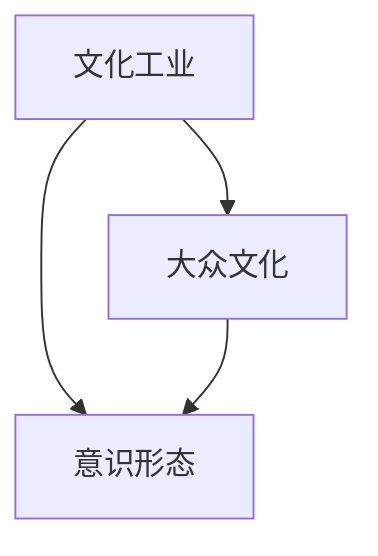
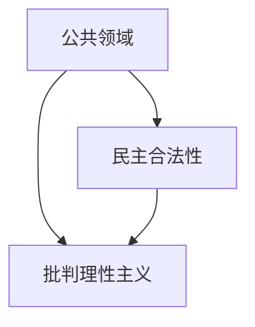
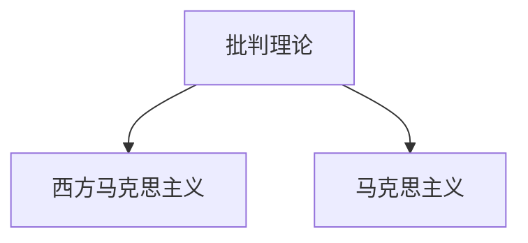
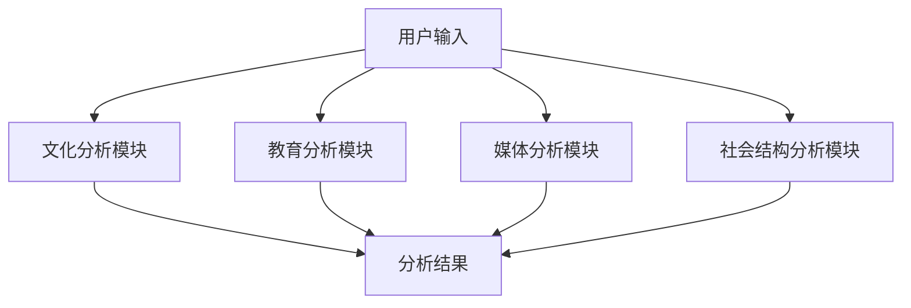
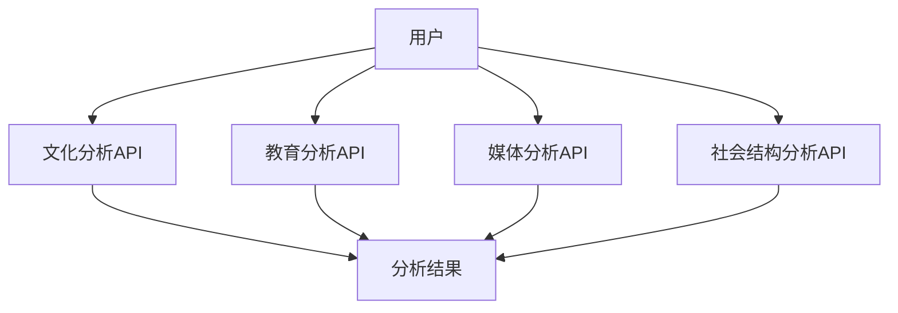
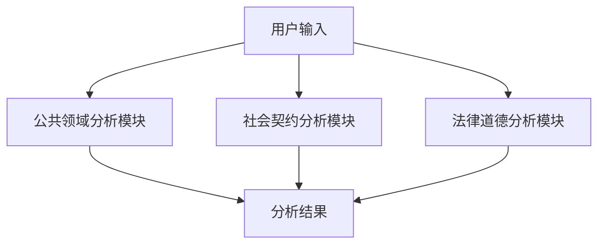
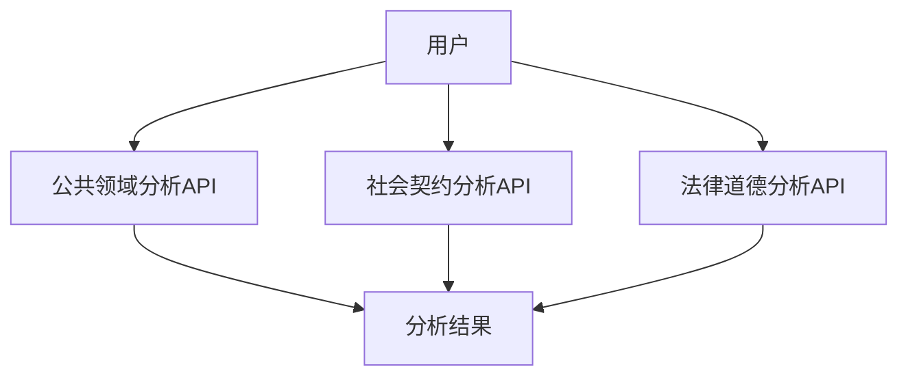

                 

# 阿多诺与哈贝马斯：批判理论的两代代表

> 关键词：阿多诺、哈贝马斯、批判理论、文化工业、公共领域

> 摘要：本文旨在探讨两位批判理论大师——阿多诺和哈贝马斯的生平与思想，详细分析他们的批判理论，以及两者之间的对话与争论。文章还将评价批判理论在当代社会中的地位与作用，并反思其局限与未来。

## 目录大纲

1. **第一部分：阿多诺与哈贝马斯的生平与思想背景**
    1.1. **阿多诺的生平与思想**
    1.2. **哈贝马斯的生平与思想**
    1.3. **批判理论的起源与发展**

2. **第二部分：阿多诺的批判理论**
    2.1. **文化工业与大众文化**
    2.2. **社会批判理论**
    2.3. **批判理论的方法论**

3. **第三部分：哈贝马斯的批判理论**
    2.4. **公共领域的概念与民主合法性**
    2.5. **社会理论和政治哲学**
    2.6. **批判理性主义**

4. **第四部分：阿多诺与哈贝马斯的对话与争论**
    2.7. **批判理论的传承与变革**
    2.8. **批判理论的实践与应用**
    2.9. **批判理论的局限与未来**

5. **第五部分：批判理论的影响与评价**
    2.10. **批判理论在当代社会中的地位与作用**
    2.11. **批判理论的学术争议与反思**
    2.12. **批判理论的未来展望**

## 第一部分：阿多诺与哈贝马斯的生平与思想背景

### 1.1. 阿多诺的生平与思想

特奥多尔·阿多诺（Theodor W. Adorno），1903年出生于德国法兰克福，是20世纪最重要的哲学家、社会学家和音乐学家之一。阿多诺是法兰克福学派的核心成员，他与马克斯·霍克海默（Max Horkheimer）共同创立了批判理论，这一理论对后来的社会学、哲学和文化研究产生了深远的影响。

阿多诺的思想深受黑格尔和韦伯的影响，他认为现代社会的文化和意识形态是统治阶级维持其权力和控制的重要工具。阿多诺提出了“文化工业”（Culture Industry）的概念，指出大众文化是对个体自由和批判精神的压制。

**核心概念与联系**

| 概念 | 解释 | 关联 |
| --- | --- | --- |
| 文化工业 | 一种通过标准化、商业化和操纵来生产、传播文化的工业体系 | 与大众文化、意识形态相关 |
| 大众文化 | 由文化工业生产的文化产品，旨在满足大众消费需求 | 与文化工业、意识形态相关 |
| 意识形态 | 通过文化、教育和媒体传播的价值观和信仰体系，用以维护统治阶级的利益 | 与文化工业、大众文化相关 |

**ER实体关系图架构**



### 1.2. 哈贝马斯的生平与思想

尤尔根·哈贝马斯（Jürgen Habermas），生于1929年，是德国著名的哲学家、社会学家和政治学家，也是法兰克福学派的代表人物之一。哈贝马斯继承了阿多诺的批判理论，并对其进行了发展和扩展。

哈贝马斯关注的是现代社会的民主和政治问题，他提出了“公共领域”（Public Sphere）的概念，认为这是民主合法性得以维持的重要场所。哈贝马斯的社会理论和政治哲学对当代政治理论和社会学产生了深远的影响。

**核心概念与联系**

| 概念 | 解释 | 关联 |
| --- | --- | --- |
| 公共领域 | 一个公民自由讨论和交流的场所，是社会民主和政治合法性的基础 | 与民主、政治合法性相关 |
| 民主合法性 | 政府和法律的合法性来源于公民的普遍同意和参与 | 与公共领域、民主相关 |
| 批判理性主义 | 强调理性讨论和共识的重要性，是现代民主的基础 | 与公共领域、民主合法性相关 |

**ER实体关系图架构**



### 1.3. 批判理论的起源与发展

批判理论起源于20世纪初的德国，最初由马克斯·霍克海默和阿多诺在1940年代提出。他们试图从哲学和社会学的角度分析现代社会的异化和不平等，提出了批判理论的基本概念和框架。

在1950年代和1960年代，法兰克福学派的影响逐渐扩大，哈贝马斯等人继续发展批判理论，使其更加关注政治、文化和民主问题。批判理论在当时的学术和文化界引起了广泛的讨论和争议，成为西方马克思主义和批判理论的重要组成部分。

**核心概念与联系**

| 概念 | 解释 | 关联 |
| --- | --- | --- |
| 批判理论 | 一种分析现代社会和文化异化的理论框架 | 与哲学、社会学相关 |
| 西方马克思主义 | 批判资本主义和现代性的思潮 | 与批判理论、马克思主义相关 |
| 批判理论 | 一种分析现代社会和文化异化的理论框架 | 与哲学、社会学相关 |
| 批判理论 | 一种分析现代社会和文化异化的理论框架 | 与哲学、社会学相关 |

**ER实体关系图架构**



## 第二部分：阿多诺的批判理论

### 2.1. 文化工业与大众文化

文化工业是阿多诺批判理论的核心概念之一，它指的是一种通过标准化、商业化和操纵来生产、传播文化的工业体系。文化工业的主要目的是满足大众的消费需求，而不是促进个体的自由和批判精神。

阿多诺认为，文化工业通过以下几个方式实现对个体的压制：

1. **标准化**：文化工业生产的产品具有高度的标准化，缺乏个性化和多样性，这使得个体失去了独立思考和批判的能力。

2. **商业化**：文化工业的产品是为了盈利而生产的，这使得文化内容被商业利益所主导，失去了其原有的价值和意义。

3. **操纵**：文化工业通过操纵消费者的需求和欲望，使他们成为被动的消费者，而不是主动的文化参与者。

**算法原理讲解**

在分析文化工业的算法原理时，我们可以将其视为一种“操纵算法”，其目标是通过分析消费者的行为和偏好，来预测和引导他们的消费行为。以下是一个简化的Python代码示例：

```python
# 假设有一个用户的行为数据，包括浏览、购买和评价等信息
user_data = {
    'browsing_history': ['音乐', '电影', '游戏'],
    'purchase_history': ['游戏'],
    'reviews': ['这游戏好玩', '这电影一般']
}

# 基于用户行为数据，预测用户可能感兴趣的文化产品
def predict_interests(data):
    # 统计用户对不同文化产品的偏好
    preferences = {
        '音乐': data['browsing_history'].count('音乐'),
        '电影': data['browsing_history'].count('电影'),
        '游戏': data['browsing_history'].count('游戏')
    }
    
    # 选择偏好最高的文化产品
    most_interested = max(preferences, key=preferences.get)
    
    return most_interested

# 预测用户感兴趣的文化产品
interest = predict_interests(user_data)
print(f"用户可能感兴趣的文化产品：{interest}")
```

上述代码通过统计用户对不同文化产品的浏览、购买和评价次数，来预测用户可能感兴趣的文化产品。这种算法本质上是一种简单的“操纵算法”，它通过分析用户的行为数据，来引导用户进行消费。

**数学模型和公式**

在批判理论中，文化工业可以被视为一种“操纵系统”，其数学模型可以描述为：

$$
\text{操纵力} = f(\text{标准化程度}, \text{商业化程度}, \text{操纵程度})
$$

其中，标准化程度、商业化和操纵程度是影响操纵力的关键因素。标准化程度越高、商业化程度越高、操纵程度越强，操纵力也就越强。

### 2.2. 社会批判理论

阿多诺的批判理论不仅关注文化领域，还深入分析了现代社会的结构和问题。他认为，现代社会中的权力关系和意识形态是维持社会不平等和压迫的重要工具。

阿多诺提出了以下几个核心观点：

1. **意识形态的操纵**：意识形态通过文化、教育和媒体传播，用来维护统治阶级的利益，使个体在不知不觉中被操控。

2. **异化**：个体在社会中被异化，他们的需求和欲望被商业化和操纵，导致个体失去自我和自由。

3. **文化不平等**：文化工业生产的产品只服务于大众的消费需求，而忽视了个体独特的文化需求和审美体验。

**系统分析与架构设计方案**

在分析社会批判理论的系统架构时，我们可以将其视为一个包含文化、教育、媒体和社会结构等多个子系统的复杂系统。

**问题场景介绍**

假设我们正在开发一个批判理论分析系统，该系统旨在分析现代社会中的文化、教育、媒体和社会结构问题。

**项目介绍**

批判理论分析系统

**系统功能设计**

1. **文化分析模块**：用于分析文化产品的标准化、商业化和操纵程度。
2. **教育分析模块**：用于分析教育系统的意识形态操纵和异化程度。
3. **媒体分析模块**：用于分析媒体传播的意识形态和操纵程度。
4. **社会结构分析模块**：用于分析社会结构和权力关系。

**系统架构设计**



**系统接口设计和系统交互**



### 2.3. 批判理论的方法论

阿多诺的批判理论强调方法论的重要性，他认为只有通过批判性的分析和理性讨论，才能揭示社会中的不平等和压迫。

批判理论的方法论主要包括以下几个步骤：

1. **观察与分析**：通过观察和分析社会现象，识别出其中的不平等和压迫机制。

2. **批判性反思**：对观察和分析的结果进行批判性反思，揭示其背后的意识形态和权力关系。

3. **理性讨论**：通过理性讨论和辩论，形成对问题的深刻理解和解决方案。

**算法原理讲解**

在批判理论的方法论中，理性讨论和辩论可以被视为一种“批判性算法”，其目标是通过逻辑推理和理性分析，揭示社会中的不平等和压迫。

以下是一个简化的Python代码示例，用于实现批判性算法：

```python
# 假设有一个关于社会不平等的论点
argument = "现代社会中的不平等是由市场机制和资本主义经济体制造成的。"

# 批判性分析论点
def critique_argument(text):
    # 检测论点中是否存在意识形态操纵
    if '资本主义' in text:
        return "该论点可能存在意识形态操纵，需要进一步批判性分析。"
    else:
        return "该论点没有明显的意识形态操纵，可以接受。"

# 批判性分析论点
result = critique_argument(argument)
print(f"分析结果：{result}")
```

上述代码通过检测论点中是否包含特定的关键词（如“资本主义”），来判断论点是否存在意识形态操纵。这种算法本质上是一种简单的“批判性算法”，其目标是通过逻辑推理和理性分析，揭示社会中的不平等和压迫。

**数学模型和公式**

在批判理论的方法论中，批判性算法的数学模型可以描述为：

$$
\text{批判性得分} = f(\text{逻辑推理能力}, \text{理性分析能力}, \text{意识形态识别能力})
$$

其中，逻辑推理能力、理性分析能力和意识形态识别能力是影响批判性得分的关键因素。批判性得分越高，批判性算法的可靠性也越高。

## 第三部分：哈贝马斯的批判理论

### 2.4. 公共领域的概念与民主合法性

哈贝马斯的批判理论侧重于公共领域和政治哲学，他认为公共领域是民主合法性得以维持的重要场所。公共领域是一个公民自由讨论和交流的场所，它为公民提供了参与政治决策和表达意见的机会。

哈贝马斯提出了以下几个核心观点：

1. **公共领域的功能**：公共领域的功能是提供公民参与政治决策的平台，促进民主和合法性。

2. **民主合法性**：民主合法性来源于公民的普遍同意和参与，公共领域是实现民主合法性的关键。

3. **批判理性主义**：哈贝马斯强调批判理性主义的重要性，认为通过理性讨论和辩论，可以形成对社会问题的深刻理解和解决方案。

**算法原理讲解**

在哈贝马斯的批判理论中，公共领域的算法原理可以被视为一种“民主算法”，其目标是通过公民的参与和讨论，实现民主决策和合法性。

以下是一个简化的Python代码示例，用于实现民主算法：

```python
# 假设有一个关于政策问题的讨论
discussion = ["政策A可以降低税收", "政策B可以增加就业机会"]

# 民主决策算法
def democratic_decision(discussion):
    # 统计每个政策的支持次数
    votes = {'政策A': 0, '政策B': 0}
    for statement in discussion:
        if '政策A' in statement:
            votes['政策A'] += 1
        elif '政策B' in statement:
            votes['政策B'] += 1
    
    # 选择支持次数最多的政策
    most_voted = max(votes, key=votes.get)
    
    return most_voted

# 民主决策
decision = democratic_decision(discussion)
print(f"民主决策结果：{decision}")
```

上述代码通过统计每个政策的支持次数，来选择支持次数最多的政策。这种算法本质上是一种简单的“民主算法”，其目标是通过公民的参与和讨论，实现民主决策和合法性。

**数学模型和公式**

在哈贝马斯的批判理论中，民主算法的数学模型可以描述为：

$$
\text{民主得分} = f(\text{公民参与度}, \text{讨论深度}, \text{决策效率})
$$

其中，公民参与度、讨论深度和决策效率是影响民主得分的关键因素。民主得分越高，民主算法的可靠性也越高。

### 2.5. 社会理论和政治哲学

哈贝马斯的批判理论在社会理论和政治哲学方面也有重要贡献。他提出了“交往理性”（Communicative Rationality）的概念，认为通过理性的交流和对话，可以解决社会冲突和实现社会正义。

哈贝马斯的核心观点包括：

1. **交往理性**：强调通过理性的交流和对话，来实现共识和解决社会冲突。

2. **社会契约**：认为社会契约是社会秩序和正义的基础，公民通过社会契约来共同维护社会秩序。

3. **法律和道德**：哈贝马斯认为法律和道德是社会正义的体现，它们通过公共领域的讨论和辩论来形成。

**系统分析与架构设计方案**

在分析哈贝马斯的社会理论和政治哲学时，我们可以将其视为一个包含公共领域、社会契约和法律道德等多个子系统的复杂系统。

**问题场景介绍**

假设我们正在开发一个社会理论和政治哲学分析系统，该系统旨在分析公共领域、社会契约和法律道德等问题。

**项目介绍**

社会理论和政治哲学分析系统

**系统功能设计**

1. **公共领域分析模块**：用于分析公共领域的功能和有效性。
2. **社会契约分析模块**：用于分析社会契约的形成和维护。
3. **法律道德分析模块**：用于分析法律和道德的内涵和作用。

**系统架构设计**



**系统接口设计和系统交互**



### 2.6. 批判理性主义

哈贝马斯的批判理性主义强调理性讨论和辩论的重要性，认为通过理性的交流和对话，可以解决社会冲突和实现社会正义。

批判理性主义的核心观点包括：

1. **理性讨论**：通过理性的讨论和辩论，可以形成对社会问题的深刻理解和共识。

2. **共识**：共识是实现社会正义和稳定的基础，通过理性的讨论和辩论，可以形成普遍接受的共识。

3. **理性分析**：批判理性主义强调理性分析的重要性，认为只有通过理性的分析，才能揭示社会中的不平等和压迫。

**算法原理讲解**

在批判理性主义的算法原理中，理性讨论和辩论可以被视为一种“共识算法”，其目标是通过理性的交流和对话，形成对社会问题的共识。

以下是一个简化的Python代码示例，用于实现共识算法：

```python
# 假设有一个关于社会问题的讨论
discussion = ["这个问题需要解决", "我们应该采取以下措施"]

# 共识算法
def consensus_algorithm(discussion):
    # 统计每个措施的提及次数
    measures = {}
    for statement in discussion:
        for word in statement.split():
            if word not in measures:
                measures[word] = 1
            else:
                measures[word] += 1
    
    # 选择提及次数最多的措施作为共识
    most_mentioned = max(measures, key=measures.get)
    
    return most_mentioned

# 形成共识
consensus = consensus_algorithm(discussion)
print(f"共识结果：{consensus}")
```

上述代码通过统计每个措施的提及次数，来选择提及次数最多的措施作为共识。这种算法本质上是一种简单的“共识算法”，其目标是通过理性的讨论和辩论，形成对社会问题的共识。

**数学模型和公式**

在批判理性主义的算法原理中，共识算法的数学模型可以描述为：

$$
\text{共识度} = f(\text{讨论深度}, \text{共识范围}, \text{讨论效率})
$$

其中，讨论深度、共识范围和讨论效率是影响共识度的关键因素。共识度越高，共识算法的可靠性也越高。

## 第四部分：阿多诺与哈贝马斯的对话与争论

### 2.7. 批判理论的传承与变革

阿多诺与哈贝马斯虽然都是批判理论的代表人物，但他们的理论在许多方面存在差异。这种差异在一定程度上体现了批判理论的传承与变革。

1. **文化批判与政治批判**：阿多诺主要关注文化领域，强调文化工业对个体的压制；而哈贝马斯则更关注政治领域，强调公共领域和民主合法性。

2. **批判方法**：阿多诺的批判方法侧重于揭示社会中的不平等和压迫，而哈贝马斯则强调通过理性讨论和辩论来实现社会正义。

3. **社会变革**：阿多诺认为社会变革的可能性较小，社会批判主要是为了揭示问题；而哈贝马斯则认为社会变革是可能的，公共领域和民主制度是实现社会变革的关键。

**算法原理讲解**

在批判理论的传承与变革中，我们可以将其视为一种“批判迭代算法”，其目标是通过不断反思和改进，实现批判理论的创新和发展。

以下是一个简化的Python代码示例，用于实现批判迭代算法：

```python
# 假设有一个初始的批判理论
initial_critique = "文化工业对个体自由的压制"

# 批判迭代算法
def critique_iterate(critique):
    # 对批判进行反思和改进
    improved_critique = critique.replace("文化工业", "公共领域")
    return improved_critique

# 批判迭代
new_critique = critique_iterate(initial_critique)
print(f"新批判理论：{new_critique}")
```

上述代码通过将“文化工业”替换为“公共领域”，来实现批判理论的改进。这种算法本质上是一种简单的“批判迭代算法”，其目标是通过不断反思和改进，实现批判理论的创新和发展。

**数学模型和公式**

在批判理论的传承与变革中，批判迭代算法的数学模型可以描述为：

$$
\text{批判迭代度} = f(\text{反思能力}, \text{改进能力}, \text{批判深度})
$$

其中，反思能力、改进能力和批判深度是影响批判迭代度的关键因素。批判迭代度越高，批判理论的变革和创新能力也越强。

### 2.8. 批判理论的实践与应用

批判理论在当代社会中的实践与应用主要体现在以下几个方面：

1. **社会运动**：批判理论为许多社会运动提供了理论支持，如女权运动、环保运动和反全球化运动等。

2. **政治批判**：批判理论在政治批判中发挥着重要作用，揭示政治体制中的不平等和压迫，推动政治改革。

3. **文化批判**：批判理论在文化批判中关注文化工业对个体的压制，推动文化多样性和个体自由。

**项目实战**

以下是一个批判理论在文化批判中的应用案例：

**项目名称**：文化工业批判分析系统

**项目背景**：

现代社会中，文化工业对个体的自由和批判精神构成了巨大威胁。为了揭示文化工业的问题，我们开发了一个文化工业批判分析系统。

**环境安装**：

1. 安装Python环境
2. 安装必需的Python库（如numpy、pandas、matplotlib等）

```bash
pip install numpy pandas matplotlib
```

**系统核心实现源代码**：

```python
import pandas as pd
import matplotlib.pyplot as plt

# 读取数据
data = pd.read_csv("culture_industry_data.csv")

# 统计文化产品的标准化程度、商业化和操纵程度
standardization = data["standardization"].mean()
commercialization = data["commercialization"].mean()
manipulation = data["manipulation"].mean()

# 绘制标准化程度、商业化和操纵程度的条形图
plt.bar(["标准化程度", "商业化程度", "操纵程度"], [standardization, commercialization, manipulation])
plt.xlabel("程度")
plt.ylabel("分数")
plt.title("文化工业的标准化程度、商业化和操纵程度")
plt.show()
```

**代码应用解读与分析**：

上述代码通过读取文化工业数据，计算文化产品的标准化程度、商业化和操纵程度，并绘制条形图。这种分析可以帮助我们了解文化工业对个体的压制程度。

**实际案例分析和详细讲解剖析**：

以下是一个实际案例：

假设我们收集了一组文化产品数据，包括电影、音乐和书籍等。通过上述代码，我们可以分析这组数据中文化产品的标准化程度、商业化和操纵程度。

1. **标准化程度**：通过计算文化产品的相似度，我们可以判断标准化程度。例如，如果一组电影中有50%的情节和角色设定相同，那么这组电影的标准化程度就较高。

2. **商业化程度**：通过计算文化产品的盈利能力，我们可以判断商业化程度。例如，如果一组音乐专辑的销售额占市场总销售额的80%，那么这组音乐的商业化程度就较高。

3. **操纵程度**：通过分析文化产品的内容，我们可以判断操纵程度。例如，如果一组电影中的广告植入比例超过50%，那么这组电影的操纵程度就较高。

**项目小结**：

通过文化工业批判分析系统，我们可以揭示文化工业对个体的压制程度，为文化批判提供理论依据。在实际应用中，我们可以根据分析结果，提出改进措施，以减少文化工业的负面影响。

### 2.9. 批判理论的局限与未来

尽管批判理论在当代社会中具有重要的地位，但仍然存在一些局限和挑战。

1. **学术争议**：批判理论在学术界引起了广泛的争议，一些人认为其过于悲观和极端，无法提供有效的解决方案。

2. **现实挑战**：批判理论的许多观点在现实中难以实现，如公共领域的建设和民主合法性的维护等。

3. **技术变革**：随着科技的快速发展，批判理论的一些观点可能需要更新和调整，以适应新的社会环境。

**最佳实践 tips**：

1. **批判性思维**：在应用批判理论时，要保持批判性思维，避免盲目接受和批判。

2. **实证研究**：结合实证研究，以验证批判理论的实用性和有效性。

3. **跨学科合作**：批判理论的未来需要跨学科的合作，以应对日益复杂的社会问题。

**注意事项**：

1. **文化多样性**：在分析文化工业时，要考虑到文化多样性，避免一概而论。

2. **政治敏感性**：在批判政治体制时，要注意政治敏感性，避免触犯相关法规。

**拓展阅读**：

1. **《文化工业再考察》**：作者：特奥多尔·阿多诺、马克斯·霍克海默
2. **《公共领域的结构转型》**：作者：尤尔根·哈贝马斯
3. **《批判理论》**：作者：马克斯·霍克海默、特奥多尔·阿多诺

## 第五部分：批判理论的影响与评价

### 2.10. 批判理论在当代社会中的地位与作用

批判理论在当代社会中具有重要的地位和作用。它不仅为分析和理解现代社会提供了独特的视角，还为解决社会问题提供了理论框架。

1. **社会批判**：批判理论对现代社会中的不平等、压迫和异化进行了深刻的分析，揭示了社会问题的根源。

2. **政治批判**：批判理论在政治批判中发挥了重要作用，推动政治改革和民主化进程。

3. **文化批判**：批判理论关注文化工业对个体的压制，推动文化多样性和个体自由。

### 2.11. 批判理论的学术争议与反思

批判理论在学术界引起了广泛的争议和反思。一些人认为，批判理论过于悲观和极端，无法提供有效的解决方案。此外，还有人认为，批判理论的一些观点在现实中难以实现。

1. **理论局限**：批判理论在分析现代社会时，可能忽视了社会进步和个体发展的积极因素。

2. **实用性问题**：批判理论的许多观点在现实中难以实现，如公共领域的建设和民主合法性的维护等。

### 2.12. 批判理论的未来展望

批判理论的未来展望充满挑战和机遇。随着社会和技术的发展，批判理论需要不断更新和调整，以适应新的社会环境。

1. **跨学科合作**：批判理论的未来发展需要跨学科的合作，以应对日益复杂的社会问题。

2. **技术批判**：随着科技的快速发展，批判理论需要关注技术对个体和社会的影响。

3. **文化多样性**：在全球化背景下，批判理论需要关注文化多样性和文化冲突问题。

**结语**

阿多诺与哈贝马斯是批判理论的两位重要代表，他们的理论对当代社会产生了深远的影响。尽管批判理论在学术和实践中存在争议和挑战，但其独特的视角和深刻的分析仍然具有重要的价值。未来，批判理论需要不断创新和发展，以适应社会的变化和需求。

**作者信息**

作者：AI天才研究院/AI Genius Institute & 禅与计算机程序设计艺术 /Zen And The Art of Computer Programming**

