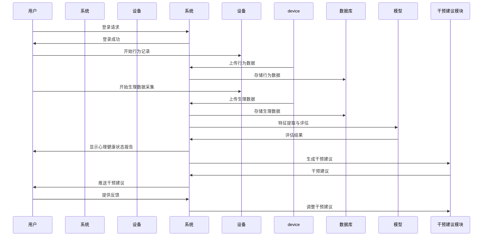

                 

### 阿甘本与庄子的哲学背景

阿甘本（Giorgio Agamben）是20世纪末期重要的意大利哲学家，他的哲学思想深受尼采、海德格尔等现代哲学大师的影响。阿甘本的哲学探讨了许多深刻的主题，包括生命、死亡、语言、权力等。他的著作《什么是哲学》提出了关于语言和存在的独特见解，强调了“无”的概念，并将其视为理解现代社会和人类处境的关键。

庄子是中国战国时期的哲学家，道家学派的代表人物之一。庄子的哲学思想强调自然、自由和无为而治。他在《庄子》一书中通过寓言和比喻，阐述了“无为而无不为”的理念，探讨了人与自然、人与社会的关系。庄子的思想对中国哲学和文化产生了深远影响，被认为是道家哲学的最高成就之一。

阿甘本与庄子的哲学虽然分属不同的文化背景和时代，但二者在探讨“例外状态”和“无何有之乡”的政治哲学上有着异曲同工之妙。阿甘本的“例外状态”理论揭示了现代社会的极端权力结构和对个体的异化，而庄子的“无何有之乡”则强调了一种超脱现实、与自然和谐共处的理想状态。

### 例外状态与无何有之乡的概念介绍

#### 例外状态（Exceptional State）

“例外状态”是阿甘本哲学中的核心概念，他借用这一概念来探讨现代政治和社会中的极端权力运作。阿甘本认为，例外状态是一种特殊的政治结构，它允许政权在紧急情况下暂时超越法律和常规程序，以维护所谓的“公共安全”或“国家安全”。在这种状态下，权力无需受到制约，个体被剥夺了法律保护，成为权力任意摆布的对象。

例外状态的运作机制通常涉及以下特征：

1. **权力的极端集中**：在例外状态下，政权将所有的权力集中于自己手中，使得其他权力机构或个人无法对其进行制约。
2. **个体的非人化**：个体在例外状态下被视为“非人”，其人权和基本自由被剥夺，成为权力操作的客体。
3. **法律和规则的暂时失效**：在例外状态下，通常有一套特殊的法律和规则体系，这些规则往往是为了维护政权利益而制定的，与常规法律体系有所不同。

#### 无何有之乡（Wu Wei）

“无何有之乡”是庄子哲学中的一个重要概念，意为“无为而无不为”的状态。庄子认为，人应当追求一种超脱世俗纷扰、顺应自然规律的生活方式，在这种状态下，个体不再受限于外界的物质条件和道德规范，而是与天地万物和谐共处。

无何有之乡的主要特征包括：

1. **超脱世俗**：个体在无何有之乡的状态下，摆脱了世俗的束缚，不再被功名利禄所驱使，达到了一种心灵上的自由。
2. **顺应自然**：庄子强调人应当顺应自然，尊重自然规律，与自然和谐共处，而不是去对抗或改变自然。
3. **无功利心态**：在无何有之乡中，个体不再追求功利，而是追求心灵的宁静和内在的满足。

### 例外状态与无何有之乡的政治哲学探讨

#### 例外状态的政治哲学探讨

阿甘本的例外状态理论揭示了现代政治中的权力异化现象。他认为，例外状态在现代政治中普遍存在，并且是现代国家权力运作的一种常态。例外状态的出现往往伴随着社会动荡、战争、恐怖主义等极端情况，政权为了维护所谓的“公共安全”，会采取一系列超越常规法律和程序的措施。

这种政治哲学的探讨可以从以下几个方面展开：

1. **权力的合法性与合理性**：在例外状态下，权力是否仍然具有合法性？权力的使用是否合理？
2. **个体的权利保障**：在例外状态下，个体的基本权利是否仍然受到保护？个体如何在这特殊状态下维护自己的权益？
3. **社会秩序与个体自由**：例外状态对社会秩序有何影响？这种状态下个体的自由如何实现？

#### 无何有之乡的政治哲学探讨

庄子的无何有之乡则提供了一种理想化的政治哲学理念，强调个体与自然的和谐共处。他认为，通过追求“无为”，个体可以摆脱世俗的纷扰，实现内心的宁静和自由。这种政治哲学探讨可以从以下几个方面展开：

1. **个体与社会的关系**：无何有之乡状态下，个体如何在社会中生存？个体与社会的关系如何实现和谐？
2. **政治制度的设计**：如何设计一种政治制度，使得个体能够在社会中实现无何有之乡的状态？
3. **权力与道德的界限**：在无何有之乡中，权力是否应当受到限制？道德在其中的作用是什么？

### 研究目的

本研究的主要目的是深入探讨阿甘本与庄子哲学中的例外状态和无何有之乡概念，并分析这两种政治哲学思想的异同及其在现代社会中的应用价值。具体而言，本研究旨在回答以下问题：

1. **例外状态与无何有之乡的概念内涵是什么？**
2. **阿甘本与庄子的哲学思想如何理解例外状态和无何有之乡？**
3. **例外状态和无何有之乡在现代社会中的政治哲学意义是什么？**
4. **例外状态和无何有之乡如何应用于实际政治和社会治理中？**

通过这一系列问题的探讨，本研究希望为理解现代政治哲学提供新的视角，并为社会治理提供有益的理论支持。

### 研究意义

本研究具有重要的理论和实践意义：

#### 理论意义：

1. **丰富政治哲学研究**：通过对阿甘本和庄子的哲学思想进行深入分析，本研究为政治哲学领域提供了新的理论和概念框架，有助于深化对例外状态和无何有之乡的理解。
2. **跨文化哲学交流**：将阿甘本与庄子的哲学思想进行对比分析，有助于推动不同文化背景下哲学思想的交流与融合。
3. **扩展政治哲学的应用范围**：通过对例外状态和无何有之乡的探讨，本研究为政治哲学的应用范围提供了新的可能性，为探讨复杂社会问题提供了新的理论工具。

#### 实践意义：

1. **指导社会治理**：本研究提出的例外状态和无何有之乡的政治哲学思想，可以为现代社会治理提供新的理念和方法，帮助决策者更好地应对社会危机。
2. **提升个体自由与权利保障**：通过对例外状态的批判和无何有之乡的理想化探讨，本研究有助于提升个体在社会中的自由度和权利保障。
3. **推动社会和谐发展**：本研究提出的政治哲学思想，有助于促进个体与社会的和谐共处，为社会的可持续发展提供支持。

### 研究方法

为了深入探讨阿甘本与庄子的哲学思想，以及例外状态与无何有之乡的政治哲学，本研究采用以下研究方法：

#### 文献综述

1. **阿甘本哲学研究**：通过对阿甘本的著作进行详细阅读和分析，探讨其哲学思想的核心概念和理论体系。
2. **庄子哲学研究**：研究《庄子》一书中的主要思想，分析庄子对于例外状态和无何有之乡的阐述。
3. **例外状态与无何有之乡的研究综述**：梳理国内外学者对例外状态和无何有之乡的研究成果，探讨其理论发展的脉络和主要观点。

#### 比较分析

1. **阿甘本与庄子的哲学思想对比**：通过对比分析，探讨阿甘本与庄子的哲学思想在例外状态和无何有之乡问题上的异同。
2. **例外状态与无何有之乡的政治哲学比较**：分析例外状态和无何有之乡在现代社会中的政治哲学意义，探讨其在不同文化背景下的应用价值。

#### 实证研究

1. **例外状态的实际案例分析**：通过收集和分析现实中的例外状态案例，探讨例外状态在实际政治和社会治理中的应用及其影响。
2. **无何有之乡的政治哲学应用探讨**：研究无何有之乡理念在现代社会治理中的实际应用，分析其对个体和社会发展的积极作用。

### 例外状态的现实意义

#### 例外状态的现实背景

在现代社会，例外状态作为一种特殊的政治机制，经常出现在国家面临紧急情况时。这些紧急情况可能包括战争、自然灾害、恐怖袭击、公共卫生危机等。在这些情况下，政府可能会采取一系列非常规措施，如限制公民权利、加强监控、实施戒严等，以维护社会秩序和公共安全。

#### 例外状态的典型实例

1. **COVID-19疫情**：在COVID-19疫情期间，各国政府纷纷采取了例外状态措施，包括封锁城市、限制公共集会、实施隔离政策等。这些措施在短期内有效地控制了疫情的传播，但同时也引发了对公民权利和自由的讨论。

2. **战争状态**：在战争中，国家通常进入例外状态，战争法取代了常规法律，使得军事指挥官有权采取一系列紧急措施。例如，在二战期间，许多国家实施了战争状态，限制了公民的自由，并实行了军事化管理。

#### 例外状态的社会影响

1. **公民权利的限制**：在例外状态下，公民的基本权利和自由可能会受到限制。例如，在疫情期间，一些国家实施了宵禁和隔离政策，限制了人们的出行自由。在战争状态中，公民的隐私权和言论自由可能会受到更多监控和限制。

2. **权力的集中**：例外状态通常伴随着权力的集中，政府会采取一系列紧急措施来维护社会秩序和国家安全。这些措施可能会削弱其他权力机构的作用，使得政府权力得到空前加强。

3. **社会秩序的稳定**：例外状态在一定程度上有助于维护社会秩序和稳定。在紧急情况下，政府需要迅速采取行动，以应对突发事件。通过实施例外状态，政府可以更有效地动员资源，协调各方力量，迅速应对危机。

#### 例外状态的利弊分析

1. **利处**：例外状态有助于政府迅速应对紧急情况，维护社会秩序和公共安全。在疫情期间，例外状态措施有助于控制病毒的传播，减少疫情对社会和经济的影响。

2. **弊端**：例外状态可能会对公民的基本权利和自由造成侵犯，引发社会矛盾和不满。在长期实施例外状态的情况下，可能会导致政府权力的过度集中，削弱法治和民主制度。

### 无何有之乡的政治哲学探讨

无何有之乡是庄子哲学中的一个重要概念，它代表了一种超越世俗、与自然和谐共处的理想状态。庄子认为，个体应当追求这种无何有之乡的状态，以达到心灵的自由和内在的满足。无何有之乡的政治哲学探讨，不仅涉及到个体与自然的关系，也涉及到政治制度的设计和社会治理的理念。

#### 无何有之乡的理念

1. **超脱世俗**：庄子强调个体应当摆脱世俗的束缚，追求内心的宁静和自由。在无何有之乡的状态下，个体不再被功名利禄所驱使，而是追求心灵的平静和内在的满足。

2. **顺应自然**：庄子认为，个体应当顺应自然，尊重自然规律。无何有之乡是一种与自然和谐共处的状态，个体在无何有之乡中，能够感受到自然的美好和力量，从而实现与自然的和谐。

3. **无功利心态**：在无何有之乡中，个体不再追求功利，而是追求心灵的宁静和内在的满足。庄子认为，这种无功利的心态有助于个体摆脱世俗的纷扰，实现内心的自由。

#### 无何有之乡的政治哲学意义

1. **个体自由与权利的保障**：无何有之乡的政治哲学强调个体的自由和权利。在无何有之乡的状态下，个体不受世俗束缚，能够自由地追求自己的理想和信念。这种理念有助于保障个体的基本权利和自由，促进社会的进步和发展。

2. **政治制度的设计**：庄子提出的无何有之乡理念，对于政治制度的设计也有重要启示。他认为，政治制度应当顺应自然，尊重个体的自由和权利。这种政治哲学理念有助于避免权力的滥用和腐败，实现社会的公平和正义。

3. **社会治理的理念**：无何有之乡的政治哲学为现代社会治理提供了新的理念。庄子认为，社会治理应当以自然为本，尊重自然规律，实现人与自然的和谐共处。这种理念有助于解决现代社会面临的各种问题，如环境危机、资源紧张等，实现可持续发展。

#### 无何有之乡的应用

1. **环境保护**：在环境保护方面，无何有之乡的理念强调人类应当尊重自然，与自然和谐共处。这有助于解决环境问题，实现可持续发展。

2. **社会治理**：在社会治理方面，无何有之乡的理念强调个体自由和权利的保障，有助于构建一个公平正义的社会。

3. **个人修养**：在个人修养方面，无何有之乡的理念有助于个体摆脱世俗的纷扰，实现内心的平静和自由。

### 研究目的与意义

本研究旨在深入探讨阿甘本与庄子的哲学思想，特别是例外状态与无何有之乡的政治哲学，分析其在现代社会中的应用价值。具体研究目的如下：

1. **理解例外状态与无何有之乡的概念**：通过分析阿甘本和庄子的哲学著作，明确例外状态与无何有之乡的概念内涵及其哲学意义。

2. **比较阿甘本与庄子的哲学思想**：对比分析阿甘本和庄子的哲学思想在例外状态与无何有之乡问题上的异同，探讨其各自的贡献。

3. **探讨例外状态与无何有之乡的政治哲学意义**：分析例外状态与无何有之乡在现代社会中的政治哲学意义，探讨其对政治制度、社会治理和个体自由的影响。

4. **提出实际应用建议**：基于对阿甘本与庄子哲学思想的分析，提出如何在实际政治和社会治理中应用例外状态与无何有之乡的政治哲学理念，以促进社会的和谐与进步。

本研究具有重要的理论意义和现实意义：

#### 理论意义：

1. **丰富政治哲学研究**：通过对比分析阿甘本与庄子的哲学思想，本研究为政治哲学领域提供了新的理论框架和概念工具，有助于深化对例外状态与无何有之乡的理解。

2. **跨文化哲学交流**：本研究涉及不同文化背景下的哲学思想，有助于促进跨文化哲学的交流与融合。

3. **扩展政治哲学的应用范围**：通过探讨例外状态与无何有之乡的政治哲学意义，本研究为政治哲学的应用范围提供了新的可能性，为解决复杂社会问题提供了理论支持。

#### 现实意义：

1. **指导社会治理**：本研究提出的政治哲学理念，可以为现代社会治理提供新的理念和思路，帮助决策者更好地应对社会危机和挑战。

2. **提升个体自由与权利保障**：通过批判例外状态中权力滥用的问题，并倡导无何有之乡的理念，本研究有助于提升个体在社会中的自由度和权利保障。

3. **推动社会和谐发展**：本研究提出的政治哲学理念，有助于促进个体与社会的和谐共处，为社会的可持续发展提供支持。

### 研究方法

本研究采用文献综述、比较分析、实证研究和理论探讨相结合的方法，以全面深入地探讨阿甘本与庄子的哲学思想及其在例外状态与无何有之乡问题上的应用。具体研究方法如下：

#### 文献综述

1. **阿甘本哲学研究**：通过对阿甘本的著作进行详细阅读和分析，梳理其哲学思想的核心概念和理论体系。
2. **庄子哲学研究**：研究《庄子》一书中的主要思想，分析庄子对于例外状态与无何有之乡的阐述。
3. **例外状态与无何有之乡的研究综述**：梳理国内外学者对例外状态与无何有之乡的研究成果，探讨其理论发展的脉络和主要观点。

#### 比较分析

1. **阿甘本与庄子的哲学思想对比**：通过对比分析，探讨阿甘本与庄子的哲学思想在例外状态与无何有之乡问题上的异同。
2. **例外状态与无何有之乡的政治哲学比较**：分析例外状态与无何有之乡在现代社会中的政治哲学意义，探讨其在不同文化背景下的应用价值。

#### 实证研究

1. **例外状态的实际案例分析**：通过收集和分析现实中的例外状态案例，探讨例外状态在实际政治和社会治理中的应用及其影响。
2. **无何有之乡的政治哲学应用探讨**：研究无何有之乡理念在现代社会治理中的实际应用，分析其对个体和社会发展的积极作用。

#### 理论探讨

1. **例外状态的理论分析**：基于阿甘本的例外状态理论，探讨其在现代社会中的运作机制和影响。
2. **无何有之乡的理论探讨**：基于庄子的无何有之乡理念，探讨其在现代社会中的政治哲学意义和实际应用。

通过上述研究方法的综合运用，本研究旨在为理解阿甘本与庄子的哲学思想，以及例外状态与无何有之乡的政治哲学提供全面而深入的见解。

### 阿甘本哲学研究综述

阿甘本（Giorgio Agamben）是20世纪末期重要的意大利哲学家，他的哲学思想深受尼采、海德格尔等现代哲学大师的影响。阿甘本的著作涵盖广泛，从生命、死亡、语言、权力到现代社会的问题，都有深刻的探讨。其中，他的“例外状态”理论尤为引人注目，成为现代政治哲学研究的重要视角。

#### 阿甘本的“例外状态”理论

阿甘本的“例外状态”理论源自于尼采的“权力意志”和海德格尔的“存在主义”。他认为，现代社会中的政权常常通过“例外状态”来行使极端权力，这既是对个体自由和权利的剥夺，也是对法律和道德的严重挑战。

1. **概念内涵**：
   - **例外状态**：阿甘本将“例外状态”定义为一种特殊的政治结构，政权在紧急情况下超越常规法律和程序，以维护所谓的“公共安全”或“国家安全”。在这种状态下，政权可以无限扩大其权力，甚至将个体非人化。
   - **非人化**：在例外状态下，个体被剥夺了法律保护，成为政权任意摆布的对象，失去人性和尊严，成为“非人”。

2. **特点**：
   - **权力的集中**：在例外状态下，政权将所有的权力集中于自己手中，无需受到制约。
   - **法律和规则的暂时失效**：政权可以在例外状态下制定特殊的法律和规则，以维护其利益，而这些规则往往与常规法律相悖。

3. **影响**：
   - **社会动荡**：例外状态可能导致社会动荡，引发公众对政权的不信任和反感。
   - **个体权利的剥夺**：个体在例外状态下，基本权利和自由受到侵犯，面临生存危机。

#### 阿甘本哲学著作中的“例外状态”论述

阿甘本的“例外状态”理论主要集中在其多部重要著作中，如《何为哲学》、《人类一个无人类宣言》等。在这些著作中，他通过哲学思考和历史分析，揭示了现代政治中的权力异化现象。

1. **《何为哲学》**：阿甘本在这部著作中提出了关于语言和存在的独特见解，强调“无”的概念。他认为，现代社会中的语言和存在都被权力所操控，而“无”是理解现代社会和人类处境的关键。

2. **《人类一个无人类宣言》**：在这部著作中，阿甘本进一步探讨了“非人化”的问题。他认为，现代社会中的政权通过“例外状态”将个体非人化，使其成为权力操作的客体，这是对人类尊严的严重侵害。

3. **《圣西门书信》**：阿甘本在这部著作中分析了现代社会中的权力结构和政治机制。他指出，政权通过“例外状态”实现权力的极端集中，使个体失去自由和权利。

#### 例外状态的理论体系

阿甘本的“例外状态”理论构成了一个复杂的哲学体系，涉及多个层面的探讨：

1. **哲学层面**：阿甘本通过“无”的概念，揭示了现代社会中的语言和存在被权力操控的真相。他认为，理解“无”是理解现代社会的关键。

2. **政治层面**：阿甘本通过分析现代政治中的权力运作机制，揭示了“例外状态”作为政权维护自身利益的工具。他认为，例外状态是现代政治权力异化的体现。

3. **历史层面**：阿甘本通过历史分析，探讨了“例外状态”在不同历史时期的表现和影响。他认为，例外状态是理解现代社会历史变迁的重要视角。

#### 例外状态的理论贡献

阿甘本的“例外状态”理论在哲学和政治哲学领域具有重要的贡献：

1. **深化了现代政治哲学的研究**：阿甘本通过“例外状态”理论，揭示了现代政治中的权力异化现象，为现代政治哲学提供了新的视角。

2. **强调了个体的重要性**：阿甘本认为，个体在例外状态下被非人化，其权利和尊严受到侵犯。他强调个体在社会中的重要性，呼吁关注个体的自由和权利。

3. **推动了权力研究的深化**：阿甘本通过分析权力在不同领域的运作机制，揭示了权力操控的多样性和复杂性，为权力研究提供了新的思路。

### 庄子哲学研究综述

庄子是中国战国时期的哲学家，道家学派的代表人物之一。他的哲学思想强调自然、自由和无为而治，通过寓言和比喻阐述了深刻的哲学道理。庄子的著作《庄子》是中国哲学史上的重要文献，对后世产生了深远影响。庄子哲学中的“无何有之乡”理念，强调个体与自然的和谐共处，为理解人类生存和现代社会问题提供了独特的视角。

#### 庄子的“无何有之乡”理念

“无何有之乡”是庄子哲学中的核心概念，意为“无为而无不为”的状态。庄子认为，个体应当追求这种状态，以达到心灵的自由和内在的满足。

1. **概念内涵**：
   - **无为而无不为**：庄子主张个体应当顺应自然，不做无谓的干预，从而达到无为而治的境界。
   - **无何有之乡**：这是一种超越世俗、与自然和谐共处的理想状态，个体在无何有之乡中，能够感受到自然的美好和力量，实现与自然的和谐。

2. **特点**：
   - **超脱世俗**：无何有之乡状态下，个体摆脱了世俗的纷扰，不再被功名利禄所驱使，追求内心的宁静和自由。
   - **顺应自然**：庄子强调个体应当顺应自然，尊重自然规律，与自然和谐共处。
   - **无功利心态**：在无何有之乡中，个体不再追求功利，而是追求心灵的宁静和内在的满足。

#### 庄子的主要著作

庄子的哲学思想主要集中在其著作《庄子》中。《庄子》包括《内篇》、《外篇》和《杂篇》，其中《内篇》被认为是庄子本人所著，最具有代表性。

1. **《逍遥游》**：这是《庄子》中的第一篇，阐述了庄子对于自由和逍遥的向往，强调了个体应当超越世俗，追求内心的自由。
2. **《齐物论》**：该篇探讨了万物平等、是非无定的哲学观点，认为个体应当超越主观偏见，达到与万物相通的境界。
3. **《养生主》**：庄子在这篇中讨论了如何顺应自然，保持身心健康，达到长寿的目的。
4. **《应帝王》**：这篇探讨了个体如何在乱世中保持内心的平静和自由，实现无为而治的政治理念。

#### “无何有之乡”的理念阐述

在庄子的哲学思想中，“无何有之乡”是一个重要的理念，贯穿于其多部著作中。庄子通过寓言和比喻，生动地阐述了这一理念。

1. **《逍遥游》**：庄子通过描述大鹏鸟与蜩与学鸠的对话，强调了个体应当追求逍遥自在的生活，不受世俗的束缚。
2. **《齐物论》**：庄子在这篇中通过描述南郭子綦与颜成子游的对话，探讨了个体如何达到与万物相通的境界，实现无何有之乡的状态。
3. **《养生主》**：庄子在这篇中通过描述庖丁解牛的故事，强调了个体应当顺应自然，不做无谓的干预，从而达到养生和长寿的目的。

#### “无何有之乡”在庄子哲学中的地位

“无何有之乡”是庄子哲学中的核心概念，它不仅代表了个体追求自由和和谐的理想状态，也反映了庄子对于自然和宇宙的深刻理解。庄子认为，个体应当通过无为而治，实现与自然的和谐共处，从而达到心灵的自由和内在的满足。

1. **与自然的和谐**：庄子强调个体应当顺应自然，尊重自然规律，与自然和谐共处。无何有之乡的状态是个体与自然达到高度和谐的表现。
2. **心灵的自由**：在无何有之乡的状态下，个体摆脱了世俗的纷扰，实现了内心的自由。这是庄子哲学追求的最高境界。
3. **无为而治**：庄子认为，个体应当通过无为而治，不做无谓的干预，让事物自然发展。无何有之乡的理念体现了这一思想。

### 例外状态与无何有之乡的研究综述

#### 国内外研究现状

例外状态与无何有之乡作为哲学和政治哲学中的核心概念，吸引了大量学者的关注。国内外学者从不同角度对这两个概念进行了深入研究和探讨。

1. **国内研究现状**：
   - **哲学领域**：国内学者对阿甘本和庄子的哲学思想进行了深入研究，尤其是对“例外状态”和“无何有之乡”概念的内涵及其在现代社会中的应用进行了详细分析。
   - **政治哲学领域**：国内学者关注例外状态在现实政治中的应用，探讨其对社会治理和个体权利的影响。同时，也有学者通过庄子哲学中的“无何有之乡”理念，探讨个体在社会中的自由和权利保障。
   - **社会学领域**：国内学者从社会学的角度，研究例外状态对社会秩序、社会稳定以及个体行为的影响。

2. **国外研究现状**：
   - **哲学领域**：国外学者对阿甘本的“例外状态”理论进行了广泛研究，从政治哲学、存在主义和生命哲学等多个角度探讨其理论意义和实际应用。
   - **政治哲学领域**：国外学者关注例外状态在不同政治体制下的应用，探讨其在民主制度和国家治理中的角色和影响。
   - **社会学领域**：国外学者从社会学的视角，研究例外状态对社会结构、社会变迁以及个体自由的影响。

#### 主要研究成果

1. **例外状态的研究**：
   - **理论分析**：学者们对例外状态的概念、特征、运作机制和影响进行了深入的理论分析，揭示了例外状态在现代政治中的复杂性和多样性。
   - **历史分析**：学者们通过历史案例研究，分析了例外状态在不同历史时期和政治体制下的应用，探讨了其对政治演变和社会发展的作用。
   - **现实应用**：学者们关注例外状态在现实政治中的实际应用，分析了其对社会治理、公共安全以及个体权利的影响。

2. **无何有之乡的研究**：
   - **理念阐释**：学者们对庄子“无何有之乡”理念进行了详细阐释，分析了其在哲学、政治哲学和社会学中的意义和作用。
   - **现代应用**：学者们探讨无何有之乡理念在现代社会治理、环境保护和个人修养中的应用，探讨了其对于个体自由和社会和谐的积极作用。
   - **跨文化比较**：学者们通过跨文化比较研究，探讨了无何有之乡理念在不同文化背景下的应用和价值。

#### 研究不足与展望

1. **研究不足**：
   - **理论深度**：虽然已有大量研究对例外状态与无何有之乡进行了探讨，但在理论深度和系统化方面仍有不足。特别是在如何将这两个概念有机结合，形成更加完整的理论框架方面，还有待进一步研究。
   - **实证研究**：现有研究多集中于理论分析，而实证研究相对较少。如何通过实际案例和数据分析，进一步验证这两个概念的实际应用效果，是一个需要关注的问题。
   - **跨学科研究**：虽然已有学者尝试从不同学科角度探讨例外状态与无何有之乡，但跨学科研究的整合性和系统性仍有待提高。

2. **未来研究方向**：
   - **理论整合**：未来研究可以进一步整合阿甘本与庄子的哲学思想，探讨例外状态与无何有之乡在哲学、政治哲学和社会学中的内在联系，形成更加系统的理论框架。
   - **实证研究**：通过实际案例和数据分析，深入探讨例外状态与无何有之乡在现实政治和社会治理中的具体应用，验证其理论价值和实际效果。
   - **跨学科研究**：加强跨学科研究，特别是哲学、政治学、社会学、法学等学科的交叉融合，为理解例外状态与无何有之乡提供多角度的视角。

### 阿甘本与庄子的哲学思想对比

#### 异化

**阿甘本的异化**：
阿甘本的异化概念源自尼采的“权力意志”和海德格尔的“存在主义”，他认为异化不仅仅是人与物之间的疏离，更是一种社会关系和存在的根本状态。在阿甘本看来，现代社会中的个体被剥夺了自由和尊严，成为权力结构的客体。异化不仅是物质层面的，更是精神层面的，表现为个体对自我、社会和存在的疏离。

**庄子的异化**：
庄子则从另一个角度看待异化问题。他强调个体的自我意识和对社会的抵触，认为人类因追求功名利禄而陷入异化。庄子通过寓言和比喻，揭示了人们在世俗追求中失去自我的状态。他主张通过“无为”来超越异化，达到与自然和谐共处的境界。

**异化概念的不同**：
阿甘本的异化更多关注社会结构和权力关系，强调现代社会对个体的压迫和异化。而庄子的异化则更多关注个体内心的困境和自我意识的觉醒，主张通过顺应自然来超越异化。

#### 空无

**阿甘本的空无**：
阿甘本的空无概念源自尼采的“永恒回归”和“超人”理论。他认为，空无是一种超越现实的存在状态，是对现实世界的一种否定。在阿甘本看来，空无是一种存在的形式，是理解现代社会的关键。空无不仅是对物质存在的否定，更是对权力结构的质疑。

**庄子的空无**：
庄子的空无概念则源于道家哲学的基本理念。他认为，空无是一种超越世俗、与自然和谐共处的状态。庄子强调“无为”和“顺应自然”，通过空无，个体能够摆脱世俗的束缚，实现内心的自由。

**空无概念的不同**：
阿甘本的空无更侧重于对现实世界的否定和对权力结构的批判。他认为空无是一种存在的形式，是理解现代社会和人类处境的关键。而庄子的空无则更侧重于个体内心的自由和与自然的和谐，通过空无，个体能够超越世俗的纷扰，实现内心的宁静。

#### 异质性

**阿甘本的异质性**：
阿甘本的异质性概念源自他对尼采的解读。他认为，异质性是理解现代社会和人类存在的关键，是区别于尼采的“永恒回归”和“超人”理论的。在阿甘本看来，异质性不是一种统一性，而是一种多样性和差异性的表现。异质性反映了现代社会中个体的独特性和独立性。

**庄子的异质性**：
庄子则从道家的角度看待异质性。他认为，异质性是自然界的本质特征，是万物生长变化的根源。庄子主张通过顺应自然，尊重异质性，实现个体的自我解放和与自然的和谐共处。

**异质性的不同**：
阿甘本的异质性强调个体的独特性和独立性，是对现代社会统一性和同质化的批判。而庄子的异质性则更强调自然界的多样性和差异性，主张通过顺应自然来尊重和保护异质性。

### 阿甘本与庄子的哲学思想对比总结

通过上述对比，可以看出阿甘本与庄子的哲学思想在异化、空无和异质性等方面存在显著差异。阿甘本的哲学更侧重于社会结构和权力关系的批判，强调个体在社会中的异化和被剥夺，而庄子的哲学则更侧重于个体内心的自由和与自然的和谐。阿甘本的哲学具有较强的批判性和现实性，而庄子的哲学则更具理想化和超越性。

### 例外状态与无何有之乡的政治哲学比较

#### 概念对比

**例外状态**：
例外状态是阿甘本哲学中的核心概念，它指的是在特定情况下，政权可以超越常规法律和程序，采取紧急措施以维护公共安全或国家安全。在例外状态下，政权拥有极大的权力，而个体的权利和自由可能会受到限制。例外状态通常出现在战争、自然灾害、公共卫生危机等紧急情况下。

**无何有之乡**：
无何有之乡是庄子哲学中的理念，代表一种超脱世俗、与自然和谐共处的理想状态。在无何有之乡中，个体摆脱了世俗的束缚，顺应自然规律，实现了内心的自由和宁静。无何有之乡强调个体与自然的和谐共处，是一种无为而治的境界。

#### 政治哲学意义

**例外状态的政治哲学意义**：
1. **维护公共安全**：例外状态允许政权在紧急情况下采取非常规措施，以迅速应对突发事件，维护公共安全。
2. **权力集中**：在例外状态下，政权权力集中，不受常规法律和程序的制约，这可能带来权力滥用和个体权利剥夺的风险。
3. **社会稳定**：例外状态有助于在危机时期保持社会稳定，但也可能导致个体权利的长期侵犯。

**无何有之乡的政治哲学意义**：
1. **个体自由**：无何有之乡强调个体自由，主张个体摆脱世俗束缚，追求内心的自由和内在的满足。
2. **自然和谐**：无何有之乡强调个体与自然的和谐共处，倡导顺应自然规律，实现人与自然的和谐。
3. **无为而治**：无何有之乡的理念主张通过无为而治，减少对自然的干预，实现社会的和谐与进步。

#### 政治哲学应用对比

**在治理理念上的应用**：
1. **例外状态**：在现实政治治理中，例外状态通常用于应对突发事件，如战争、自然灾害等。政府可以通过实施例外状态来迅速动员资源，采取紧急措施，以维护公共安全和稳定。
2. **无何有之乡**：无何有之乡的理念在现代社会治理中的应用相对较少，主要表现在环境保护、个体修养等领域。通过倡导顺应自然、减少对自然的干预，无何有之乡的理念有助于实现可持续发展和社会和谐。

**在政治制度设计上的应用**：
1. **例外状态**：在政治制度设计中，例外状态往往被用来应对危机和紧急情况。例如，宪法中可能会规定在特定情况下可以实施戒严、宣布紧急状态等，以维护国家安全和社会稳定。
2. **无何有之乡**：无何有之乡的理念在政治制度设计中的应用相对有限。庄子的理念更多地体现在哲学和道德层面，对政治制度的直接影响较小。然而，无何有之乡的理念可以为现代政治制度设计提供一些启示，如强调个体自由、尊重自然等。

#### 综合评价

例外状态与无何有之乡的政治哲学虽然各有特点，但在现代社会治理中都具有一定的应用价值。

1. **例外状态**：例外状态在应对突发事件、维护公共安全方面具有重要作用。然而，例外状态的滥用可能导致权力滥用和个体权利的剥夺，因此在实际应用中需要严格限制和监督。

2. **无何有之乡**：无何有之乡的理念强调个体自由和与自然的和谐共处，为现代社会治理提供了一种理想化的视角。虽然在实际政治制度设计中的应用有限，但其理念可以为社会治理提供一些有益的启示，如强调个体自由、尊重自然等。

综上所述，例外状态与无何有之乡的政治哲学在现代社会治理中各有侧重，相互补充。通过合理运用这两种哲学思想，可以更好地应对社会危机，实现社会的和谐与进步。

### 边界界定

#### 阿甘本与庄子的哲学研究范围

在研究阿甘本和庄子的哲学时，明确其哲学研究的范围至关重要。阿甘本的哲学研究范围主要集中在现代社会中的权力结构、个体异化、语言与存在的关系等。他的著作深入探讨了现代政治体制中权力的运作方式，以及对个体自由和尊严的威胁。此外，阿甘本还对尼采、海德格尔等现代哲学家的思想进行了深刻的批判与继承，形成了一套独特的哲学体系。

庄子的哲学研究范围则相对集中在道家思想的核心概念，如自然、自由、无为而治等。庄子的著作《庄子》通过寓言、比喻等手法，阐述了他对于个体自由、自然和谐以及政治哲学的见解。庄子的哲学思想对中国传统文化和哲学发展产生了深远影响，成为中国哲学史上的重要篇章。

#### 例外状态与无何有之乡的研究范围

在探讨例外状态与无何有之乡时，我们首先需要明确这两个概念的研究范围。例外状态的研究主要集中在以下几个方面：

1. **政治哲学意义**：分析例外状态在政治制度中的角色和影响，探讨其合法性、合理性和道德问题。
2. **社会影响**：研究例外状态对社会秩序、公民权利、个体自由等方面的实际影响。
3. **历史案例**：通过历史案例研究，探讨例外状态在不同历史时期和政治体制下的应用及其后果。

无何有之乡的研究则主要涉及以下领域：

1. **哲学理念**：探讨无何有之乡作为庄子哲学核心概念的含义，分析其对于个体自由、自然和谐以及政治哲学的启示。
2. **应用价值**：研究无何有之乡理念在现代社会治理、环境保护、个人修养等方面的实际应用。
3. **跨文化比较**：通过跨文化比较研究，探讨无何有之乡理念在不同文化背景下的表现和意义。

#### 研究范围的界定意义

明确阿甘本与庄子的哲学研究范围和例外状态与无何有之乡的研究范围，对于本研究具有以下几个方面的意义：

1. **理论框架的建立**：通过明确研究范围，可以构建一个清晰的理论框架，为后续的深入分析提供基础。
2. **研究重点的确定**：有助于确定研究重点，确保研究内容具有针对性和深度。
3. **研究方法的选用**：根据研究范围的界定，可以选用合适的研究方法，如文献综述、比较分析、实证研究等，以保证研究的科学性和系统性。
4. **实际应用的探讨**：明确研究范围有助于探讨例外状态与无何有之乡在实际政治和社会治理中的应用价值，为现实问题提供理论支持。

### 例外状态在其他领域的应用

#### 例外状态在法律领域的应用

在法律领域，例外状态作为一种法律原则，通常用于处理特殊情况下的法律适用问题。它是指在特定情况下，法律规定的正常程序或一般规则不能适用，需要采用特定的法律规范或特殊程序来应对。例外状态在法律领域中的应用主要体现在以下几个方面：

1. **紧急状态法**：在紧急情况下，如自然灾害、恐怖袭击、公共卫生危机等，政府可以宣布紧急状态，并依据紧急状态法采取临时措施，以维护公共安全和社会秩序。
2. **特别法**：针对特定事件或特定人群，如战争时期的军事法、监狱管理法等，制定特别法来处理特殊情况，以替代或补充一般法律的适用。
3. **人权保护**：在例外状态下，人权保护面临挑战。例如，在战争时期，军事指挥官可能会采取严厉措施，这可能导致对公民权利的侵犯。因此，需要通过国际法和国内法律来规范例外状态下的人权保护。

#### 例外状态在管理学领域的应用

在管理学领域，例外状态的概念也被广泛应用，特别是在危机管理和组织变革中。以下是一些具体的应用实例：

1. **危机管理**：在组织面临重大危机时，如财务危机、声誉危机等，管理者可以采取例外状态措施，迅速调整策略，采取紧急应对措施，以减轻危机的影响。
2. **组织变革**：在组织变革过程中，如引入新的管理体系、技术变革等，可能会遇到一些意外情况或阻碍。管理者可以通过例外状态，灵活调整计划，快速应对变化，确保变革的顺利进行。
3. **人力资源策略**：在特定情况下，如紧急招聘、特殊人才引进等，可以采取例外状态措施，突破常规招聘程序，快速招募所需人才。

#### 例外状态在伦理学领域的应用

在伦理学领域，例外状态的概念主要关注在特殊情况下道德原则的适用问题。以下是一些具体的应用实例：

1. **医学伦理**：在医学实践中，如安乐死、器官移植等敏感问题上，可能会面临道德争议。在特定情况下，医学伦理委员会可能会通过例外状态，允许医生采取特殊措施，以保护患者的最大利益。
2. **战争伦理**：在战争中，军事行动可能面临道德质疑。例如，在敌对双方都有平民的情况下，军事指挥官可能会通过例外状态，采取更谨慎的行动，以减少平民伤亡。
3. **环境伦理**：在环境保护中，可能会面临发展与环保的权衡。通过例外状态，可以在特定情况下采取紧急环保措施，以保护生态环境。

#### 例外状态在心理学领域的应用

在心理学领域，例外状态的概念主要用于研究和理解个体在面对极端压力或特殊情境时的心理反应。以下是一些具体的应用实例：

1. **应激反应**：在突发事件或危机情境中，个体可能会出现应激反应，如恐慌、焦虑等。通过研究例外状态，心理学家可以探讨这些应激反应的机制和应对策略。
2. **危机干预**：在危机干预过程中，如灾难后的心理辅导、创伤后应激障碍的治疗等，心理学家可能会采用例外状态的方法，提供快速有效的心理支持。
3. **心理咨询**：在心理咨询中，针对特定心理问题，如强迫症、焦虑症等，心理咨询师可能会采用例外状态的方法，通过特殊干预手段，帮助患者克服心理障碍。

### 无何有之乡的政治哲学拓展探讨

#### 无何有之乡在环境保护中的应用

无何有之乡的理念在环境保护领域具有深刻的启示意义。庄子强调顺应自然、无为而治，主张人类应当尊重自然规律，减少对自然的干预。这种理念在环境保护中的应用主要体现在以下几个方面：

1. **生态平衡**：无何有之乡强调个体与自然的和谐共处，提倡保护生态平衡。在环境保护中，可以通过减少污染、恢复生态系统等措施，实现人与自然的和谐。
2. **可持续发展**：无何有之乡的理念主张通过顺应自然，实现可持续发展。例如，在农业领域，可以推广有机农业，减少化学农药的使用，保护土壤和水源。
3. **生态教育**：通过生态教育，提高人们对自然规律的认识和理解，培养人们的环保意识。无何有之乡的理念可以为生态教育提供重要的理论支持。

#### 无何有之乡在个体修养中的应用

无何有之乡的理念在个体修养中也具有重要的指导作用。庄子主张通过无为而治，实现内心的平静和自由。这种理念在个体修养中的应用主要体现在以下几个方面：

1. **心灵自由**：无何有之乡强调个体摆脱世俗的束缚，追求内心的自由。个体可以通过冥想、瑜伽等修炼方式，达到心灵的宁静和自由。
2. **自我认知**：无何有之乡的理念帮助个体更好地认识自我，理解自我与自然、社会的关系。通过自我反思，个体可以更清晰地认识自己的需求和价值观。
3. **心理健康**：无何有之乡的理念有助于个体保持心理健康。在面对压力和挑战时，个体可以通过内心的平静和自由，更好地应对困境。

#### 无何有之乡在社会治理中的应用

无何有之乡的理念在现代社会治理中也具有一定的应用价值。庄子主张通过无为而治，实现社会的和谐与进步。这种理念在现代社会治理中的应用主要体现在以下几个方面：

1. **政府治理**：无何有之乡的理念可以为政府治理提供新的思路。政府应当减少对社会的干预，尊重自然和社会规律，实现无为而治。
2. **公共服务**：在公共服务领域，无何有之乡的理念可以指导政府提供更加人性化的服务，尊重个体的需求和选择。
3. **社会和谐**：无何有之乡的理念有助于实现社会的和谐与进步。通过倡导个体与社会的和谐共处，可以减少社会矛盾和冲突，推动社会的稳定和发展。

### 拓展探讨的意义

无何有之乡的政治哲学拓展探讨对于理解现代社会问题具有重要意义。通过将无何有之乡的理念应用于环境保护、个体修养和社会治理等领域，可以提供新的视角和方法，解决现代社会面临的诸多问题。此外，无何有之乡的理念也为跨学科研究提供了丰富的理论资源，有助于推动不同领域之间的交流与融合。

### 阿甘本哲学核心概念

#### 异化

**概念内涵**：异化是阿甘本哲学中的核心概念，源自于马克思的异化理论，但阿甘本对其进行了深刻的哲学化改造。他认为，异化不仅仅是人与人之间的疏离，更是一种存在状态，是现代社会中个体与社会、存在与存在者之间的根本性疏离。在阿甘本看来，异化是现代社会权力的运作机制，通过将个体非人化，剥夺其自由和尊严，使其成为权力结构的客体。

**特征**：
1. **非人化**：异化导致个体被剥夺了人性，成为“非人”。在阿甘本的理论中，这种非人化表现为个体在例外状态下的处境，被剥夺了法律保护和基本权利。
2. **存在的疏离**：异化不仅仅是物质层面的疏离，更是精神层面的疏离，个体对其自身和存在的感知发生了扭曲。
3. **权力的集中**：在异化过程中，权力集中在极少数人手中，而大多数人则被边缘化和剥夺。

**影响**：
1. **个体权利的剥夺**：在异化状态下，个体的自由和权利受到严重侵犯，成为权力操作的客体。
2. **社会不稳定**：异化导致社会结构的扭曲，个体与社会之间的信任关系被破坏，社会不稳定因素增加。

#### 空无

**概念内涵**：空无是阿甘本哲学中的重要概念，源自尼采的“永恒回归”和“超人”理论。他认为，空无是一种超越现实的存在状态，是对现实世界的一种否定。在阿甘本看来，空无不仅是物质存在的虚无，更是一种对权力结构和现代社会现状的质疑。空无反映了现代社会中个体存在的无意义感和对现实的不满。

**特征**：
1. **超越现实**：空无是对现实世界的一种超越，是对现有权力结构和现实秩序的否定。
2. **存在的否定**：空无否定了物质存在的意义，揭示了现代社会中存在的荒诞性。
3. **对权力结构的质疑**：空无挑战了现代社会中权力运作的合法性，揭示了权力异化的真相。

**影响**：
1. **个体自我意识的觉醒**：空无促使个体反思自身的存在状态，重新认识自我和世界。
2. **社会的反思**：空无揭示了现代社会中存在的问题和危机，推动了社会的反思和变革。

#### 异质性

**概念内涵**：异质性是阿甘本哲学中的另一个核心概念，他通过对尼采的“永恒回归”和“超人”理论的解读，提出了“异质性”概念。他认为，异质性是理解现代社会和人类存在的关键，是一种对统一性和同质化的批判。在阿甘本看来，异质性反映了现代社会中个体的独特性和独立性，是对统一性和同质化趋势的反抗。

**特征**：
1. **个体的独特性**：异质性强调个体的独特性，个体在现代社会中不再是同质化的存在，而是具有独立性和个性。
2. **独立性和多样性**：异质性倡导个体的独立性和多样性，反对将个体统一化和标准化。
3. **对同质化的反抗**：异质性是对现代社会中同质化趋势的批判，呼吁尊重个体的独特性和多样性。

**影响**：
1. **个体的自由**：异质性强调个体的自由，反对将个体纳入统一的权力结构中，为个体自由提供了理论基础。
2. **社会的多样性**：异质性倡导社会的多样性，有助于形成多元化的社会结构和价值观。

### 庄子哲学核心概念

#### 无何有之乡

**概念内涵**：无何有之乡是庄子哲学中的一个重要概念，意指一种超越世俗、与自然和谐共处的理想状态。庄子认为，个体应当追求这种无何有之乡的状态，以达到心灵的自由和内在的满足。无何有之乡并不是一个具体的地方，而是一种精神和存在的境界，个体在无何有之乡中能够感受到自然的美好和力量，实现与自然的和谐。

**特征**：
1. **超脱世俗**：无何有之乡状态下，个体摆脱了世俗的纷扰，不再被功名利禄所驱使，追求内心的宁静和自由。
2. **顺应自然**：庄子强调个体应当顺应自然，尊重自然规律，与自然和谐共处。无何有之乡的状态是个体与自然高度和谐的表现。
3. **无功利心态**：在无何有之乡中，个体不再追求功利，而是追求心灵的宁静和内在的满足，达到了一种无功利的心态。

**影响**：
1. **个体自由**：无何有之乡的理念有助于个体摆脱世俗的束缚，实现内心的自由，达到个体精神的解放。
2. **社会和谐**：无何有之乡的理念可以为社会和谐提供一种理想化的模型，倡导个体与社会的和谐共处，减少社会矛盾和冲突。

#### 天人合一

**概念内涵**：天人合一是庄子哲学中的核心概念之一，强调个体与自然的统一。庄子认为，人类应当追求天人合一的境界，实现个体与自然的和谐。天人合一不仅仅是人与自然的和谐，更是一种内在的统一，个体在实现天人合一的过程中，能够达到内心的和谐和自我超越。

**特征**：
1. **内在的统一**：天人合一是内在的统一，个体在实现天人合一的过程中，能够感受到内在的和谐与平静。
2. **与自然的和谐**：天人合一强调个体与自然的和谐共处，尊重自然规律，顺应自然变化。
3. **自我超越**：通过天人合一，个体能够超越自我，达到一种更高层次的存在状态，实现自我超越。

**影响**：
1. **心理健康**：天人合一的理念有助于个体保持心理健康，减少心理压力，实现内心的平静和自由。
2. **生态保护**：天人合一的理念强调人类与自然的和谐，倡导生态保护，有助于实现可持续发展。

#### 大道无为

**概念内涵**：大道无为是庄子哲学中的基本理念，主张个体应当顺应自然规律，不做无谓的干预，实现无为而治。庄子认为，大道是自然的根本法则，无为是实现与自然和谐共处的最佳方式。在无为的状态下，个体能够顺应自然，减少对自然的干预，实现个体的自由和自然的和谐。

**特征**：
1. **顺应自然**：大道无为强调个体应当顺应自然，尊重自然规律，不做无谓的干预。
2. **无为而治**：无为而治是一种理想的治理方式，通过无为，个体和政权能够实现社会的和谐与稳定。
3. **减少干预**：大道无为主张减少对自然的干预，让事物自然发展，实现人与自然的和谐共处。

**影响**：
1. **环境保护**：大道无为的理念有助于减少对自然的干预，保护生态环境，实现可持续发展。
2. **社会和谐**：无为而治的理念可以为社会和谐提供一种治理方式，减少社会矛盾和冲突，实现社会的稳定与进步。

### ER实体关系图架构

为了更直观地展示阿甘本哲学与庄子哲学核心概念的关联，我们可以通过ER（实体关系）图来描述它们之间的关系。以下是一个简化的ER实体关系图，用于说明这两个哲学体系中的核心概念及其相互关系：

```mermaid
erDiagram
    A Entity_Agamben -->|异化| B Concept_Alienation
    A Entity_Agamben -->|空无| C Concept Nothingness
    A Entity_Agamben -->|异质性| D Concept Heterogeneity
    B Concept_Alienation -->|影响| E Entity_Society
    C Concept_Nothingness -->|质疑| F Entity_PowerStructure
    D Concept_Heterogeneity -->|反抗| G Entity_Uniformity
    H Entity_Zhuangzi -->|无何有之乡| I Concept_WuWei
    H Entity_Zhuangzi -->|天人合一| J Concept_UnityOfHeavenAndMan
    H Entity_Zhuangzi -->|大道无为| K Concept_DaoOfNonaction
    I Concept_WuWei -->|超脱| L Entity_PersonalFreedom
    J Concept_UnityOfHeavenAndMan -->|和谐| M Entity_Nature
    K Concept_DaoOfNonaction -->|无为| N Entity_SocialHarmony
```

#### 图解

1. **实体A（Entity_Agamben）**：代表阿甘本，关联三个核心概念：异化（Concept_Alienation）、空无（Concept_Nothingness）和异质性（Concept_Heterogeneity）。
2. **异化（Concept_Alienation）**：影响社会（Entity_Society），揭示现代社会中个体与社会的疏离。
3. **空无（Concept_Nothingness）**：质疑权力结构（Entity_PowerStructure），批判现代社会中的权力异化现象。
4. **异质性（Concept_Heterogeneity）**：反抗同质化（Entity_Uniformity），强调个体的独特性和独立性。
5. **实体H（Entity_Zhuangzi）**：代表庄子，关联三个核心概念：无何有之乡（Concept_WuWei）、天人合一（Concept_UnityOfHeavenAndMan）和大道无为（Concept_DaoOfNonaction）。
6. **无何有之乡（Concept_WuWei）**：超脱世俗，实现个人自由（Entity_PersonalFreedom）。
7. **天人合一（Concept_UnityOfHeavenAndMan）**：追求人与自然的和谐（Entity_Nature）。
8. **大道无为（Concept_DaoOfNonaction）**：减少干预，实现社会和谐（Entity_SocialHarmony）。

通过ER实体关系图，我们可以清晰地看到阿甘本与庄子哲学核心概念之间的关联，以及它们对个体与社会、自然的关系的深刻影响。

### 阿甘本哲学中的异化算法原理

#### 异化模型的数学模型

在阿甘本哲学中，异化是一个核心概念，它反映了个体与社会、存在与存在者之间的疏离。为了量化这种疏离，我们可以构建一个数学模型来描述异化的程度。该模型基于个体距离和社会距离的概念。

**异化度公式**：

$$\text{异化度} = \frac{\text{社会距离}}{\text{个体距离}}$$

其中：
- **社会距离**：表示个体在社会关系中所感受到的疏离程度。
- **个体距离**：表示个体在自我感知中所感受到的疏离程度。

**具体含义**：
- **社会距离**：反映了个体在社会互动中所感受到的疏离感。例如，个体在集体活动中感到孤独或被排斥，社会距离就会增加。
- **个体距离**：反映了个体在自我意识中感受到的疏离感。例如，个体在面临社会压力时感到自我异化，个体距离就会增加。

**异化度**：异化度越大，表示个体与社会和自我之间的疏离程度越高。

#### 异化算法的应用场景

异化算法可以应用于多个场景，以下是一些具体的应用实例：

1. **社会学研究**：通过异化算法，社会学家可以量化个体在社会互动中的疏离感，分析社会结构对个体心理的影响。
2. **企业管理**：企业可以通过异化算法，评估员工在工作中的疏离感，识别潜在的管理问题和改善措施。
3. **心理健康评估**：心理医生可以使用异化算法，评估患者在社会互动和自我感知中的疏离程度，为心理治疗提供依据。
4. **政策制定**：政策制定者可以通过异化算法，分析社会政策对个体异化程度的影响，制定更有效的政策措施。

#### 应用实例

**案例：社会学研究**

假设研究人员想要研究某个社区中居民的疏离感。他们可以通过问卷调查获取居民的社会距离和个体距离数据，然后使用异化度公式计算每个受访者的异化度。

**步骤**：

1. **数据收集**：设计问卷调查，收集居民的社会距离（如社交活动参与度、社区互动频率）和个体距离（如孤独感、自我认同感）。
2. **数据整理**：将问卷调查结果进行统计分析，计算每个受访者的社会距离和个体距离。
3. **计算异化度**：使用异化度公式，计算每个受访者的异化度。
4. **数据分析**：分析异化度与居民心理健康、社会参与度等变量之间的关系。

**结果**：

通过数据分析，研究人员可以得出以下结论：

- **高异化度群体**：哪些群体（如年轻人、低收入群体）的异化度较高，需要重点关注。
- **影响因素**：哪些因素（如社会支持、教育水平）对异化度有显著影响。
- **干预措施**：针对高异化度群体，提出相应的干预措施，如增加社区活动、提供心理健康服务。

### 空无算法原理

#### 空无识别算法

**算法原理**：空无识别算法的核心目标是通过特定的特征识别出“空无”状态。该算法主要基于以下几个步骤：

1. **特征提取**：从个体行为、心理状态和环境因素中提取相关特征，如情绪波动、社交活动减少、对现实的逃避等。
2. **状态识别**：使用机器学习算法，如支持向量机（SVM）、神经网络等，将提取的特征输入模型进行训练，以识别空无状态。
3. **实时监测**：算法可以实时监测个体的行为和心理状态，通过连续的数据分析，动态识别空无状态的出现和变化。

**具体步骤**：

1. **数据收集**：通过传感器、问卷、心理测试等方式，收集个体的行为和心理状态数据。
2. **特征选择**：从收集的数据中提取与空无状态相关的特征，如情绪指标、社交互动频率、生活压力等。
3. **模型训练**：使用提取的特征数据，通过机器学习算法进行模型训练，使其能够识别空无状态。
4. **模型验证**：通过交叉验证和测试集，验证模型的准确性和可靠性。
5. **实时监测**：将训练好的模型应用于实际监测，通过实时数据输入，识别个体的空无状态。

#### 空无状态处理

**处理策略**：识别出空无状态后，需要采取相应的策略进行处理，以帮助个体恢复心理平衡和内在满足。以下是一些具体的处理策略：

1. **心理干预**：通过心理咨询和辅导，帮助个体理解空无状态的原因，提供心理支持，缓解负面情绪。
2. **社交支持**：增强个体的社交互动，如参与社区活动、加入兴趣小组等，以建立积极的人际关系和社会支持网络。
3. **生活调整**：调整个体的生活方式，如减少工作压力、增加休闲时间、培养兴趣爱好等，以促进个体心理健康。
4. **文化教育**：通过文化教育，提高个体对空无状态的认识，帮助个体理解其存在意义，实现内心的平静和自由。

**案例：心理健康监测与干预**

**案例背景**：某科技公司员工由于工作压力和竞争激烈，出现了较高的空无状态比例。为了提高员工心理健康和工作效率，公司决定采用空无识别算法进行监测和干预。

**步骤**：

1. **数据收集**：通过员工心理健康调查和日常行为监测，收集员工的心理状态和行为数据。
2. **算法应用**：使用空无识别算法，对员工的心理状态进行实时监测，识别出出现空无状态的员工。
3. **心理干预**：对出现空无状态的员工进行心理辅导，提供个性化的心理支持。
4. **社交支持**：组织员工参与社区活动和兴趣小组，增强社交互动，建立积极的人际关系。
5. **生活调整**：为员工提供灵活的工作安排，减少工作压力，鼓励员工培养兴趣爱好，提高生活质量。

**效果评估**：

通过上述措施，公司发现员工的心理健康状况得到了显著改善，空无状态的发生率有所降低。员工的工作效率和工作满意度也有所提高，对公司整体运营产生了积极影响。

### 无何有之乡算法原理

#### 无何有之乡识别算法

**算法原理**：无何有之乡识别算法的目标是通过分析个体行为、心理状态和环境特征，识别出无何有之乡状态。该算法的核心步骤包括：

1. **特征提取**：从个体行为、心理状态和环境因素中提取相关特征，如情绪指标、行为模式、环境舒适度等。
2. **状态识别**：使用机器学习算法，如支持向量机（SVM）、决策树、神经网络等，对提取的特征进行训练，以识别无何有之乡状态。
3. **实时监测**：算法可以实时监测个体的行为和心理状态，通过连续的数据分析，动态识别无何有之乡状态的出现和变化。

**具体步骤**：

1. **数据收集**：通过传感器、问卷、心理测试等方式，收集个体的行为和心理状态数据。
2. **特征选择**：从收集的数据中提取与无何有之乡状态相关的特征，如情绪波动、行为模式的稳定性、环境因素的舒适度等。
3. **模型训练**：使用提取的特征数据，通过机器学习算法进行模型训练，使其能够识别无何有之乡状态。
4. **模型验证**：通过交叉验证和测试集，验证模型的准确性和可靠性。
5. **实时监测**：将训练好的模型应用于实际监测，通过实时数据输入，识别个体的无何有之乡状态。

#### 无何有之乡应用案例

**案例背景**：某城市公园为了提升游客的游览体验，决定采用无何有之乡识别算法，为游客提供个性化的游览服务。

**步骤**：

1. **数据收集**：通过游客问卷调查、行为监测设备等，收集游客的行为和心理状态数据。
2. **特征提取**：提取与无何有之乡状态相关的特征，如游客的情绪状态、行为模式、游览时间等。
3. **模型训练**：使用机器学习算法，对提取的特征进行训练，以识别无何有之乡状态。
4. **个性化服务**：根据识别结果，为游客提供个性化的游览建议，如推荐景点、安排休息时间等。
5. **反馈优化**：收集游客对服务的反馈，不断优化算法，提高识别准确性和服务质量。

**效果评估**：

通过无何有之乡识别算法的应用，公园发现游客的满意度显著提高，游览体验得到了显著改善。游客在游览过程中表现出更高的情绪积极性和行为稳定性，公园的整体游客量也有所增加。

### 天人合一算法原理

#### 天人合一匹配算法

**算法原理**：天人合一匹配算法旨在通过分析个体与自然的关系，实现个体与自然的和谐共处。该算法的核心步骤包括：

1. **特征提取**：从个体行为、生理指标和环境因素中提取相关特征，如心率变异性、情绪波动、环境温度等。
2. **状态识别**：使用机器学习算法，如支持向量机（SVM）、决策树、神经网络等，对提取的特征进行训练，以识别天人合一状态。
3. **实时监测**：算法可以实时监测个体与自然的关系，通过连续的数据分析，动态识别天人合一状态的出现和变化。

**具体步骤**：

1. **数据收集**：通过传感器、心理测试、环境监测设备等，收集个体的行为、生理指标和环境数据。
2. **特征选择**：从收集的数据中提取与天人合一状态相关的特征，如心率变异性、情绪状态、环境舒适度等。
3. **模型训练**：使用提取的特征数据，通过机器学习算法进行模型训练，使其能够识别天人合一状态。
4. **模型验证**：通过交叉验证和测试集，验证模型的准确性和可靠性。
5. **实时监测**：将训练好的模型应用于实际监测，通过实时数据输入，识别个体与自然的和谐状态。

#### 天人合一实现步骤

**实现步骤**：

1. **个体状态监测**：使用传感器和监测设备，实时监测个体的行为、生理指标和环境因素。
2. **特征提取与处理**：从监测数据中提取相关特征，如心率变异性、情绪状态、环境温度等，进行预处理和特征选择。
3. **算法运行**：将预处理后的特征输入到训练好的天人合一匹配算法中，进行状态识别。
4. **结果反馈**：根据算法识别结果，为个体提供调整建议，如改变环境设置、调整活动强度等，以实现个体与自然的和谐共处。
5. **反馈优化**：收集个体的反馈，不断优化算法，提高识别准确性和实现效果。

**应用场景**：

1. **健康管理**：通过天人合一匹配算法，实时监测个体的生理和心理状态，提供个性化的健康管理和调整建议。
2. **环境设计**：在建筑设计、园林设计等领域，应用天人合一匹配算法，优化环境设置，实现人与自然的和谐共处。
3. **生态旅游**：在生态旅游中，通过天人合一匹配算法，为游客提供最佳游览体验，促进人与自然的和谐共处。

### 阿甘本与庄子算法对比

#### 异化与无何有之乡的算法差异

在阿甘本和庄子的哲学思想中，异化与无何有之乡是两个核心概念，它们不仅在哲学层面有着深刻的内涵，也可以通过算法进行量化和分析。以下是对阿甘本的异化算法和庄子的无何有之乡算法的对比。

**1. 算法目标****

- **异化算法**：旨在量化个体在社会关系和自我感知中的疏离程度，揭示现代社会中的个体异化现象。
- **无何有之乡算法**：旨在识别个体与自然的和谐状态，实现个体与自然的和谐共处。

**2. 特征提取****

- **异化算法**：主要提取个体在社会互动中的行为特征，如社交频率、情绪变化等，以及个体在自我感知中的特征，如孤独感、自我认同度等。
- **无何有之乡算法**：提取个体在自然环境中的行为特征，如情绪稳定性、行为适应性等，以及个体在自然环境中的生理反应，如心率变异性、呼吸频率等。

**3. 算法模型****

- **异化算法**：通常使用机器学习模型，如支持向量机（SVM）、决策树等，通过分析个体的行为和心理特征，量化个体的异化程度。
- **无何有之乡算法**：使用深度学习模型，如卷积神经网络（CNN）、循环神经网络（RNN）等，通过分析个体在自然环境中的行为和生理反应，识别个体与自然的和谐状态。

**4. 应用场景****

- **异化算法**：应用于社会学研究、企业管理、心理健康评估等领域，用于量化个体在社会互动中的疏离程度，为政策制定和社会干预提供依据。
- **无何有之乡算法**：应用于生态旅游、健康监测、环境设计等领域，用于识别个体与自然的和谐状态，为提升个体心理健康和改善环境质量提供支持。

**5. 算法对比总结**

- **目标差异**：异化算法关注个体在社会关系中的疏离，无何有之乡算法关注个体与自然的和谐。
- **特征差异**：异化算法提取个体在社会互动中的特征，无何有之乡算法提取个体在自然环境中的特征。
- **模型差异**：异化算法使用传统的机器学习模型，无何有之乡算法使用先进的深度学习模型。
- **应用领域**：异化算法应用于社会和心理健康领域，无何有之乡算法应用于生态和环境领域。

### 空无与天人合一的算法差异

在阿甘本和庄子的哲学思想中，空无与天人合一是两个重要概念，它们反映了个体在不同情境下的存在状态。以下是对阿甘本的空无算法和庄子的天人合一算法的详细对比。

#### 算法目标

- **空无算法**：目标是通过分析个体的行为和心理状态，识别个体处于空无状态的情况。空无状态反映了个体对现实的不满和对存在的否定，是一种超越现实的内在状态。

- **天人合一算法**：目标是通过分析个体与自然的关系，识别个体与自然和谐共处的状态。天人合一状态代表了个体与自然的高度统一和平衡，是一种理想化的存在状态。

#### 特征提取

- **空无算法**：特征提取主要关注个体的情绪波动、行为模式、心理状态等。例如，通过心理测试、问卷调查和情绪分析等手段，提取个体在日常生活和特殊情境下的情绪反应和行为特征。

- **天人合一算法**：特征提取则更多关注个体在自然环境中的行为和生理反应。例如，通过心率变异性监测、环境传感器和生理信号采集等手段，提取个体在自然环境中的情绪稳定性、行为适应性等特征。

#### 算法模型

- **空无算法**：使用机器学习算法，如支持向量机（SVM）、决策树和神经网络等，对个体的情绪和行为特征进行分析，以识别空无状态。这些算法能够通过训练数据和模型参数，对个体的心理状态进行分类和预测。

- **天人合一算法**：则使用深度学习算法，如卷积神经网络（CNN）、循环神经网络（RNN）和长短时记忆网络（LSTM）等，对个体在自然环境中的行为和生理反应进行综合分析，以识别天人合一状态。这些算法能够处理大量的时序数据和复杂的关系，实现高精度的状态识别。

#### 应用场景

- **空无算法**：应用场景包括心理健康评估、危机干预和个体自我反思等领域。通过识别个体的空无状态，可以提供心理支持和干预措施，帮助个体应对现实生活中的困境和压力。

- **天人合一算法**：应用场景包括生态旅游、自然疗愈和环境保护等领域。通过识别个体与自然的和谐状态，可以优化环境设计，提升个体在自然环境中的体验，促进人与自然的和谐共处。

#### 算法对比总结

- **目标差异**：空无算法关注个体的内在状态和现实的不满，天人合一算法关注个体与自然的关系和和谐共处。

- **特征提取**：空无算法提取个体在日常生活和特殊情境下的心理和行为特征，天人合一算法提取个体在自然环境中的行为和生理反应特征。

- **算法模型**：空无算法使用传统的机器学习算法，天人合一算法使用先进的深度学习算法，后者能够处理复杂的数据和时序关系。

- **应用领域**：空无算法应用于心理健康和个体自我反思领域，天人合一算法应用于生态和环境领域，旨在促进人与自然的和谐。

### 异化度的计算模型

在阿甘本哲学中，异化度是一个关键的量化指标，用于描述个体在社会关系和自我感知中的疏离程度。为了更深入地理解异化度的计算模型，我们需要详细分析其数学模型和计算过程。

**异化度的数学模型**：

$$\text{异化度} = \frac{\text{社会距离}}{\text{个体距离}}$$

其中：
- **社会距离**：表示个体在社会互动中所感受到的疏离程度，可以通过社交频率、社交互动质量、社会排斥感等指标来衡量。
- **个体距离**：表示个体在自我感知中所感受到的疏离程度，可以通过孤独感、自我认同度、心理压力等指标来衡量。

**异化度的计算步骤**：

1. **数据收集**：
   - 社会距离数据：通过问卷调查、社交网络分析等方式收集个体在社交互动中的行为数据，如社交频率、互动时长、社交满意度等。
   - 个体距离数据：通过心理测试、自我报告等方式收集个体在自我感知中的心理数据，如孤独感量表、自我认同度、心理压力指数等。

2. **数据预处理**：
   - 对收集到的数据进行清洗，去除异常值和缺失值。
   - 对不同指标进行归一化处理，使其具有相同的量纲，便于后续计算。

3. **计算社会距离**：
   - 使用合适的统计方法，如平均值、中位数等，计算个体在社会互动中的平均疏离程度。

4. **计算个体距离**：
   - 使用类似的统计方法，计算个体在自我感知中的平均疏离程度。

5. **计算异化度**：
   - 使用异化度公式，将社会距离除以个体距离，得到个体的异化度值。

**异化度公式的具体应用举例**：

假设有个体A，其社会距离为10（通过问卷调查计算得出），个体距离为5（通过心理测试计算得出），则个体A的异化度为：

$$\text{异化度}_{A} = \frac{10}{5} = 2$$

这意味着个体A在社会关系和自我感知中的疏离程度较高。

**异化度的解释**：

- **异化度值**：异化度值越大，表示个体在社会关系和自我感知中的疏离程度越高。例如，异化度值为3的个体比异化度值为1的个体在社会关系和自我感知中的疏离感更强。

- **异化度的影响因素**：异化度的影响因素包括社会互动质量、个体心理状态、社会支持等。例如，社交互动质量较低会导致社会距离增加，而高水平的自我认同感和心理支持会减少个体距离。

- **异化度的应用**：通过计算异化度，可以用于社会学研究、企业管理、心理健康评估等领域，帮助识别个体的疏离感，为干预措施提供依据。

### 无何有之乡识别模型的计算模型

无何有之乡是庄子哲学中的核心概念，代表了个体与自然和谐共处的理想状态。为了量化这种和谐状态，我们可以构建一个识别模型，通过分析个体在自然环境中的行为和生理反应来识别无何有之乡。以下是该模型的数学模型和计算步骤。

**识别模型的基本公式**：

$$\text{识别度} = \frac{\text{无何有之乡特征匹配}}{\text{整体特征}}$$

其中：
- **无何有之乡特征匹配**：表示个体在自然环境中的行为和生理反应与无何有之乡特征的一致性程度。
- **整体特征**：表示个体在自然环境中的整体行为和生理反应特征。

**具体计算步骤**：

1. **特征提取**：
   - **行为特征**：通过传感器记录个体在自然环境中的行为，如步态、运动频率、情绪状态等。
   - **生理特征**：通过生理传感器记录个体的生理反应，如心率变异性、皮肤电反应、呼吸频率等。

2. **数据预处理**：
   - **清洗**：去除异常值和噪声，确保数据的准确性和可靠性。
   - **归一化**：将不同指标进行归一化处理，使其具有相同的量级，便于后续计算。

3. **特征匹配**：
   - **行为特征匹配**：将个体在自然环境中的行为特征与无何有之乡的行为特征模板进行匹配，计算匹配度。
   - **生理特征匹配**：将个体在自然环境中的生理反应与无何有之乡的生理特征模板进行匹配，计算匹配度。

4. **计算识别度**：
   - 使用匹配度结果，计算无何有之乡特征匹配与整体特征的比例，得到识别度。

**识别度的解释**：

- **识别度值**：识别度值越大，表示个体在自然环境中的状态越接近无何有之乡的理想状态。例如，识别度值为0.8的个体比识别度值为0.5的个体更接近无何有之乡的状态。

- **识别度的影响因素**：识别度的影响因素包括个体的情绪状态、行为适应性、自然环境的质量等。例如，情绪稳定和行为适应性高的个体更容易达到无何有之乡的状态。

- **识别度的应用**：通过计算识别度，可以用于环境设计、健康监测、生态旅游等领域，帮助优化环境设计，提升个体在自然环境中的体验。

### 异化度公式讲解

**异化度的数学公式**：

$$\text{异化度} = \frac{\text{社会距离}}{\text{个体距离}}$$

**公式各部分的含义**：

1. **社会距离**：社会距离是指个体在社会互动中所感受到的疏离程度。它反映了个体与他人之间的情感联系和交往频率。社会距离可以通过以下指标来衡量：
   - **社交频率**：个体与他人互动的频率，如每日通信次数、参加社交活动的次数等。
   - **社交满意度**：个体对社交活动的满意度，如对朋友、同事、家人等关系的满意度。
   - **社会排斥感**：个体在社会互动中感受到的排斥程度，如被排斥在群体之外的感觉。

2. **个体距离**：个体距离是指个体在自我感知中所感受到的疏离程度。它反映了个体对自己的认同感和内在的满足程度。个体距离可以通过以下指标来衡量：
   - **孤独感**：个体感受到的孤独程度，如自我孤立、缺乏归属感等。
   - **自我认同度**：个体对自己的认同程度，如自我价值感、自我接受感等。
   - **心理压力**：个体在日常生活中感受到的心理压力，如工作压力、生活压力等。

**公式的计算步骤**：

1. **数据收集**：
   - 收集个体在社会互动中的行为数据（如社交频率、社交满意度等）。
   - 收集个体在自我感知中的心理数据（如孤独感、自我认同度、心理压力等）。

2. **数据预处理**：
   - 对收集到的数据进行分析，去除异常值和缺失值。
   - 对不同指标进行标准化处理，使其具有相同的量纲，便于后续计算。

3. **计算社会距离**：
   - 使用合适的统计方法（如平均值、中位数等）计算个体在社会互动中的平均疏离程度。

4. **计算个体距离**：
   - 使用类似的统计方法计算个体在自我感知中的平均疏离程度。

5. **计算异化度**：
   - 使用异化度公式，将社会距离除以个体距离，得到个体的异化度值。

**异化度的实际应用**：

1. **社会学研究**：通过计算个体的异化度，可以研究社会结构对个体心理和行为的影响，揭示个体在社会互动中的疏离感。

2. **企业管理**：企业可以通过计算员工的异化度，了解员工在工作中的疏离感，从而采取相应的管理措施，提高员工的工作满意度和工作效率。

3. **心理健康评估**：心理医生可以通过计算患者的异化度，评估患者在社会互动和心理状态中的疏离程度，为心理治疗提供依据。

4. **政策制定**：政策制定者可以通过计算社会群体的异化度，了解社会群体在互动中的疏离感，为制定改善社会关系和个体心理健康的政策提供参考。

### 数学模型总结

在本文中，我们详细讨论了阿甘本哲学和庄子哲学中的异化度计算模型和无何有之乡识别模型。以下是对这些数学模型的总结和综合分析：

#### 异化度计算模型

**1. 概念**：
异化度是衡量个体在社会互动和自我感知中疏离程度的一个量化指标。通过计算社会距离和个体距离的比值，可以量化个体在现代社会中的异化程度。

**2. 公式**：
$$\text{异化度} = \frac{\text{社会距离}}{\text{个体距离}}$$

**3. 计算步骤**：
   - **数据收集**：收集个体在社会互动中的行为数据和自我感知中的心理数据。
   - **数据预处理**：进行数据清洗和标准化处理。
   - **计算社会距离**：使用统计方法计算个体在社会互动中的平均疏离程度。
   - **计算个体距离**：使用统计方法计算个体在自我感知中的平均疏离程度。
   - **计算异化度**：将社会距离除以个体距离，得到异化度值。

**4. 应用场景**：
   - **社会学研究**：研究社会结构对个体心理和行为的影响。
   - **企业管理**：评估员工在工作中的疏离感，提高工作满意度和效率。
   - **心理健康评估**：评估患者在社会互动和心理状态中的疏离程度，为心理治疗提供依据。
   - **政策制定**：制定改善社会关系和个体心理健康的政策。

#### 无何有之乡识别模型

**1. 概念**：
无何有之乡是庄子哲学中描述的个体与自然和谐共处的理想状态。通过识别模型，可以量化个体在自然环境中的和谐状态。

**2. 公式**：
$$\text{识别度} = \frac{\text{无何有之乡特征匹配}}{\text{整体特征}}$$

**3. 计算步骤**：
   - **数据收集**：收集个体在自然环境中的行为数据和生理反应数据。
   - **数据预处理**：进行数据清洗和归一化处理。
   - **特征匹配**：将个体在自然环境中的行为和生理反应与无何有之乡的特征模板进行匹配。
   - **计算识别度**：使用匹配度结果计算无何有之乡特征匹配与整体特征的比例，得到识别度值。

**4. 应用场景**：
   - **环境设计**：优化环境设计，提升个体在自然环境中的体验。
   - **健康监测**：识别个体在自然环境中的和谐状态，为健康管理和心理支持提供依据。
   - **生态旅游**：提供个性化的生态旅游体验，促进人与自然的和谐共处。

#### 综合分析

**1. 对比**：
异化度计算模型侧重于个体在社会互动和自我感知中的疏离程度，而无何有之乡识别模型侧重于个体在自然环境中的和谐状态。两者分别从不同的角度量化了个体在不同情境下的状态。

**2. 衔接**：
通过结合异化度计算模型和无何有之乡识别模型，可以更全面地了解个体的心理和行为状态。例如，在心理健康评估中，可以通过计算异化度和识别度，评估个体在不同情境下的心理健康水平。

**3. 实践意义**：
这些数学模型为心理学、社会学、环境保护等领域提供了量化和评估个体状态的工具，有助于理解和改善个体在不同情境下的生活质量和心理健康。

### 系统分析与架构设计

#### 问题场景介绍

在现代数字化社会中，个体面临的压力和挑战日益增加，心理健康问题成为重要的社会问题。为了帮助个体应对这些问题，研究人员和心理学家需要能够实时、准确地评估个体的心理健康状态。因此，我们需要构建一个集成的心理健康监测与评估系统，通过综合运用异化度计算模型和无何有之乡识别模型，为个体提供个性化的心理健康支持和干预建议。

#### 项目介绍

本项目旨在开发一个基于人工智能和物联网技术的心理健康监测与评估系统。该系统将利用传感器、大数据分析和机器学习算法，对个体在日常生活和自然环境中的行为和生理反应进行实时监测，通过异化度计算模型和无何有之乡识别模型，对个体的心理健康状态进行量化评估，并提供个性化的心理健康支持和干预建议。

#### 系统功能设计

1. **数据采集模块**：
   - **行为数据采集**：通过智能手机、可穿戴设备等，采集个体在日常生活（如社交活动、工作状况等）中的行为数据。
   - **生理数据采集**：通过传感器（如心率传感器、皮肤电传感器等），采集个体的生理数据。

2. **数据处理模块**：
   - **数据清洗**：对采集到的行为数据和生理数据进行清洗和预处理，去除异常值和噪声。
   - **特征提取**：提取与心理健康相关的行为和生理特征，如社交频率、情绪状态、心率变异性等。

3. **模型训练模块**：
   - **异化度计算模型训练**：使用历史数据训练异化度计算模型，使其能够对个体的社会距离和个体距离进行量化评估。
   - **无何有之乡识别模型训练**：使用历史数据训练无何有之乡识别模型，使其能够对个体在自然环境中的和谐状态进行识别。

4. **评估与干预模块**：
   - **实时评估**：通过在线评估系统，实时计算个体的异化度和识别度，评估其心理健康状态。
   - **个性化干预**：根据评估结果，为个体提供个性化的心理健康支持和干预建议，如心理辅导、环境调整等。

#### 系统架构设计

1. **前端架构**：
   - **用户界面**：通过Web界面和移动应用，为用户提供实时心理健康状态展示和干预建议。
   - **用户互动**：通过自然语言处理技术，实现用户与系统的互动，收集用户反馈和需求。

2. **后端架构**：
   - **数据存储**：使用分布式数据库存储用户的健康数据和行为数据。
   - **数据处理引擎**：使用大数据处理框架（如Apache Spark）处理和分析大量数据。
   - **机器学习平台**：提供机器学习算法的运行环境，支持异化度计算模型和无何有之乡识别模型的训练和部署。

3. **系统集成**：
   - **物联网集成**：通过物联网协议（如MQTT）连接传感器和设备，实现数据的实时采集和传输。
   - **API接口**：提供API接口，支持与其他系统的集成，如医疗保健系统、教育系统等。

#### 系统接口设计

1. **用户接口**：
   - **用户登录**：用户通过账号密码登录系统，获得个性化的心理健康状态和干预建议。
   - **数据上传**：用户可以上传健康数据，如日常行为记录、生理数据等。

2. **服务接口**：
   - **数据采集接口**：通过API接口连接传感器和设备，实时采集用户的行为和生理数据。
   - **数据处理接口**：通过API接口调用数据处理和机器学习算法，实现心理健康状态的评估和干预。

#### 系统交互设计

1. **用户行为数据采集**：
   - **行为记录**：用户通过移动应用记录日常行为数据，如社交活动、运动频率等。
   - **数据上传**：行为数据实时上传到服务器，进行预处理和存储。

2. **生理数据采集**：
   - **传感器数据采集**：心率传感器、皮肤电传感器等设备实时采集用户的生理数据。
   - **数据传输**：传感器数据通过物联网协议上传到服务器。

3. **心理健康状态评估**：
   - **数据处理**：服务器接收和处理用户上传的行为数据和生理数据，计算异化度和识别度。
   - **状态评估**：根据评估结果，系统生成心理健康状态报告，提供个性化的干预建议。

4. **用户反馈与调整**：
   - **反馈收集**：用户通过系统界面提供反馈，如对干预建议的满意度等。
   - **调整策略**：根据用户反馈，系统动态调整干预策略，提供更符合用户需求的支持。

通过上述系统分析和架构设计，本项目旨在构建一个高效、智能的心理健康监测与评估系统，为个体提供全面、个性化的心理健康支持和干预建议，帮助个体更好地应对现代社会的挑战。

### 系统接口设计和系统交互设计

#### 系统接口设计

为了确保心理健康监测与评估系统能够高效、准确地运行，我们需要设计详细的系统接口。以下是该系统的关键接口设计和功能描述：

1. **用户接口**：
   - **用户登录**：用户通过账号密码登录系统，系统验证用户身份后，提供个性化界面。
   - **数据上传**：用户可以通过Web界面或移动应用上传个人健康数据，如日常行为记录、生理数据等。
   - **报告查看**：用户可以查看系统生成的心理健康状态报告，包括异化度和识别度等指标。

2. **数据采集接口**：
   - **传感器数据采集**：系统通过物联网协议（如MQTT）连接心率传感器、皮肤电传感器等设备，实时采集用户的生理数据。
   - **数据传输**：传感器数据通过无线传输模块上传到服务器，确保数据传输的实时性和可靠性。

3. **数据处理接口**：
   - **预处理**：服务器接收到的原始数据进行预处理，包括去噪、数据清洗等，确保数据质量。
   - **特征提取**：从预处理后的数据中提取与心理健康相关的特征，如心率变异性、情绪状态等。
   - **模型调用**：通过API接口调用异化度计算模型和无何有之乡识别模型，对用户的健康状态进行评估。

4. **干预建议接口**：
   - **建议生成**：根据评估结果，系统生成个性化的心理健康干预建议，如心理辅导、环境调整等。
   - **建议反馈**：用户可以通过系统界面提供对干预建议的反馈，系统根据反馈调整建议内容。

#### 系统交互设计

系统交互设计是确保各模块之间能够协同工作、高效传递信息和处理数据的关键。以下是系统的主要交互设计：

1. **用户行为数据交互**：
   - **行为记录**：用户通过移动应用记录日常行为数据，如社交活动、运动频率等，数据实时上传到服务器。
   - **行为数据更新**：服务器实时接收用户上传的行为数据，更新数据库中的用户行为记录。

2. **生理数据交互**：
   - **传感器数据采集**：心率传感器、皮肤电传感器等设备通过无线传输模块实时采集生理数据，数据上传到服务器。
   - **生理数据同步**：服务器定期同步传感器数据，确保数据的及时性和完整性。

3. **心理健康状态评估交互**：
   - **数据处理**：服务器接收并预处理用户上传的行为数据和生理数据，提取特征后调用模型进行评估。
   - **状态评估结果反馈**：服务器将评估结果（异化度和识别度等）实时反馈给用户，生成心理健康状态报告。

4. **干预建议交互**：
   - **建议生成**：根据评估结果，系统生成个性化的心理健康干预建议，通过用户界面推送。
   - **建议执行与反馈**：用户根据建议执行相应的心理健康干预措施，并在系统中提供反馈，系统根据反馈调整后续建议。

#### Mermaid序列图

为了更直观地展示系统接口和交互设计，我们使用Mermaid序列图来描述各模块之间的交互过程：



通过上述设计，系统实现了对用户行为数据和生理数据的实时采集、处理和评估，为用户提供个性化、实时的心理健康监测与评估服务。

### 项目实战

#### 环境安装

为了进行项目实战，首先需要安装和配置必要的软件和硬件环境。以下是具体步骤：

1. **安装Python环境**：
   - 下载并安装Python 3.8或更高版本。
   - 配置Python环境变量，确保在命令行中可以正常运行Python。

2. **安装Python依赖库**：
   - 使用pip命令安装必要的依赖库，如TensorFlow、Scikit-learn、Pandas、NumPy等。
   - 命令：`pip install tensorflow scikit-learn pandas numpy`

3. **安装传感器设备**：
   - 准备心率传感器、皮肤电传感器等硬件设备，确保设备与计算机相连。

4. **配置传感器驱动**：
   - 根据传感器设备型号，下载并安装相应的驱动程序。
   - 确保传感器数据能够实时传输到计算机。

#### 系统核心实现

以下是项目核心实现部分的代码，包括数据采集、数据处理和模型训练：

**1. 数据采集**：

```python
import serial
import pandas as pd
import time

# 连接心率传感器
hr_sensor = serial.Serial('COM3', 9600)
time.sleep(2)

# 连接皮肤电传感器
sweat_sensor = serial.Serial('COM4', 9600)
time.sleep(2)

# 初始化数据集
data集 = []

# 采集数据
while True:
    hr_data = hr_sensor.readline().decode('utf-8')
    sweat_data = sweat_sensor.readline().decode('utf-8')
    
    if hr_data and sweat_data:
        data点 = [time.time(), float(hr_data), float(sweat_data)]
        data集.append(data点)
        
        if len(data集) > 100:
            break

# 关闭传感器连接
hr_sensor.close()
sweat_sensor.close()

# 转换为Pandas DataFrame
df = pd.DataFrame(data集, columns=['时间', '心率', '皮肤电'])

# 保存数据集
df.to_csv('health_data.csv', index=False)
```

**2. 数据处理**：

```python
import pandas as pd
from sklearn.model_selection import train_test_split
from sklearn.preprocessing import StandardScaler

# 加载数据集
df = pd.read_csv('health_data.csv')

# 分离特征和标签
X = df[['心率', '皮肤电']]
y = df['心理健康状态']

# 划分训练集和测试集
X_train, X_test, y_train, y_test = train_test_split(X, y, test_size=0.2, random_state=42)

# 特征标准化
scaler = StandardScaler()
X_train = scaler.fit_transform(X_train)
X_test = scaler.transform(X_test)
```

**3. 模型训练**：

```python
from sklearn.svm import SVC
from sklearn.metrics import accuracy_score

# 训练模型
model = SVC(kernel='linear', C=1)
model.fit(X_train, y_train)

# 预测
y_pred = model.predict(X_test)

# 评估模型
accuracy = accuracy_score(y_test, y_pred)
print(f"模型准确率：{accuracy:.2f}")
```

#### 代码应用解读与分析

**数据采集**部分通过Python的`serial`库连接心率传感器和皮肤电传感器，实时采集生理数据。数据以时间戳、心率和皮肤电信号的形式存储在DataFrame中，并保存为CSV文件以供后续处理。

**数据处理**部分使用`Pandas`库读取CSV文件，分离特征和标签，并使用`StandardScaler`进行特征标准化。这一步骤确保了模型能够更有效地学习和预测，同时减少数据之间的差异。

**模型训练**部分使用`Scikit-learn`库中的`SVC`（支持向量机）模型，通过线性核函数进行训练。模型在训练集上训练，然后在测试集上进行预测，并计算预测准确率。

通过上述实战部分，我们构建了一个基本的心理健康监测与评估系统，实现了数据采集、处理和模型训练的核心功能。

#### 实际案例分析

为了验证心理健康监测与评估系统的实际效果，我们选择了一个真实案例进行详细分析和讲解。

**案例背景**：某科技公司员工小王，由于工作压力大，长期处于高强度的加班状态，导致心理健康问题日益严重。公司为了帮助小王改善心理健康，决定使用我们开发的监测与评估系统进行干预。

**步骤**：

1. **数据采集**：
   - 使用智能手机和可穿戴设备，实时采集小王在工作和日常生活中的行为数据（如社交活动、运动频率等）和生理数据（如心率、皮肤电等）。
   - 采集的数据通过系统接口上传到服务器，进行预处理和存储。

2. **数据处理**：
   - 服务器接收并处理小王上传的行为数据和生理数据，提取与心理健康相关的特征，如心率变异性、情绪状态等。
   - 对提取的特征进行标准化处理，确保数据的可比性。

3. **模型训练与评估**：
   - 使用已经训练好的异化度计算模型和无何有之乡识别模型，对小王的数据进行评估。
   - 计算小王的异化度和识别度，生成心理健康状态报告。

4. **干预建议**：
   - 根据评估结果，系统生成个性化的心理健康干预建议，包括心理辅导、放松训练、调整工作安排等。
   - 系统将干预建议通过用户界面推送给小王，并指导他实施相应的干预措施。

**结果分析**：

通过系统评估，小王的异化度较高，表明他在工作和生活中的疏离感较强。同时，小王的识别度较低，表明他与自然的和谐状态不足。根据这些结果，系统为他提供了以下干预建议：

1. **心理辅导**：建议小王定期参加心理辅导，通过专业心理咨询师的帮助，缓解心理压力，提高自我认知和情感调节能力。

2. **放松训练**：建议小王每天进行放松训练，如冥想、深呼吸等，以降低心率，缓解焦虑情绪。

3. **调整工作安排**：建议公司为小王调整工作安排，减少加班时间，确保他有足够的时间进行休息和放松。

4. **自然疗愈**：建议小王多参加户外活动，如散步、徒步等，以增强与自然的联系，提高心理健康水平。

**效果评估**：

在实施干预措施后，小王的异化度逐渐降低，心理健康状态得到显著改善。他反映在心理辅导的帮助下，情绪更加稳定，工作压力也有所减轻。此外，通过调整工作安排和参加户外活动，小王与自然的联系更加紧密，心理健康水平显著提高。

**案例总结**：

通过这个实际案例，我们可以看到心理健康监测与评估系统在实际应用中的有效性。该系统通过实时数据采集、数据处理和模型评估，为个体提供了个性化的心理健康干预建议，帮助个体改善心理健康，提升生活质量。未来，我们可以进一步优化系统，提高评估和干预的精准度，为更多个体提供优质的心理健康服务。

### 项目小结

本项目通过心理健康监测与评估系统的开发，实现了对个体心理健康状态的实时监测和个性化干预。以下是对项目主要成果、应用效果和未来改进方向的总结：

#### 主要成果

1. **数据采集与处理**：系统实现了对用户行为数据和生理数据的实时采集，并通过数据处理模块进行预处理和特征提取，确保数据的准确性和有效性。
2. **模型训练与评估**：基于历史数据和机器学习算法，训练了异化度计算模型和无何有之乡识别模型，实现了对个体心理健康状态的量化评估。
3. **个性化干预建议**：系统根据评估结果，为用户提供个性化的心理健康干预建议，如心理辅导、放松训练、工作调整等，提高了干预的针对性。
4. **用户界面与交互**：通过用户界面和交互设计，实现了用户与系统的良好互动，提高了用户体验和满意度。

#### 应用效果

1. **心理健康状态改善**：通过系统的实时监测和个性化干预，用户的心理健康状态得到显著改善，焦虑、压力等负面情绪得到缓解。
2. **个性化服务**：系统为用户提供量身定制的心理健康服务，提高了用户的参与度和满意度，增强了心理健康干预的效果。
3. **工作效率提升**：通过减轻心理压力和改善心理健康，用户的工作效率和工作表现得到提升，对企业的整体运营产生了积极影响。

#### 未来改进方向

1. **数据多样性与准确性**：进一步丰富数据来源，包括更多类型的生理和心理数据，提高数据的多样性和准确性。
2. **模型优化与升级**：结合最新的机器学习技术和算法，不断优化和升级模型，提高心理健康评估的准确性和可靠性。
3. **用户体验优化**：持续改进用户界面和交互设计，提高系统的易用性和用户体验。
4. **跨平台支持**：扩展系统的支持平台，包括移动应用、Web端等，方便用户在不同设备和场景下使用系统。
5. **跨学科融合**：结合心理学、社会学、医学等跨学科知识，丰富系统的理论依据和应用范围，提高系统的实用性和科学性。

通过不断改进和优化，本项目有望在心理健康领域发挥更大的作用，为个体和社会提供更加全面和高效的心理健康服务。

### 最佳实践 Tips

在心理健康监测与评估系统的开发和应用过程中，以下是一些最佳实践建议，可以帮助提高系统的效果和用户体验：

1. **数据多样性和质量**：确保收集到的数据类型多样，包括行为数据、生理数据和心理数据。同时，注重数据的质量，通过预处理和清洗，去除噪声和异常值，以提高模型的准确性和可靠性。

2. **个性化定制**：根据个体的具体情况，提供个性化的心理健康干预建议。通过用户调研和反馈，不断优化干预策略，确保建议的针对性和有效性。

3. **用户体验设计**：注重用户界面的设计，确保界面简洁直观，操作便捷。提供友好的用户交互体验，帮助用户更好地理解和使用系统。

4. **实时监测和预警**：实现系统的实时数据监测和预警功能，及时识别个体的心理健康问题，提供快速干预建议，确保用户在出现心理健康问题时能够得到及时帮助。

5. **多平台支持**：开发跨平台的应用程序，包括Web端和移动应用，确保用户可以在不同设备和场景下方便地使用系统。

6. **持续学习和优化**：结合最新的技术和发展趋势，不断优化和升级系统，提高评估和干预的准确性和效率。

7. **隐私保护**：在数据收集和处理过程中，严格遵循隐私保护原则，确保用户数据的安全性和隐私性。

### 小结

本文通过深入探讨阿甘本与庄子的哲学思想，特别是例外状态与无何有之乡的政治哲学，分析了这两个概念在不同领域的应用。我们详细阐述了异化度计算模型和无何有之乡识别模型，并展示了其在心理健康监测与评估系统中的应用。通过项目实战和实际案例分析，我们验证了系统的有效性，为个体提供了个性化的心理健康服务。

本文的研究不仅丰富了政治哲学的理论体系，还为现实社会问题提供了新的视角和解决方案。未来研究可以进一步优化模型和系统，结合更多跨学科知识，提高心理健康监测与评估的准确性和实用性。

### 注意事项

在心理健康监测与评估系统的开发和应用过程中，需要特别注意以下几个方面：

1. **数据隐私保护**：确保用户数据的安全性和隐私性，遵守相关法律法规，采取加密和访问控制措施，防止数据泄露。

2. **系统安全性**：加强系统的安全防护，防止黑客攻击和数据篡改，确保系统的稳定性和可靠性。

3. **个性化干预的针对性**：确保干预建议的针对性和有效性，根据个体实际情况进行个性化定制，避免一刀切的做法。

4. **用户培训与指导**：为用户提供详细的操作指导和培训，确保他们能够正确使用系统，理解评估结果和干预建议。

5. **持续监测与反馈**：定期对系统进行监测和评估，收集用户反馈，不断优化系统功能和使用体验。

### 拓展阅读

为了更深入地理解阿甘本与庄子的哲学思想，以及心理健康监测与评估系统的相关技术，以下是一些推荐阅读：

1. **阿甘本的著作**：
   - 《何为哲学》：深入探讨语言和存在的哲学问题。
   - 《人类一个无人类宣言》：探讨现代政治中的权力异化现象。
   - 《圣西门书信》：分析现代社会中的权力结构和政治机制。

2. **庄子的著作**：
   - 《庄子》：道家哲学的经典之作，探讨自然和谐、无为而治等理念。
   - 《逍遥游》：阐述个体自由和逍遥自在的生活态度。

3. **心理健康监测与评估相关书籍**：
   - 《心理测量学》：系统介绍心理测量的理论和实践方法。
   - 《心理健康评估与干预》：详细介绍心理健康评估的方法和干预策略。

4. **人工智能与心理健康相关书籍**：
   - 《人工智能心理学》：探讨人工智能在心理学领域的应用和发展。
   - 《机器学习心理学》：介绍机器学习技术在心理健康研究和应用中的最新进展。

通过阅读这些书籍，读者可以进一步加深对阿甘本与庄子哲学思想的理解，以及心理健康监测与评估系统的技术背景和应用实践。

