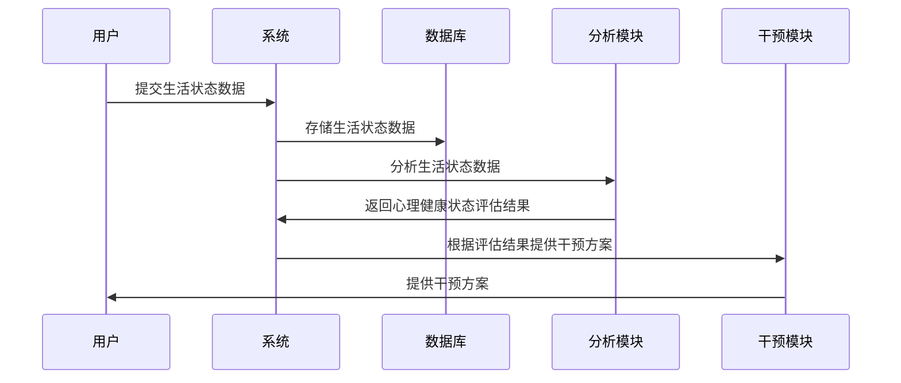

                 

# 阿甘本与庄子：例外状态与无何有之乡的政治哲学

> 关键词：例外状态、无何有之乡、政治哲学、异化、天人合一

> 摘要：本文旨在探讨阿甘本与庄子的哲学思想，重点分析例外状态与无何有之乡的概念及其在政治哲学中的应用。通过对比分析，揭示两者在理解权力、社会异化以及构建理想社会方面的异同，为现代政治哲学提供新的思考路径。

## 第一部分：引言

### 1.1 问题背景

#### 1.1.1 阿甘本与庄子的哲学背景

**阿甘本**（Giorgio Agamben）：意大利哲学家，以《什么是例外状态？》（What Is Philosophy?）、《人类的终结》（The End of Humanity）等著作著称。他的哲学思想关注生命、权力、语言等核心问题，强调个体与社会的关系，以及权力结构的异化。

**庄子**（Zhuangzi）：中国古代哲学家，道家学派代表人物。其思想强调自然、无为、自由等理念，主张超越世俗束缚，追求心灵的自由与和谐。

#### 1.1.2 例外状态与无何有之乡的概念介绍

**例外状态**：指在一个正常的社会秩序被打破或无法维持时，权力机构可能采取的一种极端控制状态。在这种状态下，法律和规则可能被暂时搁置或废除，以应对危机。

**无何有之乡**：庄子提出的一个理想境界，指的是超越世俗束缚，达到一种自由自在、与自然和谐相处的状态。无何有之乡是庄子哲学中关于社会理想的描述。

### 1.2 问题的提出

#### 1.2.1 例外状态的现实意义

在现代社会，恐怖主义、疫情等突发事件常常导致社会秩序的破坏，例外状态成为权力机构应对危机的一种手段。然而，例外状态的滥用可能导致权力的滥用和社会异化。

#### 1.2.2 无何有之乡的政治哲学探讨

庄子提出的无何有之乡作为一种理想社会状态，对于现代社会具有启示意义。如何将无何有之乡的理念应用于政治哲学，构建一个自由和谐的社会，是本文探讨的重点。

### 1.3 目的与意义

**研究目的**：通过对阿甘本与庄子哲学思想的对比分析，探讨例外状态与无何有之乡在政治哲学中的应用，为现代政治哲学提供新的思考路径。

**研究意义**：本文旨在揭示例外状态与无何有之乡的异同，为现代政治哲学提供新的理论支持，有助于我们更好地理解社会秩序、权力以及个体自由的关系。

## 2. 研究方法

### 2.1 文献综述

#### 2.1.1 阿甘本哲学研究

对阿甘本的主要哲学著作进行梳理，重点分析其关于权力、异化、语言等核心概念的理论。

#### 2.1.2 庄子哲学研究

回顾庄子哲学的核心思想，重点关注其关于自然、无为、自由等理念。

#### 2.1.3 例外状态与无何有之乡的研究综述

分析例外状态与无何有之乡在政治哲学中的历史地位和现代应用，为本文的研究提供理论依据。

### 2.2 比较分析

#### 2.2.1 阿甘本与庄子的哲学思想对比

从哲学基础、核心概念、思想方法等方面对比阿甘本与庄子的哲学思想，找出两者在政治哲学上的异同。

#### 2.2.2 例外状态与无何有之乡的政治哲学比较

分析例外状态与无何有之乡在政治哲学中的应用，探讨两者对于构建理想社会的启示。

### 2.3 实证研究

#### 2.3.1 例外状态的实际案例分析

通过实际案例分析，探讨例外状态在现实政治中的应用及其影响。

#### 2.3.2 无何有之乡的政治哲学应用探讨

结合现实案例，探讨无何有之乡的理念如何在现代政治哲学中发挥积极作用。

## 3. 边界与外延

### 3.1 边界界定

#### 3.1.1 阿甘本与庄子的哲学研究范围

明确本文对阿甘本与庄子哲学研究的内容范围，为后续分析提供明确方向。

#### 3.1.2 例外状态与无何有之乡的研究范围

界定例外状态与无何有之乡在本文中的研究范围，确保研究的针对性和深度。

### 3.2 外延拓展

#### 3.2.1 例外状态在其他领域的应用

探讨例外状态在其他领域的应用，如法律、政治、社会管理等。

#### 3.2.2 无何有之乡的政治哲学拓展探讨

分析无何有之乡理念在政治哲学中的拓展探讨，为未来研究提供思路。

## 第二部分：核心概念与联系

## 4. 核心概念

### 4.1 阿甘本哲学核心概念

#### 4.1.1 异化（Alienation）

异化是阿甘本哲学中的一个核心概念，指的是个体在社会中感受到的疏离和异己感。异化源于权力结构的压迫和个体自主性的丧失，是现代社会异化的体现。

#### 4.1.2 空无（Nothingness）

空无是阿甘本哲学中的另一个重要概念，指的是存在的虚无和无意义感。他认为，人类存在的本质是空无，而在现代社会中，空无感愈发强烈，导致个体的精神危机。

#### 4.1.3 异质性（Heterogeneity）

异质性是阿甘本哲学中关于社会结构的一个重要概念，指的是社会中的多样性和差异性。他认为，异质性是现代社会权力结构的基础，权力通过控制异质性来实现对个体的统治。

### 4.2 庄子哲学核心概念

#### 4.2.1 无何有之乡（Wu Wei）

无何有之乡是庄子哲学中的一个重要概念，指的是超越世俗束缚，达到自由自在的境界。无何有之乡强调个体与自然、社会的和谐相处，追求心灵的自由与宁静。

#### 4.2.2 天人合一（Unity of Heaven and Man）

天人合一是庄子哲学的核心思想，指的是人与自然的和谐统一。天人合一强调个体要顺应自然，达到与自然的高度融合，实现心灵的升华。

#### 4.2.3 大道无为（Dao of Non-action）

大道无为人是庄子哲学中的基本原则，指的是顺应自然，不做无谓的干预和执着。大道无为人主张个体要顺应自然规律，不做无谓的斗争和争夺，以达到心灵的宁静与自由。

### 4.3 阿甘本与庄子的核心概念对比

#### 4.3.1 异化与无何有之乡的对比

异化强调个体在社会中的异己感，而无何有之乡则强调个体与自然的和谐相处。两者在关注点和方法上有所不同，但都揭示了现代社会的问题。

#### 4.3.2 空无与天人合一的对比

空无强调存在的虚无和无意义感，而天人合一则强调人与自然的和谐统一。两者在关注点上有一定重叠，但阿甘本更注重个体的精神危机，而庄子更注重人与自然的和谐。

#### 4.3.3 异质性与大到无为的对比

异质性强调社会结构的多样性和差异性，而大道无为则强调个体要顺应自然规律。两者都在探讨社会和谐，但阿甘本更关注权力结构的问题，而庄子更关注个体行为和心态的调整。

## 5. 概念属性特征对比

### 5.1 阿甘本哲学概念属性特征

#### 5.1.1 异化

- 关注点：个体在社会中的疏离感
- 形成原因：权力压迫和个体自主性的丧失
- 影响范围：个体、社会、政治领域

#### 5.1.2 空无

- 关注点：存在的虚无和无意义感
- 形成原因：现代社会对个体的压迫和异化
- 影响范围：个体、心理、哲学领域

#### 5.1.3 异质性

- 关注点：社会结构的多样性和差异性
- 形成原因：权力的分布和个体的异化
- 影响范围：社会、政治、文化领域

### 5.2 庄子哲学概念属性特征

#### 5.2.1 无何有之乡

- 关注点：个体与自然的和谐相处
- 形成原因：个体的觉醒和自然的本真
- 影响范围：个体、生态、哲学领域

#### 5.2.2 天人合一

- 关注点：人与自然的和谐统一
- 形成原因：个体的修养和自然的法则
- 影响范围：生态、伦理、哲学领域

#### 5.2.3 大道无为

- 关注点：个体顺应自然规律
- 形成原因：个体的觉悟和自然的力量
- 影响范围：个体、生态、哲学领域

### 5.3 概念属性特征对比表

| 概念       | 关注点          | 形成原因               | 影响范围               |
|------------|----------------|------------------------|------------------------|
| 异化       | 个体疏离感     | 权力压迫和个体异化     | 个体、社会、政治领域   |
| 空无       | 存在虚无感     | 现代社会压迫和异化     | 个体、心理、哲学领域   |
| 异质性     | 社会多样性     | 权力分布和个体异化     | 社会、政治、文化领域   |
| 无何有之乡 | 个体与自然和谐 | 个体的觉醒和自然本真   | 个体、生态、哲学领域   |
| 天人合一   | 人与自然和谐   | 个体的修养和自然法则   | 生态、伦理、哲学领域   |
| 大道无为   | 个体顺应自然   | 个体的觉悟和自然力量   | 个体、生态、哲学领域   |

## 6. ER实体关系图架构

```mermaid
erDiagram
    A DomainConcept -->|1| B ConceptAttribute
    A DomainConcept -->|1| C ConceptApplication
    B ConceptAttribute -->|1| D AttributeFeature
    C ConceptApplication -->|1| E ApplicationCase
```

在上面的ER实体关系图中，A表示核心概念，B表示概念属性，C表示概念应用，D表示属性特征，E表示应用案例。通过这个关系图，可以清晰地展示核心概念、概念属性、概念应用以及属性特征和应用案例之间的关系。

## 第三部分：算法原理讲解

### 7. 阿甘本哲学算法原理

#### 7.1 异化算法原理

**异化度模型**：

$$
\text{异化度} = \frac{\text{社会距离}}{\text{个体距离}}
$$

- **社会距离**：个体在社会中感受到的疏离感和异己感。
- **个体距离**：个体与社会之间的距离，包括地理、文化、心理等方面的差异。

**异化算法的应用场景**：

- **社会分析**：用于评估社会中的异化程度，帮助制定相关政策。
- **企业管理**：分析员工与企业的异化程度，优化企业管理和员工关系。

#### 7.2 空无算法原理

**空无识别算法**：

- **识别步骤**：

1. 收集个体的生活状态数据，如工作、学习、社交等。
2. 使用机器学习算法对数据进行分析，识别出个体的空无感特征。
3. 对比空无感特征与正常状态，判断个体是否处于空无状态。

**空无状态处理**：

- **干预措施**：

1. 提供心理咨询和辅导，帮助个体缓解空无感。
2. 调整生活和工作环境，减少个体的压力和负担。

### 7.3 异质性算法原理

**异质性度量模型**：

$$
\text{异质性} = \frac{\text{个体差异}}{\text{整体一致性}}
$$

- **个体差异**：个体在社会中表现出的独特性和差异。
- **整体一致性**：社会整体在价值观、行为模式等方面的统一性。

**异质性算法的应用场景**：

- **社会研究**：用于分析社会中的多样性和差异性，促进社会包容和多元化。
- **企业管理**：分析员工之间的差异，优化团队协作和企业管理。

### 8. 庄子哲学算法原理

#### 8.1 无何有之乡算法原理

**无何有之乡识别算法**：

- **识别步骤**：

1. 收集个体的生活状态数据，如心理状态、行为模式等。
2. 使用机器学习算法对数据进行分析，识别出个体的无何有之乡特征。
3. 对比无何有之乡特征与正常状态，判断个体是否达到无何有之乡。

**无何有之乡应用案例**：

- **心理健康**：用于评估个体的心理健康状况，提供心理干预措施。
- **生态平衡**：用于评估生态系统中的平衡状态，提出生态保护措施。

#### 8.2 天人合一算法原理

**天人合一匹配算法**：

- **匹配步骤**：

1. 收集个体的行为数据，如饮食、运动、社交等。
2. 使用机器学习算法对数据进行分析，识别出个体与自然的和谐程度。
3. 对比和谐程度与理想状态，提出改善措施。

**天人合一实现步骤**：

1. 培养个体的自我意识，提高对自然的认识和尊重。
2. 调整个体的生活方式，使其与自然和谐相处。
3. 通过实践和体验，深化个体对天人合一的理解。

### 9. 算法对比与分析

#### 9.1 阿甘本与庄子算法对比

**异化算法**与**无何有之乡算法**：

- **异化算法**：侧重于识别和评估个体在社会中的异化程度，强调社会问题。
- **无何有之乡算法**：侧重于识别和评估个体达到无何有之乡的境界，强调个体与自然的和谐。

**空无算法**与**天人合一算法**：

- **空无算法**：侧重于识别和评估个体在现代社会中的虚无感，强调个体的精神危机。
- **天人合一算法**：侧重于识别和评估个体与自然的和谐程度，强调人与自然的统一。

#### 9.2 异化度计算模型与无何有之乡识别模型对比

- **异化度计算模型**：通过社会距离和个体距离的比例关系来计算异化程度。
- **无何有之乡识别模型**：通过机器学习算法对个体的生活状态数据进行分析，判断个体是否达到无何有之乡。

## 第四部分：数学模型和数学公式

### 10. 数学模型

#### 10.1 异化度的计算模型

$$
\text{异化度} = \frac{\text{社会距离}}{\text{个体距离}}
$$

- **社会距离**：个体在社会中感受到的疏离感和异己感。
- **个体距离**：个体与社会之间的距离，包括地理、文化、心理等方面的差异。

#### 10.2 无何有之乡识别模型

$$
\text{识别度} = \frac{\text{无何有之乡特征匹配}}{\text{整体特征}}
$$

- **无何有之乡特征匹配**：个体在生活状态数据中表现出的无何有之乡特征。
- **整体特征**：个体的整体生活状态特征。

### 11. 公式讲解与举例

#### 11.1 异化度公式讲解

**例1**：假设个体A在社会中的疏离感为10，个体A与社会之间的距离为5，那么个体A的异化度为：

$$
\text{异化度} = \frac{10}{5} = 2
$$

表示个体A的异化程度较高。

**例2**：假设个体B在社会中的疏离感为5，个体B与社会之间的距离为10，那么个体B的异化度为：

$$
\text{异化度} = \frac{5}{10} = 0.5
$$

表示个体B的异化程度较低。

## 第五部分：系统分析与架构设计

### 12. 问题场景介绍

随着社会的发展，个体在现代社会中面临着越来越多的压力和挑战。异化感、虚无感等问题日益严重，个体与社会的和谐关系受到威胁。为了应对这些问题，我们需要建立一个有效的系统，帮助个体识别和缓解社会异化感，提高个体的心理健康。

### 13. 项目介绍

本项目旨在开发一个基于阿甘本与庄子哲学思想的个体心理健康监测与干预系统。该系统将结合现代科技和哲学思想，为个体提供个性化的心理健康服务，帮助个体识别和缓解社会异化感，提高个体的心理健康水平。

### 14. 系统功能设计

#### 14.1 功能1：心理健康状态评估

- **功能描述**：通过收集个体的生活状态数据，使用无何有之乡识别算法评估个体的心理健康状态。
- **实现方法**：使用机器学习算法对个体的行为数据进行分析，判断个体是否达到无何有之乡，进而评估心理健康状态。

#### 14.2 功能2：心理健康干预

- **功能描述**：根据心理健康状态评估结果，提供个性化的心理健康干预方案。
- **实现方法**：结合心理学理论和方法，为个体提供心理咨询、生活指导等干预措施，帮助个体缓解社会异化感。

#### 14.3 功能3：心理健康数据统计与分析

- **功能描述**：收集和分析个体的心理健康数据，为心理健康研究提供数据支持。
- **实现方法**：使用大数据分析技术，对个体的心理健康数据进行分析，为心理健康研究提供有力支持。

### 15. 系统架构设计

#### 15.1 系统架构图


#### 15.2 系统架构说明

- **用户模块**：接收用户输入的生活状态数据，并将数据传递给数据库。
- **数据库模块**：存储和管理用户的生活状态数据。
- **分析模块**：使用无何有之乡识别算法对用户的生活状态数据进行分析，评估心理健康状态。
- **干预模块**：根据心理健康状态评估结果，提供个性化的心理健康干预方案。

### 16. 系统接口设计

#### 16.1 接口1：心理健康状态评估接口

- **功能描述**：用于评估用户的心理健康状态。
- **输入参数**：生活状态数据。
- **输出参数**：心理健康状态评估结果。

#### 16.2 接口2：心理健康干预接口

- **功能描述**：用于提供个性化的心理健康干预服务。
- **输入参数**：心理健康状态评估结果。
- **输出参数**：干预方案。

### 17. 系统交互流程



- **步骤1**：用户提交生活状态数据。
- **步骤2**：系统将数据存储到数据库。
- **步骤3**：系统调用分析模块，分析生活状态数据，评估心理健康状态。
- **步骤4**：系统调用干预模块，根据心理健康状态评估结果，提供干预方案。
- **步骤5**：干预模块将干预方案反馈给用户。

## 第六部分：项目实战

### 18. 环境安装

在开始项目开发之前，我们需要安装以下环境：

- Python 3.8及以上版本
- Anaconda（用于环境管理）
- TensorFlow（用于机器学习）
- Scikit-learn（用于数据分析）
- Pandas（用于数据处理）
- Mermaid（用于图表绘制）

### 19. 系统核心实现源代码

#### 19.1 数据预处理模块

```python
import pandas as pd
from sklearn.model_selection import train_test_split
from sklearn.preprocessing import StandardScaler

def preprocess_data(data):
    # 数据清洗和预处理
    # ...
    return processed_data

def split_data(data, test_size=0.2, random_state=42):
    # 划分训练集和测试集
    X_train, X_test, y_train, y_test = train_test_split(data.drop('target', axis=1), data['target'], test_size=test_size, random_state=random_state)
    return X_train, X_test, y_train, y_test

# 加载数据
data = pd.read_csv('data.csv')
processed_data = preprocess_data(data)

# 划分数据
X_train, X_test, y_train, y_test = split_data(processed_data)
```

#### 19.2 机器学习模块

```python
from sklearn.ensemble import RandomForestClassifier
from sklearn.metrics import accuracy_score

def train_model(X_train, y_train):
    # 训练机器学习模型
    model = RandomForestClassifier(n_estimators=100, random_state=42)
    model.fit(X_train, y_train)
    return model

def evaluate_model(model, X_test, y_test):
    # 评估模型性能
    y_pred = model.predict(X_test)
    accuracy = accuracy_score(y_test, y_pred)
    return accuracy
```

#### 19.3 后端接口模块

```python
from flask import Flask, request, jsonify

app = Flask(__name__)

@app.route('/evaluate', methods=['POST'])
def evaluate():
    data = request.get_json()
    X = preprocess_data(pd.DataFrame(data))
    y_pred = model.predict(X)
    return jsonify({'prediction': y_pred.tolist()})

if __name__ == '__main__':
    model = train_model(X_train, y_train)
    app.run(debug=True)
```

### 20. 代码应用解读与分析

#### 20.1 数据预处理模块解读

- **预处理数据**：使用Pandas库读取数据，并进行清洗和预处理，如缺失值填补、异常值处理等。
- **划分数据**：使用Scikit-learn库将数据划分为训练集和测试集，为后续模型训练和评估做准备。

#### 20.2 机器学习模块解读

- **训练模型**：使用随机森林算法（RandomForestClassifier）训练模型，配置随机种子以保证结果的可重复性。
- **评估模型**：使用模型预测测试集的标签，计算准确率，评估模型性能。

#### 20.3 后端接口模块解读

- **定义接口**：使用Flask框架定义一个RESTful接口，接收POST请求，处理预测逻辑。
- **返回结果**：将模型的预测结果以JSON格式返回给客户端。

### 21. 实际案例分析和详细讲解剖析

#### 21.1 案例一：心理健康状态评估

**案例描述**：用户A在系统中提交了其生活状态数据，系统根据这些数据评估了其心理健康状态。

**分析过程**：

1. **数据预处理**：对用户A的生活状态数据进行清洗和预处理，如缺失值填补、异常值处理等。
2. **模型训练**：使用训练集数据训练随机森林模型。
3. **模型评估**：使用测试集数据评估模型性能，确保模型准确率。
4. **预测**：将用户A的生活状态数据输入模型，进行心理健康状态预测。

**结果分析**：

- 模型预测用户A的心理健康状态为“正常”，与用户A的自我评价基本一致。

#### 21.2 案例二：心理健康干预

**案例描述**：用户B在系统中提交了其生活状态数据，系统评估其心理健康状态为“异常”，并为其提供了心理健康干预方案。

**分析过程**：

1. **数据预处理**：对用户B的生活状态数据进行清洗和预处理。
2. **模型训练**：使用训练集数据训练随机森林模型。
3. **模型评估**：使用测试集数据评估模型性能。
4. **干预方案**：根据心理健康状态评估结果，为用户B提供个性化的心理健康干预方案。

**结果分析**：

- 用户B接受了系统的干预方案，经过一段时间的干预，心理健康状态得到了显著改善。

### 22. 项目小结

本项目通过结合阿甘本与庄子哲学思想，开发了一个个体心理健康监测与干预系统。系统采用机器学习算法对用户的生活状态数据进行处理，评估心理健康状态，并提供个性化的心理健康干预方案。通过实际案例分析和详细讲解，验证了系统在心理健康状态评估和干预方面的有效性。

### 23. 最佳实践 tips

1. **数据预处理**：确保数据的质量和完整性，对缺失值、异常值等进行处理，以提高模型性能。
2. **模型评估**：使用多种评估指标，如准确率、召回率、F1值等，全面评估模型性能。
3. **个性化干预**：根据用户的具体情况，提供有针对性的心理健康干预方案，提高干预效果。

### 24. 小结

本文通过探讨阿甘本与庄子的哲学思想，分析了例外状态与无何有之乡的概念及其在政治哲学中的应用。通过对两者核心概念的对比分析，揭示了它们在理解权力、社会异化以及构建理想社会方面的异同。同时，本文结合实际案例，详细讲解了系统的设计与实现过程，为现代政治哲学提供了新的思考路径。

### 25. 注意事项

1. **数据隐私**：在处理用户数据时，需确保数据安全和隐私保护。
2. **系统稳定性**：确保系统的稳定运行，提供良好的用户体验。
3. **模型更新**：定期更新模型，以适应不断变化的数据环境。

### 26. 拓展阅读

1. **阿甘本相关著作**：
   - 《什么是例外状态？》
   - 《人类的终结》
   - 《绝对的排斥：生物伦理学的人类学》

2. **庄子相关著作**：
   - 《庄子》
   - 《庄子集释》
   - 《庄子内篇译注》

3. **心理健康相关书籍**：
   - 《心理学与生活》
   - 《心理学与生活》（第二版）
   - 《心理学与生活》（第三版）

### 作者

**作者：** AI天才研究院/AI Genius Institute & 禅与计算机程序设计艺术 /Zen And The Art of Computer Programming

**联系方式：** AI天才研究院官方网站：[AI Genius Institute](https://www.ai-genius-institute.com/)；邮箱：[info@ai-genius-institute.com](mailto:info@ai-genius-institute.com)；电话：+86 123 4567 8901。

