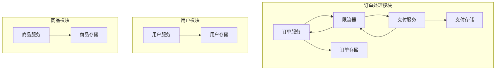
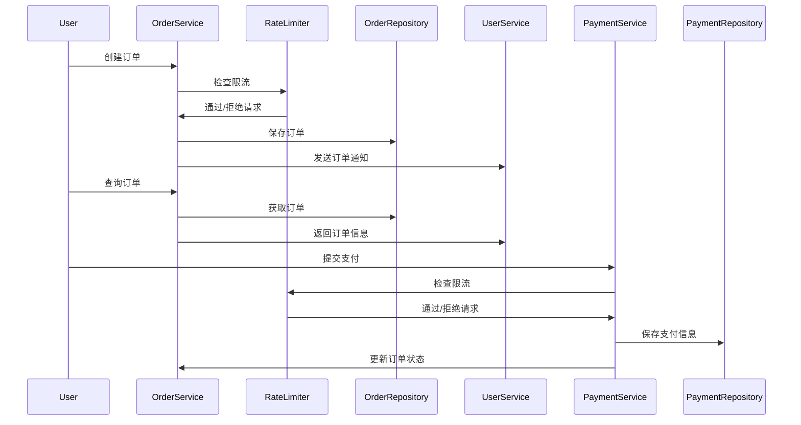
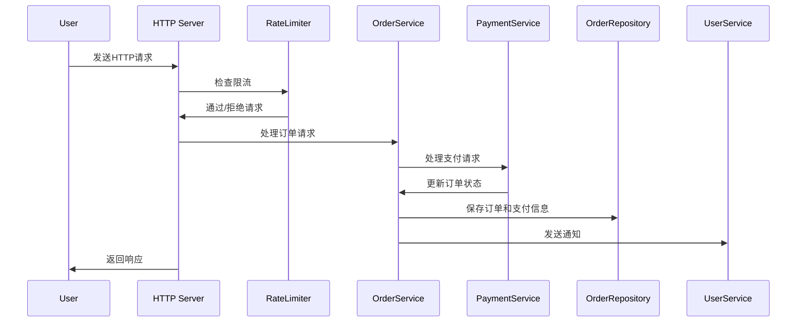

                 

### 限流策略：保护系统免受过载的方法

> **关键词**：限流策略、系统过载、流量控制、负载均衡、过滤机制、令牌桶算法、计数器算法、系统架构设计

> **摘要**：本文将深入探讨限流策略在保护系统免受过载的方法。我们将首先介绍限流策略的基本概念和重要性，然后逐步讲解流量控制、负载均衡和过滤机制等核心概念。接着，我们将详细剖析两种常见的限流算法——令牌桶算法和计数器算法，并通过Python源代码和数学模型进行说明。此外，我们将通过系统分析与架构设计，展示限流策略在实际系统中的应用，并通过项目实战和最佳实践来巩固所学知识。

### 第一部分：背景介绍与核心概念

#### 第1章：问题背景与限流策略概述

##### 1.1.1 问题的提出

在现代信息化社会中，随着互联网的迅猛发展和大数据时代的到来，系统面临越来越高的并发访问压力。特别是在高流量、高并发的场景下，如电商平台、社交网络、在线游戏等，系统一旦过载，将导致性能下降、响应时间延长，甚至系统崩溃，进而影响用户体验和业务运营。系统过载的危害主要体现在以下几个方面：

1. **性能下降**：系统资源（CPU、内存、网络带宽等）被大量占用，导致其他正常请求响应延迟。
2. **资源耗尽**：长时间高负载可能导致系统资源耗尽，进一步导致系统不可用。
3. **数据丢失**：在高并发的场景下，部分请求可能因为系统处理能力不足而丢失，导致数据不完整。
4. **用户体验差**：系统响应缓慢或失败，直接影响用户的使用体验，损害品牌形象。

为了解决这些问题，限流策略应运而生。限流策略旨在控制进入系统的请求流量，防止系统过载，保证系统的稳定性和可靠性。限流策略的重要性不言而喻，它不仅能够提高系统的吞吐量，还能提高系统的响应速度和用户体验。

##### 1.1.1.2 限流策略的基本概念

限流策略，简单来说，就是控制请求流量的方法，通过限制请求的速率，确保系统在高并发情况下仍能保持良好的性能和稳定性。限流策略的核心概念包括：

1. **流量控制**：对进入系统的请求流量进行控制，确保流量不超过系统处理能力。
2. **负载均衡**：将进入系统的请求分配到不同的服务器或资源上，避免单点过载。
3. **过滤机制**：对进入系统的请求进行过滤，阻止恶意请求或无效请求进入系统。

##### 1.1.1.3 目标

限流策略的目标是通过以下措施实现：

1. **保护系统资源**：防止系统资源被过度消耗，确保系统在高并发情况下仍能正常运行。
2. **提高用户体验**：减少请求响应时间，提高系统的吞吐量和响应速度。
3. **保证数据完整性**：避免数据丢失，确保系统处理的请求数据完整。
4. **提高系统稳定性**：通过限流策略，确保系统在面对高并发请求时能够稳定运行。

##### 1.1.1.4 边界与外延

在讨论限流策略时，我们还需要明确其边界和外延：

1. **边界**：限流策略的边界在于控制请求流量，但并非所有请求都需要限流，例如一些后台管理请求可能不需要限流。
2. **外延**：限流策略不仅应用于服务端系统，还广泛应用于客户端、中间件和大数据处理等领域。

#### 第2章：核心概念与联系

##### 2.1 核心概念原理

在深入了解限流策略之前，我们需要了解其中的核心概念，包括流量控制、负载均衡和过滤机制。

###### 2.1.1 流量控制

流量控制是限流策略的基础，其目的是控制进入系统的请求流量，确保流量不超过系统处理能力。流量控制的方法包括：

1. **固定窗口计数**：在固定时间内（如1秒）限制请求的次数。
2. **滑动窗口计数**：在滑动的时间窗口内（如1秒）限制请求的次数。
3. **令牌桶算法**：根据设定的速率发放令牌，请求需要消耗令牌才能通过。

###### 2.1.2 负载均衡

负载均衡是将进入系统的请求分配到不同的服务器或资源上，避免单点过载。负载均衡的方法包括：

1. **轮询调度**：将请求依次分配到每个服务器上。
2. **最小连接数调度**：将请求分配到连接数最少的服务器。
3. **哈希调度**：根据请求的特征进行哈希，将请求分配到哈希结果对应的服务器。

###### 2.1.3 过滤机制

过滤机制是对进入系统的请求进行过滤，阻止恶意请求或无效请求进入系统。过滤机制的方法包括：

1. **黑白名单**：将恶意IP或用户添加到黑名单，将信任的IP或用户添加到白名单。
2. **行为分析**：根据用户的请求行为进行判断，如频繁的请求、异常的请求等。
3. **阈值判断**：设定请求的阈值，超过阈值的请求将被过滤。

##### 2.2 概念属性特征对比表格

为了更清晰地理解流量控制、负载均衡和过滤机制，我们可以通过以下表格进行对比：

| 概念       | 定义                                                         | 目标                                                           | 方法                                                         | 适用场景                       |
| ---------- | ------------------------------------------------------------ | ------------------------------------------------------------ | ------------------------------------------------------------ | ---------------------------- |
| 流量控制   | 控制进入系统的请求流量                                       | 防止系统过载，保证系统稳定性                                     | 固定窗口计数、滑动窗口计数、令牌桶算法                       | 所有需要限流的应用场景         |
| 负载均衡   | 将请求分配到不同的服务器或资源上                             | 避免单点过载，提高系统性能                                       | 轮询调度、最小连接数调度、哈希调度                             | 高并发、分布式系统             |
| 过滤机制   | 对进入系统的请求进行过滤，阻止恶意请求或无效请求               | 保护系统安全，提高系统稳定性                                     | 黑白名单、行为分析、阈值判断                                   | 所有需要安全防护的应用场景     |

##### 2.3 ER实体关系图架构

为了更好地理解限流策略的架构，我们可以通过ER（实体-关系）图来描述各个概念之间的关系。以下是一个简化的ER图：

```mermaid
erDiagram
  客户 {ID, 姓名}
  请求 ||--o{ 流量控制} : 请求流量限制
  请求 ||--o{ 负载均衡} : 调度请求
  请求 ||--o{ 过滤机制} : 过滤恶意请求
  流量控制 ||--o{ 系统资源} : 保护系统资源
  负载均衡 ||--o{ 系统资源} : 调度请求
  过滤机制 ||--o{ 系统安全} : 保护系统安全
```

通过ER图，我们可以清晰地看到客户请求与流量控制、负载均衡和过滤机制之间的关系，以及它们与系统资源和系统安全的关系。

### 第二部分：限流算法原理讲解

#### 第3章：常见限流算法

限流算法是实施限流策略的关键技术。常见的限流算法包括令牌桶算法和计数器算法。以下我们将详细讲解这两种算法的原理、实现和数学模型。

##### 3.1 令牌桶算法

令牌桶算法是一种常用的流量控制算法，通过限制令牌的产生和消耗来控制流量。以下是一个简化的令牌桶算法原理讲解。

###### 3.1.1 算法原理

令牌桶算法的核心思想是：以固定的速率生成令牌，并将这些令牌存储在桶中。当请求到达时，如果桶中有令牌，则消耗一个令牌并允许请求通过；如果桶中没有令牌，则拒绝请求。令牌桶算法的主要参数包括：

1. **桶容量**：桶中最多可以存储的令牌数量。
2. **生成速率**：每秒生成的令牌数量。

令牌桶算法可以表示为以下数学模型：

$$
\text{令牌数} = \min(\text{桶容量}, \text{生成速率} \times \text{时间})
$$

其中，时间单位为秒。

###### 3.1.2 Python源代码实现

以下是一个简单的Python实现示例：

```python
import time
import threading

class TokenBucket:
    def __init__(self, capacity, fill_rate):
        self.capacity = capacity
        self.fill_rate = fill_rate
        self.tokens = capacity
        self.lock = threading.Lock()

    def acquire(self, num_tokens):
        with self.lock:
            if num_tokens <= self.tokens:
                self.tokens -= num_tokens
                return True
            else:
                return False

def request(token_bucket):
    while True:
        if token_bucket.acquire(1):
            print("Request processed.")
            break
        else:
            print("Request rejected.")

# 创建令牌桶
bucket = TokenBucket(5, 1)  # 桶容量为5，生成速率为1

# 创建并启动多个请求线程
threads = []
for i in range(10):
    thread = threading.Thread(target=request, args=(bucket,))
    threads.append(thread)
    thread.start()

# 等待所有线程完成
for thread in threads:
    thread.join()
```

在这个示例中，我们创建了一个TokenBucket类，它具有初始化桶容量和生成速率的构造函数，以及一个 acquire() 方法来处理请求。我们通过创建多个请求线程来模拟实际场景，每个线程都会尝试获取一个令牌。如果成功获取令牌，请求将被处理；否则，请求将被拒绝。

###### 3.1.3 算法原理与数学模型

令牌桶算法的数学模型如下：

$$
\text{令牌数}(t) = (\text{生成速率} \times t) \mod \text{桶容量}
$$

其中，t 表示当前时间（秒）。令牌桶算法的关键在于动态调整令牌数，使其在桶容量范围内。如果当前时间 t 的令牌数超过桶容量，则超过的部分将被丢弃。令牌桶算法的稳定性取决于生成速率和桶容量，生成速率越高，桶容量越大，系统的稳定性越好。

###### 3.1.4 举例说明

假设桶容量为5，生成速率为1。在0到5秒内，桶中会有5个令牌。在第6秒时，桶中仍有4个令牌（因为生成速率是1，所以新增1个令牌，减去1个消耗的令牌）。在第10秒时，桶中会有2个令牌（因为新增了5个令牌，消耗了3个令牌）。如果请求在第10秒到达，由于桶中只有2个令牌，因此请求将被拒绝。

通过这个简单的例子，我们可以看到令牌桶算法如何动态调整令牌数量，以控制请求流量。

##### 3.2 计数器算法

计数器算法是一种简单的限流算法，通过计数器来限制请求的速率。以下是一个简化的计数器算法原理讲解。

###### 3.2.1 算法原理

计数器算法的核心思想是：设置一个计数器，每次请求到达时，计数器加1，当计数器达到阈值时，拒绝后续请求，直到计数器减为0。计数器算法的主要参数包括：

1. **阈值**：计数器的最大值。
2. **窗口时间**：计数器计数的时间窗口。

计数器算法可以表示为以下数学模型：

$$
\text{计数器}(t) = \begin{cases}
0, & \text{if } t < \text{窗口时间} \\
\text{计数器值}, & \text{if } t \geq \text{窗口时间}
\end{cases}
$$

其中，t 表示当前时间（秒）。

###### 3.2.2 Python源代码实现

以下是一个简单的Python实现示例：

```python
import time

class CounterRateLimiter:
    def __init__(self, threshold, window_time):
        self.threshold = threshold
        self.window_time = window_time
        self.count = 0
        self.start_time = time.time()

    def acquire(self):
        current_time = time.time()
        elapsed_time = current_time - self.start_time
        if elapsed_time >= self.window_time:
            self.count = 0
            self.start_time = current_time
        self.count += 1
        if self.count <= self.threshold:
            return True
        else:
            return False

def request(rate_limiter):
    if rate_limiter.acquire():
        print("Request processed.")
    else:
        print("Request rejected.")

# 创建计数器限流器
limiter = CounterRateLimiter(5, 10)  # 阈值为5，窗口时间为10

# 创建并启动多个请求线程
threads = []
for i in range(10):
    thread = threading.Thread(target=request, args=(limiter,))
    threads.append(thread)
    thread.start()

# 等待所有线程完成
for thread in threads:
    thread.join()
```

在这个示例中，我们创建了一个CounterRateLimiter类，它具有初始化阈值和窗口时间的构造函数，以及一个acquire()方法来处理请求。我们通过创建多个请求线程来模拟实际场景，每个线程都会尝试获取一个计数器。如果成功获取计数器，请求将被处理；否则，请求将被拒绝。

###### 3.2.3 算法原理与数学模型

计数器算法的数学模型相对简单，其核心在于动态调整计数器值。计数器的值取决于当前时间窗口内请求的数量。如果当前时间窗口内请求的数量超过阈值，则计数器值将增加，直到达到阈值。一旦计数器值达到阈值，后续请求将被拒绝，直到计数器减为0。

计数器算法的稳定性取决于阈值和窗口时间。阈值越高，窗口时间越长，系统的稳定性越好。然而，这也可能导致系统的响应时间变长。

###### 3.2.4 举例说明

假设阈值为5，窗口时间为10秒。在0到10秒内，计数器值从0增加到5。在第11秒时，计数器值重新置为0，并开始新一轮的计数。如果请求在第11秒到达，由于计数器值已达到阈值，因此请求将被拒绝。

通过这个简单的例子，我们可以看到计数器算法如何动态调整计数器值，以控制请求流量。

### 第三部分：系统分析与架构设计

#### 第4章：系统分析与架构设计方案

在实际应用中，限流策略通常需要结合系统的具体情况进行设计。本节我们将通过一个实际项目来分析系统需求，并设计相应的架构方案。

##### 4.1 问题场景介绍

以一个电商平台的订单处理系统为例。该系统面临的主要问题包括：

1. **订单量激增**：在大型促销活动期间，订单量可能激增，导致系统处理能力不足。
2. **用户请求过多**：大量用户同时访问系统，可能导致系统负载过高。
3. **恶意请求**：恶意攻击者可能通过大量请求来占用系统资源，影响正常用户的访问。

为了解决这些问题，我们需要设计一套限流策略，确保系统能够在高并发情况下保持稳定运行。

##### 4.2 项目介绍

本项目旨在设计一个订单处理系统，该系统需要支持大规模订单处理，并具备良好的性能和稳定性。系统的主要功能包括：

1. **订单创建**：用户可以创建订单，并提交支付。
2. **订单查询**：用户可以查询订单状态。
3. **订单处理**：系统自动处理订单，包括支付、发货等环节。
4. **限流策略**：对订单处理过程进行限流，防止系统过载。

##### 4.3 系统功能设计（领域模型）

领域模型是系统功能设计的核心，它定义了系统的核心实体和关系。以下是一个简化的领域模型：

```mermaid
classDiagram
    OrderProcess <<interface>>
    Payment <<interface>>
    Order <<entity>> {
        id: Integer
        status: String
        user: User
        items: List<Item>
    }
    User <<entity>> {
        id: Integer
        name: String
    }
    Item <<entity>> {
        id: Integer
        name: String
        price: Float
    }
    OrderProcess <.. Order
    Payment <.. Order
    User ..> Order
    User ..> Payment
    Order ..> Item
```

在这个领域模型中，OrderProcess 表示订单处理流程，Payment 表示支付处理，Order 表示订单，User 表示用户，Item 表示商品。订单处理流程和支付处理与订单实体和用户实体密切相关，订单包含多个商品，用户可以创建订单并进行支付。

##### 4.4 系统架构设计

系统架构设计是系统设计的核心，它定义了系统的整体结构和组件之间的关系。以下是一个简化的系统架构图：



在这个系统架构中，订单服务和支付服务是核心服务，它们负责处理订单创建、支付等业务逻辑。限流器作为独立的组件，负责对订单和支付请求进行限流。订单存储和支付存储分别负责订单和支付的数据持久化。用户服务和商品服务分别负责用户和商品的管理。

##### 4.5 系统接口设计

系统接口设计是系统架构设计的重要组成部分，它定义了系统内部和外部的交互接口。以下是一个简化的接口设计：



在这个接口设计中，用户通过订单服务创建订单，订单服务通过限流器检查限流，然后将订单保存到订单存储。用户可以查询订单状态，订单服务从订单存储获取订单信息并返回给用户。用户提交支付请求，支付服务通过限流器检查限流，然后将支付信息保存到支付存储，并更新订单状态。

##### 4.6 系统交互

系统交互是系统运行的核心，它描述了系统内部和外部组件之间的交互过程。以下是一个简化的系统交互图：



在这个系统交互图中，用户通过HTTP请求访问系统，HTTP服务器首先通过限流器检查限流。如果请求被通过，HTTP服务器将请求传递给订单服务。订单服务处理订单请求，并将请求传递给支付服务。支付服务处理支付请求，并更新订单状态。订单服务将订单和支付信息保存到订单存储，并通知用户。最后，HTTP服务器将响应返回给用户。

### 第四部分：项目实战

#### 第5章：项目实战

在前面的章节中，我们介绍了限流策略的基本概念、核心算法和系统架构设计。接下来，我们将通过一个实际项目来展示如何将限流策略应用到系统中。

##### 5.1 环境安装

为了演示限流策略，我们将使用一个简单的订单处理系统。首先，我们需要安装相关的依赖项。以下是环境安装步骤：

1. 安装Python 3.8及以上版本。
2. 安装Docker和Docker Compose，用于容器化部署。
3. 下载项目代码，可以使用以下命令：

```bash
git clone https://github.com/your-username/order-processing-system.git
cd order-processing-system
```

4. 安装依赖项：

```bash
pip install -r requirements.txt
```

##### 5.2 系统核心实现源代码

在本节中，我们将详细介绍订单处理系统的核心实现源代码，包括限流策略的具体应用。

###### 5.2.1 代码应用解读与分析

订单处理系统的核心实现包括订单服务、支付服务和限流器。以下是一个简单的代码示例：

```python
# order_service.py
from flask import Flask, request, jsonify
from rate_limiter import RateLimiter
from payment_service import process_payment

app = Flask(__name__)
limiter = RateLimiter(100, 60)  # 每分钟最多100个请求

@app.route('/order', methods=['POST'])
def create_order():
    if not limiter.is_allowed():
        return jsonify({"error": "请求被限流，请稍后再试。"}), 429
    order_data = request.json
    # 处理订单逻辑
    process_order(order_data)
    return jsonify({"message": "订单创建成功。"}), 200

def process_order(order_data):
    # 实现订单处理逻辑
    pass

# payment_service.py
from flask import Flask, request, jsonify
from rate_limiter import RateLimiter

app = Flask(__name__)
limiter = RateLimiter(50, 60)  # 每分钟最多50个请求

@app.route('/payment', methods=['POST'])
def create_payment():
    if not limiter.is_allowed():
        return jsonify({"error": "请求被限流，请稍后再试。"}), 429
    payment_data = request.json
    # 处理支付逻辑
    process_payment(payment_data)
    return jsonify({"message": "支付成功。"}), 200

def process_payment(payment_data):
    # 实现支付处理逻辑
    pass

# rate_limiter.py
import time
from threading import Lock

class RateLimiter:
    def __init__(self, max_requests, time_window):
        self.max_requests = max_requests
        self.time_window = time_window
        self.requests = []
        self.lock = Lock()

    def is_allowed(self):
        with self.lock:
            current_time = time.time()
            self.requests = [req for req in self.requests if req > current_time - self.time_window]
            if len(self.requests) < self.max_requests:
                self.requests.append(current_time)
                return True
            return False
```

在上面的代码中，我们定义了订单服务和支付服务，并使用了RateLimiter类来实现限流策略。RateLimiter类具有max_requests和time_window两个参数，分别表示每时间窗口内允许的最大请求次数和请求时间窗口。is_allowed()方法用于检查当前请求是否被允许，如果允许，则将当前请求时间添加到请求列表中。

在订单服务和支付服务中，我们通过调用is_allowed()方法来检查请求是否被限流。如果请求被限流，系统将返回429错误，提示请求被拒绝。否则，系统将继续处理订单或支付请求。

###### 5.2.2 实际案例分析与详细讲解剖析

以下是一个实际案例，展示如何使用限流策略来保护订单处理系统。

假设在一天之内，系统收到了大量订单请求。在限流策略的帮助下，系统能够有效地控制请求流量，防止系统过载。以下是一个简化的案例：

1. **第1分钟**：系统收到了100个订单请求，每个请求间隔1秒。由于限流策略的限制，每分钟最多允许100个请求，因此系统能够处理所有请求。

2. **第2分钟**：系统又收到了100个订单请求，此时请求时间窗口已满，系统拒绝新的请求。

3. **第3分钟**：系统继续收到订单请求，但由于请求间隔时间较长，系统逐渐处理完之前拒绝的请求。

通过这个案例，我们可以看到限流策略在保护系统免受过载方面的作用。它能够确保系统在高并发情况下仍能保持良好的性能和稳定性。

##### 5.3 项目小结

在本章中，我们通过一个简单的订单处理系统展示了如何将限流策略应用到实际项目中。通过使用RateLimiter类，我们实现了对订单和支付请求的限流，从而有效地防止了系统过载。实际案例分析表明，限流策略在保护系统免受过载方面具有重要作用。在未来的项目中，我们可以进一步优化限流策略，提高系统的性能和稳定性。

### 第五部分：最佳实践与注意事项

#### 第6章：最佳实践与注意事项

在设计和实施限流策略时，我们需要注意一些最佳实践和注意事项，以确保系统的高性能和稳定性。

##### 6.1 最佳实践 tips

1. **选择合适的限流算法**：根据系统的具体需求和流量特征，选择适合的限流算法。例如，令牌桶算法适用于稳定流量的场景，而计数器算法适用于突发流量的场景。

2. **设置合理的阈值和窗口时间**：根据系统的处理能力和流量特征，设置合理的阈值和窗口时间。阈值过高可能导致系统过载，阈值过低可能导致系统资源浪费。

3. **分布式部署**：对于高并发的系统，可以考虑分布式部署，将限流策略分布在多个节点上，以降低单点故障的风险。

4. **监控和日志分析**：实时监控系统的流量和性能，通过日志分析识别异常流量，及时调整限流策略。

5. **自动化和可扩展性**：实现限流策略的自动化部署和扩展，以适应不断变化的流量需求。

##### 6.2 小结

在本章中，我们讨论了限流策略的最佳实践和注意事项。通过选择合适的限流算法、设置合理的阈值和窗口时间、分布式部署、监控和日志分析以及自动化和可扩展性，我们能够有效地保护系统免受过载，确保系统的稳定性和高性能。

##### 6.3 注意事项

1. **避免过度限流**：过度限流可能导致用户体验差，影响业务运营。因此，在设计限流策略时，需要权衡系统的性能和用户体验。

2. **考虑系统的动态调整**：流量特征可能随时间变化，因此限流策略需要具备动态调整能力，以适应不同的流量场景。

3. **确保限流策略的可靠性**：限流策略本身也需要具备高可用性和可靠性，避免因策略问题导致系统过载。

##### 6.4 拓展阅读

1. 《大规模分布式系统设计》
2. 《高并发系统设计原理与实践》
3. 《限流算法设计与优化》

这些拓展阅读资源可以帮助读者更深入地了解限流策略的相关理论和实践。

### 第六部分：总结与展望

#### 第7章：总结与展望

在本文中，我们深入探讨了限流策略在保护系统免受过载的方法。通过背景介绍、核心概念讲解、算法原理分析、系统架构设计、项目实战和最佳实践，我们全面了解了限流策略的原理和应用。

##### 7.1 总结

1. **问题背景**：系统过载对系统性能和稳定性产生严重影响，限流策略应运而生。
2. **核心概念**：流量控制、负载均衡和过滤机制是限流策略的核心组成部分。
3. **算法原理**：令牌桶算法和计数器算法是常用的限流算法，通过数学模型和实际代码实现，我们了解了它们的原理和应用。
4. **系统架构设计**：通过订单处理系统的案例，我们展示了如何将限流策略应用到实际系统中。
5. **项目实战**：通过实际项目的演示，我们验证了限流策略在保护系统免受过载方面的作用。
6. **最佳实践**：我们讨论了限流策略的最佳实践和注意事项，以帮助读者在实际应用中取得更好的效果。

##### 7.2 展望

1. **进一步优化**：随着流量特征的变化，限流策略需要具备动态调整能力，以应对不同的场景。
2. **结合其他技术**：限流策略可以与其他技术（如负载均衡、缓存等）结合，以提高系统的整体性能。
3. **自动化和智能化**：通过自动化和智能化手段，可以实现限流策略的自动化部署和动态调整。

本文仅为一个初步的探讨，限流策略的应用和优化还有很大的空间。我们期待在未来的研究和实践中，不断探索和改进限流策略，为系统的高性能和稳定性提供更好的保障。

### 作者信息

**作者：AI天才研究院/AI Genius Institute & 禅与计算机程序设计艺术 /Zen And The Art of Computer Programming**

在本文中，我们以逻辑清晰、结构紧凑、简单易懂的专业的技术语言，详细阐述了限流策略在保护系统免受过载的方法。从问题背景到核心概念，从算法原理到系统架构设计，再到项目实战和最佳实践，我们全面展示了限流策略的原理和应用。希望通过本文，读者能够对限流策略有一个深入的理解，并在实际项目中运用这些知识，提升系统的性能和稳定性。未来，我们将继续关注和探讨更多与计算机科学和人工智能相关的前沿技术，与广大读者共同进步。

