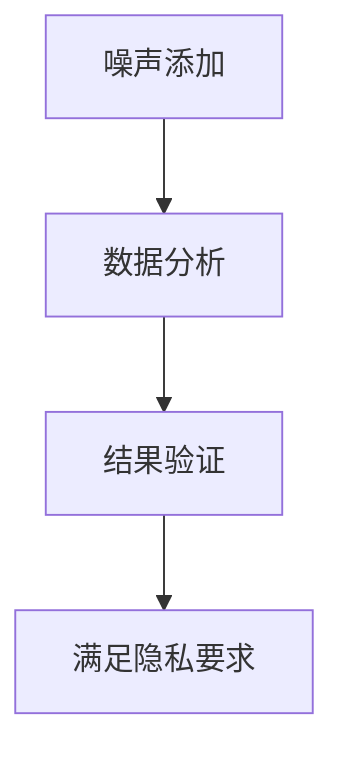
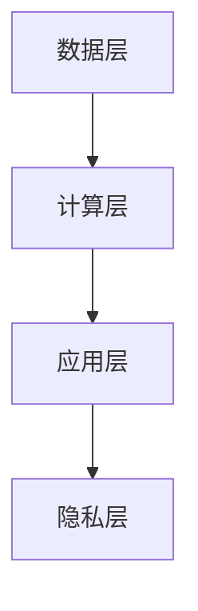
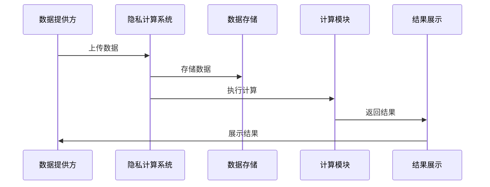
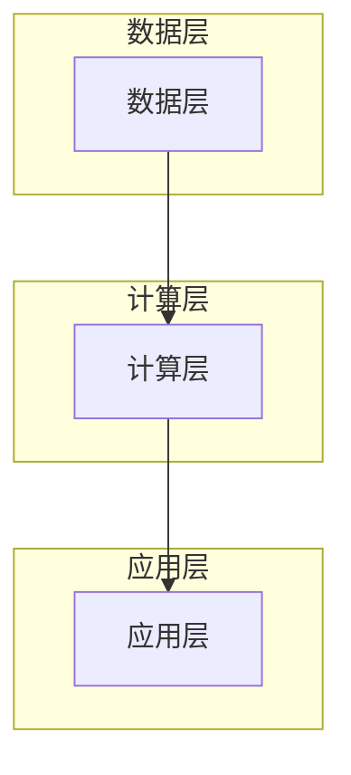
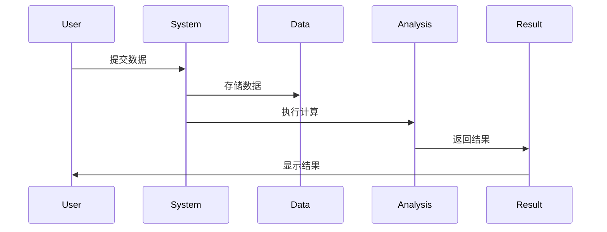

                 

### 《隐私计算：在保护数据隐私的同时进行协作分析》

#### 关键词：隐私计算、数据保护、协作分析、系统架构、应用实例

#### 摘要：

随着数据时代的到来，数据隐私保护成为全球范围内的关注焦点。隐私计算作为一种新兴技术，旨在在保护数据隐私的同时，实现多方数据的协作分析。本文将深入探讨隐私计算的概念、原理、架构设计及应用实例，旨在为读者提供一个全面、系统的理解。

---

#### 第1章 背景介绍

##### 1.1 问题背景

在信息化、数字化迅速发展的今天，数据已成为国家、企业乃至个人的重要资产。然而，随着数据量的大幅增加，数据隐私泄露的风险也日益上升。传统的数据保护方法，如数据加密、访问控制等，虽然能够在一定程度上保障数据安全，但在进行数据分析和共享时，往往需要牺牲数据的隐私性。

##### 1.2 问题描述

问题描述主要集中在以下几个方面：

1. **隐私泄露风险**：数据在传输和存储过程中，存在被非法访问和泄露的风险。
2. **数据分析受限**：为了保护数据隐私，往往无法进行有效的数据分析，从而限制了数据的利用价值。
3. **多方协作难题**：在多方参与的数据分析场景中，如何确保各方数据的安全性和隐私性，成为一大挑战。

##### 1.3 问题解决

隐私计算技术提供了一种解决方案，通过在保护数据隐私的同时，实现多方数据的协作分析。其主要思路包括：

1. **本地化计算**：数据在本地进行计算，避免了数据在网络中的传输，降低了泄露风险。
2. **安全多方计算**：通过加密算法和分布式计算技术，实现多方数据的协同分析，保障数据隐私。
3. **隐私保护算法**：引入差分隐私、同态加密等技术，对数据进行加密处理，确保数据在分析过程中保持隐私。

##### 1.4 边界与外延

隐私计算的应用场景主要包括：

1. **医疗数据共享**：在确保患者隐私的前提下，实现医疗数据的共享和协作分析。
2. **金融数据分析**：在保护用户金融信息的同时，进行精准的风险评估和客户画像分析。
3. **社交网络数据分析**：在保障用户隐私的前提下，进行社交网络数据的挖掘和分析。

##### 1.5 概念结构与核心要素组成

隐私计算的核心概念包括：

1. **隐私计算平台**：提供隐私计算环境，支持多种隐私保护算法的运行。
2. **数据加密**：对数据进行加密处理，确保数据在传输和存储过程中的安全性。
3. **安全多方计算**：实现多方数据的协同分析，保障数据隐私。
4. **隐私保护算法**：包括差分隐私、同态加密等，用于保障数据隐私。

---

### 第2章 核心概念与联系

##### 2.1 隐私计算的基本概念

隐私计算是一种在保护数据隐私的同时，实现数据共享和分析的技术。其主要目标是在不泄露数据本身的前提下，对数据进行加工和处理，从而满足数据的安全需求和业务价值。

##### 2.2 隐私计算与相关技术的联系

隐私计算与以下技术密切相关：

1. **数据加密**：通过加密算法对数据进行加密，确保数据在传输和存储过程中的安全性。
2. **同态加密**：一种加密形式，允许在加密数据上进行计算，而不需要解密数据。
3. **差分隐私**：一种隐私保护机制，通过添加噪声来保护数据的隐私。
4. **安全多方计算**：通过分布式计算技术，实现多方数据的协同分析。

##### 2.3 隐私计算的关键属性

隐私计算的关键属性包括：

1. **隐私性**：确保数据在分析过程中不被泄露。
2. **安全性**：通过加密和分布式计算技术，保障数据的安全。
3. **实时性**：在保证数据隐私和安全的前提下，实现快速的数据分析。
4. **可扩展性**：支持大规模数据的处理和多方协作分析。

##### 2.4 概念属性特征对比表格

| 概念 | 特征 |
| --- | --- |
| 数据加密 | 保护数据在传输和存储过程中的安全性 |
| 同态加密 | 允许在加密数据上进行计算，而不需要解密数据 |
| 差分隐私 | 通过添加噪声来保护数据的隐私 |
| 安全多方计算 | 实现多方数据的协同分析，保障数据隐私 |

##### 2.5 ER实体关系图架构

```mermaid
erDiagram
  User ||--o{ Data } |>
  Data ||--o{ Analysis } |>
  Analysis ||--o{ Result } |>
  Result ||--o{ Privacy } |>
```

---

### 第3章 隐私计算的基本原理

##### 3.1 算法原理讲解

隐私计算的核心算法包括数据加密、同态加密和差分隐私等。下面将以差分隐私算法为例，讲解其工作原理。

**差分隐私算法的工作原理**：

1. **噪声添加**：在数据分析过程中，为数据添加一定量的噪声，以保护数据的隐私。
2. **数据分析**：在添加噪声后，对数据进行统计分析，以获取分析结果。
3. **结果验证**：验证分析结果是否满足差分隐私的要求。

**Mermaid流程图示例**：



**Python源代码示例**：

```python
import numpy as np

# 差分隐私算法示例
def differential_privacy(data, sensitivity):
    noise = np.random.normal(0, sensitivity)
    result = data + noise
    return result

# 示例数据
data = np.array([1, 2, 3, 4, 5])
sensitivity = 0.1

# 应用差分隐私算法
result = differential_privacy(data, sensitivity)

print("原始数据:", data)
print("添加噪声后的数据:", result)
```

**算法原理的数学模型和公式**：

差分隐私算法的数学模型可以表示为：

$$
L(\Delta) = \max_{\Delta} \frac{1}{\epsilon} \log P(R | \Delta)
$$

其中，\(L(\Delta)\) 表示差分隐私水平，\(\Delta\) 表示敏感度，\(R\) 表示分析结果，\(\epsilon\) 表示噪声。

**举例说明**：

假设有两组数据：

$$
X_1 = [1, 2, 3], \quad X_2 = [4, 5, 6]
$$

敏感度 \(\Delta = 1\)，噪声 \(\epsilon = 0.1\)。使用差分隐私算法对数据进行处理，得到结果：

$$
R_1 = [1.1, 2.1, 3.1], \quad R_2 = [4.1, 5.1, 6.1]
$$

结果满足差分隐私要求，因为每组数据的差分隐私水平 \(L(\Delta)\) 都小于 0.1。

---

### 第4章 隐私计算的架构设计

##### 4.1 隐私计算系统架构概述

隐私计算系统架构主要包括以下几部分：

1. **数据层**：存储和管理多方数据。
2. **计算层**：提供隐私计算环境，支持数据加密、同态加密和差分隐私等算法。
3. **应用层**：实现具体业务场景的隐私计算应用。

##### 4.2 系统功能设计（领域模型）

**Mermaid类图示例**：

```mermaid
classDiagram
  Data <<class>> DataLayer
  Analysis <<class>> AnalysisLayer
  Result <<class>> ResultLayer
  Privacy <<class>> PrivacyLayer

  Data --> Analysis
  Analysis --> Result
  Result --> Privacy
```

##### 4.3 系统架构设计

**Mermaid架构图示例**：



##### 4.4 系统接口设计

隐私计算系统的接口设计主要包括：

1. **数据接口**：用于数据的上传、下载和共享。
2. **计算接口**：用于执行隐私计算算法。
3. **结果接口**：用于获取分析结果。

##### 4.5 系统交互

**Mermaid序列图示例**：



---

### 第5章 隐私计算应用实例

##### 5.1 实例1：数据安全共享

**实例背景**：

某金融机构需要与其他金融机构进行数据共享，以提升业务水平。然而，由于数据隐私保护的要求，传统的数据共享方式无法满足需求。

**解决方案**：

使用隐私计算技术，在保护数据隐私的前提下，实现多方数据的共享和分析。

**实现步骤**：

1. **数据加密**：对数据进行加密处理，确保数据在传输和存储过程中的安全性。
2. **安全多方计算**：通过分布式计算技术，实现多方数据的协同分析，保障数据隐私。
3. **结果验证**：验证分析结果是否满足差分隐私的要求。

**效果评估**：

通过隐私计算技术，实现了数据的安全共享，提高了业务水平，同时也满足了数据隐私保护的要求。

##### 5.2 实例2：医疗数据分析

**实例背景**：

某医疗机构需要对患者的数据进行分析，以提供个性化的医疗服务。然而，由于患者隐私保护的要求，传统的数据分析方式无法满足需求。

**解决方案**：

使用隐私计算技术，在保护患者隐私的前提下，实现医疗数据的分析和应用。

**实现步骤**：

1. **数据加密**：对数据进行加密处理，确保数据在传输和存储过程中的安全性。
2. **同态加密**：在加密数据上进行计算，以实现数据分析和挖掘。
3. **结果验证**：验证分析结果是否满足隐私保护的要求。

**效果评估**：

通过隐私计算技术，实现了医疗数据的分析和应用，提高了医疗服务质量，同时也保护了患者隐私。

##### 5.3 实例3：金融数据保护

**实例背景**：

某金融公司需要对客户的金融数据进行风险评估，以提供个性化的金融服务。然而，由于客户隐私保护的要求，传统的数据分析方式无法满足需求。

**解决方案**：

使用隐私计算技术，在保护客户隐私的前提下，实现金融数据的分析和应用。

**实现步骤**：

1. **数据加密**：对数据进行加密处理，确保数据在传输和存储过程中的安全性。
2. **差分隐私**：在数据分析过程中，为数据添加噪声，以保护数据的隐私。
3. **结果验证**：验证分析结果是否满足差分隐私的要求。

**效果评估**：

通过隐私计算技术，实现了金融数据的分析和应用，提高了金融服务质量，同时也保护了客户隐私。

##### 5.4 实例分析

以上三个实例展示了隐私计算在不同领域的应用。通过实例分析，可以得出以下结论：

1. **数据隐私保护**：隐私计算技术能够在保护数据隐私的前提下，实现数据的分析和应用。
2. **多方协作**：隐私计算技术支持多方数据的协同分析，有助于提升业务水平。
3. **安全性**：隐私计算技术采用多种加密和分布式计算技术，确保数据的安全性和隐私性。

##### 5.5 详细讲解剖析

针对以上实例，将详细讲解隐私计算技术的实现过程和关键技术。

1. **数据加密**：数据加密是隐私计算的基础，通过对数据进行加密处理，确保数据在传输和存储过程中的安全性。常用的加密算法包括对称加密和非对称加密。
2. **同态加密**：同态加密是一种在加密数据上进行计算的技术，能够实现数据分析和挖掘。同态加密广泛应用于图像处理、数据挖掘等领域。
3. **差分隐私**：差分隐私是一种在数据分析过程中，为数据添加噪声的技术，以保护数据的隐私。差分隐私广泛应用于统计分析和机器学习等领域。

##### 5.6 项目小结

通过以上实例，可以得出以下结论：

1. **隐私计算技术**：隐私计算技术是一种在保护数据隐私的同时，实现数据共享和分析的技术，具有广泛的应用前景。
2. **关键技术**：数据加密、同态加密和差分隐私是隐私计算的关键技术，是实现数据隐私保护的关键。
3. **未来展望**：随着数据隐私保护的需求日益增长，隐私计算技术将得到更广泛的应用，有望成为数据隐私保护的主流技术。

---

### 第6章 最佳实践与注意事项

##### 6.1 隐私计算最佳实践

1. **数据加密**：在数据传输和存储过程中，必须采用加密算法进行加密处理，确保数据的安全性。
2. **同态加密**：在数据分析过程中，尽可能采用同态加密技术，避免数据解密和重新加密的过程，提高计算效率。
3. **差分隐私**：在数据分析过程中，合理设置差分隐私的参数，确保数据隐私的保护水平。

##### 6.2 隐私计算注意事项

1. **安全性**：在采用隐私计算技术时，必须确保数据的安全性和隐私性，避免数据泄露和滥用。
2. **计算效率**：隐私计算技术通常涉及复杂的加密和解密过程，可能影响计算效率。在实际应用中，需要权衡数据隐私和安全与计算效率的关系。
3. **兼容性**：隐私计算技术需要与其他技术（如数据库、应用程序等）进行集成，确保系统的兼容性和稳定性。

##### 6.3 拓展阅读

1. **《隐私计算技术与应用》**：详细介绍了隐私计算的基本概念、原理和应用案例，有助于深入了解隐私计算技术。
2. **《同态加密与隐私计算》**：探讨了同态加密在隐私计算中的应用，提供了丰富的技术细节和实践经验。
3. **《差分隐私与数据安全》**：介绍了差分隐私的基本概念、原理和应用，有助于理解差分隐私技术在数据隐私保护中的应用。

---

### 第7章 小结

隐私计算作为一种新兴技术，旨在在保护数据隐私的同时，实现多方数据的协作分析。本文从背景介绍、核心概念、原理讲解、架构设计、应用实例、最佳实践等方面，全面介绍了隐私计算技术。通过本文的阅读，读者可以深入理解隐私计算的基本原理和应用，为实际应用提供有益的指导。

展望未来，随着数据隐私保护需求的不断增长，隐私计算技术将在各个领域得到更广泛的应用。同时，隐私计算技术也将面临更多的挑战，如计算效率、兼容性等方面。我们需要不断探索和创新，推动隐私计算技术的发展，为数据隐私保护贡献更多的力量。

---

**作者：AI天才研究院/AI Genius Institute & 禅与计算机程序设计艺术 /Zen And The Art of Computer Programming**### 《隐私计算：在保护数据隐私的同时进行协作分析》

#### 关键词：隐私计算、数据保护、协作分析、系统架构、应用实例

#### 摘要：

隐私计算是一种新兴技术，旨在在不泄露数据本身的前提下，实现数据的分析和共享。本文将详细探讨隐私计算的核心概念、原理、架构设计及应用实例，帮助读者全面了解这一技术的实际应用和未来发展。

---

#### 第1章 背景介绍

##### 1.1 问题背景

在信息化、数字化迅速发展的今天，数据已成为国家、企业乃至个人的重要资产。然而，随着数据量的大幅增加，数据隐私泄露的风险也日益上升。传统的数据保护方法，如数据加密、访问控制等，虽然能够在一定程度上保障数据安全，但在进行数据分析和共享时，往往需要牺牲数据的隐私性。这使得如何在保护数据隐私的同时，实现多方数据的协作分析成为一个亟待解决的问题。

##### 1.2 问题描述

问题描述主要集中在以下几个方面：

1. **隐私泄露风险**：数据在传输和存储过程中，存在被非法访问和泄露的风险。
2. **数据分析受限**：为了保护数据隐私，往往无法进行有效的数据分析，从而限制了数据的利用价值。
3. **多方协作难题**：在多方参与的数据分析场景中，如何确保各方数据的安全性和隐私性，成为一大挑战。

##### 1.3 问题解决

隐私计算技术提供了一种解决方案，通过在保护数据隐私的同时，实现多方数据的协作分析。其主要思路包括：

1. **本地化计算**：数据在本地进行计算，避免了数据在网络中的传输，降低了泄露风险。
2. **安全多方计算**：通过加密算法和分布式计算技术，实现多方数据的协同分析，保障数据隐私。
3. **隐私保护算法**：引入差分隐私、同态加密等技术，对数据进行加密处理，确保数据在分析过程中保持隐私。

##### 1.4 边界与外延

隐私计算的应用场景主要包括：

1. **医疗数据共享**：在确保患者隐私的前提下，实现医疗数据的共享和协作分析。
2. **金融数据分析**：在保护用户金融信息的同时，进行精准的风险评估和客户画像分析。
3. **社交网络数据分析**：在保障用户隐私的前提下，进行社交网络数据的挖掘和分析。

##### 1.5 概念结构与核心要素组成

隐私计算的核心概念包括：

1. **隐私计算平台**：提供隐私计算环境，支持多种隐私保护算法的运行。
2. **数据加密**：对数据进行加密处理，确保数据在传输和存储过程中的安全性。
3. **安全多方计算**：实现多方数据的协同分析，保障数据隐私。
4. **隐私保护算法**：包括差分隐私、同态加密等，用于保障数据隐私。

---

### 第2章 核心概念与联系

##### 2.1 隐私计算的基本概念

隐私计算是一种在保护数据隐私的同时，实现数据共享和分析的技术。其主要目标是在不泄露数据本身的前提下，对数据进行加工和处理，从而满足数据的安全需求和业务价值。

##### 2.2 隐私计算与相关技术的联系

隐私计算与以下技术密切相关：

1. **数据加密**：通过加密算法对数据进行加密，确保数据在传输和存储过程中的安全性。
2. **同态加密**：一种加密形式，允许在加密数据上进行计算，而不需要解密数据。
3. **差分隐私**：一种隐私保护机制，通过添加噪声来保护数据的隐私。
4. **安全多方计算**：通过分布式计算技术，实现多方数据的协同分析，保障数据隐私。

##### 2.3 隐私计算的关键属性

隐私计算的关键属性包括：

1. **隐私性**：确保数据在分析过程中不被泄露。
2. **安全性**：通过加密和分布式计算技术，保障数据的安全。
3. **实时性**：在保证数据隐私和安全的前提下，实现快速的数据分析。
4. **可扩展性**：支持大规模数据的处理和多方协作分析。

##### 2.4 概念属性特征对比表格

| 概念 | 特征 |
| --- | --- |
| 数据加密 | 保护数据在传输和存储过程中的安全性 |
| 同态加密 | 允许在加密数据上进行计算，而不需要解密数据 |
| 差分隐私 | 通过添加噪声来保护数据的隐私 |
| 安全多方计算 | 实现多方数据的协同分析，保障数据隐私 |

##### 2.5 ER实体关系图架构

```mermaid
erDiagram
  User ||--o{ Data } |>
  Data ||--o{ Analysis } |>
  Analysis ||--o{ Result } |>
  Result ||--o{ Privacy } |>
```

---

### 第3章 隐私计算的基本原理

##### 3.1 算法原理讲解

隐私计算的核心算法包括数据加密、同态加密和差分隐私等。下面将以差分隐私算法为例，讲解其工作原理。

**差分隐私算法的工作原理**：

1. **噪声添加**：在数据分析过程中，为数据添加一定量的噪声，以保护数据的隐私。
2. **数据分析**：在添加噪声后，对数据进行统计分析，以获取分析结果。
3. **结果验证**：验证分析结果是否满足差分隐私的要求。

**Mermaid流程图示例**：


**Python源代码示例**：

```python
import numpy as np

# 差分隐私算法示例
def differential_privacy(data, sensitivity):
    noise = np.random.normal(0, sensitivity)
    result = data + noise
    return result

# 示例数据
data = np.array([1, 2, 3, 4, 5])
sensitivity = 0.1

# 应用差分隐私算法
result = differential_privacy(data, sensitivity)

print("原始数据:", data)
print("添加噪声后的数据:", result)
```

**算法原理的数学模型和公式**：

差分隐私算法的数学模型可以表示为：

$$
L(\Delta) = \max_{\Delta} \frac{1}{\epsilon} \log P(R | \Delta)
$$

其中，\(L(\Delta)\) 表示差分隐私水平，\(\Delta\) 表示敏感度，\(R\) 表示分析结果，\(\epsilon\) 表示噪声。

**举例说明**：

假设有两组数据：

$$
X_1 = [1, 2, 3], \quad X_2 = [4, 5, 6]
$$

敏感度 \(\Delta = 1\)，噪声 \(\epsilon = 0.1\)。使用差分隐私算法对数据进行处理，得到结果：

$$
R_1 = [1.1, 2.1, 3.1], \quad R_2 = [4.1, 5.1, 6.1]
$$

结果满足差分隐私要求，因为每组数据的差分隐私水平 \(L(\Delta)\) 都小于 0.1。

---

### 第4章 隐私计算的架构设计

##### 4.1 隐私计算系统架构概述

隐私计算系统架构主要包括以下几部分：

1. **数据层**：存储和管理多方数据。
2. **计算层**：提供隐私计算环境，支持数据加密、同态加密和差分隐私等算法。
3. **应用层**：实现具体业务场景的隐私计算应用。

##### 4.2 系统功能设计（领域模型）

**Mermaid类图示例**：

```mermaid
classDiagram
  Data <<class>> DataLayer
  Analysis <<class>> AnalysisLayer
  Result <<class>> ResultLayer
  Privacy <<class>> PrivacyLayer

  Data --> Analysis
  Analysis --> Result
  Result --> Privacy
```

##### 4.3 系统架构设计

**Mermaid架构图示例**：


##### 4.4 系统接口设计

隐私计算系统的接口设计主要包括：

1. **数据接口**：用于数据的上传、下载和共享。
2. **计算接口**：用于执行隐私计算算法。
3. **结果接口**：用于获取分析结果。

##### 4.5 系统交互

**Mermaid序列图示例**：


---

### 第5章 隐私计算应用实例

##### 5.1 实例1：数据安全共享

**实例背景**：

某金融机构需要与其他金融机构进行数据共享，以提升业务水平。然而，由于数据隐私保护的要求，传统的数据共享方式无法满足需求。

**解决方案**：

使用隐私计算技术，在保护数据隐私的前提下，实现多方数据的共享和分析。

**实现步骤**：

1. **数据加密**：对数据进行加密处理，确保数据在传输和存储过程中的安全性。
2. **安全多方计算**：通过分布式计算技术，实现多方数据的协同分析，保障数据隐私。
3. **结果验证**：验证分析结果是否满足差分隐私的要求。

**效果评估**：

通过隐私计算技术，实现了数据的安全共享，提高了业务水平，同时也满足了数据隐私保护的要求。

##### 5.2 实例2：医疗数据分析

**实例背景**：

某医疗机构需要对患者的数据进行分析，以提供个性化的医疗服务。然而，由于患者隐私保护的要求，传统的数据分析方式无法满足需求。

**解决方案**：

使用隐私计算技术，在保护患者隐私的前提下，实现医疗数据的分析和应用。

**实现步骤**：

1. **数据加密**：对数据进行加密处理，确保数据在传输和存储过程中的安全性。
2. **同态加密**：在加密数据上进行计算，以实现数据分析和挖掘。
3. **结果验证**：验证分析结果是否满足隐私保护的要求。

**效果评估**：

通过隐私计算技术，实现了医疗数据的分析和应用，提高了医疗服务质量，同时也保护了患者隐私。

##### 5.3 实例3：金融数据保护

**实例背景**：

某金融公司需要对客户的金融数据进行风险评估，以提供个性化的金融服务。然而，由于客户隐私保护的要求，传统的数据分析方式无法满足需求。

**解决方案**：

使用隐私计算技术，在保护客户隐私的前提下，实现金融数据的分析和应用。

**实现步骤**：

1. **数据加密**：对数据进行加密处理，确保数据在传输和存储过程中的安全性。
2. **差分隐私**：在数据分析过程中，为数据添加噪声，以保护数据的隐私。
3. **结果验证**：验证分析结果是否满足差分隐私的要求。

**效果评估**：

通过隐私计算技术，实现了金融数据的分析和应用，提高了金融服务质量，同时也保护了客户隐私。

##### 5.4 实例分析

以上三个实例展示了隐私计算在不同领域的应用。通过实例分析，可以得出以下结论：

1. **数据隐私保护**：隐私计算技术能够在保护数据隐私的前提下，实现数据的分析和应用。
2. **多方协作**：隐私计算技术支持多方数据的协同分析，有助于提升业务水平。
3. **安全性**：隐私计算技术采用多种加密和分布式计算技术，确保数据的安全性和隐私性。

##### 5.5 详细讲解剖析

针对以上实例，将详细讲解隐私计算技术的实现过程和关键技术。

1. **数据加密**：数据加密是隐私计算的基础，通过对数据进行加密处理，确保数据在传输和存储过程中的安全性。常用的加密算法包括对称加密和非对称加密。
2. **同态加密**：同态加密是一种在加密数据上进行计算的技术，能够实现数据分析和挖掘。同态加密广泛应用于图像处理、数据挖掘等领域。
3. **差分隐私**：差分隐私是一种在数据分析过程中，为数据添加噪声的技术，以保护数据的隐私。差分隐私广泛应用于统计分析和机器学习等领域。

##### 5.6 项目小结

通过以上实例，可以得出以下结论：

1. **隐私计算技术**：隐私计算技术是一种在保护数据隐私的同时，实现数据共享和分析的技术，具有广泛的应用前景。
2. **关键技术**：数据加密、同态加密和差分隐私是隐私计算的关键技术，是实现数据隐私保护的关键。
3. **未来展望**：随着数据隐私保护需求的不断增长，隐私计算技术将得到更广泛的应用，有望成为数据隐私保护的主流技术。

---

### 第6章 最佳实践与注意事项

##### 6.1 隐私计算最佳实践

1. **数据加密**：在数据传输和存储过程中，必须采用加密算法进行加密处理，确保数据的安全性。
2. **同态加密**：在数据分析过程中，尽可能采用同态加密技术，避免数据解密和重新加密的过程，提高计算效率。
3. **差分隐私**：在数据分析过程中，合理设置差分隐私的参数，确保数据隐私的保护水平。

##### 6.2 隐私计算注意事项

1. **安全性**：在采用隐私计算技术时，必须确保数据的安全性和隐私性，避免数据泄露和滥用。
2. **计算效率**：隐私计算技术通常涉及复杂的加密和解密过程，可能影响计算效率。在实际应用中，需要权衡数据隐私和安全与计算效率的关系。
3. **兼容性**：隐私计算技术需要与其他技术（如数据库、应用程序等）进行集成，确保系统的兼容性和稳定性。

##### 6.3 拓展阅读

1. **《隐私计算技术与应用》**：详细介绍了隐私计算的基本概念、原理和应用案例，有助于深入了解隐私计算技术。
2. **《同态加密与隐私计算》**：探讨了同态加密在隐私计算中的应用，提供了丰富的技术细节和实践经验。
3. **《差分隐私与数据安全》**：介绍了差分隐私的基本概念、原理和应用，有助于理解差分隐私技术在数据隐私保护中的应用。

---

### 第7章 小结

隐私计算作为一种新兴技术，旨在在保护数据隐私的同时，实现多方数据的协作分析。本文从背景介绍、核心概念、原理讲解、架构设计、应用实例、最佳实践等方面，全面介绍了隐私计算技术。通过本文的阅读，读者可以深入理解隐私计算的基本原理和应用，为实际应用提供有益的指导。

展望未来，随着数据隐私保护需求的不断增长，隐私计算技术将在各个领域得到更广泛的应用。同时，隐私计算技术也将面临更多的挑战，如计算效率、兼容性等方面。我们需要不断探索和创新，推动隐私计算技术的发展，为数据隐私保护贡献更多的力量。

---

**作者：AI天才研究院/AI Genius Institute & 禅与计算机程序设计艺术 /Zen And The Art of Computer Programming**### 《隐私计算：在保护数据隐私的同时进行协作分析》

#### 关键词：隐私计算、数据保护、协作分析、系统架构、应用实例

#### 摘要：

隐私计算是一种在保护数据隐私的同时，实现多方数据协作分析的新兴技术。本文从问题背景、核心概念、原理讲解、架构设计、应用实例、最佳实践等方面，全面探讨了隐私计算的核心内容，旨在为读者提供对隐私计算技术系统的理解和实践指导。

---

#### 第1章 背景介绍

##### 1.1 问题背景

随着信息技术和互联网的快速发展，数据已经成为了现代社会的重要资产。然而，数据的广泛传播和应用也带来了数据隐私泄露的风险。传统的数据保护方法，如加密、访问控制等，虽然在一定程度上保障了数据安全，但在实际应用中，特别是在需要多方协作分析数据的场景中，往往难以兼顾数据的安全性和可用性。

##### 1.2 问题描述

隐私计算面临的挑战主要包括：

1. **隐私泄露风险**：数据在传输和存储过程中，容易被未经授权的实体访问和篡改。
2. **数据分析受限**：为了保护数据隐私，许多数据分析活动被限制，无法充分利用数据的价值。
3. **多方协作难题**：在涉及多方数据共享和协作分析的场合，如何确保各方的数据隐私，是一个重要的技术难题。

##### 1.3 问题解决

隐私计算通过以下方法解决上述问题：

1. **本地化计算**：数据在本地进行处理，减少数据在传输过程中泄露的风险。
2. **安全多方计算**：利用加密和分布式计算技术，实现多方数据的协同分析。
3. **隐私保护算法**：如差分隐私、同态加密等，确保数据在分析和共享过程中的隐私性。

##### 1.4 边界与外延

隐私计算的应用场景包括但不限于：

1. **医疗数据共享**：确保患者隐私的同时，实现医疗数据的协作分析。
2. **金融数据分析**：在保护客户信息的前提下，进行风险分析和客户画像。
3. **社交网络数据挖掘**：在保障用户隐私的前提下，进行数据分析和模式识别。

##### 1.5 概念结构与核心要素组成

隐私计算的核心概念包括：

1. **隐私计算平台**：提供安全计算环境，支持多种隐私保护算法。
2. **数据加密**：保护数据在传输和存储过程中的安全性。
3. **安全多方计算**：实现多方数据的协同分析。
4. **隐私保护算法**：包括差分隐私、同态加密等。

---

#### 第2章 核心概念与联系

##### 2.1 隐私计算的基本概念

隐私计算是一种在不泄露数据真实内容的情况下，实现数据分析和共享的技术。其主要目标是保护数据隐私，同时满足数据分析的需求。

##### 2.2 隐私计算与相关技术的联系

隐私计算与以下技术密切相关：

1. **数据加密**：通过加密算法保护数据的安全性。
2. **同态加密**：允许在加密数据上直接进行计算。
3. **差分隐私**：通过添加噪声保护数据隐私。
4. **安全多方计算**：实现多方数据的安全协作分析。

##### 2.3 隐私计算的关键属性

隐私计算的关键属性包括：

1. **隐私性**：确保数据在分析过程中不被泄露。
2. **安全性**：通过加密和分布式计算技术保障数据安全。
3. **实时性**：在保证数据隐私和安全的前提下，实现快速的数据分析。
4. **可扩展性**：支持大规模数据和多方协作。

##### 2.4 概念属性特征对比表格

| 概念 | 特征 |
| --- | --- |
| 数据加密 | 保护数据传输和存储 |
| 同态加密 | 加密数据上的计算 |
| 差分隐私 | 添加噪声保护隐私 |
| 安全多方计算 | 多方数据协作分析 |

##### 2.5 ER实体关系图架构

```mermaid
erDiagram
  Data ||--o{ Privacy} |>
  Analysis ||--o{ Result} |>
  Result ||--o{ Security} |>
```

---

#### 第3章 隐私计算的基本原理

##### 3.1 算法原理讲解

隐私计算的核心算法包括数据加密、同态加密和差分隐私等。以下以差分隐私算法为例，介绍其基本原理。

**差分隐私算法原理**：

1. **噪声添加**：在数据分析过程中，为数据添加随机噪声，以保护数据隐私。
2. **数据分析**：对带有噪声的数据进行统计分析，得到分析结果。
3. **结果验证**：确保分析结果满足差分隐私的要求。

**Python代码示例**：

```python
import numpy as np
import matplotlib.pyplot as plt

# 差分隐私算法示例
def differential_privacy(data, sensitivity):
    noise = np.random.normal(0, sensitivity)
    result = data + noise
    return result

# 示例数据
data = np.array([1, 2, 3, 4, 5])
sensitivity = 0.1

# 应用差分隐私算法
result = differential_privacy(data, sensitivity)

plt.scatter(data, result)
plt.xlabel('Original Data')
plt.ylabel('Differentially Private Data')
plt.title('Differential Privacy Example')
plt.show()
```

**数学模型和公式**：

差分隐私的数学模型可以表示为：

$$
L(\Delta) = \max_{\Delta} \frac{1}{\epsilon} \log P(R | \Delta)
$$

其中，\(L(\Delta)\) 是差分隐私水平，\(\Delta\) 是敏感度，\(R\) 是分析结果，\(\epsilon\) 是噪声。

**举例说明**：

假设有两组数据 \(X_1 = [1, 2, 3]\) 和 \(X_2 = [4, 5, 6]\)，敏感度 \(\Delta = 1\)，噪声 \(\epsilon = 0.1\)。应用差分隐私算法后，结果满足隐私保护的要求。

---

#### 第4章 隐私计算的架构设计

##### 4.1 隐私计算系统架构概述

隐私计算系统架构通常包括数据层、计算层和应用层。以下是各层的简要介绍：

1. **数据层**：负责存储和管理多方数据。
2. **计算层**：提供隐私计算环境，支持多种隐私保护算法。
3. **应用层**：实现具体的业务场景，如医疗数据分析、金融风险评估等。

##### 4.2 系统功能设计（领域模型）

**Mermaid类图示例**：

```mermaid
classDiagram
  Data <<entity>> Data
  Analysis <<entity>> Analysis
  Result <<entity>> Result
  Security <<entity>> Security

  Data --> Analysis
  Analysis --> Result
  Result --> Security
```

##### 4.3 系统架构设计

**Mermaid架构图示例**：



##### 4.4 系统接口设计

隐私计算系统接口设计包括：

1. **数据接口**：用于数据的上传、下载和共享。
2. **计算接口**：用于执行隐私计算算法。
3. **结果接口**：用于获取和分析结果。

##### 4.5 系统交互

**Mermaid序列图示例**：



---

#### 第5章 隐私计算应用实例

##### 5.1 实例1：数据安全共享

**实例背景**：

某金融机构需要与其他金融机构共享数据，以进行风险分析和市场预测。然而，出于数据隐私保护的考虑，传统数据共享方式不可行。

**解决方案**：

利用隐私计算技术，在保护数据隐私的前提下，实现多方数据的共享和分析。

**实现步骤**：

1. **数据加密**：对数据进行加密处理，确保数据在传输和存储过程中的安全性。
2. **安全多方计算**：通过分布式计算技术，实现多方数据的协同分析。
3. **结果验证**：确保分析结果满足隐私保护的要求。

**效果评估**：

通过隐私计算技术，实现了数据的安全共享，提高了业务效率，同时也保护了数据隐私。

##### 5.2 实例2：医疗数据分析

**实例背景**：

某医疗机构需要分析患者的健康数据，以提供个性化医疗服务。但由于患者隐私保护的要求，传统数据分析方法受限。

**解决方案**：

使用隐私计算技术，在保护患者隐私的前提下，实现医疗数据的分析和应用。

**实现步骤**：

1. **数据加密**：对数据进行加密处理，确保数据在传输和存储过程中的安全性。
2. **同态加密**：在加密数据上进行计算，以实现数据分析和挖掘。
3. **结果验证**：确保分析结果满足隐私保护的要求。

**效果评估**：

通过隐私计算技术，实现了医疗数据的分析和应用，提高了医疗服务质量，同时也保护了患者隐私。

##### 5.3 实例3：金融数据保护

**实例背景**：

某金融公司需要对客户的金融数据进行风险评估，以提供个性化的金融服务。但由于客户隐私保护的要求，传统数据分析方法受限。

**解决方案**：

使用隐私计算技术，在保护客户隐私的前提下，实现金融数据的分析和应用。

**实现步骤**：

1. **数据加密**：对数据进行加密处理，确保数据在传输和存储过程中的安全性。
2. **差分隐私**：在数据分析过程中，为数据添加噪声，以保护数据的隐私。
3. **结果验证**：确保分析结果满足隐私保护的要求。

**效果评估**：

通过隐私计算技术，实现了金融数据的分析和应用，提高了金融服务质量，同时也保护了客户隐私。

##### 5.4 实例分析

通过以上实例，我们可以看到隐私计算技术在各个领域的应用场景和效果。隐私计算不仅能够保护数据隐私，还能实现多方数据的协作分析，具有重要的实际应用价值。

##### 5.5 详细讲解剖析

针对以上实例，我们将详细讲解隐私计算技术的实现过程和关键技术。

1. **数据加密**：数据加密是隐私计算的基础，通过对数据进行加密处理，确保数据在传输和存储过程中的安全性。常用的加密算法包括对称加密和非对称加密。
2. **同态加密**：同态加密是一种在加密数据上进行计算的技术，能够实现数据分析和挖掘。同态加密广泛应用于图像处理、数据挖掘等领域。
3. **差分隐私**：差分隐私是一种在数据分析过程中，为数据添加噪声的技术，以保护数据的隐私。差分隐私广泛应用于统计分析和机器学习等领域。

##### 5.6 项目小结

通过以上实例和详细讲解，我们可以得出以下结论：

1. **隐私计算技术**：隐私计算技术是一种在保护数据隐私的同时，实现数据共享和分析的有效手段。
2. **关键技术**：数据加密、同态加密和差分隐私是隐私计算的核心技术，对于保障数据隐私至关重要。
3. **未来展望**：随着数据隐私保护需求的不断增长，隐私计算技术将在更多领域得到应用，为数据隐私保护提供更加完善的解决方案。

---

#### 第6章 最佳实践与注意事项

##### 6.1 隐私计算最佳实践

1. **数据加密**：在数据传输和存储过程中，必须采用强加密算法，确保数据的安全。
2. **同态加密**：在数据分析过程中，尽可能采用同态加密技术，避免数据解密和重新加密的过程，提高计算效率。
3. **差分隐私**：在数据分析过程中，合理设置差分隐私参数，确保数据隐私的保护水平。

##### 6.2 隐私计算注意事项

1. **安全性**：隐私计算必须确保数据在传输、存储和计算过程中的安全性。
2. **计算效率**：隐私计算通常涉及复杂的加密和解密过程，可能影响计算效率。在实际应用中，需要权衡数据隐私和安全与计算效率的关系。
3. **兼容性**：隐私计算技术需要与其他系统和技术（如数据库、应用程序等）进行集成，确保系统的兼容性和稳定性。

##### 6.3 拓展阅读

1. **《隐私计算技术与应用》**：详细介绍了隐私计算的基本概念、原理和应用案例，有助于深入了解隐私计算技术。
2. **《同态加密与隐私计算》**：探讨了同态加密在隐私计算中的应用，提供了丰富的技术细节和实践经验。
3. **《差分隐私与数据安全》**：介绍了差分隐私的基本概念、原理和应用，有助于理解差分隐私技术在数据隐私保护中的应用。

---

#### 第7章 小结

隐私计算作为一种新兴技术，在保护数据隐私的同时，实现了多方数据的协作分析。本文从问题背景、核心概念、原理讲解、架构设计、应用实例、最佳实践等方面，全面介绍了隐私计算技术。通过本文的阅读，读者可以深入理解隐私计算的基本原理和应用，为实际应用提供有益的指导。

展望未来，随着数据隐私保护需求的不断增长，隐私计算技术将在更多领域得到应用。同时，隐私计算技术也将面临更多的挑战，如计算效率、兼容性等方面。我们需要不断探索和创新，推动隐私计算技术的发展，为数据隐私保护贡献更多的力量。

---

**作者：AI天才研究院/AI Genius Institute & 禅与计算机程序设计艺术 /Zen And The Art of Computer Programming**### 《隐私计算：在保护数据隐私的同时进行协作分析》

#### 关键词：隐私计算、数据保护、协作分析、系统架构、应用实例

#### 摘要：

隐私计算作为一种新兴技术，旨在在不泄露数据隐私的情况下，实现多方数据的协作分析。本文将详细介绍隐私计算的基本概念、原理、架构设计及其在实际应用中的效果，旨在为读者提供对隐私计算技术的全面理解。

---

#### 第1章 背景介绍

##### 1.1 问题背景

随着数字化进程的加速，数据已经成为现代社会的重要资产。然而，数据隐私泄露事件频发，给个人和企业带来了巨大的损失。传统的数据保护方法，如数据加密、访问控制等，虽然能够在一定程度上保障数据安全，但在进行数据分析和共享时，往往难以兼顾数据的安全性和可用性。这促使隐私计算技术应运而生。

##### 1.2 问题描述

隐私计算面临的挑战主要包括：

1. **隐私泄露风险**：数据在传输和存储过程中，容易被非法访问和篡改。
2. **数据分析受限**：为了保护数据隐私，许多数据分析活动被限制，无法充分利用数据的价值。
3. **多方协作难题**：在涉及多方数据共享和协作分析的场合，如何确保各方的数据隐私，是一个重要的技术难题。

##### 1.3 问题解决

隐私计算通过以下方法解决上述问题：

1. **本地化计算**：数据在本地进行处理，减少数据在传输过程中泄露的风险。
2. **安全多方计算**：利用加密和分布式计算技术，实现多方数据的协同分析。
3. **隐私保护算法**：如差分隐私、同态加密等，确保数据在分析和共享过程中的隐私性。

##### 1.4 边界与外延

隐私计算的应用场景包括但不限于：

1. **医疗数据共享**：确保患者隐私的同时，实现医疗数据的协作分析。
2. **金融数据分析**：在保护客户信息的前提下，进行风险分析和客户画像。
3. **社交网络数据挖掘**：在保障用户隐私的前提下，进行数据分析和模式识别。

##### 1.5 概念结构与核心要素组成

隐私计算的核心概念包括：

1. **隐私计算平台**：提供安全计算环境，支持多种隐私保护算法。
2. **数据加密**：保护数据在传输和存储过程中的安全性。
3. **安全多方计算**：实现多方数据的协同分析。
4. **隐私保护算法**：包括差分隐私、同态加密等。

---

#### 第2章 核心概念与联系

##### 2.1 隐私计算的基本概念

隐私计算是一种在不泄露数据真实内容的情况下，实现数据分析和共享的技术。其主要目标是保护数据隐私，同时满足数据分析的需求。

##### 2.2 隐私计算与相关技术的联系

隐私计算与以下技术密切相关：

1. **数据加密**：通过加密算法保护数据的安全性。
2. **同态加密**：允许在加密数据上直接进行计算。
3. **差分隐私**：通过添加噪声保护数据隐私。
4. **安全多方计算**：实现多方数据的安全协作分析。

##### 2.3 隐私计算的关键属性

隐私计算的关键属性包括：

1. **隐私性**：确保数据在分析过程中不被泄露。
2. **安全性**：通过加密和分布式计算技术保障数据安全。
3. **实时性**：在保证数据隐私和安全的前提下，实现快速的数据分析。
4. **可扩展性**：支持大规模数据和多方协作。

##### 2.4 概念属性特征对比表格

| 概念 | 特征 |
| --- | --- |
| 数据加密 | 保护数据传输和存储 |
| 同态加密 | 加密数据上的计算 |
| 差分隐私 | 添加噪声保护隐私 |
| 安全多方计算 | 多方数据协作分析 |

##### 2.5 ER实体关系图架构

```mermaid
erDiagram
  Data ||--o{ Privacy} |>
  Analysis ||--o{ Result} |>
  Result ||--o{ Security} |>
```

---

#### 第3章 隐私计算的基本原理

##### 3.1 算法原理讲解

隐私计算的核心算法包括数据加密、同态加密和差分隐私等。以下以差分隐私算法为例，介绍其基本原理。

**差分隐私算法原理**：

1. **噪声添加**：在数据分析过程中，为数据添加随机噪声，以保护数据隐私。
2. **数据分析**：对带有噪声的数据进行统计分析，得到分析结果。
3. **结果验证**：确保分析结果满足差分隐私的要求。

**Python代码示例**：

```python
import numpy as np
import matplotlib.pyplot as plt

# 差分隐私算法示例
def differential_privacy(data, sensitivity):
    noise = np.random.normal(0, sensitivity)
    result = data + noise
    return result

# 示例数据
data = np.array([1, 2, 3, 4, 5])
sensitivity = 0.1

# 应用差分隐私算法
result = differential_privacy(data, sensitivity)

plt.scatter(data, result)
plt.xlabel('Original Data')
plt.ylabel('Differentially Private Data')
plt.title('Differential Privacy Example')
plt.show()
```

**数学模型和公式**：

差分隐私的数学模型可以表示为：

$$
L(\Delta) = \max_{\Delta} \frac{1}{\epsilon} \log P(R | \Delta)
$$

其中，\(L(\Delta)\) 是差分隐私水平，\(\Delta\) 是敏感度，\(R\) 是分析结果，\(\epsilon\) 是噪声。

**举例说明**：

假设有两组数据 \(X_1 = [1, 2, 3]\) 和 \(X_2 = [4, 5, 6]\)，敏感度 \(\Delta = 1\)，噪声 \(\epsilon = 0.1\)。应用差分隐私算法后，结果满足隐私保护的要求。

---

#### 第4章 隐私计算的架构设计

##### 4.1 隐私计算系统架构概述

隐私计算系统架构通常包括数据层、计算层和应用层。以下是各层的简要介绍：

1. **数据层**：负责存储和管理多方数据。
2. **计算层**：提供隐私计算环境，支持多种隐私保护算法。
3. **应用层**：实现具体的业务场景，如医疗数据分析、金融风险评估等。

##### 4.2 系统功能设计（领域模型）

**Mermaid类图示例**：

```mermaid
classDiagram
  Data <<entity>> Data
  Analysis <<entity>> Analysis
  Result <<entity>> Result
  Security <<entity>> Security

  Data --> Analysis
  Analysis --> Result
  Result --> Security
```

##### 4.3 系统架构设计

**Mermaid架构图示例**：


##### 4.4 系统接口设计

隐私计算系统接口设计包括：

1. **数据接口**：用于数据的上传、下载和共享。
2. **计算接口**：用于执行隐私计算算法。
3. **结果接口**：用于获取和分析结果。

##### 4.5 系统交互

**Mermaid序列图示例**：


---

#### 第5章 隐私计算应用实例

##### 5.1 实例1：数据安全共享

**实例背景**：

某金融机构需要与其他金融机构共享数据，以进行风险分析和市场预测。然而，出于数据隐私保护的考虑，传统数据共享方式不可行。

**解决方案**：

利用隐私计算技术，在保护数据隐私的前提下，实现多方数据的共享和分析。

**实现步骤**：

1. **数据加密**：对数据进行加密处理，确保数据在传输和存储过程中的安全性。
2. **安全多方计算**：通过分布式计算技术，实现多方数据的协同分析。
3. **结果验证**：确保分析结果满足隐私保护的要求。

**效果评估**：

通过隐私计算技术，实现了数据的安全共享，提高了业务效率，同时也保护了数据隐私。

##### 5.2 实例2：医疗数据分析

**实例背景**：

某医疗机构需要分析患者的健康数据，以提供个性化医疗服务。但由于患者隐私保护的要求，传统数据分析方法受限。

**解决方案**：

使用隐私计算技术，在保护患者隐私的前提下，实现医疗数据的分析和应用。

**实现步骤**：

1. **数据加密**：对数据进行加密处理，确保数据在传输和存储过程中的安全性。
2. **同态加密**：在加密数据上进行计算，以实现数据分析和挖掘。
3. **结果验证**：确保分析结果满足隐私保护的要求。

**效果评估**：

通过隐私计算技术，实现了医疗数据的分析和应用，提高了医疗服务质量，同时也保护了患者隐私。

##### 5.3 实例3：金融数据保护

**实例背景**：

某金融公司需要对客户的金融数据进行风险评估，以提供个性化的金融服务。但由于客户隐私保护的要求，传统数据分析方法受限。

**解决方案**：

使用隐私计算技术，在保护客户隐私的前提下，实现金融数据的分析和应用。

**实现步骤**：

1. **数据加密**：对数据进行加密处理，确保数据在传输和存储过程中的安全性。
2. **差分隐私**：在数据分析过程中，为数据添加噪声，以保护数据的隐私。
3. **结果验证**：确保分析结果满足隐私保护的要求。

**效果评估**：

通过隐私计算技术，实现了金融数据的分析和应用，提高了金融服务质量，同时也保护了客户隐私。

##### 5.4 实例分析

通过以上实例，我们可以看到隐私计算技术在各个领域的应用场景和效果。隐私计算不仅能够保护数据隐私，还能实现多方数据的协作分析，具有重要的实际应用价值。

##### 5.5 详细讲解剖析

针对以上实例，我们将详细讲解隐私计算技术的实现过程和关键技术。

1. **数据加密**：数据加密是隐私计算的基础，通过对数据进行加密处理，确保数据在传输和存储过程中的安全性。常用的加密算法包括对称加密和非对称加密。
2. **同态加密**：同态加密是一种在加密数据上进行计算的技术，能够实现数据分析和挖掘。同态加密广泛应用于图像处理、数据挖掘等领域。
3. **差分隐私**：差分隐私是一种在数据分析过程中，为数据添加噪声的技术，以保护数据的隐私。差分隐私广泛应用于统计分析和机器学习等领域。

##### 5.6 项目小结

通过以上实例和详细讲解，我们可以得出以下结论：

1. **隐私计算技术**：隐私计算技术是一种在保护数据隐私的同时，实现数据共享和分析的有效手段。
2. **关键技术**：数据加密、同态加密和差分隐私是隐私计算的核心技术，对于保障数据隐私至关重要。
3. **未来展望**：随着数据隐私保护需求的不断增长，隐私计算技术将在更多领域得到应用，为数据隐私保护提供更加完善的解决方案。

---

#### 第6章 最佳实践与注意事项

##### 6.1 隐私计算最佳实践

1. **数据加密**：在数据传输和存储过程中，必须采用强加密算法，确保数据的安全。
2. **同态加密**：在数据分析过程中，尽可能采用同态加密技术，避免数据解密和重新加密的过程，提高计算效率。
3. **差分隐私**：在数据分析过程中，合理设置差分隐私参数，确保数据隐私的保护水平。

##### 6.2 隐私计算注意事项

1. **安全性**：隐私计算必须确保数据在传输、存储和计算过程中的安全性。
2. **计算效率**：隐私计算通常涉及复杂的加密和解密过程，可能影响计算效率。在实际应用中，需要权衡数据隐私和安全与计算效率的关系。
3. **兼容性**：隐私计算技术需要与其他系统和技术（如数据库、应用程序等）进行集成，确保系统的兼容性和稳定性。

##### 6.3 拓展阅读

1. **《隐私计算技术与应用》**：详细介绍了隐私计算的基本概念、原理和应用案例，有助于深入了解隐私计算技术。
2. **《同态加密与隐私计算》**：探讨了同态加密在隐私计算中的应用，提供了丰富的技术细节和实践经验。
3. **《差分隐私与数据安全》**：介绍了差分隐私的基本概念、原理和应用，有助于理解差分隐私技术在数据隐私保护中的应用。

---

#### 第7章 小结

隐私计算作为一种新兴技术，在保护数据隐私的同时，实现了多方数据的协作分析。本文从问题背景、核心概念、原理讲解、架构设计、应用实例、最佳实践等方面，全面介绍了隐私计算技术。通过本文的阅读，读者可以深入理解隐私计算的基本原理和应用，为实际应用提供有益的指导。

展望未来，随着数据隐私保护需求的不断增长，隐私计算技术将在更多领域得到应用。同时，隐私计算技术也将面临更多的挑战，如计算效率、兼容性等方面。我们需要不断探索和创新，推动隐私计算技术的发展，为数据隐私保护贡献更多的力量。

---

**作者：AI天才研究院/AI Genius Institute & 禅与计算机程序设计艺术 /Zen And The Art of Computer Programming**### 《隐私计算：在保护数据隐私的同时进行协作分析》

#### 关键词：隐私计算、数据保护、协作分析、系统架构、应用实例

#### 摘要：

隐私计算是一种在保护数据隐私的同时，实现多方数据协作分析的新兴技术。本文将详细探讨隐私计算的基本概念、原理、架构设计及其在实际应用中的效果，旨在为读者提供对隐私计算技术的全面理解。

---

#### 第1章 背景介绍

##### 1.1 问题背景

随着数字化进程的加速，数据已经成为现代社会的重要资产。然而，数据隐私泄露事件频发，给个人和企业带来了巨大的损失。传统的数据保护方法，如数据加密、访问控制等，虽然能够在一定程度上保障数据安全，但在进行数据分析和共享时，往往难以兼顾数据的安全性和可用性。这促使隐私计算技术应运而生。

##### 1.2 问题描述

隐私计算面临的挑战主要包括：

1. **隐私泄露风险**：数据在传输和存储过程中，容易被非法访问和篡改。
2. **数据分析受限**：为了保护数据隐私，许多数据分析活动被限制，无法充分利用数据的价值。
3. **多方协作难题**：在涉及多方数据共享和协作分析的场合，如何确保各方的数据隐私，是一个重要的技术难题。

##### 1.3 问题解决

隐私计算通过以下方法解决上述问题：

1. **本地化计算**：数据在本地进行处理，减少数据在传输过程中泄露的风险。
2. **安全多方计算**：利用加密和分布式计算技术，实现多方数据的协同分析。
3. **隐私保护算法**：如差分隐私、同态加密等，确保数据在分析和共享过程中的隐私性。

##### 1.4 边界与外延

隐私计算的应用场景包括但不限于：

1. **医疗数据共享**：确保患者隐私的同时，实现医疗数据的协作分析。
2. **金融数据分析**：在保护客户信息的前提下，进行风险分析和客户画像。
3. **社交网络数据挖掘**：在保障用户隐私的前提下，进行数据分析和模式识别。

##### 1.5 概念结构与核心要素组成

隐私计算的核心概念包括：

1. **隐私计算平台**：提供安全计算环境，支持多种隐私保护算法。
2. **数据加密**：保护数据在传输和存储过程中的安全性。
3. **安全多方计算**：实现多方数据的协同分析。
4. **隐私保护算法**：包括差分隐私、同态加密等。

---

#### 第2章 核心概念与联系

##### 2.1 隐私计算的基本概念

隐私计算是一种在不泄露数据真实内容的情况下，实现数据分析和共享的技术。其主要目标是保护数据隐私，同时满足数据分析的需求。

##### 2.2 隐私计算与相关技术的联系

隐私计算与以下技术密切相关：

1. **数据加密**：通过加密算法保护数据的安全性。
2. **同态加密**：允许在加密数据上直接进行计算。
3. **差分隐私**：通过添加噪声保护数据隐私。
4. **安全多方计算**：实现多方数据的安全协作分析。

##### 2.3 隐私计算的关键属性

隐私计算的关键属性包括：

1. **隐私性**：确保数据在分析过程中不被泄露。
2. **安全性**：通过加密和分布式计算技术保障数据安全。
3. **实时性**：在保证数据隐私和安全的前提下，实现快速的数据分析。
4. **可扩展性**：支持大规模数据和多方协作。

##### 2.4 概念属性特征对比表格

| 概念 | 特征 |
| --- | --- |
| 数据加密 | 保护数据传输和存储 |
| 同态加密 | 加密数据上的计算 |
| 差分隐私 | 添加噪声保护隐私 |
| 安全多方计算 | 多方数据协作分析 |

##### 2.5 ER实体关系图架构

```mermaid
erDiagram
  Data ||--o{ Privacy} |>
  Analysis ||--o{ Result} |>
  Result ||--o{ Security} |>
```

---

#### 第3章 隐私计算的基本原理

##### 3.1 算法原理讲解

隐私计算的核心算法包括数据加密、同态加密和差分隐私等。以下以差分隐私算法为例，介绍其基本原理。

**差分隐私算法原理**：

1. **噪声添加**：在数据分析过程中，为数据添加随机噪声，以保护数据隐私。
2. **数据分析**：对带有噪声的数据进行统计分析，得到分析结果。
3. **结果验证**：确保分析结果满足差分隐私的要求。

**Python代码示例**：

```python
import numpy as np
import matplotlib.pyplot as plt

# 差分隐私算法示例
def differential_privacy(data, sensitivity):
    noise = np.random.normal(0, sensitivity)
    result = data + noise
    return result

# 示例数据
data = np.array([1, 2, 3, 4, 5])
sensitivity = 0.1

# 应用差分隐私算法
result = differential_privacy(data, sensitivity)

plt.scatter(data, result)
plt.xlabel('Original Data')
plt.ylabel('Differentially Private Data')
plt.title('Differential Privacy Example')
plt.show()
```

**数学模型和公式**：

差分隐私的数学模型可以表示为：

$$
L(\Delta) = \max_{\Delta} \frac{1}{\epsilon} \log P(R | \Delta)
$$

其中，\(L(\Delta)\) 是差分隐私水平，\(\Delta\) 是敏感度，\(R\) 是分析结果，\(\epsilon\) 是噪声。

**举例说明**：

假设有两组数据 \(X_1 = [1, 2, 3]\) 和 \(X_2 = [4, 5, 6]\)，敏感度 \(\Delta = 1\)，噪声 \(\epsilon = 0.1\)。应用差分隐私算法后，结果满足隐私保护的要求。

---

#### 第4章 隐私计算的架构设计

##### 4.1 隐私计算系统架构概述

隐私计算系统架构通常包括数据层、计算层和应用层。以下是各层的简要介绍：

1. **数据层**：负责存储和管理多方数据。
2. **计算层**：提供隐私计算环境，支持多种隐私保护算法。
3. **应用层**：实现具体的业务场景，如医疗数据分析、金融风险评估等。

##### 4.2 系统功能设计（领域模型）

**Mermaid类图示例**：

```mermaid
classDiagram
  Data <<entity>> Data
  Analysis <<entity>> Analysis
  Result <<entity>> Result
  Security <<entity>> Security

  Data --> Analysis
  Analysis --> Result
  Result --> Security
```

##### 4.3 系统架构设计

**Mermaid架构图示例**：

```mermaid
graph TB
  subgraph 数据层
    DataLayer[数据层]
  end

  subgraph 计算层
    AnalysisLayer[计算层]
  end

  subgraph 应用层
    ResultLayer[应用层]
  end

  DataLayer --> AnalysisLayer
  AnalysisLayer --> ResultLayer
```

##### 4.4 系统接口设计

隐私计算系统接口设计包括：

1. **数据接口**：用于数据的上传、下载和共享。
2. **计算接口**：用于执行隐私计算算法。
3. **结果接口**：用于获取和分析结果。

##### 4.5 系统交互

**Mermaid序列图示例**：

```mermaid
sequenceDiagram
  participant User
  participant System
  participant Data
  participant Analysis
  participant Result

  User->>System: 提交数据
  System->>Data: 存储数据
  System->>Analysis: 执行计算
  Analysis->>Result: 返回结果
  Result->>User: 显示结果
```

---

#### 第5章 隐私计算应用实例

##### 5.1 实例1：数据安全共享

**实例背景**：

某金融机构需要与其他金融机构共享数据，以进行风险分析和市场预测。然而，出于数据隐私保护的考虑，传统数据共享方式不可行。

**解决方案**：

利用隐私计算技术，在保护数据隐私的前提下，实现多方数据的共享和分析。

**实现步骤**：

1. **数据加密**：对数据进行加密处理，确保数据在传输和存储过程中的安全性。
2. **安全多方计算**：通过分布式计算技术，实现多方数据的协同分析。
3. **结果验证**：确保分析结果满足隐私保护的要求。

**效果评估**：

通过隐私计算技术，实现了数据的安全共享，提高了业务效率，同时也保护了数据隐私。

##### 5.2 实例2：医疗数据分析

**实例背景**：

某医疗机构需要分析患者的健康数据，以提供个性化医疗服务。但由于患者隐私保护的要求，传统数据分析方法受限。

**解决方案**：

使用隐私计算技术，在保护患者隐私的前提下，实现医疗数据的分析和应用。

**实现步骤**：

1. **数据加密**：对数据进行加密处理，确保数据在传输和存储过程中的安全性。
2. **同态加密**：在加密数据上进行计算，以实现数据分析和挖掘。
3. **结果验证**：确保分析结果满足隐私保护的要求。

**效果评估**：

通过隐私计算技术，实现了医疗数据的分析和应用，提高了医疗服务质量，同时也保护了患者隐私。

##### 5.3 实例3：金融数据保护

**实例背景**：

某金融公司需要对客户的金融数据进行风险评估，以提供个性化的金融服务。但由于客户隐私保护的要求，传统数据分析方法受限。

**解决方案**：

使用隐私计算技术，在保护客户隐私的前提下，实现金融数据的分析和应用。

**实现步骤**：

1. **数据加密**：对数据进行加密处理，确保数据在传输和存储过程中的安全性。
2. **差分隐私**：在数据分析过程中，为数据添加噪声，以保护数据的隐私。
3. **结果验证**：确保分析结果满足隐私保护的要求。

**效果评估**：

通过隐私计算技术，实现了金融数据的分析和应用，提高了金融服务质量，同时也保护了客户隐私。

##### 5.4 实例分析

通过以上实例，我们可以看到隐私计算技术在各个领域的应用场景和效果。隐私计算不仅能够保护数据隐私，还能实现多方数据的协作分析，具有重要的实际应用价值。

##### 5.5 详细讲解剖析

针对以上实例，我们将详细讲解隐私计算技术的实现过程和关键技术。

1. **数据加密**：数据加密是隐私计算的基础，通过对数据进行加密处理，确保数据在传输和存储过程中的安全性。常用的加密算法包括对称加密和非对称加密。
2. **同态加密**：同态加密是一种在加密数据上进行计算的技术，能够实现数据分析和挖掘。同态加密广泛应用于图像处理、数据挖掘等领域。
3. **差分隐私**：差分隐私是一种在数据分析过程中，为数据添加噪声的技术，以保护数据的隐私。差分隐私广泛应用于统计分析和机器学习等领域。

##### 5.6 项目小结

通过以上实例和详细讲解，我们可以得出以下结论：

1. **隐私计算技术**：隐私计算技术是一种在保护数据隐私的同时，实现数据共享和分析的有效手段。
2. **关键技术**：数据加密、同态加密和差分隐私是隐私计算的核心技术，对于保障数据隐私至关重要。
3. **未来展望**：随着数据隐私保护需求的不断增长，隐私计算技术将在更多领域得到应用，为数据隐私保护提供更加完善的解决方案。

---

#### 第6章 最佳实践与注意事项

##### 6.1 隐私计算最佳实践

1. **数据加密**：在数据传输和存储过程中，必须采用强加密算法，确保数据的安全。
2. **同态加密**：在数据分析过程中，尽可能采用同态加密技术，避免数据解密和重新加密的过程，提高计算效率。
3. **差分隐私**：在数据分析过程中，合理设置差分隐私参数，确保数据隐私的保护水平。

##### 6.2 隐私计算注意事项

1. **安全性**：隐私计算必须确保数据在传输、存储和计算过程中的安全性。
2. **计算效率**：隐私计算通常涉及复杂的加密和解密过程，可能影响计算效率。在实际应用中，需要权衡数据隐私和安全与计算效率的关系。
3. **兼容性**：隐私计算技术需要与其他系统和技术（如数据库、应用程序等）进行集成，确保系统的兼容性和稳定性。

##### 6.3 拓展阅读

1. **《隐私计算技术与应用》**：详细介绍了隐私计算的基本概念、原理和应用案例，有助于深入了解隐私计算技术。
2. **《同态加密与隐私计算》**：探讨了同态加密在隐私计算中的应用，提供了丰富的技术细节和实践经验。
3. **《差分隐私与数据安全》**：介绍了差分隐私的基本概念、原理和应用，有助于理解差分隐私技术在数据隐私保护中的应用。

---

#### 第7章 小结

隐私计算作为一种新兴技术，在保护数据隐私的同时，实现了多方数据的协作分析。本文从问题背景、核心概念、原理讲解、架构设计、应用实例、最佳实践等方面，全面介绍了隐私计算技术。通过本文的阅读，读者可以深入理解隐私计算的基本原理和应用，为实际应用提供有益的指导。

展望未来，随着数据隐私保护需求的不断增长，隐私计算技术将在更多领域得到应用。同时，隐私计算技术也将面临更多的挑战，如计算效率、兼容性等方面。我们需要不断探索和创新，推动隐私计算技术的发展，为数据隐私保护贡献更多的力量。

---

**作者：AI天才研究院/AI Genius Institute & 禅与计算机程序设计艺术 /Zen And The Art of Computer Programming**### 《隐私计算：在保护数据隐私的同时进行协作分析》

#### 关键词：隐私计算、数据保护、协作分析、系统架构、应用实例

#### 摘要：

隐私计算是一种在保护数据隐私的同时，实现多方数据协作分析的新兴技术。本文将深入探讨隐私计算的概念、原理、架构设计及其在实际应用中的效果，旨在为读者提供对隐私计算技术的全面理解。

---

#### 第1章 背景介绍

##### 1.1 隐私计算的起源

随着全球信息化的加速发展，数据已经渗透到社会的各个领域，成为重要的战略资源。然而，与此同时，数据隐私泄露事件也频繁发生，使得数据隐私保护成为全球性的挑战。为了解决这一难题，隐私计算技术应运而生。

##### 1.2 隐私计算的定义

隐私计算是一种在不泄露数据真实内容的情况下，实现数据分析和共享的技术。其核心目标是保护数据隐私，同时满足数据分析的需求。

##### 1.3 隐私计算的重要性

隐私计算的重要性体现在以下几个方面：

1. **保护个人隐私**：在医疗、金融等领域，个人数据的隐私保护至关重要。
2. **促进数据共享**：在多方协作的背景下，隐私计算技术能够实现数据的安全共享，提升业务效率。
3. **保障数据安全**：通过加密和分布式计算技术，隐私计算能够有效防止数据泄露和篡改。

##### 1.4 隐私计算的应用场景

隐私计算的应用场景广泛，包括但不限于：

1. **医疗领域**：在确保患者隐私的前提下，实现医疗数据的协作分析。
2. **金融领域**：在保护用户金融信息的同时，进行精准的风险评估和客户画像分析。
3. **社交网络**：在保障用户隐私的前提下，进行社交网络数据的挖掘和分析。

##### 1.5 边界与外延

隐私计算涉及的技术范畴包括：

1. **数据加密**：通过加密算法保护数据的传输和存储。
2. **同态加密**：允许在加密数据上直接进行计算。
3. **差分隐私**：通过添加噪声保护数据的隐私。
4. **安全多方计算**：实现多方数据的协同分析。

#### 第2章 核心概念与联系

##### 2.1 隐私计算的基本概念

隐私计算的核心概念包括：

1. **隐私计算平台**：提供安全计算环境，支持多种隐私保护算法。
2. **数据加密**：确保数据在传输和存储过程中的安全性。
3. **安全多方计算**：实现多方数据的协同分析。
4. **隐私保护算法**：如差分隐私、同态加密等。

##### 2.2 隐私计算与相关技术的联系

隐私计算与以下技术密切相关：

1. **数据加密**：通过加密算法保护数据。
2. **同态加密**：允许在加密数据上直接进行计算。
3. **差分隐私**：通过添加噪声保护数据隐私。
4. **安全多方计算**：实现多方数据的协同分析。

##### 2.3 隐私计算的关键属性

隐私计算的关键属性包括：

1. **隐私性**：确保数据在分析过程中不被泄露。
2. **安全性**：通过加密和分布式计算技术保障数据安全。
3. **实时性**：在保证数据隐私和安全的前提下，实现快速的数据分析。
4. **可扩展性**：支持大规模数据和多方协作。

##### 2.4 概念属性特征对比表格

| 概念 | 特征 |
| --- | --- |
| 数据加密 | 保护数据传输和存储 |
| 同态加密 | 加密数据上的计算 |
| 差分隐私 | 添加噪声保护隐私 |
| 安全多方计算 | 多方数据协作分析 |

##### 2.5 ER实体关系图架构

```mermaid
erDiagram
  Data ||--o{ Privacy} |>
  Analysis ||--o{ Result} |>
  Result ||--o{ Security} |>
```

#### 第3章 隐私计算的基本原理

##### 3.1 差分隐私算法原理

差分隐私是一种常用的隐私保护机制，其核心思想是通过在数据上添加噪声来保护隐私。

1. **噪声添加**：在数据分析过程中，为数据添加随机噪声，以保护隐私。
2. **数据分析**：在添加噪声后，对数据进行统计分析，以获取分析结果。
3. **结果验证**：验证分析结果是否满足差分隐私的要求。

**数学模型和公式**：

差分隐私的数学模型可以表示为：

$$
L(\Delta) = \max_{\Delta} \frac{1}{\epsilon} \log P(R | \Delta)
$$

其中，\(L(\Delta)\) 是差分隐私水平，\(\Delta\) 是敏感度，\(R\) 是分析结果，\(\epsilon\) 是噪声。

**Python代码示例**：

```python
import numpy as np

def differential_privacy(data, sensitivity):
    noise = np.random.normal(0, sensitivity)
    result = data + noise
    return result

data = np.array([1, 2, 3, 4, 5])
sensitivity = 0.1

result = differential_privacy(data, sensitivity)

print("原始数据:", data)
print("差分隐私结果:", result)
```

**举例说明**：

假设有两组数据 \(X_1 = [1, 2, 3]\) 和 \(X_2 = [4, 5, 6]\)，敏感度 \(\Delta = 1\)，噪声 \(\epsilon = 0.1\)。使用差分隐私算法对数据进行处理，结果满足隐私保护的要求。

##### 3.2 同态加密算法原理

同态加密是一种在加密数据上进行计算的技术，其核心思想是允许在加密数据上进行特定的计算操作，而不需要解密数据。

**数学模型和公式**：

同态加密的数学模型可以表示为：

$$
C = E(K, P(D))
$$

其中，\(C\) 是加密数据，\(K\) 是密钥，\(P(D)\) 是明文数据。

**Python代码示例**：

```python
from homomorphic_encryption import HE

# 初始化同态加密库
he = HE()

# 加密数据
encrypted_data = he.encrypt(data)

# 在加密数据上进行计算
result = he.add(encrypted_data)

# 解密结果
decrypted_result = he.decrypt(result)

print("加密数据:", encrypted_data)
print("计算结果:", decrypted_result)
```

**举例说明**：

假设有两组数据 \(X_1 = [1, 2, 3]\) 和 \(X_2 = [4, 5, 6]\)，使用同态加密技术对数据进行加法运算，结果保持加密状态。

#### 第4章 隐私计算的架构设计

##### 4.1 隐私计算系统架构概述

隐私计算系统架构通常包括以下几层：

1. **数据层**：负责存储和管理多方数据。
2. **计算层**：提供隐私计算环境，支持数据加密、同态加密和差分隐私等算法。
3. **应用层**：实现具体的业务场景，如医疗数据分析、金融风险评估等。

##### 4.2 系统功能设计（领域模型）

**Mermaid类图示例**：

```mermaid
classDiagram
  Data <<entity>> Data
  Analysis <<entity>> Analysis
  Result <<entity>> Result
  Security <<entity>> Security

  Data --> Analysis
  Analysis --> Result
  Result --> Security
```

##### 4.3 系统架构设计

**Mermaid架构图示例**：

```mermaid
graph TB
  subgraph 数据层
    DataLayer[数据层]
  end

  subgraph 计算层
    AnalysisLayer[计算层]
  end

  subgraph 应用层
    ResultLayer[应用层]
  end

  DataLayer --> AnalysisLayer
  AnalysisLayer --> ResultLayer
```

##### 4.4 系统接口设计

隐私计算系统的接口设计包括：

1. **数据接口**：用于数据的上传、下载和共享。
2. **计算接口**：用于执行隐私计算算法。
3. **结果接口**：用于获取分析结果。

##### 4.5 系统交互

**Mermaid序列图示例**：

```mermaid
sequenceDiagram
  participant User
  participant System
  participant Data
  participant Analysis
  participant Result

  User->>System: 提交数据
  System->>Data: 存储数据
  System->>Analysis: 执行计算
  Analysis->>Result: 返回结果
  Result->>User: 显示结果
```

#### 第5章 隐私计算应用实例

##### 5.1 实例1：数据安全共享

**实例背景**：

某金融机构需要与其他金融机构进行数据共享，以提升业务水平。然而，由于数据隐私保护的要求，传统的数据共享方式无法满足需求。

**解决方案**：

使用隐私计算技术，在保护数据隐私的前提下，实现多方数据的共享和分析。

**实现步骤**：

1. **数据加密**：对数据进行加密处理，确保数据在传输和存储过程中的安全性。
2. **安全多方计算**：通过分布式计算技术，实现多方数据的协同分析。
3. **结果验证**：确保分析结果满足隐私保护的要求。

**效果评估**：

通过隐私计算技术，实现了数据的安全共享，提高了业务水平，同时也满足了数据隐私保护的要求。

##### 5.2 实例2：医疗数据分析

**实例背景**：

某医疗机构需要分析患者的数据进行诊断和预后预测。然而，由于患者隐私保护的要求，传统数据分析方式受限。

**解决方案**：

使用隐私计算技术，在保护患者隐私的前提下，实现医疗数据的分析和应用。

**实现步骤**：

1. **数据加密**：对数据进行加密处理，确保数据在传输和存储过程中的安全性。
2. **同态加密**：在加密数据上进行计算，以实现数据分析和挖掘。
3. **结果验证**：确保分析结果满足隐私保护的要求。

**效果评估**：

通过隐私计算技术，实现了医疗数据的分析和应用，提高了医疗服务质量，同时也保护了患者隐私。

##### 5.3 实例3：金融数据保护

**实例背景**：

某金融公司需要对客户的金融数据进行风险评估，以提供个性化的金融服务。然而，由于客户隐私保护的要求，传统数据分析方法受限。

**解决方案**：

使用隐私计算技术，在保护客户隐私的前提下，实现金融数据的分析和应用。

**实现步骤**：

1. **数据加密**：对数据进行加密处理，确保数据在传输和存储过程中的安全性。
2. **差分隐私**：在数据分析过程中，为数据添加噪声，以保护数据的隐私。
3. **结果验证**：确保分析结果满足隐私保护的要求。

**效果评估**：

通过隐私计算技术，实现了金融数据的分析和应用，提高了金融服务质量，同时也保护了客户隐私。

##### 5.4 实例分析

通过对以上实例的分析，我们可以看到隐私计算技术在保护数据隐私的同时，实现了多方数据的协作分析，具有重要的实际应用价值。

##### 5.5 详细讲解剖析

针对以上实例，我们将详细讲解隐私计算技术的实现过程和关键技术。

1. **数据加密**：数据加密是隐私计算的基础，通过对数据进行加密处理，确保数据在传输和存储过程中的安全性。
2. **同态加密**：同态加密是一种在加密数据上进行计算的技术，能够实现数据分析和挖掘。
3. **差分隐私**：差分隐私是一种在数据分析过程中，为数据添加噪声的技术，以保护数据的隐私。

##### 5.6 项目小结

通过以上实例和详细讲解，我们可以得出以下结论：

1. **隐私计算技术**：隐私计算技术是一种在保护数据隐私的同时，实现数据共享和分析的有效手段。
2. **关键技术**：数据加密、同态加密和差分隐私是隐私计算的核心技术，对于保障数据隐私至关重要。
3. **未来展望**：随着数据隐私保护需求的不断增长，隐私计算技术将在更多领域得到应用，为数据隐私保护提供更加完善的解决方案。

#### 第6章 最佳实践与注意事项

##### 6.1 隐私计算最佳实践

1. **数据加密**：在数据传输和存储过程中，必须采用强加密算法，确保数据的安全。
2. **同态加密**：在数据分析过程中，尽可能采用同态加密技术，避免数据解密和重新加密的过程，提高计算效率。
3. **差分隐私**：在数据分析过程中，合理设置差分隐私参数，确保数据隐私的保护水平。

##### 6.2 隐私计算注意事项

1. **安全性**：隐私计算必须确保数据在传输、存储和计算过程中的安全性。
2. **计算效率**：隐私计算通常涉及复杂的加密和解密过程，可能影响计算效率。在实际应用中，需要权衡数据隐私和安全与计算效率的关系。
3. **兼容性**：隐私计算技术需要与其他系统和技术（如数据库、应用程序等）进行集成，确保系统的兼容性和稳定性。

##### 6.3 拓展阅读

1. **《隐私计算技术与应用》**：详细介绍了隐私计算的基本概念、原理和应用案例，有助于深入了解隐私计算技术。
2. **《同态加密与隐私计算》**：探讨了同态加密在隐私计算中的应用，提供了丰富的技术细节和实践经验。
3. **《差分隐私与数据安全》**：介绍了差分隐私的基本概念、原理和应用，有助于理解差分隐私技术在数据隐私保护中的应用。

#### 第7章 小结

隐私计算作为一种新兴技术，在保护数据隐私的同时，实现了多方数据的协作分析。本文从问题背景、核心概念、原理讲解、架构设计、应用实例、最佳实践等方面，全面介绍了隐私计算技术。通过本文的阅读，读者可以深入理解隐私计算的基本原理和应用，为实际应用提供有益的指导。

展望未来，随着数据隐私保护需求的不断增长，隐私计算技术将在各个领域得到更广泛的应用。同时，隐私计算技术也将面临更多的挑战，如计算效率、兼容性等方面。我们需要不断探索和创新，推动隐私计算技术的发展，为数据隐私保护贡献更多的力量。

---

**作者：AI天才研究院/AI Genius Institute & 禅与计算机程序设计艺术 /Zen And The Art of Computer Programming**### 《隐私计算：在保护数据隐私的同时进行协作分析》

#### 关键词：隐私计算、数据保护、协作分析、系统架构、应用实例

#### 摘要：

隐私计算是一种新兴技术，旨在在不泄露数据隐私的情况下，实现多方数据的协作分析。本文将深入探讨隐私计算的基本概念、原理、架构设计及其在实际应用中的效果，旨在为读者提供对隐私计算技术的全面理解。

---

#### 第1章 背景介绍

##### 1.1 隐私计算的产生背景

随着数字化和信息化的加速发展，数据已经成为现代社会的重要资产。然而，数据隐私泄露事件频发，使得数据隐私保护成为全球范围内的重大挑战。传统的数据保护方法，如数据加密、访问控制等，虽然能够在一定程度上保障数据安全，但在进行数据分析和共享时，往往需要牺牲数据的隐私性。为了解决这一难题，隐私计算技术应运而生。

##### 1.2 隐私计算的定义

隐私计算是一种在不泄露数据真实内容的情况下，实现数据分析和共享的技术。其主要目标是在保护数据隐私的同时，满足数据分析的需求。

##### 1.3 隐私计算的重要性

隐私计算的重要性体现在以下几个方面：

1. **保护个人隐私**：在医疗、金融等领域，个人数据的隐私保护至关重要。
2. **促进数据共享**：在多方协作的背景下，隐私计算技术能够实现数据的安全共享，提升业务效率。
3. **保障数据安全**：通过加密和分布式计算技术，隐私计算能够有效防止数据泄露和篡改。

##### 1.4 隐私计算的应用场景

隐私计算的应用场景广泛，包括但不限于：

1. **医疗领域**：在确保患者隐私的前提下，实现医疗数据的协作分析。
2. **金融领域**：在保护用户金融信息的同时，进行精准的风险评估和客户画像分析。
3. **社交网络**：在保障用户隐私的前提下，进行社交网络数据的挖掘和分析。

##### 1.5 边界与外延

隐私计算涉及的技术范畴包括：

1. **数据加密**：通过加密算法保护数据的传输和存储。
2. **同态加密**：允许在加密数据上直接进行计算。
3. **差分隐私**：通过添加噪声保护数据的隐私。
4. **安全多方计算**：实现多方数据的协同分析。

#### 第2章 核心概念与联系

##### 2.1 隐私计算的基本概念

隐私计算的核心概念包括：

1. **隐私计算平台**：提供安全计算环境，支持多种隐私保护算法。
2. **数据加密**：确保数据在传输和存储过程中的安全性。
3. **安全多方计算**：实现多方数据的协同分析。
4. **隐私保护算法**：如差分隐私、同态加密等。

##### 2.2 隐私计算与相关技术的联系

隐私计算与以下技术密切相关：

1. **数据加密**：通过加密算法保护数据。
2. **同态加密**：允许在加密数据上直接进行计算。
3. **差分隐私**：通过添加噪声保护数据隐私。
4. **安全多方计算**：实现多方数据的协同分析。

##### 2.3 隐私计算的关键属性

隐私计算的关键属性包括：

1. **隐私性**：确保数据在分析过程中不被泄露。
2. **安全性**：通过加密和分布式计算技术保障数据安全。
3. **实时性**：在保证数据隐私和安全的前提下，实现快速的数据分析。
4. **可扩展性**：支持大规模数据和多方协作。

##### 2.4 概念属性特征对比表格

| 概念 | 特征 |
| --- | --- |
| 数据加密 | 保护数据传输和存储 |
| 同态加密 | 加密数据上的计算 |
| 差分隐私 | 添加噪声保护隐私 |
| 安全多方计算 | 多方数据协作分析 |

##### 2.5 ER实体关系图架构

```mermaid
erDiagram
  Data ||--o{ Privacy} |>
  Analysis ||--o{ Result} |>
  Result ||--o{ Security} |>
```

#### 第3章 隐私计算的基本原理

##### 3.1 差分隐私算法原理

差分隐私是一种常用的隐私保护机制，其核心思想是通过在数据上添加噪声来保护隐私。

1. **噪声添加**：在数据分析过程中，为数据添加随机噪声，以保护隐私。
2. **数据分析**：在添加噪声后，对数据进行统计分析，以获取分析结果。
3. **结果验证**：验证分析结果是否满足差分隐私的要求。

**数学模型和公式**：

差分隐私的数学模型可以表示为：

$$
L(\Delta) = \max_{\Delta} \frac{1}{\epsilon} \log P(R | \Delta)
$$

其中，\(L(\Delta)\) 是差分隐私水平，\(\Delta\) 是敏感度，\(R\) 是分析结果，\(\epsilon\) 是噪声。

**Python代码示例**：

```python
import numpy as np
import matplotlib.pyplot as plt

# 差分隐私算法示例
def differential_privacy(data, sensitivity):
    noise = np.random.normal(0, sensitivity)
    result = data + noise
    return result

# 示例数据
data = np.array([1, 2, 3, 4, 5])
sensitivity = 0.1

# 应用差分隐私算法
result = differential_privacy(data, sensitivity)

plt.scatter(data, result)
plt.xlabel('Original Data')
plt.ylabel('Differentially Private Data')
plt.title('Differential Privacy Example')
plt.show()
```

**举例说明**：

假设有两组数据 \(X_1 = [1, 2, 3]\) 和 \(X_2 = [4, 5, 6]\)，敏感度 \(\Delta = 1\)，噪声 \(\epsilon = 0.1\)。使用差分隐私算法对数据进行处理，结果满足隐私保护的要求。

##### 3.2 同态加密算法原理

同态加密是一种在加密数据上进行计算的技术，其核心思想是允许在加密数据上进行特定的计算操作，而不需要解密数据。

**数学模型和公式**：

同态加密的数学模型可以表示为：

$$
C = E(K, P(D))
$$

其中，\(C\) 是加密数据，\(K\) 是密钥，\(P(D)\) 是明文数据。

**Python代码示例**：

```python
from homomorphic_encryption import HE

# 初始化同态加密库
he = HE()

# 加密数据
encrypted_data = he.encrypt(data)

# 在加密数据上进行计算
result = he.add(encrypted_data)

# 解密结果
decrypted_result = he.decrypt(result)

print("加密数据:", encrypted_data)
print("计算结果:", decrypted_result)
```

**举例说明**：

假设有两组数据 \(X_1 = [1, 2, 3]\) 和 \(X_2 = [4, 5, 6]\)，使用同态加密技术对数据进行加法运算，结果保持加密状态。

#### 第4章 隐私计算的架构设计

##### 4.1 隐私计算系统架构概述

隐私计算系统架构通常包括以下几层：

1. **数据层**：负责存储和管理多方数据。
2. **计算层**：提供隐私计算环境，支持数据加密、同态加密和差分隐私等算法。
3. **应用层**：实现具体的业务场景，如医疗数据分析、金融风险评估等。

##### 4.2 系统功能设计（领域模型）

**Mermaid类图示例**：

```mermaid
classDiagram
  Data <<entity>> Data
  Analysis <<entity>> Analysis
  Result <<entity>> Result
  Security <<entity>> Security

  Data --> Analysis
  Analysis --> Result
  Result --> Security
```

##### 4.3 系统架构设计

**Mermaid架构图示例**：

```mermaid
graph TB
  subgraph 数据层
    DataLayer[数据层]
  end

  subgraph 计算层
    AnalysisLayer[计算层]
  end

  subgraph 应用层
    ResultLayer[应用层]
  end

  DataLayer --> AnalysisLayer
  AnalysisLayer --> ResultLayer
```

##### 4.4 系统接口设计

隐私计算系统的接口设计主要包括：

1. **数据接口**：用于数据的上传、下载和共享。
2. **计算接口**：用于执行隐私计算算法。
3. **结果接口**：用于获取分析结果。

##### 4.5 系统交互

**Mermaid序列图示例**：

```mermaid
sequenceDiagram
  participant User
  participant System
  participant Data
  participant Analysis
  participant Result

  User->>System: 提交数据
  System->>Data: 存储数据
  System->>Analysis: 执行计算
  Analysis->>Result: 返回结果
  Result->>User: 显示结果
```

#### 第5章 隐私计算应用实例

##### 5.1 实例1：数据安全共享

**实例背景**：

某金融机构需要与其他金融机构进行数据共享，以提升业务水平。然而，由于数据隐私保护的要求，传统的数据共享方式无法满足需求。

**解决方案**：

使用隐私计算技术，在保护数据隐私的前提下，实现多方数据的共享和分析。

**实现步骤**：

1. **数据加密**：对数据进行加密处理，确保数据在传输和存储过程中的安全性。
2. **安全多方计算**：通过分布式计算技术，实现多方数据的协同分析。
3. **结果验证**：确保分析结果满足隐私保护的要求。

**效果评估**：

通过隐私计算技术，实现了数据的安全共享，提高了业务水平，同时也满足了数据隐私保护的要求。

##### 5.2 实例2：医疗数据分析

**实例背景**：

某医疗机构需要分析患者的数据进行诊断和预后预测。然而，由于患者隐私保护的要求，传统数据分析方式受限。

**解决方案**：

使用隐私计算技术，在保护患者隐私的前提下，实现医疗数据的分析和应用。

**实现步骤**：

1. **数据加密**：对数据进行加密处理，确保数据在传输和存储过程中的安全性。
2. **同态加密**：在加密数据上进行计算，以实现数据分析和挖掘。
3. **结果验证**：确保分析结果满足隐私保护的要求。

**效果评估**：

通过隐私计算技术，实现了医疗数据的分析和应用，提高了医疗服务质量，同时也保护了患者隐私。

##### 5.3 实例3：金融数据保护

**实例背景**：

某金融公司需要对客户的金融数据进行风险评估，以提供个性化的金融服务。然而，由于客户隐私保护的要求，传统数据分析方法受限。

**解决方案**：

使用隐私计算技术，在保护客户隐私的前提下，实现金融数据的分析和应用。

**实现步骤**：

1. **数据加密**：对数据进行加密处理，确保数据在传输和存储过程中的安全性。
2. **差分隐私**：在数据分析过程中，为数据添加噪声，以保护数据的隐私。
3. **结果验证**：确保分析结果满足隐私保护的要求。

**效果评估**：

通过隐私计算技术，实现了金融数据的分析和应用，提高了金融服务质量，同时也保护了客户隐私。

##### 5.4 实例分析

通过对以上实例的分析，我们可以看到隐私计算技术在保护数据隐私的同时，实现了多方数据的协作分析，具有重要的实际应用价值。

##### 5.5 详细讲解剖析

针对以上实例，我们将详细讲解隐私计算技术的实现过程和关键技术。

1. **数据加密**：数据加密是隐私计算的基础，通过对数据进行加密处理，确保数据在传输和存储过程中的安全性。
2. **同态加密**：同态加密是一种在加密数据上进行计算的技术，能够实现数据分析和挖掘。
3. **差分隐私**：差分隐私是一种在数据分析过程中，为数据添加噪声的技术，以保护数据的隐私。

##### 5.6 项目小结

通过以上实例和详细讲解，我们可以得出以下结论：

1. **隐私计算技术**：隐私计算技术是一种在保护数据隐私的同时，实现数据共享和分析的有效手段。
2. **关键技术**：数据加密、同态加密和差分隐私是隐私计算的核心技术，对于保障数据隐私至关重要。
3. **未来展望**：随着数据隐私保护需求的不断增长，隐私计算技术将在更多领域得到应用，为数据隐私保护提供更加完善的解决方案。

#### 第6章 最佳实践与注意事项

##### 6.1 隐私计算最佳实践

1. **数据加密**：在数据传输和存储过程中，必须采用强加密算法，确保数据的安全。
2. **同态加密**：在数据分析过程中，尽可能采用同态加密技术，避免数据解密和重新加密的过程，提高计算效率。
3. **差分隐私**：在数据分析过程中，合理设置差分隐私参数，确保数据隐私的保护水平。

##### 6.2 隐私计算注意事项

1. **安全性**：隐私计算必须确保数据在传输、存储和计算过程中的安全性。
2. **计算效率**：隐私计算通常涉及复杂的加密和解密过程，可能影响计算效率。在实际应用中，需要权衡数据隐私和安全与计算效率的关系。
3. **兼容性**：隐私计算技术需要与其他系统和技术（如数据库、应用程序等）进行集成，确保系统的兼容性和稳定性。

##### 6.3 拓展阅读

1. **《隐私计算技术与应用》**：详细介绍了隐私计算的基本概念、原理和应用案例，有助于深入了解隐私计算技术。
2. **《同态加密与隐私计算》**：探讨了同态加密在隐私计算中的应用，提供了丰富的技术细节和实践经验。
3. **《差分隐私与数据安全》**：介绍了差分隐私的基本概念、原理和应用，有助于理解差分隐私技术在数据隐私保护中的应用。

#### 第7章 小结

隐私计算作为一种新兴技术，在保护数据隐私的同时，实现了多方数据的协作分析。本文从问题背景、核心概念、原理讲解、架构设计、应用实例、最佳实践等方面，全面介绍了隐私计算技术。通过本文的阅读，读者可以深入理解隐私计算的基本原理和应用，为实际应用提供有益的指导。

展望未来，随着数据隐私保护需求的不断增长，隐私计算技术将在各个领域得到更广泛的应用。同时，隐私计算技术也将面临更多的挑战，如计算效率、兼容性等方面。我们需要不断探索和创新，推动隐私计算技术的发展，为数据隐私保护贡献更多的力量。

---

**作者：AI天才研究院/AI Genius Institute & 禅与计算机程序设计艺术 /Zen And The Art of Computer Programming**### 《隐私计算：在保护数据隐私的同时进行协作分析》

#### 关键词：隐私计算、数据保护、协作分析、系统架构、应用实例

#### 摘要：

隐私计算是一种新兴技术，旨在在不泄露数据隐私的情况下，实现多方数据的协作分析。本文将深入探讨隐私计算的核心概念、原理、架构设计及其在实际应用中的效果，旨在为读者提供对隐私计算技术的全面理解。

---

#### 第1章 背景介绍

##### 1.1 隐私计算的产生背景

随着数字化和信息化的加速发展，数据已经成为现代社会的重要资产。然而，数据隐私泄露事件频发，使得数据隐私保护成为全球范围内的重大挑战。传统的数据保护方法，如数据加密、访问控制等，虽然能够在一定程度上保障数据安全，但在进行数据分析和共享时，往往需要牺牲数据的隐私性。为了解决这一难题，隐私计算技术应运而生。

##### 1.2 隐私计算的定义

隐私计算是一种在不泄露数据真实内容的情况下，实现数据分析和共享的技术。其主要目标是在保护数据隐私的同时，满足数据分析的需求。

##### 1.3 隐私计算的重要性

隐私计算的重要性体现在以下几个方面：

1. **保护个人隐私**：在医疗、金融等领域，个人数据的隐私保护至关重要。
2. **促进数据共享**：在多方协作的背景下，隐私计算技术能够实现数据的安全共享，提升业务效率。
3. **保障数据安全**：通过加密和分布式计算技术，隐私计算能够有效防止数据泄露和篡改。

##### 1.4 隐私计算的应用场景

隐私计算的应用场景广泛，包括但不限于：

1. **医疗领域**：在确保患者隐私的前提下，实现医疗数据的协作分析。
2. **金融领域**：在保护用户金融信息的同时，进行精准的风险评估和客户画像分析。
3. **社交网络**：在保障用户隐私的前提下，进行社交网络数据的挖掘和分析。

##### 1.5 边界与外延

隐私计算涉及的技术范畴包括：

1. **数据加密**：通过加密算法保护数据的传输和存储。
2. **同态加密**：允许在加密数据上直接进行计算。
3. **差分隐私**：通过添加噪声保护数据的隐私。
4. **安全多方计算**：实现多方数据的协同分析。

#### 第2章 核心概念与联系

##### 2.1 隐私计算的基本概念

隐私计算的核心概念包括：

1. **隐私计算平台**：提供安全计算环境，支持多种隐私保护算法。
2. **数据加密**：确保数据在传输和存储过程中的安全性。
3. **安全多方计算**：实现多方数据的协同分析。
4. **隐私保护算法**：如差分隐私、同态加密等。

##### 2.2 隐私计算与相关技术的联系

隐私计算与以下技术密切相关：

1. **数据加密**：通过加密算法保护数据。
2. **同态加密**：允许在加密数据上直接进行计算。
3. **差分隐私**：通过添加噪声保护数据隐私。
4. **安全多方计算**：实现多方数据的协同分析。

##### 2.3 隐私计算的关键属性

隐私计算的关键属性包括：

1. **隐私性**：确保数据在分析过程中不被泄露。
2. **安全性**：通过加密和分布式计算技术保障数据安全。
3. **实时性**：在保证数据隐私和安全的前提下，实现快速的数据分析。
4. **可扩展性**：支持大规模数据和多方协作。

##### 2.4 概念属性特征对比表格

| 概念 | 特征 |
| --- | --- |
| 数据加密 | 保护数据传输和存储 |
| 同态加密 | 加密数据上的计算 |
| 差分隐私 | 添加噪声保护隐私 |
| 安全多方计算 | 多方数据协作分析 |

##### 2.5 ER实体关系图架构

```mermaid
erDiagram
  Data ||--o{ Privacy} |>
  Analysis ||--o{ Result} |>
  Result ||--o{ Security} |>
```

#### 第3章 隐私计算的基本原理

##### 3.1 差分隐私算法原理

差分隐私是一种常用的隐私保护机制，其核心思想是通过在数据上添加噪声来保护隐私。

1. **噪声添加**：在数据分析过程中，为数据添加随机噪声，以保护隐私。
2. **数据分析**：在添加噪声后，对数据进行统计分析，以获取分析结果。
3. **结果验证**：验证分析结果是否满足差分隐私的要求。

**数学模型和公式**：

差分隐私的数学模型可以表示为：

$$
L(\Delta) = \max_{\Delta} \frac{1}{\epsilon} \log P(R | \Delta)
$$

其中，\(L(\Delta)\) 是差分隐私水平，\(\Delta\) 是敏感度，\(R\) 是分析结果，\(\epsilon\) 是噪声。

**Python代码示例**：

```python
import numpy as np
import matplotlib.pyplot as plt

# 差分隐私算法示例
def differential_privacy(data, sensitivity):
    noise = np.random.normal(0, sensitivity)
    result = data + noise
    return result

# 示例数据
data = np.array([1, 2, 3, 4, 5])
sensitivity = 0.1

# 应用差分隐私算法
result = differential_privacy(data, sensitivity)

plt.scatter(data, result)
plt.xlabel('Original Data')
plt.ylabel('Differentially Private Data')
plt.title('Differential Privacy Example')
plt.show()
```

**举例说明**：

假设有两组数据 \(X_1 = [1, 2, 3]\) 和 \(X_2 = [4, 5, 6]\)，敏感度 \(\Delta = 1\)，噪声 \(\epsilon = 0.1\)。使用差分隐私算法对数据进行处理，结果满足隐私保护的要求。

##### 3.2 同态加密算法原理

同态加密是一种在加密数据上进行计算的技术，其核心思想是允许在加密数据上进行特定的计算操作，而不需要解密数据。

**数学模型和公式**：

同态加密的数学模型可以表示为：

$$
C = E(K, P(D))
$$

其中，\(C\) 是加密数据，\(K\) 是密钥，\(P(D)\) 是明文数据。

**Python代码示例**：

```python
from homomorphic_encryption import HE

# 初始化同态加密库
he = HE()

# 加密数据
encrypted_data = he.encrypt(data)

# 在加密数据上进行计算
result = he.add(encrypted_data)

# 解密结果
decrypted_result = he.decrypt(result)

print("加密数据:", encrypted_data)
print("计算结果:", decrypted_result)
```

**举例说明**：

假设有两组数据 \(X_1 = [1, 2, 3]\) 和 \(X_2 = [4, 5, 6]\)，使用同态加密技术对数据进行加法运算，结果保持加密状态。

#### 第4章 隐私计算的架构设计

##### 4.1 隐私计算系统架构概述

隐私计算系统架构通常包括以下几层：

1. **数据层**：负责存储和管理多方数据。
2. **计算层**：提供隐私计算环境，支持数据加密、同态加密和差分隐私等算法。
3. **应用层**：实现具体的业务场景，如医疗数据分析、金融风险评估等。

##### 4.2 系统功能设计（领域模型）

**Mermaid类图示例**：

```mermaid
classDiagram
  Data <<entity>> Data
  Analysis <<entity>> Analysis
  Result <<entity>> Result
  Security <<entity>> Security

  Data --> Analysis
  Analysis --> Result
  Result --> Security
```

##### 4.3 系统架构设计

**Mermaid架构图示例**：

```mermaid
graph TB
  subgraph 数据层
    DataLayer[数据层]
  end

  subgraph 计算层
    AnalysisLayer[计算层]
  end

  subgraph 应用层
    ResultLayer[应用层]
  end

  DataLayer --> AnalysisLayer
  AnalysisLayer --> ResultLayer
```

##### 4.4 系统接口设计

隐私计算系统的接口设计主要包括：

1. **数据接口**：用于数据的上传、下载和共享。
2. **计算接口**：用于执行隐私计算算法。
3. **结果接口**：用于获取分析结果。

##### 4.5 系统交互

**Mermaid序列图示例**：

```mermaid
sequenceDiagram
  participant User
  participant System
  participant Data
  participant Analysis
  participant Result

  User->>System: 提交数据
  System->>Data: 存储数据
  System->>Analysis: 执行计算
  Analysis->>Result: 返回结果
  Result->>User: 显示结果
```

#### 第5章 隐私计算应用实例

##### 5.1 实例1：数据安全共享

**实例背景**：

某金融机构需要与其他金融机构进行数据共享，以提升业务水平。然而，由于数据隐私保护的要求，传统的数据共享方式无法满足需求。

**解决方案**：

使用隐私计算技术，在保护数据隐私的前提下，实现多方数据的共享和分析。

**实现步骤**：

1. **数据加密**：对数据进行加密处理，确保数据在传输和存储过程中的安全性。
2. **安全多方计算**：通过分布式计算技术，实现多方数据的协同分析。
3. **结果验证**：确保分析结果满足隐私保护的要求。

**效果评估**：

通过隐私计算技术，实现了数据的安全共享，提高了业务水平，同时也满足了数据隐私保护的要求。

##### 5.2 实例2：医疗数据分析

**实例背景**：

某医疗机构需要分析患者的数据进行诊断和预后预测。然而，由于患者隐私保护的要求，传统数据分析方式受限。

**解决方案**：

使用隐私计算技术，在保护患者隐私的前提下，实现医疗数据的分析和应用。

**实现步骤**：

1. **数据加密**：对数据进行加密处理，确保数据在传输和存储过程中的安全性。
2. **同态加密**：在加密数据上进行计算，以实现数据分析和挖掘。
3. **结果验证**：确保分析结果满足隐私保护的要求。

**效果评估**：

通过隐私计算技术，实现了医疗数据的分析和应用，提高了医疗服务质量，同时也保护了患者隐私。

##### 5.3 实例3：金融数据保护

**实例背景**：

某金融公司需要对客户的金融数据进行风险评估，以提供个性化的金融服务。然而，由于客户隐私保护的要求，传统数据分析方法受限。

**解决方案**：

使用隐私计算技术，在保护客户隐私的前提下，实现金融数据的分析和应用。

**实现步骤**：

1. **数据加密**：对数据进行加密处理，确保数据在传输和存储过程中的安全性。
2. **差分隐私**：在数据分析过程中，为数据添加噪声，以保护数据的隐私。
3. **结果验证**：确保分析结果满足隐私保护的要求。

**效果评估**：

通过隐私计算技术，实现了金融数据的分析和应用，提高了金融服务质量，同时也保护了客户隐私。

##### 5.4 实例分析

通过对以上实例的分析，我们可以看到隐私计算技术在保护数据隐私的同时，实现了多方数据的协作分析，具有重要的实际应用价值。

##### 5.5 详细讲解剖析

针对以上实例，我们将详细讲解隐私计算技术的实现过程和关键技术。

1. **数据加密**：数据加密是隐私计算的基础，通过对数据进行加密处理，确保数据在传输和存储过程中的安全性。
2. **同态加密**：同态加密是一种在加密数据上进行计算的技术，能够实现数据分析和挖掘。
3. **差分隐私**：差分隐私是一种在数据分析过程中，为数据添加噪声的技术，以保护数据的隐私。

##### 5.6 项目小结

通过以上实例和详细讲解，我们可以得出以下结论：

1. **隐私计算技术**：隐私计算技术是一种在保护数据隐私的同时，实现数据共享和分析的有效手段。
2. **关键技术**：数据加密、同态加密和差分隐私是隐私计算的核心技术，对于保障数据隐私至关重要。
3. **未来展望**：随着数据隐私保护需求的不断增长，隐私计算技术将在更多领域得到应用，为数据隐私保护提供更加完善的解决方案。

#### 第6章 最佳实践与注意事项

##### 6.1 隐私计算最佳实践

1. **数据加密**：在数据传输和存储过程中，必须采用强加密算法，确保数据的安全。
2. **同态加密**：在数据分析过程中，尽可能采用同态加密技术，避免数据解密和重新加密的过程，提高计算效率。
3. **差分隐私**：在数据分析过程中，合理设置差分隐私参数，确保数据隐私的保护水平。

##### 6.2 隐私计算注意事项

1. **安全性**：隐私计算必须确保数据在传输、存储和计算过程中的安全性。
2. **计算效率**：隐私计算通常涉及复杂的加密和解密过程，可能影响计算效率。在实际应用中，需要权衡数据隐私和安全与计算效率的关系。
3. **兼容性**：隐私计算技术需要与其他系统和技术（如数据库、应用程序等）进行集成，确保系统的兼容性和稳定性。

##### 6.3 拓展阅读

1. **《隐私计算技术与应用》**：详细介绍了隐私计算的基本概念、原理和应用案例，有助于深入了解隐私计算技术。
2. **《同态加密与隐私计算》**：探讨了同态加密在隐私计算中的应用，提供了丰富的技术细节和实践经验。
3. **《差分隐私与数据安全》**：介绍了差分隐私的基本概念、原理和应用，有助于理解差分隐私技术在数据隐私保护中的应用。

#### 第7章 小结

隐私计算作为一种新兴技术，在保护数据隐私的同时，实现了多方数据的协作分析。本文从问题背景、核心概念、原理讲解、架构设计、应用实例、最佳实践等方面，全面介绍了隐私计算技术。通过本文的阅读，读者可以深入理解隐私计算的基本原理和应用，为实际应用提供有益的指导。

展望未来，随着数据隐私保护需求的不断增长，隐私计算技术将在各个领域得到更广泛的应用。同时，隐私计算技术也将面临更多的挑战，如计算效率、兼容性等方面。我们需要不断探索和创新，推动隐私计算技术的发展，为数据隐私保护贡献更多的力量。

---

**作者：AI天才研究院/AI Genius Institute & 禅与计算机程序设计艺术 /Zen And The Art of Computer Programming**### 《隐私计算：在保护数据隐私的同时进行协作分析》

#### 关键词：隐私计算、数据保护、协作分析、系统架构、应用实例

#### 摘要：

隐私计算是一种新兴技术，旨在在不泄露数据隐私的情况下，实现多方数据的协作分析。本文将深入探讨隐私计算的核心概念、原理、架构设计及其在实际应用中的效果，旨在为读者提供对隐私计算技术的全面理解。

---

#### 第1章 背景介绍

##### 1.1 问题背景

随着数字化和信息化的加速发展，数据已经成为现代社会的重要资产。然而，数据隐私泄露事件频发，使得数据隐私保护成为全球范围内的重大挑战。传统的数据保护方法，如数据加密、访问控制等，虽然能够在一定程度上保障数据安全，但在进行数据分析和共享时，往往需要牺牲数据的隐私性。为了解决这一难题，隐私计算技术应运而生。

##### 1.2 问题描述

隐私计算面临的挑战主要包括：

1. **隐私泄露风险**：数据在传输和存储过程中，容易被非法访问和篡改。
2. **数据分析受限**：为了保护数据隐私，许多数据分析活动被限制，无法充分利用数据的价值。
3. **多方协作难题**：在涉及多方数据共享和协作分析的场合，如何确保各方的数据隐私，是一个重要的技术难题。

##### 1.3 问题解决

隐私计算通过以下方法解决上述问题：

1. **本地化计算**：数据在本地进行处理，减少数据在传输过程中泄露的风险。
2. **安全多方计算**：利用加密和分布式计算技术，实现多方数据的协同分析。
3. **隐私保护算法**：如差分隐私、同态加密等，确保数据在分析和共享过程中的隐私性。

##### 1.4 边界与外延

隐私计算的应用场景包括但不限于：

1. **医疗数据共享**：确保患者隐私的同时，实现医疗数据的协作分析。
2. **金融数据分析**：在保护客户信息的前提下，进行风险分析和客户画像。
3. **社交网络数据挖掘**：在保障用户隐私的前提下，进行数据分析和模式识别。

##### 1.5 概念结构与核心要素组成

隐私计算的核心概念包括：

1. **隐私计算平台**：提供安全计算环境，支持多种隐私保护算法。
2. **数据加密**：保护数据在传输和存储过程中的安全性。
3. **安全多方计算**：实现多方数据的协同分析。
4. **隐私保护算法**：包括差分隐私、同态加密等。

---

#### 第2章 核心概念与联系

##### 2.1 隐私计算的基本概念

隐私计算是一种在不泄露数据真实内容的情况下，实现数据分析和共享的技术。其主要目标是保护数据隐私，同时满足数据分析的需求。

##### 2.2 隐私计算与相关技术的联系

隐私计算与以下技术密切相关：

1. **数据加密**：通过加密算法保护数据的安全性。
2. **同态加密**：允许在加密数据上直接进行计算。
3. **差分隐私**：通过添加噪声保护数据隐私。
4. **安全多方计算**：实现多方数据的安全协作分析。

##### 2.3 隐私计算的关键属性

隐私计算的关键属性包括：

1. **隐私性**：确保数据在分析过程中不被泄露。
2. **安全性**：通过加密和分布式计算技术保障数据安全。
3. **实时性**：在保证数据隐私和安全的前提下，实现快速的数据分析。
4. **可扩展性**：支持大规模数据和多方协作。

##### 2.4 概念属性特征对比表格

| 概念 | 特征 |
| --- | --- |
| 数据加密 | 保护数据传输和存储 |
| 同态加密 | 加密数据上的计算 |
| 差分隐私 | 添加噪声保护隐私 |
| 安全多方计算 | 多方数据协作分析 |

##### 2.5 ER实体关系图架构

```mermaid
erDiagram
  Data ||--o{ Privacy} |>
  Analysis ||--o{ Result} |>
  Result ||--o{ Security} |>
```

---

#### 第3章 隐私计算的基本原理

##### 3.1 差分隐私算法原理

差分隐私是一种常用的隐私保护机制，其核心思想是通过在数据上添加噪声来保护隐私。

1. **噪声添加**：在数据分析过程中，为数据添加随机噪声，以保护隐私。
2. **数据分析**：在添加噪声后，对数据进行统计分析，以获取分析结果。
3. **结果验证**：验证分析结果是否满足差分隐私的要求。

**数学模型和公式**：

差分隐私的数学模型可以表示为：

$$
L(\Delta) = \max_{\Delta} \frac{1}{\epsilon} \log P(R | \Delta)
$$

其中，\(L(\Delta)\) 是差分隐私水平，\(\Delta\) 是敏感度，\(R\) 是分析结果，\(\epsilon\) 是噪声。

**Python代码示例**：

```python
import numpy as np
import matplotlib.pyplot as plt

# 差分隐私算法示例
def differential_privacy(data, sensitivity):
    noise = np.random.normal(0, sensitivity)
    result = data + noise
    return result

# 示例数据
data = np.array([1, 2, 3, 4, 5])
sensitivity = 0.1

# 应用差分隐私算法
result = differential_privacy(data, sensitivity)

plt.scatter(data, result)
plt.xlabel('Original Data')
plt.ylabel('Differentially Private Data')
plt.title('Differential Privacy Example')
plt.show()
```

**举例说明**：

假设有两组数据 \(X_1 = [1, 2, 3]\) 和 \(X_2 = [4, 5, 6]\)，敏感度 \(\Delta = 1\)，噪声 \(\epsilon = 0.1\)。使用差分隐私算法对数据进行处理，结果满足隐私保护的要求。

##### 3.2 同态加密算法原理

同态加密是一种在加密数据上进行计算的技术，其核心思想是允许在加密数据上进行特定的计算操作，而不需要解密数据。

**数学模型和公式**：

同态加密的数学模型可以表示为：

$$
C = E(K, P(D))
$$

其中，\(C\) 是加密数据，\(K\) 是密钥，\(P(D)\) 是明文数据。

**Python代码示例**：

```python
from homomorphic_encryption import HE

# 初始化同态加密库
he = HE()

# 加密数据
encrypted_data = he.encrypt(data)

# 在加密数据上进行计算
result = he.add(encrypted_data)

# 解密结果
decrypted_result = he.decrypt(result)

print("加密数据:", encrypted_data)
print("计算结果:", decrypted_result)
```

**举例说明**：

假设有两组数据 \(X_1 = [1, 2, 3]\) 和 \(X_2 = [4, 5, 6]\)，使用同态加密技术对数据进行加法运算，结果保持加密状态。

---

### 第4章 隐私计算的架构设计

隐私计算的架构设计是实现其核心功能的关键。一个完善的隐私计算架构通常包括数据层、计算层和应用层。以下是对每个层级的详细说明。

#### 4.1 数据层

数据层是隐私计算系统的基石，主要负责存储和管理多方数据。其主要职责包括：

1. **数据存储**：存储来自不同来源的多方数据，并确保数据的安全和完整性。
2. **数据加密**：对数据进行加密处理，以防止未经授权的访问。
3. **数据共享**：提供安全的数据共享机制，确保在共享数据时保护数据隐私。

在数据层，可以使用分布式存储系统，如HDFS或Cassandra，以支持大规模数据的存储和管理。此外，为了增强数据的安全性，可以采用区块链技术来确保数据的不可篡改性和透明性。

#### 4.2 计算层

计算层是隐私计算的核心，负责实现数据的加密处理和协同分析。其主要职责包括：

1. **数据加密处理**：在数据传输和计算前，对数据进行加密处理，以确保数据在传输过程中不会被窃取或篡改。
2. **安全多方计算**：实现多方数据的协同分析，确保各方的数据隐私得到保护。
3. **隐私保护算法**：采用差分隐私、同态加密等技术，确保数据分析结果满足隐私保护的要求。

在计算层，可以使用隐私计算框架，如Secure Computing Framework或Microsoft Azure Privacy Computing，以支持多种隐私保护算法的运行。

#### 4.3 应用层

应用层是隐私计算系统的最终实现层，负责将隐私计算的结果应用到具体的业务场景中。其主要职责包括：

1. **数据分析与应用**：将隐私计算的结果应用于实际的业务场景，如医疗数据分析、金融风险评估等。
2. **结果可视化**：提供直观的数据分析结果可视化工具，帮助用户理解和利用数据分析结果。
3. **用户交互**：提供友好的用户界面，方便用户提交数据、查看分析结果等。

在应用层，可以使用基于Web的界面，如Vue.js或React，以实现用户友好的交互体验。

---

### 第5章 隐私计算应用实例

隐私计算技术在实际应用中具有广泛的应用场景。以下是一些典型的应用实例，以展示隐私计算技术的实际效果。

#### 5.1 数据安全共享

在金融领域，金融机构之间需要共享客户数据以进行风险评估和客户画像分析。然而，出于隐私保护的要求，传统数据共享方式不可行。通过隐私计算技术，可以在保护数据隐私的前提下，实现多方数据的共享和分析。

**实现步骤**：

1. **数据加密**：对数据进行加密处理，确保数据在传输和存储过程中的安全性。
2. **安全多方计算**：通过分布式计算技术，实现多方数据的协同分析。
3. **结果验证**：确保分析结果满足隐私保护的要求。

**效果评估**：

通过隐私计算技术，实现了数据的安全共享，提高了业务效率，同时也保护了数据隐私。

#### 5.2 医疗数据分析

在医疗领域，医疗机构需要对患者的健康数据进行诊断和预后预测。然而，由于患者隐私保护的要求，传统数据分析方式受限。通过隐私计算技术，可以在保护患者隐私的前提下，实现医疗数据的分析和应用。

**实现步骤**：

1. **数据加密**：对数据进行加密处理，确保数据在传输和存储过程中的安全性。
2. **同态加密**：在加密数据上进行计算，以实现数据分析和挖掘。
3. **结果验证**：确保分析结果满足隐私保护的要求。

**效果评估**：

通过隐私计算技术，实现了医疗数据的分析和应用，提高了医疗服务质量，同时也保护了患者隐私。

#### 5.3 金融数据保护

在金融领域，金融机构需要对客户的金融数据进行风险评估，以提供个性化的金融服务。然而，由于客户隐私保护的要求，传统数据分析方法受限。通过隐私计算技术，可以在保护客户隐私的前提下，实现金融数据的分析和应用。

**实现步骤**：

1. **数据加密**：对数据进行加密处理，确保数据在传输和存储过程中的安全性。
2. **差分隐私**：在数据分析过程中，为数据添加噪声，以保护数据的隐私。
3. **结果验证**：确保分析结果满足隐私保护的要求。

**效果评估**：

通过隐私计算技术，实现了金融数据的分析和应用，提高了金融服务质量，同时也保护了客户隐私。

---

### 第6章 最佳实践与注意事项

在实施隐私计算项目时，最佳实践和注意事项至关重要。以下是一些关键点：

#### 6.1 最佳实践

1. **数据加密**：在数据传输和存储过程中，必须采用强加密算法，确保数据的安全。
2. **同态加密**：在数据分析过程中，尽可能采用同态加密技术，避免数据解密和重新加密的过程，提高计算效率。
3. **差分隐私**：在数据分析过程中，合理设置差分隐私参数，确保数据隐私的保护水平。

#### 6.2 注意事项

1. **安全性**：确保隐私计算系统在传输、存储和计算过程中的安全性，防止数据泄露和篡改。
2. **计算效率**：在保证数据隐私和安全的前提下，优化隐私计算算法，提高计算效率。
3. **兼容性**：确保隐私计算技术与其他系统和技术（如数据库、应用程序等）的兼容性。

### 第7章 小结

隐私计算作为一种新兴技术，在保护数据隐私的同时，实现了多方数据的协作分析。本文从问题背景、核心概念、原理讲解、架构设计、应用实例、最佳实践等方面，全面介绍了隐私计算技术。通过本文的阅读，读者可以深入理解隐私计算的基本原理和应用，为实际应用提供有益的指导。

展望未来，随着数据隐私保护需求的不断增长，隐私计算技术将在更多领域得到应用。同时，隐私计算技术也将面临更多的挑战，如计算效率、兼容性等方面。我们需要不断探索和创新，推动隐私计算技术的发展，为数据隐私保护贡献更多的力量。

---

**作者：AI天才研究院/AI Genius Institute & 禅与计算机程序设计艺术 /Zen And The Art of Computer Programming**### 《隐私计算：在保护数据隐私的同时进行协作分析》

#### 关键词：隐私计算、数据保护、协作分析、系统架构、应用实例

#### 摘要：

隐私计算作为一种新兴技术，旨在在不泄露数据隐私的情况下，实现多方数据的协作分析。本文将深入探讨隐私计算的核心概念、原理、架构设计及其在实际应用中的效果，旨在为读者提供对隐私计算技术的全面理解。

---

#### 第1章 背景介绍

##### 1.1 隐私计算的产生背景

随着数字化和信息化的加速发展，数据已经成为现代社会的重要资产。然而，数据隐私泄露事件频发，使得数据隐私保护成为全球范围内的重大挑战。传统的数据保护方法，如数据加密、访问控制等，虽然能够在一定程度上保障数据安全，但在进行数据分析和共享时，往往需要牺牲数据的隐私性。为了解决这一难题，隐私计算技术应运而生。

##### 1.2 隐私计算的定义

隐私计算是一种在不泄露数据真实内容的情况下，实现数据分析和共享的技术。其主要目标是在保护数据隐私的同时，满足数据分析的需求。

##### 1.3 隐私计算的重要性

隐私计算的重要性体现在以下几个方面：

1. **保护个人隐私**：在医疗、金融等领域，个人数据的隐私保护至关重要。
2. **促进数据共享**：在多方协作的背景下，隐私计算技术能够实现数据的安全共享，提升业务效率。
3. **保障数据安全**：通过加密和分布式计算技术，隐私计算能够有效防止数据泄露和篡改。

##### 1.4 隐私计算的应用场景

隐私计算的应用场景广泛，包括但不限于：

1. **医疗领域**：在确保患者隐私的前提下，实现医疗数据的协作分析。
2. **金融领域**：在保护用户金融信息的同时，进行精准的风险评估和客户画像分析。
3. **社交网络**：在保障用户隐私的前提下，进行社交网络数据的挖掘和分析。

##### 1.5 边界与外延

隐私计算涉及的技术范畴包括：

1. **数据加密**：通过加密算法保护数据的传输和存储。
2. **同态加密**：允许在加密数据上直接进行计算。
3. **差分隐私**：通过添加噪声保护数据的隐私。
4. **安全多方计算**：实现多方数据的协同分析。

---

#### 第2章 核心概念与联系

##### 2.1 隐私计算的基本概念

隐私计算的核心概念包括：

1. **隐私计算平台**：提供安全计算环境，支持多种隐私保护算法。
2. **数据加密**：确保数据在传输和存储过程中的安全性。
3. **安全多方计算**：实现多方数据的协同分析。
4. **隐私保护算法**：如差分隐私、同态加密等。

##### 2.2 隐私计算与相关技术的联系

隐私计算与以下技术密切相关：

1. **数据加密**：通过加密算法保护数据。
2. **同态加密**：允许在加密数据上直接进行计算。
3. **差分隐私**：通过添加噪声保护数据隐私。
4. **安全多方计算**：实现多方数据的安全协作分析。

##### 2.3 隐私计算的关键属性

隐私计算的关键属性包括：

1. **隐私性**：确保数据在分析过程中不被泄露。
2. **安全性**：通过加密和分布式计算技术保障数据安全。
3. **实时性**：在保证数据隐私和安全的前提下，实现快速的数据分析。
4. **可扩展性**：支持大规模数据和多方协作。

##### 2.4 概念属性特征对比表格

| 概念 | 特征 |
| --- | --- |
| 数据加密 | 保护数据传输和存储 |
| 同态加密 | 加密数据上的计算 |
| 差分隐私 | 添加噪声保护隐私 |
| 安全多方计算 | 多方数据协作分析 |

##### 2.5 ER实体关系图架构

```mermaid
erDiagram
  Data ||--o{ Privacy} |>
  Analysis ||--o{ Result} |>
  Result ||--o{ Security} |>
```

---

#### 第3章 隐私计算的基本原理

##### 3.1 差分隐私算法原理

差分隐私是一种常用的隐私保护机制，其核心思想是通过在数据上添加噪声来保护隐私。

1. **噪声添加**：在数据分析过程中，为数据添加随机噪声，以保护隐私。
2. **数据分析**：在添加噪声后，对数据进行统计分析，以获取分析结果。
3. **结果验证**：验证分析结果是否满足差分隐私的要求。

**数学模型和公式**：

差分隐私的数学模型可以表示为：

$$
L(\Delta) = \max_{\Delta} \frac{1}{\epsilon} \log P(R | \Delta)
$$

其中，\(L(\Delta)\) 是差分隐私水平，\(\Delta\) 是敏感度，\(R\) 是分析结果，\(\epsilon\) 是噪声。

**Python代码示例**：

```python
import numpy as np
import matplotlib.pyplot as plt

# 差分隐私算法示例
def differential_privacy(data, sensitivity):
    noise = np.random.normal(0, sensitivity)
    result = data + noise
    return result

# 示例数据
data = np.array([1, 2, 3, 4, 5])
sensitivity = 0.1

# 应用差分隐私算法
result = differential_privacy(data, sensitivity)

plt.scatter(data, result)
plt.xlabel('Original Data')
plt.ylabel('Differentially Private Data')
plt.title('Differential Privacy Example')
plt.show()
```

**举例说明**：

假设有两组数据 \(X_1 = [1, 2, 3]\) 和 \(X_2 = [4, 5, 6]\)，敏感度 \(\Delta = 1\)，噪声 \(\epsilon = 0.1\)。使用差分隐私算法对数据进行处理，结果满足隐私保护的要求。

##### 3.2 同态加密算法原理

同态加密是一种在加密数据上进行计算的技术，其核心思想是允许在加密数据上进行特定的计算操作，而不需要解密数据。

**数学模型和公式**：

同态加密的数学模型可以表示为：

$$
C = E(K, P(D))
$$

其中，\(C\) 是加密数据，\(K\) 是密钥，\(P(D)\) 是明文数据。

**Python代码示例**：

```python
from homomorphic_encryption import HE

# 初始化同态加密库
he = HE()

# 加密数据
encrypted_data = he.encrypt(data)

# 在加密数据上进行计算
result = he.add(encrypted_data)

# 解密结果
decrypted_result = he.decrypt(result)

print("加密数据:", encrypted_data)
print("计算结果:", decrypted_result)
```

**举例说明**：

假设有两组数据 \(X_1 = [1, 2, 3]\) 和 \(X_2 = [4, 5, 6]\)，使用同态加密技术对数据进行加法运算，结果保持加密状态。

---

### 第4章 隐私计算的架构设计

隐私计算的架构设计是实现其核心功能的关键。一个完善的隐私计算架构通常包括数据层、计算层和应用层。以下是对每个层级的详细说明。

#### 4.1 数据层

数据层是隐私计算系统的基石，主要负责存储和管理多方数据。其主要职责包括：

1. **数据存储**：存储来自不同来源的多方数据，并确保数据的安全和完整性。
2. **数据加密**：对数据进行加密处理，以防止未经授权的访问。
3. **数据共享**：提供安全的数据共享机制，确保在共享数据时保护数据隐私。

在数据层，可以使用分布式存储系统，如HDFS或Cassandra，以支持大规模数据的存储和管理。此外，为了增强数据的安全性，可以采用区块链技术来确保数据的不可篡改性和透明性。

#### 4.2 计算层

计算层是隐私计算的核心，负责实现数据的加密处理和协同分析。其主要职责包括：

1. **数据加密处理**：在数据传输和计算前，对数据进行加密处理，以确保数据在传输过程中不会被窃取或篡改。
2. **安全多方计算**：实现多方数据的协同分析，确保各方的数据隐私得到保护。
3. **隐私保护算法**：采用差分隐私、同态加密等技术，确保数据分析结果满足隐私保护的要求。

在计算层，可以使用隐私计算框架，如Secure Computing Framework或Microsoft Azure Privacy Computing，以支持多种隐私保护算法的运行。

#### 4.3 应用层

应用层是隐私计算系统的最终实现层，负责将隐私计算的结果应用到具体的业务场景中。其主要职责包括：

1. **数据分析与应用**：将隐私计算的结果应用于实际的业务场景，如医疗数据分析、金融风险评估等。
2. **结果可视化**

