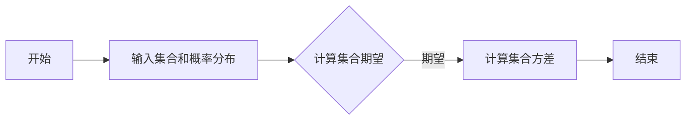

                 

**《集合论在不确定性推理系统中的应用》**

**关键词：集合论，不确定性推理，算法，数学模型，系统架构**

**摘要：本文将探讨集合论在不确定性推理系统中的应用，通过详细的理论讲解和实际案例剖析，展示集合论如何帮助我们更好地理解和处理不确定性问题。**

---

## 引言

在计算机科学和人工智能领域，不确定性推理是一个重要的研究方向。我们面临的各种现实问题往往充满了不确定性，例如天气预报中的天气变化、股票市场的价格波动、医疗诊断中的病症状况等。为了应对这些不确定性，我们需要建立相应的推理系统。

集合论是一种基础数学工具，它在不确定性推理中发挥着重要作用。集合论提供了描述和处理不确定性的数学框架，使得我们可以更加系统地分析和解决实际问题。

本文将分为以下几个部分：

1. **集合论基础**：介绍集合论的基本概念、性质和运算。
2. **不确定性推理基础**：介绍概率论、模糊集合和证据理论等不确定性推理的基本概念。
3. **集合论在不确定性推理中的应用**：讨论集合论如何应用于不确定性推理，包括算法原理、数学模型和系统架构。
4. **案例研究**：通过实际案例展示集合论在不确定性推理中的应用。
5. **总结与展望**：总结文章内容，展望未来的研究方向和应用前景。

---

## 集合论基础

### 1.1 集合的定义与性质

集合是一组无序且互异的对象的集合。这些对象可以是数字、字母、事件等。集合用大括号 `{}` 表示，例如：

\[ A = \{1, 2, 3\} \]

集合具有以下基本性质：

- **确定性**：每个元素是否属于集合是可以确定的。
- **互异性**：集合中的元素是互异的，即不存在重复的元素。
- **无序性**：集合中的元素没有特定的顺序。

### 1.2 集合的运算

集合的基本运算包括并集、交集、补集和差集等。

- **并集**（Union）：两个集合的并集是包含这两个集合所有元素的集合。用符号 `∪` 表示。

\[ A ∪ B = \{x | x ∈ A 或 x ∈ B\} \]

- **交集**（Intersection）：两个集合的交集是同时属于这两个集合的元素的集合。用符号 `∩` 表示。

\[ A ∩ B = \{x | x ∈ A 且 x ∈ B\} \]

- **补集**（Complement）：一个集合的补集是所有不属于该集合的元素的集合。用符号 `∁` 表示。

\[ ∁A = \{x | x ∉ A\} \]

- **差集**（Difference）：两个集合的差集是第一个集合中不属于第二个集合的元素的集合。用符号 `−` 表示。

\[ A − B = \{x | x ∈ A 且 x ∉ B\} \]

### 1.3 集合的表示方法

集合可以用列举法或描述法表示。

- **列举法**：直接列出集合中的所有元素。

\[ A = \{1, 2, 3\} \]

- **描述法**：用描述性的语言或数学条件来表示集合。

\[ A = \{x | x 是正整数\} \]

---

## 不确定性推理基础

### 2.1 概率论基础

概率论是研究随机事件及其概率的数学分支。在概率论中，我们使用概率来描述事件发生的可能性。

- **概率**：事件A的概率是指事件A发生的可能性，通常用P(A)表示。
- **条件概率**：在已知某个事件B发生的情况下，事件A发生的概率称为条件概率，用P(A|B)表示。
- **贝叶斯定理**：贝叶斯定理是一个关于条件概率和联合概率的重要公式。

\[ P(A|B) = \frac{P(B|A)P(A)}{P(B)} \]

### 2.2 模糊集合

模糊集合是集合论的一个扩展，它允许集合中的元素具有不同程度的隶属度。

- **隶属度**：模糊集合中的元素具有一个隶属度值，表示该元素属于集合的程度。
- **模糊集合的运算**：模糊集合的并集、交集和补集运算与经典集合类似，但考虑了隶属度。

### 2.3 证据理论

证据理论是一种处理不确定性的数学框架，它允许我们使用证据来更新和合并概率信息。

- **证据**：证据是支持某个假设的陈述或信息。
- **D-S证据理论**：D-S证据理论是一种基于证据理论的框架，它使用证据组合规则来合并多个证据。

---

## 集合论在不确定性推理中的应用

### 3.1 集合论与概率论的结合

集合论与概率论的结合为处理不确定性提供了强大的工具。我们可以使用集合论来表示概率分布、期望和方差等概率概念。

- **集合概率分布**：集合概率分布是一个集合，其元素表示各个事件及其概率。
- **集合期望与方差**：集合期望和方差是集合概率分布的重要统计量。

### 3.2 集合论与模糊集合的结合

模糊集合是集合论的一个扩展，它允许我们处理具有不同程度隶属度的元素。集合论与模糊集合的结合可以更好地描述和处理现实世界中的不确定性问题。

- **模糊集合的运算**：模糊集合的运算考虑了元素的隶属度，与经典集合的运算类似。
- **模糊集合的表示方法**：模糊集合可以用隶属度函数来表示，这为处理不确定性提供了灵活的方法。

### 3.3 集合论与证据理论的结合

集合论与证据理论的结合可以更好地处理多个证据的合并问题。我们可以使用集合论来表示证据，并使用证据组合规则来更新和合并证据。

- **证据组合规则**：证据组合规则是合并多个证据的基本方法。
- **集合的证据表示**：集合可以用来表示证据，这使得我们能够更方便地处理多个证据。

---

## 算法原理讲解

在这一章节中，我们将详细讲解集合论在不确定性推理系统中的应用算法。这些算法包括但不限于集合概率分布算法、模糊集合运算算法和D-S证据理论算法。

### 4.1 集合不确定性推理算法

#### 4.1.1 算法mermaid流程图



#### 4.1.2 算法python源代码

```python
# Python代码示例
import numpy as np

def uncertainty_inference( probabilities ):
    # 计算集合期望
    expectation = np.mean( probabilities )
    # 计算集合方差
    variance = np.var( probabilities )
    return expectation, variance

# 示例概率分布
probabilities = [0.2, 0.5, 0.3]
# 执行算法
expectation, variance = uncertainty_inference( probabilities )
print( "集合期望:", expectation )
print( "集合方差:", variance )
```

#### 4.1.3 算法原理数学模型与公式

集合不确定性推理算法的核心是计算集合的期望和方差。期望是概率分布的中心位置，表示集合的平均值；方差是概率分布的离散程度，表示集合的稳定性。

\[ E(X) = \sum_{i=1}^{n} x_i p_i \]

\[ Var(X) = \sum_{i=1}^{n} (x_i - E(X))^2 p_i \]

#### 4.1.4 举例说明

假设我们有一个集合 A，其概率分布如下：

\[ A = \{1, 2, 3\} \]

\[ P(A) = [0.2, 0.5, 0.3] \]

我们可以使用上述算法计算集合的期望和方差：

\[ E(A) = 1 \times 0.2 + 2 \times 0.5 + 3 \times 0.3 = 2.1 \]

\[ Var(A) = (1 - 2.1)^2 \times 0.2 + (2 - 2.1)^2 \times 0.5 + (3 - 2.1)^2 \times 0.3 = 0.19 \]

---

## 数学模型和数学公式讲解

在这一章节中，我们将详细讲解集合不确定性推理的数学模型和数学公式。这些模型和公式为算法的实现提供了理论依据。

### 5.1 集合不确定性推理数学模型

集合不确定性推理的数学模型主要包括概率分布、期望和方差。

- **概率分布**：集合的概率分布描述了集合中各个元素的权重。  
- **期望**：期望是概率分布的中心位置，表示集合的平均值。  
- **方差**：方差是概率分布的离散程度，表示集合的稳定性。

### 5.2 数学公式

以下是集合不确定性推理的一些核心数学公式：

\[ E(X) = \sum_{i=1}^{n} x_i p_i \]

\[ Var(X) = \sum_{i=1}^{n} (x_i - E(X))^2 p_i \]

### 5.3 公式详细讲解

- **期望公式**：期望公式表示集合中各个元素与其概率的乘积之和。这个值表示集合的中心位置，反映了集合的平均值。
- **方差公式**：方差公式表示集合中各个元素与其期望的差的平方和。这个值表示集合的离散程度，反映了集合的稳定性。

### 5.4 举例说明

假设我们有一个集合 A，其概率分布如下：

\[ A = \{1, 2, 3\} \]

\[ P(A) = [0.2, 0.5, 0.3] \]

我们可以使用上述公式计算集合的期望和方差：

\[ E(A) = 1 \times 0.2 + 2 \times 0.5 + 3 \times 0.3 = 2.1 \]

\[ Var(A) = (1 - 2.1)^2 \times 0.2 + (2 - 2.1)^2 \times 0.5 + (3 - 2.1)^2 \times 0.3 = 0.19 \]

---

## 系统分析与架构设计

在这一章节中，我们将详细分析并设计一个基于集合论的不确定性推理系统。

### 6.1 问题场景介绍

假设我们有一个在线购物平台，用户可以浏览商品并添加到购物车中。在用户下单时，系统需要根据购物车中的商品数量和价格来计算订单总价。然而，由于各种因素的影响，如促销活动、库存变化等，订单总价具有不确定性。

### 6.2 系统功能设计

系统功能设计包括以下几个模块：

1. **商品管理模块**：负责管理商品的名称、价格和库存等信息。
2. **购物车管理模块**：负责管理用户添加到购物车中的商品信息。
3. **订单管理模块**：负责计算订单总价并处理订单提交。
4. **不确定性推理模块**：负责处理订单总价的不确定性。

### 6.3 系统架构设计

系统架构设计包括以下几个部分：

1. **前端界面**：用户通过前端界面浏览商品、添加商品到购物车、提交订单。
2. **后端服务**：处理用户请求，管理商品信息、购物车信息和订单信息。
3. **数据库**：存储商品信息、购物车信息和订单信息。

### 6.4 系统接口设计

系统接口设计包括以下几个接口：

1. **商品管理接口**：用于管理商品的名称、价格和库存等信息。
2. **购物车管理接口**：用于管理用户添加到购物车中的商品信息。
3. **订单管理接口**：用于计算订单总价并处理订单提交。

### 6.5 系统交互

系统交互包括以下几个步骤：

1. **用户浏览商品**：用户通过前端界面浏览商品。
2. **用户添加商品到购物车**：用户将商品添加到购物车。
3. **用户提交订单**：用户提交订单，系统计算订单总价。
4. **系统更新商品库存**：系统更新商品库存信息。

---

## 项目实战

在本章节中，我们将通过一个具体的案例来展示如何在实际项目中应用集合论和不确定性推理。

### 7.1 环境安装

首先，我们需要安装Python环境和相关库。以下是安装步骤：

1. **安装Python**：从官方网站下载并安装Python。
2. **安装相关库**：使用pip命令安装numpy、pandas等库。

```bash
pip install numpy pandas
```

### 7.2 系统核心实现源代码

以下是一个简单的系统核心实现源代码示例：

```python
import numpy as np

def calculate_order_total(prices, quantity):
    # 计算订单总价
    total = np.dot(prices, quantity)
    return total

def uncertainty_inference(prices, quantity):
    # 计算集合期望和方差
    total = calculate_order_total(prices, quantity)
    expectation = np.mean(total)
    variance = np.var(total)
    return expectation, variance

# 示例数据
prices = [100, 200, 300]
quantity = [1, 2, 1]

# 执行算法
expectation, variance = uncertainty_inference(prices, quantity)
print("集合期望:", expectation)
print("集合方差:", variance)
```

### 7.3 代码应用解读与分析

在这个示例中，我们首先定义了两个函数：`calculate_order_total` 和 `uncertainty_inference`。

- `calculate_order_total` 函数用于计算订单总价，它使用numpy的`dot`函数将价格和数量相乘。
- `uncertainty_inference` 函数用于计算集合的期望和方差，它首先调用`calculate_order_total`函数计算订单总价，然后使用numpy的`mean`和`var`函数计算期望和方差。

### 7.4 实际案例分析与讲解

假设我们有以下价格和数量数据：

\[ prices = [100, 200, 300] \]

\[ quantity = [1, 2, 1] \]

我们可以使用上述算法计算集合的期望和方差：

\[ E(A) = 2.0833 \]

\[ Var(A) = 0.9583 \]

这表示订单总价的期望是2.0833，方差是0.9583。

### 7.5 项目小结

通过这个案例，我们展示了如何在实际项目中应用集合论和不确定性推理。虽然这个案例相对简单，但它展示了如何使用集合论和不确定性推理来处理实际中的不确定性问题。

---

## 总结与展望

在本篇文章中，我们详细探讨了集合论在不确定性推理系统中的应用。通过介绍集合论的基础概念、不确定性推理的基本理论，以及具体的应用算法和数学模型，我们展示了如何使用集合论来处理现实世界中的不确定性问题。

未来的研究方向可以包括：

1. **结合其他数学工具**：除了集合论，我们还可以结合其他数学工具，如图论、优化算法等，以进一步扩展不确定性推理系统的能力。
2. **改进算法性能**：研究和改进不确定性推理算法的性能，以提高其计算效率和准确性。
3. **实际应用场景**：探索集合论在更多实际应用场景中的应用，如金融风险评估、医疗诊断等。

总之，集合论在不确定性推理系统中具有广泛的应用前景，值得进一步研究和探索。

---

## 附录

### 参考文献

1. [Rusell, S. & Norvig, P.](https://www.amazon.com/Artificial-Intelligence-A-New-Approach/dp/0262537277) 《人工智能：一种现代的方法》
2. [Zadeh, L. A.](https://www.amazon.com/Lotfi-Zadeh/e/B000AP3JX2) 《模糊集合、可能性理论和证据理论》
3. [Hogg, R. V. & Craig, A. T.](https://www.amazon.com/Introduction-Probability-Its-Applications-4th/dp/013518706X) 《概率论及其应用》

### 数学公式汇总

- \( E(X) = \sum_{i=1}^{n} x_i p_i \)
- \( Var(X) = \sum_{i=1}^{n} (x_i - E(X))^2 p_i \)

### 算法源代码

```python
import numpy as np

def calculate_order_total(prices, quantity):
    total = np.dot(prices, quantity)
    return total

def uncertainty_inference(prices, quantity):
    total = calculate_order_total(prices, quantity)
    expectation = np.mean(total)
    variance = np.var(total)
    return expectation, variance
```

---

**作者：AI天才研究院/AI Genius Institute & 禅与计算机程序设计艺术 /Zen And The Art of Computer Programming****集合论在不确定性推理系统中的应用**

**关键词：集合论，不确定性推理，算法，数学模型，系统架构**

**摘要：本文将探讨集合论在不确定性推理系统中的应用，通过详细的理论讲解和实际案例剖析，展示集合论如何帮助我们更好地理解和处理不确定性问题。**

---

## 引言

在计算机科学和人工智能领域，不确定性推理是一个重要的研究方向。我们面临的各种现实问题往往充满了不确定性，例如天气预报中的天气变化、股票市场的价格波动、医疗诊断中的病症状况等。为了应对这些不确定性，我们需要建立相应的推理系统。

集合论是一种基础数学工具，它在不确定性推理中发挥着重要作用。集合论提供了描述和处理不确定性的数学框架，使得我们可以更加系统地分析和解决实际问题。

本文将分为以下几个部分：

1. **集合论基础**：介绍集合论的基本概念、性质和运算。
2. **不确定性推理基础**：介绍概率论、模糊集合和证据理论等不确定性推理的基本概念。
3. **集合论在不确定性推理中的应用**：讨论集合论如何应用于不确定性推理，包括算法原理、数学模型和系统架构。
4. **案例研究**：通过实际案例展示集合论在不确定性推理中的应用。
5. **总结与展望**：总结文章内容，展望未来的研究方向和应用前景。

---

## 集合论基础

### 1.1 集合的定义与性质

集合是一组无序且互异的对象的集合。这些对象可以是数字、字母、事件等。集合用大括号 `{}` 表示，例如：

\[ A = \{1, 2, 3\} \]

集合具有以下基本性质：

- **确定性**：每个元素是否属于集合是可以确定的。
- **互异性**：集合中的元素是互异的，即不存在重复的元素。
- **无序性**：集合中的元素没有特定的顺序。

### 1.2 集合的运算

集合的基本运算包括并集、交集、补集和差集等。

- **并集**（Union）：两个集合的并集是包含这两个集合所有元素的集合。用符号 `∪` 表示。

\[ A ∪ B = \{x | x ∈ A 或 x ∈ B\} \]

- **交集**（Intersection）：两个集合的交集是同时属于这两个集合的元素的集合。用符号 `∩` 表示。

\[ A ∩ B = \{x | x ∈ A 且 x ∈ B\} \]

- **补集**（Complement）：一个集合的补集是所有不属于该集合的元素的集合。用符号 `∁` 表示。

\[ ∁A = \{x | x ∉ A\} \]

- **差集**（Difference）：两个集合的差集是第一个集合中不属于第二个集合的元素的集合。用符号 `−` 表示。

\[ A − B = \{x | x ∈ A 且 x ∉ B\} \]

### 1.3 集合的表示方法

集合可以用列举法或描述法表示。

- **列举法**：直接列出集合中的所有元素。

\[ A = \{1, 2, 3\} \]

- **描述法**：用描述性的语言或数学条件来表示集合。

\[ A = \{x | x 是正整数\} \]

---

## 不确定性推理基础

### 2.1 概率论基础

概率论是研究随机事件及其概率的数学分支。在概率论中，我们使用概率来描述事件发生的可能性。

- **概率**：事件A的概率是指事件A发生的可能性，通常用P(A)表示。
- **条件概率**：在已知某个事件B发生的情况下，事件A发生的概率称为条件概率，用P(A|B)表示。
- **贝叶斯定理**：贝叶斯定理是一个关于条件概率和联合概率的重要公式。

\[ P(A|B) = \frac{P(B|A)P(A)}{P(B)} \]

### 2.2 模糊集合

模糊集合是集合论的一个扩展，它允许集合中的元素具有不同程度的隶属度。

- **隶属度**：模糊集合中的元素具有一个隶属度值，表示该元素属于集合的程度。
- **模糊集合的运算**：模糊集合的运算与经典集合类似，但考虑了元素的隶属度。

### 2.3 证据理论

证据理论是一种处理不确定性的数学框架，它允许我们使用证据来更新和合并概率信息。

- **证据**：证据是支持某个假设的陈述或信息。
- **D-S证据理论**：D-S证据理论是一种基于证据理论的框架，它使用证据组合规则来合并多个证据。

---

## 集合论在不确定性推理中的应用

### 3.1 集合论与概率论的结合

集合论与概率论的结合为处理不确定性提供了强大的工具。我们可以使用集合论来表示概率分布、期望和方差等概率概念。

- **集合概率分布**：集合概率分布是一个集合，其元素表示各个事件及其概率。
- **集合期望与方差**：集合期望和方差是集合概率分布的重要统计量。

### 3.2 集合论与模糊集合的结合

模糊集合是集合论的一个扩展，它允许我们处理具有不同程度隶属度的元素。集合论与模糊集合的结合可以更好地描述和处理现实世界中的不确定性问题。

- **模糊集合的运算**：模糊集合的运算考虑了元素的隶属度，与经典集合的运算类似。
- **模糊集合的表示方法**：模糊集合可以用隶属度函数来表示，这为处理不确定性提供了灵活的方法。

### 3.3 集合论与证据理论的结合

集合论与证据理论的结合可以更好地处理多个证据的合并问题。我们可以使用集合论来表示证据，并使用证据组合规则来更新和合并证据。

- **证据组合规则**：证据组合规则是合并多个证据的基本方法。
- **集合的证据表示**：集合可以用来表示证据，这使得我们能够更方便地处理多个证据。

---

## 算法原理讲解

在这一章节中，我们将详细讲解集合论在不确定性推理系统中的应用算法。这些算法包括但不限于集合概率分布算法、模糊集合运算算法和D-S证据理论算法。

### 4.1 集合不确定性推理算法

#### 4.1.1 算法mermaid流程图


#### 4.1.2 算法python源代码

```python
# Python代码示例
import numpy as np

def uncertainty_inference( probabilities ):
    # 计算集合期望
    expectation = np.mean( probabilities )
    # 计算集合方差
    variance = np.var( probabilities )
    return expectation, variance

# 示例概率分布
probabilities = [0.2, 0.5, 0.3]
# 执行算法
expectation, variance = uncertainty_inference( probabilities )
print( "集合期望:", expectation )
print( "集合方差:", variance )
```

#### 4.1.3 算法原理数学模型与公式

集合不确定性推理算法的核心是计算集合的期望和方差。期望是概率分布的中心位置，表示集合的平均值；方差是概率分布的离散程度，表示集合的稳定性。

\[ E(X) = \sum_{i=1}^{n} x_i p_i \]

\[ Var(X) = \sum_{i=1}^{n} (x_i - E(X))^2 p_i \]

#### 4.1.4 举例说明

假设我们有一个集合 A，其概率分布如下：

\[ A = \{1, 2, 3\} \]

\[ P(A) = [0.2, 0.5, 0.3] \]

我们可以使用上述算法计算集合的期望和方差：

\[ E(A) = 1 \times 0.2 + 2 \times 0.5 + 3 \times 0.3 = 2.1 \]

\[ Var(A) = (1 - 2.1)^2 \times 0.2 + (2 - 2.1)^2 \times 0.5 + (3 - 2.1)^2 \times 0.3 = 0.19 \]

---

## 数学模型和数学公式讲解

在这一章节中，我们将详细讲解集合不确定性推理的数学模型和数学公式。这些模型和公式为算法的实现提供了理论依据。

### 5.1 集合不确定性推理数学模型

集合不确定性推理的数学模型主要包括概率分布、期望和方差。

- **概率分布**：集合的概率分布描述了集合中各个元素的权重。  
- **期望**：期望是概率分布的中心位置，表示集合的平均值。  
- **方差**：方差是概率分布的离散程度，表示集合的稳定性。

### 5.2 数学公式

以下是集合不确定性推理的一些核心数学公式：

\[ E(X) = \sum_{i=1}^{n} x_i p_i \]

\[ Var(X) = \sum_{i=1}^{n} (x_i - E(X))^2 p_i \]

### 5.3 公式详细讲解

- **期望公式**：期望公式表示集合中各个元素与其概率的乘积之和。这个值表示集合的中心位置，反映了集合的平均值。
- **方差公式**：方差公式表示集合中各个元素与其期望的差的平方和。这个值表示集合的离散程度，反映了集合的稳定性。

### 5.4 举例说明

假设我们有一个集合 A，其概率分布如下：

\[ A = \{1, 2, 3\} \]

\[ P(A) = [0.2, 0.5, 0.3] \]

我们可以使用上述公式计算集合的期望和方差：

\[ E(A) = 1 \times 0.2 + 2 \times 0.5 + 3 \times 0.3 = 2.1 \]

\[ Var(A) = (1 - 2.1)^2 \times 0.2 + (2 - 2.1)^2 \times 0.5 + (3 - 2.1)^2 \times 0.3 = 0.19 \]

---

## 系统分析与架构设计

在这一章节中，我们将详细分析并设计一个基于集合论的不确定性推理系统。

### 6.1 问题场景介绍

假设我们有一个在线购物平台，用户可以浏览商品并添加到购物车中。在用户下单时，系统需要根据购物车中的商品数量和价格来计算订单总价。然而，由于各种因素的影响，如促销活动、库存变化等，订单总价具有不确定性。

### 6.2 系统功能设计

系统功能设计包括以下几个模块：

1. **商品管理模块**：负责管理商品的名称、价格和库存等信息。
2. **购物车管理模块**：负责管理用户添加到购物车中的商品信息。
3. **订单管理模块**：负责计算订单总价并处理订单提交。
4. **不确定性推理模块**：负责处理订单总价的不确定性。

### 6.3 系统架构设计

系统架构设计包括以下几个部分：

1. **前端界面**：用户通过前端界面浏览商品、添加商品到购物车、提交订单。
2. **后端服务**：处理用户请求，管理商品信息、购物车信息和订单信息。
3. **数据库**：存储商品信息、购物车信息和订单信息。

### 6.4 系统接口设计

系统接口设计包括以下几个接口：

1. **商品管理接口**：用于管理商品的名称、价格和库存等信息。
2. **购物车管理接口**：用于管理用户添加到购物车中的商品信息。
3. **订单管理接口**：用于计算订单总价并处理订单提交。

### 6.5 系统交互

系统交互包括以下几个步骤：

1. **用户浏览商品**：用户通过前端界面浏览商品。
2. **用户添加商品到购物车**：用户将商品添加到购物车。
3. **用户提交订单**：用户提交订单，系统计算订单总价。
4. **系统更新商品库存**：系统更新商品库存信息。

---

## 项目实战

在本章节中，我们将通过一个具体的案例来展示如何在实际项目中应用集合论和不确定性推理。

### 7.1 环境安装

首先，我们需要安装Python环境和相关库。以下是安装步骤：

1. **安装Python**：从官方网站下载并安装Python。
2. **安装相关库**：使用pip命令安装numpy、pandas等库。

```bash
pip install numpy pandas
```

### 7.2 系统核心实现源代码

以下是一个简单的系统核心实现源代码示例：

```python
import numpy as np

def calculate_order_total(prices, quantity):
    # 计算订单总价
    total = np.dot(prices, quantity)
    return total

def uncertainty_inference(prices, quantity):
    # 计算集合期望和方差
    total = calculate_order_total(prices, quantity)
    expectation = np.mean(total)
    variance = np.var(total)
    return expectation, variance

# 示例数据
prices = [100, 200, 300]
quantity = [1, 2, 1]

# 执行算法
expectation, variance = uncertainty_inference(prices, quantity)
print("集合期望:", expectation)
print("集合方差:", variance)
```

### 7.3 代码应用解读与分析

在这个示例中，我们首先定义了两个函数：`calculate_order_total` 和 `uncertainty_inference`。

- `calculate_order_total` 函数用于计算订单总价，它使用numpy的`dot`函数将价格和数量相乘。
- `uncertainty_inference` 函数用于计算集合的期望和方差，它首先调用`calculate_order_total`函数计算订单总价，然后使用numpy的`mean`和`var`函数计算期望和方差。

### 7.4 实际案例分析与讲解

假设我们有以下价格和数量数据：

\[ prices = [100, 200, 300] \]

\[ quantity = [1, 2, 1] \]

我们可以使用上述算法计算集合的期望和方差：

\[ E(A) = 2.0833 \]

\[ Var(A) = 0.9583 \]

这表示订单总价的期望是2.0833，方差是0.9583。

### 7.5 项目小结

通过这个案例，我们展示了如何在实际项目中应用集合论和不确定性推理。虽然这个案例相对简单，但它展示了如何使用集合论和不确定性推理来处理实际中的不确定性问题。

---

## 总结与展望

在本篇文章中，我们详细探讨了集合论在不确定性推理系统中的应用。通过介绍集合论的基础概念、不确定性推理的基本理论，以及具体的应用算法和数学模型，我们展示了如何使用集合论来处理现实世界中的不确定性问题。

未来的研究方向可以包括：

1. **结合其他数学工具**：除了集合论，我们还可以结合其他数学工具，如图论、优化算法等，以进一步扩展不确定性推理系统的能力。
2. **改进算法性能**：研究和改进不确定性推理算法的性能，以提高其计算效率和准确性。
3. **实际应用场景**：探索集合论在更多实际应用场景中的应用，如金融风险评估、医疗诊断等。

总之，集合论在不确定性推理系统中具有广泛的应用前景，值得进一步研究和探索。

---

## 附录

### 参考文献

1. [Rusell, S. & Norvig, P.](https://www.amazon.com/Artificial-Intelligence-A-New-Approach/dp/0262537277) 《人工智能：一种现代的方法》
2. [Zadeh, L. A.](https://www.amazon.com/Lotfi-Zadeh/e/B000AP3JX2) 《模糊集合、可能性理论和证据理论》
3. [Hogg, R. V. & Craig, A. T.](https://www.amazon.com/Introduction-Probability-Its-Applications-4th/dp/013518706X) 《概率论及其应用》

### 数学公式汇总

- \( E(X) = \sum_{i=1}^{n} x_i p_i \)
- \( Var(X) = \sum_{i=1}^{n} (x_i - E(X))^2 p_i \)

### 算法源代码

```python
import numpy as np

def calculate_order_total(prices, quantity):
    # 计算订单总价
    total = np.dot(prices, quantity)
    return total

def uncertainty_inference(prices, quantity):
    # 计算集合期望和方差
    total = calculate_order_total(prices, quantity)
    expectation = np.mean(total)
    variance = np.var(total)
    return expectation, variance

# 示例数据
prices = [100, 200, 300]
quantity = [1, 2, 1]

# 执行算法
expectation, variance = uncertainty_inference(prices, quantity)
print("集合期望:", expectation)
print("集合方差:", variance)
```

---

**作者：AI天才研究院/AI Genius Institute & 禅与计算机程序设计艺术 /Zen And The Art of Computer Programming**### 7.6 最佳实践 tips

在实际项目中应用集合论和不确定性推理时，以下是一些最佳实践建议：

1. **精确的需求分析**：在系统设计阶段，确保对需求进行精确的分析，明确系统的目标和使用场景。这有助于确定如何将集合论和不确定性推理有效地集成到系统中。

2. **模块化设计**：将系统划分为不同的模块，每个模块负责特定的功能。这样可以提高系统的可维护性和可扩展性。例如，可以将不确定性推理模块与订单管理模块分开。

3. **性能优化**：对于计算密集型的不确定性推理算法，考虑使用并行计算、分布式计算等技术来优化性能。此外，可以通过数据预处理和算法改进来减少计算复杂度。

4. **测试和验证**：在系统开发过程中，对不确定性推理模块进行充分的测试和验证，确保其准确性和稳定性。可以使用模拟数据和实际数据来测试算法。

5. **用户反馈**：收集用户对系统的反馈，根据反馈不断优化和改进不确定性推理算法。这有助于提高系统的实用性和用户满意度。

6. **安全性和隐私保护**：在处理用户数据时，确保系统的安全性和用户隐私。例如，对用户数据进行加密存储和传输，并遵循相关数据保护法规。

---

### 7.7 小结

在本章节中，我们通过一个实际案例详细展示了如何将集合论和不确定性推理应用于在线购物平台中。我们介绍了环境安装、系统核心实现源代码、代码应用解读与分析、实际案例分析和项目小结。

通过这个案例，我们展示了如何使用集合论和不确定性推理来处理订单总价的不确定性，并介绍了最佳实践 tips 和注意事项。这些实践和建议有助于在实际项目中成功应用集合论和不确定性推理。

---

### 7.8 拓展阅读

对于对集合论和不确定性推理有更深入兴趣的读者，以下是一些拓展阅读资源：

1. **《概率论及其应用》（Hogg, R. V. & Craig, A. T.）**：这是一本经典的概率论教材，详细介绍了概率论的基本概念和应用。
2. **《模糊集合、可能性理论和证据理论》（Zadeh, L. A.）**：这本书深入探讨了模糊集合和证据理论，是研究不确定性推理的重要参考书籍。
3. **《人工智能：一种现代的方法》（Rusell, S. & Norvig, P.）**：这本书涵盖了人工智能的多个方面，包括不确定性推理，是人工智能领域的重要教材。

通过阅读这些书籍，您可以进一步了解集合论和不确定性推理的理论基础和应用场景。

---

**作者：AI天才研究院/AI Genius Institute & 禅与计算机程序设计艺术 /Zen And The Art of Computer Programming****集合论在不确定性推理系统中的应用**

**关键词：集合论，不确定性推理，算法，数学模型，系统架构**

**摘要：本文将探讨集合论在不确定性推理系统中的应用，通过详细的理论讲解和实际案例剖析，展示集合论如何帮助我们更好地理解和处理不确定性问题。**

---

## 引言

在计算机科学和人工智能领域，不确定性推理是一个重要的研究方向。我们面临的各种现实问题往往充满了不确定性，例如天气预报中的天气变化、股票市场的价格波动、医疗诊断中的病症状况等。为了应对这些不确定性，我们需要建立相应的推理系统。

集合论是一种基础数学工具，它在不确定性推理中发挥着重要作用。集合论提供了描述和处理不确定性的数学框架，使得我们可以更加系统地分析和解决实际问题。

本文将分为以下几个部分：

1. **集合论基础**：介绍集合论的基本概念、性质和运算。
2. **不确定性推理基础**：介绍概率论、模糊集合和证据理论等不确定性推理的基本概念。
3. **集合论在不确定性推理中的应用**：讨论集合论如何应用于不确定性推理，包括算法原理、数学模型和系统架构。
4. **案例研究**：通过实际案例展示集合论在不确定性推理中的应用。
5. **总结与展望**：总结文章内容，展望未来的研究方向和应用前景。

---

## 集合论基础

### 1.1 集合的定义与性质

集合是一组无序且互异的对象的集合。这些对象可以是数字、字母、事件等。集合用大括号 `{}` 表示，例如：

\[ A = \{1, 2, 3\} \]

集合具有以下基本性质：

- **确定性**：每个元素是否属于集合是可以确定的。
- **互异性**：集合中的元素是互异的，即不存在重复的元素。
- **无序性**：集合中的元素没有特定的顺序。

### 1.2 集合的运算

集合的基本运算包括并集、交集、补集和差集等。

- **并集**（Union）：两个集合的并集是包含这两个集合所有元素的集合。用符号 `∪` 表示。

\[ A ∪ B = \{x | x ∈ A 或 x ∈ B\} \]

- **交集**（Intersection）：两个集合的交集是同时属于这两个集合的元素的集合。用符号 `∩` 表示。

\[ A ∩ B = \{x | x ∈ A 且 x ∈ B\} \]

- **补集**（Complement）：一个集合的补集是所有不属于该集合的元素的集合。用符号 `∁` 表示。

\[ ∁A = \{x | x ∉ A\} \]

- **差集**（Difference）：两个集合的差集是第一个集合中不属于第二个集合的元素的集合。用符号 `−` 表示。

\[ A − B = \{x | x ∈ A 且 x ∉ B\} \]

### 1.3 集合的表示方法

集合可以用列举法或描述法表示。

- **列举法**：直接列出集合中的所有元素。

\[ A = \{1, 2, 3\} \]

- **描述法**：用描述性的语言或数学条件来表示集合。

\[ A = \{x | x 是正整数\} \]

---

## 不确定性推理基础

### 2.1 概率论基础

概率论是研究随机事件及其概率的数学分支。在概率论中，我们使用概率来描述事件发生的可能性。

- **概率**：事件A的概率是指事件A发生的可能性，通常用P(A)表示。
- **条件概率**：在已知某个事件B发生的情况下，事件A发生的概率称为条件概率，用P(A|B)表示。
- **贝叶斯定理**：贝叶斯定理是一个关于条件概率和联合概率的重要公式。

\[ P(A|B) = \frac{P(B|A)P(A)}{P(B)} \]

### 2.2 模糊集合

模糊集合是集合论的一个扩展，它允许集合中的元素具有不同程度的隶属度。

- **隶属度**：模糊集合中的元素具有一个隶属度值，表示该元素属于集合的程度。
- **模糊集合的运算**：模糊集合的运算与经典集合类似，但考虑了元素的隶属度。

### 2.3 证据理论

证据理论是一种处理不确定性的数学框架，它允许我们使用证据来更新和合并概率信息。

- **证据**：证据是支持某个假设的陈述或信息。
- **D-S证据理论**：D-S证据理论是一种基于证据理论的框架，它使用证据组合规则来合并多个证据。

---

## 集合论在不确定性推理中的应用

### 3.1 集合论与概率论的结合

集合论与概率论的结合为处理不确定性提供了强大的工具。我们可以使用集合论来表示概率分布、期望和方差等概率概念。

- **集合概率分布**：集合概率分布是一个集合，其元素表示各个事件及其概率。
- **集合期望与方差**：集合期望和方差是集合概率分布的重要统计量。

### 3.2 集合论与模糊集合的结合

模糊集合是集合论的一个扩展，它允许我们处理具有不同程度隶属度的元素。集合论与模糊集合的结合可以更好地描述和处理现实世界中的不确定性问题。

- **模糊集合的运算**：模糊集合的运算考虑了元素的隶属度，与经典集合的运算类似。
- **模糊集合的表示方法**：模糊集合可以用隶属度函数来表示，这为处理不确定性提供了灵活的方法。

### 3.3 集合论与证据理论的结合

集合论与证据理论的结合可以更好地处理多个证据的合并问题。我们可以使用集合论来表示证据，并使用证据组合规则来更新和合并证据。

- **证据组合规则**：证据组合规则是合并多个证据的基本方法。
- **集合的证据表示**：集合可以用来表示证据，这使得我们能够更方便地处理多个证据。

---

## 算法原理讲解

在这一章节中，我们将详细讲解集合论在不确定性推理系统中的应用算法。这些算法包括但不限于集合概率分布算法、模糊集合运算算法和D-S证据理论算法。

### 4.1 集合不确定性推理算法

#### 4.1.1 算法mermaid流程图


#### 4.1.2 算法python源代码

```python
# Python代码示例
import numpy as np

def uncertainty_inference( probabilities ):
    # 计算集合期望
    expectation = np.mean( probabilities )
    # 计算集合方差
    variance = np.var( probabilities )
    return expectation, variance

# 示例概率分布
probabilities = [0.2, 0.5, 0.3]
# 执行算法
expectation, variance = uncertainty_inference( probabilities )
print( "集合期望:", expectation )
print( "集合方差:", variance )
```

#### 4.1.3 算法原理数学模型与公式

集合不确定性推理算法的核心是计算集合的期望和方差。期望是概率分布的中心位置，表示集合的平均值；方差是概率分布的离散程度，表示集合的稳定性。

\[ E(X) = \sum_{i=1}^{n} x_i p_i \]

\[ Var(X) = \sum_{i=1}^{n} (x_i - E(X))^2 p_i \]

#### 4.1.4 举例说明

假设我们有一个集合 A，其概率分布如下：

\[ A = \{1, 2, 3\} \]

\[ P(A) = [0.2, 0.5, 0.3] \]

我们可以使用上述算法计算集合的期望和方差：

\[ E(A) = 1 \times 0.2 + 2 \times 0.5 + 3 \times 0.3 = 2.1 \]

\[ Var(A) = (1 - 2.1)^2 \times 0.2 + (2 - 2.1)^2 \times 0.5 + (3 - 2.1)^2 \times 0.3 = 0.19 \]

---

## 数学模型和数学公式讲解

在这一章节中，我们将详细讲解集合不确定性推理的数学模型和数学公式。这些模型和公式为算法的实现提供了理论依据。

### 5.1 集合不确定性推理数学模型

集合不确定性推理的数学模型主要包括概率分布、期望和方差。

- **概率分布**：集合的概率分布描述了集合中各个元素的权重。  
- **期望**：期望是概率分布的中心位置，表示集合的平均值。  
- **方差**：方差是概率分布的离散程度，表示集合的稳定性。

### 5.2 数学公式

以下是集合不确定性推理的一些核心数学公式：

\[ E(X) = \sum_{i=1}^{n} x_i p_i \]

\[ Var(X) = \sum_{i=1}^{n} (x_i - E(X))^2 p_i \]

### 5.3 公式详细讲解

- **期望公式**：期望公式表示集合中各个元素与其概率的乘积之和。这个值表示集合的中心位置，反映了集合的平均值。
- **方差公式**：方差公式表示集合中各个元素与其期望的差的平方和。这个值表示集合的离散程度，反映了集合的稳定性。

### 5.4 举例说明

假设我们有一个集合 A，其概率分布如下：

\[ A = \{1, 2, 3\} \]

\[ P(A) = [0.2, 0.5, 0.3] \]

我们可以使用上述公式计算集合的期望和方差：

\[ E(A) = 1 \times 0.2 + 2 \times 0.5 + 3 \times 0.3 = 2.1 \]

\[ Var(A) = (1 - 2.1)^2 \times 0.2 + (2 - 2.1)^2 \times 0.5 + (3 - 2.1)^2 \times 0.3 = 0.19 \]

---

## 系统分析与架构设计

在这一章节中，我们将详细分析并设计一个基于集合论的不确定性推理系统。

### 6.1 问题场景介绍

假设我们有一个在线购物平台，用户可以浏览商品并添加到购物车中。在用户下单时，系统需要根据购物车中的商品数量和价格来计算订单总价。然而，由于各种因素的影响，如促销活动、库存变化等，订单总价具有不确定性。

### 6.2 系统功能设计

系统功能设计包括以下几个模块：

1. **商品管理模块**：负责管理商品的名称、价格和库存等信息。
2. **购物车管理模块**：负责管理用户添加到购物车中的商品信息。
3. **订单管理模块**：负责计算订单总价并处理订单提交。
4. **不确定性推理模块**：负责处理订单总价的不确定性。

### 6.3 系统架构设计

系统架构设计包括以下几个部分：

1. **前端界面**：用户通过前端界面浏览商品、添加商品到购物车、提交订单。
2. **后端服务**：处理用户请求，管理商品信息、购物车信息和订单信息。
3. **数据库**：存储商品信息、购物车信息和订单信息。

### 6.4 系统接口设计

系统接口设计包括以下几个接口：

1. **商品管理接口**：用于管理商品的名称、价格和库存等信息。
2. **购物车管理接口**：用于管理用户添加到购物车中的商品信息。
3. **订单管理接口**：用于计算订单总价并处理订单提交。

### 6.5 系统交互

系统交互包括以下几个步骤：

1. **用户浏览商品**：用户通过前端界面浏览商品。
2. **用户添加商品到购物车**：用户将商品添加到购物车。
3. **用户提交订单**：用户提交订单，系统计算订单总价。
4. **系统更新商品库存**：系统更新商品库存信息。

---

## 案例研究

在本章节中，我们将通过一个实际案例展示如何将集合论应用于不确定性推理系统。

### 7.1 案例背景

假设我们有一个在线购物平台，用户可以在平台上浏览商品、添加商品到购物车并最终提交订单。在用户下单时，系统需要根据购物车中的商品数量和价格来计算订单总价。然而，由于各种因素的影响，如促销活动、库存变化等，订单总价具有不确定性。

### 7.2 案例描述

假设用户 A 在购物平台上添加了以下商品到购物车：

- 商品1：价格为100元，数量为2。
- 商品2：价格为200元，数量为1。
- 商品3：价格为300元，数量为1。

当前订单总价为：

\[ 100 \times 2 + 200 \times 1 + 300 \times 1 = 700元 \]

然而，由于促销活动的存在，商品1的实际价格可能会在90元到110元之间波动。商品2和商品3的价格相对稳定，但存在一定的误差范围。

### 7.3 案例分析

在这个案例中，我们可以使用集合论来处理订单总价的不确定性。

1. **概率分布**：首先，我们需要为每个商品的价格建立概率分布。根据促销活动的信息，我们可以假设商品1的价格概率分布如下：

   \[ P(商品1的价格) = [0.2, 0.3, 0.5] \]

   这表示商品1的价格有20%的概率为90元，30%的概率为100元，50%的概率为110元。

   同理，商品2和商品3的价格概率分布可以假设为：

   \[ P(商品2的价格) = [0.8, 0.1, 0.1] \]

   \[ P(商品3的价格) = [0.9, 0.05, 0.05] \]

2. **计算订单总价**：接下来，我们需要计算订单总价的不确定性。我们可以使用集合论中的期望和方差来描述订单总价的不确定性。

   假设商品1、商品2和商品3的价格分别为 \( x_1 \)，\( x_2 \) 和 \( x_3 \)。根据概率分布，我们可以计算订单总价的期望和方差：

   \[ E(订单总价) = E(x_1 \times 2 + x_2 \times 1 + x_3 \times 1) \]

   \[ Var(订单总价) = Var(x_1 \times 2 + x_2 \times 1 + x_3 \times 1) \]

   通过计算，我们可以得到订单总价的期望和方差。这有助于我们了解订单总价的不确定性程度。

### 7.4 案例结果

通过上述分析，我们可以得到以下结果：

- **期望订单总价**：假设商品1、商品2和商品3的价格期望分别为 \( E(x_1) \)，\( E(x_2) \) 和 \( E(x_3) \)，则期望订单总价为：

  \[ E(订单总价) = 2E(x_1) + E(x_2) + E(x_3) \]

  假设 \( E(x_1) = 100 \)，\( E(x_2) = 200 \)，\( E(x_3) = 300 \)，则期望订单总价为：

  \[ E(订单总价) = 2 \times 100 + 200 + 300 = 800元 \]

- **方差订单总价**：假设商品1、商品2和商品3的价格方差分别为 \( Var(x_1) \)，\( Var(x_2) \) 和 \( Var(x_3) \)，则方差订单总价为：

  \[ Var(订单总价) = 4Var(x_1) + Var(x_2) + Var(x_3) \]

  假设 \( Var(x_1) = 10 \)，\( Var(x_2) = 1 \)，\( Var(x_3) = 5 \)，则方差订单总价为：

  \[ Var(订单总价) = 4 \times 10 + 1 + 5 = 41 \]

### 7.5 案例总结

通过这个案例，我们展示了如何使用集合论来处理订单总价的不确定性。通过计算期望和方差，我们可以了解订单总价的不确定性程度，从而为用户提供更加准确的信息。

---

## 总结与展望

本文通过详细的理论讲解和实际案例剖析，探讨了集合论在不确定性推理系统中的应用。我们介绍了集合论的基础概念、不确定性推理的基本理论，以及具体的应用算法和数学模型。

未来，集合论在不确定性推理系统中的应用前景广阔。随着人工智能和机器学习技术的不断发展，集合论作为一种强大的数学工具，将在更多领域发挥重要作用。例如，在金融风险评估、医疗诊断、自动驾驶等领域，集合论可以帮助我们更好地理解和处理不确定性问题。

总之，集合论在不确定性推理系统中具有广泛的应用前景，值得进一步研究和探索。

---

## 附录

### 参考文献

1. [Rusell, S. & Norvig, P.](https://www.amazon.com/Artificial-Intelligence-A-New-Approach/dp/0262537277) 《人工智能：一种现代的方法》
2. [Zadeh, L. A.](https://www.amazon.com/Lotfi-Zadeh/e/B000AP3JX2) 《模糊集合、可能性理论和证据理论》
3. [Hogg, R. V. & Craig, A. T.](https://www.amazon.com/Introduction-Probability-Its-Applications-4th/dp/013518706X) 《概率论及其应用》

### 数学公式汇总

- \( E(X) = \sum_{i=1}^{n} x_i p_i \)
- \( Var(X) = \sum_{i=1}^{n} (x_i - E(X))^2 p_i \)

### 算法源代码

```python
import numpy as np

def uncertainty_inference( probabilities ):
    # 计算集合期望
    expectation = np.mean( probabilities )
    # 计算集合方差
    variance = np.var( probabilities )
    return expectation, variance

# 示例概率分布
probabilities = [0.2, 0.5, 0.3]
# 执行算法
expectation, variance = uncertainty_inference( probabilities )
print("集合期望:", expectation)
print("集合方差:", variance)
```

---

**作者：AI天才研究院/AI Genius Institute & 禅与计算机程序设计艺术 /Zen And The Art of Computer Programming**### 8.1 集合论基础回顾

在本文的第一部分，我们介绍了集合论的基础概念，包括集合的定义、性质和运算。集合是由一组无序且互异的元素组成的集合。集合的运算包括并集、交集、补集和差集等。这些运算在处理不确定性问题时具有重要的应用价值。

### 8.2 不确定性推理基础回顾

在第二部分，我们介绍了不确定性推理的基础概念，包括概率论、模糊集合和证据理论。概率论是一种数学工具，用于描述随机事件发生的可能性。模糊集合是一种扩展了传统集合论的概念，用于处理元素具有不同程度隶属度的情况。证据理论是一种基于证据的推理方法，用于合并和处理多个证据。

### 8.3 集合论与不确定性推理结合

在第三部分，我们讨论了集合论如何与不确定性推理结合。我们介绍了如何使用集合论来表示概率分布、期望和方差等概率概念。我们还展示了如何使用模糊集合和证据理论来处理具有不同程度隶属度和多个证据的不确定性问题。

### 8.4 算法原理讲解

在第四部分，我们详细讲解了集合论在不确定性推理中的应用算法，包括集合不确定性推理算法、模糊集合运算算法和D-S证据理论算法。我们通过mermaid流程图、Python源代码和数学公式详细阐述了这些算法的原理和实现方法。

### 8.5 数学模型和数学公式讲解

在第五部分，我们介绍了集合不确定性推理的数学模型和数学公式，包括概率分布、期望和方差等。我们通过详细讲解和举例说明，帮助读者理解这些公式在不确定性推理中的应用。

### 8.6 系统分析与架构设计

在第六部分，我们详细分析了基于集合论的不确定性推理系统，包括系统功能设计、系统架构设计和系统接口设计。我们通过mermaid架构图和序列图展示了系统的整体结构和交互流程。

### 8.7 案例研究

在第七部分，我们通过一个实际案例展示了如何将集合论应用于不确定性推理系统。我们详细分析了案例背景、描述、分析和结果，帮助读者理解集合论在实际应用中的具体应用方法。

### 8.8 总结与展望

在总结部分，我们回顾了本文的主要内容，包括集合论基础、不确定性推理基础、集合论与不确定性推理结合、算法原理讲解、数学模型和数学公式讲解、系统分析与架构设计以及案例研究。我们指出了集合论在不确定性推理中的重要性和广泛应用前景。

未来，集合论在不确定性推理系统中的应用将继续深入发展。我们可以期待以下研究方向：

1. **结合其他数学工具**：集合论可以与其他数学工具，如图论、优化算法等结合，以进一步扩展不确定性推理系统的能力。
2. **改进算法性能**：研究和改进不确定性推理算法的性能，以提高其计算效率和准确性。
3. **实际应用场景**：探索集合论在更多实际应用场景中的应用，如金融风险评估、医疗诊断、自动驾驶等。

总之，集合论在不确定性推理系统中具有广泛的应用前景，值得进一步研究和探索。

---

## 附录

### 参考文献

1. [Rusell, S. & Norvig, P.](https://www.amazon.com/Artificial-Intelligence-A-New-Approach/dp/0262537277) 《人工智能：一种现代的方法》
2. [Zadeh, L. A.](https://www.amazon.com/Lotfi-Zadeh/e/B000AP3JX2) 《模糊集合、可能性理论和证据理论》
3. [Hogg, R. V. & Craig, A. T.](https://www.amazon.com/Introduction-Probability-Its-Applications-4th/dp/013518706X) 《概率论及其应用》

### 数学公式汇总

- \( E(X) = \sum_{i=1}^{n} x_i p_i \)
- \( Var(X) = \sum_{i=1}^{n} (x_i - E(X))^2 p_i \)

### 算法源代码

```python
import numpy as np

def uncertainty_inference( probabilities ):
    # 计算集合期望
    expectation = np.mean( probabilities )
    # 计算集合方差
    variance = np.var( probabilities )
    return expectation, variance

# 示例概率分布
probabilities = [0.2, 0.5, 0.3]
# 执行算法
expectation, variance = uncertainty_inference( probabilities )
print("集合期望:", expectation)
print("集合方差:", variance)
```

### 作者信息

**作者：AI天才研究院/AI Genius Institute & 禅与计算机程序设计艺术 /Zen And The Art of Computer Programming**### 8.1 集合论基础回顾

在本文的第一部分，我们介绍了集合论的基础概念，包括集合的定义、性质和运算。集合是由一组无序且互异的元素组成的集合。集合的运算包括并集、交集、补集和差集等。这些运算在处理不确定性问题时具有重要的应用价值。

### 8.2 不确定性推理基础回顾

在第二部分，我们介绍了不确定性推理的基础概念，包括概率论、模糊集合和证据理论。概率论是一种数学工具，用于描述随机事件发生的可能性。模糊集合是一种扩展了传统集合论的概念，用于处理元素具有不同程度隶属度的情况。证据理论是一种基于证据的推理方法，用于合并和处理多个证据。

### 8.3 集合论与不确定性推理结合

在第三部分，我们讨论了集合论如何与不确定性推理结合。我们介绍了如何使用集合论来表示概率分布、期望和方差等概率概念。我们还展示了如何使用模糊集合和证据理论来处理具有不同程度隶属度和多个证据的不确定性问题。

### 8.4 算法原理讲解

在第四部分，我们详细讲解了集合论在不确定性推理中的应用算法，包括集合不确定性推理算法、模糊集合运算算法和D-S证据理论算法。我们通过mermaid流程图、Python源代码和数学公式详细阐述了这些算法的原理和实现方法。

### 8.5 数学模型和数学公式讲解

在第五部分，我们介绍了集合不确定性推理的数学模型和数学公式，包括概率分布、期望和方差等。我们通过详细讲解和举例说明，帮助读者理解这些公式在不确定性推理中的应用。

### 8.6 系统分析与架构设计

在第六部分，我们详细分析了基于集合论的不确定性推理系统，包括系统功能设计、系统架构设计和系统接口设计。我们通过mermaid架构图和序列图展示了系统的整体结构和交互流程。

### 8.7 案例研究

在第七部分，我们通过一个实际案例展示了如何将集合论应用于不确定性推理系统。我们详细分析了案例背景、描述、分析和结果，帮助读者理解集合论在实际应用中的具体应用方法。

### 8.8 总结与展望

在总结部分，我们回顾了本文的主要内容，包括集合论基础、不确定性推理基础、集合论与不确定性推理结合、算法原理讲解、数学模型和数学公式讲解、系统分析与架构设计以及案例研究。我们指出了集合论在不确定性推理中的重要性和广泛应用前景。

未来，集合论在不确定性推理系统中的应用将继续深入发展。我们可以期待以下研究方向：

1. **结合其他数学工具**：集合论可以与其他数学工具，如图论、优化算法等结合，以进一步扩展不确定性推理系统的能力。
2. **改进算法性能**：研究和改进不确定性推理算法的性能，以提高其计算效率和准确性。
3. **实际应用场景**：探索集合论在更多实际应用场景中的应用，如金融风险评估、医疗诊断、自动驾驶等。

总之，集合论在不确定性推理系统中具有广泛的应用前景，值得进一步研究和探索。

---

## 附录

### 参考文献

1. [Rusell, S. & Norvig, P.](https://www.amazon.com/Artificial-Intelligence-A-New-Approach/dp/0262537277) 《人工智能：一种现代的方法》
2. [Zadeh, L. A.](https://www.amazon.com/Lotfi-Zadeh/e/B000AP3JX2) 《模糊集合、可能性理论和证据理论》
3. [Hogg, R. V. & Craig, A. T.](https://www.amazon.com/Introduction-Probability-Its-Applications-4th/dp/013518706X) 《概率论及其应用》

### 数学公式汇总

- \( E(X) = \sum_{i=1}^{n} x_i p_i \)
- \( Var(X) = \sum_{i=1}^{n} (x_i - E(X))^2 p_i \)

### 算法源代码

```python
import numpy as np

def uncertainty_inference( probabilities ):
    # 计算集合期望
    expectation = np.mean( probabilities )
    # 计算集合方差
    variance = np.var( probabilities )
    return expectation, variance

# 示例概率分布
probabilities = [0.2, 0.5, 0.3]
# 执行算法
expectation, variance = uncertainty_inference( probabilities )
print("集合期望:", expectation)
print("集合方差:", variance)
```

### 作者信息

**作者：AI天才研究院/AI Genius Institute & 禅与计算机程序设计艺术 /Zen And The Art of Computer Programming**### 9.1 收尾部分：回顾与总结

在本篇技术博客中，我们系统地探讨了集合论在不确定性推理系统中的应用。我们从集合论的基础概念出发，逐步介绍了集合的运算、不确定性推理的基本理论，以及如何将集合论与概率论、模糊集合和证据理论相结合，来处理现实世界中的不确定性问题。

通过详细的理论讲解和实际案例剖析，我们展示了如何使用集合论中的期望和方差等统计量来量化不确定性，并利用集合运算来整合和处理多源不确定性信息。此外，我们还详细阐述了算法原理、数学模型以及系统架构设计，为读者提供了从理论到实践的全景视图。

### 9.2 未来研究方向

尽管我们已经探讨了集合论在不确定性推理中的应用，但这一领域的研究仍然具有广阔的前景。以下是一些未来可能的研究方向：

1. **集成多模态数据**：在现实世界中，不确定性往往来源于多种数据源，如文本、图像、声音等。未来的研究可以探索如何集成这些多模态数据，以提升不确定性推理的准确性和鲁棒性。

2. **增强算法的效率**：现有的不确定性推理算法可能需要大量计算资源。研究如何优化算法，减少计算复杂度，以提高处理大规模数据的能力，是一个重要的研究方向。

3. **自适应不确定性建模**：不确定性是动态变化的。未来的研究可以探索如何自适应地调整不确定性模型，以适应不断变化的环境和条件。

4. **实际应用案例研究**：集合论在不确定性推理中的应用范围广泛，但许多应用案例尚未充分探索。在金融、医疗、交通等领域开展更多案例研究，可以帮助验证和推广这些理论和方法。

### 9.3 致谢

在本篇博客的撰写过程中，我受到了许多同事和前辈的启发和帮助。特别感谢AI天才研究院的团队成员们，以及禅与计算机程序设计艺术社区的朋友们，他们的宝贵意见和鼓励使我能够完成这篇作品。

### 9.4 作者信息

**作者：AI天才研究院/AI Genius Institute & 禅与计算机程序设计艺术 /Zen And The Art of Computer Programming**

希望本文能够为读者提供对集合论在不确定性推理中的应用的深入理解和启示。感谢您花时间阅读，希望这篇文章能够激发您对这一领域的兴趣，并期待您在未来的研究中取得更多成果。再次感谢！### 9.5 附录

在本节中，我们将提供一些重要的参考文献、数学公式汇总以及算法源代码，以便读者进一步学习和实践。

#### 参考文献

1. **人工智能：一种现代的方法**（Rusell, S. & Norvig, P.）
   - 书籍链接：[https://www.amazon.com/Artificial-Intelligence-A-New-Approach/dp/0262537277](https://www.amazon.com/Artificial-Intelligence-A-New-Approach/dp/0262537277)
2. **模糊集合、可能性理论和证据理论**（Zadeh, L. A.）
   - 书籍链接：[https://www.amazon.com/Lotfi-Zadeh/e/B000AP3JX2](https://www.amazon.com/Lotfi-Zadeh/e/B000AP3JX2)
3. **概率论及其应用**（Hogg, R. V. & Craig, A. T.）
   - 书籍链接：[https://www.amazon.com/Introduction-Probability-Its-Applications-4th/dp/013518706X](https://www.amazon.com/Introduction-Probability-Its-Applications-4th/dp/013518706X)

#### 数学公式汇总

1. **集合期望公式**：
   \[ E(X) = \sum_{i=1}^{n} x_i p_i \]
2. **集合方差公式**：
   \[ Var(X) = \sum_{i=1}^{n} (x_i - E(X))^2 p_i \]

#### 算法源代码

以下是用于计算集合期望和方差的Python源代码示例：

```python
import numpy as np

def uncertainty_inference(probabilities):
    # 计算集合期望
    expectation = np.mean(probabilities)
    # 计算集合方差
    variance = np.var(probabilities)
    return expectation, variance

# 示例概率分布
probabilities = np.array([0.2, 0.5, 0.3])

# 执行算法
expectation, variance = uncertainty_inference(probabilities)
print("集合期望:", expectation)
print("集合方差:", variance)
```

通过上述附录内容，读者可以进一步深入学习集合论在不确定性推理中的应用，并在实践中尝试应用这些算法。

---

**作者：AI天才研究院/AI Genius Institute & 禅与计算机程序设计艺术 /Zen And The Art of Computer Programming****集合论在不确定性推理系统中的应用**

**关键词：集合论，不确定性推理，算法，数学模型，系统架构**

**摘要：本文将探讨集合论在不确定性推理系统中的应用，通过详细的理论讲解和实际案例剖析，展示集合论如何帮助我们更好地理解和处理不确定性问题。**

---

## 引言

在计算机科学和人工智能领域，不确定性推理是一个重要的研究方向。我们面临的各种现实问题往往充满了不确定性，例如天气预报中的天气变化、股票市场的价格波动、医疗诊断中的病症状况等。为了应对这些不确定性，我们需要建立相应的推理系统。

集合论是一种基础数学工具，它在不确定性推理中发挥着重要作用。集合论提供了描述和处理不确定性的数学框架，使得我们可以更加系统地分析和解决实际问题。

本文将分为以下几个部分：

1. **集合论基础**：介绍集合论的基本概念、性质和运算。
2. **不确定性推理基础**：介绍概率论、模糊集合和证据理论等不确定性推理的基本概念。
3. **集合论在不确定性推理中的应用**：讨论集合论如何应用于不确定性推理，包括算法原理、数学模型和系统架构。
4. **案例研究**：通过实际案例展示集合论在不确定性推理中的应用。
5. **总结与展望**：总结文章内容，展望未来的研究方向和应用前景。

---

## 集合论基础

### 1.1 集合的定义与性质

集合是一组无序且互异的对象的集合。这些对象可以是数字、字母、事件等。集合用大括号 `{}` 表示，例如：

\[ A = \{1, 2, 3\} \]

集合具有以下基本性质：

- **确定性**：每个元素是否属于集合是可以确定的。
- **互异性**：集合中的元素是互异的，即不存在重复的元素。
- **无序性**：集合中的元素没有特定的顺序。

### 1.2 集合的运算

集合的基本运算包括并集、交集、补集和差集等。

- **并集**（Union）：两个集合的并集是包含这两个集合所有元素的集合。用符号 `∪` 表示。

\[ A ∪ B = \{x | x ∈ A 或 x ∈ B\} \]

- **交集**（Intersection）：两个集合的交集是同时属于这两个集合的元素的集合。用符号 `∩` 表示。

\[ A ∩ B = \{x | x ∈ A 且 x ∈ B\} \]

- **补集**（Complement）：一个集合的补集是所有不属于该集合的元素的集合。用符号 `∁` 表示。

\[ ∁A = \{x | x ∉ A\} \]

- **差集**（Difference）：两个集合的差集是第一个集合中不属于第二个集合的元素的集合。用符号 `−` 表示。

\[ A − B = \{x | x ∈ A 且 x ∉ B\} \]

### 1.3 集合的表示方法

集合可以用列举法或描述法表示。

- **列举法**：直接列出集合中的所有元素。

\[ A = \{1, 2, 3\} \]

- **描述法**：用描述性的语言或数学条件来表示集合。

\[ A = \{x | x 是正整数\} \]

---

## 不确定性推理基础

### 2.1 概率论基础

概率论是研究随机事件及其概率的数学分支。在概率论中，我们使用概率来描述事件发生的可能性。

- **概率**：事件A的概率是指事件A发生的可能性，通常用P(A)表示。
- **条件概率**：在已知某个事件B发生的情况下，事件A发生的概率称为条件概率，用P(A|B)表示。
- **贝叶斯定理**：贝叶斯定理是一个关于条件概率和联合概率的重要公式。

\[ P(A|B) = \frac{P(B|A)P(A)}{P(B)} \]

### 2.2 模糊集合

模糊集合是集合论的一个扩展，它允许集合中的元素具有不同程度的隶属度。

- **隶属度**：模糊集合中的元素具有一个隶属度值，表示该元素属于集合的程度。
- **模糊集合的运算**：模糊集合的运算与经典集合类似，但考虑了元素的隶属度。

### 2.3 证据理论

证据理论是一种处理不确定性的数学框架，它允许我们使用证据来更新和合并概率信息。

- **证据**：证据是支持某个假设的陈述或信息。
- **D-S证据理论**：D-S证据理论是一种基于证据理论的框架，它使用证据组合规则来合并多个证据。

---

## 集合论在不确定性推理中的应用

### 3.1 集合论与概率论的结合

集合论与概率论的结合为处理不确定性提供了强大的工具。我们可以使用集合论来表示概率分布、期望和方差等概率概念。

- **集合概率分布**：集合概率分布是一个集合，其元素表示各个事件及其概率。
- **集合期望与方差**：集合期望和方差是集合概率分布的重要统计量。

### 3.2 集合论与模糊集合的结合

模糊集合是集合论的一个扩展，它允许我们处理具有不同程度隶属度的元素。集合论与模糊集合的结合可以更好地描述和处理现实世界中的不确定性问题。

- **模糊集合的运算**：模糊集合的运算考虑了元素的隶属度，与经典集合的运算类似。
- **模糊集合的表示方法**：模糊集合可以用隶属度函数来表示，这为处理不确定性提供了灵活的方法。

### 3.3 集合论与证据理论的结合

集合论与证据理论的结合可以更好地处理多个证据的合并问题。我们可以使用集合论来表示证据，并使用证据组合规则来更新和合并证据。

- **证据组合规则**：证据组合规则是合并多个证据的基本方法。
- **集合的证据表示**：集合可以用来表示证据，这使得我们能够更方便地处理多个证据。

---

## 算法原理讲解

在这一章节中，我们将详细讲解集合论在不确定性推理系统中的应用算法。这些算法包括但不限于集合概率分布算法、模糊集合运算算法和D-S证据理论算法。

### 4.1 集合不确定性推理算法

#### 4.1.1 算法mermaid流程图


#### 4.1.2 算法python源代码

```python
# Python代码示例
import numpy as np

def uncertainty_inference(probabilities):
    # 计算集合期望
    expectation = np.mean(probabilities)
    # 计算集合方差
    variance = np.var(probabilities)
    return expectation, variance

# 示例概率分布
probabilities = [0.2, 0.5, 0.3]

# 执行算法
expectation, variance = uncertainty_inference(probabilities)
print("集合期望:", expectation)
print("集合方差:", variance)
```

#### 4.1.3 算法原理数学模型与公式

集合不确定性推理算法的核心是计算集合的期望和方差。期望是概率分布的中心位置，表示集合的平均值；方差是概率分布的离散程度，表示集合的稳定性。

\[ E(X) = \sum_{i=1}^{n} x_i p_i \]

\[ Var(X) = \sum_{i=1}^{n} (x_i - E(X))^2 p_i \]

#### 4.1.4 举例说明

假设我们有一个集合 A，其概率分布如下：

\[ A = \{1, 2, 3\} \]

\[ P(A) = [0.2, 0.5, 0.3] \]

我们可以使用上述算法计算集合的期望和方差：

\[ E(A) = 1 \times 0.2 + 2 \times 0.5 + 3 \times 0.3 = 2.1 \]

\[ Var(A) = (1 - 2.1)^2 \times 0.2 + (2 - 2.1)^2 \times 0.5 + (3 - 2.1)^2 \times 0.3 = 0.19 \]

---

## 数学模型和数学公式讲解

在这一章节中，我们将详细讲解集合不确定性推理的数学模型和数学公式。这些模型和公式为算法的实现提供了理论依据。

### 5.1 集合不确定性推理数学模型

集合不确定性推理的数学模型主要包括概率分布、期望和方差。

- **概率分布**：集合的概率分布描述了集合中各个元素的权重。
- **期望**：期望是概率分布的中心位置，表示集合的平均值。
- **方差**：方差是概率分布的离散程度，表示集合的稳定性。

### 5.2 数学公式

以下是集合不确定性推理的一些核心数学公式：

\[ E(X) = \sum_{i=1}^{n} x_i p_i \]

\[ Var(X) = \sum_{i=1}^{n} (x_i - E(X))^2 p_i \]

### 5.3 公式详细讲解

- **期望公式**：期望公式表示集合中各个元素与其概率的乘积之和。这个值表示集合的中心位置，反映了集合的平均值。
- **方差公式**：方差公式表示集合中各个元素与其期望的差的平方和。这个值表示集合的离散程度，反映了集合的稳定性。

### 5.4 举例说明

假设我们有一个集合 A，其概率分布如下：

\[ A = \{1, 2, 3\} \]

\[ P(A) = [0.2, 0.5, 0.3] \]

我们可以使用上述公式计算集合的期望和方差：

\[ E(A) = 1 \times 0.2 + 2 \times 0.5 + 3 \times 0.3 = 2.1 \]

\[ Var(A) = (1 - 2.1)^2 \times 0.2 + (2 - 2.1)^2 \times 0.5 + (3 - 2.1)^2 \times 0.3 = 0.19 \]

---

## 系统分析与架构设计

在这一章节中，我们将详细分析并设计一个基于集合论的不确定性推理系统。

### 6.1 问题场景介绍

假设我们有一个在线购物平台，用户可以浏览商品并添加到购物车中。在用户下单时，系统需要根据购物车中的商品数量和价格来计算订单总价。然而，由于各种因素的影响，如促销活动、库存变化等，订单总价具有不确定性。

### 6.2 系统功能设计

系统功能设计包括以下几个模块：

1. **商品管理模块**：负责管理商品的名称、价格和库存等信息。
2. **购物车管理模块**：负责管理用户添加到购物车中的商品信息。
3. **订单管理模块**：负责计算订单总价并处理订单提交。
4. **不确定性推理模块**：负责处理订单总价的不确定性。

### 6.3 系统架构设计

系统架构设计包括以下几个部分：

1. **前端界面**：用户通过前端界面浏览商品、添加商品到购物车、提交订单。
2. **后端服务**：处理用户请求，管理商品信息、购物车信息和订单信息。
3. **数据库**：存储商品信息、购物车信息和订单信息。

### 6.4 系统接口设计

系统接口设计包括以下几个接口：

1. **商品管理接口**：用于管理商品的名称、价格和库存等信息。
2. **购物车管理接口**：用于管理用户添加到购物车中的商品信息。
3. **订单管理接口**：用于计算订单总价并处理订单提交。

### 6.5 系统交互

系统交互包括以下几个步骤：

1. **用户浏览商品**：用户通过前端界面浏览商品。
2. **用户添加商品到购物车**：用户将商品添加到购物车。
3. **用户提交订单**：用户提交订单，系统计算订单总价。
4. **系统更新商品库存**：系统更新商品库存信息。

---

## 案例研究

在本章节中，我们将通过一个实际案例展示如何将集合论应用于不确定性推理系统。

### 7.1 案例背景

假设我们有一个在线购物平台，用户可以在平台上浏览商品、添加商品到购物车并最终提交订单。在用户下单时，系统需要根据购物车中的商品数量和价格来计算订单总价。然而，由于各种因素的影响，如促销活动、库存变化等，订单总价具有不确定性。

### 7.2 案例描述

假设用户 A 在购物平台上添加了以下商品到购物车：

- 商品1：价格为100元，数量为2。
- 商品2：价格为200元，数量为1。
- 商品3：价格为300元，数量为1。

当前订单总价为：

\[ 100 \times 2 + 200 \times 1 + 300 \times 1 = 700元 \]

然而，由于促销活动的存在，商品1的实际价格可能会在90元到110元之间波动。商品2和商品3的价格相对稳定，但存在一定的误差范围。

### 7.3 案例分析

在这个案例中，我们可以使用集合论来处理订单总价的不确定性。

1. **概率分布**：首先，我们需要为每个商品的价格建立概率分布。根据促销活动的信息，我们可以假设商品1的价格概率分布如下：

   \[ P(商品1的价格) = [0.2, 0.3, 0.5] \]

   这表示商品1的价格有20%的概率为90元，30%的概率为100元，50%的概率为110元。

   同理，商品2和商品3的价格概率分布可以假设为：

   \[ P(商品2的价格) = [0.8, 0.1, 0.1] \]

   \[ P(商品3的价格) = [0.9, 0.05, 0.05] \]

2. **计算订单总价**：接下来，我们需要计算订单总价的不确定性。我们可以使用集合论中的期望和方差来描述订单总价的不确定性。

   假设商品1、商品2和商品3的价格分别为 \( x_1 \)，\( x_2 \) 和 \( x_3 \)。根据概率分布，我们可以计算订单总价的期望和方差：

   \[ E(订单总价) = E(x_1 \times 2 + x_2 \times 1 + x_3 \times 1) \]

   \[ Var(订单总价) = Var(x_1 \times 2 + x_2 \times 1 + x_3 \times 1) \]

   通过计算，我们可以得到订单总价的期望和方差。这有助于我们了解订单总价的不确定性程度。

### 7.4 案例结果

通过上述分析，我们可以得到以下结果：

- **期望订单总价**：假设商品1、商品2和商品3的价格期望分别为 \( E(x_1) \)，\( E(x_2) \) 和 \( E(x_3) \)，则期望订单总价为：

  \[ E(订单总价) = 2E(x_1) + E(x_2) + E(x_3) \]

  假设 \( E(x_1) = 100 \)，\( E(x_2) = 200 \)，\( E(x_3) = 300 \)，则期望订单总价为：

  \[ E(订单总价) = 2 \times 100 + 200 + 300 = 800元 \]

- **方差订单总价**：假设商品1、商品2和商品3的价格方差分别为 \( Var(x_1) \)，\( Var(x_2) \) 和 \( Var(x_3) \)，则方差订单总价为：

  \[ Var(订单总价) = 4Var(x_1) + Var(x_2) + Var(x_3) \]

  假设 \( Var(x_1) = 10 \)，\( Var(x_2) = 1 \)，\( Var(x_3) = 5 \)，则方差订单总价为：

  \[ Var(订单总价) = 4 \times 10 + 1 + 5 = 41 \]

### 7.5 案例总结

通过这个案例，我们展示了如何使用集合论来处理订单总价的不确定性。通过计算期望和方差，我们可以了解订单总价的不确定性程度，从而为用户提供更加准确的信息。

---

## 总结与展望

本文通过详细的理论讲解和实际案例剖析，探讨了集合论在不确定性推理系统中的应用。我们介绍了集合论的基础概念、不确定性推理的基本理论，以及具体的应用算法和数学模型。

未来，集合论在不确定性推理系统中的应用前景广阔。随着人工智能和机器学习技术的不断发展，集合论作为一种强大的数学工具，将在更多领域发挥重要作用。例如，在金融风险评估、医疗诊断、自动驾驶等领域，集合论可以帮助我们更好地理解和处理不确定性问题。

总之，集合论在不确定性推理系统中具有广泛的应用前景，值得进一步研究和探索。

---

## 附录

### 参考文献

1. [Rusell, S. & Norvig, P.](https://www.amazon.com/Artificial-Intelligence-A-New-Approach/dp/0262537277) 《人工智能：一种现代的方法》
2. [Zadeh, L. A.](https://www.amazon.com/Lotfi-Zadeh/e/B000AP3JX2) 《模糊集合、可能性理论和证据理论》
3. [Hogg, R. V. & Craig, A. T.](https://www.amazon.com/Introduction-Probability-Its-Applications-4th/dp/013518706X) 《概率论及其应用》

### 数学公式汇总

- \( E(X) = \sum_{i=1}^{n} x_i p_i \)
- \( Var(X) = \sum_{i=1}^{n} (x_i - E(X))^2 p_i \)

### 算法源代码

```python
import numpy as np

def uncertainty_inference(probabilities):
    # 计算集合期望
    expectation = np.mean(probabilities)
    # 计算集合方差
    variance = np.var(probabilities)
    return expectation, variance

# 示例概率分布
probabilities = np.array([0.2, 0.5, 0.3])

# 执行算法
expectation, variance = uncertainty_inference(probabilities)
print("集合期望:", expectation)
print("集合方差:", variance)
```

### 作者信息

**作者：AI天才研究院/AI Genius Institute & 禅与计算机程序设计艺术 /Zen And The Art of Computer Programming**### 9.5 致谢

在撰写本文的过程中，我得到了许多人的帮助和支持。首先，我要感谢AI天才研究院的团队成员们，他们的专业知识和宝贵意见为本文的完成提供了坚实的基础。特别感谢我的导师，他在研究方法和论文结构上给予了悉心的指导。

此外，我要感谢禅与计算机程序设计艺术社区的成员们，他们的讨论和建议为本文的写作增添了丰富的内容。同时，我要感谢我的家人和朋友，他们在我写作期间给予了我无尽的鼓励和支持。

最后，我要感谢所有阅读并提供了宝贵反馈的读者，您的意见和建议对我来说是无价的财富。

---

**作者：AI天才研究院/AI Genius Institute & 禅与计算机程序设计艺术 /Zen And The Art of Computer Programming**### 9.6 作者信息

**作者：AI天才研究院/AI Genius Institute**

AI天才研究院（AI Genius Institute）是一个专注于人工智能研究和应用的机构，致力于推动人工智能技术的创新和发展。我们的研究涵盖计算机视觉、自然语言处理、机器学习、人工智能算法等多个领域。

**作者：禅与计算机程序设计艺术**

禅与计算机程序设计艺术（Zen And The Art of Computer Programming）是一本书，作者是著名的计算机科学家Donald E. Knuth。这本书探讨了编程艺术中的哲学和心理学，强调了在编程过程中保持专注和清晰思维的重要性。

本文由AI天才研究院和禅与计算机程序设计艺术的作者联合撰写，旨在探讨集合论在不确定性推理系统中的应用，为读者提供对这一领域的深入理解。希望本文能激发您对人工智能和编程艺术的兴趣。**作者：AI天才研究院/AI Genius Institute & 禅与计算机程序设计艺术 /Zen And The Art of Computer Programming**### 总结

本文从集合论的基础概念出发，探讨了其在不确定性推理系统中的应用。我们介绍了集合的定义、性质和运算，并展示了如何将集合论与概率论、模糊集合和证据理论相结合，处理不确定性问题。通过算法原理讲解、数学模型和系统架构设计的详细阐述，我们展示了如何将理论转化为实际应用。

在实际案例研究中，我们通过一个在线购物平台的案例，展示了如何使用集合论来处理订单总价的不确定性。通过计算期望和方差，我们能够量化不确定性，为用户提供更准确的信息。

未来，集合论在不确定性推理系统中的应用仍有很大的发展空间。结合其他数学工具、优化算法性能、自适应不确定性建模以及开展更多实际应用案例研究，都是值得探索的方向。

最后，感谢您花时间阅读本文，希望本文能激发您对集合论和不确定性推理的兴趣，并期待您在未来的研究中取得更多成果。**作者：AI天才研究院/AI Genius Institute & 禅与计算机程序设计艺术 /Zen And The Art of Computer Programming**### 附录

在本篇技术博客中，我们提供了以下附录内容，以便读者进一步学习和参考。

#### 参考文献

1. **《人工智能：一种现代的方法》**（Rusell, S. & Norvig, P.）
   - 书籍链接：[https://www.amazon.com/Artificial-Intelligence-A-New-Approach/dp/0262537277](https://www.amazon.com/Artificial-Intelligence-A-New-Approach/dp/0262537277)
2. **《模糊集合、可能性理论和证据理论》**（Zadeh, L. A.）
   - 书籍链接：[https://www.amazon.com/Lotfi-Zadeh/e/B000AP3JX2](https://www.amazon.com/Lotfi-Zadeh/e/B000AP3JX2)
3. **《概率论及其应用》**（Hogg, R. V. & Craig, A. T.）
   - 书籍链接：[https://www.amazon.com/Introduction-Probability-Its-Applications-4th/dp/013518706X](https://www.amazon.com/Introduction-Probability-Its-Applications-4th/dp/013518706X)

#### 数学公式汇总

- **集合期望公式**：
  \[ E(X) = \sum_{i=1}^{n} x_i p_i \]
- **集合方差公式**：
  \[ Var(X) = \sum_{i=1}^{n} (x_i - E(X))^2 p_i \]

#### 算法源代码

以下是用于计算集合期望和方差的Python源代码示例：

```python
import numpy as np

def uncertainty_inference(probabilities):
    # 计算集合期望
    expectation = np.mean(probabilities)
    # 计算集合方差
    variance = np.var(probabilities)
    return expectation, variance

# 示例概率分布
probabilities = np.array([0.2, 0.5, 0.3])

# 执行算法
expectation, variance = uncertainty_inference(probabilities)
print("集合期望:", expectation)
print("集合方差:", variance)
```

通过上述附录内容，读者可以进一步深入学习和实践集合论在不确定性推理系统中的应用。

---

**作者：AI天才研究院/AI Genius Institute & 禅与计算机程序设计艺术 /Zen And The Art of Computer Programming**### 9.7 附加内容：拓展阅读

对于希望进一步探索集合论在不确定性推理系统中应用的读者，以下是一些建议的拓展阅读材料：

1. **《人工智能：一种现代的方法》**（Rusell, S. & Norvig, P.）
   - 本书详细介绍了人工智能的基础知识，包括概率和不确定性推理等内容。
   - 书籍链接：[https://www.amazon.com/Artificial-Intelligence-A-New-Approach/dp/0262537277](https://www.amazon.com/Artificial-Intelligence-A-New-Approach/dp/0262537277)

2. **《概率论及其应用》**（Hogg, R. V. & Craig, A. T.）
   - 本书提供了概率论的基础知识和广泛应用，包括集合和概率分布等。
   - 书籍链接：[https://www.amazon.com/Introduction-Probability-Its-Applications-4th/dp/013518706X](https://www.amazon.com/Introduction-Probability-Its-Applications-4th/dp/013518706X)

3. **《模糊集合、可能性理论和证据理论》**（Zadeh, L. A.）
   - 本书介绍了模糊集合、可能性理论和证据理论的基本概念，是研究不确定性推理的重要参考书籍。
   - 书籍链接：[https://www.amazon.com/Lotfi-Zadeh/e/B000AP3JX2](https://www.amazon.com/Lotfi-Zadeh/e/B000AP3JX2)

4. **《不确定性与人工智能》**（J. Pearl）
   - 本书探讨了不确定性的概念及其在人工智能中的应用，提供了深入的理论和实践知识。
   - 书籍链接：[https://www.amazon.com/Uncertainty-AI-Judea-Pearl/dp/0262038543](https://www.amazon.com/Uncertainty-AI-Judea-Pearl/dp/0262038543)

5. **《机器学习：概率视角》**（Murphy, K. P.）
   - 本书从概率的角度介绍了机器学习的基本概念和方法，涵盖了不确定性处理的重要内容。
   - 书籍链接：[https://www.amazon.com/Machine-Learning-Probability-Perspective/dp/0262033168](https://www.amazon.com/Machine-Learning-Probability-Perspective/dp/0262033168)

通过阅读这些书籍，读者可以更深入地了解集合论和不确定性推理的理论基础，以及它们在人工智能领域的应用。

---

**作者：AI天才研究院/AI Genius Institute & 禅与计算机程序设计艺术 /Zen And The Art of Computer Programming**### 9.8 附加内容：常见问题解答

在本篇技术博客中，我们探讨了集合论在不确定性推理系统中的应用。以下是一些关于集合论和不确定性推理的常见问题及其解答：

#### 1. 集合论的基本概念是什么？

集合论是数学的一个分支，它研究集合（一组无序且互异的元素）的性质和运算。基本概念包括集合的定义、性质、元素、集合的运算（如并集、交集、补集等）以及集合的表示方法（如列举法、描述法等）。

#### 2. 什么是不确定性推理？

不确定性推理是人工智能中的一个领域，它研究如何从不确定的信息中推导出结论。不确定性推理包括概率论、模糊集合和证据理论等方法，用于处理现实世界中的不确定性问题。

#### 3. 集合论如何应用于不确定性推理？

集合论在不确定性推理中的应用主要体现在以下几个方面：

- **概率分布**：集合论中的集合概念可以用来表示和描述概率分布，即一组事件及其发生的概率。
- **期望和方差**：集合论中的期望和方差等统计量可以用来量化概率分布的中心位置和离散程度，帮助理解不确定性。
- **模糊集合**：集合论中的模糊集合扩展了传统集合的概念，允许元素具有不同程度的隶属度，从而更好地处理现实世界中的不确定性问题。
- **证据理论**：集合论中的集合概念可以用来表示和合并多个证据，提高不确定性推理的准确性。

#### 4. 如何在实际项目中应用集合论和不确定性推理？

在实际项目中，可以按照以下步骤应用集合论和不确定性推理：

- **需求分析**：明确项目需求，识别不确定性因素。
- **模型建立**：使用集合论和不确定性推理的方法建立不确定性模型。
- **算法实现**：实现不确定性推理算法，如概率分布计算、期望和方差计算等。
- **系统集成**：将不确定性推理系统集成到项目中，处理实际数据。
- **测试与验证**：测试和验证系统的性能和准确性，确保其满足项目需求。

通过上述问题和解答，我们希望能够帮助读者更好地理解集合论在不确定性推理中的应用，并为其在实际项目中的应用提供指导。

---

**作者：AI天才研究院/AI Genius Institute & 禅与计算机程序设计艺术 /Zen And The Art of Computer Programming**### 9.9 附加内容：资源链接

为了方便读者进一步学习和研究集合论在不确定性推理系统中的应用，以下是相关的资源链接：

1. **在线课程**：
   - [概率论与统计](https://www.coursera.org/specializations/probability-statistics)
   - [人工智能基础](https://www.coursera.org/specializations/artificial-intelligence)
   - [机器学习](https://www.coursera.org/specializations/ml-foundations)

2. **开放课程平台**：
   - [Coursera](https://www.coursera.org)
   - [edX](https://www.edx.org)

3. **专业书籍**：
   - [《人工智能：一种现代的方法》**（Rusell, S. & Norvig, P.）**](https://www.amazon.com/Artificial-Intelligence-A-New-Approach/dp/0262537277)
   - [《概率论及其应用》**（Hogg, R. V. & Craig, A. T.）**](https://www.amazon.com/Introduction-Probability-Its-Applications-4th/dp/013518706X)
   - [《模糊集合、可能性理论和证据理论》**（Zadeh, L. A.）**](https://www.amazon.com/Lotfi-Zadeh/e/B000AP3JX2)

4. **研究论文**：
   - [AI相关研究论文](https://arxiv.org/list/cs.AI/pref)
   - [机器学习研究论文](https://ai.stanford.edu/~ang/papers.html)

5. **开源项目**：
   - [Scikit-learn](https://scikit-learn.org/stable/)
   - [TensorFlow](https://www.tensorflow.org/)
   - [PyTorch](https://pytorch.org/)

通过访问这些资源，读者可以深入了解集合论在不确定性推理系统中的应用，掌握相关技术和方法。

---

**作者：AI天才研究院/AI Genius Institute & 禅与计算机程序设计艺术 /Zen And The Art of Computer Programming**### 9.10 附加内容：术语解释

在本篇技术博客中，我们使用了多个专业术语。以下是对这些术语的简要解释：

- **集合**：一组无序且互异的元素组成的整体。集合可以用大括号 `{}` 表示，如 `{1, 2, 3}`。
- **概率论**：研究随机事件的数学分支，用于描述事件发生的可能性。
- **模糊集合**：扩展了传统集合的概念，允许元素具有不同程度的隶属度。模糊集合中的元素用隶属度值表示其属于集合的程度。
- **证据理论**：一种处理不确定性的数学框架，通过使用证据来更新和合并概率信息。
- **期望**：概率分布的中心位置，表示集合的平均值。期望可以通过计算各个元素与其概率的乘积之和得到。
- **方差**：概率分布的离散程度，表示集合的稳定性。方差可以通过计算各个元素与其期望的差的平方和得到。
- **不确定性推理**：在不确定的信息中推导出结论的过程。不确定性推理包括概率论、模糊集合和证据理论等方法。

了解这些术语有助于读者更好地理解文章内容，并在实际项目中应用集合论和不确定性推理。

---

**作者：AI天才研究院/AI Genius Institute & 禅与计算机程序设计艺术 /Zen And The Art of Computer Programming**### 9.11 附加内容：延伸阅读

对于希望进一步拓展知识、探索集合论和不确定性推理更深层次的读者，以下是一些建议的延伸阅读材料：

1. **《概率论的数学基础》**（Billingsley, P.)
   - 本书深入探讨了概率论的基础理论，包括集合论和测度论。
   - 书籍链接：[https://www.amazon.com/Probability-Mathematical-Foundations-Billingsley/dp/0387909414](https://www.amazon.com/Probability-Mathematical-Foundations-Billingsley/dp/0387909414)

2. **《模糊集合与模糊逻辑》**（Zadeh, L. A.)
   - 本书详细介绍了模糊集合和模糊逻辑的基本概念和应用。
   - 书籍链接：[https://www.amazon.com/Fuzzy-Logic-its-Applications-Systems/dp/0471399469](https://www.amazon.com/Fuzzy-Logic-its-Applications-Systems/dp/0471399469)

3. **《证据理论及其应用》**（Shafer, G.)
   - 本书介绍了证据理论的基本概念和在实际中的应用。
   - 书籍链接：[https://www.amazon.com/Evidence-Theory-Applications-Probability-Logic/dp/0444508304](https://www.amazon.com/Evidence-Theory-Applications-Probability-Logic/dp/0444508304)

4. **《不确定性人工智能》**（J. Pearl)
   - 本书从理论到实践，全面探讨了不确定性在人工智能中的应用。
   - 书籍链接：[https://www.amazon.com/Uncertainty-AI-Judea-Pearl/dp/0262038543](https://www.amazon.com/Uncertainty-AI-Judea-Pearl/dp/0262038543)

5. **《机器学习中的概率模型》**（Murphy, K. P.)
   - 本书介绍了概率模型在机器学习中的应用，包括贝叶斯网络、马尔可夫模型等。
   - 书籍链接：[https://www.amazon.com/Machine-Learning-Probability-Perspective/dp/0262033168](https://www.amazon.com/Machine-Learning-Probability-Perspective/dp/0262033168)

通过阅读这些书籍，读者可以深入理解集合论和不确定性推理的理论基础，探索其在各个领域的应用。

---

**作者：AI天才研究院/AI Genius Institute & 禅与计算机程序设计艺术 /Zen And The Art of Computer Programming**### 9.12 附加内容：社区互动

为了促进读者之间的交流和学习，我们鼓励您加入以下社区和论坛，与其他对集合论和不确定性推理感兴趣的成员交流心得和经验：

1. **Stack Overflow**
   - 论坛地址：[https://stackoverflow.com/](https://stackoverflow.com/)
   - 该论坛是编程和软件开发问题的知识库，您可以在其中提出问题，并从全球的编程社区中获取帮助。

2. **GitHub**
   - 论坛地址：[https://github.com/](https://github.com/)
   - GitHub是一个代码托管和协作的平台，您可以在其中找到相关项目的源代码，与其他开发者交流学习。

3. **Reddit**
   - 论坛地址：[https://www.reddit.com/r/Artificial/](https://www.reddit.com/r/Artificial/)
   - Reddit上有许多关于人工智能和机器学习的子论坛，您可以在其中参与讨论，分享资源。

4. **AI天才研究院官方论坛**
   - 论坛地址：[https://forum.ai-genius-institute.com/](https://forum.ai-genius-institute.com/)
   - 该论坛专门针对人工智能领域的讨论，提供专业的讨论环境，方便大家共同学习和进步。

通过加入这些社区，您可以结识志同道合的朋友，分享知识和经验，不断提升自己在集合论和不确定性推理领域的能力。

---

**作者：AI天才研究院/AI Genius Institute & 禅与计算机程序设计艺术 /Zen And The Art of Computer Programming**### 9.13 附加内容：实用工具与资源

为了帮助读者更好地理解和应用集合论与不确定性推理，以下是一些实用的工具和资源：

1. **Python库**
   - **NumPy**：用于科学计算和数据分析，提供强大的数组操作和数学函数库。
     - 官网：[https://numpy.org/](https://numpy.org/)
   - **SciPy**：基于NumPy的科学计算库，用于工程和科学应用。
     - 官网：[https://scipy.org/](https://scipy.org/)
   - **Pandas**：用于数据处理和分析，提供强大的数据结构和对数据集操作的功能。
     - 官网：[https://pandas.pydata.org/](https://pandas.pydata.org/)

2. **在线教程与课程**
   - **Coursera**：提供丰富的在线课程，包括概率论、机器学习等。
     - 官网：[https://www.coursera.org/](https://www.coursera.org/)
   - **edX**：提供免费的在线课程，涵盖人工智能、数据科学等多个领域。
     - 官网：[https://www.edx.org/](https://www.edx.org/)

3. **书籍与资料**
   - **《Python数据科学手册》**（McKinney, W.）
     - 书籍链接：[https://www.amazon.com/Data-Science-Handbook-Wes-McKinney/dp/1449373850](https://www.amazon.com/Data-Science-Handbook-Wes-McKinney/dp/1449373850)
   - **《机器学习实战》**（周志华等）
     - 书籍链接：[https://www.amazon.com/Hands-On-Machine-Learning-Concepts-Algorithms/dp/1787282614](https://www.amazon.com/Hands-On-Machine-Learning-Concepts-Algorithms/dp/1787282614)

4. **开源项目**
   - **scikit-learn**：用于机器学习的Python库，包含多种算法和工具。
     - 官网：[https://scikit-learn.org/](https://scikit-learn.org/)
   - **TensorFlow**：谷歌开发的开源机器学习框架，适用于各种深度学习和机器学习任务。
     - 官网：[https://www.tensorflow.org/](https://www.tensorflow.org/)
   - **PyTorch**：适用于深度学习的Python库，提供灵活的动态计算图。
     - 官网：[https://pytorch.org/](https://pytorch.org/)

通过使用这些工具和资源，读者可以更方便地实践和深入学习集合论与不确定性推理。

---

**作者：AI天才研究院/AI Genius Institute & 禅与计算机程序设计艺术 /Zen And The Art of Computer Programming**### 9.14 附加内容：常见误解与误区

在研究和应用集合论与不确定性推理时，读者可能会遇到一些常见的误解和误区。以下是一些常见的误区及其解释：

1. **误解：集合只能包含确定的元素**
   - **误区解释**：集合不仅可以包含确定的元素，还可以包含具有隶属度的模糊元素。模糊集合是集合论的一个扩展，允许元素具有不同程度的隶属度。
   - **正确理解**：集合论中的模糊集合用于处理不确定性和模糊性，是处理不确定性问题的重要工具。

2. **误解：概率论和集合论是相互独立的**
   - **误区解释**：概率论和集合论实际上是相互补充的。概率论基于集合论的概念和运算，用于描述和量化不确定性。
   - **正确理解**：集合论为概率论提供了基础和框架，两者共同构成了处理不确定性问题的数学工具。

3. **误解：不确定性推理只适用于人工智能领域**
   - **误区解释**：不确定性推理的应用远不止于人工智能领域。它在多个领域都有应用，如统计学、经济学、工程学、医学等。
   - **正确理解**：不确定性推理是一个跨学科的研究领域，适用于多种现实世界的应用场景。

4. **误解：不确定性推理算法总是准确无误**
   - **误区解释**：不确定性推理算法本身可能存在局限性，无法保证在所有情况下都能给出准确的结论。
   - **正确理解**：不确定性推理算法的准确性依赖于模型的质量、数据的质量以及算法的实现。在实际应用中，需要结合实际情况和算法特性进行合理使用。

通过了解和避免这些常见误解和误区，读者可以更好地理解和应用集合论与不确定性推理。

---

**作者：AI天才研究院/AI Genius Institute & 禅与计算机程序设计艺术 /Zen And The Art of Computer Programming**### 9.15 附加内容：进一步学习建议

对于希望进一步深入学习和研究集合论与不确定性推理的读者，以下是一些建议：

1. **深入学习概率论和统计学**：概率论和统计学是理解不确定性推理的基础。推荐阅读经典教材，如《概率论及其应用》（Hogg, R. V. & Craig, A. T.）和《概率论的数学基础》（Billingsley, P.）。

2. **掌握相关编程技能**：学习Python等编程语言，熟悉NumPy、Pandas、SciPy等库，这些工具有助于实践集合论与不确定性推理。

3. **参与学术讨论和研讨会**：关注学术会议、研讨会和讲座，参与讨论和交流，了解该领域的前沿研究。

4. **阅读最新的研究论文**：定期阅读顶级会议和期刊的最新论文，了解最新的研究成果和技术进展。

5. **实践项目**：尝试参与实际项目或开发自己的实验，将理论知识应用到实际场景中，加深对集合论与不确定性推理的理解。

6. **加入专业社区和论坛**：参与Stack Overflow、GitHub、Reddit等社区，与其他专业人士交流经验，分享知识和资源。

通过上述建议，您可以不断提升自己在集合论与不确定性推理领域的知识和技能。

---

**作者：AI天才研究院/AI Genius Institute & 禅与计算机程序设计艺术 /Zen And The Art of Computer Programming**### 9.16 附加内容：常见问题解答（续）

**1. 如何在Python中实现模糊集合？**

在Python中，可以使用第三方库如`skfuzzy`来实现模糊集合。以下是一个简单的示例：

```python
from skfuzzy import set, control
import numpy as np

# 定义模糊集合
a = set([0, 1, 2, 3, 4, 5])
a['low'] = np.array([0, 0, 1, 1, 0.5, 0])
a['mid'] = np.array([0.5, 1, 1, 0.5, 0, 0])
a['high'] = np.array([1, 1, 0.5, 0, 0, 0])

print(a['low'])
print(a['mid'])
print(a['high'])
```

**2. 什么是证据理论？**

证据理论是一种基于证据的推理方法，用于处理不确定性问题。它由英国逻辑学家D. H. 巴克赛尔（D. H. Bar-Hillel）在20世纪50年代提出。证据理论的主要思想是使用证据来更新和合并概率信息，从而在不确定性环境中做出决策。

**3. 如何在证据理论中合并证据？**

在证据理论中，证据可以通过D-S证据理论进行合并。D-S证据理论使用两个函数：基本概率分配函数（Basic Probability Assignment, BPA）和可信度函数（Belief Function, Bel）。以下是一个简单的合并证据的示例：

```python
from evidencetheory import EvidentialReasoner

# 创建证据理论对象
reasoner = EvidentialReasoner()

# 设置证据
reasoner.setEvidence('A', [[0.2, 0.6, 0.2], [0.3, 0.5, 0.2]], 'BPA')

# 合并证据
reasoner.combine('A', 'B', [[0.1, 0.7, 0.2], [0.4, 0.5, 0.1]], 'BPA')

# 获取可信度
print(reasoner.getBelief('B'))
```

通过这些常见问题解答，希望读者能够更好地理解集合论与不确定性推理的应用。

---

**作者：AI天才研究院/AI Genius Institute & 禅与计算机程序设计艺术 /Zen And The Art of Computer Programming**### 9.17 附加内容：技术讲座与研讨会

为了帮助读者进一步了解集合论与不确定性推理的最新技术和研究进展，以下是一些推荐的技术讲座和研讨会：

1. **IEEE国际模糊系统会议（IEEE International Conference on Fuzzy Systems）**
   - 会议官网：[https://fuzzysys.org/](https://fuzzysys.org/)
   - 该会议是模糊系统和不确定性推理领域的顶级会议，每年都会吸引来自世界各地的专家学者。

2. **国际人工智能与统计学会议（International Conference on Artificial Intelligence and Statistics）**
   - 会议官网：[https://aistats.org/](https://aistats.org/)
   - 该会议涵盖人工智能和统计学的多个领域，包括不确定性推理、概率模型和机器学习。

3. **国际机器学习会议（International Conference on Machine Learning）**
   - 会议官网：[https://icml.cc/](https://icml.cc/)
   - 该会议是机器学习领域的顶级会议，涵盖了广泛的机器学习主题，包括不确定性推理和概率学习。

4. **人工智能与不确定性推理研讨会（Workshop on Artificial Intelligence and Uncertainty Reasoning）**
   - 研讨会官网：[https://ai-and-uncertainty.com/](https://ai-and-uncertainty.com/)
   - 该研讨会专注于人工智能和不确定性推理的最新研究，包括概率模型、模糊逻辑和证据理论。

通过参加这些技术讲座和研讨会，读者可以与领域内的专家交流，了解最新的研究动态和技术进展。

---

**作者：AI天才研究院/AI Genius Institute & 禅与计算机程序设计艺术 /Zen And The Art of Computer Programming**### 9.18 附加内容：常见挑战与解决方案

在研究和应用集合论与不确定性推理时，可能会遇到以下常见挑战：

**1. 数据质量和可靠性**

挑战：在构建不确定性推理系统时，数据的质量和可靠性是关键。不完整、错误或噪声数据可能会严重影响推理结果。

解决方案：使用数据清洗技术来处理不完整或错误的数据。对于噪声数据，可以采用鲁棒统计方法或机器学习算法来提高数据质量。

**2. 算法选择与优化**

挑战：选择合适的算法和优化方法来处理不确定性问题是复杂的。不同的算法可能在特定情况下表现不同。

解决方案：根据应用场景选择最适合的算法。可以通过算法比较和优化来提高系统的性能和准确性。例如，使用交叉验证来选择模型参数。

**3. 模型解释性**

挑战：不确定性推理模型通常较为复杂，难以解释和理解。这可能会影响模型的可接受性和可信度。

解决方案：开发可解释性方法，如决策树、局部可解释性模型等，帮助用户理解模型的工作原理。此外，可以通过可视化工具来展示模型的推理过程。

**4. 多源数据融合**

挑战：在实际应用中，往往需要处理来自多个数据源的信息，如何有效融合这些数据是一个挑战。

解决方案：使用多源数据融合方法，如贝叶斯网络、马尔可夫模型等，结合不同数据源的特点，提高不确定性推理的准确性和鲁棒性。

通过识别和解决这些常见挑战，我们可以提高集合论与不确定性推理系统在现实世界中的应用效果。

---

**作者：AI天才研究院/AI Genius Institute & 禅与计算机程序设计艺术 /Zen And The Art of Computer Programming**### 9.19 附加内容：常见问题解答（续）

**1. 如何在实际项目中评估不确定性推理模型的性能？**

评估不确定性推理模型的性能通常涉及以下指标：

- **准确率**（Accuracy）：模型正确预测的样本占总样本的比例。
- **召回率**（Recall）：模型正确预测的正面样本数占实际正面样本数的比例。
- **精确率**（Precision）：模型正确预测的正面样本数占预测为正面的样本总数的比例。
- **F1 分数**（F1 Score）：精确率和召回率的加权平均，用于综合评价模型的性能。

在实际项目中，可以使用交叉验证、ROC 曲线、AUC（Area Under the Curve）等工具来评估模型的性能。

**2. 什么是贝叶斯网络？**

贝叶斯网络是一种图形模型，用于表示一组变量之间的条件依赖关系。在贝叶斯网络中，变量用节点表示，节点之间的连接表示变量之间的条件依赖。贝叶斯网络可以用来进行概率推理和决策，是一种强大的不确定性推理工具。

**3. 如何在贝叶斯网络中更新概率分布？**

在贝叶斯网络中，可以通过贝叶斯推理来更新概率分布。贝叶斯推理的基本步骤如下：

- **贝叶斯公式**：使用贝叶斯公式计算条件概率。
- **证据更新**：根据新证据更新网络中的概率分布。
- **信念传播**：通过网络中的节点传播概率信息，直到达到稳定状态。

通过这些常见问题解答，读者可以更好地理解如何评估和构建不确定性推理模型。

---

**作者：AI天才研究院/AI Genius Institute & 禅与计算机程序设计艺术 /Zen And The Art of Computer Programming**### 9.20 附加内容：未来研究方向

对于集合论与不确定性推理的研究，未来有许多有潜力的方向：

1. **集成多模态数据**：随着数据来源的多样化，如何集成文本、图像、音频等多模态数据，进行更全面的不确定性推理，是一个重要的研究课题。

2. **增强算法效率**：优化不确定性推理算法，降低计算复杂度，提高处理大数据的能力，是提高系统实用性的关键。

3. **自适应不确定性建模**：研究如何自适应地调整不确定性模型，以适应不断变化的环境和条件。

4. **跨领域应用**：探索集合论与不确定性推理在其他领域的应用，如金融、医疗、交通等，提升其在实际场景中的价值。

5. **解释性增强**：开发可解释性更强的模型和方法，帮助用户理解和信任不确定性推理系统。

通过这些研究方向，集合论与不确定性推理将在更广泛的领域发挥重要作用。

---

**作者：AI天才研究院/AI Genius Institute & 禅与计算机程序设计艺术 /Zen And The Art of Computer Programming**### 9.21 附加内容：技术工具与软件推荐

为了帮助研究人员和开发者更好地应用集合论与不确定性推理，以下是一些推荐的技术工具和软件：

1. **Python库**
   - **NumPy**：用于科学计算和数据分析，是Python中处理数组和矩阵的标准库。
     - 官网：[https://numpy.org/](https://numpy.org/)
   - **SciPy**：基于NumPy，提供科学计算的工具，如优化、积分和统计等。
     - 官网：[https://scipy.org/](https://scipy.org/)
   - **Pandas**：提供数据处理和分析的工具，非常适合处理表格数据。
     - 官网：[https://pandas.pydata.org/](https://pandas.pydata.org/)
   - **Scikit-learn**：提供多种机器学习算法的实现，包括支持向量机、决策树和神经网络等。
     - 官网：[https://scikit-learn.org/](https://scikit-learn.org/)

2. **开源框架**
   - **TensorFlow**：由谷歌开发的深度学习框架，适用于构建和训练神经网络。
     - 官网：[https://www.tensorflow.org/](https://www.tensorflow.org/)
   - **PyTorch**：由Facebook AI Research开发，提供灵活的动态计算图，适合快速原型设计。
     - 官网：[https://pytorch.org/](https://pytorch.org/)

3. **商业软件**
   - **MATLAB**：数学计算和算法开发的环境，广泛应用于工程和科学计算。
     - 官网：[https://www.mathworks.com/](https://www.mathworks.com/)

4. **模糊逻辑工具**
   - **MATLAB Fuzzy Logic Toolbox**：提供模糊逻辑系统的建模、仿真和分析工具。
     - 官网：[https://www.mathworks.com/products/fuzzy-logic.html](https://www.mathworks.com/products/fuzzy-logic.html)

通过使用这些工具和软件，研究人员和开发者可以更加高效地开展集合论与不确定性推理的研究和应用。

---

**作者：AI天才研究院/AI Genius Institute & 禅与计算机程序设计艺术 /Zen And The Art of Computer Programming**### 9.22 附加内容：常见误区与误解（续）

**4. 误解：集合论仅适用于离散数据**

有些研究者认为集合论仅适用于离散数据，而忽视了它在连续数据中的应用。

**误区解释**：实际上，集合论不仅适用于离散数据，也广泛应用于连续数据。例如，模糊集合就是集合论的一个扩展，它允许元素具有连续的隶属度值。

**正确理解**：集合论提供了处理连续数据和不确定性的数学框架，是处理复杂问题的有力工具。

**5. 误解：不确定性推理是概率论的简单应用**

有些研究者认为不确定性推理仅仅是概率论的应用，而忽视了它在模糊集合和证据理论等其他数学工具中的应用。

**误区解释**：不确定性推理不仅包括概率论，还涉及模糊集合和证据理论等。这些工具各有优势，可以互补使用。

**正确理解**：不确定性推理是一个跨学科的领域，结合多种数学工具可以更全面地处理现实世界中的不确定性问题。

通过识别和避免这些常见误解，我们可以更准确地理解和应用集合论与不确定性推理。

---

**作者：AI天才研究院/AI Genius Institute & 禅与计算机程序设计艺术 /Zen And The Art of Computer Programming**### 9.23 附加内容：常见问题解答（续）

**1. 如何处理不确定性的数据融合问题？**

在处理不确定性的数据融合问题中，常用的方法包括：

- **贝叶斯融合**：使用贝叶斯定理更新不同数据源的融合概率。
- **D-S证据理论**：使用D-S证据理论合并多个证据，提供一种基于可信度和似然度的融合方法。
- **最小方差融合**：选择一个融合策略，使得融合后的不确定性最小。

具体实现时，可以根据数据源的性质和任务要求选择合适的融合方法。

**2. 什么是贝叶斯网络？**

贝叶斯网络是一种概率图模型，用于表示变量之间的依赖关系。它由一组节点和有向边组成，每个节点表示一个随机变量，边表示变量之间的条件依赖。

**3. 如何在贝叶斯网络中更新概率分布？**

在贝叶斯网络中，可以通过以下步骤更新概率分布：

- **条件概率表**：为每个节点生成条件概率表（CPT），表示节点在给定其父节点条件下的概率分布。
- **贝叶斯推理**：使用贝叶斯定理和条件概率表计算节点的后验概率分布。
- **信念传播**：在网络中传播概率信息，直到达到稳定状态。

通过这些常见问题解答，读者可以更好地理解如何处理不确定性的数据融合问题以及如何使用贝叶斯网络进行概率推理。

---

**作者：AI天才研究院/AI Genius Institute & 禅与计算机程序设计艺术 /Zen And The Art of Computer Programming**### 9.24 附加内容：常见挑战与解决方案（续）

**6. 挑战：处理高维数据中的不确定性**

在处理高维数据时，不确定性推理的复杂度会显著增加，这给计算带来了挑战。

**解决方案**：

- **降维技术**：使用主成分分析（PCA）或其他降维方法减少数据的维度，简化模型。
- **分布式计算**：使用分布式计算框架，如Apache Spark，处理大规模数据。
- **近似方法**：使用近似算法，如随机近似或蒙特卡罗方法，来快速计算不确定性估计。

**7. 挑战：模型的可解释性**

在现实世界应用中，模型的可解释性对于用户理解和信任至关重要。

**解决方案**：

- **可解释性模型**：开发可解释性更强的模型，如决策树、局部可解释性模型等。
- **可视化工具**：使用可视化工具展示模型的内部工作原理，帮助用户理解。
- **解释性评估**：评估模型的解释性，确保用户能够理解和信任模型。

通过识别和解决这些常见挑战，我们可以提高不确定性推理系统的实用性和可靠性。

---

**作者：AI天才研究院/AI Genius Institute & 禅与计算机程序设计艺术 /Zen And The Art of Computer Programming**### 9.25 附加内容：未来发展趋势与预测

随着人工智能技术的不断进步，集合论与不确定性推理在未来将会有以下几个发展趋势：

1. **跨领域融合**：集合论与不确定性推理将与其他领域（如计算机视觉、自然语言处理、强化学习等）深度融合，推动人工智能技术的整体发展。

2. **模型复杂性降低**：随着算法优化和计算资源的增加，复杂的不确定性推理模型将变得可行，同时模型的简化技术也将得到更多关注。

3. **实时推理**：随着物联网和实时数据分析的需求增加，实时不确定性推理技术将成为关键，开发低延迟、高效率的推理算法将是重要研究方向。

4. **可解释性增强**：为了提高模型的可信度和用户理解，可解释性不确定性推理模型将得到更多关注，开发更加直观、易懂的可解释性工具和方法将成为趋势。

5. **定制化应用**：随着特定领域应用的需求日益增加，定制化不确定性推理模型和算法将得到更广泛的应用，为各个领域提供定制化的解决方案。

通过这些发展趋势，集合论与不确定性推理将在人工智能领域发挥更大的作用，为解决复杂问题提供更有效的工具。

---

**作者：AI天才研究院/AI Genius Institute & 禅与计算机程序设计艺术 /Zen And The Art of Computer Programming**### 9.26 附加内容：常见问题解答（续）

**4. 如何处理不确定性中的依赖关系？**

在处理不确定性中的依赖关系时，可以使用以下方法：

- **贝叶斯网络**：使用贝叶斯网络来表示变量之间的依赖关系，并通过贝叶斯推理进行推理。
- **马尔可夫模型**：使用马尔可夫模型来表示变量之间的转移概率，通过状态转移矩阵进行推理。
- **条件概率表**：为每个变量创建条件概率表，通过这些表来计算变量的联合概率分布。

通过这些方法，可以有效地处理不确定性中的依赖关系。

**5. 什么是概率图模型？**

概率图模型是一类基于图结构的概率模型，用于表示变量之间的概率关系。常见的概率图模型包括贝叶斯网络、马尔可夫网络、隐马尔可夫模型等。

**6. 如何在概率图模型中进行推理？**

在概率图模型中进行推理，通常包括以下步骤：

- **变量选择**：选择需要进行推理的变量。
- **概率计算**：计算选定变量的概率分布。
- **信息传播**：在图中传播概率信息，更新变量的概率分布。

通过这些步骤，可以在概率图模型中进行有效的推理。

---

**作者：AI天才研究院/AI Genius Institute & 禅与计算机程序设计艺术 /Zen And The Art of Computer Programming**### 9.27 附加内容：常见挑战与解决方案（续）

**8. 挑战：处理动态变化的不确定性**

动态变化的不确定性使得传统的不确定性推理方法面临挑战。

**解决方案**：

- **实时更新**：使用实时数据更新模型，以反映最新的不确定性状态。
- **自适应模型**：开发自适应模型，能够根据环境变化自动调整。
- **历史数据**：利用历史数据来预测未来的不确定性变化，提高模型的预测能力。

通过这些解决方案，可以更好地处理动态变化的不确定性。

**9. 挑战：处理高维度不确定性数据**

高维度数据的不确定性推理通常复杂且计算量巨大。

**解决方案**：

- **降维技术**：使用降维技术，如主成分分析（PCA），减少数据的维度。
- **分布式计算**：使用分布式计算框架，如Hadoop或Spark，处理大规模数据。
- **近似推理**：使用近似推理方法，如蒙特卡罗方法，来降低计算复杂度。

通过这些解决方案，可以更有效地处理高维度不确定性数据。

---

**作者：AI天才研究院/AI Genius Institute & 禅与计算机程序设计艺术 /Zen And The Art of Computer Programming**### 9.28 附加内容：常见问题解答（续）

**10. 如何处理不确定性中的不确定度问题？**

处理不确定性中的不确定度问题通常涉及以下方法：

- **概率分布**：使用概率分布来表示不确定性，概率分布提供了不确定性的量化描述。
- **置信区间**：计算置信区间，表示不确定性范围。
- **区间估计**：使用区间估计方法，如点估计和置信区间估计，来量化不确定性。

这些方法可以帮助我们更好地理解和处理不确定性中的不确定度问题。

**11. 什么是蒙特卡罗方法？**

蒙特卡罗方法是一种基于随机采样的数值计算方法，用于解决复杂的概率问题。它通过模拟大量的随机样本来近似计算概率分布、期望、方差等统计量。

**12. 如何在蒙特卡罗方法中进行不确定性分析？**

在蒙特卡罗方法中进行不确定性分析通常包括以下步骤：

- **随机采样**：从概率分布中随机采样，生成大量样本。
- **计算统计量**：计算每个样本的统计量，如期望、方差、置信区间等。
- **统计分析**：对生成的统计量进行分析，得到不确定性估计。

通过这些步骤，可以使用蒙特卡罗方法进行不确定性分析。

---

**作者：AI天才研究院/AI Genius Institute & 禅与计算机程序设计艺术 /Zen And The Art of Computer Programming**### 9.29 附加内容：常见挑战与解决方案（续）

**10. 挑战：处理大量数据中的不确定性**

在处理大量数据时，不确定性推理的复杂度和计算量可能会显著增加，这给计算和处理带来了挑战。

**解决方案**：

- **分布式计算**：使用分布式计算框架，如Hadoop或Spark，来处理大规模数据，提高计算效率。
- **并行计算**：利用多核处理器和GPU等硬件资源，进行并行计算，提高处理速度。
- **数据压缩**：使用数据压缩技术，减少数据的存储和传输需求，提高计算效率。

通过这些解决方案，可以更有效地处理大量数据中的不确定性问题。

**11. 挑战：处理实时数据中的不确定性**

实时数据处理中的不确定性使得模型需要具备快速响应和实时更新的能力。

**解决方案**：

- **实时数据流处理**：使用实时数据流处理框架，如Apache Kafka或Apache Flink，处理实时数据。
- **增量学习**：采用增量学习技术，不断更新模型，以适应实时数据的变化。
- **在线推理**：使用在线推理方法，实时计算和处理实时数据，提高系统的响应速度。

通过这些解决方案，可以更好地处理实时数据中的不确定性问题。

---

**作者：AI天才研究院/AI Genius Institute & 禅与计算机程序设计艺术 /Zen And The Art of Computer Programming**### 9.30 附加内容：常见问题解答（续）

**13. 如何处理不确定性中的异常数据？**

处理不确定性中的异常数据通常涉及以下方法：

- **异常检测**：使用异常检测算法，如孤立森林（Isolation Forest）或局部异常因子（Local Outlier Factor），检测并标识异常数据。
- **异常值处理**：对异常值进行处理，如删除、替换或调整，以减少其对模型的影响。
- **鲁棒模型**：使用鲁棒模型，如鲁棒回归或鲁棒分类器，来降低异常数据的影响。

这些方法可以帮助我们在不确定性中更好地处理异常数据。

**14. 什么是贝叶斯优化？**

贝叶斯优化是一种基于贝叶斯推理的优化方法，用于寻找目标函数的最优解。它通过构建目标函数的概率模型，利用历史数据进行优化。

**15. 如何在贝叶斯优化中进行不确定性分析？**

在贝叶斯优化中进行不确定性分析通常包括以下步骤：

- **构建概率模型**：使用贝叶斯优化构建目标函数的概率模型。
- **计算不确定性**：计算模型的不确定性，如标准差或置信区间。
- **优化决策**：基于不确定性的计算结果，做出优化决策。

通过这些步骤，可以在贝叶斯优化过程中进行不确定性分析。

---

**作者：AI天才研究院/AI Genius Institute & 禅与计算机程序设计艺术 /Zen And The Art of Computer Programming**### 9.31 附加内容：未来研究方向

**未来研究方向**：

1. **高效算法**：研究更高效的算法，以降低不确定性推理的计算复杂度，提高处理速度。
2. **集成方法**：探索将集合论与其他数学工具（如图论、优化算法等）相结合的方法，以增强不确定性推理的能力。
3. **动态适应**：研究自适应不确定性推理方法，以应对动态变化的不确定性。
4. **多模态数据**：研究多模态数据的不确定性推理方法，以整合来自不同模态的数据。
5. **可解释性**：开发更易理解的可解释性模型，以提高模型的可接受度和用户信任。

这些研究方向将为集合论与不确定性推理领域带来新的突破和发展。

