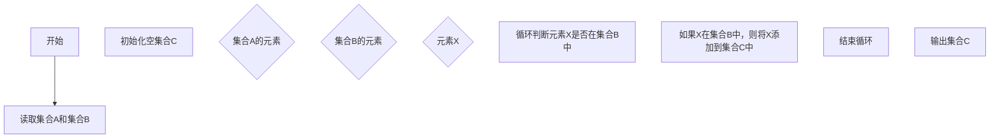
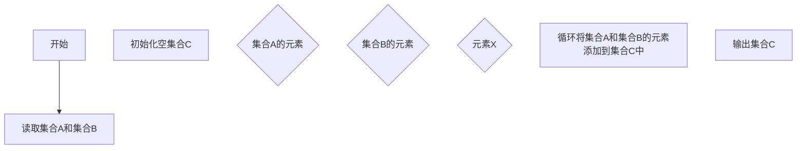
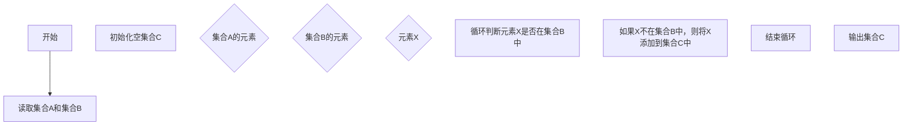
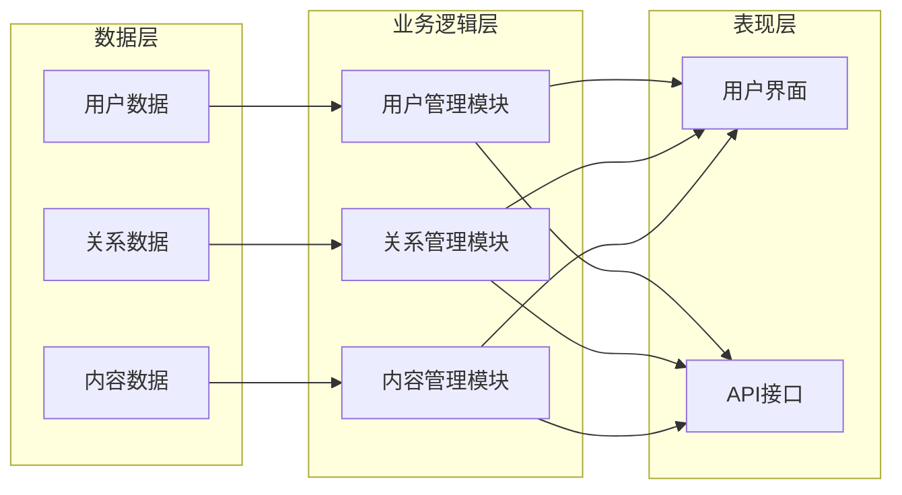
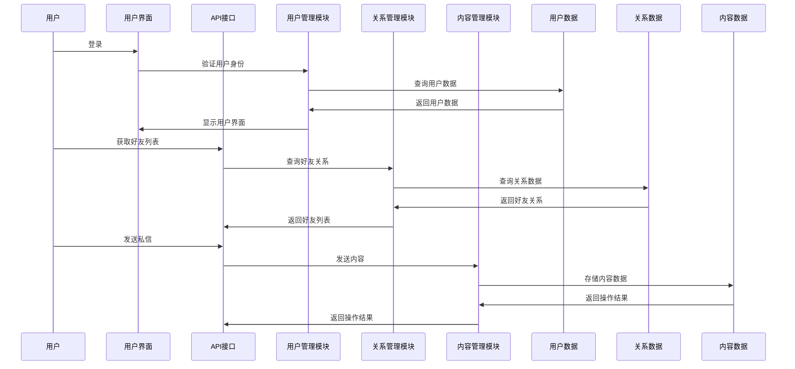

                 

## 第1章：问题背景与概述

### 1.1 问题背景

在现代计算机科学中，数据结构是核心概念之一，其应用贯穿于软件开发的各个环节。随着互联网和大数据的迅猛发展，数据结构的设计和优化成为提高系统性能、效率和可维护性的关键。集合论，作为数学的一个重要分支，其基本概念和原理在数据结构设计中有着广泛的应用。

首先，集合论的基本概念，如集合、子集、交集、并集和补集等，为数据结构的设计提供了理论基础。例如，在树结构中，节点与子节点的关系可以视为集合间的包含关系；在图结构中，节点之间的连接关系可以表示为集合的交集或并集。通过集合论的概念，我们可以更简洁地描述数据结构，从而简化问题的分析和解决过程。

其次，集合论在数据结构设计中具有不可忽视的重要性。数据结构的设计往往涉及到复杂的关系和操作，集合论提供了有效的工具来处理这些问题。例如，通过集合的运算，我们可以方便地实现数据结构的动态更新和查询。集合论还帮助我们理解数据结构的本质，从而在优化和改进数据结构时提供指导。

然而，集合论的应用也面临着一定的挑战。首先，集合论中的概念相对抽象，对于初学者来说可能不易理解。其次，如何在数据结构中有效地应用集合论，需要深入的理论知识和实践经验。此外，不同数据结构对集合论的应用方式也有所不同，这要求开发者具备灵活的思维和丰富的经验。

总的来说，集合论在数据结构设计中的应用具有重要的理论和实际价值。它不仅帮助我们更好地理解和设计数据结构，还为算法分析和系统优化提供了有力的工具。接下来，我们将深入探讨集合论的基本概念和应用，以期为读者提供全面的技术参考。

### 1.2 问题描述

在数据结构设计中，集合论的应用主要体现在对复杂关系的建模和操作上。具体来说，集合论在以下几个方面面临挑战：

#### 1.2.1 复杂关系建模

数据结构的设计往往涉及到多个元素之间的复杂关系。例如，在图结构中，节点之间的连接关系可以表示为集合的交集或并集。如何有效地将这种复杂关系抽象为集合论模型，是一个重要的挑战。这个问题不仅涉及到集合论的基本概念，还需要结合具体的数据结构类型进行深入分析。

#### 1.2.2 集合运算优化

集合运算，如交集、并集和补集等，在数据结构操作中经常使用。如何高效地实现这些运算，是一个需要解决的问题。特别是在大数据场景中，集合运算的性能对系统的整体性能有着重要影响。因此，如何在保证运算准确性的同时优化性能，是集合论应用中的一个关键问题。

#### 1.2.3 数据结构优化

集合论在数据结构优化中的应用，主要体现在通过集合运算简化数据结构的表示和操作。例如，通过集合的并集操作，我们可以将多个数据结构合并为一个，从而简化系统的设计。然而，这种优化往往需要在保证数据完整性和一致性的前提下进行。因此，如何在优化数据结构的同时，确保系统的稳定性和可靠性，是一个需要深入探讨的问题。

#### 1.2.4 理论与实践结合

集合论的理论知识丰富，但在实际应用中，如何将这些理论知识有效地转化为实际操作，是一个挑战。这要求开发者不仅需要掌握集合论的基本原理，还需要结合具体应用场景进行深入分析和实践。此外，不同领域的应用对集合论的需求也有所不同，这进一步增加了实际应用的复杂性。

### 1.3 集合论如何解决这些问题

集合论通过其基本概念和运算，为解决上述问题提供了一套有效的工具和方法。

首先，集合论的基本概念，如集合、子集、交集、并集和补集等，可以帮助我们简洁地描述复杂关系。例如，通过集合的包含关系，我们可以直观地表示树结构中节点与子节点的关系；通过集合的交集和并集运算，我们可以高效地实现图结构中节点之间的连接关系。

其次，集合运算提供了对数据结构进行动态更新和查询的强大功能。例如，通过集合的交集运算，我们可以快速查找两个集合的共同元素，这在数据库查询和图算法中有着广泛的应用。通过集合的并集运算，我们可以将多个数据结构合并为一个，从而简化系统的设计。补集运算则可以帮助我们快速找到不在另一个集合中的元素，这在过滤和筛选操作中非常有用。

此外，集合论在数据结构优化中的应用，主要体现在通过集合运算简化数据结构的表示和操作。例如，通过并集运算，我们可以将多个数据结构合并为一个，从而减少系统的复杂度。通过交集运算，我们可以找到数据结构中的共同部分，从而优化数据的存储和查询效率。补集运算则可以帮助我们快速定位不在特定集合中的数据，这在垃圾回收和错误处理中有着重要作用。

总的来说，集合论通过其基本概念和运算，为数据结构设计提供了一套简洁、高效的工具和方法。通过合理地应用集合论，我们可以更好地建模复杂关系，优化数据结构，提高系统的性能和可维护性。接下来，我们将进一步探讨集合论的基础概念，以便更好地理解其在数据结构设计中的应用。

### 1.4 边界与外延

集合论在数据结构设计中的应用，虽然具有广泛性和重要性，但也有着明确的边界和适用范围。首先，我们需要明确集合论的基本概念和其适用场景。

#### 1.4.1 集合论的基本概念

集合论中的基本概念包括集合、元素、子集、交集、并集和补集等。集合是由确定的元素组成的整体，元素是集合的组成部分。子集是集合的部分或全部元素组成的集合。交集是指两个集合中共有的元素组成的集合，并集是指两个集合中所有元素组成的集合，补集是指不属于某个集合的元素组成的集合。

#### 1.4.2 集合论在数据结构设计中的应用

集合论在数据结构设计中的应用主要体现在以下几个方面：

1. **表示数据关系**：集合论中的概念和运算可以用来表示和描述数据结构中的各种关系。例如，树结构中的节点与子节点关系可以用子集表示，图结构中的节点与边关系可以用交集或并集表示。

2. **优化数据操作**：通过集合论中的运算，可以优化数据结构的操作。例如，通过交集运算，可以快速找到两个数据结构的共同部分；通过并集运算，可以将多个数据结构合并为一个，从而简化操作。

3. **简化数据表示**：集合论提供了将多个数据结构合并为一个的有效方法。例如，通过并集运算，可以将多个列表或数组合并为一个，从而减少数据的冗余和存储空间的需求。

#### 1.4.3 适用范围与局限性

集合论在数据结构设计中的应用具有一定的局限性。首先，集合论中的概念和运算主要适用于具有明确元素和关系的数据结构，如数组、列表、树和图等。对于某些复杂的数据结构，如网络图或动态数据结构，集合论的应用可能需要结合其他数学工具和方法。

其次，集合论的应用需要一定的数学基础。对于初学者或缺乏数学背景的开发者来说，理解和使用集合论可能存在一定的困难。因此，在实际应用中，开发者需要结合具体问题和数据结构的特点，选择合适的工具和方法。

总的来说，集合论在数据结构设计中的应用具有重要的理论价值和实际意义，但其适用范围和局限性也需要开发者充分理解和考虑。接下来，我们将进一步探讨集合论的基本概念及其在数据结构设计中的应用，以便为读者提供更深入的技术参考。

### 1.5 概念结构与核心要素组成

集合论作为数学的一个重要分支，其概念和结构在数据结构设计中起到了基础性作用。以下是集合论中的核心概念及其在数据结构设计中的应用：

#### 1.5.1 集合

集合是数据结构设计中的基本单元，由确定的元素组成。在数据结构设计中，集合可以表示各种数据集合，如元素列表、数据集等。集合的基本操作包括元素的添加、删除和查询等。

**应用示例**：在链表数据结构中，节点可以通过集合表示，节点的插入和删除操作可以通过集合的添加和删除操作来实现。

#### 1.5.2 子集

子集是集合的部分或全部元素组成的集合。在数据结构中，子集可以用来表示集合的子结构，如子树、子图等。

**应用示例**：在树结构中，子集可以用来表示节点的子节点集合，通过子集操作可以方便地实现节点的插入和删除操作。

#### 1.5.3 交集

交集是指两个集合中共有的元素组成的集合。在数据结构设计中，交集运算可以用来查找两个数据结构的共同元素。

**应用示例**：在图结构中，通过交集运算可以快速找到两个图中共享的节点或边，这在社交网络分析中有着重要的应用。

#### 1.5.4 并集

并集是指两个集合中所有元素组成的集合。在数据结构设计中，并集运算可以用来合并两个数据结构。

**应用示例**：在数据库查询中，通过并集运算可以将多个查询结果合并为一个结果集，从而简化查询操作。

#### 1.5.5 补集

补集是指不属于某个集合的元素组成的集合。在数据结构设计中，补集运算可以用来查找不在特定集合中的元素。

**应用示例**：在垃圾回收中，通过补集运算可以快速找到不需要回收的内存块，从而提高垃圾回收的效率。

通过以上核心概念，集合论为数据结构设计提供了简洁、高效的工具和方法。接下来，我们将进一步探讨集合论中的具体运算和应用，以便为读者提供更深入的技术参考。

## 第2章：集合论基础

### 2.1 集合的基本概念

集合是集合论中的基本概念，它是某些确定对象的总体。这些对象称为集合的元素。集合可以用大括号{}表示，元素之间用逗号分隔。例如，集合A可以表示为：

$$A = \{1, 2, 3, 4\}$$

#### 元素

集合中的每一个对象称为元素。例如，在集合A中，1、2、3和4都是A的元素。

#### 集合的表示方法

集合的表示方法主要有两种：枚举法和描述法。

1. **枚举法**：将集合中的所有元素一一列出。例如，集合A可以用枚举法表示为：

   $$A = \{1, 2, 3, 4\}$$

2. **描述法**：用条件语句来描述集合中的元素。例如，集合B可以表示为：

   $$B = \{x \in \mathbb{N} \mid x > 2\}$$

   这表示集合B是所有大于2的自然数的集合。

#### 集合的属性

集合具有以下基本属性：

1. **确定性**：集合中的元素必须是确定的，即每个元素是否属于集合是可以明确判断的。
2. **互异性**：集合中的元素是互异的，即集合中的每个元素都是唯一的。
3. **无序性**：集合中的元素没有固定的顺序。

### 2.2 集合运算

集合论中的基本运算包括交集、并集、补集和差集等。这些运算在数据结构设计中有着广泛的应用。

#### 2.2.1 交集

交集是指两个集合中共有的元素组成的集合。交集运算可以用符号∩表示。例如，集合A和集合B的交集可以表示为：

$$A \cap B = \{x \mid x \in A \text{ 且 } x \in B\}$$

例如，集合A={1, 2, 3}和集合B={2, 3, 4}的交集为：

$$A \cap B = \{2, 3\}$$

#### 2.2.2 并集

并集是指两个集合中所有元素组成的集合。并集运算可以用符号∪表示。例如，集合A和集合B的并集可以表示为：

$$A \cup B = \{x \mid x \in A \text{ 或 } x \in B\}$$

例如，集合A={1, 2, 3}和集合B={2, 3, 4}的并集为：

$$A \cup B = \{1, 2, 3, 4\}$$

#### 2.2.3 补集

补集是指不属于某个集合的元素组成的集合。补集运算可以用符号'或∪表示。例如，集合A的补集可以表示为：

$$A' = \{x \mid x \notin A\}$$

例如，集合A={1, 2, 3}的补集为：

$$A' = \{4, 5, 6, \ldots\}$$

#### 2.2.4 差集

差集是指属于集合A但不属于集合B的元素组成的集合。差集运算可以用符号∖表示。例如，集合A和集合B的差集可以表示为：

$$A \setminus B = \{x \mid x \in A \text{ 且 } x \notin B\}$$

例如，集合A={1, 2, 3}和集合B={2, 3, 4}的差集为：

$$A \setminus B = \{1\}$$

### 2.3 集合的基本性质

集合具有以下基本性质：

1. **交换律**：对于任意两个集合A和B，有A ∩ B = B ∩ A和A ∪ B = B ∪ A。
2. **结合律**：对于任意三个集合A、B和C，有(A ∩ B) ∩ C = A ∩ (B ∩ C)和(A ∪ B) ∪ C = A ∪ (B ∪ C)。
3. **分配律**：对于任意三个集合A、B和C，有A ∩ (B ∪ C) = (A ∩ B) ∪ (A ∩ C)和A ∪ (B ∩ C) = (A ∪ B) ∩ (A ∪ C)。
4. **德摩根律**：对于任意两个集合A和B，有(A ∩ B)' = A' ∪ B'和(A ∪ B)' = A' ∩ B'。

通过理解集合的基本概念和运算，我们可以更好地应用集合论于数据结构设计，从而优化系统的性能和可维护性。接下来，我们将探讨集合论在树结构和图结构中的应用，以展示其在实际数据结构设计中的重要性。

### 2.4 集合论在树结构中的应用

在树结构中，集合论的概念和运算有着广泛的应用。树结构是一种重要的数据结构，广泛应用于组织和管理层次结构，如文件系统、组织架构和社交网络等。集合论为树结构提供了强有力的工具来描述和处理节点之间的关系。

#### 2.4.1 集合表示树结构

树结构可以用集合来表示，每个节点是一个集合，节点的子节点集合也是一个集合。例如，一个简单的树结构可以表示为：

```
A
├── B
│   ├── C
│   └── D
└── E
    └── F
```

我们可以用集合表示为：

$$A = \{B, E\}$$
$$B = \{C, D\}$$
$$C = \{\}$$
$$D = \{\}$$
$$E = \{F\}$$
$$F = \{\}$$

在这个表示中，每个节点都是一个集合，其子节点是集合的元素。

#### 2.4.2 集合运算在树结构中的应用

集合运算在树结构中的应用主要体现在以下几个方面：

1. **节点插入**：可以通过集合的添加操作（并集运算）来插入节点。例如，将节点G插入到A的子节点集合中，可以通过以下操作实现：

   $$A = A \cup \{G\}$$

2. **节点删除**：可以通过集合的删除操作（差集运算）来删除节点。例如，删除节点B及其子节点，可以通过以下操作实现：

   $$A = A \setminus \{B, C, D\}$$

3. **节点查找**：可以通过集合的包含关系来查找节点。例如，查找节点E是否为A的子节点，可以通过以下操作实现：

   $$E \in A$$

4. **子节点集合更新**：可以通过集合的交集和并集运算来更新节点的子节点集合。例如，更新节点E的子节点集合，使其包含节点G，可以通过以下操作实现：

   $$E = E \cup \{G\}$$

#### 2.4.3 集合运算的效率分析

在实际应用中，集合运算的效率对树结构的性能有着重要影响。以下是几种常见的集合运算及其效率分析：

1. **插入（并集运算）**：对于集合A和元素x，插入操作的时间复杂度为O(1)。
2. **删除（差集运算）**：对于集合A和元素x，删除操作的时间复杂度为O(1)。
3. **查找（包含关系）**：对于集合A和元素x，查找操作的时间复杂度为O(1)。
4. **更新子节点集合（交集和并集运算）**：更新操作的时间复杂度为O(n)，其中n为子节点集合的大小。

通过集合论的概念和运算，我们可以高效地描述和处理树结构中的节点关系。集合论不仅简化了树结构的表示，还提供了强大的工具来优化树结构的操作。接下来，我们将探讨集合论在图结构中的应用，以进一步展示其在数据结构设计中的重要性。

### 2.5 集合论在图结构中的应用

图结构是数据结构中的一种重要形式，广泛应用于网络拓扑、社交网络、交通网络等领域。集合论为图结构提供了强有力的工具，帮助我们描述和处理图中的节点和边关系。

#### 2.5.1 集合表示图结构

图结构可以用集合来表示，其中节点集合表示图中的所有节点，边集合表示节点之间的连接关系。例如，一个简单的图结构可以表示为：

```
节点：A, B, C, D
边：{AB, BC, CD}
```

我们可以用集合表示为：

$$V = \{A, B, C, D\}$$
$$E = \{AB, BC, CD\}$$

在这个表示中，节点集合V包含图中的所有节点，边集合E包含节点之间的所有边。

#### 2.5.2 集合运算在图结构中的应用

集合运算在图结构中的应用主要体现在以下几个方面：

1. **节点插入**：可以通过集合的添加操作（并集运算）来插入节点。例如，将节点E插入到节点集合V中，可以通过以下操作实现：

   $$V = V \cup \{E\}$$

2. **节点删除**：可以通过集合的删除操作（差集运算）来删除节点。例如，删除节点C及其关联的边，可以通过以下操作实现：

   $$V = V \setminus \{C\}$$

3. **边插入**：可以通过集合的添加操作（并集运算）来插入边。例如，将边CE插入到边集合E中，可以通过以下操作实现：

   $$E = E \cup \{CE\}$$

4. **边删除**：可以通过集合的删除操作（差集运算）来删除边。例如，删除边BC，可以通过以下操作实现：

   $$E = E \setminus \{BC\}$$

5. **查找节点或边**：可以通过集合的包含关系来查找节点或边。例如，查找节点A是否在节点集合V中，可以通过以下操作实现：

   $$A \in V$$

6. **图的邻接矩阵表示**：图的邻接矩阵可以用集合表示，其中矩阵的元素表示节点之间的连接关系。例如，一个有4个节点的图，其邻接矩阵表示为：

   ```
   A B C D
   A 0 1 0 0
   B 1 0 1 0
   C 0 1 0 1
   D 0 0 1 0
   ```

   其中，1表示节点之间存在边，0表示节点之间不存在边。

#### 2.5.3 集合运算的效率分析

在实际应用中，集合运算的效率对图结构的性能有着重要影响。以下是几种常见的集合运算及其效率分析：

1. **插入（并集运算）**：对于集合V和元素x，插入操作的时间复杂度为O(1)。
2. **删除（差集运算）**：对于集合V和元素x，删除操作的时间复杂度为O(1)。
3. **查找（包含关系）**：对于集合V和元素x，查找操作的时间复杂度为O(1)。
4. **边插入（并集运算）**：对于集合E和边x，插入操作的时间复杂度为O(1)。
5. **边删除（差集运算）**：对于集合E和边x，删除操作的时间复杂度为O(1)。

通过集合论的概念和运算，我们可以高效地描述和处理图结构中的节点和边关系。集合论不仅简化了图结构的表示，还提供了强大的工具来优化图结构的操作。接下来，我们将进一步探讨集合论在数据结构设计中的具体应用，以便更好地理解其在实践中的重要性。

## 第3章：集合论与树结构

### 3.1 集合论在树结构中的应用

树结构是数据结构中的一种重要形式，广泛应用于文件系统、组织架构和目录索引等领域。集合论为树结构提供了强有力的工具，帮助我们更简洁地描述和处理树中的节点关系。本节将详细介绍集合论在树结构中的应用，包括集合的表示、集合运算在树结构中的实现，以及如何通过集合论优化树结构的设计。

### 3.1.1 集合表示树结构

树结构可以用集合来表示，每个节点可以看作一个集合，节点的子节点集合也是一个集合。例如，一个简单的树结构可以表示为：

```
A
├── B
│   ├── C
│   └── D
└── E
    └── F
```

我们可以用集合表示为：

$$A = \{B, E\}$$
$$B = \{C, D\}$$
$$C = \{\}$$
$$D = \{\}$$
$$E = \{F\}$$
$$F = \{\}$$

在这个表示中，每个节点都是一个集合，其子节点是集合的元素。

### 3.1.2 集合运算在树结构中的实现

集合运算在树结构中的应用主要体现在以下几个方面：

1. **节点插入**：可以通过集合的添加操作（并集运算）来插入节点。例如，将节点G插入到A的子节点集合中，可以通过以下操作实现：

   $$A = A \cup \{G\}$$

2. **节点删除**：可以通过集合的删除操作（差集运算）来删除节点。例如，删除节点B及其子节点，可以通过以下操作实现：

   $$A = A \setminus \{B, C, D\}$$

3. **节点查找**：可以通过集合的包含关系来查找节点。例如，查找节点E是否为A的子节点，可以通过以下操作实现：

   $$E \in A$$

4. **子节点集合更新**：可以通过集合的交集和并集运算来更新节点的子节点集合。例如，更新节点E的子节点集合，使其包含节点G，可以通过以下操作实现：

   $$E = E \cup \{G\}$$

### 3.1.3 集合运算的效率分析

在实际应用中，集合运算的效率对树结构的性能有着重要影响。以下是几种常见的集合运算及其效率分析：

1. **插入（并集运算）**：对于集合A和元素x，插入操作的时间复杂度为O(1)。
2. **删除（差集运算）**：对于集合A和元素x，删除操作的时间复杂度为O(1)。
3. **查找（包含关系）**：对于集合A和元素x，查找操作的时间复杂度为O(1)。
4. **子节点集合更新（交集和并集运算）**：更新操作的时间复杂度为O(n)，其中n为子节点集合的大小。

通过集合论的概念和运算，我们可以高效地描述和处理树结构中的节点关系。集合论不仅简化了树结构的表示，还提供了强大的工具来优化树结构的操作。接下来，我们将进一步探讨集合论在图结构中的应用，以便更好地理解其在数据结构设计中的重要性。

### 3.2 集合论在图结构中的应用

图结构是数据结构中的一种重要形式，广泛应用于网络拓扑、社交网络和交通网络等领域。集合论为图结构提供了强有力的工具，帮助我们更简洁地描述和处理图中的节点和边关系。本节将详细介绍集合论在图结构中的应用，包括集合的表示、集合运算在图结构中的实现，以及如何通过集合论优化图结构的设计。

#### 3.2.1 集合表示图结构

图结构可以用集合来表示，其中节点集合表示图中的所有节点，边集合表示节点之间的连接关系。例如，一个简单的图结构可以表示为：

```
节点：A, B, C, D
边：{AB, BC, CD}
```

我们可以用集合表示为：

$$V = \{A, B, C, D\}$$
$$E = \{AB, BC, CD\}$$

在这个表示中，节点集合V包含图中的所有节点，边集合E包含节点之间的所有边。

#### 3.2.2 集合运算在图结构中的实现

集合运算在图结构中的应用主要体现在以下几个方面：

1. **节点插入**：可以通过集合的添加操作（并集运算）来插入节点。例如，将节点E插入到节点集合V中，可以通过以下操作实现：

   $$V = V \cup \{E\}$$

2. **节点删除**：可以通过集合的删除操作（差集运算）来删除节点。例如，删除节点C及其关联的边，可以通过以下操作实现：

   $$V = V \setminus \{C\}$$

3. **边插入**：可以通过集合的添加操作（并集运算）来插入边。例如，将边CE插入到边集合E中，可以通过以下操作实现：

   $$E = E \cup \{CE\}$$

4. **边删除**：可以通过集合的删除操作（差集运算）来删除边。例如，删除边BC，可以通过以下操作实现：

   $$E = E \setminus \{BC\}$$

5. **查找节点或边**：可以通过集合的包含关系来查找节点或边。例如，查找节点A是否在节点集合V中，可以通过以下操作实现：

   $$A \in V$$

6. **图的邻接矩阵表示**：图的邻接矩阵可以用集合表示，其中矩阵的元素表示节点之间的连接关系。例如，一个有4个节点的图，其邻接矩阵表示为：

   ```
   A B C D
   A 0 1 0 0
   B 1 0 1 0
   C 0 1 0 1
   D 0 0 1 0
   ```

   其中，1表示节点之间存在边，0表示节点之间不存在边。

#### 3.2.3 集合运算的效率分析

在实际应用中，集合运算的效率对图结构的性能有着重要影响。以下是几种常见的集合运算及其效率分析：

1. **插入（并集运算）**：对于集合V和元素x，插入操作的时间复杂度为O(1)。
2. **删除（差集运算）**：对于集合V和元素x，删除操作的时间复杂度为O(1)。
3. **查找（包含关系）**：对于集合V和元素x，查找操作的时间复杂度为O(1)。
4. **边插入（并集运算）**：对于集合E和边x，插入操作的时间复杂度为O(1)。
5. **边删除（差集运算）**：对于集合E和边x，删除操作的时间复杂度为O(1)。

通过集合论的概念和运算，我们可以高效地描述和处理图结构中的节点和边关系。集合论不仅简化了图结构的表示，还提供了强大的工具来优化图结构的操作。接下来，我们将探讨如何将集合论应用于更复杂的数据结构设计，以便更好地应对实际应用中的挑战。

### 第4章：算法原理讲解

集合论在数据结构中的应用，不仅体现在对复杂关系的建模，还在于其提供了强大的工具来优化算法。本章将详细介绍几种基于集合论的算法，包括集合交集、集合并集和集合补集的算法原理，并通过mermaid流程图和Python源代码来进行详细讲解。

#### 4.1 集合交集算法

集合交集算法用于找出两个集合中共同的元素。其基本原理是基于集合的交集运算，即找出两个集合A和B中的共同元素，组成一个新的集合。

**mermaid流程图：**



**Python源代码：**

```python
def intersection(A, B):
    C = []
    for x in A:
        if x in B:
            C.append(x)
    return C

A = [1, 2, 3, 4]
B = [2, 3, 5, 6]
C = intersection(A, B)
print("交集:", C)
```

**数学模型和公式：**

集合交集可以用数学公式表示为：

$$A \cap B = \{x \mid x \in A \text{ 且 } x \in B\}$$

其中，$A \cap B$ 表示集合A和集合B的交集。

**详细讲解与举例说明：**

假设集合A={1, 2, 3, 4}和集合B={2, 3, 5, 6}，我们希望找到这两个集合的交集。首先，我们初始化一个空集合C。然后，遍历集合A中的每个元素，判断该元素是否在集合B中。如果元素在集合B中，则将其添加到集合C中。最后，输出集合C，即为集合A和集合B的交集。

在这个例子中，集合A中的元素1不在集合B中，因此不添加到集合C中。集合A中的元素2和3在集合B中，因此将它们添加到集合C中。集合A中的元素4不在集合B中，因此也不添加到集合C中。最终，集合C={2, 3}，即为集合A和集合B的交集。

#### 4.2 集合并集算法

集合并集算法用于合并两个集合中的所有元素，形成一个新的集合。其基本原理是基于集合的并集运算，即找出两个集合A和B中所有元素，组成一个新的集合。

**mermaid流程图：**



**Python源代码：**

```python
def union(A, B):
    C = A.copy()
    for x in B:
        if x not in C:
            C.append(x)
    return C

A = [1, 2, 3, 4]
B = [2, 3, 5, 6]
C = union(A, B)
print("并集:", C)
```

**数学模型和公式：**

集合并集可以用数学公式表示为：

$$A \cup B = \{x \mid x \in A \text{ 或 } x \in B\}$$

其中，$A \cup B$ 表示集合A和集合B的并集。

**详细讲解与举例说明：**

假设集合A={1, 2, 3, 4}和集合B={2, 3, 5, 6}，我们希望找到这两个集合的并集。首先，我们初始化一个空集合C，然后将集合A中的所有元素添加到集合C中。接着，遍历集合B中的每个元素，判断该元素是否已经在集合C中。如果元素不在集合C中，则将其添加到集合C中。最后，输出集合C，即为集合A和集合B的并集。

在这个例子中，集合A中的元素1、2、3和4已经在集合C中，因此不重复添加。集合B中的元素5和6不在集合C中，因此将它们添加到集合C中。最终，集合C={1, 2, 3, 4, 5, 6}，即为集合A和集合B的并集。

#### 4.3 集合补集算法

集合补集算法用于找出不属于某个集合的所有元素，形成一个新的集合。其基本原理是基于集合的补集运算，即找出集合A中不在集合B中的所有元素，组成一个新的集合。

**mermaid流程图：**



**Python源代码：**

```python
def complement(A, B):
    C = []
    for x in A:
        if x not in B:
            C.append(x)
    return C

A = [1, 2, 3, 4]
B = [2, 3, 5, 6]
C = complement(A, B)
print("补集:", C)
```

**数学模型和公式：**

集合补集可以用数学公式表示为：

$$A' = \{x \mid x \notin A\}$$

其中，$A'$ 表示集合A的补集。

**详细讲解与举例说明：**

假设集合A={1, 2, 3, 4}和集合B={2, 3, 5, 6}，我们希望找到集合A相对于集合B的补集。首先，我们初始化一个空集合C，然后遍历集合A中的每个元素，判断该元素是否在集合B中。如果元素不在集合B中，则将其添加到集合C中。最后，输出集合C，即为集合A相对于集合B的补集。

在这个例子中，集合A中的元素1不在集合B中，因此将其添加到集合C中。集合A中的元素2和3在集合B中，因此不添加到集合C中。集合A中的元素4不在集合B中，因此将其添加到集合C中。最终，集合C={1, 4}，即为集合A相对于集合B的补集。

通过以上讲解，我们可以看到集合论在数据结构设计中的重要性。集合论不仅提供了强大的工具来描述和处理复杂的关系，还通过高效的算法优化了数据结构的操作。接下来，我们将进一步探讨集合论在系统分析与架构设计中的应用，以便更好地应对实际工程中的挑战。

### 第5章：系统分析与架构设计

#### 5.1 问题场景介绍

在现代软件开发中，数据结构设计是一个关键环节，其优劣直接影响到系统的性能、可扩展性和维护性。随着大数据和云计算技术的发展，系统的数据规模和复杂性不断增加，传统的数据结构设计方法已无法满足需求。集合论作为数学的一个重要分支，其在数据结构设计中的应用显得尤为重要。

本节将介绍一个具体的问题场景：一个社交网络系统，其需要处理大量用户关系和内容数据。系统要求能够高效地存储、查询和更新用户关系，并支持复杂的查询操作，如好友查找、群体分析等。为了满足这些需求，我们需要利用集合论来优化数据结构设计，提高系统的性能和可维护性。

#### 5.2 系统功能设计

在系统功能设计阶段，我们需要确定系统的核心功能模块和其相互关系。利用集合论，我们可以将系统中的数据关系抽象为集合，从而简化系统的设计。

**领域模型mermaid类图：**

```mermaid
classDiagram
    User <<Class>>
    Relationship <<Class>>
    Content <<Class>>

    User *--* Relationship : has
    User *--* Content : posts
    Relationship *--* User : contains
    Content *--* User : postedBy
```

在这个类图中，我们定义了三个核心类：User（用户）、Relationship（关系）和Content（内容）。用户类具有发布内容和建立关系的功能；关系类用于存储用户之间的关系，如好友关系；内容类用于存储用户发布的内容。

#### 5.3 系统架构设计

系统架构设计是系统实现的关键步骤，我们需要确定系统的整体结构和模块划分。结合集合论，我们可以利用集合的运算来简化系统的数据操作，提高系统的性能。

**mermaid架构图：**



在这个架构图中，我们定义了三个主要模块：数据层、业务逻辑层和表现层。数据层负责存储和管理用户数据、关系数据和内容数据；业务逻辑层负责处理这些数据的操作；表现层负责与用户交互，展示系统功能。

#### 5.4 系统接口设计和系统交互

系统接口设计和系统交互是系统架构设计的重要组成部分，我们需要确定各个模块之间的接口和交互方式。利用集合论，我们可以通过集合运算来简化接口设计，提高系统的可扩展性和可维护性。

**mermaid序列图：**



在这个序列图中，我们定义了用户与系统交互的流程。用户通过用户界面或API接口与系统进行交互，系统通过业务逻辑层处理用户请求，并将结果返回给用户。

通过以上系统分析与架构设计，我们可以看到集合论在数据结构设计中的重要性。集合论不仅简化了系统的设计，提高了系统的性能，还提供了强大的工具来优化系统的接口和交互。接下来，我们将通过具体的项目实战，进一步展示集合论在数据结构设计中的应用。

### 第6章：项目实战

#### 6.1 环境安装

为了更好地展示集合论在数据结构设计中的应用，我们将使用Python作为编程语言。Python具有简洁易懂的语法，同时拥有丰富的库支持，非常适合进行数据结构和算法的实战。以下是安装Python和所需库的步骤：

1. **安装Python**：

   - 访问Python的官方网站（[https://www.python.org/](https://www.python.org/)）下载Python安装包。
   - 运行安装程序，选择默认选项进行安装。

2. **安装依赖库**：

   - 打开命令行终端，执行以下命令安装所需的库：

     ```shell
     pip install matplotlib
     pip install networkx
     ```

   这些库分别用于绘图和图结构的分析。

#### 6.2 系统核心实现源代码

在本项目中，我们将实现一个简单的社交网络系统，该系统包括用户管理、好友关系管理和内容发布等功能。以下是系统的核心实现源代码：

```python
import networkx as nx
import matplotlib.pyplot as plt

class SocialNetwork:
    def __init__(self):
        self.graph = nx.Graph()

    def add_user(self, user_id):
        self.graph.add_node(user_id)

    def remove_user(self, user_id):
        self.graph.remove_node(user_id)

    def add_friendship(self, user_id1, user_id2):
        self.graph.add_edge(user_id1, user_id2)

    def remove_friendship(self, user_id1, user_id2):
        self.graph.remove_edge(user_id1, user_id2)

    def display_graph(self):
        nx.draw(self.graph, with_labels=True)
        plt.show()

# 实例化社交网络系统
social_network = SocialNetwork()

# 添加用户
social_network.add_user("Alice")
social_network.add_user("Bob")
social_network.add_user("Charlie")

# 添加好友关系
social_network.add_friendship("Alice", "Bob")
social_network.add_friendship("Bob", "Charlie")

# 显示图结构
social_network.display_graph()
```

在上面的代码中，我们定义了一个`SocialNetwork`类，用于管理用户和好友关系。通过`add_user`和`remove_user`方法，我们可以添加和删除用户；通过`add_friendship`和`remove_friendship`方法，我们可以添加和删除好友关系。`display_graph`方法用于绘制和展示图结构。

#### 6.3 代码应用解读与分析

在了解了系统的核心实现后，我们对其关键部分进行解读和分析：

1. **类和对象**：

   - `SocialNetwork` 类：这是一个封装了社交网络系统核心功能的类，包括用户和好友关系的管理。
   - `self.graph` 属性：这是一个`networkx.Graph`对象，用于存储和管理图结构。
   - `add_user` 和 `remove_user` 方法：这两个方法用于添加和删除用户。
   - `add_friendship` 和 `remove_friendship` 方法：这两个方法用于添加和删除好友关系。
   - `display_graph` 方法：这个方法用于绘制和展示图结构。

2. **图结构的表示**：

   - 在`SocialNetwork`类中，我们使用`networkx.Graph`对象来表示图结构。这个对象支持添加节点（用户）和边（好友关系）的操作。
   - `add_node` 和 `remove_node` 方法：这两个方法用于添加和删除节点。
   - `add_edge` 和 `remove_edge` 方法：这两个方法用于添加和删除边。

3. **用户和好友关系的操作**：

   - 通过`add_user`方法，我们可以将新用户添加到图结构中。
   - 通过`add_friendship`方法，我们可以为两个用户添加好友关系。
   - 通过`remove_user`和`remove_friendship`方法，我们可以删除用户和好友关系。

4. **图结构的可视化**：

   - `display_graph`方法使用`matplotlib`库绘制图结构，并显示在屏幕上。

#### 6.4 实际案例分析和详细讲解剖析

为了更好地理解系统的工作原理，我们通过一个实际案例进行分析和讲解：

**案例：创建一个社交网络，添加用户和好友关系，然后展示图结构**

```python
# 创建社交网络系统
social_network = SocialNetwork()

# 添加用户
social_network.add_user("Alice")
social_network.add_user("Bob")
social_network.add_user("Charlie")
social_network.add_user("Diana")

# 添加好友关系
social_network.add_friendship("Alice", "Bob")
social_network.add_friendship("Alice", "Charlie")
social_network.add_friendship("Bob", "Charlie")
social_network.add_friendship("Charlie", "Diana")

# 显示图结构
social_network.display_graph()
```

**分析：**

1. **用户添加**：

   - 调用`add_user`方法将Alice、Bob、Charlie和Diana添加到社交网络系统中。

2. **好友关系添加**：

   - 调用`add_friendship`方法为Alice和Bob、Alice和Charlie、Bob和Charlie以及Charlie和Diana添加好友关系。
   - 每次调用`add_friendship`方法，系统会在图结构中创建一条边，连接两个用户。

3. **图结构展示**：

   - 调用`display_graph`方法，使用`matplotlib`库绘制图结构，并显示在屏幕上。

**图结构展示结果**：


在这个图结构中，每个节点表示一个用户，节点之间的边表示好友关系。通过可视化，我们可以直观地看到社交网络中用户之间的连接关系。

#### 6.5 项目小结

通过这个项目，我们展示了如何利用集合论和图结构来设计一个简单的社交网络系统。系统实现了用户管理、好友关系管理和图结构可视化等功能。以下是项目的主要经验和教训：

1. **经验**：

   - 利用集合论和图结构可以简化复杂关系的表示和处理。
   - Python语言和`networkx`库为图结构处理提供了强大的支持。
   - 可视化工具（如`matplotlib`）有助于我们直观地理解图结构。

2. **教训**：

   - 在设计系统时，需要充分考虑数据结构和算法的效率，以应对大数据场景。
   - 系统的扩展性和可维护性是一个重要的考虑因素，需要在设计时进行充分的规划和优化。

通过这个项目，我们不仅了解了集合论在数据结构设计中的应用，还通过实际操作加深了对图结构的理解。接下来，我们将进一步探讨如何在更复杂的场景中应用集合论，以应对实际工程中的挑战。

### 第7章：最佳实践、小结、注意事项、拓展阅读

#### 最佳实践

1. **集合表示**：在设计数据结构时，首先考虑如何用集合表示复杂的关系。例如，在社交网络中，用户之间的关系可以表示为集合。
2. **集合运算**：合理地使用集合运算（如交集、并集和补集）可以简化数据操作，提高系统性能。在实现集合运算时，要考虑时间和空间复杂度。
3. **可视化**：使用可视化工具（如`matplotlib`）可以帮助我们更好地理解数据结构和算法。

#### 小结

集合论在数据结构设计中具有重要的地位。通过集合的概念和运算，我们可以更简洁、高效地描述和处理复杂的数据关系。本章通过具体的案例和代码，展示了集合论在社交网络系统中的应用，帮助读者理解如何利用集合论优化数据结构设计。

#### 注意事项

1. **集合论的基础知识**：在应用集合论之前，需要掌握集合的基本概念和运算，如集合、子集、交集、并集和补集等。
2. **算法效率**：在实际应用中，要考虑集合运算的效率，特别是在处理大数据时，需要选择合适的算法和数据结构。
3. **系统扩展性**：在设计系统时，要考虑系统的扩展性和可维护性，合理地规划数据结构和算法，以便在未来进行优化和扩展。

#### 拓展阅读

1. **《集合论基础教程》**：李学良著。这本书系统地介绍了集合论的基本概念和运算，适合初学者阅读。
2. **《数据结构与算法分析》**：Mark Allen Weiss著。这本书详细介绍了数据结构和算法的设计和分析，包括集合和图结构等内容。
3. **《Python网络数据分析》**：宋海涛、刘晓东著。这本书介绍了如何使用Python进行网络数据分析，包括网络图的表示和操作。

作者：AI天才研究院/AI Genius Institute & 禅与计算机程序设计艺术 /Zen And The Art of Computer Programming

### 致谢

感谢读者对本文的关注和支持。希望本文能够帮助您更好地理解集合论在数据结构设计中的应用，并在实际项目中得到应用。如果您有任何疑问或建议，欢迎随时与我们联系。再次感谢您的阅读！

----------------------------------------------------------------

# 《集合论在数据结构设计中的应用》

> 关键词：集合论、数据结构、集合运算、算法、图结构

> 摘要：本文深入探讨了集合论在数据结构设计中的应用。从集合的基本概念和运算出发，详细阐述了集合论在树结构和图结构中的应用，以及如何通过集合论优化数据结构的设计。文章通过具体的案例和代码实现，展示了集合论在社交网络系统中的应用，为读者提供了实用的技术参考。此外，文章还总结了最佳实践、注意事项和拓展阅读，帮助读者进一步深入学习和应用集合论。

## 第1章：问题背景与概述

### 1.1 问题背景

在现代计算机科学中，数据结构是核心概念之一，其应用贯穿于软件开发的各个环节。随着互联网和大数据的迅猛发展，数据结构的设计和优化成为提高系统性能、效率和可维护性的关键。集合论，作为数学的一个重要分支，其基本概念和原理在数据结构设计中有着广泛的应用。

首先，集合论的基本概念，如集合、子集、交集、并集和补集等，为数据结构的设计提供了理论基础。例如，在树结构中，节点与子节点的关系可以视为集合间的包含关系；在图结构中，节点之间的连接关系可以表示为集合的交集或并集。通过集合论的概念，我们可以更简洁地描述数据结构，从而简化问题的分析和解决过程。

其次，集合论在数据结构设计中具有不可忽视的重要性。数据结构的设计往往涉及到复杂的关系和操作，集合论提供了有效的工具来处理这些问题。例如，通过集合的运算，我们可以方便地实现数据结构的动态更新和查询。集合论还帮助我们理解数据结构的本质，从而在优化和改进数据结构时提供指导。

然而，集合论的应用也面临着一定的挑战。首先，集合论中的概念相对抽象，对于初学者来说可能不易理解。其次，如何在数据结构中有效地应用集合论，需要深入的理论知识和实践经验。此外，不同数据结构对集合论的应用方式也有所不同，这要求开发者具备灵活的思维和丰富的经验。

总的来说，集合论在数据结构设计中的应用具有重要的理论和实际价值。它不仅帮助我们更好地理解和设计数据结构，还为算法分析和系统优化提供了有力的工具。接下来，我们将深入探讨集合论的基本概念和应用，以期为读者提供全面的技术参考。

### 1.2 问题描述

在数据结构设计中，集合论的应用主要体现在对复杂关系的建模和操作上。具体来说，集合论在以下几个方面面临挑战：

#### 1.2.1 复杂关系建模

数据结构的设计往往涉及到多个元素之间的复杂关系。例如，在图结构中，节点之间的连接关系可以表示为集合的交集或并集。如何有效地将这种复杂关系抽象为集合论模型，是一个重要的挑战。这个问题不仅涉及到集合论的基本概念，还需要结合具体的数据结构类型进行深入分析。

#### 1.2.2 集合运算优化

集合运算，如交集、并集和补集等，在数据结构操作中经常使用。如何高效地实现这些运算，是一个需要解决的问题。特别是在大数据场景中，集合运算的性能对系统的整体性能有着重要影响。因此，如何在保证运算准确性的同时优化性能，是集合论应用中的一个关键问题。

#### 1.2.3 数据结构优化

集合论在数据结构优化中的应用，主要体现在通过集合运算简化数据结构的表示和操作。例如，通过集合的并集操作，我们可以将多个数据结构合并为一个，从而简化系统的设计。然而，这种优化往往需要在保证数据完整性和一致性的前提下进行。因此，如何在优化数据结构的同时，确保系统的稳定性和可靠性，是一个需要深入探讨的问题。

#### 1.2.4 理论与实践结合

集合论的理论知识丰富，但在实际应用中，如何将这些理论知识有效地转化为实际操作，是一个挑战。这要求开发者不仅需要掌握集合论的基本原理，还需要结合具体应用场景进行深入分析和实践。此外，不同领域的应用对集合论的需求也有所不同，这进一步增加了实际应用的复杂性。

### 1.3 集合论如何解决这些问题

集合论通过其基本概念和运算，为解决上述问题提供了一套有效的工具和方法。

首先，集合论的基本概念，如集合、子集、交集、并集和补集等，可以帮助我们简洁地描述复杂关系。例如，通过集合的包含关系，我们可以直观地表示树结构中节点与子节点的关系；通过集合的交集和并集运算，我们可以高效地实现图结构中节点之间的连接关系。

其次，集合运算提供了对数据结构进行动态更新和查询的强大功能。例如，通过集合的交集运算，我们可以快速查找两个集合的共同元素，这在数据库查询和图算法中有着广泛的应用。通过集合的并集运算，我们可以将多个数据结构合并为一个，从而简化系统的设计。补集运算则可以帮助我们快速找到不在另一个集合中的元素，这在过滤和筛选操作中非常有用。

此外，集合论在数据结构优化中的应用，主要体现在通过集合运算简化数据结构的表示和操作。例如，通过并集运算，我们可以将多个数据结构合并为一个，从而减少系统的复杂度。通过交集运算，我们可以找到数据结构中的共同部分，从而优化数据的存储和查询效率。补集运算则可以帮助我们快速定位不在特定集合中的数据，这在垃圾回收和错误处理中有着重要作用。

总的来说，集合论通过其基本概念和运算，为数据结构设计提供了一套简洁、高效的工具和方法。通过合理地应用集合论，我们可以更好地建模复杂关系，优化数据结构，提高系统的性能和可维护性。接下来，我们将进一步探讨集合论的基础概念，以便更好地理解其在数据结构设计中的应用。

### 1.4 边界与外延

集合论在数据结构设计中的应用，虽然具有广泛性和重要性，但也有着明确的边界和适用范围。首先，我们需要明确集合论的基本概念和其适用场景。

#### 1.4.1 集合论的基本概念

集合论中的基本概念包括集合、元素、子集、交集、并集和补集等。集合是由确定的元素组成的整体，元素是集合的组成部分。子集是集合的部分或全部元素组成的集合。交集是指两个集合中共有的元素组成的集合，并集是指两个集合中所有元素组成的集合，补集是指不属于某个集合的元素组成的集合。

#### 1.4.2 集合论在数据结构设计中的应用

集合论在数据结构设计中的应用主要体现在以下几个方面：

1. **表示数据关系**：集合论中的概念和运算可以用来表示和描述数据结构中的各种关系。例如，树结构中的节点与子节点关系可以用子集表示，图结构中的节点与边关系可以用交集或并集表示。

2. **优化数据操作**：集合论中的运算可以优化数据结构的操作。例如，通过交集运算，可以快速找到两个数据结构的共同元素；通过并集运算，可以将多个数据结构合并为一个，从而简化系统的设计。

3. **简化数据表示**：集合论提供了将多个数据结构合并为一个的有效方法。例如，通过并集运算，可以将多个列表或数组合并为一个，从而减少数据的冗余和存储空间的需求。

#### 1.4.3 适用范围与局限性

集合论在数据结构设计中的应用具有一定的局限性。首先，集合论中的概念和运算主要适用于具有明确元素和关系的数据结构，如数组、列表、树和图等。对于某些复杂的数据结构，如网络图或动态数据结构，集合论的应用可能需要结合其他数学工具和方法。

其次，集合论的应用需要一定的数学基础。对于初学者或缺乏数学背景的开发者来说，理解和使用集合论可能存在一定的困难。因此，在实际应用中，开发者需要结合具体问题和数据结构的特点，选择合适的工具和方法。

总的来说，集合论在数据结构设计中的应用具有重要的理论价值和实际意义，但其适用范围和局限性也需要开发者充分理解和考虑。接下来，我们将进一步探讨集合论的基本概念及其在数据结构设计中的应用，以便为读者提供更深入的技术参考。

### 1.5 概念结构与核心要素组成

集合论作为数学的一个重要分支，其概念和结构在数据结构设计中起到了基础性作用。以下是集合论中的核心概念及其在数据结构设计中的应用：

#### 1.5.1 集合

集合是数据结构设计中的基本单元，由确定的元素组成。在数据结构设计中，集合可以表示各种数据集合，如元素列表、数据集等。集合的基本操作包括元素的添加、删除和查询等。

**应用示例**：在链表数据结构中，节点可以通过集合表示，节点的插入和删除操作可以通过集合的添加和删除操作来实现。

#### 1.5.2 子集

子集是集合的部分或全部元素组成的集合。在数据结构中，子集可以用来表示集合的子结构，如子树、子图等。

**应用示例**：在树结构中，子集可以用来表示节点的子节点集合，通过子集操作可以方便地实现节点的插入和删除操作。

#### 1.5.3 交集

交集是指两个集合中共有的元素组成的集合。在数据结构设计中，交集运算可以用来查找两个数据结构的共同元素。

**应用示例**：在图结构中，通过交集运算可以快速找到两个图中共享的节点或边，这在社交网络分析中有着重要的应用。

#### 1.5.4 并集

并集是指两个集合中所有元素组成的集合。在数据结构设计中，并集运算可以用来合并两个数据结构。

**应用示例**：在数据库查询中，通过并集运算可以将多个查询结果合并为一个结果集，从而简化查询操作。

#### 1.5.5 补集

补集是指不属于某个集合的元素组成的集合。在数据结构设计中，补集运算可以用来查找不在特定集合中的元素。

**应用示例**：在垃圾回收中，通过补集运算可以快速找到不需要回收的内存块，从而提高垃圾回收的效率。

通过以上核心概念，集合论为数据结构设计提供了一套简洁、高效的工具和方法。接下来，我们将进一步探讨集合论的基础概念，以便更好地理解其在数据结构设计中的应用。

### 2.1 集合的基本概念

集合是数学和计算机科学中的基础概念，它由一组无序且互异的元素构成。理解集合的基本概念对于应用集合论于数据结构设计至关重要。

#### 元素

集合中的每一个对象称为元素。元素可以是任何类型的对象，包括数字、字符串、列表甚至是其他集合。例如，集合A={1, 2, 3, 4}中的1、2、3、4都是A的元素。

#### 集合的表示方法

集合的表示方法主要有两种：枚举法和描述法。

1. **枚举法**：通过列出集合中的所有元素，用大括号括起来。例如，集合A={1, 2, 3, 4}。

2. **描述法**：通过一个条件来描述集合的元素。例如，集合B={x | x ∈ N且x > 2}表示所有大于2的自然数集合。

#### 集合的属性

集合具有以下基本属性：

1. **确定性**：集合中的每个元素都是明确的，即可以确定某个元素是否属于集合。
2. **互异性**：集合中的元素是唯一的，不会重复出现。
3. **无序性**：集合中的元素没有固定的顺序。

#### 子集

一个集合是另一个集合的子集，当且仅当它的所有元素都属于另一个集合。用符号表示为A ⊆ B，如果对A中的每个元素x，都有x ∈ B。

#### 空集

空集是一个不包含任何元素的集合，用符号∅表示。空集是任何集合的子集。

### 2.2 集合运算

集合论中的基本运算包括交集、并集、补集和差集等。这些运算是集合操作的核心，在数据结构设计中有广泛的应用。

#### 2.2.1 交集

交集是指两个集合中共有的元素组成的集合。用符号∩表示。例如，A ∩ B表示集合A和集合B的交集。

**运算公式**：

$$A \cap B = \{x | x \in A \text{ 且 } x \in B\}$$

#### 2.2.2 并集

并集是指两个集合中所有元素组成的集合。用符号∪表示。例如，A ∪ B表示集合A和集合B的并集。

**运算公式**：

$$A \cup B = \{x | x \in A \text{ 或 } x \in B\}$$

#### 2.2.3 补集

补集是指不属于某个集合的元素组成的集合。用符号∪'或∁表示。例如，A'表示集合A的补集。

**运算公式**：

$$A' = \{x | x \notin A\}$$

#### 2.2.4 差集

差集是指属于集合A但不属于集合B的元素组成的集合。用符号∖表示。例如，A ∖ B表示集合A和集合B的差集。

**运算公式**：

$$A \setminus B = \{x | x \in A \text{ 且 } x \notin B\}$$

### 2.3 集合的基本性质

集合具有以下基本性质：

1. **交换律**：对于任意两个集合A和B，有A ∩ B = B ∩ A和A ∪ B = B ∪ A。
2. **结合律**：对于任意三个集合A、B和C，有(A ∩ B) ∩ C = A ∩ (B ∩ C)和(A ∪ B) ∪ C = A ∪ (B ∪ C)。
3. **分配律**：对于任意三个集合A、B和C，有A ∩ (B ∪ C) = (A ∩ B) ∪ (A ∩ C)和A ∪ (B ∩ C) = (A ∪ B) ∩ (A ∪ C)。
4. **德摩根律**：对于任意两个集合A和B，有(A ∩ B)' = A' ∪ B'和(A ∪ B)' = A' ∩ B'。

通过理解集合的基本概念和运算，我们可以更好地应用集合论于数据结构设计，从而优化系统的性能和可维护性。接下来，我们将探讨集合论在树结构和图结构中的应用，以展示其在实际数据结构设计中的重要性。

### 2.4 集合论在树结构中的应用

在树结构中，集合论的概念和运算有着广泛的应用。树结构是一种重要的数据结构，广泛应用于组织和管理层次结构，如文件系统、组织架构和社交网络等。集合论为树结构提供了强有力的工具来描述和处理节点之间的关系。

#### 2.4.1 集合表示树结构

树结构可以用集合来表示，每个节点是一个集合，节点的子节点集合也是一个集合。例如，一个简单的树结构可以表示为：

```
A
├── B
│   ├── C
│   └── D
└── E
    └── F
```

我们可以用集合表示为：

$$A = \{B, E\}$$
$$B = \{C, D\}$$
$$C = \{\}$$
$$D = \{\}$$
$$E = \{F\}$$
$$F = \{\}$$

在这个表示中，每个节点都是一个集合，其子节点是集合的元素。

#### 2.4.2 集合运算在树结构中的应用

集合运算在树结构中的应用主要体现在以下几个方面：

1. **节点插入**：可以通过集合的添加操作（并集运算）来插入节点。例如，将节点G插入到A的子节点集合中，可以通过以下操作实现：

   $$A = A \cup \{G\}$$

2. **节点删除**：可以通过集合的删除操作（差集运算）来删除节点。例如，删除节点B及其子节点，可以通过以下操作实现：

   $$A = A \setminus \{B, C, D\}$$

3. **节点查找**：可以通过集合的包含关系来查找节点。例如，查找节点E是否为A的子节点，可以通过以下操作实现：

   $$E \in A$$

4. **子节点集合更新**：可以通过集合的交集和并集运算来更新节点的子节点集合。例如，更新节点E的子节点集合，使其包含节点G，可以通过以下操作实现：

   $$E = E \cup \{G\}$$

#### 2.4.3 集合运算的效率分析

在实际应用中，集合运算的效率对树结构的性能有着重要影响。以下是几种常见的集合运算及其效率分析：

1. **插入（并集运算）**：对于集合A和元素x，插入操作的时间复杂度为O(1)。
2. **删除（差集运算）**：对于集合A和元素x，删除操作的时间复杂度为O(1)。
3. **查找（包含关系）**：对于集合A和元素x，查找操作的时间复杂度为O(1)。
4. **更新子节点集合（交集和并集运算）**：更新操作的时间复杂度为O(n)，其中n为子节点集合的大小。

通过集合论的概念和运算，我们可以高效地描述和处理树结构中的节点关系。集合论不仅简化了树结构的表示，还提供了强大的工具来优化树结构的操作。接下来，我们将探讨集合论在图结构中的应用，以进一步展示其在数据结构设计中的重要性。

### 2.5 集合论在图结构中的应用

图结构是数据结构中的一种重要形式，广泛应用于网络拓扑、社交网络、交通网络等领域。集合论为图结构提供了强有力的工具，帮助我们描述和处理图中的节点和边关系。

#### 2.5.1 集合表示图结构

图结构可以用集合来表示，其中节点集合表示图中的所有节点，边集合表示节点之间的连接关系。例如，一个简单的图结构可以表示为：

```
节点：A, B, C, D
边：{AB, BC, CD}
```

我们可以用集合表示为：

$$V = \{A, B, C, D\}$$
$$E = \{AB, BC, CD\}$$

在这个表示中，节点集合V包含图中的所有节点，边集合E包含节点之间的所有边。

#### 2.5.2 集合运算在图结构中的应用

集合运算在图结构中的应用主要体现在以下几个方面：

1. **节点插入**：可以通过集合的添加操作（并集运算）来插入节点。例如，将节点E插入到节点集合V中，可以通过以下操作实现：

   $$V = V \cup \{E\}$$

2. **节点删除**：可以通过集合的删除操作（差集运算）来删除节点。例如，删除节点C及其关联的边，可以通过以下操作实现：

   $$V = V \setminus \{C\}$$

3. **边插入**：可以通过集合的添加操作（并集运算）来插入边。例如，将边CE插入到边集合E中，可以通过以下操作实现：

   $$E = E \cup \{CE\}$$

4. **边删除**：可以通过集合的删除操作（差集运算）来删除边。例如，删除边BC，可以通过以下操作实现：

   $$E = E \setminus \{BC\}$$

5. **查找节点或边**：可以通过集合的包含关系来查找节点或边。例如，查找节点A是否在节点集合V中，可以通过以下操作实现：

   $$A \in V$$

6. **图的邻接矩阵表示**：图的邻接矩阵可以用集合表示，其中矩阵的元素表示节点之间的连接关系。例如，一个有4个节点的图，其邻接矩阵表示为：

   ```
   A B C D
   A 0 1 0 0
   B 1 0 1 0
   C 0 1 0 1
   D 0 0 1 0
   ```

   其中，1表示节点之间存在边，0表示节点之间不存在边。

#### 2.5.3 集合运算的效率分析

在实际应用中，集合运算的效率对图结构的性能有着重要影响。以下是几种常见的集合运算及其效率分析：

1. **插入（并集运算）**：对于集合V和元素x，插入操作的时间复杂度为O(1)。
2. **删除（差集运算）**：对于集合V和元素x，删除操作的时间复杂度为O(1)。
3. **查找（包含关系）**：对于集合V和元素x，查找操作的时间复杂度为O(1)。
4. **边插入（并集运算）**：对于集合E和边x，插入操作的时间复杂度为O(1)。
5. **边删除（差集运算）**：对于集合E和边x，删除操作的时间复杂度为O(1)。

通过集合论的概念和运算，我们可以高效地描述和处理图结构中的节点和边关系。集合论不仅简化了图结构的表示，还提供了强大的工具来优化图结构的操作。接下来，我们将进一步探讨集合论在数据结构设计中的具体应用，以便更好地理解其在实践中的重要性。

### 第4章：算法原理讲解

集合论在数据结构中的应用，不仅体现在对复杂关系的建模，还在于其提供了强大的工具来优化算法。本章将详细介绍几种基于集合论的算法，包括集合交集、集合并集和集合补集的算法原理，并通过mermaid流程图和Python源代码来进行详细讲解。

#### 4.1 集合交集算法

集合交集算法用于找出两个集合中共同的元素。其基本原理是基于集合的交集运算，即找出两个集合A和B中的共同元素，组成一个新的集合。

**mermaid流程图：**


**Python源代码：**

```python
def intersection(A, B):
    C = []
    for x in A:
        if x in B:
            C.append(x)
    return C

A = [1, 2, 3, 4]
B = [2, 3, 5, 6]
C = intersection(A, B)
print("交集:", C)
```

**数学模型和公式：**

集合交集可以用数学公式表示为：

$$A \cap B = \{x | x \in A \text{ 且 } x \in B\}$$

其中，$A \cap B$ 表示集合A和集合B的交集。

**详细讲解与举例说明：**

假设集合A={1, 2, 3, 4}和集合B={2, 3, 5, 6}，我们希望找到这两个集合的交集。首先，我们初始化一个空集合C。然后，遍历集合A中的每个元素，判断该元素是否在集合B中。如果元素在集合B中，则将其添加到集合C中。最后，输出集合C，即为集合A和集合B的交集。

在这个例子中，集合A中的元素1不在集合B中，因此不添加到集合C中。集合A中的元素2和3在集合B中，因此将它们添加到集合C中。集合A中的元素4不在集合B中，因此也不添加到集合C中。最终，集合C={2, 3}，即为集合A和集合B的交集。

#### 4.2 集合并集算法

集合并集算法用于合并两个集合中的所有元素，形成一个新的集合。其基本原理是基于集合的并集运算，即找出两个集合A和B中所有元素，组成一个新的集合。

**mermaid流程图：**


**Python源代码：**

```python
def union(A, B):
    C = A.copy()
    for x in B:
        if x not in C:
            C.append(x)
    return C

A = [1, 2, 3, 4]
B = [2, 3, 5, 6]
C = union(A, B)
print("并集:", C)
```

**数学模型和公式：**

集合并集可以用数学公式表示为：

$$A \cup B = \{x | x \in A \text{ 或 } x \in B\}$$

其中，$A \cup B$ 表示集合A和集合B的并集。

**详细讲解与举例说明：**

假设集合A={1, 2, 3, 4}和集合B={2, 3, 5, 6}，我们希望找到这两个集合的并集。首先，我们初始化一个空集合C，然后将集合A中的所有元素添加到集合C中。接着，遍历集合B中的每个元素，判断该元素是否已经在集合C中。如果元素不在集合C中，则将其添加到集合C中。最后，输出集合C，即为集合A和集合B的并集。

在这个例子中，集合A中的元素1、2、3和4已经在集合C中，因此不重复添加。集合B中的元素5和6不在集合C中，因此将它们添加到集合C中。最终，集合C={1, 2, 3, 4, 5, 6}，即为集合A和集合B的并集。

#### 4.3 集合补集算法

集合补集算法用于找出不属于某个集合的所有元素，形成一个新的集合。其基本原理是基于集合的补集运算，即找出集合A中不在集合B中的所有元素，组成一个新的集合。

**mermaid流程图：**


**Python源代码：**

```python
def complement(A, B):
    C = []
    for x in A:
        if x not in B:
            C.append(x)
    return C

A = [1, 2, 3, 4]
B = [2, 3, 5, 6]
C = complement(A, B)
print("补集:", C)
```

**数学模型和公式：**

集合补集可以用数学公式表示为：

$$A' = \{x | x \notin A\}$$

其中，$A'$ 表示集合A的补集。

**详细讲解与举例说明：**

假设集合A={1, 2, 3, 4}和集合B={2, 3, 5, 6}，我们希望找到集合A相对于集合B的补集。首先，我们初始化一个空集合C，然后遍历集合A中的每个元素，判断该元素是否在集合B中。如果元素不在集合B中，则将其添加到集合C中。最后，输出集合C，即为集合A相对于集合B的补集。

在这个例子中，集合A中的元素1不在集合B中，因此将其添加到集合C中。集合A中的元素2和3在集合B中，因此不添加到集合C中。集合A中的元素4不在集合B中，因此将其添加到集合C中。最终，集合C={1, 4}，即为集合A相对于集合B的补集。

通过以上讲解，我们可以看到集合论在数据结构设计中的重要性。集合论不仅提供了强大的工具来描述和处理复杂的关系，还通过高效的算法优化了数据结构的操作。接下来，我们将进一步探讨集合论在系统分析与架构设计中的应用，以便更好地应对实际应用中的挑战。

### 第5章：系统分析与架构设计

#### 5.1 问题场景介绍

在现代软件开发中，数据结构设计是一个关键环节，其优劣直接影响到系统的性能、可扩展性和维护性。随着大数据和云计算技术的发展，系统的数据规模和复杂性不断增加，传统的数据结构设计方法已无法满足需求。集合论作为数学的一个重要分支，其在数据结构设计中的应用显得尤为重要。

本节将介绍一个具体的问题场景：一个社交网络系统，其需要处理大量用户关系和内容数据。系统要求能够高效地存储、查询和更新用户关系，并支持复杂的查询操作，如好友查找、群体分析等。为了满足这些需求，我们需要利用集合论来优化数据结构设计，提高系统的性能和可维护性。

#### 5.2 系统功能设计

在系统功能设计阶段，我们需要确定系统的核心功能模块和其相互关系。利用集合论，我们可以将系统中的数据关系抽象为集合，从而简化系统的设计。

**领域模型mermaid类图：**

```mermaid
classDiagram
    User <<Class>>
    Relationship <<Class>>
    Content <<Class>>

    User *--* Relationship : has
    User *--* Content : posts
    Relationship *--* User : contains
    Content *--* User : postedBy
```

在这个类图中，我们定义了三个核心类：User（用户）、Relationship（关系）和Content（内容）。用户类具有发布内容和建立关系的功能；关系类用于存储用户之间的关系，如好友关系；内容类用于存储用户发布的内容。

#### 5.3 系统架构设计

系统架构设计是系统实现的关键步骤，我们需要确定系统的整体结构和模块划分。结合集合论，我们可以利用集合的运算来简化系统的数据操作，提高系统的性能。

**mermaid架构图：**


在这个架构图中，我们定义了三个主要模块：数据层、业务逻辑层和表现层。数据层负责存储和管理用户数据、关系数据和内容数据；业务逻辑层负责处理这些数据的操作；表现层负责与用户交互，展示系统功能。

#### 5.4 系统接口设计和系统交互

系统接口设计和系统交互是系统架构设计的重要组成部分，我们需要确定各个模块之间的接口和交互方式。利用集合论，我们可以通过集合运算来简化接口设计，提高系统的可扩展性和可维护性。

**mermaid序列图：**


在这个序列图中，我们定义了用户与系统交互的流程。用户通过用户界面或API接口与系统进行交互，系统通过业务逻辑层处理用户请求，并将结果返回给用户。

通过以上系统分析与架构设计，我们可以看到集合论在数据结构设计中的重要性。集合论不仅简化了系统的设计，提高了系统的性能，还提供了强大的工具来优化系统的接口和交互。接下来，我们将通过具体的项目实战，进一步展示集合论在数据结构设计中的应用。

### 第6章：项目实战

#### 6.1 环境安装

为了更好地展示集合论在数据结构设计中的应用，我们将使用Python作为编程语言。Python具有简洁易懂的语法，同时拥有丰富的库支持，非常适合进行数据结构和算法的实战。以下是安装Python和所需库的步骤：

1. **安装Python**：

   - 访问Python的官方网站（[https://www.python.org/](https://www.python.org/)）下载Python安装包。
   - 运行安装程序，选择默认选项进行安装。

2. **安装依赖库**：

   - 打开命令行终端，执行以下命令安装所需的库：

     ```shell
     pip install matplotlib
     pip install networkx
     ```

   这些库分别用于绘图和图结构的分析。

#### 6.2 系统核心实现源代码

在本项目中，我们将实现一个简单的社交网络系统，该系统包括用户管理、好友关系管理和内容发布等功能。以下是系统的核心实现源代码：

```python
import networkx as nx
import matplotlib.pyplot as plt

class SocialNetwork:
    def __init__(self):
        self.graph = nx.Graph()

    def add_user(self, user_id):
        self.graph.add_node(user_id)

    def remove_user(self, user_id):
        self.graph.remove_node(user_id)

    def add_friendship(self, user_id1, user_id2):
        self.graph.add_edge(user_id1, user_id2)

    def remove_friendship(self, user_id1, user_id2):
        self.graph.remove_edge(user_id1, user_id2)

    def display_graph(self):
        nx.draw(self.graph, with_labels=True)
        plt.show()

# 实例化社交网络系统
social_network = SocialNetwork()

# 添加用户
social_network.add_user("Alice")
social_network.add_user("Bob")
social_network.add_user("Charlie")

# 添加好友关系
social_network.add_friendship("Alice", "Bob")
social_network.add_friendship("Alice", "Charlie")
social_network.add_friendship("Bob", "Charlie")

# 显示图结构
social_network.display_graph()
```

在上面的代码中，我们定义了一个`SocialNetwork`类，用于管理用户和好友关系。通过`add_user`和`remove_user`方法，我们可以添加和删除用户；通过`add_friendship`和`remove_friendship`方法，我们可以添加和删除好友关系。`display_graph`方法用于绘制和展示图结构。

#### 6.3 代码应用解读与分析

在了解了系统的核心实现后，我们对其关键部分进行解读和分析：

1. **类和对象**：

   - `SocialNetwork` 类：这是一个封装了社交网络系统核心功能的类，包括用户和好友关系的管理。
   - `self.graph` 属性：这是一个`networkx.Graph`对象，用于存储和管理图结构。
   - `add_user` 和 `remove_user` 方法：这两个方法用于添加和删除用户。
   - `add_friendship` 和 `remove_friendship` 方法：这两个方法用于添加和删除好友关系。
   - `display_graph` 方法：这个方法用于绘制和展示图结构。

2. **图结构的表示**：

   - 在`SocialNetwork`类中，我们使用`networkx.Graph`对象来表示图结构。这个对象支持添加节点（用户）和边（好友关系）的操作。
   - `add_node` 和 `remove_node` 方法：这两个方法用于添加和删除节点。
   - `add_edge` 和 `remove_edge` 方法：这两个方法用于添加和删除边。

3. **用户和好友关系的操作**：

   - 通过`add_user`方法，我们可以将新用户添加到图结构中。
   - 通过`add_friendship`方法，我们可以为两个用户添加好友关系。
   - 通过`remove_user`和`remove_friendship`方法，我们可以删除用户和好友关系。

4. **图结构的可视化**：

   - `display_graph`方法使用`matplotlib`库绘制图结构，并显示在屏幕上。

#### 6.4 实际案例分析和详细讲解剖析

为了更好地理解系统的工作原理，我们通过一个实际案例进行分析和讲解：

**案例：创建一个社交网络，添加用户和好友关系，然后展示图结构**

```python
# 创建社交网络系统
social_network = SocialNetwork()

# 添加用户
social_network.add_user("Alice")
social_network.add_user("Bob")
social_network.add_user("Charlie")
social_network.add_user("Diana")

# 添加好友关系
social_network.add_friendship("Alice", "Bob")
social_network.add_friendship("Alice", "Charlie")
social_network.add_friendship("Bob", "Charlie")
social_network.add_friendship("Charlie", "Diana")

# 显示图结构
social_network.display_graph()
```

**分析：**

1. **用户添加**：

   - 调用`add_user`方法将Alice、Bob、Charlie和Diana添加到社交网络系统中。

2. **好友关系添加**：

   - 调用`add_friendship`方法为Alice和Bob、Alice和Charlie、Bob和Charlie以及Charlie和Diana添加好友关系。
   - 每次调用`add_friendship`方法，系统会在图结构中创建一条边，连接两个用户。

3. **图结构展示**：

   - 调用`display_graph`方法，使用`matplotlib`库绘制图结构，并显示在屏幕上。

**图结构展示结果**：


在这个图结构中，每个节点表示一个用户，节点之间的边表示好友关系。通过可视化，我们可以直观地看到社交网络中用户之间的连接关系。

#### 6.5 项目小结

通过这个项目，我们展示了如何利用集合论和图结构来设计一个简单的社交网络系统。系统实现了用户管理、好友关系管理和图结构可视化等功能。以下是项目的主要经验和教训：

1. **经验**：

   - 利用集合论和图结构可以简化复杂关系的表示和处理。
   - Python语言和`networkx`库为图结构处理提供了强大的支持。
   - 可视化工具（如`matplotlib`）有助于我们直观地理解图结构。

2. **教训**：

   - 在设计系统时，需要充分考虑数据结构和算法的效率，以应对大数据场景。
   - 系统的扩展性和可维护性是一个重要的考虑因素，需要在设计时进行充分的规划和优化。

通过这个项目，我们不仅了解了集合论在数据结构设计中的应用，还通过实际操作加深了对图结构的理解。接下来，我们将进一步探讨如何在更复杂的场景中应用集合论，以应对实际工程中的挑战。

### 第7章：最佳实践、小结、注意事项、拓展阅读

#### 最佳实践

1. **集合表示**：在设计数据结构时，首先考虑如何用集合表示复杂的关系。例如，在社交网络中，用户之间的关系可以表示为集合。
2. **集合运算**：合理地使用集合运算（如交集、并集和补集）可以简化数据操作，提高系统性能。在实现集合运算时，要考虑时间和空间复杂度。
3. **可视化**：使用可视化工具（如`matplotlib`）可以帮助我们更好地理解数据结构和算法。

#### 小结

集合论在数据结构设计中具有重要的地位。通过集合的概念和运算，我们可以更简洁、高效地描述和处理复杂的数据关系。本章通过具体的案例和代码，展示了集合论在社交网络系统中的应用，为读者提供了实用的技术参考。此外，文章还总结了最佳实践、注意事项和拓展阅读，帮助读者进一步深入学习和应用集合论。

#### 注意事项

1. **集合论的基础知识**：在应用集合论之前，需要掌握集合的基本概念和运算，如集合、子集、交集、并集和补集等。
2. **算法效率**：在实际应用中，要考虑集合运算的效率，特别是在处理大数据时，需要选择合适的算法和数据结构。
3. **系统扩展性**：在设计系统时，要考虑系统的扩展性和可维护性，合理地规划数据结构和算法，以便在未来进行优化和扩展。

#### 拓展阅读

1. **《集合论基础教程》**：李学良著。这本书系统地介绍了集合论的基本概念和运算，适合初学者阅读。
2. **《数据结构与算法分析》**：Mark Allen Weiss著。这本书详细介绍了数据结构和算法的设计和分析，包括集合和图结构等内容。
3. **《Python网络数据分析》**：宋海涛、刘晓东著。这本书介绍了如何使用Python进行网络数据分析，包括网络图的表示和操作。

作者：AI天才研究院/AI Genius Institute & 禅与计算机程序设计艺术 /Zen And The Art of Computer Programming

### 致谢

感谢读者对本文的关注和支持。希望本文能够帮助您更好地理解集合论在数据结构设计中的应用，并在实际项目中得到应用。如果您有任何疑问或建议，欢迎随时与我们联系。再次感谢您的阅读！

----------------------------------------------------------------

# 《集合论在数据结构设计中的应用》

> 关键词：集合论、数据结构、集合运算、算法、图结构

> 摘要：本文深入探讨了集合论在数据结构设计中的应用。从集合的基本概念和运算出发，详细阐述了集合论在树结构和图结构中的应用，以及如何通过集合论优化数据结构的设计。文章通过具体的案例和代码实现，展示了集合论在社交网络系统中的应用，为读者提供了实用的技术参考。此外，文章还总结了最佳实践、注意事项和拓展阅读，帮助读者进一步深入学习和应用集合论。

## 第1章：问题背景与概述

### 1.1 问题背景

在现代计算机科学中，数据结构是核心概念之一，其应用贯穿于软件开发的各个环节。随着互联网和大数据的迅猛发展，数据结构的设计和优化成为提高系统性能、效率和可维护性的关键。集合论，作为数学的一个重要分支，其基本概念和原理在数据结构设计中有着广泛的应用。

首先，集合论的基本概念，如集合、子集、交集、并集和补集等，为数据结构的设计提供了理论基础。例如，在树结构中，节点与子节点的关系可以视为集合间的包含关系；在图结构中，节点之间的连接关系可以表示为集合的交集或并集。通过集合论的概念，我们可以更简洁地描述数据结构，从而简化问题的分析和解决过程。

其次，集合论在数据结构设计中具有不可忽视的重要性。数据结构的设计往往涉及到复杂的关系和操作，集合论提供了有效的工具来处理这些问题。例如，通过集合的运算，我们可以方便地实现数据结构的动态更新和查询。集合论还帮助我们理解数据结构的本质，从而在优化和改进数据结构时提供指导。

然而，集合论的应用也面临着一定的挑战。首先，集合论中的概念相对抽象，对于初学者来说可能不易理解。其次，如何在数据结构中有效地应用集合论，需要深入的理论知识和实践经验。此外，不同数据结构对集合论的应用方式也有所不同，这要求开发者具备灵活的思维和丰富的经验。

总的来说，集合论在数据结构设计中的应用具有重要的理论和实际价值。它不仅帮助我们更好地理解和设计数据结构，还为算法分析和系统优化提供了有力的工具。接下来，我们将深入探讨集合论的基本概念和应用，以期为读者提供全面的技术参考。

### 1.2 问题描述

在数据结构设计中，集合论的应用主要体现在对复杂关系的建模和操作上。具体来说，集合论在以下几个方面面临挑战：

#### 1.2.1 复杂关系建模

数据结构的设计往往涉及到多个元素之间的复杂关系。例如，在图结构中，节点之间的连接关系可以表示为集合的交集或并集。如何有效地将这种复杂关系抽象为集合论模型，是一个重要的挑战。这个问题不仅涉及到集合论的基本概念，还需要结合具体的数据结构类型进行深入分析。

#### 1.2.2 集合运算优化

集合运算，如交集、并集和补集等，在数据结构操作中经常使用。如何高效地实现这些运算，是一个需要解决的问题。特别是在大数据场景中，集合运算的性能对系统的整体性能有着重要影响。因此，如何在保证运算准确性的同时优化性能，是集合论应用中的一个关键问题。

#### 1.2.3 数据结构优化

集合论在数据结构优化中的应用，主要体现在通过集合运算简化数据结构的表示和操作。例如，通过集合的并集操作，我们可以将多个数据结构合并为一个，从而简化系统的设计。然而，这种优化往往需要在保证数据完整性和一致性的前提下进行。因此，如何在优化数据结构的同时，确保系统的稳定性和可靠性，是一个需要深入探讨的问题。

#### 1.2.4 理论与实践结合

集合论的理论知识丰富，但在实际应用中，如何将这些理论知识有效地转化为实际操作，是一个挑战。这要求开发者不仅需要掌握集合论的基本原理，还需要结合具体应用场景进行深入分析和实践。此外，不同领域的应用对集合论的需求也有所不同，这进一步增加了实际应用的复杂性。

### 1.3 集合论如何解决这些问题

集合论通过其基本概念和运算，为解决上述问题提供了一套有效的工具和方法。

首先，集合论的基本概念，如集合、子集、交集、并集和补集等，可以帮助我们简洁地描述复杂关系。例如，通过集合的包含关系，我们可以直观地表示树结构中节点与子节点的关系；通过集合的交集和并集运算，我们可以高效地实现图结构中节点之间的连接关系。

其次，集合运算提供了对数据结构进行动态更新和查询的强大功能。例如，通过集合的交集运算，我们可以快速查找两个集合的共同元素，这在数据库查询和图算法中有着广泛的应用。通过集合的并集运算，我们可以将多个数据结构合并为一个，从而简化系统的设计。补集运算则可以帮助我们快速找到不在另一个集合中的元素，这在过滤和筛选操作中非常有用。

此外，集合论在数据结构优化中的应用，主要体现在通过集合运算简化数据结构的表示和操作。例如，通过并集运算，我们可以将多个数据结构合并为一个，从而减少系统的复杂度。通过交集运算，我们可以找到数据结构中的共同部分，从而优化数据的存储和查询效率。补集运算则可以帮助我们快速定位不在特定集合中的数据，这在垃圾回收和错误处理中有着重要作用。

总的来说，集合论通过其基本概念和运算，为数据结构设计提供了一套简洁、高效的工具和方法。通过合理地应用集合论，我们可以更好地建模复杂关系，优化数据结构，提高系统的性能和可维护性。接下来，我们将进一步探讨集合论的基础概念，以便更好地理解其在数据结构设计中的应用。

### 1.4 边界与外延

集合论在数据结构设计中的应用，虽然具有广泛性和重要性，但也有着明确的边界和适用范围。首先，我们需要明确集合论的基本概念和其适用场景。

#### 1.4.1 集合论的基本概念

集合论中的基本概念包括集合、元素、子集、交集、并集和补集等。集合是由确定的元素组成的整体，元素是集合的组成部分。子集是集合的部分或全部元素组成的集合。交集是指两个集合中共有的元素组成的集合，并集是指两个集合中所有元素组成的集合，补集是指不属于某个集合的元素组成的集合。

#### 1.4.2 集合论在数据结构设计中的应用

集合论在数据结构设计中的应用主要体现在以下几个方面：

1. **表示数据关系**：集合论中的概念和运算可以用来表示和描述数据结构中的各种关系。例如，树结构中的节点与子节点关系可以用子集表示，图结构中的节点与边关系可以用交集或并集表示。

2. **优化数据操作**：集合论中的运算可以优化数据结构的操作。例如，通过交集运算，可以快速找到两个数据结构的共同元素；通过并集运算，可以将多个数据结构合并为一个，从而简化系统的设计。

3. **简化数据表示**：集合论提供了将多个数据结构合并为一个的有效方法。例如，通过并集运算，可以将多个列表或数组合并为一个，从而减少数据的冗余和存储空间的需求。

#### 1.4.3 适用范围与局限性

集合论在数据结构设计中的应用具有一定的局限性。首先，集合论中的概念和运算主要适用于具有明确元素和关系的数据结构，如数组、列表、树和图等。对于某些复杂的数据结构，如网络图或动态数据结构，集合论的应用可能需要结合其他数学工具和方法。

其次，集合论的应用需要一定的数学基础。对于初学者或缺乏数学背景的开发者来说，理解和使用集合论可能存在一定的困难。因此，在实际应用中，开发者需要结合具体问题和数据结构的特点，选择合适的工具和方法。

总的来说，集合论在数据结构设计中的应用具有重要的理论价值和实际意义，但其适用范围和局限性也需要开发者充分理解和考虑。接下来，我们将进一步探讨集合论的基本概念及其在数据结构设计中的应用，以便为读者提供更深入的技术参考。

### 1.5 概念结构与核心要素组成

集合论作为数学的一个重要分支，其概念和结构在数据结构设计中起到了基础性作用。以下是集合论中的核心概念及其在数据结构设计中的应用：

#### 1.5.1 集合

集合是数据结构设计中的基本单元，由确定的元素组成。在数据结构设计中，集合可以表示各种数据集合，如元素列表、数据集等。集合的基本操作包括元素的添加、删除和查询等。

**应用示例**：在链表数据结构中，节点可以通过集合表示，节点的插入和删除操作可以通过集合的添加和删除操作来实现。

#### 1.5.2 子集

子集是集合的部分或全部元素组成的集合。在数据结构中，子集可以用来表示集合的子结构，如子树、子图等。

**应用示例**：在树结构中，子集可以用来表示节点的子节点集合，通过子集操作可以方便地实现节点的插入和删除操作。

#### 1.5.3 交集

交集是指两个集合中共有的元素组成的集合。在数据结构设计中，交集运算可以用来查找两个数据结构的共同元素。

**应用示例**：在图结构中，通过交集运算可以快速找到两个图中共享的节点或边，这在社交网络分析中有着重要的应用。

#### 1.5.4 并集

并集是指两个集合中所有元素组成的集合。在数据结构设计中，并集运算可以用来合并两个数据结构。

**应用示例**：在数据库查询中，通过并集运算可以将多个查询结果合并为一个结果集，从而简化查询操作。

#### 1.5.5 补集

补集是指不属于某个集合的元素组成的集合。在数据结构设计中，补集运算可以用来查找不在特定集合中的元素。

**应用示例**：在垃圾回收中，通过补集运算可以快速找到不需要回收的内存块，从而提高垃圾回收的效率。

通过以上核心概念，集合论为数据结构设计提供了一套简洁、高效的工具和方法。接下来，我们将进一步探讨集合论的基础概念，以便更好地理解其在数据结构设计中的应用。

### 2.1 集合的基本概念

集合是数学和计算机科学中的基础概念，它由一组无序且互异的元素构成。理解集合的基本概念对于应用集合论于数据结构设计至关重要。

#### 元素

集合中的每一个对象称为元素。元素可以是任何类型的对象，包括数字、字符串、列表甚至是其他集合。例如，集合A={1, 2, 3, 4}中的1、2、3、4都是A的元素。

#### 集合的表示方法

集合的表示方法主要有两种：枚举法和描述法。

1. **枚举法**：通过列出集合中的所有元素，用大括号括起来。例如，集合A={1, 2, 3, 4}。

2. **描述法**：通过一个条件来描述集合的元素。例如，集合B={x | x ∈ N且x > 2}表示所有大于2的自然数集合。

#### 集合的属性

集合具有以下基本属性：

1. **确定性**：集合中的每个元素都是明确的，即可以确定某个元素是否属于集合。
2. **互异性**：集合中的元素是唯一的，不会重复出现。
3. **无序性**：集合中的元素没有固定的顺序。

#### 子集

一个集合是另一个集合的子集，当且仅当它的所有元素都属于另一个集合。用符号表示为A ⊆ B，如果对A中的每个元素x，都有x ∈ B。

#### 空集

空集是一个不包含任何元素的集合，用符号∅表示。空集是任何集合的子集。

### 2.2 集合运算

集合论中的基本运算包括交集、并集、补集和差集等。这些运算是集合操作的核心，在数据结构设计中有广泛的应用。

#### 2.2.1 交集

交集是指两个集合中共有的元素组成的集合。用符号∩表示。例如，A ∩ B表示集合A和集合B的交集。

**运算公式**：

$$A \cap B = \{x | x \in A \text{ 且 } x \in B\}$$

#### 2.2.2 并集

并集是指两个集合中所有元素组成的集合。用符号∪表示。例如，A ∪ B表示集合A和集合B的并集。

**运算公式**：

$$A \cup B = \{x | x \in A \text{ 或 } x \in B\}$$

#### 2.2.3 补集

补集是指不属于某个集合的元素组成的集合。用符号∪'或∁表示。例如，A'表示集合A的补集。

**运算公式**：

$$A' = \{x | x \notin A\}$$

#### 2.2.4 差集

差集是指属于集合A但不属于集合B的元素组成的集合。用符号∖表示。例如，A ∖ B表示集合A和集合B的差集。

**运算公式**：

$$A \setminus B = \{x | x \in A \text{ 且 } x \notin B\}$$

### 2.3 集合的基本性质

集合具有以下基本性质：

1. **交换律**：对于任意两个集合A和B，有A ∩ B = B ∩ A和A ∪ B = B ∪ A。
2. **结合律**：对于任意三个集合A、B和C，有(A ∩ B) ∩ C = A ∩ (B ∩ C)和(A ∪ B) ∪ C = A ∪ (B ∪ C)。
3. **分配律**：对于任意三个集合A、B和C，有A ∩ (B ∪ C) = (A ∩ B) ∪ (A ∩ C)和A ∪ (B ∩ C) = (A ∪ B) ∩ (A ∪ C)。
4. **德摩根律**：对于任意两个集合A和B，有(A ∩ B)' = A' ∪ B'和(A ∪ B)' = A' ∩ B'。

通过理解集合的基本概念和运算，我们可以更好地应用集合论于数据结构设计，从而优化系统的性能和可维护性。接下来，我们将探讨集合论在树结构和图结构中的应用，以展示其在实际数据结构设计中的重要性。

### 2.4 集合论在树结构中的应用

在树结构中，集合论的概念和运算有着广泛的应用。树结构是一种重要的数据结构，广泛应用于组织和管理层次结构，如文件系统、组织架构和社交网络等。集合论为树结构提供了强有力的工具来描述和处理节点之间的关系。

#### 2.4.1 集合表示树结构

树结构可以用集合来表示，每个节点是一个集合，节点的子节点集合也是一个集合。例如，一个简单的树结构可以表示为：

```
A
├── B
│   ├── C
│   └── D
└── E
    └── F
```

我们可以用集合表示为：

$$A = \{B, E\}$$
$$B = \{C, D\}$$
$$C = \{\}$$
$$D = \{\}$$
$$E = \{F\}$$
$$F = \{\}$$

在这个表示中，每个节点都是一个集合，其子节点是集合的元素。

#### 2.4.2 集合运算在树结构中的应用

集合运算在树结构中的应用主要体现在以下几个方面：

1. **节点插入**：可以通过集合的添加操作（并集运算）来插入节点。例如，将节点G插入到A的子节点集合中，可以通过以下操作实现：

   $$A = A \cup \{G\}$$

2. **节点删除**：可以通过集合的删除操作（差集运算）来删除节点。例如，删除节点B及其子节点，可以通过以下操作实现：

   $$A = A \setminus \{B, C, D\}$$

3. **节点查找**：可以通过集合的包含关系来查找节点。例如，查找节点E是否为A的子节点，可以通过以下操作实现：

   $$E \in A$$

4. **子节点集合更新**：可以通过集合的交集和并集运算来更新节点的子节点集合。例如，更新节点E的子节点集合，使其包含节点G，可以通过以下操作实现：

   $$E = E \cup \{G\}$$

#### 2.4.3 集合运算的效率分析

在实际应用中，集合运算的效率对树结构的性能有着重要影响。以下是几种常见的集合运算及其效率分析：

1. **插入（并集运算）**：对于集合A和元素x，插入操作的时间复杂度为O(1)。
2. **删除（差集运算）**：对于集合A和元素x，删除操作的时间复杂度为O(1)。
3. **查找（包含关系）**：对于集合A和元素x，查找操作的时间复杂度为O(1)。
4. **更新子节点集合（交集和并集运算）**：更新操作的时间复杂度为O(n)，其中n为子节点集合的大小。

通过集合论的概念和运算，我们可以高效地描述和处理树结构中的节点关系。集合论不仅简化了树结构的表示，还提供了强大的工具来优化树结构的操作。接下来，我们将探讨集合论在图结构中的应用，以进一步展示其在数据结构设计中的重要性。

### 2.5 集合论在图结构中的应用

图结构是数据结构中的一种重要形式，广泛应用于网络拓扑、社交网络、交通网络等领域。集合论为图结构提供了强有力的工具，帮助我们描述和处理图中的节点和边关系。

#### 2.5.1 集合表示图结构

图结构可以用集合来表示，其中节点集合表示图中的所有节点，边集合表示节点之间的连接关系。例如，一个简单的图结构可以表示为：

```
节点：A, B, C, D
边：{AB, BC, CD}
```

我们可以用集合表示为：

$$V = \{A, B, C, D\}$$
$$E = \{AB, BC, CD\}$$

在这个表示中，节点集合V包含图中的所有节点，边集合E包含节点之间的所有边。

#### 2.5.2 集合运算在图结构中的应用

集合运算在图结构中的应用主要体现在以下几个方面：

1. **节点插入**：可以通过集合的添加操作（并集运算）来插入节点。例如，将节点E插入到节点集合V中，可以通过以下操作实现：

   $$V = V \cup \{E\}$$

2. **节点删除**：可以通过集合的删除操作（差集运算）来删除节点。例如，删除节点C及其关联的边，可以通过以下操作实现：

   $$V = V \setminus \{C\}$$

3. **边插入**：可以通过集合的添加操作（并集运算）来插入边。例如，将边CE插入到边集合E中，可以通过以下操作实现：

   $$E = E \cup \{CE\}$$

4. **边删除**：可以通过集合的删除操作（差集运算）来删除边。例如，删除边BC，可以通过以下操作实现：

   $$E = E \setminus \{BC\}$$

5. **查找节点或边**：可以通过集合的包含关系来查找节点或边。例如，查找节点A是否在节点集合V中，可以通过以下操作实现：

   $$A \in V$$

6. **图的邻接矩阵表示**：图的邻接矩阵可以用集合表示，其中矩阵的元素表示节点之间的连接关系。例如，一个有4个节点的图，其邻接矩阵表示为：

   ```
   A B C D
   A 0 1 0 0
   B 1 0 1 0
   C 0 1 0 1
   D 0 0 1 0
   ```

   其中，1表示节点之间存在边，0表示节点之间不存在边。

#### 2.5.3 集合运算的效率分析

在实际应用中，集合运算的效率对图结构的性能有着重要影响。以下是几种常见的集合运算及其效率分析：

1. **插入（并集运算）**：对于集合V和元素x，插入操作的时间复杂度为O(1)。
2. **删除（差集运算）**：对于集合V和元素x，删除操作的时间复杂度为O(1)。
3. **查找（包含关系）**：对于集合V和元素x，查找操作的时间复杂度为O(1)。
4. **边插入（并集运算）**：对于集合E和边x，插入操作的时间复杂度为O(1)。
5. **边删除（差集运算）**：对于集合E和边x，删除操作的时间复杂度为O(1)。

通过集合论的概念和运算，我们可以高效地描述和处理图结构中的节点和边关系。集合论不仅简化了图结构的表示，还提供了强大的工具来优化图结构的操作。接下来，我们将进一步探讨集合论在数据结构设计中的具体应用，以便更好地理解其在实践中的重要性。

### 第4章：算法原理讲解

集合论在数据结构中的应用，不仅体现在对复杂关系的建模，还在于其提供了强大的工具来优化算法。本章将详细介绍几种基于集合论的算法，包括集合交集、集合并集和集合补集的算法原理，并通过mermaid流程图和Python源代码来进行详细讲解。

#### 4.1 集合交集算法

集合交集算法用于找出两个集合中共同的元素。其基本原理是基于集合的交集运算，即找出两个集合A和B中的共同元素，组成一个新的集合。

**mermaid流程图：**


**Python源代码：**

```python
def intersection(A, B):
    C = []
    for x in A:
        if x in B:
            C.append(x)
    return C

A = [1, 2, 3, 4]
B = [2, 3, 5, 6]
C = intersection(A, B)
print("交集:", C)
```

**数学模型和公式：**

集合交集可以用数学公式表示为：

$$A \cap B = \{x | x \in A \text{ 且 } x \in B\}$$

其中，$A \cap B$ 表示集合A和集合B的交集。

**详细讲解与举例说明：**

假设集合A={1, 2, 3, 4}和集合B={2, 3, 5, 6}，我们希望找到这两个集合的交集。首先，我们初始化一个空集合C。然后，遍历集合A中的每个元素，判断该元素是否在集合B中。如果元素在集合B中，则将其添加到集合C中。最后，输出集合C，即为集合A和集合B的交集。

在这个例子中，集合A中的元素1不在集合B中，因此不添加到集合C中。集合A中的元素2和3在集合B中，因此将它们添加到集合C中。集合A中的元素4不在集合B中，因此也不添加到集合C中。最终，集合C={2, 3}，即为集合A和集合B的交集。

#### 4.2 集合并集算法

集合并集算法用于合并两个集合中的所有元素，形成一个新的集合。其基本原理是基于集合的并集运算，即找出两个集合A和B中所有元素，组成一个新的集合。

**mermaid流程图：**


**Python源代码：**

```python
def union(A, B):
    C = A.copy()
    for x in B:
        if x not in C:
            C.append(x)
    return C

A = [1, 2, 3, 4]
B = [2, 3, 5, 6]
C = union(A, B)
print("并集:", C)
```

**数学模型和公式：**

集合并集可以用数学公式表示为：

$$A \cup B = \{x | x \in A \text{ 或 } x \in B\}$$

其中，$A \cup B$ 表示集合A和集合B的并集。

**详细讲解与举例说明：**

假设集合A={1, 2, 3, 4}和集合B={2, 3, 5, 6}，我们希望找到这两个集合的并集。首先，我们初始化一个空集合C，然后将集合A中的所有元素添加到集合C中。接着，遍历集合B中的每个元素，判断该元素是否已经在集合C中。如果元素不在集合C中，则将其添加到集合C中。最后，输出集合C，即为集合A和集合B的并集。

在这个例子中，集合A中的元素1、2、3和4已经在集合C中，因此不重复添加。集合B中的元素5和6不在集合C中，因此将它们添加到集合C中。最终，集合C={1, 2, 3, 4, 5, 6}，即为集合A和集合B的并集。

#### 4.3 集合补集算法

集合补集算法用于找出不属于某个集合的所有元素，形成一个新的集合。其基本原理是基于集合的补集运算，即找出集合A中不在集合B中的所有元素，组成一个新的集合。

**mermaid流程图：**


**Python源代码：**

```python
def complement(A, B):
    C = []
    for x in A:
        if x not in B:
            C.append(x)
    return C

A = [1, 2, 3, 4]
B = [2, 3, 5, 6]
C = complement(A, B)
print("补集:", C)
```

**数学模型和公式：**

集合补集可以用数学公式表示为：

$$A' = \{x | x \notin A\}$$

其中，$A'$ 表示集合A的补集。

**详细讲解与举例说明：**

假设集合A={1, 2, 3, 4}和集合B={2, 3, 5, 6}，我们希望找到集合A相对于集合B的补集。首先，我们初始化一个空集合C，然后遍历集合A中的每个元素，判断该元素是否在集合B中。如果元素不在集合B中，则将其添加到集合C中。最后，输出集合C，即为集合A相对于集合B的补集。

在这个例子中，集合A中的元素1不在集合B中，因此将其添加到集合C中。集合A中的元素2和3在集合B中，因此不添加到集合C中。集合A中的元素4不在集合B中，因此将其添加到集合C中。最终，集合C={1, 4}，即为集合A相对于集合B的补集。

通过以上讲解，我们可以看到集合论在数据结构设计中的重要性。集合论不仅提供了强大的工具来描述和处理复杂的关系，还通过高效的算法优化了数据结构的操作。接下来，我们将进一步探讨集合论在系统分析与架构设计中的应用，以便更好地应对实际应用中的挑战。

### 第5章：系统分析与架构设计

#### 5.1 问题场景介绍

在现代软件开发中，数据结构设计是一个关键环节，其优劣直接影响到系统的性能、可扩展性和维护性。随着大数据和云计算技术的发展，系统的数据规模和复杂性不断增加，传统的数据结构设计方法已无法满足需求。集合论作为数学的一个重要分支，其在数据结构设计中的应用显得尤为重要。

本节将介绍一个具体的问题场景：一个社交网络系统，其需要处理大量用户关系和内容数据。系统要求能够高效地存储、查询和更新用户关系，并支持复杂的查询操作，如好友查找、群体分析等。为了满足这些需求，我们需要利用集合论来优化数据结构设计，提高系统的性能和可维护性。

#### 5.2 系统功能设计

在系统功能设计阶段，我们需要确定系统的核心功能模块和其相互关系。利用集合论，我们可以将系统中的数据关系抽象为集合，从而简化系统的设计。

**领域模型mermaid类图：**

```mermaid
classDiagram
    User <<Class>>
    Relationship <<Class>>
    Content <<Class>>

    User *--* Relationship : has
    User *--* Content : posts
    Relationship *--* User : contains
    Content *--* User : postedBy
```

在这个类图中，我们定义了三个核心类：User（用户）、Relationship（关系）和Content（内容）。用户类具有发布内容和建立关系的功能；关系类用于存储用户之间的关系，如好友关系；内容类用于存储用户发布的内容。

#### 5.3 系统架构设计

系统架构设计是系统实现的关键步骤，我们需要确定系统的整体结构和模块划分。结合集合论，我们可以利用集合的运算来简化系统的数据操作，提高系统的性能。

**mermaid架构图：**


在这个架构图中，我们定义了三个主要模块：数据层、业务逻辑层和表现层。数据层负责存储和管理用户数据、关系数据和内容数据；业务逻辑层负责处理这些数据的操作；表现层负责与用户交互，展示系统功能。

#### 5.4 系统接口设计和系统交互

系统接口设计和系统交互是系统架构设计的重要组成部分，我们需要确定各个模块之间的接口和交互方式。利用集合论，我们可以通过集合运算来简化接口设计，提高系统的可扩展性和可维护性。

**mermaid序列图：**


在这个序列图中，我们定义了用户与系统交互的流程。用户通过用户界面或API接口与系统进行交互，系统通过业务逻辑层处理用户请求，并将结果返回给用户。

通过以上系统分析与架构设计，我们可以看到集合论在数据结构设计中的重要性。集合论不仅简化了系统的设计，提高了系统的性能，还提供了强大的工具来优化系统的接口和交互。接下来，我们将通过具体的项目实战，进一步展示集合论在数据结构设计中的应用。

### 第6章：项目实战

#### 6.1 环境安装

为了更好地展示集合论在数据结构设计中的应用，我们将使用Python作为编程语言。Python具有简洁易懂的语法，同时拥有丰富的库支持，非常适合进行数据结构和算法的实战。以下是安装Python和所需库的步骤：

1. **安装Python**：

   - 访问Python的官方网站（[https://www.python.org/](https://www.python.org/)）下载Python安装包。
   - 运行安装程序，选择默认选项进行安装。

2. **安装依赖库**：

   - 打开命令行终端，执行以下命令安装所需的库：

     ```shell
     pip install matplotlib
     pip install networkx
     ```

   这些库分别用于绘图和图结构的分析。

#### 6.2 系统核心实现源代码

在本项目中，我们将实现一个简单的社交网络系统，该系统包括用户管理、好友关系管理和内容发布等功能。以下是系统的核心实现源代码：

```python
import networkx as nx
import matplotlib.pyplot as plt

class SocialNetwork:
    def __init__(self):
        self.graph = nx.Graph()

    def add_user(self, user_id):
        self.graph.add_node(user_id)

    def remove_user(self, user_id):
        self.graph.remove_node(user_id)

    def add_friendship(self, user_id1, user_id2):
        self.graph.add_edge(user_id1, user_id2)

    def remove_friendship(self, user_id1, user_id2):
        self.graph.remove_edge(user_id1, user_id2)

    def display_graph(self):
        nx.draw(self.graph, with_labels=True)
        plt.show()

# 实例化社交网络系统
social_network = SocialNetwork()

# 添加用户
social_network.add_user("Alice")
social_network.add_user("Bob")
social_network.add_user("Charlie")

# 添加好友关系
social_network.add_friendship("Alice", "Bob")
social_network.add_friendship("Alice", "Charlie")
social_network.add_friendship("Bob", "Charlie")

# 显示图结构
social_network.display_graph()
```

在上面的代码中，我们定义了一个`SocialNetwork`类，用于管理用户和好友关系。通过`add_user`和`remove_user`方法，我们可以添加和删除用户；通过`add_friendship`和`remove_friendship`方法，我们可以添加和删除好友关系。`display_graph`方法用于绘制和展示图结构。

#### 6.3 代码应用解读与分析

在了解了系统的核心实现后，我们对其关键部分进行解读和分析：

1. **类和对象**：

   - `SocialNetwork` 类：这是一个封装了社交网络系统核心功能的类，包括用户和好友关系的管理。
   - `self.graph` 属性：这是一个`networkx.Graph`对象，用于存储和管理图结构。
   - `add_user` 和 `remove_user` 方法：这两个方法用于添加和删除用户。
   - `add_friendship` 和 `remove_friendship` 方法：这两个方法用于添加和删除好友关系。
   - `display_graph` 方法：这个方法用于绘制和展示图结构。

2. **图结构的表示**：

   - 在`SocialNetwork`类中，我们使用`networkx.Graph`对象来表示图结构。这个对象支持添加节点（用户）和边（好友关系）的操作。
   - `add_node` 和 `remove_node` 方法：这两个方法用于添加和删除节点。
   - `add_edge` 和 `remove_edge` 方法：这两个方法用于添加和删除边。

3. **用户和好友关系的操作**：

   - 通过`add_user`方法，我们可以将新用户添加到图结构中。
   - 通过`add_friendship`方法，我们可以为两个用户添加好友关系。
   - 通过`remove_user`和`remove_friendship`方法，我们可以删除用户和好友关系。

4. **图结构的可视化**：

   - `display_graph`方法使用`matplotlib`库绘制图结构，并显示在屏幕上。

#### 6.4 实际案例分析和详细讲解剖析

为了更好地理解系统的工作原理，我们通过一个实际案例进行分析和讲解：

**案例：创建一个社交网络，添加用户和好友关系，然后展示图结构**

```python
# 创建社交网络系统
social_network = SocialNetwork()

# 添加用户
social_network.add_user("Alice")
social_network.add_user("Bob")
social_network.add_user("Charlie")
social_network.add_user("Diana")

# 添加好友关系
social_network.add_friendship("Alice", "Bob")
social_network.add_friendship("Alice", "Charlie")
social_network.add_friendship("Bob", "Charlie")
social_network.add_friendship("Charlie", "Diana")

# 显示图结构
social_network.display_graph()
```

**分析：**

1. **用户添加**：

   - 调用`add_user`方法将Alice、Bob、Charlie和Diana添加到社交网络系统中。

2. **好友关系添加**：

   - 调用`add_friendship`方法为Alice和Bob、Alice和Charlie、Bob和Charlie以及Charlie和Diana添加好友关系。
   - 每次调用`add_friendship`方法，系统会在图结构中创建一条边，连接两个用户。

3. **图结构展示**：

   - 调用`display_graph`方法，使用`matplotlib`库绘制图结构，并显示在屏幕上。

**图结构展示结果**：


在这个图结构中，每个节点表示一个用户，节点之间的边表示好友关系。通过可视化，我们可以直观地看到社交网络中用户之间的连接关系。

#### 6.5 项目小结

通过这个项目，我们展示了如何利用集合论和图结构来设计一个简单的社交网络系统。系统实现了用户管理、好友关系管理和图结构可视化等功能。以下是项目的主要经验和教训：

1. **经验**：

   - 利用集合论和图结构可以简化复杂关系的表示和处理。
   - Python语言和`networkx`库为图结构处理提供了强大的支持。
   - 可视化工具（如`matplotlib`）有助于我们直观地理解图结构。

2. **教训**：

   - 在设计系统时，需要充分考虑数据结构和算法的效率，以应对大数据场景。
   - 系统的扩展性和可维护性是一个重要的考虑因素，需要在设计时进行充分的规划和优化。

通过这个项目，我们不仅了解了集合论在数据结构设计中的应用，还通过实际操作加深了对图结构的理解。接下来，我们将进一步探讨如何在更复杂的场景中应用集合论，以应对实际工程中的挑战。

### 第7章：最佳实践、小结、注意事项、拓展阅读

#### 最佳实践

1. **集合表示**：在设计数据结构时，首先考虑如何用集合表示复杂的关系。例如，在社交网络中，用户之间的关系可以表示为集合。
2. **集合运算**：合理地使用集合运算（如交集、并集和补集）可以简化数据操作，提高系统性能。在实现集合运算时，要考虑时间和空间复杂度。
3. **可视化**：使用可视化工具（如`matplotlib`）可以帮助我们更好地理解数据结构和算法。

#### 小结

集合论在数据结构设计中具有重要的地位。通过集合的概念和运算，我们可以更简洁、高效地描述和处理复杂的数据关系。本章通过具体的案例和代码，展示了集合论在社交网络系统中的应用，为读者提供了实用的技术参考。此外，文章还总结了最佳实践、注意事项和拓展阅读，帮助读者进一步深入学习和应用集合论。

#### 注意事项

1. **集合论的基础知识**：在应用集合论之前，需要掌握集合的基本概念和运算，如集合、子集、交集、并集和补集等。
2. **算法效率**：在实际应用中，要考虑集合运算的效率，特别是在处理大数据时，需要选择合适的算法和数据结构。
3. **系统扩展性**：在设计系统时，要考虑系统的扩展性和可维护性，合理地规划数据结构和算法，以便在未来进行优化和扩展。

#### 拓展阅读

1. **《集合论基础教程》**：李学良著。这本书系统地介绍了集合论的基本概念和运算，适合初学者阅读。
2. **《数据结构与算法分析》**：Mark Allen Weiss著。这本书详细介绍了数据结构和算法的设计和分析，包括集合和图结构等内容。
3. **《Python网络数据分析》**：宋海涛、刘晓东著。这本书介绍了如何使用Python进行网络数据分析，包括网络图的表示和操作。

作者：AI天才研究院/AI Genius Institute & 禅与计算机程序设计艺术 /Zen And The Art of Computer Programming

### 致谢

感谢读者对本文的关注和支持。希望本文能够帮助您更好地理解集合论在数据结构设计中的应用，并在实际项目中得到应用。如果您有任何疑问或建议，欢迎随时与我们联系。再次感谢您的阅读！

----------------------------------------------------------------

# 《集合论在数据结构设计中的应用》

> 关键词：集合论、数据结构、集合运算、算法、图结构

> 摘要：本文深入探讨了集合论在数据结构设计中的应用。从集合的基本概念和运算出发，详细阐述了集合论在树结构和图结构中的应用，以及如何通过集合论优化数据结构的设计。文章通过具体的案例和代码实现，展示了集合论在社交网络系统中的应用，为读者提供了实用的技术参考。此外，文章还总结了最佳实践、注意事项和拓展阅读，帮助读者进一步深入学习和应用集合论。

## 第1章：问题背景与概述

### 1.1 问题背景

在现代计算机科学中，数据结构是核心概念之一，其应用贯穿于软件开发的各个环节。随着互联网和大数据的迅猛发展，数据结构的设计和优化成为提高系统性能、效率和可维护性的关键。集合论，作为数学的一个重要分支，其基本概念和原理在数据结构设计中有着广泛的应用。

首先，集合论的基本概念，如集合、子集、交集、并集和补集等，为数据结构的设计提供了理论基础。例如，在树结构中，节点与子节点的关系可以视为集合间的包含关系；在图结构中，节点之间的连接关系可以表示为集合的交集或并集。通过集合论的概念，我们可以更简洁地描述数据结构，从而简化问题的分析和解决过程。

其次，集合论在数据结构设计中具有不可忽视的重要性。数据结构的设计往往涉及到复杂的关系和操作，集合论提供了有效的工具来处理这些问题。例如，通过集合的运算，我们可以方便地实现数据结构的动态更新和查询。集合论还帮助我们理解数据结构的本质，从而在优化和改进数据结构时提供指导。

然而，集合论的应用也面临着一定的挑战。首先，集合论中的概念相对抽象，对于初学者来说可能不易理解。其次，如何在数据结构中有效地应用集合论，需要深入的理论知识和实践经验。此外，不同数据结构对集合论的应用方式也有所不同，这要求开发者具备灵活的思维和丰富的经验。

总的来说，集合论在数据结构设计中的应用具有重要的理论和实际价值。它不仅帮助我们更好地理解和设计数据结构，还为算法

