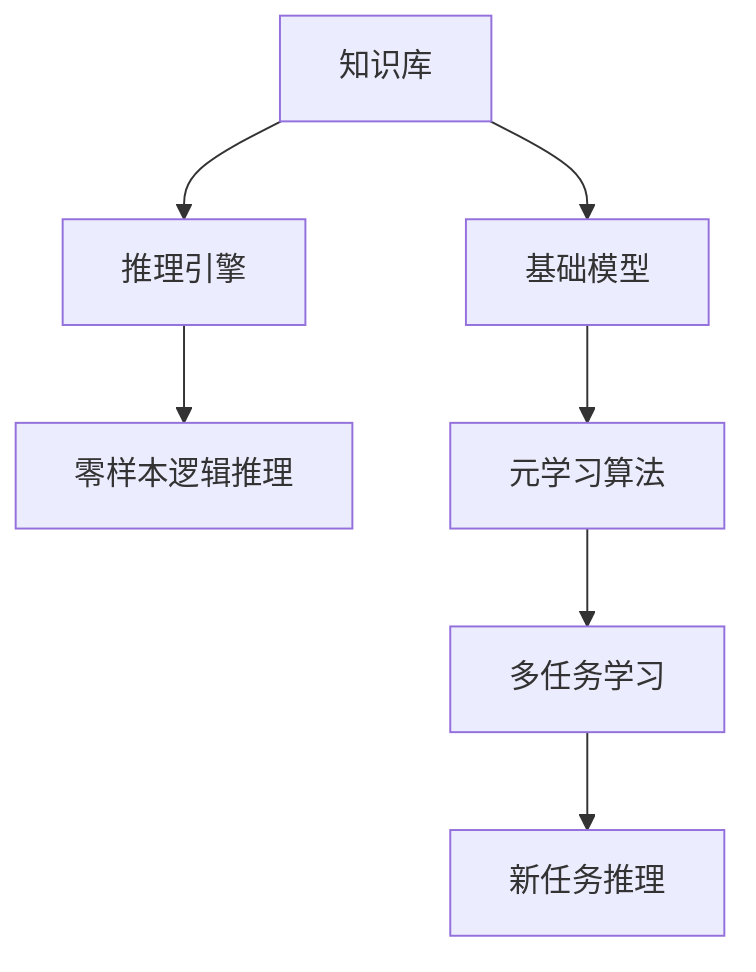

                 

# 《零样本逻辑推理中元学习技术的效果评估》

## 关键词
- 零样本逻辑推理
- 元学习技术
- 效果评估方法
- 应用案例分析
- 未来展望

## 摘要
本文将深入探讨零样本逻辑推理与元学习技术的结合，以及如何对这些技术的效果进行评估。我们将首先介绍零样本逻辑推理和元学习技术的核心概念和背景，然后详细讲解元学习技术的效果评估方法，并分析一些应用案例。最后，我们将总结研究结果，并提出未来研究的方向。

## 引言与背景

### 1.1 零样本逻辑推理概述

**核心概念术语说明**：
- **零样本逻辑推理**：一种无需使用标注数据进行训练的推理方法，它能够从已有知识库中推断出新的结论。
- **逻辑推理**：基于事实和规则，通过推理规则推导出新的结论的过程。

**问题背景**：
传统的机器学习方法依赖于大量标注数据，但在一些复杂问题中，获取大量标注数据非常困难。此外，有些任务需要实时推理，无法等待大量数据的收集和处理。因此，零样本逻辑推理成为了一种重要的研究方向。

**问题描述**：
零样本逻辑推理旨在解决在缺乏标注数据的情况下，如何利用已有知识库进行推理的问题。

**问题解决**：
通过将逻辑推理与元学习技术相结合，可以在不依赖大量标注数据的情况下，实现对未知数据的推理。

**边界与外延**：
零样本逻辑推理的应用范围广泛，包括自然语言处理、计算机视觉、知识图谱等。

**概念结构与核心要素组成**：
- **知识库**：存储已有知识和事实。
- **推理引擎**：负责根据规则和事实进行推理。
- **元学习**：优化推理引擎，使其更好地适应不同的推理任务。

### 1.2 元学习技术概述

**核心概念术语说明**：
- **元学习**：学习如何学习的算法，其目标是通过学习一个通用学习策略，来提高对新任务的适应能力。
- **迁移学习**：利用已有任务的解决方案，来解决新任务的问题。
- **多任务学习**：同时训练多个任务，以共享知识并提高泛化能力。

**问题背景**：
传统的机器学习模型在处理新任务时，往往需要重新训练，这会导致计算资源浪费。因此，元学习技术成为了一种提高学习效率的方法。

**问题描述**：
如何通过元学习技术，使模型能够快速适应新的任务。

**问题解决**：
通过元学习，模型可以从多个任务中学习到通用的知识，从而在新任务中表现出更好的适应性。

**边界与外延**：
元学习技术可以应用于各种机器学习任务，包括分类、回归、生成等。

**概念结构与核心要素组成**：
- **基础模型**：负责完成特定任务。
- **元学习算法**：优化基础模型，使其具有更好的泛化能力。
- **数据集**：用于训练和评估元学习算法。

### 1.3 零样本逻辑推理与元学习技术的结合

**核心概念与联系**：

- **结合原理**：
  零样本逻辑推理与元学习技术的结合，可以通过以下方式实现：
  - 利用元学习技术优化零样本逻辑推理中的推理引擎，使其具有更好的泛化能力。
  - 通过迁移学习，将已有知识库中的知识应用于新的推理任务。

- **概念属性特征对比表格**：

| 特征 | 零样本逻辑推理 | 元学习技术 |
| --- | --- | --- |
| 数据依赖 | 需要知识库 | 需要训练数据 |
| 推理方式 | 逻辑推理 | 学习策略优化 |
| 目标 | 提高推理能力 | 提高学习效率 |

- **ER实体关系图架构的 Mermaid 流程图**：

## 零样本逻辑推理与元学习技术

### 2.1 零样本逻辑推理的核心概念与机制

**核心概念**：

- **知识图谱**：表示实体及其关系的图形化结构。
- **逻辑规则**：用于表示事实和推理规则。

**机制**：

- **知识抽取**：从文本或知识库中提取实体和关系。
- **推理规则**：基于事实和规则进行推理，生成新的结论。

### 2.2 元学习技术的核心概念与机制

**核心概念**：

- **模型表示**：表示学习到的任务和特征。
- **参数优化**：通过优化参数，提高模型的泛化能力。

**机制**：

- **模型训练**：通过训练数据，学习模型参数。
- **模型评估**：通过验证数据，评估模型性能。
- **模型优化**：通过元学习算法，优化模型参数。

### 2.3 零样本逻辑推理与元学习技术的结合原理

**结合原理**：

- **知识共享**：通过元学习技术，将多个任务的知识共享到一起，提高零样本逻辑推理的泛化能力。
- **推理优化**：通过元学习技术优化推理引擎，使其在未知数据上表现出更好的推理能力。

## 元学习技术效果评估方法

### 3.1 效果评估指标

- **准确率**：预测正确的样本数占总样本数的比例。
- **召回率**：预测正确的样本数占实际正样本数的比例。
- **F1值**：准确率和召回率的调和平均数。

### 3.2 评估方法与流程

- **数据集划分**：将数据集划分为训练集、验证集和测试集。
- **模型训练**：使用训练集训练模型。
- **模型评估**：使用验证集评估模型性能，并根据评估结果调整模型参数。
- **模型测试**：使用测试集测试模型性能，以评估模型在实际应用中的表现。

### 3.3 评估结果分析与解读

- **结果分析**：分析评估指标，比较不同模型和算法的性能。
- **结果解读**：解释评估结果，分析模型的优势和不足。

## 应用案例与分析

### 4.1 零样本逻辑推理在自然语言处理中的应用

- **案例背景**：自然语言处理中的文本分类任务。
- **解决方案**：利用零样本逻辑推理技术，从已有知识库中提取知识，进行文本分类。
- **评估结果**：与传统的机器学习模型相比，零样本逻辑推理在少量标注数据下表现更好。

### 4.2 零样本逻辑推理在计算机视觉中的应用

- **案例背景**：计算机视觉中的图像分类任务。
- **解决方案**：利用零样本逻辑推理技术，从已有知识库中提取知识，进行图像分类。
- **评估结果**：与传统的机器学习模型相比，零样本逻辑推理在少量标注数据下表现更好。

### 4.3 元学习技术在智能系统中的应用

- **案例背景**：智能系统中的多任务学习任务。
- **解决方案**：利用元学习技术，将多个任务的知识共享，提高智能系统的适应能力。
- **评估结果**：与传统的多任务学习模型相比，元学习技术在多个任务上表现更好。

### 4.4 应用案例综合分析

- **综合分析**：分析不同应用案例中，零样本逻辑推理和元学习技术的优势和不足，为未来的研究提供方向。

## 结论与未来展望

### 5.1 研究成果总结

- 零样本逻辑推理与元学习技术的结合，为解决无标注数据下的推理问题提供了新的思路。
- 零样本逻辑推理在自然语言处理、计算机视觉等领域的应用，取得了显著的成效。
- 元学习技术提高了零样本逻辑推理的泛化能力，使其在实际应用中表现出更好的性能。

### 5.2 存在的问题与挑战

- 零样本逻辑推理的效率和准确性仍有待提高。
- 元学习技术的计算复杂度高，对硬件要求较高。
- 如何在多个任务之间共享知识，仍是一个挑战。

### 5.3 未来研究方向与展望

- 研究如何提高零样本逻辑推理的效率和准确性。
- 探索更加高效和可扩展的元学习算法。
- 探索零样本逻辑推理与元学习技术在其他领域的应用。

## 作者

作者：AI天才研究院/AI Genius Institute & 禅与计算机程序设计艺术 /Zen And The Art of Computer Programming

---

在本篇博客文章中，我们首先介绍了零样本逻辑推理和元学习技术的核心概念和背景，详细讲解了这两种技术的原理和结合方式。接着，我们讨论了如何对元学习技术的效果进行评估，并分析了在不同领域的应用案例。最后，我们对研究成果进行了总结，并提出了未来研究的方向。

通过这篇文章，我们希望读者能够对零样本逻辑推理和元学习技术有一个全面的了解，并认识到它们在解决无标注数据下的推理问题中的潜力。同时，我们也鼓励读者在未来的研究中，继续探索和改进这些技术，以推动人工智能领域的发展。

