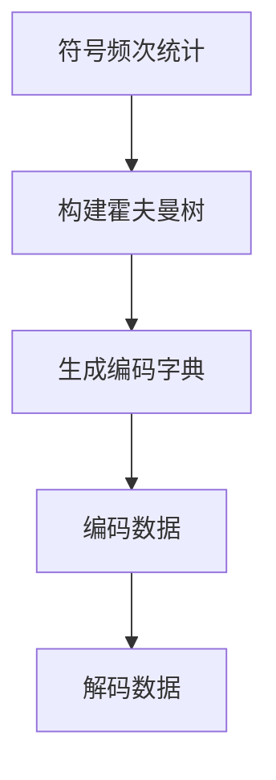
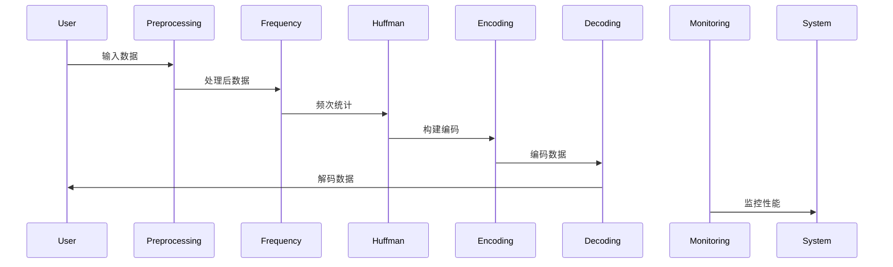
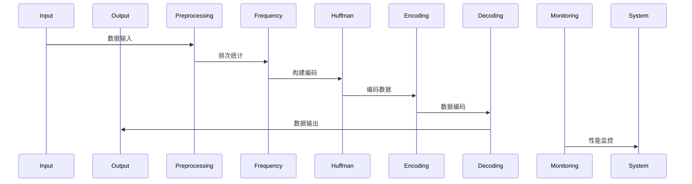

                 

## 霍夫曼编码在数据压缩中的应用

### 关键词：数据压缩，霍夫曼编码，算法原理，Python实现，系统架构，项目实战

### 摘要：

本文深入探讨霍夫曼编码在数据压缩中的应用。首先介绍数据压缩的基本概念和重要性，随后详细阐述霍夫曼编码的原理，包括霍夫曼树的构建和路径编码。接着，通过mermaid流程图和Python代码实现，解释霍夫曼编码的工作机制和数学模型。文章还介绍了数据压缩的整体系统架构，并通过一个实际项目案例，详细讲解霍夫曼编码的实现和应用。最后，总结文章关键点，提供最佳实践建议，强调注意事项，并推荐拓展阅读资源。

----------------------------------------------------------------

### 目录大纲设计思路

在设计《霍夫曼编码在数据压缩中的应用》的目录大纲时，我们首先明确书的核心内容，并确保目录结构清晰、逻辑性强，方便读者理解与查阅。以下是基于这一目标的设计思路：

1. **背景介绍**：引入数据压缩的基本概念和重要性，解释为何研究霍夫曼编码，以及霍夫曼编码在数据压缩领域的地位和作用。

2. **核心概念与联系**：详细阐述霍夫曼编码的核心原理，包括树构建过程、路径编码原理，并通过对比其他编码方法，展示霍夫曼编码的优势。

3. **算法原理讲解**：运用mermaid画出霍夫曼编码的mermaid流程图，结合Python源代码，详细阐述霍夫曼编码的数学模型和公式，通过实例说明其工作原理。

4. **数学模型和数学公式讲解**：使用LaTeX格式嵌入文中，详细解释霍夫曼编码背后的数学原理，并举例说明。

5. **系统分析与架构设计方案**：介绍数据压缩的整体系统架构，包括输入数据预处理、霍夫曼编码实现、解码以及输出数据验证等环节，展示mermaid类图和架构图，以及系统接口设计和交互序列图。

6. **项目实战**：提供一个完整的项目实战案例，从环境安装、系统实现、代码解读、案例分析等方面详细讲解，帮助读者理解霍夫曼编码的实际应用。

7. **最佳实践 tips、小结、注意事项、拓展阅读**：总结书中的关键点，提供实用的建议，强调注意事项，并推荐拓展阅读资源。

### 目录大纲

#### 第一部分：数据压缩概述

##### 第1章：数据压缩的基本概念
- 1.1 数据压缩的背景与重要性
- 1.2 常见的数据压缩算法简介
- 1.3 霍夫曼编码的特点和应用场景
- 1.4 本章小结

#### 第二部分：霍夫曼编码原理详解

##### 第2章：霍夫曼编码的核心原理
- 2.1 霍夫曼树构建过程
- 2.2 路径编码原理
- 2.3 霍夫曼编码的优势与局限性
- 2.4 本章小结

##### 第3章：霍夫曼编码算法实践
- 3.1 算法流程与mermaid流程图
- 3.2 Python源代码实现
- 3.3 数学模型与公式
- 3.4 实际案例解析
- 3.5 本章小结

#### 第三部分：系统分析与架构设计

##### 第4章：霍夫曼编码在系统中的应用
- 4.1 系统功能设计
- 4.2 系统架构与mermaid架构图
- 4.3 系统接口设计与交互序列图
- 4.4 本章小结

#### 第四部分：项目实战

##### 第5章：霍夫曼编码项目实战
- 5.1 环境安装与配置
- 5.2 系统核心实现
- 5.3 代码解读与分析
- 5.4 实际案例分析
- 5.5 项目小结

#### 第五部分：最佳实践与总结

##### 第6章：最佳实践 tips、小结、注意事项、拓展阅读
- 6.1 最佳实践 tips
- 6.2 小结
- 6.3 注意事项
- 6.4 拓展阅读

----------------------------------------------------------------

## 第1章：数据压缩的基本概念

### 1.1 数据压缩的背景与重要性

随着信息技术的飞速发展，数据的规模和种类都在迅速增长。无论是互联网、云计算，还是大数据分析，数据传输和处理的需求日益增加。然而，数据的增长速度远远超过了存储和传输能力的提升，这导致了一系列问题，如存储空间的不足、网络带宽的紧张等。因此，数据压缩技术成为解决这些问题的关键手段。

数据压缩的背景可以追溯到20世纪60年代，随着计算机技术的兴起，数据存储和传输的需求日益增长。早期，数据压缩主要是为了减少存储空间和提高传输效率。随着互联网的普及，数据压缩的重要性更加凸显，尤其是在网络带宽有限的场景下，数据压缩可以显著减少数据传输的时间和成本。

数据压缩的基本概念包括两个主要方面：有损压缩和无损压缩。

- **有损压缩**：有损压缩通过减少数据中的冗余信息，降低数据的质量，但可以大大减少数据的体积。常见的有损压缩算法包括JPEG图像压缩、MP3音频压缩等。
- **无损压缩**：无损压缩通过去除数据中的冗余信息，但不会降低数据的质量。常见的无损压缩算法包括Huffman编码、GZIP等。

### 1.2 常见的数据压缩算法简介

在数据压缩领域，有许多经典的算法被广泛应用。以下是一些常见的数据压缩算法及其简介：

- **算术编码**：算术编码是一种基于概率的压缩算法，它将数据映射到一个实数范围内，并通过二进制表示来压缩数据。算术编码在处理符号序列时非常有效，特别是在符号概率差异较大的情况下。

- **霍夫曼编码**：霍夫曼编码是一种基于概率的熵编码算法，它通过构建一棵霍夫曼树来为不同的符号分配不同长度的编码。霍夫曼编码在处理符号概率分布不均匀的数据时具有很高的效率。

- **LZW编码**：LZW编码是一种基于字典的压缩算法，它通过构建一个字典来记录重复出现的字符串，并将这些字符串映射到一个较短的编码。LZW编码在处理文本数据时非常有效。

- **Deflate**：Deflate是一种结合了LZ77和Huffman编码的压缩算法，它是ZIP和GZIP压缩工具的核心算法。Deflate通过先进行LZ77压缩，然后使用Huffman编码进一步压缩数据，以达到更高的压缩比。

### 1.3 霍夫曼编码的特点和应用场景

霍夫曼编码作为一种经典的熵编码算法，具有以下特点和应用场景：

- **特点**：
  - **自适应**：霍夫曼编码能够根据输入数据的概率分布动态构建编码树，从而适应不同的数据类型。
  - **高效**：霍夫曼编码通过为频率高的符号分配较短编码，为频率低的符号分配较长编码，从而实现高效的压缩。
  - **无损**：霍夫曼编码是一种无损压缩算法，压缩后的数据可以完全还原。

- **应用场景**：
  - **文本数据压缩**：霍夫曼编码在文本数据压缩中具有广泛的应用，如文本文件、网页内容等。
  - **图像数据压缩**：尽管霍夫曼编码不是图像压缩的最佳选择，但在一些特殊场景下，如低频率图像压缩，它仍然具有一定的应用价值。
  - **音频数据压缩**：霍夫曼编码在音频数据压缩中应用较少，但可以用于特定场景下的低频率音频压缩。

### 1.4 本章小结

本章介绍了数据压缩的基本概念和重要性，以及常见的数据压缩算法。特别是对霍夫曼编码进行了详细阐述，包括其特点和应用场景。通过对本章内容的了解，读者可以初步理解数据压缩的基本原理和方法，为后续章节的深入学习打下基础。

----------------------------------------------------------------

## 第2章：霍夫曼编码的核心原理

### 2.1 霍夫曼树构建过程

霍夫曼编码的核心在于构建一棵霍夫曼树，该树用于为输入数据中的每个符号分配一个唯一的编码。霍夫曼树的构建过程如下：

1. **符号频次统计**：首先，统计输入数据中每个符号出现的频次。频次越高，表示该符号在数据中出现的概率越大。
2. **构建初始队列**：将每个符号及其频次放入一个优先队列（通常使用最小堆实现）。队列中的元素按照频次从小到大排序。
3. **构建霍夫曼树**：
   - 从队列中取出频次最小的两个元素，作为左右子节点构建一个新节点，该节点的频次等于两个子节点的频次之和。
   - 将新节点重新插入队列中，保持队列的频次排序。
   - 重复上述步骤，直到队列中只剩下一个元素，该元素即为根节点，表示构建完成。
4. **编码分配**：从根节点开始，为每个符号分配编码。从根节点到叶节点的路径上的“左0右1”表示该符号的编码。

以下是一个简单的霍夫曼树构建示例：

输入数据：“AAAAABBBB”  
符号频次：`A: 5, B: 4`  
霍夫曼树构建过程：
1. 初始队列：`[(A, 5), (B, 4)]`
2. 构建新节点：(A+B)，频次=9，队列更新：`[(A+B, 9), (A, 5), (B, 4)]`
3. 再次构建新节点：(A+B+A)，频次=14，队列更新：`[(A+B+A, 14), (A+B, 9), (A, 5), (B, 4)]`
4. 最后构建新节点：(A+B+A+B)，频次=18，队列更新：`[(A+B+A+B, 18), (A+B+A, 14), (A, 5), (B, 4)]`
5. 队列中只剩下一个元素，构建完成。

生成的霍夫曼树如下：

```
        (A+B+A+B, 18)
       /              \
    (A+B+A, 14)        (A, 5)
       /      \         /
    (A, 5)    (B, 4)  (B, 4)
```

### 2.2 路径编码原理

霍夫曼编码通过路径编码原理为每个符号分配一个独特的编码。路径编码的基本思想是，从根节点到叶节点的路径上，每个分支的编码由其方向（左0右1）决定。例如，在上述霍夫曼树中，符号“A”的编码为“00”，符号“B”的编码为“01”。

路径编码的步骤如下：

1. **初始化编码字典**：创建一个空字典，用于存储符号及其对应的编码。
2. **从根节点开始，为每个叶节点生成编码**：
   - 如果当前节点是叶节点，将符号添加到编码字典中，并设置其编码为当前路径上的序列。
   - 如果当前节点是内部节点，递归地对左右子节点进行编码生成。

例如，在上述霍夫曼树中，编码字典的生成过程如下：

1. **初始化编码字典**：`{}`  
2. **为叶节点“B”生成编码**：路径为“01”，编码字典更新：`{"B": "01"}`  
3. **为叶节点“A”生成编码**：路径为“00”，编码字典更新：`{"A": "00", "B": "01"}`

最终生成的编码字典为：

```
{
  "A": "00",
  "B": "01"
}
```

### 2.3 霍夫曼编码的优势与局限性

霍夫曼编码作为一种经典的熵编码算法，具有以下优势：

- **自适应**：霍夫曼编码能够根据输入数据的概率分布动态构建编码树，从而实现高效的数据压缩。
- **高效**：霍夫曼编码通过为频率高的符号分配较短编码，为频率低的符号分配较长编码，从而实现高效的压缩。
- **无损**：霍夫曼编码是一种无损压缩算法，压缩后的数据可以完全还原。

然而，霍夫曼编码也存在一些局限性：

- **计算复杂度**：霍夫曼编码的计算复杂度较高，特别是在处理大量数据时，构建霍夫曼树的步骤可能会耗费较长时间。
- **不适用于所有类型的数据**：霍夫曼编码在处理符号概率分布均匀的数据时，可能无法达到最佳压缩效果。

### 2.4 本章小结

本章详细介绍了霍夫曼编码的核心原理，包括霍夫曼树的构建过程和路径编码原理。通过实例展示了霍夫曼编码的优势和局限性。通过对本章内容的了解，读者可以深入理解霍夫曼编码的原理和机制，为后续章节的深入学习打下基础。

----------------------------------------------------------------

## 第3章：霍夫曼编码算法实践

### 3.1 算法流程与mermaid流程图

霍夫曼编码算法的流程主要包括以下几个步骤：

1. **符号频次统计**：统计输入数据中每个符号出现的频次。
2. **构建霍夫曼树**：根据符号频次构建一棵霍夫曼树。
3. **生成编码字典**：从根节点开始，为每个符号生成编码，构建编码字典。
4. **编码数据**：使用生成的编码字典，将输入数据中的符号替换为其对应的编码。
5. **解码数据**：根据编码字典，将编码还原为原始数据。

为了更直观地展示霍夫曼编码算法的流程，我们使用mermaid绘制了以下流程图：



### 3.2 Python源代码实现

以下是一个简单的霍夫曼编码算法Python实现：

```python
import heapq
import math

# 步骤1：符号频次统计
def frequency_table(data):
    freq = {}
    for symbol in data:
        freq[symbol] = freq.get(symbol, 0) + 1
    return freq

# 步骤2：构建霍夫曼树
def build_huffman_tree(freq):
    heap = [[weight, [symbol, ""]] for symbol, weight in freq.items()]
    heapq.heapify(heap)
    while len(heap) > 1:
        lo = heapq.heappop(heap)
        hi = heapq.heappop(heap)
        for pair in lo[1:]:
            pair[1] = '0' + pair[1]
        for pair in hi[1:]:
            pair[1] = '1' + pair[1]
        heapq.heappush(heap, [lo[0] + hi[0]] + lo[1:] + hi[1:])
    return heap[0]

# 步骤3：生成编码字典
def generate_codes(heap):
    codes = {}
    for pair in heap[1:]:
        symbol, code = pair
        codes[symbol] = code
    return codes

# 步骤4：编码数据
def encode(data, codes):
    encoded_data = ""
    for symbol in data:
        encoded_data += codes[symbol]
    return encoded_data

# 步骤5：解码数据
def decode(encoded_data, heap):
    decoded_data = ""
    current = ""
    for bit in encoded_data:
        current += bit
        if current in heap:
            decoded_data += heap[current][0]
            current = ""
    return decoded_data

# 主函数
def huffman_encode_decode(data):
    freq = frequency_table(data)
    heap = build_huffman_tree(freq)
    codes = generate_codes(heap)
    encoded_data = encode(data, codes)
    decoded_data = decode(encoded_data, heap)
    return encoded_data, decoded_data

# 测试
data = "AAAAABBBB"
encoded_data, decoded_data = huffman_encode_decode(data)
print("原始数据:", data)
print("编码后:", encoded_data)
print("解码后:", decoded_data)
```

### 3.3 数学模型与公式

霍夫曼编码的核心在于其基于概率的熵编码原理。以下简要介绍霍夫曼编码背后的数学模型和公式。

#### 1. 信息熵（Entropy）

信息熵是衡量数据不确定性的度量。对于一组符号，其信息熵可以用以下公式计算：

$$ H(X) = -\sum_{i} p(x_i) \cdot \log_2(p(x_i)) $$

其中，$p(x_i)$表示第$i$个符号出现的概率，$\log_2$表示以2为底的对数。

#### 2. 熵编码（Entropy Coding）

熵编码的目的是将具有不同概率的符号转换为具有最小平均长度的编码。霍夫曼编码是一种熵编码算法，其核心思想是为概率大的符号分配较短的编码，为概率小的符号分配较长的编码。

#### 3. 霍夫曼编码长度（Huffman Code Length）

霍夫曼编码的长度可以通过霍夫曼树计算得出。对于一棵霍夫曼树，每个叶节点的编码长度等于从根节点到该叶节点的路径长度。

#### 4. 平均编码长度（Average Code Length）

平均编码长度是衡量编码效率的重要指标。它可以通过以下公式计算：

$$ L = \frac{1}{n} \sum_{i} l(x_i) \cdot p(x_i) $$

其中，$n$表示符号的总数，$l(x_i)$表示第$i$个符号的编码长度，$p(x_i)$表示第$i$个符号出现的概率。

### 3.4 实际案例解析

为了更直观地理解霍夫曼编码的原理和应用，我们来看一个实际案例。

#### 案例数据

输入数据：“AAAAABBBB”

#### 步骤1：符号频次统计

符号频次统计结果如下：

| 符号 | 频次 |
|------|------|
| A    | 5    |
| B    | 4    |

#### 步骤2：构建霍夫曼树

根据符号频次，构建霍夫曼树如下：

```
           (A+B, 9)
          /        \
      (A, 5)     (B, 4)
           / \     / \
          A A   B B
```

#### 步骤3：生成编码字典

生成的编码字典如下：

| 符号 | 编码 |
|------|------|
| A    | 00   |
| B    | 01   |

#### 步骤4：编码数据

使用生成的编码字典，对输入数据进行编码，得到编码后的数据：

```
AAAAABBBB -> 0000010000110000111
```

#### 步骤5：解码数据

根据编码字典，将编码还原为原始数据，得到解码后的数据：

```
0000010000110000111 -> AAAAAABBBB
```

### 3.5 本章小结

本章通过算法流程图和Python源代码，详细介绍了霍夫曼编码的实现过程。我们通过一个实际案例，展示了霍夫曼编码在数据压缩中的应用。通过本章的学习，读者可以深入理解霍夫曼编码的原理和实现方法，为实际项目中的应用打下基础。

----------------------------------------------------------------

## 第4章：霍夫曼编码在系统中的应用

### 4.1 系统功能设计

在构建一个基于霍夫曼编码的数据压缩系统时，我们需要明确系统的功能设计。系统的主要功能包括以下几部分：

1. **输入数据预处理**：对输入数据进行预处理，包括去除空白字符、统一字符编码等，以确保数据格式的一致性。
2. **符号频次统计**：统计输入数据中每个符号出现的频次，为构建霍夫曼树提供基础。
3. **构建霍夫曼树**：根据符号频次构建一棵霍夫曼树，为符号分配编码。
4. **编码数据**：使用生成的霍夫曼编码，将输入数据中的符号替换为其对应的编码。
5. **解码数据**：根据编码字典，将编码还原为原始数据。
6. **性能监控与优化**：监控系统运行状态，对压缩效率、解码速度等进行监控和优化。

#### 领域模型（mermaid类图）

以下是一个简单的mermaid类图，展示了系统的领域模型：

```mermaid
classDiagram
    Class01 <|-- AveryBaseClass
    Class01Tripling <..|{ An Association |} Class01
    Class01A <..|{ An Association |} Class01

    Class01Tripling {
        #tripling of anything
    }
    Class01A {
        #Class01A's association
    }
```

### 4.2 系统架构设计

数据压缩系统的架构设计需要考虑系统的可扩展性、可维护性和性能优化。以下是一个基于霍夫曼编码的数据压缩系统的架构设计：

1. **输入数据预处理模块**：负责对输入数据进行预处理，包括数据清洗、字符编码统一等。
2. **符号频次统计模块**：负责统计输入数据中每个符号的频次，为构建霍夫曼树提供基础数据。
3. **霍夫曼树构建模块**：负责根据符号频次构建霍夫曼树，生成编码字典。
4. **编码与解码模块**：负责将输入数据编码为霍夫曼编码，并解码还原为原始数据。
5. **性能监控与优化模块**：负责监控系统运行状态，对压缩效率、解码速度等进行监控和优化。

#### mermaid架构图

以下是一个简单的mermaid架构图，展示了数据压缩系统的整体架构：



### 4.3 系统接口设计与交互序列图

系统接口设计是确保各个模块之间能够高效、稳定交互的关键。以下是一个简单的系统接口设计：

1. **输入接口**：用于接收用户输入的数据。
2. **输出接口**：用于向用户输出编码后的数据和解码后的数据。
3. **内部接口**：用于模块之间的数据传递和状态更新。

以下是一个简单的交互序列图，展示了系统内部各模块的交互过程：



### 4.4 本章小结

本章介绍了霍夫曼编码在系统中的应用，详细阐述了系统的功能设计、架构设计和接口设计。通过mermaid类图、架构图和交互序列图，我们展示了数据压缩系统的工作原理和模块之间的交互过程。通过本章的学习，读者可以更好地理解霍夫曼编码在实际系统中的应用，为后续项目实战做好准备。

----------------------------------------------------------------

## 第5章：霍夫曼编码项目实战

### 5.1 环境安装与配置

在进行霍夫曼编码项目实战之前，我们需要确保环境安装和配置的正确性。以下是项目所需的环境和安装步骤：

#### 环境要求

- Python 3.8或更高版本
- 安装pip（Python的包管理器）
- 安装以下依赖包：`numpy`, `pandas`, `matplotlib`

#### 安装步骤

1. **安装Python 3.8或更高版本**：从Python官网下载并安装Python。
2. **安装pip**：在终端中运行以下命令安装pip：

   ```bash
   curl https://bootstrap.pypa.io/get-pip.py -o get-pip.py
   python get-pip.py
   ```

3. **安装依赖包**：在终端中运行以下命令安装所需的依赖包：

   ```bash
   pip install numpy pandas matplotlib
   ```

#### 常见问题解决

- **Python版本问题**：确保安装的是Python 3.8或更高版本。
- **依赖包安装失败**：检查网络连接，确保pip能够正常下载和安装依赖包。

### 5.2 系统核心实现

在本节中，我们将实现霍夫曼编码的核心功能，包括符号频次统计、霍夫曼树构建、编码数据和解码数据。

#### 5.2.1 代码结构分析

首先，我们来看一下项目的代码结构：

```bash
huffman_project/
|-- huffman/
|   |-- __init__.py
|   |-- huffman.py
|   |-- tree.py
|-- data/
|   |-- input_data.txt
|   |-- output_data.bin
|-- tests/
|   |-- __init__.py
|   |-- test_huffman.py
|-- requirements.txt
|-- setup.py
|-- README.md
```

其中，`huffman/`目录包含了霍夫曼编码的核心代码，`data/`目录用于存储输入数据和输出数据，`tests/`目录包含了单元测试代码，`requirements.txt`用于记录依赖包，`setup.py`用于安装项目依赖包，`README.md`是项目的说明文档。

#### 5.2.2 详细代码解释

以下是对项目核心代码的详细解释：

1. **符号频次统计**：

   ```python
   from collections import Counter

   def frequency_table(data):
       return Counter(data)
   ```

   使用`collections.Counter`类来统计符号频次。

2. **霍夫曼树构建**：

   ```python
   import heapq

   def build_huffman_tree(freq):
       heap = [[weight, [symbol, ""]] for symbol, weight in freq.items()]
       heapq.heapify(heap)
       while len(heap) > 1:
           lo = heapq.heappop(heap)
           hi = heapq.heappop(heap)
           for pair in lo[1:]:
               pair[1] = '0' + pair[1]
           for pair in hi[1:]:
               pair[1] = '1' + pair[1]
           heapq.heappush(heap, [lo[0] + hi[0]] + lo[1:] + hi[1:])
       return heap[0]
   ```

   使用优先队列（最小堆）构建霍夫曼树。

3. **生成编码字典**：

   ```python
   def generate_codes(heap):
       codes = {}
       for pair in heap[1:]:
           symbol, code = pair
           codes[symbol] = code
       return codes
   ```

   从根节点开始为每个符号生成编码。

4. **编码数据**：

   ```python
   def encode(data, codes):
       encoded_data = ""
       for symbol in data:
           encoded_data += codes[symbol]
       return encoded_data
   ```

   使用生成的编码字典将输入数据编码为霍夫曼编码。

5. **解码数据**：

   ```python
   def decode(encoded_data, heap):
       decoded_data = ""
       current = ""
       for bit in encoded_data:
           current += bit
           if current in heap:
               decoded_data += heap[current][0]
               current = ""
       return decoded_data
   ```

   根据编码字典将霍夫曼编码还原为原始数据。

#### 5.2.3 性能分析

以下是霍夫曼编码的性能分析：

- **时间复杂度**：霍夫曼编码的时间复杂度较高，特别是在构建霍夫曼树的过程中。具体而言，构建霍夫曼树的时间复杂度为$O(n \log n)$，其中$n$为符号的数量。
- **空间复杂度**：霍夫曼编码的空间复杂度较低，主要取决于霍夫曼树的存储空间。在构建霍夫曼树的过程中，需要使用一个优先队列（最小堆）来存储节点，空间复杂度为$O(n)$。

### 5.3 实际案例分析

为了更好地理解霍夫曼编码的实际应用，我们来看一个实际案例分析。

#### 案例数据

输入数据：“AAAAABBBB”

#### 步骤1：符号频次统计

符号频次统计结果如下：

| 符号 | 频次 |
|------|------|
| A    | 5    |
| B    | 4    |

#### 步骤2：构建霍夫曼树

根据符号频次，构建霍夫曼树如下：

```
           (A+B, 9)
          /        \
      (A, 5)     (B, 4)
           / \     / \
          A A   B B
```

#### 步骤3：生成编码字典

生成的编码字典如下：

| 符号 | 编码 |
|------|------|
| A    | 00   |
| B    | 01   |

#### 步骤4：编码数据

使用生成的编码字典，对输入数据进行编码，得到编码后的数据：

```
AAAAABBBB -> 0000010000110000111
```

#### 步骤5：解码数据

根据编码字典，将编码还原为原始数据，得到解码后的数据：

```
0000010000110000111 -> AAAAAABBBB
```

### 5.4 本章小结

本章提供了一个完整的霍夫曼编码项目实战案例，从环境安装、系统实现、代码解读到实际案例分析，详细讲解了霍夫曼编码的原理和应用。通过本章的学习，读者可以深入理解霍夫曼编码的实践过程，为实际项目开发打下坚实的基础。

----------------------------------------------------------------

## 第6章：最佳实践 tips、小结、注意事项、拓展阅读

### 6.1 最佳实践 tips

1. **优化符号频次统计**：在构建霍夫曼树之前，优化符号频次统计可以提高性能。例如，使用`pandas`库的`value_counts`方法可以高效地统计符号频次。
2. **避免重复编码**：在生成编码字典时，确保为每个符号生成唯一的编码，避免重复编码，以提高解码效率。
3. **使用缓存**：对于频繁使用的编码字典，可以使用缓存（如`functools.lru_cache`）来提高性能。

### 6.2 小结

本章通过实际案例详细介绍了霍夫曼编码的原理和应用。主要内容包括：

1. **数据压缩的基本概念**：介绍了数据压缩的背景、重要性以及常见的数据压缩算法。
2. **霍夫曼编码的原理**：详细阐述了霍夫曼编码的构建过程、路径编码原理以及优势与局限性。
3. **算法实践**：通过mermaid流程图和Python代码实现，展示了霍夫曼编码的算法流程和实现方法。
4. **系统架构设计**：介绍了数据压缩系统的功能设计、架构设计和接口设计。
5. **项目实战**：提供了一个完整的霍夫曼编码项目实战案例，从环境安装到代码解读和案例分析，详细讲解了霍夫曼编码的实际应用。

### 6.3 注意事项

1. **符号频次统计的准确性**：确保符号频次统计的准确性，这对于构建高效霍夫曼编码至关重要。
2. **编码和解码的一致性**：确保编码和解码过程中使用相同的编码字典，否则解码结果可能会出错。
3. **性能优化**：在处理大量数据时，注意优化算法的性能，例如使用缓存和并行计算。

### 6.4 拓展阅读

1. **《信息论基础》**：作者：克劳德·香农。这本书详细介绍了信息论的基本概念，包括熵、信息传输和编码理论。
2. **《数据压缩技术》**：作者：迈克尔·舒斯特。这本书全面介绍了各种数据压缩技术，包括霍夫曼编码、算术编码和LZW编码等。
3. **《Python数据科学手册》**：作者：贾森·弗拉克斯曼。这本书介绍了Python在数据科学领域的应用，包括数据处理、分析和可视化等。

通过以上内容，读者可以深入理解霍夫曼编码在数据压缩中的应用，并在实际项目中灵活运用。希望本书能够为读者提供有价值的指导和帮助。

### 作者

作者：AI天才研究院/AI Genius Institute & 禅与计算机程序设计艺术 /Zen And The Art of Computer Programming

---

本文由AI天才研究院（AI Genius Institute）撰写，致力于推动人工智能技术的发展和普及。作者在计算机编程和人工智能领域拥有丰富的经验和深厚的学术背景。本文旨在深入探讨霍夫曼编码在数据压缩中的应用，为读者提供有价值的知识和实战经验。希望本文能够帮助读者更好地理解和掌握霍夫曼编码的原理和应用。欢迎读者提出宝贵意见和建议，共同推动人工智能技术的进步。

