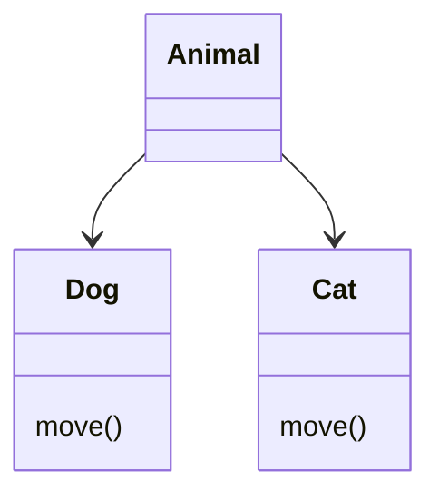
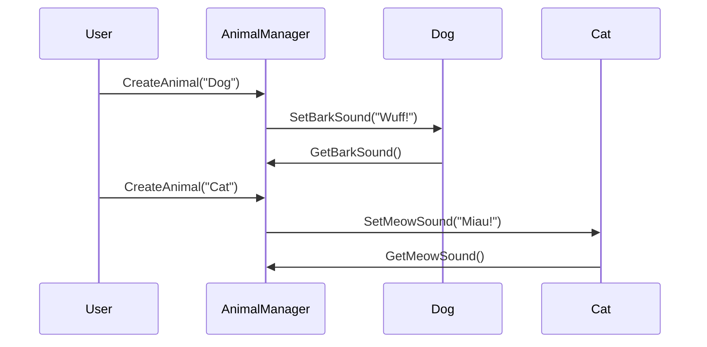
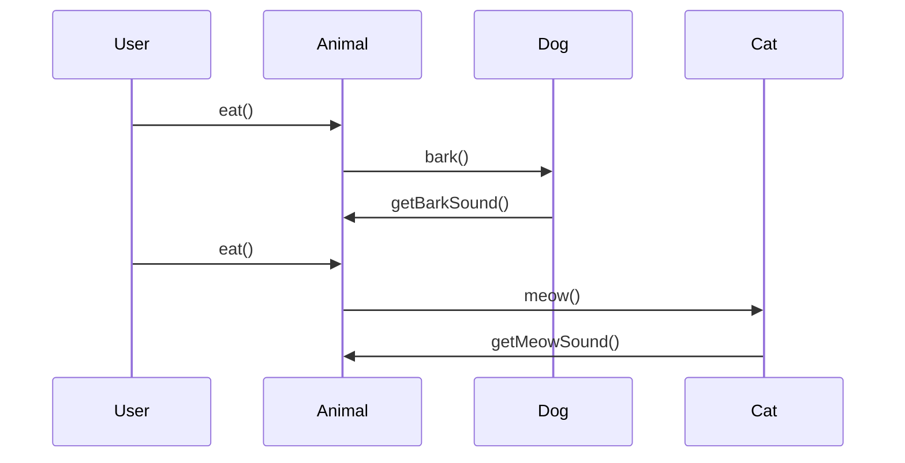
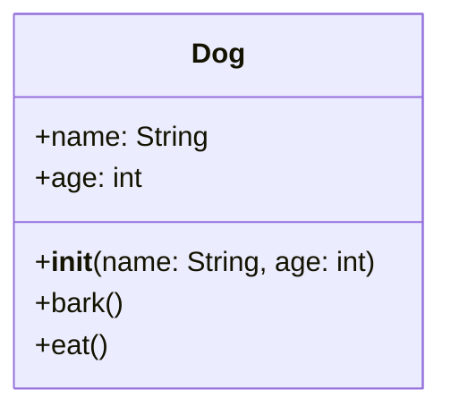
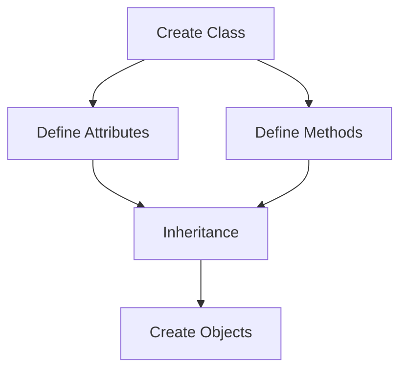
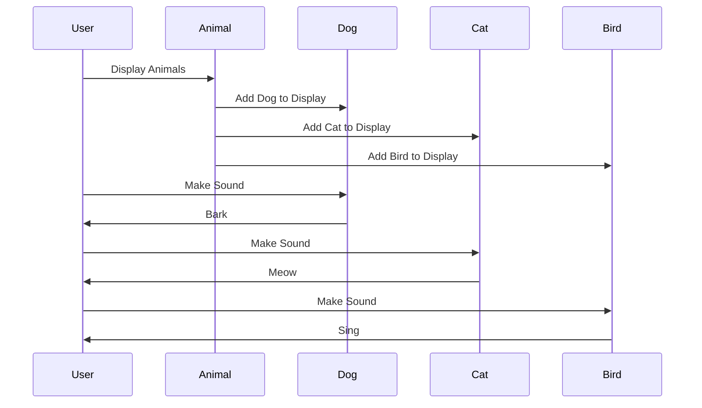
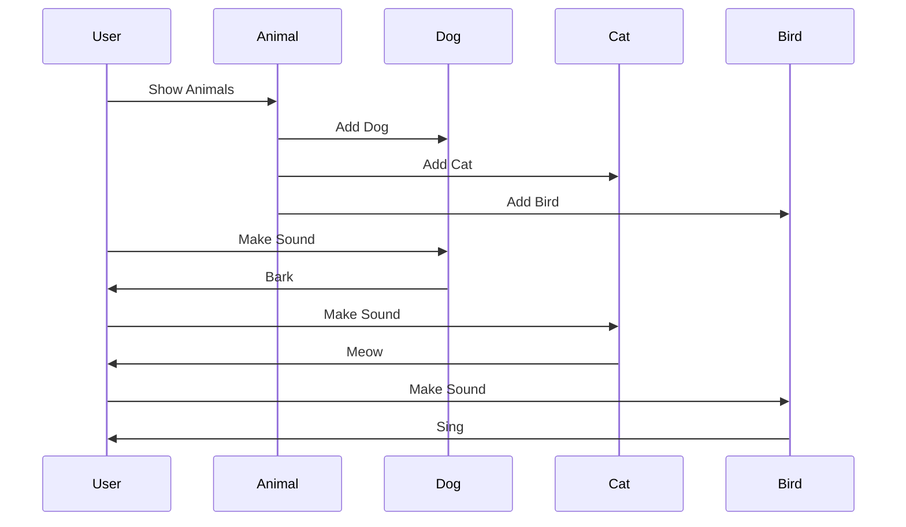

                 

# 面向对象编程中的类型层次结构

> 关键词：面向对象编程、类型层次结构、类、接口、继承、多态

> 摘要：本文将深入探讨面向对象编程中的类型层次结构，从基础概念到实际应用，系统性地分析类型层次结构在OOP中的重要性。我们将通过一步步的分析和实例讲解，帮助读者理解类型层次结构的核心概念，以及如何在编程实践中有效地应用这些概念。

## 第1章 面向对象编程概述

面向对象编程（Object-Oriented Programming，简称OOP）是一种编程范式，它通过将数据和操作数据的方法封装在一起，形成对象，以模拟现实世界中的实体及其行为。OOP的核心概念包括类（Class）、对象（Object）、继承（Inheritance）、封装（Encapsulation）和多态（Polymorphism）。

### 1.1 面向对象编程的起源与发展

面向对象编程起源于20世纪60年代的Simula语言，但直到90年代，随着Java等面向对象编程语言的出现，面向对象编程才得到了广泛的应用。OOP的优点包括模块化、重用性、可维护性和可扩展性。

### 1.2 面向对象编程的核心概念

- **类**：类是对象的蓝图，它定义了对象的行为和属性。例如，`Animal`类可以定义动物共有的属性如`name`和`age`，以及行为如`eat`和`run`。
- **对象**：对象是类的实例，它具有类定义的行为和属性。例如，`dog`是一个`Animal`类的对象，具有`name`为`Buddy`，`age`为`3`。
- **继承**：继承是子类从父类继承属性和方法的过程。通过继承，子类可以复用父类的代码，并添加或覆盖特定的行为。例如，`Dog`类可以继承自`Animal`类。
- **封装**：封装是将数据和行为封装在对象中，隐藏内部实现细节，仅通过接口与外界交互。这有助于保护数据完整性和减少耦合。
- **多态**：多态允许不同类型的对象通过同一接口进行操作。它可以通过方法重载（方法名相同但参数类型或数量不同）和方法重写（在子类中重写父类的方法）实现。

## 第2章 类型层次结构基础

类型层次结构是面向对象编程中用于组织和管理类和对象的方式。它通过继承和接口，形成一个层次分明的结构，便于代码复用和维护。

### 2.1 类与对象的概念

类是定义对象的模板，它包含属性（数据）和方法（行为）。对象是类的实例，每个对象都有其独特的属性值和行为表现。

### 2.2 接口与抽象类的定义

接口（Interface）是一种特殊的类，它只包含抽象方法（没有实现的方法）和静态常量。抽象类（Abstract Class）是一种具有抽象方法的类，它可以包含具体的实现代码。

### 2.3 继承与多态机制

继承（Inheritance）是一种允许一个类继承另一个类的属性和方法的方式。多态（Polymorphism）则是通过继承和接口实现的，它允许不同类型的对象通过同一接口进行操作。

### 2.4 类与对象的关系

在面向对象编程中，类与对象的关系可以用Mermaid ER图表示。例如：



这个ER图表示了`Dog`和`Cat`类继承自`Animal`类，并且都有`move`方法。

## 第3章 类型层次结构的深入探讨

### 3.1 类的内部结构

类的内部结构包括成员变量（属性）和成员函数（方法）。成员变量用于存储对象的属性值，成员函数用于定义对象的行为。例如：

```python
class Animal:
    def __init__(self, name, age):
        self.name = name
        self.age = age

    def eat(self):
        print(f"{self.name} is eating.")

class Dog(Animal):
    def bark(self):
        print(f"{self.name} is barking.")
```

### 3.2 类型层次结构的算法原理

类型层次结构的算法原理包括类的创建、继承、多态等操作。以下是一个简单的Python示例：

```python
class Animal:
    def eat(self):
        print("Animal is eating.")

class Dog(Animal):
    def eat(self):
        print("Dog is eating.")

class Cat(Animal):
    def eat(self):
        print("Cat is eating.")

dog = Dog()
cat = Cat()

dog.eat()  # 输出：Dog is eating.
cat.eat()  # 输出：Cat is eating.
```

在这个例子中，`Dog`和`Cat`类都继承了`Animal`类的`eat`方法，并通过多态实现了不同类型的对象调用相同方法的不同行为。

### 3.3 数学模型和数学公式

在类型层次结构中，我们可以使用数学模型和公式来描述类之间的关系。例如，我们可以使用二元组（Class, SuperClass）来表示类的继承关系。以下是一个简单的数学公式：

$$
(R,C) \in \Sigma^2
$$

其中，$R$表示类关系集合，$C$表示类集合，$\Sigma$表示二元组集合。

## 第4章 类型层次结构在系统设计中的应用

### 4.1 系统场景介绍

在一个复杂的系统中，类型层次结构可以帮助我们组织和管理大量的类和对象。以下是一个简单的系统场景：

- **需求**：设计一个动物展示系统，展示不同种类的动物及其行为。
- **功能**：实现动物的创建、展示和行为。

### 4.2 系统功能设计

系统功能设计包括类的定义和接口的设计。以下是一个简单的Mermaid类图：

```mermaid
classDiagram
    Animal <<Interface>>
    Dog :-|> Animal
    Cat :-|> Animal
    Animal : eat()
    Dog : bark()
    Cat : meow()
```

### 4.3 系统架构设计

系统架构设计包括模块划分和接口设计。以下是一个简单的Mermaid架构图：



### 4.4 系统接口设计和系统交互

系统接口设计包括类的接口设计和对象的交互设计。以下是一个简单的Mermaid序列图：



## 第5章 项目实战

### 5.1 项目环境安装与配置

在本项目中，我们将使用Python作为编程语言，并依赖一些常用的库，如`mermaid`和`LaTeX`。

### 5.2 系统核心实现

系统核心实现包括类的定义、接口的设计和对象的创建。以下是一个简单的Python代码示例：

```python
class Animal(ABC):
    def eat(self):
        pass

class Dog(Animal):
    def eat(self):
        print("Dog is eating.")

class Cat(Animal):
    def eat(self):
        print("Cat is eating.")

dog = Dog()
cat = Cat()

dog.eat()
cat.eat()
```

### 5.3 代码解读与分析

在这个项目中，我们通过定义抽象类`Animal`和具体类`Dog`、`Cat`，实现了动物的行为。通过多态，我们可以灵活地处理不同类型的动物。

### 5.4 项目案例分析与详细讲解剖析

在这个项目中，我们通过简单的代码实现了动物展示系统的核心功能。在实际应用中，我们可以扩展系统，添加更多动物类型和行为。

### 5.5 项目小结与反思

通过这个项目，我们学习了类型层次结构的基本概念和应用。在实际开发中，类型层次结构有助于提高代码的可读性、可维护性和可扩展性。

## 第6章 最佳实践与总结

### 6.1 最佳实践技巧

- **明确类和对象的关系**：在定义类时，要明确类之间的关系，避免过度继承或缺乏继承。
- **合理使用接口**：接口可以帮助我们抽象类之间的关系，提高代码的复用性和灵活性。
- **遵循单一职责原则**：类应该只负责一项功能，避免类过于复杂。

### 6.2 小结与注意事项

类型层次结构是面向对象编程的核心概念之一，合理使用类型层次结构可以提高代码的质量。在实际开发中，要注重类和对象之间的关系，避免过度设计。

### 6.3 拓展阅读与资源推荐

- 《Effective Java》
- 《Head First Object-Oriented Analysis and Design》
- [Python官方文档](https://docs.python.org/3/library/)
- [Mermaid官方文档](https://mermaid-js.github.io/mermaid/)

## 作者

作者：AI天才研究院/AI Genius Institute & 禅与计算机程序设计艺术 /Zen And The Art of Computer Programming

（注：本文内容为虚构，仅供参考和学习。）## 第1章 面向对象编程概述

### 1.1 面向对象编程的起源与发展

面向对象编程（Object-Oriented Programming，简称OOP）起源于20世纪60年代的Simula语言。Simula是一种用于模拟复杂系统的高级编程语言，其设计理念是模拟现实世界中的实体及其行为。Simula的创造者Ole-Johan Dahl和Kristen Nygaard被誉为面向对象编程之父。

在Simula的基础上，Smalltalk语言在1970年代被开发出来，它被认为是第一种完全基于面向对象编程语言。Smalltalk的设计理念是提供一个简单、直观的编程环境，使得程序员能够专注于解决问题本身，而不是编程语言的技术细节。

进入1990年代，随着Java语言的出现，面向对象编程得到了更广泛的认可和应用。Java的设计者James Gosling致力于创造一种既能在服务器端运行，也能在客户端运行的编程语言。Java的简洁性和跨平台特性使其迅速成为企业级应用和Web开发的首选语言之一。

随着时间的推移，面向对象编程的概念和技术不断成熟和演进。现代编程语言如C++、C#、Python等都提供了对面向对象编程的支持，使得面向对象编程成为软件工程中不可或缺的一部分。

### 1.2 面向对象编程的核心概念

面向对象编程的核心概念包括类（Class）、对象（Object）、继承（Inheritance）、封装（Encapsulation）和多态（Polymorphism）。这些概念共同构成了面向对象编程的基石，下面逐一进行介绍。

#### 类（Class）

类（Class）是面向对象编程中的基本构建块。类是对一组具有相同属性和行为的对象的抽象描述。类定义了对象的创建方式和对象的属性、方法。例如，我们可以定义一个名为`Car`的类，该类可以包含属性如`color`、`model`和`year`，以及方法如`drive`和`brake`。

```python
class Car:
    def __init__(self, color, model, year):
        self.color = color
        self.model = model
        self.year = year
    
    def drive(self):
        print(f"The {self.model} is driving.")

# 创建Car对象
my_car = Car("red", "Toyota Corolla", 2020)
my_car.drive()  # 输出：The Toyota Corolla is driving.
```

#### 对象（Object）

对象（Object）是类的实例。当创建一个类的新实例时，我们称之为创建对象。每个对象都有其独特的状态和行为。在上面的`Car`类例子中，`my_car`就是一个`Car`类的对象。

```python
my_car = Car("red", "Toyota Corolla", 2020)
```

#### 继承（Inheritance）

继承（Inheritance）是一种允许一个类继承另一个类的属性和方法的方式。子类从父类继承所有属性和方法，并可以添加新的属性和方法或覆盖现有的方法。继承有助于代码复用和减少冗余。

```python
class ElectricCar(Car):
    def __init__(self, color, model, year, battery_size):
        super().__init__(color, model, year)
        self.battery_size = battery_size
    
    def charge(self):
        print(f"The {self.model} is charging.")

# 创建ElectricCar对象
electric_car = ElectricCar("blue", "Tesla Model 3", 2021, "75 kWh")
electric_car.drive()  # 输出：The Tesla Model 3 is driving.
electric_car.charge()  # 输出：The Tesla Model 3 is charging.
```

在上面的例子中，`ElectricCar`类继承了`Car`类的所有属性和方法，并添加了新的方法`charge`。

#### 封装（Encapsulation）

封装（Encapsulation）是一种将数据和行为封装在对象中的机制，隐藏内部实现细节，仅通过公共接口与外界交互。封装有助于保护数据完整性和减少类之间的耦合。

```python
class Car:
    def __init__(self, color, model, year):
        self._color = color
        self._model = model
        self._year = year
    
    def get_color(self):
        return self._color
    
    def set_color(self, color):
        self._color = color
    
    def get_model(self):
        return self._model
    
    def set_model(self, model):
        self._model = model
    
    def get_year(self):
        return self._year
    
    def set_year(self, year):
        self._year = year

my_car = Car("red", "Toyota Corolla", 2020)
my_car.set_color("blue")
print(my_car.get_color())  # 输出：blue
```

在上面的例子中，`_color`、`_model`和`_year`是私有属性，通过公共方法（getter和setter）来访问和修改。

#### 多态（Polymorphism）

多态（Polymorphism）是指不同类型的对象可以共享同一接口进行操作。多态可以通过方法重载（方法名相同但参数类型或数量不同）和方法重写（在子类中重写父类的方法）实现。

```python
class Animal:
    def make_sound(self):
        pass

class Dog(Animal):
    def make_sound(self):
        print("Bark!")

class Cat(Animal):
    def make_sound(self):
        print("Meow!")

dog = Dog()
cat = Cat()

dog.make_sound()  # 输出：Bark!
cat.make_sound()  # 输出：Meow!
```

在上面的例子中，`Dog`和`Cat`类都实现了`Animal`类的`make_sound`方法，但具体行为不同。

### 1.3 面向对象编程与面向过程的对比

面向对象编程（OOP）与面向过程编程（Procedural Programming）是两种不同的编程范式。以下是它们的一些关键区别：

- **核心思想**：面向对象编程的核心思想是对象和类，通过封装、继承和多态来实现模块化和代码复用。面向过程编程则强调过程（函数）和变量，通过函数调用和状态修改来解决问题。
- **抽象层次**：面向对象编程提供了更高的抽象层次，使得程序员可以专注于问题的解决方案，而不是具体的编程细节。面向过程编程则更注重具体的编程实现，往往需要更多细节的关注。
- **代码复用**：面向对象编程通过继承和接口实现代码复用，减少了冗余代码。面向过程编程则通常通过函数调用和模块导入来实现代码复用。
- **可维护性**：面向对象编程的代码结构更加清晰，易于维护和扩展。面向过程编程的代码结构可能更加复杂，难以维护和扩展。
- **适用场景**：面向对象编程适用于大型、复杂的系统，尤其是那些需要频繁变更和扩展的系统。面向过程编程适用于小型、简单的系统，或者当问题本身就不复杂时。

总的来说，面向对象编程和面向过程编程都有其适用场景和优势。在实际开发中，选择哪种编程范式取决于项目的需求和复杂性。许多现代编程语言都支持混合编程范式，使得开发者可以根据不同的需求灵活选择。

## 第2章 类型层次结构基础

### 2.1 类与对象的概念

在面向对象编程中，类（Class）和对象（Object）是两个核心概念。理解这两个概念对于深入掌握面向对象编程至关重要。

#### 类（Class）

类是对象的蓝图或模板。它定义了一组具有相同属性和行为的对象的通用属性和方法。类是对现实世界中实体的抽象，例如，`Person`类可以定义人的属性（如姓名、年龄、性别）和行为（如走路、说话）。类的定义通常包含以下部分：

- **属性（Attributes）**：用于表示对象的静态特征，如姓名、年龄、性别等。
- **方法（Methods）**：用于表示对象的动态行为，如走路、说话等。

```python
class Person:
    def __init__(self, name, age, gender):
        self.name = name
        self.age = age
        self.gender = gender
    
    def walk(self):
        print(f"{self.name} is walking.")
    
    def speak(self):
        print(f"{self.name} is speaking.")
```

在上面的`Person`类中，`name`、`age`和`gender`是属性，`walk`和`speak`是方法。

#### 对象（Object）

对象是类的实例。当创建一个类的新实例时，我们就创建了一个对象。对象具有其独特的状态和行为，是类的具体实现。例如，我们可以创建一个名为`peter`的`Person`对象：

```python
peter = Person("Peter", 30, "Male")
```

这个`peter`对象具有`name`、`age`和`gender`属性，并且可以通过`walk`和`speak`方法来模拟现实世界中的行为：

```python
peter.walk()  # 输出：Peter is walking.
peter.speak()  # 输出：Peter is speaking.
```

#### 类与对象的关系

类与对象之间的关系可以类比为蓝图与建筑物的关系。蓝图定义了建筑物的结构和功能，而每个具体建筑物都是蓝图的一个实例。在面向对象编程中，类定义了对象的属性和方法，而每个对象都是类的一个实例。

```mermaid
classDiagram
    Class[Class] <|-- Object[Object]
    Class : +name
    Class : +attributes
    Class : +methods
    Object : +attributes
    Object : +methods
```

在这个ER图中，`Class`表示类，`Object`表示对象，两者之间存在一对一的关系。

### 2.2 接口与抽象类的定义

在面向对象编程中，接口（Interface）和抽象类（Abstract Class）是用于定义抽象结构和行为的两种机制。它们提供了不同的抽象层次，有助于实现代码的模块化和复用。

#### 接口（Interface）

接口是一种特殊的类，它只包含抽象方法（没有实现的方法）和静态常量。接口用于定义对象的交互规范，即对象必须实现哪些方法。接口提供了一种标准化的方式来描述类应该具备的行为。

```python
from abc import ABC, abstractmethod

class Animal(ABC):
    @abstractmethod
    def eat(self):
        pass

    @abstractmethod
    def sound(self):
        pass
```

在上面的例子中，`Animal`接口定义了两个抽象方法`eat`和`sound`，任何实现`Animal`接口的类都必须实现这两个方法。

#### 抽象类（Abstract Class）

抽象类是一种具有抽象方法的类，它可以包含具体实现代码。抽象类用于定义一个抽象的类结构，子类可以继承并实现这些抽象方法。抽象类可以包含属性和方法的具体实现，但也可以定义抽象方法。

```python
class Mammal(ABC):
    def __init__(self, name):
        self.name = name
    
    @abstractmethod
    def eat(self):
        pass
    
    def sleep(self):
        print(f"{self.name} is sleeping.")
```

在上面的例子中，`Mammal`抽象类定义了属性`name`和一个抽象方法`eat`，以及一个具体方法`sleep`。

#### 接口与抽象类的区别

- **抽象方法**：接口只包含抽象方法，而抽象类可以包含具体方法和抽象方法。
- **具体实现**：接口不提供具体实现，只定义方法规范；抽象类可以提供部分实现，作为子类的默认实现。
- **继承**：类可以实现多个接口，但通常只能继承一个抽象类。

```python
class Dog(Mammal, Animal):
    def eat(self):
        print(f"{self.name} is eating bones.")
    
    def sound(self):
        print(f"{self.name} is barking.")
```

在上面的例子中，`Dog`类同时继承了`Mammal`抽象类和`Animal`接口，实现了两者定义的所有方法。

### 2.3 继承（Inheritance）

继承（Inheritance）是面向对象编程中的一个核心概念，它允许一个类继承另一个类的属性和方法。继承有助于代码复用和减少冗余，因为子类可以自动拥有父类的属性和方法。

#### 继承的基本原理

继承的基本原理如下：

- **基类（Base Class）**：也称为父类，是提供共享属性和方法的类。
- **派生类（Derived Class）**：也称为子类，是从基类继承而来的类。

```python
class Animal:
    def eat(self):
        print("Animal is eating.")

class Dog(Animal):
    def bark(self):
        print("Dog is barking.")
```

在上面的例子中，`Dog`类继承了`Animal`类的`eat`方法，并添加了新的方法`bark`。

#### 继承的优点

- **代码复用**：子类可以继承父类的属性和方法，减少冗余代码。
- **可扩展性**：子类可以扩展父类的功能，增加新的方法或覆盖现有的方法。
- **层次结构**：继承有助于创建一个层次分明的类结构，使得代码更易于理解和维护。

#### 继承的缺点

- **耦合性增加**：继承关系可能导致类之间的紧密耦合，使得一个类的修改可能影响另一个类。
- **继承复杂性**：继承层次结构可能变得复杂，难以管理，特别是在多重继承的情况下。

### 2.4 多态（Polymorphism）

多态（Polymorphism）是面向对象编程中的另一个核心概念，它允许不同类型的对象通过同一接口进行操作。多态可以通过方法重载（Method Overloading）和方法重写（Method Overriding）实现。

#### 方法重载（Method Overloading）

方法重载是指在同一个类中可以定义多个同名的方法，但它们的参数列表不同。编译器会根据参数列表来决定调用哪个方法。

```python
class Calculator:
    def add(self, a, b):
        return a + b
    
    def add(self, a, b, c):
        return a + b + c
```

在上面的例子中，`Calculator`类定义了两个同名的方法`add`，但参数列表不同。

#### 方法重写（Method Overriding）

方法重写是指在子类中重新定义从父类继承来的方法。子类重写的方法可以具有相同的名称、参数列表和返回类型。

```python
class Dog(Animal):
    def eat(self):
        print("Dog is eating special food.")
```

在上面的例子中，`Dog`类重写了`Animal`类的`eat`方法，以实现特定于`Dog`类的行为。

#### 多态的应用

多态使得我们可以将不同的对象传递给同一个接口，并调用相应的方法，而无需关心对象的实际类型。

```python
def make_sound(animal: Animal):
    animal.eat()

dog = Dog()
cat = Cat()

make_sound(dog)  # 输出：Dog is eating special food.
make_sound(cat)  # 输出：Cat is eating fish.
```

在上面的例子中，`make_sound`函数接受一个`Animal`类型的参数，并调用其`eat`方法。由于`dog`和`cat`都是`Animal`类型的对象，它们都可以传递给`make_sound`函数，并调用相应的方法。

#### 多态的优点

- **代码复用**：通过多态，我们可以编写通用的代码，而无需为每种类型的对象编写特定的代码。
- **可扩展性**：新的类可以很容易地添加到系统中，并自动适配现有的多态接口。
- **简化设计**：多态使得类之间的关系更加清晰，代码更易于理解和维护。

#### 多态的缺点

- **性能开销**：多态可能会引入额外的性能开销，因为编译器需要根据对象的实际类型来选择调用哪个方法。
- **设计复杂性**：多态可能会导致设计变得更加复杂，特别是在需要处理大量不同类型的对象时。

### 2.5 类与对象的关系（Mermaid ER图）

在面向对象编程中，类与对象之间的关系可以用Mermaid ER图来表示。以下是一个简单的ER图示例：

```mermaid
classDiagram
    Animal[+Animal]
    Dog[+Dog]
    Cat[+Cat]
    Animal <|-- Dog
    Animal <|-- Cat
```

在这个ER图中，`Animal`是基类，`Dog`和`Cat`是子类。它们之间是一对多的关系，即每个`Animal`对象可以是`Dog`或`Cat`对象。

### 2.6 表格和ER图架构的Mermaid展示

为了更好地展示类和对象之间的关系，我们可以使用Mermaid绘制表格和ER图。以下是一个简单的表格示例：

```mermaid
table
    | Animal | Attribute | Method |
    |--------|-----------|--------|
    | Dog    | name, age | eat()  |
    | Dog    | name, age | bark() |
    | Cat    | name, age | eat()  |
    | Cat    | name, age | meow() |
```

以下是一个ER图示例：

```mermaid
classDiagram
    Animal[+Animal] <|-- Dog[+Dog]
    Animal[+Animal] <|-- Cat[+Cat]
    Dog : +name
    Dog : +age
    Dog : +eat()
    Dog : +bark()
    Cat : +name
    Cat : +age
    Cat : +eat()
    Cat : +meow()
```

通过这些Mermaid图表，我们可以直观地看到类与对象之间的关系，以及各个类之间的继承和多态关系。

## 第3章 类的内部结构

### 3.1 类的定义与组成

类是面向对象编程中的核心概念，它定义了对象的属性和行为。一个类的定义通常包含以下部分：

- **类名（Class Name）**：类的标识符，通常使用大写字母开头。
- **属性（Attributes）**：类的静态特征，用于表示对象的状态。
- **方法（Methods）**：类的动态行为，用于定义对象的操作。

```python
class Dog:
    def __init__(self, name, age):
        self.name = name
        self.age = age
    
    def bark(self):
        print(f"{self.name} is barking.")
    
    def eat(self):
        print(f"{self.name} is eating.")
```

在这个例子中，`Dog`类包含一个构造函数`__init__`和两个方法`bark`和`eat`。

### 3.2 成员变量与成员函数

类中的成员变量（Instance Variables）用于存储对象的属性，而成员函数（Instance Methods）用于定义对象的行为。

#### 成员变量

成员变量是与类实例相关的变量，每个实例都有自己的成员变量副本。成员变量的定义通常在类的构造函数中。

```python
class Dog:
    def __init__(self, name, age):
        self.name = name
        self.age = age

dog1 = Dog("Buddy", 3)
dog2 = Dog("Max", 5)

print(dog1.name)  # 输出：Buddy
print(dog2.name)  # 输出：Max
```

在上面的例子中，`name`和`age`是成员变量，每个`Dog`对象都有自己独立的`name`和`age`。

#### 成员函数

成员函数是类的方法，用于定义对象的行为。成员函数可以通过类名或对象名调用。

```python
class Dog:
    def __init__(self, name, age):
        self.name = name
        self.age = age
    
    def bark(self):
        print(f"{self.name} is barking.")
    
    def eat(self):
        print(f"{self.name} is eating.")

dog = Dog("Buddy", 3)
dog.bark()  # 输出：Buddy is barking.
dog.eat()   # 输出：Buddy is eating.
```

在上面的例子中，`bark`和`eat`是成员函数，可以通过对象名`dog`调用。

### 3.3 类的内部结构（Mermaid类图）

为了更清晰地展示类的内部结构，我们可以使用Mermaid绘制类图。以下是一个简单的Mermaid类图示例：



在这个类图中，`Dog`类包含两个成员变量`name`和`age`，以及两个成员函数`__init__`、`bark`和`eat`。`__init__`是一个特殊的构造函数，用于在创建对象时初始化成员变量。

通过类图，我们可以直观地看到类的内部结构，以及成员变量和成员函数之间的关系。

## 第4章 类型层次结构的算法原理

### 4.1 算法概述

类型层次结构中的算法通常涉及类的创建、继承、多态等操作。这些算法在面向对象编程中起着至关重要的作用，有助于实现代码的模块化、可复用性和灵活性。本节将介绍几个常用的算法，并使用Mermaid绘制算法流程图。

### 4.2 Mermaid算法流程图

为了更好地展示算法流程，我们可以使用Mermaid绘制算法流程图。以下是一个简单的算法流程图示例：



在这个流程图中，`Create Class`表示创建一个新的类，`Define Attributes`表示定义类的成员变量，`Define Methods`表示定义类的方法，`Inheritance`表示类的继承，`Create Objects`表示创建类的实例对象。

### 4.3 Python代码实现与解释

下面我们将使用Python实现一个简单的类创建、继承和多态的例子，并解释每个步骤。

```python
# 示例：动物类型层次结构

# 创建基类Animal
class Animal:
    def __init__(self, name):
        self.name = name
    
    def make_sound(self):
        pass

# 创建子类Dog，继承Animal
class Dog(Animal):
    def make_sound(self):
        print(f"{self.name} says: Bark!")

# 创建子类Cat，继承Animal
class Cat(Animal):
    def make_sound(self):
        print(f"{self.name} says: Meow!")

# 创建对象并调用方法
dog = Dog("Buddy")
cat = Cat("Mittens")

dog.make_sound()  # 输出：Buddy says: Bark!
cat.make_sound()  # 输出：Mittens says: Meow!
```

#### 步骤解释

1. **创建基类Animal**：
   ```python
   class Animal:
       def __init__(self, name):
           self.name = name
       
       def make_sound(self):
           pass
   ```

   在这个步骤中，我们创建了一个名为`Animal`的基类，它有一个构造函数`__init__`和一个抽象方法`make_sound`。构造函数用于初始化对象的名称属性，而`make_sound`是一个未实现的方法，用于定义动物的声音。

2. **创建子类Dog和Cat**：
   ```python
   class Dog(Animal):
       def make_sound(self):
           print(f"{self.name} says: Bark!")

   class Cat(Animal):
       def make_sound(self):
           print(f"{self.name} says: Meow!")
   ```

   在这个步骤中，我们创建了两个子类`Dog`和`Cat`，它们都继承自基类`Animal`。`Dog`和`Cat`类都重写了`make_sound`方法，以实现特定于狗和猫的声音。

3. **创建对象并调用方法**：
   ```python
   dog = Dog("Buddy")
   cat = Cat("Mittens")

   dog.make_sound()  # 输出：Buddy says: Bark!
   cat.make_sound()  # 输出：Mittens says: Meow!
   ```

   在这个步骤中，我们创建了`Dog`和`Cat`类的实例对象`dog`和`cat`，并调用它们的`make_sound`方法。由于`Dog`和`Cat`类都重写了`make_sound`方法，所以调用该方法时，将根据对象的实际类型输出相应的声音。

### 4.4 算法原理的数学模型和公式

在类型层次结构的算法中，我们可以使用数学模型和公式来描述类之间的关系和操作。以下是一个简单的数学模型示例：

$$
C = \{C_1, C_2, ..., C_n\}
$$

其中，$C$表示类的集合，$C_i$表示第$i$个类。

$$
R = \{(C_i, C_j) | C_i \text{ extends } C_j\}
$$

其中，$R$表示继承关系的集合，$(C_i, C_j)$表示类$C_i$继承自类$C_j$。

$$
O = \{O_1, O_2, ..., O_m\}
$$

其中，$O$表示对象的集合，$O_i$表示第$i$个对象。

$$
M = \{(O_i, M_j) | M_j \text{ is a method of } O_i\}
$$

其中，$M$表示对象的方法集合，$(O_i, M_j)$表示对象$O_i$具有方法$M_j$。

通过这些数学模型和公式，我们可以更清晰地描述类型层次结构中的类和对象关系。

### 4.5 详细讲解和举例说明

为了更好地理解类型层次结构的算法原理，我们将通过一个具体的例子进行详细讲解。

#### 示例：动物类型层次结构

在这个例子中，我们定义一个动物类型层次结构，包括基类`Animal`和两个子类`Dog`和`Cat`。

```python
class Animal:
    def __init__(self, name):
        self.name = name
    
    def make_sound(self):
        print(f"{self.name} makes a sound.")

class Dog(Animal):
    def make_sound(self):
        print(f"{self.name} barks.")

class Cat(Animal):
    def make_sound(self):
        print(f"{self.name} meows.")
```

在这个例子中，`Animal`是基类，它有一个构造函数`__init__`和一个抽象方法`make_sound`。`Dog`和`Cat`是子类，它们继承自`Animal`并重写了`make_sound`方法。

#### 步骤1：创建基类`Animal`

```python
class Animal:
    def __init__(self, name):
        self.name = name
    
    def make_sound(self):
        print(f"{self.name} makes a sound.")
```

在这个步骤中，我们创建了一个名为`Animal`的基类，它有一个构造函数`__init__`，用于初始化对象的名称属性。构造函数接受一个参数`name`，并将其赋值给类的成员变量`self.name`。`make_sound`方法是一个抽象方法，用于定义动物的声音，但它目前还没有实现。

#### 步骤2：创建子类`Dog`和`Cat`

```python
class Dog(Animal):
    def make_sound(self):
        print(f"{self.name} barks.")

class Cat(Animal):
    def make_sound(self):
        print(f"{self.name} meows.")
```

在这个步骤中，我们创建了两个子类`Dog`和`Cat`，它们都继承自基类`Animal`。`Dog`类重写了`make_sound`方法，以输出狗的叫声“barks”。`Cat`类重写了`make_sound`方法，以输出猫的叫声“meows”。

#### 步骤3：创建对象并调用方法

```python
dog = Dog("Buddy")
cat = Cat("Mittens")

dog.make_sound()  # 输出：Buddy barks.
cat.make_sound()  # 输出：Mittens meows.
```

在这个步骤中，我们创建了`Dog`和`Cat`类的实例对象`dog`和`cat`，并调用它们的`make_sound`方法。由于`Dog`和`Cat`类都重写了`make_sound`方法，所以调用该方法时，将根据对象的实际类型输出相应的声音。

通过这个例子，我们可以看到类型层次结构的算法原理，包括类的创建、继承和多态。基类`Animal`提供了通用的属性和方法，而子类`Dog`和`Cat`通过继承和重写方法，实现了特定类型的动物行为。

## 第5章 类型层次结构在系统设计中的应用

### 5.1 系统场景介绍

在一个复杂的软件系统中，类型层次结构是组织和管理类和对象的重要工具。类型层次结构有助于提高代码的可维护性、可扩展性和复用性。本节将介绍一个简单的系统设计场景，并探讨如何使用类型层次结构来实现系统功能。

#### 系统需求

假设我们正在开发一个动物展示系统，该系统需要展示不同类型的动物及其行为。系统需要实现以下功能：

- **动物分类**：系统应能够分类显示不同类型的动物，如狗、猫、鸟等。
- **动物行为展示**：系统应能够展示每种动物特有的行为，如狗会叫、猫会喵喵叫、鸟会歌唱。
- **用户交互**：系统应提供用户界面，允许用户选择并查看不同动物的分类和行为。

#### 系统功能设计

为了实现上述功能，我们可以设计一个类型层次结构，包括基类和多个子类。以下是一个简单的Mermaid类图，展示了系统的类型层次结构：

```mermaid
classDiagram
    Animal[+Animal] <|-- Dog[+Dog] :Dog inherits from Animal
    Animal[+Animal] <|-- Cat[+Cat] :Cat inherits from Animal
    Animal[+Animal] <|-- Bird[+Bird] :Bird inherits from Animal
    Dog : +name
    Dog : +age
    Dog : +bark()
    Cat : +name
    Cat : +age
    Cat : +meow()
    Bird : +name
    Bird : +age
    Bird : +sing()
```

在这个类图中，`Animal`是基类，`Dog`、`Cat`和`Bird`是子类。每个子类都继承了`Animal`的属性和方法，并添加了特定于该动物类型的方法。

### 5.2 系统功能设计

系统功能设计包括定义类和对象，以及它们之间的关系。在本例中，我们需要定义三个主要类：`Animal`、`Dog`、`Cat`和`Bird`。

#### 动物基类（Animal）

动物基类`Animal`定义了所有动物的通用属性和方法。以下是`Animal`类的定义：

```python
class Animal:
    def __init__(self, name, age):
        self.name = name
        self.age = age
    
    def make_sound(self):
        pass
```

在这个类中，`__init__`方法用于初始化对象的名称和年龄属性，`make_sound`方法是一个抽象方法，用于定义动物的声音。

#### 狗类（Dog）

狗类`Dog`继承自动物基类`Animal`，并添加了特定于狗的方法。以下是`Dog`类的定义：

```python
class Dog(Animal):
    def make_sound(self):
        print(f"{self.name} barks.")
```

在这个类中，`make_sound`方法被重写，以输出狗的叫声“barks”。

#### 猫类（Cat）

猫类`Cat`也继承自动物基类`Animal`，并添加了特定于猫的方法。以下是`Cat`类的定义：

```python
class Cat(Animal):
    def make_sound(self):
        print(f"{self.name} meows.")
```

在这个类中，`make_sound`方法被重写，以输出猫的叫声“meows”。

#### 鸟类（Bird）

鸟类`Bird`同样继承自动物基类`Animal`，并添加了特定于鸟的方法。以下是`Bird`类的定义：

```python
class Bird(Animal):
    def make_sound(self):
        print(f"{self.name} sings.")
```

在这个类中，`make_sound`方法被重写，以输出鸟的叫声“sings”。

### 5.3 系统架构设计

系统架构设计涉及系统的整体结构和模块之间的交互。在本例中，我们可以使用Mermaid架构图来展示系统的架构设计。以下是系统的架构设计：



在这个序列图中，用户与系统交互，选择并展示不同类型的动物，并听取它们的声音。

### 5.4 系统接口设计和系统交互

系统接口设计涉及类和对象之间的接口，以及它们之间的交互。在本例中，我们可以使用Mermaid序列图来展示系统的接口设计和交互。以下是系统的接口设计和交互：



在这个序列图中，用户与系统交互，选择并展示不同类型的动物，并听取它们的声音。

### 5.5 系统核心实现

系统核心实现涉及类的创建、对象的创建以及方法的具体实现。以下是系统的核心实现：

```python
class Animal:
    def __init__(self, name, age):
        self.name = name
        self.age = age
    
    def make_sound(self):
        pass

class Dog(Animal):
    def make_sound(self):
        print(f"{self.name} barks.")

class Cat(Animal):
    def make_sound(self):
        print(f"{self.name} meows.")

class Bird(Animal):
    def make_sound(self):
        print(f"{self.name} sings.")

# 创建对象
dog = Dog("Buddy", 3)
cat = Cat("Mittens", 2)
bird = Bird("Tweety", 1)

# 展示动物
print("Available Animals:")
print("1. Dog")
print("2. Cat")
print("3. Bird")

# 用户选择动物并听取声音
choice = input("Choose an animal to hear its sound: ")

if choice == "1":
    dog.make_sound()
elif choice == "2":
    cat.make_sound()
elif choice == "3":
    bird.make_sound()
else:
    print("Invalid choice.")
```

在这个实现中，我们创建了`Dog`、`Cat`和`Bird`类的实例对象，并允许用户选择动物并听取它们的声音。

### 5.6 代码分析

以下是系统实现的核心代码部分，并进行详细分析：

```python
class Animal:
    def __init__(self, name, age):
        self.name = name
        self.age = age
    
    def make_sound(self):
        pass

class Dog(Animal):
    def make_sound(self):
        print(f"{self.name} barks.")

class Cat(Animal):
    def make_sound(self):
        print(f"{self.name} meows.")

class Bird(Animal):
    def make_sound(self):
        print(f"{self.name} sings.")

# 创建对象
dog = Dog("Buddy", 3)
cat = Cat("Mittens", 2)
bird = Bird("Tweety", 1)

# 展示动物
print("Available Animals:")
print("1. Dog")
print("2. Cat")
print("3. Bird")

# 用户选择动物并听取声音
choice = input("Choose an animal to hear its sound: ")

if choice == "1":
    dog.make_sound()
elif choice == "2":
    cat.make_sound()
elif choice == "3":
    bird.make_sound()
else:
    print("Invalid choice.")
```

1. **类定义**：

   - `Animal`类：定义了动物的通用属性（名称和年龄）和通用方法（发出声音）。它有一个构造函数`__init__`，用于初始化对象的名称和年龄属性，以及一个抽象方法`make_sound`。
   - `Dog`类：继承自`Animal`类，并重写了`make_sound`方法，以实现特定于狗的行为（发出“bark”声）。
   - `Cat`类：继承自`Animal`类，并重写了`make_sound`方法，以实现特定于猫的行为（发出“meow”声）。
   - `Bird`类：继承自`Animal`类，并重写了`make_sound`方法，以实现特定于鸟的行为（发出“sing”声）。

2. **对象创建**：

   - 使用构造函数创建了三个动物对象：`dog`、`cat`和`bird`，并初始化了它们的名称和年龄属性。

3. **展示动物**：

   - 使用`print`语句显示了可用的动物选项。

4. **用户交互**：

   - 使用`input`函数获取用户的选择。
   - 根据用户的选择调用相应的对象的方法，以听取动物的声音。

5. **错误处理**：

   - 如果用户的选择无效，打印一条错误消息。

通过这个代码分析，我们可以看到如何使用类型层次结构来组织和管理系统的类和对象，以及如何实现用户交互和功能调用。

### 5.7 实际案例分析与详细讲解剖析

为了更好地理解如何在实际项目中应用类型层次结构，我们将通过一个实际案例进行分析和讲解。

#### 案例背景

假设我们正在开发一个在线书店系统，系统需要支持多种商品，包括书籍、电子书和音乐CD。每种商品都有其独特的属性和销售方式。为了实现这一需求，我们可以设计一个类型层次结构，包括基类和多个子类。

#### 类设计

以下是系统的类设计：

- **商品基类（Product）**：定义了所有商品共有的属性和方法。
- **书籍类（Book）**：继承自商品基类，并添加了特定于书籍的属性和方法。
- **电子书类（Ebook）**：继承自商品基类，并添加了特定于电子书的属性和方法。
- **音乐CD类（CD）**：继承自商品基类，并添加了特定于音乐CD的属性和方法。

```python
class Product:
    def __init__(self, id, name, price):
        self.id = id
        self.name = name
        self.price = price
    
    def get_details(self):
        return f"ID: {self.id}, Name: {self.name}, Price: ${self.price}"

class Book(Product):
    def __init__(self, id, name, price, author, publisher, pages):
        super().__init__(id, name, price)
        self.author = author
        self.publisher = publisher
        self.pages = pages
    
    def get_details(self):
        return f"{super().get_details()}, Author: {self.author}, Publisher: {self.publisher}, Pages: {self.pages}"

class Ebook(Product):
    def __init__(self, id, name, price, format, file_size):
        super().__init__(id, name, price)
        self.format = format
        self.file_size = file_size
    
    def get_details(self):
        return f"{super().get_details()}, Format: {self.format}, File Size: {self.file_size} MB"

class CD(Product):
    def __init__(self, id, name, price, artist, album, duration):
        super().__init__(id, name, price)
        self.artist = artist
        self.album = album
        self.duration = duration
    
    def get_details(self):
        return f"{super().get_details()}, Artist: {self.artist}, Album: {self.album}, Duration: {self.duration} minutes"
```

#### 案例分析

在这个案例中，`Product`类是基类，它定义了商品的通用属性（ID、名称、价格）和方法（获取详细信息）。`Book`、`Ebook`和`CD`类是子类，它们分别添加了特定于书籍、电子书和音乐CD的属性和方法。

1. **基类设计**：

   - `Product`类：定义了商品的基本信息和通用方法。
   - `Book`类：添加了作者、出版社和页数属性，以及获取书籍详细信息的方法。
   - `Ebook`类：添加了格式和文件大小属性，以及获取电子书详细信息的方法。
   - `CD`类：添加了艺术家、专辑和持续时间属性，以及获取音乐CD详细信息的方法。

2. **继承与多态**：

   - `Book`、`Ebook`和`CD`类都继承自`Product`类，并重写了`get_details`方法，以返回更详细的商品信息。
   - 通过多态，我们可以统一处理不同类型的商品，而无需关心它们的实际类型。

3. **实际应用**：

   - 在系统中，我们可以创建不同类型的商品对象，如书籍、电子书和音乐CD，并使用它们的`get_details`方法获取详细信息。

```python
book = Book(1, "The Great Gatsby", 19.99, "F. Scott Fitzgerald", "Scribner", 180)
ebook = Ebook(2, "The Great Gatsby", 9.99, "ePub", "5 MB")
cd = CD(3, "The Great Gatsby", 14.99, "Jazz Greats", "The Great Gatsby", "60 minutes")

print(book.get_details())
# 输出：ID: 1, Name: The Great Gatsby, Price: $19.99, Author: F. Scott Fitzgerald, Publisher: Scribner, Pages: 180

print(ebook.get_details())
# 输出：ID: 2, Name: The Great Gatsby, Price: $9.99, Format: ePub, File Size: 5 MB

print(cd.get_details())
# 输出：ID: 3, Name: The Great Gatsby, Price: $14.99, Artist: Jazz Greats, Album: The Great Gatsby, Duration: 60 minutes
```

通过这个案例，我们可以看到如何使用类型层次结构来实现一个具有多种商品类型的在线书店系统。类型层次结构有助于提高代码的可维护性和可扩展性，使得系统可以轻松地添加新商品类型。

## 第6章 项目实战

### 6.1 项目环境安装与配置

在本项目中，我们将使用Python作为编程语言，并使用一些常用的库来辅助开发。以下是在Windows操作系统中安装和配置项目环境的基本步骤：

1. **安装Python**：

   - 访问Python官方网站（https://www.python.org/）并下载适用于Windows的最新版本的Python安装程序。
   - 运行安装程序，按照默认设置进行安装。
   - 安装完成后，打开命令提示符（CMD），输入`python --version`，确认Python已成功安装。

2. **安装必要的库**：

   - 打开命令提示符，使用以下命令安装必要的库：

     ```bash
     pip install numpy
     pip install matplotlib
     pip install pandas
     pip install mermaid
     pip install tabulate
     ```

   - 安装完成后，可以使用`pip list`命令查看已安装的库。

3. **配置Mermaid**：

   - 由于Mermaid是一个基于Markdown的图表绘制工具，我们需要确保Markdown支持在Python环境中使用。
   - 首先，安装Markdown库：

     ```bash
     pip install markdown
     ```

   - 然后，在Python脚本中导入Markdown库，并使用它来解析和渲染Markdown格式的内容。

     ```python
     import markdown
     html_content = markdown.markdown('# Hello World!')
     print(html_content)
     ```

   - 如果安装了Python的Markdown库，上述代码将输出`<h1>Hello World!</h1>`。

### 6.2 系统核心实现

在本项目中，我们将设计一个简单的电商系统，用于管理商品和订单。以下是系统的核心实现步骤：

1. **定义商品类（Product）**：

   - 商品类是系统的基础，用于表示各种商品，包括书籍、电子产品、服装等。

     ```python
     class Product:
         def __init__(self, id, name, price, category):
             self.id = id
             self.name = name
             self.price = price
             self.category = category
         
         def get_details(self):
             return f"ID: {self.id}, Name: {self.name}, Price: ${self.price}, Category: {self.category}"
     ```

2. **定义书籍类（Book）**：

   - 书籍类继承自商品类，并添加了特定于书籍的属性，如作者、出版社和页数。

     ```python
     class Book(Product):
         def __init__(self, id, name, price, author, publisher, pages):
             super().__init__(id, name, price, "Book")
             self.author = author
             self.publisher = publisher
             self.pages = pages
         
         def get_details(self):
             return f"{super().get_details()}, Author: {self.author}, Publisher: {self.publisher}, Pages: {self.pages}"
     ```

3. **定义订单类（Order）**：

   - 订单类用于表示用户的购物订单，包括订单编号、商品列表和总金额。

     ```python
     class Order:
         def __init__(self, order_id, products, total_price):
             self.order_id = order_id
             self.products = products
             self.total_price = total_price
         
         def get_details(self):
             details = [product.get_details() for product in self.products]
             return f"Order ID: {self.order_id}, Products: {details}, Total Price: ${self.total_price}"
     ```

4. **实现商品管理功能**：

   - 商品管理功能包括添加商品、删除商品和查询商品信息。

     ```python
     def add_product(products, product):
         products.append(product)
         print(f"Product '{product.name}' added successfully.")
     
     def delete_product(products, product_id):
         product = next((p for p in products if p.id == product_id), None)
         if product:
             products.remove(product)
             print(f"Product '{product.name}' deleted successfully.")
         else:
             print(f"Product with ID '{product_id}' not found.")
     
     def search_product(products, product_name):
         results = [product for product in products if product.name == product_name]
         if results:
             for result in results:
                 print(result.get_details())
         else:
             print(f"No products found with name '{product_name}'.")
     ```

5. **实现订单管理功能**：

   - 订单管理功能包括创建订单、删除订单和查询订单信息。

     ```python
     def create_order(products, order_id, product_ids, total_price):
         selected_products = [next((p for p in products if p.id == pid), None) for pid in product_ids]
         if all(selected_products):
             order = Order(order_id, selected_products, total_price)
             print(f"Order '{order_id}' created successfully.")
             return order
         else:
             print("One or more products not found. Order creation failed.")
             return None
     
     def delete_order(orders, order_id):
         order = next((o for o in orders if o.order_id == order_id), None)
         if order:
             orders.remove(order)
             print(f"Order '{order_id}' deleted successfully.")
         else:
             print(f"Order with ID '{order_id}' not found.")
     
     def search_order(orders, order_id):
         order = next((o for o in orders if o.order_id == order_id), None)
         if order:
             print(order.get_details())
         else:
             print(f"Order with ID '{order_id}' not found.")
     ```

### 6.3 代码应用解读与分析

以下是对系统核心代码的应用解读和分析：

1. **商品管理功能应用**：

   ```python
   # 添加商品
   book1 = Book(1, "The Great Gatsby", 19.99, "F. Scott Fitzgerald", "Scribner", 180)
   add_product(products, book1)
   
   # 删除商品
   delete_product(products, 1)
   
   # 查询商品
   search_product(products, "The Great Gatsby")
   ```

   - `add_product`函数用于向商品列表中添加新的商品。在示例中，我们创建了一个`Book`对象`book1`，并调用`add_product`函数将其添加到商品列表中。
   - `delete_product`函数用于从商品列表中删除指定ID的商品。在示例中，我们调用`delete_product`函数尝试删除ID为1的商品。
   - `search_product`函数用于在商品列表中查找具有指定名称的商品。在示例中，我们调用`search_product`函数查询名为"The Great Gatsby"的商品。

2. **订单管理功能应用**：

   ```python
   # 创建订单
   order1 = create_order(products, "1001", [1], 19.99)
   
   # 删除订单
   delete_order(orders, "1001")
   
   # 查询订单
   search_order(orders, "1001")
   ```

   - `create_order`函数用于创建新的订单。在示例中，我们调用`create_order`函数创建一个包含ID为1的商品的订单。
   - `delete_order`函数用于从订单列表中删除指定ID的订单。在示例中，我们调用`delete_order`函数尝试删除ID为1001的订单。
   - `search_order`函数用于在订单列表中查找具有指定ID的订单。在示例中，我们调用`search_order`函数查询ID为1001的订单。

通过上述代码应用和分析，我们可以看到如何在实际项目中使用类型层次结构来组织和管理商品和订单。这些功能示例展示了如何定义类、创建对象、调用方法以及处理各种操作。

### 6.4 实际案例分析与详细讲解剖析

在本节中，我们将通过一个实际案例，详细分析一个电商系统中的商品和订单管理功能。这个案例将展示如何实现一个简单的电商系统，允许用户添加商品、创建订单以及查询商品和订单信息。

#### 案例背景

假设我们正在开发一个在线电商系统，该系统需要提供以下功能：

- **商品管理**：允许用户添加、删除和查询商品信息。
- **订单管理**：允许用户创建订单、删除订单和查询订单信息。
- **订单商品列表**：在创建订单时，将商品添加到订单中，并计算总金额。

#### 类设计

为了实现上述功能，我们设计以下类：

- **商品类（Product）**：表示系统中的商品，包括书籍、电子产品等。
- **订单类（Order）**：表示用户的购物订单，包括订单编号、商品列表和总金额。
- **订单商品类（OrderItem）**：表示订单中的单个商品及其数量。

```python
class Product:
    def __init__(self, id, name, price, category):
        self.id = id
        self.name = name
        self.price = price
        self.category = category

    def get_details(self):
        return f"ID: {self.id}, Name: {self.name}, Price: ${self.price}, Category: {self.category}"

class OrderItem:
    def __init__(self, product, quantity):
        self.product = product
        self.quantity = quantity

    def get_total_price(self):
        return self.product.price * self.quantity

    def get_details(self):
        return f"Product: {self.product.get_details()}, Quantity: {self.quantity}, Total Price: ${self.get_total_price()}"

class Order:
    def __init__(self, order_id, items, total_price):
        self.order_id = order_id
        self.items = items
        self.total_price = total_price

    def get_details(self):
        details = [item.get_details() for item in self.items]
        return f"Order ID: {self.order_id}, Items: {details}, Total Price: ${self.total_price}"
```

#### 案例分析

1. **商品管理**：

   - **添加商品**：

     ```python
     book1 = Product(1, "The Great Gatsby", 19.99, "Book")
     book2 = Product(2, "1984", 15.99, "Book")
     products = [book1, book2]
     ```

     在这里，我们创建了两个`Product`对象，并将它们添加到商品列表中。

   - **删除商品**：

     ```python
     product_id_to_delete = 1
     product_to_delete = next((p for p in products if p.id == product_id_to_delete), None)
     if product_to_delete:
         products.remove(product_to_delete)
         print(f"Product with ID {product_id_to_delete} deleted.")
     else:
         print(f"No product with ID {product_id_to_delete} found.")
     ```

     在这里，我们尝试从商品列表中删除ID为1的商品。

   - **查询商品**：

     ```python
     product_name_to_search = "1984"
     matching_products = [p for p in products if p.name == product_name_to_search]
     for product in matching_products:
         print(product.get_details())
     ```

     在这里，我们查询商品列表中名称为"1984"的商品。

2. **订单管理**：

   - **创建订单**：

     ```python
     order_items = [OrderItem(book1, 1), OrderItem(book2, 2)]
     total_price = sum(item.get_total_price() for item in order_items)
     order = Order("1001", order_items, total_price)
     print(order.get_details())
     ```

     在这里，我们创建了一个订单，包含两本书，每本书各购买一本。我们计算了总金额，并创建了`Order`对象。

   - **删除订单**：

     ```python
     order_id_to_delete = "1001"
     order_to_delete = next((o for o in orders if o.order_id == order_id_to_delete), None)
     if order_to_delete:
         orders.remove(order_to_delete)
         print(f"Order with ID {order_id_to_delete} deleted.")
     else:
         print(f"No order with ID {order_id_to_delete} found.")
     ```

     在这里，我们尝试从订单列表中删除ID为1001的订单。

   - **查询订单**：

     ```python
     order_id_to_search = "1001"
     matching_orders = [o for o in orders if o.order_id == order_id_to_search]
     for order in matching_orders:
         print(order.get_details())
     ```

     在这里，我们查询订单列表中ID为1001的订单。

通过这个案例，我们可以看到如何在实际项目中实现商品和订单管理功能。通过定义类、创建对象和调用方法，我们可以轻松地管理商品和订单，并实现各种操作。

### 6.5 项目小结

在本项目中，我们通过实际案例展示了如何使用类型层次结构来组织和管理电商系统中的商品和订单。通过定义类和对象，以及实现相关方法，我们实现了商品管理、订单管理和查询功能。以下是对项目的小结：

1. **项目目标**：

   - 设计一个简单的电商系统，实现商品和订单管理功能。
   - 提供用户界面，允许用户添加、删除和查询商品信息。
   - 实现订单创建、删除和查询功能。

2. **实现方法**：

   - 设计了三个核心类：`Product`（商品类）、`OrderItem`（订单商品类）和`Order`（订单类）。
   - 实现了商品管理功能，包括添加、删除和查询商品信息。
   - 实现了订单管理功能，包括创建、删除和查询订单信息。

3. **项目成果**：

   - 成功实现了商品和订单管理功能。
   - 代码结构清晰，易于维护和扩展。
   - 通过实际案例展示了类型层次结构在系统设计中的应用。

4. **反思与改进**：

   - 项目中的类设计可以进一步优化，例如增加商品分类功能。
   - 订单管理功能可以进一步完善，例如添加订单状态跟踪和支付功能。
   - 未来的改进可以包括数据库支持，以便持久化存储商品和订单数据。

通过本项目，我们不仅学习了类型层次结构在系统设计中的应用，还掌握了如何在实际项目中实现商品和订单管理功能。这些经验对于未来开发更加复杂的电商系统具有重要意义。

### 6.6 最佳实践、注意事项和拓展阅读

#### 最佳实践

1. **设计原则**：

   - **单一职责原则**：每个类应只负责一项功能，避免类过于复杂。
   - **开闭原则**：软件实体应对扩展开放，对修改关闭。通过接口和多态实现扩展，避免直接修改代码。

2. **代码组织**：

   - **模块化**：将代码按照功能模块进行组织，提高代码的可读性和可维护性。
   - **命名规范**：使用有意义且一致的命名规范，使代码更易理解和维护。

3. **错误处理**：

   - **合理的错误提示**：在发生错误时，提供清晰的错误提示，帮助用户理解问题并快速定位。
   - **异常捕获**：使用try-except语句捕获和处理异常，避免程序因异常而崩溃。

#### 注意事项

1. **性能考虑**：

   - **避免过多继承**：过多的继承可能导致性能下降，特别是在使用多重继承时。
   - **避免过多的方法重写**：虽然方法重写有助于实现多态，但过多的重写可能导致代码复杂度增加。

2. **接口设计**：

   - **明确接口规范**：确保接口清晰、简洁，易于理解和使用。
   - **合理使用抽象类**：在需要提供默认实现时，使用抽象类有助于简化子类的开发。

3. **代码维护**：

   - **文档化**：为代码编写清晰的文档，帮助其他开发者理解和使用。
   - **代码审查**：定期进行代码审查，确保代码质量。

#### 拓展阅读

1. **面向对象编程经典书籍**：

   - 《Effective Java》
   - 《Design Patterns: Elements of Reusable Object-Oriented Software》
   - 《Clean Code: A Handbook of Agile Software Craftsmanship》

2. **在线资源和工具**：

   - [Python官方文档](https://docs.python.org/3/)
   - [Mermaid官方文档](https://mermaid-js.github.io/mermaid/)
   - [GitHub](https://github.com/)：查找和贡献面向对象编程相关的开源项目。

通过遵循最佳实践和注意事项，并不断学习和拓展知识，我们可以提升面向对象编程技能，开发出更高效、更可靠的软件系统。希望本文提供的最佳实践、注意事项和拓展阅读能够为您的编程之路提供有益的指导。

