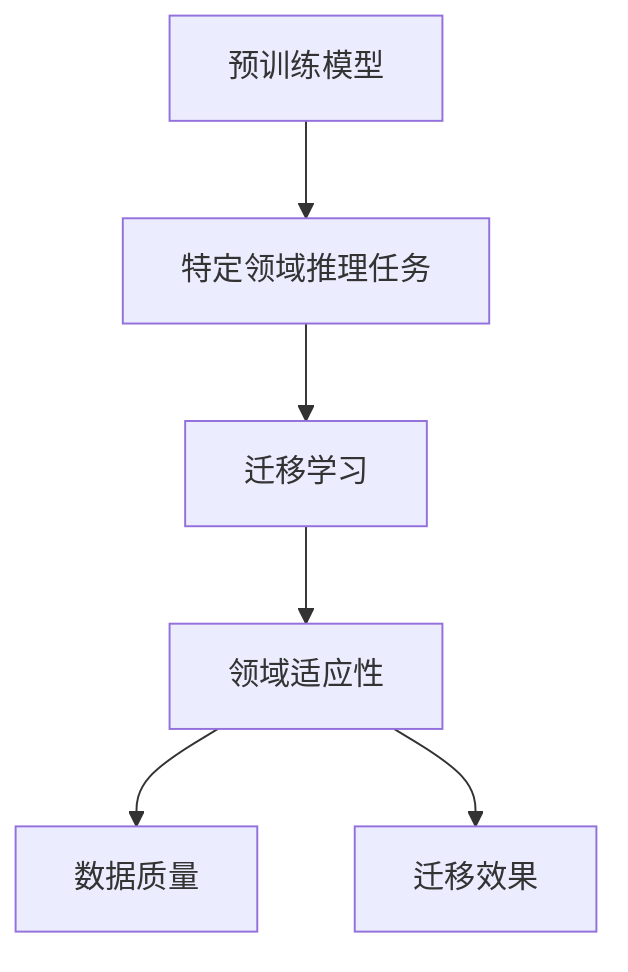
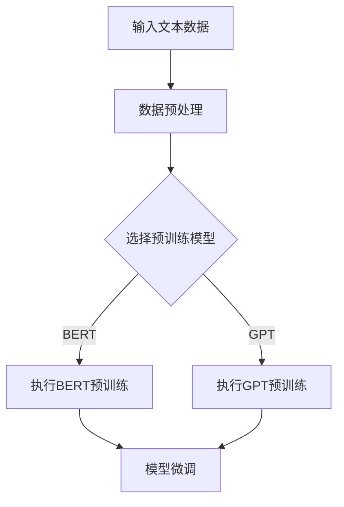

                 


### 《预训练模型在特定领域推理任务迁移中的技巧》

关键词：预训练模型，特定领域推理任务，迁移学习，算法原理，实现技巧

摘要：本文旨在探讨预训练模型在特定领域推理任务迁移中的应用技巧。首先，我们回顾了预训练模型的发展历程和基本原理，然后分析了特定领域推理任务的特点和挑战。接下来，我们详细介绍了迁移学习的基本策略和实现方法，并通过实际案例展示了如何应用这些技巧来提升模型性能。本文还讨论了迁移效果的评价指标和注意事项，为读者提供了一整套系统化的实践指南。

----------------------------------------------------------------

## 第一部分：背景与概述

### 第1章 问题背景与核心概念

#### 1.1 问题背景

#### 1.1.1 预训练模型的发展历程

预训练模型（Pre-trained Model）是近年来人工智能领域的一个重要突破。它通过在大规模数据集上进行预训练，使得模型在特定任务上具有更强的泛化能力。这种思想源于自然语言处理（NLP）领域的成功实践，如Word2Vec和GloVe等词向量模型，这些模型通过将词语映射到高维向量空间，使得语义相似的词语在向量空间中距离更近。

随着深度学习技术的发展，预训练模型逐渐从NLP扩展到计算机视觉、语音识别等更多领域。代表性工作包括Google的BERT、OpenAI的GPT等。这些模型在预训练阶段学习到了丰富的语言或视觉知识，为后续的任务提供了强大的先验知识。

#### 1.1.2 特定领域推理任务的重要性

特定领域推理任务（Domain-specific Reasoning Tasks）在许多实际应用中具有重要意义。这些任务往往需要模型具备对特定领域知识的理解和运用能力。例如，在医疗领域，模型需要理解医学语言和概念，以辅助医生进行诊断和治疗；在金融领域，模型需要处理复杂的金融数据，进行风险评估和投资预测。

然而，这些领域通常数据稀缺且标注困难，传统的机器学习方法在处理这类任务时面临巨大挑战。因此，如何将预训练模型应用于特定领域推理任务，成为一个关键问题。

#### 1.1.3 迁移学习在模型训练中的应用

迁移学习（Transfer Learning）是一种利用已有模型知识来加速新任务训练的方法。在迁移学习中，模型首先在大规模通用数据集上进行预训练，然后通过微调（Fine-tuning）将模型应用于特定任务。

预训练模型通过迁移学习的方式，可以将通用知识迁移到特定领域，从而解决数据稀缺和标注困难的问题。这种方法不仅提高了模型在特定领域的性能，还减少了模型对新数据的依赖，具有很高的实用价值。

#### 1.2 核心概念

#### 1.2.1 预训练模型的基本原理

预训练模型的基本原理主要包括以下几个方面：

1. **大规模数据集训练**：模型在大规模数据集上进行训练，学习到丰富的语言或视觉知识。
2. **多层神经网络**：预训练模型通常采用多层神经网络结构，使得模型能够捕捉到更复杂的特征。
3. **通用特征学习**：预训练模型通过学习通用特征，提高了模型在不同任务上的泛化能力。
4. **任务特定微调**：在特定任务上，对预训练模型进行微调，使其适应特定领域的需求。

#### 1.2.2 特定领域推理任务的特点

特定领域推理任务具有以下特点：

1. **领域知识依赖**：模型需要具备对特定领域知识的理解和运用能力。
2. **数据稀缺与标注困难**：领域数据通常稀缺且标注困难，传统的机器学习方法难以应用。
3. **任务复杂性**：领域推理任务通常涉及复杂的语义理解和推理过程。
4. **模型性能要求**：由于领域任务的特殊性，对模型性能要求较高。

#### 1.2.3 迁移学习的基本概念

迁移学习的基本概念包括：

1. **源域与目标域**：源域（Source Domain）是指预训练阶段使用的数据集，目标域（Target Domain）是指实际应用的任务数据集。
2. **知识迁移**：通过迁移学习，将源域的知识和经验迁移到目标域，以提升目标域模型的性能。
3. **迁移策略**：迁移学习包括无监督迁移学习和有监督迁移学习等不同策略，适用于不同场景。

#### 1.3 边界与外延

#### 1.3.1 领域适应性的限制

领域适应性是指模型在特定领域上的适应能力。尽管预训练模型通过迁移学习可以应用于特定领域，但领域适应性的限制仍然存在。例如，某些领域的特定知识可能无法通过预训练模型完全学习到，导致模型在特定任务上的性能受限。

#### 1.3.2 数据质量和多样性

数据质量和多样性是迁移学习成功的关键因素。高质量的数据可以提供更准确的先验知识，而数据多样性有助于模型捕捉到更广泛的特征。因此，在迁移学习过程中，需要关注数据质量和多样性的问题。

#### 1.3.3 迁移效果的衡量指标

迁移效果是评估迁移学习成功与否的重要指标。常用的衡量指标包括：

1. **性能提升**：通过对比模型在源域和目标域上的性能，评估迁移学习的效果。
2. **泛化能力**：评估模型在未见过的数据上的表现，以衡量其泛化能力。
3. **计算效率**：评估迁移学习对计算资源的需求，以判断其可行性。

### 第2章 核心概念与联系

#### 2.1 核心概念原理

#### 2.1.1 预训练模型的工作机制

预训练模型的工作机制主要包括以下几个方面：

1. **数据预处理**：将原始文本或图像数据转化为模型可处理的格式。
2. **预训练任务**：在大规模数据集上进行预训练任务，如语言建模或图像分类。
3. **模型微调**：在特定任务上对预训练模型进行微调，使其适应特定领域的需求。

#### 2.1.2 特定领域推理任务的挑战

特定领域推理任务面临的挑战主要包括：

1. **领域知识获取**：如何获取和利用特定领域的知识，是提高模型性能的关键问题。
2. **数据稀缺与标注困难**：领域数据通常稀缺且标注困难，传统的机器学习方法难以应用。
3. **模型适应性**：模型需要具备对特定领域知识的适应能力，以应对复杂多样的任务场景。

#### 2.1.3 迁移学习的策略和方法

迁移学习的策略和方法主要包括：

1. **无监督迁移学习**：利用源域数据的无监督信息进行迁移学习，如自编码器、生成对抗网络等。
2. **有监督迁移学习**：利用源域数据和目标域数据的监督信息进行迁移学习，如模型微调、知识蒸馏等。
3. **多任务学习**：通过同时训练多个相关任务来提高模型在特定领域的性能。

#### 2.2 概念属性特征对比表格

| 概念              | 特点                                                                                           |
|------------------|----------------------------------------------------------------------------------------------|
| 预训练模型        | 基于大规模语料预训练，提高模型泛化能力                                                         |
| 特定领域推理任务  | 需要针对特定领域进行任务理解和推理，挑战在于领域知识的获取和利用                             |
| 迁移学习         | 利用源域的知识和经验来提升目标域的模型性能，减少对目标域数据的依赖                             |

#### 2.3 ER实体关系图架构



----------------------------------------------------------------

## 第二部分：算法原理与实现

### 第3章 预训练模型原理讲解

#### 3.1 预训练模型基础

#### 3.1.1 预训练模型的定义

预训练模型是指在大规模数据集上预先训练好的模型，它为后续的任务提供了强大的先验知识。预训练模型可以应用于不同领域和任务，通过迁移学习或微调的方式，使其适应特定领域的需求。

#### 3.1.2 预训练数据集的选择

预训练数据集的选择对模型的性能有重要影响。通常，预训练数据集应具备以下特点：

1. **规模较大**：大规模数据集有助于模型学习到丰富的特征和知识。
2. **多样性**：数据集应包含多种类型的样本，以提高模型的泛化能力。
3. **质量较高**：数据集的质量直接影响模型的训练效果，应避免噪声和错误数据。

#### 3.1.3 预训练任务的设计

预训练任务的设计是预训练模型的核心环节。常见的预训练任务包括：

1. **语言建模**：模型在大量文本数据上学习到词语和句子的分布。
2. **图像分类**：模型在大量图像数据上学习到图像的类别信息。
3. **序列标注**：模型在大量序列数据上学习到序列中各个元素的关系。

#### 3.2 预训练模型算法

#### 3.2.1 语言模型预训练（如BERT）

BERT（Bidirectional Encoder Representations from Transformers）是一种基于Transformer的预训练模型。它通过双向编码器学习到词语的上下文信息，提高了模型的语义理解能力。

BERT的主要预训练任务包括：

1. **Masked Language Model（MLM）**：随机掩码部分词语，模型需要预测这些词语。
2. **Next Sentence Prediction（NSP）**：预测给定两个句子是否属于同一篇章。

#### 3.2.2 生成式预训练（如GPT）

GPT（Generative Pre-trained Transformer）是一种基于生成对抗网络的预训练模型。它通过生成文本数据来学习语言的分布，提高了模型的生成能力。

GPT的主要预训练任务包括：

1. **Language Modeling（LM）**：生成下一个词语的概率分布。
2. **Text Generation**：根据输入文本生成连续的文本序列。

#### 3.2.3 任务自适应预训练

任务自适应预训练（Task-Adaptive Pre-training）是指针对特定任务进行预训练，以提高模型在任务上的性能。这种方法包括以下步骤：

1. **知识蒸馏**：将预训练模型的知识传递给任务模型，以提高任务模型的性能。
2. **领域自适应**：通过领域自适应技术，将预训练模型的知识迁移到特定领域。
3. **任务微调**：在特定任务上对模型进行微调，使其适应任务需求。

#### 3.3 预训练模型mermaid流程图



#### 3.4 Python源代码实现

```python
# 假设我们使用的是BERT模型
from transformers import BertModel, BertTokenizer

# 加载预训练模型和分词器
model = BertModel.from_pretrained('bert-base-uncased')
tokenizer = BertTokenizer.from_pretrained('bert-base-uncased')

# 预处理输入文本数据
inputs = tokenizer("这是一个预训练模型示例", return_tensors='pt')

# 执行预训练模型
outputs = model(**inputs)

# 模型微调（例如使用交叉熵损失函数）
loss = outputs.loss
```

----------------------------------------------------------------

## 第4章 特定领域推理任务迁移中的技巧

### 4.1 迁移学习的基本策略

#### 4.1.1 无监督迁移学习

无监督迁移学习是指在没有标注目标域数据的情况下，利用源域数据的无监督信息进行迁移学习。常见的方法包括：

1. **自编码器**：自编码器通过学习数据的低维表示，将源域数据的特征传递给目标域模型。
2. **生成对抗网络（GAN）**：GAN通过生成器生成与源域数据相似的目标域数据，然后训练目标域模型以适应这些数据。

#### 4.1.2 有监督迁移学习

有监督迁移学习是指在拥有标注目标域数据的情况下，利用源域数据和目标域数据进行迁移学习。常见的方法包括：

1. **模型微调**：在目标域数据上对源域预训练模型进行微调，以适应目标域任务。
2. **知识蒸馏**：将源域预训练模型的知识传递给目标域模型，以提高目标域模型的性能。

#### 4.1.3 多任务学习

多任务学习是指同时训练多个相关任务，以提高模型在特定领域的性能。这种方法可以共享任务之间的知识，减少对标注数据的依赖。常见的方法包括：

1. **多任务共享网络**：多个任务共享相同的网络结构，通过交叉任务学习提高模型性能。
2. **多任务损失函数**：将多个任务的损失函数结合，以同时优化多个任务。

### 4.2 迁移学习在特定领域推理任务中的应用案例

#### 4.2.1 医疗领域

在医疗领域，预训练模型和迁移学习被广泛应用于医学文本分析和医学图像处理。

1. **医学文本分析**：利用预训练模型对医学文本进行语义理解，如疾病诊断、药物推荐等。通过迁移学习，将预训练模型的知识迁移到特定领域，提高模型在医疗任务上的性能。
2. **医学图像处理**：利用预训练模型对医学图像进行特征提取，如病变检测、肿瘤分类等。通过迁移学习，将预训练模型的知识迁移到特定领域，提高模型在医学图像分析上的性能。

#### 4.2.2 金融领域

在金融领域，预训练模型和迁移学习被广泛应用于金融数据分析和风险管理。

1. **金融数据分析**：利用预训练模型对金融文本进行语义理解，如市场预测、投资建议等。通过迁移学习，将预训练模型的知识迁移到特定领域，提高模型在金融数据分析上的性能。
2. **风险管理**：利用预训练模型对金融数据进行特征提取，如风险评分、欺诈检测等。通过迁移学习，将预训练模型的知识迁移到特定领域，提高模型在风险管理上的性能。

### 4.3 迁移效果的评价指标

评估迁移效果是迁移学习的一个重要环节。以下是一些常用的评价指标：

1. **性能提升**：通过对比模型在源域和目标域上的性能，评估迁移学习的效果。通常使用准确率、召回率、F1分数等指标。
2. **泛化能力**：评估模型在未见过的数据上的表现，以衡量其泛化能力。可以通过交叉验证或测试集评估。
3. **计算效率**：评估迁移学习对计算资源的需求，以判断其可行性。可以通过计算复杂度、训练时间等指标衡量。

### 4.4 注意事项

在应用预训练模型和迁移学习时，需要注意以下几点：

1. **数据质量和多样性**：确保数据质量和多样性，以提高模型的泛化能力。
2. **领域适应性**：关注模型在特定领域的适应性，以避免领域适应性的限制。
3. **模型微调**：在目标域上进行模型微调，以适应特定领域的需求。
4. **评价指标**：选择合适的评价指标，全面评估迁移学习的效果。

### 4.5 结论

预训练模型和迁移学习在特定领域推理任务中具有广泛的应用前景。通过迁移学习，可以充分利用预训练模型的知识，提高模型在特定领域的性能。然而，领域适应性、数据质量和多样性等问题仍然需要关注和解决。未来，随着深度学习和迁移学习技术的不断发展，预训练模型在特定领域推理任务中的应用将更加广泛和深入。

