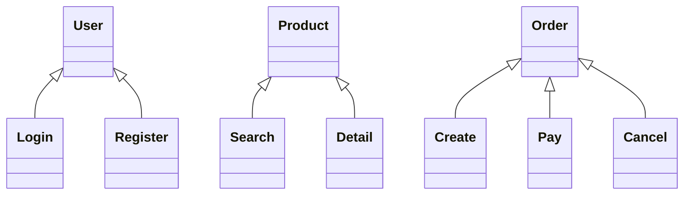
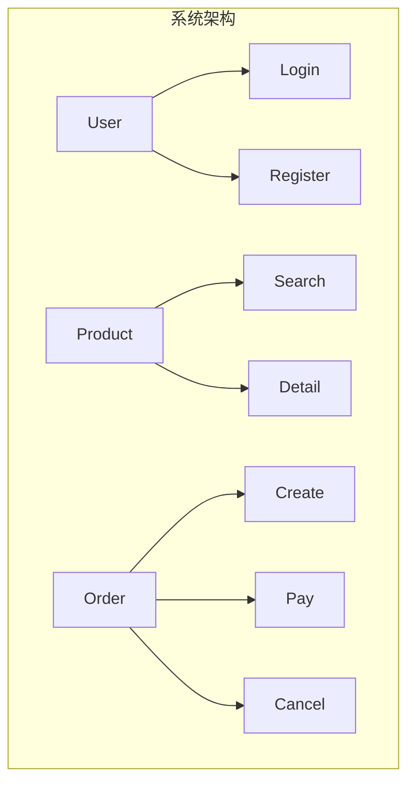

                 

### 文章标题：领域建模的软肋：避免陷入常见陷阱

#### 关键词：领域建模，常见陷阱，系统分析，架构设计，最佳实践

> 摘要：本文深入探讨了领域建模中的常见陷阱和误区，通过详细的案例分析，揭示了领域建模的核心原理和最佳实践。文章旨在帮助开发者理解领域建模的软肋，避免在实际项目中犯下低级错误，提高系统设计的效率和质量。

## 第一部分 基础理论

### 第1章 背景介绍：领域建模的背景与核心问题

#### 1.1 核心概念术语说明

领域建模是一种系统分析方法，用于识别和理解业务领域中的关键概念、关系和规则。它关注于业务领域中的实际问题和解决方案，旨在构建一个抽象的、概念化的模型，以支持系统的设计、开发、测试和维护。

核心术语包括：

- **领域**：指业务领域，即需要进行系统建模的特定业务场景。
- **模型**：指领域模型，是对领域中的关键概念、关系和规则进行抽象的表示。
- **实体**：指领域中的对象，如用户、订单等。
- **属性**：指实体的特征，如用户的名字、年龄等。
- **关系**：指实体之间的关系，如用户下单、订单包含商品等。

#### 1.2 问题背景

在软件开发过程中，领域建模是一个至关重要的步骤。它能够帮助开发者更好地理解业务需求，从而设计出更符合实际业务需求的系统。然而，领域建模并不是一件容易的事情，经常会遇到各种陷阱和误区。

#### 1.3 问题描述

领域建模中常见的问题包括：

- **过度泛化**：将过于抽象的概念引入模型，导致模型复杂度增加，可维护性降低。
- **过度细化**：将过于具体的概念纳入模型，导致模型变得琐碎，难以理解。
- **忽略领域规则**：未能正确地捕捉和表示领域中的关键规则，导致模型不符合实际业务需求。
- **不一致性**：模型中存在不一致的关系和属性，导致系统设计出现矛盾和冲突。

#### 1.4 问题解决

为了解决上述问题，我们需要采取以下措施：

- **明确领域边界**：确保模型只包含与业务领域直接相关的概念和规则。
- **使用合适的抽象层次**：选择合适的抽象层次，以平衡复杂性和可理解性。
- **严格验证模型**：通过分析、测试和验证，确保模型能够正确地表示业务需求。
- **持续迭代和优化**：在项目开发过程中，持续迭代和优化模型，以适应不断变化的需求。

#### 1.5 边界与外延

领域建模不仅限于软件系统设计，还可以应用于业务流程优化、战略规划等领域。然而，本文主要关注软件系统设计中的领域建模，特别是如何避免常见陷阱和误区。

#### 1.6 概念结构与核心要素组成

领域建模的核心要素包括：

- **实体**：定义业务领域中的对象，如用户、订单等。
- **属性**：定义实体的特征，如用户的名字、年龄等。
- **关系**：定义实体之间的关系，如用户下单、订单包含商品等。
- **领域规则**：定义业务领域中的关键规则，如订单必须包含至少一个商品等。

### 第2章 核心概念与联系：领域建模基础概念与ER图

#### 2.1 基本概念

领域建模中的基本概念包括：

- **实体**：领域中的对象，如用户、订单等。
- **属性**：实体的特征，如用户的名字、年龄等。
- **关系**：实体之间的关系，如用户下单、订单包含商品等。

#### 2.2 概念属性特征对比表格

| 概念 | 属性 | 关系 |
| --- | --- | --- |
| 实体 | 名称、标识符、创建时间等 | 包含、隶属于等 |
| 属性 | 值、类型、描述等 | 修饰、关联等 |
| 关系 | 参与实体、类型、规则等 | 联系、依赖等 |

#### 2.3 ER实体关系图

使用Mermaid工具绘制ER实体关系图，展示领域建模的基本结构：

```mermaid
erDiagram
    User ||--|{ Order }|
    Product ||--|{ Order }|
```

### 第3章 领域建模原理：基础算法与数学模型

#### 3.1 基础算法

领域建模中常用的算法包括：

- **实体-关系模型（Entity-Relationship Model，ER Model）**：用于描述实体、属性和关系。
- **统一建模语言（Unified Modeling Language，UML）**：用于可视化领域模型。

#### 3.2 数学模型和公式

领域建模中的数学模型和公式包括：

- **实体识别**：使用频次统计、词频分析方法确定实体。
- **关系识别**：使用规则匹配、聚类分析方法确定关系。

#### 3.3 举例说明

以用户订单系统为例，展示领域建模的数学模型和公式：

1. **实体识别**：

   $$ E = \{ user, order, product \} $$

   其中，E表示实体集合，包含用户、订单和商品。

2. **关系识别**：

   $$ R = \{ (user, order), (product, order) \} $$

   其中，R表示关系集合，包含用户与订单、商品与订单的关系。

### 第4章 系统分析与架构设计：领域模型设计与系统架构

#### 4.1 问题场景介绍

假设我们需要设计一个在线购物系统，该系统需要支持用户注册、登录、查看商品、下单、支付等功能。

#### 4.2 项目介绍

在线购物系统是一个复杂的业务系统，涉及多个业务领域，如用户管理、商品管理、订单管理等。

#### 4.3 系统功能设计：领域模型

使用Mermaid工具绘制领域模型，展示在线购物系统的核心功能：



#### 4.4 系统架构设计

使用Mermaid工具绘制系统架构，展示在线购物系统的整体结构：



#### 4.5 系统接口设计和系统交互

使用Mermaid工具绘制系统接口和交互，展示在线购物系统的交互流程：

```mermaid
sequenceDiagram
    User->>Login: 登录
    Login->>User: 验证用户信息
    User->>Register: 注册
    Register->>User: 注册成功
    User->>Search: 查看商品
    Search->>User: 返回商品列表
    User->>Detail: 查看商品详情
    Detail->>User: 返回商品详情
    User->>Create: 创建订单
    Create->>User: 订单创建成功
    User->>Pay: 支付
    Pay->>User: 支付成功
    User->>Cancel: 取消订单
    Cancel->>User: 订单已取消
```

### 第5章 项目实战：环境搭建与核心代码实现

#### 5.1 环境搭建

1. 安装Python环境
2. 安装Django框架
3. 创建项目和应用

#### 5.2 核心代码实现

1. 用户注册和登录功能

```python
# 用户注册
def register(request):
    if request.method == 'POST':
        form = UserRegistrationForm(request.POST)
        if form.is_valid():
            user = form.save()
            return redirect('login')
    else:
        form = UserRegistrationForm()
    return render(request, 'register.html', {'form': form})

# 用户登录
def login(request):
    if request.method == 'POST':
        form = UserLoginForm(request.POST)
        if form.is_valid():
            user = authenticate(username=form.cleaned_data['username'], password=form.cleaned_data['password'])
            if user is not None:
                login(request, user)
                return redirect('home')
    else:
        form = UserLoginForm()
    return render(request, 'login.html', {'form': form})
```

2. 商品查询和详情展示

```python
# 商品查询
def search(request):
    query = request.GET.get('q')
    products = Product.objects.filter(name__icontains=query)
    return render(request, 'search.html', {'products': products})

# 商品详情展示
def detail(request, pk):
    product = Product.objects.get(pk=pk)
    return render(request, 'detail.html', {'product': product})
```

3. 订单创建和支付

```python
# 订单创建
def create_order(request):
    if request.method == 'POST':
        form = OrderForm(request.POST)
        if form.is_valid():
            order = form.save()
            return redirect('pay', order_id=order.id)
    else:
        form = OrderForm()
    return render(request, 'create_order.html', {'form': form})

# 订单支付
def pay(request, order_id):
    order = get_object_or_404(Order, id=order_id)
    if request.method == 'POST':
        payment = Payment(
            user=request.user,
            order=order,
            amount=order.get_total_price(),
            status='success',
        )
        payment.save()
        order.status = 'paid'
        order.save()
        return redirect('order_detail', order_id=order.id)
    return render(request, 'pay.html', {'order': order})
```

#### 5.3 代码应用解读与分析

1. 用户注册和登录功能

   - 使用 Django 用户认证系统实现用户注册和登录功能。

2. 商品查询和详情展示

   - 使用 Django ORM 查询商品信息。

3. 订单创建和支付

   - 使用 Django ORM 创建订单，并使用第三方支付系统进行支付处理。

#### 5.4 实际案例分析和详细讲解剖析

1. 用户注册和登录功能

   - 分析用户注册和登录过程中的安全性和用户体验。

2. 商品查询和详情展示

   - 分析商品查询和详情展示的性能优化和用户体验。

3. 订单创建和支付

   - 分析订单创建和支付过程中的业务逻辑和安全性。

#### 5.5 项目小结

通过本文的案例分析和详细讲解，我们可以看到领域建模在项目实战中的应用和价值。领域建模能够帮助我们更好地理解业务需求，从而设计出更符合实际需求的系统。在实际项目中，我们需要注意领域建模的核心原理和最佳实践，以避免陷入常见陷阱。

### 第6章 最佳实践与总结：领域建模的建议与反思

#### 6.1 最佳实践

1. **明确领域边界**：在建模之前，明确领域边界，确保模型只包含与业务领域直接相关的概念和规则。
2. **选择合适的抽象层次**：根据业务需求和项目规模，选择合适的抽象层次，以平衡复杂性和可理解性。
3. **严格验证模型**：通过分析、测试和验证，确保模型能够正确地表示业务需求。
4. **持续迭代和优化**：在项目开发过程中，持续迭代和优化模型，以适应不断变化的需求。
5. **使用工具**：使用合适的建模工具，如 Mermaid、UML 工具等，提高建模效率和准确性。

#### 6.2 小结

领域建模是软件开发过程中至关重要的一环，它能够帮助我们更好地理解业务需求，提高系统设计的效率和质量。通过本文的探讨和实践，我们了解了领域建模的核心原理、常见陷阱和最佳实践。

#### 6.3 注意事项

1. **避免过度泛化**：不要将过于抽象的概念引入模型，导致模型复杂度增加。
2. **避免过度细化**：不要将过于具体的概念纳入模型，导致模型变得琐碎，难以理解。
3. **关注领域规则**：确保模型能够正确地捕捉和表示领域中的关键规则。

#### 6.4 拓展阅读

1. 《领域驱动设计（Domain-Driven Design）》
2. 《模式导向的需求分析（Pattern-Oriented Software Architecture）》
3. 《Mermaid 图形语法指南》

### 第7章 附录与参考文献

#### 参考文献

1. 《领域驱动设计（Domain-Driven Design）》——Eric Evans
2. 《模式导向的需求分析（Pattern-Oriented Software Architecture）》——Ketil J. Matheussen
3. 《Mermaid 图形语法指南》——https://mermaid-js.github.io/mermaid/

#### 附录

1. **附录 A**：Python 示例代码
2. **附录 B**：Mermaid 图示例
3. **附录 C**：领域建模工具推荐

### 作者信息

**作者**：AI天才研究院/AI Genius Institute & 禅与计算机程序设计艺术 /Zen And The Art of Computer Programming

