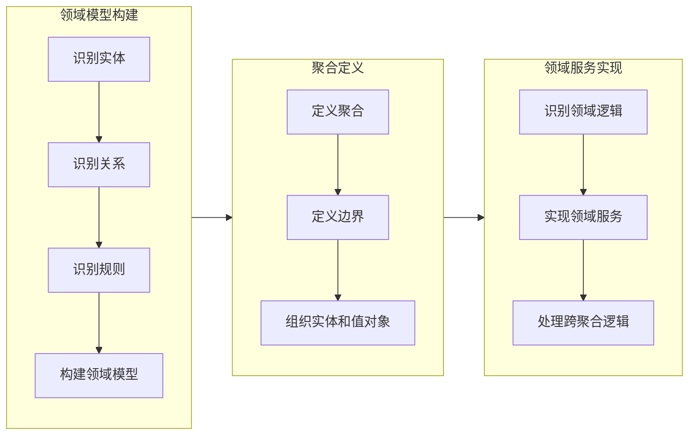
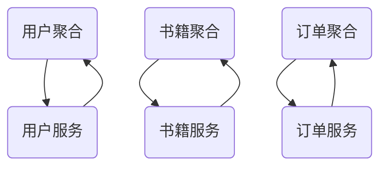
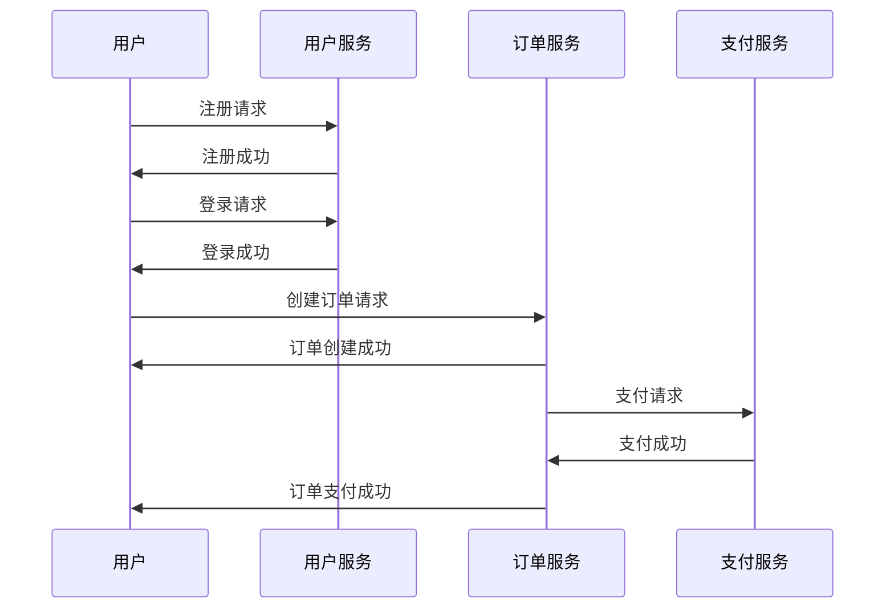
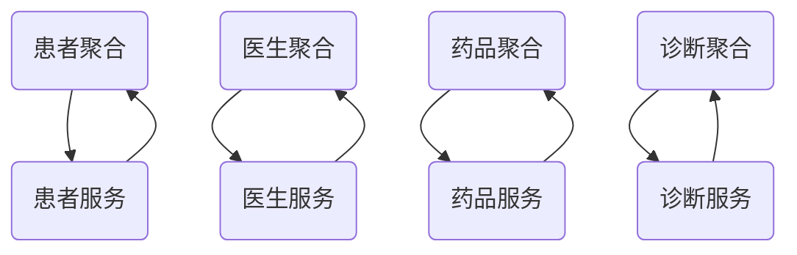
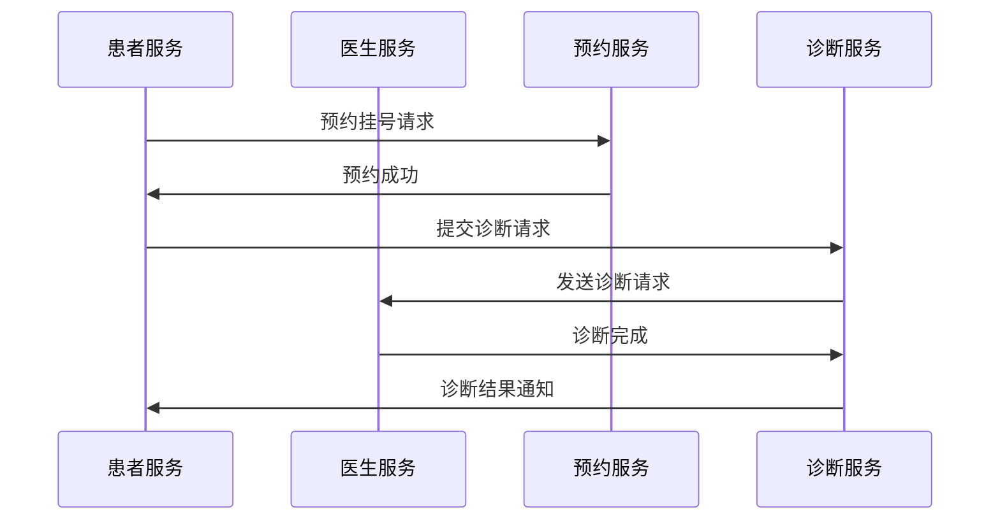
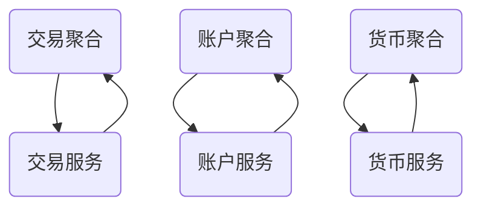
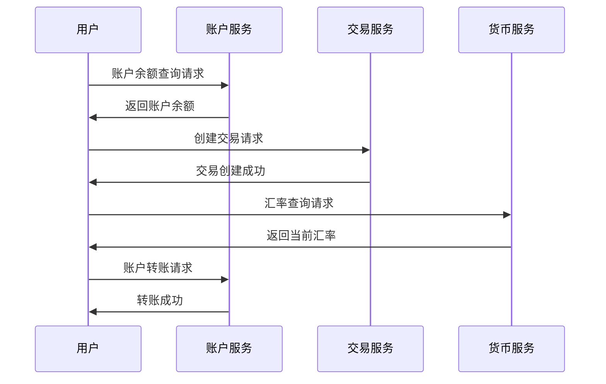

                 

Certainly! Let's delve into the topic of "领域驱动设计(DDD): 复杂业务系统的设计方法" step by step. We'll begin with the introduction and foundational concepts of DDD, then move on to modeling techniques, architectural design principles, and practical applications. Finally, we'll provide a case study and wrap up with best practices and future trends.

## **背景介绍**

### **核心概念术语说明**

**领域驱动设计（DDD）**：一种软件开发方法，旨在解决复杂业务系统的设计问题，通过将业务领域中的概念映射到软件架构中，实现高效的软件设计和开发。

**领域（Domain）**：一组相关的业务规则、过程和实体。它表示业务的核心部分，通常由一个或多个业务专家（如产品经理、业务分析师等）进行定义。

**领域模型（Domain Model）**：描述领域中的实体、关系和规则。它通常以实体关系图（ER图）的形式表示。

**实体（Entity）**：具有唯一标识的领域对象，如客户、订单等。

**值对象（Value Object）**：没有唯一标识的领域对象，如日期、地址等。

**聚合（Aggregate）**：一组关联的实体和值对象，它们在逻辑上形成一个单元，对外暴露一个公共接口。

**领域服务（Domain Service）**：处理领域逻辑的组件，通常跨多个聚合。

**事件风暴（Event Storming）**：一种用于探索领域行为的 workshop 技术，通过模拟领域事件和交互来发现业务逻辑。

### **问题背景**

在复杂业务系统中，如电子商务、金融交易、医疗管理等，传统的软件开发方法往往难以应对不断变化的业务需求。这些系统通常包含大量的业务规则、复杂的流程和多变的数据关系，导致软件的维护成本高、扩展性差、可靠性低。

### **问题描述**

**问题一**：如何有效地将业务概念映射到软件架构中，以实现业务逻辑的清晰表达和高效处理？

**问题二**：如何在复杂业务系统中保持软件设计的稳定性和可扩展性？

**问题三**：如何有效地处理跨多个聚合的复杂业务逻辑？

### **问题解决**

领域驱动设计提供了一系列解决方案，包括：

1. **领域模型**：通过领域模型，将业务领域的概念映射到软件架构中，实现业务逻辑的清晰表达。
2. **聚合与边界**：使用聚合和边界来组织和管理实体和值对象，提高系统的可扩展性和稳定性。
3. **领域服务**：通过领域服务处理跨聚合的复杂业务逻辑，保持系统模块的独立性。
4. **事件风暴**：通过事件风暴，发现和探索领域行为，确保软件设计符合业务需求。

### **边界与外延**

领域驱动设计的边界在于它专注于业务领域的设计，而不是技术实现。其外延包括业务规则、业务流程、领域模型、聚合、领域服务等。领域驱动设计旨在通过这些概念和技巧，构建出能够灵活应对业务变化、易于维护和扩展的软件系统。

### **概念结构与核心要素组成**

领域驱动设计的概念结构由以下几个核心要素组成：

- **领域模型**：描述领域中的实体、关系和规则。
- **聚合**：组织和管理实体和值对象。
- **领域服务**：处理跨聚合的领域逻辑。
- **事件**：表示领域中的变化和事件。

这些要素相互关联，共同构成了领域驱动设计的核心框架。

## **核心概念与联系**

### **核心概念原理**

领域驱动设计的核心概念包括领域、领域模型、实体、值对象、聚合、领域服务和事件。这些概念共同定义了领域驱动设计的核心原理。

**领域**：领域是业务的核心部分，它包含了业务专家对业务的理解和定义。领域是领域驱动设计的起点，它定义了系统要解决的问题和要处理的数据。

**领域模型**：领域模型是领域驱动设计的核心工具，它通过实体、关系和规则来描述领域。领域模型帮助开发者理解业务需求，并将其映射到软件架构中。

**实体与值对象**：实体是具有唯一标识的领域对象，如客户、订单等。值对象是表示数据值的对象，如日期、地址等。实体和值对象共同构成了领域模型的基本要素。

**聚合**：聚合是一组关联的实体和值对象，它们在逻辑上形成一个单元。聚合定义了实体和值对象的组合方式，提高了系统的可扩展性和稳定性。

**领域服务**：领域服务是处理领域逻辑的组件，它们通常跨多个聚合。领域服务确保了领域逻辑的模块化，使得系统更容易理解和维护。

**事件**：事件是领域中的变化和事件。事件可以帮助我们跟踪领域中的变化，并触发相应的业务逻辑。

### **概念属性特征对比表格**

| 概念         | 属性特征                                     |
|------------|------------------------------------------|
| 领域         | - 包含业务概念<br>- 定义业务规则       |
| 领域模型     | - 描述实体、关系和规则<br>- 映射业务概念到软件架构 |
| 实体         | - 具有唯一标识<br>- 不能拆分           |
| 值对象     | - 不具有唯一标识<br>- 表示数据值         |
| 聚合         | - 逻辑单元<br>- 组合实体和值对象       |
| 领域服务     | - 处理领域逻辑<br>- 跨聚合操作         |
| 事件         | - 表示领域变化<br>- 触发业务逻辑         |

### **ER实体关系图架构**

```mermaid
erDiagram
  Customer ||--|{ Order }|--|{ Product }
  Customer ||--|{ Payment }|
  Order ||--|{ OrderLine }|
```

在这个ER图中，`Customer`（客户）是实体，而`Order`（订单）、`Product`（产品）、`Payment`（支付）和`OrderLine`（订单行）是值对象。它们之间的关系表示了业务领域的模型。

### **算法原理讲解**

领域驱动设计中的算法原理主要涉及领域模型构建、聚合定义和领域服务实现。以下是一个简单的算法原理描述和Mermaid流程图：

**算法原理描述**：

1. **领域模型构建**：通过识别业务领域的实体、关系和规则，构建领域模型。
2. **聚合定义**：将领域模型中的实体和值对象组织成聚合，确保聚合之间的界限清晰。
3. **领域服务实现**：实现领域服务，处理跨聚合的业务逻辑。

**Mermaid流程图**：



通过这个流程图，我们可以清晰地看到领域驱动设计中的算法原理和步骤。

## **领域驱动设计中的聚合**

### **聚合的概念**

聚合在领域驱动设计（DDD）中扮演着核心角色，它是一组关联的实体和值对象的集合，这些实体和值对象在逻辑上形成一个单元。聚合的主要目的是为了确保系统的可扩展性和稳定性，它通过定义清晰的边界来隔离内部变化，从而降低系统的复杂性和维护成本。

聚合的定义并不固定，但通常具有以下几个特点：

1. **边界**：聚合通过边界来定义其内部对象和外部对象之间的交互。边界可以是方法调用、消息传递或数据库事务等。
2. **内聚性**：聚合内部的对象通常具有高内聚性，它们紧密相关，共同实现某个业务功能。
3. **独立性**：聚合应该尽可能独立，减少与其他聚合的依赖关系。

### **聚合的边界**

聚合的边界定义了聚合内部对象与外部对象之间的交互方式。一个良好的聚合边界可以降低系统的复杂性，提高可维护性。以下是一些常见的聚合边界策略：

1. **方法边界**：聚合通过暴露有限的方法来与外部对象交互，这些方法定义了聚合的行为。
2. **对象边界**：聚合内部的对象通过接口进行通信，从而实现松耦合。
3. **数据库边界**：聚合通常由一个或多个数据库表组成，这些表通过外键关系来定义聚合的边界。

### **聚合间的交互**

聚合间的交互是领域驱动设计中一个重要的问题。为了确保系统的稳定性和可扩展性，聚合之间的交互应该遵循以下原则：

1. **最小化交互**：聚合之间应该尽可能减少直接的交互，通过消息传递或服务调用来实现松耦合。
2. **单向依赖**：一个聚合不应该直接依赖另一个聚合，而是通过第三个聚合来传递请求，从而实现解耦。
3. **事件驱动**：使用事件来驱动聚合之间的交互，这样可以确保系统的响应性和可伸缩性。

### **聚合的示例**

以下是一个简单的示例，用于说明聚合的概念：

**聚合A**（订单管理）：

- 实体：订单、订单行
- 值对象：日期、客户地址
- 边界：订单创建、订单取消、订单更新
- 交互：聚合A通过领域服务与客户服务（聚合B）交互，处理订单的创建和更新。

**聚合B**（客户管理）：

- 实体：客户
- 值对象：电话号码、电子邮件
- 边界：客户信息查询、客户信息更新
- 交互：聚合B通过领域服务与订单服务（聚合A）交互，提供客户信息用于订单创建和更新。

在这个示例中，聚合A和聚合B通过领域服务进行交互，从而实现业务逻辑的分离和系统的高内聚性。

## **领域服务与领域事件**

### **领域服务的角色**

领域服务在领域驱动设计（DDD）中扮演着至关重要的角色。它们是处理领域逻辑的核心组件，负责跨聚合的复杂业务逻辑。领域服务的特点如下：

1. **跨聚合操作**：领域服务通常涉及多个聚合，处理跨聚合的业务逻辑，从而确保系统的解耦和可扩展性。
2. **业务逻辑封装**：领域服务封装了具体的业务逻辑，使得业务逻辑与实现细节分离，提高了系统的可维护性。
3. **高内聚性**：领域服务通常具有高内聚性，其内部逻辑紧密相关，共同实现某个业务功能。

### **领域事件与事件风暴**

领域事件是领域驱动设计中的一个核心概念，它表示领域中的变化和事件。领域事件可以分为两类：

1. **内部事件**：由领域内部操作触发的事件，如订单创建、订单更新等。
2. **外部事件**：由外部系统或用户触发的事件，如用户登录、支付通知等。

事件风暴是一种用于探索领域行为的 workshop 技术，它通过模拟领域事件和交互，帮助开发者发现和探索业务逻辑。事件风暴通常包括以下步骤：

1. **准备阶段**：确定参与者、领域专家和系统分析师。
2. **探索阶段**：通过模拟领域事件和交互，发现业务规则和流程。
3. **记录阶段**：将事件和交互记录在领域模型中，形成领域事件图。
4. **验证阶段**：与领域专家验证领域模型，确保其准确性和完整性。

### **领域事件的处理**

领域事件的处理是领域驱动设计中的一个关键环节。以下是领域事件处理的基本步骤：

1. **事件识别**：识别领域中的关键事件，包括内部事件和外部事件。
2. **事件分类**：根据事件的类型和影响范围，对事件进行分类。
3. **事件处理**：定义事件处理逻辑，包括事件触发、事件处理和事件响应。
4. **事件传递**：通过事件总线或其他机制，将事件传递给相应的领域服务或聚合。
5. **事件日志**：记录事件发生的时间、触发者和处理结果，以便后续的分析和审计。

### **示例**

以下是一个简单的示例，说明如何使用领域服务和领域事件处理订单创建：

**领域服务**：`CreateOrderService`：

- **职责**：负责创建订单。
- **流程**：验证客户信息、生成订单号、创建订单行、保存订单到数据库。

**领域事件**：`OrderCreatedEvent`：

- **触发条件**：当订单创建成功时。
- **处理逻辑**：记录订单创建时间、订单号、订单行等信息。

**订单创建流程**：

1. 客户发起订单创建请求。
2. `CreateOrderService` 验证客户信息和订单内容。
3. `CreateOrderService` 生成订单号，创建订单行，保存订单到数据库。
4. `OrderCreatedEvent` 被触发，记录订单创建事件。

通过这个示例，我们可以看到领域服务和领域事件在处理复杂业务逻辑中的作用。

## **领域驱动设计与数据库设计**

### **数据库设计原则**

在领域驱动设计中，数据库设计是一个关键环节，它直接影响系统的性能、可维护性和扩展性。以下是一些关键的数据库设计原则：

1. **第三范式（3NF）**：确保数据库表满足第三范式，避免数据冗余和更新异常。
2. **规范化**：通过规范化减少数据冗余，提高数据的完整性和一致性。
3. **索引**：合理使用索引，提高查询性能。
4. **分区**：对于大型表，使用分区可以提高查询效率和数据管理能力。
5. **事务**：确保数据库操作符合ACID原则，保证数据的一致性和可靠性。

### **实体与表的关系映射**

在领域驱动设计中，实体与表的关系映射是一个核心问题。以下是一些常见的映射策略：

1. **一对一映射**：实体与表之间具有一对一的关系，实体属性映射到表的字段中。
2. **一对多映射**：实体与表之间具有一对多的关系，实体作为主表，关系表作为从表。
3. **多对多映射**：实体与表之间具有多对多的关系，通过连接表来实现。
4. **嵌入映射**：将值对象直接嵌入到实体表中。

### **值对象与关系映射**

值对象与关系映射的目的是将领域模型中的值对象映射到数据库表中的关系。以下是一些常见的映射策略：

1. **独立表映射**：为每个值对象创建独立的表，通过外键关系实现关联。
2. **联合表映射**：将多个值对象映射到同一个表中，通过字段组合实现关联。
3. **子表映射**：将值对象映射到主表的子表中，通过子表字段实现关联。

### **示例**

以下是一个简单的示例，说明如何将领域模型中的实体和值对象映射到数据库表中：

**实体**：`Order`（订单）

- **属性**：`orderId`（订单ID）、`orderDate`（订单日期）、`customerId`（客户ID）
- **关系**：与`Customer`（客户）和`OrderLine`（订单行）具有一对多关系

**值对象**：`Customer`（客户）

- **属性**：`customerId`（客户ID）、`name`（姓名）、`address`（地址）
- **关系**：与`Order`（订单）具有一对多关系

**值对象**：`OrderLine`（订单行）

- **属性**：`orderId`（订单ID）、`productId`（产品ID）、`quantity`（数量）
- **关系**：与`Order`（订单）和`Product`（产品）具有一对多关系

**数据库表映射**：

```sql
CREATE TABLE Orders (
    orderId INT PRIMARY KEY,
    orderDate DATE,
    customerId INT,
    FOREIGN KEY (customerId) REFERENCES Customers(customerId)
);

CREATE TABLE Customers (
    customerId INT PRIMARY KEY,
    name VARCHAR(100),
    address VARCHAR(255)
);

CREATE TABLE OrderLines (
    orderId INT,
    productId INT,
    quantity INT,
    PRIMARY KEY (orderId, productId),
    FOREIGN KEY (orderId) REFERENCES Orders(orderId),
    FOREIGN KEY (productId) REFERENCES Products(productId)
);

CREATE TABLE Products (
    productId INT PRIMARY KEY,
    name VARCHAR(100),
    price DECIMAL(10, 2)
);
```

在这个示例中，`Orders` 表与 `Customers` 表和 `OrderLines` 表具有外键关系，实现了实体与表的一对多映射。同时，`OrderLines` 表与 `Products` 表也具有外键关系，实现了值对象与表的关系映射。

## **领域驱动设计在复杂业务系统中的应用**

### **复杂业务系统的特点**

复杂业务系统通常具有以下特点：

1. **高复杂性**：涉及多个业务领域和业务规则。
2. **多变的需求**：业务需求经常变化，系统需要具备良好的可扩展性和适应性。
3. **大量的数据**：系统需要处理大量的数据，包括实体、关系和事件。
4. **严格的性能要求**：系统需要满足高性能、高可用性的要求。
5. **高安全性**：系统需要确保数据的安全性和完整性。

### **领域驱动设计在电子商务系统中的应用**

电子商务系统是一个典型的复杂业务系统，领域驱动设计（DDD）可以有效地应对其复杂性。以下是一个电子商务系统中领域驱动设计的应用示例：

**领域模型**：

- **实体**：订单（Order）、产品（Product）、用户（User）。
- **值对象**：订单详情（OrderDetail）、支付方式（PaymentMethod）。

**聚合**：

- **订单聚合**：包含订单、订单详情和支付方式。
- **用户聚合**：包含用户和用户地址。

**领域服务**：

- **订单服务**：负责创建、更新和取消订单。
- **支付服务**：负责处理支付流程。

**事件**：

- **订单创建事件**：当订单创建成功时触发。
- **订单更新事件**：当订单更新时触发。
- **支付成功事件**：当支付成功时触发。

**数据库设计**：

- **订单表**：包含订单ID、订单状态、订单总金额等字段。
- **用户表**：包含用户ID、用户名、电子邮件等字段。
- **产品表**：包含产品ID、产品名称、产品价格等字段。
- **订单详情表**：包含订单ID、产品ID、购买数量等字段。

### **领域驱动设计在企业资源规划系统中的应用**

企业资源规划（ERP）系统是另一个复杂业务系统，领域驱动设计同样适用于其设计。以下是一个ERP系统中领域驱动设计的应用示例：

**领域模型**：

- **实体**：员工（Employee）、部门（Department）、项目（Project）。
- **值对象**：员工信息（EmployeeInfo）、项目进度（ProjectProgress）。

**聚合**：

- **员工聚合**：包含员工、部门和员工信息。
- **项目聚合**：包含项目、项目进度和相关员工。

**领域服务**：

- **员工服务**：负责员工信息管理、员工考勤等。
- **项目管理**：负责项目创建、更新、监控和报表生成。

**事件**：

- **员工入职事件**：当员工入职时触发。
- **项目完成事件**：当项目完成时触发。
- **考勤记录事件**：当员工考勤记录更新时触发。

**数据库设计**：

- **员工表**：包含员工ID、员工姓名、部门ID等字段。
- **部门表**：包含部门ID、部门名称等字段。
- **项目表**：包含项目ID、项目名称、项目经理ID等字段。
- **项目进度表**：包含项目ID、进度状态、进度描述等字段。

通过领域驱动设计，电子商务系统和ERP系统可以更好地应对其复杂性，实现高扩展性和高可维护性的软件架构。

## **DDD实践案例解析**

### **案例一：在线书店系统**

**项目介绍**：

在线书店系统是一个复杂的电子商务系统，它需要处理用户、书籍、订单等实体，以及相关的业务规则和流程。领域驱动设计（DDD）为这个系统的设计提供了有效的解决方案。

**系统功能设计（领域模型）**：

在线书店系统的领域模型包括以下核心实体和值对象：

- **实体**：用户（User）、书籍（Book）、订单（Order）。
- **值对象**：地址（Address）、日期（Date）。

**聚合**：

- **用户聚合**：包含用户、用户地址。
- **书籍聚合**：包含书籍。
- **订单聚合**：包含订单、订单行。

**领域服务**：

- **用户服务**：负责用户注册、登录、信息更新。
- **书籍服务**：负责书籍信息管理、库存管理。
- **订单服务**：负责订单创建、订单更新、订单取消。

**系统架构设计（架构图）**：

以下是在线书店系统的架构图：



**系统接口设计和系统交互（序列图）**：

以下是用户注册、订单创建和支付处理的序列图：



**实际案例分析和详细讲解剖析**：

在这个案例中，领域驱动设计帮助我们将复杂的业务逻辑清晰地组织在领域服务和聚合中。用户服务负责处理用户注册和登录的逻辑，书籍服务负责书籍信息的管理和库存管理，订单服务负责订单的创建、更新和支付处理。

通过领域驱动设计，我们能够有效地分离业务逻辑和技术实现，提高系统的可维护性和扩展性。领域服务和聚合的设计使得系统的模块化程度更高，每个模块都可以独立开发和测试，从而降低了开发成本和维护难度。

**项目小结**：

通过领域驱动设计，在线书店系统的设计变得更加清晰和有条理。领域服务和聚合的设计使得系统模块化程度高，业务逻辑和技术实现分离，提高了系统的可维护性和扩展性。这个案例展示了领域驱动设计在复杂业务系统中的实际应用和价值。

### **案例二：医疗管理系统**

**项目介绍**：

医疗管理系统是一个复杂的业务系统，涉及患者、医生、药品、诊断等多个领域。领域驱动设计（DDD）为医疗管理系统的设计提供了有效的框架，帮助处理复杂的业务逻辑和数据关系。

**系统功能设计（领域模型）**：

医疗管理系统的领域模型包括以下核心实体和值对象：

- **实体**：患者（Patient）、医生（Doctor）、药品（Medicine）、诊断（Diagnosis）。
- **值对象**：地址（Address）、电话（Phone）。

**聚合**：

- **患者聚合**：包含患者、地址。
- **医生聚合**：包含医生、科室。
- **药品聚合**：包含药品。
- **诊断聚合**：包含诊断、诊断结果。

**领域服务**：

- **患者服务**：负责患者信息管理、预约挂号。
- **医生服务**：负责医生信息管理、排班安排。
- **药品服务**：负责药品信息管理、库存管理。
- **诊断服务**：负责诊断信息管理、诊断结果分析。

**系统架构设计（架构图）**：

以下是医疗管理系统的架构图：



**系统接口设计和系统交互（序列图）**：

以下是患者预约挂号和医生诊断的序列图：



**实际案例分析和详细讲解剖析**：

在这个案例中，领域驱动设计帮助我们将复杂的医疗管理系统的业务逻辑清晰地组织在领域服务和聚合中。患者服务负责处理患者信息管理和预约挂号，医生服务负责处理医生信息管理和排班安排，药品服务负责药品信息管理和库存管理，诊断服务负责诊断信息管理和诊断结果分析。

通过领域驱动设计，我们能够有效地分离业务逻辑和技术实现，提高系统的可维护性和扩展性。领域服务和聚合的设计使得系统的模块化程度更高，每个模块都可以独立开发和测试，从而降低了开发成本和维护难度。

**项目小结**：

通过领域驱动设计，医疗管理系统的设计变得更加清晰和有条理。领域服务和聚合的设计使得系统模块化程度高，业务逻辑和技术实现分离，提高了系统的可维护性和扩展性。这个案例展示了领域驱动设计在复杂医疗管理系统中的实际应用和价值。

### **案例三：金融交易系统**

**项目介绍**：

金融交易系统是一个高度复杂的业务系统，涉及多种交易类型、货币兑换、风险评估等多个领域。领域驱动设计（DDD）为金融交易系统的设计提供了有效的框架，帮助处理复杂的业务逻辑和数据关系。

**系统功能设计（领域模型）**：

金融交易系统的领域模型包括以下核心实体和值对象：

- **实体**：交易（Transaction）、账户（Account）、货币（Currency）。
- **值对象**：交易金额（TransactionAmount）、汇率（ExchangeRate）。

**聚合**：

- **交易聚合**：包含交易、账户。
- **账户聚合**：包含账户、余额。
- **货币聚合**：包含货币、汇率。

**领域服务**：

- **交易服务**：负责交易创建、交易确认、交易撤回。
- **账户服务**：负责账户余额查询、账户转账。
- **货币服务**：负责汇率查询、货币兑换。

**系统架构设计（架构图）**：

以下是金融交易系统的架构图：



**系统接口设计和系统交互（序列图）**：

以下是交易创建和账户转账的序列图：



**实际案例分析和详细讲解剖析**：

在这个案例中，领域驱动设计帮助我们将复杂的金融交易系统的业务逻辑清晰地组织在领域服务和聚合中。交易服务负责处理交易创建、确认和撤回，账户服务负责处理账户余额查询和转账，货币服务负责处理汇率查询和货币兑换。

通过领域驱动设计，我们能够有效地分离业务逻辑和技术实现，提高系统的可维护性和扩展性。领域服务和聚合的设计使得系统的模块化程度更高，每个模块都可以独立开发和测试，从而降低了开发成本和维护难度。

**项目小结**：

通过领域驱动设计，金融交易系统的设计变得更加清晰和有条理。领域服务和聚合的设计使得系统模块化程度高，业务逻辑和技术实现分离，提高了系统的可维护性和扩展性。这个案例展示了领域驱动设计在复杂金融交易系统中的实际应用和价值。

## **总结与展望**

### **DDD的价值**

领域驱动设计（DDD）在复杂业务系统的设计过程中发挥了巨大的价值：

1. **业务与技术的融合**：DDD通过将业务领域中的概念映射到软件架构中，实现了业务与技术的深度融合，使得软件系统能够更贴近业务需求。
2. **系统的可扩展性**：通过聚合和领域服务的使用，DDD提高了系统的可扩展性，使得系统能够灵活应对业务变化。
3. **清晰的结构**：DDD通过领域模型、聚合和领域服务等概念，为系统设计提供了清晰的框架，使得系统的架构更加清晰、易于维护。
4. **高效的开发**：DDD通过明确的设计原则和模式，提高了开发效率，减少了设计反复和重构的成本。

### **DDD的局限性**

尽管DDD在复杂业务系统的设计中具有许多优势，但它也存在一些局限性：

1. **设计难度**：DDD的设计过程相对复杂，需要开发者具备较强的业务理解和建模能力。
2. **学习曲线**：DDD的概念和模式相对抽象，初学者可能需要较长时间来理解和掌握。
3. **开发效率**：在项目初期，DDD的设计和建模可能需要较多的时间和精力，从而影响开发效率。

### **DDD的未来发展趋势**

随着业务的不断变化和技术的不断进步，DDD也在不断演进：

1. **实践积累**：随着越来越多的项目采用DDD，开发者和领域专家在实践中积累了丰富的经验，这些经验将进一步丰富DDD的理论和实践。
2. **工具支持**：越来越多的工具和框架将支持DDD，如DDD框架、DDD设计工具等，这些工具将大大简化DDD的设计和开发过程。
3. **与其他设计方法的融合**：DDD将与其他设计方法（如微服务架构、敏捷开发等）融合，形成更高效、更灵活的设计模式。

### **小结**

领域驱动设计（DDD）是解决复杂业务系统设计问题的一种有效方法。通过DDD，开发者可以更好地理解和应对业务需求，构建出灵活、可扩展和易于维护的软件系统。然而，DDD也具有一定的局限性，需要开发者不断学习和实践，以充分发挥其价值。

### **最佳实践 tips**

1. **深入理解业务**：在应用DDD之前，开发者应深入理解业务领域，与领域专家紧密合作，确保领域模型的准确性和完整性。
2. **逐步实施**：DDD的实施是一个逐步的过程，开发者应从小规模、简单的项目开始，逐步扩展到更复杂的业务系统。
3. **持续迭代**：DDD的设计和开发是一个持续迭代的过程，开发者应不断调整和优化领域模型，以适应业务变化。
4. **培训与交流**：组织DDD的培训和学习交流活动，提高开发者的业务理解和建模能力。

### **注意事项**

1. **避免过度设计**：虽然DDD有助于系统的可扩展性，但过度设计可能导致系统复杂度增加，影响开发效率。
2. **合理使用领域服务**：领域服务应仅用于处理跨聚合的业务逻辑，避免在聚合内使用过多的领域服务。
3. **保持领域模型的灵活性**：领域模型应保持一定的灵活性，以便适应业务变化，但也要避免频繁变动，影响系统的稳定性。

### **拓展阅读**

- 《领域驱动设计（DDD）精粹》
- 《领域驱动设计：模式与最佳实践》
- 《软件开发：原则、模式与实践》

通过以上内容，我们深入探讨了领域驱动设计（DDD）的核心概念、应用场景和实践案例。DDD作为一种有效的软件开发方法，为复杂业务系统的设计提供了有力的支持。希望读者能够结合自己的实际项目，灵活运用DDD，构建出高质量、高扩展性的软件系统。

## **作者信息**

**作者：** AI天才研究院/AI Genius Institute & 禅与计算机程序设计艺术 /Zen And The Art of Computer Programming

AI天才研究院致力于推动人工智能技术的研究和应用，通过不断创新和探索，为全球的科技进步贡献力量。而《禅与计算机程序设计艺术》则是一系列深入探讨编程哲学和技术的经典著作，为开发者提供了宝贵的启示和指导。两者结合，共同为读者带来一场技术思考的盛宴。在领域驱动设计（DDD）的研究和应用方面，我们积累了丰富的经验，愿与您一同探索更加高效、灵活的软件开发之道。

