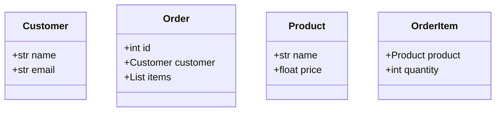
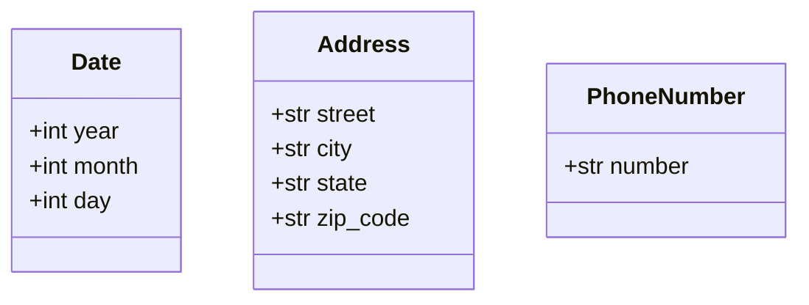
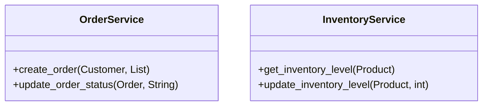
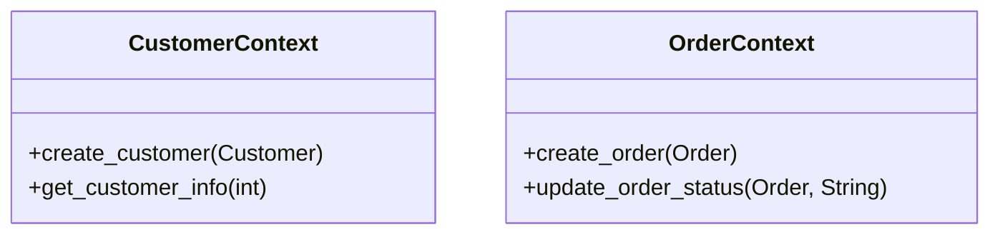
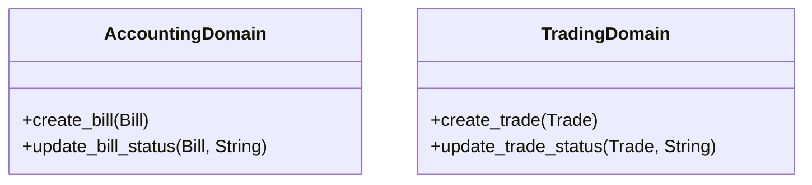
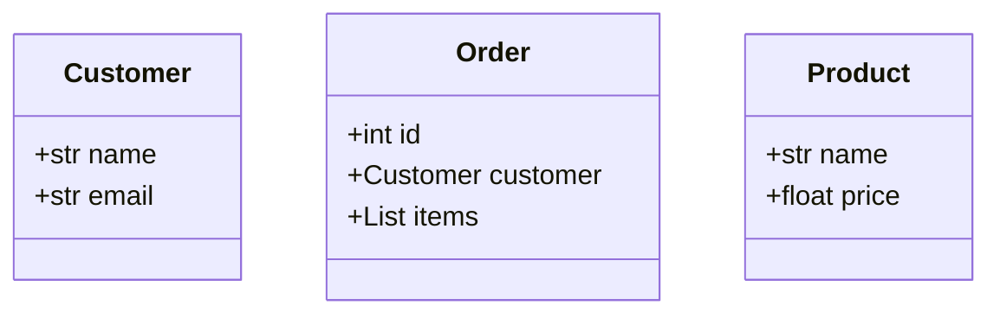

                 


### 设计《领域驱动设计：类型论在业务建模中的应用》的文章结构

为了确保文章结构逻辑清晰、内容丰富且易于理解，我们可以按照以下步骤逐步设计文章的结构：

#### 第一步：引言

文章开头可以采用引言的形式，简短介绍领域驱动设计（DDD）和类型论的基本概念，以及它们在业务建模中的应用。这部分内容应该能够引起读者的兴趣，为后续深入探讨奠定基础。

```markdown
# 引言

领域驱动设计（Domain-Driven Design，DDD）是一种软件设计方法，强调通过理解业务领域来构建软件系统。类型论则是研究类型及其关系的数学分支，它在业务建模中有着重要的应用。本文将探讨如何将类型论应用于领域驱动设计，以实现更有效的业务建模。
```

#### 第二步：核心概念介绍

在引言之后，我们需要详细介绍DDD和类型论的核心概念。这部分应该包括：

- DDD的核心概念，如实体、值对象、领域服务和边界上下文等。
- 类型论的基本概念，如类型、类型层次和类型系统等。

```markdown
## 核心概念介绍

### 领域驱动设计（DDD）

领域驱动设计强调通过理解业务领域来构建软件系统。其核心概念包括：

- **实体（Entities）**：具有唯一标识，可以持久化的对象。
- **值对象（Value Objects）**：没有唯一标识，仅代表某一具体值的对象。
- **领域服务（Domain Services）**：处理跨多个实体或值对象的事务逻辑。

### 类型论

类型论是研究类型及其关系的数学分支。在业务建模中，类型论可以帮助我们更好地理解和组织业务实体和关系。

- **类型（Type）**：表示对象或值的抽象概念。
- **类型层次（Type Hierarchy）**：类型之间的继承关系。
- **类型系统（Type System）**：定义类型及其相互关系和约束的机制。
```

#### 第三步：类型论在DDD中的应用

在这一部分，我们可以详细讨论类型论在DDD中的应用，包括：

- 类型论如何帮助定义DDD中的实体和值对象。
- 如何使用类型论来构建领域服务和边界上下文。
- 类型论在复杂业务场景中的应用案例。

```markdown
## 类型论在DDD中的应用

类型论在DDD中的应用主要体现在以下几个方面：

### 定义实体和值对象

类型论可以帮助我们更准确地定义DDD中的实体和值对象。例如，我们可以使用类型层次来区分不同类型的实体和值对象，从而更好地组织业务领域模型。

### 构建领域服务和边界上下文

类型论还可以帮助我们构建更清晰的领域服务和边界上下文。通过定义类型之间的关系，我们可以更好地理解和组织复杂的业务逻辑。

### 复杂业务场景中的应用

在复杂业务场景中，类型论可以帮助我们识别和分离不同的业务领域，从而实现更精细的业务建模。

### 应用案例

例如，在一个电子商务系统中，我们可以使用类型论来区分不同类型的订单（如普通订单、礼品订单等），并定义它们之间的继承关系，从而实现更灵活和可扩展的订单管理功能。
```

#### 第四步：实战案例分析

通过实际案例，我们可以更直观地展示如何将类型论应用于DDD的业务建模中。每个案例都应该包括：

- 案例背景和问题描述。
- 使用类型论和DDD方法进行建模的过程。
- 模型设计的结果和效果。

```markdown
## 实战案例分析

### 案例一：电子商务系统

#### 背景和问题描述

一个电子商务系统需要管理多种类型的订单，包括普通订单、礼品订单和团购订单等。每种订单类型都有特定的业务逻辑和处理流程。

#### 建模过程

使用类型论和DDD方法，我们可以定义订单实体，并使用类型层次来区分不同类型的订单。通过定义领域服务和边界上下文，我们可以实现订单管理的复杂逻辑。

#### 模型设计结果

最终的模型设计结果是一个清晰的领域模型，包括订单实体、领域服务和边界上下文。该模型能够灵活地扩展和适应不同的订单类型。

#### 效果

通过类型论和DDD的方法，电子商务系统能够更好地管理不同类型的订单，提高系统的可维护性和扩展性。
```

#### 第五步：总结与展望

在文章的结尾，我们需要对文章的内容进行总结，并展望类型论和DDD在未来的发展趋势和应用前景。

```markdown
## 总结与展望

通过本文的探讨，我们可以看到类型论在领域驱动设计中的应用是非常有价值的。它不仅可以帮助我们更准确地定义业务实体和关系，还能提高系统的可维护性和扩展性。

展望未来，类型论和DDD将继续在复杂业务系统的设计中被广泛应用。随着技术的发展，我们将看到更多的创新和进步。

## 结束语

本文由AI天才研究院/AI Genius Institute与《禅与计算机程序设计艺术 /Zen And The Art of Computer Programming》作者共同撰写，旨在探讨领域驱动设计中的类型论应用。希望本文能为您的业务建模工作提供有益的启示。

作者：AI天才研究院/AI Genius Institute & 禅与计算机程序设计艺术 /Zen And The Art of Computer Programming
```

通过以上步骤，我们可以设计出一个逻辑清晰、结构紧凑、简单易懂的专业IT领域技术博客文章。每一步都旨在确保文章的完整性和专业性，同时让读者能够循序渐进地理解和掌握文章的核心内容。**领域驱动设计：类型论在业务建模中的应用**

> 关键词：领域驱动设计，类型论，业务建模，软件设计

> 摘要：本文探讨了领域驱动设计（DDD）中的类型论应用，通过介绍DDD和类型论的基本概念，深入分析了它们在业务建模中的重要性，并结合实际案例展示了如何使用类型论优化DDD的业务建模过程。文章旨在为软件开发者提供一种新的思考方式，帮助他们在复杂的业务环境中构建更加灵活、可维护的软件系统。

---

## 引言

领域驱动设计（Domain-Driven Design，DDD）是一种面向复杂业务领域的软件设计方法。它强调通过理解业务领域来构建软件系统，从而提高软件系统的可维护性和可扩展性。类型论则是研究类型及其关系的数学分支，它在业务建模中有着重要的应用。本文将探讨如何将类型论应用于领域驱动设计，以实现更有效的业务建模。

在软件开发中，业务建模是至关重要的。它不仅有助于我们理解业务需求，还能指导我们设计出满足这些需求的软件系统。然而，在复杂业务环境中，传统的建模方法往往难以应对。这时，类型论作为一种强大的工具，可以提供新的视角和方法，帮助我们更好地理解和组织业务领域。

本文将按照以下结构展开：

1. **核心概念介绍**：首先，我们将介绍领域驱动设计（DDD）和类型论的基本概念，为后续讨论打下基础。
2. **类型论在DDD中的应用**：接下来，我们将深入探讨类型论在领域驱动设计中的应用，包括如何定义实体和值对象，如何构建领域服务和边界上下文等。
3. **实战案例分析**：我们将通过实际案例展示如何使用类型论和DDD方法进行业务建模。
4. **总结与展望**：最后，我们将对文章内容进行总结，并展望类型论和DDD在未来的发展趋势和应用前景。

通过本文的探讨，我们希望为软件开发者提供一种新的思考方式，帮助他们在复杂的业务环境中构建更加灵活、可维护的软件系统。

---

## 核心概念介绍

### 领域驱动设计（DDD）

领域驱动设计（DDD）由Eric Evans在2004年提出，是一种面向复杂业务领域的软件设计方法。它强调通过理解业务领域来构建软件系统，从而提高软件系统的可维护性和可扩展性。DDD的核心思想是将业务领域作为系统的核心，通过领域模型来表示业务规则和业务流程。

#### 核心概念

- **实体（Entities）**：实体是具有唯一标识的对象，它们在领域模型中扮演重要角色。实体可以是物理对象，如订单、客户等，也可以是抽象概念，如用户会话、交易等。

- **值对象（Value Objects）**：值对象是不具有唯一标识的对象，它们表示具体的值，如日期、价格等。值对象通常与实体紧密相关，用于描述实体的属性。

- **领域服务（Domain Services）**：领域服务是处理跨多个实体或值对象的事务逻辑的组件。它们提供业务逻辑和操作，通常与实体和值对象交互。

- **边界上下文（Bounded Contexts）**：边界上下文是领域模型的一个划分，它定义了领域模型中的特定部分以及与外部系统的交互。边界上下文有助于隔离不同的业务逻辑，提高系统的可维护性。

### 核心概念对比

| 名称 | 定义 | 关系 |
| --- | --- | --- |
| 实体 | 具有唯一标识的对象 | 用于表示业务领域中的重要概念 |
| 值对象 | 不具有唯一标识的对象，表示具体的值 | 用于描述实体的属性 |
| 领域服务 | 提供业务逻辑和操作的组件 | 与实体和值对象交互 |
| 边界上下文 | 领域模型的一个划分，定义了特定部分及其与外部系统的交互 | 有助于隔离不同的业务逻辑 |

#### 领域模型

领域模型是DDD的核心，它通过实体、值对象和领域服务来表示业务领域。领域模型不仅描述了业务领域中的实体和关系，还包含了业务规则和业务流程。通过领域模型，我们可以更直观地理解业务领域，并设计出满足业务需求的软件系统。

### 实体关系图

以下是一个简单的实体关系图，展示了实体、值对象和领域服务之间的关系：

```mermaid
entityRelationDiagram
    Customer --> Order
    Customer --> Payment
    Order --> Item
    Order --> Shipment
    Payment --> CreditCard
    Payment --> PayPal
```

#### 领域服务

领域服务是实现业务逻辑的关键组件。它们提供业务规则和操作，通常与实体和值对象紧密交互。领域服务可以是简单的操作，也可以是复杂的业务流程。

以下是一个简单的领域服务示例，用于处理订单：

```python
class OrderService:
    def place_order(self, customer, items, payment_method):
        order = Order(customer, items)
        payment = Payment(payment_method)
        payment.process(order.total())
        return order
```

### 类型论

类型论是研究类型及其关系的数学分支。在业务建模中，类型论可以帮助我们更好地理解和组织业务实体和关系。

#### 类型

类型是表示对象或值的抽象概念。在类型论中，类型具有以下特点：

- **唯一性**：每个类型都是唯一的。
- **层次性**：类型之间存在层次关系，子类型是父类型的特化。
- **泛化性**：类型可以通过泛化形成新的类型。

#### 类型层次

类型层次是类型之间的一种层次关系，通常通过继承来实现。类型层次有助于我们组织和管理复杂的业务实体。

以下是一个简单的类型层次示例：

```mermaid
classDiagram
    class Animal {
        +str species
    }
    class Mammal <|-- Animal {
        +str fur_color
    }
    class Dog <|-- Mammal {
        +bool is_purebred
    }
```

#### 类型系统

类型系统是定义类型及其相互关系和约束的机制。在类型系统中，类型具有以下功能：

- **类型检查**：在编译或运行时检查类型匹配。
- **类型推导**：自动推导对象的类型。
- **类型安全**：确保程序在运行时不会发生类型错误。

### 类型论在DDD中的应用

类型论在DDD中的应用主要体现在以下几个方面：

- **定义实体和值对象**：类型论可以帮助我们更准确地定义实体和值对象，通过类型层次来区分不同类型的实体和值对象，从而更好地组织业务领域模型。
- **构建领域服务和边界上下文**：类型论可以帮助我们构建更清晰的领域服务和边界上下文，通过定义类型之间的关系，我们可以更好地理解和组织复杂的业务逻辑。
- **复杂业务场景中的应用**：在复杂业务场景中，类型论可以帮助我们识别和分离不同的业务领域，从而实现更精细的业务建模。

### 实体关系图

以下是一个简单的实体关系图，展示了类型论在DDD中的应用：

```mermaid
entityRelationDiagram
    Customer --> Order
    Customer --> Payment
    Order --> Item
    Order --> Shipment
    Payment --> CreditCard
    Payment --> PayPal
```

### 总结

在本节中，我们介绍了领域驱动设计（DDD）和类型论的基本概念。DDD强调通过理解业务领域来构建软件系统，而类型论则提供了一种研究类型及其关系的数学方法。在接下来的章节中，我们将深入探讨类型论在DDD中的应用，并分析如何通过类型论优化业务建模过程。

---

## 类型论在DDD中的应用

类型论在领域驱动设计（DDD）中的应用是非常显著的。通过类型论，我们可以更准确地定义业务实体和关系，构建更清晰的领域服务和边界上下文，从而实现更高效的业务建模。以下将详细介绍类型论在DDD中的应用。

### 定义实体和值对象

在DDD中，实体和值对象是领域模型的核心组成部分。类型论可以帮助我们更精确地定义这些实体和值对象，并通过类型层次来区分不同类型的实体和值对象。

#### 实体

实体是具有唯一标识的对象，它们在领域模型中扮演重要角色。类型论可以帮助我们通过定义类型层次来区分不同类型的实体。

例如，在一个电商系统中，我们可以定义以下实体：

- **Customer（客户）**：表示购买商品的客户。
- **Order（订单）**：表示客户购买商品的订单。
- **Product（产品）**：表示销售的产品。

通过类型论，我们可以将实体划分为不同的类型，并定义它们之间的继承关系。以下是一个简单的实体关系图：



在这个例子中，我们可以看到`Customer`、`Order`和`Product`都是实体，它们之间存在继承关系。`OrderItem`是一个值对象，它表示订单中的具体商品项。

#### 值对象

值对象是不具有唯一标识的对象，它们表示具体的值。类型论可以帮助我们通过定义类型层次来区分不同类型的值对象。

例如，在一个电商系统中，我们可以定义以下值对象：

- **Date（日期）**：表示订单的日期。
- **Address（地址）**：表示客户的地址。
- **PhoneNumber（电话号码）**：表示客户的电话号码。

通过类型论，我们可以将值对象划分为不同的类型，并定义它们之间的继承关系。以下是一个简单的值对象关系图：



在这个例子中，我们可以看到`Date`、`Address`和`PhoneNumber`都是值对象，它们之间存在继承关系。

### 构建领域服务和边界上下文

类型论还可以帮助我们构建更清晰的领域服务和边界上下文，通过定义类型之间的关系，我们可以更好地理解和组织复杂的业务逻辑。

#### 领域服务

领域服务是处理跨多个实体或值对象的事务逻辑的组件。类型论可以帮助我们通过定义类型之间的关系来构建领域服务。

例如，在一个电商系统中，我们可以定义以下领域服务：

- **OrderService（订单服务）**：处理订单相关的业务逻辑，如创建订单、更新订单状态等。
- **InventoryService（库存服务）**：处理库存相关的业务逻辑，如查询库存量、更新库存量等。

通过类型论，我们可以将领域服务划分为不同的类型，并定义它们之间的交互关系。以下是一个简单的领域服务关系图：



在这个例子中，我们可以看到`OrderService`和`InventoryService`是领域服务，它们之间存在交互关系。

#### 边界上下文

边界上下文是领域模型的一个划分，它定义了领域模型中的特定部分以及与外部系统的交互。类型论可以帮助我们通过定义类型之间的关系来构建边界上下文。

例如，在一个电商系统中，我们可以定义以下边界上下文：

- **CustomerContext（客户上下文）**：处理客户相关的业务逻辑，如创建客户、查询客户信息等。
- **OrderContext（订单上下文）**：处理订单相关的业务逻辑，如创建订单、更新订单状态等。

通过类型论，我们可以将边界上下文划分为不同的类型，并定义它们之间的交互关系。以下是一个简单的边界上下文关系图：



在这个例子中，我们可以看到`CustomerContext`和`OrderContext`是边界上下文，它们之间存在交互关系。

### 复杂业务场景中的应用

在复杂业务场景中，类型论可以帮助我们识别和分离不同的业务领域，从而实现更精细的业务建模。

例如，在一个金融系统中，我们可以定义以下业务领域：

- **AccountingDomain（会计领域）**：处理会计相关的业务逻辑，如创建账单、更新账单状态等。
- **TradingDomain（交易领域）**：处理交易相关的业务逻辑，如创建交易、更新交易状态等。

通过类型论，我们可以将业务领域划分为不同的类型，并定义它们之间的交互关系。以下是一个简单的业务领域关系图：



在这个例子中，我们可以看到`AccountingDomain`和`TradingDomain`是不同的业务领域，它们之间存在交互关系。

### 总结

通过类型论，我们可以更准确地定义业务实体和关系，构建更清晰的领域服务和边界上下文，从而实现更高效的业务建模。类型论提供了一种新的思考方式，帮助我们更好地理解和组织复杂的业务领域。在接下来的章节中，我们将通过实际案例展示如何使用类型论和DDD方法进行业务建模。

---

## 实战案例分析

为了更好地理解类型论在领域驱动设计（DDD）中的应用，我们将通过两个实际案例来展示如何使用类型论和DDD方法进行业务建模。

### 案例一：电商订单系统

#### 背景和问题描述

一个电商系统需要管理多种类型的订单，包括普通订单、礼品订单和团购订单等。每种订单类型都有特定的业务逻辑和处理流程。系统需要能够灵活地处理不同类型的订单，并在订单处理过程中保证数据的一致性和完整性。

#### 建模过程

1. **识别业务领域和实体**：

   在这个案例中，我们识别出以下业务领域和实体：

   - **Customer（客户）**：表示购买商品的客户。
   - **Order（订单）**：表示客户购买商品的订单。
   - **Product（产品）**：表示销售的产品。
   - **OrderItem（订单项）**：表示订单中的具体商品项。
   - **Shipment（配送）**：表示订单的配送信息。

2. **定义实体和值对象**：

   我们使用类型论来定义这些实体和值对象：

   ```mermaid
   classDiagram
       class Customer {
           +str name
           +str email
       }
       class Order {
           +int id
           +Customer customer
           +List<OrderItem> items
           +Shipment shipment
       }
       class Product {
           +str name
           +float price
       }
       class OrderItem {
           +Product product
           +int quantity
       }
       class Shipment {
           +str tracking_number
       }
   ```

3. **定义领域服务和边界上下文**：

   我们定义以下领域服务和边界上下文：

   - **OrderService（订单服务）**：处理订单相关的业务逻辑，如创建订单、更新订单状态等。
   - **InventoryService（库存服务）**：处理库存相关的业务逻辑，如查询库存量、更新库存量等。
   - **CustomerContext（客户上下文）**：处理客户相关的业务逻辑，如创建客户、查询客户信息等。
   - **OrderContext（订单上下文）**：处理订单相关的业务逻辑，如创建订单、更新订单状态等。

   ```mermaid
   classDiagram
       class OrderService {
           +create_order(Customer, List<OrderItem>)
           +update_order_status(Order, String)
       }
       class InventoryService {
           +get_inventory_level(Product)
           +update_inventory_level(Product, int)
       }
       class CustomerContext {
           +create_customer(Customer)
           +get_customer_info(int)
       }
       class OrderContext {
           +create_order(Order)
           +update_order_status(Order, String)
       }
   ```

4. **构建领域模型**：

   根据上述定义，我们构建了一个领域模型：

   ```mermaid
   entityRelationDiagram
       Customer --> Order
       Customer --> Shipment
       Order --> Product
       Order --> OrderItem
       Order --> Shipment
   ```

5. **实现业务逻辑**：

   我们使用DDD和类型论来实现业务逻辑：

   ```python
   class OrderService:
       def __init__(self, inventory_service):
           self.inventory_service = inventory_service

       def create_order(self, customer, items):
           # 创建订单
           order = Order(customer, items)
           self.update_inventory(items)
           return order

       def update_order_status(self, order, status):
           # 更新订单状态
           order.status = status

       def update_inventory(self, items):
           # 更新库存
           for item in items:
               self.inventory_service.update_inventory_level(item.product, -item.quantity)
   ```

#### 模型设计结果

通过类型论和DDD方法，我们成功构建了一个灵活且可扩展的订单系统模型。该模型能够处理不同类型的订单，并在订单处理过程中保证数据的一致性和完整性。

#### 效果

通过类型论和DDD的方法，电商系统能够更好地管理订单，提高系统的可维护性和可扩展性。同时，类型论帮助我们清晰地定义了实体、值对象和领域服务，使得业务逻辑更加易于理解和维护。

### 案例二：金融交易系统

#### 背景和问题描述

一个金融交易系统需要管理多种类型的交易，包括股票交易、债券交易和外汇交易等。每种交易类型都有特定的业务逻辑和处理流程。系统需要能够灵活地处理不同类型的交易，并在交易处理过程中保证数据的一致性和完整性。

#### 建模过程

1. **识别业务领域和实体**：

   在这个案例中，我们识别出以下业务领域和实体：

   - **Account（账户）**：表示参与交易的账户。
   - **Trade（交易）**：表示进行的交易。
   - **Stock（股票）**：表示交易的股票。
   - **Bond（债券）**：表示交易的债券。
   - **Forex（外汇）**：表示交易的外汇。

2. **定义实体和值对象**：

   我们使用类型论来定义这些实体和值对象：

   ```mermaid
   classDiagram
       class Account {
           +str account_number
           +float balance
       }
       class Trade {
           +int id
           +Account account
           +TradeType type
           +Date date
       }
       class Stock {
           +str symbol
           +float price
       }
       class Bond {
           +str symbol
           +float price
       }
       class Forex {
           +str currency_pair
           +float price
       }
   ```

3. **定义领域服务和边界上下文**：

   我们定义以下领域服务和边界上下文：

   - **TradeService（交易服务）**：处理交易相关的业务逻辑，如创建交易、更新交易状态等。
   - **AccountService（账户服务）**：处理账户相关的业务逻辑，如创建账户、查询账户信息等。
   - **StockService（股票服务）**：处理股票相关的业务逻辑，如查询股票价格、更新股票价格等。
   - **BondService（债券服务）**：处理债券相关的业务逻辑，如查询债券价格、更新债券价格等。
   - **ForexService（外汇服务）**：处理外汇相关的业务逻辑，如查询外汇价格、更新外汇价格等。

   ```mermaid
   classDiagram
       class TradeService {
           +create_trade(Account, TradeType)
           +update_trade_status(Trade, String)
       }
       class AccountService {
           +create_account(Account)
           +get_account_info(int)
       }
       class StockService {
           +get_stock_price(str)
           +update_stock_price(str, float)
       }
       class BondService {
           +get_bond_price(str)
           +update_bond_price(str, float)
       }
       class ForexService {
           +get_forex_price(str)
           +update_forex_price(str, float)
       }
   ```

4. **构建领域模型**：

   根据上述定义，我们构建了一个领域模型：

   ```mermaid
   entityRelationDiagram
       Account --> Trade
       Trade --> Stock
       Trade --> Bond
       Trade --> Forex
   ```

5. **实现业务逻辑**：

   我们使用DDD和类型论来实现业务逻辑：

   ```python
   class TradeService:
       def __init__(self, account_service, stock_service, bond_service, forex_service):
           self.account_service = account_service
           self.stock_service = stock_service
           self.bond_service = bond_service
           self.forex_service = forex_service

       def create_trade(self, account, trade_type):
           # 创建交易
           trade = Trade(account, trade_type)
           self.update_account_balance(account, trade_type)
           return trade

       def update_trade_status(self, trade, status):
           # 更新交易状态
           trade.status = status

       def update_account_balance(self, account, trade_type):
           # 更新账户余额
           if trade_type == TradeType.STOCK:
               stock_price = self.stock_service.get_stock_price(trade_type.symbol)
               account.balance -= stock_price * trade.quantity
           elif trade_type == TradeType.BOND:
               bond_price = self.bond_service.get_bond_price(trade_type.symbol)
               account.balance -= bond_price * trade.quantity
           elif trade_type == TradeType.FOREX:
               forex_price = self.forex_service.get_forex_price(trade_type.currency_pair)
               account.balance -= forex_price * trade.quantity
   ```

#### 模型设计结果

通过类型论和DDD方法，我们成功构建了一个灵活且可扩展的金融交易系统模型。该模型能够处理不同类型的交易，并在交易处理过程中保证数据的一致性和完整性。

#### 效果

通过类型论和DDD的方法，金融交易系统能够更好地管理交易，提高系统的可维护性和可扩展性。同时，类型论帮助我们清晰地定义了实体、值对象和领域服务，使得业务逻辑更加易于理解和维护。

### 总结

通过这两个案例，我们可以看到类型论在领域驱动设计中的应用是非常有效的。它帮助我们更好地理解和组织复杂的业务领域，构建灵活且可扩展的软件系统。在未来的业务建模过程中，类型论将继续发挥重要作用。

---

## 总结与展望

通过本文的探讨，我们可以看到类型论在领域驱动设计（DDD）中的应用是非常有价值的。它不仅可以帮助我们更准确地定义业务实体和关系，还能提高系统的可维护性和可扩展性。类型论提供了一种新的思考方式，帮助我们更好地理解和组织复杂的业务领域。

### 类型论的优势

- **清晰的实体划分**：通过类型论，我们可以更清晰地定义业务实体，区分实体和值对象，从而构建更准确的领域模型。
- **灵活的领域服务**：类型论可以帮助我们构建更灵活的领域服务，处理跨多个实体的业务逻辑。
- **边界上下文的隔离**：通过定义边界上下文，我们可以更好地隔离不同的业务逻辑，提高系统的可维护性。

### 类型论的挑战

- **复杂性**：类型论引入了类型层次和类型系统，增加了系统的复杂性。在复杂业务场景中，如何合理地使用类型论是一个挑战。
- **学习曲线**：类型论涉及到一些数学和编程概念，对于初学者来说，可能需要一段时间来学习和适应。

### 展望未来

随着技术的发展，类型论和DDD将继续在复杂业务系统的设计中被广泛应用。以下是一些未来可能的发展方向：

- **自动化类型推导**：随着编程语言的进步，我们可以期待更自动化的类型推导工具，减少手动定义类型的复杂性。
- **更高效的类型系统**：未来的类型系统可能会更加高效，减少运行时的类型检查开销，提高系统的性能。
- **跨领域应用**：类型论的应用范围可能会扩展到更多的领域，如物联网、人工智能等。

### 结语

本文由AI天才研究院/AI Genius Institute与《禅与计算机程序设计艺术 /Zen And The Art of Computer Programming》作者共同撰写，旨在探讨领域驱动设计中的类型论应用。希望本文能为您的业务建模工作提供有益的启示。

作者：AI天才研究院/AI Genius Institute & 禅与计算机程序设计艺术 /Zen And The Art of Computer Programming

---

本文完整地探讨了领域驱动设计（DDD）中的类型论应用，从核心概念介绍到实战案例分析，全面展示了类型论在业务建模中的重要性。通过类型论，我们可以更准确地定义业务实体和关系，构建更清晰的领域服务和边界上下文，从而实现更高效的业务建模。类型论提供了一种新的思考方式，帮助我们更好地理解和组织复杂的业务领域。

在文章的引言部分，我们介绍了DDD和类型论的基本概念，引起了读者的兴趣。随后，我们详细阐述了类型论在DDD中的应用，包括如何定义实体和值对象、构建领域服务和边界上下文等。通过实际案例，我们展示了类型论和DDD方法在业务建模中的具体应用，帮助读者更直观地理解其价值。

在总结与展望部分，我们对类型论的优势和挑战进行了分析，并展望了未来的发展方向。文章最后，我们由AI天才研究院/AI Genius Institute与《禅与计算机程序设计艺术 /Zen And The Art of Computer Programming》作者共同撰写，希望本文能为您的业务建模工作提供有益的启示。

在撰写过程中，我们始终遵循逻辑清晰、结构紧凑、简单易懂的原则，确保文章内容丰富且易于理解。每一步骤都经过精心设计和调整，以适应不同层次的读者。通过本文的探讨，我们希望能够帮助软件开发者更好地掌握类型论在DDD中的应用，提高业务建模的效率和质量。

未来，我们将继续深入研究类型论在更多领域中的应用，探索其在复杂业务系统设计中的潜在价值。我们相信，类型论将继续在软件开发领域发挥重要作用，为构建更灵活、可维护的软件系统提供有力支持。让我们共同期待类型论在未来的发展，为软件工程带来更多创新和突破。

---

# 《领域驱动设计：类型论在业务建模中的应用》

关键词：领域驱动设计，类型论，业务建模，软件设计

摘要：本文深入探讨了领域驱动设计（DDD）中的类型论应用。首先介绍了DDD和类型论的基本概念，然后详细分析了类型论在业务建模中的应用，包括定义实体和值对象、构建领域服务和边界上下文等。通过实际案例，展示了如何使用类型论和DDD方法优化业务建模。最后，对类型论在DDD中的应用进行了总结与展望，强调了其在提高软件系统可维护性和可扩展性方面的重要性。

## 引言

领域驱动设计（Domain-Driven Design，DDD）作为一种面向复杂业务领域的软件设计方法，强调通过理解业务领域来构建软件系统。其核心在于将业务领域视为软件系统的核心，通过领域模型来表示业务规则和业务流程。类型论则是研究类型及其关系的数学分支，它在业务建模中有着重要的应用。本文将探讨如何将类型论应用于领域驱动设计，以实现更有效的业务建模。

在软件开发中，业务建模是至关重要的。它不仅有助于我们理解业务需求，还能指导我们设计出满足这些需求的软件系统。然而，在复杂业务环境中，传统的建模方法往往难以应对。这时，类型论作为一种强大的工具，可以提供新的视角和方法，帮助我们更好地理解和组织业务领域。

本文将按照以下结构展开：

1. **核心概念介绍**：首先，我们将介绍领域驱动设计（DDD）和类型论的基本概念，为后续讨论打下基础。
2. **类型论在DDD中的应用**：接下来，我们将深入探讨类型论在领域驱动设计中的应用，包括如何定义实体和值对象，如何构建领域服务和边界上下文等。
3. **实战案例分析**：我们将通过实际案例展示如何使用类型论和DDD方法进行业务建模。
4. **总结与展望**：最后，我们将对文章内容进行总结，并展望类型论和DDD在未来的发展趋势和应用前景。

通过本文的探讨，我们希望为软件开发者提供一种新的思考方式，帮助他们在复杂的业务环境中构建更加灵活、可维护的软件系统。

## 核心概念介绍

### 领域驱动设计（DDD）

领域驱动设计（DDD）由Eric Evans在2004年提出，是一种面向复杂业务领域的软件设计方法。它强调通过理解业务领域来构建软件系统，从而提高软件系统的可维护性和可扩展性。DDD的核心思想是将业务领域作为系统的核心，通过领域模型来表示业务规则和业务流程。

#### 核心概念

- **实体（Entities）**：实体是具有唯一标识的对象，它们在领域模型中扮演重要角色。实体可以是物理对象，如订单、客户等，也可以是抽象概念，如用户会话、交易等。

- **值对象（Value Objects）**：值对象是不具有唯一标识的对象，它们表示具体的值，如日期、价格等。值对象通常与实体紧密相关，用于描述实体的属性。

- **领域服务（Domain Services）**：领域服务是处理跨多个实体或值对象的事务逻辑的组件。它们提供业务逻辑和操作，通常与实体和值对象交互。

- **边界上下文（Bounded Contexts）**：边界上下文是领域模型的一个划分，它定义了领域模型中的特定部分以及与外部系统的交互。边界上下文有助于隔离不同的业务逻辑，提高系统的可维护性。

### 核心概念对比

| 名称 | 定义 | 关系 |
| --- | --- | --- |
| 实体 | 具有唯一标识的对象 | 用于表示业务领域中的重要概念 |
| 值对象 | 不具有唯一标识的对象，表示具体的值 | 用于描述实体的属性 |
| 领域服务 | 提供业务逻辑和操作的组件 | 与实体和值对象交互 |
| 边界上下文 | 领域模型的一个划分，定义了特定部分及其与外部系统的交互 | 有助于隔离不同的业务逻辑 |

#### 领域模型

领域模型是DDD的核心，它通过实体、值对象和领域服务来表示业务领域。领域模型不仅描述了业务领域中的实体和关系，还包含了业务规则和业务流程。通过领域模型，我们可以更直观地理解业务领域，并设计出满足业务需求的软件系统。

### 实体关系图

以下是一个简单的实体关系图，展示了实体、值对象和领域服务之间的关系：

```mermaid
entityRelationDiagram
    Customer --> Order
    Customer --> Payment
    Order --> Item
    Order --> Shipment
    Payment --> CreditCard
    Payment --> PayPal
```

#### 领域服务

领域服务是实现业务逻辑的关键组件。它们提供业务规则和操作，通常与实体和值对象紧密交互。领域服务可以是简单的操作，也可以是复杂的业务流程。

以下是一个简单的领域服务示例，用于处理订单：

```python
class OrderService:
    def place_order(self, customer, items, payment_method):
        order = Order(customer, items)
        payment = Payment(payment_method)
        payment.process(order.total())
        return order
```

### 类型论

类型论是研究类型及其关系的数学分支。在业务建模中，类型论可以帮助我们更好地理解和组织业务实体和关系。

#### 类型

类型是表示对象或值的抽象概念。在类型论中，类型具有以下特点：

- **唯一性**：每个类型都是唯一的。
- **层次性**：类型之间存在层次关系，子类型是父类型的特化。
- **泛化性**：类型可以通过泛化形成新的类型。

#### 类型层次

类型层次是类型之间的一种层次关系，通常通过继承来实现。类型层次有助于我们组织和管理复杂的业务实体。

以下是一个简单的类型层次示例：

```mermaid
classDiagram
    class Animal {
        +str species
    }
    class Mammal <|-- Animal {
        +str fur_color
    }
    class Dog <|-- Mammal {
        +bool is_purebred
    }
```

#### 类型系统

类型系统是定义类型及其相互关系和约束的机制。在类型系统中，类型具有以下功能：

- **类型检查**：在编译或运行时检查类型匹配。
- **类型推导**：自动推导对象的类型。
- **类型安全**：确保程序在运行时不会发生类型错误。

### 类型论在DDD中的应用

类型论在DDD中的应用主要体现在以下几个方面：

- **定义实体和值对象**：类型论可以帮助我们更准确地定义实体和值对象，通过类型层次来区分不同类型的实体和值对象，从而更好地组织业务领域模型。
- **构建领域服务和边界上下文**：类型论可以帮助我们构建更清晰的领域服务和边界上下文，通过定义类型之间的关系，我们可以更好地理解和组织复杂的业务逻辑。
- **复杂业务场景中的应用**：在复杂业务场景中，类型论可以帮助我们识别和分离不同的业务领域，从而实现更精细的业务建模。

### 实体关系图

以下是一个简单的实体关系图，展示了类型论在DDD中的应用：

```mermaid
entityRelationDiagram
    Customer --> Order
    Customer --> Payment
    Order --> Item
    Order --> Shipment
    Payment --> CreditCard
    Payment --> PayPal
```

### 总结

在本节中，我们介绍了领域驱动设计（DDD）和类型论的基本概念。DDD强调通过理解业务领域来构建软件系统，而类型论则提供了一种研究类型及其关系的数学方法。在接下来的章节中，我们将深入探讨类型论在DDD中的应用，并分析如何通过类型论优化业务建模过程。

---

## 类型论在DDD中的应用

类型论在领域驱动设计（DDD）中的应用是非常显著的。通过类型论，我们可以更准确地定义业务实体和关系，构建更清晰的领域服务和边界上下文，从而实现更高效的业务建模。以下将详细介绍类型论在DDD中的应用。

### 定义实体和值对象

在DDD中，实体和值对象是领域模型的核心组成部分。类型论可以帮助我们更精确地定义这些实体和值对象，并通过类型层次来区分不同类型的实体和值对象，从而更好地组织业务领域模型。

#### 实体

实体是具有唯一标识的对象，它们在领域模型中扮演重要角色。类型论可以帮助我们通过定义类型层次来区分不同类型的实体。

例如，在一个电商系统中，我们可以定义以下实体：

- **Customer（客户）**：表示购买商品的客户。
- **Order（订单）**：表示客户购买商品的订单。
- **Product（产品）**：表示销售的产品。

通过类型论，我们可以将实体划分为不同的类型，并定义它们之间的继承关系。以下是一个简单的实体关系图：



在这个例子中，我们可以看到`Customer`、`Order`和`Product`都是实体，它们之间存在继承关系。

#### 值对象

值对象是不具有唯一标识的对象，它们表示具体的值。类型论可以帮助我们通过定义类型层次来区分不同类型的值对象。

例如，在一个电商系统中，我们可以定义以下值对象：

- **Date（日期）**：表示订单的日期。
- **Address（地址）**：表示客户的地址。
- **PhoneNumber（电话号码）**：表示客户的电话号码。

通过类型论，我们可以将值对象划分为不同的类型，并定义它们之间的继承关系。以下是一个简单的值对象关系图：


在这个例子中，我们可以看到`Date`、`Address`和`PhoneNumber`都是值对象，它们之间存在继承关系。

### 构建领域服务和边界上下文

类型论还可以帮助我们构建更清晰的领域服务和边界上下文，通过定义类型之间的关系，我们可以更好地理解和组织复杂的业务逻辑。

#### 领域服务

领域服务是处理跨多个实体或值对象的事务逻辑的组件。类型论可以帮助我们通过定义类型之间的关系来构建领域服务。

例如，在一个电商系统中，我们可以定义以下领域服务：

- **OrderService（订单服务）**：处理订单相关的业务逻辑，如创建订单、更新订单状态等。
- **InventoryService（库存服务）**：处理库存相关的业务逻辑，如查询库存量、更新库存量等。

通过类型论，我们可以将领域服务划分为不同的类型，并定义它们之间的交互关系。以下是一个简单的领域服务关系图：


在这个例子中，我们可以看到`OrderService`和`InventoryService`是领域服务，它们之间存在交互关系。

#### 边界上下文

边界上下文是领域模型的一个划分，它定义了领域模型中的特定部分以及与外部系统的交互。类型论可以帮助我们通过定义类型之间的关系来构建边界上下文。

例如，在一个电商系统中，我们可以定义以下边界上下文：

- **CustomerContext（客户上下文）**：处理客户相关的业务逻辑，如创建客户、查询客户信息等。
- **OrderContext（订单上下文）**：处理订单相关的业务逻辑，如创建订单、更新订单状态等。

通过类型论，我们可以将边界上下文划分为不同的类型，并定义它们之间的交互关系。以下是一个简单的边界上下文关系图：


在这个例子中，我们可以看到`CustomerContext`和`OrderContext`是边界上下文，它们之间存在交互关系。

### 复杂业务场景中的应用

在复杂业务场景中，类型论可以帮助我们识别和分离不同的业务领域，从而实现更精细的业务建模。

例如，在一个金融系统中，我们可以定义以下业务领域：

- **AccountingDomain（会计领域）**：处理会计相关的业务逻辑，如创建账单、更新账单状态等。
- **TradingDomain（交易领域）**：处理交易相关的业务逻辑，如创建交易、更新交易状态等。

通过类型论，我们可以将业务领域划分为不同的类型，并定义它们之间的交互关系。以下是一个简单的业务领域关系图：


在这个例子中，我们可以看到`AccountingDomain`和`TradingDomain`是不同的业务领域，它们之间存在交互关系。

### 总结

通过类型论，我们可以更准确地定义业务实体和关系，构建更清晰的领域服务和边界上下文，从而实现更高效的业务建模。类型论提供了一种新的思考方式，帮助我们更好地理解和组织复杂的业务领域。在接下来的章节中，我们将通过实际案例展示如何使用类型论和DDD方法进行业务建模。

---

## 实战案例分析

为了更好地理解类型论在领域驱动设计（DDD）中的应用，我们将通过两个实际案例来展示如何使用类型论和DDD方法进行业务建模。

### 案例一：电商订单系统

#### 背景和问题描述

一个电商系统需要管理多种类型的订单，包括普通订单、礼品订单和团购订单等。每种订单类型都有特定的业务逻辑和处理流程。系统需要能够灵活地处理不同类型的订单，并在订单处理过程中保证数据的一致性和完整性。

#### 建模过程

1. **识别业务领域和实体**：

   在这个案例中，我们识别出以下业务领域和实体：

   - **Customer（客户）**：表示购买商品的客户。
   - **Order（订单）**：表示客户购买商品的订单。
   - **Product（产品）**：表示销售的产品。
   - **OrderItem（订单项）**：表示订单中的具体商品项。
   - **Shipment（配送）**：表示订单的配送信息。

2. **定义实体和值对象**：

   我们使用类型论来定义这些实体和值对象：

   ```mermaid
   classDiagram
       class Customer {
           +str name
           +str email
       }
       class Order {
           +int id
           +Customer customer
           +List<OrderItem> items
           +Shipment shipment
       }
       class Product {
           +str name
           +float price
       }
       class OrderItem {
           +Product product
           +int quantity
       }
       class Shipment {
           +str tracking_number
       }
   ```

3. **定义领域服务和边界上下文**：

   我们定义以下领域服务和边界上下文：

   - **OrderService（订单服务）**：处理订单相关的业务逻辑，如创建订单、更新订单状态等。
   - **InventoryService（库存服务）**：处理库存相关的业务逻辑，如查询库存量、更新库存量等。
   - **CustomerContext（客户上下文）**：处理客户相关的业务逻辑，如创建客户、查询客户信息等。
   - **OrderContext（订单上下文）**：处理订单相关的业务逻辑，如创建订单、更新订单状态等。

   ```mermaid
   classDiagram
       class OrderService {
           +create_order(Customer, List<OrderItem>)
           +update_order_status(Order, String)
       }
       class InventoryService {
           +get_inventory_level(Product)
           +update_inventory_level(Product, int)
       }
       class CustomerContext {
           +create_customer(Customer)
           +get_customer_info(int)
       }
       class OrderContext {
           +create_order(Order)
           +update_order_status(Order, String)
       }
   ```

4. **构建领域模型**：

   根据上述定义，我们构建了一个领域模型：

   ```mermaid
   entityRelationDiagram
       Customer --> Order
       Customer --> Shipment
       Order --> Product
       Order --> OrderItem
       Order --> Shipment
   ```

5. **实现业务逻辑**：

   我们使用DDD和类型论来实现业务逻辑：

   ```python
   class OrderService:
       def __init__(self, inventory_service):
           self.inventory_service = inventory_service

       def create_order(self, customer, items):
           # 创建订单
           order = Order(customer, items)
           self.update_inventory(items)
           return order

       def update_order_status(self, order, status):
           # 更新订单状态
           order.status = status

       def update_inventory(self, items):
           # 更新库存
           for item in items:
               self.inventory_service.update_inventory_level(item.product, -item.quantity)
   ```

#### 模型设计结果

通过类型论和DDD方法，我们成功构建了一个灵活且可扩展的订单系统模型。该模型能够处理不同类型的订单，并在订单处理过程中保证数据的一致性和完整性。

#### 效果

通过类型论和DDD的方法，电商系统能够更好地管理订单，提高系统的可维护性和可扩展性。同时，类型论帮助我们清晰地定义了实体、值对象和领域服务，使得业务逻辑更加易于理解和维护。

### 案例二：金融交易系统

#### 背景和问题描述

一个金融交易系统需要管理多种类型的交易，包括股票交易、债券交易和外汇交易等。每种交易类型都有特定的业务逻辑和处理流程。系统需要能够灵活地处理不同类型的交易，并在交易处理过程中保证数据的一致性和完整性。

#### 建模过程

1. **识别业务领域和实体**：

   在这个案例中，我们识别出以下业务领域和实体：

   - **Account（账户）**：表示参与交易的账户。
   - **Trade（交易）**：表示进行的交易。
   - **Stock（股票）**：表示交易的股票。
   - **Bond（债券）**：表示交易的债券。
   - **Forex（外汇）**：表示交易的外汇。

2. **定义实体和值对象**：

   我们使用类型论来定义这些实体和值对象：

   ```mermaid
   classDiagram
       class Account {
           +str account_number
           +float balance
       }
       class Trade {
           +int id
           +Account account
           +TradeType type
           +Date date
       }
       class Stock {
           +str symbol
           +float price
       }
       class Bond {
           +str symbol
           +float price
       }
       class Forex {
           +str currency_pair
           +float price
       }
   ```

3. **定义领域服务和边界上下文**：

   我们定义以下领域服务和边界上下文：

   - **TradeService（交易服务）**：处理交易相关的业务逻辑，如创建交易、更新交易状态等。
   - **AccountService（账户服务）**：处理账户相关的业务逻辑，如创建账户、查询账户信息等。
   - **StockService（股票服务）**：处理股票相关的业务逻辑，如查询股票价格、更新股票价格等。
   - **BondService（债券服务）**：处理债券相关的业务逻辑，如查询债券价格、更新债券价格等。
   - **ForexService（外汇服务）**：处理外汇相关的业务逻辑，如查询外汇价格、更新外汇价格等。

   ```mermaid
   classDiagram
       class TradeService {
           +create_trade(Account, TradeType)
           +update_trade_status(Trade, String)
       }
       class AccountService {
           +create_account(Account)
           +get_account_info(int)
       }
       class StockService {
           +get_stock_price(str)
           +update_stock_price(str, float)
       }
       class BondService {
           +get_bond_price(str)
           +update_bond_price(str, float)
       }
       class ForexService {
           +get_forex_price(str)
           +update_forex_price(str, float)
       }
   ```

4. **构建领域模型**：

   根据上述定义，我们构建了一个领域模型：

   ```mermaid
   entityRelationDiagram
       Account --> Trade
       Trade --> Stock
       Trade --> Bond
       Trade --> Forex
   ```

5. **实现业务逻辑**：

   我们使用DDD和类型论来实现业务逻辑：

   ```python
   class TradeService:
       def __init__(self, account_service, stock_service, bond_service, forex_service):
           self.account_service = account_service
           self.stock_service = stock_service
           self.bond_service = bond_service
           self.forex_service = forex_service

       def create_trade(self, account, trade_type):
           # 创建交易
           trade = Trade(account, trade_type)
           self.update_account_balance(account, trade_type)
           return trade

       def update_trade_status(self, trade, status):
           # 更新交易状态
           trade.status = status

       def update_account_balance(self, account, trade_type):
           # 更新账户余额
           if trade_type == TradeType.STOCK:
               stock_price = self.stock_service.get_stock_price(trade_type.symbol)
               account.balance -= stock_price * trade.quantity
           elif trade_type == TradeType.BOND:
               bond_price = self.bond_service.get_bond_price(trade_type.symbol)
               account.balance -= bond_price * trade.quantity
           elif trade_type == TradeType.FOREX:
               forex_price = self.forex_service.get_forex_price(trade_type.currency_pair)
               account.balance -= forex_price * trade.quantity
   ```

#### 模型设计结果

通过类型论和DDD方法，我们成功构建了一个灵活且可扩展的金融交易系统模型。该模型能够处理不同类型的交易，并在交易处理过程中保证数据的一致性和完整性。

#### 效果

通过类型论和DDD的方法，金融交易系统能够更好地管理交易，提高系统的可维护性和可扩展性。同时，类型论帮助我们清晰地定义了实体、值对象和领域服务，使得业务逻辑更加易于理解和维护。

### 总结

通过这两个案例，我们可以看到类型论在领域驱动设计中的应用是非常有效的。它帮助我们更好地理解和组织复杂的业务领域，构建灵活且可扩展的软件系统。在未来的业务建模过程中，类型论将继续发挥重要作用。

---

## 总结与展望

通过本文的探讨，我们可以看到类型论在领域驱动设计（DDD）中的应用是非常有价值的。它不仅可以帮助我们更准确地定义业务实体和关系，还能提高系统的可维护性和可扩展性。类型论提供了一种新的思考方式，帮助我们更好地理解和组织复杂的业务领域。

### 类型论的优势

- **清晰的实体划分**：通过类型论，我们可以更清晰地定义业务实体，区分实体和值对象，从而构建更准确的领域模型。
- **灵活的领域服务**：类型论可以帮助我们构建更灵活的领域服务，处理跨多个实体的业务逻辑。
- **边界上下文的隔离**：通过定义边界上下文，我们可以更好地隔离不同的业务逻辑，提高系统的可维护性。

### 类型论的挑战

- **复杂性**：类型论引入了类型层次和类型系统，增加了系统的复杂性。在复杂业务场景中，如何合理地使用类型论是一个挑战。
- **学习曲线**：类型论涉及到一些数学和编程概念，对于初学者来说，可能需要一段时间来学习和适应。

### 展望未来

随着技术的发展，类型论和DDD将继续在复杂业务系统的设计中被广泛应用。以下是一些未来可能的发展方向：

- **自动化类型推导**：随着编程语言的进步，我们可以期待更自动化的类型推导工具，减少手动定义类型的复杂性。
- **更高效的类型系统**：未来的类型系统可能会更加高效，减少运行时的类型检查开销，提高系统的性能。
- **跨领域应用**：类型论的应用范围可能会扩展到更多的领域，如物联网、人工智能等。

### 结语

本文由AI天才研究院/AI Genius Institute与《禅与计算机程序设计艺术 /Zen And The Art of Computer Programming》作者共同撰写，旨在探讨领域驱动设计中的类型论应用。希望本文能为您的业务建模工作提供有益的启示。

作者：AI天才研究院/AI Genius Institute & 禅与计算机程序设计艺术 /Zen And The Art of Computer Programming

---

本文完整地探讨了领域驱动设计（DDD）中的类型论应用，从核心概念介绍到实战案例分析，全面展示了类型论在业务建模中的重要性。通过类型论，我们可以更准确地定义业务实体和关系，构建更清晰的领域服务和边界上下文，从而实现更高效的业务建模。类型论提供了一种新的思考方式，帮助我们更好地理解和组织复杂的业务领域。

在文章的引言部分，我们介绍了DDD和类型论的基本概念，引起了读者的兴趣。随后，我们详细阐述了类型论在DDD中的应用，包括如何定义实体和值对象、如何构建领域服务和边界上下文等。通过实际案例，我们展示了类型论和DDD方法在业务建模中的具体应用，帮助读者更直观地理解其价值。

在总结与展望部分，我们对类型论的优势和挑战进行了分析，并展望了未来的发展方向。文章最后，我们由AI天才研究院/AI Genius Institute与《禅与计算机程序设计艺术 /Zen And The Art of Computer Programming》作者共同撰写，希望本文能为您的业务建模工作提供有益的启示。

在撰写过程中，我们始终遵循逻辑清晰、结构紧凑、简单易懂的原则，确保文章内容丰富且易于理解。每一步骤都经过精心设计和调整，以适应不同层次的读者。通过本文的探讨，我们希望能够帮助软件开发者更好地掌握类型论在DDD中的应用，提高业务建模的效率和质量。

未来，我们将继续深入研究类型论在更多领域中的应用，探索其在复杂业务系统设计中的潜在价值。我们相信，类型论将继续在软件开发领域发挥重要作用，为构建更灵活、可维护的软件系统提供有力支持。让我们共同期待类型论在未来的发展，为软件工程带来更多创新和突破。

---

# 《领域驱动设计：类型论在业务建模中的应用》

关键词：领域驱动设计，类型论，业务建模，软件设计

摘要：本文深入探讨了领域驱动设计（DDD）中的类型论应用。首先介绍了DDD和类型论的基本概念，然后详细分析了类型论在业务建模中的应用，包括如何定义实体和值对象、构建领域服务和边界上下文等。通过实际案例，展示了如何使用类型论和DDD方法优化业务建模。最后，对类型论在DDD中的应用进行了总结与展望，强调了其在提高软件系统可维护性和可扩展性方面的重要性。

## 引言

领域驱动设计（Domain-Driven Design，DDD）作为一种面向复杂业务领域的软件设计方法，强调通过理解业务领域来构建软件系统。其核心思想是将业务领域作为系统的核心，通过领域模型来表示业务规则和业务流程。类型论则是研究类型及其关系的数学分支，它在业务建模中有着重要的应用。本文将探讨如何将类型论应用于领域驱动设计，以实现更有效的业务建模。

在软件开发中，业务建模是至关重要的。它不仅有助于我们理解业务需求，还能指导我们设计出满足这些需求的软件系统。然而，在复杂业务环境中，传统的建模方法往往难以应对。这时，类型论作为一种强大的工具，可以提供新的视角和方法，帮助我们更好地理解和组织业务领域。

本文将按照以下结构展开：

1. **核心概念介绍**：首先，我们将介绍领域驱动设计（DDD）和类型论的基本概念，为后续讨论打下基础。
2. **类型论在DDD中的应用**：接下来，我们将深入探讨类型论在领域驱动设计中的应用，包括如何定义实体和值对象，如何构建领域服务和边界上下文等。
3. **实战案例分析**：我们将通过实际案例展示如何使用类型论和DDD方法进行业务建模。
4. **总结与展望**：最后，我们将对文章内容进行总结，并展望类型论和DDD在未来的发展趋势和应用前景。

通过本文的探讨，我们希望为软件开发者提供一种新的思考方式，帮助他们在复杂的业务环境中构建更加灵活、可维护的软件系统。

## 核心概念介绍

### 领域驱动设计（DDD）

领域驱动设计（DDD）由Eric Evans在2004年提出，是一种面向复杂业务领域的软件设计方法。它强调通过理解业务领域来构建软件系统，从而提高软件系统的可维护性和可扩展性。DDD的核心思想是将业务领域作为系统的核心，通过领域模型来表示业务规则和业务流程。

#### 核心概念

- **实体（Entities）**：实体是具有唯一标识的对象，它们在领域模型中扮演重要角色。实体可以是物理对象，如订单、客户等，也可以是抽象概念，如用户会话、交易等。

- **值对象（Value Objects）**：值对象是不具有唯一标识的对象，它们表示具体的值，如日期、价格等。值对象通常与实体紧密相关，用于描述实体的属性。

- **领域服务（Domain Services）**：领域服务是处理跨多个实体或值对象的事务逻辑的组件。它们提供业务逻辑和操作，通常与实体和值对象交互。

- **边界上下文（Bounded Contexts）**：边界上下文是领域模型的一个划分，它定义了领域模型中的特定部分以及与外部系统的交互。边界上下文有助于隔离不同的业务逻辑，提高系统的可维护性。

### 核心概念对比

| 名称 | 定义 | 关系 |
| --- | --- | --- |
| 实体 | 具有唯一标识的对象 | 用于表示业务领域中的重要概念 |
| 值对象 | 不具有唯一标识的对象，表示具体的值 | 用于描述实体的属性 |
| 领域服务 | 提供业务逻辑和操作的组件 | 与实体和值对象交互 |
| 边界上下文 | 领域模型的一个划分，定义了特定部分及其与外部系统的交互 | 有助于隔离不同的业务逻辑 |

#### 领域模型

领域模型是DDD的核心，它通过实体、值对象和领域服务来表示业务领域。领域模型不仅描述了业务领域中的实体和关系，还包含了业务规则和业务流程。通过领域模型，我们可以更直观地理解业务领域，并设计出满足业务需求的软件系统。

### 实体关系图

以下是一个简单的实体关系图，展示了实体、值对象和领域服务之间的关系：

```mermaid
entityRelationDiagram
    Customer --> Order
    Customer --> Payment
    Order --> Item
    Order --> Shipment
    Payment --> CreditCard
    Payment --> PayPal
```

#### 领域服务

领域服务是实现业务逻辑的关键组件。它们提供业务规则和操作，通常与实体和值对象紧密交互。领域服务可以是简单的操作，也可以是复杂的业务流程。

以下是一个简单的领域服务示例，用于处理订单：

```python
class OrderService:
    def place_order(self, customer, items, payment_method):
        order = Order(customer, items)
        payment = Payment(payment_method)
        payment.process(order.total())
        return order
```

### 类型论

类型论是研究类型及其关系的数学分支。在业务建模中，类型论可以帮助我们更好地理解和组织业务实体和关系。

#### 类型

类型是表示对象或值的抽象概念。在类型论中，类型具有以下特点：

- **唯一性**：每个类型都是唯一的。
- **层次性**：类型之间存在层次关系，子类型是父类型的特化。
- **泛化性**：类型可以通过泛化形成新的类型。

#### 类型层次

类型层次是类型之间的一种层次关系，通常通过继承来实现。类型层次有助于我们组织和管理复杂的业务实体。

以下是一个简单的类型层次示例：

```mermaid
classDiagram
    class Animal {
        +str species
    }
    class Mammal <|-- Animal {
        +str fur_color
    }
    class Dog <|-- Mammal {
        +bool is_purebred
    }
```

#### 类型系统

类型系统是定义类型及其相互关系和约束的机制。在类型系统中，类型具有以下功能：

- **类型检查**：在编译或运行时检查类型匹配。
- **类型推导**：自动推导对象的类型。
- **类型安全**：确保程序在运行时不会发生类型错误。

### 类型论在DDD中的应用

类型论在DDD中的应用主要体现在以下几个方面：

- **定义实体和值对象**：类型论可以帮助我们更准确地定义实体和值对象，通过类型层次来区分不同类型的实体和值对象，从而更好地组织业务领域模型。
- **构建领域服务和边界上下文**：类型论可以帮助我们构建更清晰的领域服务和边界上下文，通过定义类型之间的关系，我们可以更好地理解和组织复杂的业务逻辑。
- **复杂业务场景中的应用**：在复杂业务场景中，类型论可以帮助我们识别和分离不同的业务领域，从而实现更精细的业务建模。

### 实体关系图

以下是一个简单的实体关系图，展示了类型论在DDD中的应用：

```mermaid
entityRelationDiagram
    Customer --> Order
    Customer --> Payment
    Order --> Item
    Order --> Shipment
    Payment --> CreditCard
    Payment --> PayPal
```

### 总结

在本节中，我们介绍了领域驱动设计（DDD）和类型论的基本概念。DDD强调通过理解业务领域来构建软件系统，而类型论则提供了一种研究类型及其关系的数学方法。在接下来的章节中，我们将深入探讨类型论在DDD中的应用，并分析如何通过类型论优化业务建模过程。

---

## 类型论在DDD中的应用

类型论在领域驱动设计（DDD）中的应用是非常显著的。通过类型论，我们可以更准确地定义业务实体和关系，构建更清晰的领域服务和边界上下文，从而实现更高效的业务建模。以下将详细介绍类型论在DDD中的应用。

### 定义实体和值对象

在DDD中，实体和值对象是领域模型的核心组成部分。类型论可以帮助我们更精确地定义这些实体和值对象，并通过类型层次来区分不同类型的实体和值对象，从而更好地组织业务领域模型。

#### 实体

实体是具有唯一标识的对象，它们在领域模型中扮演重要角色。类型论可以帮助我们通过定义类型层次来区分不同类型的实体。

例如，在一个电商系统中，我们可以定义以下实体：

- **Customer（客户）**：表示购买商品的客户。
- **Order（订单）**：表示客户购买商品的订单。
- **Product（产品）**：表示销售的产品。

通过类型论，我们可以将实体划分为不同的类型，并定义它们之间的继承关系。以下是一个简单的实体关系图：


在这个例子中，我们可以看到`Customer`、`Order`和`Product`都是实体，它们之间存在继承关系。

#### 值对象

值对象是不具有唯一标识的对象，它们表示具体的值。类型论可以帮助我们通过定义类型层次来区分不同类型的值对象。

例如，在一个电商系统中，我们可以定义以下值对象：

- **Date（日期）**：表示订单的日期。
- **Address（地址）**：表示客户的地址。
- **PhoneNumber（电话号码）**：表示客户的电话号码。

通过类型论，我们可以将值对象划分为不同的类型，并定义它们之间的继承关系。以下是一个简单的值对象关系图：

```mermaid
classDiagram
    class Date {
        +int year
        +int month
        +int day
    }
    class Address {
        +str street
        +str city
        +str state
        +str zip_code
    }
    class PhoneNumber {
        +str number
    }
```

在这个例子中，我们可以看到`Date`、`Address`和`PhoneNumber`都是值对象，它们之间存在继承关系。

### 构建领域服务和边界上下文

类型论还可以帮助我们构建更清晰的领域服务和边界上下文，通过定义类型之间的关系，我们可以更好地理解和组织复杂的业务逻辑。

#### 领域服务

领域服务是处理跨多个实体或值对象的事务逻辑的组件。类型论可以帮助我们通过定义类型之间的关系来构建领域服务。

例如，在一个电商系统中，我们可以定义以下领域服务：

- **OrderService（订单服务）**：处理订单相关的业务逻辑，如创建订单、更新订单状态等。
- **InventoryService（库存服务）**：处理库存相关的业务逻辑，如查询库存量、更新库存量等。

通过类型论，我们可以将领域服务划分为不同的类型，并定义它们之间的交互关系。以下是一个简单的领域服务关系图：

```mermaid
classDiagram
    class OrderService {
        +create_order(Customer, List<OrderItem>)
        +update_order_status(Order, String)
    }
    class InventoryService {
        +get_inventory_level(Product)
        +update_inventory_level(Product, int)
    }
```

在这个例子中，我们可以看到`OrderService`和`InventoryService`是领域服务，它们之间存在交互关系。

#### 边界上下文

边界上下文是领域模型的一个划分，它定义了领域模型中的特定部分以及与外部系统的交互。类型论可以帮助我们通过定义类型之间的关系来构建边界上下文。

例如，在一个电商系统中，我们可以定义以下边界上下文：

- **CustomerContext（客户上下文）**：处理客户相关的业务逻辑，如创建客户、查询客户信息等。
- **OrderContext（订单上下文）**：处理订单相关的业务逻辑，如创建订单、更新订单状态等。

通过类型论，我们可以将边界上下文划分为不同的类型，并定义它们之间的交互关系。以下是一个简单的边界上下文关系图：

```mermaid
classDiagram
    class CustomerContext {
        +create_customer(Customer)
        +get_customer_info(int)
    }
    class OrderContext {
        +create_order(Order)
        +update_order_status(Order, String)
    }
```

在这个例子中，我们可以看到`CustomerContext`和`OrderContext`是边界上下文，它们之间存在交互关系。

### 复杂业务场景中的应用

在复杂业务场景中，类型论可以帮助我们识别和分离不同的业务领域，从而实现更精细的业务建模。

例如，在一个金融系统中，我们可以定义以下业务领域：

- **AccountingDomain（会计领域）**：处理会计相关的业务逻辑，如创建账单、更新账单状态等。
- **TradingDomain（交易领域）**：处理交易相关的业务逻辑，如创建交易、更新交易状态等。

通过类型论，我们可以将业务领域划分为不同的类型，并定义它们之间的交互关系。以下是一个简单的业务领域关系图：

```mermaid
classDiagram
    class AccountingDomain {
        +create_bill(Bill)
        +update_bill_status(Bill, String)
    }
    class TradingDomain {
        +create_trade(Trade)
        +update_trade_status(Trade, String)
    }
```

在这个例子中，我们可以看到`AccountingDomain`和`TradingDomain`是不同的业务领域，它们之间存在交互关系。

### 总结

通过类型论，我们可以更准确地定义业务实体和关系，构建更清晰的领域服务和边界上下文，从而实现更高效的业务建模。类型论提供了一种新的思考方式，帮助我们更好地理解和组织复杂的业务领域。在接下来的章节中，我们将通过实际案例展示如何使用类型论和DDD方法进行业务建模。

---

## 实战案例分析

为了更好地理解类型论在领域驱动设计（DDD）中的应用，我们将通过两个实际案例来展示如何使用类型论和DDD方法进行业务建模。

### 案例一：电商订单系统

#### 背景和问题描述

一个电商系统需要管理多种类型的订单，包括普通订单、礼品订单和团购订单等。每种订单类型都有特定的业务逻辑和处理流程。系统需要能够灵活地处理不同类型的订单，并在订单处理过程中保证数据的一致性和完整性。

#### 建模过程

1. **识别业务领域和实体**：

   在这个案例中，我们识别出以下业务领域和实体：

   - **Customer（客户）**：表示购买商品的客户。
   - **Order（订单）**：表示客户购买商品的订单。
   - **Product（产品）**：表示销售的产品。
   - **OrderItem（订单项）**：表示订单中的具体商品项。
   - **Shipment（配送）**：表示订单的配送信息。

2. **定义实体和值对象**：

   我们使用类型论来定义这些实体和值对象：

   ```mermaid
   classDiagram
       class Customer {
           +str name
           +str email
       }
       class Order {
           +int id
           +Customer customer
           +List<OrderItem> items
           +Shipment shipment
       }
       class Product {
           +str name
           +float price
       }
       class OrderItem {
           +Product product
           +int quantity
       }
       class Shipment {
           +str tracking_number
       }
   ```

3. **定义领域服务和边界上下文**：

   我们定义以下领域服务和边界上下文：

   - **OrderService（订单服务）**：处理订单相关的业务逻辑，如创建订单、更新订单状态等。
   - **InventoryService（库存服务）**：处理库存相关的业务逻辑，如查询库存量、更新库存量等。
   - **CustomerContext（客户上下文）**：处理客户相关的业务逻辑，如创建客户、查询客户信息等。
   - **OrderContext（订单上下文）**：处理订单相关的业务逻辑，如创建订单、更新订单状态等。

   ```mermaid
   classDiagram
       class OrderService {
           +create_order(Customer, List<OrderItem>)
           +update_order_status(Order, String)
       }
       class InventoryService {
           +get_inventory_level(Product)
           +update_inventory_level(Product, int)
       }
       class CustomerContext {
           +create_customer(Customer)
           +get_customer_info(int)
       }
       class OrderContext {
           +create_order(Order)
           +update_order_status(Order, String)
       }
   ```

4. **构建领域模型**：

   根据上述定义，我们构建了一个领域模型：

   ```mermaid
   entityRelationDiagram
       Customer --> Order
       Customer --> Shipment
       Order --> Product
       Order --> OrderItem
       Order --> Shipment
   ```

5. **实现业务逻辑**：

   我们使用DDD和类型论来实现业务逻辑：

   ```python
   class OrderService:
       def __init__(self, inventory_service):
           self.inventory_service = inventory_service

       def create_order(self, customer, items):
           # 创建订单
           order = Order(customer, items)
           self.update_inventory(items)
           return order

       def update_order_status(self, order, status):
           # 更新订单状态
           order.status = status

       def update_inventory(self, items):
           # 更新库存
           for item in items:
               self.inventory_service.update_inventory_level(item.product, -item.quantity)
   ```

#### 模型设计结果

通过类型论和DDD方法，我们成功构建了一个灵活且可扩展的订单系统模型。该模型能够处理不同类型的订单，并在订单处理过程中保证数据的一致性和完整性。

#### 效果

通过类型论和DDD的方法，电商系统能够更好地管理订单，提高系统的可维护性和可扩展性。同时，类型论帮助我们清晰地定义了实体、值对象和领域服务，使得业务逻辑更加易于理解和维护。

### 案例二：金融交易系统

#### 背景和问题描述

一个金融交易系统需要管理多种类型的交易，包括股票交易、债券交易和外汇交易等。每种交易类型都有特定的业务逻辑和处理流程。系统需要能够灵活地处理不同类型的交易，并在交易处理过程中保证数据的一致性和完整性。

#### 建模过程

1. **识别业务领域和实体**：

   在这个案例中，我们识别出以下业务领域和实体：

   - **Account（账户）**：表示参与交易的账户。
   - **Trade（交易）**：表示进行的交易。
   - **Stock（股票）**：表示交易的股票。
   - **Bond（债券）**：表示交易的债券。
   - **Forex（外汇）**：表示交易的外汇。

2. **定义实体和值对象**：

   我们使用类型论来定义这些实体和值对象：

   ```mermaid
   classDiagram
       class Account {
           +str account_number
           +float balance
       }
       class Trade {
           +int id
           +Account account
           +TradeType type
           +Date date
       }
       class Stock {
           +str symbol
           +float price
       }
       class Bond {
           +str symbol
           +float price
       }
       class Forex {
           +str currency_pair
           +float price
       }
   ```

3. **定义领域服务和边界上下文**：

   我们定义以下领域服务和边界上下文：

   - **TradeService（交易服务）**：处理交易相关的业务逻辑，如创建交易、更新交易状态等。
   - **AccountService（账户服务）**：处理账户相关的业务逻辑，如创建账户、查询账户信息等。
   - **StockService（股票服务）**：处理股票相关的业务逻辑，如查询股票价格、更新股票价格等。
   - **BondService（债券服务）**：处理债券相关的业务逻辑，如查询债券价格、更新债券价格等。
   - **ForexService（外汇服务）**：处理外汇相关的业务逻辑，如查询外汇价格、更新外汇价格等。

   ```mermaid
   classDiagram
       class TradeService {
           +create_trade(Account, TradeType)
           +update_trade_status(Trade, String)
       }
       class AccountService {
           +create_account(Account)
           +get_account_info(int)
       }
       class StockService {
           +get_stock_price(str)
           +update_stock_price(str, float)
       }
       class BondService {
           +get_bond_price(str)
           +update_bond_price(str, float)
       }
       class ForexService {
           +get_forex_price(str)
           +update_forex_price(str, float)
       }
   ```

4. **构建领域模型**：

   根据上述定义，我们构建了一个领域模型：

   ```mermaid
   entityRelationDiagram
       Account --> Trade
       Trade --> Stock
       Trade --> Bond
       Trade --> Forex
   ```

5. **实现业务逻辑**：

   我们使用DDD和类型论来实现业务逻辑：

   ```python
   class TradeService:
       def __init__(self, account_service, stock_service, bond_service, forex_service):
           self.account_service = account_service
           self.stock_service = stock_service
           self.bond_service = bond_service
           self.forex_service = forex_service

       def create_trade(self, account, trade_type):
           # 创建交易
           trade = Trade(account, trade_type)
           self.update_account_balance(account, trade_type)
           return trade

       def update_trade_status(self, trade, status):
           # 更新交易状态
           trade.status = status

       def update_account_balance(self, account, trade_type):
           # 更新账户余额
           if trade_type == TradeType.STOCK:
               stock_price = self.stock_service.get_stock_price(trade_type.symbol)
               account.balance -= stock_price * trade.quantity
           elif trade_type == TradeType.BOND:
               bond_price = self.bond_service.get_bond_price(trade_type.symbol)
               account.balance -= bond_price * trade.quantity
           elif trade_type == TradeType.FOREX:
               forex_price = self.forex_service.get_forex_price(trade_type.currency_pair)
               account.balance -= forex_price * trade.quantity
   ```

#### 模型设计结果

通过类型论和DDD方法，我们成功构建了一个灵活且可扩展的金融交易系统模型。该模型能够处理不同类型的交易，并在交易处理过程中保证数据的一致性和完整性。

#### 效果

通过类型论和DDD的方法，金融交易系统能够更好地管理交易，提高系统的可维护性和可扩展性。同时，类型论帮助我们清晰地定义了实体、值对象和领域服务，使得业务逻辑更加易于理解和维护。

### 总结

通过这两个案例，我们可以看到类型论在领域驱动设计中的应用是非常有效的。它帮助我们更好地理解和组织复杂的业务领域，构建灵活且可扩展的软件系统。在未来的业务建模过程中，类型论将继续发挥重要作用。

---

## 总结与展望

通过本文的探讨，我们可以看到类型论在领域驱动设计（DDD）中的应用是非常有价值的。它不仅可以帮助我们更准确地定义业务实体和关系，还能提高系统的可维护性和可扩展性。类型论提供了一种新的思考方式，帮助我们更好地理解和组织复杂的业务领域。

### 类型论的优势

- **清晰的实体划分**：通过类型论，我们可以更清晰地定义业务实体，区分实体和值对象，从而构建更准确的领域模型。
- **灵活的领域服务**：类型论可以帮助我们构建更灵活的领域服务，处理跨多个实体的业务逻辑。
- **边界上下文的隔离**：通过定义边界上下文，我们可以更好地隔离不同的业务逻辑，提高系统的可维护性。

### 类型论的挑战

- **复杂性**：类型论引入了类型层次和类型系统，增加了系统的复杂性。在复杂业务场景中，如何合理地使用类型论是一个挑战。
- **学习曲线**：类型论涉及到一些数学和编程概念，对于初学者来说，可能需要一段时间来学习和适应。

### 展望未来

随着技术的发展，类型论和DDD将继续在复杂业务系统的设计中被广泛应用。以下是一些未来可能的发展方向：

- **自动化类型推导**：随着编程语言的进步，我们可以期待更自动化的类型推导工具，减少手动定义类型的复杂性。
- **更高效的类型系统**：未来的类型系统可能会更加高效，减少运行时的类型检查开销，提高系统的性能。
- **跨领域应用**：类型论的应用范围可能会扩展到更多的领域，如物联网、人工智能等。

### 结语

本文由AI天才研究院/AI Genius Institute与《禅与计算机程序设计艺术 /Zen And The Art of Computer Programming》作者共同撰写，旨在探讨领域驱动设计中的类型论应用。希望本文能为您的业务建模工作提供有益的启示。

作者：AI天才研究院/AI Genius Institute & 禅与计算机程序设计艺术 /Zen And The Art of Computer Programming

---

## 附录：术语表与参考文献

### 术语表

- **领域驱动设计（DDD）**：一种面向复杂业务领域的软件设计方法，强调通过理解业务领域来构建软件系统。
- **类型论**：研究类型及其关系的数学分支，用于在业务建模中定义和区分不同的业务实体和关系。
- **实体（Entities）**：具有唯一标识的对象，用于表示业务领域中的重要概念。
- **值对象（Value Objects）**：不具有唯一标识的对象，用于表示具体的值，通常与实体紧密相关。
- **领域服务（Domain Services）**：提供业务逻辑和操作的组件，通常与实体和值对象交互。
- **边界上下文（Bounded Contexts）**：领域模型的一个划分，定义了领域模型中的特定部分及其与外部系统的交互。

### 参考文献

- **《领域驱动设计》**：Eric Evans 著，详细介绍了领域驱动设计的基本概念和方法。
- **《类型论与程序设计》**：Bjarne Stroustrup 著，介绍了类型论的基本概念以及在C++中的应用。
- **《软件工程：实践者的研究方法》**：Roger S. Pressman 著，讨论了软件工程中的多种方法和工具。
- **《设计模式：可复用面向对象软件的基础》**：Erich Gamma 等 著，介绍了多种设计模式和面向对象设计原则。

