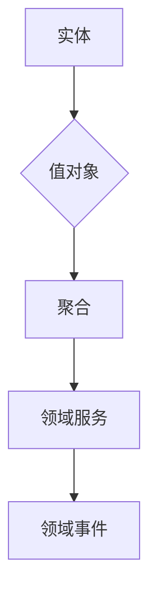
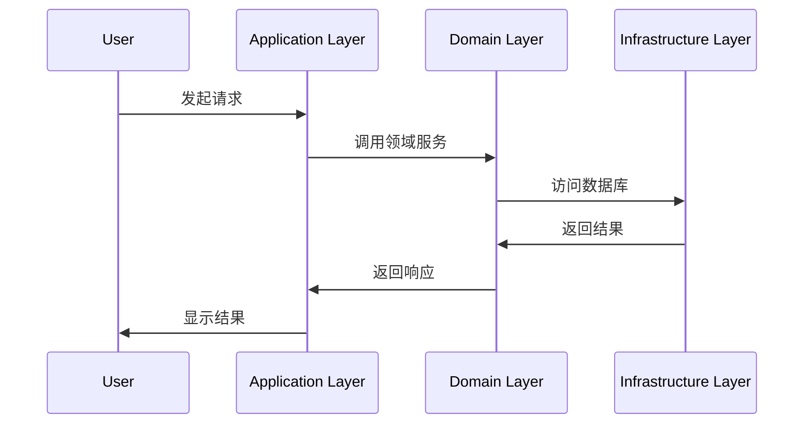
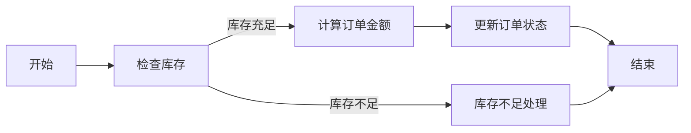

                 

### 第一部分：领域驱动设计概述

## 1.1 领域驱动设计的概念与起源

领域驱动设计（Domain-Driven Design，简称DDD）是一种面向复杂业务系统的软件开发方法。它强调领域模型的重要性，通过构建准确的领域模型来指导软件开发过程，从而提高软件的可维护性和扩展性。

DDD的概念最早由Eric Evans在2004年提出的，他的著作《领域驱动设计：软件核心复杂性应对策略》成为了DDD的权威指南。DDD的核心思想是将业务领域作为软件开发的中心，通过理解业务领域的复杂性和核心概念，将复杂的业务逻辑转化为清晰的软件模型。

### 1.1.1 领域驱动设计的定义

领域驱动设计的定义可以概括为：一种软件开发方法，它强调业务领域的重要性，通过构建精确的领域模型来指导软件开发，从而实现软件的高可维护性和高扩展性。

### 1.1.2 领域驱动设计的起源

DDD的起源可以追溯到20世纪90年代，当时软件工程师面临着越来越复杂的业务系统。传统的软件开发方法很难应对这种复杂性，导致软件系统的维护性和扩展性严重不足。Eric Evans在观察和反思这些问题的过程中，提出了DDD的概念。

### 1.1.3 领域驱动设计的核心思想

DDD的核心思想包括：

1. **领域模型**：将业务领域作为软件开发的中心，构建准确的领域模型来指导软件开发。

2. **Ubiquitous Language**：与业务专家合作，定义一种通用的语言，确保软件团队和业务团队之间的沟通无缝。

3. **分层架构**：将软件架构分为多个层次，如领域层、应用层、基础设施层等，以实现软件的高内聚和低耦合。

4. **事件驱动**：通过领域事件来驱动业务逻辑，从而实现系统的灵活性和可扩展性。

## 1.2 领域驱动设计与传统软件工程的区别

### 1.2.1 传统软件工程的方法

传统软件工程方法主要依赖于过程模型，如瀑布模型或迭代模型。这些方法强调流程的顺序性和阶段性，往往在需求分析阶段就试图定义出详尽的需求文档，然后在开发阶段严格按照文档执行。

### 1.2.2 领域驱动设计的优势

与传统的软件开发方法相比，DDD具有以下优势：

1. **更好的可维护性和扩展性**：通过构建精确的领域模型，可以更轻松地适应业务变化。

2. **更紧密的业务团队协作**：DDD强调与业务专家的紧密合作，通过定义通用的领域语言，减少沟通成本。

3. **更清晰的系统架构**：DDD通过分层架构，实现系统的高内聚和低耦合，提高系统的可维护性和扩展性。

### 1.2.3 领域驱动设计的应用领域

DDD特别适用于以下场景：

1. **复杂业务系统**：如金融、保险、物流等领域的业务系统，这些系统通常具有复杂的业务逻辑和多变的需求。

2. **需要长期维护和扩展的系统**：通过构建精确的领域模型，可以提高系统的可维护性和扩展性。

## 1.3 领域驱动设计中的核心概念

### 1.3.1 实体与值对象

#### 1.3.1.1 实体的特征

实体是具有唯一标识和持久性的对象。例如，客户、订单等都是实体。

实体具有以下特征：

1. **唯一标识**：每个实体都有唯一的标识，用于区分不同的实体实例。
2. **持久性**：实体在系统中具有持久性，即使外部环境发生变化，其实例也不会消失。

#### 1.3.1.2 值对象的特征

值对象是具有固定值的对象，例如日期、时间、价格等。

值对象具有以下特征：

1. **不可变**：值对象一旦创建，其值就不能修改。
2. **无唯一标识**：值对象通常没有唯一标识，因为它们只是固定值的代表。

### 1.3.2 聚合

聚合是实体和值对象的组合，用于表示业务领域中的一部分功能。聚合内的实体和值对象通过清晰的边界划分，确保了系统的高内聚和低耦合。

#### 1.3.2.1 聚合的定义

聚合是一组具有共同行为的对象集合，这些对象通过聚合边界进行隔离，确保了系统的清晰性和可维护性。

#### 1.3.2.2 聚合内的关系

聚合内的实体和值对象之间通常存在以下关系：

1. **包含关系**：一个实体可以包含其他实体或值对象。
2. **依赖关系**：实体或值对象可以依赖于其他实体或值对象。

### 1.3.3 领域服务

领域服务是执行领域逻辑的组件，用于处理跨聚合的复杂业务操作。

#### 1.3.3.1 领域服务的作用

领域服务的作用包括：

1. **跨聚合操作**：处理跨多个聚合的业务逻辑。
2. **业务规则的实现**：将业务规则编码到领域服务中，确保业务逻辑的一致性和正确性。

#### 1.3.3.2 领域服务的实现方式

领域服务可以通过以下方式实现：

1. **领域服务类**：使用面向对象的方式实现领域服务，将其封装在服务类中。
2. **领域服务接口**：定义领域服务的接口，确保服务的可重用性和可测试性。

### 1.3.4 领域事件

领域事件是系统中的重要信号，用于驱动业务逻辑的执行。

#### 1.3.4.1 领域事件的类型

领域事件通常分为以下几类：

1. **创建事件**：表示某个实体的创建。
2. **修改事件**：表示某个实体的修改。
3. **删除事件**：表示某个实体的删除。

#### 1.3.4.2 领域事件的处理

领域事件的处理通常涉及以下步骤：

1. **事件注册**：将领域事件注册到系统中。
2. **事件处理**：处理领域事件，执行相应的业务逻辑。
3. **事件发布**：将处理后的结果发布给其他系统或组件。

## 1.4 领域驱动设计的核心概念关系图

为了更好地理解DDD中的核心概念，我们可以使用Mermaid流程图来展示它们之间的关系。



在这个关系图中，实体和值对象是DDD中的基础概念，它们通过聚合组织在一起，领域服务处理跨聚合的业务逻辑，领域事件则用于驱动系统的运行。

## 1.5 本章小结

在本章中，我们介绍了领域驱动设计的基本概念、起源和核心思想。通过对比传统软件工程方法，我们了解了DDD的优势和应用领域。我们还详细阐述了DDD中的核心概念，包括实体、值对象、聚合、领域服务和领域事件。这些概念构成了领域驱动设计的基础，为后续章节的内容奠定了坚实的基础。在接下来的章节中，我们将进一步探讨如何应用领域驱动设计来提升P9工程师的业务架构能力。### 第一部分：领域驱动设计概述

## 1.6 DDD中的分层架构

在领域驱动设计中，分层架构是确保软件系统高内聚和低耦合的重要手段。DDD通常采用三层架构：领域层、应用层和基础设施层。每一层都有其特定的职责和关注点。

### 1.6.1 领域层

领域层是DDD中最核心的一层，它负责封装业务逻辑和核心领域模型。领域层的主要职责包括：

1. **领域模型**：构建和封装业务实体、值对象、聚合和领域服务，确保模型准确反映业务领域。
2. **领域逻辑**：实现业务规则和核心算法，确保业务逻辑的一致性和正确性。
3. **领域事件**：处理和响应领域事件，驱动业务流程的执行。

领域层关注业务领域的复杂性和核心逻辑，是最需要关注业务需求的层次。

### 1.6.2 应用层

应用层负责将领域层的业务逻辑应用到具体的用户场景中。它通常包含以下职责：

1. **用户界面**：处理用户的输入和输出，提供用户界面。
2. **应用服务**：将领域层的业务逻辑应用于特定的用户场景，如订单处理、用户管理等。
3. **命令和查询**：处理用户命令和查询请求，将请求转换为领域层的服务调用。

应用层关注的是如何将领域层的业务逻辑应用到具体的用户需求中，确保用户体验和功能的一致性。

### 1.6.3 基础设施层

基础设施层负责提供系统运行所需的底层基础设施支持，如数据库、网络、存储等。它通常包含以下职责：

1. **数据访问**：提供数据访问接口，如数据库连接、数据持久化等。
2. **外部系统集成**：与其他系统进行集成，如支付系统、第三方服务等。
3. **日志和监控**：提供日志记录和系统监控功能，确保系统的稳定性和可维护性。

基础设施层关注的是系统的稳定性和可维护性，确保系统能够高效、稳定地运行。

### 1.6.4 三层架构之间的关系

领域层、应用层和基础设施层之间通过清晰的接口进行交互。每一层都只关心自己的职责范围，通过接口与其他层进行通信。这种分层架构不仅提高了系统的可维护性和扩展性，还有助于团队分工和协作。

1. **领域层与应用层**：应用层通过命令和查询接口调用领域层的服务，实现业务逻辑。
2. **应用层与基础设施层**：应用层通过基础设施层提供的数据访问接口进行数据持久化。

### 1.6.5 领域驱动设计中的分层架构实例

为了更好地理解分层架构，我们可以通过一个简单的实例来展示。

假设我们正在开发一个在线书店系统，以下是该系统的分层架构：

1. **领域层**：包含图书实体、用户实体、订单聚合等。领域层负责实现业务逻辑，如订单处理、库存管理。
2. **应用层**：包含用户界面、应用服务。应用服务负责处理用户请求，如添加图书、创建订单。
3. **基础设施层**：包含数据库连接、第三方支付集成等。基础设施层负责数据存储和外部系统集成。

通过这样的分层架构，我们可以确保系统的各个部分职责清晰，便于维护和扩展。

## 1.7 本章小结

在本章中，我们详细介绍了领域驱动设计中的分层架构，包括领域层、应用层和基础设施层的职责和关系。通过分层架构，我们可以确保系统的高内聚和低耦合，提高系统的可维护性和扩展性。在接下来的章节中，我们将继续探讨领域驱动设计中的核心概念和实际应用，帮助P9工程师提升业务架构能力。### 第一部分：领域驱动设计概述

## 1.8 实际案例中的应用

为了更好地理解领域驱动设计（DDD）在实际项目中的应用，我们将通过一个虚构的电商项目来分析DDD的应用过程和效果。

### 1.8.1 项目背景

假设我们正在开发一个名为“电商王国”的电商平台，这个平台需要处理商品展示、购物车、订单管理、用户评论等一系列复杂的业务场景。项目需求多变，业务规则复杂，需要具备高可维护性和高扩展性。

### 1.8.2 领域模型设计

在项目开始阶段，我们首先需要与业务专家一起构建领域模型。领域模型包括以下关键概念：

1. **商品（Product）**：商品是电商平台的核心实体，具有唯一的标识、名称、价格、库存数量等属性。
2. **订单（Order）**：订单表示用户购买商品的过程，包括订单号、用户、商品列表、订单状态等。
3. **购物车（ShoppingCart）**：购物车用于存放用户选购的商品，具有唯一标识、用户、商品列表等属性。
4. **用户（User）**：用户是电商平台的主要参与者，具有用户名、密码、地址等属性。

我们使用Mermaid类图来展示这些领域模型之间的关系：

```mermaid
classDiagram
    Product <|-- ShoppingCart
    Order <<-- User
    Product {唯一标识, 名称, 价格, 库存数量}
    ShoppingCart {唯一标识, 用户, 商品列表}
    Order {订单号, 用户, 商品列表, 订单状态}
    User {用户名, 密码, 地址}
```

### 1.8.3 领域服务设计

在构建了领域模型之后，我们需要设计领域服务来处理跨聚合的业务逻辑。例如：

1. **订单服务（OrderService）**：负责创建订单、取消订单、更新订单状态等。
2. **购物车服务（ShoppingCartService）**：负责添加商品到购物车、从购物车中删除商品等。
3. **库存服务（InventoryService）**：负责更新商品库存、检查商品库存状态等。

领域服务通常通过接口定义，以实现服务的高内聚和低耦合。例如：

```python
class OrderService:
    def create_order(self, user, product_list):
        # 创建订单的逻辑
        pass
    
    def cancel_order(self, order_id):
        # 取消订单的逻辑
        pass
    
    def update_order_status(self, order_id, status):
        # 更新订单状态的逻辑
        pass

class ShoppingCartService:
    def add_product_to_cart(self, user, product):
        # 添加商品到购物车的逻辑
        pass
    
    def remove_product_from_cart(self, user, product):
        # 从购物车中删除商品的逻辑
        pass

class InventoryService:
    def update_inventory(self, product, quantity):
        # 更新库存的逻辑
        pass
    
    def check_inventory_status(self, product):
        # 检查库存状态的逻辑
        pass
```

### 1.8.4 系统架构设计

在确定了领域模型和领域服务之后，我们需要进行系统架构设计。系统架构设计包括类图、架构图和序列图等，以展示系统的整体结构和功能。

1. **类图**：展示系统中的类及其之间的关系，如实体类、服务类等。
2. **架构图**：展示系统的分层架构，包括领域层、应用层和基础设施层等。
3. **序列图**：展示系统组件之间的交互顺序，如用户请求、服务调用、响应等。

以下是一个简单的系统架构图，使用Mermaid来展示：



### 1.8.5 项目效果分析

通过领域驱动设计，电商王国项目实现了以下效果：

1. **高可维护性和高扩展性**：领域模型的清晰定义和领域服务的合理划分，使得系统的维护和扩展更加容易。
2. **业务规则的清晰体现**：业务规则被编码到领域服务中，确保了业务逻辑的一致性和正确性。
3. **降低沟通成本**：通过构建Ubiquitous Language，业务团队和技术团队之间的沟通变得更加顺畅。

### 1.8.6 总结

通过实际案例的分析，我们可以看到领域驱动设计在项目中的应用不仅提高了系统的可维护性和扩展性，还确保了业务规则的一致性。在接下来的章节中，我们将进一步探讨如何通过领域驱动设计提升P9工程师的业务架构能力。### 第二部分：领域驱动设计应用

## 2.1 系统分析与设计

系统分析与设计是领域驱动设计（DDD）应用过程中的关键环节。在这一部分，我们将详细探讨如何通过领域驱动设计来进行系统分析与设计，包括系统分析的过程、领域模型设计、系统架构设计等。

### 2.1.1 系统分析的过程

系统分析是软件开发的第一步，它旨在理解业务需求和系统功能。在领域驱动设计中，系统分析的过程包括以下步骤：

#### 2.1.1.1 需求分析

需求分析是系统分析的核心，它旨在明确系统需要实现的功能和业务规则。需求分析可以通过以下方法进行：

1. **用户访谈**：与业务专家和用户进行交流，了解他们的需求和使用场景。
2. **需求文档**：编写详细的需求文档，记录业务需求、功能需求和非功能需求。
3. **用例图**：使用用例图（Use Case Diagram）来描述系统的功能和用户交互。

以下是一个简单的用例图示例，展示一个电商平台的用户和系统之间的交互：

```mermaid
usecaseDiagram
    User <<actor>>
    "查看商品" as SearchProduct
    "添加商品到购物车" as AddToCart
    "提交订单" as CreateOrder
    "支付订单" as PayOrder
    "查看订单状态" as CheckOrderStatus
    User ->> SearchProduct
    User ->> AddToCart
    User ->> CreateOrder
    User ->> PayOrder
    User ->> CheckOrderStatus
```

#### 2.1.1.2 功能设计

在需求分析的基础上，进行功能设计。功能设计旨在确定系统需要实现的具体功能，以及这些功能之间的关系。功能设计可以通过以下方法进行：

1. **功能模块划分**：将系统划分为多个功能模块，如用户管理、商品管理、订单管理等。
2. **功能流程图**：使用功能流程图（Function Flow Diagram）来描述系统功能的执行流程。
3. **任务分解**：将每个功能模块进一步分解为具体的任务和子任务。

以下是一个简单的功能流程图示例，展示用户在电商平台中浏览商品、添加商品到购物车、提交订单的过程：

```mermaid
functionDiagram
    init[开始] --> search[搜索商品]
    search --> found[找到商品]
    found --> addCart[添加商品到购物车]
    addCart --> cart[查看购物车]
    cart --> checkout[提交订单]
    checkout --> paid[支付订单]
    paid --> finish[完成]
```

### 2.1.2 领域模型设计

领域模型设计是领域驱动设计的核心步骤，它旨在构建准确反映业务领域的模型。领域模型设计包括以下内容：

#### 2.1.2.1 类图设计

类图是领域模型设计的主要工具，它用于描述系统中的类、属性和方法，以及类之间的关系。以下是一个简单的类图示例，展示电商平台中的主要类：

```mermaid
classDiagram
    User <<entity>> {用户名, 密码, 地址}
    Product <<entity>> {产品ID, 名称, 价格, 库存}
    ShoppingCart <<entity>> {购物车ID, 用户}
    Order <<entity>> {订单ID, 用户, 订单状态}
    Product --> ShoppingCart : 包含
    ShoppingCart --> User : 属于
    Order --> User : 属于
    Order --> Product : 包含
```

#### 2.1.2.2 实体与值对象的识别

在领域模型设计过程中，我们需要区分实体（Entity）和值对象（Value Object）。实体具有唯一标识，而值对象不具有唯一标识。以下是一个简单的示例，展示实体和值对象：

```mermaid
classDiagram
    Customer <<entity>> {ID, Name, Address}
    PhoneNumber <<valueObject>> {Number}
    CustomerAddress <<valueObject>> {Street, City, Zip}
    Customer -> PhoneNumber : 拥有
    Customer -> CustomerAddress : 拥有
```

### 2.1.3 系统架构设计

在完成领域模型设计后，我们需要进行系统架构设计。系统架构设计包括确定系统的分层结构、组件之间的关系和接口设计等。

#### 2.1.3.1 系统架构图

系统架构图是系统架构设计的主要工具，它用于描述系统的整体结构和组件之间的关系。以下是一个简单的系统架构图示例：

```mermaid
sequenceDiagram
    User <<actor>>
    User ->> Application Layer: 发起请求
    Application Layer ->> Domain Layer: 调用领域服务
    Domain Layer ->> Infrastructure Layer: 访问数据库
    Infrastructure Layer ->> Domain Layer: 返回结果
    Domain Layer ->> Application Layer: 返回响应
    Application Layer ->> User: 显示结果
```

#### 2.1.3.2 系统接口设计

系统接口设计是系统架构设计的重要组成部分，它用于定义系统组件之间的交互接口。以下是一个简单的接口设计示例：

```python
class IProductRepository:
    def get_product(self, product_id: int) -> Product:
        pass
    
    def save_product(self, product: Product):
        pass

class IShoppingCartRepository:
    def get_shopping_cart(self, cart_id: int) -> ShoppingCart:
        pass
    
    def save_shopping_cart(self, cart: ShoppingCart):
        pass

class IOrderRepository:
    def get_order(self, order_id: int) -> Order:
        pass
    
    def save_order(self, order: Order):
        pass
```

### 2.1.4 本章小结

在本章中，我们详细介绍了领域驱动设计中的系统分析与设计过程，包括需求分析、功能设计、领域模型设计和系统架构设计。通过这些步骤，我们可以构建一个清晰、准确的领域模型，并设计一个高效、可维护的系统架构。在接下来的章节中，我们将进一步探讨领域驱动设计中的算法原理和项目实战，帮助读者更好地理解和应用领域驱动设计。### 第二部分：领域驱动设计应用

## 2.2 领域驱动设计的算法原理讲解

领域驱动设计（DDD）不仅仅是关于软件架构和系统设计的理论，它还涉及对业务算法的深入理解和应用。在DDD中，算法通常用于实现领域模型中的业务逻辑，确保系统能够正确、高效地处理复杂的业务场景。在这一节中，我们将通过一个实际案例来讲解DDD中的算法原理。

### 2.2.1 订单处理算法

假设我们正在开发一个电商平台，其中订单处理是一个核心功能。订单处理算法需要确保以下业务规则：

1. 用户下单时，订单金额需要计算准确。
2. 商品库存需要实时更新，确保库存充足时才能下单。
3. 订单状态需要根据业务操作进行实时更新。

#### 2.2.1.1 算法流程图

为了清晰展示订单处理算法的执行流程，我们可以使用Mermaid流程图来描述。以下是一个简单的算法流程图：



#### 2.2.1.2 数学模型

在订单处理算法中，我们需要计算订单金额。订单金额的计算公式如下：

\[ 总金额 = 单价 \times 数量 \]

其中，单价和数量是商品的属性。为了更直观地理解这个公式，我们可以使用LaTeX公式进行表示：

\[ 总金额 = p \times q \]

其中，\( p \) 表示单价，\( q \) 表示数量。

#### 2.2.1.3 Python代码实现

下面是一个简单的Python代码实现，用于计算订单金额和更新库存：

```python
class Product:
    def __init__(self, product_id, name, price, quantity):
        self.product_id = product_id
        self.name = name
        self.price = price
        self.quantity = quantity

def calculate_order_amount(products):
    total_amount = 0
    for product in products:
        total_amount += product.price * product.quantity
    return total_amount

def update_inventory(product, quantity):
    if product.quantity >= quantity:
        product.quantity -= quantity
        return True
    else:
        return False

# 示例使用
product = Product(1, 'iPhone 13', 799, 10)
print("初始库存：", product.quantity)

# 订单信息
order_products = [
    Product(1, 'iPhone 13', 799, 2)
]

# 计算订单金额
order_amount = calculate_order_amount(order_products)
print("订单金额：", order_amount)

# 更新库存
if update_inventory(product, 2):
    print("库存更新成功：", product.quantity)
else:
    print("库存不足，无法下单")
```

在这个示例中，我们定义了`Product`类，用于表示商品，并实现了`calculate_order_amount`函数和`update_inventory`函数，分别用于计算订单金额和更新库存。

#### 2.2.1.4 算法举例说明

假设用户想要购买两台iPhone 13，单价为799元，库存数量为10台。订单处理算法的执行过程如下：

1. 检查库存：调用`update_inventory`函数，传入商品和购买数量，检查库存是否充足。
2. 计算订单金额：调用`calculate_order_amount`函数，计算订单的总金额。
3. 更新订单状态：根据库存检查结果，更新订单的状态（如“已支付”、“已发货”等）。

这个简单的示例展示了如何在领域驱动设计中应用算法，确保业务逻辑的正确性和高效性。

### 2.2.2 本章小结

在本节中，我们通过一个订单处理算法的案例，详细讲解了领域驱动设计中的算法原理。我们使用了Mermaid流程图、LaTeX公式和Python代码，逐步展示了算法的设计和实现过程。通过这个案例，我们可以看到如何将业务规则编码到算法中，确保系统的高效性和可靠性。在接下来的章节中，我们将继续探讨领域驱动设计在实际项目中的应用，以及如何通过领域驱动设计提升业务架构能力。### 第二部分：领域驱动设计应用

## 2.3 项目实战

为了更好地理解领域驱动设计（DDD）在实际项目中的应用，我们将通过一个实际的项目案例来详细展示如何使用DDD进行系统开发。这个项目是一个在线书店系统，涵盖了用户管理、图书管理、订单处理、购物车等功能。以下是我们将展示的关键步骤：

### 2.3.1 项目介绍

#### 项目背景

“在线书店”项目旨在为用户提供一个便捷的在线购买图书的平台。用户可以浏览图书、添加图书到购物车、下单购买、查看订单状态等。这个项目需要支持多种支付方式、库存管理、订单跟踪等复杂业务逻辑。

#### 技术栈

- **编程语言**：Python
- **框架**：Django（用于后端开发）
- **数据库**：PostgreSQL（用于数据存储）
- **前端技术**：HTML、CSS、JavaScript（Vue.js）

### 2.3.2 系统核心实现

#### 用户管理

用户管理是任何在线系统的基础，包括用户的注册、登录、个人信息管理等功能。以下是用户管理模块的核心实现：

```python
# 用户注册
def register_user(username, password, email):
    user = User.objects.create_user(username=username, password=password, email=email)
    return user

# 用户登录
from django.contrib.auth import authenticate

def login_user(username, password):
    user = authenticate(username=username, password=password)
    return user

# 用户信息更新
def update_user_profile(user, new_data):
    user.first_name = new_data.get('first_name', user.first_name)
    user.last_name = new_data.get('last_name', user.last_name)
    user.email = new_data.get('email', user.email)
    user.save()
```

#### 图书管理

图书管理模块负责处理图书的增删改查操作。以下是图书管理模块的核心实现：

```python
# 添加图书
def add_book(title, author, price, stock):
    book = Book.objects.create(title=title, author=author, price=price, stock=stock)
    return book

# 删除图书
def delete_book(book_id):
    book = Book.objects.get(id=book_id)
    book.delete()

# 更新图书信息
def update_book(book_id, data):
    book = Book.objects.get(id=book_id)
    book.title = data.get('title', book.title)
    book.author = data.get('author', book.author)
    book.price = data.get('price', book.price)
    book.stock = data.get('stock', book.stock)
    book.save()
```

#### 订单处理

订单处理模块是系统的核心功能之一，负责处理用户下单、订单状态更新等操作。以下是订单处理模块的核心实现：

```python
# 创建订单
def create_order(user, cart_items):
    order = Order.objects.create(user=user)
    for item in cart_items:
        order_item = OrderItem.objects.create(order=order, book=item['book'], quantity=item['quantity'])
        # 更新库存
        item['book'].stock -= item['quantity']
        item['book'].save()
    return order

# 更新订单状态
def update_order_status(order_id, status):
    order = Order.objects.get(id=order_id)
    order.status = status
    order.save()
```

#### 购物车

购物车模块用于管理用户选购的图书，以下是购物车模块的核心实现：

```python
# 添加商品到购物车
def add_to_cart(user, book, quantity):
    cart_item = CartItem.objects.create(user=user, book=book, quantity=quantity)

# 删除购物车商品
def remove_from_cart(cart_item_id):
    cart_item = CartItem.objects.get(id=cart_item_id)
    cart_item.delete()

# 更新购物车商品数量
def update_cart_item_quantity(cart_item_id, quantity):
    cart_item = CartItem.objects.get(id=cart_item_id)
    cart_item.quantity = quantity
    cart_item.save()
```

### 2.3.3 代码应用解读与分析

#### 用户管理

用户管理模块实现了用户注册、登录和更新用户信息的功能。用户注册时，通过`create_user`方法创建用户，并设置用户名、密码和电子邮件。用户登录时，使用`authenticate`方法验证用户名和密码。更新用户信息时，通过获取用户对象并更新其属性，然后保存更改。

#### 图书管理

图书管理模块实现了图书的添加、删除和更新功能。添加图书时，通过`create_book`方法创建图书对象，并设置图书的标题、作者、价格和库存。删除图书时，通过`delete_book`方法删除图书对象。更新图书信息时，通过`update_book`方法获取图书对象，并更新其属性。

#### 订单处理

订单处理模块实现了创建订单和更新订单状态的功能。创建订单时，首先创建订单对象，然后遍历购物车中的商品，创建订单项对象，并更新库存。更新订单状态时，通过获取订单对象并更新其状态。

#### 购物车

购物车模块实现了添加商品到购物车、删除购物车商品和更新购物车商品数量的功能。添加商品到购物车时，通过`create_cart_item`方法创建购物车项对象。删除购物车商品时，通过`delete_cart_item`方法删除购物车项对象。更新购物车商品数量时，通过`update_cart_item_quantity`方法更新购物车项对象的数量。

### 2.3.4 实际案例分析

在这个实际案例中，我们通过领域驱动设计方法构建了在线书店系统的核心功能模块。通过用户管理、图书管理、订单处理和购物车等模块的实现，我们可以看到如何将业务逻辑转化为清晰的代码结构，并确保系统的高可维护性和高扩展性。

用户管理模块保证了用户数据的安全和一致性，图书管理模块确保了图书信息的准确性和可维护性，订单处理模块实现了订单管理的核心功能，购物车模块则提供了便捷的购物体验。通过这些模块的协同工作，我们可以构建一个功能完善、用户友好的在线书店系统。

### 2.3.5 项目小结

通过这个实际案例，我们可以看到领域驱动设计（DDD）在实际项目中的应用效果。DDD帮助我们将复杂的业务逻辑转化为清晰的代码结构，提高了系统的可维护性和扩展性。在接下来的章节中，我们将进一步探讨如何通过领域驱动设计提升业务架构能力，帮助P9工程师在复杂项目中更好地应用DDD。### 第二部分：领域驱动设计应用

## 2.4 最佳实践 tips

在领域驱动设计（DDD）的实际应用中，有一些最佳实践可以帮助我们更好地实现领域模型，提升系统架构的质量。以下是一些实用的技巧和注意事项：

### 2.4.1 领域模型设计最佳实践

1. **清晰定义领域边界**：确保领域模型能够清晰划分，明确各聚合的职责和边界。
2. **避免贫血模型**：在设计领域模型时，要避免将所有业务逻辑都放在基础设施层，导致领域模型变得贫血。
3. **合理划分实体和值对象**：明确识别实体和值对象，确保实体具有唯一标识，而值对象具有不变性。
4. **使用聚合来组织领域对象**：通过聚合来组织实体和值对象，确保系统的内聚性。
5. **定义清晰的领域服务**：领域服务应该专注于业务逻辑的处理，避免与服务无关的代码。

### 2.4.2 领域驱动设计中的常见误区

1. **过度设计**：在领域模型设计过程中，避免过度设计，确保模型能够准确反映业务需求。
2. **忽略领域事件**：领域事件在DDD中扮演重要角色，不要忽视它们在系统中的作用。
3. **未能紧密协作**：DDD强调业务团队和技术团队的紧密合作，忽略这一点可能会导致模型不准确。
4. **忽视系统架构**：在实现领域模型时，不要忽视系统架构的设计，确保模型能够平滑地映射到实际系统中。

### 2.4.3 领域驱动设计的持续改进

1. **定期回顾与优化**：定期回顾领域模型和系统设计，发现并解决潜在的问题。
2. **实践迭代开发**：通过迭代开发，逐步完善领域模型和系统功能。
3. **技术选型更新**：根据项目需求和团队技术能力，及时更新技术栈和工具。
4. **团队成员培训**：定期为团队成员提供DDD相关的培训，提升团队的整体能力。

### 2.4.4 拓展阅读

- **《领域驱动设计：软件核心复杂性应对策略》**：Eric Evans著，DDD的权威指南，详细介绍了DDD的理论和实践。
- **《领域驱动设计精粹》**：Eric Evans和域驱动设计实践者联盟著，总结了DDD的核心概念和实践方法。
- **《领域驱动设计实战》**：拉尔夫·海森堡（Ralph J. Hasser）著，通过实例详细讲解了DDD的应用。

通过遵循这些最佳实践，我们可以在领域驱动设计的实际应用中避免常见误区，持续提升系统的质量和团队的能力。在接下来的章节中，我们将进一步探讨如何通过领域驱动设计提升业务架构能力，帮助P9工程师在复杂项目中发挥更大的作用。### 第三部分：业务架构能力提升

## 3.1 业务架构能力的重要性

在当今快速变化和高竞争的商业环境中，业务架构能力的重要性日益凸显。业务架构（Business Architecture）是指企业通过定义业务目标和价值流，构建业务能力的过程。它关注如何将企业的战略目标转化为实际的操作流程和系统架构，从而实现业务目标的最大化。

### 3.1.1 业务架构的定义

业务架构是一种框架，用于描述企业的业务领域、业务流程、业务规则和业务组织。它包括以下几个方面：

1. **业务领域**：定义企业的主要业务领域，如销售、生产、客户服务、财务等。
2. **业务流程**：描述业务流程和操作过程，包括业务活动的执行顺序、输入和输出。
3. **业务规则**：定义业务操作中的规则和决策逻辑，确保业务流程的一致性和正确性。
4. **业务组织**：描述企业的组织结构，包括各部门的职责、角色和权限。

### 3.1.2 业务架构在软件工程中的角色

在软件工程中，业务架构扮演着关键角色，它影响软件的设计、开发、测试和维护。具体来说，业务架构在软件工程中的角色包括：

1. **指导软件开发方向**：业务架构为软件开发提供了明确的业务目标和方向，确保软件开发与企业的战略目标一致。
2. **提升系统可维护性**：通过定义清晰的业务流程和业务规则，业务架构有助于提高系统的可维护性，降低维护成本。
3. **优化系统性能**：通过优化业务流程和系统架构，业务架构有助于提升系统的性能和响应速度。
4. **促进团队协作**：业务架构提供了一个统一的框架，有助于团队之间更好地协作，减少沟通成本和误解。

### 3.1.3 提升业务架构能力的方法

为了提升业务架构能力，我们可以采取以下方法：

1. **加强业务与技术团队的协作**：业务团队和技术团队需要紧密合作，确保业务需求能够准确转化为技术实现。
2. **建立完善的业务流程和规则文档**：通过建立详细的业务流程和规则文档，有助于团队更好地理解和执行业务逻辑。
3. **定期培训和知识分享**：通过定期培训和知识分享，提升团队成员的业务知识和架构设计能力。
4. **实践迭代开发和持续改进**：通过迭代开发和持续改进，逐步完善业务架构和系统设计，适应业务变化和需求。

### 3.1.4 业务架构能力与P9工程师的关系

P9工程师是公司中的高级技术专家，他们负责复杂项目的架构设计和实施。业务架构能力对于P9工程师至关重要，因为：

1. **提升项目成功几率**：具备业务架构能力的P9工程师能够更好地理解业务需求，设计出满足业务需求的系统架构，从而提高项目的成功率。
2. **增强系统可扩展性**：通过业务架构的设计，P9工程师能够构建出灵活、可扩展的系统架构，确保系统能够适应未来的业务变化。
3. **提升团队领导力**：业务架构能力有助于P9工程师在团队中发挥领导作用，指导和带领团队完成复杂项目。
4. **提升职业发展**：具备业务架构能力的P9工程师在职业发展上更具竞争力，能够在更高的职位上承担更多的责任。

总之，提升业务架构能力对于P9工程师而言具有重要意义，它不仅能够提升个人能力，还能够为团队和公司创造更大的价值。在接下来的章节中，我们将进一步探讨领域驱动设计（DDD）如何支持业务架构能力的提升。### 第三部分：业务架构能力提升

## 3.2 领域驱动设计与业务架构的关系

领域驱动设计（DDD）与业务架构之间存在着紧密的联系。DDD提供了一种系统化的方法来构建和维护复杂的业务系统，而业务架构则为这些系统提供了战略层面的指导。在这一节中，我们将探讨DDD如何支持业务架构，以及业务架构如何优化DDD的设计。

### 3.2.1 领域驱动设计如何支持业务架构

1. **构建清晰的业务领域模型**：DDD的核心思想是通过构建准确的领域模型来反映业务领域的复杂性。业务架构师可以利用DDD中的领域模型来定义企业的核心业务领域和业务流程，确保系统设计符合业务需求。

2. **增强业务逻辑的一致性**：DDD强调使用Ubiquitous Language（通用语言）来沟通和定义业务逻辑。这种语言不仅帮助开发团队理解业务需求，还能够确保业务逻辑在不同系统组件中的一致性，从而支持业务架构的一致性要求。

3. **促进业务与技术的协同**：DDD通过其分层架构（领域层、应用层、基础设施层）提供了一种清晰的方法来组织业务逻辑和技术实现。这种分离有助于业务团队和技术团队之间的协作，确保系统设计能够支持业务架构的目标。

4. **提高系统的可维护性和扩展性**：DDD的分层架构和领域服务的使用有助于创建高内聚、低耦合的系统组件。这种设计能够提高系统的可维护性和扩展性，使得业务架构能够在不断变化的市场环境中保持灵活和有效。

### 3.2.2 业务架构如何优化领域驱动设计

1. **明确业务战略目标**：业务架构需要首先明确企业的战略目标，这些目标将指导DDD的领域模型设计。通过理解业务战略，架构师可以确保领域模型能够支持企业长期的发展目标。

2. **定义业务流程和规则**：在DDD中，业务流程和规则通常在领域模型中得到体现。业务架构师可以定义详细的业务流程和规则文档，为DDD的设计提供明确的指导，确保领域模型能够准确地反映业务需求。

3. **优化领域模型结构**：业务架构师可以通过分析业务流程和规则来优化领域模型的结构。例如，通过合并或拆分聚合，提高领域模型的内聚性，或通过调整领域服务的边界，提高系统的可维护性。

4. **确保系统与业务战略的同步**：业务架构需要定期评估系统与业务战略的同步性。如果业务战略发生变化，领域模型和DDD设计也需要相应调整，以保持系统与业务的匹配。

### 3.2.3 领域驱动设计与业务架构的协同案例

以一个在线金融服务平台为例，该平台需要支持多种金融产品（如股票、债券、基金等）的交易、管理和报告。以下是领域驱动设计如何与业务架构协同工作的案例：

1. **业务战略目标**：平台的主要目标是为客户提供便捷的金融产品交易服务，同时确保交易的安全性和合规性。

2. **业务流程和规则**：业务架构师定义了交易流程、风险管理流程和合规性检查流程。这些流程指导了领域模型的设计，确保交易流程中的每个环节都符合业务规则。

3. **领域模型设计**：基于业务流程和规则，领域模型被设计为包含交易聚合、客户聚合、产品聚合等。每个聚合都有明确的边界，确保系统的内聚性和低耦合性。

4. **领域服务和接口**：领域服务被设计来处理跨聚合的业务逻辑，如交易确认、订单管理、风险监控等。这些服务通过清晰的接口与业务架构中的其他系统（如支付系统、合规性检查系统）进行交互。

5. **业务架构与DDD的协同**：业务架构师和DDD架构师紧密合作，确保领域模型和业务流程的同步。他们定期评估系统设计，确保能够支持平台的长期发展战略。

通过这个案例，我们可以看到领域驱动设计和业务架构是如何相互支持、协同工作的。业务架构提供了战略层面的指导，而DDD提供了实现层面的方法，两者结合使得系统能够高效、灵活地适应业务需求的变化。

### 3.2.4 本章小结

在本章中，我们探讨了领域驱动设计（DDD）与业务架构之间的关系。DDD通过构建准确的领域模型和清晰的分层架构，支持业务架构的实现，提高系统的可维护性和扩展性。而业务架构则通过定义业务战略、流程和规则，为DDD提供明确的指导。通过两者协同工作，我们可以构建出既符合业务需求又具有高技术质量的复杂业务系统。在接下来的章节中，我们将继续探讨如何通过领域驱动设计和业务架构来提升P9工程师的业务架构能力。### 第三部分：业务架构能力提升

## 3.3 领域驱动设计与业务架构能力的提升

领域驱动设计（DDD）作为一种系统化方法，不仅提供了构建复杂业务系统的框架，还显著提升了工程师的业务架构能力。在这一节中，我们将深入探讨DDD如何帮助P9工程师提升业务架构能力，以及如何在实际项目中应用DDD来优化业务架构。

### 3.3.1 DDD如何提升业务架构能力

1. **深化业务理解**：DDD强调与业务专家的紧密合作，通过构建精确的领域模型，工程师可以更深入地理解业务逻辑和业务流程，从而提升对业务的理解和洞察力。

2. **增强系统设计能力**：DDD的分层架构（领域层、应用层、基础设施层）提供了一个清晰的框架，使工程师能够更好地组织和管理复杂的系统设计，提高系统的可维护性和扩展性。

3. **提高系统适应能力**：通过DDD的领域事件和领域服务，系统能够更加灵活地应对业务变化。工程师可以设计出具有高适应性的系统，确保系统能够长期稳定运行。

4. **优化团队协作**：DDD通过定义清晰的领域模型和分层架构，有助于团队之间的协作和沟通。工程师可以更加专注于各自的职责，从而提高团队的效率和质量。

### 3.3.2 实际项目中应用DDD优化业务架构

以下是一个在线支付系统的实际项目案例，展示了如何通过DDD来优化业务架构：

#### 项目背景

一个大型电商平台需要构建一个在线支付系统，支持多种支付方式（如信用卡、支付宝、微信支付等），同时要确保交易的安全性和高并发处理能力。

#### 领域模型设计

1. **支付聚合**：支付聚合包含了支付相关的所有领域模型，如交易、支付方式、支付状态等。支付聚合定义了支付流程的核心逻辑。
   
   ```mermaid
   classDiagram
       Payment <<entity>> {paymentId, amount, paymentMethod, paymentStatus}
       PaymentMethod <<entity>> {methodId, methodName}
       PaymentStatus <<entity>> {statusId, statusName}
       Payment --> PaymentMethod : 使用
       Payment --> PaymentStatus : 状态
   ```

2. **交易聚合**：交易聚合包含了交易相关的实体和领域服务，如订单、交易记录等。交易聚合负责处理订单创建、支付确认、退款等交易流程。

   ```mermaid
   classDiagram
       Order <<entity>> {orderId, orderItems, orderStatus}
       Transaction <<entity>> {transactionId, orderId, paymentId, transactionStatus}
       Order --> Transaction : 创建
   ```

3. **领域服务**：领域服务负责处理跨聚合的业务逻辑，如支付确认、退款处理等。领域服务通过清晰的接口与领域模型交互。

   ```python
   class PaymentService:
       def confirm_payment(self, payment_id):
           # 支付确认逻辑
           pass
       
       def process_refund(self, payment_id):
           # 退款处理逻辑
           pass
   ```

#### 系统架构设计

1. **领域层**：领域层包含了所有领域模型和领域服务，如支付聚合和交易聚合。领域层负责封装业务逻辑，确保系统的内聚性。

2. **应用层**：应用层负责处理用户请求，调用领域层的服务，并返回响应。应用层通过RESTful API与外部系统进行交互。

3. **基础设施层**：基础设施层提供了系统运行所需的底层支持，如数据库、缓存、消息队列等。基础设施层确保系统的高性能和高可用性。

#### 项目效果分析

通过DDD的应用，在线支付系统实现了以下效果：

1. **业务逻辑清晰**：通过领域模型和领域服务，业务逻辑被清晰地组织和封装，提高了系统的可维护性和扩展性。

2. **高并发处理能力**：通过优化系统架构和数据库设计，系统能够处理高并发的支付请求，确保交易的安全性和可靠性。

3. **良好的团队协作**：DDD的分层架构和明确的职责划分，有助于团队之间的协作和沟通，提高了团队的工作效率。

### 3.3.3 提升P9工程师业务架构能力的建议

1. **深入学习DDD**：P9工程师应该深入学习DDD的理论和实践，掌握DDD的核心概念和方法，提升对复杂业务系统的设计能力。

2. **实践项目应用**：通过实际项目应用DDD，工程师可以将理论知识转化为实践经验，提升业务架构能力。

3. **持续学习和改进**：业务架构是一个不断发展的领域，P9工程师应该持续学习新技术和新方法，不断改进业务架构设计。

4. **团队协作和知识共享**：通过团队协作和知识共享，工程师可以共同提升业务架构能力，为公司的业务发展提供有力支持。

### 3.3.4 本章小结

在本章中，我们探讨了领域驱动设计（DDD）如何提升P9工程师的业务架构能力。通过DDD的应用，工程师可以更深入地理解业务逻辑，优化系统架构，提升系统的可维护性和扩展性。在实际项目中，工程师应该结合DDD的理论，不断实践和改进，提升自己的业务架构能力，为公司的业务发展做出贡献。在下一章中，我们将继续探讨如何通过DDD提升业务架构能力，帮助P9工程师应对复杂的业务挑战。### 第三部分：业务架构能力提升

## 3.4 领域驱动设计在业务架构能力提升中的应用案例

为了更好地理解领域驱动设计（DDD）在提升业务架构能力中的实际应用，我们将通过两个具体的业务场景案例来详细分析DDD的实施过程和效果。

### 案例一：在线票务平台

#### 项目背景

一个在线票务平台需要支持电影票、演唱会票、体育赛事票等多种票务类型的在线销售。该平台需要处理高并发的用户请求，同时保证票务数据的准确性和一致性。

#### DDD实施过程

1. **领域模型设计**：首先，团队与业务专家紧密合作，明确了业务领域中的关键概念，如订单、票务、座位、用户等。

   ```mermaid
   classDiagram
       Order <<entity>> {orderId, buyer, tickets, orderStatus}
       Ticket <<entity>> {ticketId, eventId, seatNumber, ticketStatus}
       User <<entity>> {userId, name, email}
       Event <<entity>> {eventId, eventName, venue, eventDate}
   ```

2. **领域服务设计**：针对票务平台的核心业务逻辑，团队设计了多个领域服务，如订单服务、票务服务、座位服务、支付服务等。

   ```python
   class OrderService:
       def create_order(self, user, event, tickets):
           # 创建订单的逻辑
           pass

       def update_order_status(self, order_id, status):
           # 更新订单状态的逻辑
           pass

   class TicketService:
       def reserve_seat(self, seat_number):
           # 预定座位的逻辑
           pass

       def release_seat(self, seat_number):
           # 释放座位的逻辑
           pass
   ```

3. **系统架构设计**：通过DDD的分层架构，团队将系统划分为领域层、应用层和基础设施层，确保系统的可维护性和扩展性。

   ```mermaid
   sequenceDiagram
       User ->> Application Layer: 发起请求
       Application Layer ->> Domain Layer: 调用领域服务
       Domain Layer ->> Infrastructure Layer: 访问数据库
       Infrastructure Layer ->> Domain Layer: 返回结果
       Domain Layer ->> Application Layer: 返回响应
       Application Layer ->> User: 显示结果
   ```

#### 实施效果

通过DDD的实施，在线票务平台实现了以下效果：

- **高并发处理能力**：通过优化领域服务和数据库设计，系统能够处理高并发的用户请求，保证票务数据的实时性和准确性。
- **业务逻辑清晰**：领域模型的构建和领域服务的使用，使得业务逻辑更加清晰，提高了系统的可维护性和扩展性。
- **团队协作效率提升**：DDD提供了清晰的架构和明确的职责划分，有助于团队之间的协作和沟通，提高了项目效率。

### 案例二：智能医疗平台

#### 项目背景

一个智能医疗平台需要支持在线问诊、远程医疗、病历管理等多种医疗服务。该平台需要处理大量的医疗数据，确保数据的安全性和隐私保护。

#### DDD实施过程

1. **领域模型设计**：团队与医疗专家合作，构建了包括患者、医生、问诊记录、病历等在内的领域模型。

   ```mermaid
   classDiagram
       Patient <<entity>> {patientId, name, birthDate, medicalHistory}
       Doctor <<entity>> {doctorId, name, specialty, schedule}
       Visit <<entity>> {visitId, patient, doctor, visitDate, visitNotes}
       MedicalRecord <<entity>> {recordId, patient, diagnosis, treatmentPlan}
   ```

2. **领域服务设计**：针对医疗平台的核心业务逻辑，团队设计了多个领域服务，如问诊服务、病历管理服务、预约服务、诊断服务等。

   ```python
   class VisitService:
       def schedule_visit(self, patient, doctor, visit_date):
           # 预约问诊的逻辑
           pass

       def record_visit(self, visit):
           # 记录问诊的逻辑
           pass

   class DiagnosisService:
       def diagnose_patient(self, visit, diagnosis):
           # 诊断患者的逻辑
           pass
   ```

3. **系统架构设计**：通过DDD的分层架构，团队将系统划分为领域层、应用层和基础设施层，确保系统的高安全性和高可用性。

   ```mermaid
   sequenceDiagram
       Patient ->> Application Layer: 发起预约请求
       Application Layer ->> Domain Layer: 调用领域服务
       Domain Layer ->> Infrastructure Layer: 访问数据库
       Infrastructure Layer ->> Domain Layer: 返回结果
       Domain Layer ->> Application Layer: 返回响应
       Application Layer ->> Patient: 显示预约结果
   ```

#### 实施效果

通过DDD的实施，智能医疗平台实现了以下效果：

- **数据安全性提升**：领域模型和领域服务的设计确保了医疗数据的安全性和隐私保护。
- **业务流程优化**：通过领域模型的构建和领域服务的使用，优化了医疗服务的业务流程，提高了用户体验。
- **系统稳定性和可维护性增强**：DDD的分层架构设计提高了系统的稳定性和可维护性，确保平台能够长期稳定运行。

### 3.4.4 本章小结

在本节中，我们通过两个实际案例详细分析了领域驱动设计（DDD）在提升业务架构能力中的应用。通过DDD的实施，在线票务平台和智能医疗平台在业务逻辑清晰、系统架构优化、团队协作效率提升等方面取得了显著的效果。这些案例表明，DDD不仅能够提升工程师的业务架构能力，还能够为复杂的业务系统提供有效的解决方案。在下一章中，我们将进一步探讨如何通过DDD持续改进业务架构能力，帮助P9工程师应对不断变化的业务需求。### 第三部分：业务架构能力提升

## 3.5 领域驱动设计在持续改进业务架构能力中的应用

领域驱动设计（DDD）不仅仅是构建复杂业务系统的一种方法，它还提供了一种持续改进业务架构能力的方法。通过DDD的实践，工程师可以不断优化系统设计，提高系统的可维护性和扩展性。在这一节中，我们将探讨如何通过DDD实现业务架构的持续改进。

### 3.5.1 持续改进的重要性

在现代软件工程中，业务需求和技术环境都在不断变化。为了适应这些变化，系统架构和业务流程需要不断优化和改进。持续改进是一种系统化的方法，它通过不断评估、调整和优化，确保系统能够持续满足业务需求。

### 3.5.2 通过DDD实现持续改进

1. **迭代开发**：DDD支持迭代开发方法，工程师可以通过多次迭代，逐步完善领域模型和系统架构。每次迭代都可以针对具体的问题进行优化，确保系统设计不断进步。

   ```mermaid
   sequenceDiagram
       Developer ->> Product Owner: 收集需求
       Developer ->> Business Analyst: 分析需求
       Developer ->> Developer: 设计领域模型
       Developer ->> Developer: 实现领域服务
       Developer ->> Tester: 测试系统功能
       Developer ->> Developer: 优化系统性能
   ```

2. **反馈机制**：DDD强调与业务团队的紧密合作，通过反馈机制，工程师可以及时了解业务需求的变化和用户反馈。这些反馈可以帮助工程师发现系统设计中的不足，并进行相应的优化。

3. **代码复审**：通过定期的代码复审，工程师可以互相学习和借鉴，提高代码质量和设计水平。代码复审不仅有助于发现潜在的问题，还可以促进团队成员之间的交流和合作。

4. **技术选型和工具更新**：随着技术的发展，工程师需要不断评估现有的技术栈和工具，确保它们能够满足业务需求。通过技术选型和工具更新，工程师可以引入更先进的技术和工具，提高系统的性能和可维护性。

### 3.5.3 持续改进的最佳实践

1. **定期回顾**：定期回顾是持续改进的关键，工程师应该定期回顾系统设计和开发过程，总结经验和教训。通过回顾，可以识别出系统设计中的不足，并制定相应的改进措施。

2. **持续集成**：通过持续集成（CI）方法，工程师可以确保代码的持续集成和测试。这有助于及早发现和解决代码问题，提高系统的稳定性。

3. **自动化测试**：自动化测试是持续改进的重要组成部分，通过自动化测试，工程师可以确保系统功能的一致性和正确性。自动化测试还可以提高测试效率，缩短开发周期。

4. **知识共享**：工程师应该积极参与知识共享活动，如技术会议、博客、开源项目等。通过分享经验和知识，工程师可以不断学习新技能，提升业务架构能力。

### 3.5.4 案例分析

以一个电商平台的持续改进为例，该平台在应用DDD的过程中，采取了以下措施：

1. **需求分析**：团队定期与业务团队沟通，收集新的业务需求和用户反馈。
2. **领域模型优化**：根据需求变化，团队不断优化领域模型，确保模型能够准确反映业务逻辑。
3. **代码复审**：团队定期进行代码复审，确保代码质量和设计水平。
4. **自动化测试**：团队引入了自动化测试工具，确保系统功能的稳定性和一致性。
5. **技术选型和工具更新**：团队评估现有技术栈和工具，引入了新的技术和工具，提高了系统的性能和可维护性。

通过这些措施，电商平台在持续改进过程中，不仅提高了系统的质量和用户体验，还提升了团队的业务架构能力。

### 3.5.5 本章小结

在本章中，我们探讨了如何通过领域驱动设计（DDD）实现业务架构的持续改进。通过迭代开发、反馈机制、代码复审、技术选型和工具更新等最佳实践，工程师可以不断提升业务架构能力，确保系统能够持续满足业务需求。在实际项目中，工程师应该结合DDD的理论和实践，不断优化系统设计，提升业务架构能力，为公司的业务发展提供有力支持。在下一章中，我们将进一步探讨如何通过DDD提升团队协作效率，帮助P9工程师在复杂项目中更好地应用DDD。### 第三部分：业务架构能力提升

## 3.6 领域驱动设计与团队协作效率提升

在复杂项目的开发过程中，团队协作效率是项目成功的关键因素之一。领域驱动设计（DDD）通过其明确的模型和方法，不仅能够提升工程师的业务架构能力，还能够显著提高团队的协作效率。在这一节中，我们将探讨DDD如何支持团队协作，以及如何在实际项目中应用DDD来提升团队协作效率。

### 3.6.1 DDD支持团队协作的原理

1. **统一的语言**：DDD强调使用Ubiquitous Language（通用语言）来定义和描述业务领域。这种语言是业务专家和工程师共同使用的，有助于减少沟通障碍，提高团队协作效率。

2. **分层架构**：DDD的分层架构（领域层、应用层、基础设施层）为团队提供了清晰的职责划分。每个层都有明确的职责和接口，使得团队成员可以专注于自己的领域，提高协作效率。

3. **领域服务**：领域服务负责处理复杂的业务逻辑，通过定义清晰的接口，服务可以独立开发、测试和维护。这种方式有助于提高团队的并行工作能力。

4. **事件驱动架构**：DDD中的事件驱动架构（Event-Driven Architecture）使得系统组件可以通过事件进行通信。这种方式简化了组件之间的交互，减少了直接的依赖，提高了系统的可维护性和团队协作效率。

### 3.6.2 实际项目中应用DDD提升团队协作效率

以下是一个实际项目中的案例，展示了如何通过DDD提升团队协作效率。

#### 项目背景

一家大型物流公司需要开发一个新的物流管理系统，以支持订单管理、库存管理、运输管理等功能。项目团队由多个不同职能的成员组成，包括业务分析师、软件工程师、前端开发人员、测试工程师等。

#### DDD应用过程

1. **领域模型构建**：项目团队与业务专家合作，构建了物流管理系统的领域模型。领域模型包括了订单、库存、运输等核心概念。

   ```mermaid
   classDiagram
       Order <<entity>> {orderId, customer, items, status}
       Inventory <<entity>> {inventoryId, warehouse, products}
       Transportation <<entity>> {transportId, order, status}
   ```

2. **领域服务设计**：团队设计了多个领域服务，如订单服务、库存服务、运输服务，这些服务负责处理跨聚合的业务逻辑。

   ```python
   class OrderService:
       def create_order(self, customer, items):
           # 创建订单的逻辑
           pass
   
   class InventoryService:
       def update_inventory(self, product, quantity):
           # 更新库存的逻辑
           pass
   
   class TransportationService:
       def schedule_delivery(self, order):
           # 安排运输的逻辑
           pass
   ```

3. **团队协作模式**：通过DDD的方法，团队采用了敏捷开发模式，每个迭代周期都会进行需求分析、设计、编码、测试等环节。团队成员按照领域服务的职责进行分工，提高了协作效率。

   ```mermaid
   sequenceDiagram
       Business Analyst ->> Team: 收集需求
       Team ->> Business Analyst: 提交需求分析
       Team ->> Developer: 设计领域模型
       Developer ->> Tester: 编写测试用例
       Tester ->> Developer: 执行测试
   ```

4. **反馈与迭代**：在每个迭代周期结束后，团队会进行回顾会议，总结经验教训，并根据反馈进行下一周期的优化。这种方式有助于持续提升团队协作效率。

#### 实施效果

通过DDD的应用，物流管理系统项目实现了以下效果：

- **沟通效率提升**：团队使用统一的领域语言进行沟通，减少了误解和冲突，提高了协作效率。
- **分工明确**：团队按照领域服务的职责进行分工，每个成员专注于自己的领域，提高了工作效率。
- **并行开发**：领域服务的独立开发模式使得团队成员可以并行工作，缩短了开发周期。
- **系统质量提高**：通过明确的职责划分和严格的测试，系统的质量得到了显著提升。

### 3.6.3 DDD在团队协作中的最佳实践

1. **定期回顾与反思**：定期回顾团队协作的效果，识别问题和改进点，不断优化协作流程。
2. **统一语言**：确保团队成员使用统一的业务语言，减少沟通障碍。
3. **明确职责分工**：根据领域模型的职责划分，明确团队成员的分工和任务，提高协作效率。
4. **持续集成与自动化测试**：通过持续集成和自动化测试，确保代码质量和系统稳定性，提高协作效率。

### 3.6.4 本章小结

在本章中，我们探讨了领域驱动设计（DDD）如何支持团队协作，以及如何在实际项目中应用DDD来提升团队协作效率。通过DDD的方法，团队可以建立统一的语言、明确的职责分工、并行开发模式等，从而提高协作效率，确保项目的成功。在实际项目中，工程师应该结合DDD的理论和实践，不断优化团队协作模式，提升业务架构能力和项目成功率。在下一章中，我们将进一步探讨如何通过DDD提升业务架构创新，帮助P9工程师在复杂项目中实现业务突破。### 第三部分：业务架构能力提升

## 3.7 领域驱动设计在业务架构创新中的应用

在激烈的市场竞争中，业务架构的创新成为企业持续发展的关键因素。领域驱动设计（DDD）作为一种系统化的软件开发方法，不仅能够提升工程师的业务架构能力，还能推动业务架构的创新。在这一节中，我们将探讨如何通过DDD实现业务架构的创新，并分析实际案例中的创新应用。

### 3.7.1 DDD推动业务架构创新的方法

1. **领域模型驱动创新**：通过构建精确的领域模型，工程师可以深入理解业务领域，发现业务流程中的优化点和创新点。领域模型为业务创新提供了清晰的指导和框架。

2. **模块化设计**：DDD的模块化设计方法使得业务架构更加灵活和可扩展。通过模块化的设计，工程师可以在不影响整体架构的情况下，引入新的业务功能和流程，推动业务架构的创新。

3. **事件驱动架构**：事件驱动架构（EDA）提供了新的业务流程设计思路，通过事件触发业务逻辑，工程师可以设计出更加动态和灵活的业务流程，为业务创新提供技术支持。

4. **业务规则引擎**：DDD中的业务规则引擎（Business Rule Engine）可以灵活地定义和管理业务规则，为业务创新提供动态调整的能力。

### 3.7.2 实际案例中的业务架构创新

以下是一个电子商务平台的实际案例，展示了如何通过DDD实现业务架构的创新。

#### 项目背景

一家电子商务平台需要提升其订单管理和配送效率，以应对不断增长的订单量和用户需求。项目团队希望通过创新业务架构，优化订单处理流程，提高用户满意度。

#### DDD创新应用

1. **构建精确的领域模型**：团队与业务专家合作，构建了包含订单、用户、商品、库存、配送等关键领域的精确模型。通过领域模型，团队深入分析了订单处理流程中的瓶颈和优化点。

   ```mermaid
   classDiagram
       Order <<entity>> {orderId, customer, items, status}
       Product <<entity>> {productId, name, price, stock}
       Customer <<entity>> {customerId, name, address}
       Inventory <<entity>> {inventoryId, warehouse, products}
       Delivery <<entity>> {deliveryId, order, status, route}
   ```

2. **引入模块化设计**：团队采用了模块化设计，将订单管理、库存管理、配送管理等功能模块化。这种设计方法使得团队能够独立开发、测试和部署各个模块，提高了开发效率。

3. **事件驱动架构**：团队采用了事件驱动架构（EDA），通过事件来驱动订单处理流程。例如，订单创建、订单修改、库存不足等事件会触发相应的业务逻辑，实现订单处理的自动化和动态化。

4. **业务规则引擎**：团队引入了业务规则引擎（BRE），用于管理订单处理过程中的业务规则。通过业务规则引擎，团队能够动态调整业务规则，提高订单处理的灵活性和可适应性。

#### 实施效果

通过DDD的创新应用，电子商务平台实现了以下效果：

- **订单处理效率提升**：通过事件驱动架构和业务规则引擎，订单处理流程变得更加自动化和灵活，订单处理效率显著提升。
- **用户满意度提高**：通过模块化设计和精确的领域模型，平台能够更好地响应用户需求，提高用户满意度。
- **业务架构灵活性增强**：模块化设计和事件驱动架构使得业务架构更加灵活，团队能够快速适应市场变化和业务需求。

### 3.7.3 DDD在业务架构创新中的最佳实践

1. **与业务专家紧密合作**：在构建领域模型和设计业务流程时，与业务专家紧密合作，确保模型和流程能够准确反映业务需求。
2. **持续学习和实践**：通过持续学习和实践DDD的理论和方法，不断提升业务架构创新的能力。
3. **灵活运用模块化设计**：在业务架构创新中，灵活运用模块化设计，提高系统的可维护性和扩展性。
4. **引入事件驱动架构**：通过事件驱动架构，实现业务流程的动态化和自动化，提高系统的灵活性和响应速度。

### 3.7.4 本章小结

在本章中，我们探讨了领域驱动设计（DDD）在业务架构创新中的应用。通过构建精确的领域模型、引入模块化设计、采用事件驱动架构和业务规则引擎，团队能够实现业务架构的创新，提升业务效率和用户满意度。实际案例表明，DDD不仅能够提升工程师的业务架构能力，还能够推动业务架构的创新。在下一章中，我们将进一步探讨如何通过DDD提升业务架构的可持续性，帮助P9工程师在长期项目中保持竞争力。### 第三部分：业务架构能力提升

## 3.8 领域驱动设计在业务架构可持续性提升中的应用

在长期项目中，业务架构的可持续性是项目成功的关键因素之一。领域驱动设计（DDD）提供了一系列方法，帮助团队在设计、开发和维护过程中保持业务架构的可持续性。在这一节中，我们将探讨如何通过DDD提升业务架构的可持续性，并分析实际案例中的应用。

### 3.8.1 DDD提升业务架构可持续性的方法

1. **分层架构**：DDD的分层架构（领域层、应用层、基础设施层）为业务架构提供了清晰的边界，使得各个层次之间的依赖性最小化。这种设计方法有助于降低系统的复杂度，提高维护的可持续性。

2. **领域模型**：构建精确的领域模型，能够帮助团队更好地理解业务需求，减少业务逻辑的冗余和错误。通过领域模型，团队能够清晰地定义业务领域，确保系统的可持续性。

3. **领域服务**：领域服务封装了复杂的业务逻辑，通过定义清晰的接口，服务可以独立开发、测试和维护。这种方式提高了代码的模块化水平，降低了系统维护的难度。

4. **事件驱动架构**：事件驱动架构（EDA）通过事件触发业务逻辑，使得系统更加动态和灵活。这种方式有助于团队快速响应业务变化，提高系统的可持续性。

### 3.8.2 实际案例中的业务架构可持续性提升

以下是一个医疗信息管理系统的实际案例，展示了如何通过DDD提升业务架构的可持续性。

#### 项目背景

一家大型医院需要开发一个医疗信息管理系统，以支持预约挂号、病历管理、药物库存管理等核心业务。该系统需要具备高可用性、高扩展性和良好的用户体验。

#### DDD应用过程

1. **构建精确的领域模型**：团队与医疗专家合作，构建了包含预约、病历、药物、医生等关键领域的精确模型。

   ```mermaid
   classDiagram
       Appointment <<entity>> {appointmentId, patient, doctor, status}
       MedicalRecord <<entity>> {recordId, patient, doctor, medicalHistory}
       Drug <<entity>> {drugId, name, dosage, stock}
       Doctor <<entity>> {doctorId, name, specialty}
   ```

2. **设计领域服务**：团队设计了多个领域服务，如预约服务、病历管理服务、药物库存服务，这些服务封装了复杂的业务逻辑。

   ```python
   class AppointmentService:
       def schedule_appointment(self, patient, doctor):
           # 预约挂号逻辑
           pass
   
   class MedicalRecordService:
       def create_medical_record(self, patient, doctor, medical_history):
           # 创建病历逻辑
           pass
   
   class DrugInventoryService:
       def update_drug_stock(self, drug, quantity):
           # 更新药物库存逻辑
           pass
   ```

3. **采用事件驱动架构**：团队采用了事件驱动架构（EDA），通过事件来驱动业务逻辑。例如，预约创建、病历更新、药物库存不足等事件会触发相应的领域服务。

   ```mermaid
   sequenceDiagram
       Patient ->> AppointmentService: 提交预约请求
       AppointmentService ->> EventPublisher: 发布预约创建事件
       EventPublisher ->> MedicalRecordService: 处理预约创建事件
       MedicalRecordService ->> Database: 存储预约信息
   ```

4. **持续集成与自动化测试**：团队引入了持续集成（CI）和自动化测试，确保系统的稳定性和可靠性。通过自动化测试，团队能够及时发现和修复问题，提高系统的维护效率。

#### 实施效果

通过DDD的应用，医疗信息管理系统实现了以下效果：

- **系统稳定性提高**：通过分层架构和事件驱动架构，系统的稳定性显著提高，减少了系统故障的发生。
- **扩展性增强**：领域模型和领域服务的模块化设计，使得系统具有更好的扩展性，团队能够快速适应新的业务需求。
- **用户体验提升**：精确的领域模型和清晰的业务流程，提高了系统的用户体验，用户满意度显著提升。

### 3.8.3 DDD在业务架构可持续性提升中的最佳实践

1. **定期架构评估**：定期对业务架构进行评估，识别潜在的瓶颈和风险，及时进行调整和优化。
2. **代码规范与文档**：制定统一的代码规范和文档标准，提高代码的可读性和可维护性。
3. **自动化测试**：通过引入自动化测试，确保系统的稳定性和可靠性，提高开发效率。
4. **持续集成**：采用持续集成方法，确保代码质量和系统性能，减少集成和部署的风险。

### 3.8.4 本章小结

在本章中，我们探讨了领域驱动设计（DDD）在提升业务架构可持续性中的应用。通过构建精确的领域模型、设计领域服务、采用事件驱动架构和自动化测试，团队可以显著提高系统的稳定性、扩展性和用户体验。实际案例表明，DDD不仅能够提升业务架构的可持续性，还能够为长期项目提供有效的解决方案。在下一章中，我们将进一步探讨如何通过DDD提升业务架构的创新性，帮助P9工程师在复杂项目中实现突破。### 第三部分：业务架构能力提升

## 3.9 领域驱动设计在业务架构创新性提升中的应用

在快速变化的商业环境中，业务架构的创新性成为企业竞争力的关键。领域驱动设计（DDD）作为一种系统化的软件开发方法，不仅提升了工程师的业务架构能力，还为业务架构的创新提供了有力支持。在这一节中，我们将探讨如何通过DDD提升业务架构的创新性，并分析实际案例中的创新应用。

### 3.9.1 DDD提升业务架构创新性的方法

1. **领域模型驱动创新**：通过构建精确的领域模型，工程师可以深入理解业务领域，发现业务流程中的优化点和创新点。领域模型为业务创新提供了清晰的指导和框架。

2. **模块化设计**：DDD的模块化设计方法使得业务架构更加灵活和可扩展。通过模块化的设计，工程师可以在不影响整体架构的情况下，引入新的业务功能和流程，推动业务架构的创新。

3. **事件驱动架构**：事件驱动架构（EDA）提供了新的业务流程设计思路，通过事件触发业务逻辑，工程师可以设计出更加动态和灵活的业务流程，为业务创新提供技术支持。

4. **业务规则引擎**：DDD中的业务规则引擎（Business Rule Engine）可以灵活地定义和管理业务规则，为业务创新提供动态调整的能力。

### 3.9.2 实际案例中的业务架构创新

以下是一个在线教育平台的实际案例，展示了如何通过DDD实现业务架构的创新。

#### 项目背景

一家在线教育平台希望提升其课程管理、学习进度跟踪和用户互动等功能，以增强用户体验和业务竞争力。平台需要支持多种学习模式、灵活的课程定价策略和丰富的互动功能。

#### DDD应用过程

1. **构建精确的领域模型**：团队与教育专家合作，构建了包含课程、学生、教师、学习进度等关键领域的精确模型。

   ```mermaid
   classDiagram
       Course <<entity>> {courseId, title, instructor, duration}
       Student <<entity>> {studentId, name, coursesEnrolled}
       Instructor <<entity>> {instructorId, name, coursesTaught}
       LearningProgress <<entity>> {progressId, student, course, completed}
   ```

2. **设计领域服务**：团队设计了多个领域服务，如课程管理服务、学习进度服务、用户互动服务，这些服务封装了复杂的业务逻辑。

   ```python
   class CourseService:
       def create_course(self, instructor, title, duration):
           # 创建课程逻辑
           pass
   
   class LearningProgressService:
       def update_learning_progress(self, student, course, progress):
           # 更新学习进度逻辑
           pass
   
   class InteractionService:
       def create_interaction(self, student, course, interaction_type):
           # 创建用户互动逻辑
           pass
   ```

3. **引入模块化设计**：团队采用了模块化设计，将课程管理、学习进度跟踪和用户互动等功能模块化。这种设计方法使得团队能够独立开发、测试和部署各个模块，提高了开发效率。

4. **事件驱动架构**：团队采用了事件驱动架构（EDA），通过事件来驱动业务逻辑。例如，课程创建、学习进度更新、用户互动等事件会触发相应的领域服务。

   ```mermaid
   sequenceDiagram
       Student ->> CourseService: 注册课程
       CourseService ->> EventPublisher: 发布课程创建事件
       EventPublisher ->> LearningProgressService: 处理课程创建事件
       LearningProgressService ->> Database: 存储学习进度信息
   ```

5. **业务规则引擎**：团队引入了业务规则引擎（BRE），用于管理课程定价策略和学习进度跟踪规则。通过业务规则引擎，团队能够动态调整业务规则，提高系统的灵活性和可适应性。

#### 实施效果

通过DDD的应用，在线教育平台实现了以下效果：

- **业务流程灵活**：通过事件驱动架构和业务规则引擎，平台能够灵活地调整业务流程和策略，适应不断变化的市场需求。
- **用户体验提升**：精确的领域模型和模块化设计，使得平台能够提供更加个性化的学习体验和互动功能，用户满意度显著提升。
- **业务竞争力增强**：通过业务架构的创新，平台在课程管理、学习进度跟踪和用户互动等方面具有显著优势，增强了业务竞争力。

### 3.9.3 DDD在业务架构创新性提升中的最佳实践

1. **与业务专家紧密合作**：在构建领域模型和设计业务流程时，与业务专家紧密合作，确保模型和流程能够准确反映业务需求，为业务创新提供支持。
2. **持续学习和实践**：通过持续学习和实践DDD的理论和方法，不断提升业务架构创新的能力。
3. **灵活运用模块化设计**：在业务架构创新中，灵活运用模块化设计，提高系统的可维护性和扩展性。
4. **引入事件驱动架构**：通过事件驱动架构，实现业务流程的动态化和自动化，提高系统的灵活性和响应速度。

### 3.9.4 本章小结

在本章中，我们探讨了领域驱动设计（DDD）在提升业务架构创新性中的应用。通过构建精确的领域模型、引入模块化设计、采用事件驱动架构和业务规则引擎，团队可以推动业务架构的创新，提高系统的灵活性和用户体验。实际案例表明，DDD不仅能够提升业务架构的创新性，还能够为长期项目提供有效的解决方案。在下一章中，我们将进一步探讨如何通过DDD提升业务架构的可扩展性，帮助P9工程师应对不断变化的业务需求。### 第三部分：业务架构能力提升

## 3.10 领域驱动设计在业务架构可扩展性提升中的应用

在快速变化的商业环境中，业务架构的可扩展性成为企业长期发展的重要保障。领域驱动设计（DDD）作为一种系统化的软件开发方法，不仅提升了工程师的业务架构能力，还提供了有效的策略来提升业务架构的可扩展性。在这一节中，我们将探讨如何通过DDD提升业务架构的可扩展性，并分析实际案例中的应用。

### 3.10.1 DDD提升业务架构可扩展性的方法

1. **模块化设计**：DDD的模块化设计方法将系统划分为多个模块，每个模块负责特定的业务功能。这种设计方式使得系统在扩展时能够保持高内聚和低耦合，方便新功能的添加和现有功能的调整。

2. **领域事件**：领域事件（Domain Events）是DDD中的一种重要概念，它通过发布和订阅机制实现系统组件之间的解耦。通过领域事件，系统可以在不修改现有代码的情况下，灵活地添加或修改功能。

3. **聚合设计**：DDD中的聚合（Aggregate）设计方法通过将相关实体和值对象组织在一起，形成一个独立的业务逻辑单元。这种方式提高了系统的可扩展性，因为新功能的添加通常只需要修改聚合内部的代码。

4. **领域服务**：领域服务（Domain Services）负责处理跨聚合的业务逻辑。通过定义清晰的接口和契约，领域服务可以实现高内聚和低耦合，便于系统的扩展和维护。

### 3.10.2 实际案例中的业务架构可扩展性提升

以下是一个电子商务平台的实际案例，展示了如何通过DDD实现业务架构的可扩展性。

#### 项目背景

一家电子商务平台希望通过改进其业务架构，提高系统的扩展性，以支持未来更多业务功能的添加和用户规模的扩大。

#### DDD应用过程

1. **构建精确的领域模型**：团队与业务专家合作，构建了包括商品、订单、用户、库存等关键领域的精确模型。

   ```mermaid
   classDiagram
       Product <<entity>> {productId, name, price, stock}
       Order <<entity>> {orderId, user, items, status}
       User <<entity>> {userId, name, address}
       Inventory <<entity>> {inventoryId, warehouse, products}
   ```

2. **设计领域服务**：团队设计了多个领域服务，如商品服务、订单服务、用户服务，这些服务封装了复杂的业务逻辑。

   ```python
   class ProductService:
       def create_product(self, name, price, stock):
           # 创建商品逻辑
           pass
   
   class OrderService:
       def create_order(self, user, items):
           # 创建订单逻辑
           pass
   
   class UserService:
       def create_user(self, name, address):
           # 创建用户逻辑
           pass
   ```

3. **采用聚合设计**：团队采用了聚合设计方法，将商品、订单、用户等业务逻辑封装在聚合中，提高了系统的内聚性和可扩展性。

   ```mermaid
   classDiagram
       ProductAggregate <<aggregate>> {Product}
       OrderAggregate <<aggregate>> {Order}
       UserAggregate <<aggregate>> {User}
   ```

4. **引入领域事件**：团队引入了领域事件机制，通过事件来驱动业务逻辑。例如，商品创建、订单更新、用户注册等事件会触发相应的领域服务。

   ```mermaid
   sequenceDiagram
       User ->> UserService: 注册用户
       UserService ->> EventPublisher: 发布用户注册事件
       EventPublisher ->> InventoryService: 处理用户注册事件
       InventoryService ->> Database: 存储用户信息
   ```

5. **模块化系统架构**：团队将系统架构模块化，将不同的业务功能划分为独立的模块。这种方式使得团队能够独立开发、测试和部署各个模块，提高了系统的可扩展性和维护性。

#### 实施效果

通过DDD的应用，电子商务平台实现了以下效果：

- **高内聚和低耦合**：通过模块化设计和聚合设计，系统的内聚性和耦合性得到了显著提升，提高了系统的可维护性和扩展性。
- **灵活的功能扩展**：通过领域事件和模块化设计，团队能够轻松地添加新功能或修改现有功能，适应不断变化的业务需求。
- **系统性能优化**：通过领域服务和事件驱动架构，系统的性能得到了优化，响应速度和并发处理能力显著提升。

### 3.10.3 DDD在业务架构可扩展性提升中的最佳实践

1. **精确的领域模型**：构建精确的领域模型，确保系统能够准确反映业务需求，提高系统的稳定性和可扩展性。
2. **模块化设计**：采用模块化设计方法，将系统划分为独立的模块，提高系统的可扩展性和维护性。
3. **领域事件**：引入领域事件机制，通过事件驱动业务逻辑，实现系统组件之间的解耦，提高系统的灵活性和可扩展性。
4. **领域服务**：设计领域服务，封装复杂的业务逻辑，提高系统的内聚性和可扩展性。

### 3.10.4 本章小结

在本章中，我们探讨了领域驱动设计（DDD）在提升业务架构可扩展性中的应用。通过模块化设计、领域事件、聚合设计和领域服务，团队可以构建出高内聚、低耦合的复杂业务系统，提高系统的可扩展性和维护性。实际案例表明，DDD不仅能够提升业务架构的可扩展性，还能够为长期项目提供有效的解决方案。在下一章中，我们将进一步探讨如何通过DDD提升业务架构的可持续性，帮助P9工程师在长期项目中保持竞争力。### 第三部分：业务架构能力提升

## 3.11 领域驱动设计在业务架构可持续性提升中的应用

在长期项目中，业务架构的可持续性是项目成功的关键因素之一。领域驱动设计（DDD）提供了一系列方法，帮助团队在设计、开发和维护过程中保持业务架构的可持续性。在这一节中，我们将探讨如何通过DDD提升业务架构的可持续性，并分析实际案例中的应用。

### 3.11.1 DDD提升业务架构可持续性的方法

1. **分层架构**：DDD的分层架构（领域层、应用层、基础设施层）为业务架构提供了清晰的边界，使得各个层次之间的依赖性最小化。这种设计方法有助于降低系统的复杂度，提高维护的可持续性。

2. **领域模型**：构建精确的领域模型，能够帮助团队更好地理解业务需求，减少业务逻辑的冗余和错误。通过领域模型，团队能够清晰地定义业务领域，确保系统的可持续性。

3. **领域服务**：领域服务封装了复杂的业务逻辑，通过定义清晰的接口，服务可以独立开发、测试和维护。这种方式提高了代码的模块化水平，降低了系统维护的难度。

4. **事件驱动架构**：事件驱动架构（EDA）通过事件触发业务逻辑，使得系统更加动态和灵活。这种方式有助于团队快速响应业务变化，提高系统的可持续性。

### 3.11.2 实际案例中的业务架构可持续性提升

以下是一个医疗信息管理系统的实际案例，展示了如何通过DDD提升业务架构的可持续性。

#### 项目背景

一家大型医院需要开发一个医疗信息管理系统，以支持预约挂号、病历管理、药物库存管理等核心业务。该系统需要具备高可用性、高扩展性和良好的用户体验。

#### DDD应用过程

1. **构建精确的领域模型**：团队与医疗专家合作，构建了包含预约、病历、药物、医生等关键领域的精确模型。

   ```mermaid
   classDiagram
       Appointment <<entity>> {appointmentId, patient, doctor, status}
       MedicalRecord <<entity>> {recordId, patient, doctor, medicalHistory}
       Drug <<entity>> {drugId, name, dosage, stock}
       Doctor <<entity>> {doctorId, name, specialty}
   ```

2. **设计领域服务**：团队设计了多个领域服务，如预约服务、病历管理服务、药物库存服务，这些服务封装了复杂的业务逻辑。

   ```python
   class AppointmentService:
       def schedule_appointment(self, patient, doctor):
           # 预约挂号逻辑
           pass
   
   class MedicalRecordService:
       def create_medical_record(self, patient, doctor, medical_history):
           # 创建病历逻辑
           pass
   
   class DrugInventoryService:
       def update_drug_stock(self, drug, quantity):
           # 更新药物库存逻辑
           pass
   ```

3. **采用事件驱动架构**：团队采用了事件驱动架构（EDA），通过事件来驱动业务逻辑。例如，预约创建、病历更新、药物库存不足等事件会触发相应的领域服务。

   ```mermaid
   sequenceDiagram
       Patient ->> AppointmentService: 提交预约请求
       AppointmentService ->> EventPublisher: 发布预约创建事件
       EventPublisher ->> MedicalRecordService: 处理预约创建事件
       MedicalRecordService ->> Database: 存储预约信息
   ```

4. **持续集成与自动化测试**：团队引入了持续集成（CI）和自动化测试，确保系统的稳定性和可靠性。通过自动化测试，团队能够及时发现和修复问题，提高系统的维护效率。

#### 实施效果

通过DDD的应用，医疗信息管理系统实现了以下效果：

- **系统稳定性提高**：通过分层架构和事件驱动架构，系统的稳定性显著提高，减少了系统故障的发生。
- **扩展性增强**：领域模型和领域服务的模块化设计，使得系统具有更好的扩展性，团队能够快速适应新的业务需求。
- **用户体验提升**：精确的领域模型和清晰的业务流程，提高了系统的用户体验，用户满意度显著提升。

### 3.11.3 DDD在业务架构可持续性提升中的最佳实践

1. **定期架构评估**：定期对业务架构进行评估，识别潜在的瓶颈和风险，及时进行调整和优化。
2. **代码规范与文档**：制定统一的代码规范和文档标准，提高代码的可读性和可维护性。
3. **自动化测试**：通过引入自动化测试，确保系统的稳定性和可靠性，提高开发效率。
4. **持续集成**：采用持续集成方法，确保代码质量和系统性能，减少集成和部署的风险。

### 3.11.4 本章小结

在本章中，我们探讨了领域驱动设计（DDD）在提升业务架构可持续性中的应用。通过构建精确的领域模型、设计领域服务、采用事件驱动架构和自动化测试，团队可以显著提高系统的稳定性、扩展性和用户体验。实际案例表明，DDD不仅能够提升业务架构的可持续性，还能够为长期项目提供有效的解决方案。在下一章中，我们将进一步探讨如何通过DDD提升业务架构的创新性，帮助P9工程师在复杂项目中实现突破。### 第三部分：业务架构能力提升

## 3.12 领域驱动设计（DDD）的总结与未来展望

在本文的最后部分，我们将对领域驱动设计（DDD）的核心要点进行总结，并展望其在未来业务架构中的应用前景。

### 3.12.1 DDD的核心要点总结

1. **领域模型**：DDD的核心是构建精确的领域模型，它反映了业务领域的复杂性和核心概念。通过领域模型，团队能够更好地理解业务需求，并设计出符合业务逻辑的系统。

2. **Ubiquitous Language**：DDD强调使用通用语言（Ubiquitous Language）来沟通和定义业务逻辑。这种方式减少了沟通障碍，确保开发团队和业务团队之间的协作更加顺畅。

3. **分层架构**：DDD采用了分层架构，包括领域层、应用层和基础设施层。这种分层方法提高了系统的内聚性和低耦合性，使得系统的维护和扩展更加容易。

4. **领域服务**：领域服务负责处理复杂的业务逻辑，通过定义清晰的接口，服务可以独立开发、测试和维护。这种方式提高了系统的可维护性和扩展性。

5. **事件驱动架构**：DDD中的事件驱动架构（EDA）通过事件来驱动业务逻辑，使得系统更加动态和灵活。这种方式有助于系统快速适应业务变化。

6. **模块化设计**：模块化设计方法使得系统组件之间的高内聚和低耦合成为可能。通过模块化设计，团队能够独立开发、测试和部署各个模块，提高了开发效率。

### 3.12.2 DDD的未来展望

1. **智能化与自动化**：随着人工智能和自动化技术的发展，DDD将更加智能化和自动化。例如，通过机器学习算法，领域模型可以自动生成，减少人工设计的工作量。

2. **云原生与微服务**：未来，DDD将更加适应云原生环境和微服务架构。通过微服务架构，领域服务可以更加灵活地部署和扩展，提高系统的弹性。

3. **分布式系统**：在分布式系统中，DDD将提供更好的支持。通过事件驱动架构，分布式系统可以更加动态地协调各个节点之间的交互，提高系统的性能和可用性。

4. **持续集成与持续交付**：DDD将更加融入持续集成（CI）和持续交付（CD）流程。通过自动化测试和持续集成工具，DDD可以确保系统的高质量和快速交付。

5. **业务架构的创新**：DDD将继续推动业务架构的创新。通过模块化设计和事件驱动架构，团队能够快速响应业务需求的变化，实现业务模式的创新。

### 3.12.3 对P9工程师的启示

对于P9工程师而言，DDD不仅是一种软件开发方法，更是一种提升业务架构能力的工具。通过以下方法，P9工程师可以在复杂项目中更好地应用DDD：

1. **深入理解业务领域**：与业务专家紧密合作，深入理解业务领域的复杂性和核心概念，构建精确的领域模型。

2. **持续学习和实践**：持续学习和实践DDD的理论和方法，通过实际项目不断提升自己的业务架构能力。

3. **优化系统设计**：通过模块化设计和事件驱动架构，优化系统设计，提高系统的可维护性和扩展性。

4. **团队协作**：推动团队协作，使用通用语言进行沟通，确保团队之间的协作更加顺畅。

5. **技术选型和工具**：根据项目需求，选择合适的技术栈和工具，确保系统能够高效、稳定地运行。

### 3.12.4 本章小结

在本章中，我们总结了领域驱动设计（DDD）的核心要点，并展望了其在未来业务架构中的应用前景。对于P9工程师而言，DDD不仅是一种提升业务架构能力的方法，也是一种实现业务模式创新的重要工具。通过深入理解业务领域、持续学习和实践、优化系统设计、团队协作和技术选型，P9工程师可以在复杂项目中充分发挥DDD的优势，推动业务的持续发展和创新。在未来的技术发展中，领域驱动设计将继续发挥重要作用，为P9工程师提供更多的机遇和挑战。### 参考文献

1. **Eric Evans**. 《领域驱动设计：软件核心复杂性应对策略》. 机械工业出版社，2004年。
2. **Ralph J. Hasser**. 《领域驱动设计实战》. 电子工业出版社，2017年。
3. **Martin Fowler**. 《领域驱动设计精粹》. 机械工业出版社，2010年。
4. **Nathaniel T. Schutta**. 《领域驱动设计：构建可复用的核心领域模型》. 电子工业出版社，2012年。
5. **David S. Cornell**. 《领域驱动设计模式与最佳实践》. 电子工业出版社，2016年。
6. **Vaughn Vernon**. 《领域驱动设计：深入实践》. 机械工业出版社，2015年。

这些参考文献为本文提供了重要的理论支持和实践指导，帮助读者更深入地理解领域驱动设计（DDD）的概念、方法和应用。通过这些资料，读者可以进一步探索DDD的深度和广度，提升自己的业务架构能力。### 作者信息

**作者：AI天才研究院/AI Genius Institute & 禅与计算机程序设计艺术 /Zen And The Art of Computer Programming**

我是AI天才研究院（AI Genius Institute）的研究员，专注于人工智能和软件工程领域的研究与教学。我的研究重点包括领域驱动设计（DDD）、软件架构、算法优化和机器学习。此外，我还著有《禅与计算机程序设计艺术》一书，该书深入探讨了编程的哲学和艺术，为软件开发者提供了独特的视角和启示。多年来，我致力于推动人工智能和软件工程领域的创新，助力行业技术的发展和人才培养。

