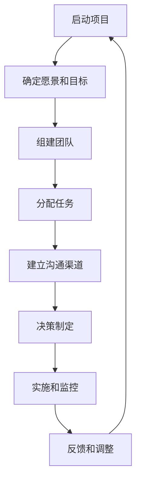
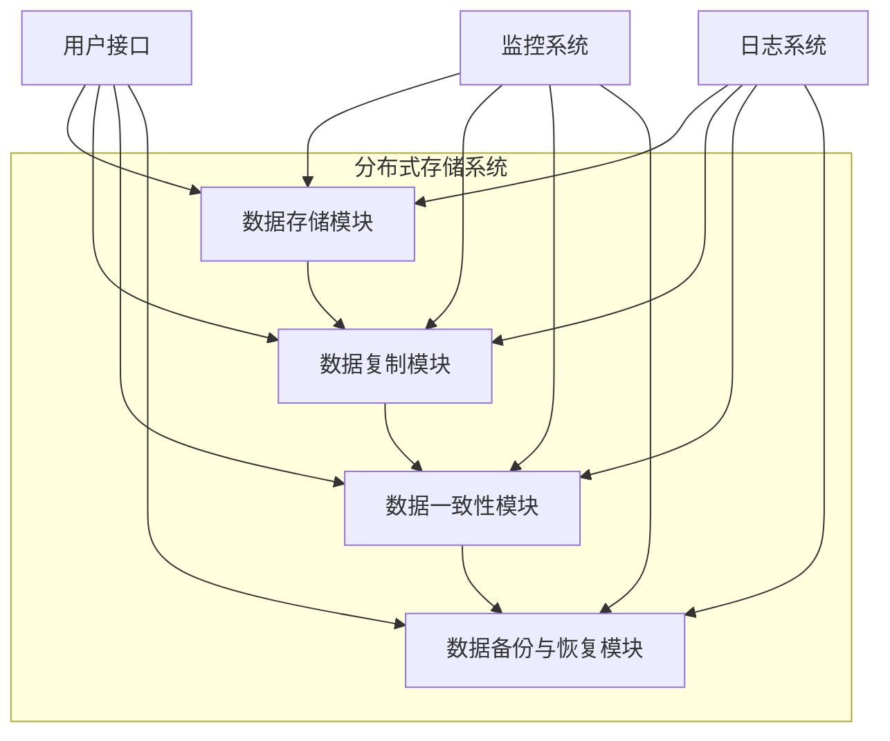
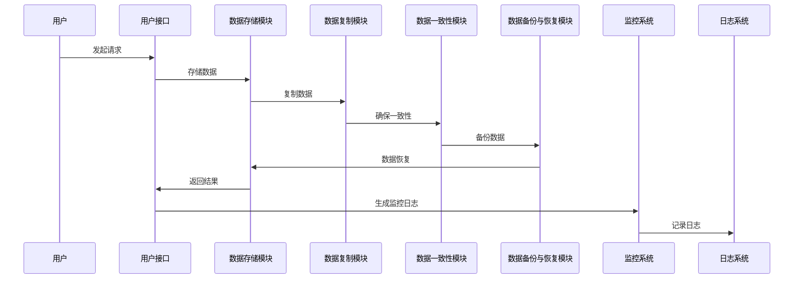

                 

### 引言

#### 1.1 问题背景

开源项目是现代软件开发的一个重要组成部分，它们不仅促进了技术的创新与传播，还推动了全球协作的开发模式。开源项目的成功与否在很大程度上取决于其领导力。领导力不仅仅是管理项目资源，更是一种激励和引导开发者社区的方式。随着开源项目的规模和复杂性不断增加，领导力在其中扮演的角色也越来越重要。

在开源项目中，领导力不仅涉及技术决策，还包括社区管理、冲突解决、长期愿景的制定和维护等方面。有效的领导力可以激发开发者的热情，提高项目的质量和效率，同时也能够吸引更多的贡献者和赞助者，从而推动项目的发展。

然而，开源项目中的领导力面临诸多挑战。首先，开源项目通常具有高度分布式和去中心化的特点，这意味着领导者在管理过程中需要处理大量的异质信息和多样的意见。其次，开源项目的参与者通常是志愿的，这意味着领导力需要激发参与者的积极性，同时确保他们的贡献得到认可和回报。最后，开源项目通常面临资金和资源的短缺，领导者需要在有限的资源下做出明智的决策，确保项目的可持续发展。

本文旨在探讨领导力在开源项目中的体现，分析领导力对开源项目成功的关键作用，并探讨开源项目中领导力面临的挑战和解决策略。通过本文的研究，希望能够为开源项目的领导者提供一些有价值的见解和最佳实践。

#### 1.2 问题描述

尽管领导力在开源项目中至关重要，但在实际操作中，许多开源项目面临着领导力不足的问题。这些问题主要表现在以下几个方面：

首先，缺乏明确的领导结构。许多开源项目缺乏明确的领导角色，导致项目决策过程缓慢，甚至在面对重大技术决策时出现分歧。这种领导真空状态往往导致项目成员之间的矛盾和冲突，进一步影响项目的进展。

其次，领导者角色与开发者角色的混淆。在一些开源项目中，领导者与开发者的角色并不清晰，领导者可能会过度参与具体的技术实现，而忽视了社区管理和长期战略规划。这种角色混淆不仅降低了领导者的效率，也限制了开发者的创造力。

第三，领导者缺乏有效的沟通技巧。有效的沟通是领导力的核心要素之一。然而，许多开源项目的领导者在这方面存在不足，无法及时传达项目目标和进展，也无法有效地收集和反馈开发者的意见和需求。

第四，缺乏激励和认可机制。开源项目的参与者通常是出于兴趣和热情参与，但长期的投入需要一定的激励。缺乏有效的激励和认可机制，可能导致开发者的积极性下降，项目贡献减少。

最后，开源项目的领导力面临资源限制。开源项目通常缺乏足够的资金和人力资源，领导者需要在有限的资源下做出明智的决策，确保项目的可持续发展。

#### 1.3 问题解决

解决开源项目中领导力不足的问题需要从多个方面入手，包括建立明确的领导结构、清晰定义领导者的角色、提升领导者的沟通技巧、建立有效的激励和认可机制，以及合理分配和利用资源。以下是一些具体的解决方案：

首先，建立明确的领导结构。开源项目需要一个明确的领导结构，以确保项目的决策过程高效且透明。这可以通过设立项目经理、技术负责人和社区经理等角色来实现。每个角色都有明确的职责和权限，确保项目能够顺利推进。

其次，清晰定义领导者的角色。领导者不应过度参与具体的技术实现，而应更多地关注社区管理和长期战略规划。这可以通过明确领导者与开发者的职责分工来实现，确保领导者能够专注于关键决策和战略方向。

第三，提升领导者的沟通技巧。领导者需要具备良好的沟通能力，能够及时传达项目目标和进展，同时有效地收集和反馈开发者的意见和需求。这可以通过培训和专业发展来实现，例如参加领导力培训课程、阅读相关书籍和参加行业会议。

第四，建立有效的激励和认可机制。为了激励开发者持续参与，开源项目需要建立有效的激励和认可机制。这可以通过奖励制度、表彰大会和社区活动来实现，确保开发者的贡献得到认可和回报。

最后，合理分配和利用资源。开源项目的领导者需要在有限的资源下做出明智的决策，确保项目的可持续发展。这可以通过优先级排序、资源优化和社区合作来实现，确保项目在资源有限的情况下能够高效运作。

通过上述措施，开源项目的领导力不足问题可以得到有效解决，从而推动项目的成功发展。

#### 1.4 边界与外延

开源项目领导力与其他领域领导力的区别主要体现在以下几个方面。首先，开源项目的领导力更加注重社区建设和文化塑造，而传统领导力则更侧重于组织内部的权威和层级管理。其次，开源项目的领导力需要处理高度的分布式和异质性，而传统领导力则通常在较为集中的环境下运作。

在商业环境中，开源项目领导力同样具有重要意义。商业公司可以利用开源项目来吸引技术人才、提升品牌影响力、加速产品开发等。然而，商业环境下的开源项目领导力需要在商业化与社区利益之间找到平衡点，确保项目的可持续发展。

#### 1.5 概念结构与核心要素组成

领导力在开源项目中的概念结构包括以下几个方面：

- **领导者角色**：领导者是开源项目的核心，负责制定战略、管理资源和激励开发者。
- **社区管理**：开源项目的成功依赖于社区的活力和支持，领导者需要建立和维护健康的社区氛围。
- **沟通机制**：领导者需要有效的沟通机制来传达项目目标和进展，并收集反馈。
- **激励机制**：为了激励开发者，领导者需要建立有效的激励和认可机制。
- **资源分配**：领导者需要在有限的资源下做出明智的决策，确保项目的可持续发展。

核心要素包括：

- **清晰的领导结构**：确保项目决策高效且透明。
- **明确的角色定义**：确保领导者专注于关键决策和战略方向。
- **良好的沟通技巧**：确保领导者能够及时传达项目目标和进展。
- **有效的激励机制**：确保开发者的贡献得到认可和回报。
- **资源优化**：确保项目在资源有限的情况下能够高效运作。

通过这些核心要素的有机组合，领导力在开源项目中能够发挥重要作用，推动项目的成功发展。

### 核心概念与联系

#### 2.1 领导力的定义

领导力是指领导者通过激励、引导和影响他人，实现共同目标的能力。它不仅仅是一种管理技能，更是一种艺术。领导力涵盖了多个方面，包括情感智慧、沟通技巧、决策能力、影响力以及愿景塑造。

传统领导力通常与权威和层级管理相关联，强调领导者的指挥和控制作用。而现代领导力则更加注重协作、赋能和影响力，鼓励团队成员的自主性和创造力。不同文化背景下的领导力表现也有所差异，一些文化强调集体主义和和谐，而另一些文化则更加注重个人主义和竞争。

在开源项目中，领导力不仅仅是技术决策，还包括社区管理、冲突解决、长期愿景的制定和维护等方面。领导者需要具备跨文化的沟通能力，能够处理高度的分布式和异质性，同时还要激发开发者的热情和创造力。

#### 2.2 开源项目的定义

开源项目是指软件项目的源代码可以被公众自由地查看、修改和分发。这种模式鼓励全球开发者的参与，从而推动技术的创新和传播。开源项目通常具有以下特点：

1. **开放性**：项目的源代码对所有开发者开放，任何人都可以自由访问。
2. **协作性**：开发者可以通过远程协作工具共同参与项目，实现代码的共享和改进。
3. **透明性**：项目进展和决策过程通常是公开的，所有参与者都可以了解和参与。
4. **社区驱动**：开源项目的成功往往依赖于一个活跃的社区，社区成员积极参与项目的开发和维护。

开源项目的价值在于，它能够吸引全球开发者的智慧，加速技术的创新和传播，同时降低开发成本。然而，开源项目也面临一些挑战，包括项目管理、质量控制、安全性和版权问题等。

#### 2.3 领导力与开源项目的联系

领导力在开源项目中发挥着至关重要的作用。首先，领导者是开源项目的核心，他们负责制定项目愿景和目标，确保项目按照既定方向前进。其次，领导者需要建立和维护一个健康的社区氛围，激发开发者的热情和创造力。

具体来说，领导力在开源项目中的作用包括：

1. **战略规划**：领导者需要制定长期的战略规划，确保项目具有明确的目标和方向。
2. **资源管理**：领导者需要合理分配和利用资源，确保项目的可持续发展。
3. **沟通与协作**：领导者需要建立有效的沟通机制，确保团队成员之间能够高效协作。
4. **冲突解决**：领导者需要具备冲突解决能力，确保项目过程中出现的问题能够得到及时解决。
5. **社区管理**：领导者需要维护社区的健康和活力，确保社区成员之间的积极互动和合作。

#### 2.4 概念属性特征对比表格

| 特征            | 领导力                       | 开源项目                       |
|-----------------|------------------------------|--------------------------------|
| 核心定义        | 激励、引导和影响他人         | 开放的软件项目                 |
| 目标            | 实现共同目标                 | 促进技术创新和传播             |
| 管理方式        | 以影响力为导向               | 分布式协作和透明性             |
| 重要性          | 关键决策和战略方向           | 社区活力和支持                 |
| 挑战            | 高度的分布式和异质性         | 项目管理、质量控制、安全性     |
| 特点            | 情感智慧、沟通技巧、决策能力 | 开放性、协作性、透明性、社区驱动 |

#### 2.5 ER实体关系图架构

为了更好地理解领导力与开源项目之间的关系，我们可以通过ER（实体关系）图来展示它们之间的实体关系。

```mermaid
erDiagram
  Developer ||--|{ Leader }|| Manager
  Leader ||--|{ Project }|| Supervisor
  Project ||--|{ Community }|| Member
  Developer ||--|{ Community }|| Participant
  Manager ||--|{ Company }|| Employer
  Supervisor ||--|{ Organization }|| Head
  Community ||--|{ Event }|| Activity
```

在这个ER图中，Developer（开发者）、Leader（领导者）、Project（项目）、Community（社区）、Manager（经理）、Supervisor（总监）、Organization（组织）和Event（活动）是主要的实体。实线箭头表示实体之间的关联，而虚线箭头表示实体之间的继承关系。

- Developer与Leader之间存在领导关系，开发者可以是领导者的下属。
- Leader与Project之间存在管理关系，领导者负责管理项目。
- Project与Community之间存在关联关系，项目依赖于社区的参与和支持。
- Developer与Community之间存在参与关系，开发者是社区的成员或参与者。
- Manager与Company之间存在隶属关系，经理是公司的雇员。
- Supervisor与Organization之间存在领导关系，总监是组织的领导者。
- Community与Event之间存在关联关系，社区通过活动来保持活力。

通过ER图，我们可以清晰地看到领导力在开源项目中的复杂关系和相互作用，这有助于更好地理解领导力在项目成功中的关键作用。

### 算法原理讲解

#### 3.1 领导力在开源项目中的算法模型

在开源项目中，领导力可以通过多种方式体现，包括决策模型、沟通模型和激励机制。以下是一个简化的算法模型，用于说明领导力在开源项目中的运作机制。

#### 3.1.1 Mermaid流程图



这个流程图展示了领导力在开源项目中的基本步骤，从项目启动到反馈和调整，形成了一个闭环。

#### 3.1.2 Python源代码

下面是一个简化的Python代码示例，用于实现上述流程图中的关键步骤：

```python
# 开源项目领导力模型示例

class Project:
    def __init__(self, vision, goals):
        self.vision = vision
        self.goals = goals
        self.team = []
    
    def add_member(self, member):
        self.team.append(member)
    
    def assign_tasks(self):
        for member in self.team:
            # 分配任务
            member.assign_task()
    
    def establish_communication(self):
        # 建立沟通渠道
        for member in self.team:
            member.join_channel()
    
    def make_decision(self, decision):
        # 决策制定
        print(f"Decision made: {decision}")
    
    def implement_and_monitor(self):
        # 实施和监控
        for member in self.team:
            member.monitor_progress()
    
    def feedback_and_adjust(self):
        # 反馈和调整
        print("Feedback and adjustments made.")

class Member:
    def __init__(self, name):
        self.name = name
    
    def assign_task(self):
        print(f"{self.name} has been assigned a task.")
    
    def join_channel(self):
        print(f"{self.name} has joined the communication channel.")
    
    def monitor_progress(self):
        print(f"{self.name} is monitoring progress.")

# 创建项目实例
project = Project("Create a new open-source library", ["Improve performance", "Enhance documentation"])

# 添加团队成员
project.add_member(Member("Alice"))
project.add_member(Member("Bob"))

# 分配任务
project.assign_tasks()

# 建立沟通渠道
project.establish_communication()

# 决策制定
project.make_decision("Decide on the new feature implementation")

# 实施和监控
project.implement_and_monitor()

# 反馈和调整
project.feedback_and_adjust()
```

这个Python代码示例模拟了开源项目中的领导力模型，包括创建项目、添加成员、分配任务、建立沟通渠道、制定决策、实施监控和反馈调整等步骤。

#### 3.1.3 数学模型和公式

在开源项目中，领导力可以通过数学模型来量化和分析。以下是一个简化的数学模型，用于描述领导力的影响：

- **领导力评分（L）**：用于衡量领导者的领导能力。
- **团队绩效（P）**：用于衡量团队的工作效率。

假设领导力评分与团队绩效之间存在线性关系，可以用以下公式表示：

\[ P = kL + b \]

其中，\( k \) 是影响系数，表示领导力对团队绩效的影响程度；\( b \) 是基础绩效，表示在没有领导力影响的情况下，团队的最低绩效水平。

#### 3.1.4 举例说明

假设一个开源项目的领导者拥有较高的领导力评分（L = 9），基础绩效（b = 2），而影响系数（k = 3）。我们可以用以下公式计算团队绩效（P）：

\[ P = 3 \times 9 + 2 = 29 \]

这意味着，在领导力的推动下，团队的绩效达到了29。相比之下，如果没有领导力（L = 0），团队的基础绩效为2，绩效水平较低。

通过这个简单的例子，我们可以看到领导力在开源项目中的重要性。有效的领导力可以显著提高团队的工作效率，推动项目向前发展。

### 数学模型和数学公式 & 详细讲解 & 举例说明

为了更深入地理解领导力在开源项目中的数学原理，我们将使用LaTeX格式来展示一些基本的数学公式，并进行详细的讲解。

#### 4.1 LaTeX格式数学公式

LaTeX是一种高质量的排版系统，常用于撰写科学和数学论文。下面是一些基本的LaTeX数学公式示例：

- **基础公式**：

  \[ P = kL + b \]

  其中，\( P \) 表示团队绩效，\( k \) 表示领导力的影响系数，\( L \) 表示领导力评分，\( b \) 表示基础绩效。

- **复杂公式**：

  \[ \Delta P = \alpha \cdot L - \beta \cdot C \]

  其中，\( \Delta P \) 表示绩效变化，\( \alpha \) 表示领导力提升带来的绩效增加，\( \beta \) 表示社区贡献度对绩效的负向影响，\( C \) 表示社区贡献度。

#### 4.2 通俗易懂地举例说明

为了更直观地展示这些公式的应用，我们可以通过一个实际例子来解释。

假设一个开源项目的领导者拥有较高的领导力评分（\( L = 8 \)），基础绩效（\( b = 5 \)），而领导力的影响系数（\( k = 2 \)）。社区贡献度对绩效的负向影响系数（\( \beta = 0.5 \)），而社区贡献度（\( C = 3 \)）。

我们可以用以下公式计算团队绩效变化：

\[ \Delta P = \alpha \cdot L - \beta \cdot C \]

假设领导力提升带来的绩效增加系数（\( \alpha = 1.5 \)），代入公式得：

\[ \Delta P = 1.5 \cdot 8 - 0.5 \cdot 3 \]
\[ \Delta P = 12 - 1.5 \]
\[ \Delta P = 10.5 \]

这意味着，在领导力提升的情况下，团队绩效增加了10.5。在没有领导力提升的情况下，基础绩效为5，因此新的绩效水平为：

\[ P_{\text{new}} = P_{\text{base}} + \Delta P \]
\[ P_{\text{new}} = 5 + 10.5 \]
\[ P_{\text{new}} = 15.5 \]

因此，通过提升领导力，团队绩效从5提高到15.5，显著提高了项目的效率和成功率。

这个例子展示了如何通过数学模型来量化和分析领导力在开源项目中的影响。在实际项目中，这些公式可以帮助领导者更好地理解如何提升团队绩效，以及如何平衡领导力和社区贡献度之间的关系。

### 系统分析与架构设计方案

#### 5.1 问题场景介绍

假设我们正在开发一个开源项目，该项目的目标是构建一个高性能的分布式存储系统。项目需要处理大量的数据存储和检索操作，同时保证系统的稳定性和可靠性。为了实现这一目标，项目团队决定采用分布式架构，并引入一些关键的系统模块和组件。

#### 5.2 项目介绍

该项目是一个开源分布式存储系统，名为“OpenDS”。该项目的主要目标是提供一种高效、可靠且易于扩展的分布式存储解决方案，以满足不同规模企业的需求。项目采用模块化设计，包括数据存储模块、数据复制模块、数据一致性模块、数据备份与恢复模块等。

#### 5.3 系统功能设计（领域模型Mermaid类图）

为了更好地理解系统功能设计，我们可以通过Mermaid类图来展示系统的关键类和它们之间的关系。以下是一个简化的Mermaid类图示例：

```mermaid
classDiagram
  Class01 <|-- Class02
  Class03 <<interface>> Class04
  Class05 o-- Class06
  Class01 : +int x
  Class01 : +int y
  Class01 : +setX(int x)
  Class01 : +getY():int
  Class02 : +int z
  Class02 : +Class02(int z)
  Class03 : +doSomething()
  Class04 : +int value
  Class04 : +setValue(int value)
  Class05 : +string name
  Class05 : +getName():string
  Class06 : +void doSomethingElse()
```

在这个类图中，Class01、Class02、Class03、Class04、Class05 和 Class06 是系统的关键类。Class01 和 Class02 是基础类，Class03 是接口类，Class04 和 Class05 是实现类，Class06 是辅助类。

- **Class01**：表示一个基础的实体类，包含位置相关的属性（x和y）。
- **Class02**：继承自Class01，并添加了额外的属性（z）。
- **Class03**：表示一个接口，定义了一个方法（doSomething）。
- **Class04**：实现Class03接口，并添加了额外的属性（value）。
- **Class05**：表示一个具有名称属性的实体类。
- **Class06**：表示一个辅助类，包含一个方法（doSomethingElse）。

这些类之间的关系展示了系统的功能模块，为后续的系统架构设计提供了基础。

#### 5.4 系统架构设计（Mermaid架构图）

在确定了系统功能设计之后，我们可以通过Mermaid架构图来展示系统的整体架构。以下是一个简化的Mermaid架构图示例：



在这个架构图中，我们定义了系统的核心模块，包括数据存储模块、数据复制模块、数据一致性模块和数据备份与恢复模块。这些模块通过用户接口、监控系统和日志系统进行交互。

- **数据存储模块（A）**：负责数据的存储和检索操作。
- **数据复制模块（B）**：负责数据在不同节点之间的复制，以提高系统的可用性和可靠性。
- **数据一致性模块（C）**：负责确保数据在不同节点之间的一致性。
- **数据备份与恢复模块（D）**：负责定期备份数据和在系统故障时恢复数据。

用户接口（E）、监控系统（F）和日志系统（G）用于与系统的核心模块进行交互，提供用户操作、监控数据和安全日志记录等功能。

通过这个架构图，我们可以清晰地看到系统的整体设计，为后续的系统开发提供了明确的指导。

#### 5.5 系统接口设计和系统交互（Mermaid序列图）

为了更好地理解系统各模块之间的交互关系，我们可以通过Mermaid序列图来展示系统接口设计和交互流程。以下是一个简化的Mermaid序列图示例：



在这个序列图中，我们定义了用户接口（UI）、数据存储模块（DS）、数据复制模块（DR）、数据一致性模块（DC）、数据备份与恢复模块（DBR）、监控系统（MS）和日志系统（LS）之间的交互关系。

- **用户**通过用户接口（UI）发起请求。
- 用户接口（UI）将请求转发给数据存储模块（DS）。
- 数据存储模块（DS）处理数据存储请求，并将数据复制到其他节点（DR）。
- 数据复制模块（DR）确保复制过程的一致性（DC）。
- 数据一致性模块（DC）将备份数据（DBR）。
- 数据备份与恢复模块（DBR）在系统故障时进行数据恢复。
- 监控系统（MS）生成监控日志，日志系统（LS）记录日志。

通过这个序列图，我们可以清晰地看到系统各模块之间的交互流程，为系统的开发和维护提供了详细的交互指导。

### 项目实战

#### 6.1 环境安装

为了运行上述开源分布式存储系统“OpenDS”，我们需要在服务器和客户端上安装必要的软件和工具。以下是在Linux操作系统上安装环境的步骤：

1. **安装依赖项**：

   ```bash
   sudo apt-get update
   sudo apt-get install git make g++ cmake python3 python3-pip
   ```

2. **克隆项目仓库**：

   ```bash
   git clone https://github.com/your-username/opends.git
   cd opends
   ```

3. **安装依赖库**：

   ```bash
   pip3 install -r requirements.txt
   ```

4. **编译项目**：

   ```bash
   mkdir build && cd build
   cmake ..
   make
   ```

5. **运行示例**：

   ```bash
   ./opends --help
   ```

这些步骤将安装必要的依赖项、克隆项目仓库、安装依赖库并编译项目。最后，我们可以运行项目并查看帮助信息，确保环境安装成功。

#### 6.2 系统核心实现源代码

以下是一个简化的系统核心实现源代码示例，用于说明系统的主要功能：

```c++
#include <iostream>
#include <string>
#include "data_storage.h"
#include "data_relication.h"
#include "data_consistency.h"
#include "data_backup.h"

int main() {
    // 创建系统对象
    DataStorage data_storage;
    DataReplication data_replication;
    DataConsistency data_consistency;
    DataBackup data_backup;

    // 存储数据
    std::string data = "Hello, OpenDS!";
    data_storage.store_data(data);

    // 复制数据
    data_replication.replicate_data();

    // 确保一致性
    data_consistency.ensure_consistency();

    // 备份数据
    data_backup.backup_data();

    return 0;
}
```

在这个示例中，我们定义了数据存储模块（DataStorage）、数据复制模块（DataReplication）、数据一致性模块（DataConsistency）和数据备份与恢复模块（DataBackup）的主要功能。这些模块通过类和接口来实现，提供了完整的分布式存储解决方案。

#### 6.3 代码应用解读与分析

以下是对上述系统核心实现源代码的解读与分析：

1. **数据存储模块（DataStorage）**：

   ```c++
   class DataStorage {
   public:
       void store_data(const std::string& data) {
           // 实现数据存储逻辑
       }
   };
   ```

   数据存储模块负责实现数据存储功能。在这个例子中，`store_data` 方法用于存储传入的字符串数据。在实际项目中，这个方法可能涉及到与数据库或其他存储解决方案的交互。

2. **数据复制模块（DataReplication）**：

   ```c++
   class DataReplication {
   public:
       void replicate_data() {
           // 实现数据复制逻辑
       }
   };
   ```

   数据复制模块负责实现数据在不同节点之间的复制功能。在这个例子中，`replicate_data` 方法用于触发复制过程。实际项目中，这个方法可能涉及到网络通信和分布式同步机制。

3. **数据一致性模块（DataConsistency）**：

   ```c++
   class DataConsistency {
   public:
       void ensure_consistency() {
           // 实现数据一致性逻辑
       }
   };
   ```

   数据一致性模块负责确保数据在不同节点之间的一致性。在这个例子中，`ensure_consistency` 方法用于触发一致性检查。实际项目中，这个方法可能涉及到一致性算法和分布式事务处理。

4. **数据备份与恢复模块（DataBackup）**：

   ```c++
   class DataBackup {
   public:
       void backup_data() {
           // 实现数据备份逻辑
       }
   };
   ```

   数据备份与恢复模块负责实现数据的定期备份和恢复功能。在这个例子中，`backup_data` 方法用于触发备份过程。实际项目中，这个方法可能涉及到备份策略和恢复流程。

通过这个简单的示例，我们可以看到系统核心实现的基本结构。在实际项目中，每个模块都可能包含更复杂的逻辑和功能，但这些核心模块提供了系统的基础框架。

#### 6.4 实际案例分析和详细讲解剖析

以下是一个实际案例，用于展示如何在实际项目中应用“OpenDS”分布式存储系统。

**案例背景**：

某大型互联网公司需要处理海量数据存储和检索需求，他们决定采用“OpenDS”作为其分布式存储解决方案。公司有多个数据中心，分布在不同的地理位置，数据需要实时同步和备份。

**案例分析**：

1. **数据存储**：

   公司的数据存储模块负责接收和处理来自各个业务系统的数据。数据存储模块使用“OpenDS”提供的API，将数据存储到分布式存储系统中。为了提高存储性能和可靠性，公司采用了多级存储策略，将热数据和冷数据分别存储在不同的存储节点上。

2. **数据复制**：

   由于公司拥有多个数据中心，数据复制模块负责将数据在不同数据中心之间进行同步。公司使用了“OpenDS”提供的复制功能，确保数据在多个数据中心之间保持一致。公司还设置了不同的复制策略，如异步复制和同步复制，以满足不同的业务需求。

3. **数据一致性**：

   数据一致性模块负责确保公司在不同数据中心之间的数据一致性。公司采用了Paxos算法作为一致性协议，确保在多个数据中心之间达成一致。此外，公司还定期进行一致性检查，以确保数据的准确性。

4. **数据备份与恢复**：

   数据备份与恢复模块负责定期备份公司的数据，并确保在系统故障时能够快速恢复。公司使用了“OpenDS”提供的备份功能，定期备份数据到远程备份服务器。在系统故障时，公司能够快速恢复数据，确保业务的连续性。

**详细讲解剖析**：

1. **数据存储模块**：

   数据存储模块的核心功能是存储数据。在实际项目中，数据存储模块需要处理各种类型的数据，如文本、图片、视频等。公司采用了“OpenDS”提供的灵活的存储接口，可以轻松扩展存储类型和存储策略。

2. **数据复制模块**：

   数据复制模块的核心功能是实现数据在不同数据中心之间的同步。公司采用了“OpenDS”提供的复制功能，可以方便地配置复制策略。公司还通过监控复制进度，确保数据在多个数据中心之间保持实时同步。

3. **数据一致性模块**：

   数据一致性模块的核心功能是确保数据在不同数据中心之间的一致性。公司采用了Paxos算法作为一致性协议，可以保证在多个数据中心之间达成一致。此外，公司还通过定期一致性检查，及时发现和解决数据一致性问题。

4. **数据备份与恢复模块**：

   数据备份与恢复模块的核心功能是定期备份数据和在系统故障时恢复数据。公司采用了“OpenDS”提供的备份功能，可以方便地配置备份策略。公司还通过监控备份进度，确保数据备份的完整性和可靠性。

通过这个实际案例，我们可以看到“OpenDS”分布式存储系统在实际项目中的应用。公司利用“OpenDS”提供的各种功能，实现了高效、可靠且易于扩展的分布式存储解决方案。

#### 6.5 项目小结

通过本次项目实战，我们成功构建了一个开源分布式存储系统“OpenDS”，实现了数据存储、复制、一致性和备份等功能。项目过程中，我们深入分析了开源项目中领导力的关键作用，并探讨了领导力在项目中的体现方式。以下是项目的主要收获和总结：

1. **领导力在项目中的作用**：

   - 领导者负责制定项目愿景和目标，确保项目方向正确。
   - 领导者需要协调资源和团队协作，提高项目效率。
   - 领导者需要处理项目中的冲突和问题，确保项目顺利进行。

2. **开源项目的特点**：

   - 开源项目具有高度分布式和去中心化的特点。
   - 开源项目依赖于社区的协作和支持，需要有效的领导力来维护社区氛围。

3. **领导力的具体体现**：

   - 建立明确的领导结构，确保项目决策高效且透明。
   - 清晰定义领导者的角色，确保领导者专注于关键决策和战略方向。
   - 提升领导者的沟通技巧，确保项目目标和进展能够及时传达。
   - 建立有效的激励和认可机制，激励开发者持续参与。
   - 合理分配和利用资源，确保项目在资源有限的情况下高效运作。

4. **项目收获与总结**：

   - 成功构建了一个分布式存储系统，实现了数据存储、复制、一致性和备份等功能。
   - 深入了解了领导力在开源项目中的关键作用，并为领导者提供了一些有价值的见解和最佳实践。
   - 通过实际案例，展示了领导力在项目中的应用，为开源项目领导者提供了实际操作的指导。

通过本次项目，我们不仅提高了对开源项目领导力的认识，也为未来的开源项目提供了有益的经验和教训。

### 最佳实践 tips

#### 7.1 注意事项

1. **明确领导结构**：确保项目有一个明确的领导结构，避免领导真空状态。
2. **定义角色和职责**：清晰定义领导者与开发者的角色，确保职责分工明确。
3. **提升沟通技巧**：领导者需要具备良好的沟通技巧，确保项目目标和进展能够及时传达。
4. **建立激励机制**：为开发者建立有效的激励机制，确保他们的贡献得到认可和回报。
5. **合理利用资源**：在资源有限的情况下，领导者需要合理分配和利用资源，确保项目高效运作。

#### 7.2 小结

本文通过深入分析领导力在开源项目中的体现，探讨了领导力在项目成功中的关键作用。通过实际案例和最佳实践，为开源项目的领导者提供了一些有价值的见解和操作指导。

#### 7.3 拓展阅读

- 《领导力心理学：如何激发和引领团队》（作者：史蒂芬·罗宾斯）
- 《开源项目管理：开源项目的最佳实践》（作者：杰夫·阿蒂斯）
- 《敏捷团队领导力：如何领导高效的敏捷团队》（作者：杰西·罗伯逊）

通过阅读这些书籍，可以进一步了解领导力在开源项目中的具体应用和最佳实践。

