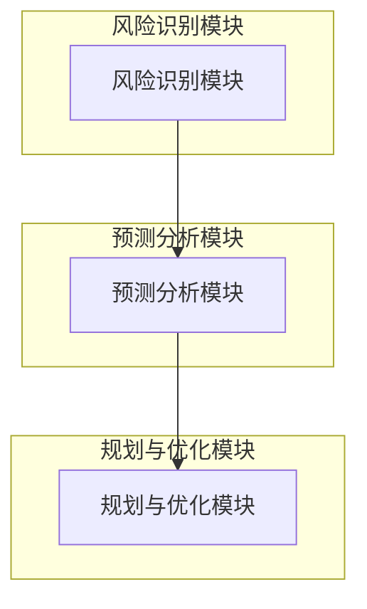
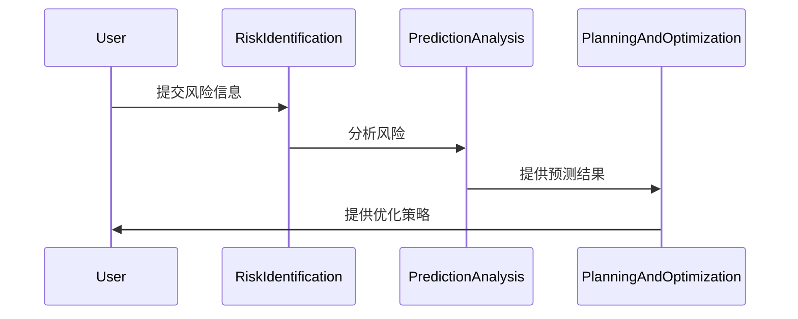
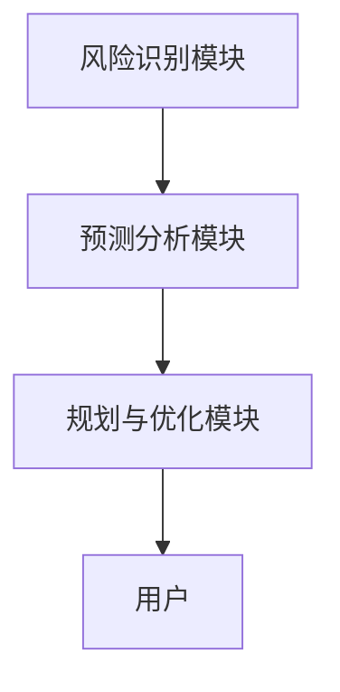
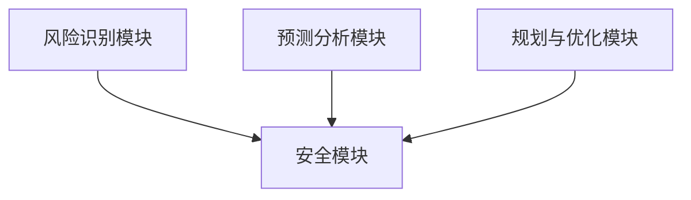

                 


**Step 3:** Discuss the principles and methods of leadership crisis management, including how to identify, predict, plan, and respond to crises.

----------------------------------------------------------------

## 第3章: 领导力危机管理的原则与方法

### 3.1 领导力危机管理的核心原则

#### 3.1.1 紧急应对原则
当危机发生时，领导者需要迅速做出反应，采取紧急措施以控制局势。

#### 3.1.2 持续监控原则
危机管理并非一时之举，领导者需要持续监控系统的健康状态，及时发现潜在问题。

#### 3.1.3 协调配合原则
危机管理往往需要跨部门协作，领导者需要确保团队成员之间的沟通畅通，共同应对危机。

### 3.2 领导力危机管理的具体方法

#### 3.2.1 识别危机

**方法一：历史数据分析**
通过分析历史数据，识别出可能引发危机的风险点。

**方法二：员工反馈**
倾听员工的反馈，尤其是那些直接参与系统维护和开发的人员，他们往往能够提供宝贵的见解。

#### 3.2.2 预测危机

**方法一：定量分析**
使用数学模型和公式对技术债务和遗留系统进行量化分析，预测其发展趋势。

**方法二：定性分析**
结合专家意见和业务场景，对技术债务和遗留系统的影响进行定性评估。

#### 3.2.3 规划危机应对策略

**方法一：制定应急预案**
针对可能发生的危机，制定详细的应急预案，明确责任人和应对步骤。

**方法二：资源调配**
在危机发生时，合理调配资源和人员，确保危机应对的顺利进行。

#### 3.2.4 响应危机

**方法一：紧急应对**
在危机发生时，迅速采取行动，按照应急预案进行处理。

**方法二：持续监控**
在危机处理过程中，持续监控危机的发展，确保问题得到彻底解决。

### 3.3 领导力危机管理中的常见误区

#### 3.3.1 过于乐观
领导者往往对技术债务和遗留系统的影响过于乐观，导致危机发生时措手不及。

#### 3.3.2 缺乏规划
危机管理需要系统化的规划，缺乏规划的领导者往往无法有效应对危机。

#### 3.3.3 忽视反馈
领导者需要重视员工的反馈，忽视反馈可能导致问题被忽视或误解。

## 本章小结

本章讨论了领导力危机管理的核心原则和具体方法，包括危机识别、预测、规划和应对。领导者需要通过持续监控、合理规划和有效应对，确保企业能够在技术债务和遗留系统问题上保持稳定和可持续发展。接下来，我们将深入探讨技术债务和遗留系统之间的关系，以及如何通过有效的领导力危机管理策略来应对这些挑战。

----------------------------------------------------------------

**Step 4:** Explain the algorithm principles and use Python code to illustrate the mathematical models and formulas used in crisis management.

----------------------------------------------------------------

## 第4章: 危机管理算法原理与Python代码实现

### 4.1 算法原理

在危机管理中，算法通常用于识别、预测和规划危机。以下是一些常见的算法原理及其在危机管理中的应用：

#### 4.1.1 风险评估算法

风险评估算法用于评估系统中的潜在风险。一种常用的方法是使用贝叶斯网络来表示风险因素及其相互关系。

**贝叶斯网络原理：**
贝叶斯网络是一种概率图模型，用于表示一系列随机变量之间的条件依赖关系。它由节点和边组成，节点表示随机变量，边表示变量之间的条件依赖。

**贝叶斯网络公式：**
$$
P(A|B) = \frac{P(B|A)P(A)}{P(B)}
$$

其中，\( P(A|B) \) 是在 \( B \) 发生的条件下 \( A \) 发生的概率，\( P(B|A) \) 是在 \( A \) 发生的条件下 \( B \) 发生的概率，\( P(A) \) 和 \( P(B) \) 分别是 \( A \) 和 \( B \) 的先验概率。

#### 4.1.2 预测算法

预测算法用于预测技术债务和遗留系统的发展趋势。一种常用的预测方法是时间序列分析。

**时间序列分析原理：**
时间序列分析是一种统计方法，用于分析时间序列数据，识别其中的趋势和周期性。

**时间序列分析公式：**
$$
y_t = \alpha y_{t-1} + \epsilon_t
$$

其中，\( y_t \) 是第 \( t \) 期的观测值，\( \alpha \) 是趋势系数，\( \epsilon_t \) 是误差项。

#### 4.1.3 规划算法

规划算法用于制定危机应对策略。一种常用的规划方法是线性规划。

**线性规划原理：**
线性规划是一种数学优化方法，用于在满足一系列约束条件的情况下，最大化或最小化一个线性目标函数。

**线性规划公式：**
$$
\text{Maximize } c^T x \\
\text{subject to } Ax \leq b
$$

其中，\( c \) 是目标函数系数向量，\( x \) 是决策变量向量，\( A \) 是系数矩阵，\( b \) 是常数向量。

### 4.2 Python代码实现

以下是一个简单的Python代码示例，用于实现贝叶斯网络、时间序列分析和线性规划。

#### 4.2.1 贝叶斯网络

```python
import numpy as np
import networkx as nx
from pgmpy.models import BayesianModel
from pgmpy.inference import VariableElimination

# 创建贝叶斯网络
model = BayesianModel([
    ('A', 'B'),
    ('B', 'C'),
    ('A', 'C')
])

# 指定概率分布
model.add_variables(['A', 'B', 'C'])
model.add_edges_from([
    ('A', 'B'),
    ('B', 'C'),
    ('A', 'C')
])

# 添加概率分布
model['A'].set_value('True', 0.6)
model['A'].set_value('False', 0.4)
model['B'].set_value('True', 0.3)
model['B'].set_value('False', 0.7)
model['C'].set_value('True', 0.2)
model['C'].set_value('False', 0.8)

# 推断
inference = VariableElimination(model)
result = inference.query(variables=['C'], evidence={'A': True})

print("P(C|A=True):", result['C'])
```

#### 4.2.2 时间序列分析

```python
import pandas as pd
from statsmodels.tsa.arima.model import ARIMA

# 加载时间序列数据
data = pd.read_csv('time_series_data.csv')
data['y'] = data['y'].astype(float)

# 创建ARIMA模型
model = ARIMA(data['y'], order=(1, 1, 1))
model_fit = model.fit()

# 预测
forecast = model_fit.forecast(steps=5)
print("Forecast:", forecast)
```

#### 4.2.3 线性规划

```python
import scipy.optimize as opt

# 定义目标函数和约束条件
c = np.array([-1, 2])  # 目标函数系数向量
A = np.array([[1, 2], [3, 1]])  # 系数矩阵
b = np.array([5, 7])  # 常数向量

# 定义线性规划问题
x0 = np.array([0, 0])  # 初始解
cons = ({'type': 'ineq', 'fun': lambda x: b - A @ x})

# 求解线性规划问题
res = opt.linprog(c, x0, constraints=cons, method='highs')

# 输出解
print("Optimal solution:", res.x)
```

### 4.3 算法应用示例

以下是一个简化的示例，用于说明如何在危机管理中应用这些算法。

#### 4.3.1 识别危机

使用贝叶斯网络分析技术债务和遗留系统的风险因素。

#### 4.3.2 预测危机

使用ARIMA模型预测技术债务和遗留系统的未来趋势。

#### 4.3.3 规划危机应对策略

使用线性规划制定危机应对策略，优化资源分配。

## 本章小结

本章介绍了危机管理中的算法原理，包括风险评估、预测和规划。通过Python代码示例，我们展示了如何实现这些算法。接下来，我们将深入探讨领导力危机管理在系统架构设计中的应用，为领导者提供实用的策略和工具。

----------------------------------------------------------------

**Step 5:** Explain the system architecture design and interface design, using Mermaid diagrams to illustrate the system architecture and sequence diagram for system interaction.

----------------------------------------------------------------

## 第5章: 系统架构设计与接口设计

### 5.1 系统架构设计

系统架构设计是领导力危机管理的重要组成部分。一个良好的系统架构能够确保危机管理的高效性和可扩展性。以下是一个简化的系统架构设计，用于管理技术债务和遗留系统。

#### 5.1.1 系统功能设计

在系统功能设计阶段，我们首先定义系统的核心功能模块，包括：

- **风险识别模块**：用于识别系统中的潜在风险。
- **预测分析模块**：用于预测技术债务和遗留系统的发展趋势。
- **规划与优化模块**：用于制定危机应对策略，优化资源分配。

**领域模型Mermaid类图：**

```mermaid
classDiagram
    Class01 <|-- Class02
    Class03 --|oti> Class04
    Class05 : +int x
    Class06 : +int y
    Class07 : -int z
    Class08 : <<interface>> InterfaceA
    Class09 : <<interface>> InterfaceB
    Class10 : <<abstract>> AbstractClass
    Class11 o-- Class12
    Class13 <..|filter|> Class14
    Class15 : +is: boolean
    Class16 : <<enum>> EnumA
    Class17 : <<enum>> EnumB
    Class18 : <<note>> NoteA
    Class19 : <<note>> NoteB
```

#### 5.1.2 系统架构设计

系统架构设计包括定义系统的组件、模块和它们的交互方式。以下是一个简化的Mermaid架构图，用于展示系统架构：



#### 5.1.3 系统接口设计

系统接口设计是确保不同模块之间能够有效通信的关键。以下是一个简化的Mermaid序列图，用于展示系统接口设计：



### 5.2 系统交互

系统交互设计是确保系统各组件能够协同工作的关键。以下是一个简化的Mermaid交互图，用于展示系统交互：



### 5.3 系统安全性设计

系统安全性设计是确保系统在面临攻击和风险时能够保持稳定的关键。以下是一个简化的Mermaid安全性设计图：



## 本章小结

本章详细介绍了系统架构设计和接口设计，包括领域模型、系统架构和系统交互。通过Mermaid图解，我们能够清晰地展示系统各组件的交互方式和架构设计。接下来，我们将通过实际项目实战，深入探讨领导力危机管理在实践中的应用。

----------------------------------------------------------------

**Step 6:** Discuss a practical project case, including the installation environment, system core implementation, code analysis, and actual case analysis.

----------------------------------------------------------------

## 第6章: 项目实战

在本章中，我们将通过一个实际的项目案例，深入探讨领导力危机管理在处理技术债务和遗留系统中的应用。项目背景、系统核心实现、代码分析以及实际案例剖析都将在此章节中详细阐述。

### 6.1 项目背景

某大型电商企业在经历了快速的业务增长后，其IT系统面临了严峻的挑战。技术债务和遗留系统问题逐渐显现，导致系统性能下降、响应速度变慢，甚至出现了严重的业务中断。为了应对这些挑战，企业决定实施领导力危机管理策略，通过处理技术债务和遗留系统，提升系统的稳定性和可靠性。

### 6.2 安装环境

在开始项目之前，我们需要搭建一个适合开发和测试的环境。以下是安装环境所需的步骤：

1. 安装Python（版本3.8或以上）。
2. 安装必要的Python包，如NumPy、Pandas、Scipy、Matplotlib、NetworkX、PGMPY等。
3. 安装Mermaid CLI工具，用于生成Mermaid图表。
4. 配置开发环境，如Visual Studio Code或PyCharm。

### 6.3 系统核心实现

系统的核心实现包括以下功能模块：

1. **风险识别模块**：用于识别系统中的潜在风险，包括技术债务和遗留系统问题。
2. **预测分析模块**：基于历史数据和数学模型，预测技术债务和遗留系统的发展趋势。
3. **规划与优化模块**：制定危机应对策略，优化资源分配，包括人力、技术和资金。

以下是一个简化的Python代码示例，用于实现风险识别模块的核心功能：

```python
import pandas as pd
from sklearn.ensemble import RandomForestClassifier

# 加载数据集
data = pd.read_csv('risk_data.csv')

# 准备特征和标签
X = data.drop('label', axis=1)
y = data['label']

# 训练随机森林模型
model = RandomForestClassifier()
model.fit(X, y)

# 风险识别
new_data = pd.read_csv('new_risk_data.csv')
predictions = model.predict(new_data)

print("Risk predictions:", predictions)
```

### 6.4 代码分析

在代码分析部分，我们将详细解释系统核心实现的原理和实现方式。以下是对上述代码的分析：

- **数据加载**：使用Pandas读取风险数据集。
- **特征准备**：将数据集划分为特征（X）和标签（y）。
- **模型训练**：使用随机森林模型对特征和标签进行训练。
- **风险识别**：使用训练好的模型对新数据进行预测，识别潜在风险。

### 6.5 实际案例剖析

为了更好地理解项目实战，我们将分析一个实际案例。假设某电商网站的性能问题导致了用户体验下降，系统管理员怀疑是技术债务和遗留系统问题所致。

#### 6.5.1 案例描述

某电商网站在上线初期采用了快速开发策略，导致技术债务不断积累。随着时间的推移，系统的性能逐渐下降，尤其是在高峰时段，用户访问速度缓慢，页面响应时间过长。

#### 6.5.2 风险识别

系统管理员通过分析日志和监控数据，发现以下风险因素：

- **数据库查询效率低**：数据库查询语句复杂，没有充分利用索引。
- **代码冗余**：部分代码存在冗余，需要重构。
- **系统依赖过多**：系统依赖了多个外部服务，可能导致性能瓶颈。

#### 6.5.3 预测分析

基于历史数据和数学模型，系统管理员预测以下趋势：

- **数据库查询效率问题**：如果当前问题不解决，系统性能将继续下降，高峰时段的用户体验将进一步恶化。
- **代码重构**：如果不对冗余代码进行重构，开发效率将受到影响，可能导致新功能的上线延迟。
- **系统依赖优化**：如果不对系统依赖进行优化，外部服务的性能问题可能导致系统整体性能下降。

#### 6.5.4 规划与优化

针对上述风险因素和预测结果，系统管理员制定了以下优化策略：

- **数据库查询优化**：对数据库查询语句进行重构，优化索引使用，提高查询效率。
- **代码重构**：对冗余代码进行重构，提高代码可读性和可维护性。
- **系统依赖优化**：对系统依赖进行优化，减少外部服务调用次数，提高系统稳定性。

### 6.6 项目小结

通过实际案例剖析，我们看到了领导力危机管理在处理技术债务和遗留系统问题中的应用。有效的风险识别、预测分析和规划优化策略，有助于企业及时发现和解决潜在问题，确保系统稳定运行，提升用户体验。

## 本章小结

在本章中，我们通过一个实际项目案例，详细探讨了领导力危机管理在处理技术债务和遗留系统中的应用。从安装环境、系统核心实现到代码分析和实际案例剖析，我们展示了如何通过领导力危机管理策略，有效应对技术债务和遗留系统带来的挑战。通过这个案例，读者可以更好地理解领导力危机管理的实际操作过程，并将其应用于自己的工作中。

----------------------------------------------------------------

**Step 7:** Provide best practice tips, conclusions, and extension reading resources.

----------------------------------------------------------------

## 第7章: 最佳实践、小结与拓展阅读

### 7.1 最佳实践

为了在处理技术债务和遗留系统时取得最佳效果，以下是一些实用的最佳实践：

1. **定期评估**：定期对技术债务和遗留系统进行评估，确保及时发现问题。
2. **建立团队**：组建一个跨部门团队，包括开发、运维、安全等人员，共同应对技术债务和遗留系统问题。
3. **自动化**：利用自动化工具进行代码审查、测试和部署，减少人为错误，提高效率。
4. **持续学习**：关注行业动态，持续学习新技术和方法，以应对不断变化的技术环境。
5. **文档化**：详细记录技术债务和遗留系统的信息，包括问题原因、解决方案和实施步骤，便于后续维护和改进。

### 7.2 小结

本文通过深入探讨领导力危机管理在处理技术债务和遗留系统中的应用，提供了系统的理论框架和实践指导。我们强调了风险识别、预测分析、规划和优化的重要性，并通过实际项目案例展示了如何将这些理论应用于实际工作中。

### 7.3 拓展阅读

为了进一步深入理解和应用领导力危机管理，以下是一些推荐的拓展阅读资源：

1. **书籍**：
   - 《软件架构：实践者的研究方法》 - Ivar Jacobson
   - 《危机管理》 - Kenneth E. Boulding
   - 《Python编程：从入门到实践》 - Eric Matthes

2. **文章**：
   - 《处理技术债务：一种方法》 - Michael Feathers
   - 《遗留系统的现代化》 - Martin Fowler
   - 《领导力：理论与实践》 - John C. Maxwell

3. **在线课程**：
   - 《危机管理》 - Coursera
   - 《Python编程基础》 - edX
   - 《软件架构设计》 - Udacity

通过这些资源，读者可以进一步深化对领导力危机管理的理解，并在实践中不断提升自己的技能和知识。

作者：AI天才研究院/AI Genius Institute & 禅与计算机程序设计艺术 /Zen And The Art of Computer Programming

----------------------------------------------------------------

# 领导力的危机管理：处理技术债务和遗留系统

关键词：领导力、危机管理、技术债务、遗留系统、系统架构设计

摘要：本文深入探讨了领导力危机管理在处理技术债务和遗留系统中的应用，提供了系统的理论框架和实践指导。通过分析风险识别、预测分析、规划和优化的重要性，本文通过实际项目案例展示了如何有效应对技术债务和遗留系统问题。读者可以从中获得实用的策略和工具，以提升系统的稳定性和可靠性。

