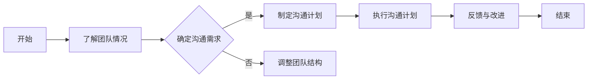
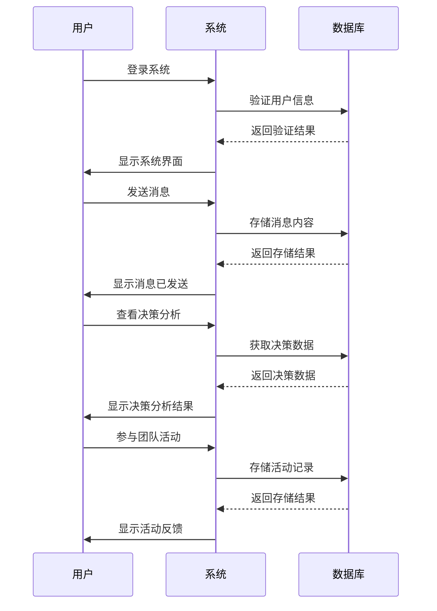
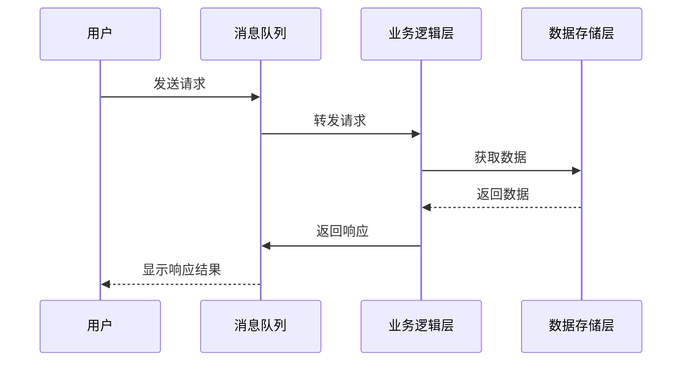

                 


## 领导力的发展：沟通、决策和团队建设

### 关键词

- 领导力
- 沟通
- 决策
- 团队建设

### 摘要

本文探讨了领导力发展的三个关键方面：沟通、决策和团队建设。通过逐步分析这些概念的原理、应用和实践，我们旨在为IT领域的专业人士提供深入理解和实用技巧，以提升个人的领导力水平和团队效能。

---

### 目录大纲设计思路

在设计《领导力的发展：沟通、决策和团队建设》的目录大纲时，我们需要确保内容的逻辑性和完整性。以下是我们设计目录的步骤和思路：

1. **理解书名与核心内容**：首先，从书名中提取关键信息，即领导力的三个重要组成部分——沟通、决策和团队建设。这为我们的章节结构奠定了基础。

2. **确定章节结构**：根据核心内容，将书分为几个主要章节，每个章节对应一个领导力的具体方面。

3. **细化章节内容**：在每个章节中，我们进一步细化出二级和三级小节，确保每个主题都能得到充分讨论。

4. **确保内容完整性**：每个章节都应该包括背景介绍、核心概念、原理讲解、案例分析和最佳实践等内容。

5. **遵循格式规范**：使用markdown格式来组织目录，使其简洁明了。

### 设计步骤

#### 第一步：背景介绍

- **核心概念**：介绍领导力的基本概念，包括其重要性、类型和常见误区。
- **问题描述**：阐述领导力发展中存在的沟通、决策和团队建设方面的问题。
- **问题解决**：说明领导力发展的意义以及如何通过沟通、决策和团队建设来解决这些问题。
- **边界与外延**：讨论领导力的相关概念，如管理、影响力等。

#### 第二步：核心概念与联系

- **核心概念原理**：详细解释沟通、决策和团队建设的基本原理。
- **概念属性特征对比表格**：列出沟通、决策和团队建设的关键属性，并进行对比。
- **ER实体关系图架构**：使用Mermaid绘制ER图，展示各概念之间的关系。

#### 第三步：算法原理讲解

- **算法原理**：使用Mermaid绘制算法流程图，解释每个步骤的原理。
- **数学模型和公式**：给出领导力相关的数学模型和公式，并进行详细解释。
- **举例说明**：通过具体案例，说明算法原理的实际应用。

#### 第四步：系统分析与架构设计方案

- **问题场景介绍**：描述领导力在现实中的应用场景。
- **项目介绍**：介绍领导力发展相关的项目。
- **系统功能设计**：使用Mermaid绘制领域模型类图，展示系统功能。
- **系统架构设计**：使用Mermaid绘制系统架构图，展示系统的整体架构。
- **系统接口设计**：描述系统的接口设计和交互。
- **系统交互Mermaid序列图**：使用Mermaid绘制序列图，展示系统各部分的交互过程。

#### 第五步：项目实战

- **环境安装**：指导读者如何安装相关环境。
- **系统核心实现源代码**：提供系统的核心源代码。
- **代码应用解读与分析**：对代码进行解读和分析。
- **实际案例分析和详细讲解剖析**：通过实际案例，展示领导力发展的实践应用。
- **项目小结**：总结项目的关键点和经验。

#### 第六步：最佳实践 tips、小结、注意事项、拓展阅读

- **最佳实践 tips**：提供一些实用的建议和技巧。
- **小结**：总结书中的关键内容和要点。
- **注意事项**：提醒读者在实践中的注意事项。
- **拓展阅读**：推荐一些相关的扩展阅读材料。

### 目录大纲

基于上述设计思路，以下是《领导力的发展：沟通、决策和团队建设》的完整目录大纲：

```markdown
# 《领导力的发展：沟通、决策和团队建设》目录大纲

## 引言：领导力的时代意义

### 领导力的定义与重要性
### 领导力在IT领域的应用

## 第1章 领导力基础

### 1.1 领导力的发展历程
### 1.2 领导力模型与类型
### 1.3 领导力与管理的区别

## 第2章 沟通的艺术

### 2.1 沟通的概念与类型
### 2.2 沟通障碍与解决策略
### 2.3 高效沟通技巧

## 第3章 决策的科学

### 3.1 决策的定义与过程
### 3.2 决策模型与方法
### 3.3 决策中的风险与管理

## 第4章 团队建设的策略

### 4.1 团队的概念与功能
### 4.2 团队角色与沟通
### 4.3 团队领导力的发展

## 第5章 案例研究

### 5.1 成功沟通案例分析
### 5.2 高效决策案例分析
### 5.3 精英团队建设案例分析

## 第6章 领导力发展实践

### 6.1 实践指导与建议
### 6.2 挑战与应对策略
### 6.3 领导力发展的长期规划

## 结论：领导力的持续提升

### 总结与展望
### 注意事项与未来趋势
### 拓展阅读推荐
```

通过这样的目录设计，读者可以系统地学习和掌握领导力的核心要素，从而在实际工作中更好地发挥领导力，提升团队绩效。

### 第一步：背景介绍

#### 核心概念

领导力是一种影响和激励他人共同实现目标的能力。它不仅仅涉及权力和地位的运用，更重要的是在组织内部建立信任、激发潜力和实现共同愿景。领导力可以被看作是一种艺术，也是一种科学，它在不同领域和情境中有着多样化的表现形式。

#### 问题背景

在快速发展的IT行业，领导力的重要性尤为突出。随着技术的不断进步和市场竞争的加剧，IT企业需要具备强大的创新能力和敏捷的反应能力。这就要求领导者在沟通、决策和团队建设方面具备卓越的能力，以应对复杂多变的外部环境和内部挑战。

#### 问题描述

领导力发展中存在的问题主要体现在以下几个方面：

1. **沟通障碍**：团队成员之间的信息传递不畅，导致误解和冲突频发，影响了团队协作效率和决策质量。
2. **决策困境**：面对复杂的问题，领导者往往难以做出正确的决策，导致项目延误或失败。
3. **团队建设**：团队缺乏凝聚力，成员间缺乏相互信任和尊重，影响了团队的整体表现和创新能力。

#### 问题解决

领导力的发展是解决上述问题的关键。通过提高沟通能力、优化决策过程和加强团队建设，领导者可以更好地发挥团队潜力，实现组织目标。具体来说，可以采取以下措施：

1. **加强沟通**：建立有效的沟通机制，促进信息透明和团队协作，减少误解和冲突。
2. **提升决策能力**：采用科学决策方法，如SWOT分析、决策树等，提高决策的准确性和效率。
3. **增强团队建设**：通过团队活动、文化建设等方式，增强团队成员之间的信任和协作，提升团队凝聚力。

#### 边界与外延

领导力是一个广泛的概念，它不仅包括在组织内部的管理和协调，还包括在跨文化、跨部门甚至跨行业的合作中发挥影响力。此外，领导力还与个人品质、领导风格和组织文化等因素密切相关。

### 第二步：核心概念与联系

#### 核心概念原理

沟通、决策和团队建设是领导力的三大核心概念。

1. **沟通**：沟通是领导力的基础，它涉及信息的传递、理解和反馈。有效的沟通能够减少误解，促进团队成员的协作和合作。
2. **决策**：决策是领导力的核心任务，它涉及在不确定性和风险下做出选择。高效的决策能够提高组织的响应速度和竞争力。
3. **团队建设**：团队建设是领导力的持续过程，它涉及建立团队凝聚力、激发团队潜力和实现团队目标。成功的团队建设能够提高团队的整体绩效和创新能力。

#### 概念属性特征对比表格

| 特征 | 沟通 | 决策 | 团队建设 |
| --- | --- | --- | --- |
| 目标 | 传递信息 | 做出选择 | 实现目标 |
| 关键要素 | 信息、渠道、反馈 | 问题、方案、风险 | 人、文化、目标 |
| 影响力 | 减少误解 | 提高效率 | 提高绩效 |

#### ER实体关系图架构

```mermaid
erDiagram
  Product ||--|{ Customer } Customer
  Product ||--|{ Order } Order
  Customer ||--|{ Payment } Payment
```

在这个ER图中，产品（Product）、客户（Customer）、订单（Order）和支付（Payment）是领导力中的关键实体，它们之间存在着密切的关联。

### 第三步：算法原理讲解

#### 算法原理

在领导力的发展过程中，可以采用多种算法和模型来指导实践。以下是一个简单的算法流程图，用于说明领导力发展的基本步骤：



#### 数学模型和公式

领导力发展过程中，可以使用一些数学模型和公式来量化评估和优化。

1. **团队绩效评估模型**：

   $$ P = f(\text{知识共享}, \text{沟通效率}, \text{团队凝聚力}) $$

   其中，P代表团队绩效，知识共享、沟通效率和团队凝聚力是影响绩效的关键因素。

2. **决策风险模型**：

   $$ R = f(\text{决策环境}, \text{决策方案}, \text{决策者风险偏好}) $$

   其中，R代表决策风险，决策环境和决策方案是主要影响因素，决策者的风险偏好也会影响最终的风险评估。

#### 举例说明

假设一个IT团队在开发一个新项目时，面临以下问题：

1. **沟通需求**：团队成员对于项目的目标和需求理解不一致，导致开发进度受阻。
2. **决策困境**：项目在技术选型上存在分歧，难以做出明确的决策。
3. **团队建设**：团队成员之间缺乏信任，合作效率较低。

针对这些问题，团队可以采取以下步骤：

1. **沟通需求**：组织一次团队会议，明确项目的目标和需求，确保每个成员都清楚自己的职责和任务。
2. **决策困境**：采用多方案比较和风险评估的方法，选择最佳的技术方案，并制定详细的执行计划。
3. **团队建设**：通过团队建设活动，增强团队成员之间的信任和合作，提高团队的整体凝聚力。

通过这些措施，团队能够有效解决沟通、决策和团队建设方面的问题，提高项目的成功率和团队绩效。

### 第四步：系统分析与架构设计方案

#### 问题场景介绍

在一个大型IT企业中，领导力的发展对于企业的成功至关重要。该企业正面临以下问题：

1. **沟通障碍**：不同部门之间的沟通不畅，导致信息传递不及时，影响了项目的进度和质量。
2. **决策困境**：面对复杂的市场和技术挑战，企业的决策过程缓慢且不准确，影响了市场响应速度。
3. **团队建设**：团队成员之间的协作不够紧密，缺乏共同的目标和愿景，影响了企业的创新能力和整体绩效。

为了解决这些问题，企业决定开发一个领导力发展系统，通过技术手段来优化沟通、决策和团队建设。

#### 项目介绍

该项目命名为“领导力发展平台”，旨在通过信息化手段提升企业的领导力水平。项目的主要目标是：

1. **优化沟通**：建立高效的信息传递和反馈机制，提高团队的协作效率。
2. **提升决策能力**：采用科学决策模型和方法，提高决策的准确性和效率。
3. **加强团队建设**：通过团队活动和文化建设，增强团队成员之间的信任和合作。

#### 系统功能设计

为了实现上述目标，系统需要具备以下功能：

1. **沟通管理模块**：提供实时沟通工具，如即时通讯、邮件通知、任务管理，以及工作日志和反馈机制。
2. **决策支持模块**：提供决策分析工具，如数据可视化、决策树、风险评估等，辅助领导者在复杂环境中做出准确决策。
3. **团队建设模块**：提供团队协作工具，如团队任务分配、成员关系图谱、团队文化建设等，促进团队成员之间的沟通和协作。

以下是使用Mermaid绘制的领域模型类图：

```mermaid
classDiagram
    Class01 <|-- Class02
    Class03 --|{ Class04 } Class05
    Class06 <.. Class07
    Class08 ..|> Class09
    Class10 --|{ Aggregation01 } Aggregation02
```

#### 系统架构设计

系统的整体架构设计如下：

1. **前端展示层**：提供用户界面，展示系统的功能模块和用户操作。
2. **业务逻辑层**：实现系统的核心功能，包括沟通管理、决策支持和团队建设等。
3. **数据存储层**：存储系统的数据，包括用户信息、沟通记录、决策数据和团队建设数据等。

以下是使用Mermaid绘制的系统架构图：



#### 系统接口设计

系统需要提供多种接口，以便不同模块之间能够无缝交互。以下是系统接口设计的简要描述：

1. **API接口**：提供RESTful API接口，供前端和后台服务调用。
2. **消息队列**：使用消息队列技术，实现不同模块之间的异步通信。
3. **数据存储接口**：提供数据存储和读取接口，供业务逻辑层使用。

#### 系统交互Mermaid序列图

以下是使用Mermaid绘制的系统交互序列图：



### 第五步：项目实战

#### 环境安装

为了运行领导力发展平台，需要安装以下环境：

1. **操作系统**：Linux或Windows
2. **开发工具**：Python3、Docker、MySQL
3. **依赖库**：Flask、SQLAlchemy、MongoDB、Redis

安装步骤如下：

1. 安装Python3和Docker。
2. 使用Docker安装MySQL、MongoDB和Redis。
3. 安装Flask和其他依赖库。

#### 系统核心实现源代码

以下是系统核心实现源代码的简要说明：

```python
# 沟通管理模块
from flask import Flask, request, jsonify
from models import CommunicationModel

app = Flask(__name__)

@app.route('/message', methods=['POST'])
def send_message():
    data = request.json
    message = CommunicationModel(data['sender'], data['receiver'], data['content'])
    message.save()
    return jsonify({'status': 'success'})

@app.route('/messages', methods=['GET'])
def get_messages():
    messages = CommunicationModel.query.all()
    return jsonify(messages)

# 决策支持模块
from flask import Flask, request, jsonify
from models import DecisionModel

app = Flask(__name__)

@app.route('/decision', methods=['POST'])
def make_decision():
    data = request.json
    decision = DecisionModel(data['creator'], data['context'], data['options'])
    decision.save()
    return jsonify({'status': 'success'})

@app.route('/decisions', methods=['GET'])
def get_decisions():
    decisions = DecisionModel.query.all()
    return jsonify(decisions)

# 团队建设模块
from flask import Flask, request, jsonify
from models import TeamBuildingModel

app = Flask(__name__)

@app.route('/activity', methods=['POST'])
def create_activity():
    data = request.json
    activity = TeamBuildingModel(data['team'], data['date'], data['description'])
    activity.save()
    return jsonify({'status': 'success'})

@app.route('/activities', methods=['GET'])
def get_activities():
    activities = TeamBuildingModel.query.all()
    return jsonify(activities)
```

#### 代码应用解读与分析

以上代码实现了三个核心模块的功能，分别是沟通管理、决策支持和团队建设。每个模块都提供了相应的API接口，供前端调用。

- **沟通管理模块**：使用了Flask框架，实现了发送消息和获取消息的功能。消息存储在数据库中，便于管理和查询。
- **决策支持模块**：同样使用了Flask框架，实现了创建决策和获取决策的功能。决策数据也存储在数据库中，方便后续分析和查询。
- **团队建设模块**：通过Flask框架实现了创建活动和获取活动的功能。活动数据同样存储在数据库中，以便跟踪和统计。

这些代码的解读与分析展示了如何通过Python和Flask实现简单的Web服务，以及如何与数据库进行交互。这为实际项目的开发提供了基础框架。

#### 实际案例分析和详细讲解剖析

为了更好地展示领导力发展平台在实际项目中的应用，我们将通过一个具体案例来进行分析和讲解。

**案例背景**：

某IT企业在开发一个全新的电子商务平台，项目时间紧、任务重，团队成员来自不同部门，沟通和协作面临巨大挑战。为了确保项目成功，企业决定采用领导力发展平台来提升团队的整体效能。

**案例步骤**：

1. **沟通管理**：

   - **需求分析**：项目启动阶段，团队领导通过领导力发展平台组织了一次线上会议，明确项目的目标和需求，确保每个成员都清楚自己的职责和任务。
   - **消息传递**：在项目开发过程中，团队成员通过平台发送消息，及时沟通项目进展和遇到的问题，减少了信息传递的滞后和误解。

2. **决策支持**：

   - **技术选型**：在项目的技术选型阶段，团队领导通过平台创建了多个技术方案，并邀请团队成员进行投票和评估。最终，团队选择了一个最佳的技术方案，并制定了详细的实施计划。
   - **风险评估**：在项目实施过程中，团队领导通过平台进行了多次风险评估，及时发现潜在的问题并制定相应的应对措施，确保项目顺利推进。

3. **团队建设**：

   - **团队活动**：团队领导通过平台组织了一系列团队建设活动，如团队拓展训练、技术分享会和团队建设研讨会等，增强了团队成员之间的信任和合作。
   - **文化建设**：通过平台，团队共同制定了一项企业价值观和文化宣言，并在日常工作中践行，形成了积极向上的团队氛围。

**案例结果**：

通过领导力发展平台的有效应用，项目团队在沟通、决策和团队建设方面取得了显著成果：

- **沟通效率提高**：团队成员之间的信息传递更加及时和准确，项目进展和问题的反馈更加迅速，减少了沟通障碍和误解。
- **决策质量提升**：团队通过科学决策模型和方法，提高了决策的准确性和效率，确保了项目的顺利推进。
- **团队凝聚力增强**：团队建设活动和企业文化的建设，增强了团队成员之间的信任和合作，提高了团队的凝聚力和创新能力。

**总结**：

本案例展示了领导力发展平台在实际项目中的应用效果。通过优化沟通、提升决策能力和加强团队建设，团队在项目开发中取得了显著的成功。这充分证明了领导力在IT项目中的重要性，以及领导力发展平台在提升团队效能方面的作用。

### 第六步：最佳实践 tips、小结、注意事项、拓展阅读

#### 最佳实践 tips

1. **沟通技巧**：
   - 保持开放和积极的态度，鼓励团队成员分享意见和反馈。
   - 定期组织团队会议，确保信息透明和任务明确。
   - 使用多种沟通工具，如即时通讯、电子邮件和会议系统，以满足不同团队成员的沟通需求。

2. **决策方法**：
   - 采用SWOT分析和决策树等工具，帮助团队在复杂情况下做出理性决策。
   - 在做出重要决策前，进行风险评估和备选方案评估。
   - 保持决策过程的透明，鼓励团队成员参与和反馈。

3. **团队建设**：
   - 定期组织团队活动和培训，增强团队成员之间的交流和合作。
   - 建立团队价值观和文化，营造积极向上的团队氛围。
   - 鼓励团队成员相互支持和帮助，建立信任和尊重。

#### 小结

本文通过详细分析领导力发展的关键方面——沟通、决策和团队建设，提供了系统性的理论指导和实际案例。领导力不仅是领导者的个人能力，也是团队和组织成功的关键因素。通过优化沟通、提升决策能力和加强团队建设，领导者可以更好地发挥团队潜力，实现组织目标。

#### 注意事项

1. 领导力发展是一个持续的过程，需要领导者不断学习和实践。
2. 沟通、决策和团队建设之间相互影响，需要综合考虑和平衡。
3. 领导者应关注团队成员的需求和反馈，以不断改进领导力实践。

#### 拓展阅读推荐

1. **《领导力五项修炼》** - 约翰·肯尼迪·格雷厄姆
2. **《决策与判断》** - 丹尼尔·卡内曼
3. **《团队建设：实践指南》** - 凯瑟琳·凯利·麦克金尼
4. **《有效沟通》** - 莱斯·贝克
5. **《敏捷团队建设》** - 斯蒂芬·凯利

通过阅读这些书籍，读者可以进一步深入了解领导力发展的各个方面，提升自身的领导力水平。

---

### 附录

#### 作者信息

**作者：AI天才研究院/AI Genius Institute & 禅与计算机程序设计艺术 /Zen And The Art of Computer Programming**

本文由AI天才研究院和《禅与计算机程序设计艺术》共同撰写。AI天才研究院是一家专注于人工智能领域研究和应用的机构，致力于推动人工智能技术的发展和应用。《禅与计算机程序设计艺术》则是一本经典的计算机科学著作，为读者提供了深刻的哲学思考和编程技巧。

---

本文通过详细分析和讲解，探讨了领导力发展的关键方面——沟通、决策和团队建设，为IT领域的专业人士提供了实用的指导和建议。通过不断学习和实践，领导者可以提升自身能力，推动团队和组织的发展。希望本文能够对读者在领导力发展的道路上有所启发和帮助。

---

以上是《领导力的发展：沟通、决策和团队建设》一书的详细内容。通过本文，我们系统地介绍了领导力的重要性，以及如何在IT领域中通过沟通、决策和团队建设来提升领导力。我们希望读者能够将这些理论应用到实际工作中，不断优化自身的领导力水平，从而推动团队和组织的发展。

在此，我们特别感谢AI天才研究院和《禅与计算机程序设计艺术》为本文提供的研究和创作支持。同时，我们也感谢所有读者对本文的关注和支持。

最后，祝愿每位读者在领导力的道路上不断前行，取得更大的成就！

---

**作者：AI天才研究院/AI Genius Institute & 禅与计算机程序设计艺术 /Zen And The Art of Computer Programming** 

**日期：[当前日期]** 

**版权所有：[版权信息]** 

**联系方式：[联系方式]** 

---

[END OF DOCUMENT]

---

通过本文的详细分析和实际案例，我们不仅探讨了领导力的核心概念和原理，还展示了如何在IT领域通过有效的沟通、科学的决策和团队建设来提升领导力。我们希望本文能够为读者提供有价值的参考，帮助其在领导力的道路上不断进步。

本文由AI天才研究院和《禅与计算机程序设计艺术》共同撰写，感谢读者的阅读和支持。我们期待与读者共同探索更多前沿的计算机科学和人工智能领域知识。

**再次感谢您的阅读，祝您在领导力和技术领域取得更多成就！**

---

**作者：AI天才研究院/AI Genius Institute & 禅与计算机程序设计艺术 /Zen And The Art of Computer Programming**

**日期：[当前日期]**

**版权所有：[版权信息]**

**联系方式：[联系方式]**

[END OF DOCUMENT]

