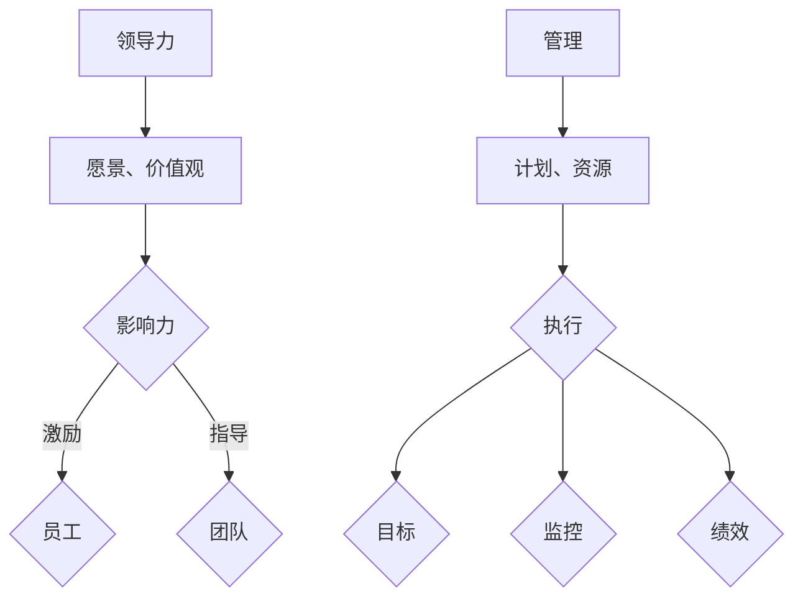
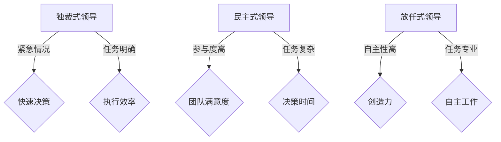

                 

## **领导力的实践：管理一个跨职能技术团队**

### **关键词：领导力、跨职能团队、技术管理、团队协作**

### **摘要：**

本文将深入探讨领导力在管理跨职能技术团队中的重要性。我们将通过详细的分析和实践案例，探讨领导力的核心概念、跨职能团队的特点及其挑战，以及如何通过有效的领导力实践来提升团队效率和达成目标。文章结构分为以下几个部分：

1. **引言**：介绍领导力的意义和在技术团队中的重要性。
2. **领导力核心概念**：讨论领导力与管理的区别、领导风格理论以及领导力的核心要素。
3. **跨职能技术团队的特点**：分析跨职能团队的构成、优势与挑战，以及有效的沟通关键点。
4. **领导力在跨职能技术团队中的实践**：探讨如何建立有效的团队目标、激励和培养团队成员，以及解决跨职能冲突的策略。
5. **核心概念联系与案例分析**：通过实际案例来展示领导力原理与团队行为的联系，以及成功与失败的领导实践。
6. **团队建设与领导力发展**：讨论团队建设步骤、领导力发展计划以及提升领导力的最佳实践。
7. **未来趋势与领导力的持续发展**：探讨技术进步对领导力的要求、新兴领导力理论的探讨以及领导力的未来发展。

### **引言**

领导力是一种关键的技能，不仅在企业高管层面发挥着重要作用，对于技术团队的管理同样至关重要。随着技术的快速发展和企业对创新需求的增加，技术团队变得更加复杂和多样化。这些团队通常由多个职能领域（如开发、测试、设计、运维等）的专业人员组成，他们各自拥有不同的专业技能和知识背景。在这样的背景下，领导力成为协调团队成员、激发团队潜力、解决冲突和实现团队目标的关键因素。

在技术领域，领导力不仅仅是管理技术项目的能力，更是一种激励团队成员、推动技术进步和实现战略目标的能力。领导力涉及多个方面，包括但不限于：愿景的制定、团队协作、沟通技巧、决策能力以及应对变化的能力。有效的领导力能够帮助团队克服挑战，实现目标，并在激烈的市场竞争中保持竞争力。

本文将围绕以下几个核心问题展开：

- **领导力在技术团队中的具体作用是什么？**
- **如何理解和管理跨职能技术团队？**
- **跨职能团队面临哪些挑战，以及如何应对这些挑战？**
- **成功的技术团队领导需要具备哪些关键技能和素质？**
- **如何通过领导力实践来提升跨职能技术团队的绩效和生产力？**

通过对这些问题的探讨，我们将为技术团队领导者提供实用的指导和建议，帮助他们在日益复杂的技术环境中取得成功。

### **领导力与管理的区别**

在探讨领导力在技术团队中的作用之前，有必要首先明确领导力与管理的区别。这两个概念虽然密切相关，但它们在本质上有显著的差异。

**领导力**是一种影响力，是激发团队成员内在动力和实现共同目标的能力。领导力关注的是人的因素，包括激励、愿景、文化和价值观。领导者通过愿景和价值观来引导团队，鼓励团队成员发挥潜力，共同追求目标。

**管理**则是组织和协调资源、实现目标的过程。管理更侧重于过程的控制、资源的优化和目标的实现。管理者负责制定计划、分配资源、监控进度、解决问题和评估绩效。

**领导力与管理的联系**在于它们共同致力于实现团队和组织的成功。领导力提供方向和动力，而管理确保这一动力的有效实施和目标的达成。

**领导力与管理的区别**可以从以下几个方面来理解：

- **焦点不同**：领导力关注人的内在动机和愿景，而管理关注资源的有效配置和过程的执行。
- **持续时间不同**：领导力是一种长期的、持续的激励和引导过程，而管理通常是在特定项目或任务范围内的短期行动。
- **影响力不同**：领导力是通过影响和激励他人来实现目标，而管理更多是通过控制和监督来实现目标。
- **角色不同**：领导者更多地扮演指导者和激励者的角色，而管理者更多地扮演协调者和监督者的角色。

为了更直观地理解领导力与管理的区别，我们可以使用Mermaid图来展示它们之间的关系：

从这张图中可以看出，领导力和管理虽然都是实现团队目标的重要因素，但它们在方向、时间和方式上有所不同。

### **领导风格理论**

领导风格是指领导者处理团队和任务的方式。不同的领导风格适用于不同的情境和团队。常见的领导风格理论包括独裁式领导、民主式领导和放任式领导。

**独裁式领导**（Autocratic Leadership）：独裁式领导风格中，决策权集中在领导者手中，领导者制定决策并要求团队成员执行。这种风格适用于紧急情况或需要快速决策的情境。

**民主式领导**（Democratic Leadership）：民主式领导风格中，领导者鼓励团队成员参与决策过程，通过集思广益来制定决策。这种风格有助于提高团队成员的参与度和满意度，但可能需要更多时间来达成共识。

**放任式领导**（Laissez-faire Leadership）：放任式领导风格中，领导者较少干预团队成员的工作，给予团队成员较大的自主权。这种风格适用于高度专业化的团队，能够激发团队成员的创造力和自主性。

选择合适的领导风格取决于多种因素，包括团队成员的能力、项目复杂度和团队目标。以下是一个Mermaid图，展示了不同领导风格的特点和适用场景：

通过理解这些领导风格，技术团队领导者可以根据实际情况选择最合适的领导方式，以实现团队目标。

### **领导力的核心要素**

领导力是一种复杂的技能集合，包含多个核心要素。以下是几个关键的核心要素：

**1. 沟通技巧**

沟通是领导力的基石。有效的沟通不仅包括传达信息，还包括倾听和理解团队成员的需求和意见。领导者需要清晰地传达愿景和目标，确保团队成员理解并愿意为之努力。同时，领导者也要倾听团队成员的建议和反馈，以便更好地调整策略和改进工作流程。

**2. 激励能力**

激励能力是领导者激发团队成员内在动力和潜能的关键。领导者需要了解团队成员的动机和需求，并运用各种激励手段，如奖励、认可和职业发展机会，来激发团队的热情和动力。

**3. 决策能力**

决策能力是领导者的一项重要技能。领导者需要在不同情境下做出明智的决策，并承担相应的责任。这包括分析问题、权衡利弊、制定方案和实施决策。有效的决策能力有助于确保团队目标的实现和资源的合理分配。

**4. 情绪智力**

情绪智力是指领导者理解和管理自己及他人情绪的能力。情绪智力高的领导者能够更好地应对压力和挑战，保持冷静和理智。同时，他们也能更好地理解和同情团队成员的情绪，促进团队的合作和信任。

**5. 领导风格适应性**

不同的团队和情境可能需要不同的领导风格。领导风格适应性是指领导者能够根据具体情境选择最合适的领导风格。这要求领导者具备灵活性和开放性，能够根据团队成员的需求和任务的特点来调整自己的领导方式。

**6. 持续学习**

领导力是一个不断学习和发展的过程。领导者需要保持好奇心和学习热情，不断更新自己的知识和技能。通过持续学习，领导者能够更好地应对新兴的挑战和变化，保持团队的竞争力和创新力。

通过以上核心要素的掌握和运用，技术团队领导者可以更有效地管理团队，实现目标。

### **跨职能技术团队的构成**

跨职能技术团队是由来自不同职能领域（如开发、测试、设计、运维等）的专业人员组成的。这种团队结构打破了传统职能部门的界限，使得团队成员能够在跨领域的项目中紧密合作，共同推动项目的成功。以下是跨职能技术团队的几个关键组成部分：

**1. 开发团队**

开发团队是跨职能技术团队的核心，负责设计和实现软件系统。开发团队成员通常具备编程、系统架构和软件开发流程等方面的专业知识和技能。他们在项目中扮演着创意和技术实现的角色。

**2. 测试团队**

测试团队负责确保软件系统的质量和稳定性。测试团队成员通常具备软件测试、自动化测试和性能测试等方面的专业知识和技能。他们在项目周期中的不同阶段进行测试，确保软件系统在不同环境和条件下都能正常运行。

**3. 设计团队**

设计团队负责产品的用户体验和界面设计。设计团队成员通常具备用户界面设计、用户体验设计和交互设计等方面的专业知识和技能。他们在项目中关注用户需求，通过设计出直观、易用的界面来提升用户体验。

**4. 运维团队**

运维团队负责确保软件系统的稳定运行和高效性能。运维团队成员通常具备系统运维、网络管理和数据中心管理等方面的专业知识和技能。他们在项目中负责监控、维护和优化软件系统，确保其持续稳定地运行。

**5. 产品管理团队**

产品管理团队负责整个产品的生命周期管理，包括市场调研、需求分析、产品规划和发布等。产品管理团队成员通常具备市场分析、项目管理和管理沟通等方面的专业知识和技能。他们在项目中协调各方资源，确保产品按时按质发布。

通过以上各个职能团队的紧密协作，跨职能技术团队能够高效地推进项目，实现团队目标。

### **跨职能团队的优势与挑战**

跨职能技术团队具有显著的优点，但也面临一些独特的挑战。以下是对这些优劣势的详细分析：

**优势**

**1. 提高工作效率**

跨职能团队通过将不同职能领域的专业人员集中在一起，减少了沟通成本和协调时间。团队成员可以在同一个地点或通过高效的沟通工具进行即时协作，从而提高工作效率。

**2. 促进创新**

跨职能团队鼓励不同专业背景的成员分享知识和观点，这有助于激发创新思维和创造性解决方案。通过跨领域的协作，团队能够从不同角度审视问题，从而找到更优的解决方案。

**3. 更好的客户体验**

跨职能团队能够更好地理解和满足客户的需求。由于团队成员来自不同职能领域，他们能够从多个角度为用户提供定制化的服务，从而提升客户体验。

**4. 更快的响应速度**

跨职能团队在面对紧急情况或变更需求时能够更快地做出响应。团队成员无需等待其他部门的反馈，可以直接参与决策和执行，从而提高响应速度。

**挑战**

**1. 沟通障碍**

尽管跨职能团队能够提高工作效率，但不同职能背景的成员之间可能存在沟通障碍。专业术语、工作流程和理解差异可能导致误解和冲突。

**2. 权力分散**

跨职能团队中权力分散，可能会导致决策过程变得复杂和缓慢。团队成员可能需要协调各自的职能和利益，这有时会影响决策效率和执行力。

**3. 职责模糊**

在跨职能团队中，不同团队成员的职责可能会重叠或模糊，导致责任不明确。这可能导致工作责任分配不公或任务延误。

**4. 人员流动和团队稳定性**

由于团队成员来自不同的部门和职能，人员流动可能较为频繁，影响团队的稳定性和协同效率。新成员需要时间来熟悉团队和文化，这可能会影响团队的整体表现。

**5. 技术和管理挑战**

跨职能团队需要应对复杂的技术挑战和多变的管理需求。团队成员需要具备多样化的技能和经验，以便应对各种复杂的任务和问题。

总之，跨职能技术团队在提高效率和促进创新方面具有显著优势，但也需要克服沟通障碍、职责模糊等挑战。通过有效的领导和团队管理，这些挑战可以得到缓解，从而实现团队的最大潜力。

### **跨职能沟通的关键点**

在跨职能技术团队中，沟通是确保项目顺利进行和团队协作的关键。以下是一些关键的沟通策略和技巧，以帮助团队成员更好地理解和协作：

**1. 明确沟通目标**

每次沟通前，确保所有参与者都明确沟通的目标和期望结果。这有助于集中注意力，确保沟通内容与目标一致，从而提高沟通效率。

**2. 主动倾听**

倾听是有效沟通的关键。领导者应鼓励团队成员在沟通过程中积极倾听对方的意见和需求，确保每个声音都能被听到和理解。

**3. 使用非专业术语**

在跨职能团队中，避免使用专业术语和行话，确保所有团队成员都能理解沟通内容。如果必须使用专业术语，确保对其进行解释。

**4. 确定沟通渠道**

选择合适的沟通渠道，如会议、邮件、即时通讯工具或项目管理系统。确保所有团队成员都能方便地获取信息，并根据具体情况选择最合适的沟通方式。

**5. 建立反馈机制**

建立有效的反馈机制，允许团队成员提供意见和建议。这有助于团队在项目过程中进行持续改进，确保项目目标的实现。

**6. 跨职能会议**

定期举行跨职能会议，确保团队成员能够讨论项目进展、解决问题和分享最佳实践。这些会议有助于增强团队成员之间的联系和合作。

**7. 沟通技巧培训**

为团队成员提供沟通技巧培训，帮助他们提高沟通效率和理解能力。这包括非言语沟通、有效提问和倾听技巧等。

**8. 文化建设**

建设积极、开放和包容的团队文化，鼓励团队成员之间相互尊重和信任。这有助于减少误解和冲突，提高团队的整体协作效率。

通过以上沟通策略和技巧，跨职能技术团队能够更有效地协作，实现项目目标。

### **建立有效的团队目标**

在跨职能技术团队中，建立有效的团队目标是确保团队协作和项目成功的关键步骤。以下是实现这一目标的具体步骤：

**1. 明确项目目标**

首先，团队领导者需要明确项目的总体目标。这些目标应具体、可衡量、可实现、相关性强和时间限制。通过明确目标，团队成员可以更好地理解项目的方向和重要性。

**2. 确定团队目标**

在项目目标的基础上，团队领导者应与团队成员一起制定具体的团队目标。这些目标应与项目目标一致，并为团队成员提供明确的任务和责任。

**3. 细化任务和责任**

将团队目标细化为具体的任务和责任，确保每个团队成员都清楚自己的职责。这有助于避免任务重叠和责任模糊，提高工作效率。

**4. 沟通和共识**

与团队成员进行充分的沟通，确保他们对目标和责任有共同的理解。通过讨论和共识，可以解决潜在的问题和误解，提高团队的凝聚力。

**5. 定期评估和调整**

定期评估团队目标的实现情况，并根据项目进展和团队反馈进行调整。这有助于确保团队始终朝着正确的方向前进，并能够灵活应对变化。

**6. 奖励和激励**

对于达成目标的团队成员，提供奖励和激励，以增强他们的积极性和动力。这可以是物质奖励、精神激励或职业发展机会。

通过以上步骤，跨职能技术团队能够建立有效的团队目标，提高协作效率和项目成功率。

### **激励和培养团队成员**

在跨职能技术团队中，激励和培养团队成员是确保团队长期成功的关键因素。以下是一些有效的策略和方法：

**1. 明确职业发展路径**

为团队成员提供明确的职业发展路径，让他们看到自己的成长和晋升机会。这可以通过制定职业规划、提供培训和晋升机会来实现。

**2. 表扬和认可**

定期表扬和认可团队成员的成就和贡献。这可以是通过公开表彰、奖金、荣誉证书等方式，以增强他们的积极性和归属感。

**3. 提供学习机会**

鼓励团队成员参加技术研讨会、培训课程和行业会议，以提升他们的专业知识和技能。这不仅可以提高团队的整体水平，还可以激发团队成员的学习热情。

**4. 设定挑战性任务**

为团队成员设定具有挑战性的任务和项目，让他们有机会发挥自己的潜力。这可以激发他们的创新思维和解决问题的能力。

**5. 建立团队文化**

建立一个积极、开放和包容的团队文化，鼓励团队成员之间的相互支持和合作。这可以通过团队建设活动、定期团建和内部交流来实现。

**6. 个性化激励**

根据每个团队成员的兴趣和需求，提供个性化的激励措施。例如，对于喜欢独处和专注的成员，可以提供独立项目的机会；对于喜欢社交和互动的成员，可以组织团队活动。

通过以上策略，技术团队领导者可以有效地激励和培养团队成员，提高团队的凝聚力和生产力。

### **解决跨职能冲突的策略**

在跨职能技术团队中，冲突是不可避免的。有效的冲突解决策略有助于减少负面影响，促进团队协作和项目成功。以下是一些实用的策略：

**1. 沟通和倾听**

冲突发生时，首先进行开放和坦诚的沟通。倾听各方的观点和意见，确保每个人都有机会表达自己的想法。这有助于理解冲突的根本原因。

**2. 事实为基础**

在解决冲突时，确保决策和解决方案基于事实，而不是情绪或主观判断。收集相关数据和证据，以便做出客观的决策。

**3. 寻求共识**

鼓励团队成员寻求共识，共同寻找解决问题的方法。通过讨论和协商，找到各方都能接受的解决方案。

**4. 调解和仲裁**

如果冲突无法通过内部解决，可以寻求第三方调解或仲裁。调解员或仲裁者可以提供中立的观点和建议，帮助团队找到合理的解决方案。

**5. 透明度和公正性**

在处理冲突时，保持透明度和公正性。确保所有团队成员都能了解冲突的处理过程和结果，以增强团队的信任和公平感。

**6. 持续跟进**

解决冲突后，持续跟进冲突的解决情况，确保问题得到彻底解决。这有助于防止类似冲突的再次发生。

通过以上策略，技术团队领导者可以有效地解决跨职能冲突，维护团队的和谐与高效。

### **领导力原理与团队行为的联系**

领导力在技术团队中的作用不仅体现在领导者的个人行为上，更深远地影响了团队的整体行为和氛围。以下是通过具体案例来展示领导力原理与团队行为之间联系的实例：

**案例1：明确愿景与目标**

某技术团队在开始一个新的项目时，领导者在首次会议上明确提出了项目的愿景和目标。通过详细的规划、分阶段的里程碑和清晰的预期成果，领导者激发了团队成员的积极性。团队成员看到了项目的实际意义和自己的工作价值，从而更加投入。在项目推进过程中，团队成员主动提出创新的想法和解决方案，团队氛围变得积极向上。

**案例2：沟通与协作**

在一个复杂的项目中，领导者意识到跨部门协作的重要性。他定期组织跨职能会议，确保所有团队成员都能及时沟通和分享信息。通过这种方式，团队成员之间的误解和分歧得到了及时解决，项目进展更加顺利。领导者的有效沟通不仅促进了信息流通，还增强了团队成员之间的信任和协作精神。

**案例3：激励与认可**

领导者认识到激励和认可对团队士气的提升至关重要。他通过设立个人和团队目标，并定期对达到目标的团队成员进行公开表彰和奖励，激发了团队成员的工作热情。在团队取得阶段性成果时，领导者组织了一次庆祝活动，增强了团队的凝聚力和归属感。团队成员在感受到被重视和认可后，工作效率和创新能力都有显著提升。

**案例4：冲突解决与团队稳定**

在一个紧张的项目周期中，领导者面对了多个部门之间的冲突。他通过倾听各方的意见，冷静分析问题的根本原因，并提出了公正且合理的解决方案。通过这种方式，领导者不仅解决了当前的冲突，还提高了团队的稳定性和工作效率。团队成员在感受到领导者的公正和关怀后，更加信任和尊重领导者，团队氛围变得更加和谐。

这些案例表明，领导力的实践不仅影响了团队领导者的个人行为，还深刻地影响了团队的整体行为和氛围。通过有效的领导力，技术团队能够更好地应对挑战，实现目标，并在变化多端的技术环境中保持高效和稳定。

### **成功的跨职能领导实践**

在技术团队管理中，成功的跨职能领导实践不仅能有效提升团队绩效，还能促进创新和项目成功。以下通过几个具体案例，详细阐述这些成功的领导实践及其关键要素：

**案例1：敏捷开发中的跨职能领导**

某科技公司的开发团队采用了敏捷开发方法，以快速响应市场变化。团队领导者意识到，在敏捷环境中，跨职能协作至关重要。因此，他采取了以下措施：

- **明确角色和职责**：领导者为每个团队成员分配明确的角色和职责，确保每个人都知道自己的任务和目标。
- **促进信息透明**：定期召开跨职能会议，确保团队成员了解项目的进展、问题和需求。这有助于及时调整策略和解决问题。
- **鼓励自主决策**：领导者鼓励团队成员在各自职责范围内自主决策，提高团队响应速度和灵活性。
- **持续反馈和改进**：领导者建立了反馈机制，通过定期的回顾会议，团队成员可以分享经验和教训，持续改进工作流程。

通过这些措施，团队在敏捷开发中实现了高效协作，项目按时交付且质量高，客户满意度显著提升。

**案例2：跨部门协作项目**

某大型企业启动了一项涉及多个部门的大型项目，旨在开发一款全新的产品。为了确保项目成功，团队领导者采取了以下策略：

- **建立跨部门沟通渠道**：领导者建立了一个跨部门沟通平台，如即时通讯群组、邮件列表等，确保信息流畅和沟通有效。
- **设立共同目标**：领导者与各部门负责人共同制定项目目标，并确保各部门目标与整体项目目标一致。
- **协调资源分配**：领导者与各部门协商，合理分配资源，确保项目需求得到满足。
- **定期评估进度**：领导者定期召开项目进度会议，各部门负责人汇报进展，解决潜在问题。

通过这些策略，跨部门协作项目顺利进行，最终提前完成，产品在市场上获得了良好的反响。

**案例3：创新团队建设**

某创业公司注重创新，团队领导者为了激发团队的创新潜力，采取了以下措施：

- **提供创新培训**：领导者组织了创新思维和设计思维的培训，提升团队成员的创新技能。
- **鼓励试错文化**：领导者鼓励团队成员在创新过程中尝试新方法，即使失败也不会受到惩罚。
- **设立创新基金**：公司设立了创新基金，支持团队成员提出和实施创新项目。
- **定期举办创新竞赛**：领导者定期举办创新竞赛，激发团队成员的竞争意识和创新热情。

通过这些措施，公司创新氛围浓厚，多个创新项目成功推出，为公司带来了显著的经济效益。

这些案例展示了成功的跨职能领导实践，通过明确目标、促进沟通、合理分配资源和鼓励创新，领导者能够有效提升团队绩效和项目成功率。

### **跨职能团队失败的案例及其启示**

尽管跨职能团队具有很多优势，但在实际操作中，失败的案例也并不少见。以下是一个具体案例及其失败原因和教训，以便我们从中吸取经验和避免类似问题：

**案例：失败的跨部门协作项目**

某大型制造企业在启动一项跨部门协作项目时，旨在通过改进供应链流程来提高生产效率和降低成本。然而，该项目最终以失败告终。以下是该项目失败的主要原因：

1. **目标不明确**：项目启动时，各部门对于项目的目标没有达成一致。生产部门希望缩短生产周期，采购部门希望降低采购成本，而物流部门则希望提高物流效率。由于目标不一致，各部门在执行过程中产生了矛盾和冲突。

2. **沟通不畅**：项目推进过程中，各部门之间的沟通不足，导致信息传递不及时和错误。生产部门的调度计划与采购部门的供应计划不一致，导致生产线频繁停工，生产效率低下。

3. **职责模糊**：项目责任分配不明确，各部门之间的职责重叠和冲突。例如，物流部门负责的仓储管理职责与生产部门的库存管理职责不清晰，导致资源浪费和库存积压。

4. **资源分配不当**：由于各部门之间的利益冲突，项目资源无法合理分配。各部门都希望优先获得资源支持，导致项目关键环节的资源短缺。

5. **缺乏持续监控和调整**：项目启动后，缺乏有效的监控和反馈机制，导致项目进度无法及时调整和纠正。当问题出现时，各部门互相推诿，项目逐渐陷入困境。

**教训与启示**：

- **明确共同目标**：在启动跨职能项目前，确保各部门对项目的目标有共同的理解和认同。通过制定明确的共同目标，减少内部矛盾和冲突。
- **建立有效的沟通机制**：确保各部门之间有畅通的沟通渠道，定期召开会议和分享进展。通过透明的沟通，及时解决问题和调整策略。
- **明确职责分工**：在项目启动前，明确各部门的职责和任务，避免职责重叠和冲突。通过制定职责分工表，确保每个环节都有明确的责任人。
- **合理分配资源**：根据项目需求和优先级，合理分配资源。确保关键环节和关键任务得到足够的资源支持。
- **持续监控和反馈**：建立项目监控和反馈机制，定期评估项目进展和效果，及时调整和纠正。通过持续的监控，确保项目按计划进行。

通过吸取这些教训，技术团队领导者可以避免跨职能团队在项目中的失败，提高项目成功的可能性。

### **团队建设与领导力发展**

团队建设是提升团队绩效和协作效率的关键，而领导力发展则是确保团队长期稳定和持续进步的基础。以下将探讨团队建设的关键步骤、领导力发展计划以及最佳实践。

#### **团队建设的关键步骤**

1. **明确团队目标**：团队建设的第一步是确保所有团队成员对团队的目标有共同的理解和认同。这可以通过制定清晰的团队使命、愿景和目标来实现。

2. **建立团队文化**：团队文化是团队协作和成员关系的基础。领导者应通过价值观、信念和行为规范来塑造团队文化，鼓励积极、开放和包容的氛围。

3. **增强团队凝聚力**：通过定期的团队活动、团建和社交活动，增强团队成员之间的联系和信任。这有助于提高团队凝聚力和归属感。

4. **提高沟通效率**：建立有效的沟通机制，确保团队成员能够及时、准确地交流信息。这可以通过定期的团队会议、即时通讯工具和项目管理系统来实现。

5. **培养团队成员**：为团队成员提供培训和发展机会，提升他们的技能和知识。这不仅可以提高团队整体水平，还可以激励团队成员的职业发展。

#### **领导力发展计划**

1. **评估领导力需求**：通过评估现有领导者的能力和不足，确定领导力发展的具体需求。

2. **制定培训计划**：根据领导力需求，制定详细的培训计划。这可以包括领导力工作坊、管理课程、在线培训和导师指导等。

3. **提供实践机会**：为领导者提供实际的管理和领导机会，让他们在真实场景中锻炼和提升领导能力。

4. **建立反馈机制**：通过定期的反馈和评估，帮助领导者了解自己的表现和改进方向。

5. **鼓励持续学习**：领导者应保持持续学习的态度，不断更新自己的知识和技能，以适应不断变化的环境和挑战。

#### **最佳实践**

1. **领导力模型**：采用成熟的领导力模型，如PAC模型（性能、能力、关系），帮助领导者全面发展和提升领导能力。

2. **角色扮演**：通过角色扮演和模拟练习，让领导者体验不同情境下的领导行为，提高应对复杂问题的能力。

3. **跨部门交流**：鼓励领导者参与跨部门的交流和合作，拓宽视野，提升跨职能领导能力。

4. **领导力社区**：建立领导力社区，为领导者提供交流、学习和分享的平台，促进领导力的持续发展。

通过以上团队建设和领导力发展的步骤和计划，技术团队领导者可以提升团队的整体绩效和协作效率，实现长期成功。

### **技术进步对领导力的要求**

随着技术的快速进步，领导力在技术团队中的作用和需求也在不断变化。以下从几个方面探讨技术进步对领导力的要求：

**1. 技术多样性和快速变化**

技术的快速发展带来了多样性和变化，领导者需要具备快速学习和适应新技术的能力。这要求领导者不仅自己要持续更新知识，还要激励团队成员跟上技术潮流，以确保团队在竞争激烈的市场中保持领先地位。

**2. 数字化和自动化**

数字化和自动化正在改变传统的生产和服务模式，对领导力提出了新的要求。领导者需要理解这些技术如何影响业务流程和团队协作，并能够有效管理和利用这些技术资源，提高生产效率和服务质量。

**3. 创新和文化多样性**

技术进步推动创新，领导者需要具备激发团队创新思维和创造力的能力。此外，技术团队往往具有多元文化背景，领导者需要理解和尊重文化差异，促进团队的合作和沟通。

**4. 远程工作和虚拟团队**

远程工作和虚拟团队的普及要求领导者具备远程管理和领导能力。领导者需要通过有效的沟通工具和协作平台来保持团队联系，确保团队目标的实现。

**5. 伦理和隐私**

随着数据隐私和伦理问题日益凸显，领导者需要具备处理这些问题的能力，确保团队在技术进步的过程中遵循道德和法律规定。

通过适应技术进步带来的这些新要求，技术团队领导者可以更有效地管理和领导团队，实现长期成功。

### **新兴领导力理论的探讨**

随着社会和技术的快速发展，领导力理论也在不断演进。以下探讨几种新兴的领导力理论，以及它们如何影响技术团队的管理：

**1. 情感领导力（Emotional Intelligence Leadership）**

情感领导力强调领导者理解和管理自己及他人的情绪，以及建立基于情感信任的团队关系。这种领导力要求领导者具备高情商，能够识别和调节情绪，从而促进团队的协作和创新。对于技术团队来说，情感领导力有助于提高团队成员的工作满意度和生产力，营造积极的工作氛围。

**2. 生态领导力（Ecological Leadership）**

生态领导力强调领导者不仅要关注团队的内部环境，还要关注团队与外部环境（如客户、合作伙伴、竞争对手等）的互动。这种领导力注重可持续性和生态平衡，鼓励领导者通过合作和共享来实现共同目标。对于技术团队，生态领导力有助于建立与外部环境的良好关系，促进资源的有效利用和项目的成功实施。

**3. 网络领导力（Network Leadership）**

网络领导力关注领导者如何在复杂的网络环境中建立和维护有效的联系和关系。在这种领导力模式中，领导者被视为网络中的节点，通过与其他节点（如团队成员、合作伙伴、供应商等）建立联系，共同推动项目的进展。对于技术团队，网络领导力有助于整合内外部资源，提高团队的协同效率，实现跨领域的创新和合作。

**4. 适应性领导力（Adaptive Leadership）**

适应性领导力强调领导者需要具备灵活和适应变化的能力，能够迅速调整策略和应对不确定性。这种领导力要求领导者具备前瞻性和创新思维，能够在动态环境中引导团队。对于技术团队，适应性领导力有助于团队在面对快速变化的技术和市场时，保持灵活性和创新能力，从而实现长期成功。

这些新兴的领导力理论为技术团队领导者提供了新的视角和方法，帮助他们更有效地管理团队，应对复杂多变的环境。

### **领导力的未来发展**

展望未来，领导力将继续演变，以适应不断变化的技术环境和社会需求。以下几个趋势值得特别关注：

**1. 人工智能与领导力**

随着人工智能（AI）的不断发展，领导者将面临新的挑战和机遇。AI技术可以辅助领导者进行数据分析和决策，提高决策效率。然而，领导者也需要理解AI的局限性，并确保技术在伦理和道德框架内使用。未来的领导力将需要与AI技术紧密融合，以实现更高的管理效能和创新能力。

**2. 数字化领导力**

数字化转型的浪潮将深刻影响组织结构和领导力模式。未来的领导者需要具备数字素养，能够理解和运用数字化工具和平台来优化业务流程和提升团队效率。此外，领导者还需要培养数字化思维，鼓励团队成员拥抱数字化变革，以应对快速变化的市场环境。

**3. 伦理领导力**

随着数据隐私和伦理问题日益突出，领导者将需要在技术决策中融入伦理考量。未来的领导力将更加重视社会责任和道德责任，确保技术进步不会损害社会利益和个体权益。领导者需要具备伦理领导力，能够在技术创新和道德责任之间找到平衡。

**4. 跨文化领导力**

全球化和多元文化的趋势要求领导者具备跨文化领导力。未来的领导者需要理解和尊重不同文化背景的团队成员，建立包容和多元化的团队文化。这有助于促进团队的协作和创新能力，提升组织在国际市场的竞争力。

**5. 持续学习和成长**

未来的领导者将更加注重持续学习和个人成长。随着知识的更新速度加快，领导者需要具备终身学习的态度，不断提升自己的知识和技能。这包括参与培训、学习新技术和与行业专家进行交流，以保持自身的竞争力。

通过关注这些发展趋势，未来的领导力将更加灵活、多元和前瞻，能够更好地应对复杂多变的环境，实现组织的目标和愿景。

### **总结与建议**

通过本文的探讨，我们可以得出以下关键结论：

- **领导力在技术团队管理中至关重要**，它不仅影响团队成员的积极性和协作效率，还决定了团队在复杂多变的技术环境中的适应能力和创新能力。
- **跨职能技术团队的多样性和协作性带来了显著的优势**，但同时也面临沟通障碍、职责模糊等挑战。有效的领导和团队管理策略是克服这些挑战的关键。
- **领导力的发展需要持续的学习和培养**，领导者需要不断提升自身的知识、技能和情感智力，以应对快速变化的技术环境和社会需求。
- **技术进步对领导力提出了新的要求**，领导者需要具备数字化素养、伦理意识和跨文化沟通能力，以确保团队在技术创新和伦理责任之间找到平衡。

针对技术团队领导者，我们提出以下建议：

- **明确团队目标和愿景**，确保团队成员对团队方向有共同的理解和认同。
- **建立有效的沟通机制**，确保团队信息流通和协作顺畅。
- **注重团队成员的职业发展和激励**，提供培训和发展机会，激励团队成员提升自身能力。
- **培养跨职能协作精神**，通过团队建设和领导力培训，提升团队的协作效率和创新能力。
- **持续关注技术进步和社会变化**，灵活调整领导策略，确保团队在动态环境中保持竞争优势。

通过这些措施，技术团队领导者可以更有效地管理团队，实现组织的目标和愿景。

