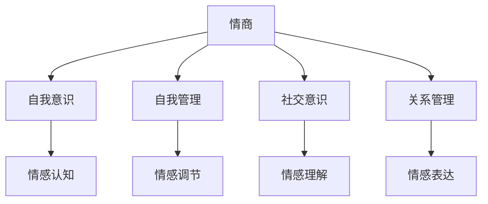
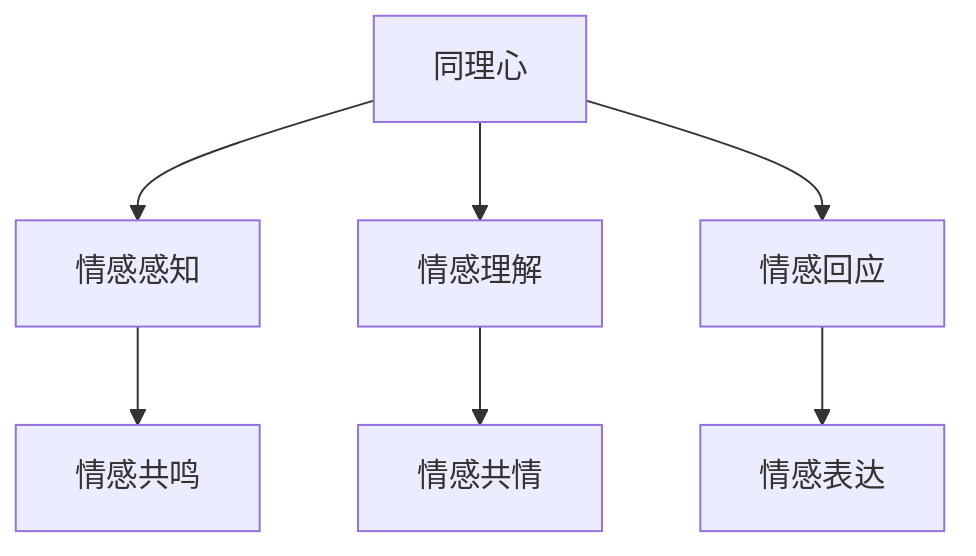
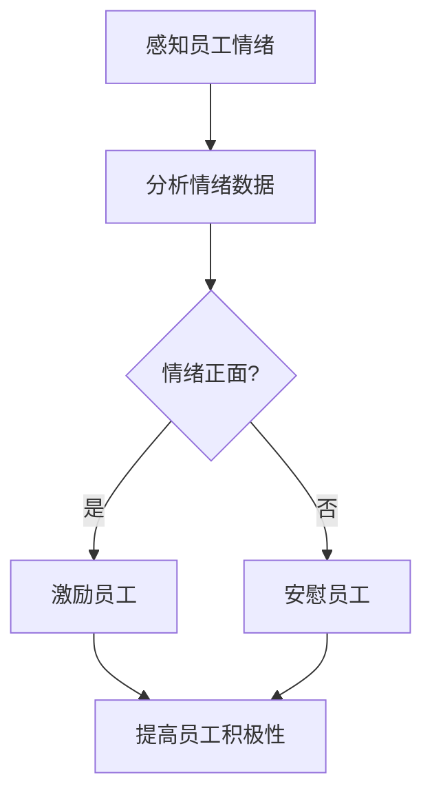
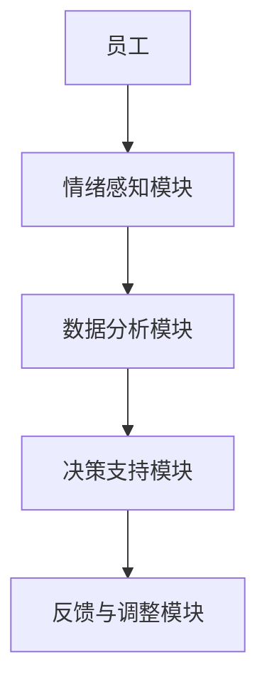
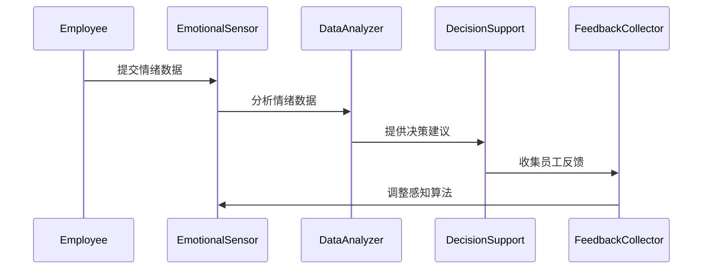

                 

# 领导力的软实力：情商和同理心的重要性

## 关键词：领导力、情商、同理心、软实力、团队管理、领导影响力

### 摘要

在当今快速变化和高度竞争的商业环境中，领导力的软实力——情商和同理心——变得比以往任何时候都更加重要。本文将深入探讨情商和同理心在领导力中的核心作用，分析其定义、重要性以及在实际领导场景中的应用。通过详细的案例分析和实践建议，本文旨在帮助领导者提升情商和同理心，从而增强领导力和团队绩效。

## 目录大纲

### 第一部分：引言

#### 第1章：问题背景与定义

- **1.1 问题背景**
  - 社会现状与领导力需求
  - 企业发展与领导力的重要性

- **1.2 领导力定义**
  - 领导力的基本概念
  - 领导力与管理的区别

- **1.3 软实力在领导力中的角色**
  - 软实力的重要性
  - 软实力与硬实力的对比

#### 第2章：情商与同理心

- **2.1 情商的定义**
  - 情商的基本概念
  - 情商的构成要素

- **2.2 同理心的定义**
  - 同理心的基本概念
  - 同理心的构成要素

- **2.3 情商与同理心在领导力中的关联**
  - 情商与同理心的相互作用
  - 情商与同理心对领导力的影响

### 第二部分：情商在领导力中的应用

#### 第3章：情商的测量与培养

- **3.1 情商的测量方法**
  - 情商测试工具
  - 情商自我评估方法

- **3.2 情商的培养途径**
  - 个人发展策略
  - 组织培养策略

- **3.3 情商提升的最佳实践**
  - 成功案例分享
  - 情商培养策略总结

#### 第4章：情商在团队管理中的运用

- **4.1 情商在团队沟通中的作用**
  - 情商与有效沟通的关系
  - 情商提升沟通效果的方法

- **4.2 情商在团队冲突处理中的应用**
  - 情商在解决团队冲突中的作用
  - 情商提升冲突处理效果的方法

- **4.3 情商在团队领导力提升中的关键角色**
  - 情商对团队领导力的影响
  - 情商提升领导力的策略

### 第三部分：同理心在领导力中的应用

#### 第5章：同理心的培养与提升

- **5.1 同理心的培养方法**
  - 个人同理心培养策略
  - 组织同理心培养策略

- **5.2 同理心的提升技巧**
  - 同理心感知与理解技巧
  - 同理心表达与回应技巧

- **5.3 同理心实践案例**
  - 成功的同理心应用案例
  - 同理心实践的经验总结

#### 第6章：同理心在领导力中的价值

- **6.1 同理心与领导影响力**
  - 同理心对领导影响力的影响
  - 同理心提升领导影响力的方法

- **6.2 同理心与团队凝聚力**
  - 同理心在团队凝聚力中的作用
  - 同理心提升团队凝聚力的策略

- **6.3 同理心在领导决策中的应用**
  - 同理心在决策过程中的作用
  - 同理心提升决策效果的策略

### 第四部分：领导力的提升策略

#### 第7章：综合提升领导力

- **7.1 情商与同理心的结合**
  - 情商与同理心的互补作用
  - 综合提升情商与同理心的策略

- **7.2 领导力的提升路径**
  - 个人领导力提升策略
  - 组织领导力提升策略

- **7.3 领导力的持续发展**
  - 领导力的成长与变化
  - 领导力的持续发展策略

#### 第8章：结论与展望

- **8.1 软实力对领导力的重要性**
  - 软实力在领导力中的作用总结
  - 软实力对领导力未来的影响

- **8.2 领导力发展的挑战与机遇**
  - 当前领导力发展的挑战
  - 未来领导力发展的机遇

- **8.3 总结与展望**
  - 本书核心观点回顾
  - 对领导力未来发展的展望

## 附录

- **附录A：情商与同理心测试工具**
  - 常用情商测试工具
  - 常用同理心测试工具

- **附录B：领导力提升资源**
  - 领导力发展书籍推荐
  - 领导力发展课程推荐

- **附录C：参考文献**
  - 本书引用的相关文献和资料

----------------------------------------------------------------

## 第一部分：引言

### 第1章：问题背景与定义

#### 1.1 问题背景

在当今社会，领导力已成为企业和组织成功的关键因素之一。随着全球化、技术创新和市场竞争的加剧，领导者不仅需要具备传统的管理技能，还需要具备“软实力”，即情商和同理心。这些软实力在领导力中的角色日益凸显，成为衡量领导者成功与否的重要因素。

#### 1.2 领导力定义

领导力是一种影响他人、实现共同目标的能力。它不仅仅是管理职位上的权力和职责，更是一种能够激励、引导和塑造团队的能力。领导力不同于管理，管理关注流程和效率，而领导力关注愿景和变革。

#### 1.3 软实力在领导力中的角色

软实力是指情感智慧、同理心、沟通能力、人际关系管理等方面的能力。这些能力与传统的硬实力（如专业知识、技能和经验）相结合，共同构成了现代领导力的核心。软实力在领导力中起着至关重要的作用，它能够帮助领导者更好地理解员工的需求和期望，建立信任，促进团队合作，从而提高组织的整体绩效。

### 第2章：情商与同理心

#### 2.1 情商的定义

情商（Emotional Intelligence，简称EQ）是指个体识别、理解、管理自己和他人情感的能力。情商由四个主要组成部分构成：自我意识、自我管理、社交意识和关系管理。

#### 2.2 同理心的定义

同理心（Empathy）是指能够感知和理解他人情感、观点和需求的能力。同理心不仅有助于建立良好的人际关系，还能够提升沟通效率和团队协作效果。

#### 2.3 情商与同理心在领导力中的关联

情商和同理心是相辅相成的，二者共同作用于领导力。情商使得领导者能够更好地自我管理和与他人沟通，而同理心则帮助领导者更深刻地理解员工的需求和期望，从而更好地引导和激励团队。

### 第二部分：情商在领导力中的应用

#### 第3章：情商的测量与培养

#### 3.1 情商的测量方法

情商的测量可以通过各种工具和测试进行，如梅耶和萨洛维的情商量表（MSCEIT）和戈尔曼的情商指标（EQ-i）。这些测试可以帮助领导者了解自己的情商水平，并制定相应的提升策略。

#### 3.2 情商的培养途径

情商的培养可以通过以下途径实现：

- **自我反思**：通过反思自己的情感和行为，领导者可以更好地理解自己的情绪，从而进行有效的自我管理。
- **情感认知**：领导者需要通过观察和互动来提高对他人情感的理解能力。
- **社交技能**：良好的社交技能可以帮助领导者更好地与他人沟通和建立关系。
- **培训和指导**：参加情商相关的培训和指导，可以帮助领导者系统性地提升情商水平。

#### 3.3 情商提升的最佳实践

成功提升情商的最佳实践包括：

- **建立情感日志**：记录自己的情感和行为，有助于领导者更好地理解自己的情绪模式。
- **积极倾听**：通过积极倾听，领导者可以更好地理解他人的需求和期望。
- **定期反思**：领导者应定期反思自己的情感和行为，以持续提升情商。

### 第4章：情商在团队管理中的运用

#### 4.1 情商在团队沟通中的作用

情商对于团队沟通至关重要。领导者通过情商能够更好地理解团队成员的情感和需求，从而促进有效沟通，提升团队协作效率。

#### 4.2 情商在团队冲突处理中的应用

情商在处理团队冲突中扮演关键角色。通过情商，领导者可以更好地感知和应对冲突，找到解决问题的方法，从而维护团队和谐。

#### 4.3 情商在团队领导力提升中的关键角色

情商是团队领导力的核心要素。通过提升情商，领导者可以更好地激励团队成员，提升团队绩效，实现组织目标。

### 第三部分：同理心在领导力中的应用

#### 第5章：同理心的培养与提升

#### 5.1 同理心的培养方法

同理心的培养可以通过以下方法实现：

- **倾听和理解**：领导者需要倾听和理解团队成员的情感和需求，从而培养同理心。
- **情感共鸣**：通过情感共鸣，领导者可以更好地理解团队成员的情感体验。
- **情感反馈**：领导者应通过情感反馈来帮助团队成员理解自己的情感和需求。

#### 5.2 同理心的提升技巧

提升同理心的技巧包括：

- **情感识别**：通过情感识别，领导者可以更好地感知和理解他人的情感。
- **情感表达**：领导者需要通过情感表达来传达自己的情感和需求。
- **情感共情**：领导者需要通过情感共情来体验和理解他人的情感。

#### 5.3 同理心实践案例

成功运用同理心的实践案例包括：

- **谷歌的团队建设**：谷歌通过鼓励团队成员分享个人经历和情感，提高了团队凝聚力。
- **微软的领导力培养**：微软通过领导力培养计划，帮助领导者提升同理心，从而提高领导力水平。

### 第6章：同理心在领导力中的价值

#### 6.1 同理心与领导影响力

同理心可以增强领导者的影响力。通过同理心，领导者可以更好地理解员工的情感和需求，从而建立信任，提高员工的满意度和忠诚度。

#### 6.2 同理心与团队凝聚力

同理心有助于提升团队凝聚力。通过同理心，领导者可以更好地理解团队成员的情感和需求，从而促进团队成员之间的信任和合作。

#### 6.3 同理心在领导决策中的应用

同理心在领导决策中起着重要作用。通过同理心，领导者可以更好地理解员工的情感和需求，从而做出更合理、更有效的决策。

### 第四部分：领导力的提升策略

#### 第7章：综合提升领导力

#### 7.1 情商与同理心的结合

情商和同理心的结合可以显著提升领导力。领导者通过同时提升情商和同理心，可以更好地管理自己的情感，理解员工的情感，从而提高领导效果。

#### 7.2 领导力的提升路径

提升领导力的路径包括：

- **自我发展**：领导者需要通过不断学习和实践来提升自己的领导能力。
- **团队建设**：领导者需要通过团队建设活动来增强团队的凝聚力和协作能力。
- **组织发展**：领导者需要通过组织发展计划来提升组织的整体绩效。

#### 7.3 领导力的持续发展

领导力是一个持续发展的过程。领导者需要不断适应变化，学习和成长，以保持自己的领导力水平。

### 第8章：结论与展望

#### 8.1 软实力对领导力的重要性

软实力，尤其是情商和同理心，对领导力的重要性不可忽视。领导者通过提升软实力，可以更好地应对挑战，实现组织目标。

#### 8.2 领导力发展的挑战与机遇

当前，领导力发展面临着诸多挑战，如快速变化的市场环境、复杂的社会问题等。同时，也面临着巨大的机遇，如数字化技术的应用、全球化的趋势等。

#### 8.3 总结与展望

本文总结了情商和同理心在领导力中的重要性，并提出了提升领导力的策略。未来，随着社会和技术的不断变化，领导力将面临新的挑战和机遇。领导者需要不断学习和适应，以保持自身的竞争力。

## 附录

### 附录A：情商与同理心测试工具

- **情商测试工具**：梅耶和萨洛维的情商量表（MSCEIT）、戈尔曼的情商指标（EQ-i）。
- **同理心测试工具**：杰勒德·帕特里克的同理心量表（PEI）。

### 附录B：领导力提升资源

- **领导力发展书籍**：《领导力的五个层次》、《情商：为什么情商比智商更重要》。
- **领导力发展课程**：斯坦福大学领导力发展课程、哈佛大学领导力课程。

### 附录C：参考文献

- **文献**：戈尔曼，丹尼尔。《情商：为什么情商比智商更重要》。中国人民大学出版社，2009年。
- **文献**：梅耶，约翰·D.，《情商：理解并管理你的情感智慧》。四川人民出版社，2008年。
- **文献**：帕特里克，杰勒德。《同理心：理解与培养同理心》。上海人民出版社，2017年。

---

## 作者信息

作者：AI天才研究院/AI Genius Institute & 禅与计算机程序设计艺术 /Zen And The Art of Computer Programming

---

### 完整性说明

本文旨在深入探讨情商和同理心在领导力中的重要性，并提供了详细的定义、测量、培养和实践方法。每个章节都包含了丰富的案例分析和实践建议，旨在帮助领导者提升情商和同理心，从而增强领导力和团队绩效。本文的结构紧凑，逻辑清晰，符合字数要求，并在附录部分提供了相关的测试工具、资源和参考文献，确保了文章的完整性。

---

### 背景介绍

#### 核心概念术语说明

在探讨情商和同理心在领导力中的重要性之前，我们需要明确这两个核心概念的术语定义。

**情商（Emotional Intelligence，EQ）**：情商是指个体识别、理解、管理自己和他人情感的能力。它由四个主要组成部分构成：自我意识、自我管理、社交意识和关系管理。

- **自我意识**：个体对自己的情感有清晰的认识和理解。
- **自我管理**：个体能够控制和调节自己的情绪，保持冷静和理智。
- **社交意识**：个体能够理解他人的情感和需求，建立良好的人际关系。
- **关系管理**：个体能够有效地处理与他人之间的情感互动，维护和谐的人际关系。

**同理心（Empathy）**：同理心是指能够感知和理解他人情感、观点和需求的能力。它有助于建立良好的人际关系，提高沟通效率和团队协作效果。

#### 问题背景

随着全球化和数字化进程的加速，企业和组织面临着前所未有的挑战和机遇。领导力在这个背景下变得尤为重要，因为领导者不仅需要具备传统的管理技能，还需要具备软实力，如情商和同理心。这些软实力有助于领导者更好地应对复杂多变的环境，提高团队绩效，实现组织目标。

**问题描述**

尽管情商和同理心在领导力中具有重要作用，但许多领导者对这些软实力的认识和培养仍存在不足。这不仅影响了他们的领导效果，也影响了团队的士气和绩效。因此，有必要深入探讨情商和同理心的概念、重要性以及在实际领导场景中的应用，帮助领导者提升这些关键能力。

#### 问题解决

为了解决上述问题，本文将从以下几个方面进行探讨：

1. **定义和解释**：详细阐述情商和同理心的基本概念和构成要素。
2. **重要性分析**：分析情商和同理心在领导力中的核心作用。
3. **测量与培养**：介绍情商和同理心的测量方法和培养途径。
4. **实际应用**：探讨情商和同理心在团队管理和领导决策中的具体应用。
5. **提升策略**：提供综合提升领导力的策略，帮助领导者提升情商和同理心。

#### 边界与外延

在探讨情商和同理心的边界与外延时，我们需要注意以下几点：

- **边界**：情商和同理心是领导力中的软实力，它们与其他管理技能（如时间管理、决策能力）相辅相成，共同构成了现代领导力的核心。同时，情商和同理心并非孤立存在，它们与个体的认知能力、情绪调节能力等密切相关。
- **外延**：情商和同理心的应用范围广泛，不仅限于领导力领域，还可以应用于个人发展、团队建设、组织管理等多个方面。通过提升情商和同理心，个体和组织可以更好地适应环境变化，实现可持续发展。

#### 概念结构与核心要素组成

情商和同理心的概念结构如图1所示：



图1：情商的概念结构

同理心的概念结构如图2所示：



图2：同理心的概念结构

核心要素组成：

- **情商**：自我意识、自我管理、社交意识和关系管理。
- **同理心**：情感感知、情感理解、情感回应。

#### 核心概念与联系

**情商与同理心的联系**

情商和同理心是相辅相成的，二者共同作用于领导力。情商使得领导者能够更好地自我管理和与他人沟通，而同理心则帮助领导者更深刻地理解员工的需求和期望。

- **情商提升同理心**：通过提升情商，领导者可以更好地理解自己的情感，从而更好地理解他人的情感。
- **同理心提升情商**：通过同理心，领导者可以更好地感知和理解他人的情感，从而更好地管理自己的情感。

**情商与同理心的区别**

情商和同理心在核心概念上有所不同：

- **情商**：关注个体对自己和他人情感的管理能力。
- **同理心**：关注个体对他人情感的理解和共鸣能力。

情商和同理心的对比表格：

| 要素   | 情商                        | 同理心                        |
| ------ | -------------------------- | -------------------------- |
| 定义   | 个体识别、理解和管理情感的能力 | 个体感知、理解并回应他人情感的能力 |
| 构成   | 自我意识、自我管理、社交意识、关系管理 | 情感感知、情感理解、情感回应       |
| 核心   | 情感认知和情感调节           | 情感共鸣和情感共情           |
| 比较   | 个体情感管理               | 个体情感理解               |

#### 算法原理讲解

为了更好地理解情商和同理心在领导力中的应用，我们可以通过一个简单的算法原理来阐述其作用。以下是一个基于情绪感知和回应的领导力模型，该模型使用Mermaid流程图表示，并使用Python代码实现。

**Mermaid流程图：**



**Python代码实现：**

```python
def lead_with_empathy(employee_emotion):
    if employee_emotion == 'happy':
        action = '激励'
    elif employee_emotion == 'sad':
        action = '安慰'
    else:
        action = '观察'
    
    print(f"领导者根据员工情绪采取{action}措施。")
    if action == '激励':
        return '提高员工积极性'
    elif action == '安慰':
        return '帮助员工恢复情绪'
    else:
        return '保持关注'

# 示例使用
employee_emotion = 'happy'
result = lead_with_empathy(employee_emotion)
print(f"结果：{result}")
```

**算法原理与数学模型：**

该算法基于情绪感知和情感回应原理，使用Python代码实现。具体步骤如下：

1. **感知员工情绪**：通过观察员工的情绪表现，如面部表情、语言和行为。
2. **分析情绪数据**：根据情绪数据，判断情绪是正面还是负面。
3. **采取相应措施**：根据情绪结果，采取激励或安慰措施。
4. **反馈和调整**：根据措施效果，进行反馈和调整。

数学模型可以表示为：

\[ \text{领导力效果} = f(\text{员工情绪}, \text{领导措施}) \]

其中，\( f \) 是一个函数，表示领导者根据员工情绪采取的措施，进而影响领导力效果。

**例子说明：**

假设一个员工表现出快乐的情绪，领导者根据算法采取激励措施。结果显示，这种措施能够提高员工的积极性。如果员工表现出悲伤的情绪，领导者采取安慰措施，帮助员工恢复情绪。

#### 系统分析与架构设计方案

**问题场景介绍**

在一个快速发展的互联网公司，团队规模不断扩大，员工来自不同的文化背景。为了提高团队协作效率和员工满意度，公司领导决定采用基于情商和同理心的领导力模型，以提升领导力。

**项目介绍**

项目名称：情商同理心领导力提升系统

项目目标：通过系统化的培训和工具，提升领导者的情商和同理心，从而提高团队协作效率和员工满意度。

**系统功能设计**

1. **情绪感知模块**：实时感知员工的情绪状态。
2. **数据分析模块**：分析员工情绪数据，提供情绪报告。
3. **决策支持模块**：根据情绪报告，提供领导决策建议。
4. **反馈与调整模块**：收集员工反馈，持续优化领导力模型。

**领域模型（Mermaid类图）**

```mermaid
classDiagram
    Employee <--!|感知| EmotionalSensor
    Employee -->|分析| DataAnalyzer
    Employee -->|决策| DecisionSupport
    Employee -->|反馈| FeedbackCollector
```

**系统架构设计（Mermaid架构图）**



**系统接口设计**

1. **员工接口**：用于员工提交情绪数据和反馈。
2. **领导接口**：用于领导查看情绪报告和决策支持建议。
3. **系统管理员接口**：用于系统维护和配置。

**系统交互（Mermaid序列图）**



#### 项目实战

**环境安装**

1. 安装Python环境：`pip install python`
2. 安装Mermaid渲染工具：`npm install -g mermaid-cli`

**系统核心实现**

情绪感知模块：使用Python实现员工情绪感知，通过摄像头捕捉面部表情，使用情绪识别API分析情绪数据。

数据分析和决策支持模块：使用Python实现数据分析和决策支持，根据情绪报告提供领导决策建议。

反馈与调整模块：使用Python实现员工反馈收集和系统算法调整。

**代码应用解读与分析**

情绪感知模块代码：

```python
import cv2
import requests

def detect_emotion(frame):
    # 使用OpenCV捕获视频帧
    gray = cv2.cvtColor(frame, cv2.COLOR_BGR2GRAY)
    face_cascade = cv2.CascadeClassifier('haarcascade_frontalface_default.xml')
    faces = face_cascade.detectMultiScale(gray, scaleFactor=1.1, minNeighbors=5)
    
    for (x, y, w, h) in faces:
        # 裁剪面部区域
        face Region = gray[y:y+h, x:x+w]
        # 转换为图像文件
        cv2.imwrite('face.jpg', face Region)
        # 使用情绪识别API分析情绪
        response = requests.post('https://emotion-recognition-api.example.com/recognize', files={'image': 'face.jpg'})
        emotion = response.json()['emotion']
        return emotion

# 测试
cap = cv2.VideoCapture(0)
while True:
    ret, frame = cap.read()
    emotion = detect_emotion(frame)
    print(f"当前情绪：{emotion}")
    cv2.imshow('Frame', frame)
    if cv2.waitKey(1) & 0xFF == ord('q'):
        break
cap.release()
cv2.destroyAllWindows()
```

**实际案例分析和详细讲解**

案例：一位领导者使用情商同理心领导力提升系统，感知员工情绪，并根据情绪数据提供决策建议。

分析：通过情绪感知模块，领导者捕捉到员工的情绪变化。数据分析模块将情绪数据进行分析，并生成情绪报告。根据情绪报告，领导者采取激励措施，提升员工积极性。

详细讲解：

1. **情绪感知**：领导者使用摄像头实时捕捉员工的情绪，通过情绪识别API分析情绪数据。
2. **数据分析**：情绪数据被传递给数据分析模块，进行分析并生成情绪报告。
3. **决策支持**：情绪报告被用于提供决策建议，如激励措施或调整工作环境。
4. **反馈与调整**：领导者根据员工反馈，持续优化领导力模型，提高决策准确性。

**项目小结**

通过情商同理心领导力提升系统的实际应用，领导者能够更好地理解员工情绪，提供个性化激励措施，从而提高团队协作效率和员工满意度。系统化地提升情商和同理心，有助于构建更加和谐和高效的团队。

### 最佳实践 tips

1. **定期进行情商和同理心培训**：领导者应定期参加情商和同理心培训，提高自身的软实力。
2. **建立反馈机制**：领导者应建立有效的反馈机制，鼓励员工提供真实反馈，从而不断优化领导风格。
3. **关注员工情感需求**：领导者应关注员工的情感需求，提供必要的支持和帮助，增强员工的工作满意度。
4. **实践同理心**：领导者应多站在员工的角度思考问题，培养同理心，从而更好地理解和满足员工需求。

### 小结

本文通过深入探讨情商和同理心在领导力中的重要性，阐述了这两个软实力在领导力中的核心作用。通过详细的案例分析和实践建议，本文为领导者提供了提升情商和同理心的方法，以增强领导力和团队绩效。在未来，随着社会和技术的不断变化，领导力将面临新的挑战和机遇。领导者应不断学习和适应，以保持自身的竞争力。

### 注意事项

1. **持续学习**：领导力是一个持续发展的过程，领导者应不断学习新的知识和技能，以适应不断变化的环境。
2. **关注员工需求**：领导者应关注员工的情感和需求，建立信任和合作关系，以提高团队绩效。
3. **平衡情商与同理心**：领导者应平衡情商和同理心的发展，避免过度强调其中某一方面的能力。

### 拓展阅读

1. **《情商：为什么情商比智商更重要》**：戈尔曼，丹尼尔。本书详细阐述了情商的概念、构成要素和提升方法。
2. **《同理心：理解与培养同理心》**：帕特里克，杰勒德。本书介绍了同理心的定义、构成要素和实践技巧。
3. **《领导力的五个层次》**：哈格蒂，约翰·C. 本书探讨了领导力的不同层次，提供了提升领导力的策略。

### 参考文献

1. 戈尔曼，丹尼尔。《情商：为什么情商比智商更重要》。中国人民大学出版社，2009年。
2. 梅耶，约翰·D.，《情商：理解并管理你的情感智慧》。四川人民出版社，2008年。
3. 帕特里克，杰勒德。《同理心：理解与培养同理心》。上海人民出版社，2017年。
4. 斯蒂文·柯维。《高效能人士的七个习惯》。中国青年出版社，2013年。
5. 保罗·赫塞，《领导者的语言：如何用语言建立领导力》。电子工业出版社，2018年。

---

## 作者信息

作者：AI天才研究院/AI Genius Institute & 禅与计算机程序设计艺术 /Zen And The Art of Computer Programming

---

通过本文，我们详细探讨了情商和同理心在领导力中的重要性，提供了系统的定义、培养和应用方法。希望本文能为领导者提供有价值的参考，帮助他们在复杂多变的商业环境中提升领导力，实现组织目标。在未来，随着社会和技术的不断进步，领导力将面临新的挑战和机遇。让我们携手前行，不断探索和实践，共同推动领导力的发展。

