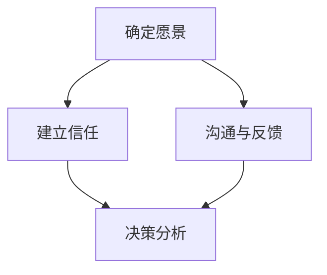
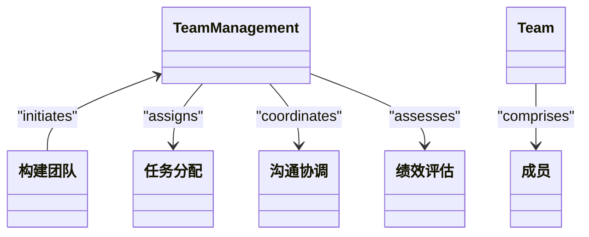
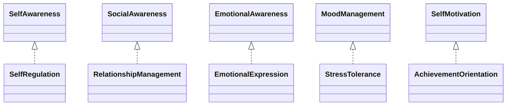
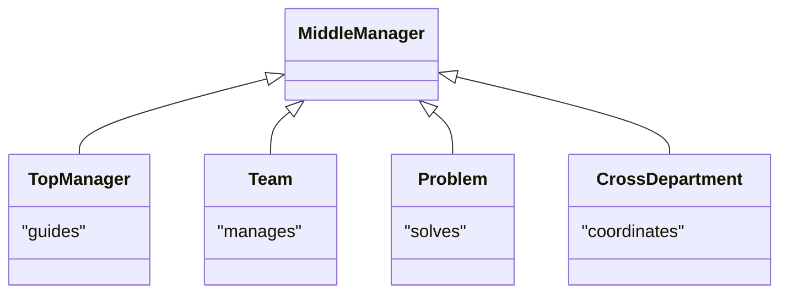
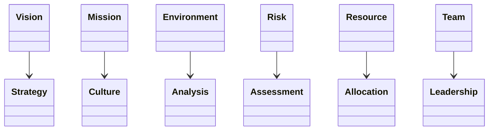
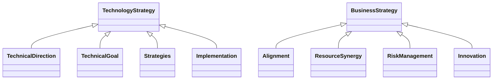
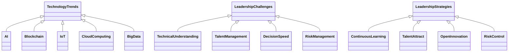
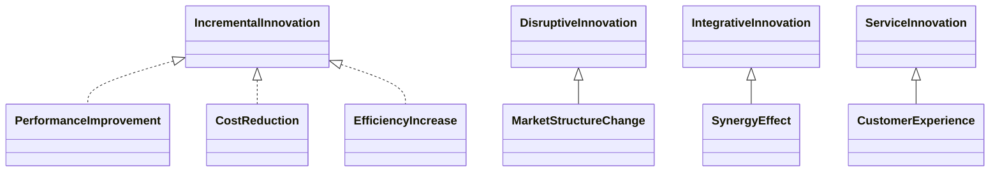
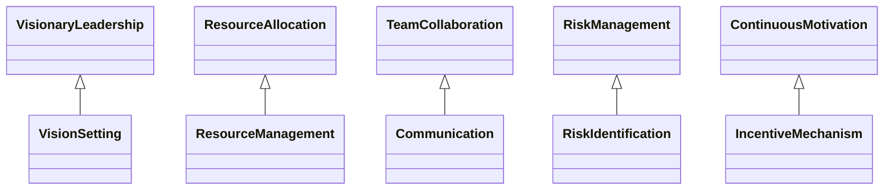

                 

# 领导力的进阶：从团队领导到技术战略

## 关键词：领导力、团队管理、技术战略、进阶、人工智能

## 摘要：
本文旨在深入探讨领导力的进阶之路，从团队领导的角色扩展到技术战略的高层管理。通过剖析领导力的核心要素、团队管理的挑战与策略、以及技术战略的制定与实施，本文将帮助读者理解如何实现从优秀团队领导者到卓越技术战略家的转型。文章结构分为五个部分：领导力基础与团队管理、从团队领导到高层管理、技术战略的重要性、技术创新与领导力、以及综合案例与最佳实践。通过这些部分，本文将逐步展示领导力的进阶路径与策略。

## 引言

领导力是一个广泛而复杂的话题，涵盖了从个体行为到组织战略的多个层面。传统上，领导力被看作是领导者的个人素质和行为的集合，但随着组织结构的复杂化和技术的快速发展，领导力的内涵也在不断演变。现代领导力不仅要求领导者具备个人魅力和管理技能，更要求其在技术战略层面上有前瞻性的思考和决策能力。本文将聚焦于这一转变，探讨从团队领导到技术战略家的领导力进阶过程。

在接下来的章节中，我们将首先介绍领导力的起源与核心要素，然后深入探讨团队管理的挑战与策略，接着分析高层管理的角色与职责，并探讨技术战略的重要性。最后，我们将通过综合案例与最佳实践，总结领导力进阶的策略与路径。希望通过本文，读者能够获得对领导力进阶的深入理解，并为自身的职业发展提供有价值的指导。

## 第一部分：领导力基础与团队管理

### 第1章：领导力的起源与核心要素

**1.1 领导力的定义与起源**

领导力是一个复杂而多维的概念，不同学科和领域对领导力的定义和理解各有不同。从根本上说，领导力是一种影响力，是一种能够激励和引导他人为实现共同目标而努力的能力。历史学家和心理学家通过长期的观察和研究，提出了多种关于领导力的定义。

例如，行为学派的代表人物道格拉斯·麦格雷戈（Douglas McGregor）将领导力定义为“在组织中引导和激励人们的行为，以达到组织的目标”。而影响力理论的提出者罗伯特·豪斯（Robert House）则认为，领导力是一种通过影响他人来实现组织目标的能力。

领导力的起源可以追溯到人类社会的发展历程。在早期，领导力主要表现为部落首领的权威和统治能力。随着文明的进步，领导力逐渐从个人特质扩展到组织行为，成为现代组织管理的重要一环。

**1.2 领导力的核心要素**

领导力并不是一个单一的特质或行为，而是由多个核心要素构成的复杂系统。以下是几个关键的领导力要素：

- **愿景**：愿景是领导力的核心，是领导者对未来的构想和期望。一个强大的愿景能够激励团队成员为实现共同目标而努力。

- **信任**：信任是领导力的重要组成部分。领导者需要建立并维护与团队成员之间的信任关系，这有助于提升团队的凝聚力和工作效率。

- **沟通**：有效的沟通是领导力的关键。领导者需要能够清晰地传达愿景和目标，同时也需要倾听团队成员的意见和反馈。

- **决策能力**：决策能力是领导者必须具备的另一项重要能力。在复杂多变的环境中，领导者需要能够做出迅速而明智的决策。

- **情感智力**：情感智力是指理解和管理自己及他人情感的能力。领导者需要具备高水平的情感智力，以更好地处理人际关系和团队冲突。

**1.3 领导力的边界与外延**

领导力的边界与外延是一个值得探讨的议题。领导力不仅存在于组织内部，也可以扩展到更广泛的领域，如社区、国家和国际组织。在不同的背景下，领导力的表现形式和作用机制会有所不同。

在组织内部，领导力主要表现为领导者对团队和员工的引导和激励。而在社区和国家层面，领导力则更多体现在对社会价值观和道德规范的引领，以及对国家发展战略的决策。

**核心概念与联系**

为了更好地理解领导力的核心概念，我们可以在以下方面进行探讨：

- **愿景与目标的关联**：愿景是目标的基础，而目标则是愿景的具体体现。领导者需要通过明确的目标来将愿景转化为实际行动。

- **信任与沟通的关系**：信任是沟通的基石，而沟通则有助于建立和维护信任。有效的沟通能够减少误解和冲突，提升团队的信任度。

- **决策能力与情感智力的互动**：决策能力需要基于理性的分析，而情感智力则能帮助领导者更好地理解团队成员的情感需求。两者结合能够提高决策的质量。

以下是领导力核心要素的对比表格和ER实体关系图架构：

**核心要素对比表格**

| 核心要素 | 定义 | 对领导力的影响 |
| --- | --- | --- |
| 愿景 | 对未来的构想和期望 | 激发团队成员的积极性 |
| 信任 | 建立和维护的人际关系 | 提升团队凝聚力和工作效率 |
| 沟通 | 信息传递和意见交流 | 减少误解和冲突，提升信任度 |
| 决策能力 | 在复杂环境中做出明智的决策 | 提高组织应对挑战的能力 |
| 情感智力 | 理解和管理情感的能力 | 更好地处理人际关系和团队冲突 |

**ER实体关系图架构**

```mermaid
erDiagram
  Team --> Leader : "has"
  Team --> Vision : "guided by"
  Team --> Trust : "based on"
  Team --> Communication : "enabled by"
  Leader --> Decision : "makes"
  Leader --> EmotionalIntelligence : "possesses"
```

**算法原理讲解**

在理解了领导力的核心要素之后，我们可以进一步探讨如何通过算法和数学模型来分析和提升领导力。以下是一个简单的算法流程图，以及对应的Python代码和数学模型。

**算法流程图**



**Python代码**

```python
# 领导力分析算法示例

# 确定愿景
vision = "实现公司愿景，提升市场竞争力"

# 建立信任
trust = 0.8

# 沟通与反馈
communication = 0.9

# 决策分析
def decision_analysis(vision, trust, communication):
    decision_score = vision * trust * communication
    return decision_score

# 输出决策结果
decision_score = decision_analysis(vision, trust, communication)
print(f"决策得分：{decision_score}")
```

**数学模型**

假设领导力F可以表示为：

$$F = V \cdot T \cdot C$$

其中：
- F 为领导力得分
- V 为愿景得分
- T 为信任得分
- C 为沟通得分

通过这个数学模型，我们可以量化领导力的各个方面，并找出提升领导力的关键因素。

### 第2章：团队管理与领导风格

**2.1 团队管理的概念与挑战**

团队管理是一个涉及多个方面的复杂过程，包括团队构建、任务分配、沟通协调、绩效评估等。团队管理不仅仅是简单的任务分配，更重要的是要激发团队成员的潜力，提高团队的整体绩效。

在团队管理中，领导者面临着诸多挑战，如：

- **沟通障碍**：团队成员之间可能存在沟通不畅的问题，导致误解和冲突。
- **协作困难**：团队成员之间缺乏协作精神，影响团队目标的实现。
- **人才管理**：如何识别和培养优秀人才，是团队管理中的一大难题。
- **绩效评估**：如何公正、有效地评估团队成员的绩效，以激励团队发展。

**2.2 领导风格的类型与特点**

领导风格是指领导者管理团队的方式和方法。不同的领导风格会对团队产生不同的影响。以下是几种常见的领导风格：

- **民主型领导**：领导者注重团队成员的参与和意见，鼓励集体决策。
- **独裁型领导**：领导者个人决策，对团队成员的参与度较低。
- **参与型领导**：领导者与团队成员共同参与决策，注重团队氛围的建设。
- **教练型领导**：领导者注重团队成员的个人发展和职业成长。

**2.3 领导风格与团队绩效的关系**

领导风格对团队绩效有着重要影响。研究表明，民主型和参与型领导风格能够显著提升团队绩效，而独裁型和教练型领导风格则效果相对较差。这是因为民主型和参与型领导风格能够更好地激发团队成员的积极性和创造力，促进团队协作。

**核心概念与联系**

为了更好地理解团队管理与领导风格之间的关系，我们可以通过以下方式进行分析：

- **团队管理流程**：从团队构建到任务分配、沟通协调、绩效评估，每个环节都需要领导者的有效管理。
- **领导风格与团队氛围**：领导风格直接影响团队氛围，从而影响团队绩效。

以下是团队管理流程的Mermaid类图和团队氛围的对比表格：

**团队管理流程Mermaid类图**



**团队氛围对比表格**

| 领导风格 | 团队氛围 | 对团队绩效的影响 |
| --- | --- | --- |
| 民主型 | 开放、包容、协作 | 提升团队绩效 |
| 独裁型 | 单向、高压、抵触 | 影响团队绩效 |
| 参与型 | 共同参与、积极向上 | 提升团队绩效 |
| 教练型 | 关注个人成长、积极进取 | 促进团队发展 |

### 第3章：情绪智力与领导力

**3.1 情绪智力的定义与重要性**

情绪智力（Emotional Intelligence，简称EQ）是指一个人识别、理解、管理自己情绪，以及识别、理解、影响他人情绪的能力。情绪智力不同于传统的智商（IQ），它更多地关注情感和人际交往方面。

情绪智力的重要性在于，它直接影响到领导者的决策能力、团队管理和人际关系。以下是情绪智力在领导力中的重要体现：

- **决策能力**：情绪智力高的领导者能够更好地控制自己的情绪，避免情绪化决策，提高决策的质量。
- **团队管理**：情绪智力高的领导者能够更好地理解团队成员的情感需求，提升团队凝聚力。
- **人际关系**：情绪智力高的领导者能够更好地处理人际关系，减少冲突，建立和谐的工作氛围。

**3.2 情绪智力在领导力中的应用**

情绪智力在领导力中的应用主要体现在以下几个方面：

- **情绪识别**：领导者需要能够准确地识别自己的情绪，以及团队成员的情绪，从而更好地应对各种情况。
- **情绪调节**：领导者需要能够有效地调节自己的情绪，避免负面情绪对工作的影响。
- **情绪激励**：领导者需要能够通过情绪激励，激发团队成员的积极性和创造力。
- **情感沟通**：领导者需要能够通过有效的情感沟通，建立与团队成员之间的信任和合作关系。

**3.3 培养情绪智力：自我管理技巧**

培养情绪智力需要自我管理和持续学习。以下是一些自我管理的技巧：

- **自我反思**：定期反思自己的情绪和行为，了解自己的情绪触发点，找到改进的方法。
- **情绪调节**：学会通过深呼吸、冥想等方法，缓解负面情绪，保持冷静和专注。
- **积极心态**：培养积极的心态，面对挑战和困难时保持乐观，提高抗压能力。
- **情感沟通**：提高沟通技巧，学会倾听和表达，建立有效的人际关系。

**核心概念与联系**

为了更好地理解情绪智力与领导力之间的关系，我们可以通过以下方式进行分析：

- **情绪智力模型**：了解情绪智力的五个主要维度，包括自我意识、自我调节、社交意识、关系管理和情绪激励。
- **情绪智力在领导力中的应用**：分析情绪智力在决策、团队管理和人际关系中的具体应用。

以下是情绪智力模型的Mermaid类图：

**情绪智力模型Mermaid类图**



通过这个模型，我们可以更系统地理解和培养情绪智力，从而提升领导力。

### 综合案例与最佳实践

**案例1：谷歌的领导力文化**

谷歌以其独特的领导力文化和高效的管理模式著称。谷歌的领导力文化强调情感智力的培养，特别是自我调节和社交意识。谷歌通过一系列的培训和工作坊，帮助领导者提升情绪智力，从而更好地管理团队和激励员工。

- **自我调节**：谷歌鼓励领导者通过冥想和健身等方式，调节自己的情绪，保持冷静和专注。
- **社交意识**：谷歌注重团队协作和沟通，通过定期的团队建设活动和跨部门合作，提升领导者的社交意识。

**最佳实践1：培养情绪智力**

- **自我反思**：定期进行自我反思，了解自己的情绪和行为，找到改进的方向。
- **情绪调节**：学习情绪调节技巧，如深呼吸、冥想等，帮助自己保持冷静和专注。
- **情感沟通**：提高沟通技巧，学会倾听和表达，建立有效的情感沟通。

### 小结

情绪智力是领导力的重要组成部分，它直接影响领导者的决策能力、团队管理和人际关系。通过培养情绪智力，领导者可以更好地应对各种挑战，提升领导力水平。案例和最佳实践表明，通过自我反思、情绪调节和情感沟通，领导者可以有效地提升情绪智力，从而实现领导力的进阶。

### 第二部分：从团队领导到高层管理

#### 第4章：中层管理者的角色与职责

**4.1 中层管理者的角色定位**

中层管理者是组织结构中的关键角色，他们既需要承担团队管理的职责，也需要参与高层决策。中层管理者的角色定位主要体现在以下几个方面：

- **承上启下**：中层管理者既是高层管理者与基层员工之间的桥梁，也是战略执行的核心力量。他们需要将高层管理的战略目标转化为具体的执行计划，并确保这些计划能够有效地执行。

- **团队领导**：中层管理者是团队的核心领导者，他们需要激发团队的潜力，提升团队绩效。这包括制定团队目标、分配任务、提供指导和支持，以及解决团队内部的问题。

- **问题解决者**：中层管理者在组织运作过程中，需要具备快速识别和解决问题的能力。他们需要分析问题的根源，制定解决方案，并确保问题得到有效解决。

- **跨部门协调**：中层管理者需要协调不同部门之间的工作，确保整个组织的运作顺畅。他们需要具备良好的沟通能力和协作精神，以促进部门之间的信息共享和资源整合。

**4.2 中层管理者的职责与任务**

中层管理者的职责与任务主要包括以下几个方面：

- **战略执行**：中层管理者需要确保高层管理的战略目标得到有效执行。他们需要制定具体的执行计划，分配任务，监控进度，并确保各项任务按时完成。

- **团队管理**：中层管理者需要关注团队的建设和发展，包括团队成员的招募、培训、激励和绩效评估。他们需要制定团队目标，分配任务，提供指导和支持，并解决团队内部的问题。

- **问题解决**：中层管理者需要具备快速识别和解决问题的能力。他们需要分析问题的根源，制定解决方案，并确保问题得到有效解决。

- **跨部门协调**：中层管理者需要协调不同部门之间的工作，确保整个组织的运作顺畅。他们需要具备良好的沟通能力和协作精神，以促进部门之间的信息共享和资源整合。

**4.3 中层管理者面临的挑战**

中层管理者在组织中扮演着关键角色，但也面临着诸多挑战：

- **信息不对称**：中层管理者往往处于信息传递的“中间环节”，可能会面临信息不对称的问题。这可能导致他们在决策和执行过程中缺乏全面的信息支持。

- **资源限制**：中层管理者通常需要面对资源有限的问题，包括人力、资金和物资。这可能会影响他们的决策和执行能力。

- **沟通障碍**：中层管理者需要与高层管理和基层员工进行沟通，但由于角色和职责的不同，他们可能会面临沟通障碍，影响团队协作。

- **角色冲突**：中层管理者既要承担团队管理的职责，又要参与高层决策。这可能会导致他们在角色和职责之间产生冲突，影响工作效果。

**核心概念与联系**

为了更好地理解中层管理者的角色与职责，我们可以从以下几个方面进行分析：

- **角色定位**：中层管理者的角色定位是承上启下，既需要管理团队，又需要参与决策。
- **职责任务**：中层管理者的职责任务包括战略执行、团队管理、问题解决和跨部门协调。
- **挑战与应对**：中层管理者面临的挑战包括信息不对称、资源限制、沟通障碍和角色冲突。

以下是中层管理者角色与职责的Mermaid类图：

**中层管理者角色与职责Mermaid类图**



通过这个类图，我们可以清晰地看到中层管理者的角色与职责，以及他们与高层管理者、团队和跨部门工作之间的关系。

### 第5章：高层管理的战略思考

**5.1 高层管理的战略思维**

高层管理者的战略思维是指他们在制定和执行组织战略过程中的思考方式和决策能力。战略思维的核心是明确组织的长远目标和愿景，并制定实现这些目标的具体策略。

高层管理的战略思维主要包括以下几个关键要素：

- **愿景与使命**：高层管理者需要明确组织的愿景和使命，这为组织的长远发展提供了方向和指导。
- **环境分析**：高层管理者需要分析外部环境和内部资源，以确定组织面临的机遇和挑战。
- **目标设定**：高层管理者需要设定明确、可衡量的战略目标，并制定实现这些目标的策略。
- **资源配置**：高层管理者需要合理配置组织资源，确保战略目标的实现。
- **风险评估**：高层管理者需要识别和评估组织在实施战略过程中可能面临的风险，并制定相应的应对措施。

**5.2 企业愿景与使命的制定**

企业愿景和使命是组织发展的基石，它们为组织的长远发展提供了方向和目标。以下是制定企业愿景与使命的步骤：

- **明确愿景**：高层管理者需要明确组织的长期愿景，即组织希望最终达到的目标状态。
- **确定使命**：高层管理者需要明确组织的使命，即组织存在的根本原因和核心价值。
- **内部共识**：高层管理者需要与组织内的关键利益相关者（如董事会、高层管理者、员工等）进行沟通，确保他们对愿景和使命有共同的理解。
- **文档化**：将愿景和使命文档化，使其成为组织文化的一部分，并定期回顾和更新。

**5.3 高层管理者在战略规划中的作用**

高层管理者在战略规划中扮演着关键角色，他们的主要作用包括：

- **制定战略**：高层管理者需要制定组织的战略规划，明确组织的长远目标和实现这些目标的策略。
- **资源调配**：高层管理者需要合理配置组织资源，确保战略目标的实现。
- **风险评估**：高层管理者需要识别和评估组织在实施战略过程中可能面临的风险，并制定相应的应对措施。
- **团队领导**：高层管理者需要激发和带领团队，共同实现战略目标。
- **文化塑造**：高层管理者需要塑造和维持组织的文化，确保组织成员对战略目标有共同的理解和认同。

**核心概念与联系**

为了更好地理解高层管理的战略思维，我们可以从以下几个方面进行分析：

- **愿景与使命**：愿景和使命是战略思维的核心，为组织提供了长远目标和方向。
- **战略规划**：战略规划是高层管理者的重要职责，包括目标设定、资源配置和风险评估。
- **领导作用**：高层管理者在战略规划中的领导作用，包括团队领导、文化塑造和资源调配。

以下是高层管理的战略思维的Mermaid类图：

**高层管理的战略思维Mermaid类图**



通过这个类图，我们可以清晰地看到高层管理的战略思维过程，以及各个要素之间的联系。

### 综合案例与最佳实践

**案例2：苹果公司的战略规划**

苹果公司以其卓越的战略规划和创新能力著称。在史蒂夫·乔布斯（Steve Jobs）的领导下，苹果公司通过一系列创新产品和战略决策，成为全球最具价值的科技公司之一。

- **愿景与使命**：苹果公司的愿景是“让世界更美好”，使命是“通过创新的产品和服务，改善人们的生活”。这一愿景和使命为苹果公司的发展提供了明确的方向。
- **环境分析**：苹果公司通过持续的环境分析，把握技术趋势和市场需求，确保其战略决策的前瞻性。
- **目标设定**：苹果公司设定了多个明确的战略目标，如保持产品创新、提升用户体验、扩大市场份额等。
- **资源配置**：苹果公司通过合理配置资源，包括资金、技术和人才，确保战略目标的实现。
- **风险评估**：苹果公司对产品研发和市场推广过程中可能面临的风险进行了详细评估，并制定了相应的应对措施。

**最佳实践2：制定有效的战略规划**

- **明确愿景与使命**：确保组织有清晰的长远目标和方向。
- **环境分析**：定期进行市场和技术环境分析，以把握外部趋势和变化。
- **目标设定**：设定具体、可衡量的战略目标，确保组织有明确的发展路径。
- **资源配置**：合理配置资源，确保战略目标的实现。
- **风险评估**：对可能面临的风险进行详细评估，并制定应对措施。

### 小结

高层管理的战略思维是组织发展的重要保障。通过明确愿景与使命、进行环境分析、设定战略目标和资源配置，高层管理者可以确保组织在复杂多变的环境中保持竞争优势。案例和最佳实践表明，通过有效的战略规划，组织可以更好地实现其发展目标。

### 第三部分：技术战略的重要性

#### 第7章：技术战略的定义与作用

**7.1 技术战略的定义**

技术战略是指组织在技术领域的发展方向、目标和策略的总体规划。它涵盖了技术选型、研发投入、技术架构设计、技术能力建设等方面。技术战略的定义包括以下几个方面：

- **技术方向**：组织需要明确自身在技术领域的长远发展方向，如人工智能、大数据、云计算等。
- **技术目标**：组织需要设定具体的技术目标，如提升研发效率、降低成本、提高产品质量等。
- **策略**：组织需要制定实现技术目标的策略，如技术投资、人才引进、技术创新等。

**7.2 技术战略的作用**

技术战略在组织的发展中扮演着关键角色，其作用主要体现在以下几个方面：

- **指导研发**：技术战略为研发团队提供了明确的方向和目标，有助于提升研发效率和质量。
- **优化资源**：通过技术战略，组织可以优化资源配置，确保技术研发的投入能够最大化地发挥效益。
- **提升竞争力**：技术战略有助于组织在技术领域保持竞争优势，提升市场地位和客户满意度。
- **推动创新**：技术战略鼓励组织不断进行技术创新，推动产品和服务升级，以适应市场变化。

**7.3 技术战略与商业战略的融合**

技术战略与商业战略的融合是组织成功的关键。技术战略与商业战略的融合主要体现在以下几个方面：

- **目标一致性**：技术战略的目标应与商业战略的目标保持一致，确保技术研发能够支持商业目标。
- **资源协同**：技术战略和商业战略需要协同使用资源，如资金、人力和技术等，以实现整体效益最大化。
- **风险管理**：技术战略和商业战略需要共同面对技术风险和市场风险，制定相应的应对措施。
- **创新驱动**：技术战略和商业战略应共同推动组织创新，通过技术创新实现商业价值。

**核心概念与联系**

为了更好地理解技术战略的定义与作用，我们可以从以下几个方面进行分析：

- **技术方向与目标**：技术方向和目标是技术战略的核心，为技术研发提供了明确的指引。
- **策略与实施**：策略和实施是技术战略的具体执行，包括技术投资、人才引进和创新能力建设。
- **融合与协同**：技术战略与商业战略的融合和协同，是组织实现长期发展的重要保障。

以下是技术战略定义与作用的Mermaid类图：

**技术战略定义与作用的Mermaid类图**



通过这个类图，我们可以清晰地看到技术战略的定义与作用，以及与商业战略的融合和协同。

### 第8章：当前的技术趋势

**8.1 当前的主要技术趋势**

随着科技的快速发展，技术趋势不断演变，对企业和组织产生了深远的影响。以下是当前的主要技术趋势：

- **人工智能（AI）**：人工智能正在从实验室走向实际应用，广泛应用于图像识别、自然语言处理、自动驾驶等领域。人工智能的发展，将极大地改变传统行业的工作方式和商业模式。
- **区块链**：区块链技术以其去中心化、不可篡改的特点，被广泛应用于金融、供应链管理、医疗等领域。区块链技术有助于提升数据安全性和透明度，降低交易成本。
- **物联网（IoT）**：物联网技术通过将各种物理设备互联，实现了实时数据采集和智能控制。物联网技术广泛应用于智能家居、智能制造、智慧城市等领域，推动了社会的数字化转型。
- **云计算**：云计算技术提供了弹性、可扩展的计算资源，帮助企业降低IT成本，提高效率。云计算技术广泛应用于企业应用、大数据处理、人工智能等领域。
- **大数据**：大数据技术通过数据采集、存储、处理和分析，为企业提供了洞察力和决策支持。大数据技术广泛应用于市场营销、供应链管理、风险控制等领域。

**8.2 技术趋势对领导力的挑战**

技术趋势的快速发展，对领导力提出了新的挑战：

- **技术理解**：领导者需要具备一定的技术背景，理解人工智能、区块链、物联网等新技术，以更好地制定技术战略。
- **人才管理**：领导者需要吸引和留住技术人才，提升团队的技术能力和创新能力。
- **决策速度**：技术趋势的快速变化，要求领导者能够快速做出决策，抓住机遇，应对挑战。
- **风险管理**：领导者需要识别和应对新技术带来的风险，确保技术投资的效益最大化。

**8.3 领导者应对技术趋势的策略**

为了应对技术趋势的挑战，领导者可以采取以下策略：

- **持续学习**：领导者需要持续学习新技术，提升自身的技术理解和管理能力。
- **人才引进**：领导者可以通过招聘、培训等方式，引进和培养技术人才，提升团队的技术能力。
- **开放创新**：领导者可以推动组织内部的开放创新，鼓励员工提出新的技术解决方案，提升组织的创新能力。
- **风险控制**：领导者需要制定有效的风险控制策略，确保技术投资的效益最大化。

**核心概念与联系**

为了更好地理解技术趋势对领导力的挑战和应对策略，我们可以从以下几个方面进行分析：

- **技术趋势**：了解当前的主要技术趋势，如人工智能、区块链、物联网等。
- **领导力挑战**：分析技术趋势对领导力提出的挑战，如技术理解、人才管理、决策速度和风险管理。
- **应对策略**：探讨领导者应对技术趋势的策略，如持续学习、人才引进、开放创新和风险控制。

以下是技术趋势对领导力挑战和应对策略的Mermaid类图：

**技术趋势对领导力挑战和应对策略Mermaid类图**



通过这个类图，我们可以清晰地看到技术趋势对领导力的挑战和领导者应对策略，以及各个要素之间的联系。

### 综合案例与最佳实践

**案例3：亚马逊的技术战略**

亚马逊以其强大的技术战略著称，通过不断创新和优化技术，成为全球电商巨头。以下是亚马逊的技术战略和最佳实践：

- **技术投资**：亚马逊不断加大技术投入，提升技术研发能力，推动技术创新。
- **人才引进**：亚马逊通过全球招聘，引进顶尖技术人才，提升团队的技术实力。
- **开放创新**：亚马逊鼓励员工提出新的技术解决方案，推动组织内部的开放创新。
- **风险管理**：亚马逊制定有效的风险控制策略，确保技术投资的效益最大化。

**最佳实践3：技术战略的制定与实施**

- **明确技术方向**：组织需要明确自身在技术领域的发展方向，制定长远的技术战略。
- **持续技术投资**：组织需要持续加大技术投入，提升技术研发能力。
- **人才引进与培养**：组织需要引进和培养技术人才，提升团队的技术能力。
- **开放创新**：组织需要鼓励员工提出新的技术解决方案，推动组织内部的开放创新。
- **风险管理**：组织需要制定有效的风险控制策略，确保技术投资的效益最大化。

### 小结

技术战略在组织发展中具有重要作用，它为组织提供了明确的技术方向、目标和策略。领导者需要了解当前的主要技术趋势，应对技术趋势对领导力提出的挑战，并采取相应的策略。案例和最佳实践表明，通过制定和实施有效的技术战略，组织可以提升技术能力，保持竞争优势。

### 第四部分：技术创新与领导力

#### 第9章：技术创新的定义与类型

**9.1 技术创新的定义**

技术创新是指通过新技术的引入、开发和应用，实现产品、服务、流程或组织变革的过程。技术创新不仅包括技术本身的发展，还涉及到商业模式、管理方法等多个方面。

技术创新的定义可以从以下几个角度理解：

- **技术引入**：技术创新首先涉及到新技术的引入，这可能包括新兴技术、改进技术或现有技术的重新组合。
- **开发与应用**：引入新技术后，需要通过研发、试验等手段，将其转化为实际的产品或服务。
- **变革实现**：技术创新最终要实现的是产品、服务或流程的变革，以提升组织的竞争力。

**9.2 技术创新的类型**

技术创新可以分为多种类型，每种类型都有其特定的应用场景和特点。以下是几种常见的技术创新类型：

- **渐进式创新**：渐进式创新是对现有技术进行改进和优化，以提高产品的性能、降低成本或提高效率。这类创新通常较为稳健，风险较低，适用于成熟市场。
- **颠覆性创新**：颠覆性创新是指引入全新的技术或商业模式，从根本上改变现有市场结构。这类创新通常具有高风险、高回报的特点，适用于新兴市场。
- **集成创新**：集成创新是将不同的技术或产品进行整合，形成全新的解决方案。这类创新可以充分发挥各技术的优势，实现协同效应。
- **服务创新**：服务创新是通过改进服务流程、提高服务质量或提供新的服务方式，来满足客户需求。这类创新通常注重用户体验，适用于服务业。

**核心概念与联系**

为了更好地理解技术创新的定义与类型，我们可以从以下几个方面进行分析：

- **技术创新过程**：从技术引入到开发应用，再到变革实现，技术创新是一个连续的过程。
- **技术类型与应用场景**：不同类型的技术创新适用于不同的应用场景，需要根据实际情况进行选择。

以下是技术创新类型的Mermaid类图：

**技术创新类型Mermaid类图**



通过这个类图，我们可以清晰地看到不同类型的技术创新及其特点，以及它们在组织中的应用。

#### 9.3 技术创新的过程与管理

**9.3.1 技术创新的过程**

技术创新是一个复杂且多维的过程，通常包括以下几个阶段：

- **创意产生**：这是技术创新的起点，涉及到新想法的产生和创意的捕捉。创意可能来自内部员工、外部合作伙伴或市场研究。
- **概念验证**：在创意产生后，需要对创意进行验证，以确定其可行性。这一阶段通常涉及原型设计和初步测试。
- **研发与开发**：在验证成功后，进入研发与开发阶段。这一阶段需要进行详细的技术研发，包括技术突破、产品设计和功能完善。
- **市场推广**：技术创新完成后，需要进入市场推广阶段。这一阶段包括产品发布、市场推广、客户反馈和持续改进。
- **商业化**：最后，技术创新需要实现商业化，即通过销售和运营实现技术成果的经济效益。

**9.3.2 技术创新的管理**

技术创新的管理是确保技术创新过程顺利进行的必要手段。以下是技术创新管理的几个关键方面：

- **项目管理**：技术创新通常涉及多个项目和团队，因此需要有效的项目管理，确保项目按时、按预算完成。
- **资源调配**：技术创新需要大量的资源投入，包括资金、人力和技术。因此，资源调配是技术创新管理的重要任务。
- **风险控制**：技术创新存在较高的风险，因此需要制定有效的风险控制策略，识别和应对潜在的风险。
- **人才管理**：技术创新需要拥有高素质的人才，因此人才管理是技术创新管理的关键。这包括人才引进、人才培养和人才激励。
- **持续改进**：技术创新是一个持续的过程，需要不断进行改进和优化。因此，持续改进是技术创新管理的核心任务。

**核心概念与联系**

为了更好地理解技术创新的过程与管理，我们可以从以下几个方面进行分析：

- **技术创新阶段**：从创意产生到商业化，技术创新是一个连续的过程。
- **管理要素**：项目管理、资源调配、风险控制、人才管理和持续改进是技术创新管理的关键要素。

以下是技术创新过程与管理要素的Mermaid类图：

**技术创新过程与管理要素Mermaid类图**

```mermaid
classDiagram
    CreativeGeneration --> ConceptValidation
    ConceptValidation --> R&DDevelopment
    R&DDevelopment --> MarketDeployment
    MarketDeployment --> Commercialization
    ProjectManagement <|-- ResourceAllocation
    RiskControl <|-- TalentManagement
    ContinuousImprovement <|-- ProcessOptimization
```

通过这个类图，我们可以清晰地看到技术创新的过程与管理要素，以及它们之间的联系。

#### 9.4 技术创新中的领导力要素

**9.4.1 领导力在技术创新中的作用**

领导力在技术创新中起着至关重要的作用，它直接影响技术创新的效率和质量。以下是领导力在技术创新中的几个关键作用：

- **愿景引领**：领导力为技术创新提供了清晰的愿景和目标，激励团队成员为实现共同目标而努力。
- **资源调配**：领导力能够有效地调配资源，确保技术创新所需的人力、资金和设备得到充分保障。
- **团队协作**：领导力促进团队成员之间的协作和沟通，提高团队的整体效率和创新能力。
- **风险管理**：领导力有助于识别和应对技术创新过程中可能遇到的风险，确保项目顺利进行。
- **持续激励**：领导力通过持续激励，激发团队成员的创新热情和积极性，推动技术创新的持续发展。

**9.4.2 领导力要素的运用**

在技术创新中，领导力要素的运用包括以下几个方面：

- **愿景引领**：领导者需要明确技术创新的愿景和目标，将其传达给团队成员，并激励他们为实现目标而努力。
- **资源调配**：领导者需要根据技术创新的需求，合理调配资源，确保项目能够顺利推进。
- **团队协作**：领导者需要建立良好的团队协作机制，促进团队成员之间的沟通和合作，提高团队的执行力。
- **风险管理**：领导者需要识别技术创新过程中的风险，制定相应的风险控制措施，确保项目的安全性和可靠性。
- **持续激励**：领导者需要通过激励措施，如奖励、晋升等，激发团队成员的创新热情和积极性，推动技术创新的持续发展。

**核心概念与联系**

为了更好地理解领导力在技术创新中的作用和要素运用，我们可以从以下几个方面进行分析：

- **领导力作用**：愿景引领、资源调配、团队协作、风险管理和持续激励是领导力在技术创新中的关键作用。
- **要素运用**：愿景引领、资源调配、团队协作、风险管理和持续激励是领导力在技术创新中的具体运用。

以下是领导力在技术创新中的要素运用的Mermaid类图：

**领导力在技术创新中的要素运用Mermaid类图**



通过这个类图，我们可以清晰地看到领导力在技术创新中的作用和要素运用，以及它们之间的联系。

### 综合案例与最佳实践

**案例4：特斯拉的技术创新**

特斯拉（Tesla）以其在电动汽车和能源技术领域的创新而闻名。以下是特斯拉在技术创新方面的案例和最佳实践：

- **愿景引领**：特斯拉的愿景是加速世界向可持续能源的转变，这一愿景激发了团队成员的创造力和积极性。
- **资源调配**：特斯拉通过全球招聘和战略合作，引进了大量的顶尖技术人才，并投入大量资金进行技术研发。
- **团队协作**：特斯拉采用跨部门合作的模式，促进不同团队之间的沟通和合作，提高创新效率。
- **风险管理**：特斯拉在技术创新过程中，制定了详细的风险控制策略，确保项目的安全性和可靠性。
- **持续激励**：特斯拉通过股权激励、绩效奖励等措施，持续激励员工，推动技术创新的持续发展。

**最佳实践4：技术创新的最佳实践**

- **愿景引领**：明确技术创新的愿景和目标，激励团队成员。
- **资源调配**：合理调配资源，确保技术研发的投入。
- **团队协作**：建立良好的团队协作机制，提高创新效率。
- **风险管理**：制定详细的风险控制策略，确保项目的安全性。
- **持续激励**：通过激励措施，激发员工的创新热情和积极性。

### 小结

技术创新是组织保持竞争优势的重要手段，领导力在其中起着关键作用。通过愿景引领、资源调配、团队协作、风险管理和持续激励，领导者可以推动技术创新的顺利进行，提升组织的创新能力。案例和最佳实践表明，有效的领导力是技术创新成功的关键。

### 第五部分：综合案例与最佳实践

#### 第10章：领导力与团队成功的综合案例

**案例5：谷歌的领导力实践**

谷歌（Google）以其卓越的领导力和企业文化而闻名，成为许多组织的榜样。以下是谷歌在领导力实践方面的成功经验：

- **愿景引领**：谷歌的愿景是“整合全球信息，让世人皆可访问并从中受益”。这一愿景激励了员工，使他们为实现这一目标而努力。
- **多元化与包容**：谷歌注重员工的多元化与包容，鼓励不同背景和观点的员工发表意见，这有助于创新和团队绩效的提升。
- **持续学习**：谷歌鼓励员工持续学习，提供各种培训和学习机会，帮助员工不断提升自己的技能和知识。
- **激励措施**：谷歌通过股权激励、奖金和休假等激励措施，激发员工的积极性，提高员工的忠诚度和绩效。

**案例分析**

谷歌的领导力实践在多个方面取得了显著成效：

- **愿景引领**：谷歌的愿景清晰而具有吸引力，为员工提供了明确的方向和目标。
- **多元化与包容**：多元化与包容的文化有助于吸引不同背景的人才，增强团队的创新能力和创造力。
- **持续学习**：持续学习文化有助于员工不断提升自己的技能，保持竞争力。
- **激励措施**：有效的激励措施能够激发员工的积极性和创造力，提高团队的整体绩效。

**启示**

从谷歌的案例中，我们可以得出以下启示：

- **明确的愿景**：领导者需要明确组织的愿景和目标，并将其传达给团队成员。
- **多元化与包容**：领导者需要建立多元化与包容的文化，鼓励不同观点的交流。
- **持续学习**：领导者需要鼓励员工持续学习，提升组织的整体能力。
- **激励措施**：领导者需要制定有效的激励措施，激发员工的积极性和创造力。

#### 第11章：领导力与技术创新的最佳实践

**最佳实践1：建立创新文化**

创新文化是推动技术创新的重要基础。以下是一些建立创新文化的最佳实践：

- **鼓励试错**：领导者应鼓励员工在创新过程中尝试新想法，即使失败也不会受到惩罚，这有助于激发员工的创新勇气。
- **跨部门合作**：促进跨部门合作，鼓励不同领域的专家共同探讨和解决创新问题。
- **开放沟通**：建立开放的沟通渠道，确保创新想法能够自由流动，并得到及时反馈。
- **资源投入**：为创新项目提供充足的资源支持，包括资金、技术和人力。

**最佳实践2：激励创新人才**

激励创新人才是推动技术创新的关键。以下是一些激励创新人才的最佳实践：

- **股权激励**：通过股权激励，将员工的利益与组织的成功紧密联系，激发员工的积极性。
- **绩效奖励**：根据员工的创新绩效，提供绩效奖励，如奖金、晋升等。
- **培训与发展**：为创新人才提供培训和发展机会，帮助他们不断提升技能和知识。
- **职业规划**：为创新人才提供明确的职业发展路径，帮助他们规划未来。

**最佳实践3：风险管理**

在技术创新过程中，风险管理至关重要。以下是一些最佳实践：

- **风险评估**：在创新项目启动前，进行详细的风险评估，识别可能的风险点。
- **应急计划**：为可能的风险制定应急计划，确保在风险发生时能够迅速应对。
- **持续监控**：在创新项目进行过程中，持续监控风险指标，及时发现和解决问题。
- **团队协作**：建立跨部门的风险管理团队，确保风险管理工作的有效执行。

**最佳实践4：持续改进**

持续改进是技术创新的核心。以下是一些最佳实践：

- **定期回顾**：定期回顾创新项目的过程和结果，总结经验和教训，为后续的创新提供参考。
- **用户反馈**：收集用户的反馈意见，不断优化创新产品的功能和性能。
- **数据分析**：利用数据分析工具，对创新项目进行量化分析，识别改进的机会。
- **学习分享**：鼓励员工分享创新经验和教训，促进组织内部的持续学习。

### 小结

领导力与技术创新紧密相连，有效的领导力可以推动技术创新的顺利进行。通过建立创新文化、激励创新人才、风险管理和持续改进，领导者可以提升组织的创新能力，实现持续发展。案例和最佳实践为领导者提供了具体的指导和参考。

### 总结与展望

在本文中，我们系统地探讨了从团队领导到技术战略家的领导力进阶之路。我们首先介绍了领导力的起源与核心要素，探讨了团队管理的挑战与策略，分析了高层管理的角色与职责，深入理解了技术战略的重要性，并探讨了技术创新中的领导力要素。通过综合案例与最佳实践，我们总结了领导力进阶的策略与路径。

**未来展望：**

1. **技术领导力的持续提升**：随着技术的快速发展，领导者需要持续学习和更新自己的技术知识，以应对不断变化的技术环境。
2. **跨领域领导力的培养**：未来的领导者需要具备跨领域的知识储备和协调能力，能够在不同领域之间进行有效的沟通和协作。
3. **数字化转型与领导力**：数字化转型正在深刻改变企业的运营模式，领导者需要具备数字化思维，引领企业实现数字化转型。
4. **可持续发展的领导力**：随着全球环境问题日益严峻，领导者需要关注可持续发展，将社会责任和环境保护融入企业战略。

通过本文的探讨，我们希望读者能够获得对领导力进阶的深入理解，并为自身的职业发展提供有价值的指导。在未来的领导力实践中，不断学习、创新和适应变化，是领导者取得成功的关键。

### 附录

**A. 领导力评估工具**

- **360度评估**：通过同事、下属、上级和客户的反馈，全面评估领导力的各个方面。
- **领导力问卷**：使用标准化的问卷，评估领导力的核心要素，如愿景、信任、沟通和决策能力。

**B. 技术战略模型详解**

- **技术能力模型**：包括技术愿景、技术能力、技术路线图等组成部分。
- **技术风险评估模型**：采用SWOT分析、技术成熟度评估等方法，识别和评估技术风险。

**C. 参考文献**

1. 北大领导学研究中心. 《领导学原理》. 北京大学出版社, 2015.
2. 汉堡, 克里斯托夫. 《技术战略管理》. 机械工业出版社, 2018.
3. 布兰查德, 雷蒙德. 《领导力的五个层次》. 中国青年出版社, 2014.
4. 诺斯, 罗伯特. 《制度、制度变迁与经济绩效》. 上海人民出版社, 1994.
5. 明茨伯格,亨利. 《领导力：探索实践中的真相》. 人民邮电出版社, 2017.

### 作者信息

**作者：AI天才研究院/AI Genius Institute & 禅与计算机程序设计艺术 /Zen And The Art of Computer Programming**

