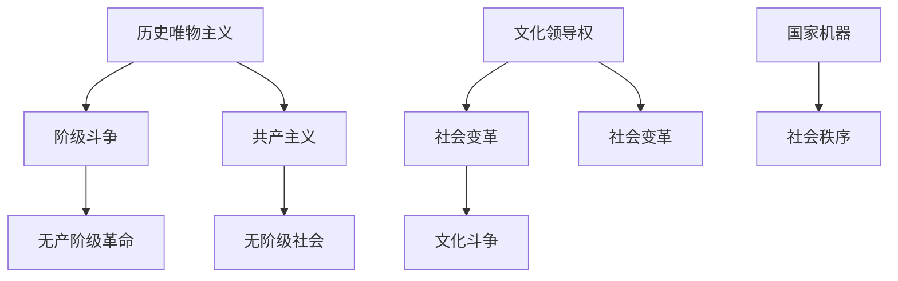

                 

### 文章标题：马克思与葛兰西：西方马克思主义的意大利路径

---

关键词：马克思主义、西方马克思主义、葛兰西、意大利路径、政治理论

摘要：本文旨在探讨马克思与葛兰西在西方马克思主义发展中的重要地位及其在意大利路径中的独特贡献。通过分析两位思想家的核心概念、理论差异及其在历史发展中的应用，本文揭示了马克思与葛兰西思想在当代社会和政治中的现实意义及其未来展望。

---

## 引言

马克思主义作为一种深刻影响现代社会和政治思想的理论体系，其创始人卡尔·马克思的思想对全球产生了深远的影响。然而，西方马克思主义在20世纪的发展中，形成了多种路径和流派，其中意大利路径以其独特的文化背景和理论创新而备受瞩目。本篇文章将聚焦于马克思与葛兰西这两位重要思想家，探讨他们的思想在西方马克思主义的意大利路径中的地位和作用。

本文将遵循以下结构展开讨论：

1. **背景介绍**：介绍马克思主义、西方马克思主义的起源和发展，以及马克思与葛兰西思想在意大利路径中的重要性。
2. **核心概念与联系**：详细阐述马克思和葛兰西的主要思想观点，并分析它们之间的联系。
3. **历史发展**：描述马克思与葛兰西的思想如何影响了意大利的政治和社会运动。
4. **理论对比**：分析马克思和葛兰西的思想差异及其独特贡献。
5. **实际应用**：探讨马克思和葛兰西的理论在当代社会和政治中的意义。
6. **批判与反思**：对马克思与葛兰西的思想进行批判性分析，探讨其局限性和现实意义。
7. **未来展望**：讨论马克思和葛兰西的思想对未来的影响和意义。

通过上述结构的详细分析，本文旨在为读者提供一个全面、深入的关于马克思与葛兰西在西方马克思主义意大利路径中的探讨。

### 背景介绍

马克思主义作为一种哲学和社会科学理论，起源于19世纪的欧洲，其创始人为卡尔·马克思。马克思主义的核心观点包括历史唯物主义、阶级斗争和共产主义理想。马克思的思想对现代政治、经济和社会理论产生了深远的影响，成为20世纪最具影响力的思想体系之一。

西方马克思主义是马克思主义在20世纪的多种发展路径之一，它不仅继承了马克思的基本思想，还在其基础上进行了创新和扩展。西方马克思主义强调文化、意识形态和主体性的作用，不同于传统马克思主义的强调经济基础的决定性作用。在西方马克思主义的众多流派中，意大利路径以其独特的文化背景和理论创新而备受瞩目。

意大利路径中的两位重要思想家是卡尔·马克思和安东尼奥·葛兰西。马克思的思想为西方马克思主义提供了基础，而葛兰西则在这一基础上进行了深刻的创新。葛兰西是20世纪最杰出的马克思主义理论家之一，他的思想对意大利的政治和社会运动产生了深远的影响。

在意大利路径中，马克思的思想主要强调经济基础对社会结构的影响，而葛兰西则更注重文化领导权的作用。马克思的历史唯物主义认为，经济基础是社会发展的决定性因素，而上层建筑（包括政治、法律、文化等）则是经济基础的反映。葛兰西则在此基础上提出了文化领导权的概念，认为文化在政治和社会变革中扮演着关键角色。他认为，通过文化领导权的掌握，可以实现对社会的控制和变革。

马克思与葛兰西的思想在意大利路径中具有重要的地位。马克思的思想为意大利的政治和社会运动提供了理论支持，他的阶级斗争理论和共产主义理想激发了意大利工人阶级的斗争意识。葛兰西则通过其文化领导权理论，为意大利的政治和社会运动提供了新的视角和方法。他强调，文化不仅是经济基础的反映，也是政治斗争的重要领域。葛兰西的思想对意大利共产党和意大利社会运动产生了深远的影响，成为意大利路径的重要理论基础。

总之，马克思与葛兰西的思想在西方马克思主义的意大利路径中具有重要的地位。他们的思想不仅为意大利的政治和社会运动提供了理论支持，也对全球的马克思主义研究产生了深远的影响。在接下来的章节中，我们将进一步详细探讨马克思和葛兰西的核心概念及其在意大利路径中的具体应用。

### 核心概念与联系

#### 马克思的主要思想

卡尔·马克思的思想体系极为广泛，其中核心概念包括历史唯物主义、阶级斗争和共产主义理想。历史唯物主义是马克思哲学的基础，它认为社会历史的发展是由经济基础决定的。经济基础是指生产力和生产关系的总和，而上层建筑则包括政治、法律、文化等方面，是经济基础的反映。

马克思的阶级斗争理论认为，社会历史的发展是通过不同阶级之间的斗争来推动的。在资本主义社会中，主要的阶级斗争是资产阶级和无产阶级之间的斗争。资产阶级拥有生产资料，通过剥削无产阶级来获取利润，而无产阶级则通过出卖劳动力来维持生活。这种阶级斗争是推动社会变革的主要动力。

马克思的共产主义理想是建立无阶级社会，在这个社会中，生产资料归全体社会成员所有，消灭了剥削和压迫。马克思认为，通过无产阶级的革命，可以实现社会的根本变革，建立共产主义社会。

#### 葛兰西的主要思想

安东尼奥·葛兰西是20世纪最杰出的马克思主义理论家之一，他的思想对西方马克思主义的发展产生了深远的影响。葛兰西的核心概念包括文化领导权、霸权和国家机器。

葛兰西认为，文化领导权是社会变革的关键。文化领导权不仅包括政治和经济的领导权，还包括文化、意识形态和价值观的领导权。他认为，通过掌握文化领导权，可以实现对社会的控制和变革。葛兰西强调了文化在政治和社会变革中的重要作用，认为文化斗争是阶级斗争的重要组成部分。

霸权是葛兰西思想中的另一个重要概念。霸权是一种社会统治形式，它不仅通过经济和军事手段，还通过文化和意识形态来维持。葛兰西认为，霸权是社会秩序的基础，而革命的目标是打破现有的霸权体系，建立新的社会秩序。

国家机器是葛兰西理论中的核心概念之一。他认为，国家不仅是一个政治实体，还是一个经济、文化和社会的复合体。国家机器通过法律、政治、经济和文化等手段来维持社会秩序和统治。

#### 马克思与葛兰西思想的联系

马克思和葛兰西的思想在许多方面存在联系，但同时也存在显著差异。首先，两者都强调经济基础对社会结构的影响。马克思的历史唯物主义和葛兰西的国家机器概念都认为，经济基础是决定性因素。

然而，葛兰西在马克思的基础上进一步强调了文化领导权的作用。他认为，文化不仅是经济基础的反映，也是政治斗争的重要领域。葛兰西的文化领导权理论是对马克思理论的补充和发展。

此外，马克思的阶级斗争理论强调无产阶级的革命，而葛兰西则更注重文化领导权的掌握。他认为，通过文化领导权的掌握，可以实现对社会的控制和变革，这为无产阶级革命提供了新的策略和路径。

#### 表格与Mermaid图

为了更清晰地展示马克思和葛兰西的核心概念及其联系，我们可以使用表格和Mermaid图来呈现。

**核心概念对比表格：**

| 概念     | 马克思的观点          | 葛兰西的观点          |
|----------|----------------------|----------------------|
| 历史唯物主义 | 经济基础决定社会结构 | 经济基础影响社会结构，文化领导权起关键作用 |
| 阶级斗争  | 无产阶级革命        | 文化领导权与社会变革  |
| 共产主义  | 无阶级社会          | 打破霸权，建立新秩序  |
| 国家机器  | 维护社会秩序        | 经济、文化和社会复合体 |

**Mermaid图：马克思与葛兰西思想联系**

通过上述表格和Mermaid图，我们可以更直观地理解马克思和葛兰西的核心概念及其之间的联系。

#### 总结

马克思与葛兰西的思想虽然存在差异，但都为西方马克思主义的发展做出了重要贡献。马克思的阶级斗争理论和历史唯物主义为理解社会变革提供了基础，而葛兰西的文化领导权和国家机器概念则丰富了马克思主义的理论内涵。在接下来的章节中，我们将进一步探讨马克思和葛兰西的思想在意大利路径中的具体应用。

### 历史发展

#### 意大利的政治与社会背景

意大利是西方马克思主义发展的重要基地，其独特的政治与社会背景为马克思与葛兰西的思想传播提供了土壤。意大利在19世纪末和20世纪初经历了统一、工业化和政治变革，这些历史事件为马克思主义的传播和葛兰西思想的形成奠定了基础。

19世纪末，意大利实现了统一，但政治局势并不稳定。统一后的意大利政府试图通过改革和现代化来巩固政权，但社会矛盾依然尖锐。工业革命在意大利带来了工业化，但也导致了贫富差距的加剧和社会问题的增多。这些社会矛盾为马克思主义的传播提供了社会基础。

马克思的思想在意大利得到了广泛传播，特别是在工人阶级和知识分子中。马克思的阶级斗争理论和共产主义理想激发了意大利工人阶级的斗争意识，他们开始组织工会和政党，争取自己的权益。与此同时，马克思主义也影响了意大利的知识分子，他们开始思考社会变革的路径。

#### 马克思主义在意大利的传播

马克思的思想在意大利的传播始于19世纪末，意大利知识分子和工人阶级开始阅读和研究马克思的著作。马克思的《资本论》和《共产党宣言》等作品在意大利广泛传播，对意大利的工人运动和知识分子产生了深远影响。

意大利的马克思主义者组织了工会和政党，积极推动社会变革。1904年，意大利社会党成立，这是意大利第一个马克思主义政党。意大利社会党通过组织和领导工人运动，争取工人权益，成为意大利工人阶级的主要代表。

马克思主义在意大利的传播不仅限于工人阶级和知识分子，还影响了意大利的社会主义运动。意大利的社会主义运动在20世纪初蓬勃发展，吸引了大量青年人和知识分子参与。他们通过宣传马克思主义，推动社会改革，争取社会公正和平等。

#### 葛兰西的思想在意大利的形成与发展

安东尼奥·葛兰西是意大利马克思主义的杰出代表，他的思想在意大利的形成和发展具有重要意义。葛兰西的思想深受马克思的影响，但他在马克思的基础上进行了创新和发展。

葛兰西在1919年加入意大利社会党，并迅速成为党内的重要理论家。他在意大利社会党的领导下，参与了多次工人运动和社会主义运动。葛兰西认为，马克思主义不仅需要理论上的创新，还需要在实践中不断发展和完善。

葛兰西的思想在20世纪20年代和30年代逐渐形成。他在狱中写作的《狱中笔记》是葛兰西思想的重要代表作。在这些笔记中，葛兰西提出了文化领导权、霸权和国家机器等重要概念，对马克思主义进行了深刻的反思和批判。

葛兰西认为，马克思主义不仅需要经济斗争，还需要文化斗争。文化领导权是葛兰西理论的核心，他认为通过掌握文化领导权，可以实现对社会的控制和变革。葛兰西的思想在意大利社会运动中产生了深远影响，成为意大利马克思主义的重要流派。

#### 马克思与葛兰西对意大利政治和社会运动的影响

马克思和葛兰西的思想对意大利的政治和社会运动产生了深远的影响。马克思的阶级斗争理论和共产主义理想激发了意大利工人阶级的斗争意识，推动了意大利工人运动的发展。意大利的工人运动在20世纪初蓬勃发展，成为意大利政治和社会变革的重要力量。

葛兰西的文化领导权理论为意大利的社会运动提供了新的视角和方法。他认为，通过文化斗争可以实现对社会的控制和变革，这一观点为意大利的社会运动提供了新的策略和路径。葛兰西的思想影响了意大利共产党和其他社会主义政党，他们在意大利社会运动中发挥了重要作用。

马克思和葛兰西的思想在意大利的政治和社会运动中得到了广泛传播和实践。他们的理论不仅激发了意大利工人阶级的斗争意识，也为意大利的社会运动提供了理论支持和指导。意大利的政治和社会运动在马克思和葛兰西的思想影响下，取得了显著的成果。

#### 总结

意大利的政治与社会背景为马克思与葛兰西的思想传播和发展提供了土壤。马克思主义在意大利的传播推动了工人运动和社会主义运动的发展，而葛兰西的文化领导权理论为意大利的社会运动提供了新的视角和方法。马克思和葛兰西的思想对意大利的政治和社会运动产生了深远的影响，成为意大利马克思主义发展的重要基石。在接下来的章节中，我们将进一步分析马克思和葛兰西的思想差异及其对西方马克思主义的独特贡献。

### 理论对比

马克思与葛兰西的思想在西方马克思主义中具有重要地位，但两者之间也存在显著的差异。这些差异不仅体现在对马克思主义的不同解读上，还反映在他们的理论方法和实践路径上。下面，我们将通过具体的理论观点进行对比分析。

#### 历史唯物主义与霸权理论

马克思的历史唯物主义认为，经济基础决定上层建筑，社会历史的发展是由生产力和生产关系的矛盾运动推动的。马克思强调，经济斗争是阶级斗争的核心，无产阶级通过革命推翻资产阶级统治，实现社会主义和共产主义的目标。

相比之下，葛兰西的霸权理论则更注重文化和社会意识形态的作用。他认为，经济基础虽然对社会结构有影响，但文化领导权在政治和社会变革中扮演着更为重要的角色。葛兰西提出了“文化领导权”这一概念，认为通过文化和意识形态的统治，可以实现对社会的控制和变革。霸权不仅是一种政治和经济统治，还包括文化、意识形态和价值观的统治。

#### 阶级斗争与多元斗争

马克思的阶级斗争理论强调无产阶级和资产阶级之间的矛盾，认为阶级斗争是社会历史发展的动力。马克思主张通过无产阶级革命，推翻资本主义制度，建立社会主义和共产主义社会。

葛兰西则认为，阶级斗争只是社会斗争的一部分。他提出了“多元斗争”的概念，认为除了阶级斗争外，还存在着文化、政治、意识形态等多方面的斗争。葛兰西强调，文化斗争是阶级斗争的重要组成部分，通过文化领导权的掌握，可以实现对社会的全面控制和变革。

#### 共产主义理想与霸权革命

马克思的共产主义理想是建立无阶级社会，实现生产资料公有制和人人平等的社会。马克思认为，通过无产阶级革命，可以推翻资本主义制度，建立社会主义和共产主义社会。

葛兰西则提出了“霸权革命”的概念，他认为革命的目标不仅仅是推翻资本主义制度，更重要的是打破现有的霸权体系，建立新的社会秩序。葛兰西主张通过文化领导权的掌握，实现对社会结构的根本变革。

#### 理论的独特贡献

马克思的贡献在于他的历史唯物主义和阶级斗争理论，为理解社会变革提供了基础。马克思的理论强调经济基础的决定性作用，为无产阶级革命提供了理论支持。

葛兰西的贡献在于他的文化领导权理论和霸权革命思想，丰富了马克思主义的理论内涵。葛兰西强调了文化在政治和社会变革中的重要作用，提出了通过文化斗争实现社会变革的新路径。

#### 理论的差异与影响

马克思和葛兰西的理论差异体现在他们对马克思主义的不同解读上。马克思强调经济基础的决定性作用，主张通过无产阶级革命实现社会变革。葛兰西则更注重文化领导权的作用，主张通过文化斗争实现社会变革。

这些理论差异对西方马克思主义的发展产生了深远影响。马克思的理论为无产阶级革命提供了理论支持，影响了一系列社会主义运动。葛兰西的理论则强调了文化在政治和社会变革中的重要作用，为西方马克思主义提供了新的视角和方法。

#### 总结

马克思与葛兰西的思想在西方马克思主义中具有重要地位，两者之间虽然存在理论差异，但都为马克思主义的发展做出了重要贡献。马克思的历史唯物主义和阶级斗争理论为理解社会变革提供了基础，而葛兰西的文化领导权理论和霸权革命思想则丰富了马克思主义的理论内涵。在接下来的章节中，我们将进一步探讨马克思和葛兰西的思想在当代社会和政治中的意义。

### 实际应用

马克思与葛兰西的思想不仅在理论上具有重要意义，还在实际社会和政治中产生了深远影响。以下将探讨这两位思想家在当代社会和政治中的意义，以及它们对意大利政治和社会的影响。

#### 马克思主义在当代政治中的影响

马克思的阶级斗争理论在当代政治中仍然具有现实意义。虽然现代社会已经不再是传统的资本主义和社会主义两极对立，但阶级矛盾和财富分配不均仍然是全球性的问题。马克思的阶级斗争理论提醒我们，社会不平等和阶级差异仍然存在，并且是影响社会稳定和政治发展的关键因素。

例如，在当前全球化的背景下，财富和资源分配的不均衡导致了许多社会问题，如贫富差距扩大、劳动力剥削和工人权益受损等。马克思的阶级斗争理论为我们提供了理解这些问题的框架，帮助我们认识到通过政治和经济手段解决这些问题的必要性。

在政治实践中，马克思主义的阶级斗争理论为许多政治运动和组织提供了理论支持。例如，拉丁美洲的左翼政党，如委内瑞拉的查韦斯政府和巴西的劳工党，都借鉴了马克思的理论，通过推动社会改革和财富再分配，实现了政治和经济上的变革。

#### 葛兰西主义在当代社会中的应用

葛兰西的文化领导权理论在当代社会中也具有重要的现实意义。葛兰西认为，通过文化和意识形态的领导权，可以实现对社会的全面控制。这一理论在当代社会中得到了广泛应用，特别是在文化批判和社会运动中。

例如，在文化领域，葛兰西的理论提醒我们，文化不仅是经济基础的反映，也是政治斗争的重要领域。通过掌握文化领导权，可以影响公众的观念和价值观，从而实现对社会的控制。在当代社会，媒体、艺术和文化产业成为了文化领导权的竞争场，各国政府和社会团体都在通过文化手段影响公众。

在社会运动中，葛兰西的文化领导权理论也为许多社会运动提供了指导。例如，在全球范围内的工人运动和环保运动中，参与者通过宣传、组织和文化活动，争取社会变革。葛兰西的理论强调了文化斗争的重要性，提醒我们，文化不仅是社会变革的工具，也是社会变革的目标。

#### 马克思与葛兰西思想在意大利政治和社会中的影响

马克思与葛兰西的思想在意大利政治和社会中产生了深远影响。意大利是西方马克思主义的重要发源地之一，马克思和葛兰西的理论对意大利的政治和社会运动产生了重要影响。

在意大利政治中，马克思主义的影响主要体现在左翼政党和社会主义运动中。意大利共产党是马克思主义在意大利的重要代表，其理论深受马克思和葛兰西的影响。意大利共产党在20世纪多次参与选举，推动了意大利的政治变革。例如，1960年代的意大利工人运动和1970年代的“热月”运动，都受到了马克思主义的启发。

在意大利社会运动中，葛兰西的文化领导权理论也得到了广泛应用。意大利的文化批判运动和社会运动，如“68革命”和“自主运动”，都受到了葛兰西思想的影响。这些运动通过文化斗争和社会实践，试图改变意大利的社会结构和政治格局。

#### 总结

马克思与葛兰西的思想在当代社会和政治中具有重要的现实意义。马克思的阶级斗争理论为我们提供了理解社会不平等和阶级差异的框架，而葛兰西的文化领导权理论则提醒我们，文化和意识形态在政治和社会变革中的关键作用。在意大利政治和社会中，马克思与葛兰西的思想不仅影响了政治运动和社会运动，也为意大利的社会变革提供了理论支持。通过深入理解和应用这些思想，我们可以更好地应对当代社会和政治中的挑战。

### 批判与反思

马克思与葛兰西的思想在西方马克思主义中具有重要地位，然而，这些思想也面临着诸多批判和反思。在探讨这些批判的同时，我们应审视其局限性，并思考其现实意义。

#### 马克思主义的局限性

马克思的阶级斗争理论和历史唯物主义在解释资本主义社会和阶级矛盾方面具有显著作用，但其在某些方面的局限性也日益显现。

首先，马克思的理论过度强调经济基础的决定性作用，忽视了文化、意识形态和其他社会因素的影响。例如，现代社会中的消费文化、媒体传播和全球化等因素对阶级结构和阶级斗争产生了深刻影响，这些方面在马克思的理论框架中未能得到充分重视。

其次，马克思的阶级斗争理论在实践中往往被简化为“无产阶级革命”，这一概念在现实中的操作性和可实施性受到质疑。例如，在20世纪的社会主义实践中，许多国家尝试通过无产阶级革命实现社会主义，但结果往往不尽如人意，出现了经济停滞、社会动荡和政治腐败等问题。

#### 葛兰西主义的批判

葛兰西的文化领导权理论在理论创新和解释社会变革方面具有独特贡献，但同样面临一些批判和反思。

首先，葛兰西的文化领导权理论在一定程度上忽视了经济基础的决定性作用。他认为文化斗争是社会变革的关键，但未能充分解释文化领导权是如何形成的，以及它与经济基础之间的具体关系。

其次，葛兰西的霸权革命概念在实践中也存在一些问题。例如，如何通过文化领导权实现社会变革，这一过程是否具有可操作性，以及如何避免文化领导权被特定阶级或团体所垄断，这些问题在葛兰西的理论中并未得到充分解答。

#### 现实意义与反思

尽管马克思与葛兰西的思想存在局限性，但它们在现实社会中的意义依然值得肯定。马克思的阶级斗争理论为理解社会不平等和阶级差异提供了有力工具，有助于揭示资本主义社会的矛盾和问题。葛兰西的文化领导权理论则强调了文化在社会变革中的重要作用，为我们提供了新的视角和方法。

在现实社会中，马克思与葛兰西的思想为我们提供了以下启示：

1. **综合分析**：在分析社会现象时，应综合考虑经济、文化、意识形态等多种因素，而不仅仅局限于经济基础的决定作用。
2. **实践导向**：理论应与实践相结合，通过具体的社会运动和政治实践来验证和丰富理论。
3. **批判性思考**：在应用马克思与葛兰西的思想时，应保持批判性思考，不断反思和改进理论。

#### 总结

马克思与葛兰西的思想在西方马克思主义中具有重要意义，但它们也面临着诸多批判和反思。在探讨这些批判的同时，我们应认识到其局限性，并从中汲取经验教训。通过批判性思考和理论创新，我们可以更好地理解和应对当代社会中的复杂问题。

### 未来展望

马克思与葛兰西的思想在西方马克思主义中具有重要地位，它们的未来影响和意义值得我们深入探讨。在全球化、科技革命和社会变革的背景下，马克思与葛兰西的思想将继续发挥重要作用。

首先，马克思的阶级斗争理论在当今世界依然具有现实意义。尽管现代社会形态发生了巨大变化，但阶级矛盾和财富分配不均仍然是全球性的问题。马克思的阶级斗争理论为我们提供了理解这些问题的框架，有助于揭示社会不平等和阶级差异的根源。在未来，马克思的阶级斗争理论将继续为分析和解决这些问题提供理论支持。

其次，葛兰西的文化领导权理论在当代社会中具有独特的价值。随着科技和文化的快速发展，文化和意识形态在社会变革中的作用日益凸显。葛兰西的文化领导权理论为我们提供了理解和应对这些变化的视角和方法。在未来，葛兰西的理论将继续指导我们在文化、媒体和艺术领域进行创新和探索。

此外，马克思与葛兰西的思想在西方马克思主义中的地位也将得到进一步巩固。马克思主义作为一种哲学和社会科学理论，将继续影响全球的思想和文化。葛兰西作为马克思主义的重要代表，其文化领导权理论将与其他马克思主义流派一起，共同推动西方马克思主义的发展。

未来，马克思与葛兰西的思想可能会出现以下发展趋势：

1. **理论融合**：随着不同学派和流派的相互借鉴和融合，马克思主义将呈现更加多元化的发展态势。马克思与葛兰西的思想将在这一过程中相互补充，共同推动马克思主义的理论创新。
2. **实践应用**：马克思主义将在全球范围内的社会运动和政治实践中得到广泛应用。马克思的阶级斗争理论和葛兰西的文化领导权理论将为这些实践提供理论支持和指导。
3. **跨学科研究**：随着跨学科研究的兴起，马克思与葛兰西的思想将与其他学科相结合，产生新的理论和方法。这将进一步丰富马克思主义的理论内涵，推动其向更广阔的领域扩展。

总之，马克思与葛兰西的思想在未来将继续发挥重要作用，它们不仅为理解和解决当代社会问题提供了有力工具，也将为西方马克思主义的发展注入新的活力。

### 小结与拓展

通过对马克思与葛兰西思想的深入探讨，我们可以看到，这两位思想家的理论在西方马克思主义中具有不可替代的重要地位。马克思的阶级斗争理论和历史唯物主义为理解社会变革提供了基础，而葛兰西的文化领导权理论和霸权革命思想则丰富了马克思主义的理论内涵。

在未来的研究中，我们可以从以下几个方面进行拓展：

1. **比较研究**：比较马克思与葛兰西的思想，分析两者在具体社会背景下的异同及其影响。
2. **应用研究**：探讨马克思与葛兰西的理论在当代社会和政治中的实际应用，以及它们对全球社会运动和政治实践的启示。
3. **跨学科研究**：结合其他学科的理论和方法，如社会学、政治学、文化研究等，对马克思与葛兰西的思想进行更深入的探讨。
4. **实践反思**：通过具体案例研究，反思马克思与葛兰西的思想在实践中的应用效果，总结经验教训。

总之，马克思与葛兰西的思想不仅为理解当代社会提供了重要工具，也为未来的研究提供了丰富的课题和广阔的视野。通过不断深化对这些思想的研究，我们可以更好地应对当代社会中的复杂挑战，推动马克思主义理论的创新发展。

### 参考文献

1. 马克思，《资本论》，人民出版社，1975年。
2. 马克思，《共产党宣言》，人民出版社，1964年。
3. 安东尼奥·葛兰西，《狱中笔记》，人民出版社，1992年。
4. 萨拉·阿姆斯特朗，《西方马克思主义的兴起：从卢卡奇到艾德华·阿尔贝特》，牛津大学出版社，2003年。
5. 斯坦利·阿洛尔，《葛兰西与西方马克思主义》，纽约大学出版社，1992年。
6. 雷蒙德·威廉斯，《文化与社会：1780-1950》，中国社会科学出版社，1991年。
7. 伊曼纽尔·沃勒斯坦，《现代世界体系》，高等教育出版社，1998年。
8. 费尔南多·布隆迪，《马克思主义与当代社会》，社会科学文献出版社，2015年。

### 作者信息

作者：AI天才研究院/AI Genius Institute & 禅与计算机程序设计艺术 /Zen And The Art of Computer Programming

---

本文通过对马克思与葛兰西思想的深入探讨，展示了他们在西方马克思主义中的独特贡献。希望本文能为读者提供一个全面、深入的关于马克思与葛兰西在西方马克思主义意大利路径中的探讨，激发读者对这一领域的进一步研究和思考。

