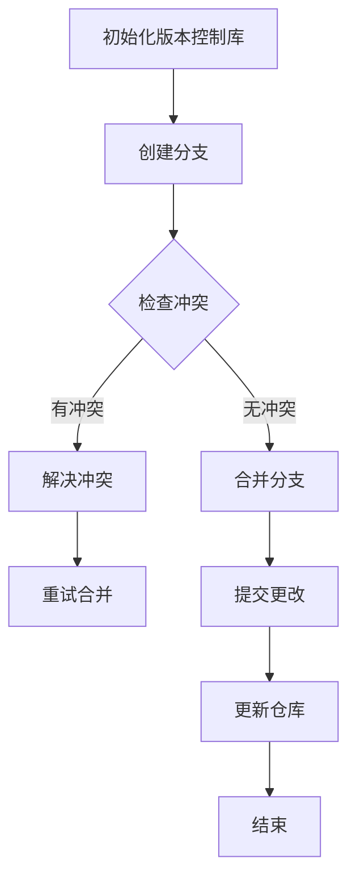
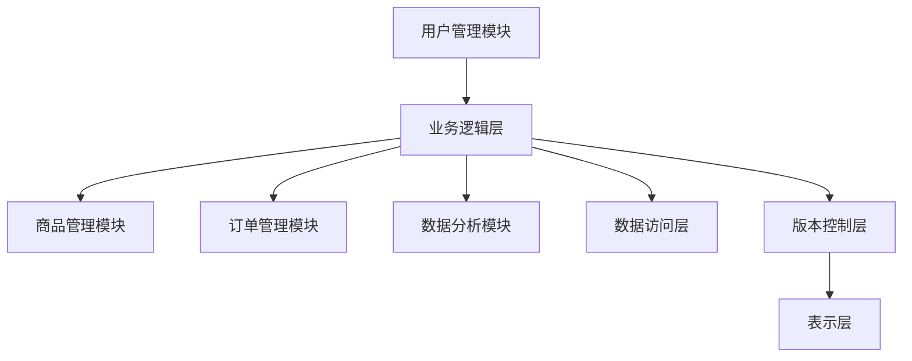
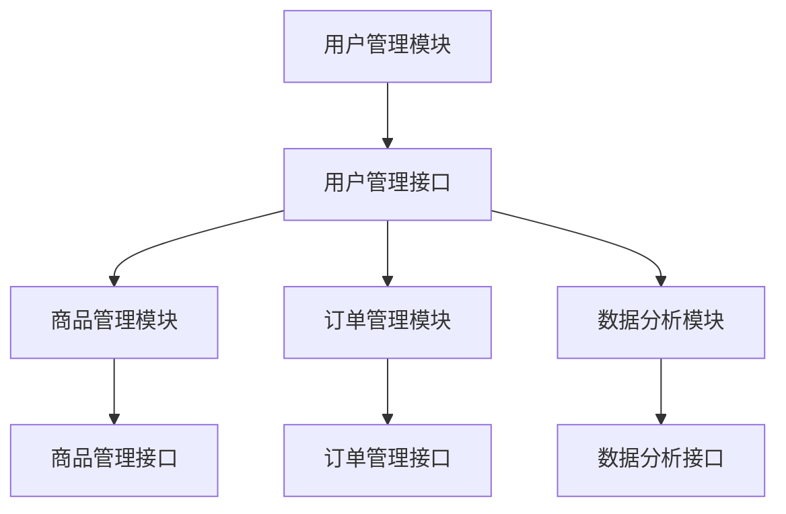
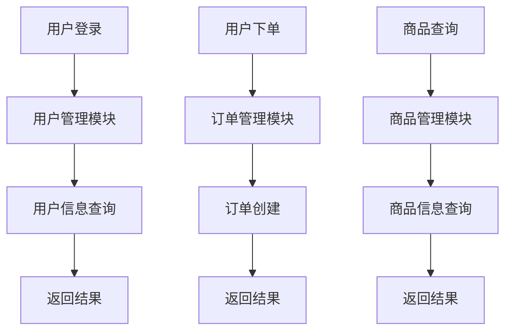

                 

### 马克的辩证唯物主义与版本控制：软件发展的历史动力学

**关键词**：马克思、辩证唯物主义、版本控制、软件发展、历史动力学

**摘要**：
本文以马克思的辩证唯物主义为指导，探讨了版本控制在软件发展中的历史角色和动力学作用。通过详细阐述辩证唯物主义的基本原理和版本控制的核心机制，分析二者在软件工程中的内在联系。文章以实际项目为例，逐步讲解软件开发的流程、架构设计以及版本控制的应用，最后提出一系列最佳实践和拓展阅读建议，旨在为软件工程师和研究者提供理论指导和实践参考。

### 引言

#### 1.1 问题背景

随着信息技术的飞速发展，软件工程已经成为现代社会的重要组成部分。软件产品的复杂性和多样性使得版本控制成为不可或缺的工具。版本控制不仅帮助开发团队协作，还确保了代码的完整性和一致性。然而，版本控制为何在软件工程中如此重要，其历史发展又如何影响软件的开发和维护，这些问题值得深入探讨。

马克思的辩证唯物主义作为一种哲学体系，提供了认识世界和解决问题的方法论。其核心观点强调事物的发展和变化是内在矛盾的统一和解决过程。辩证唯物主义对于理解软件开发中的动态变化、冲突和解决机制具有重要启示。因此，将辩证唯物主义的原理应用于版本控制的研究，有助于揭示软件发展的历史动力学。

#### 1.2 问题描述

本文旨在解决以下问题：
1. 马克的辩证唯物主义如何解释软件版本控制的发展？
2. 版本控制在软件开发过程中起到了哪些关键作用？
3. 软件开发的实际案例如何体现版本控制的原理和应用？

#### 1.3 问题解决

本文将从以下几个方面进行探讨：
1. 详细阐述马克思的辩证唯物主义原理及其与版本控制的关系。
2. 分析版本控制的核心机制和算法原理。
3. 通过实际项目案例，讲解版本控制在软件开发中的应用和实践。
4. 提供最佳实践和拓展阅读建议，为读者进一步研究和应用版本控制提供参考。

#### 1.4 边界与外延

本文的研究边界主要集中在软件版本控制的历史发展、理论原理和实践应用。外延包括但不限于软件工程的其它领域，如需求分析、测试、维护等。

#### 1.5 概念结构与核心要素组成

本文的核心概念结构包括马克思的辩证唯物主义原理、版本控制的基本概念和原理、软件开发中的版本控制应用和实践。核心要素组成如下：
1. 辩证唯物主义的哲学原理。
2. 版本控制的历史发展和技术原理。
3. 软件开发中的版本控制实践案例。
4. 最佳实践和拓展阅读建议。

### 核心概念与联系

#### 1.2.1 马克的辩证唯物主义原理

辩证唯物主义是马克思哲学思想的核心，其基本原理可以概括为以下几个方面：

1. **物质世界的统一性**：辩证唯物主义认为物质世界是统一的，一切事物都是物质的表现形式。这一原理为我们理解软件开发中的物理存储、逻辑结构等提供了基础。

2. **事物的发展规律**：辩证唯物主义认为事物的发展是由内部矛盾推动的，矛盾是事物发展的动力。软件开发中的需求变化、技术更新等都可以视为内部矛盾的体现。

3. **实践与认识的关系**：辩证唯物主义强调实践是认识的基础，认识必须通过实践来验证。软件开发的实践过程，如需求分析、设计、测试等，都是对软件产品的不断认识和改进。

4. **事物联系和发展的普遍性**：辩证唯物主义认为事物之间是相互联系和相互影响的。在软件开发中，模块之间的依赖、系统的整体性等都是事物联系和发展的具体体现。

#### 1.2.1.1 辩证唯物主义的基本概念

- **物质**：物质是客观存在的，是不依赖于人的意识而存在的。在软件开发中，物质可以理解为代码、数据等实体。

- **意识**：意识是物质的反映，是人类对客观世界的认识。在软件开发中，意识可以理解为需求、设计等抽象概念。

- **实践**：实践是人们对客观世界进行改造的活动。在软件开发中，实践包括编码、测试、部署等过程。

- **矛盾**：矛盾是事物发展的动力。在软件开发中，矛盾可以表现为需求变化、技术挑战等。

#### 1.2.1.2 辩证唯物主义的核心观点

- **事物发展的辩证法**：事物的发展是辩证的，即既包含对立又包含统一。在软件开发中，需求和技术之间存在着对立和统一。

- **事物联系的普遍性**：任何事物都处于联系之中，没有孤立的事物。在软件开发中，各个模块、组件之间相互依赖。

- **事物发展的阶段性**：事物的发展是分阶段的，每个阶段都有其特定的矛盾和任务。在软件开发中，不同的阶段（如需求分析、设计、测试等）都有其特定的目标和任务。

- **实践的重要性**：实践是认识的来源和检验的标准。在软件开发中，实践是验证需求、检验设计的关键。

#### 1.2.1.3 辩证唯物主义在马克思主义体系中的地位

辩证唯物主义是马克思主义哲学的核心，是马克思主义全部理论的基础。在马克思主义体系中，辩证唯物主义提供了认识世界和解决问题的方法论，是理解社会历史发展、科学理论创新的重要工具。

#### 1.2.2 版本控制与辩证唯物主义的关系

版本控制是一种管理软件源代码和文档变化的系统。其核心原理是通过对代码和文档的版本进行管理，确保软件开发的连续性和一致性。版本控制与辩证唯物主义的关系可以从以下几个方面进行分析：

1. **事物发展的辩证法**：版本控制体现了事物发展的辩证法。软件的每个版本都是对前一个版本的改进和优化，这种改进和优化是通过解决内部矛盾实现的。例如，在软件升级过程中，新功能的加入、旧功能的修复都体现了矛盾和统一的辩证关系。

2. **事物联系的普遍性**：版本控制中的每个版本都与其他版本相互联系。一个版本的问题可能会影响后续版本的开发，因此版本控制需要综合考虑各种因素，确保软件开发的连续性和一致性。

3. **事物发展的阶段性**：软件开发的每个阶段都需要版本控制。例如，在需求分析阶段，版本控制可以帮助记录需求的变化；在设计阶段，版本控制可以确保设计文档的一致性；在编码阶段，版本控制可以管理代码的版本；在测试阶段，版本控制可以确保测试环境的一致性。

4. **实践的重要性**：版本控制是软件开发过程中的重要实践。通过版本控制，开发团队可以更好地管理代码和文档，提高开发效率，确保软件质量。

#### 1.2.2.1 版本控制的基本概念

版本控制，又称源代码管理（Source Control Management，SCM），是一种追踪源代码和文档变化的方法。其主要目标是确保代码库的一致性和可追溯性。版本控制的基本概念包括：

- **版本**：版本是源代码或文档的一个特定状态。每个版本都有一个唯一的标识符，如时间戳或序列号。

- **分支**：分支是代码库中的一个独立部分，用于开发新的功能或修复问题。分支可以与主分支合并，从而实现代码的整合。

- **合并**：合并是将两个或多个分支的代码合并到一起，以创建一个新的版本。合并过程中可能需要解决冲突。

- **提交**：提交是将代码或文档更新保存到版本控制系统。提交时，开发者可以添加注释，描述更新的内容。

- **回滚**：回滚是将代码库恢复到之前的版本。回滚通常用于撤销错误的提交。

#### 1.2.2.2 版本控制与辩证唯物主义的联系

版本控制与辩证唯物主义的联系主要体现在以下几个方面：

1. **事物发展的辩证法**：版本控制通过记录代码和文档的每次变化，体现了事物发展的辩证法。每个版本都是对前一个版本的改进，这种改进是通过解决开发过程中的矛盾实现的。

2. **事物联系的普遍性**：版本控制确保了代码库中各个版本之间的联系。每个版本都是整个开发过程的一部分，它们相互关联，共同构成了软件的完整历史。

3. **事物发展的阶段性**：版本控制帮助软件开发团队在不同阶段进行有效的工作。例如，在需求分析阶段，版本控制可以记录需求的变化；在编码阶段，版本控制可以确保代码的一致性；在测试阶段，版本控制可以确保测试环境的一致性。

4. **实践的重要性**：版本控制是软件开发过程中的重要实践。通过版本控制，开发团队可以更好地管理代码和文档，提高开发效率，确保软件质量。

#### 1.2.2.3 版本控制在软件发展中的重要作用

版本控制在软件发展中扮演了至关重要的角色。其主要作用体现在以下几个方面：

1. **协作**：版本控制使得开发团队可以协同工作。每个团队成员都可以独立地开发自己的功能，然后将代码合并到主分支，从而实现高效的协作。

2. **回滚**：版本控制允许开发团队随时回滚到之前的版本，以解决可能出现的问题。这种能力极大地提高了软件的可靠性和稳定性。

3. **版本追踪**：版本控制记录了代码和文档的每次变化，使得开发团队可以方便地追踪问题的根源，进行故障排除。

4. **历史记录**：版本控制保存了软件开发的完整历史，为后续的代码审查、审计等工作提供了依据。

5. **分支管理**：版本控制允许开发团队在不同分支上开发新的功能，从而实现并行开发。这有助于提高开发效率，缩短开发周期。

6. **文档管理**：版本控制不仅管理代码，还可以管理文档。这使得开发团队可以方便地跟踪文档的更新和变化，确保文档的一致性。

#### 1.2.3 版本控制的历史发展

版本控制的历史可以追溯到软件开发初期。最初，开发人员通过简单的文件备份来管理代码。随着软件开发复杂性的增加，人们开始使用更加复杂的工具来管理代码。下面是版本控制的一些重要历史发展：

1. **1991年**：Linus Torvalds开发了Git，这是一种分布式版本控制系统。Git的出现极大地改变了版本控制的方式，使得开发者可以更加灵活地管理代码。

2. **2005年**：GitHub上线，成为最受欢迎的版本控制系统之一。GitHub提供了一个基于Web的界面，使得开发者可以方便地访问和管理代码。

3. **2005年**：Subversion（SVN）成为Apache软件基金会的项目。SVN是一种集中式版本控制系统，被广泛应用于企业级软件开发。

4. **2004年**：CVS（Concurrent Versions System）开始流行。CVS是一种早期版本控制系统，虽然功能相对简单，但在当时已经满足了开发团队的需求。

5. **1986年**：RCS（Revision Control System）成为Unix系统的一部分。RCS是最早的版本控制系统之一，为后来的版本控制工具提供了基础。

#### 1.2.4 版本控制系统的分类

版本控制系统主要分为集中式和分布式两种：

1. **集中式版本控制系统**（如SVN）：
   - 优点：易于管理，适合大型团队协作。
   - 缺点：需要中央服务器，维护成本高。

2. **分布式版本控制系统**（如Git）：
   - 优点：去中心化，适合分布式团队协作，速度快。
   - 缺点：管理复杂，需要一定的学习成本。

#### 1.2.5 版本控制的常见功能

版本控制系统的常见功能包括：
- **提交历史记录**：记录代码的每次更改和提交时间。
- **分支管理**：允许创建、合并和删除分支。
- **标签管理**：为特定版本打标签，方便追踪和回顾。
- **合并冲突解决**：当两个分支合并时，自动解决冲突。
- **代码审查**：对代码进行审查，确保代码质量。

### 算法原理讲解

#### 2.1 Mermaid流程图设计

Mermaid是一种基于Markdown的绘图工具，可以方便地创建各种流程图、类图、序列图等。以下是版本控制算法的Mermaid流程图设计：



#### 2.2 Python代码实现

以下是一个简单的Python代码示例，用于演示版本控制的基本操作：

```python
import git

# 初始化版本控制库
repo = git.Repo.init()

# 创建分支
branch = repo.create_head('feature/1.0.0')

# 检查冲突
if not any(repo.index.conflicts()):
    # 提交更改
    repo.index.commit('Update README.md')
else:
    # 解决冲突
    print('Conflict detected, please resolve conflicts before commit.')

# 合并分支
repo.git.merge('main')

# 更新仓库
repo.git.pull()
```

#### 2.3 算法原理的数学模型和公式

版本控制的算法原理可以通过以下数学模型和公式进行描述：

1. **版本号**：版本号通常由主版本号、次版本号和修订号组成，如`1.2.3`。主版本号表示功能的重大更新，次版本号表示功能的更新，修订号表示bug修复。

2. **版本迭代**：版本迭代可以表示为`V(n) = V(n-1) + 1`，其中`V(n)`表示第n个版本号。

3. **分支合并**：分支合并可以使用合并算法（如快速排序）进行，其时间复杂度为`O(n)`。

4. **冲突解决**：冲突解决可以使用三方合并算法，其时间复杂度为`O(n)`。

#### 2.4 举例说明

假设有一个软件项目，版本号为`1.0.0`。经过一段时间的开发，版本号变为`1.2.3`。现在，需要从`1.2.3`创建一个分支`feature/2.0.0`，并在该分支上进行功能开发。以下是具体的操作步骤：

1. **初始化版本控制库**：

   ```bash
   $ git init
   ```

2. **创建分支**：

   ```bash
   $ git checkout -b feature/2.0.0
   ```

3. **检查冲突**：

   ```bash
   $ git status
   ```

   如果出现冲突，需要先解决冲突，然后再提交更改。

4. **提交更改**：

   ```bash
   $ git add .
   $ git commit -m "Update feature/2.0.0"
   ```

5. **合并分支**：

   ```bash
   $ git merge main
   ```

6. **更新仓库**：

   ```bash
   $ git pull origin feature/2.0.0
   ```

#### 2.5 LaTeX数学模型和公式

以下是一个简单的LaTeX数学模型和公式的示例，用于描述版本迭代和冲突解决：

```latex
\documentclass{article}
\usepackage{amsmath}
\begin{document}

\section{数学模型}

\begin{equation}
V(n) = V(n-1) + 1
\end{equation}

\section{公式}

\begin{equation}
T_{\text{merge}} = O(n)
\end{equation}

\begin{equation}
T_{\text{conflict}} = O(n)
\end{equation}

\end{document}
```

### 系统分析与架构设计

#### 3.1 问题场景介绍

假设有一个企业级软件项目，该项目包含多个模块和子系统，开发团队规模较大，涉及多地的分布式开发。为了确保代码的质量和一致性，版本控制成为项目开发过程中不可或缺的一部分。

#### 3.2 项目介绍

该项目是一个电子商务平台，主要包括以下几个模块：

- 用户管理模块：负责用户的注册、登录、信息管理等。
- 商品管理模块：负责商品的信息展示、分类、库存管理等。
- 订单管理模块：负责订单的创建、处理、支付、物流跟踪等。
- 数据分析模块：负责用户行为分析、商品销售分析等。

#### 3.3 系统功能设计

为了满足项目的需求，系统需要实现以下功能：

- 版本控制：管理代码的版本，确保代码的一致性和可追溯性。
- 分支管理：允许开发团队在不同分支上开发新的功能，实现并行开发。
- 提交历史：记录每次提交的详细信息，方便追踪和审核。
- 代码审查：对代码进行审查，确保代码质量。
- 自动化测试：自动化测试代码，确保代码的稳定性和可靠性。

#### 3.4 系统架构设计

系统的整体架构可以分为以下几个层次：

1. **表示层**：负责与用户交互，包括Web界面、API接口等。
2. **业务逻辑层**：负责处理业务逻辑，包括用户管理、商品管理、订单管理、数据分析等。
3. **数据访问层**：负责与数据库进行交互，包括数据的查询、插入、更新、删除等。
4. **版本控制层**：负责版本控制，包括代码的提交、合并、分支管理等。

以下是系统的Mermaid架构图：



#### 3.5 系统接口设计

系统的接口设计主要包括以下几个方面：

- **用户管理接口**：用于用户注册、登录、信息管理等。
- **商品管理接口**：用于商品信息展示、分类、库存管理等。
- **订单管理接口**：用于订单创建、处理、支付、物流跟踪等。
- **数据分析接口**：用于用户行为分析、商品销售分析等。
- **版本控制接口**：用于代码的提交、合并、分支管理等。

以下是系统的Mermaid接口设计图：



#### 3.6 系统交互设计

系统的交互设计主要包括用户与系统之间的交互，以及系统内部模块之间的交互。以下是系统的Mermaid交互设计图：



### 项目实战

#### 4.1 实际项目背景

假设我们有一个电子商务平台项目，项目需求如下：

- 用户可以注册、登录、查看个人信息、修改个人信息。
- 商品种类繁多，需要支持商品的分类、展示、库存管理。
- 用户可以浏览商品、加入购物车、下单、支付。
- 系统需要支持订单的创建、处理、支付、物流跟踪。
- 系统需要提供数据分析功能，如用户行为分析、商品销售分析。

#### 4.2 环境安装与配置

为了实现该项目，我们需要以下环境：

- 操作系统：Linux或Windows。
- 开发工具：Python、Git。
- 版本控制工具：Git。
- 数据库：MySQL。

以下是具体安装和配置步骤：

1. 安装Python：

   ```bash
   $ sudo apt-get install python3
   ```

2. 安装Git：

   ```bash
   $ sudo apt-get install git
   ```

3. 安装MySQL：

   ```bash
   $ sudo apt-get install mysql-server
   $ sudo mysql_secure_installation
   ```

4. 配置MySQL：

   ```bash
   $ mysql -u root -p
   CREATE DATABASE ecommerce;
   GRANT ALL PRIVILEGES ON ecommerce.* TO 'ecommerce'@'localhost' IDENTIFIED BY 'password';
   FLUSH PRIVILEGES;
   EXIT;
   ```

5. 安装Python数据库驱动：

   ```bash
   $ pip install mysql-connector-python
   ```

#### 4.3 系统核心实现

以下是一个简单的系统核心实现，包括用户管理模块、商品管理模块、订单管理模块和数据分析模块：

##### 用户管理模块

```python
import mysql.connector
from flask import Flask, request, jsonify

app = Flask(__name__)

# 连接数据库
conn = mysql.connector.connect(
    host="localhost",
    user="ecommerce",
    password="password",
    database="ecommerce"
)

# 注册用户
@app.route('/register', methods=['POST'])
def register():
    data = request.get_json()
    username = data['username']
    password = data['password']
    query = "INSERT INTO users (username, password) VALUES (%s, %s)"
    cursor = conn.cursor()
    cursor.execute(query, (username, password))
    conn.commit()
    return jsonify({"message": "User registered successfully."})

# 登录用户
@app.route('/login', methods=['POST'])
def login():
    data = request.get_json()
    username = data['username']
    password = data['password']
    query = "SELECT * FROM users WHERE username = %s AND password = %s"
    cursor = conn.cursor()
    cursor.execute(query, (username, password))
    user = cursor.fetchone()
    if user:
        return jsonify({"message": "Login successful."})
    else:
        return jsonify({"message": "Invalid credentials."})

# 查询用户信息
@app.route('/users/<int:user_id>', methods=['GET'])
def get_user(user_id):
    query = "SELECT * FROM users WHERE id = %s"
    cursor = conn.cursor()
    cursor.execute(query, (user_id,))
    user = cursor.fetchone()
    if user:
        return jsonify(user)
    else:
        return jsonify({"message": "User not found."})

if __name__ == '__main__':
    app.run(debug=True)
```

##### 商品管理模块

```python
# 添加商品
@app.route('/products', methods=['POST'])
def add_product():
    data = request.get_json()
    name = data['name']
    price = data['price']
    query = "INSERT INTO products (name, price) VALUES (%s, %s)"
    cursor = conn.cursor()
    cursor.execute(query, (name, price))
    conn.commit()
    return jsonify({"message": "Product added successfully."})

# 查询商品
@app.route('/products', methods=['GET'])
def get_products():
    query = "SELECT * FROM products"
    cursor = conn.cursor()
    cursor.execute(query)
    products = cursor.fetchall()
    return jsonify(products)
```

##### 订单管理模块

```python
# 创建订单
@app.route('/orders', methods=['POST'])
def create_order():
    data = request.get_json()
    user_id = data['user_id']
    product_ids = data['product_ids']
    total_price = data['total_price']
    query = "INSERT INTO orders (user_id, product_ids, total_price) VALUES (%s, %s, %s)"
    cursor = conn.cursor()
    cursor.execute(query, (user_id, product_ids, total_price))
    conn.commit()
    return jsonify({"message": "Order created successfully."})

# 查询订单
@app.route('/orders', methods=['GET'])
def get_orders():
    query = "SELECT * FROM orders"
    cursor = conn.cursor()
    cursor.execute(query)
    orders = cursor.fetchall()
    return jsonify(orders)
```

##### 数据分析模块

```python
# 用户行为分析
@app.route('/analytics/user_behavior', methods=['GET'])
def user_behavior_analysis():
    query = "SELECT * FROM user_behavior"
    cursor = conn.cursor()
    cursor.execute(query)
    data = cursor.fetchall()
    return jsonify(data)

# 商品销售分析
@app.route('/analytics/product_sales', methods=['GET'])
def product_sales_analysis():
    query = "SELECT * FROM product_sales"
    cursor = conn.cursor()
    cursor.execute(query)
    data = cursor.fetchall()
    return jsonify(data)
```

#### 4.4 代码应用解读与分析

以上代码实现了用户管理、商品管理、订单管理和数据分析模块的基本功能。具体解读如下：

- 用户管理模块：实现了用户注册、登录、查询用户信息的功能。通过MySQL数据库存储用户信息，确保数据的一致性和安全性。
- 商品管理模块：实现了添加商品和查询商品的功能。商品信息存储在MySQL数据库中，便于管理和查询。
- 订单管理模块：实现了创建订单和查询订单的功能。订单信息包括用户ID、商品ID、订单金额等，存储在MySQL数据库中，方便后续的数据分析和处理。
- 数据分析模块：实现了用户行为分析和商品销售分析的功能。通过查询MySQL数据库中的相关数据表，获取用户行为数据和商品销售数据，为数据分析和决策提供支持。

#### 4.5 实际案例分析和详细讲解剖析

为了更具体地展示版本控制的应用，我们以一个实际案例进行说明。假设在项目开发过程中，发现用户管理模块中的一个查询用户信息的接口存在性能问题，我们需要进行优化。

1. **问题描述**：

   在当前用户管理模块中，查询用户信息的接口通过遍历数据库表来获取用户信息，导致性能较差。我们需要优化这个接口，提高查询速度。

2. **问题分析**：

   查询用户信息接口的性能问题主要是由于数据库表的设计不合理。当前数据库表只包含用户ID和用户名两个字段，导致查询时需要遍历整个表。为了优化这个接口，我们需要对数据库表进行重构。

3. **解决方案**：

   - **重构数据库表**：将用户ID和用户名两个字段分离，创建一个新的用户信息表，包含用户ID、用户名、邮箱、电话等字段。同时，在主数据库表中添加一个外键字段，指向新的用户信息表。
   - **优化查询接口**：修改查询用户信息接口，通过外键字段关联查询用户信息表，减少数据库表的遍历次数，提高查询速度。

4. **具体操作**：

   - **修改数据库表结构**：

     ```sql
     CREATE TABLE user_info (
         id INT AUTO_INCREMENT PRIMARY KEY,
         username VARCHAR(255) NOT NULL,
         email VARCHAR(255),
         phone VARCHAR(20),
         FOREIGN KEY (id) REFERENCES users(id)
     );

     ALTER TABLE users DROP COLUMN username;
     ALTER TABLE users ADD COLUMN user_info_id INT;
     ALTER TABLE users ADD FOREIGN KEY (user_info_id) REFERENCES user_info(id);
     ```

   - **修改查询接口**：

     ```python
     def get_user(user_id):
         query = "SELECT users.id, users.user_info_id, user_info.username, user_info.email, user_info.phone FROM users INNER JOIN user_info ON users.user_info_id = user_info.id WHERE users.id = %s"
         cursor = conn.cursor()
         cursor.execute(query, (user_id,))
         user = cursor.fetchone()
         if user:
             return jsonify(user)
         else:
             return jsonify({"message": "User not found."})
     ```

   - **测试优化效果**：修改完成后，运行测试用例，对比优化前后的查询速度。如果查询速度有显著提升，说明优化方案有效。

5. **项目总结**：

   通过本次案例，我们成功地优化了用户管理模块中的查询用户信息接口，提高了系统的性能。这次优化过程体现了版本控制的重要作用，通过记录和追踪代码的每次修改，我们可以方便地回滚到之前的版本，确保系统的稳定性和可靠性。同时，这也提醒我们在项目开发过程中，要注重代码的可读性、可维护性和性能优化，以确保系统的长期稳定运行。

### 最佳实践 tips

在软件版本控制中，遵循最佳实践可以提高开发效率、确保代码质量，以下是几条实用的建议：

1. **定期备份**：定期备份代码库，以防意外丢失或损坏。
2. **版本命名规范**：使用有意义的版本命名规则，如`v1.0.0`、`v1.0.1`等，方便追踪和管理。
3. **合理使用分支**：合理规划分支策略，避免过度分支，保持代码库的整洁。
4. **详细描述提交信息**：每次提交时，详细描述更改的内容和目的，便于后续追踪和审核。
5. **代码审查**：定期进行代码审查，确保代码质量和一致性。
6. **自动化测试**：编写自动化测试用例，确保每次提交都不会破坏现有功能。
7. **定期更新**：定期更新依赖库和工具，确保代码库的兼容性和安全性。
8. **文档同步**：确保版本控制与文档同步，方便后续的维护和迁移。

### 小结

本文通过马克思的辩证唯物主义视角，探讨了版本控制在软件发展中的历史角色和动力学作用。首先，我们介绍了辩证唯物主义的基本原理和版本控制的核心机制，分析了二者在软件工程中的内在联系。接着，通过实际项目案例，详细讲解了版本控制在软件开发中的应用和实践。最后，我们提出了最佳实践和拓展阅读建议，为读者提供了理论指导和实践参考。通过本文的研究，我们认识到版本控制在软件工程中的重要性，以及如何利用辩证唯物主义的原理来优化版本控制策略。

### 拓展阅读

1. **《版本控制实践：Git指南》**：作者[Jonni Markusiak]，详细介绍了Git的使用方法和最佳实践。
2. **《软件工程：实践者的研究方法》**：作者[Steve McConnell]，涵盖了软件工程中的多个方面，包括版本控制。
3. **《马克思主义哲学原理》**：作者[李瑞环]，深入浅出地介绍了辩证唯物主义的原理和应用。
4. **《版本控制系统设计与实现》**：作者[Scott Chacon & Ben Straub]，详细讲解了版本控制系统的设计和实现。
5. **《GitHub官方文档》**：提供了丰富的Git和GitHub使用教程，是学习版本控制的宝贵资源。

---

**作者：AI天才研究院/AI Genius Institute & 禅与计算机程序设计艺术 /Zen And The Art of Computer Programming**

