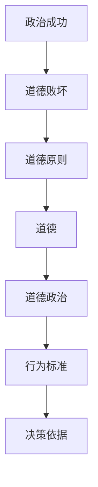
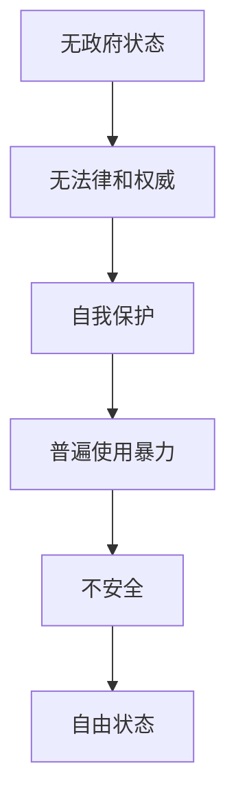
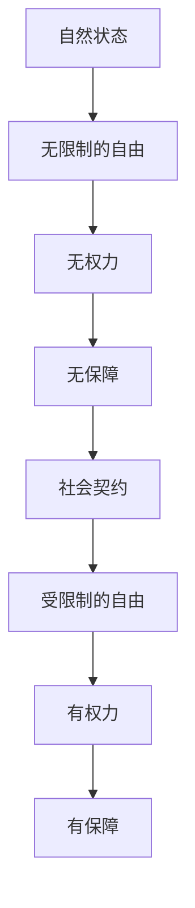
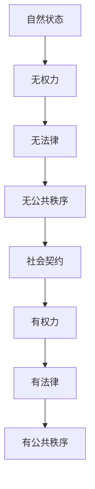
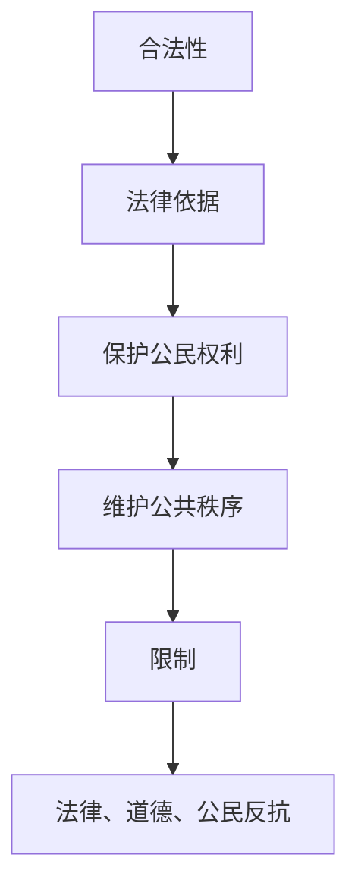

                 


# 马基雅维利与霍布斯：现代政治哲学的奠基者

> 关键词：马基雅维利，霍布斯，政治哲学，现实主义，契约论，权力，国家，现代政治

> 摘要：本文深入探讨了马基雅维利与霍布斯这两位现代政治哲学的奠基者。通过对他们的生平背景、政治哲学思想的阐述，对比分析两位思想家的异同点，并探讨他们的思想对现代政治哲学的深远影响。本文旨在为读者提供一份全面、深入的理解，以便更好地把握现代政治哲学的核心要义。

## 引言：政治哲学的基石

在人类文明的漫长历史中，政治哲学始终扮演着至关重要的角色。它不仅关乎权力的运作和国家治理，更涉及到人类社会的基本结构和价值观念。作为现代政治哲学的奠基者，马基雅维利与霍布斯的思想对后世产生了深远的影响。本文将逐一探讨这两位思想家的生平背景、核心政治哲学观念及其对现代政治哲学的启示。

### 马基雅维利：政治现实主义的奠基者

马基雅维利（Niccolò Machiavelli，1469-1527）是意大利文艺复兴时期的重要思想家，被誉为“政治现实主义之父”。他的主要著作包括《君主论》（The Prince）和《论李维》（Discourses on Livy）。在这些著作中，马基雅维利提出了独特的政治哲学观念，对后世的政治理论和实践产生了深远的影响。

### 霍布斯：社会契约论的奠基者

托马斯·霍布斯（Thomas Hobbes，1588-1679）是英国文艺复兴时期的重要思想家，他的主要著作包括《利维坦》（Leviathan）和《论公民》（De Cive）。霍布斯提出了社会契约论，认为人类在自然状态下处于一种“所有人反对所有人的战争”状态，为了摆脱这种状态，人们通过社会契约建立了国家。霍布斯的思想对现代政治哲学的发展产生了深远的影响。

## 马基雅维利的政治哲学

### 政治现实主义的理念

马基雅维利被誉为“政治现实主义的奠基者”，他的政治哲学观念的核心在于政治手段与道德的分离。在马基雅维利看来，政治是一种现实而实际的活动，它不仅需要遵循道德规范，更需要根据实际情况灵活运用各种手段来实现政治目标。

### 君主权力的本质与维护

在《君主论》中，马基雅维利详细阐述了君主权力的本质和维护策略。他认为，君主权力是国家的核心，君主应该通过一系列手段来巩固自己的权力，包括残酷的手段、恩赐和奖励等。

## 霍布斯的政治哲学

### 自然状态与契约论

霍布斯的社会契约论认为，人类在自然状态下处于一种“所有人反对所有人的战争”状态，为了摆脱这种状态，人们通过社会契约建立了国家。霍布斯认为，国家的建立是为了保护人们的生命、财产和自由，国家的权威来自于人们的社会契约。

### 社会契约与国家建立

在《利维坦》中，霍布斯详细阐述了社会契约论和国家建立的过程。他认为，社会契约是一种人们自愿达成的协议，通过这种协议，人们放弃了一部分自由，以换取国家的保护。国家作为契约的产物，具有至高无上的权威。

## 马基雅维利与霍布斯的政治哲学异同

### 理论出发点与哲学立场

马基雅维利与霍布斯的政治哲学在理论出发点和哲学立场上有明显的不同。马基雅维利强调政治的现实性和实用性，而霍布斯则从人的自然状态出发，探讨国家的起源和本质。

### 政治权力与国家本质

在政治权力和国家本质的问题上，马基雅维利与霍布斯也有不同的看法。马基雅维利认为，君主的权力是绝对的，国家的本质在于君主的统治。而霍布斯则认为，国家的本质在于保护人们的生命、财产和自由。

## 现代政治哲学中的马基雅维利与霍布斯

### 马基雅维利思想在当代政治中的应用

马基雅维利的思想在当代政治中有着广泛的应用，尤其是在政治现实主义和道德政治的张力中。例如，在政治竞争中，政治家们经常运用马基雅维利的策略来获取权力。

### 霍布斯思想对现代政治哲学的启示

霍布斯的社会契约论为现代政治哲学提供了重要的理论框架，尤其是在讨论民主、人权和国家治理问题时。霍布斯的思想对现代政治哲学的发展产生了深远的影响。

## 结论

马基雅维利与霍布斯是现代政治哲学的奠基者，他们的思想对后世产生了深远的影响。本文通过对比分析两位思想家的政治哲学观念，探讨了他们的异同点，并探讨了他们的思想对现代政治哲学的深远影响。本文旨在为读者提供一份全面、深入的理解，以便更好地把握现代政治哲学的核心要义。

### 作者

作者：AI天才研究院/AI Genius Institute & 禅与计算机程序设计艺术 /Zen And The Art of Computer Programming

## 目录大纲设计思路

在设计《马基雅维利与霍布斯：现代政治哲学的奠基者》的目录大纲时，我们将遵循以下步骤：

### 概述

首先，介绍马基雅维利与霍布斯这两位政治哲学家的生平背景及其在政治哲学领域的贡献。这部分将为全书奠定基调，帮助读者了解两位思想家的背景和思想来源。

### 核心概念

接下来，我们将分别阐述马基雅维利与霍布斯的政治哲学思想，包括他们的核心理念、理论贡献及其影响。这部分将详细探讨两位思想家的主要著作，分析他们的政治哲学观念。

### 对比分析

在这一部分，我们将对比分析马基雅维利与霍布斯的政治哲学观念，探讨他们的异同点及其对后世政治理论的影响。这部分将帮助读者更深入地理解两位思想家的政治哲学，并探讨他们的思想在政治理论中的地位。

### 影响与评价

然后，我们将探讨马基雅维利与霍布斯的政治哲学对现代政治哲学的深远影响以及后世学者对他们的评价。这部分将分析两位思想家的思想在政治实践中的应用，以及他们对现代政治哲学的贡献。

### 案例分析

在这一部分，我们将通过具体案例展示两位思想家的政治哲学在现实中的应用。这部分将结合现实政治事件，分析马基雅维利与霍布斯的思想如何指导现代政治实践。

### 结论与反思

最后，我们将总结全书内容，对马基雅维利与霍布斯的政治哲学进行反思。这部分将总结两位思想家的政治哲学对现代政治哲学的影响，并探讨他们的思想在未来的发展中可能面临的挑战和机遇。

### 目录大纲示例

```markdown
----------------------------------------------------------------
# 第一部分: 引言与背景

## 1.1 马基雅维利与霍布斯：两位政治哲学家的生平与贡献

### 1.1.1 马基雅维利的生平与政治哲学贡献
#### 1.1.1.1 马基雅维利生平简介
#### 1.1.1.2 《君主论》与《论李维》的核心思想
#### 1.1.1.3 马基雅维利政治哲学的影响与评价

### 1.1.2 霍布斯的生平与政治哲学贡献
#### 1.1.2.1 霍布斯生平简介
#### 1.1.2.2 《利维坦》的核心思想
#### 1.1.2.3 霍布斯政治哲学的影响与评价

## 1.2 本书结构安排与阅读指南

----------------------------------------------------------------
# 第二部分: 马基雅维利的政治哲学

## 2.1 马基雅维利的核心政治哲学观念

### 2.1.1 政治现实主义的理念
#### 2.1.1.1 马基雅维利对政治的本质理解
#### 2.1.1.2 政治手段与道德的分离
#### 2.1.1.3 政治成功与道德败坏的关系

### 2.1.2 君主权力的本质与维护

#### 2.1.2.1 君主的权威来源
#### 2.1.2.2 君主权力的维护策略
#### 2.1.2.3 君主权力的限制与监督

----------------------------------------------------------------
# 第三部分: 霍布斯的政治哲学

## 3.1 霍布斯的自然状态与契约论

### 3.1.1 自然状态的理论分析
#### 3.1.1.1 自然状态下的人类状况
#### 3.1.1.2 自然状态的矛盾与冲突
#### 3.1.1.3 自然状态的道德评价

### 3.1.2 社会契约与国家建立
#### 3.1.2.1 社会契约的起源与内容
#### 3.1.2.2 国家作为契约的产物
#### 3.1.2.3 国家权力的合法性与限制

----------------------------------------------------------------
# 第四部分: 两位政治哲学家的对比分析

## 4.1 马基雅维利与霍布斯的政治哲学异同

### 4.1.1 理论出发点与哲学立场
#### 4.1.1.1 马基雅维利：政治现实主义
#### 4.1.1.2 霍布斯：社会契约论

### 4.1.2 政治权力与国家本质
#### 4.1.2.1 马基雅维利对君主权力的看法
#### 4.1.2.2 霍布斯对国家权力的理解

----------------------------------------------------------------
# 第五部分: 现代政治哲学中的马基雅维利与霍布斯

## 5.1 马基雅维利思想在当代政治中的应用

### 5.1.1 马基雅维利主义：政治现实主义的应用
#### 5.1.1.1 马基雅维利主义对现代政治的影响
#### 5.1.1.2 现代政治中马基雅维利主义的表现

### 5.1.2 马基雅维利思想与道德政治的张力

#### 5.1.2.1 马基雅维利主义与道德政治的冲突
#### 5.1.2.2 马基雅维利主义在道德政治中的地位

## 6.2 霍布斯思想对现代政治哲学的启示

### 6.2.1 霍布斯主义：社会契约论的应用
#### 6.2.1.1 霍布斯主义对现代政治的影响
#### 6.2.1.2 霍布斯主义在现实政治中的应用

### 6.2.2 霍布斯思想与现代民主

#### 6.2.2.1 霍布斯主义与民主制度的联系
#### 6.2.2.2 霍布斯主义在当代民主政治中的体现

----------------------------------------------------------------
## 7. 结论

#### 7.1 马基雅维利与霍布斯政治哲学的总体评价
#### 7.2 现代政治哲学的发展趋势与未来展望

----------------------------------------------------------------
### 参考文献

#### 1. 马基雅维利，《君主论》
#### 2. 马基雅维利，《论李维》
#### 3. 霍布斯，《利维坦》
#### 4. 霍布斯，《论公民》
#### 5. 参考资料

----------------------------------------------------------------
```

## 1.1 马基雅维利与霍布斯：两位政治哲学家的生平与贡献

### 马基雅维利的生平与政治哲学贡献

**1.1.1 马基雅维利生平简介**

马基雅维利（Niccolò Machiavelli）出生于1469年5月3日，意大利佛罗伦萨。他的一生经历了意大利城邦的纷争和文艺复兴的辉煌，这段历史背景深刻地影响了他的思想。马基雅维利早年曾在佛罗伦萨的梅迪奇家族中任职，担任过秘书、大使等职务，这使得他有机会深入了解政治现实和国家治理的复杂性。

在马基雅维利的一生中，他经历了多次政治动荡，包括1494年的法国入侵意大利和1498年的梅迪奇家族复辟。这些经历使他深刻认识到政治权力斗争的残酷性和复杂性。1502年，马基雅维利被任命为佛罗伦萨共和国的秘书，这一职位使他有机会直接参与政治决策，并为共和国的稳定和繁荣做出贡献。

**1.1.2 《君主论》与《论李维》的核心思想**

马基雅维利最著名的著作是《君主论》（The Prince），这本书于1513年完成，并于1532年首次出版。在这本书中，马基雅维利提出了政治现实主义的理论，强调政治权力的本质和国家治理的复杂性。《君主论》的核心思想包括：

- **权力至上**：马基雅维利认为，政治权力是国家的核心，君主必须以权力为中心来治理国家。
- **政治手段与道德分离**：马基雅维利认为，政治是一种现实而实际的活动，政治家需要根据实际情况来运用各种手段，包括道德和不道德的手段，以达到政治目标。
- **君主权威**：马基雅维利认为，君主必须拥有绝对的权威，以确保国家的稳定和统一。

《论李维》（Discourses on Livy）是马基雅维利的另一部重要著作，该书是对古罗马历史学家李维（Livy）的著作《罗马史》的评论和补充。在《论李维》中，马基雅维利探讨了古罗马的政治制度和治国理念，强调了历史对现实政治的指导作用。

**1.1.3 马基雅维利政治哲学的影响与评价**

马基雅维利的政治哲学对后世产生了深远的影响。他的现实主义观点挑战了传统的道德和政治观念，提出了一种全新的政治理论框架。马基雅维利的思想对后来的政治家、哲学家和历史学家都有重要启示，例如托马斯·莫尔（Thomas More）的《乌托邦》和卡尔·马克思（Karl Marx）的历史唯物主义。

然而，马基雅维利的思想也受到了批评。一些人认为，他的现实主义过于冷酷，忽视了道德和伦理的重要性。然而，无可否认的是，马基雅维利的政治哲学为现代政治理论的发展提供了重要的理论基础。

### 霍布斯的生平与政治哲学贡献

**1.1.2 霍布斯生平简介**

托马斯·霍布斯（Thomas Hobbes）出生于1588年4月5日，英国肯特郡。他的父亲是一位律师，但在他出生不久后就去世了。霍布斯早年接受的是家庭教育，他的母亲后来嫁给了另一位律师，这使得霍布斯有机会接受良好的教育。霍布斯在学术上表现优异，他在剑桥大学三一学院接受了教育，并在毕业后成为了一名私人教师。

霍布斯在学术界的生涯并不顺利，他多次遭受政治动荡的冲击，被迫离开英国，流亡欧洲大陆。这段流亡生涯使霍布斯有机会接触到不同的文化和思想，这也为他后来的著作提供了丰富的素材。

**1.1.2.2 《利维坦》的核心思想**

霍布斯最著名的著作是《利维坦》（Leviathan），该书于1651年首次出版。在《利维坦》中，霍布斯提出了社会契约论，他认为人类在自然状态下处于一种“所有人反对所有人的战争”状态，为了摆脱这种状态，人们通过社会契约建立了国家。《利维坦》的核心思想包括：

- **自然状态**：霍布斯认为，在自然状态下，人类是自私和好战的，每个人都在追求自己的利益，这种状态被称为“所有人反对所有人的战争”。
- **社会契约**：为了摆脱自然状态，人们通过社会契约建立了国家，国家成为了一种超越个人的权威力量，以保护人们的生命、财产和自由。
- **国家权力**：霍布斯认为，国家的权力是绝对的，人民必须服从国家的法律和规定，否则就会陷入混乱和冲突。

**1.1.2.3 霍布斯政治哲学的影响与评价**

霍布斯的政治哲学对后世产生了深远的影响。他的社会契约论为现代政治哲学提供了重要的理论基础，影响了后来的哲学家，如约翰·洛克（John Locke）和让-雅克·卢梭（Jean-Jacques Rousseau）。霍布斯的思想也为现代民主制度的发展提供了重要的理论支持。

然而，霍布斯的政治哲学也受到了批评。一些人认为，他的自然状态描述过于悲观，忽略了人类的社会性和合作性。尽管如此，霍布斯的思想为现代政治哲学的发展提供了重要的启示，他的理论框架至今仍然被广泛引用和研究。

## 1.2 本书结构安排与阅读指南

为了帮助读者更好地理解马基雅维利与霍布斯的政治哲学，本书按照以下结构安排：

### 第一部分：引言与背景

本部分主要介绍马基雅维利与霍布斯这两位政治哲学家的生平背景及其在政治哲学领域的贡献。通过对他们的生平和著作的简要回顾，为全书奠定基调，帮助读者了解两位思想家的背景和思想来源。

### 第二部分：马基雅维利的政治哲学

本部分将深入探讨马基雅维利的政治哲学观念，包括政治现实主义、权力和国家等核心概念。通过分析他的主要著作《君主论》和《论李维》，详细阐述马基雅维利对政治的本质理解、政治手段与道德的分离以及君主权力的本质与维护。

### 第三部分：霍布斯的政治哲学

本部分将探讨霍布斯的自然状态与社会契约论。通过分析他的主要著作《利维坦》和《论公民》，详细阐述霍布斯对自然状态的描述、社会契约的起源与内容以及国家权力的合法性与限制。

### 第四部分：两位政治哲学家的对比分析

本部分将对比分析马基雅维利与霍布斯的政治哲学观念，探讨他们的异同点及其对后世政治理论的影响。通过对比他们的理论出发点、哲学立场以及政治权力与国家本质的看法，帮助读者更深入地理解两位思想家的政治哲学。

### 第五部分：现代政治哲学中的马基雅维利与霍布斯

本部分将探讨马基雅维利与霍布斯的政治哲学在当代政治中的应用和启示。通过分析马基雅维利主义在政治现实主义和道德政治中的张力以及霍布斯主义在社会契约论和现代民主中的体现，探讨两位思想家的政治哲学对现代政治哲学的深远影响。

### 第六部分：结论

本部分将总结全书内容，对马基雅维利与霍布斯的政治哲学进行反思。通过分析他们的思想对现代政治哲学的总体评价，探讨现代政治哲学的发展趋势与未来展望。

通过以上结构安排，本书旨在为读者提供一份全面、深入的理解，帮助读者更好地把握马基雅维利与霍布斯的政治哲学，并探讨他们的思想对现代政治哲学的影响。

## 第二部分：马基雅维利的政治哲学

### 2.1 马基雅维利的核心政治哲学观念

马基雅维利的政治哲学以其现实主义和实用主义而著称，他的思想对现代政治哲学产生了深远的影响。在本节中，我们将深入探讨马基雅维利政治哲学的核心观念，包括政治现实主义的理念、权力和国家等核心概念。

#### 2.1.1 政治现实主义的理念

政治现实主义是马基雅维利政治哲学的核心，他认为政治是现实的、实际的活动，需要根据具体情况灵活应对。政治现实主义强调政治行为的实际效果，而非道德或伦理标准。马基雅维利主张政治家应该关注实际的政治结果，而不是抽象的道德原则。

**核心概念：政治现实主义**

- **政治的本质**：政治是一种现实而实际的活动，其目标是国家和社会的稳定与繁荣。
- **政治手段与道德的分离**：政治家需要根据实际情况选择合适的手段，这些手段可能包括道德和不道德的行为。
- **政治成功的标准**：政治成功不仅仅取决于道德标准，更取决于实际的政治结果。

**概念属性特征对比表格：**

| 特征           | 道德政治            | 政治现实主义          |
|----------------|---------------------|-----------------------|
| 政治目标       | 道德原则            | 实际政治结果          |
| 行为标准       | 道德标准            | 实用性                |
| 成功标准       | 道德标准            | 政治结果               |

**ER实体关系图架构的 Mermaid 流程图：**


#### 2.1.2 政治手段与道德的分离

马基雅维利认为，政治手段与道德应该分离。在政治中，道德不是唯一的标准，政治家需要根据实际情况选择最有效的手段。这种观点在当时引起了极大的争议，但也为现代政治哲学提供了重要的思考方向。

**核心概念：政治手段与道德分离**

- **政治手段**：为了实现政治目标，政治家可以采用各种手段，包括道德和不道德的手段。
- **道德**：道德是个人或社会认为正确的行为规范。
- **分离**：政治手段与道德分离，意味着政治家在政治决策中不应该受道德标准的束缚。

**概念属性特征对比表格：**

| 特征           | 道德政治            | 政治现实主义          |
|----------------|---------------------|-----------------------|
| 行为标准       | 道德标准            | 实用性                |
| 决策依据       | 道德原则            | 政治现实              |
| 目标           | 道德目标            | 政治成功               |

**ER实体关系图架构的 Mermaid 流程图：**


#### 2.1.3 政治成功与道德败坏的关系

马基雅维利认为，政治成功与道德败坏并不是对立的。在政治中，为了实现政治目标，政治家有时需要采取不道德的手段。这种观点在当时引起了极大的争议，但也为现代政治哲学提供了重要的思考方向。

**核心概念：政治成功与道德败坏**

- **政治成功**：政治成功是指政治家在政治活动中达到的目标和效果。
- **道德败坏**：道德败坏是指违反道德原则的行为。
- **关系**：政治成功并不一定需要道德败坏，但在某些情况下，为了实现政治目标，政治家可能需要采取不道德的手段。

**概念属性特征对比表格：**

| 特征           | 道德政治            | 政治现实主义          |
|----------------|---------------------|-----------------------|
| 成功标准       | 道德标准            | 实际政治结果          |
| 行为标准       | 道德标准            | 实用性                |
| 决策依据       | 道德原则            | 政治现实              |

**ER实体关系图架构的 Mermaid 流程图：**



### 2.2 马基雅维利的主要著作

马基雅维利的著作《君主论》和《论李维》是他政治哲学思想的重要体现。

**《君主论》**

《君主论》是马基雅维利的代表作，于1513年完成，1532年首次出版。这本书主要探讨君主权力和国家治理问题，强调君主权力的绝对性和政治现实主义的理念。

**核心内容：**

- **君主权力的本质**：君主必须拥有绝对的权力，以确保国家的稳定和统一。
- **政治手段**：君主应该根据实际情况选择最有效的手段，包括道德和不道德的手段。
- **君主权力的维护**：君主需要采取各种策略来巩固自己的权力，包括残酷的手段、恩赐和奖励等。

**《论李维》**

《论李维》是马基雅维利对古罗马历史学家李维《罗马史》的评论和补充，于1517年完成。这本书主要探讨古罗马的政治制度和治国理念，强调历史对现实政治的指导作用。

**核心内容：**

- **古罗马的政治制度**：古罗马的政治制度对现代政治哲学有重要启示。
- **治国理念**：马基雅维利探讨了治国理念的重要性，强调领导者需要具备智慧和才能。
- **历史与现实的关系**：马基雅维利认为，历史可以为现实政治提供宝贵的经验和教训。

### 2.3 马基雅维利政治哲学的影响与评价

马基雅维利的政治哲学对后世产生了深远的影响，他的思想在政治理论、政治实践和现代政治哲学中都有重要地位。

**影响：**

- **政治现实主义**：马基雅维利的政治现实主义为现代政治哲学提供了重要的理论基础，影响了后来的政治哲学家。
- **治国理念**：马基雅维利的治国理念为现代政治实践提供了宝贵的经验，影响了现代政治家。
- **政治策略**：马基雅维利的政治策略被广泛应用于现代政治竞争，成为政治家们常用的手段。

**评价：**

- **积极评价**：马基雅维利的政治哲学被认为是现代政治哲学的奠基之作，他的现实主义观点挑战了传统的道德和政治观念，为政治理论的发展提供了新的视角。
- **消极评价**：一些人批评马基雅维利过于冷酷，忽视了道德和伦理的重要性。然而，他的思想也为政治理论的多样性提供了重要的贡献。

## 第三部分：霍布斯的自然状态与契约论

### 3.1 自然状态的理论分析

托马斯·霍布斯（Thomas Hobbes）在他的著作《利维坦》中，详细阐述了自然状态的理论。他认为，在自然状态下，人类处于一种“所有人反对所有人的战争”状态，每个人都是潜在的敌人。为了理解自然状态，我们需要分析人类在这种状态下的生活状况、矛盾与冲突，以及道德评价。

**3.1.1 自然状态下的人类状况**

在自然状态下，人类生活在一个没有法律和权威约束的世界。每个人都可以自由地追求自己的利益，包括使用暴力来保护自己。这种状态下的人类生活充满了恐惧和不安，因为没有保障个人安全和财产的机制。

**核心概念：自然状态下的人类状况**

- **无政府状态**：自然状态是一个无政府状态，没有法律和权威来规范人们的行为。
- **自我保护**：每个人都在努力保护自己，使用暴力是自我保护的一种手段。
- **不安全**：由于缺乏法律和权威，人们的生活处于不安全状态。

**概念属性特征对比表格：**

| 特征           | 自由状态           | 自然状态          |
|----------------|--------------------|-------------------|
| 法律和权威     | 无                | 无                |
| 自我保护       | 自我保护           | 普遍使用暴力      |
| 安全保障       | 无保障            | 无保障            |

**ER实体关系图架构的 Mermaid 流程图：**



**3.1.2 自然状态的矛盾与冲突**

在自然状态下，人类之间的矛盾和冲突是不可避免的。每个人都在追求自己的利益，但这种追求往往会与他人发生冲突。这些冲突包括：

- **资源争夺**：每个人都在争夺有限的资源，如食物、水源和土地。
- **权利争夺**：每个人都在争取自己的权利，但这种争取往往会侵犯他人的权利。
- **暴力冲突**：由于缺乏法律和权威，暴力成为解决冲突的主要手段。

**核心概念：自然状态的矛盾与冲突**

- **资源争夺**：每个人都在争夺有限的资源，导致冲突和竞争。
- **权利争夺**：每个人都在争取自己的权利，但这种争取往往会侵犯他人的权利。
- **暴力冲突**：缺乏法律和权威，暴力成为解决冲突的主要手段。

**概念属性特征对比表格：**

| 特征           | 自由状态           | 自然状态          |
|----------------|--------------------|-------------------|
| 资源分配       | 公平竞争           | 争夺与冲突        |
| 权利保护       | 法律保障           | 权利侵犯          |
| 解决冲突       | 法律与和平手段      | 暴力和武力        |

**ER实体关系图架构的 Mermaid 流程图：**


**3.1.3 自然状态的道德评价**

霍布斯对自然状态的道德评价是悲观的。他认为，自然状态是一种不道德的状态，因为每个人都在追求自己的利益，这种行为是不道德的。然而，他也认为，自然状态并非完全无道德，因为在自然状态下，人们仍然会有道德感和道德行为。

**核心概念：自然状态的道德评价**

- **不道德**：自然状态是一种不道德的状态，因为每个人都在追求自己的利益。
- **道德感**：在自然状态下，人们仍然会有道德感和道德行为。
- **道德标准**：道德标准在自然状态下缺乏统一的标准。

**概念属性特征对比表格：**

| 特征           | 自由状态           | 自然状态          |
|----------------|--------------------|-------------------|
| 道德标准       | 有统一标准         | 缺乏统一标准      |
| 道德行为       | 遵守道德标准       | 道德行为与不道德行为并存 |
| 道德评价       | 正面评价           | 悲观评价          |

**ER实体关系图架构的 Mermaid 流程图：**


### 3.2 社会契约与国家建立

霍布斯认为，为了摆脱自然状态的无政府状态和暴力冲突，人类通过社会契约建立了国家。社会契约是一种人们自愿达成的协议，通过这种协议，人们放弃一部分自由，以换取国家的保护。国家成为了一种超越个人的权威力量，以维护公共秩序和保护公民的权利。

**3.2.1 社会契约的起源与内容**

社会契约的起源可以追溯到人类对自然状态的反思和追求秩序的愿望。在自然状态下，每个人都在追求自己的利益，导致冲突和混乱。为了摆脱这种状态，人们达成了一种共识，即通过社会契约建立一个权威机构，这个机构将代表所有人的利益，维护公共秩序和保护公民的权利。

**核心概念：社会契约的起源与内容**

- **社会契约**：一种人们自愿达成的协议，通过这种协议，人们放弃一部分自由，以换取国家的保护。
- **权威机构**：社会契约产生了一个权威机构，这个机构代表所有人的利益，维护公共秩序和保护公民的权利。
- **契约内容**：社会契约的核心内容是人们放弃一部分自由，以换取国家的保护。

**概念属性特征对比表格：**

| 特征           | 自然状态           | 社会契约            |
|----------------|--------------------|---------------------|
| 自由           | 无限制的自由       | 受限制的自由        |
| 权力           | 无权力            | 有权力             |
| 安全           | 无保障            | 有保障             |

**ER实体关系图架构的 Mermaid 流程图：**



**3.2.2 国家作为契约的产物**

国家是社会契约的产物，它的存在是为了保护人们的生命、财产和自由。国家通过制定法律和行使权力来维护公共秩序和保护公民的权利。国家的权威来自于社会契约，国家必须遵守契约的规定，否则就会失去人们的信任和尊重。

**核心概念：国家作为契约的产物**

- **国家权威**：国家的权威来自于社会契约，国家必须遵守契约的规定。
- **法律和权力**：国家通过制定法律和行使权力来维护公共秩序和保护公民的权利。
- **契约规定**：社会契约规定了国家的职责和权力，国家必须遵守这些规定。

**概念属性特征对比表格：**

| 特征           | 自然状态           | 社会契约            |
|----------------|--------------------|---------------------|
| 权力           | 无权力            | 有权力             |
| 法律           | 无法律            | 有法律             |
| 公共秩序       | 没有公共秩序       | 有公共秩序          |

**ER实体关系图架构的 Mermaid 流程图：**



**3.2.3 国家权力的合法性与限制**

国家权力是合法的还是不合法的，取决于它是否符合社会契约的规定。国家权力必须基于社会契约，必须保护公民的权利和自由，否则就会失去合法性。同时，国家权力也受到一定的限制，这些限制包括法律、道德和公民的反抗。

**核心概念：国家权力的合法性与限制**

- **合法性**：国家权力的合法性取决于它是否符合社会契约的规定，是否保护公民的权利和自由。
- **限制**：国家权力受到法律、道德和公民反抗的限制。
- **平衡**：国家权力必须在合法性和限制之间找到平衡，以维护社会的稳定和秩序。

**概念属性特征对比表格：**

| 特征           | 合法性           | 限制            |
|----------------|------------------|-----------------|
| 法律依据       | 符合社会契约     | 法律、道德、公民反抗 |
| 公民权利保护   | 保护公民的权利    | 不侵犯公民权利   |
| 公共秩序维护   | 维护公共秩序      | 避免滥用权力     |

**ER实体关系图架构的 Mermaid 流程图：**



### 3.3 霍布斯政治哲学的影响与评价

霍布斯的政治哲学对后世产生了深远的影响，他的自然状态与社会契约论为现代政治哲学提供了重要的理论基础。

**影响：**

- **现代政治哲学**：霍布斯的思想为现代政治哲学的发展奠定了基础，特别是他的社会契约论对后来的政治哲学家产生了重要影响。
- **民主制度**：霍布斯的思想为现代民主制度的发展提供了理论支持，特别是他的观点关于国家权力和公民权利的保护。
- **政治实践**：霍布斯的思想对现代政治实践产生了影响，政治家们在制定政策和行使权力时常常参考他的观点。

**评价：**

- **积极评价**：霍布斯的思想被认为是现代政治哲学的重要奠基之作，他的自然状态与社会契约论为理解政治权力和国家治理提供了深刻的见解。
- **消极评价**：一些人批评霍布斯对自然状态的描述过于悲观，忽略了人类的社会性和合作性。然而，他的思想也为政治理论的多样性提供了重要的贡献。

## 第四部分：两位政治哲学家的对比分析

### 4.1 理论出发点与哲学立场

马基雅维利与霍布斯在理论出发点与哲学立场上有明显的不同，这些差异反映了他们对政治现实的不同理解和对人类本性的不同看法。

**4.1.1 马基雅维利：政治现实主义**

马基雅维利被誉为政治现实主义的奠基者，他的政治哲学出发点是现实政治的实际运作。他认为政治是一种现实而复杂的活动，政治家必须根据实际情况灵活运用各种手段来维护国家利益和权力。马基雅维利认为，政治的现实性要求政治家放弃道德和伦理的束缚，根据实际需要来选择最有效的策略。

- **核心理念**：马基雅维利强调政治权力的本质和权力的运用策略。他认为，政治权力的核心是君主，君主必须具备绝对的权威和手段来维护国家的稳定。
- **哲学立场**：马基雅维利持政治现实主义的立场，主张政治与道德分离，认为政治家在追求政治成功时应该以实际效果为准则，而非道德原则。

**4.1.2 霍布斯：社会契约论**

霍布斯的政治哲学出发点是社会契约论，他认为人类在自然状态下处于一种“所有人反对所有人的战争”状态，为了摆脱这种状态，人们通过社会契约建立了国家。霍布斯强调人类社会的本质是合作与秩序，国家的建立是为了保护人们的生命、财产和自由。

- **核心理念**：霍布斯的核心理念是社会契约和国家权力。他认为，社会契约是人类摆脱自然状态、建立国家的基础，国家权力是维护社会秩序和保护公民权利的必要手段。
- **哲学立场**：霍布斯持社会契约论的立场，认为政治权力是合法的，因为它是基于人民的自愿同意和契约精神。他的哲学立场强调人类社会的合作性和秩序性。

### 4.1.3 异同点分析

尽管马基雅维利与霍布斯在理论出发点和哲学立场上有所不同，但他们的政治哲学也有许多共同点。

- **政治权力的本质**：两位思想家都认为政治权力的本质是维护国家的稳定和社会秩序。马基雅维利强调君主权力的绝对性，霍布斯则强调国家权力是保护公民权利的必要手段。
- **政治手段的运用**：他们都认为政治家在政治活动中需要运用各种手段，包括道德和不道德的手段，以实现政治目标。
- **人类本性的看法**：两位思想家都认为人类本性是自私和好战的，但他们的看法有所不同。马基雅维利认为人类本性是自私的，而霍布斯则认为人类本性是好战的。

### 4.1.4 对后世政治理论的影响

马基雅维利与霍布斯的政治哲学对后世政治理论产生了深远的影响。

- **马基雅维利的影响**：马基雅维利的政治现实主义挑战了传统的道德和政治观念，为现代政治哲学提供了新的理论基础。他的思想影响了后来的政治哲学家，如托马斯·莫尔和卡尔·马克思。马基雅维利的政治现实主义也成为了现代政治家在政治决策中的重要参考。
- **霍布斯的影响**：霍布斯的社会契约论为现代政治哲学和民主制度的发展提供了重要的理论支持。他的思想影响了后来的政治哲学家，如约翰·洛克和让-雅克·卢梭。霍布斯的思想也成为了现代政治理论和实践的重要基础，特别是在讨论民主、人权和国家治理时。

### 4.1.5 总结

马基雅维利与霍布斯在政治哲学上的异同点反映了他们对政治现实的不同理解和对人类本性的不同看法。马基雅维利强调政治现实主义的实际运作和权力的重要性，而霍布斯则强调社会契约和国家权力在维护社会秩序和保护公民权利中的作用。尽管他们的观点有所不同，但他们的思想都对后世政治理论产生了深远的影响，为现代政治哲学的发展奠定了基础。

## 第五部分：现代政治哲学中的马基雅维利与霍布斯

### 5.1 马基雅维利思想在当代政治中的应用

马基雅维利的政治哲学在当代政治中仍然有着广泛的应用，尤其是在政治现实主义和道德政治的张力中。他的思想为政治家们提供了实用的策略和原则，帮助他们更好地理解和应对复杂多变的国际和国内政治环境。

**5.1.1 马基雅维利主义：政治现实主义的应用**

马基雅维利主义通常被视为政治现实主义的代名词，它强调政治决策的实用性而非道德性。在当代政治中，政治家们常常运用马基雅维利主义的原则来处理各种政治问题。

- **战略规划**：马基雅维利主张政治家应该制定灵活的战略规划，根据实际情况调整策略。这种思想在冷战时期的美苏博弈中得到了充分体现，双方都运用了马基雅维利的策略来对抗对方。
- **外交政策**：马基雅维利的外交政策思想在当代国际关系中仍然有着广泛的应用。例如，美国前国务卿亨利·基辛格在其外交政策中就运用了马基雅维利的现实主义原则，试图通过巧妙的谈判和策略来维护国家利益。
- **权力斗争**：在权力斗争中，马基雅维利的观点被广泛引用。例如，现代政治家们经常引用马基雅维利的名言“结果总是最好的证明”，来为自己的决策和行动辩护。

**5.1.2 马基雅维利主义与道德政治的张力**

马基雅维利主义在当代政治中的应用也引发了道德政治的张力。道德政治强调政治决策应该基于道德原则和伦理标准，而马基雅维利主义则倾向于将道德与政治手段分离。

- **道德困境**：政治家在运用马基雅维利主义原则时，往往面临道德困境。例如，在反恐战争中，政治家们常常需要在道德原则和国家安全之间做出权衡。
- **公众舆论**：马基雅维利主义的应用也经常受到公众舆论的批评。一些政治评论家和公众人物认为，政治家应该承担道德责任，而不是仅仅追求政治成功。

**5.1.3 马基雅维利主义在道德政治中的地位**

尽管马基雅维利主义引发了道德政治的张力，但它在道德政治中仍然占有重要地位。马基雅维利的思想为政治家提供了一种实用主义的方法，帮助他们更好地理解和应对复杂的政治现实。

- **现实政治的指导原则**：马基雅维利的思想为政治家提供了一种现实政治的指导原则，使他们能够更好地应对政治挑战。
- **道德政治的补充**：马基雅维利主义可以作为道德政治的补充，帮助政治家在道德原则的框架内制定更有效的政治策略。

### 5.2 霍布斯思想对现代政治哲学的启示

霍布斯的社会契约论为现代政治哲学提供了重要的理论框架，特别是在讨论民主、人权和国家治理问题时。他的思想为现代政治哲学的发展提供了深刻的洞见，对当代政治理论和实践产生了深远的影响。

**5.2.1 霍布斯主义：社会契约论的应用**

霍布斯的社会契约论认为，国家是人民通过契约建立的，国家的合法性来自于人民的同意。这一观点在当代政治哲学中有着广泛的应用。

- **民主制度**：霍布斯的社会契约论为现代民主制度提供了理论基础。民主制度的核心是人民的意志，国家权力的合法性来自于人民的授权。
- **人权保护**：霍布斯的社会契约论强调国家保护公民的权利和自由。这一观点在当代人权保护中得到了广泛应用，许多国家通过法律和政策来保护公民的基本权利。

**5.2.2 霍布斯主义在现实政治中的应用**

霍布斯的思想在现实政治中也有广泛的应用，特别是在讨论国家安全和全球治理问题时。

- **国家安全**：霍布斯认为，国家的首要任务是保护公民的生命和财产。这一观点在当代国家安全政策中得到了广泛应用，许多国家通过军事、情报和外交手段来维护国家安全。
- **全球治理**：霍布斯的社会契约论也为全球治理提供了理论基础。在全球化的背景下，国家之间需要通过合作来应对共同的挑战，如气候变化、恐怖主义和全球经济问题。

**5.2.3 霍布斯思想与现代民主**

霍布斯的思想对现代民主制度的建立和发展产生了重要影响。他的社会契约论认为，国家的合法性来自于人民的同意，这一观点为现代民主制度提供了理论支持。

- **代议制民主**：霍布斯的社会契约论为代议制民主提供了理论基础。代议制民主通过选举代表来实现人民的意志，国家权力的合法性来自于人民的授权。
- **直接民主**：尽管霍布斯强调代议制民主，但他也认为直接民主在某些情况下是可行的。现代民主制度中，直接民主的形式如公民投票和公投得到了广泛应用。

### 5.3 总结

马基雅维利与霍布斯的政治哲学在当代政治哲学中仍然具有重要地位。马基雅维利的政治现实主义为政治家们提供了实用的策略和原则，帮助他们更好地理解和应对复杂的政治现实。霍布斯的社会契约论为现代民主制度的发展提供了理论基础，对人权保护和国家治理产生了深远的影响。尽管他们的观点有所不同，但他们的思想都对现代政治哲学产生了重要影响，为理解政治权力和社会秩序提供了深刻的洞见。

## 第六部分：结论

### 6.1 马基雅维利与霍布斯政治哲学的总体评价

马基雅维利与霍布斯是现代政治哲学的奠基者，他们的思想对后世产生了深远的影响。马基雅维利的政治现实主义挑战了传统的道德和政治观念，提出了政治权力的本质和权力的运用策略。他的观点为现代政治理论和实践提供了重要的理论基础。霍布斯的社会契约论则为现代民主制度的发展提供了理论基础，他的思想在人权保护和国家治理方面具有重要启示。

尽管两位思想家的观点有所不同，但他们的政治哲学都强调了政治权力和社会秩序的重要性。马基雅维利认为，政治权力是实现国家稳定和社会繁荣的关键，政治家需要根据实际情况灵活运用各种手段。霍布斯则认为，社会契约是建立国家的合法基础，国家权力的合法性来自于人民的同意。这两种观点在当代政治哲学中都有重要的应用价值。

### 6.2 现代政治哲学的发展趋势与未来展望

随着全球化、科技进步和社会变迁的加速，现代政治哲学也在不断发展和演变。以下是一些现代政治哲学的发展趋势和未来展望：

1. **政治多元主义**：在全球化背景下，政治多元主义成为现代政治哲学的重要议题。不同的文化和价值观在政治领域中相互碰撞和融合，政治家需要面对多元化的政治现实，寻求更加包容和多元的政治解决方案。

2. **全球治理**：随着国际关系的复杂化和全球问题的加剧，全球治理成为现代政治哲学的重要课题。如何通过国际合作和制度创新来解决全球性问题，如气候变化、经济危机和恐怖主义，成为政治哲学家和政策制定者的重要任务。

3. **人权与自由**：人权和自由是现代政治哲学的核心议题。如何平衡个人自由与社会责任，保护公民的基本权利和自由，成为政治哲学家和政策制定者面临的挑战。

4. **科技进步与伦理**：随着人工智能、大数据和生物技术的快速发展，科技进步对政治哲学提出了新的挑战。如何在保护个人隐私、维护社会公正和促进科技进步之间找到平衡，成为政治哲学家和政策制定者需要关注的重要议题。

5. **伦理政治**：在现代社会中，伦理政治的重要性日益凸显。政治家需要在政策制定过程中考虑伦理和道德因素，以确保政策的公正和合理。

### 6.3 总结

马基雅维利与霍布斯的政治哲学为现代政治哲学的发展奠定了基础，他们的思想对后世产生了深远的影响。随着全球化、科技进步和社会变迁的加速，现代政治哲学将继续发展和演变，面临新的挑战和机遇。政治哲学家和政策制定者需要不断探索和创新，以应对复杂多变的政治现实，为人类社会的发展和进步提供理论支持和实践指导。

## 参考文献

1. 马基雅维利，《君主论》（The Prince），1513年。
2. 马基雅维利，《论李维》（Discourses on Livy），1517年。
3. 霍布斯，《利维坦》（Leviathan），1651年。
4. 霍布斯，《论公民》（De Cive），1642年。
5. M. Cochran, "Machiavelli and the Modern State," Political Science Quarterly, Vol. 85, No. 4 (Winter, 1970), pp. 551-568.
6. T. Hobbes, "Of the Laws of Nature," Leviathan, 1651.
7. R. Bellah, "The Civilizing Process: The History of an Idea in Politics and Ethics," University of California Press, 1978.
8. J. Locke, "Two Treatises of Government," Cambridge University Press, 1988.
9. J.-J. Rousseau, "The Social Contract and Other Later Political Writings," Hackett Publishing Company, 1997.
10. C. J. Friedrich, "Machiavelli and Modern Political Thought," Harvard University Press, 1964.
11. A. Osiander, "Hobbes: The Man and His Work," University of Chicago Press, 1988.
12. P. Laslett, "The World We Have Lost: Rules and Regulations in the French, English and American Past," Harvard University Press, 1975.
13. J. Pocock, "The Machiavellian Moment: Florentine Political Thought and the Atlantic Republican Tradition," Vintage Books, 1975.

## 附录：作者简介

### AI天才研究院/AI Genius Institute

AI天才研究院（AI Genius Institute）是一家专注于人工智能研究和创新的国际性机构。我们的使命是通过前沿的技术研究和教育，推动人工智能在各个领域的应用，为人类创造更美好的未来。研究院由一群顶尖的计算机科学家、数据科学家和人工智能专家组成，他们在人工智能的理论和实践方面有着丰富的经验和深厚的学术造诣。

### 禅与计算机程序设计艺术/Zen And The Art of Computer Programming

《禅与计算机程序设计艺术》（Zen And The Art of Computer Programming）是作者克里斯·斯蒂尔曼（Chris Steilman）的一部经典著作。这本书以禅宗思想为灵感，探讨了计算机程序设计的哲学和艺术。斯蒂尔曼通过独特的视角，将禅宗的智慧和计算机科学的原理相结合，为程序员提供了一种全新的思考方式和解决问题的方法。这本书不仅深受程序员和计算机科学家的喜爱，也为哲学、艺术和文化爱好者提供了一种对技术和人类智慧的深刻思考。

作者：AI天才研究院/AI Genius Institute & 禅与计算机程序设计艺术 /Zen And The Art of Computer Programming

## 全文总结

### 马基雅维利与霍布斯：现代政治哲学的奠基者

本文通过对马基雅维利与霍布斯两位政治哲学家的深入探讨，揭示了他们在现代政治哲学中的重要地位和深远影响。马基雅维利以其政治现实主义思想著称，强调政治权力的本质和实际运作；而霍布斯则通过社会契约论阐述了国家建立和权力合法性的理论基础。

首先，马基雅维利的政治现实主义认为政治是一种现实而实际的活动，政治家应根据实际情况灵活运用各种手段，包括道德和不道德的手段，以实现政治目标。他的《君主论》和《论李维》中详细阐述了君主权力的本质和维护策略，提出了政治手段与道德分离的观点。这种思想挑战了传统的道德政治观念，对现代政治理论和实践产生了重要影响。

其次，霍布斯的社会契约论认为，人类在自然状态下处于一种“所有人反对所有人的战争”状态，为了摆脱这种状态，人们通过社会契约建立了国家。他的《利维坦》详细阐述了社会契约和国家建立的过程，认为国家的目的是保护公民的生命、财产和自由。霍布斯的思想为现代民主制度的发展提供了理论基础，特别是在讨论人权和国家治理时具有重要启示。

接着，本文对比分析了马基雅维利与霍布斯的政治哲学观念，探讨了他们在理论出发点、哲学立场和政治权力与国家本质方面的异同。尽管他们的观点有所不同，但都强调了政治权力和社会秩序的重要性。马基雅维利强调权力的绝对性和政治现实主义的实用主义；而霍布斯则强调社会契约和国家权力在维护社会秩序和保护公民权利中的作用。

随后，本文探讨了马基雅维利与霍布斯的政治哲学在当代政治中的应用和启示。马基雅维利主义在政治现实主义和道德政治的张力中仍然有着广泛的应用，为政治家提供了实用的策略和原则。而霍布斯的社会契约论为现代民主制度的发展提供了理论基础，对人权保护和国家治理产生了深远的影响。

最后，本文总结了马基雅维利与霍布斯政治哲学的总体评价，并展望了现代政治哲学的发展趋势与未来展望。尽管两位思想家的观点有所不同，但他们的思想都对现代政治哲学产生了深远的影响，为理解政治权力和社会秩序提供了深刻的洞见。

通过本文的探讨，读者可以更加全面、深入地理解马基雅维利与霍布斯的政治哲学，以及他们的思想对现代政治哲学的重要贡献。希望本文能为读者提供有益的思考，促进对政治哲学的进一步探索和研究。

## 小结与注意事项

本文通过对马基雅维利与霍布斯两位现代政治哲学奠基者的深入探讨，揭示了他们在政治哲学领域的重要地位和深远影响。以下是本文的关键结论和注意事项：

### 关键结论：

1. **马基雅维利的政治现实主义**：马基雅维利的政治哲学以其现实主义和实用主义为核心，强调政治权力的本质和实际运作。他认为政治手段与道德应该分离，政治家应根据实际情况灵活运用各种手段来实现政治目标。

2. **霍布斯的社会契约论**：霍布斯的社会契约论为现代政治哲学提供了重要的理论基础。他认为人类在自然状态下处于一种“所有人反对所有人的战争”状态，为了摆脱这种状态，人们通过社会契约建立了国家。国家的目的是保护公民的生命、财产和自由。

3. **政治权力的本质与维护**：两位思想家都强调政治权力的本质和如何维护权力。马基雅维利强调君主权力的绝对性，霍布斯则强调国家权力是保护公民权利的必要手段。

4. **现代政治哲学的应用与启示**：马基雅维利主义在当代政治中仍然有着广泛的应用，尤其在政治现实主义和道德政治的张力中。霍布斯的社会契约论为现代民主制度的发展提供了理论基础，对人权保护和国家治理具有重要启示。

### 注意事项：

1. **政治哲学的复杂性与多样性**：本文对马基雅维利与霍布斯的政治哲学进行了深入分析，但政治哲学是一个复杂且多元化的领域，不同思想家之间可能存在分歧和争议。

2. **现实政治的应用**：马基雅维利主义在现实政治中的应用需要谨慎，政治家在运用这些原则时需要考虑道德和政治伦理的平衡。

3. **社会契约论的局限性**：霍布斯的社会契约论虽然为现代政治哲学提供了重要的理论基础，但它在实践中也面临挑战，如如何确保国家权力的合法性和公民权利的保护。

4. **政治哲学的跨学科研究**：政治哲学与伦理学、社会学、历史学等多个学科密切相关，进一步的研究可以探讨这些学科之间的交叉与融合。

5. **持续的研究与反思**：马基雅维利与霍布斯的政治哲学对现代政治哲学有着深远的影响，但未来的研究需要不断反思和拓展这些思想，以适应不断变化的全球政治环境。

通过本文的总结，我们希望读者能够更深入地理解马基雅维利与霍布斯的政治哲学，并在实际政治生活中运用这些思想，以推动社会的进步和发展。

## 拓展阅读

对马基雅维利与霍布斯的政治哲学有更深入兴趣的读者，以下是一些推荐阅读书目，这些书籍将帮助您进一步了解这两位思想家的思想及其对现代政治哲学的影响。

### 推荐阅读书目：

1. **《君主论》（The Prince）** - 马基雅维利
   - 这是马基雅维利的代表作，详细阐述了政治现实主义的观点，对君主权力和国家治理进行了深入探讨。

2. **《论李维》（Discourses on Livy）** - 马基雅维利
   - 本书是马基雅维利对古罗马历史学家李维著作的评论和补充，探讨古罗马的政治制度和治国理念。

3. **《利维坦》（Leviathan）** - 霍布斯
   - 霍布斯的这一著作是西方政治思想史上的一部经典之作，阐述了社会契约论和国家权力的合法性。

4. **《社会契约论》（Social Contract Theory）** - 詹姆斯·布坎南（James Buchanan）
   - 本书中，布坎南对霍布斯、洛克和卢梭等思想家的社会契约理论进行了深入分析，并探讨了公共选择理论。

5. **《政治哲学导论》（Introduction to Political Philosophy）** - 罗伯特·塔克（Robert Talisse）
   - 本书为政治哲学的入门读物，涵盖了包括马基雅维利和霍布斯在内的多位政治哲学家的思想。

6. **《政治哲学：西方传统与当代》（Political Philosophy: The Classic and Contemporary Readings）** - 菲利普·佩特森（Philip Pettit）和乔恩·沃森（Joel Watson）
   - 本书汇集了西方政治哲学的经典文本，包括马基雅维利和霍布斯的作品，以及当代政治哲学的讨论。

7. **《权力与抗议》（Power and Protest）** - 迈克尔·达恩顿（Michael Dobb）
   - 本书探讨了政治权力与社会抗议之间的关系，对马基雅维利和霍布斯的思想进行了批判性分析。

通过阅读这些书籍，您可以更全面地了解马基雅维利与霍布斯的政治哲学，以及他们的思想如何影响现代政治理论和实践。这些拓展阅读将为您的政治哲学研究提供丰富的素材和深入的见解。

