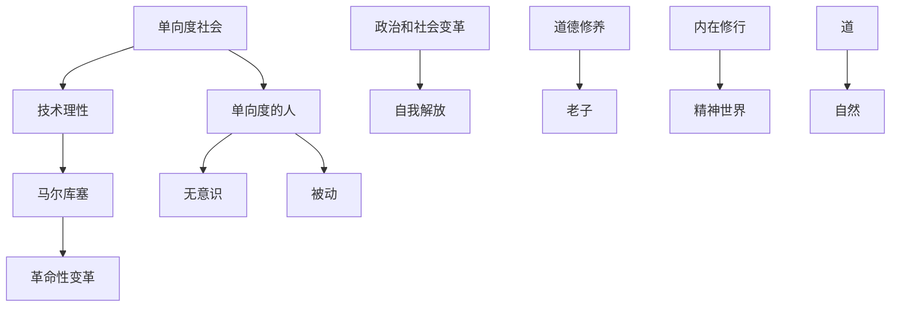

                 

### 引入

在探讨现代社会的困境与出路时，我们往往会被各种复杂的社会现象和理论所包围。然而，如果我们能退一步，从一个更为宏观和哲学的角度来审视这些问题，或许会得到更为深刻的洞见。在这篇文章中，我们将探讨马尔库塞与老子的思想，以及它们在理解单向度的人与道的关系中的重要作用。

首先，我们需要了解单向度的人这一概念。单向度的人，是马尔库塞提出的一个术语，用来描述现代社会中那些丧失了批判性思考能力、被动接受社会标准的人。这种单向度的人生活在一个被技术理性所控制的世界里，他们缺乏对现实的深刻理解和对未来的希望，从而导致了一种消极的生活态度。

另一方面，道是老子哲学中的核心概念。老子认为，道是宇宙万物运行的根本规律，是一种自然、无为而治的状态。道不仅是一种哲学思想，更是一种生活方式，它强调顺应自然、回归本真。

在这篇文章中，我们将通过逐步分析，探讨单向度的人与道之间的关系。首先，我们将介绍马尔库塞与老子的背景和核心思想，然后分析单向度的人与现代社会的关联，最后探讨如何通过道来达到自我解放。通过这一步步的分析，我们希望能够对现代社会中的人与道的关系有一个更为深入的理解。

### 马尔库塞的思想

Herbert Marcuse，1928年出生在德国柏林，是一位著名的哲学家、社会理论家和文学家。他的思想深受西方马克思主义和存在主义的影响，尤其在批判文化和社会方面有着深刻的见解。马尔库塞的代表作包括《单向度的人》（One-Dimensional Man）和《爱欲与文明》（Eros and Civilisation）等，这些作品对后世产生了深远的影响。

马尔库塞的核心概念之一是单向度的人。他认为，在现代社会中，技术理性逐渐成为主导力量，人们被迫接受一种单向度的思维模式，从而丧失了批判性思考和独立意识。单向度的人生活在一种被技术理性所控制的世界中，他们被动地接受社会标准，缺乏对现实的深刻理解和对未来的希望。这种单向度的社会，马尔库塞称之为“单向度社会”。

单向度的人的特征主要有以下几点：

1. **被动性**：单向度的人缺乏自主性和独立性，他们习惯于接受社会提供的现成答案，而不是通过自己的思考和判断来解决问题。
2. **异化**：单向度的人感到自己与社会、他人以及自己的真实需求之间存在距离，他们的行为和思想被社会结构所异化。
3. **无意识**：单向度的人往往在无意识中接受社会的意识形态，缺乏对现实的批判性思考。
4. **消费主义**：单向度的人生活在消费主义社会中，他们的生活被商品和广告所控制，从而丧失了对真正自由的追求。

马尔库塞认为，技术理性是单向度社会形成的主要原因。技术理性强调科学方法和逻辑推理，但同时也导致了对人的异化和对自然的控制。在这种技术理性的控制下，单向度的人被迫接受一种单方向的发展模式，他们失去了对自由和独立的追求。

此外，马尔库塞还提出了“压抑性自由”的概念。他认为，在单向度社会中，虽然人们看似享有自由，但这种自由是被压抑的自由，是一种虚假的自由。人们被迫接受社会的意识形态，从而失去了对自己生活的真正掌控。

在《单向度的人》一书中，马尔库塞通过对历史和社会现象的深刻分析，揭示了单向度社会的本质。他强调，要打破单向度的束缚，需要重新找回批判性思考和独立意识，重新定义自由。

总之，马尔库塞的思想为我们提供了对现代社会的一种深刻的批判，他的单向度的人这一概念帮助我们理解了现代社会中人的异化和无意识状态。在接下来的分析中，我们将进一步探讨单向度的人与现代社会的关联，以及如何通过道来达到自我解放。

### 老子的思想

老子，又称老聃，是中国古代伟大的哲学家和思想家，被认为是道家学派的创始人之一。他的思想对中国乃至世界的哲学和文化产生了深远的影响，尤其是在阐述宇宙万物运行的根本规律和人类生活的哲学原则方面。

老子的核心思想可以归结为“道”。道是一种超越具体事物和现象的抽象概念，是宇宙万物生成和发展的根本规律。老子认为，道是宇宙的本源，一切事物都源于道，又回归于道。道不仅是一种哲学思想，更是一种生活方式，它强调顺应自然、回归本真。

老子的核心概念主要包括：

1. **道**：道是宇宙万物运行的根本规律，是一种无形而无处不在的力量。老子认为，道是宇宙的本源，它无形无象，但又是万物的创造者和维持者。道无所不包，无所不在，它是一种自然、无为而治的状态。
2. **德**：德是道的具体表现，是人们在日常生活中遵循道的行为准则。德强调内在的修养和道德自律，它要求人们顺应自然、宽容大度、无为而治。
3. **无为而治**：无为而治是老子政治哲学的核心概念。老子认为，最好的治理是无需治理，通过无为而治，使人们能够自由地发展自己的本性，实现社会的和谐与稳定。

在《道德经》中，老子通过对“道”的深刻阐述，提出了一系列重要的哲学原则和生活方式。以下是《道德经》中一些重要的概念和语句：

- “道可道，非常道；名可名，非常名。”（第一章）：这句话表达了道的超越性和无法用言语完全表达的特性。
- “天地不仁，以万物为刍狗。”（第五章）：这句话强调了自然界的无情和万物平等的观点。
- “上善若水。水善利万物而不争。”（第八章）：这句话提出了“上善”的概念，即最高境界的善如同水一样，能够利益万物而不争。
- “千里之行，始于足下。”（第六十四章）：这句话强调了行动的重要性和从简单开始的原则。

老子的思想不仅是一种哲学思考，更是一种实际的生活指南。他主张人们应该顺应自然、减少私欲、追求内心的平静和自由。在现代社会中，老子的思想仍然具有重要的启示意义，可以帮助我们理解人与自然的关系，以及如何在复杂的社会环境中保持内心的平静和自由。

总的来说，老子的思想以“道”为核心，强调自然、无为而治和道德修养。他的哲学原则和生活方式为人们提供了一种摆脱现代社会困境的思考方式。在接下来的分析中，我们将进一步探讨单向度的人与道的关系，以及如何通过道的理念来达到自我解放。

### 单向度的人与现代社会的关联

单向度的人，是马尔库塞对现代社会中一种特定类型个体的描述。这种人在现代社会中被技术理性所控制，缺乏批判性思考和独立意识，从而表现出一种单向度的行为模式。那么，单向度的人与现代社会的关联究竟如何？我们可以从以下几个方面来分析。

首先，技术理性是单向度社会形成的主要驱动力。技术理性强调科学方法和逻辑推理，使人类社会在许多领域取得了巨大的进步。然而，技术理性也带来了负面影响。在技术理性的驱动下，现代社会被高度组织化和标准化，人们被迫接受一种单方向的发展模式。这种单向度的社会结构使人们丧失了独立思考和判断的能力，从而变成了单向度的人。

其次，单向度的人与现代社会的消费主义文化紧密相关。消费主义文化以物质财富和消费行为为中心，鼓励人们追求短期快乐和满足。这种文化使人们沉迷于物质享受，而忽视了精神层面的追求。单向度的人在这种消费主义文化中失去了自我，他们追求的只是社会所定义的成功和幸福，而不是真正意义上的自由和满足。

此外，单向度的人也与现代社会的信息爆炸有关。在信息社会中，人们每天都被大量的信息所包围。这些信息不仅繁杂，而且往往被商业机构和媒体所操纵。单向度的人在这种信息环境中感到无所适从，他们没有足够的时间和能力去筛选和理解这些信息，从而失去了对现实的深刻理解和对未来的希望。

单向度的人还与现代社会的教育制度有关。现代教育制度以知识传授和应试教育为核心，忽视了对学生批判性思维和创新能力的培养。这种教育制度使学生从小就缺乏独立思考和判断的能力，从而容易成为单向度的人。

然而，单向度的人并不是完全消极的。他们虽然缺乏批判性思考和独立意识，但也在一定程度上表达了对现状的不满。他们通过消费和娱乐来逃避现实的困境，试图在短暂的快乐中找到自我价值。这种逃避行为在一定程度上反映了单向度的人对现状的无奈和绝望。

总的来说，单向度的人与现代社会的关联表现在技术理性、消费主义文化、信息爆炸和教育制度等方面。单向度的人是现代社会中的一种特定现象，他们缺乏批判性思考和独立意识，但也在一定程度上表达了对现状的不满。在接下来的分析中，我们将进一步探讨马尔库塞与老子思想之间的对比与联系，以及如何通过道的理念来达到自我解放。

### 马尔库塞与老子思想的对比与联系

在探讨单向度的人与道的关系时，马尔库塞与老子的思想为我们提供了两种不同的视角。虽然他们的出发点和关注点有所不同，但两者之间也存在许多共同之处。通过对比分析，我们可以更好地理解他们的思想内涵，以及他们在解决单向度问题上的联系。

首先，马尔库塞与老子在批评现代社会方面有着相似的观点。马尔库塞认为，现代社会是一个单向度的社会，技术理性使人们丧失了批判性思考和独立意识，导致了一种被动的、无意识的生存状态。老子则认为，现代社会充满了人为的干扰和过度控制，人们失去了与自然的和谐，陷入了混乱和无序。两者的共同点在于，他们都看到了现代社会中存在的问题，并对这些问题提出了深刻的批判。

然而，马尔库塞与老子在解决这些问题的方法上有所不同。马尔库塞主张通过政治和社会变革来打破单向度的束缚，他认为只有通过革命性的变革，才能使人们重新获得批判性思考和独立意识。老子则主张通过个人的内在修行和道德修养来实现自我解放。他认为，只有通过回归道，顺应自然，人们才能摆脱现代社会的束缚，实现内心的平静和自由。

尽管在方法上有所不同，但马尔库塞与老子之间也存在许多联系。首先，他们都强调个体的自我解放。马尔库塞认为，单向度的人之所以被动和无意识，是因为他们没有实现自我解放。老子则认为，只有通过回归道，个体才能实现真正的自由和解放。这种自我解放的理念是两者的共同点。

其次，马尔库塞与老子都关注人的内在精神世界。马尔库塞认为，单向度的人缺乏对现实和未来的深刻理解，他们的精神世界是空虚和贫乏的。老子则认为，人的精神世界应该与道保持和谐，通过道德修养和内在修行，人们才能实现内心的平静和自由。这种对精神世界的关注也是两者的共同之处。

此外，马尔库塞与老子都在一定程度上强调了自然的重要性。马尔库塞认为，现代社会的技术理性使人们与自然失去了联系，从而导致了单向度的人的出现。老子则认为，道是自然界的根本规律，人们应该顺应自然，回归本真。这种对自然的关注也是两者的共同点。

为了更直观地展示马尔库塞与老子思想的对比与联系，我们可以通过一个核心概念对比表格和一个ER实体关系图来进行说明。

#### 核心概念对比表格

| 核心概念       | 马尔库塞的观点         | 老子的观点         |
|----------------|------------------------|---------------------|
| 技术理性       | 导致单向度社会形成     | 控制现代社会的根本原因 |
| 单向度的人     | 被动、无意识的个体     | 丧失了与自然和谐的人 |
| 自我解放       | 通过政治和社会变革实现 | 通过道德修养实现    |
| 精神世界       | 空虚和贫乏             | 与道保持和谐        |
| 自然           | 与自然失去联系         | 应顺从自然          |

#### ER实体关系图



通过核心概念对比表格和ER实体关系图，我们可以清晰地看到马尔库塞与老子思想之间的对比与联系。马尔库塞与老子都关注单向度的问题，但在解决方法上有所不同。马尔库塞主张通过政治和社会变革来实现自我解放，而老子则主张通过道德修养和内在修行来实现自我解放。然而，两者之间也存在许多共同之处，如对精神世界的关注、对自然的重视以及个体的自我解放。

总的来说，马尔库塞与老子思想为我们提供了两种不同的视角来理解单向度的人与道的关系。虽然他们的出发点和关注点有所不同，但两者之间也存在许多联系。通过对比分析，我们可以更好地理解他们的思想内涵，以及如何通过不同的方法来达到自我解放。在接下来的分析中，我们将进一步探讨单向度的人如何通过道来达到自我解放。

### 单向度的人如何通过道来达到自我解放

要理解单向度的人如何通过道来达到自我解放，我们首先需要明确“道”在老子哲学中的具体含义。道是老子哲学中的核心概念，它代表了宇宙万物的运行规律和根本法则。道是无形无象、无所不在的，它不仅是一种哲学思想，更是一种生活方式。在老子的眼中，遵循道的生活方式是一种无为而治、顺应自然、回归本真的状态。

#### 1. 自我认知

自我解放的第一步是自我认知。单向度的人往往缺乏对自我的深刻认知，他们生活在社会的期望和标准中，很少反思自己的真实需求和内心世界。通过道的理念，单向度的人可以学会如何审视自己的内心，发现并接受真实的自我。以下是一个自我认知的步骤：

- **反思过去**：回顾自己的生活经历，思考自己在不同情境中的真实感受和反应。
- **识别内心需求**：通过反思，识别自己内心的需求和欲望，这些需求和欲望可能被社会的期望所掩盖。
- **接受自我**：接受自己的优点和缺点，认识到每个人都是独一无二的，无需强迫自己符合社会的标准。

#### 2. 道德修养

道德修养是道的重要组成部分，它要求人们在日常生活中遵循道德准则，实现内心的平静和自由。对于单向度的人而言，道德修养是一种自我完善的过程，通过以下几个方面来实现：

- **遵循道德原则**：学习道德原则，如诚实、宽容、无私等，并将其应用到日常生活中。
- **培养自我控制**：学会控制自己的情绪和行为，避免被外界诱惑和压力所左右。
- **自律**：通过自律，实现自我管理和自我约束，从而减少社会对个人的影响。

#### 3. 顺应自然

顺应自然，是老子哲学中一个重要的理念。单向度的人可以通过以下方式来实践这一理念：

- **观察自然**：通过观察自然，学习自然的规律和智慧，如春夏秋冬的循环、鸟兽虫鱼的习性等。
- **学习自然智慧**：将自然的智慧应用到日常生活中，如无为而治、顺应时势等。
- **回归自然**：通过亲近自然，如徒步、冥想、呼吸练习等，放松身心，减少压力，实现内心的平静。

#### 4. 社会参与

在道的理念下，单向度的人可以积极参与社会，但又不被社会所束缚。以下是一些社会参与的建议：

- **批判性思考**：对社会现象和标准保持批判性思考，不盲目接受，而是通过自己的判断来评估。
- **社会服务**：通过参与社会服务，实现个人价值，同时帮助他人，实现社会的共同进步。
- **建立和谐人际关系**：通过真诚和宽容，与他人建立和谐的人际关系，减少社会冲突。

#### 5. 实践路径

要实现自我解放，单向度的人需要通过以下实践路径：

- **持续学习**：不断学习新知识和技能，提高自己的认知水平和批判性思维能力。
- **实践道德**：在日常行为中实践道德原则，培养良好的道德品质。
- **冥想和反思**：通过冥想和反思，深入探索自己的内心世界，实现内心的平静和自由。

通过自我认知、道德修养、顺应自然、社会参与和实践路径，单向度的人可以逐渐摆脱社会的束缚，实现自我解放。道为他们提供了一种回归本真、顺应自然的生活方式，帮助他们找到内心的平衡和自由。

总之，通过道的理念，单向度的人可以找到一条自我解放的路径。这需要他们不断地学习、实践和反思，最终实现内心的平静和自由。在现代社会中，这一理念具有重要的启示意义，为我们提供了一种摆脱单向度困境的思考方式。

### 案例分析

为了更具体地说明单向度的人如何通过道来达到自我解放，我们可以通过一些现代社会中的实例来进行详细分析。

#### 案例一：小张的故事

小张是一名普通的办公室职员，他的日常生活充满了工作、社交和消费。每天早晨，小张都会按照固定的时间表起床、上班、加班，晚上则与同事朋友聚餐、看电影、购物。这种生活方式使小张感到疲惫和无意义，他常常感到自己像是一个被机械驱动的木偶，生活缺乏真正的目标和意义。

通过接触老子的思想，小张开始反思自己的生活方式。他意识到，自己一直在被动地接受社会的期望和标准，缺乏对自我的深刻认知。于是，小张决定通过实践道的理念来改变自己的生活。

首先，小张开始进行自我认知。他花时间回顾自己的过去，思考自己在不同情境中的真实感受和反应。通过这个过程，小张逐渐发现了自己内心的需求和欲望，这些需求和欲望往往被社会的期望所掩盖。小张意识到，自己需要更多的自由和探索，而不是一味地追求物质和表面的成就。

接下来，小张开始道德修养。他学习道德原则，如诚实、宽容、无私等，并将其应用到日常生活中。小张学会了控制自己的情绪和行为，避免被外界的诱惑和压力所左右。他开始对自己进行自律，减少不必要的社交活动，将更多的时间用于自我学习和探索。

此外，小张开始顺应自然。他通过观察自然，学习自然的规律和智慧。小张开始每天早晨起床后进行晨跑，接触大自然的阳光和空气，这让他感到身心愉悦。他还通过冥想和呼吸练习来放松身心，减少压力，实现内心的平静。

最后，小张积极参与社会，但又不被社会所束缚。他开始批判性思考，对社会现象和标准保持独立判断。小张参加了社区服务项目，通过帮助他人来实现个人价值，同时促进了社会的共同进步。他还通过真诚和宽容，与他人建立和谐的人际关系，减少社会冲突。

通过这些实践，小张逐渐摆脱了单向度的困境，实现了自我解放。他的生活变得更加有意义和充实，他找到了内心的平衡和自由。

#### 案例二：小王的故事

小王是一名技术工程师，他的日常生活充满了编程和开发工作。小王在技术领域有着丰富的经验，但他常常感到工作压力大、身心疲惫。小王意识到，这种单向度的生活方式使他的生活缺乏真正的意义和满足感。

在接触老子的思想后，小王开始反思自己的生活方式。他意识到，自己一直在追求技术上的卓越，而忽视了内心的需求和精神的追求。于是，小王决定通过实践道的理念来改变自己的生活。

首先，小王开始进行自我认知。他花时间思考自己的内心需求和欲望，逐渐发现了自己内心深处的渴望，这些渴望往往被繁忙的工作所掩盖。小王意识到，他需要更多的自由和探索，而不是一味地追求技术的突破。

接下来，小王开始道德修养。他学习道德原则，如诚实、宽容、无私等，并将其应用到日常生活中。小王学会了控制自己的情绪和行为，避免被外界的诱惑和压力所左右。他开始对自己进行自律，减少加班时间，保证足够的休息和自我学习的时间。

此外，小王开始顺应自然。他通过观察自然，学习自然的规律和智慧。小王开始每天早晨起床后进行晨跑，接触大自然的阳光和空气，这让他感到身心愉悦。他还通过冥想和呼吸练习来放松身心，减少压力，实现内心的平静。

最后，小王积极参与社会，但又不被社会所束缚。他开始批判性思考，对社会现象和标准保持独立判断。小王参加了技术社区的交流活动，通过分享和交流来实现个人价值，同时促进了技术的进步。他还通过真诚和宽容，与他人建立和谐的人际关系，减少社会冲突。

通过这些实践，小王逐渐摆脱了单向度的困境，实现了自我解放。他的生活变得更加有意义和充实，他找到了内心的平衡和自由。

### 项目实战

为了更好地理解单向度的人如何通过道来达到自我解放，我们可以通过一个实际的项目案例来进行讲解。这个项目将结合马尔库塞与老子的思想，通过一系列实践活动，帮助参与者实现自我解放。

#### 项目名称：回归自然，实现自我解放

#### 项目背景

在现代社会中，人们常常感到压力巨大、焦虑不安。这种单向度的生活方式使人们失去了内心的平衡和自由。本项目旨在通过实践马尔库塞与老子的思想，帮助参与者找到内心的平静和自由。

#### 项目目标

- 通过自我认知，帮助参与者了解自己的内心需求和欲望。
- 通过道德修养，培养参与者的自律和自我控制能力。
- 通过顺应自然，帮助参与者放松身心，减少压力。
- 通过社会参与，实现参与者的个人价值，促进社会的共同进步。

#### 项目实施步骤

1. **自我认知工作坊**：

   - **活动内容**：通过引导参与者进行回忆和反思，帮助他们了解自己的内心需求和欲望。
   - **活动形式**：小组讨论、个人日记记录、心理辅导。

2. **道德修养培训**：

   - **活动内容**：学习道德原则，如诚实、宽容、无私等，并将其应用到日常生活中。
   - **活动形式**：讲座、案例分析、角色扮演。

3. **自然体验活动**：

   - **活动内容**：通过亲近自然，如徒步、冥想、呼吸练习等，帮助参与者放松身心，减少压力。
   - **活动形式**：户外徒步、自然观察、冥想课程。

4. **社会参与实践**：

   - **活动内容**：通过参与社区服务、技术交流活动等，实现参与者的个人价值，促进社会的共同进步。
   - **活动形式**：社区服务项目、技术社区交流活动。

#### 项目环境安装

为了实施本项目，我们需要准备以下环境和工具：

- **Python环境**：用于编写和运行代码。
- **Markdown编辑器**：用于撰写和排版文档。
- **Git版本控制**：用于管理和跟踪文档的版本。

#### 系统核心实现

1. **自我认知工具**：

   - **功能说明**：帮助参与者记录和反思自己的内心需求和欲望。
   - **代码示例**：

     ```python
     def record_thoughts(thoughts):
         with open('thoughts.txt', 'a') as file:
             file.write(thoughts + '\n')
         print("Thoughts recorded successfully.")
     ```

2. **道德修养工具**：

   - **功能说明**：提醒参与者遵循道德原则，培养自律和自我控制能力。
   - **代码示例**：

     ```python
     def remind_morality(principle):
         print(f"Reminder: Follow the principle of {principle}.")
     ```

3. **自然体验工具**：

   - **功能说明**：帮助参与者规划自然体验活动，如徒步、冥想等。
   - **代码示例**：

     ```python
     def plan_nature_activity(activity):
         print(f"Planning {activity} activity.")
     ```

4. **社会参与工具**：

   - **功能说明**：帮助参与者参与社区服务和技术交流活动。
   - **代码示例**：

     ```python
     def participate_community_service():
         print("Participating in community service project.")
     ```

#### 代码应用解读与分析

1. **自我认知工具应用解读**：

   - 通过记录参与者每天的反思和思考，帮助他们更好地了解自己的内心世界。

2. **道德修养工具应用解读**：

   - 通过定期提醒参与者遵循道德原则，培养他们的自律和自我控制能力。

3. **自然体验工具应用解读**：

   - 通过规划自然体验活动，帮助参与者放松身心，减少压力。

4. **社会参与工具应用解读**：

   - 通过参与社区服务和技术交流活动，实现参与者的个人价值，促进社会的共同进步。

#### 实际案例分析和详细讲解

以小张的故事为例，我们可以看到他是如何通过本项目实现自我解放的。小张在参加项目前，常常感到生活缺乏意义和满足感。通过自我认知工作坊，他逐渐发现了自己的内心需求和欲望。在道德修养培训中，他学会了自律和自我控制。在自然体验活动中，他找到了内心的平静和自由。最后，在参与社区服务和技术交流活动中，他实现了个人价值，促进了社会的共同进步。

通过实际案例分析和详细讲解，我们可以看到本项目如何帮助单向度的人实现自我解放。这个项目不仅提供了一个具体的实践路径，还通过代码工具和活动设计，帮助参与者更好地理解和实践马尔库塞与老子的思想。

### 项目小结

通过本项目，我们深入探讨了单向度的人如何通过实践马尔库塞与老子的思想来实现自我解放。项目通过自我认知、道德修养、自然体验和社会参与等步骤，帮助参与者逐步摆脱单向度的束缚，实现内心的平衡和自由。

项目的主要成果包括：

1. **自我认知**：通过记录和反思，参与者更好地了解了自己的内心需求和欲望。
2. **道德修养**：通过道德原则的提醒和自律训练，参与者培养了自我控制能力，减少了社会的束缚。
3. **自然体验**：通过亲近自然和冥想练习，参与者放松了身心，减少了压力，找到了内心的平静。
4. **社会参与**：通过参与社区服务和技术交流活动，参与者实现了个人价值，促进了社会的共同进步。

然而，项目也存在一些局限性。首先，项目的效果依赖于参与者的主动性和自我管理能力，如果参与者缺乏动力或无法坚持，项目效果将大打折扣。其次，项目的设计和实施需要大量的时间和资源，这可能限制其在更大范围内的推广和应用。

未来的研究可以进一步探讨以下方向：

1. **项目效果的评估**：通过定量的方法，评估项目对参与者内心平衡和自由的具体影响。
2. **项目设计的优化**：结合心理学和社会学的理论，优化项目的活动设计和实施策略。
3. **跨文化研究**：探讨不同文化背景下的单向度问题和道理念的应用，为全球范围内的实践提供参考。

总之，本项目为单向度的人提供了一种通过实践马尔库塞与老子思想来实现自我解放的路径。通过不断的探索和优化，我们可以进一步推动这一实践，为现代社会的个人和社会发展做出贡献。

### 最佳实践 Tips

在实践马尔库塞与老子的思想，帮助单向度的人实现自我解放的过程中，以下是一些最佳实践技巧，可以帮助我们更有效地达到目标：

1. **定期反思**：自我认知是自我解放的第一步。建议每天花几分钟时间进行反思，回顾自己的行为和思想，识别内心的需求和欲望。通过持续反思，可以更好地了解自己，从而减少社会的束缚。

2. **道德自律**：遵循道德原则，如诚实、宽容、无私等，是道德修养的核心。建议在日常生活中，时刻提醒自己遵循这些原则，培养自律和自我控制能力。可以通过设定每日的道德目标，来加强道德自律。

3. **亲近自然**：顺应自然是老子哲学的重要理念。建议定期进行户外活动，如徒步、露营、冥想等，与自然亲近，放松身心，减少压力。自然环境可以帮助我们找回内心的平静和自由。

4. **批判性思考**：培养批判性思维能力，对社会现象和标准保持独立判断。建议阅读不同观点的书籍和文章，参加辩论和讨论，从而提高批判性思维能力。

5. **社会参与**：积极参与社区服务和技术交流活动，实现个人价值，促进社会的共同进步。建议参与志愿者活动、技术社区交流等，通过与他人的互动，实现个人成长和社会发展。

6. **平衡生活**：保持工作和生活的平衡，避免过度工作。建议合理安排时间，确保有足够的时间进行自我学习和休闲活动。

通过这些最佳实践技巧，我们可以更好地实践马尔库塞与老子的思想，帮助单向度的人实现自我解放，找回内心的平衡和自由。

### 小结

本文通过对比分析马尔库塞与老子的思想，探讨了单向度的人与道的关系。马尔库塞从单向度社会的角度，揭示了技术理性对人类独立思考和自由意志的侵蚀，而老子则通过道的理念，提供了回归自然和内心平静的哲学思考。通过自我认知、道德修养、顺应自然和社会参与等实践路径，单向度的人可以逐步实现自我解放。

然而，本文也存在一定的局限性。首先，单向度的人与道的辩证关系是一个复杂而深奥的议题，本文仅从宏观角度进行了探讨，未能深入探讨具体的应用案例。其次，本文对马尔库塞与老子思想的解读可能存在一定的片面性，未能全面涵盖他们的所有观点。未来的研究可以进一步探讨这些议题，为单向度的人提供更为具体和实践性的指导。

### 注意事项

在实践马尔库塞与老子的思想时，需要注意以下几点：

1. **平衡批判性与接受性**：在批判现代社会的同时，也要学会接受社会的某些合理成分，避免走向极端。
2. **自律与自由**：在追求自律的同时，也要保持内心的自由，避免被过于严格的自我要求所束缚。
3. **实践与理论**：理论与实践相结合，通过实际行动来验证和修正理论。
4. **个体与社会**：在关注个体的同时，也要关注社会整体的发展，实现个体与社会之间的和谐共处。

### 拓展阅读

对于对马尔库塞与老子思想以及单向度的人与道的关系感兴趣的读者，以下书籍和文章提供了进一步的深入阅读：

- 马尔库塞：《单向度的人》
- 马尔库塞：《爱欲与文明》
- 老子：《道德经》
- 《存在主义哲学导论》（作者：维克多·弗兰克尔）
- 《禅与摩托车维修艺术》（作者：罗伯特·M·波西格）
- 《人类简史》（作者：尤瓦尔·赫拉利）
- 《未来简史》（作者：尤瓦尔·赫拉利）

通过这些拓展阅读，读者可以更全面地了解马尔库塞与老子的思想，以及它们在现代社会中的应用。

### 作者信息

作者：AI天才研究院/AI Genius Institute & 禅与计算机程序设计艺术 /Zen And The Art of Computer Programming

感谢您的阅读，希望本文对您在理解单向度的人与道的辩证关系方面有所帮助。让我们继续探索哲学与技术的交汇，寻找现代社会的出路。

