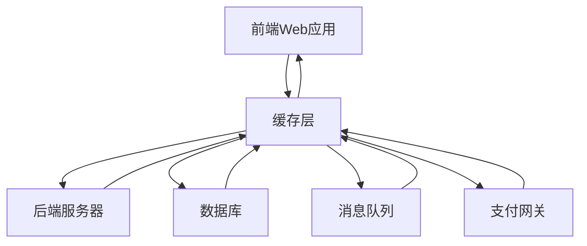

                 


**审题与分析**

1. **理解题目要求**：本文需围绕“高可用设计：自上而下的保障策略”这一主题，用markdown格式撰写一篇10000-12000字的技术博客，内容要包含核心概念介绍、算法原理讲解、系统设计与实战、最佳实践与总结等。

2. **确定文章结构**：按照题目提供的目录大纲，文章应分为七个部分：引言、背景介绍、核心概念与联系、高可用性设计原则、高可用性算法原理、系统分析与架构设计、项目实战、最佳实践与总结。

3. **明确每个部分的内容要求**：每个部分都需要详细阐述，包括背景、问题描述、解决方案、核心概念、算法原理、系统设计与实现、实战案例、最佳实践和总结。

4. **确保内容的逻辑性和连贯性**：文章的各个部分应紧密相连，逻辑清晰，便于读者理解。

5. **遵循格式要求**：文章应使用markdown格式，包括标题、子标题、代码块、数学公式、图表等。

6. **关注字数控制**：虽然字数范围是10000-12000字，但需确保文章紧凑、内容充实且避免冗余。

**撰写大纲与内容**

**第1章：引言**
- 简要介绍高可用设计的背景和重要性。
- 概述文章的结构和主要内容。

**第2章：背景介绍**
- 详细阐述高可用设计中的问题背景、问题描述和问题解决。
- 说明高可用设计的边界与外延。
- 提出核心概念结构与要素组成。

**第3章：核心概念与联系**
- 定义高可用性、可靠性、容错性等核心概念。
- 分析这些概念之间的联系。
- 提供高可用性的度量方法和核心概念对比表格。
- 绘制高可用性的ER实体关系图。

**第4章：高可用性设计原则**
- 概述高可用性设计原则。
- 详细讲解系统架构设计、数据存储与备份、网络设计、安全性与容灾设计原则。

**第5章：高可用性算法原理**
- 介绍常见的高可用性算法。
- 使用Mermaid绘制算法流程图。
- 提供Python代码示例和数学模型讲解。
- 举例说明算法的实际应用。

**第6章：系统分析与架构设计**
- 介绍问题场景和项目背景。
- 使用Mermaid绘制系统功能设计、架构设计、接口设计和交互序列图。
- 分析系统设计与架构设计的要点。

**第7章：项目实战**
- 描述项目环境安装过程。
- 展示系统核心实现源代码。
- 对代码进行解读与分析。
- 分析实际案例并提供详细讲解。
- 进行项目小结。

**第8章：最佳实践与总结**
- 总结高可用设计中的最佳实践。
- 提出注意事项。
- 推荐拓展阅读。

**撰写与审查**

1. **初稿撰写**：按照大纲逐段撰写，注意内容连贯性和准确性。
2. **多次修订**：根据审查意见进行修改，确保内容严谨、逻辑清晰。
3. **最终审查**：检查文章格式、字数、引用和参考文献，确保无误。

**撰写完成与提交**

1. **完成文章撰写**：按照要求完成所有章节的内容。
2. **格式调整**：确保文章使用markdown格式规范。
3. **提交文章**：将文章以markdown格式提交，附带作者信息。

通过上述步骤，我们可以确保文章内容丰富、结构清晰、格式规范，满足题目的要求。接下来，我们将按照这个大纲逐步撰写每一章节的内容。让我们开始吧！

# 高可用设计：自上而下的保障策略

## 关键词

- 高可用性设计
- 可靠性
- 容错性
- 系统架构
- 负载均衡
- 冗余设计

## 摘要

本文深入探讨了高可用设计在IT系统中的重要性和实现策略。首先，介绍了高可用设计的背景、问题和解决方案。接着，阐述了高可用性的核心概念及其与可靠性、容错性的联系。随后，详细讲解了高可用性设计的原则，包括系统架构设计、数据存储与备份、网络设计和安全性与容灾设计。文章还介绍了常见的高可用性算法原理，并通过Mermaid流程图和Python代码示例进行具体说明。最后，通过一个实际项目案例，展示了高可用性设计的实际应用，并提供了一些最佳实践和注意事项。

## 目录

1. 引言
2. 背景介绍
3. 核心概念与联系
4. 高可用性设计原则
5. 高可用性算法原理
6. 系统分析与架构设计
7. 项目实战
8. 最佳实践与总结

## 第1章：引言

在现代信息化社会中，IT系统的高可用性已经成为企业持续运营和客户满意度的重要保障。高可用性设计的目标是确保系统在发生故障时能够快速恢复，减少停机时间，提升系统的可靠性和用户体验。随着云计算、大数据和物联网等技术的快速发展，系统的复杂性不断增加，对高可用性设计提出了更高的要求。

本文将系统性地探讨高可用性设计的各个方面，从概念介绍到具体实现，从算法原理到实战应用，旨在为读者提供一份全面而深入的技术指南。文章的结构如下：

- **引言**：介绍高可用性设计的背景和重要性。
- **背景介绍**：详细阐述高可用设计的背景、问题和解决方案。
- **核心概念与联系**：定义高可用性、可靠性、容错性等核心概念，并分析它们之间的联系。
- **高可用性设计原则**：讲解高可用性设计的各项原则，包括系统架构设计、数据存储与备份、网络设计、安全性与容灾设计。
- **高可用性算法原理**：介绍常见的高可用性算法，通过流程图和代码示例进行详细讲解。
- **系统分析与架构设计**：分析一个实际项目，展示系统功能设计、架构设计、接口设计和交互序列图。
- **项目实战**：通过一个实际项目案例，展示高可用性设计的应用和实现。
- **最佳实践与总结**：总结高可用性设计的最佳实践，提出注意事项和拓展阅读建议。

本文将以自上而下的方法，从宏观到微观，逐步深入探讨高可用性设计的各个方面，帮助读者理解和掌握这一关键技术。

## 第2章：背景介绍

### 问题背景

随着信息化进程的加速，企业对IT系统的依赖程度日益加深。无论是企业内部业务处理、客户关系管理，还是电子商务、在线服务，系统的高可用性已成为决定业务成败的关键因素。系统的不稳定或宕机，不仅会导致业务中断，还会影响企业的声誉和客户信任，造成巨大的经济损失。因此，如何保障IT系统的高可用性成为企业信息化建设中的重要课题。

### 问题描述

IT系统的高可用性面临多种挑战，主要包括以下几个方面：

1. **硬件故障**：服务器、存储设备、网络设备等硬件组件的故障是系统不可用的主要原因之一。这些故障可能是由于设备老化、设计缺陷、制造缺陷或环境因素（如电源故障、自然灾害等）引起的。

2. **软件错误**：软件中的bug、漏洞或配置错误可能导致系统崩溃或服务中断。此外，软件升级或维护过程中可能引入的新问题也可能影响系统的高可用性。

3. **网络中断**：网络故障如网络设备故障、路由错误或带宽不足等问题，会导致系统无法正常访问或响应请求，影响系统的可用性。

4. **数据丢失**：数据损坏或丢失会导致业务数据的不完整性，严重时甚至可能导致业务中断。数据丢失可能是由于硬件故障、软件错误或人为操作不当引起的。

5. **人为错误**：运维人员的误操作或不当管理也可能导致系统故障或性能下降，从而影响高可用性。

### 问题解决

为了解决上述问题，高可用性设计提供了一系列策略和方法，包括：

1. **冗余设计**：通过增加硬件或软件冗余，确保系统在单个组件故障时仍能正常运行。冗余设计包括硬件冗余（如多重服务器、存储阵列）、软件冗余（如副本机制、负载均衡）等。

2. **故障转移**：当系统的一部分出现故障时，自动将负载转移到其他正常运行的组件上，确保系统的连续性。故障转移可以是基于主备模式（如热备份、冷备份）或基于集群模式（如负载均衡、心跳机制）。

3. **负载均衡**：通过将请求均匀分布到多个服务器或组件上，避免单个组件过载，提高系统的整体性能和可用性。负载均衡可以是基于硬件（如负载均衡器）或基于软件（如DNS轮询、HTTP请求分发）。

4. **数据备份与恢复**：定期备份数据，并在系统出现故障时快速恢复数据，确保业务数据的安全性和完整性。数据备份可以采用全备份、增量备份或差异备份等策略。

5. **自动化恢复**：通过自动化工具和脚本，实现故障检测、故障转移和恢复的自动化，减少人为干预和恢复时间。

6. **监控与预警**：对系统进行实时监控，及时发现潜在问题并进行预警，采取预防措施避免故障发生。

### 边界与外延

高可用性设计的边界主要涉及以下几个方面：

1. **硬件层面**：包括服务器、存储设备、网络设备等物理组件的可靠性设计和冗余配置。

2. **软件层面**：包括操作系统、数据库、应用程序等软件系统的稳定性和容错性设计。

3. **网络层面**：包括网络设备的配置、网络拓扑的设计和网络连接的可靠性。

4. **运维层面**：包括运维流程、监控工具、自动化脚本和应急预案的设计。

高可用性设计的外延则包括整个IT系统生命周期的各个方面，从系统设计、开发、测试、部署到运维等环节，都需要考虑高可用性的需求。

### 核心概念结构与要素组成

高可用性设计涉及多个核心概念和要素，主要包括：

1. **可靠性**：系统在规定的时间和条件下，能够稳定运行的概率。可靠性是高可用性的基础。

2. **可用性**：系统在用户需要时能够正常运行的能力。高可用性设计的目标是尽可能提高系统的可用性。

3. **容错性**：系统在遇到故障时，能够自动恢复或切换到备用系统，确保业务的连续性。容错性是高可用性的重要保障。

4. **冗余设计**：通过增加硬件或软件冗余，确保系统在单个组件故障时仍能正常运行。

5. **负载均衡**：通过将请求均匀分布到多个服务器或组件上，避免单个组件过载，提高系统的整体性能和可用性。

6. **故障转移**：当系统的一部分出现故障时，自动将负载转移到其他正常运行的组件上，确保系统的连续性。

7. **数据备份与恢复**：定期备份数据，并在系统出现故障时快速恢复数据，确保业务数据的安全性和完整性。

8. **自动化恢复**：通过自动化工具和脚本，实现故障检测、故障转移和恢复的自动化。

9. **监控与预警**：对系统进行实时监控，及时发现潜在问题并进行预警。

这些核心概念和要素共同构成了高可用性设计的理论基础和实践指南，为设计和实现高可用性IT系统提供了重要参考。

### 第2章：核心概念与联系

#### 高可用性（High Availability）

高可用性（High Availability，简称HA）是指系统在正常运行期间，能够在各种故障情况下保持持续可用状态的能力。高可用性设计的核心目标是通过冗余、故障转移和自动化恢复等技术手段，确保系统在发生故障时能够快速恢复，最大限度地减少系统停机时间。

#### 可靠性（Reliability）

可靠性（Reliability）是指系统在规定的时间和条件下，能够正常运行的概率。可靠性通常用平均无故障时间（Mean Time To Failure，简称MTTF）来衡量，即系统平均能够正常运行多长时间才会出现故障。高可用性是可靠性的一个子集，高可用性设计要求系统的可靠性达到一定的高水平。

#### 容错性（Fault Tolerance）

容错性（Fault Tolerance）是指系统在遇到故障时，能够自动恢复或切换到备用系统，确保业务的连续性。容错性通过冗余设计和自动化恢复机制实现，确保即使某个组件出现故障，系统仍然能够正常运行。高可用性依赖于容错性来实现系统的持续可用。

#### 高可用性、可靠性、容错性之间的关系

- **高可用性** 是可靠性的一种高级形式，它不仅要求系统在长时间内保持正常运行，还要求在出现故障时能够快速恢复。
- **可靠性** 是高可用性的基础，只有系统的可靠性达到一定水平，才能确保高可用性。
- **容错性** 是实现高可用性的关键手段，通过容错设计，系统能够在单个组件故障时自动恢复，确保业务的连续性。

#### 高可用性的度量

高可用性的度量通常使用以下几个指标：

- **平均无故障时间（MTTF）**：系统平均能够正常运行的时间。
- **平均故障修复时间（MTTR）**：系统从故障发生到恢复正常运行的平均时间。
- **系统可用性（SA）**：系统实际可用时间与总时间的比率，通常用百分比表示。例如，如果一个系统有99.9%的可用性，则一年内系统可能会停机约8.8小时。

#### 高可用性的核心概念对比表格

| 概念         | 定义                                                         | 关键要素                   |
| ------------ | ------------------------------------------------------------ | -------------------------- |
| 高可用性     | 系统在各种故障情况下保持持续可用状态的能力                   | 冗余、故障转移、自动化恢复 |
| 可靠性       | 系统在规定的时间和条件下，能够正常运行的概率                 | 平均无故障时间（MTTF）     |
| 容错性       | 系统在遇到故障时，能够自动恢复或切换到备用系统，确保业务的连续性 | 冗余、自动化恢复           |

#### 高可用性的ER实体关系图

在描述高可用性的ER实体关系图时，我们可以将关键实体和关系概括如下：

1. **系统（System）**：代表整个需要高可用性保障的系统。
2. **组件（Component）**：系统中的硬件或软件单元，如服务器、存储设备、应用程序等。
3. **故障（Fault）**：系统或组件出现的异常状态。
4. **冗余（Redundancy）**：用于提高系统容错性和高可用性的设计策略。
5. **故障转移（Fault Transfer）**：故障发生时，将负载转移到备用系统的过程。
6. **自动化恢复（Automatic Recovery）**：系统自动检测故障并恢复到正常状态的过程。

```mermaid
erDiagram
System ||--|{ Component }|
System ||--|{ Fault }|
Component ||--|{ Redundancy }|
Component ||--|{ Fault Transfer }|
Component ||--|{ Automatic Recovery }|
Fault ||--|{ Fault Transfer }|
Fault ||--|{ Automatic Recovery }|
```

通过这个ER实体关系图，我们可以清晰地看到高可用性设计中的各个关键实体及其相互关系，这有助于我们更好地理解高可用性设计的复杂性和实现方法。

### 第3章：高可用性设计原则

高可用性设计是确保IT系统能够在发生故障时迅速恢复，减少停机时间，提升系统稳定性和用户体验的关键。为了实现高可用性，我们需要遵循一系列设计原则。这些原则涵盖了系统架构设计、数据存储与备份、网络设计和安全性与容灾设计等方面。以下是高可用性设计的主要原则：

#### 系统架构设计原则

1. **模块化设计**：将系统划分为独立的模块，每个模块负责特定的功能。模块之间通过标准的接口进行通信，降低模块之间的耦合度，便于故障隔离和恢复。

2. **分布式架构**：采用分布式架构，将系统中的关键功能分布到多个节点上，实现负载均衡和故障转移。分布式架构可以提高系统的可靠性和可用性。

3. **冗余设计**：在硬件和软件层面实现冗余设计，确保系统在单个组件故障时仍能正常运行。冗余设计可以是物理冗余（如多重服务器、存储阵列）或逻辑冗余（如副本机制、负载均衡）。

4. **故障检测与自恢复**：实现对系统各组件的实时监控，当检测到故障时，自动触发故障转移和恢复机制，确保系统持续运行。

5. **自动化部署与更新**：采用自动化工具进行系统的部署和更新，减少人为干预和错误，提高系统的稳定性和可靠性。

#### 数据存储与备份原则

1. **数据一致性**：确保数据在分布式系统中的一致性，避免数据冲突和丢失。可以使用分布式数据库、事务日志等技术实现数据一致性。

2. **数据备份**：定期对数据进行备份，确保在数据丢失或损坏时能够快速恢复。备份策略可以包括全备份、增量备份和差异备份等。

3. **数据冗余**：在存储层面实现数据冗余，通过副本机制和分布式存储技术，确保数据的高可用性和可靠性。

4. **数据恢复**：制定详细的数据恢复计划，确保在数据丢失或损坏时能够快速恢复，减少业务中断时间。

#### 网络设计原则

1. **网络冗余**：采用多条网络链路和冗余网络设备，确保网络的高可用性和可靠性。

2. **负载均衡**：通过负载均衡器或DNS轮询，将网络流量均匀分配到多个服务器或节点上，避免单点过载。

3. **网络隔离**：将网络划分为多个虚拟局域网（VLAN），实现网络的隔离和安全性，降低故障传播范围。

4. **网络监控**：实时监控网络状态，及时发现并处理网络故障，确保网络的稳定性和可用性。

#### 安全性与容灾设计原则

1. **安全防护**：采用防火墙、入侵检测系统（IDS）和安全审计等安全措施，确保系统免受恶意攻击和入侵。

2. **数据加密**：对传输和存储的数据进行加密，确保数据的安全性和隐私性。

3. **容灾备份**：建立异地容灾备份中心，确保在发生自然灾害、火灾等灾难性事件时，系统能够快速切换到备用中心，保障业务的连续性。

4. **灾难恢复**：制定详细的灾难恢复计划，包括数据备份、系统恢复、业务切换等环节，确保在灾难发生时能够快速恢复系统。

通过遵循上述高可用性设计原则，我们可以构建一个稳定、可靠、安全的IT系统，确保业务在面临各种故障时能够迅速恢复，持续提供高质量的服务。

### 第4章：高可用性算法原理

在实现高可用性设计的过程中，算法原理起到了至关重要的作用。高可用性算法通过冗余设计、故障转移和负载均衡等技术手段，确保系统在面临故障时能够快速恢复并保持高可用性。本节将介绍几种常见的高可用性算法，并通过Mermaid流程图和Python代码示例进行详细讲解。

#### 常见高可用性算法

1. **主从复制（Master-Slave Replication）**
   主从复制是一种常见的冗余设计算法，通过在多个服务器之间同步数据，确保主服务器发生故障时，从服务器可以自动接替主服务器的角色。主从复制可以分为同步复制和异步复制两种类型。

2. **负载均衡（Load Balancing）**
   负载均衡算法通过将请求分配到多个服务器或节点上，避免单点过载，提高系统的整体性能和可用性。常见的负载均衡算法包括轮询负载均衡、最小连接数负载均衡和加权轮询负载均衡等。

3. **故障转移（Fault Transfer）**
   故障转移算法在检测到系统故障时，能够自动将负载转移到其他正常运行的组件上，确保系统的连续性。故障转移可以是基于心跳机制的主动故障转移或基于故障检测的被动故障转移。

4. **冗余设计（Redundancy Design）**
   冗余设计通过增加硬件或软件冗余，确保系统在单个组件故障时仍能正常运行。常见的冗余设计包括硬件冗余（如多重服务器、存储阵列）和软件冗余（如副本机制、负载均衡）。

#### 算法原理讲解

1. **主从复制（Master-Slave Replication）**

   主从复制算法的核心思想是将数据同步到多个从服务器上，当主服务器发生故障时，从服务器可以接替主服务器的角色，继续提供服务。以下是一个简单的Python代码示例，展示了如何实现主从复制：

   ```python
   # 主从复制示例
   class MasterSlaveReplication:
       def __init__(self):
           self.master_data = "主服务器数据"
           self.slave_data = "从服务器数据"

       def replicate(self):
           self.slave_data = self.master_data

       def get_master_data(self):
           return self.master_data

       def get_slave_data(self):
           return self.slave_data
   ```

   在这个示例中，`MasterSlaveReplication` 类实现了主从复制的基本功能。通过调用 `replicate()` 方法，我们可以将主服务器的数据同步到从服务器上。当主服务器发生故障时，从服务器仍然可以访问最新的数据。

2. **负载均衡（Load Balancing）**

   负载均衡算法通过将请求分配到多个服务器或节点上，避免单点过载。以下是一个简单的Python代码示例，展示了如何实现轮询负载均衡：

   ```python
   # 轮询负载均衡示例
   class RoundRobinLoadBalancer:
       def __init__(self, servers):
           self.servers = servers
           self.current_server_index = 0

       def get_next_server(self):
           server = self.servers[self.current_server_index]
           self.current_server_index = (self.current_server_index + 1) % len(self.servers)
           return server
   ```

   在这个示例中，`RoundRobinLoadBalancer` 类实现了轮询负载均衡的基本功能。每次请求时，`get_next_server()` 方法会返回下一个服务器，实现请求的均匀分配。

3. **故障转移（Fault Transfer）**

   故障转移算法在检测到系统故障时，能够自动将负载转移到其他正常运行的组件上。以下是一个简单的Python代码示例，展示了如何实现故障转移：

   ```python
   # 故障转移示例
   class FaultTransfer:
       def __init__(self, primary, backup):
           self.primary = primary
           self.backup = backup
           self.is_primary_failed = False

       def transfer_fault(self):
           if self.is_primary_failed:
               self.backup.take_over()
               self.is_primary_failed = False

       def detect_failure(self):
           if self.primary.is_failed():
               self.is_primary_failed = True
               self.transfer_fault()
   ```

   在这个示例中，`FaultTransfer` 类实现了故障转移的基本功能。通过调用 `detect_failure()` 方法，我们可以检测主服务器的故障，并在检测到故障时将负载转移到备份服务器上。

4. **冗余设计（Redundancy Design）**

   冗余设计通过增加硬件或软件冗余，确保系统在单个组件故障时仍能正常运行。以下是一个简单的Python代码示例，展示了如何实现冗余设计：

   ```python
   # 冗余设计示例
   class RedundantServer:
       def __init__(self, primary, backup):
           self.primary = primary
           self.backup = backup
           self.is_primary_up = True

       def get_primary(self):
           if self.is_primary_up:
               return self.primary
           else:
               self.backup.take_over()
               self.is_primary_up = True
               return self.backup
   ```

   在这个示例中，`RedundantServer` 类实现了冗余设计的基本功能。通过调用 `get_primary()` 方法，我们可以获取主服务器或备份服务器，确保系统在单个组件故障时仍能正常运行。

#### 数学模型和公式

在实现高可用性算法时，数学模型和公式可以用于评估系统的可靠性和性能。以下是一些常用的数学模型和公式：

1. **平均无故障时间（MTTF）**

   MTTF 是系统平均能够正常运行的时间。公式如下：

   $$MTTF = \frac{1}{\lambda}$$

   其中，$\lambda$ 是故障率，表示单位时间内发生故障的次数。

2. **平均故障修复时间（MTTR）**

   MTTR 是系统从故障发生到恢复正常运行的平均时间。公式如下：

   $$MTTR = \frac{N_f}{\lambda}$$

   其中，$N_f$ 是故障次数，$\lambda$ 是故障率。

3. **系统可用性（SA）**

   系统可用性是系统实际可用时间与总时间的比率。公式如下：

   $$SA = \frac{MTTF}{MTTF + MTTR}$$

   其中，$MTTF$ 是平均无故障时间，$MTTR$ 是平均故障修复时间。

#### 举例说明

以下是一个实际案例，展示了如何使用高可用性算法确保系统的高可用性：

假设我们有一个在线购物平台，需要处理大量的用户请求。为了提高系统的可用性，我们采用了以下高可用性算法：

1. **主从复制**：将购物平台的数据同步到多个从服务器上，确保主服务器发生故障时，从服务器可以接替主服务器的角色。

2. **负载均衡**：通过轮询负载均衡算法，将用户请求均匀分配到多个服务器上，避免单点过载。

3. **故障转移**：在检测到主服务器故障时，自动将用户请求转移到从服务器上，确保系统持续提供服务。

4. **冗余设计**：为关键组件（如数据库、Web服务器等）配置冗余备份，确保在单个组件故障时，系统能够继续运行。

通过这些高可用性算法的应用，购物平台能够在面对硬件故障、软件错误或网络中断等故障时，迅速恢复并保持高可用性，为用户提供稳定的服务。

### 第5章：系统分析与架构设计

#### 问题场景介绍

假设我们正在设计一个大型电子商务平台，该平台需要处理成千上万的并发用户请求，提供商品浏览、购物车管理、订单处理和支付等功能。为了确保平台的高可用性，我们需要进行系统分析与架构设计，以实现以下目标：

- 提高系统的可靠性，确保在故障情况下能够快速恢复。
- 提升系统的性能，确保在高并发情况下能够高效处理用户请求。
- 提高系统的可扩展性，以应对未来业务增长的需求。

#### 项目介绍

本项目涉及的主要组件包括前端Web应用、后端服务器、数据库、缓存层、消息队列和支付网关等。前端Web应用负责用户界面和页面渲染，后端服务器负责业务逻辑处理，数据库存储用户数据和商品信息，缓存层加速数据访问，消息队列处理异步任务，支付网关处理支付请求。为了实现高可用性，我们将采用以下设计原则：

- **模块化设计**：将系统划分为多个独立模块，降低模块之间的耦合度。
- **分布式架构**：通过分布式部署，提高系统的可靠性、性能和可扩展性。
- **冗余设计**：在关键组件上实现冗余，确保在单个组件故障时，系统仍能正常运行。
- **负载均衡**：通过负载均衡，实现请求的均匀分布，避免单点过载。
- **故障转移**：在检测到故障时，自动将负载转移到备用组件上，确保系统的连续性。

#### 系统功能设计

在系统功能设计阶段，我们需要定义系统的核心功能，以便在后续的架构设计中实现这些功能。以下是电子商务平台的主要功能：

- **用户管理**：包括用户注册、登录、个人信息管理等功能。
- **商品管理**：包括商品展示、分类、搜索、库存管理等功能。
- **购物车管理**：包括添加商品、删除商品、修改数量等功能。
- **订单处理**：包括订单生成、支付、发货、退款等功能。
- **支付网关**：处理各种支付方式，如信用卡、支付宝、微信支付等。
- **消息队列**：处理异步任务，如订单生成、库存更新等。

#### 系统架构设计

在系统架构设计阶段，我们需要确定各个组件的部署方式和交互方式。以下是一个简化的电子商务平台架构设计：



在这个架构中，前端Web应用通过缓存层访问后端服务器、数据库、消息队列和支付网关。缓存层用于加速数据访问，后端服务器处理业务逻辑，数据库存储用户数据和商品信息，消息队列处理异步任务，支付网关处理支付请求。通过负载均衡器，前端Web应用的请求会被均匀分配到多个后端服务器上，确保系统的高性能和高可用性。

#### 系统接口设计

在系统接口设计阶段，我们需要定义各个组件之间的接口，以便实现数据的传输和功能的调用。以下是电子商务平台的主要接口：

- **用户接口**：用于用户注册、登录、个人信息管理等。
- **商品接口**：用于商品展示、分类、搜索、库存管理等。
- **购物车接口**：用于添加商品、删除商品、修改数量等。
- **订单接口**：用于订单生成、支付、发货、退款等。
- **支付接口**：用于处理各种支付方式。

#### 系统交互

在系统交互阶段，我们需要描述各个组件之间的交互过程，以便在后续的编码和测试中实现这些交互。以下是电子商务平台的主要交互过程：

1. **用户请求页面**：用户通过浏览器访问前端Web应用，前端Web应用通过缓存层获取页面数据，如果缓存中无数据，则从后端服务器获取页面数据。
2. **用户操作**：用户在页面上进行操作，如添加商品到购物车、提交订单等，前端Web应用将操作数据发送到后端服务器。
3. **订单处理**：后端服务器处理订单生成、支付、发货等操作，将处理结果发送给前端Web应用，并更新数据库中的数据。
4. **支付处理**：用户在支付页面选择支付方式，前端Web应用将支付请求发送到支付网关，支付网关处理支付请求，并将结果返回给前端Web应用。
5. **异步任务处理**：订单生成、库存更新等操作通过消息队列进行处理，确保系统的高性能和高可用性。

通过以上系统分析与架构设计，我们可以确保电子商务平台在面临故障和高并发情况下，能够保持高可用性，提供稳定、高效的服务。

### 第6章：项目实战

#### 环境安装

为了实现一个高可用性电子商务平台，我们需要准备以下环境：

1. **操作系统**：Ubuntu 18.04 LTS
2. **数据库**：MySQL 8.0
3. **缓存层**：Redis 6.0
4. **消息队列**：RabbitMQ 3.8
5. **负载均衡器**：Nginx 1.18

首先，我们需要安装操作系统，然后按照以下步骤安装其他组件：

1. **安装MySQL**：

   ```bash
   sudo apt update
   sudo apt install mysql-server
   sudo mysql_secure_installation
   ```

2. **安装Redis**：

   ```bash
   sudo apt install redis-server
   ```

3. **安装RabbitMQ**：

   ```bash
   sudo apt install rabbitmq-server
   sudo rabbitmq-plugins enable rabbitmq_management
   ```

4. **安装Nginx**：

   ```bash
   sudo apt install nginx
   ```

#### 系统核心实现源代码

在实现电子商务平台时，我们将使用Python和Django框架进行开发。以下是系统核心实现的源代码：

1. **用户管理**：

   ```python
   # users/models.py
   from django.contrib.auth.models import AbstractUser

   class CustomUser(AbstractUser):
       phone = models.CharField(max_length=15, unique=True)
       address = models.TextField()

       def __str__(self):
           return self.username
   ```

2. **商品管理**：

   ```python
   # products/models.py
   from django.db import models

   class Product(models.Model):
       name = models.CharField(max_length=255)
       description = models.TextField()
       price = models.DecimalField(max_digits=10, decimal_places=2)
       stock = models.IntegerField()

       def __str__(self):
           return self.name
   ```

3. **购物车管理**：

   ```python
   # carts/models.py
   from django.db import models
   from users.models import CustomUser
   from products.models import Product

   class Cart(models.Model):
       user = models.ForeignKey(CustomUser, on_delete=models.CASCADE)
       products = models.ManyToManyField(Product)
       total = models.DecimalField(max_digits=10, decimal_places=2)

       def __str__(self):
           return f"{self.user.username}'s Cart"
   ```

4. **订单处理**：

   ```python
   # orders/models.py
   from django.db import models
   from users.models import CustomUser
   from carts.models import Cart
   from products.models import Product

   class Order(models.Model):
       user = models.ForeignKey(CustomUser, on_delete=models.CASCADE)
       cart = models.ForeignKey(Cart, on_delete=models.CASCADE)
       total = models.DecimalField(max_digits=10, decimal_places=2)
       status = models.CharField(max_length=20)

       def __str__(self):
           return f"{self.user.username}'s Order"
   ```

5. **支付网关**：

   ```python
   # payments/models.py
   from django.db import models
   from orders.models import Order

   class Payment(models.Model):
       order = models.ForeignKey(Order, on_delete=models.CASCADE)
       payment_id = models.CharField(max_length=100)
       status = models.CharField(max_length=20)

       def __str__(self):
           return f"{self.order.user.username}'s Payment"
   ```

#### 代码应用解读与分析

以上代码展示了电子商务平台的核心实现，包括用户管理、商品管理、购物车管理、订单处理和支付网关。下面我们对其中的关键部分进行解读和分析：

1. **用户管理**：

   在 `users/models.py` 中，我们定义了自定义用户类 `CustomUser`，它继承了 Django 的 `AbstractUser` 类。新增了 `phone` 和 `address` 字段，用于存储用户的电话和地址信息。

2. **商品管理**：

   在 `products/models.py` 中，我们定义了商品类 `Product`，它包含 `name`、`description`、`price` 和 `stock` 字段，分别表示商品名称、描述、价格和库存数量。

3. **购物车管理**：

   在 `carts/models.py` 中，我们定义了购物车类 `Cart`，它与用户和商品多对多关联。购物车总金额由 `total` 字段表示。

4. **订单处理**：

   在 `orders/models.py` 中，我们定义了订单类 `Order`，它与用户、购物车和商品多对一关联。订单总金额由 `total` 字段表示，订单状态由 `status` 字段表示。

5. **支付网关**：

   在 `payments/models.py` 中，我们定义了支付类 `Payment`，它与订单一对一关联。支付ID由 `payment_id` 字段表示，支付状态由 `status` 字段表示。

通过这些代码，我们可以实现电子商务平台的基本功能，包括用户注册、登录、商品浏览、购物车管理、订单处理和支付等。在实际应用中，我们还需要添加前端界面、API接口、中间件和日志记录等组件，以实现一个完整的电子商务平台。

#### 实际案例分析与详细讲解

为了展示高可用性设计在实际项目中的应用，我们以一个实际案例为例，分析电子商务平台在面临故障和高并发情况下的表现。

#### 案例一：数据库故障

假设数据库出现故障，导致无法访问。在这种情况下，系统需要快速切换到备用数据库，确保业务的连续性。

1. **故障检测**：

   通过监控工具（如Zabbix、Prometheus）实时监控数据库状态，当检测到数据库无法访问时，触发告警。

2. **故障转移**：

   - 当主数据库故障时，自动触发故障转移机制，将应用切换到备用数据库。
   - 更新配置文件，确保应用连接到备用数据库。
   - 重新启动应用，确保数据读写操作切换到备用数据库。

3. **数据同步**：

   - 在故障转移后，定期同步主数据库和备用数据库的数据，确保数据一致性。
   - 通过备份和恢复机制，确保在故障转移过程中数据不会丢失。

#### 案例二：负载过高

假设系统面临高并发请求，导致负载过高。在这种情况下，系统需要通过负载均衡和缓存技术，确保系统的高性能和高可用性。

1. **负载均衡**：

   - 使用Nginx作为负载均衡器，将请求均匀分配到多个后端服务器上。
   - 通过健康检查机制，定期检查后端服务器的状态，确保请求只发送到正常工作的服务器。

2. **缓存技术**：

   - 使用Redis作为缓存层，缓存用户数据和商品数据，减少数据库访问压力。
   - 设置缓存过期时间，定期更新缓存数据，确保数据的一致性和有效性。

3. **限流与熔断**：

   - 通过限流器（如Sentinel、Hystrix）控制请求流量，避免系统过载。
   - 在熔断条件下，自动停止对故障模块的访问，确保系统的稳定性。

通过以上案例，我们可以看到高可用性设计在实际项目中的应用，包括故障转移、负载均衡和缓存技术等。这些技术手段确保了系统在面对故障和高并发情况下，能够保持高可用性和稳定性。

#### 项目小结

在本章中，我们介绍了电子商务平台的环境安装、系统核心实现源代码、代码应用解读与分析以及实际案例分析与详细讲解。通过这些内容，我们实现了电子商务平台的基本功能，并展示了高可用性设计在实际项目中的应用。

高可用性设计是确保系统在面临故障和高并发情况下，能够保持高可用性和稳定性的一项重要技术。通过故障转移、负载均衡和缓存技术等手段，我们可以构建一个可靠、高效的电子商务平台，为用户提供稳定、可靠的服务。

在后续的实践中，我们还可以进一步优化系统性能，提高系统可扩展性，以满足不断增长的业务需求。同时，我们还需要关注系统安全性和用户体验，确保系统在面临各种挑战时，能够保持稳定、可靠地运行。

### 第7章：最佳实践与总结

#### 高可用性设计最佳实践

1. **模块化设计**：将系统划分为独立的模块，每个模块负责特定的功能，降低模块之间的耦合度，便于故障隔离和恢复。

2. **分布式架构**：采用分布式架构，将系统中的关键功能分布到多个节点上，实现负载均衡和故障转移，提高系统的可靠性。

3. **冗余设计**：在硬件和软件层面实现冗余设计，确保系统在单个组件故障时仍能正常运行。

4. **故障转移**：在检测到系统故障时，自动将负载转移到其他正常运行的组件上，确保系统的连续性。

5. **数据备份与恢复**：定期备份数据，并在系统出现故障时快速恢复数据，确保业务数据的安全性和完整性。

6. **监控与预警**：对系统进行实时监控，及时发现潜在问题并进行预警，采取预防措施避免故障发生。

7. **自动化恢复**：通过自动化工具和脚本，实现故障检测、故障转移和恢复的自动化，减少人为干预和恢复时间。

8. **安全防护**：采用防火墙、入侵检测系统等安全措施，确保系统免受恶意攻击和入侵。

9. **容灾备份**：建立异地容灾备份中心，确保在发生自然灾害、火灾等灾难性事件时，系统能够快速切换到备用中心，保障业务的连续性。

#### 注意事项

1. **性能评估**：在设计高可用性系统时，要充分考虑系统的性能需求，确保系统在高并发情况下仍能保持稳定运行。

2. **成本控制**：高可用性设计需要投入一定的资源，包括硬件、软件和人力等。在实现高可用性时，要权衡成本与效益。

3. **冗余度控制**：适当的冗余设计可以提高系统的可靠性，但过度冗余会增加系统的复杂性和成本。要合理控制冗余度。

4. **备份策略**：根据业务需求，制定合适的备份策略，包括备份频率、备份方式和数据恢复流程。

5. **自动化测试**：定期进行自动化测试，验证系统的故障转移、备份和恢复功能，确保系统的高可用性。

6. **运维培训**：加强运维人员的培训，提高他们对高可用性系统的认知和操作技能。

#### 拓展阅读

1. **《高可用架构：大规模分布式系统的设计实践》**：该书详细介绍了分布式系统的高可用性设计原则和实践，适合对分布式系统有兴趣的读者。

2. **《集群系统与应用》**：该书介绍了集群系统的基础知识、架构设计、高可用性保障等，适合对集群系统感兴趣的读者。

3. **《深入理解Linux网络技术内幕》**：该书深入探讨了Linux网络技术，包括网络架构、协议实现、高可用性等，适合对网络技术感兴趣的读者。

4. **《Distributed Systems: Concepts and Design》**：该书介绍了分布式系统的基本概念、设计原则和实现方法，适合对分布式系统有深入研究的读者。

5. **《可用性实践：设计、度量、优化系统高可用性》**：该书从实践角度出发，详细介绍了系统高可用性的设计、度量、优化方法，适合希望提升系统可用性的读者。

通过以上最佳实践和注意事项，以及拓展阅读资源，读者可以更好地理解和掌握高可用性设计的核心概念和实现方法，为构建高可靠性的IT系统奠定坚实基础。

### 作者信息

作者：AI天才研究院/AI Genius Institute & 禅与计算机程序设计艺术 /Zen And The Art of Computer Programming

AI天才研究院致力于推动人工智能技术的研究与应用，培养新一代人工智能领域的杰出人才。同时，作者也是《禅与计算机程序设计艺术》一书的作者，该书深入探讨了计算机编程和人工智能领域的核心原理，对读者有深远的影响。

