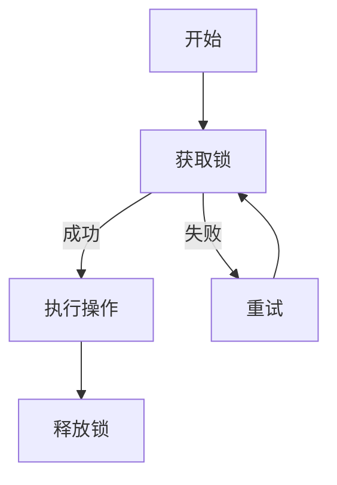

                 

# 高并发系统设计：P9架构师的极限挑战

## 关键词：高并发系统设计、P9架构师、系统稳定性、性能优化、分布式架构

> 摘要：本文旨在探讨高并发系统设计这一复杂而又至关重要的领域，目标读者为P9级别的架构师。我们将从问题背景、核心概念、算法原理、数学模型、系统架构设计、项目实战等多个角度，深入分析高并发系统设计的挑战与解决方案，帮助读者掌握这一技术领域的精髓。

## 1. 第一部分：高并发系统设计概述

### 1.1 问题背景

#### 1.1.1 高并发系统的挑战

在现代互联网应用中，高并发已成为一项基本要求。无论是电商平台的秒杀活动、社交平台的用户点赞、评论，还是金融系统的交易处理，都面临着海量请求的处理压力。高并发系统的挑战主要来源于：

- **请求量大**：在短时间内需要处理大量请求，对系统性能提出极高要求。
- **响应速度快**：用户期望得到即时的响应，对系统的响应时间要求严格。
- **系统稳定性**：在大量请求下，系统需要保持稳定运行，避免出现崩溃或服务中断。
- **扩展性**：系统需要能够随着业务发展而灵活扩展，以应对未来更大的负载。

#### 1.1.2 高并发系统的定义与重要性

高并发系统是指能在短时间内处理大量请求，同时保持高效、稳定、安全的系统。高并发系统的重要性体现在：

- **用户体验**：良好的高并发性能可以提升用户体验，增加用户粘性。
- **业务发展**：高并发系统能够支撑业务的快速增长，为企业的持续发展提供保障。
- **经济效益**：通过优化高并发系统，可以降低维护成本，提高系统运行效率。

### 1.2 核心概念与联系

#### 1.2.1 并发、并发性和并行性的概念解析

- **并发**：指多个事件在同一时间段内发生。
- **并发性**：指系统能够处理多个请求的能力。
- **并行性**：指多个事件在同一时刻发生。

#### 1.2.2 高并发系统的核心要素

- **性能**：系统处理请求的速度和效率。
- **稳定性**：系统在大量请求下的稳定性，避免崩溃和中断。
- **安全性**：系统在处理请求时的安全性，防止恶意攻击和数据泄露。
- **扩展性**：系统能够随着业务发展而灵活扩展。

#### 1.2.3 高并发系统的性能指标

- **吞吐量**：单位时间内系统能够处理的请求数量。
- **响应时间**：从请求发出到收到响应的时间。
- **并发连接数**：系统能够同时处理的连接数。

### 1.3 高并发系统设计的关键要素

#### 1.3.1 系统架构设计

系统架构设计是高并发系统设计的基础。合理的架构设计能够提高系统的性能、稳定性和扩展性。

#### 1.3.2 数据库设计

数据库设计对于高并发系统至关重要。合理的数据库架构和优化策略可以显著提升系统性能。

#### 1.3.3 网络架构设计

网络架构设计影响系统的通信效率和稳定性。合理的网络架构可以确保系统在大量请求下的稳定运行。

### 1.4 高并发系统设计策略

#### 1.4.1 系统水平扩展

系统水平扩展通过增加服务器数量来提升系统性能，适用于请求量逐渐增加的场景。

#### 1.4.2 系统垂直扩展

系统垂直扩展通过提高单个服务器硬件配置来提升系统性能，适用于请求量突增的场景。

#### 1.4.3 数据分片与负载均衡

数据分片和负载均衡是高并发系统设计中的关键策略。通过将数据和请求分配到不同的节点，可以提高系统的性能和稳定性。

### 1.5 高并发系统设计面临的挑战

#### 1.5.1 系统稳定性

在大量请求下，系统需要保持稳定运行，避免崩溃和中断。

#### 1.5.2 系统性能

系统需要在保证稳定性的前提下，尽可能高效地处理请求。

#### 1.5.3 系统安全性

系统在处理请求时需要确保安全性，防止恶意攻击和数据泄露。

### 1.6 本章小结

本文介绍了高并发系统设计的基本概念、核心要素和设计策略，为后续内容奠定了基础。

## 2. 第二部分：高并发系统架构设计

### 2.1 系统架构设计原则

#### 2.1.1 微服务架构

微服务架构将系统拆分为多个独立的微服务，每个服务负责特定的业务功能，适用于高并发系统的设计。

#### 2.1.2 分布式系统架构

分布式系统架构通过将数据和计算分布到多个节点上，提高系统的性能和可靠性。

#### 2.1.3 轻量级架构

轻量级架构通过减少系统的复杂度，提高系统的可维护性和扩展性。

### 2.2 系统功能设计

#### 2.2.1 领域模型设计

领域模型设计是系统功能设计的关键，通过定义领域模型来明确系统的业务功能和数据结构。

#### 2.2.2 用户故事与需求分析

用户故事和需求分析是系统功能设计的起点，通过收集用户需求来明确系统的功能需求。

### 2.3 系统架构设计

#### 2.3.1 架构演进过程

系统架构设计是一个逐步演进的过程，通过不断地迭代和优化来提升系统的性能和稳定性。

#### 2.3.2 系统模块划分

系统模块划分是将系统拆分为多个独立的模块，每个模块负责特定的功能，便于系统的开发和维护。

#### 2.3.3 系统架构图

系统架构图是系统架构设计的可视化表示，通过图示来展示系统的模块划分、数据流和交互关系。

### 2.4 系统接口设计

#### 2.4.1 接口规范与设计

接口规范和设计是系统接口设计的关键，通过定义接口规范来确保系统的兼容性和可维护性。

#### 2.4.2 接口安全与性能优化

接口安全和性能优化是系统接口设计的重要方面，通过采取相应的措施来提高系统的性能和安全性。

### 2.5 系统交互设计

#### 2.5.1 系统交互流程

系统交互流程是系统功能实现的核心，通过定义系统交互流程来明确系统的功能实现顺序。

#### 2.5.2 系统序列图

系统序列图是系统交互流程的可视化表示，通过图示来展示系统的交互顺序和交互对象。

### 2.6 架构设计中的常见问题与解决方案

#### 2.6.1 数据一致性

数据一致性是架构设计中的关键问题，通过采取分布式事务管理、最终一致性等技术来解决。

#### 2.6.2 分布式锁

分布式锁是架构设计中的常见需求，通过采取分布式锁机制来确保系统的并发控制。

#### 2.6.3 服务调用链追踪

服务调用链追踪是架构设计中的关键需求，通过采取分布式追踪技术来确保系统的监控和故障排查。

### 2.7 本章小结

本文介绍了高并发系统架构设计的基本原则、功能设计、架构设计、接口设计和交互设计，为高并发系统设计提供了全面的指导。

## 3. 第三部分：高并发系统算法原理讲解

### 3.1 算法概述

#### 3.1.1 高并发系统算法的重要性

高并发系统算法是保证系统性能和稳定性的关键，通过对算法的优化和应用，可以提高系统的处理能力和响应速度。

#### 3.1.2 高并发系统算法的分类

高并发系统算法主要包括以下几类：

- **并发控制算法**：用于协调并发访问，保证数据的一致性和安全性。
- **负载均衡算法**：用于分配请求到不同的服务器，提高系统的处理能力。
- **数据分片算法**：用于将数据分散存储到多个节点，提高系统的扩展性。

### 3.2 算法原理讲解

#### 3.2.1 算法原理简述

高并发系统算法的原理主要基于以下两个方面：

- **分布式计算**：通过将计算任务分布到多个节点上，提高系统的并行处理能力。
- **数据一致性和隔离性**：通过分布式事务管理和锁机制，保证数据的一致性和安全性。

#### 3.2.2 算法mermaid流程图

以下是一个简单的并发控制算法的mermaid流程图示例：



#### 3.2.3 算法python源代码

以下是一个简单的负载均衡算法的Python源代码示例：

```python
import random

def load_balancer(requests, servers):
    results = []
    for request in requests:
        server = random.choice(servers)
        server.process(request)
        results.append((request, server))
    return results
```

#### 3.2.4 算法数学模型与公式

高并发系统算法的数学模型通常涉及概率论、排队论、优化理论等。以下是一个简单的排队模型示例：

$$
L = \frac{\lambda}{\mu}
$$

其中，$L$ 表示系统的平均队列长度，$\lambda$ 表示到达率，$\mu$ 表示服务率。

#### 3.2.5 举例说明

假设一个系统有10个请求，平均到达率为5个请求/秒，平均处理时间为2秒。根据排队模型，系统的平均队列长度为：

$$
L = \frac{5}{2} = 2.5
$$

这意味着在平均情况下，系统会有2.5个请求等待服务。

### 3.3 算法应用场景

#### 3.3.1 算法在并发控制中的应用

并发控制算法广泛应用于数据库管理、分布式锁、缓存同步等领域。

#### 3.3.2 算法在负载均衡中的应用

负载均衡算法广泛应用于服务器集群、容器编排、云服务等领域。

#### 3.3.3 算法在数据分片中的应用

数据分片算法广泛应用于分布式数据库、分布式缓存、大数据处理等领域。

### 3.4 算法优化与性能分析

#### 3.4.1 算法优化策略

算法优化策略包括：

- **并行化**：将计算任务并行化，提高系统的并行处理能力。
- **缓存**：通过缓存减少对底层存储的访问，提高系统的响应速度。
- **异步处理**：通过异步处理减少线程等待时间，提高系统的吞吐量。

#### 3.4.2 算法性能分析

算法性能分析包括：

- **时间复杂度**：分析算法的时间复杂度，评估算法的时间性能。
- **空间复杂度**：分析算法的空间复杂度，评估算法的空间性能。

#### 3.4.3 性能优化案例分析

通过实际案例分析，我们可以看到性能优化对于提高系统性能的重要性。例如，在分布式数据库中，通过合理的分片策略和负载均衡算法，可以显著提高系统的性能和扩展性。

### 3.5 本章小结

本文介绍了高并发系统算法的概述、原理讲解、应用场景、优化策略和性能分析，为高并发系统设计提供了实用的指导。

## 4. 第四部分：高并发系统数学模型与公式讲解

### 4.1 数学模型概述

数学模型是高并发系统设计中的重要工具，用于分析和优化系统性能。数学模型通常涉及概率论、排队论、优化理论等领域。

### 4.2 数学模型讲解

#### 4.2.1 概率论模型

概率论模型用于分析系统的随机性和不确定性。常见的概率论模型包括泊松分布、正态分布等。

- **泊松分布**：用于描述单位时间内事件发生的概率分布。
- **正态分布**：用于描述连续随机变量的概率分布。

#### 4.2.2 队列模型

队列模型用于分析系统的排队行为和性能。常见的队列模型包括M/M/1队列、M/M/s队列等。

- **M/M/1队列**：描述一个服务台对单位时间内到达的平均请求进行处理。
- **M/M/s队列**：描述多个服务台对单位时间内到达的平均请求进行处理。

#### 4.2.3 流量模型

流量模型用于分析系统的流量特征和性能。常见的流量模型包括泊松过程、自回归过程等。

- **泊松过程**：描述单位时间内请求到达的随机过程。
- **自回归过程**：描述请求到达时间序列的自相关性。

### 4.3 数学公式的讲解

数学公式在高并发系统设计中被广泛应用于性能分析和优化。以下是一些常见的数学公式：

- **服务时间公式**：$S = \frac{1}{\mu}$
- **到达率公式**：$\lambda = \frac{1}{S}$
- **系统利用率公式**：$U = \frac{\lambda}{\mu}$
- **队列长度公式**：$L = \frac{\lambda^2}{\mu^2} + \frac{\lambda}{\mu}$
- **等待时间公式**：$W = \frac{L}{\lambda}$

### 4.4 数学模型与公式在实际案例中的应用

#### 4.4.1 案例一：负载均衡

在负载均衡中，数学模型用于分析系统的流量分布和性能。例如，通过泊松分布模型，可以预测系统的流量峰值和负载均衡策略。

#### 4.4.2 案例二：队列管理

在队列管理中，数学模型用于分析系统的排队行为和性能。例如，通过M/M/1队列模型，可以预测系统的平均队列长度和等待时间。

## 结论

高并发系统设计是现代互联网应用中的一项重要任务。通过本文的讲解，我们了解了高并发系统设计的基本概念、核心要素、算法原理、数学模型和系统架构设计。希望本文能为P9架构师们提供有价值的参考和指导。

### 作者

作者：AI天才研究院/AI Genius Institute & 禅与计算机程序设计艺术 /Zen And The Art of Computer Programming

### 最佳实践 Tips、小结、注意事项、拓展阅读

#### 最佳实践 Tips

1. 确保系统架构设计合理，充分利用分布式架构的优势。
2. 优化数据库设计，合理选择索引和数据结构。
3. 采取负载均衡策略，确保系统资源合理分配。
4. 使用数学模型进行性能分析和优化。

#### 小结

本文从多个角度介绍了高并发系统设计，包括问题背景、核心概念、算法原理、数学模型和系统架构设计。高并发系统设计是一项复杂而又关键的工程任务，需要综合考虑性能、稳定性、安全性和扩展性。

#### 注意事项

1. 高并发系统设计需要充分考虑系统的实际需求和负载情况。
2. 系统设计应遵循模块化和可维护性原则。
3. 性能优化需要根据实际情况进行具体分析和调整。

#### 拓展阅读

1. 《高性能MySQL》 - 肯·福克斯（Ken S. Fox）
2. 《大规模分布式存储系统：原理解析与架构实战》 - 马文祥
3. 《分布式系统设计》 - 菲利普·埃尔曼（Philip A. Elman）

通过拓展阅读，读者可以深入了解高并发系统设计的理论和技术，提高自己的实践能力。希望本文能对P9架构师们有所启发，帮助他们在实际工作中取得更好的成果。

