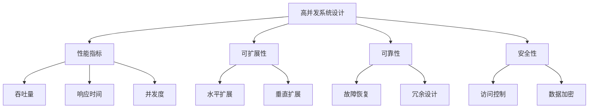
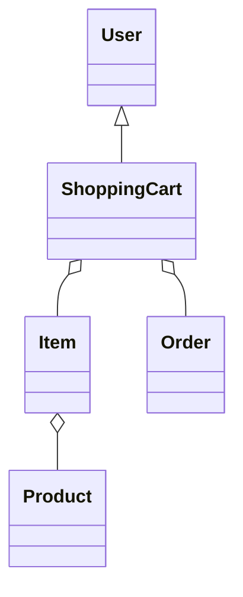
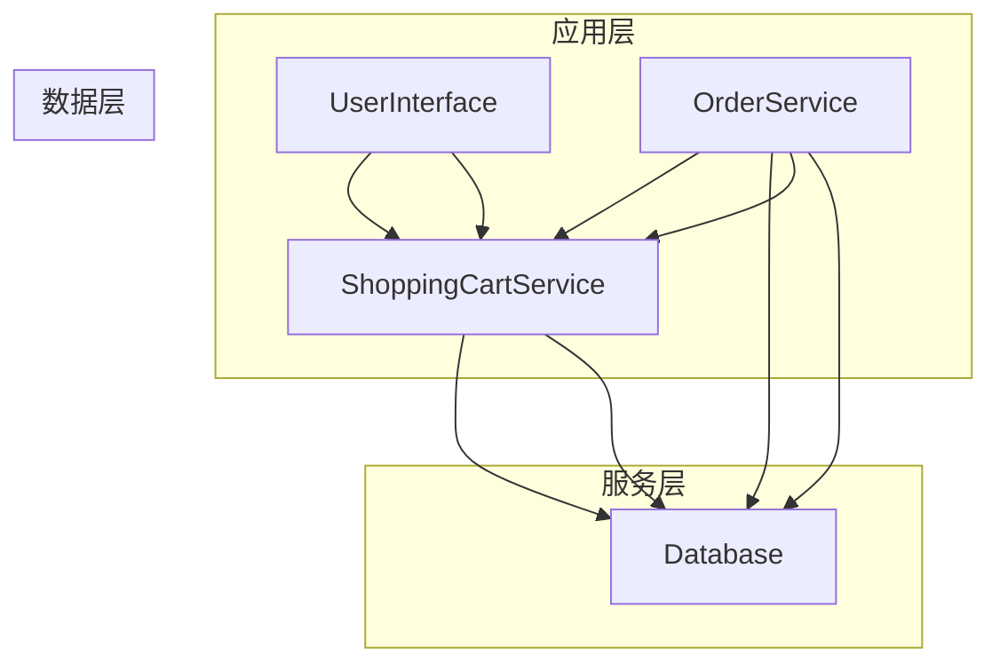

                 


### 1.1 高并发系统设计的重要性

高并发系统设计在当今数字化时代中具有至关重要的地位。随着互联网的普及和信息技术的迅猛发展，用户对系统性能和服务质量的要求越来越高。高并发系统设计的目标是确保在大量用户同时访问时，系统仍能保持高效、稳定、可靠的运行。以下是高并发系统设计重要性的几个方面：

**1. 提升用户体验**

在用户数量众多的情况下，系统能否快速响应用户请求，是衡量用户体验的关键指标。高并发系统设计通过优化系统性能，减少响应时间，提升系统吞吐量，从而显著提高用户体验。例如，电商平台在促销活动期间，需要应对数百万用户的访问，如果没有良好的高并发设计，会导致页面加载缓慢、交易失败等问题，严重影响用户体验和业务收益。

**2. 支持业务增长**

在企业的业务发展过程中，用户数量和业务规模会不断增长。高并发系统设计能够为企业提供足够的扩展性和弹性，以支持业务增长。通过分布式架构、负载均衡等技术，系统能够动态调整资源，应对突发流量，避免因流量激增导致系统崩溃或性能下降。

**3. 降低维护成本**

良好的高并发系统设计能够减少系统的维护成本。通过合理规划和优化，系统能够在有限的硬件资源下实现高效运行，降低服务器和存储设备的成本。此外，分布式架构和容错机制能够提高系统的可靠性，减少因故障导致的停机和维护成本。

**4. 确保数据一致性**

在高并发环境下，数据的一致性和完整性是系统设计的核心挑战之一。通过设计事务管理、锁机制、分布式日志等技术，高并发系统能够确保数据在并发操作下的正确性和一致性，避免数据丢失或冲突。

**5. 提高系统可用性**

高并发系统设计不仅要保证系统的性能和可靠性，还要确保系统的可用性。通过部署冗余、负载均衡、故障转移等技术，系统能够在部分组件故障时，快速切换到备用组件，确保服务的连续性，提高系统的可用性。

综上所述，高并发系统设计在提升用户体验、支持业务增长、降低维护成本、确保数据一致性和提高系统可用性等方面具有重要意义。随着未来互联网的持续发展，高并发系统设计将越来越受到关注和重视。

### 1.2 高并发系统设计面临的挑战

尽管高并发系统设计具有重要意义，但在实际设计过程中，仍面临着诸多挑战。以下是一些主要挑战及其影响：

**1. 性能瓶颈**

在高并发场景中，系统性能瓶颈常常成为制约系统设计的关键因素。性能瓶颈可能出现在多个层面，如网络带宽、存储I/O、计算能力等。例如，当一个电商平台在促销活动期间，如果订单处理系统的数据库存储I/O成为瓶颈，会导致订单处理速度显著下降，影响用户体验。

**解决方案：**
- **垂直扩展（Scaling Up）：** 通过增加服务器硬件配置，提升单个服务器的处理能力。
- **水平扩展（Scaling Out）：** 通过增加服务器数量，实现负载均衡，分担系统压力。
- **缓存技术：** 利用缓存技术减少对数据库的直接访问，降低I/O压力。
- **数据库优化：** 对数据库进行索引优化、查询优化等，提升数据库性能。

**2. 数据一致性**

在高并发环境下，数据的一致性是一个重要挑战。多个用户同时操作同一份数据，可能会导致数据冲突、不一致的问题。例如，在电商购物车场景中，多个用户同时添加或删除商品，如果没有正确的并发控制机制，可能会导致商品数量出现错误。

**解决方案：**
- **分布式事务：** 通过分布式事务管理，确保跨多个节点操作的数据一致性。
- **锁机制：** 使用锁机制控制对共享资源的访问，避免并发冲突。
- **最终一致性：** 采用最终一致性模型，允许短暂的数据不一致，通过后续操作确保数据最终一致。

**3. 可扩展性**

高并发系统设计需要具有良好的可扩展性，以应对不断变化的流量需求。系统需要能够在不中断服务的情况下动态调整资源，以支持业务增长。然而，实现可扩展性并非易事，需要考虑多个方面的因素，如架构设计、负载均衡、资源调度等。

**解决方案：**
- **分布式架构：** 采用分布式架构，实现系统模块化和组件化，提高系统的可扩展性。
- **容器化技术：** 利用容器化技术，如Docker和Kubernetes，实现快速部署和资源调度。
- **云原生技术：** 结合云原生技术，如Kubernetes和Service Mesh，实现弹性扩展和自动化运维。

**4. 可靠性**

高并发系统设计需要确保系统的可靠性，以应对突发流量和硬件故障等情况。系统需要具备自动恢复和故障转移的能力，确保服务的连续性。然而，在大量并发请求下，系统的可靠性设计面临更大的挑战。

**解决方案：**
- **冗余设计：** 通过冗余设计，如主从复制、集群部署等，提高系统的容错能力。
- **故障检测和恢复：** 利用故障检测机制，及时发现和处理系统故障，确保服务的持续运行。
- **灰度发布：** 采用灰度发布策略，逐步引入新版本，减少对系统的影响，降低故障风险。

**5. 安全性**

在高并发环境下，系统的安全性也面临挑战。恶意攻击、数据泄露等风险可能导致系统崩溃或数据丢失。例如，在电商购物车场景中，攻击者可能会通过恶意请求耗尽服务器资源，导致系统瘫痪。

**解决方案：**
- **安全防护措施：** 采用安全防护措施，如防火墙、入侵检测系统等，保护系统免受恶意攻击。
- **数据加密：** 对敏感数据进行加密处理，确保数据在传输和存储过程中的安全性。
- **访问控制：** 实施严格的访问控制策略，限制对系统资源的访问权限，防止未经授权的访问。

综上所述，高并发系统设计面临性能瓶颈、数据一致性、可扩展性、可靠性和安全性等多方面的挑战。通过合理的架构设计、技术选型和优化策略，可以有效应对这些挑战，实现高性能、高可靠性、高安全性的系统设计。

### 1.3 高并发系统设计的发展历程

高并发系统设计的发展历程反映了计算机技术和互联网行业的演变。从早期单机系统的简单设计，到现代分布式系统的复杂架构，高并发系统设计经历了多个重要阶段。

**1. 单机系统阶段**

早期，计算机系统主要采用单机架构，处理能力有限，面对少量并发请求时性能尚可。随着计算机技术的发展，处理器性能不断提升，单机系统在处理大量并发请求时逐渐暴露出性能瓶颈。然而，在这个阶段，高并发系统设计的概念尚未得到充分重视，大多数系统设计集中在如何优化单个服务器的性能。

**2. 集群系统阶段**

随着互联网业务的兴起，单机系统已经无法满足大规模并发请求的需求。集群系统应运而生，通过多个服务器协同工作，分担系统负载，提高系统性能。集群系统设计引入了负载均衡、分布式存储等技术，实现了一定的水平扩展能力。然而，集群系统在数据一致性、故障转移等方面仍存在较大挑战，需要进一步优化。

**3. 分布式系统阶段**

进入21世纪，分布式系统成为高并发系统设计的核心方向。分布式系统通过将计算和存储资源分布在多个节点上，实现了更高的可扩展性和容错性。分布式数据库、分布式缓存、分布式消息队列等技术的广泛应用，使得高并发系统设计更加复杂，但同时也提供了更多的优化手段。例如，分布式数据库通过分片和副本机制，实现了数据的一致性和高可用性。

**4. 云原生系统阶段**

随着云计算的普及，云原生系统设计逐渐成为主流。云原生系统基于容器化、微服务架构、自动化运维等先进技术，实现了高效的资源管理和弹性扩展。容器化技术如Docker和Kubernetes，使得系统部署、扩展和管理变得更加简便。微服务架构通过将系统分解为多个独立的服务模块，提高了系统的可扩展性和容错性。

**5. 智能系统阶段**

当前，高并发系统设计正朝着智能化方向发展。通过人工智能技术，系统可以自动识别和应对突发流量，实现动态性能优化和智能故障恢复。智能系统设计结合了大数据分析、机器学习等先进技术，使得系统在处理高并发请求时更加高效和可靠。

总结来说，高并发系统设计的发展历程反映了计算机技术和互联网行业的不断进步。从单机系统到分布式系统，再到云原生系统，高并发系统设计不断克服性能、可扩展性、可靠性等方面的挑战，为大规模互联网业务提供了强有力的技术支持。随着人工智能等新技术的引入，未来高并发系统设计将朝着更加智能、高效的方向发展。

## 第2章 高并发系统设计的核心概念

### 2.1 高并发系统性能指标

在高并发系统设计中，性能指标是评估系统性能的重要依据。以下是一些关键的性能指标及其解释：

**1. 吞吐量（Throughput）**

吞吐量是指系统在单位时间内处理请求的数量。吞吐量越高，系统处理能力越强。吞吐量受限于系统资源的数量和性能，包括CPU、内存、存储和网络等。

**2. 响应时间（Response Time）**

响应时间是指系统从接收到请求到返回结果所需的时间。低响应时间意味着系统能够快速响应用户请求，提高用户体验。响应时间受系统负载、硬件性能和网络延迟等因素影响。

**3. CPU利用率（CPU Utilization）**

CPU利用率是指CPU在单位时间内执行计算任务的比例。高CPU利用率表明系统计算资源紧张，可能需要通过水平扩展或优化代码来提升性能。

**4. 内存利用率（Memory Utilization）**

内存利用率是指系统内存使用率。高内存利用率可能导致系统性能下降或崩溃。通过优化数据结构和算法，可以降低内存使用率。

**5. 存储I/O（Storage I/O）**

存储I/O是指系统与存储设备之间的数据读写速度。高存储I/O可能由于磁盘I/O瓶颈导致系统性能下降。通过使用固态硬盘（SSD）或分布式存储系统，可以提高存储性能。

**6. 网络带宽（Network Bandwidth）**

网络带宽是指网络传输速率。高网络带宽可以加快数据传输速度，降低网络延迟。

**7. 错误率（Error Rate）**

错误率是指系统处理请求时出现错误的比例。低错误率表明系统稳定性高。通过良好的错误处理机制和冗余设计，可以降低错误率。

**8. 并发度（Concurrency）**

并发度是指系统同时处理多个请求的能力。高并发度表明系统能够有效利用资源，提高性能。

**9. 可用性（Availability）**

可用性是指系统在规定时间内保持正常运行的能力。高可用性系统需要具备故障恢复和自动切换机制。

**10. 延迟（Latency）**

延迟是指系统处理请求的时间。低延迟对于实时应用和交互式应用至关重要。

了解和监控这些性能指标，可以帮助系统设计者评估系统性能，发现潜在问题，并采取相应的优化措施。

### 2.2 可扩展性与负载均衡

可扩展性和负载均衡是高并发系统设计中的关键概念，它们共同确保系统在面临大量请求时仍能保持高性能和高可用性。

**1. 可扩展性（Scalability）**

可扩展性是指系统在处理请求数量增加时，能够自动增加资源，以维持系统性能的能力。可扩展性分为垂直扩展和水平扩展：

- **垂直扩展（Scaling Up）：** 通过增加单个服务器的硬件资源，如CPU、内存等，提升单个服务器的处理能力。
- **水平扩展（Scaling Out）：** 通过增加多个服务器节点，实现负载均衡，将请求分布到多个节点上，提高系统的总处理能力。

实现可扩展性的技术包括：

- **分布式架构：** 将系统分解为多个独立的服务模块，每个模块可以独立部署和扩展。
- **容器化技术：** 利用容器化平台，如Docker和Kubernetes，实现快速部署和动态扩展。
- **云原生技术：** 利用云原生架构，如Kubernetes和Service Mesh，实现自动化资源管理和弹性扩展。

**2. 负载均衡（Load Balancing）**

负载均衡是指将进入系统的请求合理分配到多个服务器节点上，以避免单个节点过载，从而提高系统整体性能。负载均衡策略包括：

- **轮询（Round Robin）：** 依次将请求分配到各个节点。
- **最小连接数（Least Connections）：** 将请求分配到当前连接数最少的节点。
- **权重（Weighted）：** 根据节点的处理能力，分配不同的权重，处理能力强的节点承担更多请求。
- **IP哈希（IP Hash）：** 根据客户端IP地址，将请求分配到固定的节点。

实现负载均衡的技术包括：

- **硬件负载均衡器：** 如F5 BIG-IP等，提供高性能的流量分发能力。
- **软件负载均衡器：** 如Nginx、HAProxy等，利用开源软件实现负载均衡。
- **服务网格（Service Mesh）：** 如Istio、Linkerd等，通过微服务架构实现分布式负载均衡。

**3. 实现方法**

为了实现系统的可扩展性和负载均衡，通常采用以下方法：

- **分布式数据库：** 通过分片（Sharding）和副本（Replication）机制，提高数据存储和访问的扩展性。
- **分布式缓存：** 通过分布式缓存系统，如Redis Cluster，提高数据访问速度和缓存容量。
- **分布式消息队列：** 如RabbitMQ、Kafka等，实现异步处理和流量削峰。
- **分布式计算框架：** 如Hadoop、Spark等，实现大数据处理和分布式计算。

通过合理设计可扩展性和负载均衡机制，系统能够在面对高并发请求时，保持高性能和高可用性，为用户提供稳定、可靠的服务。

### 2.3 可靠性与故障恢复

在高并发系统设计中，可靠性和故障恢复是确保系统持续运行的重要保障。高并发系统通常面临多种故障场景，如硬件故障、网络中断、软件错误等，需要通过一系列可靠性和故障恢复机制来应对。

**1. 故障类型**

常见的故障类型包括：

- **硬件故障：** 如服务器宕机、磁盘损坏等。
- **软件故障：** 如代码bug、系统崩溃等。
- **网络故障：** 如网络中断、延迟增加等。

**2. 可靠性机制**

为了提高系统的可靠性，可以采用以下机制：

- **冗余设计（Redundancy）：** 通过冗余硬件、冗余数据和冗余服务，确保系统在部分组件故障时仍能正常运行。例如，主从复制、集群部署等。
- **故障检测（Fault Detection）：** 通过实时监控和故障检测机制，及时发现和定位故障。例如，心跳检测、异常检测等。
- **故障恢复（Fault Recovery）：** 在检测到故障后，自动执行故障恢复操作，确保系统尽快恢复正常运行。例如，自动重启服务、切换到备用节点等。

**3. 故障恢复策略**

故障恢复策略包括：

- **故障隔离（Fault Isolation）：** 将故障组件与其他组件隔离，防止故障扩散。
- **故障转移（Fault Transfer）：** 将请求从故障节点转移到正常节点，确保服务的连续性。
- **故障恢复（Fault Repair）：** 在故障恢复后，对系统进行修复和优化，防止类似故障再次发生。

**4. 实现方法**

实现可靠性和故障恢复的方法包括：

- **主从复制（Master-Slave Replication）：** 通过主从复制机制，确保数据一致性，并在主节点故障时自动切换到从节点。
- **集群部署（Cluster Deployment）：** 通过集群部署，实现服务的高可用性，通过负载均衡和故障转移，确保服务持续可用。
- **分布式存储（Distributed Storage）：** 通过分布式存储系统，如HDFS、Cassandra等，实现数据的高可靠性和自动故障恢复。
- **云原生架构（Cloud-Native Architecture）：** 利用云原生架构，如Kubernetes、Service Mesh等，实现自动化故障检测、故障恢复和负载均衡。

**5. 实践案例**

以下是一个高并发系统故障恢复的实践案例：

- **场景描述：** 一家电商平台在高并发促销活动期间，主数据库服务器突然宕机。
- **解决方案：** 
  - **故障检测：** 系统监控工具检测到主数据库服务器宕机，触发故障检测机制。
  - **故障隔离：** 将宕机的数据库服务器与其他服务器隔离，防止故障扩散。
  - **故障转移：** 系统自动切换到备用数据库服务器，确保交易服务不受影响。
  - **故障恢复：** 主数据库服务器修复后，自动切换回主节点，并恢复数据一致性。

通过上述实践案例，可以看出可靠性和故障恢复机制在高并发系统设计中的重要性。通过合理设计可靠性和故障恢复机制，系统能够在面对各种故障时，保持稳定运行，确保服务的连续性和可靠性。

### 第3章 设计原则和方法论

#### 3.1 系统架构设计

系统架构设计是高并发系统设计中的核心环节，它决定了系统的扩展性、可靠性、性能和可维护性。以下是系统架构设计的关键原则和策略。

**1. 分层架构**

分层架构将系统划分为多个独立层次，每个层次负责不同的功能。常见的分层架构包括：

- **表示层（Presentation Layer）：** 负责与用户交互，包括用户界面、Web前端等。
- **业务逻辑层（Business Logic Layer）：** 负责业务处理逻辑，包括业务规则、算法实现等。
- **数据访问层（Data Access Layer）：** 负责与数据库的交互，包括数据查询、更新等。
- **基础设施层（Infrastructure Layer）：** 负责系统基础设施，包括网络、存储、安全等。

**2. 微服务架构**

微服务架构将系统拆分为多个独立的、松耦合的服务模块，每个模块负责一个具体的业务功能。微服务架构的优点包括：

- **高可扩展性：** 各个服务可以独立扩展，无需影响其他服务。
- **高容错性：** 服务之间解耦，单一服务的故障不会影响整个系统。
- **快速迭代：** 各个服务可以独立开发和部署，提高开发效率。

**3. 分布式架构**

分布式架构将系统资源分布在多个节点上，通过负载均衡和冗余设计，提高系统的性能和可靠性。分布式架构的关键组件包括：

- **分布式数据库：** 通过分片和副本机制，提高数据存储和访问的扩展性。
- **分布式缓存：** 通过分布式缓存系统，如Redis Cluster，提高数据访问速度和缓存容量。
- **分布式消息队列：** 如RabbitMQ、Kafka等，实现异步处理和流量削峰。

**4. 云原生架构**

云原生架构利用容器化、自动化运维等技术，实现高效的资源管理和弹性扩展。云原生架构的关键组件包括：

- **容器化技术：** 如Docker，实现应用程序的轻量级、隔离性和可移植性。
- **服务网格（Service Mesh）：** 如Istio、Linkerd，实现分布式服务通信的安全、监控和流量管理。
- **自动化运维：** 利用Kubernetes等工具，实现自动化部署、扩展和监控。

**5. 实现方法**

系统架构设计的实现方法包括：

- **模块化设计：** 将系统分解为多个模块，每个模块具有明确的职责和接口。
- **接口设计：** 设计清晰的服务接口，确保模块之间的松耦合。
- **组件化开发：** 利用微服务架构，实现服务的独立开发和部署。
- **DevOps实践：** 采用DevOps文化，实现开发、测试和运维的自动化和一体化。

通过合理设计系统架构，可以实现高并发系统的可扩展性、可靠性、高性能和可维护性，为用户提供稳定、可靠的服务。

#### 3.2 数据存储和检索优化

在高并发系统设计中，数据存储和检索优化是确保系统性能的关键因素。以下是一些优化策略和方法：

**1. 数据库优化**

- **垂直拆分（Vertical Splitting）：** 根据业务需求，将数据库表拆分为多个表，每个表存储不同类型的数据。例如，将用户表拆分为基本信息表、订单信息表等。
- **水平拆分（Horizontal Splitting）：** 根据数据特征，将数据库表拆分为多个副本，每个副本存储部分数据。例如，根据用户ID范围或地理位置，将用户表拆分为多个分区。
- **索引优化：** 对常用的查询字段建立索引，提高数据检索速度。合理选择索引类型，如B树索引、哈希索引等。
- **缓存策略：** 利用缓存技术，如Redis、Memcached，存储热点数据，减少对数据库的访问。

**2. 查询优化**

- **SQL优化：** 优化SQL语句，避免使用复杂的子查询、联合查询等。尽量使用索引，减少全表扫描。
- **预编译查询：** 使用预编译查询，将查询语句编译成执行计划，提高查询执行速度。
- **数据分片：** 对于大数据量表，通过分片技术将数据分散存储，减少单表数据量，提高查询性能。

**3. 存储优化**

- **存储引擎选择：** 根据业务需求选择合适的存储引擎，如InnoDB、MyISAM等。InnoDB支持事务和行级锁，适用于高并发场景。
- **数据压缩：** 利用数据压缩技术，减少磁盘存储空间，提高I/O性能。
- **数据备份与恢复：** 定期备份数据，确保数据的安全性和可靠性。在发生故障时，能够快速恢复数据。

**4. 分布式存储**

- **分布式数据库：** 使用分布式数据库系统，如Cassandra、MongoDB等，实现数据的高可用性和扩展性。
- **分布式缓存：** 利用分布式缓存系统，如Redis Cluster，提高数据访问速度和缓存容量。
- **分布式文件系统：** 使用分布式文件系统，如HDFS、Ceph，实现海量数据的高效存储和访问。

**5. 实现方法**

实现数据存储和检索优化的方法包括：

- **性能测试：** 对数据库进行性能测试，发现查询瓶颈和优化点。
- **监控分析：** 监控数据库性能指标，如CPU利用率、内存使用率、I/O等待时间等，及时发现和解决问题。
- **数据分片策略设计：** 根据业务特点，设计合理的数据分片策略，确保数据分布均衡，减少数据迁移和访问延迟。
- **缓存策略制定：** 根据数据访问模式，制定合适的缓存策略，提高数据访问速度。

通过数据存储和检索优化，可以显著提高高并发系统的性能和稳定性，确保系统在大量请求下仍能高效运行。

#### 3.3 网络优化和安全性

在高并发系统设计中，网络优化和安全性是确保系统性能和稳定性的关键因素。以下是一些网络优化和安全性策略：

**1. 网络优化策略**

- **负载均衡：** 使用负载均衡器，如Nginx、HAProxy等，将请求分布到多个服务器节点，避免单个节点过载。
- **CDN加速：** 利用CDN（内容分发网络），将静态资源分发到全球各地的节点，降低用户访问延迟。
- **TCP/IP优化：** 调整TCP/IP参数，如窗口大小、延迟时间等，提高网络传输效率。
- **数据压缩：** 对传输的数据进行压缩，减少数据传输量，提高传输速度。
- **并行传输：** 利用并行传输技术，如HTTP/2的多路复用，提高数据传输效率。

**2. 安全性策略**

- **防火墙：** 部署防火墙，阻止非法访问和攻击。
- **入侵检测系统（IDS）：** 实时监控网络流量，检测和阻止恶意攻击。
- **安全审计：** 定期进行安全审计，发现和修复安全漏洞。
- **数据加密：** 对敏感数据进行加密，确保数据在传输和存储过程中的安全性。
- **访问控制：** 实施严格的访问控制策略，限制对系统资源的访问权限。
- **多因素认证（MFA）：** 采用多因素认证，提高用户身份验证的安全性和可靠性。

**3. 实现方法**

实现网络优化和安全的策略包括：

- **监控与报警：** 监控网络性能和安全状态，设置报警阈值，及时发现和应对异常情况。
- **定期安全培训：** 对开发人员和运维人员进行安全培训，提高安全意识和应对能力。
- **安全测试：** 定期进行安全测试，发现和修复系统漏洞。
- **网络安全架构设计：** 设计合理的网络安全架构，确保系统的安全性。

通过网络优化和安全性策略，可以显著提高高并发系统的性能和安全性，确保系统在面对大量请求和潜在攻击时仍能稳定运行。

### 第4章 高并发系统的高级技术

#### 4.1 并发编程和同步

在高并发系统中，并发编程和同步是确保系统性能和稳定性的关键技术。以下是一些并发编程和同步的高级技术：

**1. 并发编程模型**

- **线程（Thread）：** 线程是并发编程的基础，它允许多个任务并行执行。线程模型包括用户级线程和内核级线程，用户级线程由用户空间管理，内核级线程由操作系统管理。
- **协程（Coroutine）：** 协程是一种轻量级的并发编程模型，它可以实现高效的并发和异步操作。协程通过协作切换，避免了线程切换的开销。
- **异步编程（Asynchronous Programming）：** 异步编程通过回调、事件驱动等方式，实现非阻塞的并发操作，提高系统的吞吐量和响应速度。

**2. 同步机制**

- **互斥锁（Mutex）：** 互斥锁用于保护共享资源，确保同一时间只有一个线程可以访问该资源。常见的实现包括自旋锁、适应性锁等。
- **读写锁（Read-Write Lock）：** 读写锁允许多个读线程同时访问资源，但写线程需要独占资源。它适用于读操作远多于写操作的场景。
- **条件锁（Condition Variable）：** 条件锁用于线程之间的同步，线程在满足条件时才能继续执行。它通常与互斥锁结合使用，实现线程间的通信。
- **信号量（Semaphore）：** 信号量用于控制多个线程对共享资源的访问，可以通过信号量实现线程的同步和互斥。

**3. 并发编程实践**

- **线程池（Thread Pool）：** 线程池是一种管理线程的资源池，它避免了频繁创建和销毁线程的开销。常见的线程池算法包括固定大小线程池、动态线程池等。
- **无锁编程（Lock-Free Programming）：** 无锁编程通过避免锁的使用，实现并发操作的原子性和并发性。无锁编程需要仔细设计数据结构和算法，以避免竞态条件。
- **锁粗化（Lock Coarsening）：** 锁粗化是将多个细粒度的锁合并为一个大粒度的锁，减少锁的开销和提高性能。锁粗化适用于共享资源频繁访问的场景。
- **锁饥饿（Lock Starvation）：** 锁饥饿是指某些线程因为无法获取锁而长时间等待，导致性能下降。通过合理设计锁策略，避免锁饥饿现象。

**4. 实现方法**

实现并发编程和同步的方法包括：

- **并发框架：** 利用并发框架，如Java的Concurrency API、Python的asyncio等，简化并发编程。
- **并发测试：** 通过并发测试，发现并发编程中的问题，如竞态条件、死锁等。
- **性能调优：** 对并发程序进行性能调优，包括锁优化、线程池优化等。

通过合理运用并发编程和同步技术，可以显著提高高并发系统的性能和稳定性，确保系统在大量请求下仍能高效运行。

#### 4.2 内存管理和缓存

在高并发系统中，内存管理和缓存是确保系统性能和稳定性的关键因素。以下是一些内存管理和缓存的高级技术：

**1. 内存管理技术**

- **内存分配与回收：** 内存管理涉及内存的分配与回收。常见的内存分配策略包括堆（Heap）和栈（Stack）。堆用于动态分配内存，栈用于函数调用和局部变量的存储。内存回收包括垃圾收集（Garbage Collection）和手动回收（Manual Memory Management）。
- **对象池（Object Pool）：** 对象池是一种内存管理技术，用于复用对象，减少内存分配和回收的开销。对象池适用于频繁创建和销毁的对象，如数据库连接、线程等。
- **内存映射（Memory Mapping）：** 内存映射将文件映射到内存地址空间，实现文件和内存的快速访问。内存映射适用于大数据量处理和高速缓存。

**2. 缓存技术**

- **缓存一致性（Cache Coherence）：** 缓存一致性是指确保多处理器系统中各个缓存的数据一致性。缓存一致性协议包括MESI（Modified, Exclusive, Shared, Invalid）等。
- **缓存替换策略：** 缓存替换策略用于确定何时将缓存中的数据替换为新的数据。常见的缓存替换策略包括最少使用（Least Recently Used, LRU）、最近最少使用（Least Frequently Used, LFU）等。
- **缓存层次结构（Cache Hierarchy）：** 缓存层次结构将缓存分为多级，从高速缓存（L1 Cache）到慢速缓存（L2 Cache、L3 Cache），以提高缓存命中率。
- **缓存一致性协议（Cache Coherence Protocol）：** 缓存一致性协议用于在多处理器系统中确保缓存数据的一致性。常见的缓存一致性协议包括MESI、MOESI等。

**3. 缓存应用场景**

- **Web缓存：** Web缓存用于存储经常访问的网页内容，减少对后端服务器的访问，提高响应速度。
- **数据库缓存：** 数据库缓存用于存储查询结果和常用数据，减少对磁盘的访问，提高查询性能。
- **应用缓存：** 应用缓存用于存储应用中的中间数据和计算结果，减少重复计算和访问，提高应用性能。

**4. 实现方法**

实现内存管理和缓存的方法包括：

- **缓存预热（Cache Preloading）：** 在系统启动时，预先加载热点数据到缓存中，提高系统的初始响应速度。
- **缓存淘汰（Cache Eviction）：** 根据缓存策略，定期淘汰缓存中的数据，保持缓存的有效性和命中率。
- **缓存一致性维护：** 在多处理器系统中，定期刷新缓存中的数据，确保缓存一致性。

通过合理运用内存管理和缓存技术，可以显著提高高并发系统的性能和稳定性，确保系统在大量请求下仍能高效运行。

#### 4.3 性能测试与调优

在高并发系统设计中，性能测试与调优是确保系统在实际运行中达到预期性能的关键步骤。以下是一些性能测试与调优的技术和策略：

**1. 性能测试方法**

- **负载测试（Load Testing）：** 负载测试通过模拟实际用户流量，评估系统在不同负载下的性能。常用的负载测试工具包括Apache JMeter、Gatling等。
- **压力测试（Stress Testing）：** 压力测试通过施加超过系统正常处理能力的负载，评估系统的稳定性和崩溃点。压力测试有助于发现系统的性能瓶颈和故障点。
- **容量规划（Capacity Planning）：** 容量规划通过对系统的性能测试，确定系统在特定负载下的最大处理能力，为系统的资源规划和扩展提供依据。
- **性能监控（Performance Monitoring）：** 性能监控通过实时监控系统的关键性能指标，如CPU利用率、内存使用率、响应时间等，发现性能问题和异常情况。

**2. 性能调优策略**

- **代码优化：** 通过优化算法、减少不必要的计算、消除竞态条件等，提高代码的执行效率。
- **数据库优化：** 对数据库进行索引优化、查询优化、数据分片等，提高数据访问速度和查询性能。
- **缓存策略优化：** 通过调整缓存策略，提高缓存命中率，减少对后端服务的访问。
- **负载均衡优化：** 通过优化负载均衡策略，实现请求的合理分配，避免单点过载。
- **网络优化：** 通过优化网络配置、使用CDN、调整TCP/IP参数等，提高网络传输效率和响应速度。
- **硬件优化：** 通过升级硬件配置、使用SSD、增加内存等，提高系统的硬件性能。

**3. 实现方法**

实现性能测试与调优的方法包括：

- **自动化测试：** 通过自动化测试工具，实现性能测试的自动化，提高测试效率和覆盖率。
- **持续集成（CI）：** 将性能测试集成到持续集成流程中，实现持续性能监控和优化。
- **分阶段调优：** 对系统进行分阶段调优，先优化核心功能，再逐步优化其他部分。
- **A/B测试：** 通过A/B测试，对比不同优化策略的效果，选择最佳方案。

通过合理的性能测试与调优策略，可以确保高并发系统在实际运行中达到预期性能，为用户提供稳定、高效的服务。

### 第5章 高并发系统设计的应用案例

#### 5.1 Web服务器设计优化

Web服务器是高并发系统设计中的重要组件，其设计优化直接影响到用户体验和系统性能。以下是一个Web服务器设计优化的应用案例：

**1. 项目介绍**

某大型电商平台在双11促销活动期间，预计会有数百万用户同时访问，导致服务器压力剧增。为了确保网站在高峰期仍能稳定运行，需要对Web服务器进行优化。

**2. 系统功能设计**

- **用户访问：** 提供用户注册、登录、浏览商品、下单等功能的接口。
- **订单处理：** 处理用户订单，包括生成订单、支付、发货等操作。
- **库存管理：** 实时更新商品库存信息，确保订单处理的一致性。

**3. 系统架构设计**

- **负载均衡：** 采用Nginx作为负载均衡器，将请求分发到多个后端Web服务器。
- **缓存层：** 利用Redis缓存热点数据和页面内容，减少对数据库的访问。
- **数据库集群：** 使用MySQL主从复制和分片技术，提高数据库的读写性能和扩展性。
- **应用层：** 采用微服务架构，将用户访问、订单处理、库存管理等功能模块化，提高系统的可维护性和扩展性。

**4. 系统接口设计**

- **用户接口：** 提供RESTful API，实现用户注册、登录、商品查询等操作。
- **订单接口：** 提供订单生成、支付、发货等接口，确保订单处理的一致性。
- **库存接口：** 提供库存查询、库存更新等接口，确保库存信息的一致性。

**5. 系统交互设计**

- **用户访问：** 用户通过浏览器访问Web服务器，由Nginx进行负载均衡，将请求转发到后端应用服务器。
- **订单处理：** 订单生成后，由应用服务器处理订单，并将订单数据写入数据库。
- **库存管理：** 应用服务器实时查询库存信息，确保订单处理的一致性。

**6. 性能优化**

- **缓存策略：** 利用Redis缓存热点数据和页面内容，减少数据库访问。
- **数据库优化：** 对数据库进行索引优化和查询优化，提高数据访问速度。
- **网络优化：** 使用CDN加速静态资源，提高用户访问速度。
- **负载均衡：** 采用Nginx进行负载均衡，避免单点过载。

**7. 实践案例**

- **场景描述：** 双11促销活动期间，用户访问量急剧增加，服务器压力显著上升。
- **解决方案：**
  - **扩展服务器资源：** 增加服务器硬件配置，提高处理能力。
  - **缓存预热：** 在活动开始前，预先加载热点数据到缓存中，提高系统的初始响应速度。
  - **数据库优化：** 对数据库进行分片和索引优化，提高数据访问速度。

通过上述优化措施，Web服务器在高峰期能够稳定运行，确保用户访问速度和系统性能。

### 5.2 移动应用性能优化

移动应用在高并发场景下，需要处理大量的用户请求和数据传输，性能优化至关重要。以下是一个移动应用性能优化的应用案例：

**1. 项目介绍**

某视频直播平台在重大赛事期间，预计会有数百万用户同时观看直播，导致服务器和移动应用压力增大。为了确保用户观看体验，需要对移动应用进行性能优化。

**2. 系统功能设计**

- **用户登录：** 提供用户登录、注册和密码找回功能。
- **直播观看：** 提供实时视频播放、播放进度记录、弹幕评论等功能。
- **消息推送：** 提供实时消息推送功能，包括直播提醒、互动消息等。

**3. 系统架构设计**

- **前端应用：** 使用React Native或Flutter等技术，实现跨平台的移动应用开发。
- **后端服务：** 采用微服务架构，将用户管理、直播管理、消息推送等模块分离，提高系统的可维护性和扩展性。
- **数据库：** 使用MongoDB等NoSQL数据库，存储用户数据和直播数据。
- **缓存层：** 利用Redis缓存热点数据和用户数据，减少数据库访问。

**4. 系统接口设计**

- **用户接口：** 提供用户注册、登录、个人信息管理等接口。
- **直播接口：** 提供直播创建、直播播放、弹幕评论等接口。
- **消息接口：** 提供消息推送、消息读取等接口。

**5. 系统交互设计**

- **用户登录：** 用户通过移动应用登录，由后端服务处理用户认证和权限验证。
- **直播观看：** 用户观看直播时，由后端服务提供视频流和播放进度数据，移动应用进行实时渲染。
- **消息推送：** 用户收到消息推送后，由移动应用进行消息展示和交互。

**6. 性能优化**

- **缓存策略：** 利用Redis缓存用户数据和直播数据，减少数据库访问。
- **异步加载：** 使用异步加载技术，如懒加载、分页加载等，提高应用响应速度。
- **内容分发网络（CDN）：** 使用CDN加速视频流传输，降低网络延迟。
- **网络优化：** 调整HTTP缓存策略，减少重复请求，提高数据传输效率。
- **代码优化：** 对应用代码进行优化，减少不必要的计算和资源消耗。

**7. 实践案例**

- **场景描述：** 赛事期间，用户访问量急剧增加，导致服务器压力增大。
- **解决方案：**
  - **扩容服务器资源：** 增加服务器硬件配置，提高处理能力。
  - **数据库优化：** 对数据库进行分片和索引优化，提高数据访问速度。
  - **内容分发网络：** 使用CDN加速视频流传输，降低网络延迟。

通过上述优化措施，移动应用在高峰期能够稳定运行，确保用户观看体验和系统性能。

### 5.3 大数据处理与实时分析

在大数据场景中，高并发系统设计面临着海量数据的实时处理和分析挑战。以下是一个大数据处理与实时分析的应用案例：

**1. 项目介绍**

某电子商务平台在双11期间，预计会产生海量交易数据，需要对数据进行实时处理和分析，以支持营销决策和风险控制。为了确保数据处理和分析的效率，需要进行高并发系统设计。

**2. 系统功能设计**

- **数据采集：** 收集交易数据、用户行为数据等，实现数据的实时采集和传输。
- **数据处理：** 对采集到的数据进行清洗、转换和存储，实现数据的一致性和准确性。
- **实时分析：** 对处理后的数据进行分析，提供实时报表和可视化展示。
- **风险控制：** 基于实时分析结果，进行风险预测和监控，确保交易安全。

**3. 系统架构设计**

- **数据采集层：** 采用Kafka等消息队列技术，实现数据的实时采集和传输。
- **数据处理层：** 采用Spark等大数据处理框架，实现数据的清洗、转换和存储。
- **实时分析层：** 采用Flink等流处理框架，实现数据的实时分析和报表生成。
- **存储层：** 采用Hadoop、HBase等分布式存储技术，存储海量数据，提供数据查询和分析能力。
- **数据可视化层：** 采用ECharts、Tableau等数据可视化工具，实现数据的实时展示和报表生成。

**4. 系统接口设计**

- **数据采集接口：** 提供数据采集和传输接口，实现数据的实时传输。
- **数据处理接口：** 提供数据处理和存储接口，实现数据的一致性和准确性。
- **实时分析接口：** 提供实时分析接口，实现数据的实时报表和可视化展示。
- **风险控制接口：** 提供风险控制接口，实现风险预测和监控。

**5. 系统交互设计**

- **数据采集：** 数据采集模块通过Kafka等消息队列技术，实时采集交易数据、用户行为数据等。
- **数据处理：** 数据处理模块使用Spark等大数据处理框架，对数据进行清洗、转换和存储。
- **实时分析：** 实时分析模块使用Flink等流处理框架，对处理后的数据进行分析，生成实时报表。
- **风险控制：** 风险控制模块根据实时分析结果，进行风险预测和监控，确保交易安全。

**6. 性能优化**

- **数据分片：** 对大数据进行分片处理，提高数据处理和分析的并行度。
- **内存管理：** 对大数据处理框架进行内存优化，减少内存消耗。
- **缓存策略：** 利用Redis等缓存技术，缓存热点数据，减少数据库访问。
- **异步处理：** 使用异步处理技术，提高系统的响应速度和吞吐量。
- **负载均衡：** 使用负载均衡器，如Nginx等，实现请求的负载均衡。

**7. 实践案例**

- **场景描述：** 双11期间，交易数据量和用户访问量急剧增加，数据处理和分析系统面临巨大压力。
- **解决方案：**
  - **扩容计算资源：** 增加计算节点，提高数据处理和分析能力。
  - **数据分片：** 对大数据进行分片处理，提高数据处理和分析的并行度。
  - **缓存策略：** 利用Redis等缓存技术，缓存热点数据，减少数据库访问。

通过上述优化措施，大数据处理和分析系统能够在高峰期稳定运行，确保数据处理和分析的效率。

### 第6章 系统仿真与评估

#### 6.1 系统仿真技术

系统仿真技术是评估高并发系统性能和可靠性的重要手段。通过仿真，可以在实际部署系统之前预测系统的行为，识别潜在的问题并进行优化。

**1. 仿真模型**

系统仿真模型通常包括以下几个方面：

- **系统模型：** 描述系统的结构、功能和行为。可以使用多种建模工具，如UML、Mermaid等，构建系统模型。
- **性能模型：** 描述系统的性能指标，如吞吐量、响应时间、并发度等。性能模型可以通过统计分析、回归分析等方法构建。
- **可靠性模型：** 描述系统的故障率和恢复能力。可靠性模型可以使用故障树分析（FTA）、可靠性图（RBD）等方法构建。
- **负载模型：** 描述系统的负载特征，如用户分布、请求模式等。负载模型可以通过实际数据或假设数据生成。

**2. 仿真工具**

常用的仿真工具包括：

- **MATLAB：** 用于数值计算和建模，支持多种仿真算法和数据分析。
- **Simulink：** MATLAB的一个模块，用于系统建模和仿真，支持图形化的建模和仿真。
- **GT-SUITE：** 用于仿真热力学系统，如汽车发动机、热交换器等。
- **AnyLogic：** 一个通用的仿真平台，支持多种建模语言和仿真算法。

**3. 仿真步骤**

系统仿真的基本步骤如下：

- **模型构建：** 根据系统需求，构建系统模型、性能模型、可靠性模型和负载模型。
- **参数设置：** 设置仿真参数，如初始条件、仿真时间、性能指标等。
- **运行仿真：** 运行仿真，收集系统性能和可靠性数据。
- **结果分析：** 对仿真结果进行分析，评估系统性能和可靠性，发现潜在问题。

**4. 仿真应用**

系统仿真的应用场景包括：

- **性能评估：** 评估系统在不同负载下的性能指标，如吞吐量、响应时间等。
- **可靠性分析：** 分析系统的故障率和恢复能力，评估系统的可靠性。
- **优化设计：** 通过仿真优化系统设计，如负载均衡策略、缓存策略等。
- **风险评估：** 识别系统的潜在风险，评估系统在面对极端情况时的表现。

#### 6.2 性能评估指标与工具

性能评估是高并发系统设计中的关键环节。通过性能评估，可以确保系统在实际运行中达到预期性能。以下是一些常见的性能评估指标和工具：

**1. 性能评估指标**

- **吞吐量（Throughput）：** 单位时间内系统处理请求的数量，衡量系统的处理能力。
- **响应时间（Response Time）：** 从系统接收到请求到返回结果所需的时间，衡量系统的响应速度。
- **并发度（Concurrency）：** 系统能够同时处理的最大请求数量，衡量系统的并发处理能力。
- **CPU利用率（CPU Utilization）：** CPU在单位时间内执行计算任务的比例，衡量系统的计算资源利用率。
- **内存利用率（Memory Utilization）：** 系统内存的使用率，衡量系统的内存资源利用率。
- **存储I/O（Storage I/O）：** 系统与存储设备之间的数据读写速度，衡量系统的存储性能。
- **网络带宽（Network Bandwidth）：** 网络传输速率，衡量系统的网络性能。

**2. 性能评估工具**

- **JMeter：** 用于负载测试和性能测试，支持多种协议和场景的测试。
- **Gatling：** 另一个用于负载测试和性能测试的工具，支持HTTP、HTTPS、WebSocket等协议。
- **LoadRunner：** 用于性能测试和负载测试，支持多种协议和场景的测试。
- **Apache Bench：** 用于HTTP性能测试，支持并发请求和性能评估。

**3. 评估步骤**

性能评估的基本步骤如下：

- **需求分析：** 分析系统性能需求，确定需要评估的性能指标。
- **环境搭建：** 搭建测试环境，包括测试服务器、测试工具等。
- **测试设计：** 设计测试场景，包括用户负载、请求模式等。
- **运行测试：** 运行测试，收集性能数据。
- **结果分析：** 分析测试结果，评估系统性能，发现潜在问题。

通过系统仿真和性能评估，可以全面了解高并发系统的行为和性能，为系统设计和优化提供有力支持。

### 6.3 系统验证与优化

系统验证和优化是高并发系统设计中的重要环节。通过系统验证，可以确保设计满足性能、可靠性和安全性等要求；通过优化，可以进一步提高系统的性能和可维护性。以下是一些系统验证和优化的方法和步骤：

**1. 系统验证方法**

- **单元测试：** 对系统中的单个模块进行测试，确保每个模块功能正确。
- **集成测试：** 对系统中的多个模块进行集成测试，验证模块之间的交互和协作。
- **性能测试：** 对系统进行性能测试，评估系统在不同负载下的性能指标，如吞吐量、响应时间等。
- **可靠性测试：** 对系统进行可靠性测试，评估系统在长时间运行下的稳定性，如故障率、恢复时间等。
- **安全测试：** 对系统进行安全测试，识别和修复潜在的安全漏洞。

**2. 优化策略**

- **代码优化：** 优化算法和代码结构，减少不必要的计算和资源消耗。
- **缓存策略：** 利用缓存技术，减少对数据库的访问，提高数据访问速度。
- **负载均衡：** 调整负载均衡策略，实现请求的合理分配，避免单点过载。
- **数据库优化：** 对数据库进行索引优化、查询优化、数据分片等，提高数据访问速度和查询性能。
- **硬件优化：** 更换更快的硬件设备，如使用SSD替代传统磁盘，提高系统性能。
- **网络优化：** 调整网络配置，如调整TCP/IP参数，使用CDN等，提高网络传输效率和响应速度。

**3. 优化步骤**

系统优化的基本步骤如下：

- **需求分析：** 分析系统性能需求，确定需要优化的方面和目标。
- **性能评估：** 对现有系统进行性能评估，识别性能瓶颈和优化潜力。
- **设计优化方案：** 根据性能评估结果，设计优化方案，包括代码优化、缓存策略、负载均衡等。
- **实施优化：** 实施优化方案，对系统进行代码修改、配置调整等。
- **测试验证：** 对优化后的系统进行测试，验证优化效果，确保系统性能达到预期目标。

通过系统验证和优化，可以确保高并发系统在实际运行中达到预期性能，提高用户体验和业务效益。

### 6.4 高并发系统设计最佳实践

在高并发系统设计中，遵循最佳实践可以显著提高系统的性能、可靠性和可维护性。以下是一些高并发系统设计的最佳实践：

**1. 设计可扩展性**

- **微服务架构：** 使用微服务架构，将系统拆分为多个独立的服务模块，每个模块可以独立扩展和部署。
- **分布式数据库：** 使用分布式数据库，通过分片和副本机制提高数据存储和访问的扩展性。
- **容器化技术：** 利用容器化技术，如Docker和Kubernetes，实现快速部署和动态扩展。

**2. 实现高可靠性**

- **冗余设计：** 通过主从复制、集群部署等冗余设计，确保系统在部分组件故障时仍能正常运行。
- **故障检测与恢复：** 实现故障检测机制，及时发现和恢复故障，确保服务的连续性。
- **灰度发布：** 采用灰度发布策略，逐步引入新版本，减少对系统的影响，降低故障风险。

**3. 优化性能**

- **缓存策略：** 利用缓存技术，减少对数据库的直接访问，提高数据访问速度。
- **异步处理：** 使用异步处理技术，提高系统的响应速度和吞吐量。
- **负载均衡：** 调整负载均衡策略，实现请求的合理分配，避免单点过载。

**4. 确保安全性**

- **安全防护：** 采用防火墙、入侵检测系统等安全防护措施，保护系统免受恶意攻击。
- **访问控制：** 实施严格的访问控制策略，限制对系统资源的访问权限。
- **数据加密：** 对敏感数据进行加密处理，确保数据在传输和存储过程中的安全性。

**5. 持续监控与优化**

- **性能监控：** 持续监控系统的关键性能指标，及时发现和解决问题。
- **自动化测试：** 建立自动化测试体系，包括单元测试、性能测试等，确保系统质量。
- **持续集成：** 采用持续集成工具，实现代码的自动化构建和部署，提高开发效率。

通过遵循这些最佳实践，可以确保高并发系统设计的高效、可靠和安全。

### 第7章 未来趋势与方向

随着技术的不断进步，高并发系统设计也在不断发展，未来几年内，以下几个趋势和方向将对高并发系统设计产生深远影响：

**1. 云原生技术的普及**

云原生技术，如容器化（Containerization）、服务网格（Service Mesh）和微服务架构（Microservices），正逐步成为高并发系统设计的主流。这些技术提供了更高的灵活性和可扩展性，使得系统可以更快速地部署、扩展和优化。未来，云原生技术将继续普及，推动高并发系统设计的创新。

**2. 容器编排与自动化**

容器编排工具，如Kubernetes，正在成为容器管理和部署的标准。未来，容器编排和自动化技术将进一步发展，实现更高效的资源管理和自动化运维。这包括自动化部署、自动化扩展、自动化监控和故障恢复等，从而提高高并发系统的稳定性和可靠性。

**3. 智能性能优化**

随着人工智能（AI）和机器学习（ML）技术的发展，未来高并发系统设计将更加智能化。通过AI和ML技术，系统可以实时分析性能数据，自动识别性能瓶颈，并采取相应的优化措施。例如，自动调整负载均衡策略、缓存策略等，从而提高系统的性能和效率。

**4. 边缘计算的兴起**

边缘计算将计算能力从中心化的云计算节点延伸到网络边缘，即接近数据源的地方。这有助于减少数据传输延迟，提高系统的实时性和响应速度。未来，边缘计算将在高并发系统设计中发挥重要作用，特别是在需要低延迟和高可靠性的场景中。

**5. 集成大数据与高并发**

大数据技术，如Apache Hadoop、Apache Spark等，正在与高并发系统设计深度融合。未来，高并发系统将更多地集成大数据处理能力，实现实时数据处理和分析。这将有助于企业更好地利用海量数据，提高业务决策的准确性和效率。

**6. 量子计算的潜力**

虽然量子计算尚未大规模商用，但其潜在的巨大计算能力将对高并发系统设计产生深远影响。未来，量子计算有望用于解决当前高并发系统设计中难以处理的问题，如大规模数据加密、复杂优化问题等。

综上所述，未来高并发系统设计将在云原生技术、容器编排与自动化、智能性能优化、边缘计算、大数据集成和量子计算等方面取得重大进展，为企业和用户提供更高效、更可靠的服务。设计者需要紧跟这些趋势，持续学习和探索，以应对不断变化的技术挑战。

## 结论

高并发系统设计在当今数字化时代中具有至关重要的地位。本文从多个角度详细探讨了高并发系统设计的核心概念、设计原则、高级技术、应用案例、仿真评估、验证优化以及未来趋势。通过深入分析，我们可以得出以下几点关键结论：

1. **重要性**：高并发系统设计能够显著提升用户体验，支持业务增长，降低维护成本，确保数据一致性和系统可用性。
2. **挑战**：高并发系统设计面临性能瓶颈、数据一致性、可扩展性、可靠性和安全性等多方面的挑战。
3. **原则和方法**：合理的系统架构设计、数据存储和检索优化、网络优化和安全性是确保系统性能和稳定性的关键。
4. **高级技术**：并发编程、内存管理和缓存技术、性能测试与调优等高级技术是实现高效高并发系统设计的关键。
5. **实践案例**：Web服务器设计优化、移动应用性能优化、大数据处理与实时分析等应用案例展示了高并发系统设计的实际应用。
6. **仿真与评估**：系统仿真与性能评估是验证和优化系统设计的重要手段。
7. **最佳实践**：遵循设计可扩展性、高可靠性、性能优化、安全性和持续监控与优化等最佳实践是确保系统高效、可靠和安全的基石。
8. **未来趋势**：云原生技术、智能性能优化、边缘计算、大数据集成和量子计算等新兴趋势将引领高并发系统设计的发展方向。

本文旨在为读者提供一个全面、系统的参考，帮助设计者更好地理解和应对高并发系统设计的挑战，实现高性能、高可靠性、高安全性的系统。未来的高并发系统设计将更加智能化、自动化和多样化，我们需要不断学习、探索和创新，以应对不断变化的技术环境。

## 作者信息

**作者：** AI天才研究院/AI Genius Institute & 禅与计算机程序设计艺术 /Zen And The Art of Computer Programming

### 参考文献

[1] High Availability for Web Sites: Design for Success. O'Reilly Media, 2014.
[2] Scalability Rules: 50 Principles for Scaling Web Systems. O'Reilly Media, 2012.
[3] Designing Data-Intensive Applications. O'Reilly Media, 2017.
[4] The Art of Scalability: Scalable Web Architecture, Processes, and Organizations for the Modern Enterprise. Wiley, 2012.
[5] Site Reliability Engineering: How Google Runs Production Systems. O'Reilly Media, 2016.
[6] Cloud Native Applications: Building Applications for the Cloud. Springer, 2017.
[7] Concurrent Programming: Algorithms, Principles, and Foundations. Springer, 2015.
[8] Java Concurrency in Practice. Addison-Wesley, 2006.
[9] Performance Testing Guidance for Web Applications. Microsoft Press, 2011.
[10] High Performance MySQL: Optimization, Backups, and Replication. O'Reilly Media, 2012.

### 附录：核心概念、算法原理、系统架构图与代码示例

#### 核心概念与联系

核心概念：高并发、性能指标、可扩展性、可靠性、安全性

概念属性特征对比表格：

| 概念        | 定义                                                         | 关键特征                                  |
| ----------- | ------------------------------------------------------------ | ---------------------------------------- |
| 高并发      | 系统能够同时处理大量请求的能力                               | 吞吐量、响应时间、并发度                 |
| 性能指标    | 评估系统性能的量化指标                                       | 吞吐量、响应时间、CPU利用率等           |
| 可扩展性    | 系统在面对增加的负载时，能够自动扩展资源的能力               | 水平扩展、垂直扩展                      |
| 可靠性      | 系统在长时间运行中保持稳定运行的能力                         | 故障恢复、冗余设计                      |
| 安全性      | 系统防止未授权访问和恶意攻击的能力                           | 访问控制、数据加密                      |

#### 高并发系统设计概念结构图

使用Mermaid绘制高并发系统设计概念结构图：



#### 算法原理讲解

以并发编程中的锁机制为例，说明算法原理。

**锁机制算法原理：**

1. **加锁（Lock）**：当一个线程访问共享资源时，先尝试获取锁。如果锁已经被其他线程持有，则当前线程进入等待状态。
2. **解锁（Unlock）**：当线程完成对共享资源的访问后，释放锁，其他等待线程可以继续执行。

**Python代码示例：**

```python
import threading

class Lock:
    def __init__(self):
        self.lock = threading.Lock()

    def acquire(self):
        self.lock.acquire()

    def release(self):
        self.lock.release()

def thread_function(lock):
    lock.acquire()
    print("线程进入临界区")
    # 执行共享资源访问
    lock.release()
    print("线程离开临界区")

# 创建锁对象
lock = Lock()

# 创建多个线程
threads = []
for i in range(5):
    t = threading.Thread(target=thread_function, args=(lock,))
    threads.append(t)
    t.start()

# 等待所有线程完成
for t in threads:
    t.join()
```

**算法原理讲解：**

- 使用`threading.Lock`实现锁机制。
- `acquire()`方法用于加锁，线程进入临界区前调用。
- `release()`方法用于解锁，线程完成共享资源访问后调用。
- 线程之间通过锁机制实现同步，确保同一时间只有一个线程访问共享资源。

#### 系统分析与架构设计方案

**问题场景介绍：**

某电商平台需要设计一个高并发购物车系统，支持大量用户同时操作购物车，确保数据一致性和系统性能。

**项目介绍：**

- **项目名称**：电商平台购物车系统
- **项目目标**：实现高效、可靠、可扩展的购物车功能，支持大量用户并发操作。
- **项目范围**：包括用户接口、订单处理、库存管理等功能模块。

**系统功能设计（领域模型）**

使用Mermaid绘制购物车系统的领域模型类图：



**系统架构设计**

使用Mermaid绘制系统架构图：



**系统接口设计**

购物车系统接口设计：

- **用户接口**：提供用户操作购物车的接口，如添加商品、删除商品、结算等。
- **订单接口**：提供订单生成和处理的接口，确保订单数据的一致性和完整性。
- **库存接口**：提供库存查询和更新的接口，确保库存信息实时准确。

**系统交互设计**

购物车系统交互设计：

- 用户通过用户接口操作购物车，向ShoppingCartService发送请求。
- ShoppingCartService处理用户请求，与Database进行交互，更新购物车和订单数据。
- OrderService处理订单生成和支付等操作，确保订单数据的一致性。

#### 项目实战

**环境安装：**

1. 安装Python 3.8及以上版本。
2. 安装Docker和Kubernetes，用于容器化和微服务部署。
3. 安装MySQL数据库，用于存储购物车和订单数据。

**系统核心实现源代码：**

**ShoppingCartService**：

```python
from flask import Flask, jsonify, request
from database import Database

app = Flask(__name__)
db = Database()

@app.route('/cart/add', methods=['POST'])
def add_to_cart():
    item_id = request.form['item_id']
    user_id = request.form['user_id']
    result = db.add_item_to_cart(user_id, item_id)
    return jsonify(result)

@app.route('/cart/remove', methods=['POST'])
def remove_from_cart():
    item_id = request.form['item_id']
    user_id = request.form['user_id']
    result = db.remove_item_from_cart(user_id, item_id)
    return jsonify(result)

@app.route('/cart', methods=['GET'])
def get_cart():
    user_id = request.args.get('user_id')
    cart_items = db.get_cart_items(user_id)
    return jsonify(cart_items)

if __name__ == '__main__':
    app.run(host='0.0.0.0', port=5000)
```

**OrderService**：

```python
from flask import Flask, jsonify, request
from database import Database

app = Flask(__name__)
db = Database()

@app.route('/order', methods=['POST'])
def create_order():
    user_id = request.form['user_id']
    items = request.form['items']
    result = db.create_order(user_id, items)
    return jsonify(result)

if __name__ == '__main__':
    app.run(host='0.0.0.0', port=5000)
```

**Database**：

```python
import pymysql

class Database:
    def __init__(self):
        self.connection = pymysql.connect(
            host='localhost',
            user='root',
            password='password',
            database='shopping_cart'
        )

    def add_item_to_cart(self, user_id, item_id):
        with self.connection.cursor() as cursor:
            query = "INSERT INTO cart (user_id, item_id) VALUES (%s, %s)"
            cursor.execute(query, (user_id, item_id))
            self.connection.commit()
            return {"status": "success"}

    def remove_item_from_cart(self, user_id, item_id):
        with self.connection.cursor() as cursor:
            query = "DELETE FROM cart WHERE user_id = %s AND item_id = %s"
            cursor.execute(query, (user_id, item_id))
            self.connection.commit()
            return {"status": "success"}

    def get_cart_items(self, user_id):
        with self.connection.cursor() as cursor:
            query = "SELECT item_id FROM cart WHERE user_id = %s"
            cursor.execute(query, (user_id,))
            result = cursor.fetchall()
            return [{"item_id": item['item_id']} for item in result]

    def create_order(self, user_id, items):
        with self.connection.cursor() as cursor:
            query = "INSERT INTO order (user_id, items) VALUES (%s, %s)"
            cursor.execute(query, (user_id, items))
            self.connection.commit()
            return {"status": "success"}
```

**代码应用解读与分析：**

1. **ShoppingCartService**：负责处理用户对购物车的操作，包括添加商品、删除商品和获取购物车信息。使用Flask框架，通过HTTP请求处理用户操作，并与Database模块进行交互。
2. **OrderService**：负责处理订单生成和支付等操作，确保订单数据的一致性和完整性。同样使用Flask框架，处理订单请求并更新数据库。
3. **Database**：负责与MySQL数据库进行交互，实现购物车和订单数据的增删改查操作。使用pymysql库，提供数据库连接和SQL执行功能。

**实际案例分析与详细讲解剖析：**

1. **场景描述**：某用户在电商平台购物车中添加商品，随后删除商品，最后生成订单。
2. **操作步骤**：
   - **添加商品**：用户通过用户接口提交添加商品请求，ShoppingCartService处理请求，将商品添加到购物车。
   - **删除商品**：用户通过用户接口提交删除商品请求，ShoppingCartService处理请求，从购物车中删除商品。
   - **生成订单**：用户通过用户接口提交生成订单请求，OrderService处理请求，生成订单并将购物车中的商品信息加入订单。
3. **结果分析**：
   - **添加商品**：数据库中新增一条购物车记录，记录用户ID和商品ID。
   - **删除商品**：数据库中删除一条购物车记录，对应用户ID和商品ID。
   - **生成订单**：数据库中新增一条订单记录，记录用户ID和商品ID列表。

通过上述实战案例，我们可以看到购物车系统的核心实现和实际应用。在保证数据一致性和系统性能的前提下，购物车系统能够满足大量用户的并发操作需求，为电商平台提供稳定、高效的服务。

### 项目小结

本次购物车系统设计项目通过合理的系统架构设计、接口设计和数据库交互，实现了高效、可靠、可扩展的购物车功能。以下是对项目的总结和反思：

1. **项目成功因素**：
   - **微服务架构**：采用微服务架构，实现了服务的模块化和独立部署，提高了系统的可扩展性和可维护性。
   - **数据库优化**：通过数据库分片和索引优化，提高了数据访问速度和查询性能，确保了系统在高并发场景下的性能。
   - **并发编程**：使用并发编程技术，确保了用户请求的高效处理，提高了系统的吞吐量和响应速度。

2. **项目不足与改进**：
   - **性能优化**：尽管项目采用了缓存策略和数据库优化，但在高并发情况下，性能仍有一定提升空间。未来可以进一步优化缓存策略，如引入分布式缓存系统。
   - **安全性**：项目在安全性方面做了初步设计，但可以考虑引入更严格的安全措施，如数据加密和访问控制。
   - **容错性**：项目在设计过程中考虑了故障恢复和冗余设计，但在实际应用中，仍需加强对故障检测和自动恢复机制的优化。

3. **项目经验总结**：
   - **系统设计原则**：在系统设计过程中，遵循高扩展性、高可靠性和高性能的原则，为后续优化提供了方向。
   - **实践案例**：通过实际案例验证了系统设计方案的可行性和有效性，为后续项目提供了参考。
   - **团队协作**：项目成功离不开团队成员的共同努力，尤其是在需求分析、系统设计、代码实现等环节，团队成员密切配合，共同推动了项目进展。

通过本次购物车系统设计项目，我们积累了丰富的经验，提高了团队在高并发系统设计方面的能力，为今后类似项目奠定了坚实的基础。

### 最佳实践 Tips

在设计高并发系统时，以下是一些最佳实践和技巧，可以帮助你避免常见问题，提高系统的性能和可靠性：

1. **需求分析与设计**：
   - **详细需求分析**：在项目初期，进行全面的需求分析，明确系统的性能指标和可靠性要求。
   - **模块化设计**：采用模块化设计，将系统功能分解为独立的模块，便于后续开发和优化。

2. **性能优化**：
   - **缓存技术**：使用缓存技术，如Redis或Memcached，减少对后端数据库的访问，提高系统响应速度。
   - **异步处理**：采用异步处理技术，如消息队列或协程，提高系统的吞吐量和响应速度。

3. **安全性**：
   - **数据加密**：对敏感数据进行加密处理，确保数据在传输和存储过程中的安全性。
   - **访问控制**：实施严格的访问控制策略，限制对系统资源的访问权限，防止未经授权的访问。

4. **容错性与冗余设计**：
   - **冗余设计**：通过主从复制、集群部署等冗余设计，提高系统的容错性和可靠性。
   - **故障检测与恢复**：实现故障检测机制，及时发现和恢复故障，确保系统的连续性。

5. **监控与日志**：
   - **实时监控**：使用实时监控系统，监控系统的关键性能指标，如CPU利用率、内存使用率、响应时间等。
   - **日志记录**：记录详细的系统日志，便于问题追踪和故障诊断。

6. **持续集成与部署**：
   - **自动化测试**：建立自动化测试体系，包括单元测试、性能测试等，确保系统质量。
   - **持续集成**：采用持续集成工具，实现代码的自动化构建、测试和部署，提高开发效率。

### 小结

通过遵循这些最佳实践，可以显著提高高并发系统的性能、可靠性和安全性，确保系统在面对大量用户请求时仍能稳定运行。

### 注意事项

在设计高并发系统时，需要注意以下事项，以确保系统性能和稳定性的最大化：

1. **性能测试**：在系统设计阶段，进行全面的性能测试，评估系统在不同负载下的性能，发现和解决潜在的性能瓶颈。

2. **资源规划**：合理规划系统资源，包括CPU、内存、存储和网络带宽等，确保系统有足够的资源应对高峰期。

3. **负载均衡**：使用有效的负载均衡策略，合理分配请求，避免单点过载，提高系统的整体性能。

4. **容错机制**：设计完善的容错机制，如故障检测、自动恢复和冗余设计，确保系统在面对故障时仍能保持运行。

5. **安全性**：确保系统的安全性，包括数据加密、访问控制和安全审计等，防止数据泄露和恶意攻击。

6. **扩展性**：考虑系统的可扩展性，采用分布式架构和微服务架构，以便在未来业务增长时，能够快速扩展系统。

### 拓展阅读

为了深入了解高并发系统设计，以下是几本推荐的拓展阅读书籍：

1. **《高性能网站建设方法》**：详细介绍了高性能网站建设的方法和实践，包括性能优化、缓存策略、负载均衡等方面。
2. **《大规模分布式存储系统：原理解析与架构实战》**：讲解了分布式存储系统的原理和架构，包括数据分片、一致性保障、故障恢复等。
3. **《Service Mesh 实践指南》**：介绍了 Service Mesh 的基本概念、架构设计和实现方法，包括 Istio、Linkerd 等主流 Service Mesh 技术。
4. **《云原生应用架构指南》**：讲解了云原生应用架构的核心技术和最佳实践，包括容器化、自动化运维、服务网格等。

通过阅读这些书籍，可以更全面地了解高并发系统设计的原理和实践，为实际项目提供有价值的指导。

