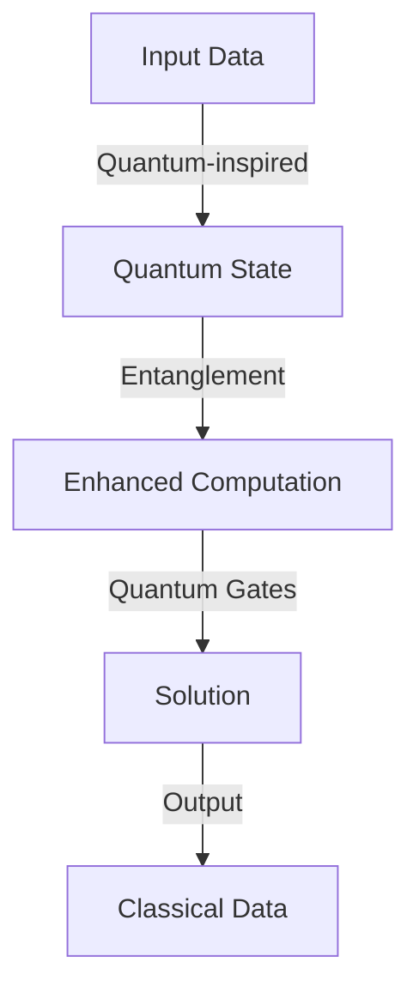

                 

Certainly, let's outline and draft the article step by step.

### Introduction to Quantum-Inspired Algorithms in AI Reasoning

#### Background and Significance

In recent years, quantum computing has been garnering significant attention due to its potential to revolutionize various fields, including artificial intelligence (AI) and machine learning. Quantum-inspired algorithms, which are based on quantum mechanics principles but can be implemented on classical computers, offer promising solutions for complex problems that are currently challenging for classical algorithms.

**Core Concepts and Terminology**

1. **Quantum Bits (qubits)**: Unlike classical bits, which can be in a state of 0 or 1, qubits can exist in a superposition of states. This property allows quantum computers to perform multiple computations simultaneously.
2. **Quantum Entanglement**: When qubits become entangled, the state of one qubit becomes dependent on the state of another, no matter the distance between them. This phenomenon is leveraged in quantum algorithms to enhance computational power.
3. **Quantum Gates**: These are operations that transform the state of qubits, similar to classical logic gates in digital circuits.

#### Problem Statement and Solution

The complexity of AI reasoning, particularly in scenarios involving large-scale data and high-dimensional spaces, has led to the exploration of quantum-inspired algorithms. These algorithms aim to leverage quantum-like properties to improve the efficiency and scalability of AI models.

**Boundary and Extension**

The boundary of quantum-inspired algorithms in AI reasoning is defined by the current limitations of quantum technology and the ability to implement these algorithms on classical hardware. The extension includes the potential integration of quantum computing with AI to create hybrid quantum-classical systems.

**Conceptual Architecture**

To illustrate the conceptual architecture of quantum-inspired algorithms in AI reasoning, we can use the following Mermaid diagram:

### Conclusion

In this section, we have introduced the fundamental concepts of quantum-inspired algorithms, their significance in AI reasoning, and the boundary and extension of their application. The following sections will delve deeper into the applications and evaluations of these algorithms.

### Keywords

- Quantum computing
- AI reasoning
- Quantum-inspired algorithms
- Quantum gates
- Entanglement

### Summary

This article provides an overview of quantum-inspired algorithms in AI reasoning, highlighting their core concepts, application potential, and evaluation methods. It sets the stage for a detailed exploration of these algorithms in the following sections.

