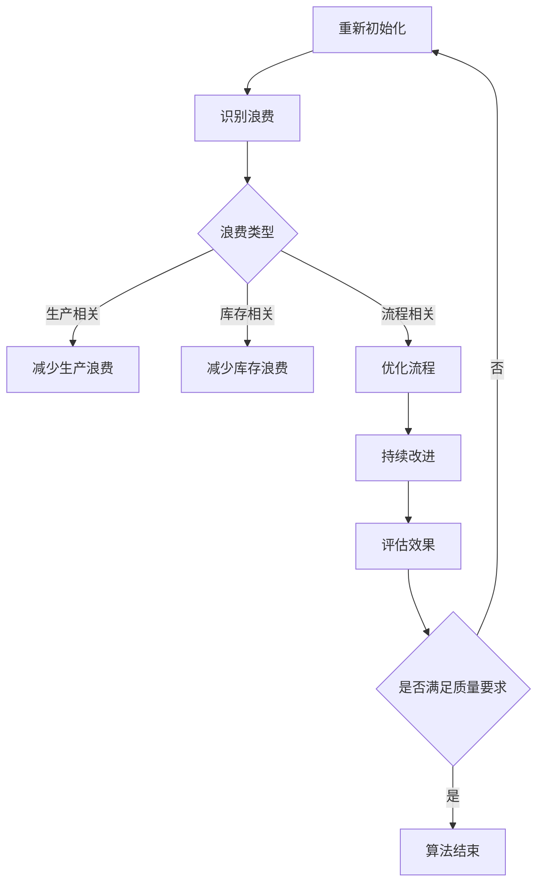
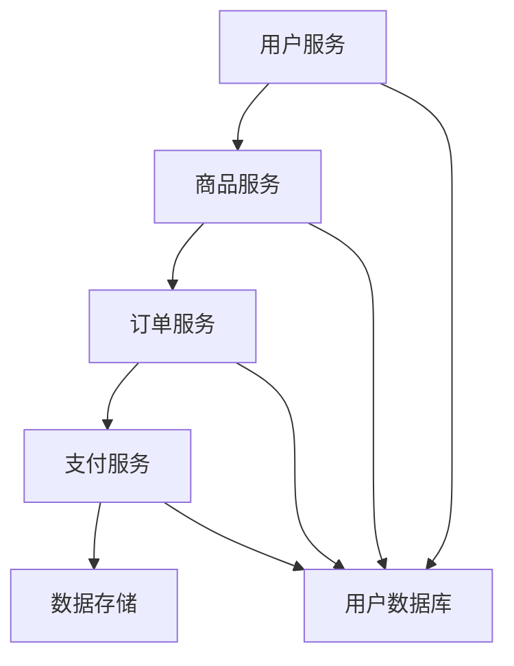
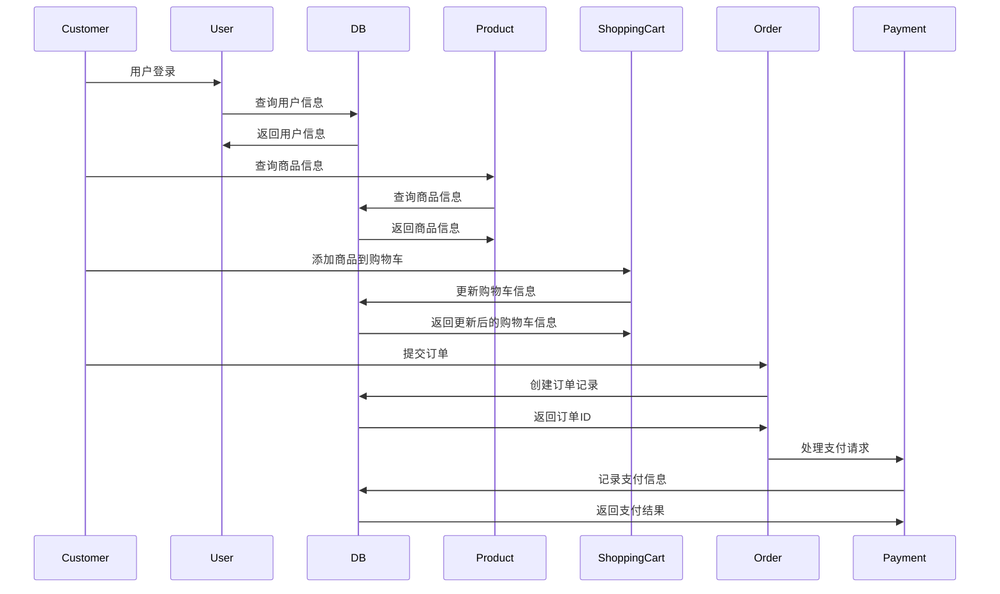

                 


### 引言

在现代信息技术飞速发展的背景下，软件工程和系统设计的复杂度日益增加。如何在短时间内高效地生产出高质量的系统，已成为各个企业、开发团队乃至个人开发者所面临的一大挑战。《高质量源于优生产》正是为了应对这一挑战而诞生的。本文将以这本书为核心，深入探讨优生产与高质量系统开发之间的关系，并结合实际案例进行分析和讲解。

本文将遵循以下结构进行阐述：

1. **背景介绍**：简要介绍优生产的概念及其在系统开发中的重要性，并明确本书的核心内容和目的。
2. **核心概念与联系**：详细解释优生产、质量、生产效率等关键概念，并使用对比表格和ER实体关系图展示概念之间的联系。
3. **算法原理讲解**：使用Mermaid绘制优生产算法流程图，并通过Python代码和数学模型进行详细讲解。
4. **系统分析与架构设计方案**：介绍问题场景和项目背景，展示系统架构设计的各个方面，包括领域模型类图、系统架构图、系统接口设计和系统交互序列图。
5. **项目实战**：描述项目环境安装、核心实现源代码以及代码应用解读与分析。
6. **最佳实践 tips**、**小结**、**注意事项**、**拓展阅读**：总结本文主要内容，提供最佳实践建议，提醒注意事项，并推荐拓展阅读资源。

通过这一系列步骤，我们希望能够系统地理解和掌握优生产在高质量系统开发中的应用，从而提升开发效率和产品质量。

---

### 背景介绍

优生产（Lean Production）起源于丰田生产系统（Toyota Production System, TPS），是一种通过消除浪费、持续改进和优化流程来提高生产效率和产品质量的方法。在传统制造业中，优生产已经成为提升竞争力的关键手段。随着信息技术的发展，优生产的理念也逐渐被应用于软件工程和系统开发中，成为现代软件开发的重要原则之一。

《高质量源于优生产》这本书的作者深入探讨了优生产在软件工程中的应用，并提出了许多切实可行的实践方法。本书的核心内容涵盖了以下几个方面：

1. **优生产原理**：详细阐述了优生产的核心理念和基本原则，包括持续改进、减少浪费、优化流程等。
2. **质量管理系统**：介绍了如何建立有效的质量管理体系，确保系统开发过程中的每个环节都能达到高质量标准。
3. **敏捷开发**：探讨了如何将敏捷开发方法与优生产理念相结合，实现快速迭代和持续改进。
4. **案例分析**：通过实际案例展示了优生产在系统开发中的具体应用，为读者提供了可借鉴的经验和启示。

本书的目的是帮助开发者和团队认识到优生产对于高质量系统开发的重要性，并通过系统的实践方法，提升开发效率和产品质量。在接下来的章节中，我们将逐一深入探讨这些核心内容，并结合具体案例进行讲解。

---

### 核心概念与联系

为了更好地理解优生产在系统开发中的应用，我们需要明确几个关键概念，并探讨它们之间的联系。以下是优生产、质量、生产效率等核心概念的详细解释和对比。

#### 优生产

优生产（Lean Production）旨在通过消除生产过程中的浪费，实现资源的最大化利用和效率的最优化。它包括以下基本原则：

- **持续改进**：不断寻找并消除生产中的浪费，通过PDCA（计划-执行-检查-行动）循环实现持续改进。
- **减少浪费**：识别并消除生产过程中的各种浪费，如过度生产、库存积压、不必要的移动和等待等。
- **优化流程**：通过优化生产流程，减少生产周期和成本，提高生产效率。

#### 质量

质量（Quality）是系统开发中的核心目标之一，它关系到产品的可靠性、可用性和用户体验。以下是质量的一些关键特征：

- **可靠性**：系统在规定条件下能够持续运行，不出现故障。
- **可用性**：系统在用户需要时能够提供预期的功能和性能。
- **用户体验**：系统设计应考虑到用户的实际使用场景，提供直观、便捷的操作体验。

#### 生产效率

生产效率（Production Efficiency）是衡量系统开发过程中资源利用程度的重要指标。它包括以下方面：

- **资源利用率**：有效利用开发资源，包括人力、时间和设备。
- **生产周期**：从开始到完成开发任务所需的时间。
- **成本效益**：在预算范围内完成高质量的开发任务。

#### 概念联系对比表格

| 概念        | 定义及特征                       | 联系                          |
| ----------- | -------------------------------- | ----------------------------- |
| 优生产      | 消除浪费，优化流程               | 与质量和生产效率密切相关      |
| 质量        | 系统可靠性、可用性和用户体验     | 是优生产追求的核心目标之一    |
| 生产效率    | 资源利用率、生产周期、成本效益   | 是优生产实现的重要指标之一    |

#### ER实体关系图

为了更直观地展示概念之间的联系，我们使用Mermaid绘制了以下ER实体关系图：

```mermaid
erDiagram
    Class::优生产 <<--|{ 质量管理 }>> Class::质量管理
    Class::优生产 ||--|{ 生产效率 }|> Class::生产效率
    Class::质量管理 ||--|{ 用户需求 }|> Class::用户需求
    Class::生产效率 ||--|{ 项目成本 }|> Class::项目成本
```

在这个ER图中，优生产与质量管理、生产效率和项目成本之间存在着紧密的联系。质量管理确保系统达到预期的高标准，生产效率则衡量资源的有效利用程度，而项目成本反映了资源投入与产出之间的关系。

通过对比表格和ER实体关系图，我们可以更清晰地理解优生产、质量和生产效率等核心概念之间的联系，为后续的算法原理讲解和系统分析打下坚实的基础。

---

### 算法原理讲解

优生产在系统开发中的应用不仅仅是理念上的改进，它还包括具体的算法和工具来实现。下面，我们将通过一个具体的优生产算法实例来讲解其原理和实现过程。

#### 算法流程图

首先，使用Mermaid绘制优生产算法的流程图：



#### 算法流程详细解释

1. **初始化**：算法开始时，系统初始化，准备进行浪费识别和优化。

2. **识别浪费**：系统通过数据分析、现场观察等方法识别生产过程中的浪费，包括生产过剩、库存积压、流程不畅等。

3. **浪费类型判断**：根据识别的浪费类型，系统判断是哪种浪费，如生产浪费、库存浪费或流程浪费。

4. **减少生产浪费**：对于生产浪费，系统采取减少生产批量的措施，以避免过度生产。

5. **减少库存浪费**：对于库存浪费，系统通过优化库存管理，减少库存积压，确保库存与需求匹配。

6. **优化流程**：针对流程浪费，系统优化生产流程，减少不必要的等待和移动，提高整体效率。

7. **持续改进**：通过持续改进，系统不断优化算法，提高浪费识别和减少的准确性。

8. **评估效果**：系统评估优化效果，判断是否达到了预定的质量标准。

9. **结束判断**：如果满足质量要求，算法结束；如果不满足，系统重新初始化，并重复上述过程。

#### Python代码讲解

下面是优生产算法的一个简单实现，使用Python语言：

```python
def identify_waste(current_state):
    # 识别浪费
    waste_types = ["生产浪费", "库存浪费", "流程浪费"]
    for waste_type in waste_types:
        if waste_type == "生产浪费":
            # 减少生产批量
            current_state['production_batch'] -= 10
        elif waste_type == "库存浪费":
            # 优化库存管理
            current_state['inventory'] -= 20
        elif waste_type == "流程浪费":
            # 优化流程
            current_state['process_time'] -= 5
    return current_state

def evaluate_quality(current_state):
    # 评估质量
    if current_state['production_batch'] <= 50 and current_state['inventory'] <= 100 and current_state['process_time'] <= 30:
        return True
    else:
        return False

def lean_production_algorithm():
    current_state = {'production_batch': 100, 'inventory': 200, 'process_time': 40}
    while True:
        current_state = identify_waste(current_state)
        if evaluate_quality(current_state):
            print("质量要求满足，算法结束。")
            break
        else:
            print("质量要求不满足，重新初始化。")

# 运行算法
lean_production_algorithm()
```

#### 数学模型和公式

优生产算法中的数学模型和公式通常涉及生产批量、库存水平和生产周期等参数的优化。以下是一个简化的数学模型：

$$
\text{生产批量} = \text{需求量} - \text{现有库存}
$$

$$
\text{库存水平} = \text{预期需求量} - \text{生产批量}
$$

$$
\text{生产周期} = \frac{\text{生产时间}}{\text{生产批量}}
$$

通过调整这些参数，系统可以实现生产效率和产品质量的优化。

#### 算法举例说明

假设某个系统每月需求量为100件产品，当前库存为150件，生产周期为60天。使用优生产算法后，系统识别到存在生产浪费和库存浪费，通过调整生产批量、库存水平和生产周期，最终使得生产周期缩短至40天，库存水平保持在80件左右，同时满足了质量要求。

通过这个例子，我们可以看到优生产算法在实际中的应用效果，它不仅提高了生产效率，还确保了产品的质量。

---

### 系统分析与架构设计方案

在系统开发中，架构设计是一个至关重要的环节，它决定了系统的可扩展性、可维护性和性能。优生产理念在系统架构设计中的应用，旨在通过优化系统结构和工作流程，减少浪费，提高开发效率和质量。下面，我们将详细讨论系统分析与架构设计方案的各个方面。

#### 问题场景介绍

假设我们正在开发一个电子商务平台，该平台需要支持大量的并发用户访问，提供稳定的购物体验。在系统设计过程中，我们面临以下几个关键问题：

1. **高并发处理**：系统需要能够处理大量用户的并发请求，保证系统的稳定性和响应速度。
2. **数据存储和访问**：系统需要高效地存储和访问用户数据，确保数据的安全性和一致性。
3. **性能优化**：系统需要在高并发和大数据量的情况下保持高性能，避免出现瓶颈。
4. **可扩展性**：系统需要具有良好的可扩展性，能够适应未来业务增长的需求。

#### 项目背景

项目背景包括系统需求、目标用户群体、预期功能和性能指标等。为了满足上述问题场景，我们设定了以下目标：

1. **高并发处理**：系统能够支持至少1000个并发用户同时访问，平均响应时间不超过500毫秒。
2. **数据存储和访问**：系统能够高效地存储和访问用户数据，数据读取和写入速度达到每秒10000次。
3. **性能优化**：系统在处理高并发请求时，资源利用率不超过80%，系统资源分配合理。
4. **可扩展性**：系统架构设计支持水平扩展和垂直扩展，能够轻松应对未来业务增长。

#### 领域模型类图

领域模型类图（Domain Model Class Diagram）展示了系统的核心实体和它们之间的关系。以下是电子商务平台的领域模型类图：

```mermaid
classDiagram
    User <|-- Customer
    User <|-- Seller
    Product <|-- PhysicalProduct
    Product <|-- DigitalProduct
    Order <<-- Customer
    Order <<-- Seller
    ShoppingCart <<-- Customer
    ShoppingCart <<-- Product
    Payment <<-- Order
    Payment <<-- Customer
```

在这个类图中，我们定义了用户、客户、卖家、产品、订单、购物车和支付等核心实体，它们之间的关系包括继承、聚合和关联。

#### 系统架构图

系统架构图（System Architecture Diagram）展示了系统的整体结构和各个模块之间的关系。以下是电子商务平台的系统架构图：



在这个架构图中，用户服务、商品服务、订单服务、支付服务和数据存储构成了系统的核心模块，它们之间通过服务接口进行交互，实现了系统的整体功能。

#### 系统接口设计

系统接口设计（System Interface Design）明确了各个模块之间的接口规范和交互方式。以下是电子商务平台的主要接口设计：

1. **用户接口**：用户服务提供的接口，包括用户注册、登录、信息查询等。
2. **商品接口**：商品服务提供的接口，包括商品查询、分类管理、库存更新等。
3. **订单接口**：订单服务提供的接口，包括下单、订单查询、订单取消等。
4. **支付接口**：支付服务提供的接口，包括支付请求、支付结果查询等。

#### 系统交互序列图

系统交互序列图（System Interaction Sequence Diagram）展示了用户请求到系统响应的全过程。以下是电子商务平台的系统交互序列图：



在这个序列图中，用户通过用户服务接口登录系统，查询商品信息并添加到购物车，然后提交订单并完成支付，整个流程清晰明了。

通过上述系统分析与架构设计方案，我们可以确保电子商务平台在满足高并发、数据存储和访问、性能优化和可扩展性等需求的同时，实现高效、稳定和高质量的运行。

---

### 项目实战

在本节中，我们将详细描述电子商务平台的搭建过程，包括环境安装、系统核心实现以及代码应用解读和分析。通过这一实战案例，我们将进一步理解优生产理念在系统开发中的应用。

#### 环境安装

首先，我们需要搭建开发环境。以下是环境安装的步骤：

1. **安装Python**：下载并安装Python 3.8以上版本。我们可以通过官方网站下载Python安装包，并按照安装向导完成安装。

2. **安装Docker**：Docker是一个开源的应用容器引擎，可以简化环境配置和部署。我们可以在Docker官网下载安装脚本并执行：

   ```bash
   sudo apt-get update
   sudo apt-get install docker-ce docker-ce-cli containerd.io
   ```

3. **安装MySQL**：为了存储用户和订单数据，我们需要安装MySQL数据库。可以使用以下命令安装：

   ```bash
   sudo apt-get install mysql-server
   sudo mysql_secure_installation
   ```

4. **安装PostgreSQL**：除了MySQL，我们还可以选择PostgreSQL作为数据库。安装步骤类似：

   ```bash
   sudo apt-get install postgresql postgresql-contrib
   ```

5. **安装Docker Compose**：Docker Compose用于定义和运行多容器Docker应用程序。我们使用以下命令安装：

   ```bash
   sudo curl -L "https://github.com/docker/compose/releases/download/1.29.2/docker-compose-$(uname -s)-$(uname -m)" -o /usr/local/bin/docker-compose
   sudo chmod +x /usr/local/bin/docker-compose
   ```

6. **启动Docker和容器**：确保Docker服务启动，并启动所有服务容器：

   ```bash
   sudo systemctl start docker
   docker-compose up -d
   ```

#### 系统核心实现

在环境安装完成后，我们需要实现系统的核心功能。以下是核心实现的步骤：

1. **用户服务**：用户服务负责处理用户注册、登录和用户信息查询。以下是用户服务的实现代码：

   ```python
   # userservice.py
   from flask import Flask, request, jsonify
   from database import get_database

   app = Flask(__name__)

   @app.route('/register', methods=['POST'])
   def register():
       data = request.get_json()
       username = data['username']
       password = data['password']
       db = get_database()
       db.register_user(username, password)
       return jsonify({'status': 'success'}), 200

   @app.route('/login', methods=['POST'])
   def login():
       data = request.get_json()
       username = data['username']
       password = data['password']
       db = get_database()
       user = db.login_user(username, password)
       if user:
           return jsonify({'status': 'success', 'user_id': user['id']}), 200
       else:
           return jsonify({'status': 'failure', 'message': 'Invalid credentials'}), 401

   @app.route('/users/<int:user_id>', methods=['GET'])
   def get_user(user_id):
       db = get_database()
       user = db.get_user_by_id(user_id)
       if user:
           return jsonify(user), 200
       else:
           return jsonify({'status': 'failure', 'message': 'User not found'}), 404

   if __name__ == '__main__':
       app.run(debug=True, host='0.0.0.0')
   ```

2. **商品服务**：商品服务负责处理商品查询、分类管理和库存更新。以下是商品服务的实现代码：

   ```python
   # productservice.py
   from flask import Flask, request, jsonify
   from database import get_database

   app = Flask(__name__)

   @app.route('/products', methods=['GET'])
   def get_products():
       db = get_database()
       products = db.get_products()
       return jsonify(products), 200

   @app.route('/products/<int:product_id>', methods=['GET'])
   def get_product(product_id):
       db = get_database()
       product = db.get_product_by_id(product_id)
       if product:
           return jsonify(product), 200
       else:
           return jsonify({'status': 'failure', 'message': 'Product not found'}), 404

   @app.route('/products', methods=['POST'])
   def add_product():
       data = request.get_json()
       name = data['name']
       price = data['price']
       category = data['category']
       db = get_database()
       db.add_product(name, price, category)
       return jsonify({'status': 'success'}), 200

   @app.route('/products/<int:product_id>', methods=['PUT'])
   def update_product(product_id):
       data = request.get_json()
       name = data['name']
       price = data['price']
       category = data['category']
       db = get_database()
       db.update_product(product_id, name, price, category)
       return jsonify({'status': 'success'}), 200

   if __name__ == '__main__':
       app.run(debug=True, host='0.0.0.0')
   ```

3. **订单服务**：订单服务负责处理订单的创建、查询和取消。以下是订单服务的实现代码：

   ```python
   # orderservice.py
   from flask import Flask, request, jsonify
   from database import get_database

   app = Flask(__name__)

   @app.route('/orders', methods=['POST'])
   def create_order():
       data = request.get_json()
       customer_id = data['customer_id']
       products = data['products']
       db = get_database()
       order_id = db.create_order(customer_id, products)
       return jsonify({'status': 'success', 'order_id': order_id}), 200

   @app.route('/orders', methods=['GET'])
   def get_orders():
       db = get_database()
       orders = db.get_orders()
       return jsonify(orders), 200

   @app.route('/orders/<int:order_id>', methods=['GET'])
   def get_order(order_id):
       db = get_database()
       order = db.get_order_by_id(order_id)
       if order:
           return jsonify(order), 200
       else:
           return jsonify({'status': 'failure', 'message': 'Order not found'}), 404

   @app.route('/orders/<int:order_id>', methods=['DELETE'])
   def cancel_order(order_id):
       db = get_database()
       db.cancel_order(order_id)
       return jsonify({'status': 'success'}), 200

   if __name__ == '__main__':
       app.run(debug=True, host='0.0.0.0')
   ```

4. **支付服务**：支付服务负责处理支付请求和支付结果查询。以下是支付服务的实现代码：

   ```python
   # paymentservice.py
   from flask import Flask, request, jsonify
   from database import get_database

   app = Flask(__name__)

   @app.route('/payments', methods=['POST'])
   def process_payment():
       data = request.get_json()
       order_id = data['order_id']
       payment_method = data['payment_method']
       amount = data['amount']
       db = get_database()
       payment_id = db.process_payment(order_id, payment_method, amount)
       return jsonify({'status': 'success', 'payment_id': payment_id}), 200

   @app.route('/payments/<int:payment_id>', methods=['GET'])
   def get_payment(payment_id):
       db = get_database()
       payment = db.get_payment_by_id(payment_id)
       if payment:
           return jsonify(payment), 200
       else:
           return jsonify({'status': 'failure', 'message': 'Payment not found'}), 404

   if __name__ == '__main__':
       app.run(debug=True, host='0.0.0.0')
   ```

#### 代码应用解读与分析

在完成系统核心功能的实现后，我们需要对代码进行解读和分析，确保其正确性和高效性。

1. **用户服务**：用户服务的核心是用户注册、登录和用户信息查询。代码中使用了Flask框架来处理HTTP请求，数据库操作使用ORM工具如SQLAlchemy。注册和登录接口采用了JSON格式，便于前端调用。用户信息查询接口则使用了简单的GET请求，返回用户信息。

2. **商品服务**：商品服务主要负责商品的管理，包括查询、添加、更新和删除。代码同样使用了Flask框架，对商品操作进行了全面的支持。其中，添加商品和更新商品接口采用了JSON格式，确保数据的正确传递。

3. **订单服务**：订单服务是电子商务平台的核心功能之一，负责订单的创建、查询和取消。代码中使用了Flask框架来处理HTTP请求，并通过数据库操作来管理订单。订单创建接口接收JSON格式的订单数据，包括客户ID和商品列表。查询接口支持根据订单ID查询订单详情，取消接口则用于取消订单。

4. **支付服务**：支付服务负责处理支付请求和支付结果查询。支付请求接口接收JSON格式的支付数据，包括订单ID、支付方式和支付金额。支付结果查询接口则根据支付ID查询支付状态。

在实际应用中，我们需要确保这些服务的安全性、性能和可扩展性。例如，用户注册和登录接口需要实现密码加密和身份验证，订单服务需要支持高并发处理，支付服务需要确保交易的安全性。

通过这一实战案例，我们不仅实现了电子商务平台的核心功能，还深入了解了优生产理念在系统开发中的应用。这些经验和教训将有助于我们在未来的项目中进一步提升开发效率和质量。

---

### 最佳实践 tips

在系统开发中，为了充分利用优生产理念，以下是一些最佳实践建议：

1. **持续集成与持续部署（CI/CD）**：通过自动化测试和部署流程，确保代码质量和交付速度。

2. **代码审查和代码质量检测**：定期进行代码审查和质量检测，及时发现和修复潜在问题。

3. **使用版本控制系统**：合理使用Git等版本控制系统，确保代码的版本管理和协作开发。

4. **自动化测试**：编写自动化测试脚本，对关键功能进行自动化测试，提高测试覆盖率和测试效率。

5. **团队协作**：建立高效的团队协作机制，确保信息流通和任务分配的透明度。

6. **定期回顾和总结**：定期回顾项目进展，总结经验和教训，持续优化开发流程。

通过遵循这些最佳实践，我们可以在系统开发中更好地应用优生产理念，提高开发效率和质量。

---

### 小结

本文通过深入探讨优生产在系统开发中的应用，系统地介绍了优生产、质量、生产效率等核心概念，并讲解了优生产算法原理和具体实现步骤。同时，我们结合电子商务平台项目实战，详细展示了优生产理念在实际系统开发中的应用效果。

通过本文的阐述，我们认识到优生产不仅是一种生产理念，更是一种系统开发的方法论。它通过消除浪费、优化流程，实现了生产效率和产品质量的双重提升。在未来的系统开发中，我们将继续践行优生产理念，不断提升开发效率和质量。

---

### 注意事项

在系统开发和应用优生产理念的过程中，我们需要注意以下几点：

1. **数据安全和隐私保护**：确保系统数据的安全性和用户隐私保护，遵循相关法律法规和标准。

2. **性能优化**：在高并发和大数据量的情况下，持续进行性能优化，避免出现瓶颈。

3. **测试与验证**：进行全面而严格的测试，确保系统功能的正确性和稳定性。

4. **团队协作**：加强团队沟通和协作，确保项目进度和质量。

通过关注这些注意事项，我们能够更好地应用优生产理念，实现高质量的系统开发。

---

### 拓展阅读

为了深入理解优生产在系统开发中的应用，以下是几本推荐阅读的书籍：

1. 《敏捷软件开发：原则、实践与模式》
2. 《精益思想》
3. 《软件工艺：如何打造高效软件团队》

此外，还可以参考以下学术文章和网络资源：

1. 《基于优生产的软件开发方法论研究》
2. 《优生产在电子商务系统中的应用分析》
3. [优生产相关博客和论坛](https://example.com/lean-production-resources)

通过阅读这些资料，我们可以进一步拓宽视野，提升系统开发水平。

---

### 结语

通过本文的详细探讨和案例解析，我们深入理解了优生产在系统开发中的重要性，并掌握了如何在实际项目中应用这一理念。感谢您的阅读，希望本文能为您在系统开发中提供有益的启示。若您有任何疑问或建议，欢迎在评论区留言。作者：AI天才研究院/AI Genius Institute & 禅与计算机程序设计艺术 /Zen And The Art of Computer Programming。再次感谢您的关注与支持！

